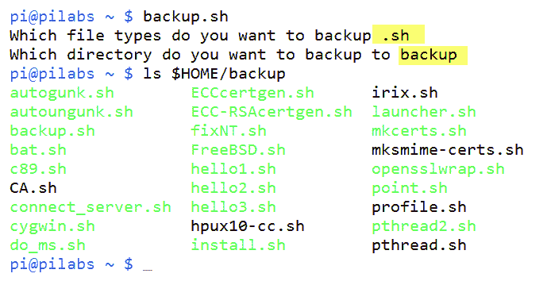

# 创建交互式脚本

在第一章，*Bash 脚本的是什么以及为什么要使用*，我们学习了如何创建脚本并使用其中的一些基本元素。这些包括可选参数，我们可以在脚本执行时传递给脚本。在本章中，我们将通过使用 shell 的内置`read`命令来扩展这一点，以允许交互式脚本。交互式脚本是在脚本执行过程中提示输入信息的脚本。

在本章中，我们将讨论以下主题：

+   使用选项的`echo`

+   使用`read`的基本脚本

+   脚本注释

+   使用`read`提示增强读取脚本

+   限制输入字符的数量

+   控制输入文本的可见性

+   传递选项

+   读取选项值

+   尝试遵循标准

+   使用简单脚本增强学习

# 技术要求

本章的源代码可以从这里下载：

[`github.com/PacktPublishing/Mastering-Linux-Shell-Scripting-Second-Edition/tree/master/Chapter02`](https://github.com/PacktPublishing/Mastering-Linux-Shell-Scripting-Second-Edition/tree/master/Chapter02)

# 使用带选项的`echo`

到目前为止，在本书中我们已经看到`echo`命令非常有用，并且将被用于许多我们的脚本中，如果不是所有脚本的话。在运行`echo`命令时，除非我们声明文件的完整路径，否则将使用内置命令。我们可以通过以下命令来测试这一点：

```
$ which echo
```

要获取内置命令的帮助，我们可以使用`man bash`并搜索`echo`；然而，`echo`命令与内部命令是相同的，因此我们建议在大多数情况下使用`man echo`来显示命令选项。

到目前为止，我们看到的`echo`基本用法将产生文本输出和新行。这通常是期望的响应，因此我们无需担心下一个提示会附加到回显文本的末尾。新行将脚本输出与下一个 shell 提示分开。如果我们没有提供任何文本字符串进行打印，`echo`将只打印新行到`STDOUT`。我们可以通过以下命令在命令行中直接测试这一点。我们不需要在脚本中运行`echo`或实际上任何其他命令。要从命令行运行`echo`，我们只需输入如下命令：

```
$ echo
```

输出将显示命令与后续提示之间的明显新行。我们可以在下面的截图中看到这一点：


如果我们想抑制换行符，特别是在提示用户时非常有用，我们可以通过以下两种方式借助`echo`来实现：

```
$ echo -n "Which directory do you want to use? "
$ echo -e "Which directory do you want to use? \c"
```

结果将会抑制换行符。在初始示例中，使用了`-n`选项来抑制换行符。第二个示例使用了更通用的`-e`选项，它允许在文本字符串中添加转义序列。为了在同一行继续，我们使用`\c`作为转义序列。

作为脚本的最终部分，或者在命令行中运行时，这看起来并不好，因为命令提示符会跟随显示。以下截图展示了这一点：


# 使用 `read` 的基本脚本

当作为一个提示用户输入的脚本的一部分时，抑制换行正是我们想要的效果。我们将从将现有的 `hello2.sh` 脚本复制到 `hello3.sh` 开始，并构建一个交互式脚本。最初，我们将使用 `echo` 作为提示机制，但随着脚本逐渐增强，我们将直接通过 shell 内置的 `read` 命令生成提示：

```
$ cp $HOME/bin/hello2.sh $HOME/bin/hello3.sh
$ chmod +x $HOME/bin/hello3.sh
```

编辑 `$HOME/bin/hello3.sh` 脚本，使其内容如下：

```
#!/bin/bash
echo -n "Hello $(basename $0)! May I ask your name: "
read
echo "Hello $REPLY"
exit 0
```

在执行脚本时，我们将会看到问候语并提示输入用户输入的内容。这是通过 `echo` 语句中的 `$REPLY` 变量回显的。由于我们尚未为 `read` 内置命令提供变量名，因此使用默认的 `$REPLY` 变量。脚本的执行和输出如下图所示。请花些时间在你的系统上实践这个脚本。


这一小步让我们走了很远，这样的脚本有很多用途；我们都曾使用过在安装过程中提示选项和目录的安装脚本。我们接受它仍然非常简单，但随着我们深入这一章节，我们将逐步接近一些更有用的脚本。

# 脚本注释

我们应该始终在脚本的早期加入注释。脚本注释以 `#` 符号开始。`#` 符号后面的内容是注释，脚本不会对其进行求值。Shebang `#!/bin/bash` 主要是一个注释，因此不会被 shell 求值。运行脚本的 shell 会读取整个 shebang，这样它就知道应该将脚本交给哪个命令解释器。注释可以位于行的开头，也可以在行中间。Shell 脚本没有多行注释的概念。

如果你还不熟悉注释，请注意它们是添加到脚本中的，用来描述谁编写了脚本，脚本何时编写和最后更新，以及脚本的作用。它们是脚本的元数据。

以下是脚本中注释的示例：

```
#!/bin/bash
# Welcome to bash scripting
# Author: Mokhtar
# Date: 1/5/2018
```

良好的实践是注释代码，并添加解释代码作用和原因的注释。这将帮助你和你的同事在日后编辑脚本时理解它。

# 通过 `read` 提示增强脚本

我们已经看到如何使用内置的 `read` 来填充变量。到目前为止，我们使用 `echo` 来产生提示，但这可以通过 `-p` 选项传递给 `read` 本身。`read` 命令将会抑制额外的换行符，从而在一定程度上减少了行数和复杂性。

我们可以直接在命令行上测试这一点。尝试输入以下命令来查看 `read` 的实际效果：

```
$ read -p "Enter your name: " name
```

我们使用带有`-p`选项的`read`命令。选项后面的参数是提示符中出现的文本。通常，我们会确保文本的末尾有一个空格，以便清楚地看到我们输入的内容。这里提供的最后一个参数是我们想要填充的变量，我们简单地称之为 name。变量也是区分大小写的。即使我们没有提供最后一个参数，我们仍然可以存储用户的响应，但这时它会存储在`REPLY`变量中。

当我们返回一个变量的值时，我们使用`$`，但在写入时不使用。简单来说，当读取一个变量时，我们使用`$VAR`，而设置一个变量时，我们写作`VAR=value`。

使用`-p`选项的`read`命令的语法如下：

```
read -p <prompt> <variable name>
```

我们可以编辑脚本，使其看起来类似于`hello3.sh`中的以下摘录：

```
#!/bin/bash
read -p "May I ask your name: " name
echo "Hello $name"
exit 0
```

`read`提示符不能在消息字符串中执行命令，如我们之前使用的那些命令。

# 限制输入的字符数

在我们至今使用的脚本中并未需要此功能，但我们可能需要要求用户按任意键继续。目前，我们的设置方式是，在按下*Enter*键之前，变量并不会被填充。用户必须按*Enter*键才能继续。如果我们使用`-n`选项后跟一个整数，我们可以指定在继续之前接受的字符数；在这种情况下，我们将设置为`1`。请看以下代码摘录：

```
#!/bin/bash
read -p "May I ask your name: " name
echo "Hello $name"
read -n1 -p "Press any key to exit"
echo
exit 0
```

现在，脚本在显示名字后将暂停，直到我们按下任意键；我们可以按任何键继续，因为我们只接受一个按键输入，而之前我们必须保持默认行为，因为我们无法知道输入的名字有多长。我们必须等用户按下*Enter*键。

我们在这里添加了一个额外的 echo 命令，以确保脚本结束前会输出一个新行。这确保了 shell 提示符会在新的一行开始。

# 控制输入文本的可见性

即使我们将输入限制为单个字符，我们仍然能看到屏幕上的文本。同样地，如果我们输入名字，在按下*Enter*键之前我们可以看到输入的文本。在这种情况下，它只是显得不整洁，但如果我们输入的是敏感数据，如 PIN 码或密码，我们应该隐藏文本。我们可以使用静默选项，或者`-s`，来实现这一点。脚本中的简单编辑将完成这一设置：

```
#!/bin/bash
read -p "May I ask your name: " name
echo "Hello $name"
read -sn1 -p "Press any key to exit"
echo
exit 0
```

现在，当我们按键继续时，文本将不会显示在屏幕上。我们可以在以下截图中看到脚本的行为：


# 传递选项

到目前为止，我们在第一章中学习了如何从用户那里读取参数。此外，你还可以传递选项。那么，什么是选项？它们与参数有何不同？

选项是带有单一破折号的字符。

看这个例子：

```
$ ./script1.sh -a
```

`-a` 是一个选项。你可以在脚本中检查用户是否输入了这个选项；如果是，你的脚本可以根据这个选项执行某些操作。

你可以传递多个选项：

```
$ ./script1.sh -a -b -c
```

要打印这些选项，可以使用 `$1`、`$2` 和 `$3` 变量：

```
#!/bin/bash
echo $1
echo $2
echo $3
```


我们应该检查这些选项，但由于我们还没有讨论条件语句，所以暂时保持简单。

选项可以像这样传递值：

```
$ ./script1.sh -a -b 20 -c
```

这里，`-b` 选项被传递，并且它的值是 `20`。


如你所见，变量 `$3=20`，这是传入的值。

这可能不符合你的要求。你需要 `$2=-b` 和 `$3=-c`。

我们将使用一些条件语句来确保这些选项正确。

```
#!/bin/bash
while [ -n "$1" ]
do
case "$1" in
-a) echo "-a option used" ;;
-b) echo "-b option used" ;;
-c) echo "-c option used" ;;
*) echo "Option $1 not an option" ;;
esac
shift
done
```

如果你不了解 `while` 循环，没关系；我们将在接下来的章节详细讨论条件语句。

`shift` 命令将选项向左移动一步。

所以，如果我们有三个选项或参数，并且使用 `shift` 命令：

+   `$3` 变成了 `$2`

+   `$2` 变成了 `$1`

+   `$1` 被丢弃

这就像是在使用 `while` 循环遍历选项时，向前移动的一个动作。

所以，在第一次循环中，`$1` 会是第一个选项。选项移动后，`$1` 将是第二个选项，以此类推。

如果你尝试前面的代码，你会注意到它仍然没有正确识别选项的值。别担心，解决方案马上就来，稍等一下。

# 传递带有选项的参数

要同时传递参数和选项，你必须用双破折号分隔它们，像这样：

```
$ ./script1.sh -a -b -c -- p1 p2 p3
```

使用前面提到的技术，我们可以遍历选项直到遇到双破折号，然后我们将遍历参数：

```
#!/bin/bash
while [ -n "$1" ]
do
case "$1" in
-a) echo "-a option found" ;;
-b) echo "-b option found";;
-c) echo "-c option found" ;;
--) shift
break ;;
*) echo "Option $1 not an option";;
esac
shift
done
#iteration over options is finished here.
#iteration over parameters started.
num=1
for param in $@
do
echo "#$num: $param"
num=$(( $num + 1 ))
done
```

现在，如果我们将其与参数和选项一起运行，我们应该能看到选项列表和另一个参数列表：

```
$ ./script1.sh -a -b -c -- p1 p2 p3
```


如你所见，双破折号后传递的任何内容都会被视为参数。

# 读取选项值

我们已经看到了如何识别选项和参数，但我们仍然需要一种正确读取选项值的方法。

你可能需要为特定选项传递一个值。如何读取这个值呢？

我们将在迭代过程中检查 `$2` 变量，针对我们期望有值的选项。

看一下以下代码：

```
#!/bin/bash
while [ -n "$1" ]
do
case "$1" in
-a) echo "-a option passed";;
-b) param="$2"
echo "-b option passed, with value $param"
shift ;;
-c) echo "-c option passed";;
--) shift
break ;;
*) echo "Option $1 not an option";;
esac
shift
done
num=1
for param in "$@"
do
echo "#$num: $param"
num=$(( $num + 1 ))
done
```


现在看起来不错；你的脚本已经能够识别选项和第二个选项的传递值。

有一个内建选项可以让用户获取选项，即使用 `getopt` 函数。

不幸的是，`getopt` 不支持多字符选项。

有一个非内建程序叫做 `getopt`，它支持多于一个字符的选项，但再次强调，macOS X 版本不支持长选项。

无论如何，如果你想了解更多关于 `getopt` 的使用方法，可以参考本章后面的进一步阅读资源。

# 尝试保持标准

你可以使用来自 GitHub 的 bash 脚本，并且你可能会注意到，遵循了一种标准的选项方案。虽然这不是强制性的，但这是推荐的做法。

这些是一些常用的选项：

+   `-a`: 列出所有项目

+   `-c`: 获取所有项目的数量

+   `-d`: 输出目录

+   `-e`: 展开项目

+   `-f`: 指定文件

+   `-h`: 显示帮助页面

+   `-i`: 忽略字符大小写

+   `-l`: 列出文本

+   `-o`: 将输出发送到文件

+   `-q`: 保持静默模式；不询问用户

+   `-r`: 递归处理某些内容

+   `-s`: 使用隐身模式

+   `-v`: 使用详细模式

+   `-x`: 指定可执行文件

+   `-y`: 无需提示直接接受

# 使用简单脚本增强学习

我们的脚本仍然有些简单，我们还没有学习如何使用条件语句来测试正确的输入，但让我们来看一些我们可以构建的具有某些功能的简单脚本。

# 使用脚本备份

现在我们已经创建了一些脚本，可能希望将它们备份到其他位置。如果我们创建一个提示脚本，便可以选择我们想要备份的位置和文件类型。

以下是你第一次练习时可以使用的脚本。创建该脚本并命名为`$HOME/backup.sh`：

```
#!/bin/bash
# Author: @theurbanpenguin
# Web: www.theurbapenguin.com
# Script to prompt to back up files and location
# The files will be search on from the user's home
# directory and can only be backed up to a directory
# within $HOME
# Last Edited: July 4 2015
read -p "Which file types do you want to backup " file_suffix
read -p "Which directory do you want to backup to " dir_name
# The next lines creates the directory if it does not exist
test -d $HOME/$dir_name || mkdir -m 700 $HOME/$dir_name
# The find command will copy files the match the
# search criteria ie .sh . The -path, -prune and -o
# options are to exclude the backdirectory from the
# backup.
find $HOME -path $HOME/$dir_name -prune -o \
-name "*$file_suffix" -exec cp {} $HOME/$dir_name/ \;
exit 0
```

你会看到该文件有注释；虽然是黑白显示，但可读性稍有困难。如果你有本书的电子版，你应该能看到以下截图中的彩色内容：


在脚本运行时，你可以选择`.sh`作为备份的文件类型，`backup`作为备份目录。脚本执行过程如下截图所示，并列出了目录：



现在你可以看到，我们可以开始使用简单的脚本创建有意义的脚本；尽管我们强烈建议，如果这个脚本用于个人以外的用途，应该添加用户输入的错误检查。随着我们继续深入书籍内容，我们将涉及到这一点。

# 连接到服务器

让我们来看一些可以用来连接到服务器的实用脚本。首先，我们将查看 ping 命令，接下来的脚本则会提示输入 SSH 凭证。

# 版本 1 – ping

这是我们都能做的事情，因为不需要特殊服务。这将简化`ping`命令，尤其对于那些可能不熟悉该命令细节的控制台用户。该命令会对服务器进行三次 ping，而不是通常的无限次。如果服务器正常，则没有输出；如果服务器失败，则显示`server dead`。请创建以下脚本并命名为`$HOME/bin/ping_server.sh`：

```
#!/bin/bash
# Author: @theurbanpenguin
# Web: www.theurbapenguin.com
# Script to ping a server
# Last Edited: July 4 2015
read -p "Which server should be pinged " server_addr
ping -c3 $server_addr 2>1 > /dev/null || echo "Server Dead"
```

以下截图展示了成功和失败的输出：


# 版本 2 – SSH

通常 SSH 已经在服务器上安装并运行，所以如果你的系统运行 SSH 或你可以访问 SSH 服务器，你可能能够运行此脚本。在这个脚本中，我们提示输入服务器地址和用户名，并将它们传递给 SSH 客户端。将以下脚本创建为 `$HOME/bin/connect_server.sh`：

```
#!/bin/bash
# Author: @theurbanpenguin
# Web: www.theurbapenguin.com
# Script to prompt fossh connection
# Last Edited: July 4 2015
read -p "Which server do you want to connect to: " server_name
read -p "Which username do you want to use: " user_name
ssh ${user_name}@$server_name
```

使用大括号的目的是为了将变量与脚本最后一行中的 `@` 符号分隔开。

# 版本 3 – MySQL/MariaDB

在下一个脚本中，我们将提供有关数据库连接的详细信息，以及要执行的 SQL 查询。如果你的系统上有 MariaDB 或 MySQL 数据库服务器，或者你能够连接到一个数据库服务器，你将能够运行此脚本。为了演示，我们将使用 Linux Mint 18.3 和 MariaDB 版本 10；然而，这应该适用于任何 MySQL 或 MariaDB 服务器，从 5 版本起。该脚本收集用户和密码信息以及要执行的 SQL 命令。将以下脚本创建为 `$HOME/bin/run_mysql.sh`：

```
#!/bin/bash
# Author: @theurbanpenguin
# Web: www.theurbapenguin.com
# Script to prompt for MYSQL user password and command
# Last Edited: July 4 2015
read -p "MySQL User: " user_name
read -sp "MySQL Password: " mysql_pwd
echo
read -p "MySQL Command: " mysql_cmd
read -p "MySQL Database: " mysql_db
mysql -u"$user_name" -p$mysql_pwd $mysql_db -Be"$mysql_cmd"
```

在这个脚本中，我们可以看到，在使用 `-s` 选项将 MySQL 密码输入到 `read` 命令时，我们抑制了密码的显示。同样，我们直接使用 `echo` 以确保下一个提示符从新的一行开始。

脚本输入如下截图所示：


现在我们可以轻松看到密码抑制功能的工作效果，以及向 MySQL 命令添加选项的简便性。

# 读取文件

`read` 命令不仅用于从用户读取输入；你还可以使用 `read` 命令读取文件以供进一步处理。

```
#!/bin/bash
while read line
do
echo $line
done < yourfile.txt
```

我们将文件内容重定向到 `while` 命令，使用 `read` 命令逐行读取内容。

最后，我们使用 `echo` 命令打印该行。

# 总结

为自己感到骄傲，因为你现在已经获得了 *我会读* 的 shell 脚本徽章。我们已经将脚本开发得具有互动性，并在脚本执行过程中提示用户输入。这些提示可以简化用户在命令行上的操作。通过这种方式，用户不需要记住命令行选项，也不需要存储最终出现在命令行历史记录中的密码。在使用密码时，我们可以简单地使用 `-sp` 选项将值存储。

此外，我们还学习了如何传递带有和不带有值的选项，并正确识别值。我们看到了如何同时传递选项和参数，感谢双破折号。

在下一章中，我们将花时间研究 bash 中的条件语句。

# 问题

1.  以下代码中有多少个注释？

```
#!/bin/bash
# Welcome to shell scripting
# Author: Mokhtar
```

1.  如果我们有以下代码：

```
#!/bin/bash
echo $1
echo $2
echo $3
```

然后我们使用这些选项运行脚本：

```
$ ./script1.sh -a -b50 -c
```

运行此代码的结果是什么？

1.  查看以下代码：

```
#!/bin/bash
shift
echo $#
```

如果我们使用这些选项运行它：

```
$ ./script1.sh Mokhtar -n -a 35 -p
```

1.  1.  结果是什么？

    1.  被丢弃的参数是什么？

# 进一步阅读

请参见以下内容，以获取与本章相关的更多阅读材料：

+   [`tldp.org/LDP/Bash-Beginners-Guide/html/sect_08_02.html`](http://tldp.org/LDP/Bash-Beginners-Guide/html/sect_08_02.html)

+   [`ss64.com/bash/read.html`](https://ss64.com/bash/read.html)

+   [`www.manpagez.com/man/1/getopt/`](http://www.manpagez.com/man/1/getopt/)

+   [`ss64.com/bash/getopts.html`](https://ss64.com/bash/getopts.html)
