# 附加条件

现在你可以使用`read`命令让脚本更加互动，并且你已经知道如何读取参数和选项来简化输入。

我们可以说，我们现在进入了脚本的细节部分。这些是通过条件语句在脚本中编写的细节，用于测试某个语句是否应该执行。现在我们准备为脚本添加一些智能，这样脚本会变得更健壮、更易用、更可靠。条件语句可以通过简单的命令行列表（`AND`或`OR`命令）来编写，或者更常见的是在传统的`if`语句中编写。

本章将涵盖以下主题：

+   使用命令行列表的简单决策路径

+   使用列表验证用户输入

+   使用测试 Shell 内建命令

+   使用`if`创建条件语句

+   使用`else`扩展`if`

+   使用`test`命令与`if`命令

+   使用`elif`添加更多条件

+   使用 case 语句

+   使用`grep`的配方前端

# 技术要求

本章的源代码可以从此处下载：

[`github.com/PacktPublishing/Mastering-Linux-Shell-Scripting-Second-Edition/tree/master/Chapter03`](https://github.com/PacktPublishing/Mastering-Linux-Shell-Scripting-Second-Edition/tree/master/Chapter03)

# 使用命令行列表的简单决策路径

我们在第一章《Bash 脚本的是什么以及为什么要使用它》和第二章《创建交互式脚本》中都使用了命令行列表（`||`和`&&`）。列表是我们可以创建的最简单的条件语句之一，因此我们认为在这里彻底解释之前，在前面的示例中使用它们是合适的。

命令行列表是两个或更多通过`AND`或`OR`符号连接的语句：

+   `&&`：`AND`

+   `||`：`OR`

当两个语句通过`AND`符号连接时，第二个命令只有在第一个命令成功时才会执行。而使用`OR`符号时，第二个命令只有在第一个命令失败时才会执行。

命令是否成功执行的决定是通过读取应用程序的退出代码来判断的。零表示应用程序成功完成，非零表示失败。我们可以通过读取系统变量`$?`来测试应用程序的成功或失败。以下是示例：

```
$ echo $? 
```

如果我们需要确保脚本从用户的主目录运行，我们可以将其构建到脚本的逻辑中。这可以通过命令行进行测试，并且不一定非得在脚本中。考虑以下命令行示例：

```
$ test $PWD == $HOME || cd $HOME  
```

双竖线（`||`）表示`OR`布尔逻辑。这确保第二个语句只有在第一个语句不为真时才会执行。简单来说，如果我们当前不在主目录中，命令执行完毕后我们将会回到主目录。稍后我们会详细讲解`test`命令。

我们可以将这段代码添加到几乎任何命令中，而不仅仅是`test`命令。例如，我们可以查询是否有用户已登录到系统，如果有，我们可以使用`write`命令直接向他们的终端发送消息。与之前类似，我们可以在命令行中测试这个功能，然后再将其添加到脚本中。以下是命令行示例：

```
$ who | grep pi > /dev/null 2>&1 && write pi < message.txt 
```

请注意，你应该将`pi`用户替换为你的用户名。

如果我们在脚本中使用它，几乎可以确定我们会将用户名替换为变量。一般来说，如果我们需要多次引用同一个值，那么使用变量是个好主意。在这种情况下，我们正在寻找`pi`用户。

当我们将命令行列表拆解时，首先使用`who`命令列出已登录的用户。我们将列表通过管道传递给`grep`，以便搜索所需的用户名。我们对搜索结果不感兴趣，只关注其是否成功。考虑到这一点，我们将所有输出重定向到`/dev/null`。双重与号（`&&`）表示只有在第一个语句返回`true`时，第二个语句才会执行。如果`pi`用户已登录，我们会使用`write`命令向该用户发送消息。以下截图展示了该命令及其输出：

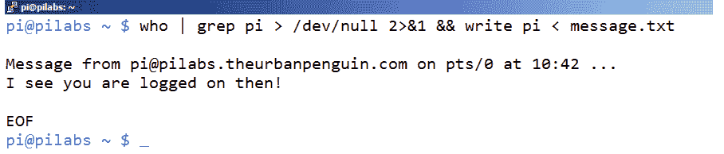

# 使用列表验证用户输入

在这个脚本中，我们将确保第一个位置参数已经被赋值。我们可以修改在第一章中创建的`hello2.sh`脚本，*使用 Bash 脚本的目的与原理*，在显示`hello`文本之前检查用户输入。

你可以将`hello2.sh`脚本复制到`hello4.sh`，或者从头创建一个新脚本。输入的内容不会很多，脚本将被创建为`$HOME/bin/hello4.sh`，如下所示：

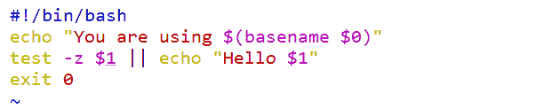

我们可以通过以下命令确保脚本是可执行的：

```
$ chmod +x $HOME/bin/hello4.sh  
```

然后，我们可以带参数或不带参数地运行这个脚本。`test`语句会检查`$1`变量是否为空字节。如果是，那么我们不会看到`hello`语句；否则，它会打印`hello`消息。简单来说，如果我们提供了名字，就会看到`hello`消息。

以下截图展示了当你没有向脚本提供参数时的输出，后面跟着提供的参数：

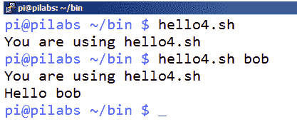

# 使用`test`内建命令

可能是时候我们在脚本的高速公路旁稍作停留，仔细看看`test`命令了。它既是一个 Shell 内建命令，也是一个独立的文件可执行命令。当然，除非我们指定文件的完整路径，否则必须先调用内建命令。

当`test`命令没有表达式进行评估时，测试将返回假值。因此，如果我们按照以下命令运行`test`，即使没有错误输出，退出状态仍然是`1`：

```
$ test  
```

`test`命令将始终返回`True`或`False`，或`0`或`1`，分别对应真假值。`test`命令的基本语法如下：

```
test EXPRESSION  
```

或者，我们可以通过以下命令反转`test`命令：

```
test ! EXPRESSION  
```

如果需要包含多个表达式，可以使用`AND`或`OR`组合这两个表达式，分别使用`-a`和`-o`选项：

```
test EXPRESSION -a EXPRESSION
test EXPRESSION -o EXPRESSION 
```

我们还可以写成简写形式，使用方括号将表达式括起来，替代`test`命令，示例如下：

```
[ EXPRESSION ]  
```

# 测试字符串

我们可以测试两个字符串的相等性或不等性。例如，测试 root 用户的一种方法是使用以下命令：

```
test $USER = root  
```

我们也可以使用方括号表示法来写这个命令：

```
[ $USER = root ]  
```

请注意，每个括号和内部测试条件之间必须留有空格，正如前面所示。

同样，我们也可以通过以下两种方法来测试非 root 账户：

```
test ! $USER = root
[ ! $USER = root ] 
```

我们还可以测试字符串的零值或非零值。在本章的早期示例中，我们已经看到过这个方法。

要测试一个字符串是否有值，我们可以使用`-n`选项。我们可以通过检查用户环境中是否存在某个变量，来判断当前的连接是否通过 SSH 建立。我们通过使用`test`命令和方括号来完成这一检查，以下是两个示例：

```
test -n $SSH_TTY
[ -n $SSH_TTY ]  
```

如果为真，则表示连接是通过 SSH 建立的；如果为假，则表示连接不是通过 SSH 建立的。

如前所述，测试零字符串值对于判断变量是否已设置非常有用：

```
test -z $1 
```

或者，更简单的方法是使用以下命令：

```
[ -z $1 ]  
```

该查询的结果为真意味着没有向脚本提供输入参数。

# 测试整数

除了测试 bash 脚本的字符串值外，我们还可以测试整数值和整数。测试脚本输入的另一种方式是计算位置参数的数量，并测试该数量是否大于`0`：

```
test $# -gt 0 
```

或者使用方括号，如下所示：

```
[ $# -gt 0 ] 
```

在脚本中，`$#`变量表示传递给脚本的参数数量。

有很多可以用于数字的测试：

+   `number1 -eq number2`：检查`number1`是否等于`number2`。

+   `number1 -ge number2`：检查`number1`是否大于或等于`number2`。

+   `number1 -gt number2`：检查`number1`是否大于`number2`。

+   `number1 -le number2`：检查`number1`是否小于或等于`number2`。

+   `number1 -lt number2`：此命令检查`number1`是否小于`number2`

+   `number1 -ne number2`：此命令检查`number1`是否不等于`number2`

# 测试文件类型

在测试值时，我们可以测试文件或文件类型的存在。例如，我们可能只想在文件是符号链接时才删除它。在编译内核时，我们会使用这种方法。`/usr/src/linux`目录应该是指向最新内核源代码的符号链接。如果我们在编译新内核之前下载了更新版本，我们需要删除现有的链接并创建一个新链接。为了防止有人创建了`/usr/src/linux`目录，我们可以在删除之前测试它是否存在链接：

```
# [ -h /usr/src/linux ] &&rm /usr/src/linux  
```

`-h`选项用于测试文件是否有链接。其他选项包括以下内容：

+   `-d`：此命令显示该文件是否为目录

+   `-e`：此命令显示文件是否以任何形式存在

+   `-x`：此命令显示文件是否可执行

+   `-f`：此命令显示文件是否为常规文件

+   `-r`：此命令显示文件是否可读

+   `-p`：此命令显示文件是否为命名管道

+   `-b`：此命令显示文件是否为块设备

+   `file1 -nt file2`：此命令检查`file1`是否比`file2`更新

+   `file1 -ot file2`：此命令检查`file1`是否比`file2`更旧

+   `-O file`：此命令检查当前登录用户是否为该文件的所有者

+   `-c`：此命令显示文件是否为字符设备

还存在更多选项，因此根据需要深入阅读主要页面。我们将在整本书中使用不同的选项，从而为您提供实用且有用的示例。

# 使用`if`语句创建条件语句

正如我们所看到的，通过使用命令行列表，构建简单的条件是可能的。这些条件语句可以有或没有测试。随着任务复杂性的增加，使用`if`语句创建语句变得更加简单。这肯定会提高脚本的可读性和逻辑布局。从某种程度上说，它也符合我们思考和表达的方式；`if`在我们的口语中就像在 bash 脚本中一样，都是一种语义。

尽管在脚本中会占用多于一行，但通过使用`if`语句，我们可以实现更多功能，并使脚本更具可读性。话虽如此，让我们来看看如何创建`if`条件。以下是一个使用`if`语句的脚本示例：

```
#!/bin/bash 
# Welcome script to display a message to users on login 
# Author: @theurbanpenguin 
# Date: 1/1/1971 
if [ $# -lt 1 ] ; then 
echo "Usage: $0 <name>" 
exit 1 
fi 
echo "Hello $1" 
exit 0 
```

`if`语句中的代码仅在条件为真时运行，`if`语句块的结束由`fi`表示——`if`的倒写。在`vim`中的颜色编码有助于提高可读性，您将在下面的截图中看到：

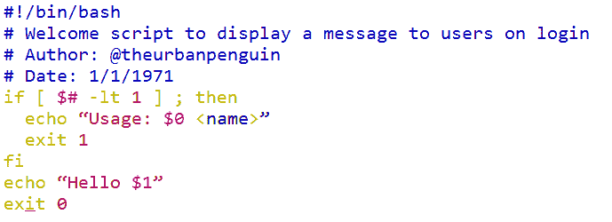

在脚本中，我们可以轻松添加多个语句，当条件为`true`时运行。在我们的案例中，这包括退出脚本并显示错误提示，以及包含`usage`语句以帮助用户。这样可以确保我们只有在提供了被欢迎人的名字时才显示`hello`消息。

我们可以通过以下截图查看脚本执行的情况，分别是在有和没有参数的情况下：

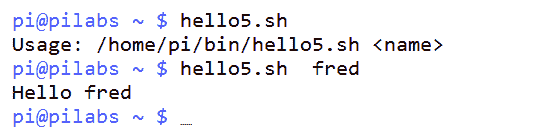

以下伪代码展示了`if`条件语句的语法：

```
if condition; then 
   statement 1 
   statement 2 
fi 
```

缩进代码不是必须的，但它有助于提高可读性，并且强烈推荐。将`then`语句与`if`语句写在同一行也有助于提高代码的可读性，并且需要使用分号将`if`与`then`分隔开。

# 使用`else`扩展`if`

当脚本需要继续执行，无论`if`条件结果如何时，通常需要处理评估的两个条件，即`true`和`false`时的操作。这时可以使用`else`关键字。这样可以在条件为真时执行一个代码块，在条件为假时执行另一个代码块。以下是该伪代码：

```
if condition; then 
   statement 
else  
   statement 
fi 
```

如果我们考虑扩展之前创建的`hello5.sh`脚本，完全可以确保无论参数是否存在，都能正确执行。我们可以将其重新创建为`hello6.sh`，如下所示：

```
#!/bin/bash 
# Welcome script to display a message to users 
# Author: @theurbanpenguin 
# Date: 1/1/1971 
if [ $# -lt 1 ] ; then 
read -p "Enter a name: " 
name=$REPLY 
else 
name=$1 
fi 
echo "Hello $name" 
exit 0 

```

现在脚本设置了一个命名变量，这有助于提高可读性，我们可以将正确的值从输入参数或`read`提示中赋给`$name`；无论哪种方式，脚本都能很好地工作并开始成型。

# 使用`if`命令测试

你已经看到如何使用`test`命令或简写的`[ ]`。这个测试返回零（true）或非零（false）。

你将看到如何使用`if`命令检查返回结果。

# 检查字符串

你可以将`if`命令与`test`命令结合使用，检查字符串是否符合特定条件：

+   `if [$string1 = $string2]`：检查`string1`是否与`string2`相同

+   `if [$string1 != $string2]`：检查`string1`是否与`string2`不同

+   `if [$string1 \< $string2]`：检查`string1`是否小于`string2`

+   `if [$string1 \> $string2]`：检查`string1`是否大于`string2`

小于号和大于号应该用反斜杠转义，以防显示警告。

+   `if [-n $string1]`：检查`string1`是否长度大于零

+   `if [-z $string1]`：检查`string1`的长度是否为零

让我们看一些例子来解释`if`语句是如何工作的：

```
#!/bin/bash 
if [ "mokhtar" = "Mokhtar" ]  
then 
echo "Strings are identical" 
else 
echo "Strings are not identical" 
fi 

```

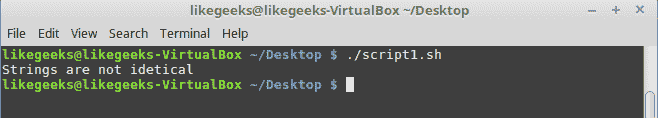

这个`if`语句检查字符串是否相同；由于字符串不相同，因为其中一个包含了大写字母，它们被判定为不相同。

注意方括号与变量之间的空格；如果没有这个空格，某些情况下会显示警告。

不等于运算符（`!=`）的作用相同。此外，你可以对`if`语句取反，它也会按照相同的方式工作，如下所示：

```
if ! [ "mokhtar" = "Mokhtar" ]
```

小于号和大于号运算符检查第一个字符串是否从 ASCII 顺序上大于或小于第二个字符串：

```
#!/bin/bash 
if [ "mokhtar" \> "Mokhtar" ]  
then 
echo "String1 is greater than string2" 
else 
echo "String1 is less than the string2" 
fi 

```

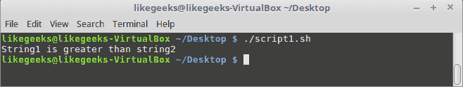

在 ASCII 顺序中，小写字母的值高于大写字母。

如果你使用`sort`命令对文件进行排序或者类似的操作，发现排序顺序与`test`命令的排序方向相反，别搞混淆。这是因为`sort`命令使用了系统设置的数字顺序，而这个顺序与 ASCII 顺序正好相反。

要检查字符串长度，你可以使用`-n`测试：

```
#!/bin/bash 
if [ -n "mokhtar" ]  
then 
echo "String length is greater than zero" 
else 
echo "String is zero length" 
fi 
```

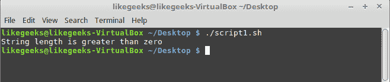

要检查长度是否为零，你可以使用`-z`测试：

```
#!/bin/bash 
if [ -z "mokhtar" ]  
then 
echo "String length is zero" 
else 
echo "String length is not zero" 
fi        

```

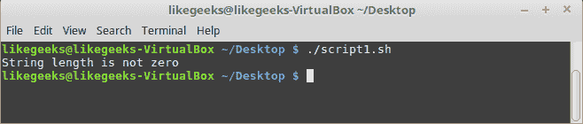

我们在测试字符串时使用了引号，即使我们的字符串中没有空格。

如果你有一个包含空格的字符串，你**必须**使用引号。

# 检查文件和目录

同样，你可以使用`if`语句检查文件和目录。

我们来看一个例子：

```
#!/bin/bash 
mydir=/home/mydir 
if [ -d $mydir ] 
then 
echo "Directory $mydir exists." 
else 
echo "Directory $mydir not found." 
fi 
```

我们使用了`-d`测试来检查路径是否为目录。

其他的测试方法都一样。

# 检查数字

同样，我们也可以使用`test`和`if`命令检查数字。

```
#!/bin/bash 
if [ 12 -gt 10 ] 
then 
echo "number1 is greater than number2" 
else 
echo "number1 is less than number2" 
fi  
```

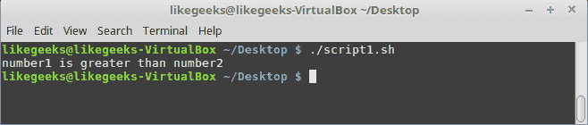

正如预期的，`12`大于`10`。

所有其他的数字测试方式相同。

# 组合测试

你可以将多个测试结合起来，使用一个`if`语句进行检查。

这可以通过使用`AND`（`&&`）和`OR`（`||`）命令来完成：

```
#!/bin/bash 
mydir=/home/mydir 
name="mokhtar" 
if [ -d $mydir ] && [ -n $name ]; then 
   echo "The name is not zero length and the directory exists." 
else 
echo "One of the tests failed." 
fi 
```

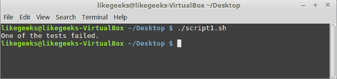

`if`语句执行了两个检查，它检查目录是否存在，并且名称的长度是否为零。

这两个测试必须成功（返回零），才能执行下一个`echo`命令。

如果其中一个测试失败，`if`语句会进入`else`子句。

与`OR`（`||`）命令不同，如果任何一个测试返回成功（零），`if`语句就会成功。

```
#!/bin/bash 
mydir=/home/mydir 
name="mokhtar" 
if [ -d $mydir ] || [ -n $name ]; then 
   echo "One of tests or both successes" 
else 
echo "Both failed" 
fi  
```

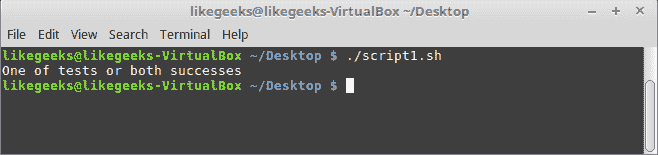

很明显，如果其中一个测试返回真，`if`语句会对所有组合的测试返回真。

# 使用 elif 的更多条件

当我们需要更高控制度时，可以使用`elif`关键字。与`else`不同，`elif`每次都需要一个附加的条件进行测试。通过这种方式，我们可以根据不同的情况做出不同的处理。我们可以根据需要添加任意多个`elif`条件。以下是一些伪代码示例：

```
if condition; then 
statement 
elif condition; then 
statement 
else 
statement 
fi 
exit 0 
```

脚本可以通过提供简化的选择来帮助操作员完成更复杂的代码部分。尽管脚本逐渐变得更加复杂以满足需求，但对于操作员来说，执行变得大大简化。我们的工作是让用户能够通过命令行轻松运行更复杂的操作，在创建脚本时，通常这需要向脚本中添加更多的复杂性；然而，我们将收获脚本化应用的可靠性。

# 使用 elif 创建 backup2.sh

我们可以重新审视之前创建的脚本，用于运行先前的备份。这个脚本`$HOME/bin/backup.sh`会提示用户选择文件类型和存储备份的目录。备份使用的工具是`find`和`cp`。

有了这些新学到的知识，我们现在可以允许脚本使用`tar`命令进行备份，并根据操作员选择的压缩级别进行压缩。无需选择文件类型，因为整个主目录会被备份，但会排除备份目录本身。

操作员可以根据三个字母`H`、`M`和`L`选择压缩级别。选择将影响传递给`tar`命令的选项以及创建的备份文件。高压缩使用`bzip2`，中等压缩使用`gzip`，低压缩则创建未压缩的`tar`归档。该逻辑存在于后续的扩展`if`语句中：

```
if [ $file_compression = "L" ] ; then 
tar_opt=$tar_l 
elif [ $file_compression = "M" ]; then 
tar_opt=$tar_m 
else 
tar_opt=$tar_h 
fi 
```

根据用户的选择，我们可以为`tar`命令配置正确的选项。由于我们有三个条件需要评估，`if`、`elif`和`else`语句是合适的。要查看变量如何配置，我们可以参考以下脚本片段：

```
tar_l="-cvf $backup_dir/b.tar --exclude $backup_dir $HOME" 
tar_m="-czvf $backup_dir/b.tar.gz --exclude $backup_dir $HOME" 
tar_h="-cjvf $backup_dir/b.tar.bzip2 --exclude $backup_dir $HOME" 
```

完整的脚本可以创建为`$HOME/bin/backup2.sh`，并应包含以下代码：

```
#!/bin/bash 
# Author: @theurbanpenguin 
# Web: www.theurbapenguin.com 
read -p "Choose H, M or L compression " file_compression 
read -p "Which directory do you want to backup to " dir_name 
# The next lines creates the directory if it does not exist 
test -d $HOME/$dir_name || mkdir -m 700 $HOME/$dir_name 
backup_dir=$HOME/$dir_name 
tar_l="-cvf $backup_dir/b.tar --exclude $backup_dir $HOME" 
tar_m="-czvf $backup_dir/b.tar.gz --exclude $backup_dir $HOME" 
tar_h="-cjvf $backup_dir/b.tar.bzip2 --exclude $backup_dir $HOME" 
if [ $file_compression = "L" ] ; then 
tar_opt=$tar_l 
elif [ $file_compression = "M" ]; then 
tar_opt=$tar_m 
else 
tar_opt=$tar_h 
fi 
tar $tar_opt 
exit 0 
```

当我们执行脚本时，需要选择大写的`H`、`M`或`L`，因为在脚本中就是这样进行选择的。以下截图显示了初始脚本执行的情况，其中已经选择了`M`：

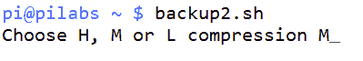

# 使用 case 语句

与其使用多个`elif`语句，`case`语句在对单一表达式进行评估时，可能提供一种更简便的机制。

`case`语句的基本布局如下所示，使用伪代码：

```
case expression in 
 case1)  
  statement1 
  statement2 
 ;; 
 case2) 
  statement1 
  statement2 
 ;; 
 *) 
  statement1 
 ;; 
esac 
```

我们看到的语句布局与其他语言中的`switch`语句相似。在 bash 中，我们可以使用`case`语句来测试简单的值，例如字符串或整数。`case`语句可以处理广泛的字母范围，例如`[a-f]`或从`a`到`f`，但它不能轻松处理如`[1-20]`这样的整数范围。

`case`语句首先会扩展表达式，然后尝试逐个与每个项目进行匹配。当找到匹配项时，所有语句都会执行，直到遇到`;;`，这表示该匹配的代码结束。如果没有匹配项，将匹配`case`语句中的`else`部分，即由`*`表示的项。这必须是列表中的最后一项。

请参考以下脚本`grade.sh`，它用于评估成绩：

```
#!/bin/bash 
#Script to evaluate grades 
#Usage: grade.sh stduent grade 
#Author: @likegeeks 
#Date: 1/1/1971 
if [ ! $# -eq 2 ] ; then 
    echo "You must provide <student> <grade>" 
    exit 2 
fi 
case ${2^^} in #Parameter expansion is used to capitalize input 
    [A-C]) echo "$1 is a star pupil" 
    ;; 
    [D]) echo "$1 needs to try a little harder!" 
    ;; 
    [E-F]) echo "$1 could do a lot better next year" 
    ;; 
    *) echo "Grade could not be evaluated for $1 $2" 
    ;; 
esac 
```

脚本首先使用`if`语句检查是否确实向脚本提供了两个参数。如果没有提供，脚本将以错误状态退出：

```
if [ ! $# -eq2 ] ; then 
echo "You must provide <student><grade> 
exit 2 
fi 
```

然后我们使用参数扩展 `$2` 变量的值，通过 `^^` 来将输入转换为大写。这代表我们提供的等级。由于我们在将输入转换为大写，因此我们首先尝试与字母 `A` 到 `C` 进行匹配。

我们对其他提供的等级 `E` 到 `F` 进行了类似的测试。

以下截图显示了不同等级下脚本执行的情况：

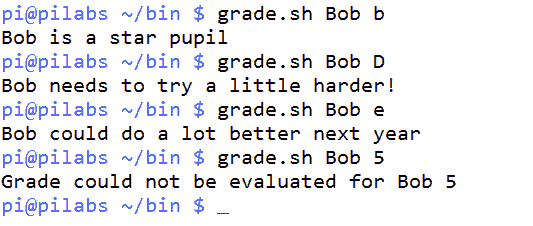

# 配方 – 使用 grep 构建前端

作为本章的结尾，我们将把一些我们学到的功能组合在一起，编写一个脚本，提示操作员输入文件名、搜索字符串和要使用 `grep` 命令执行的操作。我们将创建脚本文件 `$HOME/bin/search.sh`，并且不要忘记将其设为可执行：

```
#!/bin/bash 
#Author: @theurbanpenguin 
usage="Usage: search.sh file string operation" 

if [ ! $# -eq3 ] ; then 
echo "$usage" 
exit 2 
fi 

[ ! -f $1 ] && exit 3 

case $3 in 
    [cC]) 
mesg="Counting the matches in $1 of $2" 
opt="-c" 
    ;; 
    [pP]) 
mesg="Print the matches of $2 in $1" 
        opt="" 
    ;; 
    [dD]) 
mesg="Printing all lines but those matching $3 from $1" 
opt="-v" 
    ;; 
    *) echo "Could not evaluate $1 $2 $3";; 
esac 
echo $mesg 
grep $opt $2 $1 
```

我们通过以下代码开始检查是否正好有三个输入参数：

```
if [ ! $# -eq3 ] ; then 
echo "$usage" 
exit 2 
fi 
```

下一个检查使用命令行列表，如果文件参数不是常规文件，则退出脚本，使用 `test -f`：

```
[ ! -f $1 ]&& exit 3 
```

`case` 语句允许进行三种操作：

+   统计匹配的行

+   打印匹配的行

+   打印除匹配行之外的所有行

以下截图显示了在 `/etc/ntp.conf` 文件中搜索以字符串 server 开头的行。在这个例子中，我们选择了 count 选项：

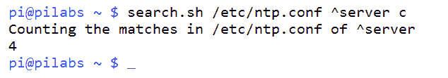

# 概述

编写脚本时，最重要且耗时的任务之一就是构建所有的条件语句，使脚本既可用又稳健。通常会提到一个 80/20 法则：20%的时间用于编写主要脚本，而 80%的时间用于确保脚本中所有可能的情况都得到正确处理。这就是我们所说的脚本的过程完整性，我们尝试仔细而准确地涵盖每一种场景。

我们首先查看了一个简单的命令行列表测试。如果需要的操作比较简单，那么这些命令提供了很好的功能，并且容易添加。在需要更多复杂性时，我们会加入 `if` 语句。

使用 `if` 语句时，我们可以根据需要通过 `else` 和 `elif` 关键字扩展它们。别忘了 `elif` 关键字需要有自己的条件来进行评估。

我们看到了如何使用 `if` 语句与 `test` 命令一起检查字符串、文件和数字。

最后，我们看到了如何使用 `case` 语句来评估一个需要单一表达式的情况。

在下一章中，我们将探讨阅读已经准备好的代码片段的重要性。我们将创建一个示例 `if` 语句，可以将其保存为代码片段，在编辑时加载到脚本中。

# 问题

1.  以下代码的结果是什么：`True` 还是 `False`？

```
if [ "LikeGeeks" \> "likegeeks" ]  
then 
echo "True" 
else 
echo "False" 
fi 
```

1.  以下哪个脚本是正确的？

```
#!/bin/bash 
if ! [ "mokhtar" = "Mokhtar" ]  
then 
echo "Strings are not identical" 
else 
echo "Strings are identical" 
fi 
```

或

```
#!/bin/bash 
if [ "mokhtar" != "Mokhtar" ]  
then 
echo "Strings are not identical" 
else 
echo "Strings are identical" 
fi
```

1.  在以下示例中，可以使用多少个命令作为操作符来返回 `True`？

```
#!/bin/bash 
if [ 20 ?? 15 ] 
then 
echo "True" 
else 
echo "False" 
fi 
```

1.  以下代码的结果是什么？

```
#!/bin/bash 
mydir=/home/mydir 
name="mokhtar" 
if [ -d $mydir ] || [ -n $name ]; then 
   echo "True" 
else 
echo "False" 
fi 
```

# 深入阅读

请参阅以下内容，以获取更多与本章相关的阅读材料：

+   [`tldp.org/HOWTO/Bash-Prog-Intro-HOWTO-6.html`](http://tldp.org/HOWTO/Bash-Prog-Intro-HOWTO-6.html)

+   [`tldp.org/LDP/Bash-Beginners-Guide/html/sect_07_03.html`](http://tldp.org/LDP/Bash-Beginners-Guide/html/sect_07_03.html)

+   [`wiki.bash-hackers.org/commands/classictest`](http://wiki.bash-hackers.org/commands/classictest)
