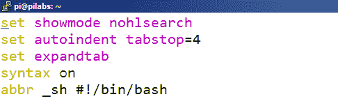
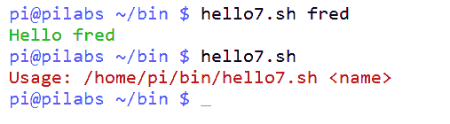
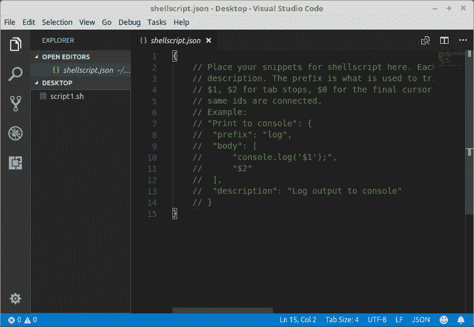
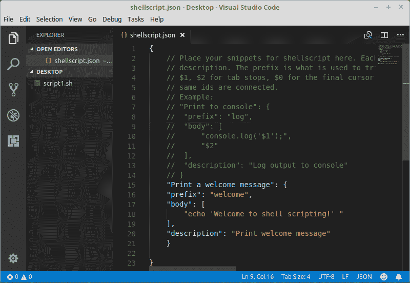
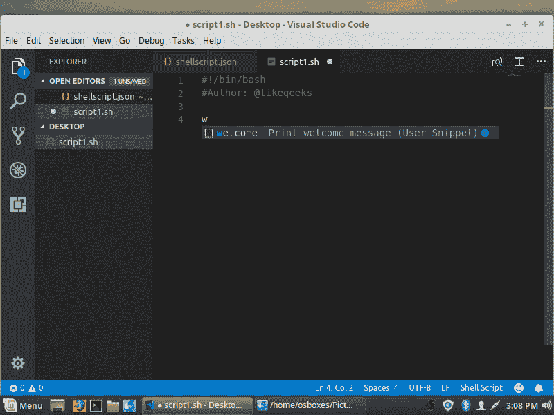
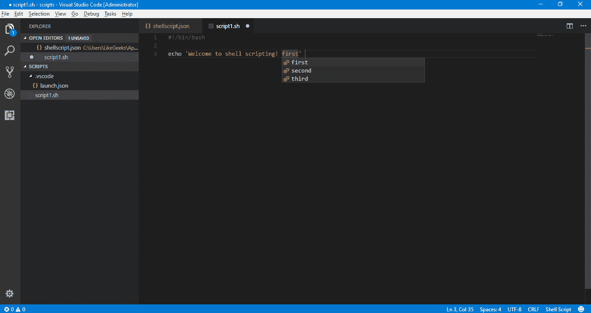

# 第四章：创建代码片段

现在我们可以编写条件测试来做出决策。当你的编程速度加快后，你将需要保存一些代码片段以供以后使用，那么在编写脚本时，如何节省时间和精力呢？

如果你喜欢使用命令行，同时又喜欢图形化**集成开发环境**（**IDEs**）的某些功能，那么本章可能会为你揭示一些新思路。我们可以通过 vi 或 vim 文本编辑器在命令行中创建常用脚本元素的快捷方式。

在本章中，我们将涵盖以下主题：

+   缩写

+   使用代码片段

+   使用 VS Code 创建代码片段

# 技术要求

本章的源代码可以从这里下载：

[`github.com/PacktPublishing/Mastering-Linux-Shell-Scripting-Second-Edition/tree/master/Chapter04`](https://github.com/PacktPublishing/Mastering-Linux-Shell-Scripting-Second-Edition/tree/master/Chapter04)

# 缩写

我们已经短暂进入过 `~/.vimrc` 文件，现在我们将重新访问此文件，查看缩写或 `abbr` 控制。此文件作为 vim 文本编辑器的运行控制机制，通常会安装在你的 Linux 发行版中。较旧的发行版或 Unix 变种可能使用原始的 vi 文本编辑器，并且会使用 `~/.exrc` 文件。如果你不确定自己使用的 vi 版本及正确的运行控制文件，可以简单地输入 `vi` 命令。如果打开的是一个空白页面，那就是 vi；但如果打开的是一个带有 vim 启动画面的新空白文档，那么你正在使用改进版的 vim 或 vi。

缩写允许用较短的字符串替代较长的字符串。这些缩写可以在 vim 会话的最后一行模式中设置，但通常是在控制文件中设置的。Shebang 可以通过一个缩写轻松表示，如下所示：

```
abbr _sh #!/bin/bash

```

缩写的基本语法如下命令所示：

```
abbr <shortcut><string> 
```

使用这个缩写，我们只需要在编辑模式下输入 `_sh`。按下 *Enter* 键后，shebang 的完整文本将被打印出来。实际上，在 `abbr` 代码后按下任何键都会展开快捷方式，而不仅仅是按 *Enter* 键。像这样的简单元素可以大大增强使用 vim 作为文本编辑器的体验。以下截图显示了更新后的 `~/.vimrc` 文件：



我们不限于单一的缩写代码，可以添加更多的 `abbr` 条目，例如支持 Perl 脚本的 shebang 行：

```
abbr _pl #!/usr/bin/perl 
```

下划线的使用不是必须的，但目的是保持快捷代码的唯一性，避免输入错误。我们也不限于单行，尽管缩写通常在单行中使用。考虑以下 `if` 语句的缩写：

```
abbr _if if [-z $1];then<CR>echo "> $0 <name><CR>exit 2<CR>fi
```

尽管这样可以工作，但`if`语句的格式将不完美，且多行缩写远非理想。这时，我们可以考虑使用预先准备好的代码片段。

# 使用代码片段

我们所说的*代码片段*指的是可以读取到当前脚本中的预备代码。使用 vim 特别容易，在编辑时可以读取其他文本文件的内容：

```
ESC
:r <path-and-filename>
```

例如，如果我们需要读取位于`$HOME/snippets`中的名为`if`的文件内容，我们将在 vim 中使用以下快捷键：

```
ESC
:r $HOME/snippets/if
```

该文件的内容将在当前光标位置下方读取到当前文档中。这样，我们可以根据需要使代码片段变得复杂，并保持正确的缩进，以帮助提高可读性和一致性。

所以，我们的职责是始终在我们的`home`目录中创建一个片段目录：

```
$ mkdir -m 700 $HOME/snippets
```

不需要共享目录，因此在创建时将模式设置为`700`或设置为用户私有是一种良好的做法。

在创建代码片段时，您可以选择使用伪代码或真实示例。我的偏好是使用经过编辑的真实示例，以反映接收脚本的要求。一个简单的`if`片段的内容如下：

```
if [ -z $1 ] ; then
   echo "Usage: $0 <name>"
   exit 2
fi
```

这为我们提供了创建带有实际示例的`if`语句的布局。在这种情况下，我们检查`$1`是否未设置，并在退出脚本之前向用户发送错误。关键是保持片段简洁，以限制所需的更改，同时确保易于理解并根据需要扩展。

# 为终端带来颜色

如果我们要向用户和执行脚本的操作员显示文本消息，我们可以提供颜色帮助解释消息。使用红色表示错误，绿色表示成功，可以更容易地为我们的脚本添加功能。并非所有 Linux 终端，但绝大多数都支持颜色。内置命令`echo`在与`-e`选项一起使用时，可以向用户显示颜色。

要显示红色文本，我们可以使用`echo`命令，如下所示：

```
$ echo -e "\03331mError\033[0m"
```

以下截图显示了代码和输出：

![红色文本将立即吸引注意力，并可能导致脚本执行失败。以这种方式使用颜色符合应用设计的基本原则。如果您觉得代码繁琐，那么只需使用友好的变量来表示颜色和重置代码。在之前的代码中，我们使用了红色和最终的重置代码，将文本恢复为默认的 Shell 样式。我们可以轻松地为这些颜色代码以及其他颜色创建变量：```RED="\03331m"GREEN="\033[32m"BLUE="\033[34m"RESET="\033[0m"````\033`值是转义字符，`[31m`是红色的颜色代码。在使用变量时需要小心，确保它们与文本适当地分隔开。修改之前的示例，我们可以看到如何轻松实现这一点：```$ echo -e ${RED}Error$RESET"```我们使用大括号确保`RED`变量被识别并与`Error`字样分开。将变量定义保存到`$HOME/snippets/color`文件中，这样它们就可以在其他脚本中使用。有趣的是，我们不需要编辑这个脚本；可以使用`source`命令在运行时将这些变量定义读取到脚本中。在接收脚本中，我们需要添加以下行：```source $HOME/snippets/color```使用 shell 内建的`source`命令会在脚本运行时将颜色变量读取到正在执行的脚本中。以下截图展示了一个修改版的`hello5.sh`脚本，我们现在将其称为`hello7.sh`，它使用了这些颜色：

我们可以通过颜色编码的输出轻松识别脚本的成功与失败；绿色的`Hello fred`表示我们提供了参数，而红色的`Usage`语句表示我们没有提供所需的名称。

# 使用 VS Code 创建代码片段

对于那些喜欢图形化 IDE 的人，你可以将 VS Code 用作 shell 脚本的编辑器。我们在第一章中将它作为调试器使用，*《Bash 脚本的作用与意义》*。现在我们将展示它作为编辑器的能力。

你可以按如下方式在 VS Code 中创建自己的代码片段。

转到 文件 | 偏好设置 | 用户代码片段。

然后开始输入`shell`，这将打开`shellscript.json`文件。

该文件有两个括号，准备好在其中输入你的代码片段：



要创建一个代码片段，请在文件的括号中输入以下内容：

```
"Print a welcome message": {
   "prefix": "welcome",
   "body": [
         "echo 'Welcome to shell scripting!' "
   ],
   "description": "Print welcome message"
  }
```



你可以使用以下模板，并根据需要进行修改。

尝试使用不同于 shell 脚本关键字的前缀，以避免混淆。

当你打开任何 `.sh` 文件并开始输入`welcome`时，自动完成将显示我们刚刚创建的代码片段：



你可以使用任何前缀；在我们的例子中，我们使用了`welcome`，这样自动完成时就会以它为开头。

你可以在代码片段的主体中添加多行内容：

```
"Print to a welcome message": {
    "prefix": "welcome",
    "body": [
      "echo 'Welcome to shell scripting!' ",
      "echo 'This is a second message'"
    ],
    "description": "Print welcome message"
  }
```

你可以在代码片段主体中使用占位符来简化代码编辑。

占位符写作如下：

```
$1, $2, etc,
```

修改之前的代码片段并添加一个占位符，如下所示：

```
"Print a welcome message": {
  "prefix": "welcome",
  "body": [
    "echo 'Welcome to shell scripting! $1' "
  ],
  "description": "Print welcome message"
  }
```

当你开始输入`welcome`并选择代码片段后，你会注意到光标会停在占位符的精确位置，等待你的输入。

如果你忘记在这些可编辑的位置输入内容，可以使用选择项：

```
  "Print to a welcome message": {
    "prefix": "welcome",
    "body": [
      "echo 'Welcome to shell scripting! ${1|first,second,third|}' "
    ],
    "description": "Print welcome message"
  }
```

选择此代码片段并按*Enter*后，你应该会看到光标停留在等待输入的位置，并带有你的选择：



这非常有帮助！

此外，你可以为占位符添加默认值，这样如果你按下 *Tab*，该值就会被写入：

```
"Print a welcome message": {
  "prefix": "welcome",
  "body": [
    "echo 'Welcome to shell scripting! ${1:book}' "
  ],
  "description": "Print welcome message"
  }
```

# 总结

对于任何管理员来说，脚本重用总是追求高效的关键。使用 vim 在命令行中编辑脚本可以非常快速且高效，我们可以通过使用缩写来节省输入。这些最好在用户个人的 `.vimrc` 文件中设置，并通过 `abbr` 控制定义。除了缩写之外，我们还可以看到使用代码片段的意义。这些是预先准备好的代码块，可以读取到当前脚本中。

此外，我们还看到了在命令行中使用颜色的价值，脚本会提供反馈。在初次使用时，这些颜色代码并不友好，但我们可以通过使用变量来简化这个过程。我们创建了包含颜色代码的变量并将其保存到文件中，通过使用 `source` 命令，这些变量将可以在当前环境中使用。

最后，我们看到了如何使用 VS Code 创建代码片段，以及如何添加占位符以简化代码编辑。

在下一章中，我们将探讨其他机制，帮助我们简化整数和变量的使用，编写测试表达式。

# 问题

1.  以下代码创建了一个打印一行的片段。如何在片段中添加选择项？

```
"Hello message": {
  "prefix": "hello",
  "body": [
    "echo 'Hello $1' "
  ],
  "description": "Hello message"
  }
```

1.  你应该使用哪个命令，使你的代码片段在 shell 中可用？

# 深入阅读

请参阅以下内容，进一步阅读与本章相关的内容：

+   [`code.visualstudio.com/docs/editor/userdefinedsnippets`](https://code.visualstudio.com/docs/editor/userdefinedsnippets)

+   [`brigade.engineering/sharpen-your-vim-with-snippets-767b693886db`](https://brigade.engineering/sharpen-your-vim-with-snippets-767b693886db)
