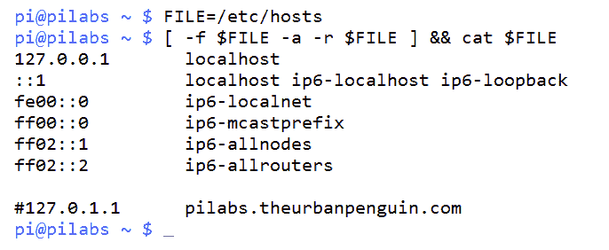
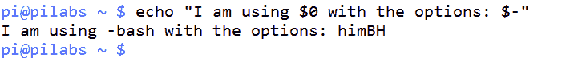
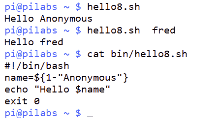
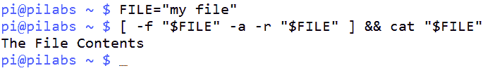
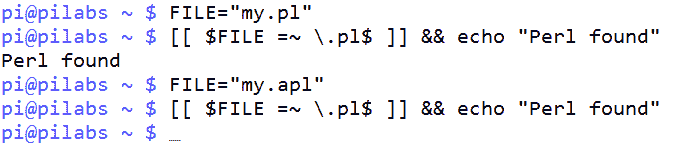
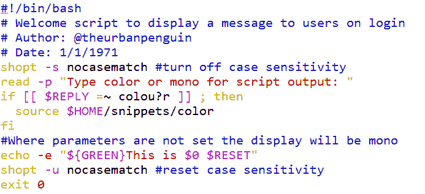
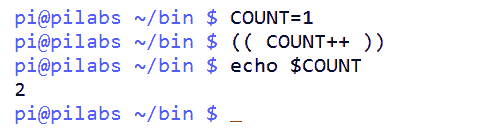
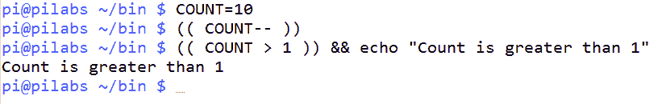

# 替代语法

到目前为止，在脚本编写过程中，我们已经看到可以使用`test`命令来判断条件状态。我们已经进一步了解，除了`test`命令，还可以使用单方括号。在这里，我们将回顾`test`命令，并更详细地了解单方括号。通过进一步了解方括号，我们将转向更高级的变量或参数管理，提供默认值并理解引用问题。

最后，我们将看到在如 bash、Korn 和 Zsh 等高级 shell 中，我们可以使用双括号！利用双圆括号和双方括号可以简化整体语法，并标准化数学符号的使用。

本章将涵盖以下主题：

+   回顾`test`命令

+   提供参数默认值

+   有疑问时 – 引用！

+   使用`[[`进行高级测试

+   使用`((`进行算术运算

# 技术要求

本章的源代码可以从这里下载：

[`github.com/PacktPublishing/Mastering-Linux-Shell-Scripting-Second-Edition/tree/master/Chapter05`](https://github.com/PacktPublishing/Mastering-Linux-Shell-Scripting-Second-Edition/tree/master/Chapter05)

# 回顾 test 命令

到目前为止，我们使用内建的`test`命令来驱动条件语句。通过与`test`结合使用其他选项，我们可以查看返回的值，以判断文件系统中文件的状态。如果不带任何选项运行`test`命令，将返回假输出：

```
$ test
```

# 测试文件

通常，我们可以使用`test`来检查与文件相关的条件。例如，要测试文件是否存在，可以使用`-e`选项。以下命令将测试`/etc/hosts`文件是否存在：

```
test -e /etc/hosts
```

我们可以再次运行`test`命令，但这次要检查文件不仅存在，而且是常规文件，而不是具有某种特殊用途的文件。特定的文件类型可能是目录、管道和链接等。常规文件的选项是`-f`：

```
$ test -f /etc/hosts
```

# 添加逻辑

如果我们需要在脚本中打开文件，我们会测试该文件是否是常规文件，并且已设置可读权限。为了使用`test`实现这一点，我们还可以包含`-a`选项，将多个条件通过`AND`连接在一起。在以下示例命令中，我们将使用`-r`条件来检查文件是否可读：

```
$ test -f /etc/hosts -a -r /etc/hosts
```

同样，使用`-o`选项可以在表达式中对两个条件进行`OR`操作。

# 前所未见的方括号

作为`test`命令的替代方法，我们可以使用单方括号来实现相同的条件测试。重复之前的`test`条件，并省略命令本身。我们将按照以下命令进行重写：

```
 $ [ -f /etc/hosts -a -r /etc/hosts ]
```

很多时候，即使是经验丰富的管理员，我们也习惯了某些语言元素，并接受它们原本的样子。我觉得很多 Linux 管理员会很惊讶地发现 `` 是一个既是 shell 内建命令又是独立文件的命令。使用 `type` 命令，我们可以验证这一点：

```
$ type -a [
```

我们可以在以下屏幕截图中看到此命令的输出，确认其存在：

![

内置的 `[` 命令模仿了 `test` 命令，但它需要一个闭括号。

现在我们对 `[` 命令有了更多了解，它既出现在 bash 中，也出现在早期的 Bourne shell 中，我们现在可以继续添加一些命令行列表语法。除了命令行列表，我们可以在以下命令示例中看到所需的功能：

```
$ FILE=/etc/hosts
$ [ -f $FILE -a -r $FILE ] && cat $FILE
```

设置了 `FILE` 参数变量后，我们可以测试它是否为常规文件，并且在尝试列出文件内容之前，用户是否可读。这样，脚本变得更加健壮，而不需要复杂的脚本逻辑。我们可以在以下屏幕截图中看到代码的使用：



这种缩写非常常见，且容易识别。如果缩写没有提高可读性，我们应该始终小心使用它们。我们编写脚本的目标应是写出清晰且易于理解的代码，避免使用那些并没有增加可读性的简写。

# 提供参数默认值

在 bash 参数中，有一些命名的内存空间允许我们访问存储的值。参数有两种类型：

+   变量

+   特殊参数

# 变量

我们在第一章中已经描述了什么是变量以及如何定义它们，*使用 Bash 编写脚本的背景和目的*。

只是为了提醒你，你可以通过使用等号并且没有空格来定义一个变量，例如：

```
#!/bin/bash
myvar=15
myvar2="welcome"
```

所以这里没有什么新内容。

# 特殊参数

特殊参数是第二类参数，由 shell 本身管理，并以只读形式呈现。我们以前在诸如 `$0` 的参数中遇到过这些，但让我们来看一下另一个 `$-`。我们可以扩展这些参数，通过使用 `echo` 命令来理解它们的用法：

```
$ echo "My shell is $0 and the shell options are: $-"
```

从我添加的注释文本中，我们可以理解`$-`选项表示配置的 shell 选项。可以通过 `set -o` 命令显示这些选项，但可以使用 `$-` 通过程序化方式读取。

我们可以在以下屏幕截图中看到这一点：



此处设置的选项如下：

+   `h`：这是 hashall 的缩写；它允许通过 `PATH` 参数查找程序

+   `i`：这表示这是一个交互式 shell

+   `m`：这是 monitor 的缩写；它允许使用 `bg` 和 `fg` 命令将命令从后台调入或调出

+   `B`：这允许使用大括号扩展或 `mkdirdir{1,2}`，其中我们创建 `dir1` 和 `dir2`

+   `H`：允许历史命令扩展，例如使用 `!501` 来重复历史命令。

# 设置默认值

使用 `test` 命令或括号，我们可以为变量提供默认值，包括命令行参数。以我们之前处理的 `hello4.sh` 脚本为例，我们可以修改它，并在 `name` 参数为零字节时进行设置：

```
#!/bin/bash
name=$1
[ -z $name ] && name="Anonymous"
echo "Hello $name"
exit 0
```

这段代码是可行的，但如何编写默认值的代码是我们自己的选择。我们也可以直接将默认值赋给参数。考虑以下命令，其中直接进行默认值赋值：

```
name=${1-"Anonymous"}
```

在 bash 中，这称为 **参数替换**，可以写成以下伪代码：

```
${parameter-default}
```

无论何时，若变量（`parameter`）未声明且值为空，将使用默认值。如果该参数已明确声明为空值，我们将使用 `:-` 语法，如下例所示：

```
parameter=
${parameter:-default}
```

通过编辑脚本，我们可以创建 `hello8.sh`，利用 bash 参数替换来提供默认值：

```
#!/bin/bash
#Use parameter substitution to provide default value
name=${1-"Anonymous"} 
echo "Hello $name"
exit 0
```

下面的截图展示了此脚本及其输出，包括有无提供值的情况：



`hello8.sh` 脚本提供了我们所需的功能，逻辑直接嵌入到参数赋值中。现在，逻辑和赋值已经合并为脚本中的一行代码，这是保持脚本简洁并维护可读性的重要一步。

# 若有疑问 —— 请加引号！

确定变量是一种参数类型后，我们应始终牢记这一点，特别是在阅读手册和 *HOWTO* 时。文档中通常提到参数，并且在提及时，包括了变量以及 bash 特殊参数，如 `$1` 等。基于此，我们将探讨为何在命令行或脚本中使用参数时最好加上引号。现在学习这一点，可以帮助我们避免以后遇到的许多麻烦，尤其是在我们开始研究循环时。

首先，我们应该使用的正确术语是 **参数扩展** 来读取变量的值。对你我而言，这就是读取变量，但对 bash 来说，这样描述太简单。正确的术语，如参数扩展，减少了含义上的歧义，但同时增加了复杂性。在以下示例中，第一行命令将 `fred` 的值赋给 `name` 参数。第二行命令使用参数扩展打印存储在内存中的值。`$` 符号用于实现参数扩展：

```
$ name=fred
$ echo "The value is: $name"
```

在这个例子中，我们使用了双引号来允许`echo`打印出单一字符串，因为我们使用了空格。如果不使用引号，`echo`可能会将其视为多个参数，空格是大多数 shell（包括 bash）中的默认字段分隔符。通常，当我们没有想到使用引号时，我们并不会直接看到空格。考虑我们之前使用过的命令行代码片段：

```
$ FILE=/etc/hosts
$ [ -f $FILE -a -r $FILE ] && cat $FILE
```

尽管这样做成功了，但我们可能有些幸运，特别是当我们从一个我们没有自己创建的文件列表中填充`FILE`参数时。可以想象，一个文件名中可能包含空格。现在让我们使用另一个文件重新执行这个命令。考虑以下命令：

```
$ FILE="my file"
$ [ -f $FILE -a -r $FILE ] && cat $FILE
```

即使从结构上来看，代码没有任何变化，它现在失败了。这是因为我们向``命令提供了太多的参数。即使我们使用`test`命令，失败的结果也是一样的。

即使我们已经正确引用了文件名分配给`FILE`参数，但当参数被扩展时，我们并没有保护空格。我们可以看到代码失败，如下截图所示：

![

我们可以看到，这样的代码对于我们的脚本来说并不合适。唉，我们曾经认为坚固的代码现在四分五裂，就像“泰坦尼克号”一样，我们的代码已经沉没。

然而，一个简单的解决方法是，在不特别不需要时，恢复引用参数扩展。我们只需简单修改代码，就能使这艘船变得不可沉：

```
$ FILE="my file"
$ [ -f "$FILE" -a -r "$FILE" ] && cat "$FILE"
```

现在我们可以骄傲地站在白星航线的码头上，看到“泰坦尼克号 II”在以下代码示例中被启动，截图如下：



这些微小的引号所带来的效果真是令人惊讶，有时甚至有些难以置信。在扩展变量时，我们绝不应该忽视引号。为了确保我们能强调这一点，我们可以通过另一个更简单的例子来说明这个现象。假设我们现在只想删除文件。在第一个例子中，我们没有使用引号：

```
$ rm $FILE
```

这段代码将失败，因为参数扩展将导致以下被视为命令：

```
$ rm my file
```

代码会失败，因为它无法找到`my`文件或`file`文件。更糟糕的是，如果任何文件名被意外解析，我们可能会删除错误的文件。然而，引用参数扩展会拯救我们，正如我们在第二个例子中看到的那样：

```
$ rm "$FILE"
```

这是正确扩展到所需命令的结果，我们将在以下命令示例中进行说明：

```
$ rm "my file"
```

我确实希望这些例子能展示出在扩展参数时需要小心，并让你意识到潜在的陷阱。

# 使用[[进行的高级测试

使用双括号`[[ condition ]]`允许我们进行更高级的条件测试，但它与 Bourne shell 不兼容。双括号最初作为一个定义的关键字出现在 KornShell 中，并且在 bash 和 Zsh 中也可用。与单括号不同，这不是一个命令，而是一个关键字。使用`type`命令可以确认这一点：

```
$ type [[ 
```

# 空白字符

`[[`不是命令这一事实在空白字符处理方面具有重要意义。作为一个关键字，`[[`会在 bash 扩展其参数之前解析它们。因此，单个参数将始终作为单个参数表示。尽管这违背了最佳实践，但`[[`可以缓解与参数值中空白字符相关的一些问题。重新考虑我们之前测试的条件，我们在使用`[[`时可以省略引号，如下例所示：

```
$ echo "The File Contents">"my file"
$ FILE="my file"
$ [[ -f $FILE && -r $FILE ]] && cat "$FILE"
```

使用`cat`时我们仍然需要引用参数，如你所见，我们可以在双括号内使用引号，但它们变得可选。注意，我们还可以使用更传统的`&&`和`||`分别表示`-a`和`-o`。

# 其他高级功能

这些是我们可以通过双括号包含的额外功能。即使使用它们可能失去可移植性，但也有一些强大的功能可以克服这一损失。记住，如果我们只使用 bash，那么我们可以使用双括号，但无法在 Bourne shell 中运行脚本。我们在接下来的章节中将讨论的高级功能包括模式匹配和正则表达式。

# 模式匹配

使用双括号，我们不仅可以匹配字符串，还可以使用模式匹配。例如，我们可能需要专门处理 Perl 脚本，即以`.pl`结尾的文件。我们可以通过将模式作为匹配项轻松地在条件中实现这一点，如下例所示：

```
$ [[ $FILE = *.pl ]] && cp"$FILE" scripts/
```

# 正则表达式

我们将在第十一章中深入探讨正则表达式，*正则表达式*，但现在先简要了解一下。

我们可以使用正则表达式重写最后一个示例：

```
$ [[ $FILE =~ \.pl$ ]] && cp "$FILE" scripts/
```

由于单个点或句号在正则表达式中有特殊含义，我们需要使用`\`对其进行转义。

以下截图展示了正则表达式匹配在一个名为`my.pl`的文件和另一个名为`my.apl`的文件中的工作情况。匹配正确地显示了以`.pl`结尾的文件：



# 正则表达式脚本

使用正则表达式进行条件测试的另一个简单示范是暴露美式和英式拼写的*color*，分别为*color*和*colour*。我们可以提示用户是否想要脚本输出颜色或单色，但同时兼容这两种拼写。脚本中执行此操作的代码如下：

```
if [[ $REPLY =~ colou?r ]] ; then
```

正则表达式通过使`u`变为可选来适应两种拼写形式的*color*：`u?`。此外，我们可以通过设置 shell 选项来禁用大小写敏感，使其能够匹配*COLOR*和*color*：

```
shopt -s nocasematch
```

这个选项可以通过以下命令在脚本末尾再次禁用：

```
shopt -u nocasematch 
```

当我们使用命名的变量参数`$GREEN`和`$RESET`时，会影响输出的颜色。绿色将仅在我们源自颜色定义文件的地方显示。这在选择颜色显示时被设置。选择单色将确保变量参数为空，并且没有影响。

完整的脚本显示在以下截图中：



# 使用((进行的算术运算

当使用 bash 和一些其他高级 shell 时，我们可以利用`(( ))`符号简化脚本中的数学运算。

# 简单的数学运算

bash 中的双括号构造允许算术扩展。以最简单的格式使用它时，我们可以轻松进行整数运算。这可以替代`let`内建命令。以下示例展示了使用`let`命令和双括号来实现相同的结果：

```
$ a=(( 2 + 3 ))
$ let a=2+3
```

在这两种情况下，`a`参数被赋值为`2 + 3`的和。如果你想在脚本中编写它，必须在括号前加上美元符号：

```
#!/bin/bash
echo $(( 2 + 3 ))
```

# 参数操作

对我们在脚本编写中可能更有用的是可以使用双括号来实现的 C 风格参数操作。我们可以经常用它在循环中递增计数器，并限制循环的迭代次数。考虑以下命令：

```
$ COUNT=1
$ (( COUNT++ ))
echo $COUNT
```

在这个例子中，我们首先将`COUNT`设置为`1`，然后用`++`操作符递增它。当在最后一行回显时，参数的值将是`2`。我们可以在以下截图中看到结果：



我们可以使用以下语法以详细形式实现相同的结果：

```
$ COUNT=1
$ (( COUNT=COUNT+1 ))
echo $COUNT
```

当然，这允许对`COUNT`参数进行任何增量，而不仅仅是单一单位的增加。同样，我们可以使用`--`操作符进行倒计时，如下例所示：

```
$ COUNT=10
$ (( COUNT-- ))
echo $COUNT
```

我们从`10`开始，通过双括号将值减少`1`。

请注意，我们在括号内不使用`$`来展开参数。它们用于参数操作，因此我们不需要显式地展开参数。

# 标准算术测试

我们可以从这些双括号中获得的另一个优势是用于测试。我们无需使用`-gt`来表示“大于”，可以直接使用`>`。我们可以在以下代码中演示这一点：

```
$(( COUNT > 1 )) && echo "Count is greater than 1"
```

以下截图演示了这一点：



正是这种标准化的操作，无论是在 C 风格的操作还是测试中，使得双圆括号变得如此对我们有用。这种用法不仅适用于命令行，也适用于脚本。在我们研究循环结构时，我们将广泛使用这个功能。

# 总结

在本章中，我真心希望我们向你介绍了许多新的、有趣的选择。这是一个范围广泛的领域，我们从回顾 `test` 的使用开始，发现 `[` 实际上是一个命令，而不是语法结构。它作为命令的主要影响体现在空格上，我们还看到了引用变量的必要性。

虽然我们常常称变量为“变量”，但我们也已经看到它们的正确名称，特别是在文档中，是参数。读取一个变量是参数扩展。理解参数扩展有助于我们理解 `[[` 关键字的使用。双中括号并不是命令，它们不会扩展参数。这意味着即使变量中包含空格，我们也不需要引用它们。此外，使用双中括号时，我们可以进行高级测试，如模式匹配或正则表达式。

最后，我们通过使用双圆括号符号，了解了算术扩展和参数操作。它带来的最大特点是能够轻松地增减计数器。

在下一章中，我们将讨论 bash 中的循环结构，并将运用本章学到的一些新技能。

# 问题

1.  如何在 shell 脚本中从 25 中减去 8？

1.  以下代码有什么问题？如何修复？

```
$ rm my file
```

1.  以下代码有什么问题？

```
#!/bin/bash
a=(( 8 + 4 ))
echo $a
```

# 进一步阅读

请参阅以下内容以进一步阅读与本章相关的资料：

+   [`tldp.org/LDP/abs/html/arithexp.html`](http://tldp.org/LDP/abs/html/arithexp.html)

+   [`wiki.bash-hackers.org/commands/classictest`](http://wiki.bash-hackers.org/commands/classictest)
