# 第六章：使用循环进行迭代

现在我们可以执行算术运算和测试，我们的脚本有了更多的控制能力。有时，你会发现需要反复执行一些任务，比如遍历日志文件条目并执行某些操作，或者连续运行一段代码。我们是忙碌的人，不会愿意重复执行同一任务一百次或更多次；循环是我们的好帮手。

循环结构是脚本的命脉。这些循环是强大的引擎，可以多次迭代，可靠地重复相同的任务。试想一下，在一个 CSV 文件中，有 100,000 行文本需要检查其中的错误条目。一旦开发出脚本，脚本就可以轻松且准确地完成此任务，但如果是人工操作，可靠性和准确性将迅速失败。

那么，让我们通过本章中的以下主题来看如何节省时间和精力：

+   `for`循环

+   高级`for`循环

+   内部字段分隔符（IFS）

+   统计目录和文件

+   C 风格的 for 循环

+   嵌套循环

+   重定向循环输出

+   `while`循环和`until`循环

+   从文件中读取输入

+   创建操作员菜单

# 技术要求

本章的源代码可以从这里下载：

[`github.com/PacktPublishing/Mastering-Linux-Shell-Scripting-Second-Edition/tree/master/Chapter06`](https://github.com/PacktPublishing/Mastering-Linux-Shell-Scripting-Second-Edition/tree/master/Chapter06)

# for 循环

所有的循环控制都很简单，我们将从`for`循环开始。`for`是 bash 中的一个关键字，在它的工作方式上，类似于`if`。我们可以使用命令类型来验证这一点，如下面的示例所示：

```
$ type for for is a shell keyword 
```

作为保留的 shell 关键字，我们可以在脚本中或直接在命令行中使用`for`循环。通过这种方式，我们可以在脚本内外都使用循环，优化命令行的使用。下面是一个简单的`for`循环示例代码：

```
# for u in bob joe ; do 
useradd $u 
echo '$u:Password1' | chpasswd  #pipe the created user to chpasswd 
passwd -e $u 
done 
```

`useradd`命令用于创建用户，`chpasswd`命令用于批量更新密码。

在`for`循环中，我们从右侧的列表读取，填充左侧的变量参数；在这种情况下，我们将从包含`bob`和`joe`的列表中读取，并将每个项目插入变量`u`中，一次一个项目。这样，只要列表中有待处理的项目，循环就会继续执行，直到列表耗尽。

对我们来说，实际执行这个循环意味着我们将执行以下操作：

1.  创建用户`bob`

1.  为`bob`设置密码

1.  使`bob`用户的密码过期，以便在第一次登录时需要重置密码

然后我们回到循环，重复为用户`joe`执行相同的过程。

我们可以在下图中查看前面的示例。在通过`sudo -i`获得 root 权限后，我们继续运行循环并创建用户：

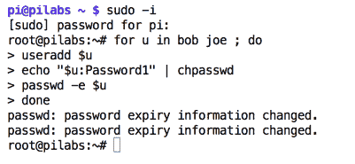

在`for`循环中读取的列表可以动态生成，也可以像之前的例子那样静态生成。要创建动态列表，我们可以使用各种通配符技巧来填充列表。例如，要处理目录中的所有文件，我们可以使用`*`，如以下示例所示：

```
for f in * ; do 
stat "$f" 
done 
```

当生成列表时，例如通过文件通配符，我们应当引用变量参数的扩展。如果不加引号，可能会包含空格，导致命令失败。这就是我们在`stat`命令中看到的情况。

在接下来的示例中，我们筛选出以`ba*`开头的文件名。然后使用`stat`命令打印 inode 元数据。代码和输出如下截图所示：

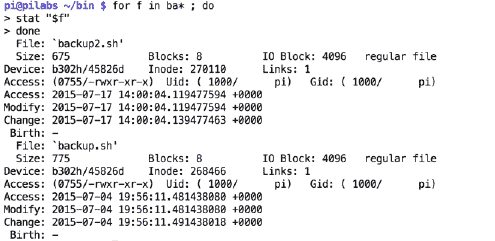

这个列表也可以通过另一个命令的输出或命令管道生成。例如，如果我们需要打印所有已登录用户的当前工作目录，我们可以尝试类似下面的操作：

```
$ for user in $(who | cut -f1 -d" ") ; do
lsof -u "$user" -a -c bash | grep cwd
done 
```

在之前的示例中，我们可以看到，参数名称的选择由我们决定；我们不限于单个字符，在这个例子中我们可以使用`$user`。通过使用小写字母，我们就不会覆盖系统变量`$USER`。以下截图展示了循环及其输出：

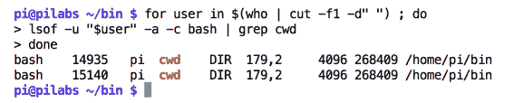

`lsof`命令将列出打开的文件；我们可以依次搜索每个用户打开的文件，并使用`bash`命令作为当前工作目录。

在我们迄今为止创建的脚本中，我们可以创建一个新的脚本，名为`hello9.sh`。如果我们将`$HOME/bin/hello2.sh`脚本复制到新脚本中，我们可以编辑它以使用`for`循环：

```
#!/bin/bash 
echo "You are using $(basename $0)" 
for n in $* 
do 
    echo "Hello $n" 
done 
exit 0 
```

该循环用于遍历每个命令行参数，并逐个问候每个用户。当我们执行脚本时，我们可以看到现在可以为每个用户显示`Hello`消息。以下截图展示了这一点：

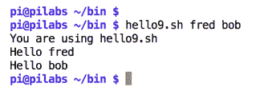

尽管我们在这里看到的内容仍然相对简单，但现在我们应该对脚本和循环的应用有所了解。这个脚本的参数可以是我们已经使用过的用户名，或者其他任何内容。如果我们坚持使用用户名，那么创建用户账户并设置密码将变得非常简单，就像我们之前看到的那样。

# 高级`for`循环

在之前的示例中，我们使用`for`循环遍历简单值，每个值中不包含空格。

如你所知，如果值中包含空格，你应当使用双引号：

```
#!/bin/bash 
for var in one "This is two" "Now three" "We'll check four" 
do 
echo "Value: $var" 
done 
```

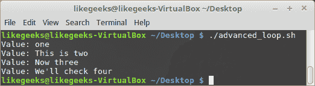

如你所见，每个值都按照预期打印出来，这得益于双引号的使用。

这个示例包含了一行中的值，我们引用了这些值，因为它们包含空格和逗号。如果值位于多行中，比如在文件中，又该如何处理呢？

如果我们要迭代的值之间的分隔符不是空格，而是其他符号，比如逗号或分号，怎么办？

这时就需要用到 IFS。

# IFS

默认情况下，IFS 变量的值是（空格、换行符或制表符）之一。

假设你有一个像下面这样的文件，并且想要遍历它的行：

```
Hello, this is a test 
This is the second line 
And this is the last line 
```

让我们编写一个 `for` 循环来遍历这些行：

```
#!/bin/bash 
file="file1.txt" 
for var in $(cat $file) 
do 
echo " $var" 
done 
```

如果你检查结果，会发现它是我们不需要的：

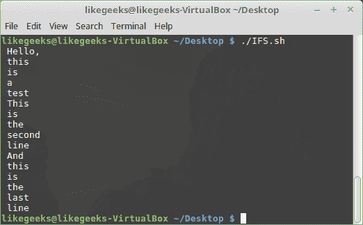

由于 Shell 找到的第一个分隔符是空格，所以 Shell 将每个单词当作一个字段，但我们需要每一行作为一个字段打印。

在这里，我们需要将 IFS 变量改为换行符。

让我们修改脚本，正确遍历每一行：

```
#!/bin/bash 
file="file1.txt" 
IFS=$'\n'   #Here we change the default IFS to be a newline 
for var in $(cat $file) 
do 
echo " $var" 
done 
```

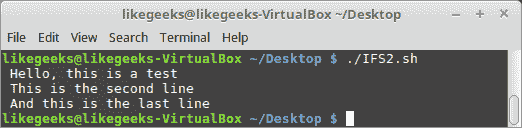

我们将 IFS 变量改为换行符，它按预期工作了。

看看前一节中 IFS 定义里的美元符号，`IFS=$"\n"`。默认情况下，bash 不会解释像 `\r`、`\n` 和 `\t` 这样的转义字符。因此，在我们的例子中，它会被当作 `n` 字符对待，所以要解释转义字符，你必须在前面加上美元符号（`$`），这样它才能正常工作。

但是，如果你的 IFS 是一个普通字符，你根本不需要使用美元符号（`$`）。

# 统计目录和文件

我们可以使用简单的 `for` 循环遍历文件夹内容，并用 `if` 语句检查路径是目录还是文件：

```
#!/bin/bash 
for path in /home/likegeeks/* 
do 
   if [ -d "$path" ] 
   then 
         echo "$path is a directory" 
   elif [ -f "$path" ] 
   then 
         echo "$path is a file" 
   fi 
done 
```

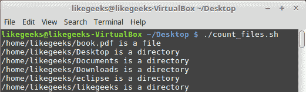

这是一个相当简单的脚本。我们遍历目录内容，然后使用 `if` 语句检查路径是目录还是文件。最后，我们在每个路径旁边打印它是文件还是目录。

我们对路径变量使用了引号，因为文件路径中可能包含空格。

# C 风格的 `for` 循环

如果你有 C 语言背景，你会很高兴地知道，你可以用 C 风格编写 `for` 循环。这个功能是从 KornShell 中借用来的。Shell `for` 循环可以像这样编写：

```
for (v= 0; v < 5; v++) 
{ 
 printf(Value is %d\n", v); 
} 
```

对于 C 开发者来说，在 `for` 循环中使用这种语法是很容易的。

看看这个例子：

```
#!/bin/bash 
for (( v=1; v <= 10; v++ )) 
do 
   echo "value is $v" 
done 
```

选择权在你，`for` 循环有多种语法样式可供选择。

# 嵌套循环

嵌套循环意味着循环中有循环。看看下面的例子：

```
#!/bin/bash 
for (( v1 = 1; v1 <= 3; v1++ )) 
do 
   echo "First loop $v1:" 
   for (( v2 = 1; v2 <= 3; v2++ )) 
   do 
         echo " Second loop: $v2" 
   done 
done 
```

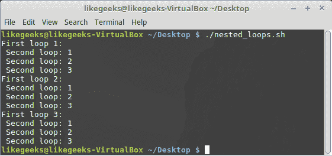

第一个循环首先执行，然后是第二个循环，这个过程重复三次。

# 重定向循环输出

你可以使用 `done` 命令将循环输出重定向到文件：

```
#!/bin/bash 
for (( v1 = 1; v1 <= 5; v1++ )) 
do 
   echo "$v1" 
done > file 
```

如果没有文件，它将被创建，并用循环输出填充。

这种重定向对于不需要将循环输出显示在屏幕上，而是将其保存到文件中的情况非常有用。

# 控制循环

进入我们的循环后，我们可能需要提前退出循环，或者排除某些项目不进行处理。如果我们只想处理列表中的目录，而不是所有类型的文件，那么为了实现这一点，我们有循环控制关键字，比如`break`和`continue`。

`break`关键字用于退出循环，不再处理任何条目，而`continue`关键字则用于停止处理当前循环条目，并继续处理下一个条目。

假设我们只想处理目录，我们可以在循环中实现一个测试，并确定文件类型：

```
$ for f in * ; do
[ -d "$f" ] || continue
chmod 3777 "$f"
done
```

在循环内，我们希望设置权限，包括 SGID 和 sticky 位，但只对目录进行操作。`*`搜索会返回所有文件；循环中的第一个语句会确保我们只处理目录。如果当前循环的测试失败且该目标不是目录，`continue`关键字将跳过该项并处理下一个循环列表中的条目。如果`test`返回`true`并且我们正在处理一个目录，那么我们将继续执行后续语句并执行`chmod`命令。

如果我们需要运行循环，直到找到一个目录并退出循环，我们可以调整代码，以便遍历每个文件。如果文件是目录，我们就使用`break`关键字退出循环：

```
$ for f in * ; do
[ -d "$f" ] && break
done
echo "We have found a directory $f"  
```

在以下截图中，我们可以看到代码的运行效果：

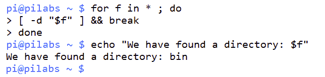

通过使用相同的主题，我们可以使用以下代码打印出列出的每个目录：

```
for f in * ; do
[ -d "$f" ] || continue
dir_name="$dir_name $f"
done
echo "$dir_name"  
```

我们可以通过仅在循环内处理目录来实现结果。我们只使用`if`测试来处理常规文件。在这个例子中，我们将目录名称附加到`dir_name`变量中。退出循环后，我们打印出完整的目录列表。我们可以在以下截图中看到这一点：

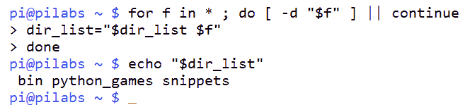

使用这些示例和你自己的想法，你现在应该能够看到如何使用`continue`和`break`关键字来控制循环。

# while 循环和 until 循环

当使用`for`循环时，我们会遍历一个列表；这个列表可以是我们自己创建的，也可以是动态生成的。使用`while`或`until`循环时，我们会基于条件是否变为`true`或`false`来决定是否继续循环。

`while`循环会在条件为真时循环，而`until`循环则会在条件为假时循环。以下命令将从 10 倒数到零，每次循环打印变量的值，然后将该值减一：

```
$ COUNT=10
$ while (( COUNT >= 0 )) ; do
echo -e "$COUNT \c"
(( COUNT-- ))
done ; echo  
```

我们可以在以下截图中看到该命令的输出，从而确认倒计时到零：

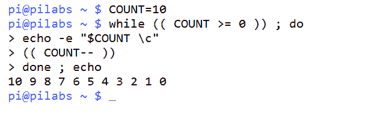

这里使用的`\c`转义序列可以抑制`echo`命令通常使用的换行符。这样，我们就可以让倒计时保持在单行输出中。我相信你会同意，这是一个不错的效果。

使用`until`循环也可以实现该循环的功能；只需要快速调整逻辑，因为我们希望循环直到条件为真。通常来说，选择使用哪个循环取决于个人习惯以及逻辑如何最好地工作。以下示例展示了使用`until`循环编写的循环：

```
$ COUNT=10
$ until (( COUNT < 0 )) ; do
echo -e "$COUNT \c"
(( COUNT-- ))
done ; echo  
```

# 从文件读取输入

现在，看起来这些循环不仅仅能做倒计时。我们可能希望从文本文件中读取数据并处理每一行。本书中之前提到过的 shell 内建`read`命令可以逐行读取文件。这样，我们就可以使用循环逐行处理文件内容。

为了演示这些功能，我们将使用一个包含服务器地址的文件。这些地址可以是主机名或 IP 地址。在以下示例中，我们将使用谷歌 DNS 服务器的 IP 地址。以下命令显示了`servers.txt`文件的内容：

```
$ cat servers.txt
8.8.8.8
8.8.4.4  
```

使用`while`循环中的`read`命令，我们可以只要文件中还有更多行，就继续循环。我们在`done`关键字后直接指定输入文件。对于从文件中读取的每一行，我们可以使用`ping`命令测试服务器是否在线，如果服务器有响应，就将其添加到可用服务器列表中。该列表将在循环结束时打印出来。在下面的示例中，我们可以看到，我们开始将本书中涵盖的脚本元素逐步加入到脚本中：

```
$ while read server ; do
ping -c1 $server && servers_up="$servers_up $server"
done < servers.txt
echo "The following servers are up: $servers_up"
```

我们可以通过以下截图验证操作，截图中捕获了输出：

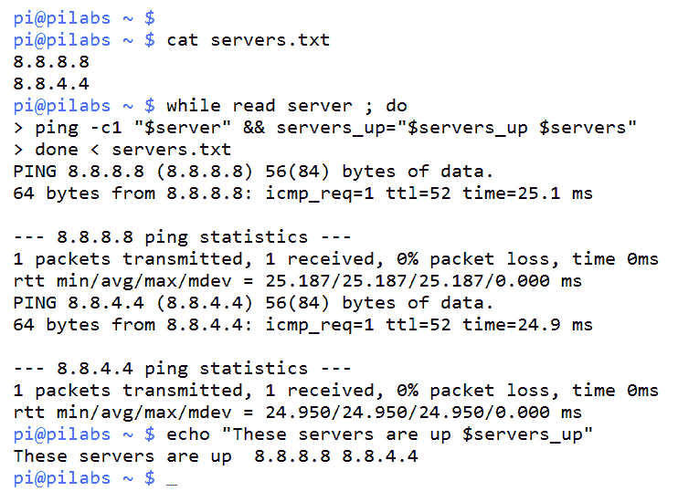

使用这种循环，我们可以开始构建极具实用性的脚本，处理从命令行或其他脚本输入的信息。我们可以轻松地用`$1`替换我们读取的文件名，它代表传递给脚本的一个位置参数。让我们回到`ping_server.sh`脚本，并调整它以接受输入参数。我们可以将脚本复制到新的`$HOME/bin/ping_server_from_file.sh`文件中。在脚本中，我们首先测试输入参数是否为文件。然后，我们创建一个输出文件，文件名中包含日期。当我们进入循环时，我们将可用的服务器添加到该文件中，并在脚本末尾列出该文件：

```
#!/bin/bash 
# Author: @theurbanpenguin 
# Web: www.theurbapenguin.com 
# Script to ping servers from file 
# Last Edited: August 2015 
if [ ! -f"$1 ] ; then 
  echo "The input to $0 should be a filename" 
  exit 1 
fi 
echo "The following servers are up on $(date +%x)"> server.out 
done 
while read server 
do 
  ping -c1 "$server"&& echo "Server up: $server">> server.out 
done 
cat server.out 
```

现在我们可以通过以下方式执行脚本：

```
$ ping_server_from_file.sh servers.txt  
```

脚本执行后的输出应与以下截图类似：

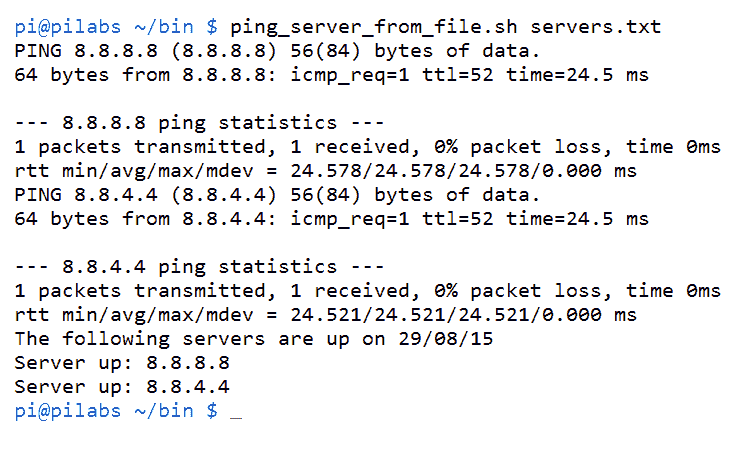

# 创建操作员菜单

我们可以为需要有限功能的 Linux 操作员提供菜单，这些操作员不想学习命令行的详细内容。我们可以使用他们的登录脚本为他们启动一个菜单。该菜单将提供一个命令选择列表，供用户选择。菜单会循环，直到用户选择退出菜单。我们可以创建一个新的`$HOME/bin/menu.sh`脚本；菜单循环的基础将是如下所示：

```
while true 
do 
...... 
done 
```

我们在这里创建的循环是无限的。`true`命令总是返回真，并且会不断循环；然而，我们可以提供一个循环控制机制，允许用户离开菜单。为了开始构建菜单的结构，我们将在循环内回显一些文本，询问用户选择的命令。在每次加载菜单之前，我们将清屏，执行所需命令后会显示一个额外的读取提示。

这允许用户在屏幕被清除并重新加载菜单之前，先查看命令的输出。此时，脚本的代码将如下所示：

```
#!/bin/bash 
# Author: @theurbanpenguin 
# Web: www.theurbapenguin.com 
# Sample menu 
# Last Edited: August 2015 

while true 
do 
  clear 
  echo "Choose an item: a,b or c" 
  echo "a: Backup" 
  echo "b: Display Calendar" 
  echo "c: Exit" 
  read -sn1 
  read -n1 -p "Press any key to continue" 
done 
```

如果你在此阶段执行脚本，将没有机制可以退出脚本。我们尚未为菜单选择项添加任何代码；但是，你可以使用*Ctrl* + *C*键进行测试并退出。

在这个阶段，菜单应该类似于以下截图中的输出：

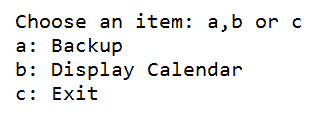

为了构建菜单选择背后的代码，我们将实现一个`case`语句。它将被添加在两个`read`命令之间，如下所示：

```
read -sn1
  case "$REPLY" in
    a) tar -czvf $HOME/backup.tgz ${HOME}/bin;;
    b) cal;;
    c) exit 0;;
  esac
  read -n1 -p "Press any key to continue"
```

我们可以看到我们添加到`case`语句中的三个选项：`a`、`b`和`c`：

+   选项`a`：这将运行`tar`命令，备份脚本

+   选项`b`：这将运行`cal`命令，显示当前月份

+   选项`c`：这将退出脚本

为了确保用户在退出登录脚本时已注销，我们将运行以下内容：

```
exec menu.sh
```

`exec`命令用于确保在`menu.sh`文件完成后退出 shell。这样，用户就不需要接触到 Linux shell。完整的脚本如下所示：

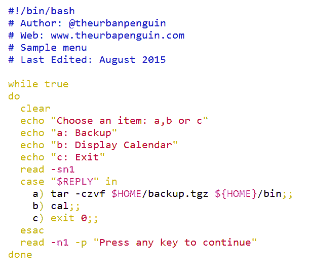

# 总结

我们在本章中已经开始取得进展。我们已将许多之前使用过的元素结合成了一个有机且功能性的脚本。尽管本章的重点是循环，我们也使用了命令行列表、`if`语句、`case`语句和算术运算。

我们通过描述循环是脚本的主力军来开启本章，并且已经通过`for`、`while`和`until`循环展示了这一点。`for`循环用于遍历列表中的元素。列表可以是静态的也可以是动态的；我们着重展示了如何通过文件通配符或命令扩展简单地创建动态列表。

此外，我们还学习了如何迭代复杂值以及如何设置 IFS 以正确地迭代字段。

我们学习了如何编写嵌套循环以及如何将循环输出重定向到文件。

`while`和`until`循环是通过条件控制的。`while`循环将在提供的条件为真时循环执行。`until`循环将在提供的条件为真时停止，或者条件为假时才会继续执行。`continue`和`break`是循环中特有的关键字，通过它们以及`exit`，我们可以控制循环流程。

在下一章中，我们将学习如何使用函数来模块化脚本。

# 问题

1.  以下脚本将在屏幕上打印多少行？

```
#!/bin/bash 
for (( v1 = 12; v1 <= 34; v1++ )) 
do 
echo "$v1" 
done > output 
```

1.  以下脚本将在屏幕上打印多少行？

```
#!/bin/bash 
for (( v=8; v <= 12; v++ )) 
do 
if [ $v -ge 12 ] 
then 
break 
fi 
echo "$v" 
done 
```

1.  以下脚本有什么问题？你如何修复它？

```
#!/bin/bash 
for (( v=1, v <= 10, v++ )) 
do 
echo "value is $v" 
done 
```

1.  以下脚本将在屏幕上打印多少行？

```
#!/bin/bash 
count=10 
while (( count >= 0 )) ; do 
echo $count 
done 
$((count--)) 
exit 0 
```

# 进一步阅读

请参阅以下内容，了解与本章相关的进一步阅读：

+   [`tldp.org/LDP/abs/html/internalvariables.html`](http://tldp.org/LDP/abs/html/internalvariables.html)

+   [`tldp.org/HOWTO/Bash-Prog-Intro-HOWTO-7.html`](http://tldp.org/HOWTO/Bash-Prog-Intro-HOWTO-7.html)

+   [`tldp.org/LDP/Bash-Beginners-Guide/html/sect_09_02.html`](http://tldp.org/LDP/Bash-Beginners-Guide/html/sect_09_02.html)

+   [`tldp.org/LDP/Bash-Beginners-Guide/html/sect_09_03.html`](http://tldp.org/LDP/Bash-Beginners-Guide/html/sect_09_03.html)

+   [`tldp.org/LDP/Bash-Beginners-Guide/html/sect_09_05.html`](http://tldp.org/LDP/Bash-Beginners-Guide/html/sect_09_05.html)
