# 使用函数创建构建模块

在本章中，我们将深入探索函数的精彩世界。我们可以将它们看作是构建强大且灵活脚本的模块化构建块。通过创建函数，我们可以将代码封装在一个与其他脚本隔离的构建块中。专注于改进单一函数要比尝试改进整个脚本更容易。如果没有函数，往往很难专注于问题区域，而且代码会被重复多次，这意味着更新需要在多个位置进行。函数是作为代码块或脚本内脚本的命名元素，它们能够解决更复杂代码中存在的许多问题。

在本章中，我们将涵盖以下主题：

+   引入函数

+   向函数传递参数

+   变量作用域

+   从函数返回值

+   递归函数

+   在菜单中使用函数

# 技术要求

本章的源代码可以从这里下载：

[`github.com/PacktPublishing/Mastering-Linux-Shell-Scripting-Second-Edition/tree/master/Chapter07`](https://github.com/PacktPublishing/Mastering-Linux-Shell-Scripting-Second-Edition/tree/master/Chapter07)

# 引入函数

函数是存在于内存中的**命名元素**代码块。这些元素可以在 shell 环境中创建，也可以在脚本执行中创建。当在命令行输入命令时，首先会检查别名，接着会检查是否有匹配的函数名。要显示在 shell 环境中存在的函数，可以使用以下命令：

```
$ declare -F  
```

输出结果会根据你使用的发行版和你创建的函数数量而有所不同。在我的 Linux Mint 中，部分输出如下所示：

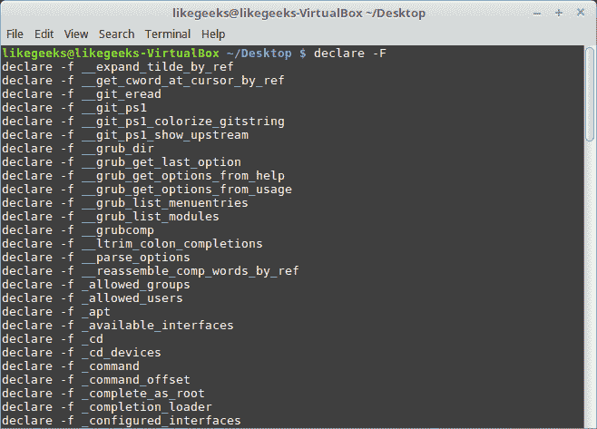

使用小的`-f`选项，你可以显示函数及其相关定义。然而，如果我们只想查看单个函数定义，可以使用`type`命令：

```
$ type quote  
```

上面的代码示例会显示`quote`函数的代码块，如果它存在于你的 shell 中。我们可以在下面的截图中看到这个命令的输出：

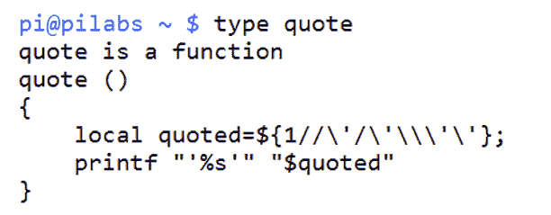

bash 中的`quote`函数会在提供的输入参数周围插入单引号。例如，我们可以展开`USER`变量并将值作为字符串字面量显示；如下面的截图所示。截图捕捉了命令和输出：

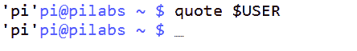

大多数代码可以通过伪代码来表示，伪代码展示了示例布局。函数也不例外，创建函数的代码如下所示：

```
function-name() { 
<code to execute> 
} 
```

此外，还有另一种定义函数的方法，如下所示：

```
function <function-name> { 
<code to execute> 
} 
```

`keyword`函数已被弃用，以符合**可移植操作系统接口**（**POSIX**）规范，但仍有一些开发人员在使用它。

请注意，使用`keyword`函数时不需要`()`，但如果您在没有`keyword`函数的情况下定义该函数，则必须使用`()`。

该函数没有使用`do`和`done`块，这在我们之前的循环中有用。大括号的目的是定义代码块的边界。

显示聚合系统信息的简单函数如下所示。这可以在命令行中创建，并将驻留在您的 shell 中。此函数不会在登录后保持有效，并将在关闭 shell 或取消设置函数时丢失。为了让该函数保持有效，我们需要将其添加到用户帐户的登录脚本中。示例代码如下：

```
$ show_system() {
echo "The uptime is:"
uptime
echo
echo "CPU Detail"
lscpu
echo
echo "User list"
who
}  
```

我们可以像前面提到的实例一样使用`type`命令打印函数的详细信息，截图如下所示：

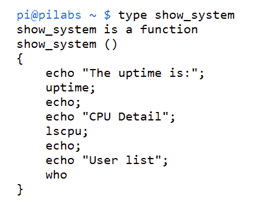

执行该函数时，我们只需输入`show_system`，然后我们将看到来自三条命令`uptime`、`lscpu`和`who`的静态文本和输出。当然，这是一个非常简单的函数，但我们可以通过允许在运行时传递参数来增加更多的功能。

# 向函数传递参数

在本章前面，我们将函数称为脚本中的脚本，我们将继续保持这个类比。就像脚本可以有输入参数一样，我们可以创建接受参数的函数，使其操作不那么静态。在我们编写脚本之前，可以先看看命令行中有用的函数。

我最讨厌的一件事就是配置文件中的注释过多，尤其是在已有文档详细说明可用选项的情况下。

**GNU's Not Unix**（**GNU**）Linux `sed` 命令可以轻松编辑文件并删除注释行和空行。我们在这里介绍了流编辑器`sed`，但我们将在接下来的章节中更详细地了解它。

执行原地编辑的`sed`命令行如下所示：

```
$ sed -i.bak '/^\s*#/d;/^$/d' <filename>  
```

我们可以通过逐个拆解命令行来运行我们的取证分析。让我们深入看看：

+   `sed -i.bak`：这会编辑文件并创建一个扩展名为`.bak`的备份文件。原始文件将作为`<filename>.bak`可访问。

+   `/^`：此插入符号（`^`）表示编辑以插入符号后面的内容开头的行。因此，插入符号匹配行的开始部分。

+   `\s*`：这表示任意数量的空白字符，包括没有空格或制表符。

+   `#/`：这是一个普通的`#`符号。因此，完整的表达式`^\s*#`意味着我们在寻找以注释或空格和注释开头的行。

+   `d`：这是删除操作，用于移除匹配的行。

+   `;/^$/d`：分号用于分隔表达式，第二个表达式类似于第一个，不过这次我们准备删除空行。

要将其转化为函数，我们只需要想一个好的名称。我喜欢将动词融入函数名，这有助于保持独特性并明确函数的目的。我们将按如下方式创建`clean_file`函数：

```
$ function clean_file {
  sed -i.bak '/^\s*#/d;/^$/d' "$1"
}  
```

在脚本中，我们使用位置参数来接受命令行参数。我们可以用`$1`替代之前硬编码的文件名。在函数中，我们会对这个变量加引号，以防文件名中包含空格。为了测试`clean_file`函数，我们将复制一个系统文件并操作这个副本。这样，我们可以确保不会对任何系统文件造成损害。我们可以向所有读者保证，在本书制作过程中，任何系统文件都没有受到伤害。以下是我们需要遵循的详细步骤来测试新函数：

1.  按照描述创建`clean_file`函数

1.  使用`cd`命令（不带参数）进入你的`home`目录

1.  将时间配置文件复制到你的`home`目录 `cp /etc/ntp.conf $HOME`

1.  使用以下命令计算文件中的行数：`wc -l $HOME/ntp.conf`

1.  现在使用`clean_file $HOME/ntp.conf`删除注释行和空行

1.  现在使用`wc -l $HOME/ntp.conf`重新计算行数

1.  此外，检查我们创建的原文件备份的行数：`wc -l $HOME/ntp.conf.bak`

命令的顺序如以下截图所示：

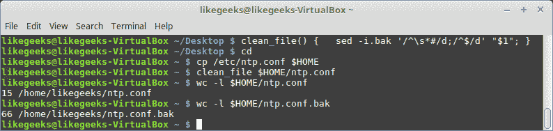

我们可以通过在执行函数时提供的参数来将函数的注意力指向所需的文件。如果我们需要保存这个函数，那么应该将其添加到登录脚本中。然而，如果我们想在脚本中进行测试，可以创建以下文件来执行此操作，并练习我们学到的其他元素。需要注意的是，函数应该始终在脚本开始时创建，因为它们需要在调用时被加载到内存中。可以理解为你的函数需要在启动前被解锁并加载。

我们将创建一个新的 Shell 脚本`$HOME/bin/clean.sh`，并像往常一样设置执行权限。脚本的代码如下：

```
#!/bin/bash 
# Script will prompt for filename 
# then remove commented and blank lines 

is_file() { 
    if [ ! -f "$1" ] ; then 
        echo "$1 does not seem to be a file" 
        exit 2 
    fi 
} 

clean_file() { 
    is_file "$1" 
    BEFORE=$(wc -l "$1") 
    echo "The file $1 starts with $BEFORE" 
    sed -i.bak '/^\s*#/d;/^$/d' "$1" 
    AFTER=$(wc -l "$1") 
    echo "The file $1 is now $AFTER" 
} 

read -p "Enter a file to clean: " 
clean_file "$REPLY" 
exit 1 
```

我们在脚本中提供了两个函数。第一个，`is_file`，只是简单地测试确保我们输入的文件名是一个常规文件。然后我们声明`clean_file`函数，并增加了一些功能，显示操作前后文件的行数。我们还可以看到，函数是可以嵌套的，我们在`clean_file`中调用了`is_file`。

如果没有函数定义，我们在文件末尾只有三行代码，正如之前代码块中的示例代码那样，已保存为`$HOME/bin/clean.sh`。我们首先提示输入文件名，然后运行`clean_file`函数，后者又调用了`is_file`函数。这里主代码的简洁性很重要，复杂性在于函数，因为每个函数都可以作为独立单元进行处理。

我们现在可以测试脚本操作，首先使用一个错误的文件名，正如我们在以下截图中看到的：

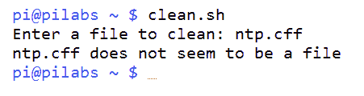

既然我们已经看到使用错误文件的操作，现在可以尝试使用一个实际文件！我们可以使用之前处理过的同一个系统文件。首先，我们需要将文件恢复到原始状态：

```
$ cd $HOME
$ rm $HOME/ntp.conf
$ mv ntp.conf.bak ntp.conf  
```

现在文件已经准备好，我们可以从`$HOME`目录执行脚本，如下图所示：

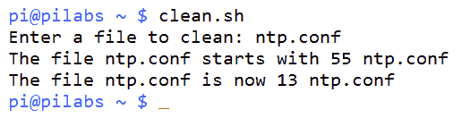

# 传递数组

并非你传递的所有值都是单一值；你可能需要将数组传递给函数。我们来看看如何将数组作为参数传递：

```
#!/bin/bash 
myfunc() { 
   arr=$@ 
   echo "The array from inside the function: ${arr[*]}" 
} 

test_arr=(1 2 3) 
echo "The original array is: ${test_arr[*]}" 
myfunc ${test_arr[*]} 
```

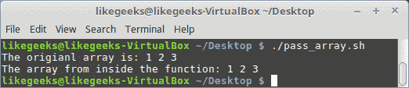

从结果中可以看出，使用的数组是按原样从函数返回的。

注意，我们使用了`$@`来获取函数中的数组。如果你使用`$1`，它只会返回第一个数组元素：

```
#!/bin/bash 
myfunc() { 
   arr=$1 
   echo "The array from inside the function: ${arr[*]}" 
} 

my_arr=(5 10 15) 
echo "The original array: ${my_arr[*]}" 
myfunc ${my_arr[*]} 
```

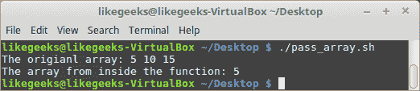

因为我们使用了`$1`，它只返回第一个数组元素。

# 变量作用域

默认情况下，你在函数内部声明的任何变量都是全局变量。这意味着这个变量可以在函数内外都使用，没有问题。

看看这个例子：

```
#!/bin/bash 
myvar=10 
myfunc() { 
   myvar=50 
} 
myfunc 
echo $myvar 

```

如果你运行这个脚本，它将返回`50`，这是在函数内部更改的值。

如果你想声明一个只在函数内有效的变量呢？这就是所谓的局部变量。

你可以使用`local`命令来声明局部变量，像这样：

```
myfunc() { 
   local myvar=10 
} 
```

为了确保变量仅在函数内使用，我们来看一下以下例子：

```
#!/bin/bash 
myvar=30 
myfunc() { 
   local myvar=10 
} 
myfunc 
echo $myvar 
```

如果你运行这个脚本，它将打印出`30`，这意味着局部变量的版本与全局变量的版本不同。

# 从函数返回值

每当我们有在函数内部打印到屏幕上的语句时，我们可以看到它们的结果。然而，很多时候我们希望函数在脚本中填充一个变量，而不显示任何内容。在这种情况下，我们在函数中使用`return`。这在获取用户输入时尤其重要。我们可能希望将输入的内容转换为已知的格式，以便更轻松地进行条件测试。将代码嵌入函数中使得它可以在脚本中多次使用。

以下代码展示了如何通过创建`to_lower`函数来实现这一点：

```
to_lower () 
{ 
    input="$1" 
    output=$( echo $input | tr [A-Z] [a-z]) 
return $output 
} 
```

逐步查看代码后，我们可以开始理解这个函数的操作：

+   `input="$1"`：这主要是为了方便，我们将第一个输入参数分配给名为 input 的变量。

+   `output=$( echo $input | tr [A-Z] [a-z])`：这是函数的主要引擎，负责将大写字母转换为小写字母。我们将输入通过管道传递给`tr`命令来进行大小写转换。

+   `return $output`：这是我们创建返回值的方式。

这个函数的一个使用场景是在一个读取用户输入并简化测试的脚本中，看看他们是否选择了`Q`或`q`。这一点可以在以下代码片段中看到：

```
to_lower () 
{ 
    input="$1" 
    output=$( echo $input | tr [A-Z] [a-z]) 
return $output 
} 

while true 
do 
  read -p "Enter c to continue or q to exit: " 
  $REPLY=$(to_lower "$REPLY") 
  if [ $REPLY = "q" ] ; then 
    break 
  fi 

done 
echo "Finished" 
```

# 递归函数

递归函数是一个从内部调用自身的函数。当你需要从函数内部再次调用该函数时，这个函数非常有用。最著名的例子就是计算阶乘。

要计算 4 的阶乘，你需要将数字乘以递减的数字。你可以这样做：

```
4! = 4*3*2*1
```

`!`符号表示阶乘。

让我们编写一个递归函数，计算任何给定数字的阶乘：

```
#!/bin/bash 
calc_factorial() { 
if [ $1 -eq 1 ] 
then 
echo 1 
else 
local var=$(( $1 - 1 )) 
local res=$(calc_factorial $var) 
echo $(( $res * $1 )) 
fi 
} 

read -p "Enter a number: " val 
factorial=$(calc_factorial $val) 
echo "The factorial of $val is: $factorial" 
```

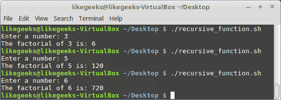

首先，我们定义一个名为`calc_factorial`的函数，在其中我们检查数字是否等于 1，如果是，函数将返回 1，因为 1 的阶乘等于 1。

然后我们将数字减 1，并从函数内部调用该函数，这将再次调用该函数。

这个过程将继续进行，直到它达到 1，然后函数将退出。

# 在菜单中使用函数

在第六章中，*使用循环迭代*，我们创建了`menu.sh`文件。菜单是使用函数的绝佳目标，因为`case`语句通过单行条目非常简单地保持，而复杂性仍然可以存储在每个函数中。我们应该考虑为每个菜单项创建一个函数。如果我们将之前的`$HOME/bin/menu.sh`复制到`$HOME/bin/menu2.sh`，我们可以改善功能。新菜单应如下所示：

```
#!/bin/bash 
# Author: @likegeeks 
# Web: likegeeks.com 
# Sample menu with functions 
# Last Edited: April 2018 

to_lower() { 
    input="$1" 
    output=$( echo $input | tr [A-Z] [a-z]) 
return $output 
} 

do_backup() { 
    tar -czvf $HOME/backup.tgz ${HOME}/bin 
} 

show_cal() { 
    if [ -x /usr/bin/ncal ] ; then 
      command="/usr/bin/ncal -w" 
    else 
      command="/usr/bin/cal" 
    fi 
    $command 
} 

while true 
do 
  clear 
  echo "Choose an item: a, b or c" 
  echo "a: Backup" 
  echo "b: Display Calendar" 
  echo "c: Exit" 
  read -sn1 
  REPLY=$(to_lower "$REPLY") 
  case "$REPLY" in 
    a) do_backup;; 
    b) show_cal;; 
    c) exit 0;; 
  esac 
  read -n1 -p "Press any key to continue" 
done 
```

如我们所见，我们仍然保持了`case`语句的简洁性；然而，我们可以通过函数来增加脚本的复杂性。例如，当选择日历的`b`选项时，我们现在会检查`ncal`命令是否可用。如果可用，我们使用`ncal`并使用`-w`选项来打印周数。我们可以在以下截图中看到这一点，其中我们选择了显示日历并安装了`ncal`：

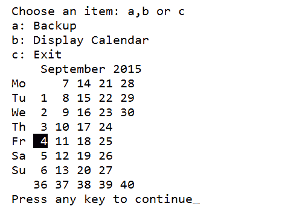

我们也不需要担心*Caps Lock*键，因为`to_lower`函数会将我们的选择转换为小写字母。随着时间的推移，向函数中添加更多元素将变得非常简单，因为我们只影响该单一函数。

# 总结

我们在编写脚本方面仍在快速进步。希望这些想法能对你有所帮助，并且你发现代码示例有用。函数对于脚本的易维护性和最终功能非常重要。脚本越容易维护，你就越有可能随着时间的推移进行改进。我们可以在命令行或脚本中定义函数，但它们必须在使用之前包含在脚本中。

函数本身在脚本运行时被加载到内存中，但只要脚本是通过 fork 方式运行而不是通过 source 方式运行，它们将在脚本执行完毕后从内存中释放。我们在本章中简要介绍了`sed`，在下一章我们将更深入地探讨流编辑器（`sed`）的使用。`sed`命令非常强大，我们可以在脚本中充分利用它。

# 问题

1.  以下代码打印的值是什么？

```
#!/bin/bash 
myfunc() { 
arr=$1 
echo "The array: ${arr[*]}" 
} 

my_arr=(1 2 3) 
myfunc ${my_arr[*]} 
```

1.  以下代码的输出是什么？

```
#!/bin/bash 
myvar=50 
myfunc() { 
myvar=100 
} 
echo $myvar 
myfunc 
```

1.  以下代码有什么问题？你如何修复它？

```
clean_file { 
    is_file "$1" 
    BEFORE=$(wc -l "$1") 
    echo "The file $1 starts with $BEFORE" 
    sed -i.bak '/^\s*#/d;/^$/d' "$1" 
    AFTER=$(wc -l "$1") 
    echo "The file $1 is now $AFTER" 
} 
```

1.  以下代码有什么问题？你如何修复它？

```
#!/bin/bash 
myfunc() { 
arr=$@ 
echo "The array from inside the function: ${arr[*]}" 
} 

test_arr=(1 2 3) 
echo "The origianl array is: ${test_arr[*]}" 
myfunc (${test_arr[*]}) 
```

# 进一步阅读

请参阅以下内容，获取与本章相关的进一步阅读材料：

+   [`tldp.org/HOWTO/Bash-Prog-Intro-HOWTO-8.html`](http://tldp.org/HOWTO/Bash-Prog-Intro-HOWTO-8.html)

+   [`tldp.org/LDP/abs/html/functions.html`](http://tldp.org/LDP/abs/html/functions.html)

+   [`likegeeks.com/bash-functions/`](https://likegeeks.com/bash-functions/)
