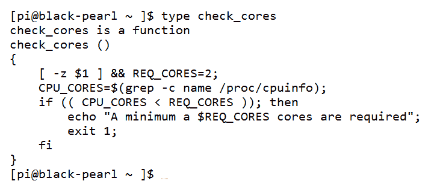
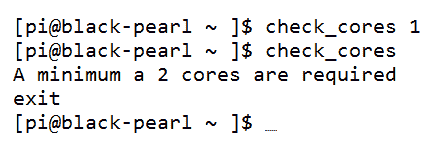
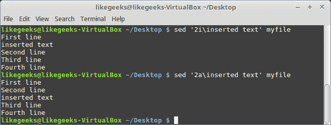

# 第八章：介绍流编辑器

在上一章中，我们看到可以利用`sed`在脚本中编辑文件。`sed`命令是**流编辑器**（**sed**），它逐行打开文件来搜索或编辑文件内容。历史上，这一命令源于 Unix 系统，那时系统可能没有足够的内存来打开非常大的文件。使用`sed`进行编辑是必须的。即使在今天，我们仍然会使用`sed`来修改和显示包含数百或数千条条目的文件数据。它比人工尝试做同样的事更简单、更容易、更可靠。最重要的是，正如我们所见，我们可以在脚本中使用`sed`来自动编辑文件，不需要人工干预。

我们将从查看`grep`并在文件中搜索文本开始。`grep`命令中的`re`是**正则表达式**（regular expression）的缩写。尽管我们在本章中不涉及脚本编写，但我们将介绍一些非常重要的工具，这些工具可以与脚本一起使用。在下一章中，我们将看到`sed`在脚本中的实际应用。

但此刻我们有足够的内容可以处理，我们将在本章中讨论以下主题：

+   使用`grep`显示文本

+   理解`sed`的基础知识

+   其他`sed`命令

+   多个`sed`命令

# 技术要求

本章的源代码可以在这里下载：

[`github.com/PacktPublishing/Mastering-Linux-Shell-Scripting-Second-Edition/tree/master/Chapter08`](https://github.com/PacktPublishing/Mastering-Linux-Shell-Scripting-Second-Edition/tree/master/Chapter08)

# 使用 grep 显示文本

我们将从学习`grep`命令开始。这将帮助我们掌握一些基本的文本搜索概念，然后再深入学习更复杂的正则表达式和使用`sed`编辑文件。

**全局正则表达式打印**（**grep**），或者我们更常称之为`grep`命令，是一个命令行工具，用于在全局范围内（跨文件中的所有行）搜索并将结果打印到`STDOUT`。搜索字符串是一个正则表达式。

`grep`命令是如此常用的工具，它有许多简单的示例和我们每天可以使用它的多种场合。在接下来的部分，我们包含了一些简单且实用的示例，并附有解释。

# 显示接口上接收到的数据

在这个示例中，我们将仅打印从`eth0`接口接收到的数据。

这是我的主要网络连接接口。如果你不确定你的接口名称，可以使用`ifconfig -a`命令来显示所有接口，并选择系统中正确的接口名称。如果找不到`ifconfig`，尝试输入完整路径`/sbin/ifconfig`。

只使用`ifconfig eth0`命令，就可以将大量数据打印到屏幕上。为了只显示接收到的包，我们可以隔离包含`RX packets`（`RX`代表接收）的行。这就是`grep`派上用场的地方：

```
$ ifconfig eth0 | grep "RX packets"  
```

使用管道符或竖线，我们可以将`ifconfig`命令的输出发送到`grep`命令的输入。在这个例子中，`grep`正在搜索一个非常简单的字符串`RX packets`。搜索字符串是区分大小写的，因此我们需要确保正确，或者使用`grep`的`-i`选项使搜索不区分大小写，如下例所示：

```
$ ifconfig eth0 | grep -i "rx packets"  
```

不区分大小写的搜索在查找配置文件中的选项时尤其有用，因为这些选项通常包含大小写混合的情况。

我们可以在以下截图中看到初始命令的结果，确认我们已经成功提取了仅有的单行输出，如下所示：


# 显示用户帐户数据

Linux 中的本地用户帐户数据库是`/etc/passwd`文件，所有用户帐户都可以读取此文件。如果我们想查找包含我们自己数据的那一行，我们可以在搜索中使用我们自己的登录名，或者使用参数扩展和`$USER`变量。我们可以在下面的命令示例中看到这一点：

```
$ grep "$USER" /etc/passwd 
```

在这个示例中，`grep`的输入来自`/etc/passwd`文件，我们搜索的是`$USER`变量的值。同样，在这个例子中，它是一个简单的文本，但它依然是正则表达式，只是没有任何操作符。

为了完整性，我们在下面的截图中包含了输出：


我们可以通过这种类型的查询作为条件，在脚本中稍微扩展它。我们可以用它来检查一个用户帐户是否存在，然后再尝试创建一个新帐户。为了保持脚本尽可能简单，并确保不需要管理员权限，创建帐户的命令行示例将仅显示提示符和条件测试：

```
$ bash
$ read -p "Enter a user name: "
$ if (grep "$REPLY" /etc/passwd > /dev/null) ; then
> echo "The user $REPLY exists"
> exit 1
> fi
```

`grep`搜索现在使用了由`read`填充的`$REPLY`变量。如果我输入`pi`，系统将显示一条消息，并且我们将退出，因为我的用户帐户也叫`pi`。无需显示`grep`的结果；我们只需要寻找一个返回值，是真还是假。为了确保我们不会看到任何不必要的输出，如果用户在文件中，我们将`grep`的输出重定向到特殊设备文件`/dev/null`。

如果你想从命令行运行此操作，首先应该启动一个新的 bash shell。你可以通过简单地输入`bash`来做到这一点。这样，当`exit`命令执行时，它不会让你登出，而是关闭新打开的 shell。我们可以在以下截图中看到这一过程以及指定现有用户时的结果：


# 列出系统中的 CPU 数量

另一个非常有用的功能是，`grep`可以计算匹配的行数，而不显示它们。我们可以用它来计算系统上有多少个 CPU 或 CPU 核心。每个核心或 CPU 都会在`/proc/cpuinfo`文件中列出一个名称。然后，我们可以搜索`name`文本并计算输出；在下面的示例中展示了使用的`-c`选项：

```
$ grep -c name /proc/cpuinfo 
```

我的 CPU 有四个核心，如以下输出所示：


如果我们在另一个只有单核心的 PC Model B 上使用相同的代码，我们将看到以下输出：


我们可以再次在脚本中利用这个方法，确保在运行 CPU 密集型任务之前有足够的核心可用。要在命令行中测试此功能，我们可以使用以下代码，在只有一个核心的 PC 上执行：

```
$ bash
$ CPU_CORES=$(grep -c name /proc/cpuinfo)
$ if (( CPU_CORES < 4 )) ; then
> echo "A minimum of 4 cores are required"
> exit 1
> fi  
```

我们在开始时只运行`bash`，以确保我们不会因为`exit`命令而退出系统。如果这是一个脚本中的操作，那么就不需要此步骤，因为我们会退出脚本，而不是退出 shell 会话。

在 Model B（单核心）的系统上运行此脚本时，我们可以看到脚本的结果，以及一个指示我们没有所需核心数的提示：


如果你需要在多个脚本中运行此检查，你可以在共享脚本中创建一个函数，并在需要检查的脚本中源化包含共享函数的脚本：

```
function check_cores { 
 [ -z $1 ] && REQ_CORES=2 
CPU_CORES=$(grep -c name /proc/cpuinfo) 
if (( CPU_CORES < REQ_CORES  )) ; then 
echo "A minimum of $REQ_CORES cores are required" 
exit 1 
fi 
} 
```

如果参数传递给函数，则将其作为所需的核心数；否则，我们将默认值设置为`2`。如果我们在 Model B PC 的 shell 中定义这个函数，并使用`type`命令显示其详细信息，我们应该能看到如下截图所示：



如果我们在单核心系统上运行此脚本，并指定只需要一个核心，我们会看到在满足要求时没有输出。如果我们没有指定要求，它将默认为`2`个核心，并且我们将无法满足要求，最后会退出 shell。

我们可以看到，当传递参数`1`运行函数时的输出，以及没有传递参数时的输出，见下图：



我们可以看到，即使是`grep`的基本用法在脚本中也非常有用，并且我们如何利用学到的内容开始创建可用的模块来添加到我们的脚本中。

# 解析 CSV 文件

接下来，我们将看看如何创建一个脚本来解析或格式化 CSV 文件。文件的格式化将会在输出中添加新行、制表符和颜色，使其更加易读。然后，我们可以使用`grep`来显示 CSV 文件中的单个条目。这里的实际应用是基于 CSV 文件的目录系统。

# CSV 文件

CSV 文件，或者说逗号分隔值列表，将来自当前目录中的名为 `tools` 的文件。这个文件是我们销售的产品目录。文件内容如下所示：

```
drill,99,5 
hammer,10,50 
brush,5,100 
lamp,25,30 
screwdriver,5,23 
table-saw,1099,3 
```

这只是一个简单的演示，因此我们不期望有太多数据，但目录中的每个项目包括以下内容：

+   名称

+   价格

+   库存单位

我们可以看到我们有一台售价 99 美元的钻孔机，并且库存有五个。如果我们用 `cat` 列出文件，显示效果并不友好；然而，我们可以编写一个脚本，以更吸引人的方式显示数据。我们可以创建一个名为 `$HOME/bin/parsecsv.sh` 的新脚本：

```
#!/bin/bash 
OLDIFS="$IFS" 
IFS="," 
while read product price quantity 
do 
echo -e "\331;33m$product \
        ========================\033[0m\n\ 
Price : \t $price \n\ 
Quantity : \t $quantity \n" 

done <"$1" 
IFS=$OLDIFS 
```

让我们一起来分析一下这个文件，看看其中的相关元素：

| **元素** | **含义** |
| --- | --- |
| `OLDIFS="$IFS"` | `IFS` 变量存储文件分隔符，通常是空格字符。我们可以保存旧的 `IFS`，以便在脚本结束时恢复它，确保脚本完成后环境保持不变，无论脚本如何运行。 |
| `IFS=","` | 我们将分隔符设置为逗号，以便与 CSV 文件匹配。 |
| `while read product price quantity` | 我们进入一个 `while` 循环，用来填充我们需要的三个变量：`product`、`price` 和 `quantity`。`while` 循环会逐行读取输入文件，并填充每个变量。 |
| `echo ...` | `echo` 命令将产品名称显示为蓝色，并在下方加上双下划线。其他变量会打印在新行上，并缩进显示。 |
| `done <"$1"` | 这里我们读取输入文件，该文件作为参数传递给脚本。 |

脚本如下所示：


# 理解 `sed` 的基础

在构建了一些基础之后，我们现在可以开始查看一些 `sed` 的操作。大多数 Linux 系统都会提供这些命令，并且它们是核心命令。

我们将直接深入一些简单的例子：

```
$ sed 'p' /etc/passwd  
```

`p`操作符将打印匹配的模式。在这种情况下，我们没有指定模式，因此将匹配所有内容。在不抑制`STDOUT`的情况下打印匹配的行将会重复行。此操作的结果是将`passwd`文件中的所有行打印两次。为了仅打印修改后的行，我们使用`-n`选项：

```
$ sed -n 'p' /etc/passwd  
```

太棒了！！我们刚刚重新发明了`cat`命令。现在我们可以专门处理一系列行：

```
$ sed -n '1,3 p ' /etc/passwd  
```

现在我们已经重新发明了`head`命令，但我们也可以在正则表达式模式中指定范围来重现`grep`命令：

```
$ sed -n '/^root/ p' /etc/passwd  
```

我们可以在以下截图中看到这个演示：


注意，插入符号（`^`）表示行的开头，这意味着行必须以单词`root`开头。别担心，我们将在单独的章节中解释所有这些正则表达式字符。

# 替换命令

我们已经看到了用于打印模式空间的`p`命令。实际上，`p`是`substitute`命令`s`的一个标志。

`substitute`命令的写法如下：

```
$ sed s/pattern/replacement/flags  
```

有三个常用的标志与`substitute`命令一起使用：

+   `p`: 打印原始内容

+   `g`: 对所有出现进行全局替换

+   `w`: 文件名：将结果发送到文件

现在我们将看一下`substitute`命令或`s`。使用这个命令，我们可以将一个字符串替换为另一个字符串。同样，默认情况下，我们将输出发送到`STDOUT`而不编辑文件。

要更换用户`pi`的默认 shell，可以使用以下命令：

```
sed -n ' /^pi/ s/bash/sh/p ' /etc/passwd  
```

我们继续使用`p`命令打印匹配的模式，并使用`-n`选项来抑制`STDOUT`。我们搜索以`pi`开头的行，这代表用户名。然后我们使用`s`命令来替换这些匹配的行中的文本。这需要两个参数：第一个是要搜索的文本，第二个表示用来替换原始文本的文本。在这种情况下，我们查找`bash`并将其替换为`sh`。这很简单并且有效，但长期来看可能不是很可靠。我们可以在以下截图中看到输出：


我们必须强调，目前我们并没有编辑文件，只是将其显示在屏幕上。原始的`passwd`文件保持不变，我们可以以标准用户身份运行此命令。在前面的示例中，我提到搜索可能不够可靠，因为我们搜索的字符串是`bash`。这个字符串很短，也许在其他匹配的行中也可以找到它。可能某人的姓氏可能是`Tabash`，其中包含字符串`bash`。我们可以扩展搜索范围，查找`/bin/bash`并将其替换为`/bin/sh`。但是，这引入了另一个问题：默认的分隔符是斜杠，所以我们必须转义每个用于搜索和替换字符串中的斜杠，具体如下：

```
sed -n ' /^pi/ s/\/bin\/bash/\/usr\/bin\/sh/p ' /etc/passwd  
```

这是一个选项，但它并不整洁。更好的解决方案是了解我们使用的第一个定界符定义了定界符。换句话说，您可以使用任何字符作为定界符。在这种情况下，使用`@`符号可能是一个好主意，因为它既不出现在搜索字符串中，也不出现在替换字符串中：

```
sed -n ' /^pi/ s@/bin/bash@/usr/bin/sh@p ' /etc/passwd  
```

我们现在有了更可靠的搜索和更易读的命令行，这是一个好事。我们只替换了每行的第一个`/bin/bash`为`/bin/sh`。如果需要替换第一个以上的出现，我们在末尾添加`g`命令，表示全局替换：

```
sed -n ' /^pi/ s@bash@sh@pg ' /etc/passwd 
```

在我们的案例中，这是不必要的，但知道这一点是很有帮助的。

# 全局替换

假设我们有以下示例文件：

```
Hello, sed is a powerful editing tool. I love working with sed
If you master sed, you will be a professional one
```

让我们尝试在这个文件上使用`sed`：

```
$ sed 's/sed/Linux sed/' myfile
```

在这里，我们使用`sed`将单词`sed`替换为`Linux sed`：


如果仔细检查结果，您会注意到`sed`只修改了每行的第一个词。

如果您想替换所有出现，这可能不是您想要的效果。

这里是`g`标志。

让我们再次使用它并查看结果：

```
$ sed 's/sed/Linux sed/g' myfile  
```


现在所有的出现都已被修改。

您可以使用`w`标志将这些修改应用到文件中：

```
$ sed 's/sed/Linux sed/w outputfile' myfile  
```

同样，您可以限制同一行中出现的次数，因此我们可以仅修改每行的前两个出现，如下所示：

```
$ sed 's/sed/Linux sed/2' myfile 
```

所以，如果有第三次出现，它将被忽略。

# 限制替换

我们看到`g`标志如何修改同一行中的所有出现，这适用于整个文件的所有行。

如果我们想限制编辑到特定行？或者特定的行范围呢？

我们可以像这样指定结束行或行范围：

```
$ sed '2s/old text/new text/' myfile 
```

上述命令只会修改文件的第二行。以下命令将仅修改第三行到第五行：

```
$ sed '3,5s/old text/new text/' myfile  
```

以下命令将从第二行修改到文件末尾：

```
$ sed '2,$s/old text/new text/' myfile  
```

# 编辑文件

使用`w`标志，我们可以将编辑内容写入文件，但如果我们想直接编辑文件本身怎么办？我们可以使用`-i`选项。我们需要有权限操作该文件，但可以先复制文件来操作，这样我们就不会损害任何系统文件，也不需要额外的权限。

我们可以将`passwd`文件复制到本地：

```
$ cp /etc/passwd "$HOME"
$ cd 
```

我们用`cd`命令来确保我们在`home`目录下工作，并且在本地`passwd`文件中操作。

`-i`选项用于执行就地更新。当编辑文件时，我们不需要`-n`选项或`p`命令。因此，命令变得像以下示例一样简单：

```
$ sed -i ' /^pi/ s@/bin/bash@/bin/sh/ ' $HOME/passwd 
```

该命令不会输出任何内容，但文件现在会反映出更改。以下截图展示了命令的使用：


在进行更改之前，我们应该通过在`-i`选项后直接添加一个字符串（不留空格）来备份。这在以下示例中展示：

```
$ sed -i.bak ' /^pi/ s@/bin/bash@/bin/sh/ ' $HOME/passwd  
```

如果我们想要查看这个，我们可以反转搜索并替换字符串：

```
$ sed -i.bak ' /^pi/ s@/bin/sh@/bin/bash/ ' $HOME/passwd  
```

这将使本地的 `passwd` 文件与之前相同，并且我们将有一个带有先前更改集的 `passwd.bak`。这样，如果需要，我们就有回滚选项。

# 其他 `sed` 命令

`sed` 提供了许多命令，可以轻松插入、更改、删除和转换文本。让我们看看如何使用这些命令与 `sed` 的一些示例。

# 删除命令

您可以使用 `delete` 命令 `d` 从流中删除行或一系列行。以下命令将删除流中的第三行：

```
$ sed '3d' myfile  
```

以下命令将从流中删除第三到第五行：

```
$ sed '3,5d' myfile  
```

此命令将删除从第四行到文件末尾的内容：

```
$ sed '4,$d' myfile
```

请注意，删除仅发生在流中，而不是实际文件。因此，如果要从实际文件中删除，可以使用 `-i` 选项：

```
$ sed -i '2d' myfile #Permenantly delete the second line from the file  
```

# 插入和追加命令

`insert`，`i` 和 `append`，`a` 命令以几乎相同的方式工作，只有轻微的差异。

`insert` 命令在指定行或模式前插入指定文本。

`append` 命令在指定行或模式后插入指定文本。

让我们看几个例子。

我们的示例 02 文件将会是这样：

```
First line
Second line
Third line
Fourth line
```

要插入一行，您需要使用 `insert` 命令 `i` 如下：

```
$ sed '2i\inserted text' myfile 
```

要添加一行，您需要使用如下的 `append` 命令 `a`：

```
$ sed '2a\inserted text' myfile 
```

查看结果并检查插入行的位置：



# 更改命令

我们看到如何使用 `substitute` 命令 `s` 替换出现次数。那么 `change` 命令是什么，它又有什么不同？

`change` 命令，`c`，用于更改整行。

要更改一行，您可以使用 `change` 命令如下：

```
$ sed '2c\modified the second line' myfile  
```


我们用新行替换了第二行。

# 转换命令

`transform` 命令用于将任何字母或数字替换为另一个，例如大写字母或将数字转换为不同的数字。

它的工作原理类似于 `tr` 命令。

您可以像这样使用它：

```
$ sed 'y/abc/ABC/' myfile  
```


转换适用于整个流，不能限制。

# 多个 `sed` 命令

在所有先前的例子中，我们只对我们的流应用了一个 `sed` 命令。那么如何运行多个 `sed` 命令呢？

您可以通过使用 `-e` 选项，并用分号分隔命令来做到这一点，如下所示：

```
$ sed -e 's/First/XFirst/; s/Second/XSecond/' myfile
```


此外，您可以将每个命令输入到单独的行中，结果将相同：

```
$ sed -e '
> s/First/XFirst/
> s/Second/XSecond/' myfile  
```

`sed` 命令提供了很大的灵活性；如果使用得当，您将获得很多的权力。

# 概要

这是另一个你已经牢牢掌握的章节，希望它对你真的有用。虽然我们希望专注于使用`sed`，但我们首先介绍了`grep`在脚本内部和外部的强大功能。尽管我们仅仅触及了`sed`的表面，我们将在下一个章节中扩展这些内容，深入讲解我们所学的知识。

此外，我们学习了如何替换文本、如何限制和全局化替换操作，以及如何使用`-i`选项保存编辑流。

我们学习了如何使用`sed`插入、追加、删除和转换文本。

最后，我们学习了如何使用`-e`选项运行多个`sed`命令。

在下一个章节中，我们将学习如何自动化 Apache 虚拟主机，如何自动创建新的虚拟主机，以及其他一些很酷的操作。这些操作的核心工具将是`sed`和`sed`脚本。

# 问题

1.  假设你有一个包含以下内容的文件：

```
Hello, sed is a powerful editing tool. I love working with sed
If you master sed, you will be a professional one
```

并假设你使用了以下命令：

```
$ sed 's/Sed/Linux sed/g' myfile 
```

将有多少行会被替换？

1.  假设你有和前一个问题中相同的文件，并且你使用了以下命令：

```
$ sed '2d' myfile  
```

将有多少行会从文件中删除？

1.  在以下示例中，插入的行位于哪个位置？

```
$ sed '3a\Example text' myfile  
```

1.  假设你有一个和之前相同的示例文件，并且你执行了以下命令：

```
$ sed '2i\inserted text/w outputfile' myfile  
```

将有多少行被保存到输出文件中？

# 深入阅读

请参阅以下内容，获取与本章相关的进一步阅读材料：

+   [`www.gnu.org/software/sed/manual/sed.html`](https://www.gnu.org/software/sed/manual/sed.html)

+   [`linux.die.net/man/1/sed`](https://linux.die.net/man/1/sed)
