# 自动化 Apache 虚拟主机

现在，我们已经了解了一些 **流编辑器**（**sed**）的内容，可以将这些知识付诸实践。在第八章，*介绍流编辑器*，我们熟悉了`sed`的一些功能；然而，这只是编辑器所包含功能的一小部分。在本章中，我们将进一步练习`sed`，并接触一些工具的实际用途，尤其是在使用 bash 脚本时。

在本次旅程中，我们将使用`sed`帮助我们自动化创建基于名称的 Apache 虚拟主机。Apache 主机是我们展示过的`sed`的实际应用，但更重要的是，我们将使用`sed`在主配置文件中搜索选定的行。然后，我们会取消注释这些行并将其保存为模板。创建好模板后，我们将基于它创建新的配置文件。我们在 Apache 上展示的概念可以应用于许多不同的情况。

我们将发现，在 shell 脚本中使用`sed`将使我们能够轻松地从主配置中提取模板数据，并根据虚拟主机的需求进行调整。通过这种方式，我们将能够扩展对`sed`和 shell 脚本的理解。本章中，我们将涵盖以下主题：

+   基于名称的 Apache 虚拟主机

+   自动化虚拟主机创建

# 技术要求

你将需要以下内容：

+   CentOS 7.x 机器

+   已安装 Apache 2.4.x web 服务器

你可以按照以下步骤安装 Apache：

```
    $ sudo yum install httpd
```

然后你可以启动 web 服务器：

```
    $ systemctl start httpd 
```

你可以通过以下命令检查服务的状态，确保它已经在运行：

```
    $ systemctl status httpd   
```

本章的源代码可以从这里下载：

[`github.com/PacktPublishing/Mastering-Linux-Shell-Scripting-Second-Edition/tree/master/Chapter09`](https://github.com/PacktPublishing/Mastering-Linux-Shell-Scripting-Second-Edition/tree/master/Chapter09)

# 基于名称的 Apache 虚拟主机

在本次演示中，我们将使用来自 CentOS 7.x 主机的 Apache 2.4 HTTPD 服务器中的 `httpd.conf` 文件。坦率地说，我们更关心的是配置文件本身，因为它是由 Red Hat 或 CentOS 提供的，而不是我们将做的实际配置更改。该文件可以从本章的代码包中下载。我们的目的是学习如何从系统提供的文件中提取数据并创建一个模板。我们可以将这种方法应用于 Apache 配置文件或任何其他文本数据文件。我们关注的是方法论，而不是实际的结果。

为了理解我们要做的事情，我们必须首先查看 `/etc/httpd/conf/httpd.conf` 文件，这在 CentOS、Red Hat Enterprise Linux 或 Scientific Linux 中是相同的。以下截图显示了我们感兴趣的文件中的虚拟主机部分：

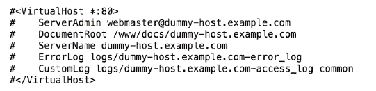

从这些行中可以看出，它们是注释的，而且这全部是一个单体的 `httpd.conf` 文件的一部分。在创建虚拟主机时，我们通常会为每个潜在的虚拟主机提供单独的配置。我们需要能够从主文件中提取这些数据，并同时去除注释。然后，我们可以将这些未注释的数据保存为模板。

使用此模板，我们将创建新的配置文件，代表我们需要在同一实例的 Apache 上运行的不同命名 `hosts`。这使得我们可以在单个服务器上托管 `sales.example.com` 和 `marketing.example.com`。销售和营销将拥有各自独立的配置和网站，互不干扰。此外，使用我们创建的模板，还可以轻松地添加我们需要的额外站点。主 Web 服务器的任务是读取传入的 HTTP 头请求，并根据使用的域名将其定向到正确的站点。

我们的第一个任务将是提取出 `VirtualHost` 开闭标签之间的内容，去除注释，并将其保存为模板。这只需要做一次，并且不会成为我们创建虚拟主机的主要脚本的一部分。

# 创建虚拟主机模板

由于我们不会测试所创建的虚拟主机，我们将复制一份 `httpd.conf` 文件，并在 `home` 目录下本地处理它。在开发脚本时，这是一个良好的实践，以避免影响正在使用的配置。我正在使用的 `httpd.conf` 文件应能够与脚本中的其他资源一起从发布者处下载。或者，你也可以从已安装 Apache 的 CentOS 主机复制它。确保将 `httpd.conf` 文件复制到你的 `home` 目录，并在 `home` 目录中进行操作。

# 第一步骤

创建模板的第一步是隔离出我们需要的行。在我们的例子中，这将是我们在前面截图中看到的示例虚拟主机定义中的行。这包括 `VirtualHost` 的开闭标签以及其中的所有内容。我们可以使用行号来实现这一点；然而，这可能不可靠，因为我们需要假设文件中没有任何更改，以保证行号一致。为了完整起见，我们将在介绍更可靠的机制之前先展示这一方法。

首先，我们会回顾一下如何使用 `sed` 打印整个文件。这很重要，因为在下一步中，我们将过滤显示，并只显示我们需要的行：

```
$ sed -n ' p ' httpd.conf
```

`-n` 选项用于抑制标准输出，引用中的 `sed` 命令是 `p`；它用于显示模式匹配。由于我们在这里没有过滤任何内容，因此匹配的模式就是整个文件。如果我们要使用行号进行过滤，可以通过 `sed` 容易地添加行号，如以下命令所示：

```
$ sed = httpd.conf 
```

从以下截图中，我们可以看到，在此系统中，我们只需要处理`355`到`361`行；不过，我再次强调，这些行号可能会因文件不同而有所变化：

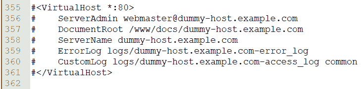

# 隔离行

要显示这些包含在标签中的行，我们可以为`sed`添加一个行范围。这可以通过将这些行号添加到`sed`命令中来轻松实现，如下所示：

```
$ sed -n '355,361 p ' httpd.conf 
```

使用指定的行范围后，我们能够轻松地隔离出所需的行，现在显示的仅是虚拟主机定义的相关行。我们可以在以下截图中看到这一点，截图展示了命令和输出结果：

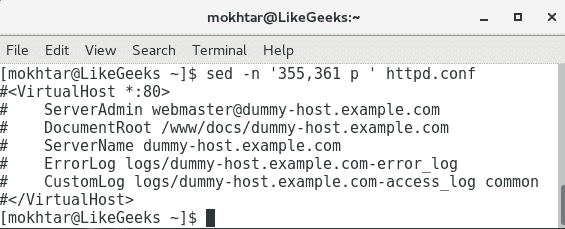

我们在硬编码行号时遇到的问题是，失去了灵活性。这些行号与此文件相关，可能仅与此文件相关。我们总是需要检查与我们正在处理的文件相关的正确行号。如果这些行不方便地位于文件的末尾，我们可能需要向后滚动才能找到正确的行号，这会是一个问题。为了解决这些问题，我们可以直接实现对开闭标签的搜索，而不是使用行号：

```
$ sed -n '/^#<VirtualHost/,/^#<\/VirtualHost/p' httpd.conf
```

我们不再使用起始和结束的行号，而是使用更可靠的起始正则表达式和结束正则表达式。起始正则表达式用于查找以`#<VirtualHost`开头的行。结束正则表达式则用来查找结束标签。然而，我们需要用转义字符保护`/VirtualHost`。通过查看正则表达式的结尾部分，我们可以看到它转换为查找以`#\/VirtualHost`开头的行，其中斜杠被转义。

如果你还记得在第八章《流编辑器介绍》中提到的内容，我们通过使用插入符号（`^`）来指定以特定字符开头的行。

通过查看以下截图，我们现在可以更加可靠地隔离所需的行，而无需知道行号。这对于编辑过的文件尤为重要，因为它们的行号会有所不同：

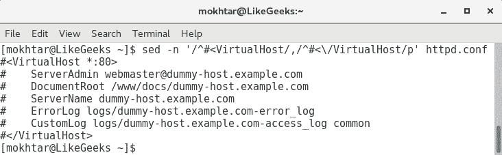

# sed 脚本文件

隔离行只是第一步！我们还需要取消注释这些行，然后将结果保存为模板。尽管我们可以将这些操作写成一个单独的`sed`命令，但我们可以看到这将会非常冗长，不易阅读和编辑。幸运的是，`sed`命令确实提供了从输入文件读取命令的选项，这个文件通常称为脚本。我们使用`-f`选项和`sed`一起，指定我们想要作为控制的文件。

我们已经看到，能够从文件中提取出正确的行。因此，脚本的第一行配置了我们将要处理的行。我们使用大括号`{}`来定义一个代码块，这个代码块会立即在选定的行之后启动。

代码块是我们希望在给定选择上运行的一个或多个命令。

在我们的案例中，第一个命令将删除注释，第二个命令将把模式空间写入到新文件中。`sed`脚本应该如下所示：

```
/^#<VirtualHost/,/^#<\/VirtualHost/ { 
s/^#// 
w template.txt 
} 
```

我们可以将此文件保存为`$HOME/vh.sed`。

在第一行中，我们选择了要处理的行，正如我们之前所见，然后用左大括号开启了代码块。在第二行中，我们使用了`substitute`命令`（s）`。它会查找以注释或`#`开头的行。我们将注释替换为空字符串。中间和末尾的斜杠之间没有任何字符或空格。在英语中，我们是在取消注释这行，但对代码而言，这只是将`#`替换为空字符串。代码的最后一行使用`w`命令将其保存到`template.txt`文件中。为了帮助你理解，我们附上了`vh.sed`文件的截图：

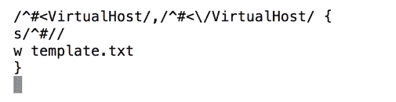

我们现在可以看到我们的所有努力取得了成果，确保我们处在与`httpd.conf`和`vh.sed`文件相同的目录中，并执行以下命令：

```
$ sed -nf vh.sed httpd.conf  
```

我们现在已经在工作目录中创建了`template.txt`文件。这是从`httpd.conf`文件中提取出的未注释文本。简而言之，我们在毫秒级的时间内从超过 350 行的文本中提取了七行正确的内容，去除了注释，并将结果保存为一个新文件。`template.txt`文件如下面的截图所示：

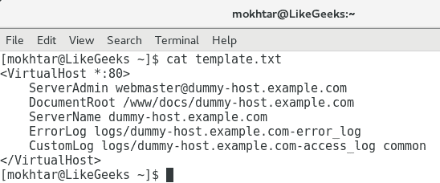

现在我们有了一个模板文件，可以开始使用它来创建虚拟主机定义。即使我们看到的是 Apache 的配置，去除文本注释或删除选定行的第一个字符的相同思路也可以应用到许多情境中，因此请将其作为`sed`功能的一个例子。

# 自动化虚拟主机创建

创建了模板后，我们现在可以利用它来创建虚拟主机配置。简单来说，我们需要将`dummy-host.example.com`的 URL 替换为`sales.example.com`或`marketing.example.com`的 URL。当然，我们还必须创建`DocumentRoot`目录，也就是存放网页的目录，并且添加一些基本内容。当我们使用脚本执行整个过程时，什么都不会被遗漏，每次编辑都会很准确。脚本的基础如下：

```
#!/bin/bash 
WEBDIR=/www/docs 
CONFDIR=/etc/httpd/conf.d 
TEMPLATE=$HOME/template.txt 
[ -d $CONFDIR ] || mkdir -p $CONFDIR 
sed s/dummy-host.example.com/$1/ $TEMPLATE > $CONFDIR/$1.conf 
mkdir -p $WEBDIR/$1 
echo "New site for $1" > $WEBDIR/$1/index.html 
```

我们可以忽略第一行的 shebang；我们现在应该已经知道了。我们可以从脚本的第二行开始解释：

| **行号** | **含义** |
| --- | --- |
| `WEBDIR=/www/docs/` | 我们初始化`WEBDIR`变量，并将其存储在指向存放不同网站的目录路径中。 |
| `CONFDIR=/etc/httpd/conf.d` | 我们初始化`CONFDIR`变量，用于存储新创建的虚拟主机配置文件。 |
| `TEMPLATE=$HOME/template.txt` | 我们初始化将用于模板的变量。这应指向我们的模板文件路径。 |
| `[ -d $CONFDIR ] &#124;&#124; mkdir -p "$CONFDIR"` | 在一个工作的`EL6`主机上，该目录将存在并包含在主配置中。如果我们将其作为纯粹的测试运行，则可以创建一个目录来证明我们可以在目标目录中创建正确的配置。 |
| `sed s/dummy-host.example.com/$1/ $TEMPLATE >$CONFDIR/$1.conf` | `sed`命令作为脚本中的引擎，执行搜索和替换操作。使用`sed`中的替换命令，我们搜索虚拟文本并将其替换为传递给脚本的参数。 |
| `mkdir -p $WEBDIR/$1` | 在这里，我们创建正确的子目录来存放新虚拟主机的网站。 |
| `echo "New site for $1" > $WEBDIR/$1/index.html` | 在这最后一步，我们为网站创建一个基础的占位页面。 |

我们可以将此脚本创建为`$HOME/bin/vhost.sh`。别忘了添加执行权限。这在以下截图中有示例：

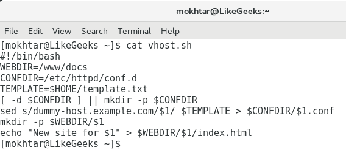

要创建销售虚拟主机和网页，我们可以按照以下示例运行脚本。我们将直接以 root 用户身份运行脚本。或者，您也可以选择在脚本中使用`sudo`命令：

```
# vhost.sh sales.example.com  
```

我们现在可以看到，使用精心设计的脚本，我们可以多么轻松地创建虚拟主机。虚拟主机的配置文件将创建在`/etc/httpd/conf.d/`目录中，文件名将为`sales.example.com.conf`。该文件将类似于以下截图所示：

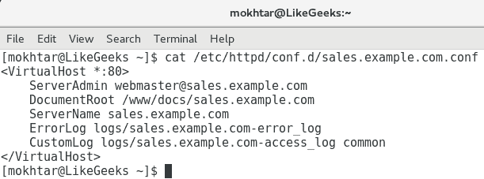

网站内容必须已经创建在`/www/docs/sales.example.com`目录中。这将是一个简单的占位页面，证明我们可以通过脚本实现这一点。使用以下命令，我们可以列出网站内容或我们用来存放每个站点的基础目录：

```
$ ls -R /www/docs  
```

`-R`选项允许递归列出。我们使用`/www/docs`目录纯粹是因为它在我们提取的原始虚拟主机定义中已设置。如果在实际环境中工作，您可能更愿意使用`/var/www`或类似目录，而不是在文件系统的根目录下创建新目录。编辑我们创建的模板非常简单，您也可以在模板创建时使用`sed`来实现。

# 创建网站时提示输入数据

我们现在可以使用脚本来创建虚拟主机和内容，但除了虚拟主机名之外，我们没有允许任何自定义。当然，这是很重要的。毕竟，正是这个虚拟主机名在配置文件中使用，并且在设置网站目录和配置文件名时也会用到。

我们有可能允许在虚拟主机创建过程中指定额外的选项。我们将使用 `sed` 根据需要插入数据。`sed` 命令中的 `i` 用于在选择前插入数据，`a` 用于在选择后追加数据。

对于我们的示例，我们将添加一个主机限制，只允许本地网络访问该网站。我们更关心的是将数据插入文件，而不是我们对特定的 HTTP 配置文件所做的事情。在脚本中，我们将添加 `read` 提示并在配置中插入一个 `Directory` 块。

为了尝试解释我们想要做的事情，在执行脚本时，我们应该看到类似以下内容的输出。您可以从文本中看到，我们正在为营销网站创建它，并添加了访问限制，指定谁可以访问该网站：

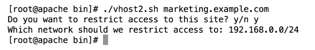

如您所见，我们可以问两个问题，但如果需要，可以添加更多问题以支持自定义，目的是确保额外的自定义像脚本创建一样准确可靠。您也可以选择通过示例答案来详细阐述问题，以便用户了解网络地址应该如何格式化。

为了帮助脚本创建，我们将原始的 `vhost.sh` 复制到 `vhost2.sh`。我们可以整理脚本中的一些项目，以便更容易扩展，然后添加额外的提示。新脚本将类似于以下代码：

```
#!/bin/bash 
WEBDIR=/www/docs/$1 
CONFDIR=/etc/httpd/conf.d 
CONFFILE=$CONFDIR/$1.conf 
TEMPLATE=$HOME/template.txt 
[ -d $CONFDIR ] || mkdir -p $CONFDIR  
sed s/dummy-host.example.com/$1/ $TEMPLATE > $CONFFILE 
mkdir -p $WEBDIR 
echo "New site for $1" > $WEBDIR/index.html 
read -p "Do you want to restrict access to this site? y/n " 
[ ${REPLY^^} = 'n' ] && exit 0 
read -p "Which network should we restrict access to: " NETWORK 
sed -i "/<\/VirtualHost>/i <Directory $WEBDIR >\ 
  \n  Order allow,deny\ 
  \n  Allow from 127.0.0.1\ 
  \n  Allow from $NETWORK\ 
\n</Directory>" $CONFFILE 
```

请注意，我们在脚本中没有运行太多的检查。这是为了保持我们对所添加元素的关注，而不是一个健壮的脚本。在您自己的环境中，一旦脚本按预期运行，您可能需要实施更多的检查以确保脚本的可靠性。

如您所见，我们有更多的行。`WEBDIR` 变量已被调整为包含目录的完整路径，类似地，我们添加了一个新的变量 `CONFFILE`，以便直接引用该文件。如果第一个提示的答案是 `n` 且用户不希望进行额外的自定义，脚本将退出。如果用户回答除了 `n` 以外的任何内容，脚本将继续并提示网络授权访问。然后，我们可以使用 `sed` 来编辑现有配置并插入新的 `directory` 块。默认情况下，它会拒绝访问，但允许来自 `localhost` 和 `NETWORK` 变量的访问。在代码中，我们将 `localhost` 称为 `127.0.0.1`。

为了简化代码并更好地理解，伪代码将如下所示：

```
$ sed -i "/SearchText/i NewText <filename>  
```

这里的 `SearchText` 代表我们希望插入文本的文件行之前的行。同时，`NewText` 代表将插入到 `SearchText` 之前的新行或多行。紧随 `SearchText` 之后的 `i` 命令表明我们正在插入文本。使用 `a` 命令追加文本则意味着我们添加的文本将会在 `SearchText` 后插入。

我们可以看到 `marketing.example.com` 的结果配置文件，正如我们通过以下截图所创建的，并在其中添加了额外的 `Directory` 块：

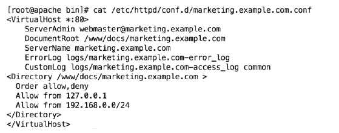

我们可以看到，我们在关闭的 `VirtualHost` 标签上方添加了新的代码块。在脚本中，这就是我们使用的 `SearchText`。我们添加的 `Directory` 块替换了伪代码中的 `NewText`。当我们查看它时，似乎更为复杂，因为我们已经用 `\n` 嵌入了新行，并使用行继续字符 `\` 格式化文件，以便更易于阅读。再次强调，一旦脚本创建完成，这个编辑是简单且精确的。

为了完整性，我们包括了以下 `vhost2.sh` 脚本的截图：

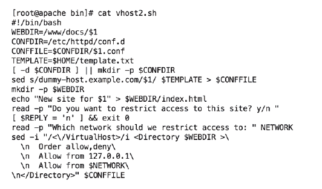

# 总结

在本章中，我们已经看到如何将 `sed` 扩展为一些非常酷的脚本，这些脚本让我们能够从文件中提取数据，取消注释选定的行并写入新的配置。不仅如此，我们还看到了如何使用 `sed` 编写插入新行到现有文件的脚本。我认为，`sed` 很快会成为你的得力助手，我们已经创建了一些强大的脚本来支持学习体验。

你可能已经知道，`sed` 有个更大的兄弟——`awk`。在下一章中，我们将看到如何使用 `awk` 从文件中提取数据。

# 问题

1.  如何从 Apache 配置文件中打印第 `50` 行？

1.  如何使用 `sed` 将 Apache 默认端口 `80` 更改为 `8080`？

# 进一步阅读

请参阅以下内容，进一步阅读本章相关内容：

+   [`httpd.apache.org/docs/2.2/`](https://httpd.apache.org/docs/2.2/)

+   [`httpd.apache.org/docs/2.2/vhosts/examples.html`](https://httpd.apache.org/docs/2.2/vhosts/examples.html)
