# AWK 基础

流编辑器并不是唯一的家族成员，它还有一个“大哥”——AWK。在本章中，我们将学习 AWK 的基础知识，并探索 AWK 编程语言的强大功能。我们将了解为什么我们需要和喜爱 AWK，以及如何在接下来的两章中实际使用 AWK 之前，先利用一些基本特性。在学习过程中，我们将涵盖以下主题：

+   AWK 背后的历史

+   显示和过滤文件中的内容

+   AWK 变量

+   条件语句

+   格式化输出

+   进一步筛选，按 UID 显示用户

+   AWK 控制文件

# 技术要求

本章的源代码可以在此下载：

[`github.com/PacktPublishing/Mastering-Linux-Shell-Scripting-Second-Edition/tree/master/Chapter10`](https://github.com/PacktPublishing/Mastering-Linux-Shell-Scripting-Second-Edition/tree/master/Chapter10)

# AWK 背后的历史

`awk` 命令是 UNIX 和 Linux 中常用的命令套件之一。UNIX `awk` 命令最早由贝尔实验室在 1970 年代开发，命名来自主要作者的姓氏：阿尔弗雷德·阿霍（Alfred Aho）、彼得·温伯格（Peter Weinberger）和布赖恩·柯宁汉（Brian Kernighan）。`awk` 命令使得可以使用 AWK 编程语言，该语言设计用于处理文本流中的数据。

AWK 有许多实现版本：

+   **gawk**：也称为 GNU AWK，是 AWK 的免费版本，被许多开发者使用；我们将在本书中使用它。

+   **mawk**：另一种由迈克·布伦南（Mike Brennan）开发的实现。这个实现只包含了少数几个 gawk 特性；它的设计侧重于速度和性能。

+   **tawk**：也称为 Thompson AWK，是一个可以在 Solaris、DOS 和 Windows 上运行的实现版本。

+   **BWK awk**：也称为 nawk，OpenBSD 和 macOS 使用的是这一版本。

请注意，本书中我们使用的 `awk` 解释器是 `gawk`，但它有一个名为 `awk` 的符号链接。因此，`awk` 和 `gawk` 是相同的命令。

你可以通过列出 `awk` 二进制文件，查看它指向的路径来确保这一点：

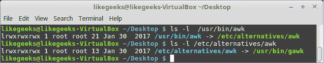

为了演示 `awk` 提供的编程语言，我们应该创建一个 `Hello World` 程序。我们知道这是所有语言的必备程序：

```
$ awk 'BEGIN { print "Hello World!" }'  
```

我们不仅可以看到这段代码会打印出常见的 hello 消息，还可以使用 `BEGIN` 块生成头信息。稍后我们将看到，  

你可以通过 `END` 代码块生成总结信息，从而允许一个主

代码块。

我们可以在下图中看到这条基本命令的输出：

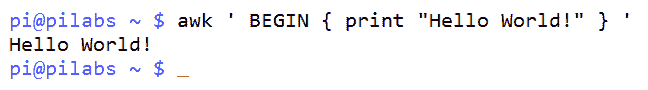

# 显示和过滤文件中的内容

现在，当然我们都希望能够打印的不仅仅是`Hello World`。`awk`命令可以用来从文件中筛选内容，如果需要的话，还可以筛选非常大的文件。我们应该从打印完整的文件开始，然后再进行筛选。通过这种方式，我们可以熟悉命令的语法。稍后，我们将看到如何将这些控制信息添加到`awk`文件中，以简化命令行。使用以下命令，我们将打印`/etc/passwd`文件中的所有行：

```
$ awk ' { print } ' /etc/passwd  
```

这相当于在`print`语句中使用`$0`变量：

```
$ awk ' { print $0 }' /etc/passwd 
```

AWK 为我们提供了一些现成的变量来提取数据，例如：

+   `$0`表示整行内容

+   `$1`表示第一个字段

+   `$2`表示第二个字段

+   `$3`表示第三个字段，依此类推

然而，我们需要指定在这个文件中使用的字段分隔符是冒号，因为它是`/etc/passwd`文件中的字段分隔符。`awk`的默认分隔符是空格、任意数量的空格、制表符或换行符。指定输入分隔符有两种方式；这些方式将在以下示例中展示。

第一个示例简单易用。`-F`选项非常有效，特别是当我们不需要任何额外的头部信息时：

```
$ awk -F":" '{ print $1 }' /etc/passwd  
```

我们也可以在`BEGIN`块中做这件事；当我们希望使用`BEGIN`块来显示头部信息时，这非常有用：

```
$ awk ' BEGIN { FS=":" } { print $1 } ' /etc/passwd  
```

我们可以从前面的示例中清楚地看到，我们命名了`BEGIN`块，所有代码都被大括号括起来。主块没有名字，它被大括号括起来。

在看到`BEGIN`块和主代码块之后，我们现在来看一下`END`代码块。这个块通常用于显示汇总数据。例如，如果我们想打印`passwd`文件的总行数，我们可以利用`END`块。带有`BEGIN`和`END`块的代码只会处理一次，而主块会对每一行进行处理。以下示例在我们迄今编写的代码上添加了总行数的计算：

```
$ awk ' BEGIN { FS=":" } { print $1 } END { print NR } ' /etc/passwd  
```

`awk`的内部变量`NR`维护了已处理行的数量。如果我们需要，我们可以为此添加一些附加文本。这可以用来注解汇总数据。我们还可以使用 AWK 语言中的单引号；它们允许我们将代码分散到多行。只要我们打开了单引号，就可以在命令行中添加换行符，直到关闭引号为止。下一示例展示了我们如何扩展汇总信息：

```
$ awk ' BEGIN { FS=":" }
> { print $1 }
> END { print "Total:",NR } ' /etc/passwd 
```

如果我们不希望在这里结束我们的 AWK 体验，我们可以轻松地显示每行的行号计数，以及最终的总计。以下示例展示了这一点：

```
$ awk ' BEGIN { FS=":" }
> { print NR,$1 }
> END { print "Total:",NR } ' /etc/passwd  
```

以下截图捕捉了这个命令并显示了部分输出：


在第一个包含 `BEGIN` 的示例中，我们看到没有理由不能单独使用 `END` 代码块而不依赖主代码块。如果我们需要模拟 `wc -l` 命令，可以使用以下 `awk` 语句：

```
$ awk ' END { print NR }' /etc/passwd 
```

输出将是文件中的行数。以下截图展示了 `awk` 命令和 `wc` 命令如何一起用于统计 `/etc/passwd` 文件中的行数：

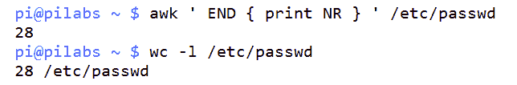

如我们所见，输出结果与 `28` 行一致，代码运行成功。

另一个我们可以练习的特性是只处理选定的行。例如，如果我们只想打印前五行，我们将使用以下语句：

```
$ awk ' NR < 6 ' /etc/passwd  
```

如果我们想打印第 `8` 行到第 `12` 行，我们可以使用以下代码：

```
$ awk ' NR==8,NR==12 ' /etc/passwd
```

我们还可以使用正则表达式来匹配行中的文本。看看下面的示例，我们查找以 `bash` 结尾的行：

```
$ awk ' /bash$/ ' /etc/passwd 
```

示例及其输出如下所示：

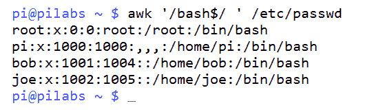

所以如果你想使用正则表达式模式，应该使用两个斜杠并将模式写在其中，`/bash$/`。

# AWK 变量

我们看到了如何使用数据字段，例如 `$1` 和 `$2`。此外，我们还看到了 `NR` 字段，它保存了处理的行号，但 AWK 提供了更多内置变量，能够进一步简化工作。

+   `FIELDWIDTHS`：指定字段宽度

+   `RS`：指定记录分隔符

+   `FS`：指定字段分隔符

+   `OFS`：指定输出分隔符，默认为空格

+   `ORS`：指定输出分隔符

+   `FILENAME`：保存正在处理的文件名

+   `NF`：保存正在处理的行

+   `FNR`：保存当前处理的记录

+   `IGNORECASE`：忽略字符大小写

这些变量在很多情况下都能为你提供很大的帮助。假设我们有以下文件：

```
John Doe
15 back street
(123) 455-3584

Mokhtar Ebrahim
10 Museum street
(456) 352-3541  
```

我们可以说，我们有两个记录，分别对应两个人，每个记录包含三个字段。假设我们需要打印名字和电话号码。那么，如何让 AWK 正确处理它们呢？

在这个例子中，字段是通过换行符（`\n`）分隔的，记录是通过空行分隔的。

所以，如果我们将 `FS` 设置为（`\n`）并将 `RS` 设置为空文本，字段将会正确识别：

```
$ awk 'BEGIN{FS="\n"; RS=""} {print $1,$3}' myfile
```

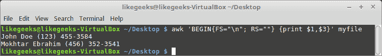

结果看起来有效且合适。

以同样的方式，你可以使用 `OFS` 和 `ORS` 来生成输出报告：

```
$ awk 'BEGIN{FS="\n"; RS=""; OFS="*"} {print $1,$3}' myfile  
```

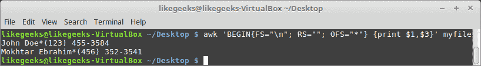

你可以使用任何符合需求的文本。

我们知道 `NR` 保存的是当前处理行的编号，而 `FNR` 从定义上看是相同的，但让我们通过以下示例来看看它们之间的区别：

假设我们有以下文件：

```
Welcome to AWK programming
This is a test line
And this is one more 
```

我们使用 AWK 来处理这个文件：

```
$ awk 'BEGIN{FS="\n"}{print $1,"FNR="FNR}' myfile myfile
```


这里我们只是为了测试目的，处理了两次文件，以查看 `FNR` 变量的值。

如你所见，每个处理周期中的值从 1 开始。

让我们看看是否以相同的方式使用了 `NR` 变量：

```
$ awk 'BEGIN {FS="\n"} {print $1,"FNR="FNR,"NR="NR} END{print "Total lines: ",NR}' myfile myfile  
```

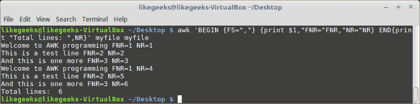

`NR` 变量在整个处理过程中保持其值，而 `FNR` 则从 1 开始。

# 用户定义的变量

你可以像其他编程语言一样，在 AWK 编程中定义自己的变量。

你可以使用任何文本来定义变量，但**变量名不能以数字开头**：

```
$ awk '
BEGIN{
var="Welcome to AWk programming"
print var
}'
```

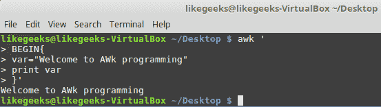

你可以定义任何类型的变量并以相同的方式使用它。

你可以像这样定义数字：

```
$ awk '
BEGIN{
var1=2
var2=3
var3=var1+var2
print var3
}'  
```

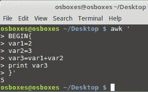

或者像这样进行字符串拼接：

```
$ awk '
BEGIN{
str1="Welcome "
str2=" To shell scripting"
str3=str1 str2
print str3
}'  
```

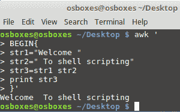

如你所见，AWK 是一种强大的脚本语言。

# 条件语句

AWK 支持条件语句，如 `if` 和 `while` 循环。

# `if` 命令

假设你有以下文件：

```
50
30
80
70
20
90 
```

现在，让我们过滤这些值：

```
$ awk '{if ($1 > 50) print $1}' myfile  
```

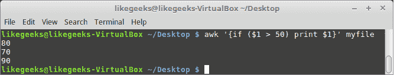

`if` 语句检查每个值，如果大于 `50`，则打印该值。

你可以像这样使用 `else` 语句：

```
$ awk '{
if ($1 > 50)
{
x = $1 * 2
print x
} else
{
x = $1 * 3
print x
}}' myfile
```

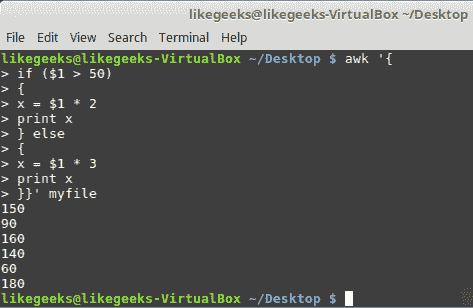

如果你不使用大括号 `{}` 将语句括起来，可以在同一行中使用分号输入语句：

```
$ awk '{if ($1 > 50) print $1 * 2;  else print $1 * 3}' myfile  
```

注意，你可以将此代码保存到文件中，并使用 `-f` 选项将其分配给 `awk` 命令，稍后我们将在本章中看到这一点。

# while 循环

AWK 会处理你文件的每一行，但如果你想遍历每一行的字段该怎么办？

当使用 AWK 时，你可以通过 `while` 循环遍历字段。

假设我们有以下文件：

```
321 524 124
174 185 254
195 273 345 
```

现在，让我们使用 `while` 循环来遍历字段。

```
$ awk '{
total = 0
i = 1
while (i < 4)
{
total += $i
i++
}
mean = total / 3
print "Mean value:",mean
}' myfile  
```

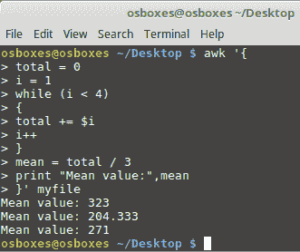

`while` 循环遍历字段，我们计算每一行的平均值并打印出来。

# for 循环

你可以像这样使用 `for` 循环来遍历 AWK 中的值：

```
$ awk '{
total = 0
for (var = 1; var < 4; var++)
{
total += $var
}
mean = total / 3
print "Mean value:",mean
}' myfile  
```

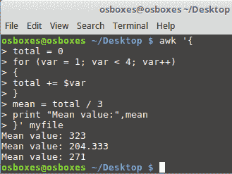

我们这次使用 `for` 循环实现了相同的结果。

# 格式化输出

到目前为止，我们一直忠实于使用 `print` 命令，因为我们对输出的要求较少。如果我们想要打印用户名、UID 和默认 shell 等内容，我们需要稍微格式化输出。在这种情况下，我们可以将输出组织成整齐的列。如果没有格式化，所使用的命令将类似于以下示例，其中我们使用逗号分隔我们要打印的字段：

```
$ awk ' BEGIN { FS=":" } { print $1,$3,$7 } ' /etc/passwd  
```

我们在这里使用 `BEGIN` 块，因为稍后我们可以利用它来打印列标题。

为了更好地理解问题，请看一下下面的截图，展示了不均匀的列宽：

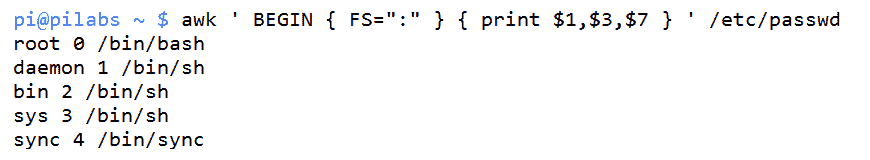

输出中的问题是，列没有对齐，因为用户名的长度不一致。为了解决这个问题，我们可以使用`printf`函数，在其中指定列的宽度。`awk`语句的语法将类似于以下示例：

```
$ awk ' BEGIN { FS=":" }
> { printf "%10s %4d %17s\n",$1,$3,$7 } ' /etc/passwd  
```

`printf`格式化包含在双引号内。我们还需要通过`\n`来添加换行符。`printf`函数不会自动添加换行，而`print`函数会。我们打印了三个字段；第一个接受字符串值，并设置为宽度`10`个字符。中间字段最多接受 4 个数字，最后是默认的 shell 字段，允许最多`17`个字符串字符。

以下截图展示了如何改进输出：

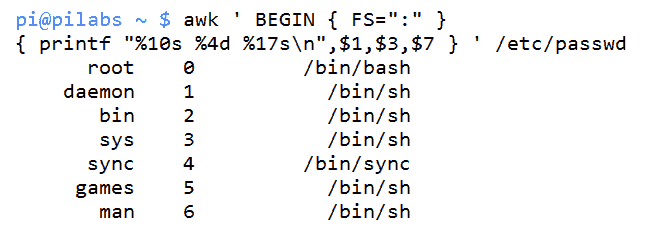

我们可以通过添加头部信息进一步增强这一点。虽然此时代码开始显得杂乱无章，但稍后我们将看到如何通过 AWK 控制文件解决这个问题。以下示例展示了头部信息是如何添加到`Begin`块中的。分号用于分隔`BEGIN`块中的两个语句：

```
$ awk 'BEGIN {FS=":" ;printf "%10s %4s %17s\n","Name","UID","Shell" }
> { printf "%10s %4d %17s\n",$1,$3,$7 } ' /etc/passwd
```

在以下截图中，我们可以看到这如何进一步改进输出：

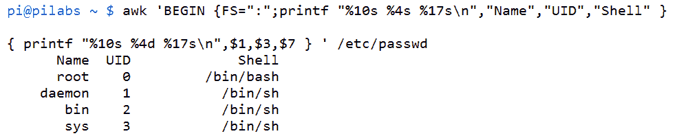

在前一章中，我们看到如何通过在 shell 中使用颜色来增强输出。我们还可以通过在 AWK 中添加自定义函数来使用颜色。在接下来的代码示例中，你将看到 AWK 允许我们定义自己的函数，以便于进行更复杂的操作并隔离代码。我们将修改之前的代码以在头部添加绿色输出：

```
$ awk 'function green(s) {
> printf "\0331;32m" s "\033[0m\n"
> }
> BEGIN {FS=":"; 
green("   Name:  UID:    Shell:") }
> { printf "%10s %4d %17s\n",$1,$3,$7 } ' /etc/passwd
```

在`awk`中创建函数使我们可以在需要的地方添加颜色，在这种情况下是绿色文本。创建定义其他颜色的函数也非常简单。以下截图中包含了代码和输出：

![

# 进一步筛选显示按 UID 排序的用户

我们已经能够一点一滴地构建我们的 AWK 技能，而所学到的内容都非常有用。我们可以将这些微小的步骤汇聚起来，开始创建一些更实用的东西。也许我们希望仅打印标准用户；这些通常是 UID 高于 500 或 1000 的用户，具体取决于你的发行版。

在我为本书使用的 Linux Mint 发行版中，标准用户的 UID 从`1000`开始。UID 是第三个字段。这实际上只是利用第三个字段的值作为范围操作符的简单问题。我们可以在以下示例中看到这一点：

```
$ awk -F":" '$3 > 999 ' /etc/passwd  
```

我们可以使用以下命令显示 UID 为`101`或更低的用户：

```
$ awk -F":" '$3 < 101 ' /etc/passwd
```

这些只是给你提供一些 AWK 功能的可能性。事实上，我们可以全天候使用算术比较操作符来进行操作。

我们还看到，使用这些例子时，`awk`语句可能会变得有些冗长。这时，我们可以实现`awk`控制文件。让我们在迷失于语法的泥潭之前，立即来看一下这些内容。

# AWK 控制文件

就像在`sed`中一样，我们可以通过创建并包含控制文件来简化命令行。这也使得稍后编辑命令变得更加容易实现。控制文件包含了我们希望`awk`执行的所有语句。我们在使用`sed`、`awk`和 Shell 脚本时，最需要考虑的事项是模块化；创建可重用的元素来隔离和复用代码。这为我们节省了时间和精力，让我们有更多时间去做喜欢的事情。

要查看`awk`控制文件的示例，我们应该重新审视`passwd`文件的格式。创建以下文件将封装`awk`语句：

```
function green(s) { 
    printf "\033[1;32m" s "\033[0m\n" 
} 
BEGIN { 
    FS=":" 
    green("   Name:   UID:       Shell:") 
} 
{ 
    printf "%10s %4d %17s\n",$1,$3,$7 
} 
```

我们可以将这个文件保存为`passwd.awk`。

能够将所有`awk`语句都包含在一个文件中非常方便，这样执行起来也更加简洁清晰：

```
$ awk -f passwd.awk /etc/passwd 
```

这无疑促进了更复杂的`awk`语句的编写，并允许你为代码扩展更多功能。

# 内置函数

在前面的例子中，我们定义了一个名为`green`的函数。接下来我们将谈论一些`awk`自带的内置函数。

AWK 自带许多内置函数，比如数学函数：

+   `sin(x)`

+   `cos(x)`

+   `sqrt(x)`

+   `exp(x)`

+   `log(x)`

+   `rand()`

你可以像这样使用它们：

```
$ awk 'BEGIN{x=sqrt(5); print x}' 
```

此外，还有一些可以用于字符串操作的内置函数：

```
$ awk 'BEGIN{x = "welcome"; print toupper(x)}'
```

# 总结

我希望你能更好、更清楚地理解你可以用 AWK 工具做什么。这是一个数据处理工具，它逐行运行文本文件，并处理你添加的代码。主要代码块在每一行符合行标准时运行，而`BEGIN`和`END`代码块只会执行一次。

你已经学会了如何使用 AWK 的内置变量，以及如何定义自己的变量并加以使用。

此外，你已经学会了如何使用`if`、`while`和`for`循环来遍历数据字段。

在下一章，我们将讨论正则表达式以及如何在`sed`和 AWK 中使用它们，从而获得强大的功能。

# 问题

1.  以下命令的输出是什么？

```
$ awk '
BEGIN{
var="I love AWK tool"
print $var 
}'
```

1.  假设你有以下文件：

```
13
15
22
18
35
27
```

然后，你可以对这个文件运行以下命令：

```
$ awk '{if ($1 > 30) print $2}' myfile 
```

会打印出多少个数字？

1.  假设你有以下文件：

```
135 325 142
215 325 152
147 254 327
```

然后你运行以下命令：

```
$ awk '{
total = 0
i = 1
while (i < 3)
{
total += $i
i++
}
mean = total / 3
print "Mean value:",mean  
}' myfile
```

前面的代码有什么问题？

1.  以下命令将打印出多少行？

```
$ awk -F":" '$3 < 1 ' /etc/passwd  
```

# 深入阅读

请参阅以下内容，进一步了解与本章相关的内容：

+   [`likegeeks.com/awk-command/`](https://likegeeks.com/awk-command/)

+   [`www.gnu.org/software/gawk/manual/gawk.html`](https://www.gnu.org/software/gawk/manual/gawk.html)
