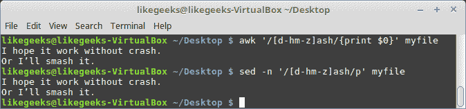
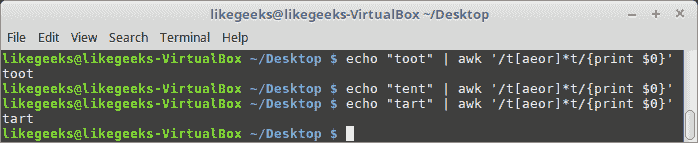
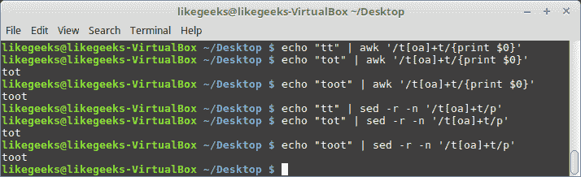
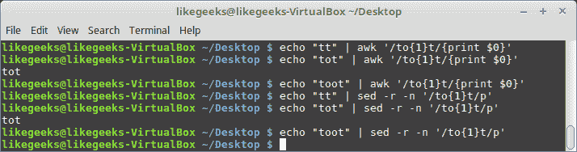

# 第十一章：正则表达式

在本章中，我们将讨论使用 **流编辑器** (**sed**) 和 AWK 时最神秘的部分。它们就是正则表达式，简称 regex。在前几章中，我们略微提到过正则表达式，这是因为没有充分理解它们之前我们不需要深入探讨。

如果你理解了正则表达式的写法，你将节省大量时间和精力。通过正则表达式，你将释放 sed 和 AWK 背后的真正威力，并能以专业的方式使用它们。

本章将涵盖以下内容：

+   正则表达式引擎

+   定义 BRE 模式

+   定义 ERE 模式

+   使用 `grep`

# 技术要求

本章的源代码可以在这里下载：

[`github.com/PacktPublishing/Mastering-Linux-Shell-Scripting-Second-Edition/tree/master/Chapter11`](https://github.com/PacktPublishing/Mastering-Linux-Shell-Scripting-Second-Edition/tree/master/Chapter11)

# 正则表达式引擎

首先，什么是正则表达式？

正则表达式是引擎用来匹配特定文本的字符串。它就像一种高级的搜索方式。

假设你想在文件中搜索以任何小写字母开头的行，或者你想搜索包含数字的行，或者你想搜索以特定文本开头的行。普通搜索不能做到这一点：唯一的方法是使用正则表达式。

那么，什么是正则表达式引擎呢？

正则表达式引擎是理解这些字符串并将其转换为找到匹配文本的软件部分。

有许多正则表达式引擎，例如与编程语言（如 Java、Perl 和 Python）一起发布的引擎。还有 Linux 工具使用的引擎，例如 sed 和 AWK，现在对我们来说重要的是学习 Linux 中正则表达式引擎的类型。

Linux 中有两种正则表达式引擎：

+   **基本正则表达式** (**BRE**) 引擎

+   **扩展正则表达式** (**ERE**) 引擎

大多数 Linux 二进制文件都能理解两种引擎，例如 sed 和 AWK。

`grep` 也能理解 ERE，但你必须使用 `-E` 选项，这相当于使用 `egrep`。

我们将看到如何为 sed 和 AWK 定义正则表达式模式。我们将从定义 BRE 模式开始，所以让我们开始吧。

# 定义 BRE 模式

要定义正则表达式模式，你可以输入以下内容：

```
$ echo "Welcome to shell scripting" | sed -n '/shell/p'
$ echo "Welcome to shell scripting" | awk '/shell/{print $0}'
```


关于正则表达式的一件非常重要的事情是，它们是区分大小写的：

```
$ echo "Welcome to shell scripting" | awk '/shell/{print $0}'
$ echo "Welcome to SHELL scripting" | awk '/shell/{print $0}'
```


假设你想匹配以下任意字符：

`.*[]^${}\+?|()`

你必须使用反斜杠对它们进行转义，因为这些字符是正则表达式引擎的特殊字符。

现在你已经知道如何定义 BRE 模式。接下来，我们来使用常见的 BRE 字符。

# 锚字符

锚字符用于匹配行的开头或结尾。这里有两个锚字符：插入符号（`^`）和美元符号（`$`）。

插入符号字符用于匹配行的开头：

```
$ echo "Welcome to shell scripting" | awk '/^Welcome/{print $0}'
$ echo "SHELL scripting" | awk '/^Welcome/{print $0}'
$ echo "Welcome to shell scripting" | sed -n '/^Welcome/p'
```


所以，插入符号字符用于检查指定的文本是否位于行的开头。

如果你想查找插入符号字符作为普通字符，如果使用 AWK，你应该用反斜杠对其进行转义。

但是，如果你使用`sed`，你就不需要转义它：

```
$ echo "Welcome ^ is a test" | awk '/\^/{print $0}'
$ echo "Welcome ^ to shell scripting" | sed -n '/^/p'
```


要匹配文本的结尾，你可以使用美元符号字符（`$`）：

```
$ echo "Welcome to shell scripting" | awk '/scripting$/{print $0}'
$ echo "Welcome to shell scripting" | sed -n '/scripting$/p'
```


你可以在同一个模式中同时使用插入符号（`^`）和美元符号（`$`）来指定文本。

你可以使用这些字符来执行有用的操作，例如查找空行并将其删除：

```
$ awk '!/^$/{print $0}' myfile
```

感叹号（`!`）被称为否定字符，它会否定它后面的内容。

该模式搜索`^$`，其中插入符号（`^`）表示行的开头，美元符号（`$`）表示行的结尾，这意味着搜索开头和结尾之间没有内容的行，即空行。然后，我们用感叹号（`!`）来取反，得到非空行。

让我们将其应用于以下文件：

```
Lorem Ipsum is simply dummy text .
Lorem Ipsum has been the industry's standard dummy.
It has survived not only five centuries
It is a long established fact that a reader will be distracted.
```

现在，让我们来看一下魔法：

```
$ awk '!/^$/{print $0}' myfile
```


打印的行不包含空行。

# 点字符

点字符匹配除了换行符（`\n`）以外的任何字符。我们可以将其应用于以下文件：

```
Welcome to shell scripting.
I love shell scripting.
shell scripting is awesome.
```

假设我们使用以下命令：

```
$ awk '/.sh/{print $0}' myfile
$ sed -n '/.sh/p' myfile
```

该模式匹配任何包含`sh`以及其之前的任何文本的行：


如你所见，它只匹配前两行，因为第三行以`sh`开头，所以第三行没有匹配。

# 字符类

我们已经看到如何使用点字符匹配任何字符。如果你想只匹配特定的一组字符呢？

你可以将你想匹配的字符放在方括号`[]`中进行匹配，这就是字符类。

让我们以以下文件为例：

```
I love bash scripting.
I hope it works without a crash.
Or I'll smash it.
```

让我们看看字符类是如何工作的：

```
$ awk '/[mbr]ash/{print $0}' myfile
$ sed -n '/[mbr]ash/p' myfile
```


字符类`[mbr]`匹配任何一个包含字符，并且后面跟着“ash”，因此它匹配这三行。

你可以在有用的操作中使用它，例如匹配大写或小写字符：

```
$ echo "Welcome to shell scripting" | awk '/^[Ww]elcome/{print $0}'
$ echo "welcome to shell scripting" | awk '/^[Ww]elcome/{print $0}'
```

字符类使用插入符号字符来取反，如下所示：

```
$ awk '/[^br]ash/{print $0}' myfile 
```


在这里，我们匹配任何包含“ash”并且既不以`b`也不以`r`开头的行。

记住，在方括号外使用插入符号字符（`^`）表示行的开头。

使用字符类，你可以指定你想要的字符。如果你有一个长范围的字符怎么办？

# 字符范围

你可以在方括号中指定一组字符范围，如下所示：

```
[a-d]
```

这意味着从 `a` 到 `d` 的字符范围，所以 `a`、`b`、`c` 和 `d` 都包含在内。

让我们使用之前的示例文件：

```
$ awk '/[a-m]ash/{print $0}' myfile
$ sed -n '/[a-m]ash/p' myfile
```


从 `a` 到 `m` 的字符范围被选择。第三行包含 `r` 在灰烬之前，这不在我们的范围内，因此只有第二行不匹配。

你也可以使用数字范围：

```
$ awk '/[0-9]/'
```

这个模式意味着从 `0` 到 `9` 的字符会被匹配。

你可以在同一个括号中写多个范围：

```
$ awk '/[d-hm-z]ash/{print $0}' myfile $ sed -n '/[d-hm-z]ash/p' myfile
```



在这个模式中，从 `d` 到 `h` 和从 `m` 到 `z` 被选中，因为第一行包含 `b` 在灰烬之前，所以只有第一行不匹配。

你可以使用范围选择所有大写和小写字母，如下所示：

```
$ awk '/[a-zA-Z]/'
```

# 特殊字符类

我们看到了如何使用字符类来匹配一组字符，然后我们看到了如何使用字符范围来匹配一组字符。

实际上，ERE 引擎提供了现成的类，用于匹配一些常见的字符集，如下所示：

| `[[:alpha:]]` | 匹配任何字母字符 |
| --- | --- |
| `[[:upper:]]`         | 只匹配 A–Z 大写字母 |
| `[[:lower:]]`  | 只匹配 a–z 小写字母 |
| `[[:alnum:]]`         | 匹配 0–9、A–Z 或 a–z |
| `[[:blank:]] `        | 只匹配空格或 Tab |
| `[[:space:]]`         | 匹配任何空白字符：空格、Tab、CR |
| `[[:digit:]]`        | 匹配从 `0` 到 `9` 的数字 |
| `[[:print:]]`        | 匹配任何可打印字符 |
| `[[:punct:]]`         | 匹配任何标点字符 |

所以，如果你想匹配大写字母，可以使用 `[[:upper:]]`，它将与字符范围 [A-Z] 完全一样有效。

让我们对以下示例文件进行测试：

```
checking special character classes.
This LINE contains upper case.
ALSO this one.
```

我们将匹配大写字母，看看它是如何工作的：

```
$ awk '/[[:upper:]]/{print $0}' myfile $ sed -n '/[[:upper:]]/p' myfile
```


大写字母特殊类使得匹配任何包含大写字母的行变得更加容易。

# 星号

星号用于匹配字符或字符类的存在零次或多次。

当你在查找一个有多种变体或拼写错误的词时，这会很有用：

```
$ echo "Checking colors" | awk '/colou*rs/{print $0}' $ echo "Checking colours" | awk '/colou*rs/{print $0}'
```


如果字符 `u` 根本不存在，或者存在，这都将匹配该模式。

我们可以通过将星号与点字符一起使用，来匹配任意数量的字符。

让我们看看如何在以下示例文件中使用它们：

```
This is a sample line
And this is another one
This is one more
Finally, the last line is this
```

让我们编写一个匹配包含单词 `this` 和其后所有内容的模式：

```
$ awk '/this.*/{print $0}' myfile $ sed -n '/ this.*/p' myfile
```


第四行包含单词 `this`，但第一行和第三行包含大写字母 `T`，因此不匹配。

第二行包含了单词和其后的文本，而第四行包含了单词和后面没有任何内容，在这两种情况下，星号匹配零个或多个实例。

你可以将星号与字符类一起使用，匹配字符类中任意字符出现一次或没有出现。

```
$ echo "toot" | awk '/t[aeor]*t/{print $0}' $ echo "tent" | awk '/t[aeor]*t/{print $0}' $ echo "tart" | awk '/t[aeor]*t/{print $0}'
```



第一行包含字符 `o` 两次，因此它匹配。

第二行包含 `n` 字符，它不在字符类中，所以没有匹配。

第三行包含字符 `a` 和 `r`，每个字符出现一次，并且它们都在字符类中，因此该行也匹配该模式。

# 定义 ERE 模式

我们已经看到如何轻松定义 BRE 模式。现在，我们将看到一些更强大的 ERE 模式。

除了 BRE 模式外，ERE 引擎还理解以下模式：

+   问号

+   加号

+   花括号

+   管道字符

+   表达式分组

默认情况下，AWK 支持 ERE 模式，而 sed 需要 `-r` 来理解这些模式。

# 问号

问号匹配前一个字符或字符类出现零次或一次：

```
$ echo "tt" | awk '/to?t/{print $0}' $ echo "tot" | awk '/to?t/{print $0}' $ echo "toot" | awk '/to?t/{print $0}' $ echo "tt" | sed -r -n '/to?t/p' $ echo "tot" | sed -r -n '/to?t/p' $ echo "toot" | sed -r -n '/to?t/p'
```


在前两个示例中，字符 `o` 出现零次或一次，而在第三个示例中，它出现了两次，这不符合模式。

以相同的方式，你可以将问号与字符类一起使用：

```
$ echo "tt" | awk '/t[oa]?t/{print $0}' $ echo "tot" | awk '/t[oa]?t/{print $0}' $ echo "toot" | awk '/t[oa]?t/{print $0}' $ echo "tt" | sed -r -n '/t[oa]?t/p' $ echo "tot" | sed -r -n '/t[oa]?t/p' $ echo "toot" | sed -r -n '/t[oa]?t/p'
```


第三个示例只没有匹配，因为它包含了两次 `o` 字符。

注意，当将问号与字符类一起使用时，文本中不需要包含字符类中的所有字符；只要有一个字符匹配即可通过模式。

# 加号

加号匹配前一个字符或字符类出现一次或多次，因此它至少必须出现一次：

```
$ echo "tt" | awk '/to+t/{print $0}' $ echo "tot" | awk '/to+t/{print $0}' $ echo "toot" | awk '/to+t/{print $0}' $ echo "tt" | sed -r -n '/to+t/p' $ echo "tot" | sed -r -n '/to+t/p' $ echo "toot" | sed -r -n '/to+t/p'
```


第一个示例没有 `o` 字符，这就是为什么它是唯一没有匹配的示例。

同样，我们可以将加号与字符类一起使用：

```
$ echo "tt" | awk '/t[oa]+t/{print $0}' $ echo "tot" | awk '/t[oa]+t/{print $0}' $ echo "toot" | awk '/t[oa]+t/{print $0} $ echo "tt" | sed -r -n '/t[oa]+t/p' $ echo "tot" | sed -r -n '/t[oa]+t/p' $ echo "toot" | sed -r -n '/t[oa]+t/p'
```



第一个示例只没有匹配，因为它完全没有 `o` 字符。

# 花括号

花括号定义了前一个字符或字符类出现的次数：

```
$ echo "tt" | awk '/to{1}t/{print $0}' $ echo "tot" | awk '/to{1}t/{print $0}' $ echo "toot" | awk '/to{1}t/{print $0}' $ echo "tt" | sed -r -n '/to{1}t/p' $ echo "tot" | sed -r -n '/to{1}t/p' $ echo "toot" | sed -r -n '/to{1}t/p'
```



第三个示例没有任何匹配，因为 `o` 字符出现了两次。那么，如果你想指定一个更灵活的数量呢？

你可以在花括号内指定一个范围：

```
$ echo "toot" | awk '/to{1,2}t/{print $0}' $ echo "toot" | sed -r -n '/to{1,2}t/p'
```


在这里，我们匹配 `o` 字符，如果它出现一次或两次。

同样，你可以将花括号与字符类一起使用：

```
$ echo "tt" | awk '/t[oa]{1}t/{print $0}' $ echo "tot" | awk '/t[oa]{1}t/{print $0}' $ echo "toot" | awk '/t[oa]{1}t/{print $0}' $ echo "tt" | sed -r -n '/t[oa]{1}t/p' $ echo "tot" | sed -r -n '/t[oa]{1}t/p' $ echo "toot" | sed -r -n '/t[oa]{1}t/p'
```


正如预期的那样，如果 `[oa]` 中的任何字符出现一次，模式就会匹配。

# 管道字符

管道字符 (`|`) 告诉正则表达式引擎匹配传入的任何字符串。因此，如果其中之一存在，模式就会匹配。这就像是传入字符串之间的逻辑 `OR`：

```
$ echo "welcome to shell scripting" | awk '/Linux|bash|shell/{print $0}' $ echo "welcome to bash scripting" | awk '/Linux|bash|shell/{print $0}' $ echo "welcome to Linux scripting" | awk '/Linux|bash|shell/{print $0}' $ echo "welcome to shell scripting" | sed -r -n '/Linux|bash|shell/p' $ echo "welcome to bash scripting" | sed -r -n '/Linux|bash|shell/p' $ echo "welcome to Linux scripting" | sed -r -n '/Linux|bash|shell/p'
```


所有之前的示例都有匹配，因为每个示例中都有这三个单词中的任意一个。

管道符与单词之间没有空格。

# 表达式分组

你可以使用括号`()`来分组字符或单词，使它们在正则表达式引擎看来是一个整体：

```
$ echo "welcome to shell scripting" | awk '/(shell scripting)/{print $0}' $ echo "welcome to bash scripting" | awk '/(shell scripting)/{print $0}' $ echo "welcome to shell scripting" | sed -r -n '/(shell scripting)/p' $ echo "welcome to bash scripting" | sed -r -n '/(shell scripting)/p'
```


由于`shell scripting`字符串被括号分组，它将被当作一个整体处理。

所以，如果整个句子不存在，模式将会失败。

你可能已经意识到，你可以像这样不使用括号也能实现相同的效果：

```
$ echo "welcome to shell scripting" | sed -r -n '/shell scripting/p'
```

那么，使用括号或表达式分组有什么好处呢？请查看以下示例，了解其中的区别。

你可以将任何 ERE 字符与分组括号一起使用：

```
$ echo "welcome to shell scripting" | awk '/(bash scripting)?/{print $0}' $ echo "welcome to shell scripting" | awk '/(bash scripting)+/{print $0}' $ echo "welcome to shell scripting" | sed -r -n '/(bash scripting)?/p' $ echo "welcome to shell scripting" | sed -r -n '/(bash scripting)+/p' 
```


在第一个示例中，我们使用问号查找整个句子`bash scripting`，查找零次或一次，因为整个句子不存在，所以模式成功匹配。

如果没有表达式分组，你将无法得到相同的结果。

# 使用 grep

如果我们要深入讨论`grep`，一本书也不够。`grep`支持许多引擎，包括 BRE 和 ERE。它支持的引擎有**Perl 兼容正则表达式**（**PCRE**）。

`grep`是一个非常强大的工具，几乎所有系统管理员每天都会使用它。我们只是想通过类似于 sed 和 AWK 的方式，启发大家如何使用 BRE 和 ERE 模式。

`grep`工具默认理解 BRE 模式，如果你想使用 ERE 模式，你需要使用`-E`选项。

让我们使用以下示例文件并应用一个 BRE 模式：

```
Welcome to shell scripting.
love shell scripting.
shell scripting is awesome.
```

让我们测试一个 BRE 模式：

```
$ grep '.sh' myfile
```


结果以红色高亮显示。

让我们测试一个 ERE 模式：

```
$ grep -E 'to+' myfile
```


其他所有 ERE 字符也可以以相同的方式使用。

# 总结

在本章中，我们介绍了正则表达式以及正则表达式引擎 BRE 和 ERE。我们学习了如何为它们定义模式。

我们学习了如何为 sed、AWK 和`grep`编写这些模式。

此外，我们还看到了特殊字符类如何使匹配字符集变得更加容易。

我们看到了如何使用强大的 ERE 模式以及如何对表达式进行分组。

最后，我们看到了如何使用`grep`工具以及如何定义 BRE 和 ERE 模式。

在接下来的两章中，我们将看到一些 AWK 的实际示例。

# 问题

1.  假设你有以下文件：

```
Welcome to shell scripting.
I love shell scripting.
shell scripting is awesome.
```

假设你运行以下命令：

```
$ awk '/awesome$/{print $0}' myfile
```

输出将打印多少行？

1.  如果我们对前面的文件使用以下命令，会打印多少行？

```
$ awk '/scripting\..*/{print $0}' myfile
```

1.  如果我们对前面的示例文件使用以下命令，会打印多少行？

```
$ awk '/^[Ww]?/{print $0}' myfile
```

1.  以下命令的输出是什么？

```
$ echo "welcome to shell scripting" | sed -n '/Linux|bash|shell/p'
```

# 进一步阅读

请参见以下内容，了解与本章相关的进一步阅读资料：

+   [`www.regular-expressions.info/engine.html`](https://www.regular-expressions.info/engine.html)

+   [`tldp.org/LDP/Bash-Beginners-Guide/html/chap_04.html`](http://tldp.org/LDP/Bash-Beginners-Guide/html/chap_04.html)
