# 使用 AWK 汇总日志

在上一章中，我们讨论了正则表达式，并且看到了如何利用它们来增强 `sed` 和 AWK。本章中，我们将讨论一些使用 AWK 的实际示例。

AWK 的一个强项是从日志文件中过滤数据。这些日志文件可能有很多行，可能达到 250,000 行或更多。我曾处理过超过一百万行的数据。AWK 可以快速高效地处理这些行。作为例子，我们将处理一个包含 30,000 行的 Web 服务器访问日志，以展示高效且写得很好的 AWK 代码的效果。在本章中，我们将看到不同的日志文件，并回顾一些我们可以使用 `awk` 命令和 AWK 编程语言来帮助报告和管理服务的技术。在本章中，我们将涵盖以下主题：

+   HTTPD 日志文件格式

+   显示来自 Web 日志的数据

+   显示排名最高的客户端 IP 地址

+   显示浏览器数据

+   处理电子邮件日志

# 技术要求

本章的源代码可以从这里下载：

[`github.com/PacktPublishing/Mastering-Linux-Shell-Scripting-Second-Edition/tree/master/Chapter12`](https://github.com/PacktPublishing/Mastering-Linux-Shell-Scripting-Second-Edition/tree/master/Chapter12)

# HTTPD 日志文件格式

在处理任何文件时，首要任务是熟悉文件的模式。简单来说，我们需要了解每个字段所表示的内容以及用什么来分隔字段。我们将处理 Apache HTTPD Web 服务器的访问日志文件。日志文件的位置可以通过 `httpd.conf` 文件进行控制。在基于 Debian 的系统中，默认的日志文件位置是 `/var/log/apache2/access.log`；其他系统可能会使用 `httpd` 目录来替代 `apache2`。

`log` 文件已经包含在代码包中，所以你可以直接下载并使用它。

使用 `tail` 命令，我们可以显示 `log` 文件的结尾。虽然说实话，使用 `cat` 命令也能很好地完成这项任务，因为这个文件只有几行：

```
$ tail /var/log/apache2/access.log  
```

命令的输出和文件内容如下所示：

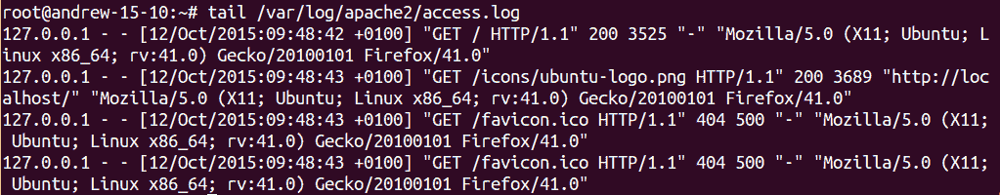

输出内容确实会稍微换行，但我们仍然能感受到日志的布局。我们还可以看到，尽管我们感觉只访问了一个网页，但实际上我们访问了两个项目：`index.html` 和 `ubuntu-logo.png`。我们也未能成功访问 `favicon.ico` 文件。可以看到，文件是以空格分隔的。每个字段的含义如下表所示：

| **字段** | **用途** |
| --- | --- |
| 1 | 客户端 IP 地址。 |
| 2 | 按 RFC 1413 和 `identd` 客户端定义的客户端身份。如果未启用 `IdentityCheck`，则不会读取此字段。如果未读取，则该值将是一个连字符。 |
| 3 | 用户认证的用户 ID（如果启用）。如果未启用认证，值将为连字符。 |
| 4 | 请求的日期和时间，格式为`日/月/年:时:分:秒 偏移量`。 |
| 5 | 实际请求和方法。 |
| 6 | 返回状态代码，如`200`或`404`。 |
| 7 | 文件大小（以字节为单位）。 |

尽管这些字段由 Apache 定义，但我们仍然需要小心。时间、日期和时区是一个字段，并在方括号内定义；但是，在该数据和时区之间还有额外的空格。为了确保在需要时打印完整的时间字段，我们需要打印`$4`和`$5`。以下命令示范了这一点：

```
$ awk ' { print $4,$5 } ' /var/log/apache2/access.log  
```

我们可以在以下截图中查看命令及其产生的输出：

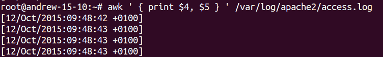

# 显示来自 Web 日志的数据

我们已经预览了如何使用 AWK 查看 Apache web 服务器的日志文件；然而，接下来我们将转到我们的演示文件，该文件包含更多和更为多样的内容。

# 按日期选择条目

既然我们已经了解了如何显示日期，或许我们应该看看如何仅打印一天的条目。为此，我们可以在`awk`中使用匹配操作符。这由波浪线（~）表示，或者你也可以叫它波浪线。如果我们只需要日期元素，就没有必要同时使用日期和时区字段。以下命令展示了如何打印 2014 年 9 月 10 日的条目：

```
$ awk ' ( $4 ~ /10\/Sep\/2014/ ) ' access.log  
```

为了完整性，以下截图展示了该命令和部分输出：

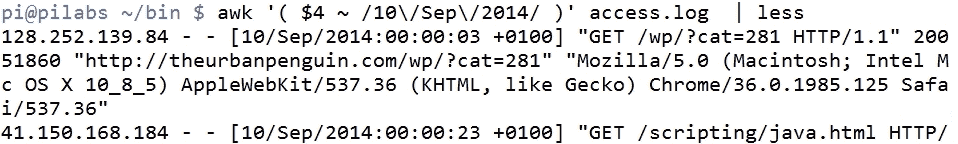

圆括号包围了我们正在查找的行范围，我们省略了主块，这样可以确保我们打印范围内完全匹配的行。没有任何限制阻止我们进一步筛选并从匹配的行中打印字段。例如，如果我们只想打印出用于访问 Web 服务器的客户端 IP 地址，我们可以打印字段`1`。以下命令示范了这一点：

```
$ awk ' ( $4 ~ /10\/Sep\/2014/ ) { print $1 } ' access.log  
```

如果我们想能够打印特定日期的总访问次数，可以将条目通过管道传输到`wc`命令。这在下面进行了演示：

```
$ awk ' ( $4 ~ /10\/Sep\/2014/ ) { print $1 } ' access.log | wc -l  
```

然而，如果我们希望使用`awk`来执行此任务，这将比启动一个新进程更高效，并且我们可以统计条目。如果我们使用内置变量`NR`，我们可以打印文件中的整行，而不仅仅是范围内的行。最好在主块中增加我们自己的变量，而不是为每一行匹配范围。可以在`END`块中实现打印我们使用的`count`变量。以下命令行作为示例：

```
$ awk ' ( $4 ~ /10\/Sep\/2014/ ) { print $1; COUNT++ }  END { print COUNT }' access.log  
```

`wc`和内部计数器的计数输出将给我们演示文件的结果`16205`。如果我们只想计数而不做其他任何操作，我们应该在主块中使用变量递增：

```
$ awk ' ( $4 ~ /10\/Sep\/2014/ ) { COUNT++ }  END { print COUNT }' access.log  
```

我们可以在以下输出中看到这一点：

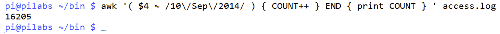

# 汇总`404`错误

请求页面的状态码显示在日志的字段`9`中。`404`状态码表示服务器上的页面未找到错误。我相信我们在某个阶段都在浏览器中见过这种情况。这可能表示你的网站中某个链接配置错误，或者浏览器正在寻找一个图标图片以便在标签浏览器中显示该页面。你还可以通过查找请求标准页面来识别可能对你的网站构成威胁的行为，这些页面可能会提供有关 PHP 驱动网站（如 WordPress）的额外信息。

首先，我们可以仅仅打印出请求的状态：

```
$ awk '{ print $9 } ' access.log  
```

现在我们可以稍微扩展一下代码以及我们自己，只打印出`404`错误：

```
$ awk ' ( $9 ~ /404/ ) { print $9 } ' access.log  
```

我们可以进一步扩展，通过打印出状态码和正在访问的页面。这需要我们打印字段`9`和字段`7`。简而言之，这将如下所示：

```
$ awk ' ( $9 ~ /404/ ) { print $9, $7 } ' access.log  
```

这些失败访问的页面会有重复的情况。为了汇总这些记录，我们可以使用命令管道结合`sort`和`uniq`命令来实现：

```
$ awk ' ( $9 ~ /404/ ) { print $9, $7 } ' access.log | sort -u 
```

使用`uniq`命令时，数据必须先进行排序；因此，我们使用`sort`命令准备数据。

# 汇总 HTTP 访问码

现在是时候离开纯命令行，开始处理 AWK 控制文件了。正如我们所知，当所需结果集的复杂性增加时，`awk`代码的复杂性也随之增加。我们将在当前目录下创建一个`status.awk`文件。该文件应与以下文件相似：

```
{ record[$9]++ } 
END { 
for (r in record) 
print r, " has occurred ", record[r], " times." }  
```

首先，我们将简化主代码块，这非常简单且简洁。这是一种简单的方法，用来计算每个状态码的唯一出现次数。我们不使用简单的变量，而是将其传入一个数组。在这种情况下，数组叫做记录。数组是一个多值变量，数组中的槽位称为键。因此，我们将会有一组存储在数组中的变量。例如，我们期望看到`record[200]`和`record[404]`的条目。我们将每个键填充上它们的出现次数。每当我们找到一个`404`代码时，我们就增加存储在关联键中的计数：

```
{ record[$9]++ } 
```

在`END`块中，我们使用`for`循环创建汇总信息，打印出数组中的每个键值对：

```
END { 
for (r in record) 
print r, " has occurred ", record[r], " times." } 
```

要运行此命令，相关的命令行将类似于以下内容：

```
$ awk -f status.awk access.log 
```

为了查看命令和输出，我们包含了以下截图：

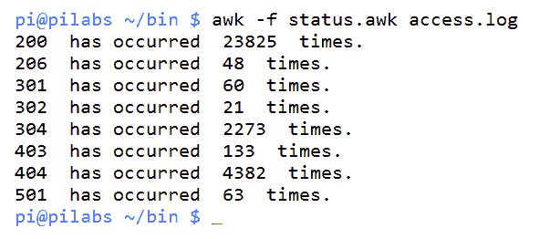

我们可以进一步关注 `404` 错误。当然，你可以选择任何状态码。从结果中我们看到 `4382 404` 状态码。为了总结这些 `404` 代码，我们将把 `status.awk` 复制到一个名为 `404.awk` 的新文件中。我们可以编辑 `404.awk`，添加一个 `if` 语句，使其只处理 `404` 代码。该文件应该类似于以下代码：

```
{ if ( $9 == "404" ) 
    record[$9,$7]++ } 
END { 
for (r in record) 
print r, " has occurred ", record[r], " times." } 
```

如果我们使用以下命令执行代码：

```
$ awk -f 404.awk access.log  
```

输出将类似于以下截图：

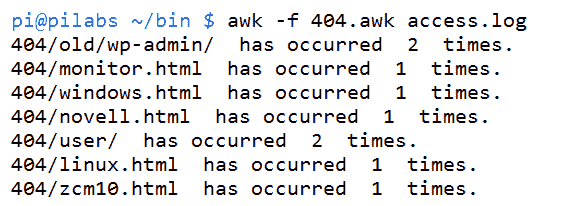

# 资源请求

你可以使用 AWK 检查特定页面或资源的请求次数：

```
$ awk '{print $7}' access.log | sort | uniq -c | sort -rn 
```

上面的命令将按请求资源的次数从高到低排序：

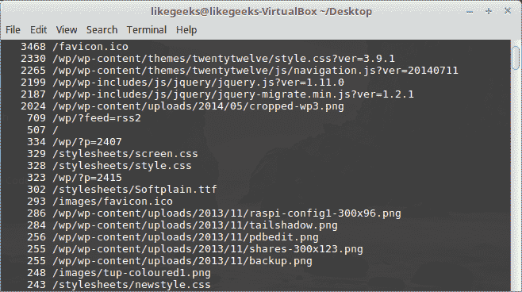

这些资源可能是图片、文本文件或 CSS 文件。

如果你想查看请求的 PHP 文件，可以使用 `grep` 只获取 PHP 文件：

```
$ awk ' ($7 ~ /php/) {print $7}' access.log | sort | uniq -c | sort -nr  
```

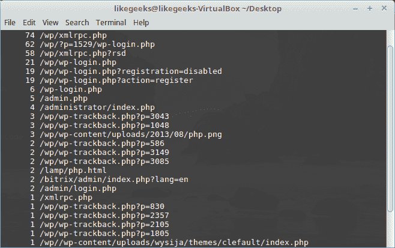

每个页面旁边都有访问次数。

你可以从 `log` 文件中获取任何统计数据，提取唯一值并以相同的方式排序。

# 识别图片热链接

说到资源时，你可能会遇到一个问题，那就是图片热链接。它指的是通过链接到其他服务器上的图片来使用你的图片。这种图片热链接的行为可能会泄露你的带宽。

既然我们在谈论 AWK，接下来我们将看到如何使用 AWK 查找它是如何使用我们的图片的：

```
$ awk -F\" '($2 ~ /\.(png|jpg|gif)/ && $4 !~ /^https:\/\/www\.yourdomain\.com/){print $4}' access.log | sort | uniq -c | sort
```

请注意，如果你使用的是 Apache，可以通过一个小的 `.htaccess` 文件防止图片热链接，方法是检查引荐来源是否不是你的域名：

```
RewriteEngine on 
RewriteCond %{HTTP_REFERER} !^$ 
RewriteCond %{HTTP_REFERER} !^https://(www\.)yourdomain.com/.*$ [NC] 
RewriteRule \.(gif|jpg|jpeg|bmp|png)$ - [F] 
```

# 显示最高排名的 IP 地址

你现在应该了解一些 `awk` 的强大功能，以及它本身庞大的语言结构。我们从 30,000 行的文件中提取的数据确实很强大，且容易提取。我们只需将之前使用的字段替换为 `$1`。这个字段表示客户端 IP 地址。如果我们使用以下代码，我们将能够打印出每个 IP 地址以及它访问 web 服务器的次数：

```
{ ip[$1]++ } 
END { 
for (i in ip) 
print i, " has accessed the server ", ip[i], " times." } 
```

我们希望能够扩展这个，显示出最高排名的 IP 地址，也就是访问站点最多的地址。工作主要还是在 `END` 块中，并将与当前最高排名地址进行比较。以下文件可以创建并保存为 `ip.awk`：

```
{ ip[$1]++ } 
END { 
for (i in ip) 
    if ( max < ip[i] ) { 
        max = ip[i] 
        maxnumber = i } 

print i, " has accessed ", ip[i], " times." } 
```

我们可以在以下截图中看到命令的输出。部分客户端 IP 地址被遮挡，因为它来自我的公共 web 服务器：

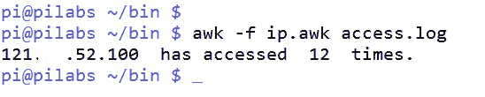

代码的功能来自 `END` 块。在进入 `END` 块时，我们运行一个 `for` 循环。我们遍历 `ip` 数组中的每个条目。我们使用条件语句 `if` 来查看当前迭代的值是否大于当前最大值。如果是，那么它就成为新的最大条目。当 `loop` 循环结束时，我们打印出具有最高值的 IP 地址。

# 显示浏览器数据

用于访问网站的浏览器信息包含在日志文件的字段 `12` 中。展示用于访问网站的浏览器列表可能会很有意思。以下代码将帮助你展示按浏览器报告的访问列表：

```
{ browser[$12]++ } 
END { 
    for ( b in browser ) 
        print b, " has accessed ", browser[b], " times." 
    } 
```

你可以看到我们如何创建小插件来与这些文件配合使用 `awk`，并调整字段和数组名称以适应需求。输出如下截图所示：

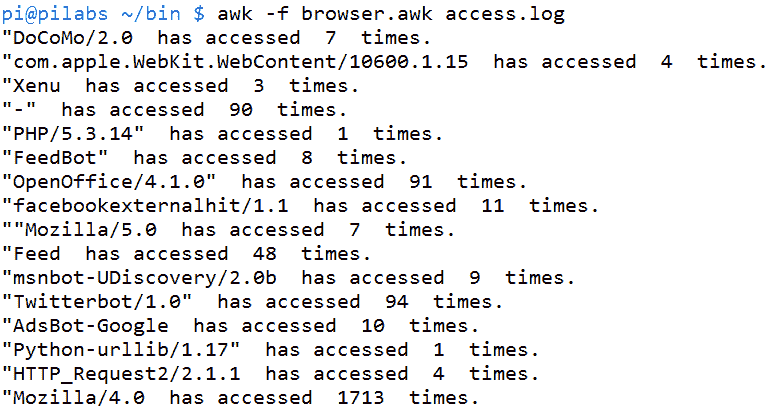

有趣的是，我们看到 Mozilla 4 和 5 占据了大多数请求客户端。我们看到 Mozilla 4 在这里出现了 `1713` 次。这里的 Mozilla/5.0 条目由于额外的双引号而格式错误。它稍后以 27,000 次访问出现。

# 处理邮件日志

我们曾处理过来自 Apache HTTP 网络服务器的日志。事实上，我们可以将相同的理念和方法应用于任何日志文件。我们将查看 Postfix 邮件日志。邮件日志包含了来自 SMTP 服务器的所有活动，然后我们就能看到谁向谁发送了邮件。该日志文件通常位于 `/var/log/mail.log`。我将在我的 Ubuntu 15.10 服务器上访问这个日志文件，该服务器配置了本地邮件传送。这意味着 SMTP 服务器只监听 `127.0.0.1` 的本地接口。

日志格式会根据消息类型略有变化。例如，`$7` 会包含外发消息的 `from` 日志，而接收消息则会包含 `to`。

如果我们想列出所有发送到 SMTP 服务器的消息，可以使用以下命令：

```
$ awk '  ( $7 ~ /^to/ ) ' /var/log/mail.log  
```

由于字符串 `to` 非常简短，我们可以通过确保字段以 `to` 开头来为其添加标识，使用 `^` 来实现。命令和输出如下截图所示：

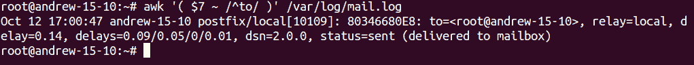

扩展对 `to` 或 `from` 的搜索以包含用户名将变得非常简单。我们可以看到邮件的发送或接收格式。使用与 Apache 日志相同的模板，我们可以轻松显示出最高的接收者或发送者。

# 总结

现在我们已经为文本处理提供了一些强大的工具，可以开始理解 AWK 的强大功能。使用真实数据对于评估我们搜索的性能和准确性特别有用。我们从新安装的 Ubuntu 15.10 Apache 网络服务器上开始使用简单的 Apache 条目，很快就迁移到了来自实际 Web 服务器的更大样本数据。这个包含 30,000 行的数据文件为我们提供了真正的内容，短短时间内，我们就能够生成可信的报告。然后我们返回到 Ubuntu 15.10 服务器，分析 Postfix SMTP 日志。我们可以看到，我们可以非常轻松地将之前使用的技术应用到新的日志文件中。

接下来，我们继续使用 AWK，并了解如何报告 `lastlog` 数据和扁平 XML 文件。

# 问题

1.  `access_log` 文件中的哪个字段包含 IP 地址？

1.  用于统计 AWK 处理的行数的命令是什么？

1.  如何从 Apache 访问日志文件中获取独立访客的 IP 地址？

1.  如何从 Apache 访问日志文件中获取访问量最多的 PHP 页面？

# 进一步阅读

请参阅以下内容，进一步阅读本章相关的内容：

+   [`httpd.apache.org/docs/1.3/logs.html`](https://httpd.apache.org/docs/1.3/logs.html)
