# 使用 Python 作为 Bash 脚本的替代方案

在上一章中，我们看到了一些使用 AWK 的实际示例，并且我们了解了如何处理 `lastlog` 输出，以生成更好的报告。在本章中，我们将看看 Bash 的另一种脚本替代方案，我们将讨论 Python。Python 是另一种脚本语言，也是我们迄今为止研究的最新语言。与 Bash 相似，Python 是一种解释型语言，并且使用了 shebang。尽管它没有 shell 接口，但我们可以通过一个叫做 REPL 的控制台来访问， 在其中我们可以输入 Python 代码与系统进行交互。在本章中，我们将讨论以下内容：

+   什么是 Python？

+   以 Python 的方式打招呼——Hello World

+   Pythonic 参数

+   显著的空格缩进

+   读取用户输入

+   字符串处理

# 技术要求

本章的源代码可以在这里下载：

[`github.com/PacktPublishing/Mastering-Linux-Shell-Scripting-Second-Edition/tree/master/Chapter14`](https://github.com/PacktPublishing/Mastering-Linux-Shell-Scripting-Second-Edition/tree/master/Chapter14)

# 什么是 Python？

Python 是一种面向对象的解释型语言，旨在易于使用并促进**快速应用开发**。这一目标通过语言中简化的语法来实现。

Python 由荷兰开发者 Guido van Rossum 于 1989 年 12 月底创建。该语言的大多数设计旨在追求清晰和简洁，其中 *Zen of Python* 的一条主要规则是：

*应该有一种，最好只有一种，明显的方式来做这件事。*

系统通常同时安装 Python 2 和 Python 3，但所有新的发行版都在切换到 Python 3。我们将使用 Python 3。

由于我们使用的是 Linux Mint，它已经预装了 Python 3。

如果你使用的是其他 Linux 发行版，或者由于某种原因找不到 Python 3，你可以通过以下方式进行安装：

+   在基于 RedHat 的发行版上：

```
$ sudo yum install python36
```

+   在基于 Debian 的发行版上：

```
$ sudo apt-get install python3.6
```

尽管没有 shell，我们可以使用 REPL 来与 Python 交互——读取、评估、打印和循环。我们可以通过在命令行中输入 `python3` 或在使用 CentOS 7 时输入 `python36` 来访问它。你应该会看到类似下面的截图：

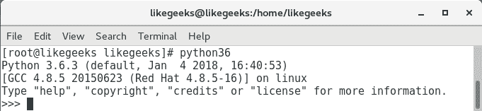

我们可以看到，系统为我们提供了 `>>>` 提示符，这就是 REPL 控制台。我们需要强调的是，这是一种脚本语言，像 Bash 和 Perl 一样，我们通常通过我们创建的文本文件来执行代码。这些文本文件通常会以 `.py` 作为后缀。

在使用 REPL 时，我们可以通过导入模块独立打印版本。在 Perl 中，我们使用关键字；在 Bash 中，我们使用命令 source；在 Python 中，我们使用 import：

```
>>>import sys
```

加载模块后，我们现在可以通过打印版本来探讨 Python 的面向对象特性：

```
>>> sys.version
```

我们将导航到命名空间中的 `sys` 对象，并从该对象调用版本方法。

将这两个命令结合起来，我们应该能看到以下输出：

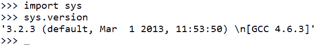

在结束这部分关于 Python 的描述时，我们应该看看 Python 的 Zen。在 REPL 中，我们可以输入 `import this`，如以下截图所示：

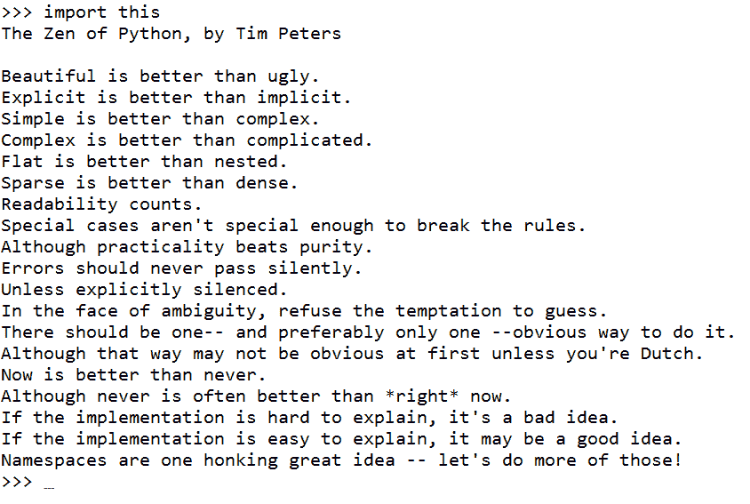

这远不止是 Python 的 Zen，它实际上是所有编程语言的一个好规则，也是开发者的指南。

最后，要关闭 REPL，我们将在 Linux 中按 *Ctrl* + *D*，或在 Windows 中按 *Ctrl* + *Z*。

# 以 Python 方式输出 Hello World

我们在 Python 中编写的代码应该清晰简洁：简洁胜过冗长。我们需要在第一行添加 shebang，然后是 `print` 语句。`print` 函数会自动添加换行符，且我们不需要在行尾加分号。我们可以在以下示例中看到编辑后的 `$HOME/bin/hello.py` 版本：

```
#!/usr/bin/python3
print("Hello World")
```

我们仍然需要添加执行权限，但可以像之前一样使用 `chmod` 来运行代码。以下命令展示了这一点，尽管我们现在应该有些习惯了：

```
$ chmod u+x $HOME/bin/hello.py
```

最后，我们可以执行代码来查看我们的问候语。

同样，你可以通过命令行使用 Python 解释器运行文件，如下所示：

```
$ python3 $HOME/bin/hello.py
```

或者在某些 Linux 发行版中，你可以这样运行：

```
$ python36 $HOME/bin/hello.py
```

再次提醒，至少掌握一门语言能更容易适应其他语言，这一点没有太多新意。

# Pythonic 参数

我们现在应该知道我们需要向 Python 传递命令行参数，可以通过 `argv` 数组来实现。不过，我们更像是 bash；在 Python 中，我们将程序名和其他参数一起放入数组中。

Python 还使用小写而不是大写来表示对象名称：

+   `argv` 数组是 `sys` 对象的一部分

+   `sys.argv[0]` 是脚本名

+   `sys.argv[1]` 是传递给脚本的第一个参数

+   `sys.argv[2]` 是第二个提供的参数，依此类推

+   参数计数将始终至少为 1，因此，在检查提供的参数时请记住这一点

# 提供参数

如果我们创建 `$HOME/bin/args.py` 文件，我们可以看到这个操作的效果。文件应该按以下方式创建，并设置为可执行：

```
#!/usr/bin/python3
import sys
print("Hello " + sys.argv[1])
```

如果我们运行带有提供参数的脚本，应该能看到类似以下截图的内容：

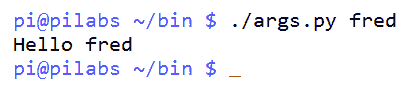

我们的代码仍然相当简洁清晰；不过，你可能已经注意到，我们无法将 `print` 语句中的引号文本与参数结合起来。我们使用 + 符号来连接或拼接两个字符串。由于没有专门的符号表示变量或其他类型的对象，因此它们不能作为静态文本出现在引号内。

# 计数参数

如前所述，脚本名称是数组中索引`0`的第一个参数。因此，如果我们尝试计算参数数量，计数应该至少为 1。换句话说，如果我们没有提供参数，参数数量将为 1。要计算数组中的项数，我们可以使用`len()`函数。

如果我们编辑脚本并加入一行新代码，我们将看到它的效果，如下所示：

```
#!/usr/bin/python3
import sys
print("Hello " + sys.argv[1])
print( "length is: " + str(len(sys.argv)) )
```

按照之前的方式执行代码，我们可以看到我们提供了两个参数——脚本名称和字符串`Mokhtar`：

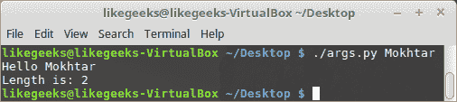

如果我们尝试使用一个`print`语句来打印输出和参数的数量，将会产生错误，因为我们不能将整数与字符串连接。长度值是一个整数，它不能与字符串混合，除非进行转换。因此，我们使用了`str`函数将整数转换为字符串。以下代码会失败：

```
#!/usr/bin/python3
import sys
print("Hello " + sys.argv[1] + " " + len(sys.argv))
```

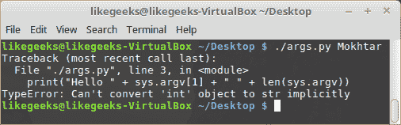

如果我们尝试运行脚本并省略了传递参数，那么当我们引用索引`1`时，数组中将会有一个空值。这将导致错误，如下图所示：

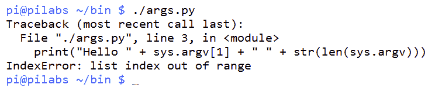

当然，我们需要处理这个问题以防止错误；这就是重要空白符的概念。

# 重要的空白符

Python 与大多数其他语言的一个主要区别是额外的空白符可能具有意义。代码的缩进级别定义了它属于的代码块。到目前为止，我们创建的代码没有缩进超出行的开始位置。这意味着所有代码都在相同的缩进级别，并且属于同一个代码块。与使用大括号或 do 和 done 关键字来定义代码块不同，Python 使用缩进来表示代码块。如果我们使用两个或四个空格，甚至是制表符缩进，那么必须始终保持一致。当我们返回到上一个缩进级别时，我们就回到之前的代码块。

这看起来很复杂，但实际上它非常简单，可以保持代码的简洁和整洁。如果我们编辑`arg.py`文件以防止不必要的错误，当没有提供参数时，我们可以看到它的实际效果：

```
#!/usr/bin/python3
import sys
count = len(sys.argv)
if ( count > 1 ):
    print("Arguments supplied: " + str(count))
    print("Hello " + sys.argv[1])
print("Exiting " + sys.argv[0])
```

`if`语句检查参数数量是否大于`1`。现在为了方便，我们将参数数量存储到一个名为`count`的变量中。代码块以冒号开始，接着所有后续缩进四个空格的代码都是在条件成立时会执行的部分。

当我们返回到上一级缩进时，我们回到主代码块，并且无论条件的状态如何，都会执行代码。

我们可以在下面的截图中看到这一点，在其中我们可以通过有无参数来执行脚本：

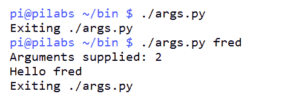

# 读取用户输入

如果我们希望欢迎消息根据我们的名字来问候我们，无论我们是否向脚本提供参数，我们都可以在脚本运行时添加一个提示来捕获数据。Python 可以简单而轻松地实现这一点。从下面的编辑文件中，我们可以看到如何实现这一点：

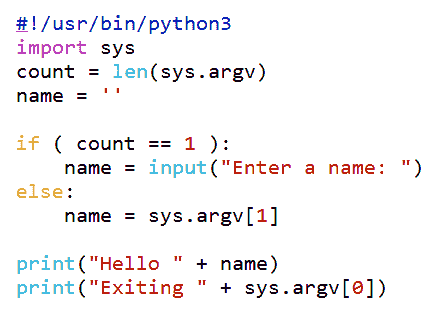

我们在脚本中使用了一个新变量，最初在主块中设置为空字符串。我们在这里设置它是为了使该变量对整个脚本和所有代码块都可用：

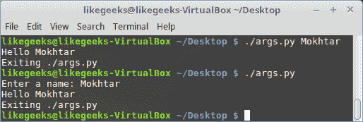

Python 3 中的 `input` 函数（或 Python 2 中的 `raw_input`）用于获取用户输入。我们将输入存储在 `name` 变量中。如果我们提供了一个参数，在代码的 `else` 块中我们将使用它，并将 `name` 变量设置为第一个提供的参数。这个在主块中的 `print` 语句中使用。

# 使用 Python 写入文件

为了增加本章的变化，我们现在将看看如何将这些数据打印到文件中。再次使用 Python，这是一个相当简单和容易的方式。我们将首先复制我们现有的 `args.py`。我们将其复制到 `$HOME/bin/file.py`。新的 `file.py` 应该类似于以下屏幕截图，并设置执行权限：

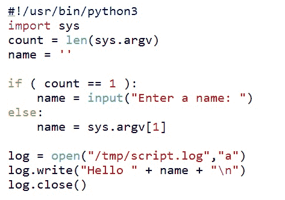

您会注意到我们刚刚改变了最后几行，现在不再使用打印而是打开一个文件。我们还可以看到 Python 更多的面向对象的特性，其中它动态地为对象 `log` 分配了 `write()` 和 `close()` 方法，因为它被视为文件的实例。当我们打开文件时，我们将其用于追加，这意味着如果文件已经存在内容，我们不会覆盖它。如果文件不存在，我们将创建一个新文件。如果使用 `w`，我们将打开文件进行写入，这可能导致覆盖现有内容，所以请小心。

您可以看到这是一个简单的任务；这就是为什么 Python 在许多应用程序中被广泛使用并且在学校广泛教授的原因。

# 字符串操作

处理 Python 中的字符串非常简单：您可以轻松地进行搜索、替换、更改字符大小写和执行其他操作：

要搜索字符串，您可以像这样使用 find 方法：

```
#!/usr/bin/python3
str = "Welcome to Python scripting world"
print(str.find("scripting"))
```

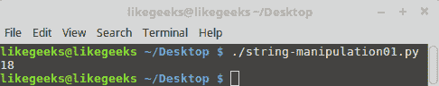

Python 中的字符串计数也是从零开始的，因此单词 `scripting` 的位置在 `18` 处。

您可以使用方括号获取特定子字符串，像这样：

```
#!/usr/bin/python3
str = "Welcome to Python scripting world"
print(str[:2]) # Get the first 2 letters (zero based)
print(str[2:]) # Start from the second letter
print(str[3:5]) # from the third to fifth letter
print(str[-1]) # -1 means the last letter if you don't know the length

```

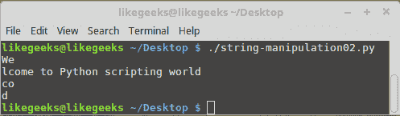

要替换字符串，您可以像这样使用 replace 方法：

```
#!/usr/bin/python3
str = "Welcome to Python scripting world" 
str2 = str.replace("Python", "Shell")
print(str2)
```

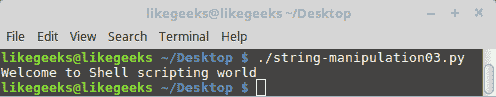

要更改字符大小写，您可以使用 `upper()` 和 `lower()` 函数：

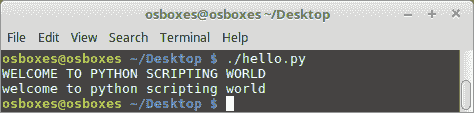

如您所见，使用 Python 处理字符串非常简单。作为替代脚本语言，Python 是一个非常棒的选择。

Python 的强大之处在于其可用的库。实际上，几乎所有你能想到的都有成千上万的库。

# 总结

这标志着我们对 Python 的学习的结束，虽然这确实是一次简短的旅程。我们再次强调，你在学习多种语言时会看到的许多相似之处，以及学习任何编程语言的重要性。你在一种语言中学到的知识，将帮助你理解大多数你遇到的其他语言。

从 Python 的 Zen 中我们学到的内容将帮助我们设计和开发出色的代码。我们可以使用以下 Python 代码打印 Python 的 Zen：

```
>>>import this
```

我们可以在 REPL 提示符下输入代码。保持代码简洁且良好排版将有助于提高可读性，并最终帮助代码维护。

我们也看到，Python 喜欢你在代码中显式地指定，且不会隐式地转换数据类型。

最后，我们学习了如何使用 Python 操作字符串。

我们也到了本书的结尾，但希望这只是你编写脚本生涯的开始。祝你好运，谢谢阅读。

# 问题

1.  以下代码将打印多少个字符？

```
#!/usr/bin/python3
str = "Testing Python.."
print(str[8:])
```

1.  以下代码将打印多少个单词？

```
#!/usr/bin/python3
print( len(sys.argv) )
Solution: Nothing
```

1.  以下代码将打印多少个单词？

```
#!/usr/bin/python3
import sys
print("Hello " + sys.argv[-1])
```

# 进一步阅读

请参阅以下内容以获取与本章相关的进一步阅读资料：

+   [`www.python.org/about/gettingstarted/`](https://www.python.org/about/gettingstarted/)

+   [`docs.python.org/3/`](https://docs.python.org/3/)
