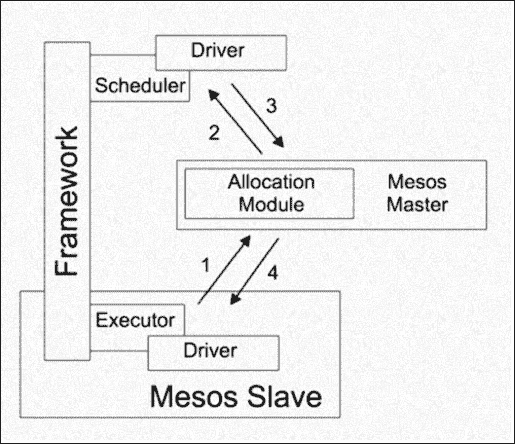
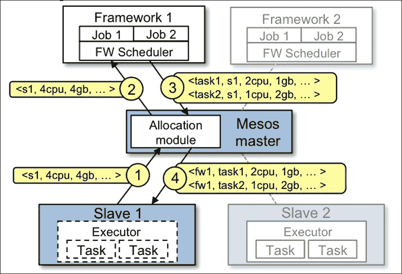

# 第一章：介绍 Mesos

Apache Mesos 是一款开源的分布式集群管理软件，起源于 2011 年 UC Berkeley AMPLab。它将 CPU、内存、存储和其他计算资源从物理或虚拟机器中抽象出来，使得容错和弹性分布式系统可以轻松构建并高效运行。它被称为**元调度器**（调度器的调度器）和“分布式系统内核/分布式数据中心操作系统”。

它提高了资源利用率，简化了系统管理，并支持多种可以通过利用其可插拔架构部署的分布式应用程序。它具有可扩展性和高效性，并提供诸如资源隔离和高可用性等功能，这些特点，加上一个强大且充满活力的开源社区，使其成为最令人兴奋的项目之一。

本章将涵盖以下主题：

+   Mesos 的数据中心操作系统与架构介绍

+   框架介绍

+   属性、资源以及资源调度、分配和隔离

+   Mesos 提供的监控与 API

+   Mesos 在生产环境中的应用

# Mesos 的数据中心操作系统与架构介绍

在过去十年中，数据中心已经从将多个应用程序打包到单台服务器中，发展到拥有大型数据中心，聚合数千台服务器作为大规模分布式计算基础设施。随着虚拟化、微服务、集群计算和超大规模基础设施的到来，当前的需求是创建一个以应用为中心的企业，遵循软件定义的数据中心战略。

目前，服务器集群通常是单独管理的，这可以类比于在 PC 上有多个操作系统，每个操作系统分别管理处理器、磁盘驱动器等。采用这种将机器视为独立实体并孤立管理的抽象模型，会大大降低数据中心有效构建和运行分布式应用的能力。

另一种看待这一情况的方式是将数据中心中运行应用程序与在笔记本电脑上运行应用程序进行比较。一个主要的区别是，在启动文本编辑器或网页浏览器时，我们不需要检查哪些内存模块是空闲的，也不需要选择符合需求的内存模块。这里正是平台像主操作系统一样发挥作用的意义，它允许多个用户同时运行多个应用程序，并利用共享的资源集。

当前，数据中心运行着各种分布式应用工作负载，如 Spark、Hadoop 等，并需要具备智能匹配资源与应用程序的能力。如今，数据中心生态系统必须具备管理和监控资源的能力，并能够高效地在统一的资源池中分配工作负载，灵活且轻松地满足多样化的用户需求（包括非基础设施团队）。数据中心操作系统为资源管理和监控提供了一种全面且可持续的方法，这不仅降低了拥有成本，还允许以隔离的数据中心基础设施无法支持的方式灵活处理资源需求。

数据中心操作系统的理念是智能软件，它位于数据中心的所有硬件之上，确保高效和动态的资源共享。除此之外，它还具备持续监控资源使用情况并改善工作负载和基础设施管理的能力，这一切都是以一种与特定应用需求无关、无缝的方式进行的。如果没有这种操作系统，数据中心就会呈现出孤岛式的情形，这迫使开发人员构建针对机器特定特性的专用软件，使得应用程序的迁移和调整变得极为繁琐。

数据中心操作系统充当着一个软件层，将数据中心中的所有服务器聚合为一个巨大的超级计算机，提供跨所有微服务应用程序的多延迟、隔离和资源控制的优势。另一个主要的优势是消除了在持续分配和重新分配虚拟资源过程中人为错误的发生。

从开发者的角度来看，这将使他们能够轻松且安全地构建分布式应用程序，而不必将其局限于一堆专门的工具，这些工具各自针对特定的需求。例如，考虑到数据科学团队的情况，他们开发的分析应用程序通常是资源密集型的。一个能够简化资源访问、共享和分配的操作系统，成功地解决了他们每次工作负载变化时必须重新分配硬件的难题。

数据中心操作系统对 DevOps 的相关性至关重要，DevOps 本质上是一种软件开发方法，强调自动化、集成、协作以及传统软件开发人员与其他 IT 专业人员之间的沟通。借助能够有效将单独服务器转化为资源池的操作系统，DevOps 团队可以专注于加速开发，而无需不断担心基础设施问题。

在分布式计算成为常态的世界里，数据中心操作系统是一个伪装的福音。通过免去手动配置和维护单独机器与应用程序的麻烦，系统工程师无需为特定应用配置特定的机器，因为所有应用都可以在任何可用的资源上运行，即使这些机器上已经有其他应用在运行。使用数据中心操作系统可以实现集中的控制和智能的资源利用，消除硬件和软件的孤岛，确保即便是非基础设施专业人员也能更好地访问和使用资源。

一些组织通过数据中心操作系统管理其超大规模数据中心的例子包括 Google 的 Borg（以及下一代 Omega）系统。数据中心操作系统的优点是显而易见的，优势包括计算资源的可扩展性、支持应用程序之间数据共享的灵活性，以及在启动和管理可互操作的集群应用程序时节省团队的精力、时间和资金。

正是通过将数据中心转变为单一超级计算机的愿景，Apache Mesos 希望实现这一目标。Mesos 起源于 2011 年伯克利 AMPLab 研究论文，至今已取得长足进展，许多领先公司（如 Apple、Twitter、Netflix、AirBnB 等）已在生产环境中使用它。Mesosphere 是一家初创公司，正在开发以 Mesos 为核心的分布式操作系统产品。

# Mesos 的架构

Mesos 是一个开源平台，用于在不同的分布式应用程序（或框架）之间共享商品服务器的集群，如 Hadoop、Spark、Kafka 等。其核心思想是作为一个集中的集群管理器，通过汇聚集群的所有物理资源，并将其作为一个高度可用的资源池提供给所有不同的框架使用。例如，如果一个组织有一个 10 节点集群（16 个 CPU 和 64 GB 内存）和一个 5 节点集群（4 个 CPU 和 16 GB 内存），那么可以利用 Mesos 将它们整合成一个虚拟集群，具有 720 GB 内存和 180 个 CPU，在这个集群上可以运行多个分布式应用程序。以这种方式共享资源大大提高了集群利用率，并消除了每个框架所需的昂贵数据复制过程。

Mesos 的一些重要特性包括：

+   **可扩展性**：可以弹性扩展到超过 50,000 个节点

+   **资源隔离**：通过 Linux/Docker 容器实现

+   **高效性**：通过在多个框架之间进行 CPU 和内存感知的资源调度来实现

+   **高可用性**：通过 Apache ZooKeeper 实现

+   **监控接口**：用于监控集群状态的 Web UI

Mesos 基于与 Linux 内核相同的原则，旨在提供一个高可用、可扩展和容错的基础，使得各种框架能够有效且隔离地共享集群资源。分布式应用程序种类繁多且持续发展，这一事实使得 Mesos 的设计理念趋向于提供一个精简的接口，允许不同框架之间高效地分配资源，并将任务调度和作业执行的工作委托给框架本身。这样做的两个优点是：

+   不同的框架数据复制工作可以独立地设计方法来解决它们的数据局部性、容错性及其他需求

+   它简化了 Mesos 的代码库，并使其具备可扩展性、灵活性、健壮性和敏捷性

Mesos 的架构通过采用资源报价抽象将任务调度的责任交给各自的框架，它将一组资源打包并向每个框架发出报价。Mesos 主节点决定向每个框架提供多少资源，而每个框架则决定接受哪些资源报价，并在这些接受的资源上执行哪些任务。这种资源分配方法显示出可以为共享同一集群的每个框架实现良好的数据局部性。

另一种架构将实现一个全局调度器，该调度器将框架需求、组织优先级和资源可用性作为输入，并提供按框架和资源划分的任务调度输出，本质上充当了作业与资源之间的媒介，优先级作为约束条件。这个架构的挑战，如开发一个能捕捉不同框架各种需求的健壮 API、预见新框架的出现，以及为数百万个作业解决复杂的调度问题，使得前一种方法对于创作者来说更具吸引力。

# 框架介绍

Mesos 框架位于 Mesos 和应用程序之间，充当管理任务调度和执行的层。由于其实现是特定于应用程序的，因此这个术语通常用来指代应用程序本身。早期，Mesos 框架只能通过 libmesos C++ 库与 Mesos API 交互，因此开发了包括 Java、Scala、Python 和 Go 等语言的绑定，这些语言都大量利用了 libmesos。从 v0.19.0 版本开始，对基于 HTTP 协议所做的更改使得开发者可以使用他们想要的语言开发框架，而不必依赖 C++ 代码。一个框架由两个组件组成：a) 调度器和 b) 执行器。

**调度器**负责决定它收到的资源报价，并跟踪集群的当前状态。与 Mesos 主节点的通信由 **SchedulerDriver** 模块处理，该模块将框架注册到主节点，启动任务，并向其他组件传递消息。

第二个组件，**Executor**，顾名思义，负责在从节点上执行任务。与从节点的通信由 **ExecutorDriver** 模块处理，该模块还负责将状态更新发送到调度程序。

本章稍后讨论的 Mesos API 使程序员能够开发自己的自定义框架，这些框架可以在 Mesos 上运行。框架的其他一些特性，如身份验证、授权和用户管理，将在 第六章，*Mesos 框架* 中详细讨论。



## 构建在 Mesos 上的框架

下面列出了一些构建在 Mesos 上的服务和框架。此列表并不详尽，几乎每天都有新框架得到支持。除了下面的列表，你还可以参考 [`mesos.apache.org/documentation/latest/frameworks/`](http://mesos.apache.org/documentation/latest/frameworks/)：

### 长时间运行的服务

+   **Aurora**：这是一个运行在 Mesos 上的服务调度程序，允许你运行长时间运行的服务，利用 Mesos 的可扩展性、容错性和资源隔离性。

+   **Marathon**：这是一个基于 Mesos 的私有 PaaS。它自动处理硬件或软件故障，并确保应用始终在线。

+   **Singularity**：这是一个调度程序（HTTP API 和 Web 界面），用于运行 Mesos 任务，例如长时间运行的进程、一次性任务和定时任务。

+   **SSSP**：这是一个简单的 Web 应用程序，提供一个“Megaupload”白标用于存储和共享 S3 中的文件。

### 大数据处理

+   Cray Chapel 是一种高效的并行编程语言。Chapel Mesos 调度器让你可以在 Mesos 上运行 Chapel 程序。

+   Dark 是一个 Python 版的 Spark，是一个类似 MapReduce 的框架，使用 Python 编写并在 Mesos 上运行。

+   Exelixi 是一个分布式框架，用于大规模运行遗传算法。

+   Hadoop：在 Mesos 上运行 Hadoop 会高效地将 MapReduce 作业分配到整个集群中。

+   Hama 是一个分布式计算框架，基于大规模科学计算的批同步并行（Bulk Synchronous Parallel）技术，例如矩阵、图和网络算法。

+   MPI 是一个消息传递系统，旨在适用于各种并行计算机。

+   Spark 是一个快速且通用的集群计算系统，使并行作业的编写变得简单。

+   Storm 是一个分布式实时计算系统。Storm 使得可靠地处理无界数据流变得简单，它为实时处理做的事情类似于 Hadoop 为批处理所做的工作。

### 批量调度

+   Chronos 是一个分布式作业调度器，支持复杂的作业拓扑结构。它可以作为更具容错性的 cron 替代品。

+   Jenkins 是一个持续集成服务器。Mesos-Jenkins 插件使其能够根据工作负载动态地在 Mesos 集群上启动工作节点。

+   JobServer 是一个分布式作业调度和处理器，允许开发人员使用点选式 Web UI 构建自定义批处理任务。

### 数据存储

+   Cassandra 是一个高性能且高度可用的分布式数据库。在线性可扩展性和在商用硬件或云基础设施上经受住了故障容忍性验证，使其成为处理关键数据的理想平台。

+   Elasticsearch 是一个分布式搜索引擎。Mesos 使其能够轻松运行和扩展。

# Mesos 的属性和资源

Mesos 通过以下两种方法描述集群中存在的从节点：

## 属性

属性用于描述有关从节点的某些附加信息，例如其操作系统版本、是否具有某种硬件类型等。它们以键值对的形式表达，支持三种不同的值类型——标量、范围和文本——并与报价一起发送给框架。请查看以下代码：

```
attributes : attribute ( ";" attribute )*

attribute : text ":" ( scalar | range | text )
```

## 资源

Mesos 可以管理三种不同类型的资源：标量、范围和集合。这些资源用于表示 Mesos 从节点所能提供的不同资源。例如，标量资源类型可以用来表示从节点的 CPU 数量。每个资源都通过一个键字符串来标识，如下所示：

```
resources : resource ( ";" resource )*

resource : key ":" ( scalar | range | set )

key : text ( "(" resourceRole ")" )?

resourceRole : text | "*"
```

预定义用途和惯例

Mesos 主节点预定义了它如何处理以下资源列表：

+   `cpus`

+   `mem`

+   `disk`

+   `ports`

特别地，一个没有`cpu`和`mem`资源的从节点将永远不会将其资源广告给任何框架。此外，主节点的用户界面将`mem`和`disk`中的标量值解释为 MB。例如，值`15000`会显示为`14.65GB`。

### 示例

这里是一些配置 Mesos 从节点的示例：

+   `resources='cpus:24;mem:24576;disk:409600;ports:[21000-24000];bugs:{a,b,c}'`

+   `attributes='rack:abc;zone:west;os:centos5;level:10;keys:[1000-1500]'`

在这种情况下，我们有三种不同类型的资源：标量、范围和集合。它们分别被称为`cpus`、`mem`和`disk`，范围类型为`ports`。

+   一个名为`cpus`的标量，值为`24`

+   一个名为`mem`的标量，值为`24576`

+   一个名为`disk`的标量，值为`409600`

+   一个名为`ports`的范围，值为`21000`到`24000`（包含端点）

+   一个名为`bugs`的集合，包含值`a`、`b`和`c`

在属性的情况下，我们将得到三个属性：

+   一个名为`rack`的属性，文本值为`abc`

+   一个名为`zone`的属性，文本值为`west`

+   一个名为`os`的属性，文本值为`centos5`

+   一个名为`level`的属性，标量值为`10`

+   一个名为`keys`的属性，范围值为`1000`到`1500`（包含端点）

# 两级调度

Mesos 具有一个两级调度机制，用于为不同框架分配资源并启动任务。在第一层级中，管理 Mesos 集群中每个节点上从节点进程的主控进程会确定每个节点上可用的空闲资源，将其分组，并根据组织政策（如优先级或公平共享）将这些资源提供给不同的框架。组织还可以通过自定义分配模块定义自己的共享政策。

在第二级，每个框架的调度组件（作为客户端注册到主控）根据框架的需求接受或拒绝所提供的资源。如果接受该资源提供，框架的调度器会向 Mesos 主控发送需要执行的任务信息，以及每个任务所需的资源数量。主控将任务转交给相应的从节点，从节点为框架的执行器组件分配必要的资源，执行器管理容器中所有任务的执行。当任务完成后，容器被拆除，资源被释放供其他任务使用。

以下图示和来自 Apache Mesos 文档的解释（[`mesos.apache.org/documentation/latest/architecture/`](http://mesos.apache.org/documentation/latest/architecture/)）更详细地解释了这一概念：



让我们来看一下前面图示中提到的要点：

+   **1**: 从节点 1 向主控报告其有四个 CPU 和 4 GB 内存空闲。然后，主控调用分配模块，告知它应该将所有可用资源提供给框架 1。

+   **2**: 主控发送描述这些资源的资源提供信息给框架 1。

+   **3**: 框架的调度器向主控回复有关在从节点上运行的两个任务的信息，第一个任务使用两个 CPU 和 1 GB 内存，第二个任务使用一个 CPU 和 2 GB 内存。

+   **4**: 主控进程将任务发送到从节点，从节点为框架的执行器分配适当的资源，执行器进而启动这两个任务。由于一个 CPU 和 1 GB 内存仍然空闲，分配模块现在可能会将这些资源提供给框架 2。此外，当任务完成并且有新的资源释放时，该资源还会提供给进程重试。

Mesos 还为框架提供了拒绝资源提供的能力。框架可以拒绝那些不符合其要求的资源提供。这使得框架能够支持各种复杂的资源约束，同时保持 Mesos 的简单性。一种叫做 **延迟调度** 的策略允许框架等待有限时间以访问存储其输入数据的节点，尽管会有轻微的延迟，但能提供公平的数据本地性。

如果框架约束复杂，可能会出现一个框架在收到符合其需求的合适资源报价之前需要等待的情况。为了解决这个问题，Mesos 允许框架设置过滤器，指定它们将用于始终拒绝某些资源的标准。例如，框架可以设置一个过滤器，表示它只能在至少有 32 GB 空闲内存的节点上运行。这样可以绕过拒绝过程，减少通信开销，从而降低整体延迟。

# 资源分配

资源分配模块包含了 Mesos 主节点用来确定需要向每个框架提供的资源类型和数量的策略。组织可以自定义该模块以实现自己的分配策略——例如，公平分配、优先级等——从而实现细粒度的资源共享。可以开发自定义分配模块来解决特定需求。

资源分配模块负责确保资源在竞争框架之间公平共享。用于确定共享策略的算法选择对集群管理器的效率有着重要影响。最流行的分配算法之一是最大最小公平分配及其加权派生算法，接下来的部分将进行描述。

## 最大最小公平分配算法

假设有一组源（1，2，...，m），其资源需求分别为 x[1]，x[2]，...，x[m]。假设资源总数为 R。我们将首先把 *R*/*m* 的资源分配给每个 *m* 个源。然后，从需求最少的源开始，我们将分配的资源与实际需求进行比较。如果初始分配（*R*/*m*）超过了源 1 的需求要求，我们将把多余的资源在其余源之间平均重新分配。然后，我们将把新的分配与第二个需求最少的源的实际需求进行比较，继续重复这一过程。直到每个源的分配资源小于或等于其实际需求。如果有任何源的分配资源少于其实际需要，算法确保没有其他源可以获得比该源更多的资源。这种分配被称为最大最小公平分配，因为它最大化了需求没有得到满足的源的最小份额。

请参考以下示例：

如何计算一个四个源的最大最小公平分配，*S1*，*S2*，*S3*，*S4*，它们的需求分别为 2，2.5，4 和 5，当资源总容量为 10 时。

根据之前描述的方法，为了解决这个问题，我们将资源初步划分为四个每个大小为 2.5 的部分。接下来，我们将比较这种分配与需求最小的源（在本例中为*S1*）的实际需求。由于分配大于实际需求，剩余的 0.5 将均等地分配给其余的三个源，即*S2*、*S3*和*S4*，每个获得 2.666。继续这一过程，我们会发现新的分配大于源*S2*的实际需求。多余的 0.166 再次均匀地分配给剩下的两个源*S3*和*S4*，每个变为*2.666 + 0.084 = 2.75*。现在每个源的分配量都小于或等于实际需求，因此这个过程停止。最终的分配结果是，*S1 – 2*，*S2 – 2.5*，*S3 – 2.75*，和*S4 – 2.75*。

这一策略在同质环境中效果很好——也就是资源需求在不同竞争用户之间大致成比例的环境，比如 Hadoop 集群。然而，在具有异构资源需求的框架之间调度资源则构成了更复杂的挑战。如果用户 A 运行的任务每个需要两个 CPU 和 8GB 的内存，而用户 B 运行的任务每个需要四个 CPU 和 2GB 内存，那么适合的公平分配政策是什么？如所示，用户 A 的任务是内存密集型的，而用户 B 的任务是 CPU 密集型的。那么，如何在这两种资源（RAM 和 CPU）之间为两位用户分配资源呢？

后者场景是 Mesos 常遇到的情况，因为 Mesos 的设计目的是主要在异构环境中管理资源。为了解决这个问题，Mesos 将**主导资源公平性**算法（**DRF**）作为其默认资源分配策略，这在异构环境中更为适用。该算法及其在高效资源分配中的作用将在下一章中详细讨论。

# 资源隔离

集群管理器的关键要求之一是确保将资源分配给特定框架时不会影响其他框架上任何正在运行的作业。因此，Mesos 提供了在从节点上实施隔离机制以区分不同任务的功能。容器被用于资源隔离，并采用可插拔架构。Mesos 的从节点使用 Containerizer API 来提供一个隔离环境，运行框架的执行器及其相应的任务。Containerizer API 的目标是支持广泛的实现，这意味着可以开发定制的容器化工具和隔离器。当从节点进程启动时，可以指定用于启动容器的容器化工具以及用于执行资源约束的隔离器。

Mesos 容器化 API 使用 Linux 特有的功能（如控制组和命名空间）提供框架执行器的资源隔离。它还为 POSIX 系统提供基本支持（仅限资源使用报告，而非实际隔离）。这一重要话题将在后续章节中详细探讨。

Mesos 还在容器级别提供网络隔离，以防止单个框架占用所有可用的网络带宽或端口。然而，默认情况下不支持此功能，需要安装和配置额外的依赖项来启用此功能。

# Mesos 中的监控

在本节中，我们将查看 Mesos 提供的用于监控各种组件的不同度量指标。

## Mesos 提供的监控

Mesos 主节点和从属节点提供丰富的数据，支持资源利用率监控和异常检测。信息包括可用资源、已用资源、注册框架、活跃从属节点和任务状态的详细信息。这些数据可用于创建自动化警报和开发集群健康监控仪表板。更多细节请参考：

[`mesos.apache.org/documentation/latest/monitoring/`](http://mesos.apache.org/documentation/latest/monitoring/)。

每个活跃容器的网络统计数据通过从属节点上的`/monitor/statistics.json`端点发布。

### 度量指标类型

Mesos 提供两种不同类型的度量指标：计数器和仪表。它们的解释如下：

+   **计数器**：用于衡量离散事件，如已完成的任务数或无效的状态更新。其值始终为整数。

+   **仪表**：用于检查特定度量指标的快照，如某一时刻活跃框架的数量或正在运行的任务数量。

# Mesos API

Mesos 提供一个 API，允许开发人员构建可以在底层分布式基础架构上运行的自定义框架。利用此 API 和新的 HTTP API 开发定制框架的详细步骤将在第六章，*Mesos 框架*中详细探讨。

## 消息

Mesos 实现了一种基于演员模型的消息传递编程模型，以实现不同 Mesos 组件之间的非阻塞通信，并使用协议缓冲区进行传输。例如，调度程序需要告诉执行器使用一定数量的资源，执行器需要向调度程序提供有关执行的任务的状态更新，等等。协议缓冲区提供了所需的灵活消息传递机制，允许开发人员定义可以跨不同语言使用的自定义格式和协议。有关不同 Mesos 组件之间传递的消息的更多详细信息，请参阅[`github.com/apache/mesos/blob/master/include/mesos/mesos.proto`](https://github.com/apache/mesos/blob/master/include/mesos/mesos.proto)

## API 详情

以下部分简要介绍了 Mesos 提供的不同 API 和方法：

### 执行器 API

以下是执行器 API 的简要描述。欲了解更多详情，请访问[`mesos.apache.org/api/latest/java/org/apache/mesos/Executor.html`](http://mesos.apache.org/api/latest/java/org/apache/mesos/Executor.html)。

+   `registered`：可以通过以下代码注册：

    ```
    void registered(ExecutorDriver driver,
      ExecutorInfo executorInfo,
      FrameworkInfo frameworkInfo,
      SlaveInfo slaveInfo)
    ```

    这段代码会在执行器驱动程序成功连接到 Mesos 后调用。特别地，调度程序可以通过`ExecutorInfo.getData()`字段将一些数据传递给其执行器。

    以下是参数：

    +   `driver`：这是已注册并连接到 Mesos 集群的执行器驱动程序。

    +   `executorInfo`：这是描述已注册的执行器信息。

    +   `frameworkInfo`：这是描述已注册框架的信息。

    +   `slaveInfo`：这是描述将用于启动该执行器任务的从节点。

+   `reregistered`：可以*重新注册*，具体如下：

    ```
    void reregistered(ExecutorDriver driver,
      SlaveInfo slaveInfo)
    ```

    这段代码会在执行器与重新启动的从节点重新注册时调用。

    以下是参数：

    +   `driver`：这是已与 Mesos 主节点重新注册的执行器驱动程序。

    +   `slaveInfo`：这是描述将用于启动该执行器任务的从节点。

+   `disconnected`：可以通过以下代码断开连接：

    ```
    void disconnected(ExecutorDriver driver)
    ```

    上述代码会在执行器与从节点“断开连接”时调用，例如在从节点由于升级而重新启动时。

    以下是参数：

    +   `driver`：这是已断开连接的执行器驱动程序。

+   `launchTask`：请查看以下代码：

    ```
    void launchTask(ExecutorDriver driver,
      TaskInfo task)
    ```

    上述代码会在该执行器上启动任务时调用（通过`SchedulerDriver.launchTasks(java.util.Collection<OfferID>, java.util.Collection<TaskInfo>, Filters)`发起）。请注意，此任务可以通过线程、进程或一些简单的计算来实现；但是，在该回调返回之前，不会在此执行器上调用其他回调。

    以下是参数：

    +   `driver`：这是启动任务的执行器驱动程序。

    +   `task`：描述已启动的任务

+   `killTask`：运行以下代码：

    ```
    void killTask(ExecutorDriver driver,
      TaskID taskId)
    ```

    当此执行器中的任务通过`SchedulerDriver.killTask`（TaskID）被终止时，将调用此方法。请注意，执行器不会代表任务发送状态更新，执行器负责创建新的`TaskStatus` protobuf 消息（即，`TASK_KILLED`），并调用`ExecutorDriver.sendStatusUpdate`（`TaskStatus`）。

    以下是参数：

    +   `driver`：这是拥有被终止任务的执行器驱动程序

    +   `taskId`：这是已终止任务的 ID

+   `frameworkMessage`：运行以下代码：

    ```
    void frameworkMessage(ExecutorDriver driver,
      byte[] data)
    ```

    当执行器接收到框架消息时，将调用此方法。这些消息是尽力而为的；不要期望框架消息以任何可靠的方式被重新传输。

    以下是参数：

    +   `driver`：这是接收到消息的执行器驱动程序

    +   `data`：这是消息负载

+   `shutdown`：执行以下代码：

    ```
    void shutdown(ExecutorDriver driver)
    ```

    当执行器终止其所有当前运行的任务时，将调用此方法。请注意，在 Mesos 确定执行器已终止后，任何执行器没有发送终止状态更新的任务（例如，`TASK_KILLED`、`TASK_FINISHED`、`TASK_FAILED`等）将创建一个`TASK_LOST`状态更新。

    以下是参数：

    +   `driver`：这是应该终止的执行器驱动程序。

+   `error`：运行以下：

    ```
    void error(ExecutorDriver driver,
      java.lang.String message)
    ```

    当执行器和/或执行器驱动程序发生致命错误时，前述代码会被调用。在调用此回调之前，驱动程序将被终止。

    以下是参数：

    +   `driver`：这是由于此错误而被中止的执行器驱动程序

    +   `message`：这是错误信息

### 执行器驱动程序 API

以下是执行器驱动程序 API 的简要说明。如需更多详细信息，请访问 [`mesos.apache.org/api/latest/java/org/apache/mesos/ExecutorDriver.html`](http://mesos.apache.org/api/latest/java/org/apache/mesos/ExecutorDriver.html)。

+   `start`：运行以下一行：

    ```
    Status start()
    ```

    上述代码启动了执行器驱动程序。必须在进行其他驱动程序调用之前调用此方法。

    调用后的驱动程序状态已返回。

+   `stop`：运行以下一行：

    ```
    Status stop()
    ```

    这将停止执行器驱动程序。

    调用后的驱动程序状态就是返回值。

+   `abort`：运行以下一行：

    ```
    Status abort()
    ```

    这将中止驱动程序，以便不再向执行器发送回调。中止和停止的语义被故意分开，以便代码能够检测到中止的驱动程序（通过`join()`的返回状态；参见以下部分），并根据需要实例化并启动另一个驱动程序（在同一进程内，尽管目前执行器不支持此功能）。

    调用后的驱动程序状态就是返回值。

+   `join`：运行以下：

    ```
    Status join()
    ```

    这会等待驱动程序停止或中止，可能会无限期地阻塞当前线程。此函数的返回状态可用于确定驱动程序是否被中止（查看 `mesos.proto` 以了解状态描述）。

    调用后的驱动程序状态就是返回值。

+   `run`：查看以下代码行：

    ```
    Status run()
    ```

    这将启动并立即加入（即阻塞）驱动程序。

    调用后的驱动程序状态就是返回值。

+   `sendStatusUpdate`：执行以下代码：

    ```
    Status sendStatusUpdate(TaskStatus status)
    ```

    这会向框架调度器发送状态更新，必要时会重试，直到收到确认或执行器被终止（在这种情况下，将发送 `TASK_LOST` 状态更新）。有关状态更新确认的更多信息，请查看 `Scheduler.statusUpdate(org.apache.mesos.SchedulerDriver, TaskStatus)`。

    以下是参数：

    +   `status`：这是需要发送的状态更新。

+   调用后的驱动程序状态就是返回值。

+   `sendFrameworkMessage`：运行以下代码：

    ```
    Status sendFrameworkMessage(byte[] data)
    ```

    这会向框架调度器发送一条消息。这些消息以尽力而为的方式发送，不能期望它们以任何可靠的方式重新传输。

    参数如下：

    +   `data`：这是消息负载。

    调用后的驱动程序状态就是返回值。

### 调度器 API

以下是调度器 API 的简要描述。更多细节，请访问 [`mesos.apache.org/api/latest/java/org/apache/mesos/Scheduler.html`](http://mesos.apache.org/api/latest/java/org/apache/mesos/Scheduler.html)。

+   `registered`：可以通过以下代码进行注册：

    ```
    void registered(SchedulerDriver driver,
      FrameworkID frameworkId,
      MasterInfo masterInfo)
    ```

    前述代码会在调度器成功注册到 Mesos 主节点时调用。一个由主节点生成的唯一 ID 被用来区分该框架与其他框架，并且包含当前主节点 IP 和端口的 `MasterInfo` 被作为参数提供。

    以下是参数：

    +   `driver`：这是已注册的调度器驱动程序。

    +   `FrameworkID`：这是由主节点生成的 `FrameworkID`。

    +   `MasterInfo`：这是关于当前主节点的信息，包括 IP 和端口。

+   `reregistered`：前述代码可以如下重新注册：

    ```
    void reregistered(SchedulerDriver driver,
      MasterInfo masterInfo)
    ```

    前述代码会在调度器重新注册到新选举出的 Mesos 主节点时调用。只有在调度器之前已注册时才会调用。包含选举出的主节点更新信息的 `MasterInfo` 被作为参数提供。

    参数如下：

    +   `driver`：这是已重新注册的驱动程序。

    +   `MasterInfo`：这是关于选举出的主节点的更新信息。

+   `resourceOffers`：执行以下代码：

    ```
    void resourceOffers(SchedulerDriver driver,
      java.util.List<Offer> offers)
    ```

    当资源提供给该框架时，会调用前面的代码。单个提议仅包含来自单个从属节点的资源。与提议相关的资源不会重新提供给该框架，直到以下情况之一发生：（a）该框架拒绝这些资源（参考`SchedulerDriver.launchTasks(java.util.Collection<OfferID>, java.util.Collection<TaskInfo>, Filters)`），或（b）这些资源被撤销（参考`offerRescinded(org.apache.mesos.SchedulerDriver, OfferID)`）。请注意，资源可能会同时提供给多个框架，具体取决于所使用的分配器。在这种情况下，第一个使用这些资源启动任务的框架将能够使用这些资源，而其他框架将会失去这些资源。（或者，如果一个框架已经使用这些资源启动了任务，这些任务将失败，并显示`TASK_LOST`状态，附带一条说明信息。）

    以下是参数：

    +   `driver`：这是用于运行该调度器的驱动程序

    +   `offers`：这是提供给该框架的资源

+   `offerRescinded`：运行以下代码：

    ```
    void offerRescinded(SchedulerDriver driver,
      OfferID offerId)
    ```

    当提议不再有效时会调用此代码（例如，从属节点丢失或另一个框架使用了提议中的资源）。如果由于某种原因，提议从未被撤销（例如，丢失的消息，框架故障转移等），那么尝试使用无效提议启动任务的框架将收到`TASK_LOST`状态更新（请查看`resourceOffers(org.apache.mesos.SchedulerDriver, java.util.List<Offer>)`）。

    以下是参数：

    +   `driver`：这是用于运行该调度器的驱动程序

    +   `offerID`：这是被撤销的提议的 ID

+   `statusUpdate`：请查看以下代码：

    ```
    void statusUpdate(SchedulerDriver driver,
      TaskStatus status)
    ```

    当任务状态发生变化时，会调用前面的代码（例如，某个从属节点丢失，任务也随之丢失；任务完成，执行器发送状态更新；等等）。如果由于某种原因，在这个回调过程中调度器被中止或进程退出，那么会再传递一次状态更新。（不过请注意，如果在此期间发送状态更新的从属节点丢失或失败，当前这种情况并不适用。）

    以下是参数：

    +   `driver`：这是用于运行该调度器的驱动程序

    +   `status`：这是状态更新，包含任务 ID 和状态

+   `frameworkMessage`：请查看以下代码：

    ```
    void frameworkMessage(SchedulerDriver driver,
      ExecutorID executorId,
      SlaveID slaveId,
      byte[] data)
    ```

    当执行器发送消息时，会调用前面的代码。这些消息是尽最大努力发送的，不能期望它们会以可靠的方式重新传输。

    参数如下：

    +   `driver`：这是接收消息的驱动程序

    +   `ExecutorID`：这是发送消息的执行器 ID

    +   `SlaveID`：这是启动执行器的从属节点 ID

    +   `data`：这是消息的有效载荷

+   `disconnected`：运行以下代码：

    ```
    void disconnected(SchedulerDriver driver)
    ```

    当调度器与主节点断开连接时会触发此操作（例如，主节点失败并由另一个主节点接管）。

    以下是参数：

    +   `driver`: 这是用来运行此调度器的驱动程序

+   `slaveLost`: 执行以下代码：

    ```
    void slaveLost(SchedulerDriver driver,
      SlaveID slaveId)
    ```

    当从节点被确定为无法访问时（例如，机器故障或网络分区），会调用此操作。大多数框架需要在新的从节点上重新调度所有在该从节点上启动的任务。

    以下是参数：

    +   `driver`: 这是用来运行此调度器的驱动程序

    +   `SlaveID`: 这是丢失的从节点 ID

+   `executorLost`: 执行以下操作：

    ```
    void executorLost(SchedulerDriver driver,
      ExecutorID executorId,
      SlaveID slaveId,
      int status)
    ```

    上述操作会在执行器退出或终止时触发。请注意，任何正在运行的任务都会自动生成 `TASK_LOST` 状态更新。

    以下是参数：

    +   `driver`: 这是用来运行此调度器的驱动程序

    +   `ExecutorID`: 这是丢失的执行器的 ID

    +   `slaveID`: 这是启动执行器的从节点 ID

    +   `status`: 这是执行器的退出状态

+   `error`: 执行以下代码：

    ```
    void error(SchedulerDriver driver,
      java.lang.String message)
    ```

    上述操作会在调度器或驱动程序发生不可恢复错误时触发。驱动程序将在调用此回调之前被中止 *before*。

    以下是参数：

    +   `driver`: 这是用来运行此调度器的驱动程序

    +   `message`: 这是错误消息

### 调度器驱动程序 API

以下是调度器驱动程序 API 的简要描述。更多细节，请访问 [`mesos.apache.org/api/latest/java/org/apache/mesos/SchedulerDriver.html`](http://mesos.apache.org/api/latest/java/org/apache/mesos/SchedulerDriver.html)

+   `start`: 执行以下代码：

    ```
    Status start()
    ```

    这会启动调度器驱动程序。它需要在任何其他驱动程序调用之前调用。

    上述操作会在调用后返回驱动程序的状态。

+   `stop`: 执行以下代码：

    ```
    Status stop(boolean failover)
    ```

    这会停止调度器驱动程序。如果 `failover` 标志设置为 false，则预计该框架永远不会重新连接到 Mesos。因此，Mesos 将注销该框架并关闭所有任务和执行器。如果 `failover` 为 true，所有执行器和任务将保持运行（在某些特定的故障转移超时内），允许调度器重新连接（可能是在同一进程中或来自不同进程——例如，在不同的机器上）。

    以下是参数：

    +   `failover`: 这是是否预计会发生框架故障转移

    这会返回调用后驱动程序的状态。

+   `Stop`: 执行以下一行：

    ```
    Status stop()
    ```

    这会停止调度器驱动程序，假设没有故障转移。这样会导致 Mesos 注销该框架并关闭所有任务和执行器。

    这会返回调用后驱动程序的状态。

+   `abort`: 执行以下代码：

    ```
    Status abort()
    ```

    这将中止驱动程序，从而不再对调度器进行任何回调。中止和停止的语义被故意分开，以便代码可以检测到已中止的驱动程序（通过`join()`的返回状态；请参阅以下部分），并根据需要在同一进程内实例化并启动另一个驱动程序。

    它返回调用后的驱动程序状态。

+   `join`: 运行以下代码：

    ```
    Status join()
    ```

    这将等待驱动程序停止或被中止，可能会*阻塞*当前线程，直到操作完成。该函数的返回状态可用于确定驱动程序是否被中止（请查看`mesos.proto`以了解`Status`的描述）。

    它返回调用后的驱动程序状态。

+   `run`: 执行以下操作：

    ```
    Status run()
    ```

    这将启动并立即加入（即阻塞）驱动程序。

    它返回调用后的驱动程序状态。

+   `requestResources`: 请查看以下内容：

    ```
    Status requestResources(java.util.Collection<Request> requests)
    ```

    这将从 Mesos 请求资源（请查看`mesos.proto`以了解 Request 的描述，以及如何例如从特定的 slaves 请求资源）。任何可用的资源将通过`Scheduler.resourceOffers(org.apache.mesos.SchedulerDriver, java.util.List<Offer>)`回调异步地提供给框架。

    以下是参数：

    +   `requests`: 这些是资源请求。

    它返回调用后的驱动程序状态。

+   `launchTasks`: 使用以下代码：

    ```
    Status launchTasks(java.util.Collection<OfferID> offerIds,
      java.util.Collection<TaskInfo> tasks,
      Filters filters)
    ```

    上述代码将在一组 offer 上启动给定的任务集。资源来自多个 offer 时将会被聚合。请注意，所有的 offer 必须属于同一个 slave。任何剩余的资源（即未被任务或其执行器使用的资源）将被视为已拒绝。指定的过滤器将应用于所有未使用的资源（请查看`mesos.proto`以了解 Filters 的描述）。如果使用空的任务集合调用此函数，则会完全拒绝所有的 offer（参见`declineOffer(OfferID, Filters)`）。

    以下是参数：

    +   `offerIds`: 这是 offer ID 的集合。

    +   `tasks`: 这是要启动的任务集合。

    +   `filters`: 这是用于设置剩余资源的过滤器。

    它返回调用后的驱动程序状态。

+   `killTask`: 执行以下代码：

    ```
    Status killTask(TaskID taskId)
    ```

    这将终止指定的任务。请注意，尝试终止任务目前并不可靠。例如，如果调度器在尝试终止任务时发生故障，它将在将来需要重新尝试。同样，如果未注册或断开连接，请求将被丢弃（这些语义可能会在未来发生变化）。

    以下是参数：

    +   `taskId`: 这是要终止的任务的 ID。

    它返回调用后的驱动程序状态。

+   `declineOffer`: 运行以下代码：

    ```
    Status declineOffer(OfferID offerId,
      Filters filters)
    ```

    这将完全拒绝一个请求，并对资源应用指定的过滤器（可以查看 `mesos.proto` 以了解过滤器的描述）。请注意，这可以随时进行，并不需要在 `Scheduler.resourceOffers(org.apache.mesos.SchedulerDriver, java.util.List<Offer>)` 回调中完成。

    以下是参数：

    +   `offerId`：这是要拒绝的请求的 ID

    +   `filters`：这是要为任何剩余资源设置的过滤器

    它返回调用后的驱动程序状态。

+   `reviveOffers`：执行以下操作：

    ```
    Status reviveOffers()
    ```

    这将删除框架之前设置的所有过滤器（通过 `launchTasks(java.util.Collection<OfferID>, java.util.Collection<TaskInfo>, Filters)`）。这使得框架可以从这些被过滤的从节点接收请求。

    它返回调用后的驱动程序状态。

+   `sendFrameworkMessage`：请查看以下内容：

    ```
    Status sendFrameworkMessage(ExecutorID executorId,
      SlaveID slaveId,
      byte[] data)
    ```

    这会从框架向其一个执行器发送消息。消息是尽最大努力发送的，不应期望以任何可靠的方式进行重传。

    参数如下：

    +   `executorId`：这是发送消息的执行器 ID

    +   `slaveId`：这是运行执行器的从节点的 ID

    +   `data`：这是消息

    它返回调用后的驱动程序状态。

+   `reconcileTasks`：请查看以下代码：

    ```
    Status reconcileTasks(java.util.Collection<TaskStatus> statuses)
    ```

    这允许框架查询非终结任务的状态。如果可能，主节点会返回 `statuses` 中每个任务的最新状态。那些不再存在的任务会导致 `TASK_LOST` 更新。如果 `statuses` 为空，主节点将发送当前已知的每个任务的最新状态。

    以下是参数：

    +   `statuses`：这是待对账的非终结 `TaskStatus` protobuf 消息集合。

    它返回调用后的驱动程序状态。

# Mesos 在生产环境中

Mesos 已在多家企业中投入生产使用，例如 Apple、Twitter 和 HubSpot，并且甚至被 Mattermark 和 Sigmoid 等初创公司使用过。这种广泛的吸引力验证了 Mesos 强大的实用性。例如，Apple 通过一个大型 Mesos 集群（据称跨越数万个节点）支持其面向消费者的、任务关键型的流行 *Siri* 应用程序。这里讨论了一个案例研究（发布在 Mesosphere 网站上）。

## HubSpot 案例研究

关于 HubSpot 的案例研究可以在此处找到 [`mesosphere.com/mesos-case-study-hubspot/`](https://mesosphere.com/mesos-case-study-hubspot/)。下面给出了该链接的摘录：

HubSpot 使用 Apache Mesos 运行包括 Web 服务、长时间运行的进程和计划任务在内的混合服务，组成了他们的 SaaS 应用程序。Mesos 允许 HubSpot 动态部署服务，从而减少了开发人员的摩擦和部署时间，提高了可靠性，实现了更好的资源利用率，并降低了硬件成本。

Mesos 提供了构建下一代部署系统的核心基础设施，这类似于 Heroku 提供的产品。在 Mesos 之上，HubSpot 构建了自己的调度器，能够执行长时间运行的服务和定时任务，并且是开发团队查看其应用程序在云中状态的接口。构建调度器框架使 HubSpot 更好地理解 Mesos 内部的核心概念，适应故障模式，并定制用户体验。

### 集群环境

HubSpot 内运行着超过 150 个服务。HubSpot 在 Amazon EC2 中使用了数百台服务器，Mesos 集群占据了大约 30% 的资源，并且随着越来越多服务迁移到 Mesos，集群的规模正在迅速扩大。由于 Mesos 能轻松处理大规模或小规模的服务器配置，数百台小型服务器被替换为数十台更大的服务器。

### 好处

Mesos 为开发团队和公司提供了众多好处。在 HubSpot，开发者拥有他们应用程序的操作权。借助 Mesos，开发者可以更快地部署服务，并减少维护工作。以下是一些其他的好处：

+   开发者可以立即访问集群资源，无论是为了扩展还是引入新服务。

+   开发者不再需要理解硬件或服务器申请的过程，且在 Mesos 中扩大资源需求比重建具有更多或更少 CPU 和内存的服务器要容易得多。

+   硬件故障对开发者而言更加透明，因为当任务丢失或失败时，服务会自动替换。换句话说，开发者不再因为简单的硬件故障而接到紧急通知。

+   定时任务（cron 任务）现在通过 Web 界面暴露出来，并且不再绑定到单一服务器，避免了服务器故障时 cron 任务也随之丢失的情况。

Mesos 还简化了从操作角度请求和管理硬件所需的技术栈。HubSpot 可以标准化服务器配置并简化 Mesos slave 执行的基础镜像。

最后，资源利用率得到了提高，这直接对应于降低成本。之前在过度配置的硬件上运行的服务现在仅使用所需的精确资源。

此外，QA 环境的容量已降至之前的 50%，因为 HubSpot 调度器确保当服务失败时会重新启动。这意味着不再需要在 QA 中运行多个副本来保证服务的高可用性。

### 挑战

采用过程中的核心挑战是向 100 位负责日常管理应用程序的工程师群体引入一种新的部署技术。HubSpot 通过围绕 Mesos 构建 UI，并利用 Mesos 使部署过程尽可能简单和高效，从而解决了这一挑战。

### 展望未来

HubSpot 将 Mesos 视为未来迁移到其他数据中心的核心技术。作为一种虚拟化和部署技术，Mesos 已证明是通往成功的有效路径。此外，HubSpot 希望最终利用 Mesos 根据负载动态扩展进程，缩小或扩大集群规模以满足需求，并帮助开发人员进行资源估算。

### 提示

下载代码包的详细步骤在本书的前言中有提到，请查阅。本书的代码包也托管在 GitHub 上，地址为 [`github.com/PacktPublishing/Mastering-Mesos`](https://github.com/PacktPublishing/Mastering-Mesos)。我们还提供了来自我们丰富书籍和视频目录的其他代码包，地址为 [`github.com/PacktPublishing/`](https://github.com/PacktPublishing/)。赶紧看看吧！

# 总结

在本章中，我们介绍了 Mesos，深入探讨了其架构，并讨论了一些重要主题，如框架、资源分配和资源隔离。我们还讨论了 Mesos 使用的两级调度方法，并提供了其 API 的详细概述。最后的 HubSpot 案例研究展示了它在生产中的应用，并表明它已经准备好投入实际使用。本章的目标是解释 Mesos 是什么、为什么需要它，并提供一个高层次的工作原理概述。

在下一章中，我们将深入了解其重要特性，并理解它如何有助于扩展、效率、高可用性和可扩展性。
