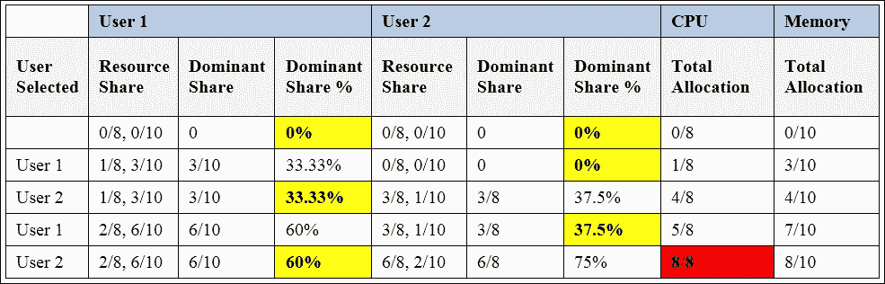
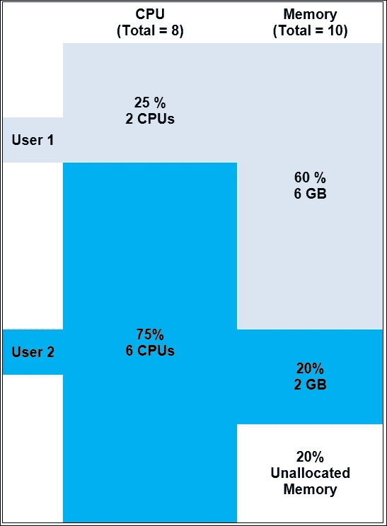
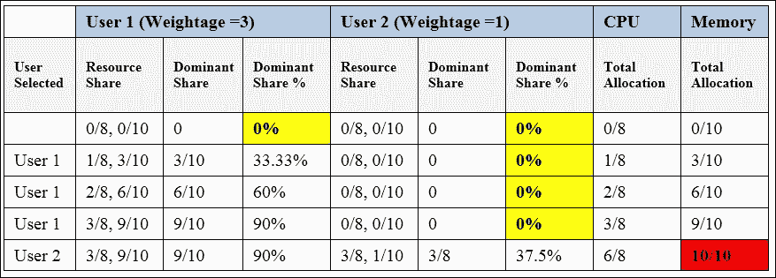
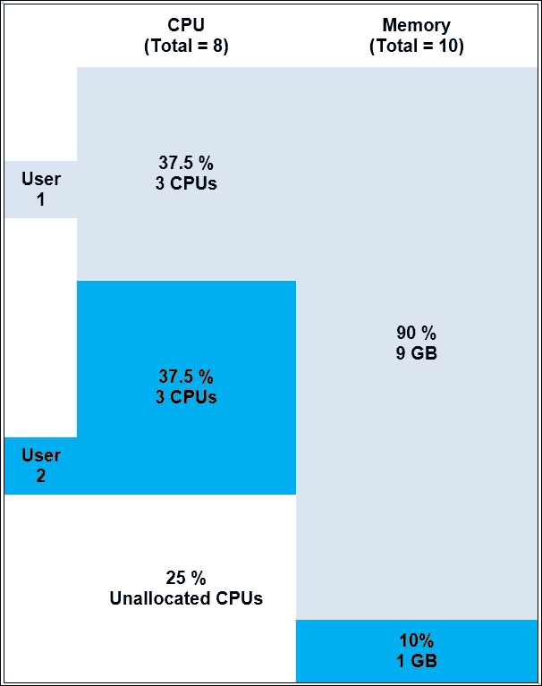
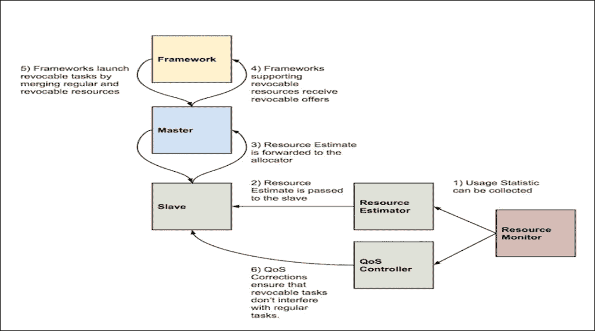

# 第二章. Mesos 内部机制

本章提供了 Mesos 特性概述，并引导读者了解有关高可用性、容错性、扩展性和效率等多个重要主题。本章将涵盖以下主题：

+   **扩展性和效率**

    +   资源分配（主导资源公平算法）

    +   预留（静态和动态）

    +   超额订阅

    +   可扩展性

+   **高可用性和容错性**

    +   从属恢复

    +   对账

    +   持久化卷

# 扩展性与效率

Mesos 旨在提供一种高度可扩展且高效的机制，使各种框架能够有效共享集群资源。分布式应用种类繁多，可能在不同上下文中有不同的优先级，并且不断发展，这一事实促使 Mesos 的设计理念朝着提供可定制的资源分配策略发展，用户可以根据自己的需求定义和设置这些策略。

## 资源分配

Mesos 资源分配模块包含 Mesos 主节点用来确定每个框架所需资源数量和类型的策略。组织可以根据自己的需求定制该策略，例如公平共享、优先级等，从而实现精细化的资源共享。可以开发自定义的分配模块，以满足特定需求。

资源分配模块负责确保资源在竞争框架之间公平地共享。选择用来确定共享策略的算法对于集群管理器的效率有着重要影响。

最大最小公平性（max-min fairness）是最受欢迎的分配算法之一，在同质环境中表现良好；这是指不同竞争用户之间的资源需求在较大程度上是成比例的，比如 Hadoop 集群。然而，在异构资源需求的框架之间调度资源则构成了更为复杂的挑战。如果用户 A 运行的任务每个需要两个 CPU 和 8 GB RAM，而用户 B 运行的任务每个需要四个 CPU 和 2 GB RAM，该采用什么样的公平分配策略？显然，用户 A 的任务内存需求较大，而用户 B 的任务 CPU 需求较大。那么，如何在这两者之间分配一组组合的 RAM + CPU 资源呢？

后者场景是 Mesos 经常遇到的常见问题，因为 Mesos 主要设计用于管理异构环境中的资源。为了解决这个问题，Mesos 采用了 **Dominant Resource Fairness 算法** (**DRF**) 作为其默认资源分配策略，这对于异构环境更为合适。该算法在以下章节中有详细描述。

## 主导资源公平算法（DRF）

数据中心中的作业调度不仅限于 CPU，还扩展到其他资源，如内存和磁盘。在资源需求变化的场景中，有些任务是 CPU 密集型的，而有些任务是内存或磁盘密集型的；这正是最小-最大公平算法不足之处。这里需要一个资源调度机制，能够为异构环境中的每个用户提供其最需要的公平资源。简单来说，DRF 是**最大-最小公平算法**的一个变体，用于在用户之间公平地分配异构资源。

让我们考虑以下示例，来理解算法是如何工作的。

我们假设资源是按照需求向量的倍数提供的，并且是可分割的。

假设可用的总资源是八个 CPU 和 10 GB 内存。用户 1 运行的任务需要一个 CPU 和 3 GB 内存，用户 2 运行的任务需要三个 CPU 和 1 GB 内存。在我们继续分析 DRF 算法如何分配任务之前，先来理解主导资源和份额的概念：

+   **主导资源**：指的是用户最需要的资源（CPU 或内存）。在此案例中，用户 1 运行对内存有较高需求的任务（每个任务 3 GB 内存），因此用户 1 的主导资源是内存。另一方面，用户 2 运行计算密集型任务（每个任务使用三个 CPU），因此其主导资源是 CPU。

+   **主导份额**：指的是用户被分配的主导资源的比例。以我们的例子为例，用户 1 的主导份额是 30%（3/10），而用户 2 的主导份额是 37.5%（3/8）。

DRF 分配模块跟踪每个用户的主导份额，并记录分配给每个用户的资源。DRF 从向所有竞争用户中主导份额最低的用户提供资源（CPU 或内存）开始分配。然后，用户可以选择接受该提议，前提是它满足其需求。

现在，让我们来看一下 DRF 算法为用户 1 和用户 2 分配资源的每个步骤。为了简单起见，我们将忽略在小任务完成后释放回资源池的资源，并假设每次资源提供都被接受，且用户运行的是资源需求无限的任务。每个用户 1 的任务将消耗总 CPU 的八分之一和总内存的三分之一，从而使**内存**成为用户 1 的主导资源。每个用户 2 的任务将消耗总 CPU 的三分之一和总内存的十分之一，从而使**CPU**成为用户 2 的主导资源。



每一行提供以下信息：

+   **用户选择**：由算法提供资源的用户。

+   **资源份额**：在分配轮次中，分配给用户的每种资源类型的总可用资源的比例。

+   **主导份额**：主导资源的资源份额

+   **主导份额百分比**：主导份额以百分比（%）表示

+   **CPU 总分配**：在当前资源分配轮次中，分配给所有用户的 CPU 资源总和

+   **内存总分配**：在当前资源分配轮次中，分配给所有用户的内存资源总和

### 注意

注意：每一行中最低的主导份额用黄色突出显示。

首先，两个用户的主导份额都是 0%（因为还没有分配任何资源）。我们假设 DRF 选择用户 1 来首先提供资源，尽管如果我们假设选择用户 2，最终结果也会相同。以下是它将遵循的步骤：

1.  用户 1 将获得运行任务所需的资源集。其主导资源（内存）的主导份额将增加到 30%。

1.  用户 2 的主导份额为 0%，因此它将在下一轮获得资源。其主导资源（CPU）的主导份额将增加到 37.5%。

1.  由于用户 1 现在的主导份额较低（30%），它将获得下一组资源。其主导份额上升至 60%。

1.  现在，主导份额较低（37.5%）的用户 2 将获得资源。

1.  该过程将继续，直到没有更多的资源可分配以运行用户任务为止。在这种情况下，步骤 4 之后，CPU 资源将达到饱和（以红色突出显示）。

1.  如果有任何资源被释放或资源需求发生变化，过程将继续。

首要目标，DRF 是旨在最大化所有用户之间的最低主导份额。正如在这个例子中，DRF 与用户一起工作以分配以下资源：

+   为用户 1 分配两个任务，总分配为两个 CPU，6 GB 内存，主导份额为 60%（内存）。

+   为用户 2 分配两个任务，总分配为六个 CPU，2 GB 内存，主导份额为 75%（CPU）。

这可以通过以下图示表示：



## 加权 DRF

目前我们假设用户有相等的机会获得资源。算法中也可能进行修改，使得某个用户或一组用户在资源分配上优先于其他用户。这被称为加权 DRF，其中资源不会在用户之间平等共享。共享可以按每个用户和每个资源的权重进行，前者更为常见。

让我们考虑之前示例的每个用户加权计算。对于每个用户 *i* 和每个资源 *j*，权重表示为 w[1,j] = 3 和 w[2,j] = 1。这意味着用户 1 相比用户 2 在系统中将占有三倍的资源份额。如果两个权重值均为 1，则按照正常的 DRF 算法进行分配（如前所述）。

现在，我们来看 DRF 算法为用户 1 和用户 2 分配资源的每个步骤。



一开始，两个用户的主导份额都是 0%（因为尚未分配资源）。我们假设加权 DRF 首先选择给用户 1 分配资源，虽然如果我们假设是用户 2，最终结果也是一样的。以下是它将遵循的步骤：

1.  用户 1 将收到运行任务所需的资源集。其主导资源（内存）的主导份额将增加至 10%（30%除以 3）。

1.  用户 2 的主导份额为 0%，它将在下一轮接收资源。其主导资源（CPU）的主导份额将增加至 37.5%。

1.  由于用户 1 现在拥有较低的主导份额（10%），它将接收下一批资源。其主导份额将上升到 20%（60%除以 3）。

1.  用户 1 仍然拥有较低的主导份额（20%），现在再次分配资源，将其提升至 30%（90%除以 3）。

1.  进程将继续，直到没有更多的资源可以分配给用户任务。在这种情况下，第四步后，内存资源将达到饱和（红色高亮显示）。

1.  如果有资源被释放或资源需求发生变化，进程将继续。

加权 DRF 旨在根据每个用户分配的权重优先进行资源共享。在本例中，加权 DRF 与用户一起工作，分配了以下资源：

+   三个任务分配给用户 1，总共分配了三个 CPU 和 9GB 内存。

+   仅有一个任务分配给用户 2，总共分配了三个 CPU 和 1GB 内存。

这可以通过图示方式表示如下：



除此之外，还可以创建定制模块，以满足某个组织或特定资源分配的需求。这个部分将在同一章节后续进行讲解。

现在让我们看看 DRF 遵循/满足的一些重要属性：

1.  **渐进填充**：在 DRF 中，通过渐进填充分配的资源会以相同的速度增加所有用户的主导份额，而其他用户的资源分配会根据需求按比例增加。这一过程会持续到至少有一个资源被饱和为止，此时需要饱和资源的用户的分配将被停止，这些用户会被淘汰。其他用户的渐进填充将以递归方式继续，直到没有用户的主导份额可以再增加为止。

1.  **份额保障**：DRF 算法通过“渐进填充”向用户分配资源，确保每个用户的主导份额分配以相同的速度增加，并持续到一个资源被饱和并且资源分配被冻结为止。这间接保证了所有用户都被平等对待，并且至少能保证每个用户 1/n 的某项资源。

1.  **策略无关性**：DRF 的这个特性确保了任何时刻，用户都无法通过伪造资源需求来从增加的资源分配中获益。如果用户确实尝试通过要求额外资源来*欺骗*系统，DRF 算法会以一种方式分配资源，使得这种行为对用户产生威慑作用。

1.  **帕累托效率**：DRF 的这个特性意味着增加某个用户的主导份额会相应地减少其他用户对该特定资源的主导份额。得益于逐步填充算法，给一个特定用户分配更多资源会对其他用户造成影响，这一点是自然而然的。

1.  **无嫉妒性**：DRF 是无嫉妒的，因为没有用户会偏好或嫉妒其他用户的资源分配。只有当例如用户 1 嫉妒用户 2，后者在某个特定资源上的主导份额更高时，才会产生嫉妒的情况。然而，考虑到资源分配是通过逐步填充进行的，到资源饱和时，用户 1 和用户 2 的主导份额将是相同的。这种*嫉妒*既没有好处，也不是必需的。

## 配置 Mesos 上的资源提供

常见的问题是，有时由于 slave 上资源配置设置不当，框架不会接受任何资源提供。例如，Elasticsearch 框架需要端口`9200`和`9300`，但 Mesos slave 的默认端口范围配置为`31000`到`32000`。

slave 必须正确配置，以便将正确的资源提供给框架，框架随后可以接受这些资源。可以按以下方式完成：

1.  在`mesos-slave`命令中，添加必要的资源参数。以下是一个示例：

    ```
    --resources='ports:[9200-9200,9300-9300]' ...

    ```

1.  在`/etc/mesos-slave`目录下创建一个名为`resources`的*文件*，其内容是必要的资源字符串。运行以下命令：

    ```
    $ cat /etc/mesos-slave/resources
    ports:[9200-9200,9300-9300]
    $

    ```

# 预留

Mesos 还提供在指定的 slave 上预留资源的功能。这在确保重要服务从特定 slave 获取保证资源提供时特别有用（例如，数据库可能只需要从包含必要数据的特定 slave 获取资源提供）。如果没有预留机制，可能会出现重要服务或任务需要等待很长时间才能获得符合其过滤标准的资源提供，从而对性能产生不利影响。

另一方面，错误使用预留功能可能会导致相同类型的问题，例如 Mesos 最初旨在解决的资源利用率不足问题。因此，必须谨慎使用此功能。Mesos 访问控制机制确保请求预留资源的框架拥有适当的授权。

Mesos 提供两种资源预留方法：

1.  静态预留

1.  动态预留

## 静态预留

在这种类型的预留中，可以为特定框架或框架组在特定的从节点上保留指定的资源。为了为一个框架保留资源，必须将其分配给一个角色。如果需要，可以将多个框架分配给同一个角色。只有分配给特定角色（例如，角色 X）的框架才有权获得为角色 X 预留的资源的资源提供。首先需要定义角色，然后将框架分配给所需的角色，最后为这些角色设置资源策略。

### 角色定义

可以通过使用以下标志启动主节点来定义角色：

```
--roles = "name1, name2, name3"

```

例如，如果我们想定义一个名为`hdfs`的角色，那么我们可以使用以下命令启动主节点：

```
--roles = "hdfs"

```

另外，你也可以通过执行以下命令来做到这一点：

```
echo hdfs > /etc/mesos-master/role

```

现在，需要通过执行以下命令重启主节点：

```
sudo service mesos-master restart

```

### 框架分配

现在，我们需要将框架映射到特定的角色。执行此操作的方法因框架而异。例如，像 Marathon 这样的框架可以通过`–mesos_role`标志进行配置。在 HDFS 的情况下，可以通过将`mesos-site.xml`中的`mesos.hdfs.role`更改为之前定义的`hdfs`值来实现。

```
<property>
  <name>mesos.hdfs.role</name>
  <value>hdfs</value>
  </property>
```

可以通过在`FrameworkInfo`中设置`role`选项为所需的值来为框架指定自定义角色（默认值是`*`）。

## 角色资源策略设置

可以通过利用从节点的`–resources`标志为特定角色保留每个从节点上的资源。由于随着集群规模和运行的框架数量的增加，管理开销会迅速变得令人难以承受，从节点级别的资源策略设置有其缺点。

如果我们在特定从节点上有八个核心和 24 GB（在 Mesos 中以 MB 为单位指定）RAM 可用，并希望为`hdfs`角色保留 2 个核心和 6 GB RAM，那么我们可以在从节点上进行以下更改：

```
--resources="cpus:6;mem:18432;cpus(hdfs):2;mem(hdfs):6144"

```

完成此操作后，可以通过执行以下命令停止具有这些更改设置的`mesos-slave`：

```
sudo service mesos-slave stop

```

可以通过以下命令移除这些从节点上的旧状态。任何正在运行的任务可以手动终止，因为任务状态也将被移除：

```
rm -f /tmp/mesos/meta/slaves/latest

```

现在，可以通过以下命令重启从节点：

```
sudo service mesos-slave start

```

## 动态预留

静态资源预留的主要缺点是，在停机期间，预留的资源不能被其他角色使用，也不能取消预留并作为更广泛资源池的一部分进行使用。这导致了资源利用率低下。为了解决这个问题，在 0.23.0 版本中加入了动态资源预留支持，这使得用户能够根据工作负载要求更动态地预留和取消预留资源。

对于资源提供，框架可以通过`acceptOffers` API 发送以下两条消息作为响应：

+   `Offer::Operation::Reserve`

+   `Offer::Operation::Unreserve`

这些将在以下章节中详细描述。请注意，框架的主体用于授权，具体内容将在第六章中详细讨论，*Mesos 框架*。

### Offer::Operation::Reserve

每个框架可以作为报价周期的一部分预留资源。例如，假设一个资源报价中包含八个核心和 12 GB 的 RAM，且这些资源未被预留，框架收到了这个报价。请查看以下代码：

```
{
  "id": <offer_id>,
  "framework_id": <framework_id>,
  "slave_id": <slave_id>,
  "hostname": <hostname>,
  "resources": [
    {
      "name": "cpus",
      "type": "SCALAR",
      "scalar": { "value": 8 },
      "role": "*",
    },
    {
      "name": "mem",
      "type": "SCALAR",
      "scalar": { "value": 12288 },
      "role": "*",
    }
  ]
}
```

我们可以通过在以下消息中指定需要预留的每种资源类型的数量以及框架的角色和主体，来为框架预留四个核心和 6 GB 的 RAM：

```
{
  "type": Offer::Operation::RESERVE,
  "reserve": {
    "resources": [
      {
        "name": "cpus",
        "type": "SCALAR",
        "scalar": { "value": 4 },
        "role": <framework_role>,
        "reservation": {
          "principal": <framework_principal>
        }
      },
      {
        "name": "mem",
        "type": "SCALAR",
        "scalar": { "value": 6144 },
        "role": <framework_role>,
        "reservation": {
          "principal": <framework_principal>
        }
      }
    ]
  }
}
```

下一次资源报价将包括前述的预留资源，如下所示：

```
{
  "id": <offer_id>,
  "framework_id": <framework_id>,
  "slave_id": <slave_id>,
  "hostname": <hostname>,
  "resources": [
    {
      "name": "cpus",
      "type": "SCALAR",
      "scalar": { "value": 4 },
      "role": <framework_role>,
      "reservation": {
        "principal": <framework_principal>
      }
    },
    {
      "name": "mem",
      "type": "SCALAR",
      "scalar": { "value": 6144 },
      "role": <framework_role>,
      "reservation": {
        "principal": <framework_principal>
      }
    },
  ]
}
```

### Offer::Operation::Unreserve

每个框架还可以作为报价周期的一部分取消预留资源。在之前的示例中，我们为框架/角色预留了四个核心和 6 GB 的 RAM，直到明确取消预留之前，这些资源会一直提供。这里解释了取消预留的方法。

首先，我们将收到预留资源的报价，如下所示：

```
{
  "id": <offer_id>,
  "framework_id": <framework_id>,
  "slave_id": <slave_id>,
  "hostname": <hostname>,
  "resources": [
    {
      "name": "cpus",
      "type": "SCALAR",
      "scalar": { "value": 4 },
      "role": <framework_role>,
      "reservation": {
        "principal": <framework_principal>
      }
    },
    {
      "name": "mem",
      "type": "SCALAR",
      "scalar": { "value": 6144 },
      "role": <framework_role>,
      "reservation": {
        "principal": <framework_principal>
      }
    },
  ]
}
```

我们现在可以通过在以下消息中指定需要取消预留的每种资源类型的数量以及框架的角色和主体，来为框架取消预留四个核心和 6 GB 的 RAM：

```
{
  "type": Offer::Operation::UNRESERVE,
  "unreserve": {
    "resources": [
      {
        "name": "cpus",
        "type": "SCALAR",
        "scalar": { "value": 4 },
        "role": <framework_role>,
        "reservation": {
          "principal": <framework_principal>
        }
      },
      {
        "name": "mem",
        "type": "SCALAR",
        "scalar": { "value": 6144 },
        "role": <framework_role>,
        "reservation": {
          "principal": <framework_principal>
        }
      }
    ]
  }
}
```

在随后的资源报价中，这些取消预留的资源将成为更广泛的未预留资源池的一部分，并开始被提供给其他框架。

`/reserve` 和 `/unreserve` HTTP 端点也在 v0.25.0 中引入，可以用于从主节点进行动态资源预留管理。

#### /reserve

假设我们有兴趣为位于从节点 `<slave_id>` 上的某个角色预留四个核心和 6 GB 的 RAM。可以向 `/reserve` HTTP 端点发送 `HTTP POST` 请求，如下所示：

```
$ curl -i \
  -u <operator_principal>:<password> \
  -d slaveId=<slave_id> \
  -d resources='[ \
    { \
      "name": "cpus", \
      "type": "SCALAR", \
      "scalar": { "value": 4 }, \
      "role": <framework_role>, \
      "reservation": { \
        "principal": <operator_principal> \
      } \
    }, \
    { \
      "name": "mem", \
      "type": "SCALAR", \
      "scalar": { "value": 6144 }, \
      "role": <framework_role>,\
      "reservation": { \
        "principal": <operator_principal> \
      } \
    } \
  ]' \
  -X POST http://<ip>:<port>/master/reserve
```

响应可以是以下之一：

+   `200 OK`：成功

+   `400 BadRequest`：无效的参数（例如，缺少参数）

+   `401 Unauthorized`：未经授权的请求

+   `409 Conflict`：资源不足，无法满足预留操作

#### /unreserve

现在，如果我们有兴趣取消之前预留的资源，可以向 `/unreserve` HTTP 端点发送 `HTTP POST` 请求，如下所示：

```
$ curl -i \
  -u <operator_principal>:<password> \
  -d slaveId=<slave_id> \
  -d resources='[ \
    { \
      "name": "cpus", \
      "type": "SCALAR", \
      "scalar": { "value": 4 }, \
      "role": <framework_role>, \
      "reservation": { \
        "principal": <operator_principal> \
      } \
    }, \
    { \
      "name": "mem", \
      "type": "SCALAR", \
      "scalar": { "value": 6144 }, \
      "role": <framework_role>\
      "reservation": { \
        "principal": <operator_principal> \
      } \
    } \
  ]' \
  -X POST http://<ip>:<port>/master/unreserve
```

响应可以是以下之一：

+   `200 OK`：成功

+   `400 BadRequest`：无效的参数（例如，缺少参数）

+   `401 Unauthorized`：未经授权的请求

+   `409 Conflict`：资源不足，无法满足取消预留操作

## 资源过度分配

通常，用户会为框架提供足够的缓冲资源，以应对突发的工作负载激增。这导致整个集群的资源总体利用率较低，因为相当一部分资源处于空闲状态。将这种情况加到多个框架中，就会导致显著的资源浪费。v0.23.0 引入的超额订阅概念旨在通过在这些空闲资源上执行低优先级任务（例如后台进程或临时的非关键分析）来解决这个问题。

为了启用此功能，引入了两个额外的组件：

1.  **资源估算器**：用于确定可供最佳努力进程使用的空闲资源数量。

1.  **服务质量（QoS）控制器**：用于在观察到工作负载激增或原始任务性能下降时终止这些最佳努力任务。

虽然提供了基本的默认估算器和控制器，但 Mesos 允许用户创建自定义的估算器和控制器。

此外，现有的资源分配器、资源监控器和 Mesos 工作节点也通过新标志和选项进行了扩展。下图说明了超额订阅概念的工作原理（来源：[`mesos.apache.org/documentation/latest/oversubscription/`](http://mesos.apache.org/documentation/latest/oversubscription/)）：



### 可撤销资源报价

以下步骤按顺序执行：

1.  主要步骤包括收集使用统计数据并估算超额订阅的资源数量，这些资源可供低优先级任务使用。资源监控器通过传递 `ResourceStatistics` 消息将这些统计数据发送给被称为资源估算器的模块。

1.  估算器通过利用计算缓冲区量的算法来识别资源的超额订阅情况。Mesos 提供了基于用户指定逻辑开发自定义资源估算器的能力。

1.  每个工作节点都会轮询资源估算器以获取最新的估算数据。

1.  然后，工作节点会定期（每当估算值发生变化时）将此信息传输给主节点的分配器模块。

1.  分配器将这些超额订阅的资源标记为“可撤销”资源，并单独监控这些资源。

1.  在 `FrameworkInfo` 方法中注册了 `REVOCABLE_RESOURCES` 的框架会接收到这些可撤销资源的报价，并可以使用 `launchTasks()` API 在这些资源上调度任务。请注意，这些资源不能动态保留。

#### 注册可撤销资源能力

运行以下代码：

```
FrameworkInfo framework;
framework.set_name("Revocable framework");

framework.add_capabilities()->set_type(
  FrameworkInfo::Capability::REVOCABLE_RESOURCES);
```

#### 一个包含可撤销和标准资源的示例报价

请看下面的代码：

```
{
  "id": <offer_id>,
  "framework_id": <framework_id>,
  "slave_id": <slave_id>,
  "hostname": <hostname>,
  "resources": [
    {
      "name": "cpus",
      "type": "SCALAR",
      "scalar": {
        "value": 4
      },
      "role": "*"
    }, {
      "name": "mem",
      "type": "SCALAR",
      "scalar": {
        "value": 6144
      },
      "role": "*"
    },
    {
      "name": "cpus",
      "type": "SCALAR",
      "scalar": {
        "value": 1
      },
      "role": "*",
      "revocable": {}
    }
  ]
}
```

+   当收到 `runTask` 请求时，任务将在工作节点上启动。即使是包含单个可撤销资源的容器也可以被 QoS 控制器终止，因为它被视为可撤销容器。

+   原始任务也会持续监控，如果观察到性能下降或工作负载激增，任何可撤销的资源将被归还给它。这被称为干扰检测。

目前，Mesos 资源估算器相当基础，提供两种默认估算器，分别是**固定**和**noop**资源估算器。在第一个估算器中，一组固定资源可以标记为过度订阅，而后者在 slave 节点被查询时提供空估算值，实际上意味着没有可用资源用于过度订阅。

正在积极研究引入复杂和动态的过度订阅资源估算模型（例如 Mesosphere 和 Intel 的一个模块，称为**Project Serenity**），旨在最大化资源利用率，同时确保不会影响服务质量。

### 资源估算器

运行以下代码：

```
class ResourceEstimator 
{ 
public: 
  virtual Try initialize(const lambda::function<process::Future()>& usage) = 0; 
  virtual process::Future oversubscribable() = 0;
};
```

### QoS 控制器

执行以下代码：

```
class QoSController 
{ 
public: 
  virtual Try initialize(const lambda::function<process::Future()>& usage) = 0; 
  virtual process::Future<std::list> corrections() = 0;
};
```

### 配置过度订阅

现在，slave 节点有四个新的与过度订阅相关的标志可用，如下表所示：

| 标志 | 说明 |
| --- | --- |
| `--oversubscribed_resources_interval=VALUE` | slave 节点定期将过度订阅的资源估算值发送给 master。可以通过此标志指定这些更新的间隔（默认：15 秒） |
| `--qos_controller=VALUE` | 这是需要使用的 QoS 控制器名称 |
| `--qos_correction_interval_min=VALUE` | slave 节点会轮询并执行 QoS 修正，由 slave 从控制器根据原始任务的性能下降/恶化水平执行。这一标志控制这些修正的间隔（默认：0 纳秒） |
| `--resource_estimator=VALUE` | 这是用于确定过度订阅资源的资源估算器名称 |

## 可扩展性

不同的组织有不同的需求。此外，在同一个组织内部，不同的用户以不同的方式运行集群，具有不同的规模和延迟要求。用户需要处理特定应用程序的行为，确保符合行业特定的安全合规性等等。这一切意味着，如果 Mesos 要实现作为整个数据中心操作系统服务于所有组织的目标，它需要具备极强的可定制性和可扩展性。它需要一个功能，能够保持 Mesos 核心小巧而轻量，同时又足够强大，以允许根据需要进行尽可能多的定制/扩展。

许多软件系统，如浏览器，支持库以：

+   扩展功能支持

+   抽象复杂性

+   使开发配置驱动

# Mesos 模块

Mesos 模块在 v0.21.0 中引入，基于这一概念，允许用户通过库扩展 Mesos 的功能，这些库可以创建并共享，而无需不断重新编译。在 Mesos 的上下文中，模块是一个完整的组件，任何用户都可以添加或替换。所有外部依赖项都被视为单独的库，可以按需加载。现在，所有用户都可以在 Mesos 之上开发他们的实验功能，而无需了解所有详细的内部工作或影响其他用户。可以实现自定义分配逻辑、自定义超额资源估算算法等各种用例特定的定制功能。不同的子系统，如负载均衡器、隔离机制和服务发现机制，也可以以模块化的方式配置。

## 模块调用

`--modules` CLI 标志可用于主从节点，提供需要使用的模块列表。

模块列表可以通过带有 JSON 格式字符串的文件来提供，使用`--modules=filepath`。`filepath`可以是`/path/to/file`或`file:///path/to/file`类型。

若要内联提供模块列表，请使用`--modules="{...}"`。

有两个参数，`name`和`file`；每个库必须提供其中之一。`file`参数可以是绝对路径（例如，`/User/mesos/lib/example.so`）、文件名（例如，`example.so`）或相对路径（例如，`lib/example.so`）。`name`参数是库的名称（例如，`example`）。如果提供了该参数，Mesos 会自动将其扩展为适合当前操作系统的库名称（例如，Linux 上将`example`扩展为`example.so`，在 OS X 上扩展为`example.dylib`）。如果同时提供了两个参数，则忽略`name`参数。

下面给出了一个 JSON 字符串示例：

1.  通过以下方式加载库`example.so`，包括两个模块`org_apache_mesos_X`和`org_apache_mesos_Y`：

    ```
    {
      "libraries": [
        {
          "file": "/path/to/example.so",
          "modules": [
            {
              "name": "org_apache_mesos_X",
            },
            {
              "name": "org_apache_mesos_Y"
            }
          ]
        }
      ]
    }
    ```

    从库示例中，加载`org_apache_mesos_X`模块并传递参数 A，值为 B（加载另一个模块`org_apache_mesos_Y`，没有任何参数）通过以下代码：

    ```
    {
      "libraries": [
        {
          "name": "example",
          "modules": [
            {
              "name": "org_apache_mesos_X"
              "parameters": [
                {
                  "key": "A",
                  "value": "B",
                }
              ]
            },
            {
              "name": "org_apache_mesos_Y"
            }
          ]
        }
      ]
    }
    ```

1.  要内联指定模块，请使用以下代码：

    ```
    --modules='{"libraries":[{"file":"/path/to/example.so", "modules":[{"name":"org_apache_mesos_X"}]}]}'

    ```

这里提供了一个`Hello World`模块实现示例：[`mesos.apache.org/documentation/latest/modules/`](http://mesos.apache.org/documentation/latest/modules/)。

### 构建模块

以下命令假设 Mesos 已安装在标准位置——即，Mesos 动态库和头文件是可用的：

```
g++ -lmesos -fpic -o test_module.o test_module.cpp
$ gcc -shared -o libtest_module.so test_module.o

```

## 钩子

Mesos 提供了另一种扩展其功能的方式，这种方式无需从零开始创建整个组件，称为**钩子**。钩子不会干扰请求的处理；相反，它们允许用户在 Mesos 生命周期中添加功能。一些钩子可以在对象移动过程中更改其内容，这些被称为**装饰器**。

## 当前支持的模块

以下是目前在 Mesos 上支持的模块：

+   **分配器**：在后续章节中将对此进行更详细的描述。

+   **认证器**：该模块允许用户创建和集成新的自定义认证方法。

+   **隔离器**：通过此接口，用户可以开发定制的隔离器，解决各种用例问题，例如网络隔离（例如，Project Calico）。

+   **QoS 控制器**：通过此模块，可以实现用于撤销在超额订阅资源上启动的最佳努力任务的复杂逻辑。

+   **资源估算器**：该模块允许第三方开发者尝试自己的可撤销资源估算算法，以最大化集群利用率。像 Project Serenity 这样的努力正在利用此模块，尝试提出一个生产级的动态资源估算逻辑。

### 分配器模块

Mesos 资源分配模块包含 Mesos 主节点用来确定需要向每个框架提供哪种类型和数量的资源报价的策略。组织可以定制此模块以实现自己的分配策略——例如，公平共享、优先级等——从而实现精细化的资源共享。可以开发自定义分配模块来应对特定的需求。例如，超额订阅模块允许提供可撤销资源，这是默认的 DRF 分配器不支持的功能。

以下步骤是将自定义分配模块加载到主节点所需的：

+   在 `--modules` 配置中列出它

+   使用 `--allocator` 标志选择它

例如，要运行一个名为 `ExternalAllocatorModule` 的自定义分配器，可以运行以下命令：

```
./bin/mesos-master.sh --work_dir=m/work --modules="file://<modules-including-allocator>.json" --allocator=ExternalAllocatorModule
```

现在，我们将看看如何实现一个自定义分配器，并将其打包为模块，以便像之前所示那样加载到主节点中。

#### 实现自定义分配器模块

分配器模块是用 C++ 实现的，需要实现 `mesos/master/allocator.hpp` 中定义的接口（方法列在下面的表格中）。它们也可以通过 C++ 代理开发，代理将调用重定向到由其他语言实现的逻辑：

| 方法 | 描述 |
| --- | --- |
| `initialize(flags, offerCallback, roles)` | 分配器初始化 |
| `addFramework(frameworkId, frameworkInfo, usedResources)``removeFramework(frameworkId, frameworkInfo, usedResources)` | 框架添加/移除 |
| `activateFramework(frameworkId)``deactivateFramework(frameworkId)` | 框架启用/停用 |
| `addSlave(slaveId, slaveInfo, totalResources, usedResources)``removeSlave(slaveId, slaveInfo, totalResources, usedResources)` | 从属机添加/移除 |
| `activateSlave(slaveId)``deactivateSlave(slaveId)` | 从属机启用/停用 |
| `requestResources(frameworkId, requests)` | 资源请求回调 |
| `updateAllocation(frameworkId, slaveId, operations)` | 资源分配更新 |
| `recoverResources(frameworkId, slaveId, resources, filters)` | 资源回收回调 |
| `reviveOffers(frameworkId)` | 提供复活回调 |
| `updateWhitelist(whitelist)` | 更新从节点白名单 |

默认的分层 DRF 分配器采用非阻塞的基于演员的实现。通过扩展`src/master/allocator/mesos/allocator.hpp`中定义的`MesosAllocatorProcess`类，可以在自定义分配器中利用此实现。通过使用*排序器*抽象，默认分配器可以进行扩展，从而避免了从头构建一个新的分配器。排序器 API 定义在`src/master/allocator/sorter/sorter.hpp`中，以下表列出了其中的一些方法：

| 方法 | 描述 |
| --- | --- |
| `void add(client, weight=1)``void remove(client)` | 该方法用于将客户端添加/移除分配过程 |
| `void deactivate(client)``void activate(client)` | 这用于激活/停用客户端 |
| `void add(slaveId, resources)``void remove(slaveId, resources)``void update(slaveId, resources)` | 该方法用于添加/移除/更新分配的资源数量 |
| `List<string> sort()` | 该方法返回一个按指定策略排序的客户端列表，指明如何分配资源 |
| `void allocated(client, slaveId, resources)``void update(client, slaveId, oldResources, newResources)``void unallocated(client, slaveId, resources)` | 该方法决定将资源分配/更新/取消分配给指定客户端 |
| `Map<SlaveId, Resources> allocation(client)` | 该方法返回分配给指定客户端的资源 |
| `bool contains(client)` | 如果排序器包含指定的客户端，则返回 true，否则返回 false |
| `int count()` | 该方法返回客户端数量 |

一旦开发完成，自定义分配器需要设置为资源分配时使用的分配器，而不是默认的分配器。这涉及将自定义分配器封装在一个分配器模块中，并将其加载到主节点中。

将自定义分配器（如在`external_allocator.hpp`中实现）封装为一个名为`ExternalAllocatorModule`的模块的过程在此处详细描述：[`mesos.apache.org/documentation/latest/allocation-module/`](http://mesos.apache.org/documentation/latest/allocation-module/)。

# 高可用性与容错性

高可用性，简单来说，就是通过确保没有单点故障来实现接近 100%的系统正常运行时间。这通常是通过引入冗余机制来实现的，例如备用进程可以在失败后立即接管等。

## 精通高可用性

在 Mesos 中，这是通过使用 Apache ZooKeeper（一种集中式协调服务）来实现的。设置多个主节点（一个活跃的领导者和其他备份节点），ZooKeeper 负责协调领导者选举，并通过其他 Mesos 组件，如从节点和框架，来处理主节点的检测。

为了维持高可用性设置，至少需要三个主节点以保证法定人数。然而，对于生产系统，建议至少使用五个主节点。领导者选举过程的详细描述请参见[`zookeeper.apache.org/doc/trunk/recipes.html#sc_leaderElection`](http://zookeeper.apache.org/doc/trunk/recipes.html#sc_leaderElection)。

失败的主节点状态可以通过利用存储在从节点和框架调度器中的信息，在下一个被选举的主节点上重建。在新主节点选举后，其他组件会通过 ZooKeeper 被通知此变动，使它们能够注册到新主节点并向其传递状态更新信息。根据这些数据，新的主节点能够重建失败的主节点状态。

## 框架调度器容错

这是通过将每个框架的多个调度器注册到当前主节点来实现的。如果调度器发生故障，主节点会要求次级调度器接管。然而，每个框架的多个调度器之间的状态共享实现需要由各自的框架来处理。

## 从节点容错

Mesos 提供了一种从节点恢复机制用于容错，这将在后续章节中详细讨论。主节点会监控所有从节点的状态。如果某个从节点没有响应主节点发送的心跳，即使经过多次通信尝试，主节点也会移除该从节点并尝试终止它。

## 执行器/任务

在任务或执行器失败的情况下，主节点会通知启动该任务的相应框架调度器。根据调度器逻辑中指定的策略，调度器将处理失败任务的执行，通常通过在满足资源要求的新的从节点上重新启动该任务。

## 从节点恢复

从 v0.14.0 版本开始引入了“从节点恢复”容错机制，通过该机制，即使从节点进程宕机，任务也能继续运行，并且在从节点重新启动后，可以重新与正在运行的任务建立连接。无论是计划中的升级还是突发的崩溃，都可能导致从节点进程宕机并需要重启。

为了实现这一点，从节点将当前正在执行的任务信息保存到本地磁盘（也称为**检查点**）。它们写入的数据包括任务、执行器和状态信息。要启用此功能，从节点及其所在的框架需要进行适当配置。如果启用检查点功能，那么从节点在故障事件发生后重新启动并能够从最近的检查点恢复数据，重新与执行器建立连接，并继续执行任务。当从节点宕机时，主节点和执行器会等待它重新启动并重新连接。由于检查点涉及多次写入本地磁盘，需要在高可用性和这些频繁写入带来的延迟开销之间做出权衡。

此外，执行器驱动程序也进行了改进，使其在面临故障事件时更加健壮和容错。例如，在从节点宕机期间，驱动程序会缓存执行器传递给它的更新，并在从节点重新与执行器建立连接后重新发送这些更新。这确保了执行器能够继续运行任务并传输消息，同时不必担心从节点进程。

检查点机制通过确保任务更新消息能够传递给框架，即使发生故障，也能提高系统的可靠性。例如，如果一个从节点和主节点同时发生故障，框架将无法收到所需的`TASK_LOST`状态更新消息。通过检查点机制，从节点现在可以从最后的检查点状态恢复任务信息，并在重新连接后向框架发送所需的消息。

从节点的可恢复性非常重要，原因包括确保有状态进程或长期运行的任务能够从最后记录的状态重新启动，进行无缝的集群升级，以及减少维护和管理的开销。

### 启用从节点检查点功能

可以通过以下方式启用从节点检查点功能。

### 注意

注意，自 v0.22.0 版本起，所有从节点的检查点功能默认启用。

相关的标志如下：

+   `checkpoint`：此选项允许用户指定从节点是否需要执行检查点以支持恢复[默认值为`true`]。

    +   重启后的从节点可以恢复更新并重新建立与执行器的连接（`--recover`=`reconnect`）或终止连接（`--recover`=`cleanup`）。

    ### 注意

    注意，从 v0.22.0 版本开始，该标志将被移除，并默认启用所有从节点的检查点功能。

+   `strict`：此选项决定是否在严格模式下执行恢复[默认值为`true`]。

    +   如果`strict`=`true`，则所有与恢复相关的错误都将被视为致命错误。

    +   如果`strict`=`false`，则在恢复过程中出现任何错误（如数据损坏等）时，状态恢复会尽力进行。

+   `recover`：这决定了从节点是否应重新连接旧的执行器或终止它们[默认值为`reconnect`]。

    +   如果`recover`=`reconnect`，从节点可以重新建立与活动执行器的连接。

    +   如果`recover`=`cleanup`，从节点将终止旧的执行器。此选项通常用于进行不兼容的升级。

    ### 注意

    请注意，如果没有检查点信息，则不会执行恢复操作。重启时，从节点会作为新节点注册到主节点。

+   `recovery_timeout`：这是从节点必须在其中恢复的时间[默认为`15 分钟`]。

    +   如果从节点在指定的`recovery_timeout`时间内未能恢复，主节点将关闭该从节点，从而导致所有执行器也被终止。

    ### 注意

    请注意，只有在启用`--checkpoint`时，这种机制才适用和可用。

### 启用框架检查点

框架可以通过在注册前将`FrameworkInfo`中包含的可选检查点字段的值设置为 true（`FrameworkInfo.checkpoint`=`True`）来启用检查点。如果启用了此选项，则只有来自检查点从节点的 offers 才会被该框架接收。

# 对账

Mesos 实现了一个基于演员模型的消息传递编程模型，以便在不同的 Mesos 组件之间实现非阻塞通信，并利用协议缓冲区来完成这一点。例如，调度器需要告诉执行器使用一定数量的资源，执行器需要向调度器提供有关正在执行任务的状态更新，等等。协议缓冲区提供了灵活的消息传递机制，使得通过定义自定义格式和协议，开发人员可以在不同语言间进行通信。

为此目的，采用了最多一次的消息传递模型，但某些消息（例如状态更新）会采用至少一次的消息传递模型，通过使用确认机制来保证。在发生故障时，主节点和从节点之间的消息可能会丢失，从而导致状态不一致。

例如，在多个场景中，当框架发出启动任务的请求时，任务可能会丢失。主节点在框架发送请求后但在接收请求之前可能会失败，或者它可能在接收到消息后但在将其发送给从节点之前失败。框架可能在表达启动任务的愿望后，但在发送所需消息之前失败，依此类推。为了应对这些情况带来的不一致性，Mesos 需要与框架之间进行对账机制。Mesos 必须确保框架意识到可能发生的失败事件，并了解这些事件何时得到解决。此外，恢复发生后，Mesos 还必须确保所有组件的状态彼此同步并保持一致性。

## 任务对账

框架需要在任务失败后显式地进行对账，因为调度器不会维护与任务相关的信息。Mesos 中提供了两种对账方式：

+   第一个是“显式”对账，其中调度器发送它希望了解状态的任务的详细信息，主节点返回这些任务的状态。

+   第二个是“隐式”对账，其中调度器不指定任务，而是向主节点发送一个空列表，主节点返回所有已知任务的状态。

实现此功能的方法如下：

```
message Reconcile {
  repeated TaskStatus statuses = 1; // Should be non-terminal only.
}
```

主节点仅检查必需的 `TaskID` 字段和可选的 `SlaveID` 字段。

## 资源提供对账

资源提供会自动进行对账。它们不会超出主节点的生命周期，如果发生故障，则不再有效。每次框架重新注册时，资源提供会被重新发放。

有关对账的更多信息，请参见 [`mesos.apache.org/documentation/latest/reconciliation/`](http://mesos.apache.org/documentation/latest/reconciliation/)。

# 持久化卷

从 v0.23.0 版本开始，Mesos 引入了对一种名为 **持久化卷** 的新特性的实验性支持。Mesos 面临的一个关键挑战是为有状态服务（如数据库）提供一个可靠的机制，使其能够在 Mesos 内存储数据，而不是依赖外部文件系统。

例如，如果正在运行一个数据库任务，那么必须将该任务调度到包含其所需数据的从节点上。之前，没有办法保证任务只会从包含所需数据的从节点上获得资源提供。解决此问题的常用方法是使用本地文件系统或外部分布式文件系统。这些方法涉及网络延迟或资源利用率低的问题（因为包含特定数据的节点需要被静态划分并只对需要该数据的框架可用）。

解决此问题的两个新特性是：

+   **动态预留**：除了本章“预留”部分讨论的特性外，动态预留的另一个优点是框架可以预留一个持久化存储，确保当另一个任务需要启动时，它将始终被重新提供给该框架。

+   **持久化卷**：Mesos 现在提供了从磁盘资源创建持久化卷的能力。当启动新任务时，可以创建一个卷，它位于任务的沙盒之外。即使任务完成后，这个卷也会保持持久化，并将再次提供给相同的框架，以便其可以在相同的磁盘资源上启动另一个任务。

请注意，持久化卷只能从静态或动态预留的磁盘资源中生成。如果持久化卷是从动态预留的磁盘资源中创建的，则在不销毁卷的情况下无法取消预留。这提供了一种安全机制，防止敏感数据意外暴露给其他框架。垃圾回收机制用于删除残留数据，正在开发中。

持久化卷创建接口描述如下：

+   框架可以通过`acceptOffers` API 发送两条消息作为提供响应：`Offer::Operation::Create`和`Offer::Operation::Destroy`

+   主控可以通过`/create`和`/destroy HTTP`端点管理持久化卷，这些端点目前处于 Alpha 阶段。

请注意，框架的主体需要进行授权，具体内容将在第六章中进一步讨论，*Mesos 框架*。

## Offer::Operation::Create

卷可以作为常规提供周期的一部分由框架创建。例如，假设接收到如下的 6GB 动态预留磁盘资源提供：

```
{
  "id" : <offer_id>,
  "framework_id" : <framework_id>,
  "slave_id" : <slave_id>,
  "hostname" : <hostname>,
  "resources" : [
    {
      "name" : "disk",
      "type" : "SCALAR",
      "scalar" : { "value" : 6144 },
      "role" : <framework_role>,
      "reservation" : {
        "principal" : <framework_principal>
      }
    }
  ]
}
```

现在可以通过发送以下消息从这些磁盘资源中创建持久化卷。在消息中，需要指定以下内容：

1.  一个唯一的角色特定持久化卷 ID

1.  容器内需要存储卷的相对路径

1.  卷权限

现在可以通过发送以下消息从这些磁盘资源中创建持久化卷：

```
{
  "type" : Offer::Operation::CREATE,
  "create": {
    "volumes" : [
      {
        "name" : "disk",
        "type" : "SCALAR",
        "scalar" : { "value" : 6144 },
        "role" : <framework_role>,
        "reservation" : {
          "principal" : <framework_principal>
        },
        "disk": {
          "persistence": {
            "id" : <persistent_volume_id>
          },
          "volume" : {
            "container_path" : <container_path>,
            "mode" : <mode>
          }
        }
      }
    ]
  }
}
```

下一个资源提供将包含之前创建的持久化卷：

```
{
  "id" : <offer_id>,
  "framework_id" : <framework_id>,
  "slave_id" : <slave_id>,
  "hostname" : <hostname>,
  "resources" : [
    {
      "name" : "disk",
      "type" : "SCALAR",
      "scalar" : { "value" : 6144 },
      "role" : <framework_role>,
      "reservation" : {
        "principal" : <framework_principal>
      },
      "disk": {
        "persistence": {
          "id" : <persistent_volume_id>
        },
        "volume" : {
          "container_path" : <container_path>,
          "mode" : <mode>
        }
      }
    }
  ]
}
```

## Offer::Operation::Destroy

当前，持久化卷需要显式删除。这可以作为常规提供周期的一部分完成。首先，系统将接收到包含持久化卷的资源提供。以之前的示例为例，资源提供将是：

```
{
  "id" : <offer_id>,
  "framework_id" : <framework_id>,
  "slave_id" : <slave_id>,
  "hostname" : <hostname>,
  "resources" : [
    {
      "name" : "disk",
      "type" : "SCALAR",
      "scalar" : { "value" : 2048 },
      "role" : <framework_role>,
      "reservation" : {
        "principal" : <framework_principal>
      },
      "disk": {
        "persistence": {
          "id" : <persistent_volume_id>
        },
        "volume" : {
          "container_path" : <container_path>,
          "mode" : <mode>
        }
      }
    }
  ]
}
```

接下来，持久化卷通过`Offer::Operation::Destroy`消息被销毁，具体如下：

```
{
  "type" : Offer::Operation::DESTROY,
  "destroy" : {
    "volumes" : [
      {
        "name" : "disk",
        "type" : "SCALAR",
        "scalar" : { "value" : 6144 },
        "role" : <framework_role>,
        "reservation" : {
          "principal" : <framework_principal>
        },
        "disk": {
          "persistence": {
            "id" : <persistent_volume_id>
          },
          "volume" : {
            "container_path" : <container_path>,
            "mode" : <mode>
          }
        }
      }
    ]
  }
}
```

请注意，删除持久化卷不会导致磁盘资源被取消预留。因此，以下的资源提供仍会包含它们：

```
{
  "id" : <offer_id>,
  "framework_id" : <framework_id>,
  "slave_id" : <slave_id>,
  "hostname" : <hostname>,
  "resources" : [
    {
      "name" : "disk",
      "type" : "SCALAR",
      "scalar" : { "value" : 6144 },
      "role" : <framework_role>,
      "reservation" : {
        "principal" : <framework_principal>
      }
    }
  ]
}
```

# 概述

在本章中，我们深入探讨了 Mesos 的一些最重要特性，这些特性使它高效、可扩展并具有容错能力。我们详细解释了 Mesos 的资源分配选项和生产级容错能力等高级话题。通过这一强大的背景，读者将在接下来的章节中了解 Mesos 的安装、管理和框架设置等更实际的方面。

在下一章中，我们将讨论如何在公共云服务和私有数据中心中设置一个多节点的 Mesos 集群，并讨论常见问题及其调试和故障排除方法。
