# 第三章：入门 Mesos

本章介绍如何在公共云（AWS、GCE 和 Azure）以及私有数据中心（本地）上手动设置并运行 Mesos 集群，还讨论了各种调试方法，并详细探讨了如何排查 Mesos 设置中的问题。

在本章中，我们将探讨以下主题：

+   如何在公共云平台（如 AWS、GCE 和 Azure）上启动实例（虚拟机），我们还将介绍如何在其上设置 Mesos。

+   如何在私有数据中心安装 Mesos 集群

+   如何排查和调试在设置过程中常见的问题

# 虚拟机（VM）实例

实例是 **虚拟机（VM）**，托管在云服务提供商的基础设施上。实例可以运行云服务提供商提供的 Linux 和 Windows Server 镜像，或者任何定制版的镜像。你还可以构建并运行其他操作系统的镜像。大多数云服务提供商，如 **Google Compute Engine (GCE)**、**Amazon Web Services** (**AWS**)、**Microsoft Azure** 等，也允许你指定实例的机器属性，例如所需的内存和 CPU 数量，这些都取决于你使用的机器类型。在接下来的部分，我们将探讨如何在公共云平台上设置 Mesos。

# 在 Amazon Web Services（AWS）上设置多节点 Mesos 集群

请参考 [`docs.aws.amazon.com/AWSEC2/latest/UserGuide/concepts.html`](http://docs.aws.amazon.com/AWSEC2/latest/UserGuide/concepts.html)。

正如其名，Amazon Web Services（AWS）是亚马逊提供的云计算平台。它包括了从 11 个物理区域提供的广泛网络服务，可以远程访问。这些服务按使用量定价，可以在一个账户下使用，包括 **EC2**（计算或处理）、**S3**（存储）、**CloudWatch**、**RDS**、**DynamoDB**、**EBS** 等。

AWS 为你提供了一个免费套餐，让你可以开始使用 Amazon EC2 服务。注册后，你将能够启动一台 **微型机器**（一台内存为 700 MB 的小型机器），并几乎可以免费运行一年。你还需要支付其他服务的费用，例如启动更大机器，或使用存储服务，如 Amazon S3。你可以在官网查找最新的定价信息。

**账户注册与创建**：前往 [`aws.amazon.com`](http://aws.amazon.com)，点击 **Sign Up**，并按照指示完成 AWS 账户的创建过程。过程中有一个步骤需要进行手机验证。注册完成后，你将收到一封确认邮件，其中包含了账户编号。请记下此编号，因为后续步骤中会用到。

**密钥对**：默认情况下，AWS 使用公钥认证登录到您的 Linux 实例，因为这种方式更加安全。您可以在启动实例时从下拉列表中选择密钥对，或者在启动实例时创建新的密钥对。如果您还没有创建密钥对，可以通过亚马逊 EC2 控制台创建一个。请注意，每个区域需要单独创建密钥对。

**安全组**：安全组充当关联实例的防火墙。它们可以控制实例的进出流量。您必须启用规则，以允许从您的**IP**地址到**SSH**端口的连接，以便您能够登录到机器。您还可以根据需要添加或删除任意数量的规则；例如，**HTTP**和**HTTPS**可以从任何地方访问，但 SSH 连接应仅从您的 IP 地址访问。

## 实例类型

在 AWS 上，虚拟服务器或机器也被称为实例。亚马逊 EC2 提供了多种优化的实例类型，针对不同的需求。实例类型提供了各种资源（存储、内存、CPU 和网络容量）选项，为用户提供灵活性，可以根据特定的使用案例选择合适的资源组合。每种实例类型包括一个或多个实例大小，允许根据目标工作负载的需求扩展资源。

实例类型根据应用程序最需要利用的资源类型进行分组；例如，通用型（用于需要均衡资源的应用程序）、计算优化型（用于 CPU 密集型工作负载）、GPU 实例（用于需要 GPU 功能的应用程序）、内存优化型（用于需要大量内存的任务）、存储优化型（用于处理大量数据的应用程序）和微型实例（用于快速试验或轻量级应用程序）。实例是从预配置的模板创建的，这些模板包括已经安装操作系统和其他常见软件的**亚马逊机器镜像（AMI）**。AMI 可以是 AWS 提供的，也可以通过 AWS 市场获取。用户还可以创建并与更广泛的社区共享自己的 AMI。

### 启动实例

在 AWS 上启动实例有多种方式。在这里，我们将使用通过亚马逊 EC2 控制台使用选定的亚马逊机器镜像启动实例的常见方式。步骤如下：

1.  导航到亚马逊 EC2 控制台。

1.  从控制台点击**启动实例**按钮，如下图所示：

1.  从**选择一个亚马逊机器镜像（AMI）**页面中选择**64 位 Ubuntu 14.04 LTS AMI**，如下所示：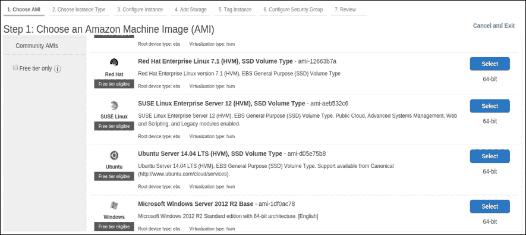

1.  在**选择实例类型**页面上，选择所需的实例，基于资源需求（CPU、内存等）。对于我们的 Mesos 集群，我们将使用每个节点具有 **4** 个核心和 **16** GB 内存的 **m4.xlarge** 实例：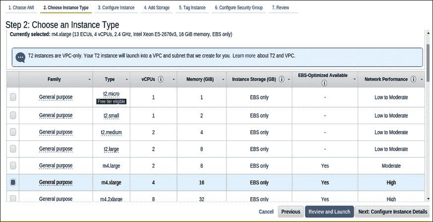

1.  在**配置实例详细信息**页面上，更改以下设置；将实例数选择为 `4`（因为我们正在启动一个四节点集群）：

1.  单击 **配置安全组**，添加 Mesos Web UI 端口 **5050** 作为 **自定义 TCP 规则**，确保您将 **My IP** 设置为 **来源** 地址。此选项将限制除您 IP 地址以外的任何其他连接尝试连接到您的网络：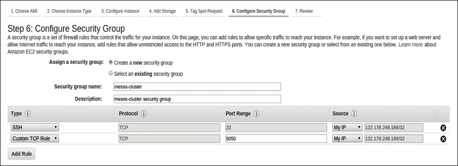

1.  单击 **Review Instance Launch**。我们现在可以跳过添加存储和标记实例的步骤：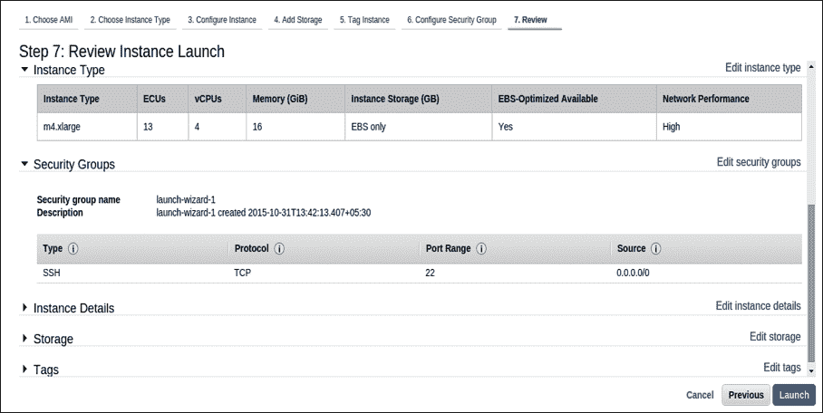

1.  单击 **Launch**。

1.  现在，您将被提示选择登录机器的私钥。您可以选择 **创建新的密钥对** 或使用现有的密钥对，然后将启动机器：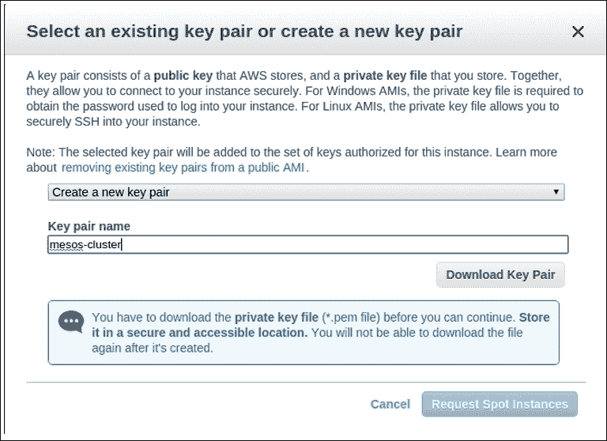

1.  单击 **Download Key Pair** 按钮，将下载名为 `mesos-cluster.pem` 的密钥对文件到您的计算机。您可以使用此文件来 SSH 连接到您在 AWS 中启动的机器。

## 安装 Mesos

现在登录到所有机器：

```
ssh -i  mesos-cluster.pem ec2-54-221-197-122.compute-1.amazonaws.com (master)
ssh -i  mesos-cluster.pem ec2-54-221-196-123.compute-1.amazonaws.com (slave1)
ssh -i  mesos-cluster.pem ec2-54-221-198-125.compute-1.amazonaws.com (slave2)
ssh -i  mesos-cluster.pem ec2-54-221-198-130.compute-1.amazonaws.com (slave3)

```

让我们称前面列表中的第一台机器为我们的主节点，其余的为 `slave1`、`slave2`、`slave3` 在本章的其余部分。

现在，我们可以在所有四台机器上安装依赖库和软件包，输入以下命令： 

```
# Following command is used to update the packages.
$ sudo apt-get update

# We will require JDK for deploying java projects over mesos, use the following command to install java. Here we are using Java version 7.
$ sudo apt-get install -y openjdk-7-jdk

# This step is necessary only if you are building from the git repository. It will install the autotools.
$ sudo apt-get install -y autoconf libtool

# Now we can install the dependencies for the mesos project.
$ sudo apt-get -y install build-essential python-dev python-boto libcurl4-nss-dev libsasl2-dev maven libapr1-dev libsvn-dev

```

现在，我们的环境已准备就绪，可以开始构建 Mesos 二进制文件。

您可以从主节点构建 Mesos 二进制文件，然后将构建内容复制到从机器，而不是从所有机器构建。

## 下载 Mesos

有两种不同的方式可以获取 Mesos：

+   从 Apache 的最新稳定版本下载（推荐）：[`mesos.apache.org/downloads/`](http://mesos.apache.org/downloads/)。在撰写本书时，Mesos 的最新版本是 0.25.0：

    ```
    ubuntu@ip-10-155-18-106:~$ wget http://www.apache.org/dist/mesos/0.25.0/mesos-0.25.0.tar.gz
    ubuntu@ip-10-155-18-106:~$ tar -zxf mesos-0.25.0.tar.gz
    ubuntu@ip-10-155-18-106:~$ mv mesos-0.25.0 mesos

    ```

+   克隆 Mesos 的 git 仓库（仅限高级用户）：

    ```
    ubuntu@ip-10-155-18-106:~$ git clone https://git-wip-us.apache.o
    rg/repos/asf/mesos.git

    ```

## 构建 Mesos

我们可以按照以下步骤构建 Mesos：

```
# Change working directory.
ubuntu@ip-10-155-18-106:~$ cd mesos

# This step is only required if you are building from the gitrepository, or else you can skip this step.
ubuntu@ip-10-155-18-106:~$ ./bootstrap

# Create a build directory. This will contain the compiled Mesosbinaries. It is a good practice to create the build directory.
ubuntu@ip-10-155-18-106:~$ mkdir build
ubuntu@ip-10-155-18-106:~$ cd build

# Now we can trigger the "configure build" command and "make" commandfollowed by it. This step is time consuming and can take some time to get executed
ubuntu@ip-10-155-18-106:~$ ../configure
ubuntu@ip-10-155-18-106:~$ make
In order to speed up the building and reduce verbosity of the logs, you can append-j <number of cores> V=0 to make:
# Once the make command is executed, you can test the make by issuing the following command.
ubuntu@ip-10-155-18-106:~$ make check
# The following step is optional, you can use it if you are installing it system wide. 
ubuntu@ip-10-155-18-106:~$ make install

```

现在，我们可以将 Mesos 主节点上的构建目录复制到 `slave1`、`slave2` 和 `slave3` 机器上：

```
ubuntu@ip-10-155-18-106:~$ rsync -za mesos ip-10-155-18-107:
ubuntu@ip-10-155-18-106:~$ rsync -za mesos ip-10-155-18-109:
ubuntu@ip-10-155-18-106:~$ rsync -za mesos ip-10-155-18-110:

```

启动 Mesos master，如下所示：

```
ubuntu@ip-10-155-18-106:~/mesos/build$ ./bin/mesos-master.sh --work_dir=/var/lib/mesos

```

启动 Mesos slaves：

```
ubuntu@ip-10-155-18-107:~/mesos/build$ ./bin/mesos-slave.sh --master=mesos-master:5050
ubuntu@ip-10-155-18-109:~/mesos/build$ ./bin/mesos-slave.sh --master=mesos-master:5050
ubuntu@ip-10-155-18-110:~/mesos/build$ ./bin/mesos-slave.sh --master=mesos-master:5050

```

Mesos Web UI 在主节点上的端口 `5050` 上运行，这是可以检查安装完成状态的地方。

要执行此操作，请在您的 web 浏览器中输入以下 URL：

`http://ec2-54-221-197-122.compute-1.amazonaws.com:5050`

Mesos UI 将显示如下：

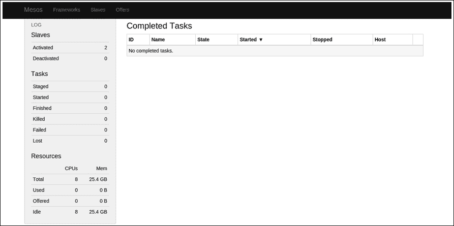

## 使用 mesos-ec2 脚本一次启动多台机器

Mesos 提供了脚本，用于在 EC2 上创建各种配置的 Mesos 集群。位于`ec2`目录中的`mesos-ec2`脚本可以用来启动、运行任务和销毁 Mesos 集群。请注意，即使不构建 Mesos，我们也可以使用该脚本，但需要安装 Python（>=2.6）。我们可以通过不同的名称管理多个集群。

我们需要一个 AWS 密钥对来使用 ec2 脚本，并且需要在前面的步骤中创建的访问密钥和私密密钥：

```
ubuntu@local:~ $ export AWS_ACCESS_KEY_ID=<your-access-key>
ubuntu@local:~ $ export AWS_SECRET_ACCESS_KEY=<your-secret-key>

```

现在，我们可以使用 Mesos 提供的 EC2 脚本，通过以下命令启动一个新的集群：

```
ubuntu@local:~/mesos/ec2 $ ./mesos-ec2 -k <your-key-pair> -i <your-identity-file> -s 10 launch mesos-cluster

```

这将启动一个名为`mesos-cluster`的集群，包含十个从节点。一旦脚本执行完成，它还会打印出以`<master-hostname>:8080`形式展示的 Mesos Web UI 链接。我们可以通过访问该网页界面来确认集群是否已启动。

该脚本提供了多个选项，以下是其中的一些。我们可以通过运行`mesos-ec2 --help`列出所有可用的选项：

| 命令 | 用途 |
| --- | --- |
| `--slave` 或 `–s` | 这是集群中的从节点数量 |
| `--key-pair` 或 `-k` | 这是用于认证的 SSH 密钥对 |
| `--identity-file` 或 `–i` | 这是用于登录实例的 SSH 身份文件 |
| `--instance-type` 或 `–t` | 这是一个从节点实例类型，必须是 64 位 |
| `--ebs-vol-size` | 这是 EBS 卷的大小，用于存储持久的 HDFS 数据 |
| `--master-instance-type` 或 `–m` | 这是主节点实例类型，必须是 64 位 |
| `--zone` 或 `-z` | 这是启动实例的 Amazon 可用区 |
| `--resume` | 此标志从上次运行的地方恢复安装 |

我们可以使用登录操作，通过提供集群名称登录已启动的集群，如下所示：

```
ubuntu@local:~/mesos/ec2 $ ./mesos-ec2 -k <your-key-pair> -i <your-identity-file> login mesos-cluster

```

该脚本还设置了一个 HDFS 实例，可以通过`/root/ephemeral-hdfs/`目录中的命令使用。

最后，我们可以使用以下命令终止集群。在终止集群之前，请确保复制任何重要数据：

```
ubuntu@local:~/mesos/ec2 $ ./mesos-ec2 destroy ec2-test

```

该脚本还支持高级功能，如暂停和重新启动具有 EBS 支持的集群。Mesos 文档是获取任何澄清信息的极好来源。值得一提的是，Mesosphere（[`mesosphere.com`](http://mesosphere.com)）还为你提供了一种便捷的方式，在 Amazon EC2、Google Cloud 和其他平台上创建弹性 Mesos 集群，并为 Mesos 提供商业支持。

# 在 Google Compute Engine（GCE）上设置多节点 Mesos 集群

**Google Compute Engine**（**GCE**）是 Google 的**基础设施即服务**（**IaaS**）产品，允许用户在虚拟服务器上运行计算工作负载，这些服务器属于与 Gmail、YouTube 和 Google 搜索引擎等服务相同的基础设施。

## 实例类型介绍

机器类型决定了虚拟化硬件资源的分配，包括实例所拥有的内存、虚拟 CPU 和持久磁盘的限制。一个虚拟 CPU 对应于主机 CPU 上的一个硬件超线程，该主机正在运行您的实例。

机器类型被分为不同的类别，由 Google Compute Engine 管理。每种机器类型都有自己的定价，并且会单独计费。有关定价的信息，请查看价格表。

可用的机器类型包括以下几种：

+   标准机器类型

+   高 CPU 机器类型

+   高内存机器类型

+   共享核心机器类型

## 启动机器

启动 Google Compute Engine 的最简便方法是通过 Google Cloud Platform 提供的浏览器工具——Google 开发者控制台，在这里可以创建虚拟机实例，访问地址为 [`console.developers.google.com`](https://console.developers.google.com)。

### 设置 Google Cloud Platform 项目

在我们开始启动机器之前，需要先设置一个 Google Cloud Platform 项目：

1.  前往 Google 开发者控制台。当提示时，选择一个已有项目或创建一个新项目。

    ### 提示

    您使用的名称必须介于 1 到 63 个字符之间，并且首字符必须是小写字母。剩余字符可以使用短横线、小写字母或数字，但最后一个字符不能是短横线。此外，您还应当注意，一些资源标识符（如项目 ID）可能会在项目生命周期结束后被保留。因此，请避免将敏感信息存储在资源标识符中。

1.  按照提示设置账单。如果您是 Google Cloud Platform 的新用户，您将获得免费的试用信用额度，用于支付您的实例费用。

## 创建网络和防火墙规则

在您设置好项目和账单后，前往开发者控制台中的 **网络** 部分：

1.  点击 **创建网络** 来创建您的第一个网络，并将其命名为 `mesos-network`：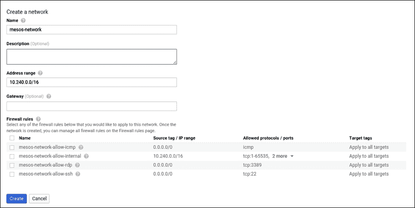

1.  一旦网络添加完成，点击该网络，再点击 **添加防火墙规则** 按钮。

1.  添加规则以打开 TCP 22 和 5050 端口，这通常是一个以分号分隔的列表，格式为 `协议:端口`：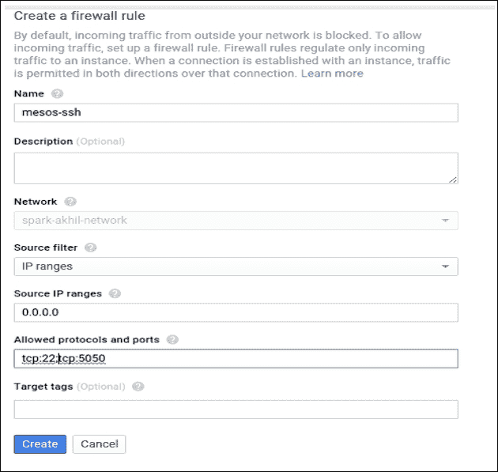

1.  点击 **创建**。

## 创建实例

在您设置好项目和账单后，前往开发者控制台中的 **VM 实例** 部分：

1.  点击 **创建新实例** 来创建您的第一个实例。

1.  将实例的 **名称** 字段设置为 `mesos-master`。

1.  在 **启动磁盘** 下，点击 **更改**，并选择 **Ubuntu 14.04 LTS** 启动磁盘镜像（如果默认没有指定）。Compute Engine 提供了其他操作系统供您选择，但在本示例中我们将使用 Ubuntu。保存更改：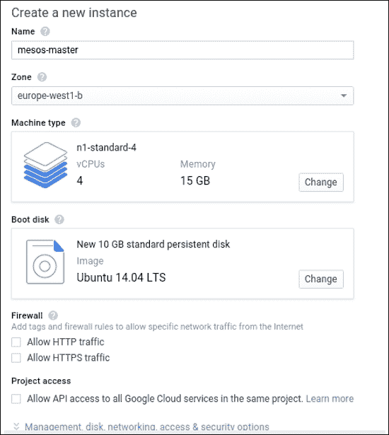

1.  点击 **网络**，然后选择我们在之前步骤中创建的 **mesos-network**。

1.  点击 **创建** 来创建你的实例。实例启动后，页面会自动刷新。

一旦我们启动了 `mesos-master` 机器，现在重复前面的步骤三次，启动我们的 `mesos-slave1`、`mesos-slave2`，以及我们的集群：

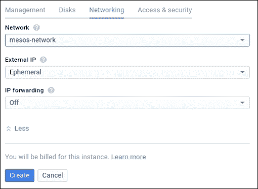

## 安装 Mesos

到此为止，你将在 Google Compute Cloud 上启动三台机器，分别命名为 `mesos-master`、`mesos-slave1` 和 `mesos-slave2`：

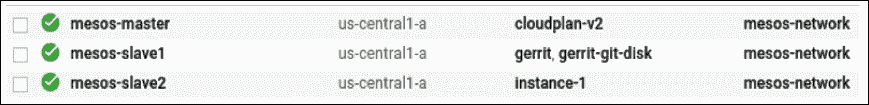

现在，登录所有三台机器：

```
mesos-master: ssh 146.148.62.84
mesos-slave1:  ssh 104.197.92.182
mesos-slave2:  ssh 104.197.92.145
```

现在，我们可以通过输入以下命令，在三台机器上安装依赖库和软件包：

```
# Update the packages.
$ sudo apt-get update
# Install the latest OpenJDK.
$ sudo apt-get install -y openjdk-7-jdk
# Install autotools (Only necessary if building from git repository).
$ sudo apt-get install -y autoconf libtool
# Install other Mesos dependencies.
$ sudo apt-get -y install build-essential python-dev python-boto libcurl4-nss-dev libsasl2-dev maven libapr1-dev libsvn-dev

```

现在，我们的环境已经准备好，可以开始构建 Mesos 二进制文件。

你可以从主机器构建 Mesos 二进制文件，然后将构建好的文件复制到从机，而不是在所有机器上都进行构建。

## 下载 Mesos

按照 *在 Amazon Web Services (AWS) 上设置多节点 Mesos 集群* 部分下相应的 *下载 Mesos* 子章节中的步骤，在主机器上下载并解压 Mesos。

## 构建 Mesos

构建 Mesos 的过程已在相应的 AWS 部分中讨论。你可以按照那里列出的指示在主机器上构建 Mesos。

现在，我们可以通过查看运行在主机器端口 `5050` 上的 Mesos Web UI 来确保安装完成。

打开浏览器，前往以下网址：

`http://146.148.62.84:5050`

然后，Mesos Web UI 将如下所示：

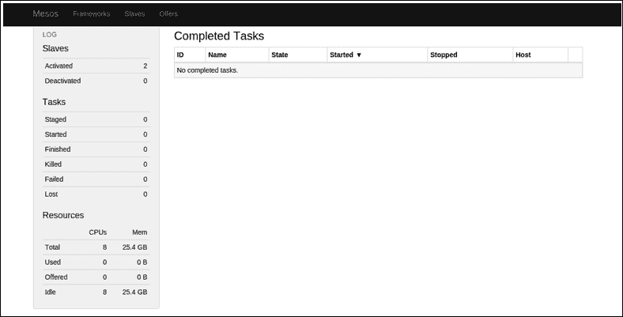

# 在 Microsoft Azure 上设置多节点 Mesos 集群

Microsoft Azure 是一个云计算平台和基础设施，由微软创建，用于通过微软管理的和微软合作伙伴托管的数据中心的全球网络来构建、部署和管理应用程序和服务。欲了解更多信息，请访问 [`azure.microsoft.com`](https://azure.microsoft.com)。

## 实例类型介绍

虚拟机有两种级别：基本版和标准版。两种类型都提供多种大小选项，但基本版不提供一些功能，如负载均衡和自动扩展，而这些功能在标准版中可用。标准版有不同的系列：A、D、DS、G 和 GS。

## 启动机器

要开始进行开发或在云中进行测试，你需要一个有效的 Microsoft Azure 订阅。如果你当前没有订阅，可以获得一个免费的一个月试用，并且获得 $200 的额度，可以用于任何 Azure 服务：

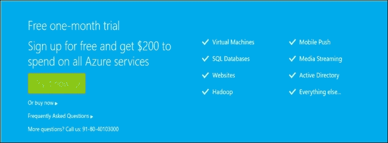

一旦你注册了 Azure，访问管理门户以启动实例。Azure 管理门户的网址如下：[`manage.windowsazure.com`](https://manage.windowsazure.com)

### 创建云服务

Azure 中的云服务为你提供一个公共端点，用于访问在云服务中运行的所有服务（例如虚拟机等）。一个端点可能如下所示：

```
the-name-you-give.cloudapp.net (e.g: mesos-cluster.cloudapp.net)
```

以下是创建云服务的步骤：

1.  点击左侧菜单面板中的**CLOUD SERVICES**选项：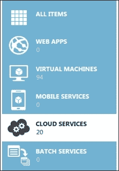

1.  选择**NEW**，然后点击**CLOUD SERVICE**，接着点击**QUICK CREATE**：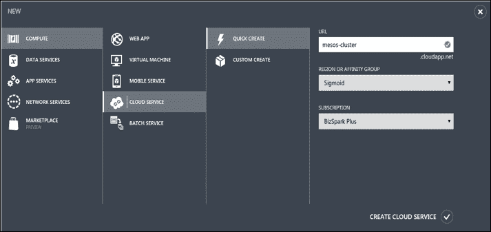

    我们使用了`mesos-cluster`这个名称，因此，访问此服务的公共端点将是`mesos-cluster.cloudapp.net`。

1.  点击**Create** **Cloud Service**。创建云服务后，你将能够看到它，如下所示：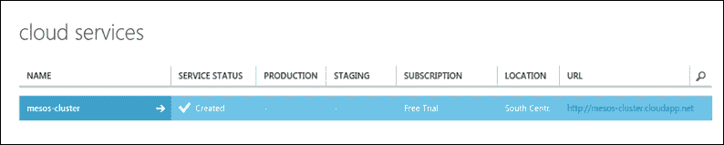

### 创建实例

一旦云服务准备好，接下来的任务是启动用于 Mesos 集群的虚拟机：

1.  点击**NEW**，然后选择**COMPUTE**，接着选择**VIRTUAL MACHINE**：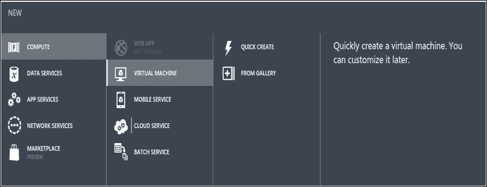

1.  点击**FROM GALLERY**；这个选项为我们提供了更好的选择和机器控制。

1.  **选择镜像**并点击**UBUNTU**，然后从列表中选择**Ubuntu Server 14.04 LTS**镜像，点击**Next**：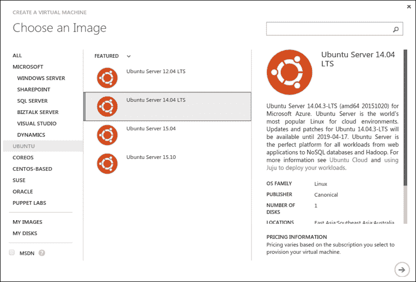

1.  **虚拟机命名**：在此步骤中，你需要为虚拟机命名。这个名称将成为你即将启动的机器的主机名，因此我们将其命名为`mesos-master`。选择**SIZE**为**D3（即 4 核 14GB 内存的机器）**，并输入你将用来登录该机器的密码。然后，点击**Next**：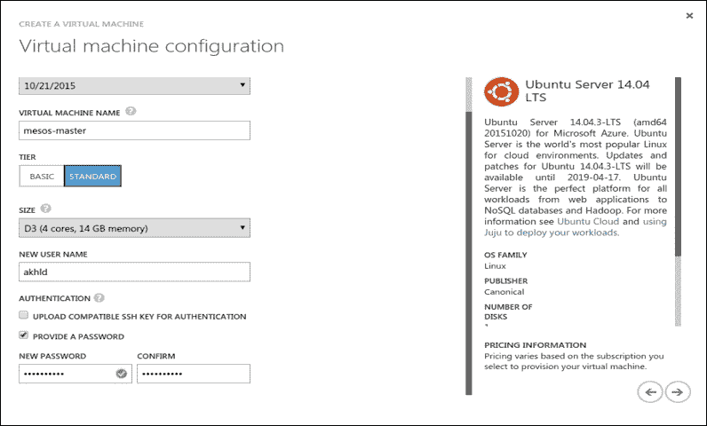

1.  **虚拟机配置**：在此步骤中，你将选择我们之前创建的**mesos-cluster**云服务。因此，实际上你将为本次操作启动的虚拟机将属于`mesos-cluster`云服务：

1.  点击**Next**并点击**Finish**按钮：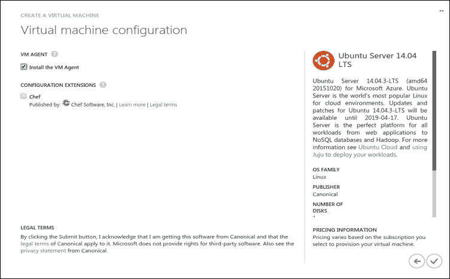

现在，按照相同的步骤启动`mesos-slave1`和`mesos-slave2`。

需要注意的一点是，对于每一台新虚拟机，如果你希望从`mesos-cluster`端点外部访问这些虚拟机，你必须配置 SSH 端口，如下所示：

1.  在**虚拟机配置**步骤中，在**ENDPOINTS**下，将**PUBLIC PORT**值更改为另一个数字：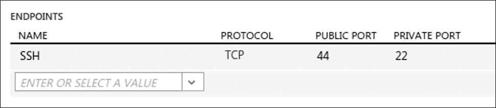

1.  假设`mesos`-`master`的公共端口是`22`，这意味着假设我们执行如下操作：

    ```
    ssh mesos-cluster.cloudapp.net -p 22

    ```

1.  这将登录到`mesos-master`机器。现在，如果你想登录到`mesos-slave1`，你需要将公共端口配置为`44`，这样你就可以登录到`mesos-slave1`，如下所示：

    ```
    ssh mesos-cluster.cloudapp.net -p 44

    ```

## 配置网络

出于安全考虑，每当你在云中部署机器时，务必确保已将必要的端口开放给公众。

除了 SSH 端口，我们还需要开放 Mesos UI 端口，该端口运行在 `5050` 上。为此，执行以下步骤：

1.  在 Azure 控制台中，点击已配置的虚拟机中的 **mesos-master** 机器，然后点击 **End Points**。

1.  现在点击 **添加** 按钮来添加特定端口：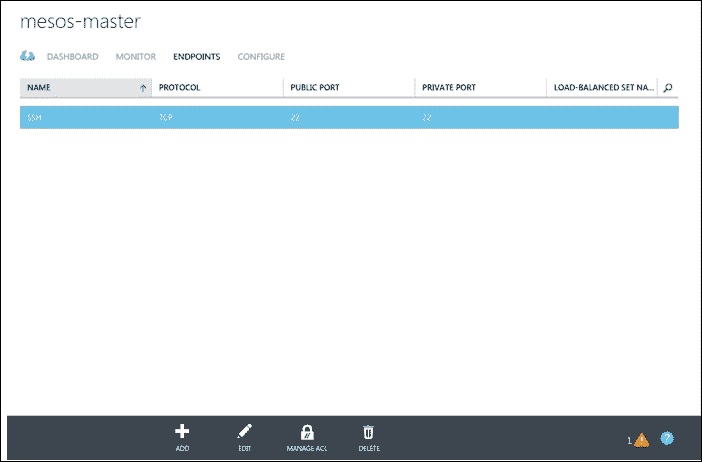

1.  选择 **添加独立端点** 选项并点击 **下一步**：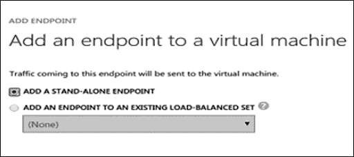

1.  将此命名为 `mesos-ui`，从协议列表中选择 **TCP**，并使用 `5050` 作为 **公共端口**。这样，你就可以通过 `http://mesos-cluster.cloudapp.net:5050` 访问它，并将端口 `5050` 分配为 **私有端口**。点击 **完成** 按钮：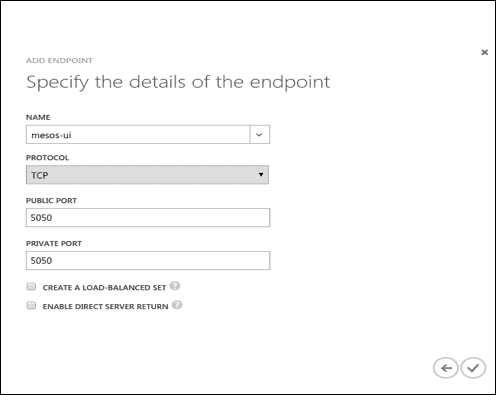

## 安装 Mesos

到这时，你将在 Azure 云中启动并运行三台机器，分别名为 `mesos-master`、`mesos-slave1` 和 `mesos-slave2`：

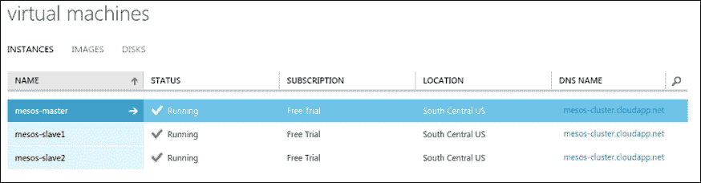

现在，登录到所有三台机器：

```
mesos-master: ssh mesos-cluster.cloudapp.net
mesos-slave1:  ssh mesos-cluster.cloudapp.net -p 23
mesos-slave2:  ssh mesos-cluster.cloudapp.net -p 24
```

理想情况下，使用高级 Linux 终端，如 **terminator** 或 **xterm**，可以在多台机器上工作，因为这些终端支持广播命令。你可以在一个窗口中输入命令，然后它会在所有三台机器上同时执行，从而减少配置工作量：

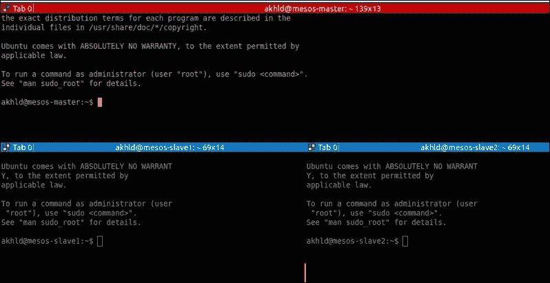

现在，我们可以通过输入以下命令，在所有三台机器上安装依赖库和软件包：

```
# Update the packages.
$ sudo apt-get update

# Install the latest OpenJDK.
$ sudo apt-get install -y openjdk-7-jdk

# Install autotools (Only necessary if building from git repository).
$ sudo apt-get install -y autoconf libtool

# Install other Mesos dependencies.
$ sudo apt-get -y install build-essential python-dev python-botolibcurl4-nss-dev libsasl2-dev maven libapr1-dev libsvn-dev

```

现在，我们的环境已准备就绪，可以开始构建 Mesos 二进制文件。你可以在主机上构建 Mesos 二进制文件，然后将构建文件复制到从机上，而不是在所有机器上都进行构建。

## 下载 Mesos

请按照 *在 Amazon Web Services (AWS) 上设置多节点 Mesos 集群* 部分下的 *下载 Mesos* 小节中的步骤，在主机上下载并解压 Mesos。

## 构建 Mesos

Mesos 的构建可以在 *构建 Mesos* 小节中找到，位于 *在 Amazon Web Services (AWS) 上设置多节点 Mesos 集群* 部分下。你可以按照那里列出的说明在主机上构建 Mesos。

一旦我们构建完成，就可以将构建目录从 `mesos-master` 机器复制到 `mesos-slave1` 和 `mesos-slave2` 机器：

```
mesos-master:~$ rsync -za mesos mesos-slave1:
mesos-master:~$ rsync -za mesos mesos-slave2:

```

## 启动 mesos-master

在主机上执行以下命令来启动 `mesos-master`：

```
mesos-master:~/mesos/build$ ./bin/mesos-master.sh --work_dir=/var/lib/mesos

```

执行该命令后，你可以在终端中看到以下日志：

```
I1108 08:26:52.525831 13306 main.cpp:229] Build: 2015-11-08 07:26:59 by akhld
I1108 08:26:52.526072 13306 main.cpp:231] Version: 0.25.0
I1108 08:26:52.526406 13306 main.cpp:252] Using 'HierarchicalDRF' allocator
I1108 08:26:52.623775 13306 leveldb.cpp:176] Opened db in 97.107324ms
I1108 08:26:52.712013 13306 leveldb.cpp:183] Compacted db in 88.081084ms
I1108 08:26:52.712218 13306 leveldb.cpp:198] Created db iterator in 72800ns
I1108 08:26:52.712327 13306 leveldb.cpp:204] Seeked to beginning of db in 25401ns
I1108 08:26:52.712745 13306 leveldb.cpp:273] Iterated through 3 keys in the db in 342201ns
I1108 08:26:52.713101 13306 replica.cpp:744] Replica recovered with log positions 5 -> 6 with 0 holes and 0 unlearned
I1108 08:26:52.716048 13321 recover.cpp:449] Starting replica recovery
I1108 08:26:52.716660 13306 main.cpp:465] Starting Mesos master
……….
I1108 08:26:52.776047 13306 master.cpp:376] Master 090c9618-090f-49bd-aa95-265ec5f423d5 (100.73.76.103) started on 100.73.76.103:5050

```

这里的输出列出了构建版本、主机使用的各种配置以及集群的主节点 ID。从属进程应该能够连接到主节点。从属进程可以通过 `--master` 选项指定主节点的 IP 地址或主机名。

## 启动 mesos-slaves

在从节点机器上执行以下命令以启动从节点服务：

```
mesos-slave1:~/mesos/build$ ./bin/mesos-slave.sh --master=mesos-master:5050
mesos-slave1:~/mesos/build$ ./bin/mesos-slave.sh --master=mesos-master:5050

I1108 08:31:18.733666 26975 main.cpp:185] Build: 2015-11-08 07:26:59 by akhld
I1108 08:31:18.734257 26975 main.cpp:187] Version: 0.25.0
I1108 08:31:18.734724 26975 containerizer.cpp:143] Using isolation: posix/cpu,posix/mem,filesystem/posix
I1108 08:31:18.747735 26975 main.cpp:272] Starting Mesos slave
I1108 08:31:18.748929 26975 slave.cpp:190] Slave started on 1)@100.73.76.129:5051

```

此输出确认了与主节点的连接，并列出了从节点的资源。现在，集群已经启动，包含两个从节点，并准备运行框架。

我们现在可以通过查看在主节点上运行的 Mesos Web UI（端口为 `5050`）来确认安装是否完成。

打开浏览器，访问以下 URL：`http://mesos-cluster.cloudapp.net:5050`：

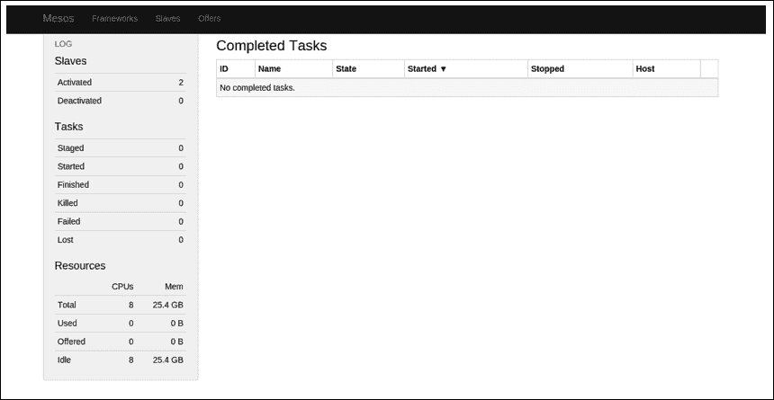

## Mesos 命令

如果查看 Mesos 的 `bin` 目录，你会发现以下可执行文件，可以用于进行不同操作，如下所列：

| 命令 | 用途 |
| --- | --- |
| `mesos-local.sh` | 此命令在单一进程内启动一个内存集群。 |
| `mesos-tests.sh` | 此命令运行 Mesos 测试用例套件。 |
| `mesos.sh` | 这是一个封装脚本，用于启动 Mesos 命令。运行时不带任何参数会显示所有可用的命令。 |
| `gdb-mesos-*` | 此命令使用 `gdb` 启动相应的进程进行调试模式。 |
| `lldb-mesos-*` | 此命令使用 `lldb` 启动相应的进程进行调试模式。 |
| `valgrind-mesos-*` | 此命令启动相应的 Valgrind 仪表框架。 |
| `mesos-daemon.sh` | 此命令启动/停止 Mesos 守护进程。 |
| `mesos-start-cluster.sh` | 此命令启动在 `[install-prefix]/var/mesos/deploy/masters` 和 `[install-prefix]/var/mesos/deploy/slaves` 文件中列出的节点上的 Mesos 集群。 |
| `mesos-stop-cluster.sh` | 此命令停止在 `[install-prefix]/var/mesos/deploy/masters` 和 `[install-prefix]/var/mesos/deploy/slaves` 文件中列出的节点上的 Mesos 集群。 |
| `mesos-start-masters.sh` | 此命令启动在 `masters` 文件中列出的节点上的 Mesos 主节点。 |
| `mesos-stop-masters.sh` | 此命令停止在 `masters` 文件中列出的节点上的 Mesos 主节点。 |
| `mesos-start-slaves.sh` | 此命令启动在 `slaves` 文件中列出的节点上的 Mesos 从节点。 |
| `mesos-stop-slaves.sh` | 此命令停止在 `slaves` 文件中列出的节点上的 Mesos 从节点。 |

## 测试安装

我们现在可以通过运行随 Mesos 一起提供的简单示例（C++、Java 和 Python）来测试集群的安装：

```
# Run C++ framework (Exits after successfully running some tasks.).
mesos-master:~/mesos/build$ ./src/examples/test-framework --master=mesos-master:5050

```

输出结果如下：

```
I1108 09:26:45.512217 23136 sched.cpp:164] Version: 0.25.0
I1108 09:26:45.524862 23156 sched.cpp:262] New master detected at master@100.73.76.103:5050
I1108 09:26:45.527117 23156 sched.cpp:272] No credentials provided. Attempting to register without authentication
 I1108 09:26:45.531708 23157 sched.cpp:641] Framework registered with 5f18729d-c83a-4264-a50b-bd972b2d10f3-0006
Registered!
Received offer 5f18729d-c83a-4264-a50b-bd972b2d10f3-O11 withcpus(*):4; mem(*):13000; disk(*):23976; ports(*):[31000-32000]
Launching task 0 using offer 5f18729d-c83a-4264-a50b-bd972b2d10f3-O11
Launching task 1 using offer 5f18729d-c83a-4264-a50b-bd972b2d10f3-O11
Launching task 2 using offer 5f18729d-c83a-4264-a50b-bd972b2d10f3-O11
Launching task 3 using offer 5f18729d-c83a-4264-a50b-bd972b2d10f3-O11
Received offer 5f18729d-c83a-4264-a50b-bd972b2d10f3-O12 withcpus(*):4; mem(*):13000; disk(*):23976; ports(*):[31000-32000]
Launching task 4 using offer 5f18729d-c83a-4264-a50b-bd972b2d10f3-O12
Task 4 is in state TASK_RUNNING
Task 0 is in state TASK_RUNNING
Task 1 is in state TASK_RUNNING
Task 4 is in state TASK_FINISHED
Task 2 is in state TASK_RUNNING
Task 3 is in state TASK_RUNNING
Task 0 is in state TASK_FINISHED
Task 1 is in state TASK_FINISHED
Task 2 is in state TASK_FINISHED
Task 3 is in state TASK_FINISHED
I1108 09:26:45.719132 23154 sched.cpp:1771] Asked to stop the driver
I1108 09:26:45.719321 23154 sched.cpp:1040] Stopping framework '5f18729d-c83a-4264-a50b-bd972b2d10f3-0006'
I1108 09:26:45.720949 23136 sched.cpp:1771] Asked to stop the driver 

```

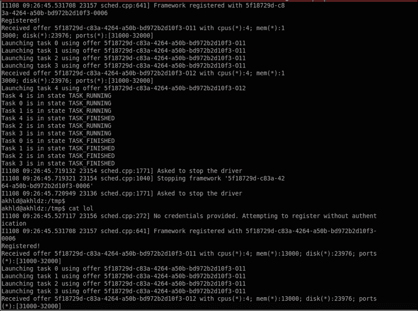

你也可以从 Web 界面查看任务的状态：

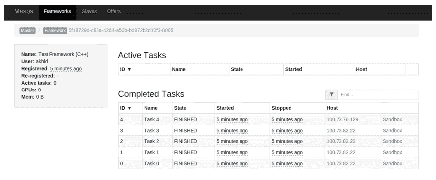

```
# Run Java framework (Exits after successfully running some tasks)mesos-master:~/mesos/build$ ./src/examples/java/test-framework mesos-master:5050
# Run Python framework (Exits after successfully running some tasks)
mesos-master:~/mesos/build$ ./src/examples/python/test-framework mesos-master:5050
```

### 注意

为了构建示例框架，确保通过以下步骤构建测试套件：

```
make check
```

# 在您的私有数据中心设置多节点 Mesos 集群

在本节中，我们将解释如何在您完全托管的数据中心上启动并运行 Mesos。为了简单起见，假设您的数据中心有三台机器，您将基于这些机器设置 Mesos。我们还假设您的数据中心虚拟机正在运行 **CentOS 6.6** Linux 发行版。

假设以下机器已选择安装 Mesos：

```
machine-a : 192.168.1.10
machine-b : 192.168.1.11
machine-c : 192.168.1.12
```

我们将选择 `machine-a` 作为集群的 Mesos 主节点，并且 `machine-b`、`machine-c` 将运行从节点进程。

## 安装 Mesos

以下是如何在您的私有数据中心安装多节点 Mesos 集群的步骤。

### 准备环境

我们需要安装 Mesos 在 CentOS 机器上运行所需的所有依赖项和库。为此，我们需要登录到所有三台机器并输入以下命令：

### 注意

请注意，以下是针对标准 CentOS 6.6 的指令。如果您使用的是其他操作系统，请相应地安装相应的包。

```
# Issue the following command to install the wget command for your centos machine
$ sudo yum install -y tar wget
# We will need c++11 support which is available in the devtoolset-2\. For that you will have to add it to the repo and then issue theinstallation command as follows:
$ sudo wget -O /etc/yum.repos.d/slc6-devtoolset.repohttp://linuxsoft.cern.ch/cern/devtoolset/slc6-devtoolset.repo# Import the CERN GPG key.
$ sudo rpm --importhttp://linuxsoft.cern.ch/cern/centos/7/os/x86_64/RPM-GPG-KEY-cern
# Fetch the Apache Maven repo file.
$ sudo wget http://repos.fedorapeople.org/repos/dchen/apache-maven/epel-apache-maven.repo -O /etc/yum.repos.d/epel-apache-maven.repo
# 'Mesos > 0.21.0' requires 'subversion > 1.8' devel package, 
# which is not available in the default repositories.
# Add the WANdisco SVN repo file: '/etc/yum.repos.d/wandisco-svn.repo' with content:
[WANdiscoSVN]
name=WANdisco SVN Repo 1.8
enabled=1
baseurl=http://opensource.wandisco.com/centos/6/svn-1.8/RPMS/$basearch/
gpgcheck=1
gpgkey=http://opensource.wandisco.com/RPM-GPG-KEY-WANdisco

# Now we can install the development tools which will contain the utilities like make for your our installation
$ sudo yum groupinstall -y "Development Tools"
# Install 'devtoolset-2-toolchain' which includes GCC 4.8.2 and related packages.
$ sudo yum install -y devtoolset-2-toolchain
# Now we can install the mesos related dependency for centos.
$ sudo yum install -y apache-maven python-devel java-1.7.0-openjdk-devel zlib-devel libcurl-devel openssl-develcyrus-sasl-devel cyrus-sasl-md5 apr-devel subversion-devel apr-util-devel
# Now we can enable the devtoolset for the shell.
$ scl enable devtoolset-2 bash
$ g++ --version
# At this point make sure we get the gcc+ version > 4.8.

```

## 下载 Mesos

按照 *在 Amazon Web Services (AWS) 上设置多节点 Mesos 集群* 部分中的 *下载 Mesos* 子部分的步骤，下载并提取主机上的 Mesos。

## 构建 Mesos

我们可以按照上一节中提到的步骤，在主机上构建 Mesos。

现在，我们可以从主机将构建目录从 `machine-a` 复制到 `machine-b` 和 `machine-c`：

```
machine-a:~$ rsync -za mesos machine-b:
machine-a:~$ rsync -za mesos machine-c:
```

## 启动 mesos-master

从主机上执行以下命令来启动 `mesos-master`：

```
machine-a:~/mesos/build$ ./bin/mesos-master.sh --work_dir=/var/lib/mesos --ip=192.168.1.10

```

## 启动 mesos-slaves

现在，我们可以从从节点机器上执行以下命令来启动从节点服务：

```
machine-b:~/mesos/build$ ./bin/mesos-slave.sh --  master=192.168.1.10:5050
machine-c:~/mesos/build$ ./bin/mesos-slave.sh --  master=192.168.1.10:5050

```

我们现在可以通过查看主机上运行在 `5050` 端口的 Mesos Web UI 来确认安装已完成。

打开浏览器并访问以下 URL：`http://192.168.1.10:5050`：

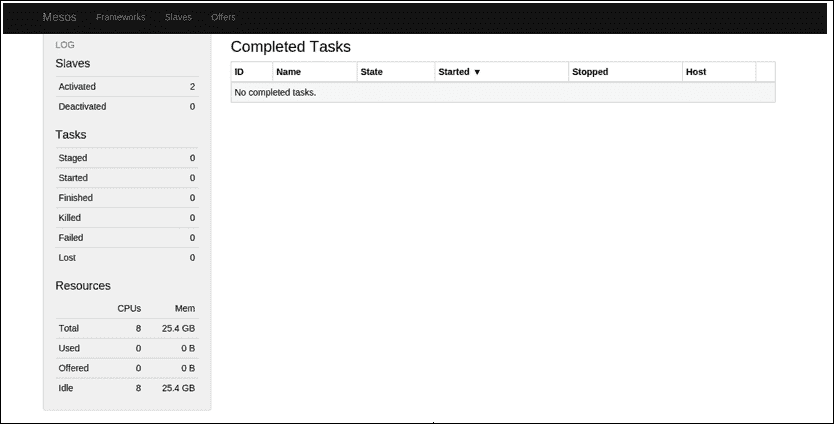

## 当有多台机器时，自动化该过程

我们可以重复之前的步骤，手动在每个从节点上启动 `mesos-slave` 来设置集群，但对于大型集群而言，这种方式劳动强度大且容易出错。Mesos 包含一组位于 `deploy` 文件夹中的脚本，这些脚本可用于在集群上部署 Mesos。这些脚本依赖 SSH 来执行部署。

我们将设置一个包含 10 个从节点（`slave1`、`slave2`、`slave10`）和一个主节点（master）的集群。

让我们配置集群，确保在安装所有前提条件后，各节点之间可以互相连接。以下命令将生成一个 SSH 密钥并将其复制到所有从节点：

```
master:~ $ ssh-keygen -f ~/.ssh/id_rsa -P ""

master:~ $ ssh-copy-id -i ~/.ssh/id_rsa.pub slave1

master:~ $ ssh-copy-id -i ~/.ssh/id_rsa.pub slave2

master:~ $ ssh-copy-id -i ~/.ssh/id_rsa.pub slave3

master:~ $ ssh-copy-id -i ~/.ssh/id_rsa.pub slave4

master:~ $ ssh-copy-id -i ~/.ssh/id_rsa.pub slave5

master:~ $ ssh-copy-id -i ~/.ssh/id_rsa.pub slave6

master:~ $ ssh-copy-id -i ~/.ssh/id_rsa.pub slave7

master:~ $ ssh-copy-id -i ~/.ssh/id_rsa.pub slave8

master:~ $ ssh-copy-id -i ~/.ssh/id_rsa.pub slave9

master:~ $ ssh-copy-id -i ~/.ssh/id_rsa.pub slave10

```

我们需要将 Mesos 构建复制到所有节点的相同位置，就像在主节点上那样：

```
master:~ $ scp –R build slave1:[install-prefix]
master:~ $ scp –R build slave2:[install-prefix]
master:~ $ scp –R build slave3:[install-prefix]
master:~ $ scp –R build slave4:[install-prefix]
master:~ $ scp –R build slave5:[install-prefix]
master:~ $ scp –R build slave6:[install-prefix]
master:~ $ scp –R build slave7:[install-prefix]
master:~ $ scp –R build slave8:[install-prefix]
master:~ $ scp –R build slave9:[install-prefix]
master:~ $ scp –R build slave10:[install-prefix]

```

使用您选择的编辑器，在 `[install-prefix]/var/mesos/deploy/masters` 目录中创建一个 masters 文件，按行列出主节点，在我们的情况下，将只有以下一个：

```
master:~ $ cat [install-prefix]/var/mesos/deploy/masters
master

```

类似地，slaves 文件将列出我们想要作为 Mesos 从机的所有节点：

```
master:~ $ cat [install-prefix]/var/mesos/deploy/slaves
slave1
slave2
slave3
slave4
slave5
slave6
slave7
slave8
slave9
slave10

```

现在，我们可以使用 `mesos-start-cluster` 脚本启动集群，并使用 `mesos-stop-cluster` 停止它：

```
master:~ $ mesos-start-cluster.sh

```

这将调用 `mesos-start-masters` 和 `mesos-start-slaves`，它们将在主节点和从节点上启动相应的进程。该脚本会查找 `[install-prefix]/var/mesos/deploy/mesos-deploy-env.sh` 中的环境配置。为了更好的配置管理，主节点和从节点的配置选项可以分别指定在 `[install-prefix]/var/mesos/deploy/mesos-master-env.sh` 和 `[install-prefix]/var/mesos/deploy/mesos-slave-env.sh` 文件中。

# 调试与故障排除

在本节中，我们将讨论如何排查和调试在设置过程中遇到的常见问题。

## 处理缺失的库依赖

有时，当你在一个全新的 Linux 虚拟机上构建 Mesos 时，配置步骤可能会出现错误。比如缺少 `libz-dev` 软件包：

```
configure: error: cannot find libz
-------------------------------------------------------------------
libz is required for Mesos to build.
-------------------------------------------------------------------

```

每当你遇到像上面这样的错误，或者类似的缺少软件包的错误时，你需要做的下一件事是安装这些缺失的软件包，然后再次执行 `configure` 命令。

在这里，为了解决缺失的 `libz` 库，你需要在 *Ubuntu* 系统中输入以下命令：

```
$ sudo apt-get install libz-dev

```

对于 *CentOS* 版本，命令如下：

```
$ yum install zlib-devel

```

## 目录权限问题

如果 Mesos 尝试写入 `/var/lib/mesos`，但你没有正确设置该目录的权限，那么将会出现以下错误：

```
mkdir: cannot create directory '/var/lib/mesos': Permission denied

```

为了克服这些问题，你需要通过以下命令为该目录分配正确的权限：

```
$ sudo chown `whoami` /var/lib/mesos

```

## 缺失 Mesos 库（未找到 libmesos*.so）

每当你遇到 **libmesos*.so 文件未找到** 时，你能做的最好的事情就是 *复制* `libmesos*.so` 文件从 Mesos 安装目录到 `/lib` 目录。

这样的错误示例如下：

```
/home/akhld/mesos/build/src/.libs/test-executor: error while loading shared libraries: libmesos-0.25.0.so: cannot open shared object file: No such file or directory

```

## 调试失败的框架

有时，如果你的集群配置不正确或者有一个有问题的框架，那么它将无法成功执行。在这种情况下，你可以打开 Mesos 的 web 界面，然后点击 **框架** 选项卡下的失败 **框架**，如下所示：

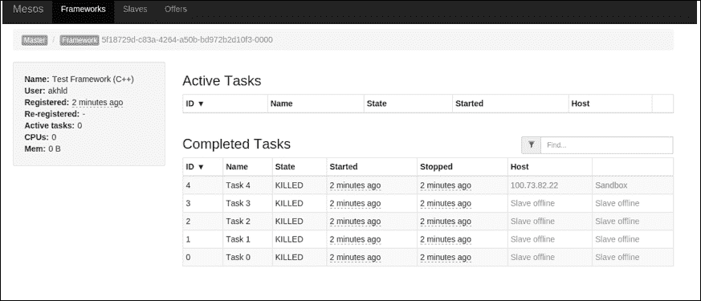

在这里，你可以看到一些任务被标记为 **KILLED**，接下来你需要找出原因。

### 理解 Mesos 目录结构

在每个从机上，默认情况下，Mesos 的工作目录位于 `/tmp/mesos`，并且在 `/tmp/mesos/slaves/` 下会有 `slave id`，它会跟踪在其下运行的框架，并保存在 `frameworks` 目录下。该框架会记录它尝试执行给定任务的次数，每次运行的详细信息将记录在 `runs` 目录中。你可以从 `stderr` 和 `stdout` 文件中找到错误和标准输出，这些文件位于 runs 目录下。

这是一个包含单个执行器实例和多个框架的示例目录结构：

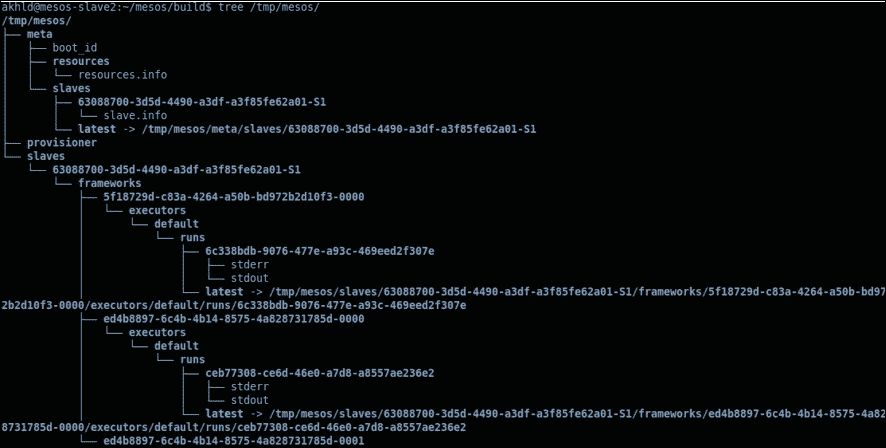

现在，为了追踪我们的问题，你需要转到相应的框架 ID，并查看 `stderr` 文件，它将记录该框架所面临的确切问题。

让我们来看一下以下示例：

```
$ cat /tmp/mesos/slaves/63088700-3d5d-4490-a3df-a3f85fe62a01-S1/frameworks/ed4b8897-6c4b-4b14-8575-4a828731785d-0001/executors/default/runs/latest/stderr 
 /var/lib/mesos/: Permission denied

```

现在你知道问题出在目录权限上，你可以按照上一节中描述的步骤来修复它。

## Mesos 从属节点未能连接到 Mesos 主节点

诸如从属节点无法连接主节点的问题可以通过以下两种方式解决：

+   查看从属节点的控制台日志。

    你可以查看控制台日志，当从属节点尝试连接到主节点时，这将显示连接失败的消息，如**操作超时**、**连接被拒绝**、**网络无法访问**等。

+   确保主节点和从节点绑定到正确的网络接口。

    确保你的主节点和从节点绑定到正确的网络接口；使用 `--ip` 选项来确保这一点总是更安全。

## 在同一台机器上启动多个从属实例

如果你尝试在同一台机器上启动多个从属进程，最终会遇到以下异常：

```
Failed to initialize, bind: Address already in use [98]

```

如果你需要在单台机器上启动更多的从属实例，可以通过以下方式实现。

你可以再启动一个从属节点，但必须指定一个端口和一个不同的 `workdir`，方法如下：

```
./mesos-slave.sh --master=<ipaddr>:<port> --ip=<ip of slave> --work_dir=<work_dir other than that of a running slave> --port=<another_port>

```

### 注意

Mesos 的 `master` 和 `slave` 节点可以部署在同一台机器上吗？

你绝对可以在同一节点上运行 `master` 和多个 `slave` 进程。你甚至可以在同一节点上运行多个 `master` 和 `slave` 进程，只要为它们指定唯一的端口，但这最好仅适用于测试集群。

# 总结

在本章中，我们展示了如何手动在公共云（AWS、GCE 和 Azure）以及私有数据中心（本地部署）上设置和运行 Mesos 集群。我们还讨论了在设置过程中常见的错误以及如何高效地进行调试和解决。

在下一章中，我们将探索重要的调度和管理框架，如 Marathon 和 Chronos，这些框架通常与 Mesos 密切配合，并且是 Mesos 生态系统的核心组件。
