# 第四章：服务调度和管理框架

本章介绍了几个基于 Mesos 的调度和管理框架或应用程序，这些框架或应用程序对于长期运行服务的轻松部署、发现、负载均衡和故障处理至关重要。这些所谓的元框架负责处理其他框架和应用程序的*家务工作*，例如**服务发现**（即跟踪某个特定服务运行的实例）和**负载均衡**（确保在各个实例之间公平分配工作负载），此外还包括**配置管理**、**自动化****任务调度**、**应用程序****扩展**和**故障处理**。我们将在这里探讨的框架包括：

+   **Marathon**：用于在 Mesos 上启动和管理长期运行的应用程序

+   **Chronos**：这是一个集群调度器

+   **Apache Aurora**：这是一个用于长期运行服务和定时任务的框架

+   **Singularity**：这是一个平台即服务（PaaS），用于运行服务

+   **Marathoner**：这是用于 Marathon 的服务发现工具

+   **Consul**：执行服务发现和协调

+   **HAProxy**：用于负载均衡

+   **Bamboo**：用于自动配置 Mesos 和 Marathon 的 HAProxy

此外，我们还将简要介绍两个非常新的开源框架，即**Netflix Fenzo**（一个任务调度器）和**Yelp 的 PaaSTA**（一个运行服务的 PaaS）。

# 使用 Marathon 在 Mesos 上启动和管理长期运行的应用程序

Marathon 是一个常用的 Mesos 框架，用于长期运行的应用程序。它可以被视为传统系统中 `init` 或 `upstart` 的替代品，或者是您系统的 `init.d`。

Marathon 拥有许多功能，例如控制高可用环境、检查应用程序的健康状态等。它还支持**表现层状态转移**（**REST**），如端点，您可以使用它来启动、停止和扩展您的应用程序。它可以根据负载自动扩展和缩减集群，这意味着它应能在某个可用实例宕机时启动新的实例。Marathon 还设计用来运行其他框架，例如**Hadoop**、**Kafka**、**Storm**、**Chronos**等。Marathon 确保通过它启动的每个应用程序即使在某个从节点宕机的情况下也能继续运行。

Marathon 以高度可用的方式运行，这意味着集群中可以运行多个调度器，但在任何时候，只有一个领导者。当应用程序请求非领导者时，请求将被代理到活跃的领导者。您还可以使用 HAProxy（本章稍后将解释）进行服务发现和负载均衡。

Marathon 还支持基本的认证机制，并使用 SSL 加密连接。

## 安装 Marathon

访问 [`mesosphere.github.io/marathon/`](https://mesosphere.github.io/marathon/) 下载最新的 Marathon 版本。编写本书时，最新版本是 0.13.0。

可以按照如下方式下载 Marathon：

```
$ wget http://downloads.mesosphere.com/marathon/v0.13.0/marathon-0.13.0.tgz

```

下载后，按如下方式解压文件：

```
$ tar xf marathon-0.13.0.tgz

```

解压 Marathon 后，你将看到以下文件：

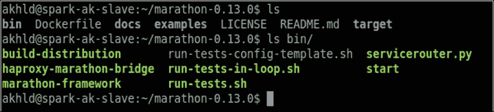

Marathon 有一个开发模式，在该模式下你不需要分布式 Mesos 设置。这被称为 Marathon 本地模式。本地模式仅用于实验目的，不建议在任何生产环境中运行。ZooKeeper 和 Marathon 一起使用，用于存储状态。

## 安装 ZooKeeper 以存储状态

Marathon 要求你运行一个 Apache ZooKeeper 实例，以便它能够保存状态。按照以下步骤安装并使用 ZooKeeper：

1.  访问 [`zookeeper.apache.org`](https://zookeeper.apache.org) 下载 ZooKeeper 的最新版本。编写本书时，当前版本是 3.4.7。

1.  如下所示下载 ZooKeeper：

    ```
    $ wget https://archive.apache.org/dist/zookeeper/zookeeper-3.4.7/zookeeper-3.4.7.tar.gz

    ```

1.  下载后，按如下方式解压归档文件：

    ```
    $ tar xf zookeeper-3.4.7.tar.gz

    ```

1.  下一步是配置 ZooKeeper。可以按如下方式完成：

    用以下内容编辑 `conf/zoo.cfg` 文件：

    ```
    tickTime=2000
    dataDir=/var/zookeeper
    clientPort=2181
    ```

1.  然后，运行以下命令来启动 ZooKeeper：

    ```
    $ bin/zkServer.sh start

    ```

启动成功后，你可以看到以下消息：

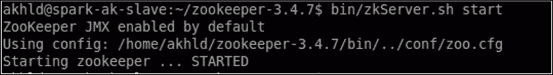

## 在本地模式下启动 Marathon

以下命令将启动 Marathon 本地模式：

```
$ ./bin/start --master local --zk zk://localhost:2181/marathon

```

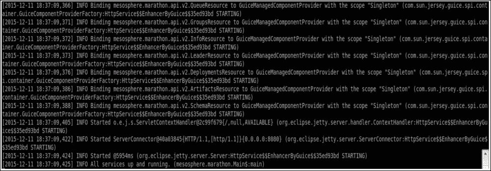

一旦 ZooKeeper 启动并运行，你可以通过浏览器访问服务器上的 `8080` 端口来查看 Marathon UI。

# 多节点 Marathon 集群设置

要设置此环境，需要配置一个高可用性的 Mesos 集群，详细内容将在第五章中解释，*Mesos 集群部署*。目前我们假设你已经配置好了高可用性的 Mesos 集群。接下来，我们将看看如何在集群的所有主机上安装 Marathon。

登录到所有 Mesos 主机，并输入以下命令来设置 Marathon。

在 *Debian*/*Ubuntu* 系统上，运行以下命令：

```
# Update the repositories
# Setup
$ sudo apt-key adv --keyserver hkp://keyserver.ubuntu.com:80 --recv E56151BF
$ DISTRO=$(lsb_release -is | tr '[:upper:]' '[:lower:]')
$ CODENAME=$(lsb_release -cs)

# Add the repository
$ echo "deb http://repos.mesosphere.com/${DISTRO} ${CODENAME} main" | \
 sudo tee /etc/apt/sources.list.d/mesosphere.list
$ sudo apt-get 
update
# Install Marathon
$ sudo apt-get -y install marathon

```

在 *RedHat*/*CentOS* 系统上，执行以下命令：

```
$ sudo yum -y install marathon

```

现在，你可以在浏览器中访问任何一个主机的 `8080` 端口，并查看 Marathon UI：

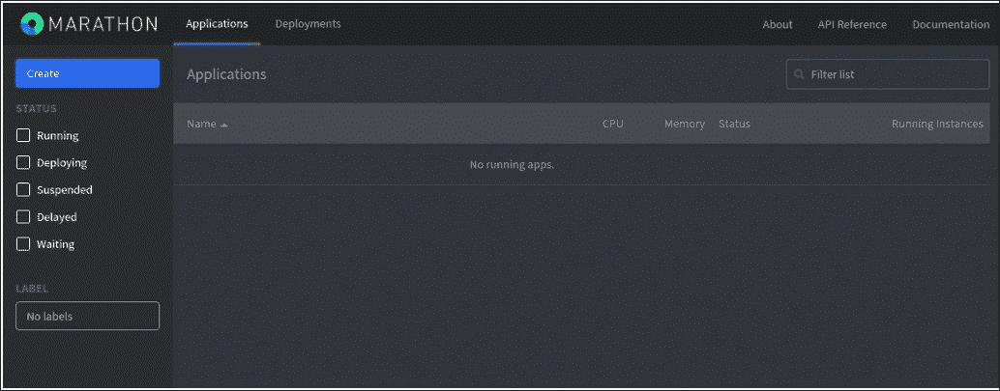

## 从 UI 启动测试应用程序

在 Mesos 中，应用程序通常是一个长时间运行的服务，可以扩展到多个实例。现在，我们将查看从用户界面启动测试应用程序的步骤：

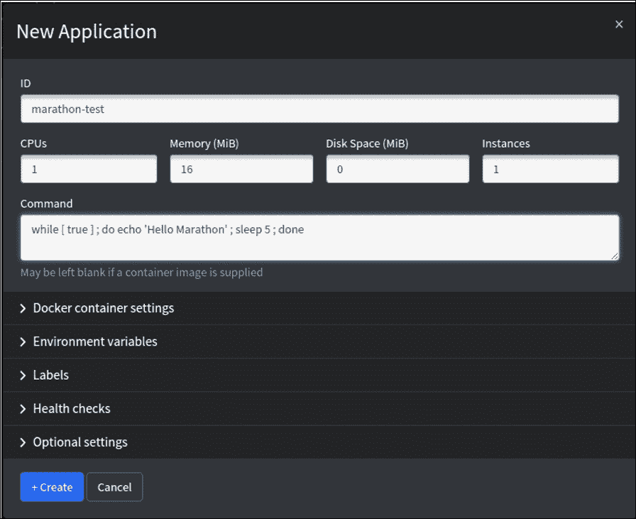

1.  点击左上角的 **+ 创建** 按钮。

1.  **ID** 可以用来标识任务。我们将其命名为 `marathon-test`。

1.  提供作业所需的 CPU 数量——比如说，`1`。

1.  内存以 MB 为单位，因此我们将分配 `16` MB（这也是默认值）。

1.  实例数可以为我们的测试应用程序设置为 1。

1.  在命令框下的文本框中编写以下 bash 脚本：

```
 while [ true ] ; do echo 'Hello Marathon' ; sleep 5 ; done

```

如果一切正确，你会首先看到 **marathon-test** 测试应用程序，状态为 **已部署**，最终会变为 **运行中**。

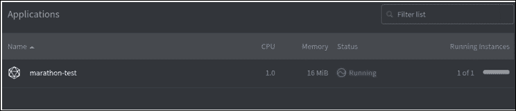

## 扩展应用程序

在创建时，我们给出了 `1` 作为实例数。我们可以通过点击 UI 上的“扩展应用程序”按钮来修改实例数量。应用程序将按指定的实例数量启动。


## 终止应用程序

现在我们可以通过点击应用程序列表中的应用程序名称，然后点击 **销毁** 按钮来终止我们的 marathon-test 应用程序。

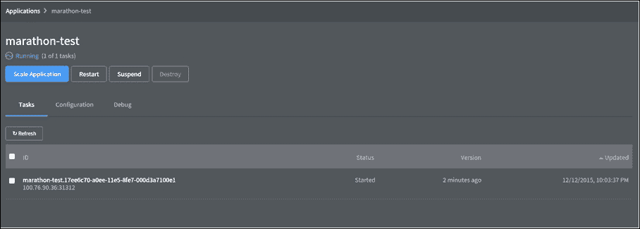

销毁应用程序是一个不可逆的过程，无法撤销。


# Chronos 作为集群调度器

可以将 Chronos 看作一个基于时间的作业调度器，例如典型 Unix 环境中的 **cron**。Chronos 是分布式的，完全容错，并且运行在 Apache Mesos 之上。

与 cron 类似，Chronos 默认执行 shell 脚本（结合 Linux 命令），并且支持 Mesos 执行器。

即使 Mesos 工作节点（实际执行作业的机器）上没有安装该系统，Chronos 也可以与像 Hadoop 或 Kafka 这样的系统进行交互。你可以使用 Chronos 在远程机器的后台启动服务或运行脚本。包装脚本可以包含异步回调，提醒 Chronos 作业状态，如是否完成或失败等。大多数情况下，人们使用 Chronos 来运行 Docker 化的应用程序。关于 *Docker 化应用程序* 的详细解释，请参见 第七章，*Mesos 容器化器*。

Chronos 附带一个 Web UI，你可以在其中查看作业状态、作业历史统计、作业配置以及重试信息。

## 安装 Chronos

登录到任何一台机器（比如说其中一台 Mesos 主机），然后输入以下命令来设置 Chronos。

在 *Debian*/*Ubuntu* 机器上，运行以下命令：

```
# Install chronos
$ sudo apt-get -y install chronos
# Start the chronos server
$ sudo service chronos start

```

在 *RedHat*/*CentOS* 机器上，执行以下代码：

```
# Install chronos
$ sudo yum -y install chronos
# Start the chronos server
$ sudo service chronos start

```

安装完成后，你可以将浏览器指向机器的 `4400` 端口来查看 Chronos 的 UI，如下所示：


## 调度一个新作业

按照这里提到的步骤调度新作业：

1.  点击 **+ 新建作业** 按钮，如前一截图所示。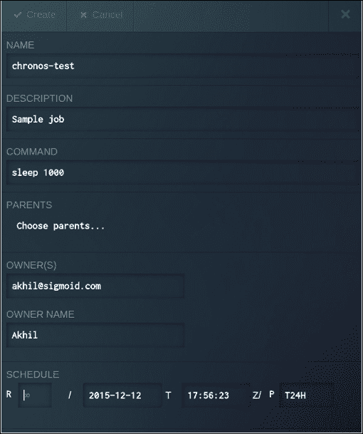

1.  现在，填写 **名称** 和 **描述** 字段。

1.  **COMMAND** 是将实际调度在执行器上运行的任务。为了简化起见，我们将仅运行 `sleep` 命令。

1.  在 **OWNER(S)** 字段中，我们可以填写名称和电子邮件地址，以便 Chronos 在任务失败时向其发送警报邮件。

1.  在 **SCHEDULE** 下，我们可以设置任务应该运行的调度频率。默认情况下，它是空的并且是无限的。我们可以将其设置为任何数字值。例如，当值设置为 0 时，重复次数仅为一次。

一旦任务创建成功，我们可以通过 UI 查看任务的摘要，如下图所示：

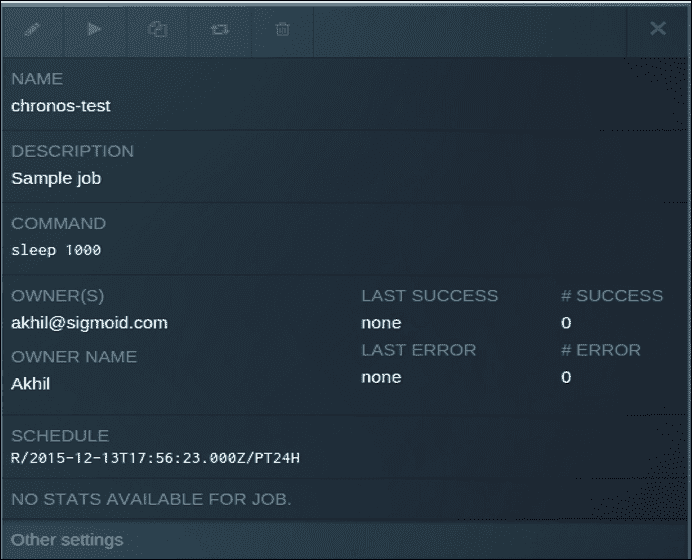

任务的状态也可以在以下截图中查看。在这种情况下，我们可以看到 **chronos-test** 任务处于 **运行中** 状态：


我们可以前往 Mesos UI（运行在 `5050` 端口上），实际查看由 Chronos 启动的任务。

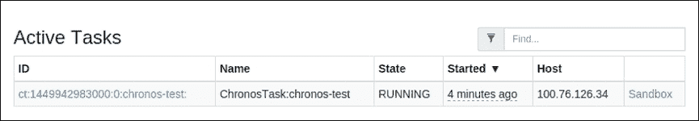

# Chronos 加 Marathon

Chronos 和 Marathon 的结合可以作为构建生产级分布式应用程序的基础。你已经知道 Chronos 可以在预定的时间间隔触发任务；cron 和 Marathon 让你的任务能够持续运行，例如在典型的 Linux 环境中的 `init` 或 `upstart`。如前所述，两个调度器都提供 REST 端点，允许用户管理任务。你可以使用这个端点来启动、管理和终止运行中的任务。接下来我们将看看这是如何实现的。

## Chronos REST API 端点

如前所述，您可以通过 HTTP 使用 REST JSON API 与 Chronos 进行通信。默认情况下，运行 Chronos 的节点会在 `8080` 端口监听 API 请求。本节将介绍如何使用 REST 端点执行以下任务：

1.  列出正在运行的任务

1.  手动启动任务

1.  添加一个调度任务

1.  删除任务

欲了解更多信息，请访问 [`mesos.github.io/chronos/docs/api.html`](http://mesos.github.io/chronos/docs/api.html)。

### 列出正在运行的任务

使用 `HTTP GET` 方法请求 `/scheduler/jobs` 将返回当前正在运行的任务列表，格式为 JSON。

这是一个示例：

```
$ curl -L -X GET localhost:8080/scheduler/jobs

```

响应中包含以下数据：

+   `successCount`

+   `errorCount`

+   `lastSuccess`

+   `lastError`

+   `executor`

+   `parents`

### 手动启动任务

要手动启动任务，请向 `/scheduler/job` 发送 `HTTP PUT` 请求，并在命令的末尾添加可选参数。

看一下以下示例：

```
$ curl -L -X PUT localhost:8080/scheduler/job/job_a?arguments=-debug

```

### 添加一个调度任务

你可以向 `/scheduler/iso8601` 发送 `HTTP POST` 请求，并附带 JSON 数据来调度任务。发送给 Chronos 的 JSON 数据必须包含以下字段：

+   名称

+   命令

+   schedule

+   任务的重复次数；

+   任务开始时间，采用 ISO 8601 格式；

+   标准 ISO 8601 日期时间格式

+   scheduleTimeZone

+   epsilon

+   拥有者

+   异步

请看以下示例：

```
$ curl -L -H 'Content-Type: application/json' -X POST -d '{ "schedule": "<some_value>", "name": "jab_a", "epsilon": "….", "command": "echo 'FOO' >> /tmp/job_a_OUT", "owner": "akhil@sigmoid.com", "async": false }' localhost:8080/scheduler/iso8601

```

### 删除一个作业

要删除作业，你可以在`/scheduler/job/<jobName>`上使用`HTTP DELETE`请求，其中`jobName`可以从正在运行的作业列表中获取。

这是一个示例：

```
$ curl -L -X DELETE localhost:8080/scheduler/job/job_a

```

### 删除作业的所有任务

要删除某个作业的所有任务，你可以在`/scheduler/task/kill/<jobName>`上使用`HTTP DELETE`请求。

请看以下示例：

```
$ curl -L -X DELETE localhost:8080/scheduler/task/kill/job_a

```

## Marathon REST API 端点

本节将介绍 Marathon 的 REST 端点。可以执行以下任务：

1.  列出正在运行的应用程序。

1.  添加一个应用程序。

1.  更改配置。

1.  删除一个应用程序。

### 列出正在运行的应用程序

你可以通过向`/v2/apps`端点发送`HTTP GET`请求，列出在 Marathon 上部署的正在运行的应用程序。该端点还支持一个过滤器，可以帮助你将列出内容限制到特定的应用程序。

以下是该端点所需的参数：

+   `cmd`：用于过滤包含给定命令的应用程序

+   `embed`：可以多次指定该参数，用于嵌入与提供的路径匹配的嵌套资源

这是一个示例：

```
$ curl -L -X GET "localhost:8080/v2/apps?cmd=sleep 60"

```

你可以查看以下类似的 JSON 格式响应：

```
{
  "apps": [
    {
      "id": "/product/us-east/service/myapp", 
      "cmd": "env && sleep 60", 
      "constraints": [
        [
          "hostname", 
          "UNIQUE", 
      ""
        ]
      ], 
      "container": null, 
      "cpus": 0.1, 
      "env": {
        "LD_LIBRARY_PATH": "/usr/local/lib/myLib"
      }, 
      "executor": "", 
      "instances": 3, 
      "mem": 5.0, 
      "ports": [
        15092, 
        14566
      ], 
      "tasksRunning": 1, 
      "tasksStaged": 0, 
      "uris": [
        "https://raw.github.com/Mesosphere/Marathon/master/README.md"
      ], 
      "version": "2014-03-01T23:42:20.938Z"
    }
  ]
}
```

### 添加一个应用程序

要从 REST 端点创建并启动一个应用程序，你可以使用`/v2/apps`端点并发送一个`HTTP POST`请求。该请求需要传递包含应用程序信息的 JSON 数据。以下是此调用所需的参数：

+   `id`：这是应用程序的名称

+   `cmd`：这是需要执行的命令

+   `args`：这是应用程序的可选参数

+   `cpus`：这是为应用程序分配的 CPU 核心数量

+   `mem`：这是为应用程序分配的内存大小

+   `ports`：这是为应用程序预留的端口

+   `instances`：这是部署应用程序的实例数量

以下示例展示了如何在 Marathon 中启动一个简单的 Python HTTP 服务器作为应用程序：

```
$ curl -L -H 'Content-Type: application/json' -X POST –d
 '{
  "args": null,
  "backoffFactor": 1.15,
  "backoffSeconds": 1,
  "maxLaunchDelaySeconds": 3600,
  "cmd": "env && python3 -m http.server $PORT0",
  "constraints": [
    [
      "hostname",
      "UNIQUE"
    ]
  ],
  "container": {
    "Docker": {
      "image": "python:3"
    },
    "type": "DOCKER",
    "volumes": []
  },
  "cpus": 0.25,
  "dependencies": [],
  "deployments": [
    {
      "id": "f44fd4fc-4330-4600-a68b-99c7bd33014a"
    }
  ],
  "disk": 0.0,
  "env": {},
  "executor": "",
  "healthChecks": [
    {
      "command": null,
      "gracePeriodSeconds": 3,
      "intervalSeconds": 10,
      "maxConsecutiveFailures": 3,
      "path": "/",
      "portIndex": 0,
      "protocol": "HTTP",
      "timeoutSeconds": 5
    }
  ],
  "id": "/my-app",
  "instances": 2,
  "mem": 50.0,
  "ports": [
    0
  ],
  "requirePorts": false,
  "storeUrls": [],
  "upgradeStrategy": {
    "minimumHealthCapacity": 0.5,
    "maximumOverCapacity": 0.5
  },
  "uris": [],
  "user": null,
  "version": "2014-08-18T22:36:41.451Z"
}
' localhost:8080/v2/apps
```

另外，注意如果给定的应用程序 ID 在 Marathon 中已经存在，将会抛出重复错误，并且应用程序根本不会启动。

### 更改应用程序的配置

你可以向`/v2/apps/<appId>`端点发送一个`HTTP PUT`请求，来更改给定应用程序的配置。`appId`值可以通过之前列出正在运行的应用程序的方法获取。一旦请求发送，当前运行的任务将会使用新的配置重启。

它接受`force`参数，布尔值，默认为 false。将其设置为 true 会覆盖当前的部署，如果应用程序的状态受到影响的话。

考虑以下示例：

```
$ curl -L -X PUT localhost:8080/v2/apps/my_app -d '{
  "cmd": "sleep 55",
  "constraints": [
    [
      "hostname",
      "UNIQUE",
      ""
    ]
  ],
  "cpus": "0.3",
  "instances": "2",
  "mem": "9",
  "ports": [
    9000
  ]
   }
   ' 
```

一旦更新成功，它将返回一个包含以下内容的 JSON 响应：

```
{
  "deploymentId": "6b2135a6-3326-4e44-9333-554eda6c3838",
  "version": "2015-12-16T12:37:50.462Z"
}
```

### 删除应用程序

你可以使用`HTTP DELETE`请求在`/v2/apps/<appId>`端点销毁应用程序及其相关数据。

看一下以下示例：

```
$ curl -X DELETE localhost:8080/v2/apps/my_app

```

# Apache Aurora 介绍

Apache Aurora 是一个强大的 Mesos 框架，适用于长期运行的服务、定时任务和临时任务。它最初在 Twitter 设计，后来根据 Apache 许可证开源。你可以使用 Aurora 将 Mesos 集群转变为私人云。与 Marathon 不同，Aurora 负责在共享资源池中长时间运行任务。如果池中的任何机器出现故障，Aurora 可以智能地将任务重新调度到其他健康的机器上。

如果你尝试构建一个具有特定调度需求的应用程序，或者如果任务本身就是一个调度器，那么 Aurora 将不适用。

管理长期运行的应用程序是 Aurora 的关键功能之一。除此之外，Aurora 可以为你的任务提供粗粒度（即固定）的资源，以确保任务始终具有指定数量的资源。它还支持多个用户，且配置使用 **DSL**（**领域特定语言**）模板化，以避免配置中的冗余。

## 安装 Aurora

Aurora 任务可以通过 Aurora Web UI 和 Aurora 命令行工具进行交互。要安装 Aurora，需要安装 `vagrant`。你可以使用以下命令安装 `vagrant`：

```
$ sudo apt-get install vagrant

```

登录到集群中的任何机器，使用以下命令克隆 Aurora 仓库：

```
$ git clone git://git.apache.org/aurora.git

```

将工作目录更改为 Aurora，如下所示：

```
$ cd aurora

```

然后，输入以下命令在此机器上安装 Aurora：

```
$ vagrant up

```

`vagrant` 命令将使用与 Aurora 分发版一起提供的配置，在虚拟机上安装并启动 Aurora 服务。它将：

+   下载相应的 Linux 虚拟机镜像

+   配置并启动虚拟机

+   在虚拟机上安装 Mesos 和 ZooKeeper 以及构建工具

+   在虚拟机上编译并构建 Aurora 源代码

+   在虚拟机上启动 Aurora 服务

这个过程可能需要几分钟才能完成。如果命令失败并提示机器上没有安装 VirtualBox，可以使用以下命令进行安装：

```
$ sudo apt-get install virtualbox

```

如果一切顺利，你将在终端看到以下输出：

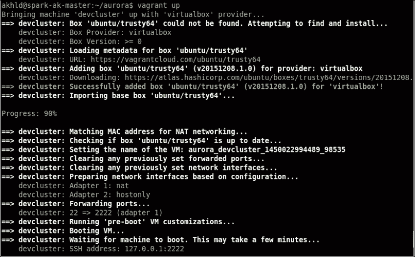

# Singularity 介绍

Singularity 最初在 HubSpot 设计，后来根据 Apache 许可证开源。Singularity 作为一个 API 和 Web 应用程序，可以用于启动和调度长期运行的 Mesos 进程、定时任务和任务。可以将 Singularity 及其组件视为一个**PaaS**（**平台即服务**）提供给最终用户。初学者可以使用 Singularity 在 Mesos 上部署任务，而无需详细了解 Mesos。

Singularity 利用 Apache Mesos 的容错性、可扩展性和资源分配等功能，并作为 Mesos 框架的任务调度器运行。

## 安装 Singularity

在安装 Singularity 之前，确保你的机器上已经安装了 Docker。如果还没有安装，你可以通过访问 [`docs.docker.com`](https://docs.docker.com) 上的官方文档来安装。

第一步是克隆 Singularity 仓库，操作如下：

```
$ git clone https://github.com/HubSpot/Singularity

```

现在，将工作目录切换到 Singularity，如下所示：

```
$ cd Singularity

```

一旦成功安装了 Docker 和 Docker Compose，你可以使用 Docker Compose 的 `pull` 和 `up` 命令来尝试 Singularity。这些命令将为你在容器中设置以下内容：

+   Mesos 主节点和从节点

+   ZooKeeper

+   奇点

+   Baragon 服务和代理

如果你希望在没有 Docker 的情况下安装 Singularity，以下步骤可以帮助你完成安装：

```
# Compile the source code
$ mvn clean package

```

完成后，你可以看到 Singularity jars 被创建在 `SingularityService/target` 目录下。

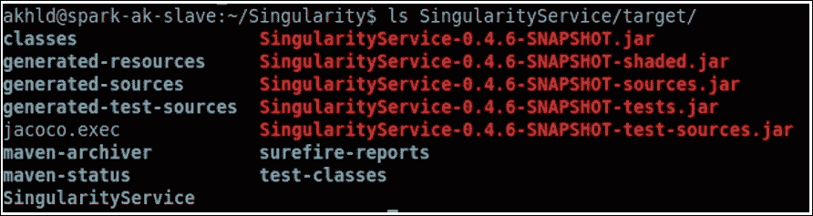

我们将使用 **SingularityService-0.4.6-SNAPSHOT-shaded.jar** 来运行 Singularity。

## 创建 Singularity 配置文件

Singularity 配置保存在 YAML 文件中。这里将解释一个示例的 YAML 配置文件。

端口 `7099` 用于运行 `SingulartiyService`，日志将保存在 `/var/log/singularity-access.log` 中。请查看以下代码：

```
server:
  type: simple
  applicationContextPath: /singularity
  connector:
    type: http
    port: 7099
  requestLog:
    appenders:
      type: file
      currentLogFilename: /var/log/singularity-access.log
      archivedLogFilenamePattern: /var/log/singularity-access-%d.log.gz

#Mesos configuration, put the content from /etc/Mesos/zk as Mesos master
mesos:
master: zk://100.76.90.36:2181,100.76.126.34:2181,100.72.150.2:2181/Mesos
defaultCpus: 1 # number of core that will be used by the job
defaultMemory: 128 # default memory of the job, being 128MB
frameworkName: Singularity
frameworkId: Singularity
frameworkFailoverTimeout: 1000000

Zookeeper: # quorum should be a host:port separated by comma
  quorum: 100.76.90.36:2181,100.76.126.34:2181,100.72.150.2:2181
  zkNamespace: singularity
  sessionTimeoutMillis: 60000
  connectTimeoutMillis: 5000
  retryBaseSleepTimeMilliseconds: 1000
  retryMaxTries: 3

logging:
  loggers:
    "com.hubspot.singularity" : TRACE

enableCorsFilter: true
sandboxDefaultsToTaskId: false  # enable if using SingularityExecutor

ui:
  title: Singularity (local)
  baseUrl: http://localhost:7099/singularity
```

将上述配置保存为 `singularity_config.yaml`，并使用以下命令启动 Singularity：

```
java -jar SingularityService/target/SingularityService-*-shaded.jar server singularity_config.yaml

```

如果一切顺利，你将在 Mesos UI 的框架标签下看到 Singularity 框架，如下图所示：

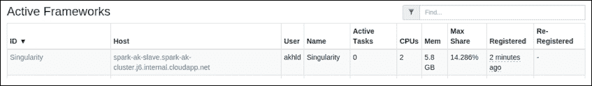

你可以将浏览器指向以下 URL 来访问 Singularity 的 UI：`http://ServerIPAddress:7099/singularity/`。

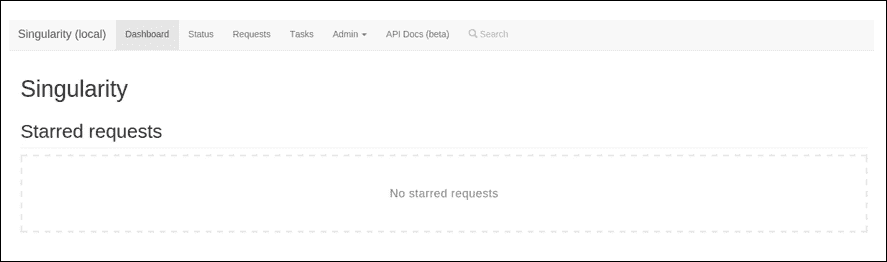

# 使用 Marathoner 的服务发现

现代分布式应用程序需要一种相互通信的方式，这意味着当它们在同一网络上时，一个应用程序应该知道另一个应用程序的存在。这就是服务发现。在本节中，我们将查看在 Marathon 上运行的 Web 服务的服务发现。你可以采用这种方法来处理大多数在 Marathon 上运行的无状态应用程序。

我们将结合流行的 HAProxy TCP/HTTP 负载均衡器和 Marathon 的 REST API 脚本（在之前的主题中已覆盖），重新生成 HAProxy 配置文件，以实现 Marathon 应用程序的服务发现。当任务在某个 Mesos 从节点上启动时，它们会配置为将端口绑定到默认范围 31,000-32,000 内的一个任意端口。

服务发现使得在 Marathon 上运行的应用程序可以通过它们配置的 Marathon 应用程序端口与其他应用程序进行通信。例如，你可以考虑一个运行在端口 80 上的 Python Web 应用程序，它可以通过连接到 `localhost:8080` 来与其在端口 `8080` 上运行的 Java 后端进行通信。

HAProxy 可以将它收到的请求路由到实际运行服务实例的端口和主机。如果由于某种原因，它未能连接到给定的主机和端口，它将尝试连接到下一个配置运行该服务的实例。

我们将使用 HAProxy-Marathon-bridge shell 脚本，该脚本是 Marathon 提供的，用于连接到 Marathon 并检索主机名、运行中的应用程序绑定的端口以及配置的应用程序端口。该脚本每 60 秒通过 cron 调度运行一次。该脚本基本上检查它在上次运行中生成的配置与当前配置是否有所不同，如果检测到变化，则重新加载新的配置到 HAProxy 中。请注意，我们不需要重新启动 HAProxy。

以下是两个服务 SVC1 和 SVC2 在集群中运行的图示，它们分别配置了在端口 1111 和 2222 上运行的应用程序。Mesos 分配的任务端口分别是 `31100` 和 `31200`。请注意，由 HAProxy 负责在用户配置的应用程序端口和 Mesos 分配的任务端口之间路由请求。


例如，如果从从节点 2 上的 SVC2 尝试通过 `localhost:2222` 连接到 SVC1，HAProxy 将把请求路由到配置的 SVC1 实例——即运行在从节点 1 上的实例。

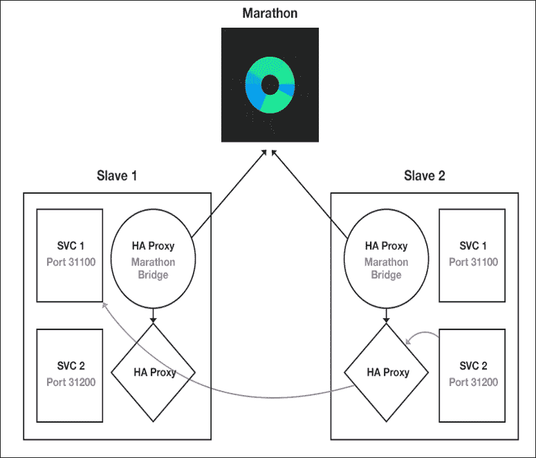

如果从节点 1 出现故障，则对 `localhost:2222` 的请求将被路由到从节点 2。

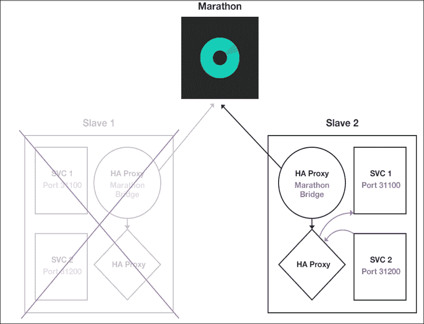

# 使用 Consul 进行服务发现

Mesos-consul 用于注册和注销作为 Mesos 任务运行的服务。

例如，如果你有一个名为 `myapp` 的 Mesos 任务，那么该程序将会在 Consul 中注册该应用程序，并将其 DNS 暴露为 `myapp.service.consul`。Consul 还通过 `leader.Mesos.service.consul` DNS 进行 Mesos 主节点发现，该 DNS 指向当前活动的主节点。

这与其他服务发现软件有何不同？

Mesos-dns 是一个类似于 Consul 的项目。在 Mesos-dns 中，它轮询 Mesos 以获取任务信息，而在 Consul 中，信息不是通过内置的 DNS 服务器暴露，而是通过 Consul 服务发现填充这些信息。然后，这些服务通过 DNS 和其 REST 端点由 Consul 暴露。

## 运行 Consul

如果你的 ZooKeeper 和 Marathon 服务没有在 Consul 中注册，你需要更改环境变量的值。你可以将 Consul 容器化，并通过 Marathon 运行它。

Consul 可以以以下方式运行：

```
curl -X POST -d@Mesos-consul.json -H "Content-Type: application/json" http://Marathon.service.consul:8080/v2/apps'

```

上述代码是一个 `HTTP POST` 请求，向 Consul API 端点发送以下 JSON 数据，位于 `Mesos-consul.json` 文件中：

```
{
  "args": [
    "--zk=zk://Zookeeper.service.consul:2181/Mesos"
  ],  
  "container": {
    "type": "DOCKER",
    "Docker": {
      "network": "BRIDGE",
      "image": "{{ Mesos_consul_image }}:{{ Mesos_consul_image_tag }}"
    }   
  },  
  "id": "Mesos-consul",
  "instances": 1,
  "cpus": 0.1,
  "mem": 256
}
```

以下表格列出了命令行工具 Mesos-consul 支持的选项：

| 选项 | 描述 |
| --- | --- |
| `version` | 这个命令会打印出 Mesos-consul 的版本。 |
| `refresh` | 这指的是 Mesos 任务刷新之间的时间间隔。 |
| `Mesos-ip-order` | 这是一个以逗号分隔的列表，控制 [github.com/CiscoCloud/Mesos-consul](http://github.com/CiscoCloud/Mesos-consul) 查找任务 IP 地址的顺序。有效选项为 `netinfo`、`Mesos`、`Docker` 和 `host`（默认值为 `netinfo,Mesos,host`）。 |
| `healthcheck` | 这个选项用于启用 HTTP 端点的健康检查。当启用此标志时，它会在 `127.0.0.1:24476` 提供健康状态。 |
| `healthcheck-ip` | 这是健康检查服务接口的 IP（默认值为 `127.0.0.1`）。 |
| `healthcheck-port` | 这是健康检查服务的端口（默认值为 `24476`）。 |
| `consul-auth` | 这是用于身份验证的用户名和密码（可选），由冒号分隔。 |
| `consul-ssl` | 这会在与注册表通信时使用 HTTPS。 |
| `consul-ssl-verify` | 在通过 SSL 连接时验证证书。 |
| `consul-ssl-cert` | 提供 SSL 证书的路径，可用于身份验证注册表服务器。 |
| `consul-ssl-cacert` | 这是 CA 证书文件的路径，包含一个或多个 CA 证书，可用于验证注册表服务器证书。 |
| `consul-token` | 这是用于注册表 ACL 的令牌。 |
| `heartbeats-before-remove` | 这是在任务从 Consul 中移除之前，注册失败的次数（默认值为 `1`）。 |
| `zk*` | 这是 ZooKeeper 中 Mesos 路径的位置，默认值为 `zk://127.0.0.1:2181/Mesos`。 |

# 使用 HAProxy 进行负载均衡

HAProxy-Marathon-bridge 脚本随 Marathon 安装一起提供。你也可以使用 Marathon-lb 来实现相同的功能。这两个工具都会通过查看 Marathon 的 REST API 中正在运行的任务，来为 HAProxy 创建一个配置文件和一个轻量级的 TCP/HTTP 代理。

HAProxy-Marathon-bridge 是一个简单的脚本，提供最小的功能集，且对新手用户更易理解。后者，Marathon-lb，支持高级功能，如 SSL 卸载、基于 VHost 的负载均衡和粘性连接。

## 创建 HAProxy 和 Marathon 之间的桥接

首先，你需要从运行中的 Marathon 实例创建 HAProxy 配置，该实例默认运行在机器的`8080`端口。你可以通过以下语法使用 HAProxy-Marathon-bridge 脚本来实现这一点：

```
$ ./bin/haproxy-Marathon-bridge localhost:8080 > /etc/haproxy/haproxy.cfg

```

请注意，这里我们指定了`localhost:8080`，因为我们在同一台机器上运行了 Marathon 实例和 HAProxy。

一旦生成了 HAProxy 配置，你可以通过运行以下命令来简单地重新加载 HAProxy，而不会中断现有的连接：

```
$ haproxy -f haproxy.cfg -p haproxy.pid -sf $(cat haproxy.pid)

```

你可以使用典型的 cron 作业自动化配置生成和重新加载过程。如果在重新加载过程中由于某种原因，某个节点发生故障，HAProxy 的健康检查将检测到并停止向该节点发送进一步的流量。

你无需创建触发器来重新加载 HAProxy 配置。HAProxy-Marathon-bridge 脚本已经为你完成了这项工作。它包含 HAProxy 和一个每分钟触发的 cron 作业，用来从 Marathon 服务器拉取配置，并在检测到与上一个版本的变化时刷新 HAProxy。

你可以使用以下命令来实现：

```
$ ./bin/haproxy-Marathon-bridge install_haproxy_system localhost:8080

```

它将在`/etc/haproxy-Marathon-bridge/Marathons`文件中为 Marathon 每一行添加 ping 命令，并将脚本安装在`/usr/local/bin/haproxy-Marathon-bridge`。你可以在`/etc/cron.d/haproxy-Marathon-bridge`目录下找到安装的 cron 作业，该作业将在根用户下触发。

# Bamboo - 自动为 Mesos 加 Marathon 配置 HAProxy

Bamboo 作为 Web 守护进程运行，并自动为部署在 Mesos 和 Marathon 上的 Web 服务配置 HAProxy。

Bamboo 包含以下内容：

+   一个 Web UI，用于为每个 Marathon 应用程序配置 HAProxy **访问控制限制**（**ACL**）规则。

+   一个 REST 端点来实现相同功能

+   基于你的模板的预配置 HAProxy 配置文件，你可以自定义自己的模板来启用 SSL 并设置 HAProxy 统计信息接口，或配置负载均衡策略。

+   如果 Marathon 应用配置了健康检查，则会有一个健康检查端点。

+   无状态守护进程，支持可扩展性和水平复制

+   无额外依赖（因为它是用 Golang 开发的）

+   与 StatsD 集成，监控配置重新加载事件

Bamboo 可以在每个 Mesos 从节点上与 HAProxy 一起部署。由于 Bamboo 主要用于部署在 Mesos 上的 Web 服务，因此服务发现就像连接到你为其分配了 ACL 规则的本地主机或域名一样简单。然而，你也可以将 HAProxy 和 Bamboo 部署在不同的机器上，这意味着你需要对 HAProxy 集群进行负载均衡。

以下截图显示了 Bamboo 和 HAProxy 通过 Marathon 与 Mesos 集群的交互：

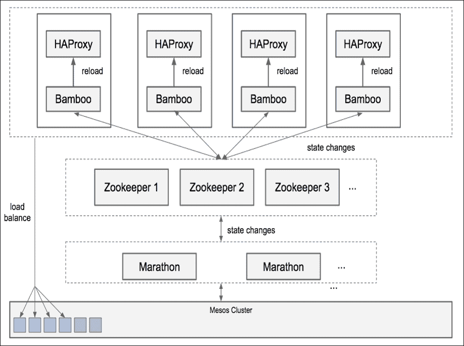

你可以使用以下命令安装 Bamboo：

```
# Clone the github repository
$ git clone https://github.com/QubitProducts/bamboo
# Change the working directory
$ cd bamboo
# Install, (make sure you have installed go first)
$ go build bamboo.go; ./builder/build.sh

```

安装完成后，打开浏览器并访问你安装了 Bamboo 的任意一台机器上的端口 `8000`，你将看到如下截图所示的 Web UI：

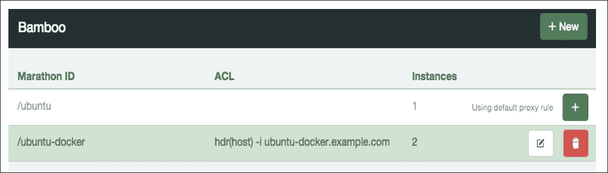

你可以通过点击 Marathon 应用程序右侧的编辑图标来配置 ACLs。

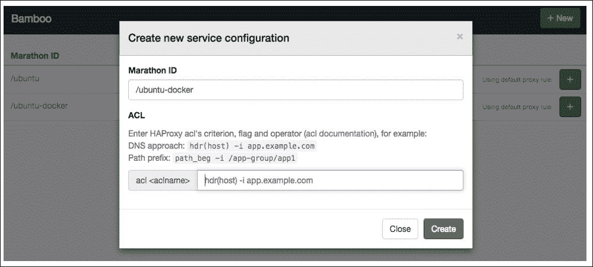

Bamboo 命令行接受一个 `--config` 选项，用于指定 JSON 应用配置文件的位置。你可以在 config 目录下找到示例配置文件模板；`config/production.example.json` 和 `config/haproxy_template.cfg` 就是其中的两个。现在，来看一下下面的代码：

```
{
  // This is where you configure the Marathon instance
  "Marathon": {
    // Since we are running web applications, give the host:port to the applications
    "Endpoint":"http://Marathon1:8080,http://Marathon2:8080,http://Marathon3:8080",
    // Use the Marathon HTTP event streaming feature
    "UseEventStream": true
  },

  "Bamboo": {
    // Bamboo's HTTP address can be accessed by Marathon
    // Used for Marathon HTTP callback and each Bamboo instance
    // must provide a unique Endpoint that is directly addressable by Marathon
    // (e.g., every server's IP address)
    "Endpoint": "http://localhost:8000",

    // Proxy setting information is stored in Zookeeper// This path is created by Bamboo, if it does not already exist

    "Zookeeper": {
      // Make sure that the same setting is used while running on the same ZK cluster
      "Host": "zk01.example.com:2812,zk02.example.com:2812",
      "Path": "/Marathon-haproxy/state",
      "ReportingDelay": 5
    }
  }

  // Make sure you are using absolute path on production
  "HAProxy": {
    "TemplatePath": "/var/bamboo/haproxy_template.cfg",
    "OutputPath": "/etc/haproxy/haproxy.cfg",
    "ReloadCommand": "haproxy -f /etc/haproxy/haproxy.cfg-p /var/run/haproxy.pid -D -sf $(cat /var/run/haproxy.pid)",
    // A command that will validate the config before you run reload command.// '{{.}}' will be expanded to a temporary path that contains the config contents
    "ReloadValidationCommand": "haproxy -c -f {{.}}",
    // A command that will always be run after ReloadCommand, even if reload fails
    "ReloadCleanupCommand": "exit 0"
  },

  // Enable or disable StatsD event tracking
  "StatsD": {
    "Enabled": false,
    // StatsD or Graphite server host
    "Host": "localhost:8125",
    // StatsD namespace prefix -
    // Label each node if you have multiple Bamboo instances
    // by bamboo-server.production.n1.
    "Prefix": "bamboo-server.production."
  }
}
```

Bamboo 将以下环境变量映射到相应的 Bamboo 配置。你可以在 `production.json` 文件中使用这些配置：

| 环境变量 | 对应的配置项 |
| --- | --- |
| `MARATHON_ENDPOINT` | Marathon.Endpoint |
| `MARATHON_USER` | Marathon.User |
| `MARATHON_PASSWORD` | Marathon.Password |
| `BAMBOO_ENDPOINT` | Bamboo.Endpoint |
| `BAMBOO_ZK_HOST` | Bamboo.Zookeeper.Host |
| `BAMBOO_ZK_PATH` | Bamboo.Zookeeper.Path |
| `HAPROXY_TEMPLATE_PATH` | HAProxy.TemplatePath |
| `HAPROXY_OUTPUT_PATH` | HAProxy.OutputPath |
| `HAPROXY_RELOAD_CMD` | HAProxy.ReloadCommand |
| `BAMBOO_DOCKER_AUTO_HOST` | 当 Bamboo 容器启动时，这将把 `BAMBOO_ENDPOINT` 设置为 `$HOST`，并且可以是任何值 |
| `STATSD_ENABLED` | StatsD.Enabled |
| `STATSD_PREFIX` | StatsD.Prefix |
| `STATSD_HOST` | StatsD.Host |

# Netflix Fenzo 介绍

Netflix 最近开源了他们为 Apache Mesos 框架编写的调度器库，该库使用 Java 编写，支持调度优化和集群自动扩展。在写书时，Fenzo 已经开源，并且可以在官方的 Netflix OSS 套件仓库中找到，网址为：[`github.com/Netflix/Fenzo`](https://github.com/Netflix/Fenzo)

开发像 Fenzo 这样的框架基本上有两个动机。与前面讨论的其他调度器和框架不同，构建 Fenzo 的原因是为了调度优化和根据使用情况自动扩展集群。

当你的集群处理的数据量时常变化时，预配置集群以应对峰值使用看起来很浪费，因为大部分时间资源会处于闲置状态。这正是根据负载自动扩展应用程序的主要原因——即，在集群资源达到峰值时提供更多机器，并在机器闲置时关闭这些机器。

扩展集群是一个较为简单的任务。您可以使用监控工具来观察资源利用率，当它超过阈值时，可以继续增加集群资源。另一方面，在缩减集群时，您需要识别您将要终止的机器上是否有长期运行的任务，以及终止这些机器是否会影响正在运行的任务。

目前，Fenzo 中的自动扩展基于以下两种策略：

+   阈值

+   资源短缺分析

在基于阈值的自动扩展中，用户可以根据主机组指定规则，如 EC2 自动扩展、GCE 自动扩展等。这些可以视为为计算密集型、网络密集型及其他工作负载创建主机组。这些规则使得新的任务可以迅速启动在预配置的空闲主机上。

在资源短缺分析的情况下，它首先计算完成待处理工作负载所需的主机数量。也可以将其视为一种预测性自动扩展系统，可以分析工作负载并启动新的主机以满足待处理的工作负载。这样的系统的一个例子是 Netflix 网站的 Scryer。

以下是一个图示，展示了 Fenzo 如何被 Apache Mesos 框架使用。Fenzo 本身包含一个任务调度器，提供调度核心，但并不直接与 Mesos 交互。该框架与 Mesos 交互，以获取新的资源报价并拉取任务状态更新。

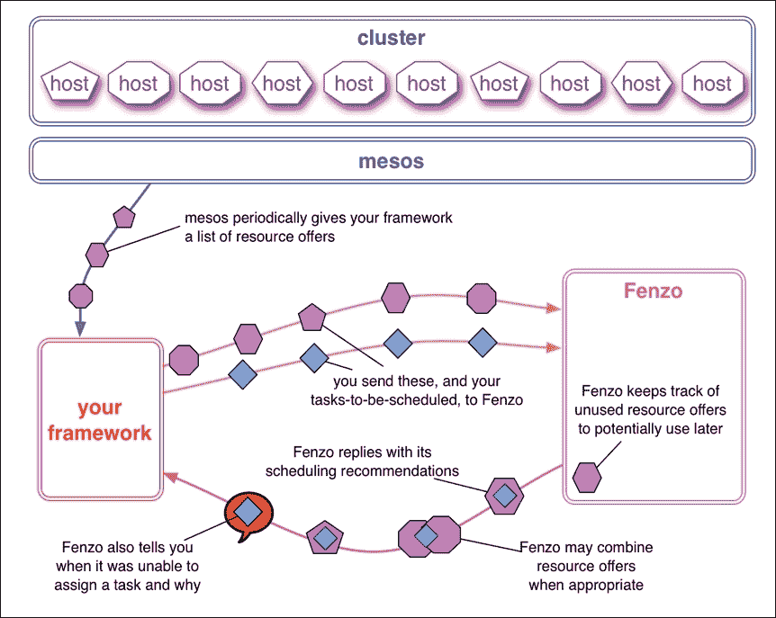

# PaaSTA 简介

Yelp 的 PaaSTA（平台即服务）分布式系统具有高可用性，用于构建、部署和运行使用容器（如 Docker 和 Apache Mesos）的服务。PaaSTA 由 Yelp 设计和开发，并且最近已开源。您可以通过以下网址查看开源仓库：[`github.com/yelp/paasta`](https://github.com/yelp/paasta)

这是一个供开发人员指定如何从 Git 仓库构建、部署、路由和监控代码的工具集。Yelp 已使用 PaaSTA 超过一年，以支持其生产级别的服务。如果您有严格的生产环境，例如 Yelp，要求许多小型微服务，并且在推出新代码时应无缝进行且不打扰生产系统，PaaSTA 最为适用。PaaSTA 帮助自动化整个过程。

它包括以下现有的开源组件：

+   **Docker**：用于容器化代码

+   **Apache Mesos**：用于执行和调度

+   **Marathon**：用于管理长期运行的应用程序

+   **Chronos**：用于调度目的

+   **SmartStack**：用于服务发现和注册

+   **Sensu**：用于监控和警报

+   **Jenkins**：用于持续构建和部署（这是可选的）

将所有这些组件集中在一起的原因之一是可重用性。你可以重用这些组件中的任何一个来解决分布式环境中的不同问题。

# 不同调度/管理框架的比较分析

本节将简要比较和介绍我们在本章中讨论的不同调度框架及其应用场景。

Marathon 是一个构建在 Mesos 上的 PaaS，确保即使集群中的部分机器出现故障，作业仍然能够永远运行。它可以无缝处理硬件和软件故障，确保应用程序始终在运行。这类框架在生产环境中非常有用，特别是当你的应用程序需要 24/7 全天候运行并始终可用时——例如，托管网站的 Web 服务器。在这种情况下，你可以将其作为 Marathon 应用程序进行部署，后者会处理所有这些方面。

Chronos 可以被视为典型 Linux cron 作业的分布式容错替代品，cron 作业通常用于启动定时任务、定期备份、检查系统健康状况等。Chronos 和 Marathon 都提供了 Web UI 和 REST 端点来管理作业。我们可以围绕这些工具编写包装脚本，自动化应用程序部署和作业调度，而不仅仅依赖 Web UI。

Aurora 和 Marathon 本质上非常相似，它们都是服务调度器。你所需要做的就是告诉 Aurora 或 Marathon 如何部署应用程序，它们会保持应用程序持续运行，不会出现故障。另一方面，Aurora 对于初学者来说有点难以安装和使用。与 Marathon 不同，Aurora 并不正式支持 REST 端点，但很快会推出。在此之前，Aurora 通过暴露 Thrift API 来进行通信，这意味着你需要在服务器上额外安装 Thrift 库。

Apache Aurora 旨在处理大规模的基础设施，如数据中心。一个典型的例子是 Twitter 上运行的集群，这些集群由成千上万的机器组成，成百上千的工程师用来进行开发和生产。

# 总结

在本章中，我们深入探讨了一些 Mesos 的重要框架，这些框架使得作业调度和负载均衡变得更加容易和高效。我们介绍了如 Marathon 和 Chronos 等框架，它们的 REST 端点，以及其他一些工具，如 HAProxy、Consul、Marathoner、Bamboo、Fenzo 和 PaaSTA。

在下一章中，我们将讨论系统管理员和 DevOps 专业人员如何使用 Ansible、Chef、Puppet、Salt、Terraform 和 CloudFormation 等标准工具来部署 Mesos 集群，并利用 Nagios 和 Satellite 进行监控。
