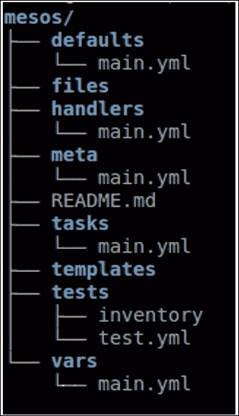
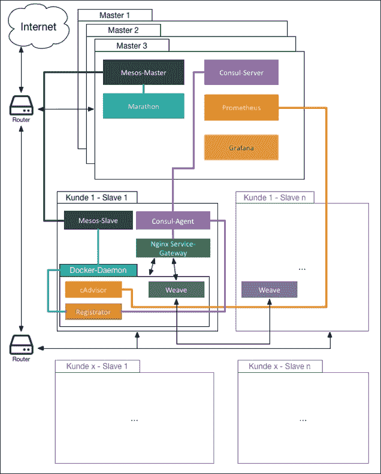
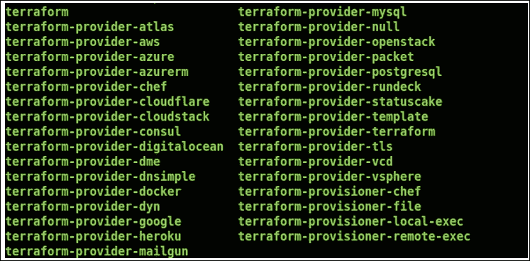
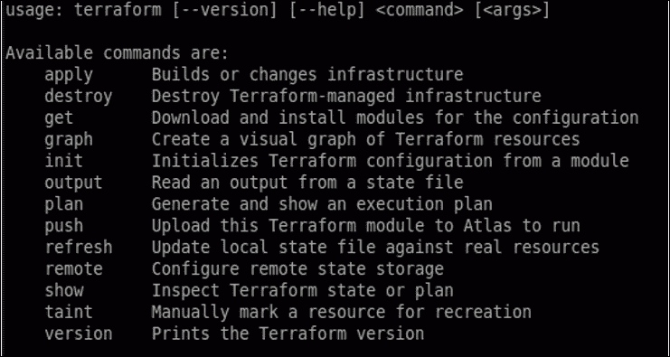
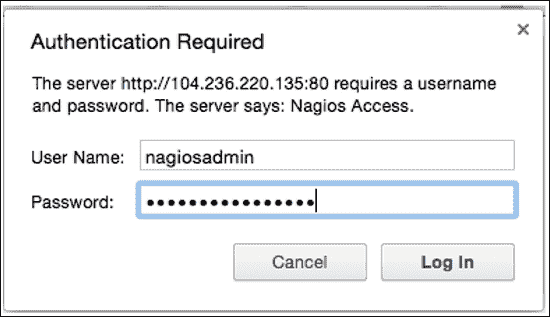
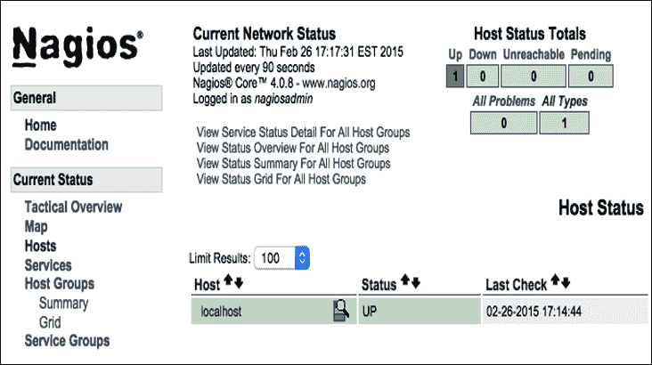

# 第五章：Mesos 集群部署

本章讲解了如何使用系统管理员和 DevOps 工程师常用的标准部署和配置管理工具，轻松地设置和监控 Mesos 集群。我们将解释如何通过 Ansible、Puppet、SaltStack、Chef、Terraform 或 Cloudformation 设置 Mesos 集群的步骤，并介绍如何使用 Playa Mesos 设置测试环境。我们还会讨论一些标准监控工具，例如 Nagios 和 Satellite，可以用来监控集群。我们还将讨论在部署 Mesos 集群时遇到的一些常见问题以及相应的解决方法。

本章将涵盖以下主题：

+   使用以下方法部署和配置 Mesos 集群：

    +   Ansible

    +   Puppet

    +   SaltStack

    +   Chef

    +   Terraform

    +   Cloudformation

+   使用 Playa Mesos 创建测试环境

+   常见部署问题及解决方案

+   使用以下工具监控 Mesos 集群：

    +   Nagios

    +   Satellite

# 使用 Ansible 部署和配置 Mesos 集群

Ansible 是一种流行的基础设施自动化工具，当前广泛应用于系统管理员中，并且最近被 Red Hat 收购。节点通过**安全外壳**（**SSH**）进行管理，只需要 Python 支持。Ansible 已开源了许多剧本，包括我们将在本节中讨论的 `ansible-mesos` 剧本。

`ansible-mesos` 剧本可以用于安装和配置 Mesos 集群，并支持自定义的主节点和从节点设置选项。目前，它支持基于 Ubuntu 和 CentOS/Red Hat 操作系统的机器。`ansible-mesos` 剧本还支持设置特定的从节点执行器，因此可以与原生 Docker 支持一起运行。

## 安装 Ansible

安装 Ansible 只需要在单台机器上进行。它不需要数据库，也不需要持续运行守护进程。它通过 SSH 来管理集群，并要求机器上安装 Python（版本 2.6 或 2.7）。你甚至可以在笔记本电脑或个人计算机上安装 Ansible，远程管理其他机器。安装了 Ansible 的机器被称为**控制机器**。在编写本书时，Windows 机器尚不受支持。受控制的机器称为**受管节点**，需要控制机器的 SSH 访问权限，并且上面也需要安装 Python（版本 2.4 或更高）。

## 安装控制机器

我们可以在没有 root 权限的情况下运行 Ansible，因为它不需要安装任何额外的软件或数据库服务器。执行以下代码：

```
# Install python pip
$ sudo easy_install pip

# Install the following python modules for ansible
$ sudo pip install paramiko PyYAML Jinja2 httplib2 six

# Clone the repository
$ git clone git://github.com/ansible/ansible.git --recursive

# Change the directory
$ cd ansible

# Installation
$ source ./hacking/env-setup

```

如果一切顺利，我们可以在终端中看到以下输出，表示安装成功。之后，我们将能够在终端中使用 Ansible 命令。


默认情况下，Ansible 使用`/etc/ansible/hosts`中的清单文件，该文件采用类似 INI 格式，可能如下所示：

```
mail.xyz.com

[webservers]
foo.xyz.com
bar.xyz.com

[dbservers]
one.xyz.com
two.xyz.com
three.xyz.com
```

这里，组名用括号表示，可用于对将被管理的系统进行分类。

我们还可以使用命令行选项`-i`，将其指向不同的文件，而不是`/etc/ansible/hosts`中找到的文件。

## 创建 ansible-mesos 设置

Ansible 执行由角色组成的剧本，针对的是如之前在 hosts 文件中描述的，按组组织的一组主机。更多详情，请访问[`frankhinek.com/create-ansible-playbook-on-github-to-build-mesos-clusters/`](http://frankhinek.com/create-ansible-playbook-on-github-to-build-mesos-clusters/)。

首先，让我们通过以下方式创建一个指向 Mesos 主节点和从节点的 hosts 文件：

```
$ cat hosts
[mesos_masters]
ec2-….compute-1.amazonaws.com zoo_id=1 ec2-….compute-1.amazonaws.com zoo_id=2
ec2-….compute-1.amazonaws.com zoo_id=3

[mesos_workers]
ec2-….compute-1.amazonaws.com
ec2-….compute-1.amazonaws.com 
```

在这里，我们创建了两个组，分别命名为`mesos_masters`和`mesos_workers`，并列出了主节点和从节点的 IP 地址。对于`mesos_masters`组，我们还需要指定 ZooKeeper ID，因为集群将以高可用性运行。

在接下来的步骤中，我们将看看如何使用 Ansible 在 hosts 文件中列出的机器上部署 Mesos：

1.  创建一个`site.yml`文件，内容如下：

    ```
    --
    # This playbook deploys the entire Mesos cluster infrastructure.
    # RUN: ansible-playbook --ask-sudo-pass -i hosts site.yml

    - name: deploy and configure the mesos masters
      hosts: mesos_masters
      sudo: True

      roles:
        - {role: mesos, mesos_install_mode: "master", tags: ["mesos-master"]}

    - name: deploy and configure the mesos slaves
      hosts: mesos_workers
      sudo: True

      roles:
        - {role: mesos, mesos_install_mode: "slave", tags: ["mesos-slave"]}
    ```

1.  现在，我们可以创建一个适用于集群中所有主机的组变量文件，内容如下：

    ```
    $ mkdir group_vars
    $ vim all

    ```

1.  接下来，我们将在所有文件中放入以下内容：

    ```
    ---
    # Variables here are applicable to all host groups

    mesos_version: 0.20.0-1.0.ubuntu1404
    mesos_local_address: "{{ansible_eth0.ipv4.address}}"
    mesos_cluster_name: "XYZ"
    mesos_quorum_count: "2"
    zookeeper_client_port: "2181"
    zookeeper_leader_port: "2888"
    zookeeper_election_port: "3888"
    zookeeper_url: "zk://{{ groups.mesos_masters | join(':' + zookeeper_client_port + ',') }}:{{ zookeeper_client_port }}/mesos"
    ```

1.  现在，我们可以为 Mesos 集群创建角色。首先，通过以下命令创建一个 roles 目录：

    ```
    $ mkdir roles; cd roles

    ```

1.  我们现在可以使用`ansible-galaxy`命令初始化该角色的目录结构，内容如下：

    ```
    $ ansible-galaxy init mesos

    ```

1.  这将创建以下目录结构：

1.  现在，修改`mesos/handlers/main.yml`文件，内容如下：

    ```
    ---
    # handlers file for mesos
    - name: Start mesos-master
      shell: start mesos-master
      sudo: yes

    - name: Stop mesos-master
      shell: stop mesos-master
      sudo: yes

    - name: Start mesos-slave
      shell: start mesos-slave
      sudo: yes

    - name: Stop mesos-slave
      shell: stop mesos-slave
      sudo: yes

    - name: Restart zookeeper
      shell: restart zookeeper
      sudo: yes

    - name: Stop zookeeper
      shell: stop zookeeper
      sudo: yes
    ```

1.  接下来，按以下方式修改`mesos/tasks/main.yml`文件中的任务：

    ```
    ---
    # tasks file for mesos

    # Common tasks for all Mesos nodes
    - name: Add key for Mesosphere repository
      apt_key: url=http://keyserver.ubuntu.com/pks/lookup?op=get&fingerprint=on&search=0xE56151BF state=present
      sudo: yes

    - name: Determine Linux distribution distributor
      shell: lsb_release -is | tr '[:upper:]' '[:lower:]'
      register: release_distributor

    - name: Determine Linux distribution codename
      command: lsb_release -cs
      register: release_codename

    - name: Add Mesosphere repository to sources list
      copy:
        content: "deb http://repos.mesosphere.io/{{release_distributor.stdout}} {{release_codename.stdout}} main"
        dest: /etc/apt/sources.list.d/mesosphere.list
        mode: 0644
      sudo: yes

     # Tasks for Master, Slave, and ZooKeeper nodes

    - name: Install mesos package
      apt: pkg={{item}} state=present update_cache=yes
      with_items:
        - mesos={{ mesos_pkg_version }}
      sudo: yes
      when: mesos_install_mode == "master" or mesos_install_mode == "slave"

    - name: Set ZooKeeper URL # used for leader election amongst masters
      copy:
        content: "{{zookeeper_url}}"
        dest: /etc/mesos/zk
        mode: 0644
      sudo: yes
      when: mesos_install_mode == "master" or mesos_install_mode == "slave"

    # Tasks for Master nodes
    - name: Disable the Mesos Slave service
      copy:
        content: "manual"
        dest: /etc/init/mesos-slave.override
        mode: 0644
      sudo: yes
      when: mesos_install_mode == "master"

    - name: Set Mesos Master hostname
      copy:
        content: "{{mesos_local_address}}"
        dest: /etc/mesos-master/hostname
        mode: 0644
      sudo: yes
      when: mesos_install_mode == "master"

    - name: Set Mesos Master ip
      copy:
        content: "{{mesos_local_address}}"
        dest: /etc/mesos-master/ip
        mode: 0644
      sudo: yes
      when: mesos_install_mode == "master"

    - name: Set Mesos Master Cluster name
      copy:
        content: "{{mesos_cluster_name}}"
        dest: /etc/mesos-master/cluster
        mode: 0644
      sudo: yes
      when: mesos_install_mode == "master"

    - name: Set Mesos Master quorum count
      copy:
        content: "{{mesos_quorum_count}}"
        dest: /etc/mesos-master/quorum
        mode: 0644
      sudo: yes
      when: mesos_install_mode == "master"

    # Tasks for Slave nodes
    - name: Disable the Mesos Master service
      copy:
        content: "manual"
        dest: /etc/init/mesos-master.override
        mode: 0644
      sudo: yes
      when: mesos_install_mode == "slave"

    - name: Disable the ZooKeeper service
      copy:
        content: "manual"
        dest: /etc/init/zookeeper.override
        mode: 0644
      sudo: yes
      notify:
        - Stop zookeeper
      when: mesos_install_mode == "slave"

    - name: Set Mesos Slave hostname
      copy:
        content: "{{mesos_local_address}}"
        dest: /etc/mesos-slave/hostname
        mode: 0644
      sudo: yes
      when: mesos_install_mode == "slave"

    - name: Set Mesos Slave ip
      copy:
        content: "{{mesos_local_address}}"
        dest: /etc/mesos-slave/ip
        mode: 0644
      sudo: yes
      when: mesos_install_mode == "slave"

    - name: Set Mesos Slave ip
      copy:
        content: "{{mesos_local_address}}"
        dest: /etc/mesos-slave/ip
        mode: 0644
      sudo: yes
      when: mesos_install_mode == "slave"

    - name: Set Mesos Slave isolation
      copy:
        content: "cgroups/cpu,cgroups/mem"
        dest: /etc/mesos-slave/isolation
        mode: 0644
      sudo: yes
      notify:
        - Start mesos-slave
      when: mesos_install_mode == "slave"

    # Tasks for ZooKeeper nodes only
    - name: Create zookeeper config file
      template: src=zoo.cfg.j2 dest=/etc/zookeeper/conf/zoo.cfg
      sudo: yes
      when: mesos_install_mode == "master"

    - name: Create zookeeper myid file
      template: src=zoo_id.j2 dest=/etc/zookeeper/conf/myid
      sudo: yes
      notify:
        - Restart zookeeper
        - Start mesos-master
      when: mesos_install_mode == "master"
    ```

    这是配置集群中 Mesos 主从机器的标准模板。该文件还指定了安装 ZooKeeper 等组件所需的各种配置。步骤如下：

1.  按如下方式创建 ZooKeeper 配置模板：

    ```
    $ vim mesos/templates/zoo.cfg.j2

    ```

1.  然后，添加以下内容：

    ```
      tickTime=2000
      dataDir=/var/lib/zookeeper/
      clientPort={{ zookeeper_client_port }}
      initLimit=5
      syncLimit=2
      
      server.{{ hostvars[host].zoo_id }}={{ host }}:{{ zookeeper_leader_port }}:{{ zookeeper_election_port }}
      
    ```

1.  接下来，输入以下命令：

    ```
    $ vim mesos/templates/zoo_id.j2

    ```

1.  最后，添加以下内容：

    ```
    {{ zoo_id }}
    ```

现在，我们可以运行这个剧本，将 Mesos 部署到 hosts 文件中列出的机器上。我们只需要更改 hosts 文件中的 IP 地址，就能在其他机器上部署。

# 使用 Puppet 部署和配置 Mesos 集群

这一部分将主要介绍如何使用 Puppet 配置管理工具，结合 ZooKeeper 和 Mesos 模块，从以下仓库部署 Mesos 集群：

+   [`github.com/deric/puppet-mesos`](https://github.com/deric/puppet-mesos)

+   [`github.com/deric/puppet-zookeeper`](https://github.com/deric/puppet-zookeeper)

Puppet 是一款开源的配置管理工具，支持在 Windows、Linux 和 Mac OS 上运行。Puppet Labs 由 Luke Kanies 于 2005 年创立，他也开发了 Puppet。Puppet 是用 Ruby 编写的，并在版本 2.7.0 之前作为 GNU 通用公共许可证（GPL）下的自由软件发布，从那时起采用 Apache License 2.0。通过使用 Puppet，系统管理员可以自动化他们需要定期执行的标准任务。有关 Puppet 的更多信息，请访问以下位置：

+   [`puppetlabs.com/puppet/puppet-open-source`](https://puppetlabs.com/puppet/puppet-open-source)

代码将按照配置文件和角色模式进行组织，节点数据将通过 Hiera 存储。Hiera 是一个 Puppet 工具，用于执行配置数据的键/值查找。它允许在 Puppet 中对数据进行层次化配置，而这在原生 Puppet 代码中是很难实现的。此外，它作为配置数据和代码的分隔器。

在本模块结束时，你将拥有一个高度可用的 Mesos 集群，包含三个主节点和三个从节点。此外，Marathon 和 Chronos 也将以相同的方式部署。

我们可以结合多个 Puppet 模块来管理 Mesos 和 ZooKeeper。让我们执行以下步骤：

1.  首先，创建一个包含以下内容的 `Puppetfile`：

    ```
    forge 'http://forge.puppetlabs.com'
    mod 'apt',
      :git => 'git://github.com/puppetlabs/puppetlabs-apt.git', :ref => '1.7.0'

    mod 'concat',
      :git => 'https://github.com/puppetlabs/puppetlabs-concat', :ref => '1.1.2'

    mod 'datacat',
      :git => 'https://github.com/richardc/puppet-datacat', :ref => '0.6.1'

    mod 'java',
      :git => 'https://github.com/puppetlabs/puppetlabs-java', :ref => '1.2.0'

    mod 'mesos',
      :git => 'https://github.com/deric/puppet-mesos', :ref => 'v0.5.2'

    mod 'stdlib',
      :git => 'https://github.com/puppetlabs/puppetlabs-stdlib', :ref => '4.5.1'

    mod 'zookeeper',
      :git => 'https://github.com/deric/puppet-zookeeper', :ref => 'v0.3.5'
    ```

    现在，我们可以为 Mesos 主节点和从节点编写配置文件和角色模式。在主节点上，还将包括管理 ZooKeeper、Marathon 和 Chronos。

1.  为主节点创建以下角色：

    ```
    class role::mesos::master {
      include profile::zookeeper
      include profile::mesos::master

      # Mesos frameworks
      include profile::mesos::master::chronos
      include profile::mesos::master::marathon
    }
    ```

1.  接下来，为从节点创建以下角色：

    ```
    class role::mesos::slave {
      include profile::mesos::slave
    }
    ```

    现在，我们可以继续创建与之前在角色中列出的 include 语句匹配的可重用配置文件。这些配置文件将包含对 Mesos 和 ZooKeeper 模块的调用以及我们需要管理的任何其他资源。可以将角色视为业务逻辑，而将配置文件视为实际的实现。

1.  为 ZooKeeper 创建以下配置文件：

    ```
    class profile::zookeeper {
      include ::java
      class { '::zookeeper':
        require => Class['java'],
      }
    }
    ```

1.  为 Mesos 主节点创建以下配置文件：

    ```
    class profile::mesos::master {
      class { '::mesos':
        repo => 'mesosphere',
      }

      class { '::mesos::master':
        env_var => {
          'MESOS_LOG_DIR' => '/var/log/mesos',
        },
        require => Class['profile::zookeeper'],
      }
    }
    ```

1.  接下来，为 Mesos 从节点创建以下配置文件：

    ```
    class profile::mesos::slave {
      class { '::mesos':
        repo => 'mesosphere',
      }
      class { '::mesos::slave':
        env_var => {
          'MESOS_LOG_DIR' => '/var/log/mesos',
        },
      }
    }
    ```

    这些是启动 Mesos 集群所需的基本内容。为了管理 Chronos 和 Marathon，还需要包含以下配置文件。

1.  按照以下方式创建 Chronos 的配置文件：

    ```
    class profile::mesos::master::chronos {
      package { 'chronos':
        ensure  => '2.3.2-0.1.20150207000917.debian77',
        require => Class['profile::mesos::master'],
      }

      service { 'chronos':
        ensure  => running,
        enable  => true,
        require => Package['chronos'],
      }
    }
    ```

1.  现在，通过以下代码创建 Marathon 的配置文件：

    ```
    class profile::mesos::master::marathon {
      package { 'marathon':
        ensure  => '0.7.6-1.0',
        require => Class['profile::mesos::master'],
      }

      service { 'marathon':
        ensure  => running,
        enable  => true,
        require => Package['marathon'],
      }
    }
    ```

    到目前为止，角色和配置文件中并没有包含我们将用于设置集群的机器的信息。这些信息将通过 Hiera 提供。主节点的 Hiera 数据大致如下所示：

    ```
    ---
    classes:
      - role::mesos::master

    mesos::master::options:
      quorum: '2'
    mesos::zookeeper: 'zk://master1:2181,master2:2181,master3:2181/mesos'
    zookeeper::id: 1
    zookeeper::servers: ['master1:2888:3888', 'master2:2888:3888', 'master3:2888:3888']
    ```

    由于我们正在设置一个高度可用的集群，因此主节点的名称分别为 master 1、master 2 和 master 3。

1.  从节点的 Hiera 数据大致如下所示：

    ```
    ---
    classes:
      - role::mesos::slave

    mesos::slave::checkpoint: true
    mesos::zookeeper: 'zk://master1:2181,master2:2181,master3:2181/mesos'
    ```

现在，我们可以在每台机器上启动 Puppet 运行，来安装和配置 Mesos、ZooKeeper、Chronos 和 Marathon。

模块的安装与任何 Puppet 模块相同，步骤如下：

```
$ puppet module install deric-mesos

```

一旦执行成功，我们可以预期 Mesos 包会被安装，并且 `mesos-master` 服务会在集群中配置好。

# 使用 SaltStack 部署和配置 Mesos 集群

SaltStack 平台，或称 Salt，是一个基于 Python 的开源配置管理软件和远程执行引擎。本模块解释了如何使用 SaltStack 在生产环境中安装一个包含 Marathon 和其他一些工具的 Mesos 集群。SaltStack 是 Puppet、Ansible、Chef 等的替代方案。与其他工具类似，它用于自动化在多个服务器上部署和配置软件。SaltStack 架构由一个节点作为 SaltStack 主节点，以及其他作为 minion（从节点）的节点组成。还有两种不同的角色：一个主节点角色用于执行集群操作，一个从节点角色用于运行 Docker 容器。

以下软件包将为主节点角色安装：

+   ZooKeeper

+   Mesos 主节点

+   Marathon

+   Consul

从节点角色将安装以下软件包：

+   Mesos 从节点

+   Docker

+   cAdvisor（用于将指标导出到 Prometheus）

+   Registrator（用于将服务注册到 Consul）

+   Weave（为容器之间提供覆盖网络）

现在，让我们看看这些组件在集群中的样子。下图显示了集群中所有这些组件的连接方式（来源：[`github.com/Marmelatze/saltstack-mesos-test`](https://github.com/Marmelatze/saltstack-mesos-test)）：



## SaltStack 安装

我们需要安装 Salt-Master 来协调所有的 Salt-Minions。SaltStack 要求主节点数量为奇数。这些主节点中的一个可以作为 Salt-Master，其余的将成为 minions。让我们按照这里提到的步骤安装 SaltStack：

1.  执行以下命令设置主节点和 minion：

    ```
    $ curl -L https://bootstrap.saltstack.com -o install_salt.sh
    $ sudo sh install_salt.sh -U -M -P -A localhost
    #Clone the repository to /srv/salt this is where the configurations are kept.
    $ sudo git clone https://github.com/Marmelatze/saltstack-mesos-test /srv/salt

    ```

1.  编辑 `/etc/salt/master` 文件并按如下方式更改配置：

    ```
    file_roots:
      base:
        - /srv/salt/salt

    # ...
    pillar_roots:
      base:
        - /srv/salt/pillar
    ```

    现在重启主节点：

    ```
    $ sudo service salt-master restart

    ```

1.  通过以下代码编辑位于`/etc/salt/minion`的 minion 配置文件：

    ```
    # ...
    mine_interval: 5
    mine_functions:
      network.ip_addrs:
        interface: eth0
      zookeeper:
        - mine_function: pillar.get
        - zookeeper
    ```

1.  现在，通过执行以下代码编辑位于 `/etc/salt/grains` 的 `salt-grains` 文件：

    ```
    # /etc/salt/grains
    # Customer-Id this host is assigned to (numeric)-
    customer_id: 0
    # ID of this host.
    host_id: ID

     # ID for zookeeper, only needed for masters.
    zk_id: ID

    # Available roles are master & slave. Node can use both.
    roles:
    - master
    - slave
    ```

1.  然后，将 ID 替换为从 1 开始的数字值；这个 ID 类似于我们之前使用的 ZooKeeper ID。

    现在，通过以下命令重启 minion：

    ```
    $ sudo service salt-minion restart

    ```

1.  公钥认证用于 minion 与主节点之间的认证。执行以下命令进行认证：

    ```
    $ sudo salt-key -A

    ```

1.  完成前面的步骤后，我们可以使用以下命令运行 SaltStack：

    ```
    $ sudo salt '*' state.highstate

    ```

如果一切执行成功，则 Mesos 服务将在集群中启动并运行。

# 使用 Chef 部署和配置 Mesos 集群

Chef 既是一个公司的名字，也是一个配置管理工具的名称，它是用 Ruby 和 Erlang 编写的。Chef 使用纯 Ruby 领域特定语言（DSL）编写系统配置“配方”。本模块将解释如何使用 Chef cookbook 安装和配置 Apache Mesos 的主从节点。Chef 是一个配置管理工具，用于自动化大规模的服务器和软件应用部署。我们假设读者已经熟悉 Chef。以下代码库将作为参考：

[`github.com/everpeace/cookbook-mesos`](https://github.com/everpeace/cookbook-mesos)

本书编写时的 Chef cookbook 版本支持 Ubuntu 和 CentOS 操作系统。CentOS 版本为实验性版本，不建议在生产环境中使用。需要 Ubuntu 14.04 或更高版本才能使用 cgroups 隔离器或 Docker 容器功能。只有 Mesos 0.20.0 及更高版本支持 Docker 容器化。

这个 cookbook 支持两种安装方式——即，从源代码构建 Mesos 和从 Mesosphere 包构建。默认情况下，此 cookbook 是从源代码构建 Mesos 的。可以通过设置以下类型变量在源代码构建和 Mesosphere 之间切换：

```
node[:mesos][:type]
```

## 配方

以下是此 cookbook 用于安装和配置 Mesos 的配方：

+   `mesos::default`：根据之前讨论的类型变量，这将使用源代码或 Mesosphere 配方安装 Mesos。

+   `mesos::build_from_source`：这将以通常的方式安装 Mesos——即，从 GitHub 下载 zip 文件，配置，make，并安装。

+   `mesos::mesosphere`：此变量使用 Mesosphere 的`mesos`包安装 Mesos。与此同时，我们可以使用以下变量来安装 ZooKeeper 包。

    +   `node[:mesos][:mesosphere][:with_zookeeper]`

+   `mesos::master`：此配置项用于配置 Mesos 主节点和集群部署的配置文件，并使用`mesos-master`来启动服务。以下是与这些配置相关的变量：

    +   `node[:mesos][:prefix]/var/mesos/deploy/masters`

    +   `node[:mesos][:prefix]/var/mesos/deploy/slaves`

    +   `node[:mesos][:prefix]/var/mesos/deploy/mesos-deploy-env.sh`

    +   `node[:mesos][:prefix]/var/mesos/deploy/mesos-master-env.sh`

如果我们选择`mesosphere`作为构建类型，则默认的 ":" 前缀属性位置将是`/usr/local`，因为来自 Mesosphere 的软件包将 Mesos 安装在这个目录下。此配方还在以下位置配置了 upstart 文件：

+   `/etc/mesos/zk`

+   `/etc/defaults/mesos`

+   `/etc/defaults/mesos-master`

## 配置 mesos-master

`mesos-master`命令行参数可用于配置`node[:mesos][:master]`属性。以下是一个示例：

```
node[:mesos][:master] = {
  :port    => "5050",
  :log_dir => "/var/log/mesos",
  :zk      => "zk://localhost:2181/mesos",
  :cluster => "MesosCluster",
  :quorum  => "1"
}
```

`mesos-master`命令将使用配置中给定的选项进行调用，具体如下：

```
mesos-master --zk=zk://localhost:2181/mesos --port=5050 --log_dir=/var/log/mesos --cluster=MesosCluster
```

`mesos::slave` 命令为 Mesos 从节点提供配置并启动 `mesos-slave` 实例。我们可以使用以下变量来指向 `mesos-slave-env.sh` 文件：

+   `node[:mesos][:prefix]/var/mesos/deploy/mesos-slave-env.sh`

`mesos-slave` 的 upstart 配置文件如下：

+   `/etc/mesos/zk`

+   `/etc/defaults/mesos`

+   `/etc/defaults/mesos-slave`

## 配置 mesos-slave

`mesos-slave` 命令行选项可以通过 `node[:mesos][:slave]` 哈希值进行配置。下面是一个配置示例：

```
node[:mesos][:slave] = {
  :master    => "zk://localhost:2181/mesos",
  :log_dir   => "/var/log/mesos",
  :containerizers => "docker,mesos",
  :isolation => "cgroups/cpu,cgroups/mem",
  :work_dir  => "/var/run/work"
}
```

`mesos-slave` 命令的调用方式如下：

```
mesos-slave --master=zk://localhost:2181/mesos --log_dir=/var/log/mesos --containerizers=docker,mesos --isolation=cgroups/cpu,cgroups/mem --work_dir=/var/run/work
```

现在，让我们来看看如何将这些内容结合在一个 vagrant 文件中并启动一个独立的 Mesos 集群。创建一个包含以下内容的 `Vagrantfile`：

```
# -*- mode: ruby -*-
# vi: set ft=ruby:
# vagrant plugins required:
# vagrant-berkshelf, vagrant-omnibus, vagrant-hosts
Vagrant.configure("2") do |config|
  config.vm.box = "Official Ubuntu 14.04 daily Cloud Image amd64 (Development release,  No Guest Additions)"
  config.vm.box_url = "https://cloud-images.ubuntu.com/vagrant/trusty/current/trusty-server-cloudimg-amd64-vagrant-disk1.box"

#  config.vm.box = "chef/centos-6.5"

  # enable plugins
  config.berkshelf.enabled = true
  config.omnibus.chef_version = :latest
  # if you want to use vagrant-cachier,
  # please activate below.
  config.cache.auto_detect = true

  # please customize hostname and private ip configuration if you need it.
  config.vm.hostname = "mesos"
  private_ip = "192.168.1.10"
  config.vm.network :private_network, ip: private_ip
  config.vm.provision :hosts do |provisioner|
    provisioner.add_host private_ip , [ config.vm.hostname ]
  end
  # for mesos web UI.
  config.vm.network :forwarded_port, guest: 5050, host: 5050
  config.vm.provider :virtualbox do |vb|
    vb.name = 'cookbook-mesos-sample-source'
    # Use VBoxManage to customize the VM. For example, to change memory:
    vb.customize ["modifyvm", :id, "--memory", "#{1024*4}"]
    vb.customize ["modifyvm", :id,  "--cpus",  "2"]
  end

  config.vm.provision :shell do |s|
        s.path = "scripts/populate_sshkey.sh"
        s.args = "/home/vagrant vagrant"
  end

  # mesos-master doesn't create its work_dir.
  config.vm.provision :shell, :inline => "mkdir -p /tmp/mesos"

  # Mesos master depends on zookeeper emsamble since 0.19.0
  # for Ubuntu
  config.vm.provision :shell, :inline => "apt-get update && apt-get install -y zookeeper zookeeperd zookeeper-bin"
  # For CentOS
  # config.vm.provision :shell, :inline => <<-EOH
  #   rpm -Uvh http://archive.cloudera.com/cdh4/one-click-install/redhat/6/x86_64/cloudera-cdh-4-0.x86_64.rpm
  #   yum install -y -q curl
  #   curl -sSfL http://archive.cloudera.com/cdh4/redhat/6/x86_64/cdh/RPM-GPG-KEY-cloudera --output /tmp/cdh.key
  #   rpm --import /tmp/cdh.key
  #   yum install -y -q java-1.7.0-openjdk zookeeper zookeeper-server
  #   service zookeeper-server init
  #   service zookeeper-server start
  # EOH

  config.vm.provision :chef_solo do |chef|
#    chef.log_level = :debug
    chef.add_recipe "mesos"
    chef.add_recipe "mesos::master"
    chef.add_recipe "mesos::slave"

    # You may also specify custom JSON attributes:
    chef.json = {
      :java => {
        'install_flavor' => "openjdk",
        'jdk_version' => "7",
      },
      :maven => {
        :version => "3",
        "3" => {
          :version => "3.0.5"
        },
        :mavenrc => {
          :opts => "-Dmaven.repo.local=$HOME/.m2/repository -Xmx384m -XX:MaxPermSize=192m"
        }
      },
      :mesos => {
        :home         => "/home/vagrant",
        # command line options for mesos-master
        :master => {
          :zk => "zk://localhost:2181/mesos",
          :log_dir => "/var/log/mesos",
          :cluster => "MesosCluster",
          :quorum  => "1"
        },
        # command line options for mesos-slave
        :slave =>{
          :master => "zk://localhost:2181/mesos",
          :isolation => "posix/cpu,posix/mem",
          :log_dir => "/var/log/mesos",
          :work_dir => "/var/run/work"
        },
        # below ip lists are for mesos-[start|stop]-cluster.sh
        :master_ips => ["localhost"],
        :slave_ips  => ["localhost"]
      }
    }
  end
end
```

现在，键入以下命令以启动一个完全功能的独立 Mesos 集群：

```
$ vagrant up

```

# 使用 Terraform 部署和配置 Mesos 集群

Terraform 是一个基础设施构建、变更和版本控制工具，用于安全高效地处理现有的流行服务以及定制的内部解决方案，属于 HashiCorp 公司并使用 Go 语言编写。在本模块中，我们将首先讨论如何安装 Terraform，然后再讨论如何使用 Terraform 启动一个 Mesos 集群。

## 安装 Terraform

前往 [`www.terraform.io/downloads.html`](https://www.terraform.io/downloads.html)，下载适合您平台的版本，并解压，如下所示：

```
$ wget https://releases.hashicorp.com/terraform/0.6.9/terraform_0.6.9_linux_amd64.zip

$ unzip terraform_0.6.9_linux_amd64.zip
```

您会注意到，解压后，`terraform` 压缩包中的文件是一堆二进制文件，类似于以下内容：



现在，将目录路径添加到 `PATH` 变量中，这样您就可以从任何目录访问 `terraform` 命令。

如果一切顺利，当您在终端执行 `terraform` 命令时，您将看到 `terraform` 的使用：



## 在 Google Cloud 上使用 Terraform 启动 Mesos 集群

要在 Google Cloud Engine (GCE) 上使用 Terraform 启动 Mesos 集群，您需要一个 JSON 密钥文件进行身份验证。前往 [`console.developers.google.com`](https://console.developers.google.com)，然后通过导航到 **Credentials** **|** **Service** 账户生成一个新的 JSON 密钥。一个文件将被下载，稍后将用于启动虚拟机。

现在，我们可以为 Mesos 集群创建一个 `terraform` 配置文件。创建一个包含以下内容的 `mesos.tf` 文件：

```
module "mesos" {
  source = "github.com/ContainerSolutions/terraform-mesos"
  account_file = "/path/to/your/downloaded/key.json"
  project = "your google project"
  region = "europe-west1"
  zone = "europe-west1-d"
  gce_ssh_user = "user"
  gce_ssh_private_key_file = "/path/to/private.key"
  name = "mymesoscluster"
  masters = "3"
  slaves = "5"
  network = "10.20.30.0/24"
  domain = "example.com"
  image = "ubuntu-1404-trusty-v20150316"
  mesos_version = "0.22.1"
}
```

正如我们所看到的，其中一些配置可以用来控制版本，例如：

+   `mesos_version`：这指定了 Mesos 的版本

+   `image`：这是 Linux 系统镜像

现在，执行以下命令开始部署：

```
# Download the modules
$ terraform get

# Create a terraform plan and save it to a file
$ terraform plan -out my.plan -module-depth=1

# Create the cluster
$ terraform apply my.plan

```

## 销毁集群

我们可以执行以下命令来销毁集群：

```
$ terraform destroy

```

# 使用 Cloudformation 部署和配置 Mesos 集群

在本模块中，我们将讨论如何使用 Cloudformation 脚本在 Amazon AWS 上启动 Mesos 集群。在开始之前，请确保在希望启动集群的机器上安装并配置了 aws-cli。从以下存储库查看说明来设置 aws-cli：

[`github.com/aws/aws-cli`](https://github.com/aws/aws-cli)。

在设置 aws-cli 后，我们需要的下一步是 `cloudformation-zookeeper` 模板用于管理由 Exhibitor 管理的 ZooKeeper 集群。

## 设置 cloudformation-zookeeper

我们首先需要克隆以下存储库，因为它包含了具有参数、描述符和配置值的 JSON 文件：

```
$ git clone https://github.com/mbabineau/cloudformation-zookeeper

```

登录 AWS 控制台，并为安全组打开以下端口：

+   SSH 端口：22

+   ZooKeeper 客户端端口：2181

+   Exhibitor HTTP 端口：8181

现在我们可以使用 `aws-cli` 命令来启动集群：

```
aws cloudformation create-stack \
  --template-body file://cloudformation-zookeeper/zookeeper.json \
  --stack-name <stack> \
  --capabilities CAPABILITY_IAM \
  --parameters \
    ParameterKey=KeyName,ParameterValue=<key> \
    ParameterKey=ExhibitorS3Bucket,ParameterValue=<bucket> \
    ParameterKey=ExhibitorS3Region,ParameterValue=<region> \
    ParameterKey=ExhibitorS3Prefix,ParameterValue=<cluster_name> \
    ParameterKey=VpcId,ParameterValue=<vpc_id> \
    ParameterKey=Subnets,ParameterValue='<subnet_id_1>\,<subnet_id_2>' \
    ParameterKey=AdminSecurityGroup,ParameterValue=<sg_id>
```

## 使用 cloudformation-mesos

你可以从以下网址克隆项目存储库：

```
$ git clone https://github.com/mbabineau/cloudformation-mesos

```

该项目主要包括三个 JSON 格式的模板，定义了参数、配置和描述，如下所示：

+   `mesos-master.json`：用于启动一组运行 Marathon 的 Mesos 主节点的模板，在自动扩展组中运行。

+   `mesos-slave.json`：与前述相似，这会在自动扩展组中启动一组 Mesos 从节点。

+   `mesos.json`：此文件从先前列出的对应模板创建 `mesos-master` 和 `mesos-slave` 两个堆栈。这是用于启动 Mesos 集群的通用模板。

`master.json` 中列出了一些可配置属性：

```
"MasterInstanceCount" : {
    "Description" : "Number of master nodes to launch",
    "Type" : "Number",
    "Default" : "1"
  },
  "MasterQuorumCount" : {
    "Description" : "Number of masters needed for Mesos replicated log registry quorum (should be ceiling(<MasterInstanceCount>/2))",
    "Type" : "Number",
    "Default" : "1"
  },
```

`MasterInstanceCount` 和 `MasterQuorumCount` 控制集群中所需的主节点数量。查看以下代码：

```
"SlaveInstanceCount" : {
    "Description" : "Number of slave nodes to launch",
    "Type" : "Number",
    "Default" : "1"
  },
```

同样，`SlaveInstanceCount` 用于控制集群中从节点实例的数量。

Cloudformation 更新自动扩展组，Mesos 通过增加和减少节点来透明地处理扩展。详见：

```
"SlaveInstanceType" : {
  "Description" : "EC2 instance type",
  "Type" : "String",
  "Default" : "t2.micro",
  "AllowedValues" : ["t2.micro", "t2.small", "t2.medium",
    "m3.medium", "m3.large", "m3.xlarge", "m3.2xlarge","c3.large", "c3.xlarge", "c3.2xlarge", "c3.4xlarge", "c3.8xlarge", "c4.large", "c4.xlarge", "c4.2xlarge", "c4.4xlarge", "c4.8xlarge","r3.large", "r3.xlarge", "r3.2xlarge", "r3.4xlarge", "r3.8xlarge","i2.xlarge", "i2.2xlarge", "i2.4xlarge", "i2.8xlarge","hs1.8xlarge", "g2.2xlarge"],
  "ConstraintDescription" : "must be a valid, HVM-compatible EC2 instance type."
  },
```

我们还可以使用 `InstanceType` 配置属性来控制 AWS 云中主节点 (`MasterInstanceType`) 和从节点 (`SlaveInstanceType`) 的机器大小。

再次，在我们之前创建的安全组中，为 Mesos 通信打开以下端口：

+   Mesos 主节点端口：5050

+   Marathon 端口：8080

在 `mesos-master.json` 和 `mesos-slave.json` 文件中配置值后，我们可以使用以下命令将这些文件上传到 S3：

```
$ aws s3 cp mesos-master.json s3://cloudformationbucket/
$ aws s3 cp mesos-slave.json s3://cloudformationbucket/

```

现在我们可以使用 aws-cli 命令来启动我们的 Mesos 集群：

```
aws cloudformation create-stack \
  --template-body file://mesos.json \
  --stack-name <stack> \
  --capabilities CAPABILITY_IAM \
  --parameters \
    ParameterKey=KeyName,ParameterValue=<key> \
    ParameterKey=ExhibitorDiscoveryUrl,ParameterValue=<url> \
    ParameterKey=ZkClientSecurityGroup,ParameterValue=<sg_id> \
    ParameterKey=VpcId,ParameterValue=<vpc_id> \
    ParameterKey=Subnets,ParameterValue='<subnet_id_1>\,<subnet_id_2>' \
    ParameterKey=AdminSecurityGroup,ParameterValue=<sg_id> \
    ParameterKey=MesosMasterTemplateUrl,ParameterValue=https://s3.amazonaws.com/cloudformationbucket/mesos-master.json \
    ParameterKey=MesosSlaveTemplateUrl,ParameterValue=https://s3.amazonaws.com/cloudformationbucket/mesos-slave.json
```

# 使用 Playa Mesos 创建测试环境

使用 Playa Mesos 可快速创建 Apache Mesos 测试环境。你可以从以下网址查看官方存储库：

[`github.com/mesosphere/playa-mesos`](https://github.com/mesosphere/playa-mesos)。

在使用此项目之前，请确保在您的环境中安装并配置了 VirtualBox、Vagrant 和包含预装 Mesos 和 Marathon 的 Ubuntu 镜像。

## 安装

按照以下说明开始使用 Playa Mesos

+   **安装 VirtualBox**：您可以访问 [`www.virtualbox.org/wiki/Downloads`](https://www.virtualbox.org/wiki/Downloads) 下载并安装适合您环境的版本。

+   **安装 Vagrant**：您可以参考 第四章 中 *安装 Aurora* 部分所描述的方法来开始使用 Vagrant。

+   **Playa**：您可以使用以下命令克隆仓库：

    ```
    $ git clone https://github.com/mesosphere/playa-mesos
    # Make sure the tests are passed
    $ cd playa-mesos
    $ bin/test
    # Start the environment
    $ vagrant up

    ```

如果一切顺利，我们可以通过将浏览器指向 `10.141.141.10:5050` 来查看 Mesos master Web UI，并通过 `10.141.141.10:8080` 查看 Marathon Web UI。

一旦机器启动，我们可以使用 `ssh` 登录到机器，命令如下：

```
$ vagrant ssh

```

我们还可以使用以下命令来停止并终止测试环境：

```
# Halting the machine
$ vagrant halt

#Destroying the VM
$ vagrant destroy

```

除此之外，如果您希望稍微调整配置，您可以通过编辑位于 `playa-mesos` 仓库根目录的 `config.json` 文件来进行。

我们可以在 `config.json` 文件中使用以下配置属性：

+   `platform`：这是虚拟化平台。我们将使用 VirtualBox，虽然 VMware Fusion 和 VMware Workstation 也可以使用。

+   `box_name`：这是 Vagrant 实例的名称。

+   `base_url`：这是 Vagrant 镜像存储的基本 URL。

+   `ip_address`：这是虚拟机的私有网络 IP 地址。

+   `mesos_release`：此参数是可选的，指定 Mesos 的版本。它应为 `apt-cache policy mesos` 返回的完整字符串。例如：`0.22.1-1.0.ubuntu1404`。

+   `vm_ram`：这是分配给 Vagrant 虚拟机的内存。

+   `vm_cpus`：这是分配给 Vagrant 虚拟机的核心数量。

我们可以通过将所有这些配置参数放在一起，创建一个示例 `config.json` 文件，文件内容如下：

```
{

  "platform": "virtualbox",

  "box_name": "playa_mesos_ubuntu_14.04_201601041324",

  "base_url": "http://downloads.mesosphere.io/playa-mesos",

  "ip_address": "10.141.141.10",

  "vm_ram": "2048",

  "vm_cpus": "2"

}
```

如您所见，我们分配了 2040 MB 的内存和两个核心，且机器将运行在 `10.141.141.10` 的 IP 地址上。

# 使用 Nagios 监控 Mesos 集群

监控是保持基础设施正常运行的关键部分。Mesos 与现有的监控解决方案集成良好，并且有适用于大多数监控解决方案的插件，例如 **Nagios**。本模块将指导您如何在集群上安装 Nagios，并启用监控功能，在集群出现故障时通过电子邮件向您发送警报。

## 安装 Nagios 4

在安装 Nagios 之前，我们需要做的第一件事是为 Nagios 进程添加一个 Nagios 用户，该进程可以运行并发送警报。我们可以通过执行以下命令来创建一个新用户和一个新用户组：

```
$ sudo useradd nagios
$ sudo groupadd nagcmd
$ sudo usermod -a -G nagcmd nagios

```

在这里，我们创建了一个用户 Nagios 和一个用户组`nagcmd`，该组分配给 Nagios 用户，如前面列出的第三个命令所示。

现在，使用以下命令安装依赖包：

```
$ sudo apt-get install build-essential libgd2-xpm-dev openssl libssl-dev xinetd apache2-utils unzip

```

安装依赖项并添加用户后，我们可以开始通过执行以下命令下载并安装`nagios`：

```
#Download the nagios archive.
$ wget https://assets.nagios.com/downloads/nagioscore/releases/nagios-4.1.1.tar.gz
# Extract the archive.
$ tar xvf nagios-*.tar.gz
# Change the working directory to nagios
$ cd nagios*

# Configure and build nagios
$ ./configure --with-nagios-group=nagios --with-command-group=nagcmd --with-mail=/usr/sbin/sendmail
$ make all

# Install nagios, init scripts and sample configuration file
$ sudo make install
$ sudo make install-commandmode
$ sudo make install-init
$ sudo make install-config
$ sudo /usr/bin/install -c -m 644 sample-config/httpd.conf /etc/apache2/sites-available/nagios.conf

```

一旦`nagios`安装完成，我们可以通过下载并构建来安装`nagios`插件，执行以下命令：

```
$ wget http://nagios-plugins.org/download/nagios-plugins-2.1.1.tar.gz

$ tar xvf nagios-plugins-*.tar.gz

$ cd nagios-plugins-*

$ ./configure --with-nagios-user=nagios --with-nagios-group=nagios --with-openssl

$ make

$ sudo make install
```

插件安装完成后，我们可以安装**NRPE**（**Nagios 远程插件执行器**）以从远程机器获取状态更新。可以通过执行以下命令进行安装：

```
$ wget http://downloads.sourceforge.net/project/nagios/nrpe-2.x/nrpe-2.15/nrpe-2.15.tar.gz

$ tar xf nrpe*.tar.gz
$ cd nrpe*

$ ./configure --enable-command-args --with-nagios-user=nagios --with-nagios-group=nagios --with-ssl=/usr/bin/openssl --with-ssl-lib=/usr/lib/x86_64-linux-gnu

$ make all
$ sudo make install
$ sudo make install-xinetd
$ sudo make install-daemon-config

```

出于安全原因，请编辑`/etc/xinetd.d/nrpe`文件，内容如下：

```
only_from = 127.0.0.1 10.132.224.168
```

用我们的`nagios`服务器 IP 地址替换文件中的 IP 地址，以确保只有我们的`nagios`服务器可以进行远程调用。完成后，保存文件并退出，然后执行以下命令重启`xintend`服务：

```
$ sudo service xinetd restart

```

现在`nagios`已安装，我们可以通过编辑以下文件来配置接收通知的联系电子邮件地址：

```
$ sudo vi /usr/local/nagios/etc/objects/contacts.cfg

```

找到并将以下行替换为您自己的电子邮件地址：

```
email nagios@localhost ; << ** Change this to your email address **
```

通过执行以下命令，添加一个用户到`nagios`，以便我们可以从浏览器登录并查看活动。在这里，我们使用`nagiosadmin`作为用户名和密码，如下所示：

```
$ sudo htpasswd -c /usr/local/nagios/etc/htpasswd.users nagiosadmin

```

现在，通过执行以下命令重启`nagios`服务：

```
$ sudo service nagios restart

```

现在，我们可以通过从浏览器访问以下 URL 登录`nagios`管理面板：

`http://MachineIP/nagios`

`MachineIP`是我们安装了`nagios`的机器的 IP 地址，它会提示您输入认证表单，您可以在其中输入用户名和密码`nagiosadmin`。



认证通过后，您将进入 Nagios 主页。要查看 Nagios 监控的主机，点击左侧的**Hosts**链接，如下图所示（来源：[`www.digitalocean.com/community/tutorials/how-to-install-nagios-4-and-monitor-your-servers-on-ubuntu-14-04`](https://www.digitalocean.com/community/tutorials/how-to-install-nagios-4-and-monitor-your-servers-on-ubuntu-14-04)）：



接下来，我们将讨论如何使用 NRPE 监控 Mesos 集群中的节点。

接下来的部分将添加一台机器到 Nagios 进行监控，我们可以重复相同的步骤添加需要的任意多台机器。目前，我们选择监控 Mesos 主节点，如果某个驱动器的磁盘使用量超过给定值，它将触发电子邮件。

现在，在主机上，通过以下命令安装 Nagios 插件和`nrpe-server`：

```
$ sudo apt-get install nagios-plugins nagios-nrpe-server

```

如前所述，为了安全原因，请编辑`/etc/nagios/nrpe.cfg`文件，并将`nagios`服务器的 IP 地址放入`allowed_hosts`属性下进行通信。

现在，使用以下命令编辑 `nrpe` 配置文件，设置监控磁盘使用情况：

```
$ sudo vi /etc/nagios/nrpe.cfg

```

然后，添加以下内容：

```
server_address=client_private_IP
allowed_hosts=nagios_server_private_IP
command[check_hda1]=/usr/lib/nagios/plugins/check_disk -w 20% -c 10% -p /dev/vda
```

在这里，`server_address` 是机器的 IP 地址，`allowed_hosts` 是 `nagios` 服务器的地址，命令是实际用于拉取磁盘使用情况的命令。我们使用了 `nagios` 自带的 `check_disk` 插件，并将参数传递给命令，分别为 `-w 20%` 和 `-c 10%`。每当服务器的磁盘使用超过 20% 时，Nagios 会触发电子邮件警报。

编辑文件后，通过以下命令重启`nrpe`服务器：

```
$ sudo service nagios-nrpe-server restart

```

既然我们已经配置了 Mesos 主节点来检查磁盘使用情况，我们还需要将这个 Mesos 主节点添加到 `nagios` 服务器，以便它可以持续检查磁盘使用情况，并在超过配额时提醒管理员。

在 `nagios` 服务器上添加一个新的配置文件进行监控，我们可以将文件添加到 `/usr/local/nagios/etc/servers/`，如下所示：

```
$ sudo vi /usr/local/nagios/etc/servers/mesos-master.cfg

```

然后，添加以下内容：

```
    define host {
            use                             linux-server
            host_name                       mesos-master
            alias                           Mesos master server
            address                         10.132.234.52
            max_check_attempts              5
            check_period                    24x7
            notification_interval           30
            notification_period             24x7
    }
```

该配置将持续监控 Mesos 主机，检查其是否仍在运行。如果 Mesos 主机宕机，管理员（或邮件列表中指定的其他人员）将收到电子邮件通知。

我们还可以通过添加以下服务来启用网络使用情况检查：

```
    define service {
            use                             generic-service
            host_name                       mesos-master
            service_description             PING
            check_command                   check_ping!100.0,20%!500.0,60%

    }
```

一旦我们为新主机设置了配置，就需要通过执行以下命令来重启`nagios`：

```
$ sudo service nagios reload

```

我们还可以通过遵循之前列出的步骤，为从属节点创建新的配置文件。

# 使用 Satellite 监控 Mesos 集群

Satellite 是另一个用于监控 Mesos 的工具，Satellite 项目由 Two Sigma Investments 维护，使用 Clojure 编写。Satellite 主实例监控 Mesos 主节点，并通过 Satellite 从属节点接收来自 Mesos 从属节点的监控信息。对于每个 Mesos 主节点和从属节点，都会有一个 Satellite 主进程和从进程，`satellite-slave` 进程将向集群中的所有 `satellite-master` 发送一种类型的消息。

集群的汇总统计信息，如资源利用率、丢失的任务数量以及与主节点相关的事件（例如当前有多少个领导节点处于活动状态等），通常是被拉取的。Satellite 还提供了一个**表现状态转移**（**REST**）接口，以与 Mesos 主节点白名单进行交互。白名单是包含主节点将考虑发送任务的主机列表的文本文件。它还提供了一个 REST 接口，用于访问缓存的 Mesos 任务元数据。Satellite 本身从不缓存这些信息，只提供一个接口来检索缓存的信息（如果已缓存）。这是一个可选功能，但如果我们在 Mesos 内部持久化了任务元数据，它将非常有用。

Satellite 添加了两个额外的概念性白名单：

+   **托管白名单**：这些是自动输入的主机

+   **手动白名单**：如果某个主机出现在此白名单中，那么它的状态将覆盖前面讨论的受管白名单中的状态。这些是接受 `PUT` 和 `DELETE` 请求的 REST 端点。

在间隔时间内，合并操作实际上会将这两者合并到白名单文件中。

## 卫星安装

卫星需要安装在所有 Mesos 集群中的机器上。我们需要在 Mesos 主机上安装 `satellite-master`，并在 Mesos 从机上安装 `satellite-slave`。运行以下代码：

```
# Install lein on all the machines
$ wget https://raw.githubusercontent.com/technomancy/leiningen/stable/bin/lein
$ chmod +x lein
$ export PATH=$PATH:/path/to/lein

# Clone the satellite repository
$ git clone https://github.com/twosigma/satellite

# Compile the satellite-master jar
$ cd satellite/satellite-master
$ lein release-jar

```

上述命令将在目标目录中创建一个 `jar` 文件，我们可以将其复制到所有 Mesos 主机上。

通过传递配置执行以下命令，将在机器上运行卫星进程：

```
$ java -jar ./target/satellite.jar ./config/satellite-config.clj

```

# 常见的部署问题及解决方案

本模块包含了一些在安装或设置本章中描述的工具和模块时常遇到的常见问题：

1.  对于 Ansible python-setup 工具，查看以下截图：

    如果你的 Ansible 安装显示上述消息，请执行以下命令来解决该问题：

    ```
    $ sudo pip install setuptools

    ```

1.  SSH 运行在不同的端口上，`nagios` 显示 `连接被拒绝` 错误。

    如果你将 `ssh` 服务器运行在不同的端口上，你将遇到以下异常：

    ```
    SERVICE ALERT: localhost;SSH;CRITICAL;HARD;4;Connection refused
    ```

    通过编辑 `/etc/nagios/conf.d/services_nagios.cfg` 文件中的以下行可以解决此问题：

    ```
    # check that ssh services are running
    define service {
      hostgroup_name          ssh-servers
      service_description     SSH
      check_command           check_ssh_port!6666!server
      use                     generic-service
      notification_interval   0 ; set > 0 if you want to be renotified
    ```

    在这里，我们使用 `6666` 作为 `ssh` 端口，而不是 `22`，以避免出现错误信息。

1.  Chef 无法解压软件包。

    有时，Chef 设置无法检索软件包并给出以下错误堆栈：

    ```
            ==> master1: [2015-12-25T22:28:39+00:00] INFO: Running queued delayed notifications before re-raising exception
            ==> master1: [2015-12-25T22:28:39+00:00] ERROR: Running exception handlers
            ==> master1: [2015-12-25T22:28:39+00:00] ERROR: Exception handlers complete
            ==> master1: [2015-12-25T22:28:39+00:00] FATAL: Stacktrace dumped to /var/chef/cache/chef-stacktrace.out
            ==> master1: [2015-12-25T22:28:39+00:00] ERROR: packageunzip had an error: Mixlib::ShellOut::ShellCommandFailed: Expected process to exit with [0], but received '100'
            ==> master1: ---- Begin output of apt-get -q -y install unzip=6.0-8ubuntu2 ----
            ==> master1: STDOUT: Reading package lists...
            ==> master1: Building dependency tree...
            ==> master1: Reading state information...
            ==> master1: The following packages were automatically installed and are no longer required:
            ==> master1: erubis ohai ruby-bunny ruby-erubis ruby-highline ruby-i18n ruby-ipaddress
            ==> master1: ruby-mime-types ruby-mixlib-authentication ruby-mixlib-cli
            ==> master1: ruby-mixlib-config ruby-mixlib-log ruby-mixlib-shellout ruby-moneta
            ==> master1: ruby-net-ssh ruby-net-ssh-gateway ruby-net-ssh-multi ruby-polyglot
            ==> master1: ruby-rest-client ruby-sigar ruby-systemu ruby-treetop ruby-uuidtools
            ==> master1: ruby-yajl
            ==> master1: Use 'apt-get autoremove' to remove them.
            ==> master1: Suggested packages:
            ==> master1: zip
            ==> master1: The following NEW packages will be installed:
            ==> master1: unzip
            ==> master1: 0 upgraded, 1 newly installed, 0 to remove and 0 not upgraded.
            ==> master1: Need to get 192 kB of archives.
            ==> master1: After this operation, 394 kB of additional disk space will be used.
            ==> master1: WARNING: The following packages cannot be authenticated!
            ==> master1: unzip
            ==> master1: STDERR: E: There are problems and -y was used without --force-yes
            ==> master1: ---- End output of apt-get -q -y install unzip=6.0-8ubuntu2 ----
            ==> master1: Ran apt-get -q -y install unzip=6.0-8ubuntu2 returned 100
            ==> master1: [2015-12-25T22:28:40+00:00] FATAL: Chef::Exceptions::ChildConvergeError: Chef run process exited unsuccessfully (exit code 1)
            Chef never successfully completed! Any errors should be visible in the
            output above. Please fix your recipes so that they properly complete.
    ```

    当你的 apt 密钥过期时，可能会出现此错误。要解决此问题，你需要通过执行以下命令来更新密钥：

    ```
    $ sudo apt-key update

    ```

1.  ZooKeeper 抛出错误 "没有主节点当前正在领导"。

    这是一个已知的 ZooKeeper 错误，源于 ZooKeeper 配置文件的错误配置。我们可以通过正确编辑位于 `/etc/zookeeper/conf/zoo.cfg` 的 ZooKeeper 配置文件来解决此错误。将以下属性添加到文件中列出的服务器 IP 旁边：

    ```
    tickTime=2000
    dataDir=/var/zookeeper
    clientPort=2181
    ```

# 总结

阅读完本章后，你现在应该能够使用任何标准部署工具，在分布式基础设施上启动并配置 Mesos 集群。你还将能够理解 Mesos 支持的各种安全性、多租户性和维护功能，并学习如何将它们实现到生产级别的设置中。

在下一章，我们将更详细地探索 Mesos 框架。我们将讨论框架的各种特性、将现有框架移植到 Mesos 上的过程，并了解如何在 Mesos 上开发自定义框架来解决特定的应用需求。
