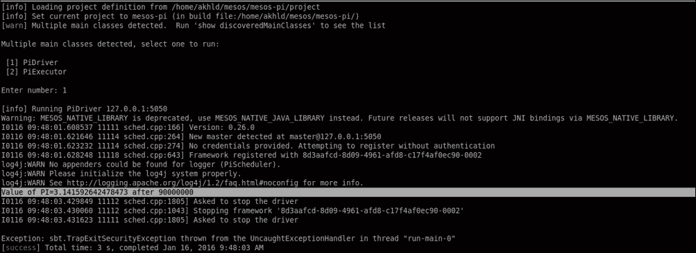
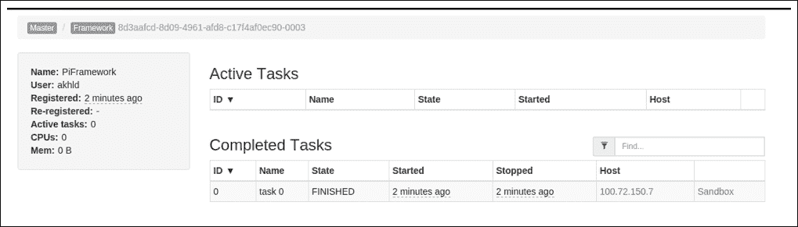

# 第六章. Mesos 框架

本章详细讲解了 Mesos 框架的概念和功能。还提供了 Mesos API 的详细概述，包括新的 HTTP 调度器 API，并提供了在 Mesos 上构建自定义框架的具体方案。本章将涵盖以下主题：

+   Mesos 框架简介

+   框架认证

+   框架授权

+   访问控制列表（ACL）

+   调度器 HTTP API

+   在 Mesos 上构建自定义分布式框架

# Mesos 框架简介

Mesos 框架位于 Mesos 与应用程序之间，充当管理任务调度和执行的层。由于其实现是应用程序特定的，因此该术语通常用于指代应用程序本身。早期，Mesos 框架只能通过 libmesos C++库与 Mesos API 进行交互，因此开发了其他语言绑定，例如 Java、Scala、Python 和 Go 等，这些语言绑定大量依赖 libmesos。从 v0.19.0 版本开始，对基于 HTTP 的协议进行了更改，开发者可以使用他们想要的编程语言来开发框架，而不必依赖 C++代码。一个框架由两个组件组成：

+   一个调度器

+   一个执行者

**调度器**负责对它所接收到的资源提供做出决策，并跟踪集群的当前状态。与 Mesos 主节点的通信由`SchedulerDriver`模块处理，该模块负责将框架注册到主节点、启动任务并向其他组件传递消息。

第二个组件，**执行者**，顾名思义，负责在从属节点上执行任务。与从属节点的通信由`ExecutorDriver`模块处理，该模块还负责向调度器发送状态更新。

# 框架 – 认证、授权和访问控制

从用户的角度来看，认证、授权和访问控制通常被认为是同一回事，因为它们通常一起实现。然而，它们之间有一些重要的区别。以下列出了一些区别，以帮助更清楚地理解这些概念的含义：

+   **认证：** 认证是一个过程，旨在验证某人或某物是否如其所声称的那样。它通常涉及实现一种或多种证明身份的方法。认证过程的结果通常是一个“是/否”答案。

+   **授权：** 授权用于确定应用程序或用户（已经通过身份验证）是否被允许执行请求的任务。它用于定义和确定经过身份验证的应用程序/用户可以做什么以及不能做什么。一个授权模块通常包括一个定义规则的机制（如角色、权限等）。

+   **访问控制**：访问控制是确保未认证或未授权的应用程序/用户无法绕过系统并执行受限操作的过程。它通常涉及实现多种安全功能，以确保系统中没有安全漏洞。

## 框架认证

从 Mesos v0.15 开始，添加了对框架认证的支持，v0.19 引入了从节点认证支持。这是一个非常有用的功能，可以防止未授权的应用程序在 Mesos 上运行。

要使框架能够注册到 Mesos 主节点，必须先进行认证。类似地，认证从节点也是必需的，否则它们无法注册到主节点，因为未授权的进程可能发起 **分布式拒绝服务** (**DDoS**) 攻击、获取任务信息等。这还防止了恶意访问 `/teardown` HTTP 端点，确保框架不会被非法终止。

**Cyrus 简单认证与安全层** (**SASL**) 库是一个灵活的框架，支持多种认证机制，如 CRAM-MD5、Plain、GSSAPI 等，Mesos 利用该库实现认证功能。当前 Mesos 支持 **CRAM-MD5** 机制，但用户也可以实现自己的模块。CRAM-MD5 实现了一种共享密钥认证机制，在这种机制中，主体（在此案例中为框架）和认证者（Mesos）共享一个彼此已知的“秘密”密钥，用于加密和解密信息。每当框架与 Mesos 通信时，它都需要成功地使用该“秘密”密钥来解密或加密信息，以便 Mesos 确认其确实是授权的框架在与之通信。需要注意的是，这与框架用户不同，框架用户是执行任务的执行器所使用的身份。

### 配置选项

认证模块使用以下配置选项：

+   主节点：

    +   `--[no-]authenticate`：如果为`true`，则允许已认证框架的注册。如果为`false`，则其他框架也可以注册。

    +   `--[no-]authenticate_slaves`：如果为`true`，则允许已认证从节点的注册。如果为`false`，则其他从节点也可以注册。

    +   `--authenticators`：用于指定需要用于认证主节点的认证机制，默认使用 CRAM-MD5。`–modules` 选项也可以用来添加其他认证机制。

    +   `--credentials`：用于指定包含有效凭据列表的文件位置，具体是否需要取决于使用的认证机制。

+   从节点：

    +   `--authenticate`：用于指定需要用于认证从节点的认证机制，默认使用 CRAM-MD5。

    +   `--credential`：用于指定包含凭据的文件的位置，该凭据用于确定从属节点。

## 框架授权

授权指的是确定已经通过身份验证的用户是否具有执行请求任务或访问特定资源的所需权限的过程。从 Mesos 0.24 开始，授权 API 被模块化，系统管理员可以实现他们选择的授权后台/协议（例如轻量级目录访问协议或 LDAP）。

启动主节点时，可以通过指定`--acls`标志来配置授权。

当前支持以下授权：

+   带有指定角色的框架注册

+   框架作为授权用户启动任务

+   授权主体关闭框架

+   授权主体设置配额

+   授权主体的资源预留和释放

+   授权主体创建和销毁持久化卷

## 访问控制列表（ACLs）

**访问控制列表**（**ACLs**）用于在 Mesos 中实现*授权*功能。每个之前提到的六种支持的授权都需要以 JSON 格式定义 ACL。在每个 ACL 中，必须定义一个主体列表，这些主体可以对一组对象执行操作。Mesos 主节点随后检查这些 ACL，以确认它接收到的请求是否是授权的。

支持的操作列表如下：

+   `register_frameworks`：用于框架注册

+   `run_tasks`：用于运行任务

+   `shutdown_frameworks`：用于终止框架

+   `set_quotas`：用于配额设置

+   `reserve_resources`：用于资源预留

+   `unreserve_resources`：用于释放资源

+   `create_volumes`：用于创建持久化卷

+   `destroy_volumes`：用于销毁持久化卷

支持的`主体`列表如下：

+   `principals`：这些可以分为两种类型：

    +   框架主体

    +   用户名

支持的`对象`列表如下：

+   `roles`

+   `users`

+   `framework_principals`

+   `resources`

+   `reserver_principals`

+   `volume_types`

+   `creator_principals`

例如，当一个框架尝试注册到主节点时，系统会检查 `register_frameworks` ACL，验证尝试注册的框架是否被授权接收指定角色的资源报价。如果框架未授权，调度器将终止，并发送错误消息。

另一个例子是一个框架尝试启动一组任务的情况。在这种情况下，会检查 `run_tasks` ACL 以验证框架是否被允许运行所需的任务，并且作为指定的用户。如果框架没有授权，系统会发送一个 `TASK_LOST` 消息，任务不会启动。

更多信息，请访问 [`mesos.apache.org/documentation/latest/authorization/`](http://mesos.apache.org/documentation/latest/authorization/)。

### 注意

ACL 按照设置顺序进行检查；即使用第一个相关的 ACL 来确定请求的授权状态。

`ACLs.permissive` 字段决定如何处理不匹配的请求。默认值为 `true`，意味着如果没有匹配的 ACL，请求将被授权。

### 示例

实现 ACL 的几个示例如下：

+   `A` 和 `B` 框架可以作为用户 `U` 运行任务。请看以下代码：

    ```
    {
    "run_tasks": [
    {
    "principals": { "values": ["A", "B"] },
    "users": { "values": ["U"] }
    }
    ]
    }
    Any framework can run tasks as user guest, as shown by the following code:
      {
    "run_tasks": [
    {
    "principals": { "type": "ANY" },
    "users": { "values": ["guest"] }
    }
    ]
    }
    No framework can run tasks as root, as follows:
      {
    "run_tasks": [
    {
    "principals": { "type": "NONE" },
    "users": { "values": ["root"] }
    }
        ]
      }
    ```

+   框架 `A` 只能以用户 `guest` 运行任务，不能以其他用户运行，代码如下所示：

    ```
      {
    "run_tasks": [
    {
    "principals": { "values": [ "A" ] },
    "users": { "values": ["guest"] }
    },
    {
    "principals": { "values": [ "A" ] },
    "users": { "type": "NONE" }
    }
    ]
      }
    The framework A can register with X and Y roles, as follows:
    {
    "register_frameworks": [
    {
    "principals": { "values": ["A"] },
    "roles": { "values": ["X", "Y"] }
    }
    ]
    }
    Only the framework A and no one else can register with X role, as follows:
      {
    "register_frameworks": [
    {
    "principals": { "values": ["A"] },
    "roles": { "values": ["X"] }
    },
    {
    "principals": { "type": "NONE" },
    "roles": { "values": ["X"] }
    }
    ]
      }
    ```

+   框架 `A` 只能注册 `X` 角色，不能注册其他角色。此外，其他框架也不能注册任何角色，具体代码如下：

    ```
      {
    "permissive" : false,
    "register_frameworks": [
    {
    "principals": { "values": ["A"] },
    "roles": { "values": ["X"] }
    }
    ]
    }
    Only the P principal can shut down any frameworks through the /teardown HTTP endpoint. Take a look at the following code:
      {
    "permissive" : false,
    "shutdown_frameworks":[
    {
    "principals": { "values": ["P"] },
    "framework_principals":{"type":"ANY"}
    }
    ]
      }
    ```

# Mesos API

Mesos 提供了一个 API，允许开发者构建自定义框架，可以在底层分布式基础设施上运行。有关 Mesos API 的详细解释，请参阅 第一章中的 *API 详情* 部分。利用该 API 开发定制框架的详细步骤将在后续章节中通过示例进行描述。

Mesos 还实现了 **演员式消息传递编程模型**，以实现不同 Mesos 组件之间的非阻塞通信，并利用协议缓冲区实现这一目标。

此外，最近还推出了新的调度器 HTTP API，接下来将简要讨论。

## 调度器 HTTP API

自 Mesos 版本 0.24.0 起，引入了对新的 HTTP API（目前仅支持调度器）的实验性支持。Mesos 主节点托管 `api/v1/scheduler` 端点，调度器通过该端点与主节点进行通信。

## 请求调用

主节点当前接受以下请求调用：

### 订阅

调度器通过`HTTP POST`请求发送一个`Subscribe`消息，包含相关的框架信息，例如名称等，以便与主节点进行通信。响应包括订阅确认和框架 ID 等详细信息，后续所有的通信都会使用该 ID。

`SUBSCRIBE` 请求（JSON）如下：

```
POST /api/v1/scheduler  HTTP/1.1

{
"type"       : "SUBSCRIBE",

"subscribe"  : {
"framework_info"  : {
"user" :  "U",
"name" :  "N"
},

"force" : true
  }
}
```

`SUBSCRIBE` 响应（JSON）如下：

```
HTTP/1.1 200 OK
```

### TEARDOWN

调度器在希望关闭自己时发送此请求。接收到此请求后，Mesos 将终止所有执行器，终止所有正在运行的任务。然后，Mesos 会移除框架并结束主节点与调度器之间的所有通信。

`TEARDOWN` 请求（JSON）如下：

```
POST /api/v1/scheduler  HTTP/1.1

{
"framework_id"    : {"value" : "<some_value>"},
"type"            : "TEARDOWN",
}
```

`TEARDOWN` 响应如下：

```
HTTP/1.1 202 Accepted
```

### ACCEPT

当调度器想要接受 Mesos 主节点提供的资源时，它会发送此请求。调度器打算执行的操作作为参数包含在请求中（例如，启动任务、创建卷和保留资源）。

`ACCEPT` 请求（JSON）如下：

```
POST /api/v1/scheduler  HTTP/1.1

{
"framework_id"    : {"value" : "<some_Value>"},
"type"            : "ACCEPT",
"accept"          : {
"offer_ids"     : [
{"value" : "<some_Value>"},
{"value" : "<some_value>"}
],
"operations"    : [ {"type" : "LAUNCH", "launch" : {...}} ],
"filters"       : {...}
  }
}
```

`ACCEPT` 响应如下：

```
HTTP/1.1 202 Accepted
```

### DECLINE

当调度器想要拒绝 Mesos 主节点提供的资源时，它会发送此请求。

`DECLINE` 请求（JSON）如下：

```
POST /api/v1/scheduler  HTTP/1.1

{
"framework_id"    : {"value" : "<some_Value>"},
"type"            : "DECLINE",
"decline"         : {
"offer_ids"     : [
                       {"value" : "<some_value>"},
                       {"value" : "<some_Value>"}
                      ],
"filters"       : {...}
  }
}
```

`DECLINE` 响应如下：

```
HTTP/1.1 202 Accepted
```

### REVIVE

如果之前的接受或拒绝请求设置了过滤器，则调度器可以发送 revive 调用来移除它们。

`REVIVE` 请求（JSON）如下：

```
POST /api/v1/scheduler  HTTP/1.1

{
"framework_id"    : {"value" : "<some_value>"},
"type"            : "REVIVE",
}
```

`REVIVE` 响应如下：

```
HTTP/1.1 202 Accepted
```

### KILL

如果需要终止特定任务，则调度器可以发送 `KILL` 请求。如果存在自定义执行器，则请求将传递给该执行器，由其处理。如果主节点未知道需要终止的任务，它将生成 `Task_Lost` 消息。

`KILL` 请求（JSON）如下：

```
POST /api/v1/scheduler  HTTP/1.1

{
"framework_id"    : {"value" : "<some_value>"},
"type"            : "KILL",
"kill"            : {
"task_id"   :  {"value" : "<some_Value>"},
"agent_id"  :  {"value" : "<some_value>"}
  }
}
```

`KILL` 响应如下：

```
HTTP/1.1 202 Accepted
```

### SHUTDOWN

当调度器希望结束特定自定义执行器时，会发送此新引入的调用。

`SHUTDOWN` 请求（JSON）如下：

```
POST /api/v1/scheduler  HTTP/1.1

{
"framework_id"    : {"value" : "<some_value>"},
"type"            : "SHUTDOWN",
"shutdown"            : {
"executor_id":  {"value" : "<some_value>"},
"agent_id":  {"value" : "<some_value>"}
  }
}
```

`SHUTDOWN` 响应如下：

```
HTTP/1.1 202 Accepted
```

### ACKNOWLEDGE

当需要确认状态更新时，调度器发送此请求。

`ACKNOWLEDGE` 请求（JSON）如下：

```
POST /api/v1/scheduler  HTTP/1.1

{
"framework_id"    : {"value" : "<some_value>"},
"type"            : "ACKNOWLEDGE",
"acknowledge"     : {
"agent_id"  :  {"value" : "<some_Value>"},
"task_id"   :  {"value" : "<some_value>"},
"uuid"      :  "<some_value>"
  }
}
```

`ACKNOWLEDGE` 响应如下：

```
HTTP/1.1 202 Accepted
```

### RECONCILE

当需要查询状态非终结任务时，调度器发送此请求。对于列表中的每个任务，主节点会返回一个更新事件。

`RECONCILE` 请求（JSON）如下：

```
POST /api/v1/scheduler  HTTP/1.1

{
"framework_id"    : {"value" : "<some_value>"},
"type"            : "RECONCILE",
"reconcile"       : {
"tasks"     : [
                   { "task_id"  : { "<some_value>" },
"agent_id" : { "<some_value>" }
                   }
                  ]
  }
}
```

`RECONCILE` 响应如下：

```
HTTP/1.1 202 Accepted
```

### MESSAGE

如果需要将任意二进制数据发送到执行器，调度器使用此请求。

`MESSAGE` 请求（JSON）如下：

```
POST /api/v1/scheduler  HTTP/1.1

{
"framework_id"    : {"value" : "<some_value>"},
"type"            : "MESSAGE",
"message"         : {
"agent_id"       : {"value" : "<some_value>"},
"executor_id"    : {"value" : "<some_value>"},
"data"           : "<some_Value>"
  }
}
```

`MESSAGE` 响应如下：

```
HTTP/1.1 202 Accepted
```

### REQUEST

这是调度器向主节点请求资源时使用的。

`REQUEST` 请求（JSON）如下：

```
POST /api/v1/scheduler  HTTP/1.1

{
"framework_id"    : {"value" : "<some_value>"},
"type"            : "REQUEST",
"requests"        : [
      {
"agent_id"       : {"value" : "<some_value>"},
"resources"      : {}
      },
  ]
}
```

`REQUEST` 响应如下：

```
HTTP/1.1 202 Accepted
```

## 响应事件

主节点当前作为响应发送以下事件。

### SUBSCRIBED

当调度器发出 `Subscribe` 请求时，主节点发送的第一个事件是 `Subscribed` 事件。格式如下所示：

`SUBSCRIBED` 事件（JSON）如下：

```
<event-length>
{
"type"         : "SUBSCRIBED",
"subscribed"   : {
"framework_id"               : {"value":"<some_value>"},
"heartbeat_interval_seconds" : 10
  }
}
```

### OFFERS

当主节点能够向框架提供一组新资源时，它会发送此事件。每个 offer 对应于一个从属节点上的资源组。假设这些资源已经分配，直到调度器向主节点发出 `Accept` 或 `Decline` 调用。如果丢失从属节点或超时，offer 会被撤销。

`OFFERS` 事件（JSON）如下：

```
<event-length>
{
"type"    : "OFFERS",
"offers"  : [
    {
"offer_id":{"value": "<some_value>"},
"framework_id":{"value": "<some_Value>"},
"agent_id":{"value": "<some_value>"},
"hostname":"agent.host",
"resources":[...],
"attributes":[...],
"executor_ids":[]
    }
  ]
}
```

### RESCIND

当一个 offer 的有效期到期（例如，当 offer 中提到的从属节点丢失时），主节点会发送此事件撤销该 offer。如果调度器在未来做出任何调用，这些 offer 会被视为无效。

`RESCIND` 事件（JSON）如下：

```
<event-length>
{
"type":"RESCIND",
"rescind":{
"offer_id":{"value":"<some_value>"}
}
}
```

### 更新

如果执行器创建了有关正在运行任务的状态更新，主节点会发送此事件。例如，如果生成了`Task_Finished`更新，主节点可以释放分配给任务的资源以供其他地方使用。

`UPDATE` 事件（JSON）如下：

```
<event-length>
{
"type"    : "UPDATE",
"update"  : {
"status"    : {
"task_id"   : { "value" : "<some_value>"},
"state"     : "TASK_FINISHED",
"source"    : "SOURCE_EXECUTOR",
"uuid"      : "<some_value>",
"bytes"     : "<some_Value"

      }
  }	
}
```

### 信息

Mesos 主节点通过传递 `Message` 事件，将执行器生成的消息转发给调度器，不进行解释或交付保证。如果消息传递因任何原因失败，执行器需要重新发送请求。

`MESSAGE` 事件（JSON）如下：

```
<event-length>
{
"type":"MESSAGE",
"message":{
"agent_id":{"value":"<some_value>"},
"executor_id":{"value":"<some_value>"},
"data":"<some_value>"
}
}
```

### 失败

主节点在从属节点移除或执行器终止时发送此事件。

`FAILURE` 事件（JSON）如下：

```
<event-length>
{
"type":"FAILURE",
"failure":{
"agent_id":{"value":"<some_Value>"},
"executor_id":{"value":"<some_Value>"},
"status": 1
}
}
```

### 错误

主节点在发生错误时发送此事件（例如，某个角色的框架未经授权订阅请求的资源）。推荐做法是框架在收到此事件后应中止并重新订阅。

`ERROR` 事件（JSON）如下：

```
<event-length>
{
"type":"ERROR",
"message":"Framework is not authorized"
}
```

### 心跳

主节点在固定时间间隔内发送此事件，以通知调度器已建立的订阅连接处于活动状态。这有助于确保活跃连接不会因数据传输不足而被终止。

`HEARTBEAT` 事件（JSON）如下：

```
<event-length>
{
"type":"HEARTBEAT",
}
```

有关调度器 HTTP API 的更多信息，请访问 [`mesos.apache.org/documentation/latest/scheduler-http-api/`](http://mesos.apache.org/documentation/latest/scheduler-http-api/)。

# 在 Mesos 上构建自定义框架

正如我们所知，Mesos 框架是运行在 Mesos 上的应用程序。在本模块中，我们将了解如何创建我们自己的 Mesos 框架。为了简化起见，我们将创建一个简单的 Java 应用程序来计算 *pi* 的值。一个 Mesos 框架由以下三个组件组成：

+   **驱动程序**：这是将任务提交到框架的代码部分

+   **执行器**：这是在 Mesos 从属节点上启动的用于运行框架任务的代码部分

+   **调度器**：这是与主节点注册、向其请求资源并在执行器上运行任务的代码部分

现在，让我们看看如何在接下来的章节中开发这些组件以构建自定义的 Mesos 框架。

## 驱动程序实现

驱动程序程序是创建 **执行器信息** 的程序。执行器信息由 `executorID`（一个字符串值）和通过 Linux `/bin/sh-c` 命令执行的命令组成。这可以在我们的 Java 代码中实现，如下所示：

```
Protos.ExecutorInfopiExecutorInfo = 
Protos.ExecutorInfo.newBuilder()
.setExecutorId(Protos.ExecutorID.newBuilder()
.setValue("CalculatePi"))
.setCommand(piCommandInfo)
.setName("PiExecutor")
.setSource("java")
.build();
```

在这里，我们使用了 Google 协议缓冲区与 Mesos 通信，并使用构建者模式构造执行器信息。

现在我们已经准备好了执行器信息，接下来是框架信息。框架信息包括任务应该以哪个 Unix 用户身份启动（如果我们留空该字段，可以使用默认设置）以及故障恢复时间，这使得主节点在调度器失败时会等待一段时间，然后再移除框架。这两个属性通过 `.setUser` 和 `.setFailOverTimeout` 调用设置，代码如下：

```
Protos.FrameworkInfo.BuilderframeworkBuilder = Protos.FrameworkInfo.newBuilder()
.setFailoverTimeout(120000)
.setUser("")
.setName("PiFramework"); 
```

现在，我们可以初始化 `Scheduler`，并将提交给执行器的任务数量传递给它，以便运行我们的程序。以下是实现的代码：

```
Scheduler scheduler = new PiScheduler(piExecutorInfo, 1);
```

`PiScheduler` 被实例化时只有一个任务，因为我们只需要一个任务来计算它。

`MesosSchedulerDriver` 用于在 Mesos 上启动和终止任务。它还通过 `start`、`stop` 和 `等待任务完成` 调用来管理调度器的生命周期。以下是实现的代码：

```
MesosSchedulerDriverschedulerDriver = 
new MesosSchedulerDriver(scheduler,frameworkBuilder.build(), MESOS-MASTER);
int status = schedulerDriver.run() == Protos.Status.DRIVER_STOPPED ? 0 : 1;
schedulerDriver.stop();
System.exit(status);
```

现在我们已经讨论了驱动程序的所有部分，让我们将它们整合在一起，看看实际的代码是如何写的。如下所示：

```
/* Create the PiDriver class with the following contents: */

import com.google.protobuf.ByteString;
import org.apache.log4j.Logger;
import org.apache.mesos.MesosSchedulerDriver;
import org.apache.mesos.Protos;
import org.apache.mesos.Scheduler;

public class PiDriver {

private final static Logger LOGGER = Logger.getLogger(PiDriver.class);

public static void main(String[] args) {

String path = System.getProperty("user.dir") + "/target/scala-2.10/mesos-pi-assembly-1.0.jar";

/* Defining the executor */

Protos.CommandInfo.URIuriProtos.CommandInfo.URI.newBuilder().setValue(path).setExtract(false).build();
String commandPi = "java -cpmesos-pi-assembly-1.0.jarPiExecutor";
Protos.CommandInfopiCommandInfo = Protos.CommandInfo.newBuilder().setValue(commandPi).addUris(uri).build();

/* Setting the executor information */

Protos.ExecutorInfopiExecutorInfo = Protos.ExecutorInfo.newBuilder().setExecutorId(Protos.ExecutorID.newBuilder().setValue("CalculatePi")).setCommand(piCommandInfo).setName("PiExecutor").setSource("java").build();

/* Defining framework & specifying related information*/

Protos.FrameworkInfo.BuilderframeworkBuilder = Protos.FrameworkInfo.newBuilder().setFailoverTimeout(120000).setUser("").setName("PiFramework").setPrincipal("test-framework-java");

/* Enabling checkpointing */

if (System.getenv("MESOS_CHECKPOINT") != null) {
System.out.println("Enabling checkpoint for the framework");
frameworkBuilder.setCheckpoint(true);
}

/* Initializing the scheduler */

Scheduler scheduler = new PiScheduler(piExecutorInfo, 1);

/* Defining the scheduler driver */

MesosSchedulerDriverschedulerDriver = new MesosSchedulerDriver(scheduler, frameworkBuilder.build(), args[0]);;

int status = schedulerDriver.run() == Protos.Status.DRIVER_STOPPED ? 0 : 1;
schedulerDriver.stop();
System.exit(status);
}

}
```

## 执行器实现

`PiExecutor` 是我们的执行器组件。我们需要实现 *Executor* 接口并重写一些方法。在这里，我们将重点讨论核心方法，即 `launchTask()` 调用——在我们的例子中，这是实际计算 `pi` 值的调用。我们还需要在这个方法中设置任务的一些属性，具体如下：

```
@Override 
public void launchTask(final ExecutorDriverexecutorDriver, final Protos.TaskInfotaskInfo) 
{

/* Set the task status as running for the task ID with a builder pattern. */

Protos.TaskStatustaskStatus = Protos.TaskStatus.newBuilder().setTaskId(taskInfo.getTaskId())
.setState(Protos.TaskState.TASK_RUNNING).build();

/* Send the status update to the framework scheduler retrying as necessary until an acknowledgement has been receivedor the executor is terminated, in which case,a TASK_LOST status update will be sent.+*/

executorDriver.sendStatusUpdate(taskStatus);

/* Actual Pi computation */

try {
message = computePi().getBytes();
}
catch (IOException e) {
LOGGER.error("Error computing Pi :" + e.getMessage());
}

/* Return the value of Pi to framework */

executorDriver.sendFrameworkMessage(message);

/* Mark state of task as finished and send status update to framework scheduler. */

taskStatus = Protos.TaskStatus.newBuilder().setTaskId(taskInfo.getTaskId()) 
.setState(Protos.TaskState.TASK_FINISHED)
.build();

executorDriver.sendStatusUpdate(taskStatus);

}
```

现在，我们可以通过实现 `Executor` 类并重写默认方法来创建一个 `PiExecutor` 类。完整代码如下：

```
/* Create the PiExecutor class with the following contents: */

import org.apache.log4j.Logger;
import org.apache.mesos.Executor;
import org.apache.mesos.ExecutorDriver;
import org.apache.mesos.MesosExecutorDriver;
import org.apache.mesos.Protos;

import java.io.IOException;

public class PiExecutor implements Executor {
private final static Logger LOGGER = Logger.getLogger(PiExecutor.class);

/**
*Invoked once the executor driver has been able to
*successfully connect with Mesos. 
*In particular, a scheduler can pass some
*data to it's executors through the
*{@linkorg.apache.mesos.Protos.ExecutorInfo#getData()}field.
*@param driver - The executor driver that was registered and connectedto the Mesos cluster.
*@paramexecutorInfo - Describes information about the registered executor.
*@paramframeworkInfo - Describes the framework that was registered.
*@paramslaveInfo - Describes the slave that will be used to launchthe tasks for this executor.
*For more details, seeorg.apache.mesos.ExecutorDriver and org.apache.mesos.MesosSchedulerDriver

*/

@Override 
public void registered(ExecutorDriver driver, Protos.ExecutorInfoexecutorInfo,Protos.FrameworkInfoframeworkInfo, Protos.SlaveInfoslaveInfo) {
LOGGER.info("Registered PinUserBoardExecutor on " + slaveInfo.getHostname());
}

/*
* Invoked when executor re-registers with a restarted slave.
    * @param driver - The executor driver that was re-registered with Mesos master.
    * @paramslaveInfo - Describes the slave that will be used to launch the tasks for this executor.
    * For more details, see org.apache.mesos.ExecutorDriver
*/

@Override 
public void reregistered(ExecutorDriver driver, Protos.SlaveInfoslaveInfo) {

}

/*
    * Invoked when executor becomes 'disconnected' from  slave.
    * (e.g. when the slave is being restarted due to an upgrade)
    * @param driver - The executor driver that was disconnected.

*/

@Override 
public void disconnected(ExecutorDriver driver) {

}

/*
    * Invoked when a task has been launched on this executor 
    * (initiated via 
    * {@linkorg.apache.mesos.SchedulerDriver#launchTasks}. 
    * Note that this task can be realized with a 
    * thread, a process, or some simple computation, 
    * however, no other callbacks will be invoked on this executor
    * until this callback has returned.
    * 
* @param driver - The executor driver that launched the task.
    * @param task - Describes the task that was launched.
    * For more details, see 
    * org.apache.mesos.ExecutorDriver and 
    * org.apache.mesos.Protos.TaskInfo
*/

@Override 
public void launchTask(ExecutorDriver driver, Protos.TaskInfo task) {
LOGGER.info("Launching task in PinUserBoardExecutor..");
Protos.TaskStatustaskStatus = Protos.TaskStatus.newBuilder().setTaskId(task.getTaskId()).setState(Protos.TaskState.TASK_RUNNING).build();
driver.sendStatusUpdate(taskStatus);
String url = task.getData().toStringUtf8();

byte[] message = new byte[0];

try {
message = computePi().getBytes();
} 
catch (IOException e) {
LOGGER.error("Error computing Pi :" + e.getMessage());
}
LOGGER.info("Sending framework message and marking task finished."+ getClass().getName());
driver.sendFrameworkMessage(message);

taskStatus = Protos.TaskStatus.newBuilder().setTaskId(task.getTaskId()).setState(Protos.TaskState.TASK_FINISHED).build();

driver.sendStatusUpdate(taskStatus);
}

/* Code to compute Pi */

private String computePi() throws IOException {

double pi = 0;
double y = 1;

intlps = 90000000*2;
intcnt = 0;
for(int x=1; x <lps; x+=2) {
pi = pi + (y/x);
y = -y;
cnt++;
}

return "Value of PI=" + 4*pi + " after " + cnt; 
/* PI=3.141592642478473 after 90000000 */

}

    /*
    * Invoked when a task running within this executor 
    * has been killed 
    * (via {@link org.apache.mesos.SchedulerDriver#killTask}). 
    * Note that no status update will be sent 
    * on behalf of the executor, the executor is responsible for 
    * creating new TaskStatus (i.e., with TASK_KILLED) &invoking 
    * {@link org.apache.mesos.ExecutorDriver#sendStatusUpdate}.

    * @param driver - The executor driver that owned the task that was killed.
@param task - The ID of the task that was killed.

@For more details, see org.apache.mesos.ExecutorDriver andorg.apache.mesos.Protos.TaskID

*/

@Override 
public void killTask(ExecutorDriver driver, Protos.TaskIDtaskId) {

}

/*
@Invoked when a framework message has arrived 
*for this executor. 
*These messages are best effort; 
*do not expect a framework message to be 
*retransmitted in any reliable fashion.
*@param driver - The executor driver that received the message.
@param data - The message payload.
    * For more details, see 
    * org.apache.mesos.ExecutorDriver
*/

@Override 
public void frameworkMessage(ExecutorDriver driver, byte[] data) {

}

/*
    * Invoked when the executor should terminate 
    * all of it's currently running tasks. 
    * Note that after Mesos has determined that 
    * an executor has terminated any tasks that 
    * the executor did not send terminal status updates 
    * for (e.g. TASK_KILLED, TASK_FINISHED, TASK_FAILED and so on) 
    * a TASK_LOST status update will be created.
    * @param driver - The executor driver that should terminate
    * For more details, see org.apache.mesos.ExecutorDriver

*/

@Override 
public void shutdown(ExecutorDriver driver) {

}

/*
* Invoked when a fatal error has occurred with 
    * the executor and/or executor driver. 
    * The driver will be aborted BEFORE invoking this callback
    * @param driver - The executor driver that was aborted due to this error
    * @param message - The error message.
    * For more details, see org.apache.mesos.ExecutorDriver

*/

@Override 
public void error(ExecutorDriver driver, String message) {

}

/* The main method in which we initiates and calls the run() method in MesosExecutorDriver */

public static void main(String[] args) {
MesosExecutorDrivermesosExecutorDriver = new MesosExecutorDriver(new PiExecutor());System.exit(mesosExecutorDriver.run() == Protos.Status.DRIVER_STOPPED ? 0 : 1);
}

}
```

## 调度器实现

接下来，我们将讨论调度器实现，它负责框架的调度。我们将创建 `PiScheduler`，它实际上实现了 Mesos 的 Scheduler 接口。我们将专注于重写 `resourceOffer()`、`statusUpdate()` 和 `frameworkMessage()` 方法，这些方法构成了 `PiScheduler` 的核心部分。

完整的代码如下：

```
import org.apache.log4j.Logger;
import org.apache.mesos.Protos;
import org.apache.mesos.Scheduler;
import org.apache.mesos.SchedulerDriver;

import java.util.ArrayList;
import java.util.List;

public class PiScheduler implements Scheduler {

private final static Logger LOGGER = Logger.getLogger(PiScheduler.class);

private final Protos.ExecutorInfopiExecutor;
private final inttotalTasks;
private intlaunchedTasks = 0;
private intfinishedTasks = 0;

/**ThePiSchedulertakes information from the PiExecutor and 
  * the total number of tasks through its constructor 
  * which is implemented below 
*/

public PiScheduler(Protos.ExecutorInfo _piExecutor, int _totalTasks) {
this.totalTasks = _totalTasks; 
this.piExecutor = _piExecutor;
}

@Override public void registered(SchedulerDriverschedulerDriver, Protos.FrameworkIDframeworkID, Protos.MasterInfomasterInfo) {
LOGGER.info("Registered! ID = " + frameworkID.getValue());
}

@Override public void reregistered(SchedulerDriverschedulerDriver, Protos.MasterInfomasterInfo) {

}

/**The resourceoffer() method is invoked when resources 
  * have been offered to this framework. 
* We will set the number of CPUs, and amount of memory that 
  * our framework requires through the call described below 
*/

@Override public void resourceOffers(SchedulerDriverschedulerDriver, List<Protos.Offer> list) {

/* The amount of CPU cores and Memory required for our tasks is specified */

double CPUS_PER_TASK = 1;
double MEM_PER_TASK = 128;

for (Protos.Offer offer : list) {
List<Protos.TaskInfo>taskInfoList = new ArrayList<Protos.TaskInfo>();
double offerCpus = 0;
double offerMem = 0;

for (Protos.Resource resource : offer.getResourcesList()) {
if (resource.getName().equals("cpus")) {
offerCpus += resource.getScalar().getValue();
} else if (resource.getName().equals("mem")) {
offerMem += resource.getScalar().getValue();
}
}

LOGGER.info("Received Offer : " + offer.getId().getValue() + "with cpus = " + offerCpus + " and mem ="+ offerMem);

double remainingCpus = offerCpus;
double remainingMem = offerMem;

if (launchedTasks<totalTasks&&remainingCpus>= CPUS_PER_TASK&&remainingMem>= MEM_PER_TASK) {

Protos.TaskIDtaskID = Protos.TaskID.newBuilder().setValue(Integer.toString(launchedTasks++)).build();
LOGGER.info("Launching task :" + taskID.getValue() + " using the offer : " + offer.getId().getValue());

/* PiExecutor is created as a task and is launched*/

Protos.TaskInfopiTaskInfo = Protos.TaskInfo.newBuilder()
.setName("task " + taskID.getValue()).setTaskId(taskID).setSlaveId(offer.getSlaveId()).addResources(Protos.Resource.newBuilder().setName("cpus")
.setType(Protos.Value.Type.SCALAR).setScalar(Protos.Value.Scalar.newBuilder().setValue(CPUS_PER_TASK))).addResources(Protos.Resource.newBuilder().setName("mem").setType(Protos.Value.Type.SCALAR).setScalar(Protos.Value.Scalar.newBuilder().setValue(MEM_PER_TASK))).setExecutor(Protos.ExecutorInfo.newBuilder(piExecutor)).build();

taskID = Protos.TaskID.newBuilder().setValue(Integer.toString(launchedTasks++)).build();

LOGGER.info("Launching task :" + taskID.getValue() + " using the offer : " + offer.getId().getValue());

taskInfoList.add(piTaskInfo);

}

schedulerDriver.launchTasks(offer.getId(), taskInfoList);

}

}

/** Invoked when an offer is no longer valid 
  * (e.g., the slave was lost or another framework used 
  * resources in the offer). 
  * If for whatever reason an offer is never rescinded 
  * (e.g., dropped message, failing over framework and so on), 
  * a framework that attempts to launch tasks 
  * using an invalid offer will receive TASK_LOST
  * status update for those tasks */
  */
@Override public void offerRescinded(SchedulerDriverschedulerDriver, Protos.OfferIDofferID) {

}

/**The statusUpdate() call is invoked when 
  * the status of a task has changed 
  * (e.g., a slave is lost which means the task is lost, 
  * a task finishes and executor sends a status update)
*/

@Override public void statusUpdate(SchedulerDriverschedulerDriver, Protos.TaskStatustaskStatus) {

LOGGER.info("Status update : Task ID "+ taskStatus.getTaskId()
.getValue() + "in state : "+ taskStatus.getState().getValueDescriptor().getName());
if (taskStatus.getState() == Protos.TaskState.TASK_FINISHED) {
finishedTasks++;
LOGGER.info("Finished tasks : " + finishedTasks);

/* We can stop the scheduler once the tasks are completed */

if (finishedTasks == totalTasks) {
schedulerDriver.stop();
}
}

if (taskStatus.getState() == Protos.TaskState.TASK_FAILED|| taskStatus.getState() == Protos.TaskState.TASK_KILLED|| taskStatus.getState() == Protos.TaskState.TASK_LOST) {
LOGGER.error("Aborting because the task "+ taskStatus.getTaskId().getValue() + " is in unexpected state : "+ taskStatus.getState().getValueDescriptor().getName() + "with reason : "+ taskStatus.getReason().getValueDescriptor().getName()+ " from source : "+ taskStatus.getSource().getValueDescriptor().getName() + " with message : "+ taskStatus.getMessage());
schedulerDriver.abort();
}
}

/**The frameworkMessage() is invoked when an executor 
  * sends a message. In our case we will be sending 
  * the value of Pi from our executor as the message.
*/

@Override public void frameworkMessage(SchedulerDriverschedulerDriver, Protos.ExecutorIDexecutorID,Protos.SlaveIDslaveID, byte[] bytes) {
String data = new String(bytes);
System.out.println(data);
LOGGER.info("Output :\n=========\n " + data);
}

/* Invoked when scheduler becomes disconnected from master 
  * (e.g. master fails and another is taking over)
*/

@Override public void disconnected(SchedulerDriverschedulerDriver) {

}

/* Invoked when a slave has been determined unreachable 
  * (e.g., machine failure, network partition). 
  * Most frameworks will need to reschedule 
  * any tasks launched on this slave on a new slave. 
*/

@Override public void slaveLost
(SchedulerDriverschedulerDriver, Protos.SlaveIDslaveID) {

}

/* Invoked when an executor has exited/terminated. 
  * Note that any tasks running will have 
  * TASK_LOST status updates automatically generated.
*/

@Override public void executorLost(SchedulerDriverschedulerDriver, Protos.ExecutorIDexecutorID,Protos.SlaveIDslaveID, inti) {

}

/* Invoked when there is an unrecoverable error 
  * in the scheduler or driver. 
  * The driver will be aborted before invoking this callback.
*/

@Override public void error(SchedulerDriverschedulerDriver, String s) {
LOGGER.error("Error : " + s);
}

}
```

## 运行框架

我们需要将 JAR 文件与所有依赖项一起打包，以便运行框架。为此，我们可以创建一个 `build.sbt` 文件，并将 Mesos 和 log4j 作为依赖项。这将类似于以下内容：

```
import AssemblyKeys._

assemblySettings

name := "mesos-pi"

version := "1.0"

scalaVersion := "2.10.4"

libraryDependencies += "org.apache.mesos" % "mesos" % "0.26.0"

libraryDependencies += "log4j" % "log4j" % "1.2.17"
```

现在我们可以使用以下 `sbt` 命令创建一个 Uber JAR 文件：

```
$ sbt assembly

```

然后，我们将使用以下命令运行程序：

```
$ sbt'run 127.0.0.1:5050'
Multiple main classes detected, select one to run:
 [1] PiDriver
 [2] PiExecutor

Enter number: 1

```

请注意，我们在 `PiDriver` 程序中将 Mesos 主节点的 URI 作为参数指定。

一旦我们运行程序，您将在终端中看到以下输出：

```
Value of PI=3.141592642478473 after 90000000

```



我们还可以看到框架已经在 Mesos 主节点的 UI 中注册，Mesos 主节点运行在 `5050` 端口，截图如下：


如果我们点击框架 ID，仍然可以在相同的 UI 中看到计算 Pi 值的单个任务已经完成：



# 总结

阅读完本章后，你应该对 Mesos 中的框架安全功能有一个基本了解，比如授权、认证和访问控制。同时，你也应该能够使用 Mesos API 构建你自己的自定义应用程序/框架。此外，本章还介绍了实验性调度器 HTTP API。

在下一章，我们将探讨一些有趣的项目，如 Myriad（在 Mesos 上的 YARN）和 Kubernetes 在 Mesos 上的部署。我们还将讨论如何使用 Docker 部署容器化应用，以及如何在 Mesos 上使用 Jenkins 设置持续集成流程。
