# 第七章：Mesos 容器化器

本章简要介绍了**容器**的概念，并稍微谈了一下**Docker**，可能是当今最流行的容器技术。它还提供了 Mesos 中不同*容器化器*选项的详细概述，并介绍了其他一些主题，如 Mesos 管理的容器的网络配置和获取器缓存。最后，提供了一个在 Mesos 中部署容器化应用的示例，帮助更好地理解。以下是本章将涵盖的主题：

+   容器

+   Docker

+   Mesos 容器化器

    +   Mesos 容器化器

    +   Docker 容器化器

    +   容器化器组合

+   Mesos 管理的容器网络

+   Mesos 镜像提供

+   获取器缓存

+   使用 Docker 和 Mesos 部署容器化应用

# 容器

Linux 容器（在本章其余部分简单称为容器）允许应用程序在分配的资源份额内，在一个隔离的、独立的环境中运行。由于所有容器共享宿主机的**操作系统（OS）**，并且不需要加载操作系统，因此它们可以在几秒钟内创建。

基于操作系统级虚拟化的容器技术已经存在十多年。操作系统级虚拟化是一种方法，它允许操作系统内核创建多个用户命名空间实例（也称为容器），而不是仅创建一个。

我们可以将容器看作是封装的、可单独部署的组件，这些组件作为隔离的实例在同一个内核上运行。容器相较于传统技术，如裸金属服务器（具有操作系统的服务器）或虚拟化环境（如**Microsoft Hyper-V**）有很大的优势。从开发者的角度来看，我们只需将应用程序及其依赖项打包到一个容器中，并将其部署到任何支持容器的环境中。通过这样做，我们还使得我们的应用程序容易更新、升级，甚至可以轻松地从一个环境迁移到另一个环境，例如从桌面上的开发环境迁移到云中的测试环境。

两种流行的容器模型是：

+   **基于虚拟机监控程序**：基于虚拟机监控程序的模型包括冗余的操作系统内核和其他库，这使得该设置效率低下，如下图所示（来源：[`aucouranton.com/2014/06/13/linux-containers-parallels-lxc-openvz-docker-and-more/`](http://aucouranton.com/2014/06/13/linux-containers-parallels-lxc-openvz-docker-and-more/))：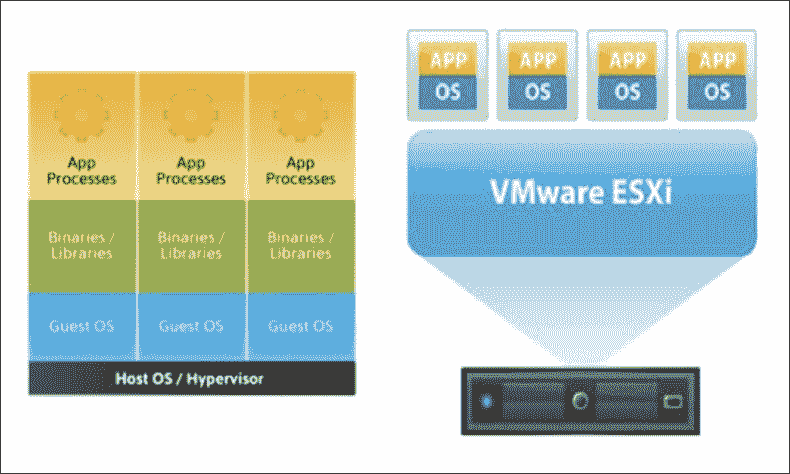

+   **基于容器**：基于容器的方法涉及封装的、可单独部署的组件，这些组件作为隔离的实例在同一个内核上运行，如下图所示（来源：[`aucouranton.com/2014/06/13/linux-containers-parallels-lxc-openvz-docker-and-more/`](http://aucouranton.com/2014/06/13/linux-containers-parallels-lxc-openvz-docker-and-more/))：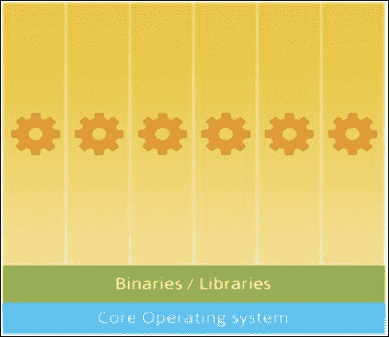

## 为什么选择容器？

以下是使用容器的一些重要好处：

+   以应用程序为中心的管理

+   部署和构建的分离

+   简化应用程序部署过程

+   通过持续集成和部署支持敏捷开发

+   允许将大型单体应用程序拆分为可管理的微服务

+   基础设施环境一致性

+   高可移植性

+   资源隔离

+   资源利用率

# Docker

**Docker** 是一个开源平台，自动化了任何应用程序部署为容器的过程，这些容器是便携的、轻量级的、自给自足的，并且可以在几乎任何地方运行。Docker 主要基于 **LXC** 或 **Linux 容器**，开发人员和系统管理员在处理分布式应用程序时使用它。它不仅仅是一个底层技术，而是充当一个综合的抽象层，使开发人员能够将应用程序及其依赖项进行*打包*或*容器化*，并在任何基础设施上运行。简单来说，Docker 容器就像货运集装箱，提供了一种标准且可靠的方式来运输任何应用程序。

Docker 为开发和 IT 运维团队提供了急需的敏捷性和控制能力，使其能够“构建、分发和运行任何应用程序，随时随地”。

+   **构建**：Docker 赋予您从微服务创建应用程序的灵活性，并且不必担心生产和开发环境之间可能存在的不一致性。此外，使用任何特定平台或语言都不受限制。

+   **分发**：Docker 允许您设计包含应用程序开发、测试和分发的整个周期，并通过一致的用户界面简化其管理。

+   **运行**：Docker 使您能够选择多种平台，以安全、可靠的方式部署可扩展的服务。

然而，Docker 的主要优势在于它提供了一个“应用优先”的架构，这也允许开发人员和 IT 运维/系统管理员专注于他们的核心职能。

+   **开发人员**：他们只关注容器内部的内容，如代码、数据、应用程序、库和包管理器。

+   **IT 运维**：他们需要关注容器外部的内容，即日志、监控、远程访问和网络配置。

Docker 本质上带来的好处可以有效地总结为以下几点：-

+   **敏捷性**：使用 Docker，开发人员可以自由定义环境。应用程序的创建和部署可以更快、更轻松地完成，IT 运维能够灵活地快速响应变化。

+   **控制**：确保从基础设施到应用程序的代码的所有权仅属于开发人员。IT 运维负责管理方面，确保操作环境的标准化、安全性和可扩展性。

+   **可移植性**：让你可以选择与单个开发人员或团队一起工作，使用私有基础设施或公共云提供商，同时避免复杂性。

为了更好地理解该平台，让我们来看一下与 Docker 解决方案相关的一些核心术语。

+   **镜像**：Docker 容器在静态时的基础。当通过 Docker run 命令实例化时，它们会变成一个容器。

+   **Dockerfile**：其主要功能是告知镜像构建器镜像应该是什么样子的。

+   **Docker Engine**：可以安装在物理、虚拟或云主机上。它提供了多个核心功能，包括拉取 Docker 镜像、创建和运行新容器、扩展现有容器，或停止和移除容器。

+   **容器**：这些是从 Docker 镜像构建的。它们的轻量特性归因于镜像层的共享和联合文件系统的使用。

+   **注册表**：这是管理、分发和存储 Docker 镜像的地方。

+   **Docker Hub**：Docker 提供的托管镜像注册表服务，用于管理镜像。

+   **Docker Machine**：它自动化了在选定的网络或云环境中容器的配置。可以安装在 Linux、Windows 或 Mac OS X 的机器上。

+   **Docker Compose**：定义需要多个容器的应用程序。

+   **Docker 工具箱**：将所有 Docker 工具（包括 Engine、Machine、Compose 和 Kitematic）提供给 Mac OS X 或 Windows 系统。

+   **Docker 受信任注册表** (**DTR**)：提供一个私有的、专用的镜像注册表。

+   **Docker Swarm**：用于托管集群和调度容器。

+   **Kitematic**：基本上是 Docker 的桌面图形界面（GUI）。

下图展示了一个基本的 Docker 系统。

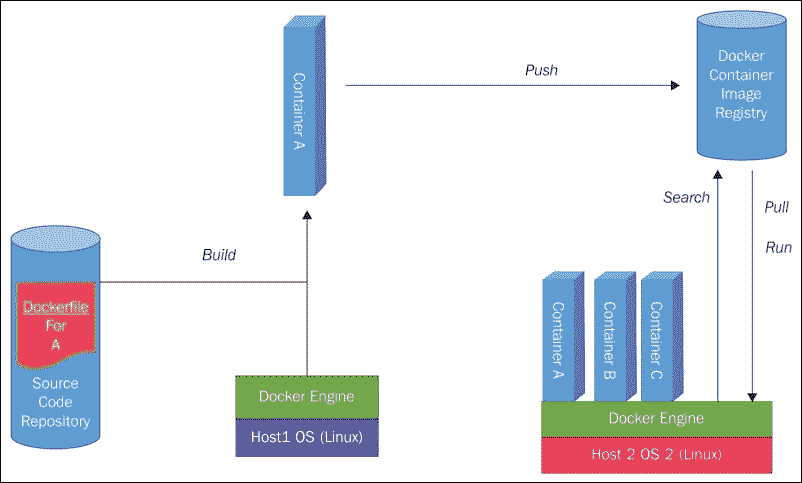

如上图所示，Docker 容器封装了一个软件及其运行所需的所有内容，如代码、运行时、系统库/工具。容器提供的这种封装和隔离性确保了容器在任何运行环境下都能以相同的方式运行。

下图展示了虚拟机和 Docker 容器的对比（来源：[`www.jayway.com/2015/03/21/a-not-very-short-introduction-to-docker/`](http://www.jayway.com/2015/03/21/a-not-very-short-introduction-to-docker/)）：

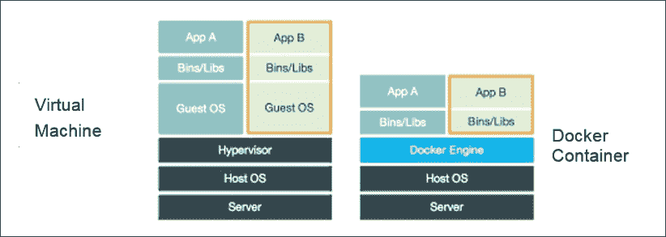

我们刚才看到的图示展示了虚拟机与 Docker 容器在架构上的差异。Docker 容器仅包含应用程序及其相关依赖，因此享有类似虚拟机的资源隔离和分配的好处，但效率更高且更具可移植性。

Docker 的可插拔架构通过多个开放 API（如 Swarm、Compose、Hub 等）的存在得到了进一步的利用，这些 API 支持创建一个无缝的应用交付生态系统。正是这种结合，使得 Docker 容器能够使分布式应用程序具有组合性、可移植性、动态性，且非常适合敏捷团队。

Docker 高级架构如后续图片所示（来源：[`www.docker.com`](http://www.docker.com)）：

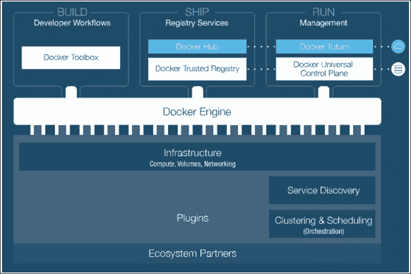

当我们考虑一些企业的使用案例时，这些优势变得愈发明显，在这些案例中，组织利用 Docker 平台解决了一些技术或业务挑战：

+   **持续集成**：通过与 GitHub 和 Jenkins 等工具的集成，Docker 使开发者能够更快地开发和测试应用，并在他们选择的环境中进行。整个过程被完美地简化，开发者可以在 GitHub 中提交代码，进行测试，并自动触发 Jenkins 构建。当镜像构建完成时，可以轻松地将其添加到 Docker 仓库。这一功能不仅节省了构建和设置的时间，还允许开发者在同时处理其他项目时，自动运行测试。再加上处理不同类型环境时不会出现不一致问题，使用 Docker 进行持续集成工作时，效率得到了显著提高。

+   **持续交付**：除了语言无关性外，Docker 在任何环境中都能工作，有效消除了因环境不一致而产生的问题。Docker 保证将代码以快速、易于消费并支持迅速解决问题的方式，持续交付给质量保证团队和客户。结合 Docker 仓库，以及与其他生产平台如 Docker Universal Control Plane 和 Tutum 的集成，使得代码能够分发给团队，团队可以在上线前在预发布环境中完全测试代码。这帮助企业减少了构建和交付应用所需的时间和费用。

+   **DevOps**：随着组织越来越多地采用 DevOps 哲学，Docker 提供了帮助开发和运维团队改进应用开发流程的关键工具。这些工具通过将开发和运维团队的工作及关注点进行分隔，打破了传统的团队间壁垒。

+   **大数据**：如今，企业正在转向大数据系统/技术，旨在对他们收集的数据进行深入和全面的分析。然而，数据源多种多样（如图像、视频、元数据等）。这时，利用一种可以统一在分析平台之间传输数据的系统，就显得尤为重要。采用 Docker 平台提供了显著的竞争优势，因为它促进了应用程序在不同环境之间的自由流动，从而确保了数据分析的无缝进行。

+   **基础设施优化**：与需要客户端操作系统或虚拟机管理程序的虚拟机不同，Docker 容器仅包含构建、分发和运行应用程序所需的内容。再加上根据需求启动或停止容器的能力，Docker 对企业来说是一个极具价值的附加工具。

Docker 进一步提供了云端可移植性，解放了 IT 运维团队，使其不再受限于特定的环境工具。实际上，Docker 减少了企业的存储和基础设施成本，并提高了效率。

## 容器化工具

如前所述，容器用于以下目的：

+   隔离任务与其他任务

+   确保任务在有限或受限资源的环境中运行

+   程序化控制任务的单个资源

+   通过打包镜像在不同环境中运行应用程序

+   将应用程序拆分为更小、更易管理的微服务

任务可以通过**容器化工具**在容器中运行。Mesos 支持流行的容器技术，如 Docker，同时也有自己的容器技术。最近，还增加了对结合不同容器技术并使其协同工作的支持（例如，Mesos 和 Docker）。

### 动机

集群管理器的关键要求之一是确保为特定框架分配的资源不会影响其他框架的任何正在运行的作业。因此，Mesos 的关键特性之一是提供在从属节点上实施隔离机制以分隔不同任务的能力。Mesos 利用容器进行资源隔离，并且具有可插拔的架构。Mesos 从属节点使用容器化工具 API 提供一个隔离的环境来运行框架的执行器及其相应任务。容器化工具 API 的目标是支持广泛的实现，这意味着可以开发自定义容器化工具和隔离器。当从属进程启动时，可以指定用于启动容器的容器化工具以及用于强制资源约束的隔离器集合。

### 容器化工具类型

在 Mesos 版本 0.27 中可用的容器化工具选项有：

+   组合

+   Docker

+   Mesos（默认）

用户可以通过代理标志`--containerizers`指定容器化工具类型。

例如：

```
--containerizers=mesos
```

### 容器化工具创建

容器化工具由从属节点基于标志配置（使用代理标志`--containerizers`）创建。在列出多个容器化工具（例如，Mesos 和 Docker）时，使用组合容器化工具来创建容器化工具，通过`--containerizers`标志来指定。

当在`TaskInfo`中未特别提到执行器时，Mesos 代理将使用任务默认执行器。

Mesos 中的容器化过程如下图所示（来源：《Apache Mesos Essentials》：[`www.packtpub.com/big-data-and-business-intelligence/apache-mesos-essentials`](https://www.packtpub.com/big-data-and-business-intelligence/apache-mesos-essentials)）：

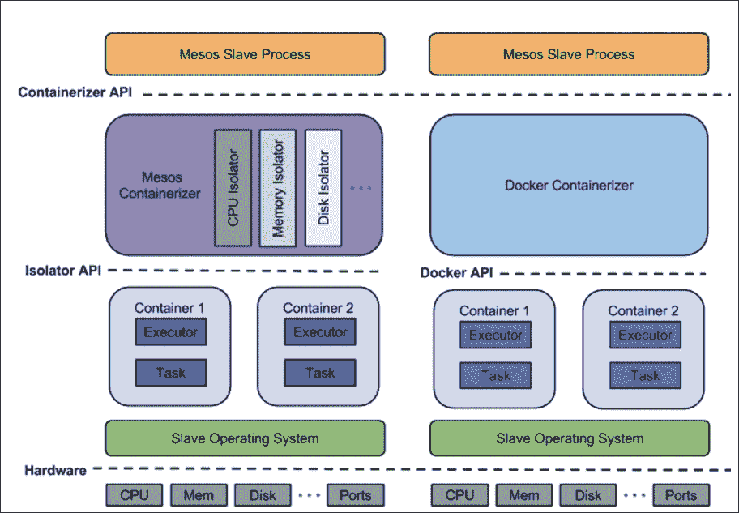

# Mesos 容器化工具

这是 Mesos 提供的默认容器化工具类型。在此类型中，任务可以通过 Mesos 提供的多个可插拔的隔离器来运行。可以通过配置代理标志来启用此类型：

```
--containerizers=mesos
```

此类型通常在以下情况下使用：

+   用户需要通过 Mesos 控制任务环境，而不依赖其他容器解决方案。

+   需要精细化操作系统控制。

+   需要为任务添加自定义资源隔离。

+   用户需要控制某些资源参数（例如，磁盘使用限制），而这些参数在其他容器解决方案中不可见。

任何未指定`ContainerInfo::DockerInfo`的任务将由 Mesos 容器化工具处理。

## 启动过程

容器启动过程包括以下步骤：

+   每个**隔离器**上的调用准备工作都已完成。

+   启动器负责分叉/销毁容器，使用它来分叉执行器。分叉出的“子进程”在隔离步骤完成之前无法执行。

+   **执行器**通过调用隔离器进行隔离。隔离器负责为容器创建一个环境，在该环境中，CPU、网络、存储和内存等资源可以与其他容器隔离。

+   执行器被获取并通知分叉的子进程执行。首先运行隔离器准备命令，然后进行执行。

## Mesos 容器化工具状态

不同的 Mesos 容器化工具状态如下：

+   PREPARING

+   ISOLATING

+   FETCHING

+   RUNNING

+   DESTROYING

## 内部实现

通过利用 Linux 的命名空间和**控制组**（**cgroups**）等功能，Mesos 容器化工具提供资源隔离和轻量级容器化。它提供了选择性启用不同隔离器的能力。此外，虽然仅包括使用报告而不进行实际隔离，但也支持**POSIX**（**可移植操作系统接口**）系统。

存在三种隔离器选项，具体描述如下：

### 共享文件系统

可以通过在 Linux 主机上使用共享文件系统隔离器来启用对每个容器的共享文件系统视图的修改。

可以通过`–default_container_info agent`标志或框架中的`ContainerInfo`来指定修改。

用于映射共享文件系统部分（例如主机路径与容器视图中的共享文件系统，即容器路径） 的卷，可以通过 `ContainerInfo` 指定为只读或读写模式。主机的路径可以是绝对路径或相对路径。如果是绝对路径，还会导致文件系统子树在容器路径下对每个容器可访问。如果是相对路径，则该路径会被视为相对于执行器工作目录的目录。该目录会被创建，并且共享文件系统中相应现有目录的权限将被复制过来。

使用此隔离器的主要原因是为了选择性地将某些共享文件系统部分设置为对每个容器私有。例如，可以通过设置 `host_path="dir_name"` 和 `container_path="/dir_name"` 来设置一个私有目录 `/dir_name`。这将在执行器的工作目录中创建一个目录 `dir_name`，并将其挂载为容器中的 `/dir_name`。容器无法看到主机的 `/dir_name` 或其他任何容器的 `/dir_name`，并且这个操作对容器内运行的进程是透明的。

### Pid 名称空间

此隔离器用于将每个容器隔离到不同的 pid 名称空间，这带来以下两个优势：

1.  **可见性**：容器内运行的执行器及其后代进程无法查看或与名称空间外部运行的外部进程进行交互。

1.  **清理终止**：如果 pid 名称空间中的主进程被终止，内核将终止该名称空间内运行的所有其他进程。

### Posix 磁盘隔离器

该隔离器可用于 OS X 和 Linux，用于提供基本的磁盘隔离。可以通过此隔离器报告每个沙箱的磁盘使用情况，并可以强制执行任何设置的磁盘配额。

在启动从属节点时，必须将 `posix/disk` 添加到 `--isolation` 标志中以启用此隔离器。

默认情况下禁用磁盘配额强制执行。在启动从属节点时，指定 `--enforce_container_disk_quota` 来启用它。

每个沙箱的磁盘使用情况通过定期运行 `du` 命令进行报告。资源统计端点（`/monitor/statistics.json`）提供了一种检索磁盘使用情况统计信息的方法。

两个 `du` 命令之间的时间间隔可以通过代理标志 `--container_disk_watch_interval` 来配置。例如，`--container_disk_watch_interval = 1 mins` 指定时间间隔为 1 分钟。默认时间间隔为 15 秒。

## Docker 容器化器

该容器化类型允许在 Docker 容器内运行任务。可以将 Docker 镜像作为执行器或任务启动。通过配置代理标志启用它

```
--containerizers=docker
```

通常在以下情况下使用：

+   需要使用 Docker 包来运行任务。

+   一个 Mesos 从属节点正在 Docker 容器中运行。

### 设置

为了在从节点上启用 Docker 容器化工具，从节点必须在启动时将 "Docker" 作为其中一个容器化选项。

```
mesos-slave --containerizers=docker
```

每个指定了 Docker 容器化的从节点必须安装 Docker 命令行界面客户端（版本 1.0.0 或以上）。

如果从节点启用了 `iptables`，确保 `iptables` 允许来自桥接接口的所有流量，可以通过以下更改来实现：

```
iptables -A INPUT -s 172.17.0.0/16 -i docker0 -p tcp -j ACCEPT

```

### 启动过程

容器启动过程如下：

+   只有当 `ContainerInfo::type` 设置为 `DOCKER` 时，才会尝试在 Docker 中启动任务

+   镜像首先从指定的仓库中拉取

+   预启动钩子随后被调用

执行器随后以以下两种方式之一启动：

1.  在以下情况下，Mesos 代理会在 Docker 容器中运行：

    +   如果存在 `--docker_mesos_image` 标志，表示 Mesos 代理在 Docker 容器中运行

    +   `--docker_mesos_image` 标志的值被视为用于启动 Mesos 代理的 Docker 镜像

    +   如果任务使用不同于默认命令执行器的执行器，它将在 Docker 容器中启动

    +   如果任务使用 `TaskInfo`，则默认的 `mesos-docker-executor` 会在 Docker 容器中启动，通过 Docker 命令行界面执行命令。

1.  以下情况下，Mesos 代理不会在 Docker 容器中运行：

    +   如果任务使用 `TaskInfo`，则会创建一个子进程来运行默认的 `mesos-docker-executor`。该执行器会通过 Docker 命令行界面生成 Shell 以执行 Docker 命令。

    +   如果任务使用了自定义执行器，它将在 Docker 容器中启动。

### Docker 容器化状态

以下是不同的 Docker 容器化状态：

+   获取中

+   拉取中

+   运行中

+   销毁中

### 组合容器化工具

这种类型允许结合并使不同的容器技术协同工作（例如，Mesos 和 Docker）。可以通过配置 `--containerizers` 代理标志，并用逗号分隔的容器化工具名称列表来启用。

```
--containerizers=mesos,docker
```

列表中指定的第一个容器化工具提供对任务容器配置的支持，用于任务启动。

+   此选项通常在需要测试具有不同资源隔离类型的任务时使用。框架可以利用组合容器化工具，通过 Mesos 容器化工具提供的受控环境来测试任务，同时确保任务与 Docker 容器兼容。

# Mesos 管理的容器的网络配置

在 Mesos 中提供与网络相关的支持的主要目标之一是开发一个可插拔的架构，用户可以根据自己的需求实现定制的网络机制。由于不同部署场景（云环境、本地部署、私有云或其他混合模型）对网络的需求不同，创建一个单一的网络机制来满足所有需求并不现实。Mesos 的可插拔架构在解决这一问题时非常有用。

为提供网络支持，从版本 0.25.0 开始，Mesos 组件引入了许多可选扩展。可选结构允许没有网络支持的现有框架在更新的 Mesos 版本上无缝运行。Mesos 支持与其他网络机制的集成，并提供服务发现、每个容器的 IP 以及任务隔离等功能。

网络支持是通过一个 Mesos 模块提供的，这意味着它被抽象化，脱离了 Mesos 的主节点和从节点。所有所需的支持需要从网络模块本身启用。由于 IP 请求是基于尽力而为的原则处理的，因此框架还需要能够处理因未实现网络模块或模块无法分配 IP 而导致的请求被忽略或拒绝的情况。

框架调度器需要通过在`TaskInfo`中使用额外的数据结构来选择网络隔离。这一结构确保与旧框架保持向后兼容。

## 架构

提供了包括不同组件描述的解决方案架构，如下图所示（来源：[`mesos.apache.org/documentation/latest/networking-for-mesos-managed-containers/`](http://mesos.apache.org/documentation/latest/networking-for-mesos-managed-containers/)）：

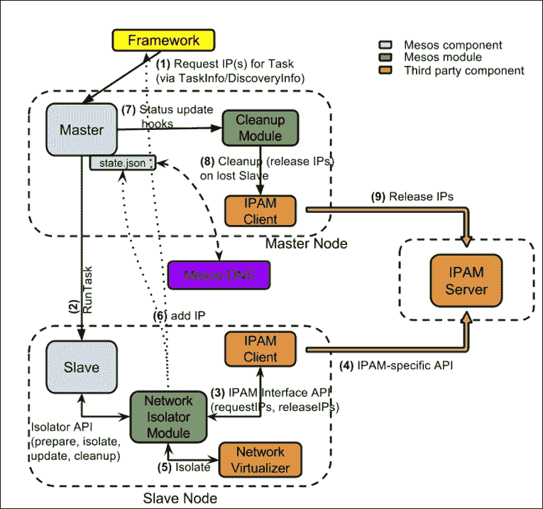

## 关键术语

关于网络的一些关键术语如下：

+   **IP 地址管理（IPAM）服务器**

    +   IP 按需分配

    +   IP 在释放后会被回收

    +   IP 可以选择性地使用提供的 ID 进行标记

+   **IPAM 客户端**

    +   与对应的 IPAM 服务器紧密耦合

    +   作为 IPAM 服务器与网络隔离模块之间的桥梁

    +   处理与服务器的 IP 相关通信（释放、请求等）

+   **网络隔离模块（NIM）**

    +   Mesos 模块用于实现隔离器接口的从节点

    +   任务的 IP 需求由查看`TaskInfo`来决定

    +   处理与 IPAM 客户端的 IP 相关通信（释放、请求等）

    +   通过与外部网络虚拟化器通信，实现网络隔离

+   **清理模块**：

    +   处理清理任务（如 IP 释放），当从节点丢失时

## 过程

1.  Mesos 框架为每个启动的容器请求 IP，使用`TaskInfo`消息。

1.  Mesos 主节点在处理完这些消息后，将其转发给从节点，用于启动和运行任务。

1.  Mesos 从节点通过分析这些消息来了解容器需求，并为其准备不同的隔离器。

1.  **网络隔离模块**分析这些消息，并决定是否启用网络隔离器。

1.  网络隔离模块随后会与 IPAM 客户端通信，请求 IP 地址，前提是它决定需要启用网络隔离器，并向从节点提供状态更新。

1.  在收到此更新后，容器将在不同的命名空间中由从节点启动。这是由网络隔离模块完成的，网络隔离模块会在接到从节点的指示后通知网络虚拟化器进行容器隔离。

1.  IP 信息由网络隔离模块添加到`TaskStatus`中。

1.  网络隔离模块随后会将来自`TaskStatus`的 IP 地址提供给主节点的状态端点，同时通过将`TaskStatus`转发给框架，让框架了解这些 IP 地址。

1.  如果任务丢失，网络隔离模块会通知 IPAM 客户端，并释放 IP 地址。

1.  然后清理模块会收到通知，接着回收所有由 IPAM 客户端释放的 IP 地址。

网络隔离模块的示例实现可以在[`github.com/mesosphere/net-modules`](https://github.com/mesosphere/net-modules)查看。

## 框架中的每容器 IP 功能

寻求实现每容器 IP 功能的框架，需要在`TaskInfo`内传递`NetworkInfo`消息。`NetworkInfo`消息的详细信息将在以下部分给出。

### NetworkInfo 消息

新的`NetworkInfo`消息可以按如下方式引入：

```
message NetworkInfo {
  enum Protocol {
    IPv4 = 1;
    IPv6 = 2;
  }

  message IPAddress {
    optional Protocol protocol = 1;

    optional string ip_address = 2;
  }

  repeated IPAddress ip_addresses = 5;

  repeated string groups = 3;

  optional Labels labels = 4;
};
```

当请求来自 IP 地址管理的 IP 地址时，协议字段需要设置为`IPv4`或`IPv6`。如果网络隔离模块支持，框架可以为每个容器设置静态 IP 地址。可以通过提供有效的 IP 作为`ip_address`字符串来完成。这通常在需要重新启动已终止或丢失的任务，并且任务需要在另一个节点上使用相同 IP 地址时才需要。

### 指定网络要求的示例

需要启用每个容器一个 IP 的框架需要在`TaskInfo`中提供`NetworkInfo`消息。以下是几个示例：

1.  使用默认命令执行器请求一个 IP 地址，但未指定协议版本：

    ```
    TaskInfo {
         ...
         command: ...,
         container: ContainerInfo {
           network_infos: [
             NetworkInfo {
               ip_addresses: [
                 IPAddress {
                   protocol: None;
                   ip_address: None;
                 }
               ]
               groups: [];
               labels: None;
             }
           ]
         }
       }
    ```

1.  使用默认命令执行器请求两个 IP 地址，其中一个是 IPv4 协议，另一个是 IPv6 协议，分为两个组：

    ```
    TaskInfo {
    ```

    ```
         ...
         command: ...,
         container: ContainerInfo {
           network_infos: [
             NetworkInfo {
               ip_addresses: [
                 IPAddress {
                   protocol: IPv4;
                   ip_address: None;
                 },
                 IPAddress {
                   protocol: IPv6;
                   ip_address: None;
                 }
               ]
               groups: ["A", "B"];
               labels: None;
             }
           ]
         }
       }
    ```

1.  使用默认命令执行器请求两个网络接口，每个接口一个 IP 地址且分别属于不同的网络组：

    ```
    TaskInfo {
         ...
         command: ...,
         container: ContainerInfo {
           network_infos: [
             NetworkInfo {
               ip_addresses: [
                 IPAddress {
                   protocol: None;
                   ip_address: None;
                 }
               ]
               groups: ["A"];
               labels: None;
             },
             NetworkInfo {
               ip_addresses: [
                 IPAddress {
                   protocol: None;
                   ip_address: None;
                 }
               ]
               groups: ["B"];
               labels: None;
             },
           ]
         }
       }
    ```

1.  使用自定义执行器请求特定 IP 地址：

    ```
    TaskInfo {
         ...
         executor: ExecutorInfo {
           ...,
           container: ContainerInfo {
             network_infos: [
               NetworkInfo {
                 ip_addresses: [
                   IPAddress {
                     protocol: None;
                     ip_address: "xx.xx.x.x";
                   }
                 ]
                 groups: [];
                 labels: None;
               }
             ]
           }
         }
       }
    ```

## 地址发现

正如前面所见，框架可以在启动 Mesos 从节点上的任务时，通过在 `TaskInfo` 消息中传递 `NetworkInfo` 消息来请求分配 IP 地址。框架在选择网络隔离后，还需要一个机制来了解最终分配的 IP 地址，以便进行监控和其他通信活动。这可以通过在 `TaskStatus` 消息中引入一个额外的字段来实现，如下所示：

```
message ContainerStatus {
  repeated NetworkInfo network_infos;
}

message TaskStatus {
  ...
  optional ContainerStatus container;
  ...
};
```

## 实现自定义网络隔离模块

Mesos 提供了一个 Isolator API，允许在其基础上实现自定义的网络隔离模块。实现的模块会以动态共享库的形式在 Mesos 从节点中显现，并与容器启动过程无缝集成。网络隔离器通常与网络虚拟化器和 IP 地址管理（IPAM）客户端进行通信，以满足框架的需求。

网络隔离模块必须实现的三个关键功能如下：

1.  `Isolator::prepare()`：此函数为模块提供了一个选项，允许它确定是否需要为指定的容器启用网络隔离。`Isolator::prepare` 函数指示从节点在启用网络隔离时创建一个不同的网络命名空间。此接口还负责为容器创建一个 IP 地址。

1.  `Isolator::isolate()`：此函数为模块提供了一个机会，在任务容器创建后但执行器启动之前进行容器隔离。它涉及为容器创建一个虚拟以太网适配器并为其分配 IP 地址。它还可以利用外部虚拟化器进行网络配置。

1.  `Isolator::cleanup()`：此函数在容器终止时被调用。它的主要任务是回收和再利用已释放的 IP 地址，并进行其他必要的清理工作。

## 监控容器网络统计信息

每个容器网络的统计信息可以通过 Mesos 的 `/monitor/statistics.json` 从节点端点提供。

报告了以下计数器：

| 指标 | 描述 | 类型 |
| --- | --- | --- |
| `net_rx_bytes` | 接收的字节 | 计数器 |
| `net_rx_dropped` | 丢弃的包（接收） | 计数器 |
| `net_rx_errors` | 报告的错误（接收） | 计数器 |
| `net_rx_packets` | 接收的包 | 计数器 |
| `net_tx_bytes` | 发送的字节 | 计数器 |
| `net_tx_dropped` | 丢弃的包（发送） | 计数器 |
| `net_tx_errors` | 报告的错误（发送） | 计数器 |
| `net_tx_packets` | 发送的包 | 计数器 |

此外，以下计数器和测量值可以报告用于膨胀减少或带宽限制的元素，这些元素在 `statistics/net_traffic_control_statistics` 键下实现：

| 指标 | 描述 | 类型 |
| --- | --- | --- |
| `backlog` | 排队的字节（仅在膨胀减少接口上） | 测量 |
| `bytes` | 发送的字节 | 计数器 |
| `drops` | 丢弃的包（发送） | 计数器 |
| `overlimits` | 接口超过传输限制的次数 | 计数器 |
| `packets` | 发送的数据包 | 计数器 |
| `qlen` | 排队的数据包 | 测量 |
| `ratebps` | 传输速率（当前始终为 0 字节/秒） | 测量 |
| `ratepps` | 传输速率（当前始终为 0 数据包/秒） | 测量 |
| `requeues` | 失败的数据包 | 计数器 |

### 示例统计

以下是获得的统计数据示例：

```
$ curl -s http://localhost:5051/monitor/statistics | python2.6 -mjson.tool

[
  {
    "executor_id": "job.<job_id>",
    "executor_name": "Command Executor (Task: job.<job_id>) (Command: sh -c 'iperf ....')",
    "framework_id": "<some_id>",
    "source": "job.<job_id>",
    "statistics": {
      "cpus_limit": <some_value>,
      "cpus_nr_periods": <some_value>,
      "cpus_nr_throttled": <some_value>,
      "cpus_system_time_secs": <some_value>,
      "cpus_throttled_time_secs": <some_value>,
      "cpus_user_time_secs": <some_value>,
      "mem_anon_bytes": <some_value>,
      "mem_cache_bytes": <some_value>,
      "mem_critical_pressure_counter": <some_value>,
      "mem_file_bytes": <some_value>,
      "mem_limit_bytes": <some_value>,
      "mem_low_pressure_counter": <some_value>,
      "mem_mapped_file_bytes": <some_value>,
      "mem_medium_pressure_counter": <some_value>,
      "mem_rss_bytes": <some_value>,
      "mem_total_bytes": <some_value>,
      "net_rx_bytes": <some_value>,
      "net_rx_dropped": <some_value>,
      "net_rx_errors": <some_value>,
      "net_rx_packets": <some_value>,
      "net_traffic_control_statistics": [
        {
          "backlog": <some_value>,
          "bytes": <some_value>,
          "drops": <some_value>,
          "id": "bw_limit",
          "overlimits": <some_value>,
          "packets": <some_value>,
          "qlen": <some_value>,
          "ratebps": 0,
          "ratepps": 0,
          "requeues": 0
        },
        {
          "backlog": <some_value>,
          "bytes": <some_value>,
          "drops": <some_value>,
          "id": "bloat_reduction",
          "overlimits": <some_value>,
          "packets": <some_value>,
          "qlen": <some_value>,
          "ratebps": 0,
          "ratepps": 0,
          "requeues": 0
        }
      ],
      "net_tx_bytes": <some_value>,
      "net_tx_dropped": <some_value>,
      "net_tx_errors": <some_value>,
      "net_tx_packets": <some_value>,
      "perf": {
        "duration": <some_value>,
      "timestamp": <some_value>,
      },
      "timestamp": <some_value>,
    }
  }
]
```

# Mesos 图像供应器

**Image** 是根文件系统更改的有序集合，以及用于容器运行时的相应执行参数。

大多数容器规范，如 Docker、**App** **Container**（**AppC**）或 **Open Container Project**（**OCP**），在很大程度上将图像格式的实现和规范与其他容器组件（如资源隔离和任务执行）结合在一起。Mesos **Image Provisioner** 旨在通过支持来自多种图像格式的容器文件系统供应，增强 Mesos 容器化器的功能，同时还通过与其他组件（如隔离器）结合，提供资源隔离等特性。

使用 Mesos 容器化器创建的 Mesos 容器提供了一个已经用 Docker 或 AppC 图像配置好的根文件系统，该文件系统是通过 Mesos 图像供应器进行供应的。

容器文件系统图像通过一个新的消息`Image`来描述，代码如下所示：

```
message Image {
  enum Type {
    DOCKER = 1;
    APPC = 2;
    // More Image types.
  }

  message Docker {
    // Docker configurations
  }

  message Appc {
    // Appc configurations.
  }

  required Type type = 1;

  // Only one of the following image messages should be set to match
  // the type.
optional Docker docker = xx;
optional Appc appc = yy;

}
```

此消息包含了图像规范类型以及相应的类型配置。该消息可以通过'Volume'或`ContainerInfo`传递。当在`ContainerInfo`中配置图像时，会为任务提供一个根文件系统，而在'Volume'中指定'Image'消息的情况下，卷与图像文件系统一起挂载。

容器镜像的请求被转发给相应的供应商，以供应各层。层通常是文件系统更改集，实际上就是添加、修改或删除文件的归档。供应器进一步要求配置好的设置根据这些层供应一个根文件系统。

## 设置和配置选项

要在从节点上启用 Mesos 容器化功能，必须使用 `mesos containerizer`（默认选项）启动，如本章前文所示。该从节点还需要在 Linux 系统上运行并具有 root 权限。

接下来，必须通过 `--isolation` 标志将文件系统/Linux 设置为隔离器选项。可以通过将图像供应商作为逗号分隔的列表传递到代理标志 `--image_providers` 中来配置图像供应商，并且可以通过 `--image_provisioner_backend` 标志指定支持的后端。如果需要，也可以为每个图像供应商提供额外的配置。

以下是一个示例：

```
mesos-slave --containerizers=mesos --image_providers=appc,docker --image_provisioner_backend=copy --isolation=filesystem/linux

```

欲了解更多信息，请访问 [`mesos.readthedocs.io/en/latest/mesos-provisioner/`](http://mesos.readthedocs.io/en/latest/mesos-provisioner/)。

# Mesos 获取器

Mesos 获取器是一种在准备任务执行时可以将资源下载到 `task sandbox` 目录的方式。请求执行任务的框架将一组 `CommandInfo::URI` 值作为 `TaskInfo` 消息的一部分发送，这些值作为 Mesos 获取器的输入。

Mesos 获取器原生支持 FTP 和 HTTP 协议，还能够从文件系统中复制文件。它还支持所有 Hadoop 客户端协议，如**Amazon 简单存储服务**（**S3**）、**Hadoop 分布式文件系统**（**HDFS**）等。

每个请求的统一资源标识符（URI）默认会直接下载到 `sandbox` 目录。对相同 URI 的多个请求将导致该资源反复被下载。下载的 URI 也可以选择性地缓存到指定目录中，以供重用。

## 机制

该机制包括以下内容：

1.  每个从属节点包含一个内部获取器实例，所有容器化类型都会利用该实例。获取器进程包含在从属节点程序中，负责对缓存中存在的内容进行账务管理。

1.  还有一个外部 `mesos-fetcher` 程序，它会在需要从指定 URI 下载资源到缓存或目录时由步骤 1 中提到的内部程序调用。当缓存中的资源需要移动到 `sandbox` 目录时，也会调用该程序。除了删除和查询文件大小外，所有的磁盘和网络操作都由它执行。它更像是一个简单的辅助程序，而所有的智能都位于内部程序中。

除了缓存文件外，整个系统不会维护任何持久状态。这有助于管理同时获取和缓存的复杂性，并且通常简化了整体架构。

下图描述了内部获取器进程与外部 `mesos-fetcher` 程序之间的交互。后续的图表将更详细地讲解内部工作流程。来源：[`mesos.apache.org/documentation/latest/fetcher-cache-internals/`](http://mesos.apache.org/documentation/latest/fetcher-cache-internals/)。

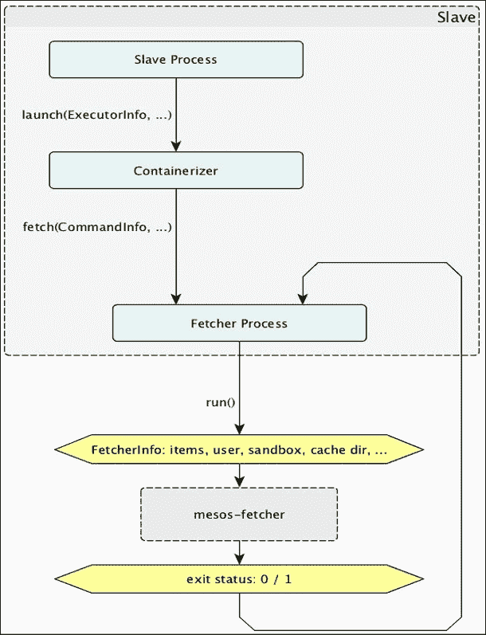

## 缓存条目

获取器进程可以提供关于缓存 URI 的详细信息，除了提供有关缓存文件位置、处理阶段等信息外。

**HashMap** 被用来存储之前提到的所有信息。每个 `Cache::Entry` 对象包含一个缓存文件的详细信息。这些对象可以通过多个回调引用，以对应于多个获取操作，并存储在 HashMap 中。

每个缓存条目在整个文件存储期间都与一个磁盘缓存文件一一对应，这个过程包括文件创建之前和之后的时间段。该条目包含与该阶段相关的所有状态信息以及相应的 URI 抓取结果。

如果一个缓存条目正在被引用，它不能通过任何试图腾出空间以便为新下载的缓存文件腾出位置的抓取操作被删除。

下一个图示展示了缓存条目的各种状态。它说明了在一次抓取运行中的事件序列。图中的颜色代表以下含义：

+   **蓝色**：没有缓存存在

+   **绿色**：此运行未引用的缓存条目

+   **橙色**：缓存条目已引用

只要有任何事件引用了某个缓存条目，该条目就不应被删除。这是通过一种叫做**引用计数**的机制来强制执行的。每当一个缓存条目被抓取操作使用时，字段“引用计数”中的值会增加，而在运行结束时，无论该运行是否成功，该值都会减少。值的增加发生在以下情况：

+   创建新缓存条目

+   等待下载现有条目的文件

+   抓取与条目对应的缓存文件

每次值的增加都会在列表中标注。导致增量的活动结束时，该值会减少。

给出的图示展示了缓存条目可以处于的不同状态。

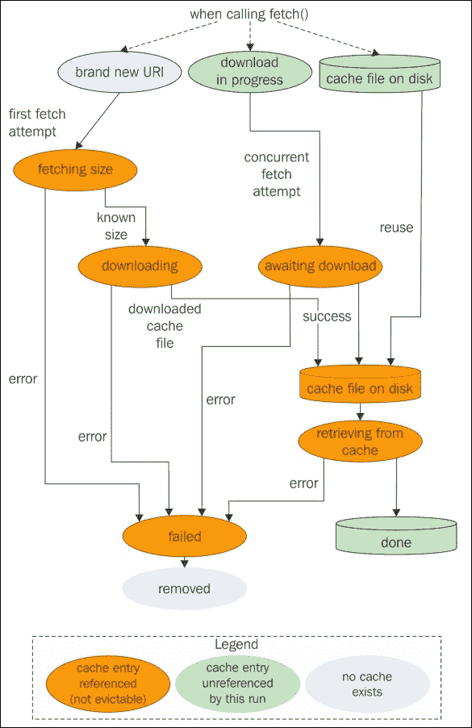

## URI 流程图

抓取进程决定处理每个正在抓取的 URI 的控制逻辑。以下是说明此流程图的图示：

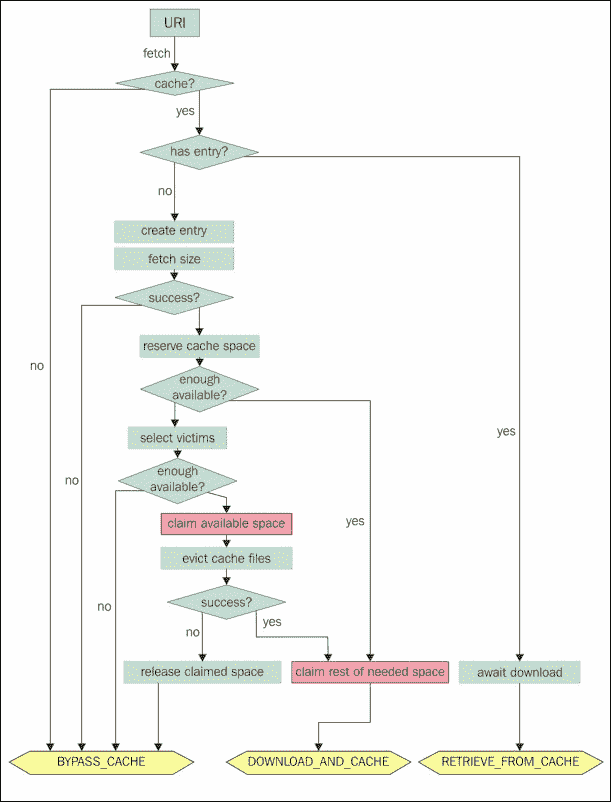

## 缓存驱逐

假设有两个资源，*A* 和 *B*，它们分别被抓取并缓存到两个沙盒中，如下图所示。在此过程中，每个资源都会创建一个缓存文件，并将资源与相应的缓存文件进行映射。来源：[`mesos.apache.org/documentation/latest/fetcher-cache-internals/`](http://mesos.apache.org/documentation/latest/fetcher-cache-internals/)。

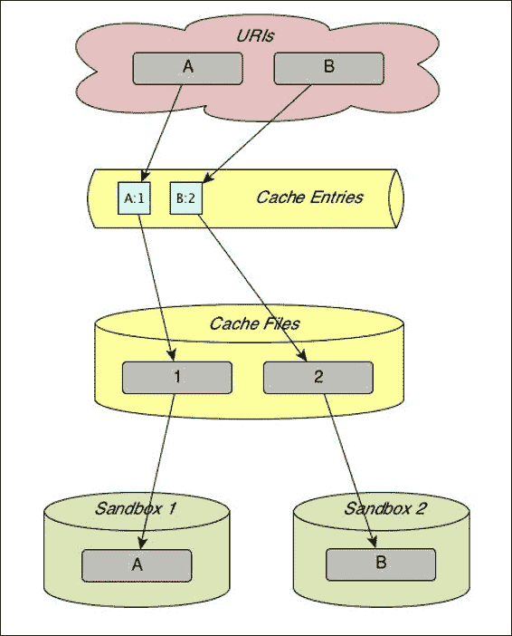

现在假设有一个第三个资源 *C*，它被下载并缓存到一个新的沙盒中。假设没有足够的空间容纳所有三个条目，那么就需要删除或驱逐一个现有的缓存文件及其相应条目，以便为新的缓存条目腾出空间。假设资源 *A* 在 *B* 之前被抓取，那么缓存驱逐过程会移除 *A*，因为它是最早的条目。移除步骤如下：

1.  *A* 的缓存条目从条目表中被移除。

1.  *C* 被抓取，这会创建一个新的缓存文件，并生成与之关联的缓存条目。

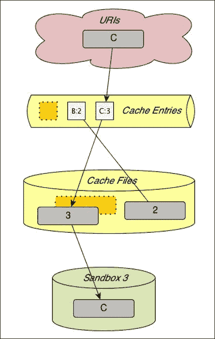

如果第一次请求的资源 *A* 被再次获取，那么 *B* 将会被逐出，因为它是最旧的条目；当然，前提是没有足够的空间来容纳三个缓存文件。

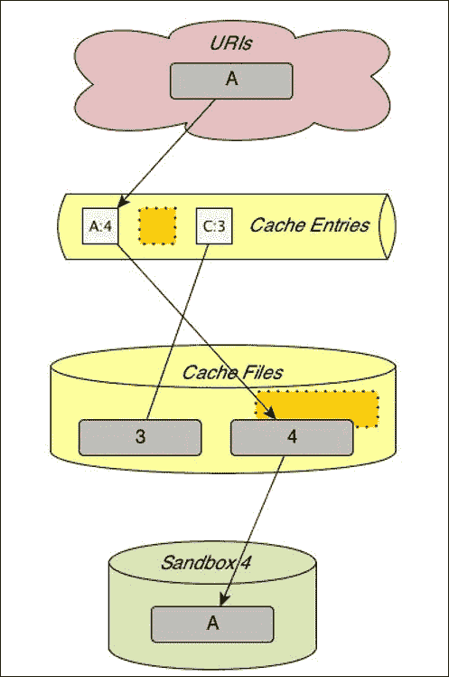

# 使用 Docker 和 Mesos 部署容器化应用

本节简要概述了如何在 Mesos 上使用 Marathon 部署一个 Docker 容器化的 Node.js 应用。你需要在机器上预先安装 Docker 和 fig。接下来，让我们按照以下步骤进行部署：

1.  由于我们部署的是一个简单的 Node.js 应用，我们可以从创建一个简单的 `App.js` 文件开始，打印出 `Hello World`，这是一个简单的 hello world Node.js 程序。

    ```
    var http = require('http'); 
    // Configure our HTTP server to respond with Hello World to all requests.
    var server = http.createServer(function (request, response) {
      response.writeHead(200, {"Content-Type": "text/plain"});
      response.end("Hello World	");
    }); 
    // Listen on port 8000, IP defaults to "0.0.0.0"
    server.listen(8000); 
    // Put a friendly message on the terminal
    console.log("Server running at http://127.0.0.1:8000/");
    ```

1.  接下来，我们创建 `package.json` 文件，内容如下：

    ```
    {
      "name": "hello-world",
      "description": "hello world",
      "version": "0.0.1",
      "private": true,
      "dependencies": {
        "express": "3.x"
      },
      "scripts": {"start": "node app.js"}
    }
    ```

1.  下一步是将我们的应用容器化。为此，我们可以创建一个包含以下内容的 `Dockerfile` 文件：

    ```
    FROM google/nodejs
    WORKDIR /app
    ADD package.json /app/
    RUN npm install
    ADD . /app
    EXPOSE 8000
    CMD []
    ENTRYPOINT ["/nodejs/bin/npm", "start"]
    ```

1.  现在，我们可以使用以下命令构建容器：

    ```
    $ docker build -t my_nodejs_image .
    $ docker run -p 8000:8000 my_nodejs_image

    ```

我们可以通过打开浏览器中的 `localhost:8000` 来确保一切正常运行，这将显示我们的 **Hello World** 文本。


1.  下一步是构建我们的 `fig.yml` 文件。在这里，我们将使用 fig 作为编排引擎，通过单个命令部署所有核心服务。`fig.yml` 文件的内容如下：

    ```
    # Zookeeper: -p 2181:2181 -p 2888:2888 -p 3888:3888
    zookeeper:
     image: jplock/zookeeper:3.4.5
     ports:
     - "2181"
    master:
     image: redjack/mesos-master:0.21.0
     hostname: master
     links:
     - zookeeper:zookeeper
     environment:
     - MESOS_ZK=zk://zookeeper:2181/mesos
     - MESOS_QUORUM=1
     - MESOS_WORK_DIR=/var/lib/mesos
     - MESOS_LOG_DIR=/var/log
     ports:
     - "5050:5050"
    marathon:
     #image: garland/mesosphere-docker-marathon
     image: mesosphere/marathon
     links:
     - zookeeper:zookeeper
     ports:
     - "8080:8080"
     # Adding the params via command
    command: --master zk://zookeeper:2181/mesos --zk zk://zookeeper:2181/marathon
    slave:
     image: redjack/mesos-slave:0.21.0
     links:
     - zookeeper:zookeeper
     - master:master
     environment:
     - MESOS_MASTER=zk://zookeeper:2181/mesos
     - MESOS_EXECUTOR_REGISTRATION_TIMEOUT=5mins
     - MESOS_CONTAINERIZERS=docker,mesos
     - MESOS_ISOLATOR=cgroups/cpu,cgroups/mem
     - MESOS_LOG_DIR=/var/log
     volumes:
     - /var/run/docker.sock:/run/docker.sock
     - /usr/bin/docker:/usr/bin/docker
     - /sys:/sys:ro
     - mesosslace-stuff:/var/log
     expose:
     - "5051"
    registry:
     image: registry
     environment:
     - STORAGE_PATH=/registry
     volumes:
     - registry-stuff:/registry
     ports: 
     - "5000:5000"

    ```

1.  在前面的配置中，我们已经配置了 Docker 注册表运行在 `5000` 端口，同时还配置了一个 Mesos 从节点、Mesos 主节点、Marathon 和 ZooKeeper 用于内部通信。

1.  现在，我们可以使用以下命令启动 Docker 注册表服务：

    ```
    $ fig up

    ```

    该命令将启动前述配置文件中列出的所有服务，如 Mesos 主节点、Mesos 从节点、Marathon、ZooKeeper 和 Docker 注册表。

1.  现在，我们可以构建 Docker 镜像，并使用以下命令将其推送到注册表：

    ```
    # Build an image
    $ docker build -t localhost:5000/containersol/nodejs_app

    # Push it to the registry
    $ docker push localhost:5000/containersol/nodejs_app

    ```

1.  现在我们已经准备好集群，可以通过 Marathon 部署我们的 Node.js 应用。为此，我们需要创建一个应用配置文件（`app_marathon.json`），内容如下：

    ```
    {
      "id": "app", 
      "container": {
        "docker": {
          "image": "localhost:5000/containersol/nodejs_app:latest",
          "network": "BRIDGE",
          "portMappings": [
            {"containerPort": 8000, "servicePort": 8000}
          ]
        }
      },
      "cpus": 0.2,
      "mem": 512.0,
      "instances": 1
    }
    ```

1.  然后，我们使用以下命令将其部署到 Marathon 上：

    ```
    $ curl -X POST -H "Content-Type: application/json" http://localhost:8080/v2/apps -d@app_marathon.json

    ```

1.  现在，我们可以打开运行在 `8080` 端口的 Marathon Web UI，并查看我们的 Node.js 应用是否正常运行：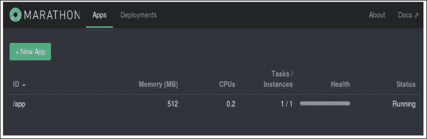

我们可以通过将浏览器指向 `localhost:31000` 端口来查看我们的 Node.js hello world 应用：


（参考：[`container-solutions.com/continuous-delivery-with-docker-on-mesos-in-less-than-a-minute/`](http://container-solutions.com/continuous-delivery-with-docker-on-mesos-in-less-than-a-minute/))

[`container-solutions.com/continuous-delivery-with-docker-on-mesos-in-less-than-a-minute-part-2/`](http://container-solutions.com/continuous-delivery-with-docker-on-mesos-in-less-than-a-minute-part-2/))

# 总结

本章节涵盖了与 Mesos 中容器化相关的几个重要主题。资源隔离是 Mesos 最受推崇的功能之一，本章节中介绍的主题希望能帮助您理解这一特性。

在接下来的章节中，我们将看到一些当前由 Mesos 支持的重要大数据框架，如 Hadoop、Spark 和 Storm，并了解如何在 Mesos 上进行设置和配置。
