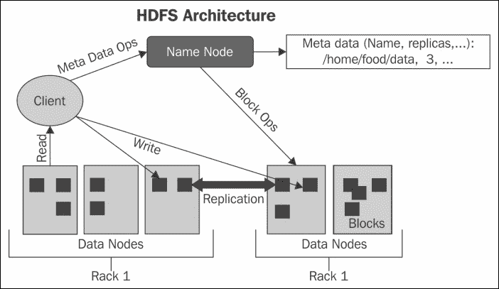
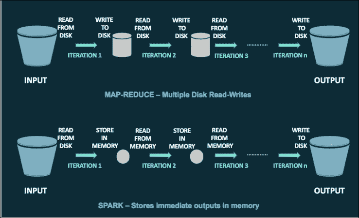
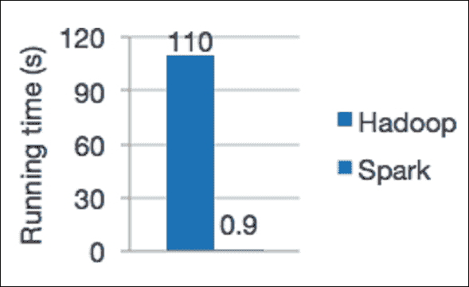
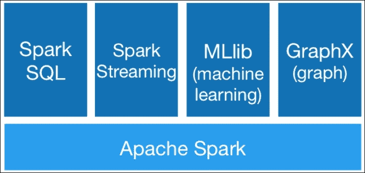
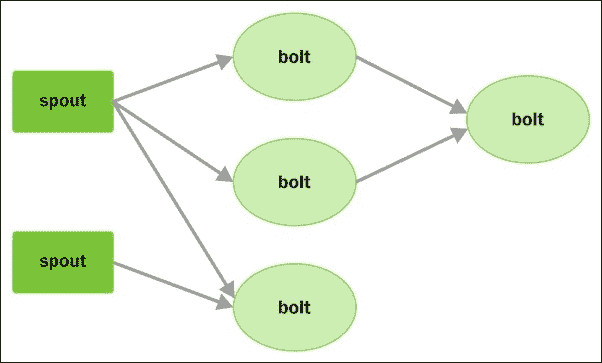
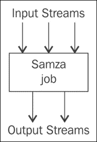
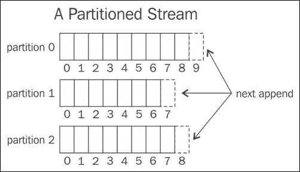
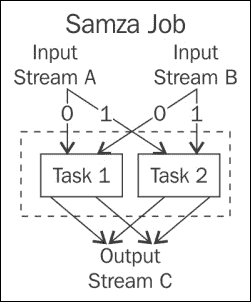
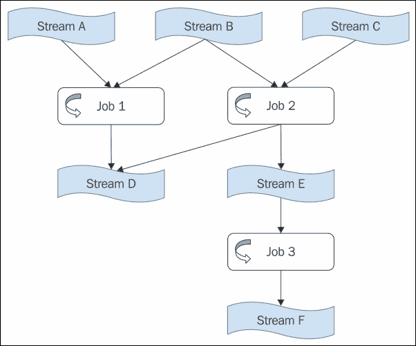

# 第八章：Mesos 大数据框架

本章是关于如何在 Mesos 上部署重要的大数据处理框架（如 Hadoop、Spark、Storm 和 Samza）的指南。

# Hadoop on Mesos

本节将介绍 Hadoop，解释如何在 Mesos 上设置 Hadoop 栈，并讨论设置栈时常遇到的问题。

## Hadoop 简介

Hadoop 是由 Mike Cafarella 和 Doug Cutting 于 2006 年开发的，用于管理 Nutch 项目的分发。该项目的名称来源于 Doug 儿子玩具大象的名字。

以下模块构成了 Apache Hadoop 框架：

+   **Hadoop Common**：包含其他模块所需的公共库和工具。

+   **Hadoop 分布式文件系统**（**HDFS**）：这是一个分布式、可扩展的文件系统，能够在普通硬件上存储 PB 级的数据。

+   **Hadoop YARN**：这是一个资源管理器，用于管理集群资源（类似于 Mesos）。

+   **Hadoop MapReduce**：这是一种大规模并行数据处理的模型。

### MapReduce

MapReduce 是一种处理模型，可以在分布式的普通硬件基础设施上并行处理大量数据，可靠且具有容错能力。

MapReduce 这个词是 Map 和 Reduce 任务的组合，这里描述了它们：

+   **Map 任务**：在此步骤中，对输入数据集的所有元素执行操作，根据需要进行转换（例如应用过滤条件）。

+   **Reduce 任务**：下一步使用 map 任务生成的输出作为输入，并对其应用聚合操作，生成最终输出（例如，对所有值求和）。

任务的调度、执行和监控由框架可靠地处理，应用程序员无需担心这些问题。

### Hadoop 分布式文件系统

基于**Google 文件系统**（**GFS**），Hadoop 分布式文件系统（HDFS）提供了一个可扩展、分布式的文件系统，能够以可靠、容错的方式存储大量数据。

HDFS 基于主/从架构，主节点由单一的**NameNode**组成，负责处理文件系统的元数据，且一个或多个从节点负责存储数据，并被称为**DataNode**。

HDFS 中的每个文件都被分成多个块，每个块存储在 DataNode 中。NameNode 负责维护关于每个块在哪个 DataNode 中的信息。像读写操作这样的任务由 DataNode 处理，同时也负责块管理任务，如根据 NameNode 的指令进行创建、删除和复制。

交互通过一个 shell 进行，在 shell 中可以使用一组命令与文件系统进行通信。



## 在 Mesos 上设置 Hadoop

本节将解释如何在 Mesos 上设置 Hadoop。现有的 Hadoop 分发包也可以在 Mesos 上进行设置。要在 Mesos 上运行 Hadoop，我们的 Hadoop 分发包必须包含`Hadoop-Mesos-0.1.0.jar`（本书撰写时的版本）。对于任何使用 protobuf 版本高于 2.5.0 的 Hadoop 分发包，这都是必需的。我们还需要设置一些配置属性，以完成设置，具体如下所述。请注意，在本章节撰写时，YARN 和 MRv2 尚不支持。

请按照这里提到的步骤操作：

1.  打开集群中的终端，并运行以下命令以在 Mesos 上设置 Hadoop：

    ```
    # Install snappy-java package if not alr
    eady installed.
    $ sudo apt-get install libsnappy-dev

    # Clone the repository
    $ git clone https://github.com/Mesos/Hadoop

    $ cd Hadoop

    # Build the Hadoop-Mesos-0.1.0.jar
    $ mvn package

    ```

1.  执行前述命令后，将会创建`target/Hadoop-Mesos-0.1.0.jar`文件。

    需要注意的一点是，如果您使用的是较旧版本的 Mesos，并且需要根据该版本构建 jar，那么您需要编辑 `pom.xml` 文件，选择适当的版本。我们可以在 `pom.xml` 文件中更改以下版本：

    ```
      <!-- runtime deps versions -->
      <commons-logging.version>1.1.3</commons-logging.version>
      <commons-httpclient.version>3.1</commons-httpclient.version>
    <Hadoop-client.version>2.5.0-mr1-cdh5.2.0</Hadoop-client.version>
      <Mesos.version>0.23.1</Mesos.version>
      <protobuf.version>2.5.0</protobuf.version>
      <metrics.version>3.1.0</metrics.version>
      <snappy-java.version>1.0.5</snappy-java.version>
    ```

1.  现在，我们可以下载 Hadoop 分发包。如您所见，我们已使用`hadoop-2.5.0-mr1-cdh5.2.0`版本编译了`Hadoop-Mesos jar`。可以通过以下命令下载：

    ```
    $ wget 
    http://archive.cloudera.com/cdh5/cdh/5/hadoop-2.5.0-cdh5.2.0.tar.gz
    # Extract the contents
    $ tar zxf hadoop-2.5.0-cdh5.2.0.tar.gz

    ```

1.  现在，我们需要将`Hadoop-Mesos-0.1.0.jar`复制到 Hadoop 的`share/Hadoop/common/lib`目录中。具体操作如下：

    ```
    $ cp hadoop-Mesos-0.1.0.jar hadoop-2.5.0-cdh5.2.0/share/hadoop/common/lib/

    ```

1.  我们现在需要更新 CHD5 分发包的符号链接，以指向正确的版本（因为它包含 MRv1 和 MRv2（YARN）），可以使用以下命令：

    ```
    $ cd hadoop-2.5.0-cdh5.2.0
    $ mv bin bin-mapreduce2
    $ mv examples examples-mapreduce2 
    $ ln -s bin-mapreduce1 bin
    $ ln -s examples-mapreduce1 examples

    $ pushd etc
    $ mv hadoop hadoop-mapreduce2
    $ ln -s hadoop-mapreduce1 Hadoop
    $ popd
    $ pushd share/hadoop
    $ rm mapreduce
    $ ln -s mapreduce1 mapreduce
    $ popd 

    ```

1.  所有配置已准备好。我们可以将 Hadoop 分发包归档并上传到现有的 Hadoop 分布式文件系统（HDFS）中，这样 Mesos 就可以访问它。请查看以下命令：

    ```
    $ tar czf hadoop-2.5.0-cdh5.2.0.tar.gz hadoop-2.5.0-cdh5.2.0
    $ hadoop fs -put hadoop-2.5.0-cdh5.2.0.tar.gz /hadoop-2.5.0-cdh5.2.0.tar.gz

    ```

1.  完成后，我们可以通过编辑`mapred-site.xml`文件来配置`JobTracker`，以便在 Mesos 上启动每个`TaskTracker`节点，如下所示：

    ```
    <property>
      <name>mapred.job.tracker</name>
      <value>localhost:9001</value>
    </property>

    <property>
      <name>mapred.jobtracker.taskScheduler</name>
      <value>org.apache.Hadoop.mapred.MesosScheduler</value>
    </property>

    <property>
      <name>mapred.Mesos.taskScheduler</name>
      <value>org.apache.Hadoop.mapred.JobQueueTaskScheduler</value>
    </property>

    <property>
      <name>mapred.Mesos.master</name>
      <value>localhost:5050</value>
    </property>

    <property>
      <name>mapred.Mesos.executor.uri</name>
      <value>hdfs://localhost:9000/Hadoop-2.5.0-cdh5.2.0.tar.gz</value>
    </property>
    ```

1.  `mapred-site.xml` 文件中的一些属性是 Mesos 特有的，例如 `mapred.Mesos.master` 或 `mapred.Mesos.executor.uri`。

1.  我们现在可以通过以下命令启动 `JobTracker` 服务，并包括 Mesos 原生库：

    ```
    $ MESOS_NATIVE_LIBRARY=/path/to/libMesos.so Hadoop jobtracker

    ```

## 高级配置指南

有关 Mesos 配置设置的更多详细信息，请参见 [`github.com/mesos/hadoop/blob/master/configuration.md`](https://github.com/mesos/hadoop/blob/master/configuration.md)。

## 常见问题及解决方案

在 Mesos 上设置 Hadoop 时最常遇到的两个问题是：

+   无法在环境中设置 Mesos 库

+   构建失败

这两个问题的解决方案在这里进行了描述：

+   **环境中缺少 Mesos 库：** 如果我们忘记在环境中设置 Mesos 库，会在以下网址遇到异常堆栈：[`github.com/mesos/hadoop/issues/25`](https://github.com/mesos/hadoop/issues/25)。

    这可以通过设置以下环境变量来解决：

    ```
    $ export MESOS_NATIVE_LIBRARY=/usr/local/lib/libMesos.so
    $ export MESOS_NATIVE_JAVA_LIBRARY=/usr/local/lib/libMesos.so

    ```

+   **Maven 构建失败：** 在某些情况下，我们可能无法构建包，因为构建失败。一个构建失败的示例可以在这里找到：[`github.com/mesos/hadoop/issues/64`](https://github.com/mesos/hadoop/issues/64)。

    可以通过从环境中删除较旧的 Maven 依赖项并重新构建来避免这种情况。

    这是一个示例：

    ```
    $ mv ~/.m2 ~/.mv_back
    $ mvn package

    ```

# Mesos 上的 Spark

Apache **Spark** 是一个强大的开源处理引擎，围绕速度、易用性和复杂分析构建。它目前是增长最快的大数据技术之一，并被多家领先公司在生产中使用。

有趣的是，Apache Spark 最初是在 2009 年由 UC Berkeley 的 AmpLab 作为一个研究项目启动的，目的是证明一个利用内存资源的分布式处理框架可以在 Apache Mesos 上运行。它于 2010 年开源，2013 年进入 Apache 孵化器，并于 2014 年成为 Apache 顶级项目。在其短暂的存在期间，Apache Spark 成功吸引了开发者社区的关注，并且正在慢慢进入商业决策者的词汇中。此外，它目前已在超过 5000 个组织中投入生产，这充分说明了它的多功能性和实用性。

## 为什么选择 Spark

在早期的分布式并行计算框架（如 **Map Reduce**）中，每个计算步骤都必须从磁盘中读取并写入。例如，考虑一个标准的词频计数示例，计算一组文本文件中每个单词出现的次数。这里的第一步是一个映射任务，它从磁盘读取文本文件（如果需要的话，将其分成更小的块），从中取出一行，将其拆分成单独的单词，然后输出一个键值对 `<<word>`,`1>`（注意，一个中间合并步骤可以在每个映射器内存中将每个单词的出现次数合并，从而提高效率）。在整个集群中会启动多个映射器，来并行高效地处理来自每个文本文件的所有行。所有这些映射任务的最终输出会写入磁盘。在下一步中，减少任务需要将相同的单词收集到一台机器中，以便将它们全部加起来并生成最终计数。为此，有一个洗牌操作，它读取从映射步骤生成的中间输出，并确保一个单词的所有输出都发送到一个且仅一个 reducer。经过减少步骤后，最终输出会被收集并写入磁盘。

对于涉及多次重复前述步骤的迭代工作负载，这将导致大量的磁盘 I/O。映射器将读取第一组输入，并将中间输出写入磁盘。然后，减速器将从磁盘读取中间输出，并将它们的输出写入磁盘，然后由第 2 阶段的映射器读取，并以此类推。磁盘读取速度非常慢，对于长时间的迭代计算，它们通常会成为瓶颈，而不是 CPU。这是 Spark 旨在解决的基本问题之一。许多迭代或延迟敏感的应用程序（例如交互式查询或流处理）由于基本设计约束，并未得到批处理框架（如 Map Reduce）充分解决。Spark 通过提出一种新颖的架构来解决这个问题。

为了最小化磁盘 I/O，Spark 的创建者决定将内存视为一个潜在的替代方案。趋势表明，随着每年的过去，内存成本呈指数级下降。经济实惠的内存意味着可以将更多内存打包到商品服务器中，而不会增加成本。为了有效处理新兴的商业应用类别，例如迭代机器学习、交互式数据挖掘或流处理，内存为基础的框架还必须开发出对容错和分区控制常见问题的优雅解决方案。例如，容错（或更精确地说是高可用性）可以通过在不同的机器上复制数据或者在数据库中定期更新状态来实现。然而，这是一种非常耗时的方法，利用了大量的网络带宽，并且会导致作业执行速度大大降低，这正是该框架首先要解决的问题。分区控制和能够尽可能地保持任务所需的所有数据靠近它非常重要，因为没有这一点，就无法实现高执行速度。

为了解决所有这些问题，开发了一种新的更高级别的抽象称为**弹性分布式数据集**（**RDDs**）。这些新的数据结构允许程序员将它们显式地缓存到内存中，将它们放置在所需的分区以获得最佳性能，并且可以根据其构建蓝图重新构建它们，以防数据丢失。程序员只需编写一个驱动程序，封装其应用程序的逻辑工作流，并在集群中并行执行各种组成操作。

Spark 提供的两个主要抽象是：

1.  弹性分布式数据集（或 RDDs），如前所述。

1.  需要在这些数据集上应用处理操作（map、filter、join、for each、collect 等），以生成所需的输出。

RDD 还允许将相同的操作/功能并行地应用于多个数据点。通过记录构建数据集的过程（谱系），它可以有效地在发生故障时，通过利用这个存储的蓝图重新构建数据集，甚至在分区级别进行恢复。



Spark 已被证明在磁盘上的速度比 MapReduce 快 10 倍，在内存中则快 100 倍，适用于某些类型的应用程序。它还大大减少了编写逻辑工作流的复杂性，即使是复杂的应用程序程序，现在也不再需要超过几百行代码，而不再是之前的 1,000 行或 10,000 行。

### Hadoop 和 Spark 中的逻辑回归

Spark 在迭代式机器学习、流处理和交互式查询等应用场景中特别有用，它通过增强的处理速度和编程简便性，助力驱动越来越多的业务或组织价值。来源：[`spark.apache.org`](http://spark.apache.org)。



Spark 的通用性不仅使其非常适合前面提到的用例，而且也适用于传统的批处理应用程序。Spark 的多功能性还体现在它提供了丰富且表达力强的 API，支持 Python、Java、Scala 和 SQL 等多种语言，并且拥有其他内置库。它还具有很高的互操作性，能够与所有标准的数据存储工具兼容，如 HDFS 和 Cassandra。

## Spark 生态系统

Spark 生态系统包括多个互补的组件，这些组件旨在无缝协作。Spark 的多功能和通用结构使得可以在其基础上构建针对特定工作负载的专用库，如**Spark SQL**用于通过 SQL 接口查询结构化数据，**MLib**用于机器学习，**Spark Streaming**用于处理动态数据流，以及**GraphX**用于图计算。支撑这些组件的是 Spark 核心引擎，它定义了 Spark 的基本结构，包括其核心抽象——弹性分布式数据集（或 RDD）。

Spark 高度互操作性设计原则以及多个紧密耦合的组件共享一个共同核心的方式具有多种优势。生态系统中的所有高级库都可以直接利用对基础框架所做的任何功能添加或改进。拥有总拥有成本的降低，因为只需要设置和维护一个软件栈，而不是多个独立的系统。它还作为一个统一的数据分析栈，适用于多种使用场景，减少了整体的学习曲线、部署、测试和运行周期。涉及流数据处理、应用机器学习算法和通过 SQL 接口查询最终输出的应用程序，可以通过使用 Spark 的所有不同库轻松构建。此外，Spark 提供的加速性能和较低的基础设施成本也解锁了新的使用场景，从实时处理流数据到开发涉及复杂机器学习算法的应用程序。来源：[`spark.apache.org`](http://spark.apache.org)。



Spark 生态系统的各个组件在以下章节中进行了描述。

### Spark 核心

Spark Core 是基础组件，包含了通用执行引擎，并涵盖了 Spark 的核心功能。它包括内存管理、故障恢复、与不同存储系统的连接或互操作性、作业调度以及丰富、表达力强的 API（包括定义 RDD 的 API）来构建应用程序工作流等功能。

### Spark SQL

Spark SQL 是使分析师可以使用 SQL 分析和查询结构化数据集的组件。它支持多种数据格式，包括 CSV、Parquet、JSON 和 AVRO。如前所述，Spark 的集成设计还允许数据工程师将复杂的分析与 Spark SQL 查询交织在一起，从而通过公共 RDD 抽象将一个组件的输出传递给统一应用程序中的其他组件。

该领域的另一个重要发展是引入了 DataFrame API（灵感来自 R 和 Python 的 DataFrame），该 API 于 Spark 1.3 中引入。DataFrame 是优化的、表格型的、按列组织的分布式数据集，允许大量熟悉此概念的分析师和数据科学家能够在 Spark 中利用它们。它们可以从许多来源生成，如结构化文件、Hive 表或其他 RDD，并且可以使用提供的领域特定语言（DSL）进行操作。

### Spark Streaming

Spark Streaming 是一个组件，允许实时处理流数据或移动中的数据，如机器日志、服务器日志、社交媒体信息流等。它处理实时数据流的模型是核心 API 处理批量数据的逻辑扩展。它以小批量模式处理数据；也就是说，它收集一个时间窗口内的数据，在此小批量上应用处理逻辑，然后收集下一个小批量，依此类推。这使得将为批处理工作流编写的代码重用于流数据场景变得非常容易。

### MLlib

Spark 配备了一个可扩展的机器学习库，包含丰富的分布式算法，适用于多种使用场景，如分类、聚类、协同过滤、分解和回归。它还包括一些更深层次的原语，如**梯度下降优化**。

### GraphX

GraphX 组件对于处理图形（例如社交网络图）非常有用，通过一组丰富的操作符，如 mapVertices 和 subgraph，以及用于图形分析（PageRank）、社区检测（三角形计数）和结构预测（吉布斯采样）的标准算法。Spark API 被扩展（类似于 Spark SQL 和 Spark Streaming）来开发有向图，其中可以为每个边和顶点分配自定义属性。

Spark 的可扩展性也促进了大量第三方包、连接器和其他库的发展，进一步增强了其实用性。其中一些更受欢迎的包括 SparkR、由 Sigmoid 开发的用于不同云基础设施提供商（如 GCE）的启动脚本、用于 Redshift 和 Elasticsearch 的连接器，以及作业执行服务器。

## 在 Mesos 上设置 Spark

本节详细解释了如何在 Mesos 上运行 Spark。与 Hadoop 配置类似，我们需要将 Spark 二进制包上传到 Mesos 可访问的位置，并配置 Spark 驱动程序程序以连接到 Mesos。

另一种选择是在所有 Mesos 从属节点上安装 Spark，并设置 `Spark.Mesos.executor.home` 指向此位置。

以下步骤可以用来将 Spark 二进制包上传到一个 Mesos 可访问的位置。

每当 Mesos 在 Mesos 从属节点上首次运行任务时，从属节点必须拥有一个 Spark 二进制包才能运行 Spark Mesos 执行器后端（该后端随 Spark 一起提供）。Mesos 可以访问的位置可以是 HDFS、HTTP、S3 等。我们可以通过访问以下网站从官方网站下载最新版本的 Spark 二进制包：

[`spark.apache.org/downloads.html`](http://spark.apache.org/downloads.html)。

例如，在写这本书时，Spark 的最新版本是 1.6.0，我们可以使用以下命令将其下载并上传到 HDFS：

```
$ wget http://d3kbcqa49mib13.cloudfront.net/spark-1.6.0-bin-hadoop2.6.tgz
$ hadoop fs -put spark-1.6.0-bin-hadoop2.6.tgz /

```

在驱动程序中，我们现在可以将 master URL 设置为 Mesos master URL，对于单 master Mesos 集群，它将是 `Mesos://master-host:5050` 的形式。对于多 master Mesos 集群，它可能类似于 `Mesos://zk://host1:2181,host2:2181`。

向 Mesos 提交 Spark 作业有两种模式，下面的章节将解释这两种模式。

### 在客户端模式下提交作业

Spark Mesos 框架直接在客户端机器上启动，并且在客户端模式下等待驱动程序的输出。我们需要在 `Spark-env.sh` 文件中设置一些与 Mesos 交互的 Mesos 特定配置，这些配置列在这里：

```
export MESOS_NATIVE_JAVA_LIBRARY=<path to libMesos.so>
export SPARK_EXECUTOR_URI=<URL of Spark-1.6.0.tar.gz uploaded above>

```

现在，在集群上启动 Spark 应用时，创建 `SparkContext` 时将 `Mesos://` URL 作为 master。下面是一个示例：

```
val conf = new SparkConf().setMaster("Mesos://HOST:5050").setAppName("My app").set("Spark.executor.uri", "<path to Spark-1.6.0.tar.gz uploaded above>")
val sc = new SparkContext(conf)
```

### 在集群模式下提交作业

在集群模式下，驱动程序在集群中启动，客户端可以在 Mesos Web UI 上查看驱动程序的结果。我们需要启动 `MesosClusterDispatcher` 才能使用集群模式。启动 `MesosClusterDispatcher` 的脚本位于 `sbin/start-Mesos-dispatcher.sh`，该脚本需要传入 Mesos master URL。然后，我们可以通过指定 `MesosClusterDispatcher` 的 URL（例如 `Mesos://dispatcher:7077`）将作业提交到 Mesos 集群。驱动程序状态将在 Spark 集群 Web UI 上显示。

这是一个示例：

```
./bin/Spark-submit \
  --class org.apache.Spark.examples.SparkPi \
  --master Mesos://207.184.161.138:7077 \
  --deploy-mode cluster
  --supervise
  --executor-memory 20G \
  --total-executor-cores 100 \
  http://path/to/examples.jar \
  1000
```

请注意，传递给 Spark-submit 的 jars 或 Python 文件应该是 Mesos slave 可访问的 URI，因为 Spark 驱动程序不会自动上传本地的 jars。

### 高级配置指南

Spark 当前支持两种在 Mesos 上运行的模式：**粗粒度** **模式** 和 **细粒度** **模式**：

+   **粗粒度** **模式**：粗粒度模式是默认模式，它会在每个 Mesos 机器上启动一个长时间运行的 Spark 任务，并在其中动态调度自己的子任务。这个模式通常用于需要较低启动开销的场景，但它的代价是需要在应用程序整个持续时间内保留 Mesos 资源。我们可以通过在 `SparkConf` 中设置 `Spark.cores.max` 属性来控制 Spark 在粗粒度模式下获取的最大资源数量。默认情况下，它会获取集群中所有可用的资源。

+   **细粒度** **模式**：在细粒度模式下，每个 Spark 任务都作为一个独立的 Mesos 任务运行。这可以更精细地共享集群资源，在工作负载增加或减少时，每个应用可以获得更多或更少的机器。缺点是每个任务启动时会有额外的开销。此模式不适用于低延迟要求的场景，如交互式查询或 Web 请求服务。要运行细粒度模式，我们可以通过设置以下属性来关闭粗粒度模式：

    ```
    conf.set("Spark.Mesos.coarse", "false")
    ```

#### Spark 配置属性

Mesos 特定的 Spark 配置属性可以在 [`spark.apache.org/docs/latest/running-on-mesos.html#configuration`](http://spark.apache.org/docs/latest/running-on-mesos.html#configuration) 中找到。

# Storm on Mesos

**Storm** 是一个实时的 **分布式数据处理系统**，用于处理高速流入的数据。它可以每秒处理数百万条记录，并特别适用于对毫秒级延迟有严格要求的应用（例如，安全威胁检测、欺诈检测、运营监控等）。

## Storm 架构

一个典型的 Storm 集群包含三种类型的节点：

+   **Nimbus 或主节点**：负责提交和分发计算执行，此外还处理启动从节点、监控执行等任务

+   **ZooKeeper 节点**：负责协调集群

+   **Supervisor 节点**：负责根据 Nimbus 节点发送的指令启动和停止从节点！Storm 架构

Storm 中使用的一些重要术语包括：

+   **元组**：这是一个有序的元素列表

+   **流**：这是一个元组的序列

+   **Spouts**：这些是计算中的流源（例如，Twitter API）

+   **Bolts**：这些是处理输入流并产生输出流的组件

+   **拓扑**：这些是以 spouts 和 bolts 网络形式表示的整体计算，如下所示：

## 设置 Storm on Mesos

本节解释了如何将 Storm 与 Mesos 集群资源管理器集成。让我们按照这里提到的步骤操作：

1.  我们可以先通过执行以下命令来探索 Storm on Mesos 仓库：

    ```
    $ git clone https://github.com/Mesos/Storm
    $ cd Storm

    ```

1.  现在，我们可以编辑 `conf/Storm.yaml` 中列出的配置文件：

    ```
      # Please change these for your cluster to reflect your cluster settings
      # -----------------------------------------------------------
      Mesos.master.url: "zk://localhost:2181/Mesos"
      Storm.zookeeper.servers:
      - "localhost"
      # -----------------------------------------------------------

      # Worker resources
      topology.Mesos.worker.cpu: 1.0

      # Worker heap with 25% overhead
      topology.Mesos.worker.mem.mb: 512
      worker.childopts: "-Xmx384m"

      # Supervisor resources
      topology.Mesos.executor.cpu: 0.1
      topology.Mesos.executor.mem.mb: 500 # Supervisor memory, with 20% overhead
      supervisor.childopts: "-Xmx400m"

    # The default behavior is to launch the 'logviewer' unless 'autostart' is false. If you enable the logviewer, you'll need to add memory overhead to the executor for the logviewer.

      logviewer.port: 8000
      logviewer.childopts: "-Xmx128m"
      logviewer.cleanup.age.mins: 10080
      logviewer.appender.name: "A1"
      supervisor.autostart.logviewer: true

    # Use the public Mesosphere Storm build. Please note that it won't work with other distributions. You may want to make this empty if you use `Mesos.container.docker.image` instead.
      # Mesos.executor.uri: "file:///usr/local/Storm/Storm-Mesos-0.9.6.tgz"

    # Alternatively, use a Docker image instead of URI. If an image is specified, Docker will be used instead of Mesos containers.
      Mesos.container.docker.image: "Mesosphere/Storm"

      # Use Netty to avoid ZMQ dependencies
      Storm.messaging.transport: "backtype.Storm.messaging.netty.Context"
      Storm.local.dir: "Storm-local"

      # role must be one of the Mesos-master's roles defined in the --roles flag
      Mesos.framework.role: "*"
      Mesos.framework.checkpoint: true
      Mesos.framework.name: "Storm"

    # For setting up the necessary Mesos authentication see Mesos authentication page and set the Mesos-master flags --credentials, --authenticate, --acls, and --roles.

      Mesos.framework.principal: "Storm"

      # The "secret" phrase cannot be followed by a NL

      Mesos.framework.secret.file: "Storm-local/secret"

      #Mesos.allowed.hosts:
        - host1
      #Mesos.disallowed.hosts:
        - host1
    ```

1.  根据我们集群的配置编辑属性，并执行以下命令以启动 nimbus：

    ```
    $ bin/Storm-Mesos nimbus

    ```

1.  我们需要在与 nimbus 相同的机器上启动 UI，使用以下命令：

    ```
    $ bin/Storm ui

    ```

拓扑以与常规 Storm 集群相同的方式提交给 Storm/Mesos 集群。Storm/Mesos 提供了拓扑之间的资源隔离，因此，您不必担心拓扑之间的相互干扰。

### 运行示例拓扑

一旦 nimbus 启动，我们可以使用以下命令启动其中一个 Storm-starter 拓扑：

```
$ ./bin/Storm jar -c nimbus.host=10.0.0.1 -c nimbus.thrift.port=32001 examples/Storm-starter/Storm-starter-topologies-0.9.6.jar Storm.starter.WordCountTopology word-count

```

在这里，我们将 nimbus 主机和 thrift 端口指定为参数。

### 一个高级配置指南

如果我们想将发布版本构建为不同版本的 Mesos 或 Storm，我们可以使用 `build-release.sh` 脚本，通过执行以下命令下载适当的版本：

```
STORM_RELEASE=x.x.x MESOS_RELEASE=y.y.y bin/build-release.sh

```

这里 `x.x.x` 和 `y.y.y` 是我们将要构建的 Storm 和 Mesos 的适当版本。此命令将构建一个 Mesos 执行程序包。

`bin/build-release.sh` 脚本接收以下子命令：

| 子命令 | 用法 |
| --- | --- |
| `main` | 用于使用 Mesos 调度器构建 Storm 包。此命令的输出可以用作 `mesos.executor.uri` 的包。 |
| `clean` | 尝试清理在构建时创建的工作文件和目录。 |
| `downloadStormRelease` | 这是一个实用程序，用于下载目标 Storm 版本的发行 tar 包。设置 `MIRROR` 环境变量来配置下载镜像。 |
| `mvnPackage` | 运行构建 Storm Mesos 框架所需的 Maven 目标。 |
| `prePackage` | 准备工作目录，以便能够打包 Storm Mesos 框架，是一个可选参数，指定要打包的 Storm 发行 tar 包。 |
| `package` | 打包 Storm Mesos 框架。 |
| `dockerImage` | 从当前代码构建一个 Docker 镜像。 |
| `help` | 输出 `build-release.sh` 脚本的使用信息。 |

## 通过 Marathon 部署 Storm

我们可以通过设置 `MESOS_MASTER_ZK` 环境变量，将其指向集群的 ZooKeeper 节点，轻松地在 Mesos 上运行 Storm 并通过 Marathon 启动。该代码库还包含一个脚本，`bin/run-with-marathon.sh`，它设置了所需的参数并启动了 UI 和 Nimbus。由于 Storm 会将有状态数据写入磁盘，我们需要确保设置了 `storm.local.dir config`。我们可以通过提交以下 JSON 数据从 Marathon 中运行：

```
{
  "id": "storm-nimbus",
  "cmd": "./bin/run-with-marathon.sh",
  "cpus": 1.0,
  "mem": 1024,
  "ports": [0, 1],
  "instances": 1,
  "container": {
    "type": "DOCKER",
    "docker": {
      "image": "mesosphere/storm",
      "network": "HOST",
      "forcePullImage":true
    }
  },
  "healthChecks": [
    {
      "protocol": "HTTP",
      "portIndex": 0,
      "path": "/",
      "gracePeriodSeconds": 120,
      "intervalSeconds": 20,
      "maxConsecutiveFailures": 3
    }
  ]
}
```

我们可以将前述 JSON 代码保存为 `storm-mesos.json` 并发送 `curl` 请求到 Marathon API 端点，以使用以下命令进行部署：

```
$ curl -X POST -H "Content-Type: application/json" -d storm-mesos.json http://marathon-machine:8080/v2/apps

```

参考：[`github.com/mesos/storm`](https://github.com/mesos/storm)。

# 在 Mesos 上运行 Samza

Samza 是一个开源的分布式流处理框架，最初由 LinkedIn 开发。它具有以下特点：

+   一个简单的 API

+   状态管理

+   容错

+   持久性

+   可扩展性

+   可插拔性

+   处理器隔离

## Samza 的重要概念

Samza 中的一些概念将在以下章节中描述。

### 流

Samza 处理数据流——例如，网站点击流、服务器日志或任何其他事件数据。消息可以添加到数据流中并从中读取。多个框架可以访问同一数据流，并根据消息中存在的键对数据进行分区。



### 任务

Samza 任务是计算逻辑，它从输入流中读取数据，对数据进行一些转换，并将结果消息输出到多个输出流。

### 分区

每个流被拆分为一个或多个分区。每个分区是一个有序的消息序列。



### 任务

一个任务被细分为多个子任务，以实现计算的并行性。每个任务从任务的每个输入流的单个分区中读取数据。



### 数据流图

可以组合多个任务来开发数据流图，其中节点是数据流，边是任务。



## 在 Mesos 上设置 Samza

本主题介绍了如何在 Mesos 集群上运行 Samza 作业。为了简化，我们将把 Samza 作业打包成 tarball。Samza 也支持将其打包为 Docker 镜像。

在编写本书时，Samza 在 Mesos 上还处于早期阶段，且据我们所知，尚未在生产环境中进行过测试。让我们按照此处提到的步骤在 Mesos 上设置 Samza：

1.  我们首先需要在环境中部署 `samza-mesos` jar 文件。为此，我们可以克隆仓库并使用以下命令构建：

    ```
    $ git clone https://github.com/Banno/samza-mesos
    $ cd samza-mesos
    $ mvn clean install

    ```

1.  一旦完成这些设置，我们可以开始将 Maven 依赖项导入到我们的项目中，方法如下：

    ```
    <dependency>
      <groupId>eu.inn</groupId>
      <artifactId>samza-mesos</artifactId>
      <version>0.1.0-SNAPSHOT</version>
    </dependency>
    ```

### 通过 Marathon 部署 Samza

Samza 作业可以通过 Marathon 部署。每个 Samza 作业都是一个 Mesos 框架，它为每个 Samza 容器创建一个 Mesos 任务。正如这里所描述的那样，通过 Marathon 在 Mesos 上部署 Samza 作业更加简便。

Samza 作业通常以 tarball 形式部署，其中应包含以下顶级目录：

+   `Bin`：此目录包含标准的 Samza 分布式 Shell 脚本

+   `Config`：此目录应包含你的作业 `.properties` 文件

+   `Lib`：此目录包含所有的 `.jar` 文件

现在，让我们来看一下如何提交 Samza 作业到 Marathon 以便在 Mesos 上部署。相应的 JSON 请求将如下所示：

```
{
  "id": "samza-jobs.my-job", /Job ID/
  "uris": [
    "hdfs://master-machine/my-job.tgz" /Job Resource/
  ],
  "cmd": "bin/run-job.sh --config-path=file://$PWD/config/my-job.properties --config=job.factory.class=eu.inn.samza.mesos.MesosJobFactory --config=mesos.master.connect=zk://zookeeper-machine:2181/mesos --config=mesos.package.path=hdfs://master-machine/my-job.tgz --config=mesos.executor.count=1", /Job Properties/
  "cpus": 0.1,
  "mem": 64, /Resources/
  "instances": 1,
  "env": {
    "JAVA_HEAP_OPTS": "-Xms64M -Xmx64M"
  }
}
```

请注意，`mesos.package.path` 是指向 Samza tarball 的参数，它存储在 HDFS 中。

我们可以将前面的 JSON 记录保存为名为 `samza-job.json` 的文件，并使用以下 `curl` 命令将其提交到 Marathon：

```
$ curl -X POST -H "Content-Type: application/json" -d samza-job.json http://marathon-machine:8080/v2/apps

```

### 高级配置指南

支持的配置属性列出在 [`github.com/Banno/samza-mesos`](https://github.com/Banno/samza-mesos)。

# 概述

本章向读者介绍了一些重要的大数据处理框架，并涵盖了如何在分布式基础设施上使用 Mesos 设置、配置和管理这些框架等主题。

在下一章中，我们将讨论一些目前 Mesos 支持的重要大数据存储框架（无论是处于测试版还是生产就绪状态），例如 Cassandra、Elasticsearch 和 Kafka，并了解如何在 Mesos 上进行设置和配置。
