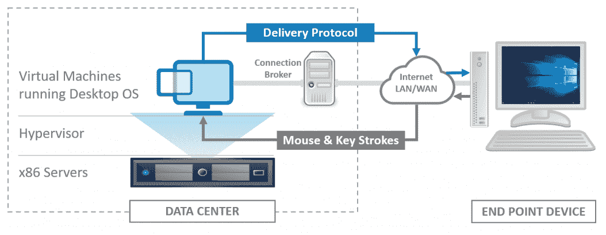
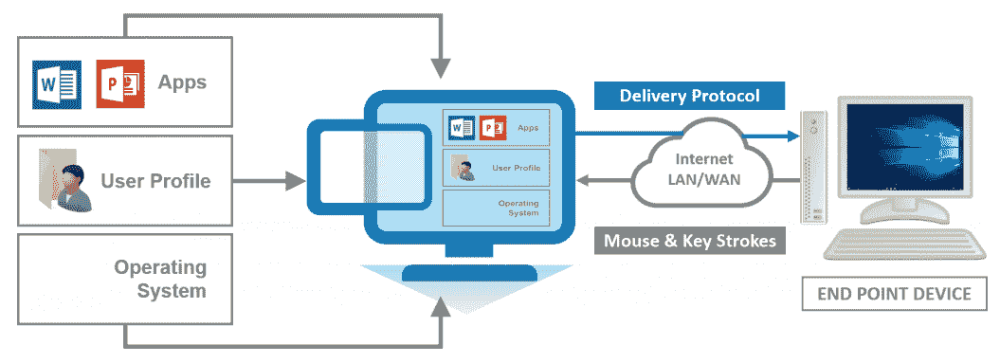
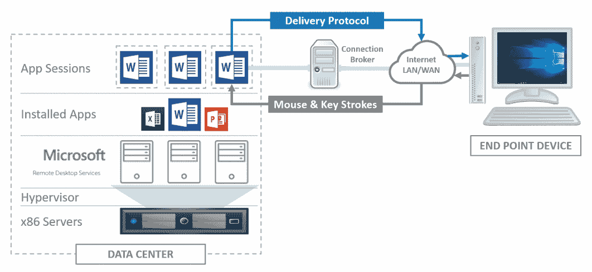
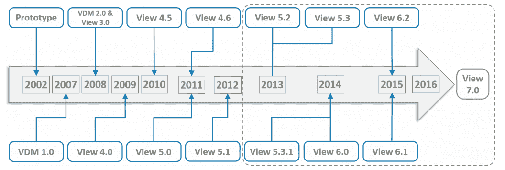
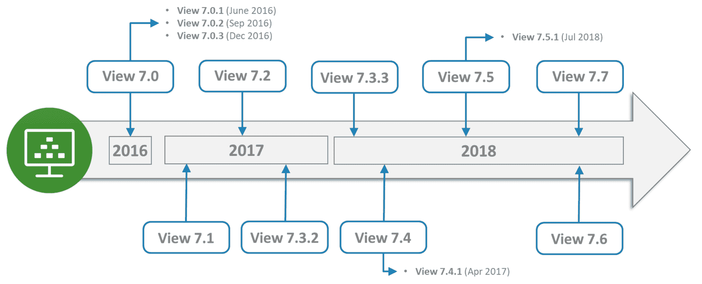
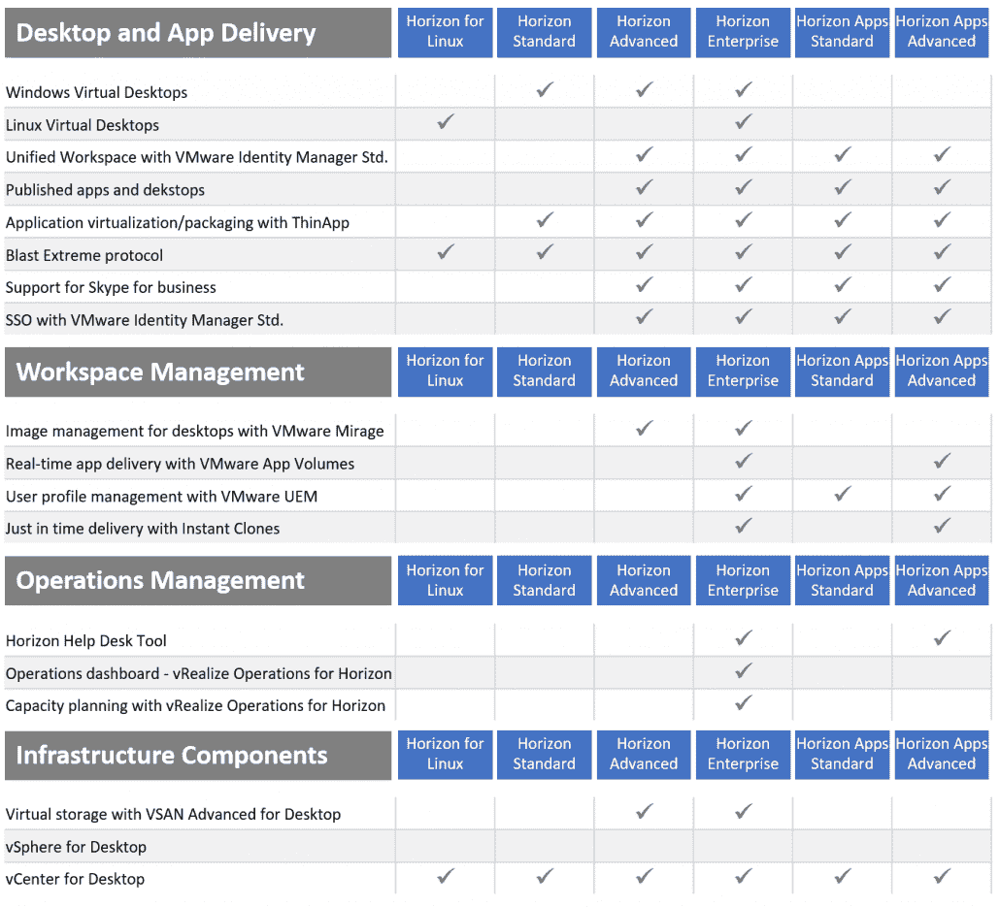

# 第一章：介绍 VDI 和 VMware Horizon 7

在本书的第一章中，我们将首先讨论当我们谈论**虚拟桌面基础设施**（**VDI**）时，我们到底在说什么，并准确地定义这一概念。一旦我们定义清楚了这一点，我们将继续讨论 VMware Horizon 解决方案中具体的 VDI 内容。

在本书中，我们使用了许多截图来展示 Horizon 的安装和配置，使用了示例实验室环境。这些截图来自 Horizon 7 版本 7.6，然而，最新的 7.8 版本与此完全相同，除了截图中显示的版本号和在某些情况下 Horizon 的徽标。所展示的过程和步骤保持不变。

Horizon 为 VMware 的**终端用户计算**（**EUC**）解决方案提供了基础，以交付桌面和应用程序。VMware 大约 16 年前首次进入 VDI 市场，当时他们通过利用在服务器虚拟化市场的成功，展示了虚拟化桌面操作系统的概念。如今，服务器虚拟化技术已变得更加成熟和普及。通过运用在服务器虚拟化中使用的一些相同原则，并将其应用于桌面操作系统，VMware 能够创建一个集中管理的虚拟桌面解决方案，从而降低桌面计算的总体成本并提高安全性。

在本章中，我们将讨论以下主题：

+   什么是 VDI，它是如何工作的？

+   VMware 和 VDI 的历史

+   VMware Horizon 版本和许可选项

在我们开始讨论具体的产品功能和功能之前，先来定义一下当我们谈论 VDI 时到底是什么意思。然后我们将简要回顾一下 VMware 的起步历程，看看它是如何开始的。

# 什么是 VDI？

当我们谈论 VDI 时，通常是在描述一种解决方案，即桌面 PC 的操作系统作为虚拟机托管在虚拟化管理程序上，虚拟化管理程序托管在服务器上，服务器是数据中心基础设施的一部分，可能是本地部署的，也可能是基于云的。

这种 VDI 模型有时也被称为**托管虚拟桌面**（**HVD**），因为虚拟桌面作为虚拟机托管，最终用户可以访问他们自己的完整桌面实例。这与基于服务器的计算不同，后者仅向最终用户提供桌面会话。我们将在本章稍后的*VDI 与基于服务器的计算（SBC）—它们的区别是什么？*一节中讨论这一点。

# VDI 高层架构—它是如何工作的？

VDI 是如何工作的？让我们从端用户及其如何访问虚拟桌面机器开始。从他们的端点设备（如 PC、瘦客户端或移动设备）启动客户端软件，例如 VMware 的 Horizon 客户端，或直接打开浏览器。无论哪种方式，这将连接到连接代理，使用其主机名或 URL。连接代理的首要工作是对端用户进行身份验证，然后管理可用资源，并将端用户连接到适当的虚拟桌面。交付给他们的桌面可以基于他们的物理位置或基于部门的基础，用户的上下文决定了不同的桌面配置。

下图概述了 VDI 工作的高级别描述：

在首批上市的 VDI 解决方案中，没有连接代理的概念，而是端用户会基于一对一的基础直接连接到虚拟桌面机器。就像把他们的桌面电脑拿到数据中心一样。

一旦端用户连接到虚拟桌面机器，屏幕截图或虚拟桌面机器的显示会通过优化的传输协议发送到端点设备上的客户端软件或浏览器，以便用户与虚拟桌面进行交互。鼠标移动和按键信息随后通过同一协议返回到虚拟桌面机器，通过网络进行传输。

因此，VDI 桌面更安全，因为没有数据离开数据中心，而只是屏幕截图更新或像素变化通过网络发送。根据前述类比，这就像是把您的个人电脑放到离家数英里远的数据中心，然后通过非常长的电缆在家中连接键盘、鼠标和屏幕。

从连接性的角度看这就是 VDI，但让我们稍作关注虚拟桌面本身，并看看其架构如何与物理世界的桌面有所不同。VDI 桌面通常是按需构建的，也就是说，当用户登录并请求桌面资源时。为了帮助管理成本，您通常会部署非持久性桌面模型（如《第二章》中所讨论的《理解 Horizon 7 架构和组件》），即用户不拥有自己的桌面，每次登录时都会为他们构建一个新的桌面。这正是虚拟和物理桌面之间的关键区别之一。

正如我们刚才讨论的那样，虚拟桌面通常是按需构建的，将构成完整桌面环境的不同组件汇聚在一起。操作系统、用户配置文件、桌面策略和应用程序都被视为独立的个别组件，与底层机器分离抽象，然后将它们合并在一起，提供最终用户的桌面体验。

这被称为复合桌面模型，下面的图表展示了这一点：

这里的关键要点是，虚拟桌面机器需要与物理桌面不同对待，要想充分利用虚拟桌面机器所提供的所有优势，应该从零开始构建，并从第一天起就将其作为虚拟机进行管理，使用一些专门为 VDI 管理设计的组件。我们将在下一章讨论这个问题。

# VDI 与基于服务器的计算（SBC）——它们之间有什么区别？

那么，这些技术与 VDI 之间到底有什么区别呢？如果有的话？

SBC 是一项已有一段时间的技术。事实上，你或许可以追溯到上世纪 50 年代，那个时候的主机技术就被设计用来提供集中计算能力以运行一组应用程序，用户通过绿色屏幕终端连接到这些应用程序，那个终端几乎只是一个带键盘的显示器。

从根本上说，SBC（基于服务器的计算）并没有发生太大变化，依然是通过中心化的方式运行应用程序，尽管如今它运行在服务器上而不是主机上，终端用户则通过某种形式的终端设备进行连接。所以，在这种情况下，它与 VDI（虚拟桌面基础设施）的区别并不大，因为你连接的是托管在数据中心服务器基础设施上的远程应用程序。还是说有区别呢？

让我们首先来看应用程序的交付。VDI 和 SBC 的区别在于，SBC 中，应用程序安装并运行在实际的服务器上，使用多用户版本的应用程序为每个独立的终端用户创建单独的应用程序会话。终端用户将连接到自己的独立、独立保护的会话，而不是像在 VDI 中那样连接到一个包含应用程序的操作系统实例。由于一切都在数据中心运行，用户将通过终端设备或瘦客户端连接到会话。事实上，SBC 有时被称为瘦客户端计算。

以下图表提供了使用 SBC/**远程桌面服务**（**RDS**）交付应用程序的概览：

使用 SBC 模型，你也可以以相同的方式交付托管的桌面会话。这次，用户不是连接到一个分离的、受保护的单独应用会话，而是连接到一个分离的、受保护的服务器操作系统单独会话。这里需要注意的一点是，终端用户实际上是在运行一个基于服务器的操作系统会话，如 Windows Server 2016，而不是一个 Windows 10 桌面会话。

到头来，你选择部署的技术取决于你的使用场景，以及从功能和成本的角度来看，哪种技术最为合适。你可能最终会采用混合方式，根据不同部门的具体需求，采用不同的桌面和应用程序交付方法。

# 部署 Horizon 的好处

通过将终端用户桌面环境虚拟化为一个集中管理的服务，你不仅可以为 IT 管理员带来好处，也可以为用户提供优势。以下是其中的一些亮点：

+   **安全性和合规性**：除非 IT 部门特别配置了政策来允许，否则数据不会离开数据中心。同样，终端用户无法引入恶意软件或其他有害内容。传输到客户端设备的仅仅是虚拟桌面的截图，键盘和鼠标的操作会被传回虚拟桌面。这有点像是给桌面配备了一个遥控器。

+   **集中和简化的管理**：集中桌面意味着集中管理。由于桌面被虚拟化并托管在数据中心，执行如更新和修补操作系统、批量安装新应用等任务变得更加容易，而不是一台台单独操作。虚拟桌面是从一个单一的金图像或主镜像创建的，这些镜像是集中维护和更新的。你只需更新镜像，点击几下鼠标就能重新创建虚拟桌面，嘿 presto —— 所有用户都会获得更新后的版本。环境和用户问题的故障排除变得更容易，而且无需亲自前往办公桌。最坏的情况是，你可以从头开始为终端用户重建一个新的桌面，或者让他们登录到一个新的桌面。

+   **可伸缩性、灵活性和敏捷工作**：将桌面托管在虚拟平台上允许您更轻松地进行扩展和缩减，无需购买更多物理桌面。部署时间更快，成本更低。桌面甚至整个环境可以迅速启动并轻松撤销，以适应季节性工作者、专门项目的承包商，甚至提供灾难恢复和业务连续性。通过终端用户设备进一步降低成本，他们现在可以利用瘦客户端设备，甚至使用自己的个人设备进行连接。由于资源现在移动到数据中心服务器基础设施并远程访问，终端用户可以在任何地方访问他们的虚拟桌面，无需在办公室、办公桌上或需要 PC 来访问其企业桌面和应用程序。即使遇到恶劣天气、交通不畅或其他通常阻碍他们进入办公室的事件，他们仍然可以保持高效。

+   **移动和任意地点的 BYOD**：虚拟桌面客户端使移动设备、平板电脑和非企业拥有的设备能够安全连接到企业虚拟桌面。在灵活工作的主题下，用户现在可以选择适合自己需求的设备，以便访问其企业桌面。无论是平板电脑、智能手机还是非 Windows 平台，用户仍然可以从远程位置安全访问其企业桌面。

+   **成本节约**：通过实施虚拟桌面环境并采用围绕镜像、补丁和配置文件管理的运营最佳实践，以及集中式应用程序部署，可以节省**运营支出**（**OPEX**），与传统桌面管理相比。**资本支出**（**CAPEX**）仍然需要用于支持虚拟桌面环境并使其运行起来。我经常听到的一件事是，部署 VDI 将减少成本。在这里要说明的一点是，是的，它会减少 OPEX，但通常，在 VDI 项目开始时，CAPEX 会更高，因为您需要部署基础设施。话虽如此，这里也有成本节约的地方，例如将端点重新用于瘦客户端。总体而言，通过解决方案的持续管理节约成本，您将不会陷入典型的三年桌面硬件更新周期陷阱，其中操作系统和应用程序更新现在集中部署到虚拟机中。

# VMware 和 VDI 的历史

虚拟化 Windows 桌面的概念早在 2002 年就已出现，当时 VMware 客户开始虚拟化桌面操作系统，并将其托管在运行 ESXi 虚拟化平台的服务器上。在那时，并没有连接代理的概念，VDI 这个术语也没有广泛使用。最终用户仅通过 RDP 协议直接连接到运行 Windows XP 的专用桌面虚拟机。这与远程管理服务器的方式相同，即通过 RDP 连接直接访问服务器的桌面。从那时起，这段旅程便开始了。以下时间线概述了这段旅程中的关键里程碑：

+   **2005**：VMware 展示了连接代理的概念。

+   **2006**：VMware 推出了 VDI 联盟计划。

+   **2007**：向客户推出了原型连接代理，后来作为**虚拟桌面管理器**（**VDM**）1.0 版本发布。VMware 以 2500 万美元收购了 Propero。

+   **2008**：VDM 2.0 于 2008 年 1 月发布。VMware View 3.0 发布，Citrix 进入 VDI 市场，发布了 XenDesktop 2.0。

+   **2009**：发布了 VMware View 4.0——首个支持 PCoIP 的版本。

+   **2010**：发布了 VMware View 4.5，新增了本地模式（离线桌面）、PCoIP 增强功能、Windows 7 支持以及存储分层功能。这也是 VMware 首次公开谈论与东京三菱银行的最大 VDI 参考案例，银行部署了 50,000 台虚拟桌面。

+   **2011**：发布了 VMware View 4.6，支持 iPad 客户端和用于 View 安全服务器的 PCoIP 安全网关功能，允许用户在不需要 VPN 连接的情况下连接虚拟桌面。发布了 View 5.0，引入了 Persona Management。View 5.0 还通过使用最新的 vSphere 5.0 平台，支持了 3D 图形，并对 PCoIP 协议进行了重大增强。

+   **2012**：发布了 View 5.1 版本，新增了 View 存储加速器、View Composer 阵列集成、支持在使用 NFS 存储时将主机基础设施扩展至 32 节点集群、双因素身份验证、改进的 USB 设备支持、独立的 View Composer，以及支持从 XP 到 Windows 7 的配置文件迁移功能，还支持从物理桌面迁移到虚拟桌面，并引入了 Persona Management。

+   **2013**：发布了 View 5.2，并为了与 VMware 同时推出的新 Horizon 品牌保持一致，View 5.2 更名为 Horizon View 5.2。这一版本包括支持与 Microsoft Lync 2013 的统一通信、硬件加速的**虚拟共享图形加速**（**vSGA**）、Windows 8 支持，并提供了一个功能包，使用户能够通过 HTML5 浏览器使用 VMware Blast 协议访问其桌面。View 5.3 引入了**虚拟专用图形加速**（**vDGA**），使虚拟桌面能够专用访问主机服务器上安装的 GPU。为了规避 Windows 7 没有**服务提供商许可证协议**（**SPLA**）的问题，增加了对 Windows Server 2008 R2 的支持。

+   **2014**：这是最后一个 5.x 版本，发布了 Horizon View 5.3.1，新增了对**虚拟 SAN**（**VSAN**）的支持。发布了 Horizon 6.0，加入了 View 托管应用程序，这是 VMware 首次支持使用 RDS 托管的应用程序和桌面。View 6.0 还引入了 Cloud Pod 架构，并支持跨多个数据中心扩展 View 基础架构，以实现灾难恢复和可扩展性。同时也移除了 View 本地模式。6.0.1 版本增加了 USB 3.0 支持，扩展了打印功能，提供了 Windows 8.x 的 HTML 访问，以及托管应用程序的系统托盘重定向。紧接着是 6.0.2 版本，增加了一个新功能包，新增了 View Agent 的新版本、HTML 访问、MMR 重定向和扫描仪重定向等功能。

+   **2015**：View 6.1 发布，支持 NVIDIA GRID vGPU。它还增加了对 IPV6、虚拟 SAN 6.0、虚拟卷以及 Windows Server 2012 R2 作为虚拟桌面操作系统的支持。随后发布了 6.1.1 版本，新增了客户端驱动重定向、Linux 桌面支持、RDS 桌面的 MMR 支持，以及通过 HTML 访问托管应用程序的功能。Horizon 6.2 添加了对 Windows 10 桌面的支持，集成了 Access Point，支持 AMD vDGA，4K 显示器，并且更新了虚拟 SAN 6.1，同时对 Cloud Pod 架构、管理控制台和 Linux 桌面进行了若干增强。2015 年 12 月发布了 6.2.1 维护版本，2016 年 2 月发布了 6.2.2 版本。

总结一下，以下图示清晰展示了这一时间线：

这把我们带到了最新版本的 Horizon——VMware Horizon 7。

# VMware Horizon 7

VMware Horizon 7 是 VMware EUC 愿景和战略的下一代产品，旨在提供数字化工作空间。在之前的章节中，我们讨论了 VDI 与 SBC/RDS 之间的一些区别，以及这两种解决方案的优势。然而，通过 Horizon 7，您可以通过一个平台提供 VDI 桌面、发布的应用程序和基于会话的桌面。

# VMware Horizon 7 时间线

VMware Horizon 7 于 2016 年 3 月 22 日发布，包含了一些全新的功能以及一些改进。完整的发布说明可以在[`bit.ly/2O3ZYoG`](https://bit.ly/2O3ZYoG)找到，亮点如下：

+   即时克隆以加速桌面配置

+   面向 25 个 Pod、跨 5 个站点、支持最多 50,000 个会话的 Cloud Pod 架构

+   智能策略

+   支持 TCP 和 UDP 传输协议的 VMware Blast Extreme 协议

+   真正的 SSO

+   Access Point 集成

+   Windows Server 2016 作为远程桌面和应用 RDS 服务器的技术预览版

+   更广泛的 Linux 操作系统支持

初始的 Horizon 7 版本随后发布了三个小更新版本；7.0.1（[`bit.ly/2QkCrBA`](https://bit.ly/2QkCrBA)）增强了 Blast 和基于 Linux 的虚拟桌面；Horizon 7.0.2（[`bit.ly/2NvorGw`](https://bit.ly/2NvorGw)）增加了客户端驱动重定向、Horizon PowerCLI、适用于会话型桌面和应用的 RTAV、对 Windows 10 Build 1507、1511 和 1607 的支持，以及对 vSphere 6.5 的支持；Horizon 7.0.3（[`bit.ly/2QfsTaZ`](https://bit.ly/2QfsTaZ)）移除了 View PowerCLI 并替换为 Horizon PowerCLI。此外，还对 Horizon Agent 进行了更新，特别是针对 Linux 桌面，增加了 vGPU 支持、V6 配置文件的 Persona Management 支持，并更新了 Horizon 客户端。

接下来是 2017 年 3 月 16 日发布的 VMware Horizon 7.1 版本（[`bit.ly/2Mj462g`](https://bit.ly/2Mj462g)）。View 连接服务器进行了多次更新，新增了 Blast Extreme、已发布应用和桌面、即时克隆、Cloud Pod 架构等功能。Horizon GPO 包中的 ADM 模板文件已被弃用，并被 ADMX 模板文件取代。

7.1 版本之后是 2017 年 6 月 20 日发布的 VMware Horizon 7.2 版本（[`bit.ly/2QjAVzj`](https://bit.ly/2QjAVzj)）。此版本再次集中于 Connection Server 的更新，包括 Workspace ONE 访问策略、即时克隆增强、Cloud Pod 架构（现在支持 120,000 个会话），并新增了 Horizon Help Desk 工具。同时，Connection Server 的限制也得到了提高，现在每个 vCenter 服务器支持 4,000 个克隆。Skype 支持已添加到 Horizon Agent 中，并更新了 Horizon 客户端。

2017 年 10 月发布的 7.3 版本发现存在一些问题，因此从下载页面移除，直接跳转到 2017 年 11 月 20 日发布的 VMware Horizon 7.3.2 版本（[`bit.ly/2QhM8Ax`](https://bit.ly/2QhM8Ax)）。此版本包含了 Horizon Help Desk 工具和即时克隆的更新，同时 Cloud Pod 架构的规模扩展至 7 个站点的 140,000 个会话。Horizon 客户端，特别是 Linux 版本，也新增了更多功能，并发布了 4.6 版本的新 Horizon 客户端。

在 2018 年 1 月 4 日发布的 VMware Horizon 7.4 中，也有类似的更新（[`bit.ly/2BFJE6q`](https://bit.ly/2BFJE6q)），该版本同样增加了会话协作、许多新的 ADMX 模板，并更新了 Horizon Client 版本 4.7。

VMware Horizon 7.5 于 2018 年 5 月 29 日发布（[`bit.ly/2lBvrBU`](https://bit.ly/2lBvrBU)），重点是连接服务器的新功能，新增了 Horizon 控制台 Web 界面，并将其与 Horizon 帮助台工具集成，还集成了用于按需管理平台的新工作流功能，包括 Horizon JMP 服务器安装程序。该版本还支持 vSphere 6.7，并能够在 VMware Cloud on AWS 上部署包含完整虚拟机的桌面池。

Cloud Pod 架构的规模进一步扩大，现在支持跨 10 个站点的 200,000 个会话。最后，Horizon Agent 有了几项增强功能，Horizon Client 也推出了新版本 Horizon Client 4.8。

接下来是 2018 年 7 月 19 日发布的 Horizon 7.5.1 维护版本（[`bit.ly/2oVxKS2`](https://bit.ly/2oVxKS2)），该版本修复了一个关于不安全记录凭证的问题，详见 CVE-2018-6971（[`cve.mitre.org/cgi-bin/cvename.cgi?name=2018-6971`](https://cve.mitre.org/cgi-bin/cvename.cgi?name=2018-6971)）。

这将我们带入最新的版本——VMware Horizon 7.6，该版本于 2018 年 9 月 6 日发布。这个小版本更新了连接服务器、Horizon Agent、Horizon GPO 捆绑包的附加功能，并推出了新版本的 Horizon Client，版本号为 4.9。

总结来说，以下图表以图示的方式展示了该时间线：

在下一部分中，我们将介绍不同的 Horizon 7 产品版本。

# VMware Horizon 7 产品版本

Horizon 7 解决方案组合中有六种不同的产品版本，每个版本增加了不同的功能和特性。每个版本还可以根据其在整体解决方案中的角色进行分类。这些分类可以描述如下：

+   虚拟桌面和应用程序交付

+   工作区环境管理

+   操作管理

+   基础设施与托管

关于这六个产品版本，它们将在本章的以下部分中进行描述。

# Horizon for Linux

顾名思义，**Horizon for Linux** 允许您集中管理基于 Linux 的虚拟桌面，并通过 Horizon View 进行交付。Linux 桌面的最大优势在于您可以远离其他更昂贵的操作系统，进一步降低部署成本。Horizon for Linux 支持多个 Linux 发行版，包括 Ubuntu、RHEL 和 CentOS，并且还利用了 View 提供的一些其他功能，例如 NVIDIA 图形解决方案。

# Horizon 标准版

**Horizon 标准版**提供核心的 VDI 组件和功能，允许将基于 Windows 的虚拟桌面机器交付给最终用户。此版本包含托管基础设施、vSphere 和桌面用的 vCenter 的授权。还包括 ThinApp，这是 VMware 的应用虚拟化和打包解决方案，允许你从底层操作系统中提取应用并独立交付。

# Horizon 高级版

Horizon 高级版专注于虚拟桌面和应用的交付与管理。高级版是第一个将应用发布作为 View 解决方案的一部分的版本，允许通过 View 客户端使用 PCoIP 协议、HTML 或 VMware Blast Extreme 发布在 Microsoft RDSH 后台运行的应用。这意味着用户现在可以仅将单个应用交付到客户端设备，而不是完整的桌面。

高级版中还包括统一工作区解决方案，提供统一的工作区，让用户可以从授权应用程序目录中选择应用。这些应用可以是 ThinApp 包、基于 SaaS 的应用、XenApp 发布的应用，或者来自 Microsoft Office 365 的任何内容。

高级版曾经包括 VMware Mirage，以便为物理桌面提供集中镜像管理。然而，该产品现已进入生命周期末期，与 Horizon Flex 一起停产。尽管你无法再购买这些产品，VMware 仍然为已部署这些产品的客户提供技术支持，直到 2020 年 6 月 30 日。

最后，高级版包括对 Skype、VMware 身份管理器和 VSAN 的支持。

# Horizon 企业版

Horizon 企业版基于之前的版本，并通过使用 vRealize Operations for Horizon 来增加功能，以提供操作管理。结合 Horizon 帮助台工具，IT 管理员可以监控环境的健康和性能，并进行容量规划，以确保在扩展时获得最佳配置。

企业版中还包括 VMware App Volumes，允许你将即时交付的应用程序交付到虚拟桌面。这与即时克隆技术一起工作，实现按需构建和交付桌面和应用。然后，使用 VMware 用户环境管理解决方案为最终用户配置这些桌面和应用。有关 VMware App Volumes 的详细概述，你可以阅读由 Peter von Oven 编写并由 Packt 出版的*《学习 VMware App Volumes》*。

企业版还增加了对交付基于 Linux 的桌面和会话协作的支持，使用户可以轻松协作。

# Horizon 应用标准版

Horizon Apps Standard 专注于交付已发布的应用程序和已发布的桌面，因此无法交付基于虚拟机的完整桌面。它还包括 VMware ThinApp、对 VMware Identity Manager 的支持、使用 Blast Extreme 协议的会话交付和 VMware 用户环境管理。

# Horizon Apps Advanced

Horizon Apps Advanced 在标准版的基础上增加了功能，例如 Skype for Business 的虚拟化包、带有即时交付功能的 VMware App Volumes，以及 Horizon 帮助台工具。

# Horizon 版本概述与比较

下表详细列出了不同 Horizon 版本中可用的功能：

# Horizon 用户许可模型

Horizon 提供两种不同的许可模型，这些模型也取决于您部署的版本：

+   **并发用户**：适用于所有 Horizon 版本，其中许可基于同时访问应用程序和桌面的用户数量。

+   **指定用户**：适用于所有 Horizon 版本，除了 Horizon for Linux 和 Horizon 标准版。使用指定用户时，许可证会分配给特定用户。

# 总结

在本章中，我们了解了什么是 VDI，描述了它是如何工作的，并与其他类似技术进行了比较。接下来，我们回顾了 VMware 起步的历史，展示了 VMware 一直是—并且仍然是—虚拟桌面和应用程序交付的前沿，今天更常被称为数字工作空间。

我们随后讨论了最新版本的 VMware Horizon 7，以及可用的不同版本，概述了每个版本及其核心功能。

在下一章中，我们将深入探讨 Horizon View 的技术，并开始研究构成解决方案的架构和不同组件。
