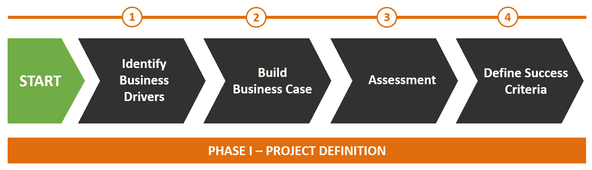
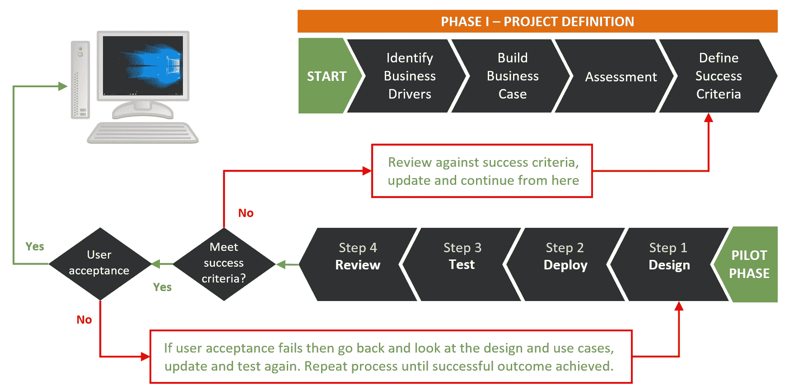
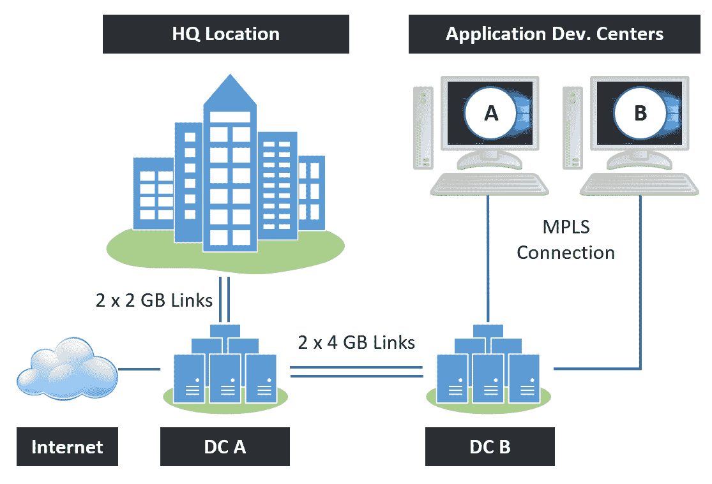

# 第三章：设计和部署考虑因素

现在，我们已经在前几章提供了 VMware Horizon 各个组件的全面概述，在本章中，我们将集中讲解如何将这些组件付诸实践，介绍一些在进行 VMware Horizon 项目时需要考虑的设计和部署技术。

首先，我们将讨论一些可以用来验证技术并了解它如何在您的业务中发挥作用的技术，首先从如何评估当前环境开始，然后如何利用这些信息来设计您的 Horizon 部署。

一旦您完全理解了业务需求，接下来我们将深入探讨 Horizon 解决方案的设计要素，包括但不限于 ESXi 主机设计、虚拟桌面的内存和 CPU 配置、存储考虑、客户端以及其他最佳实践和技巧。

我们将同时探讨项目的业务和技术要素，然后讨论每一项，看看它如何融入整体项目。为了使这个过程更简单、更具逻辑性，我们将这些内容拆分为三个明确的项目阶段，如下图所示：


在接下来的章节中，我们将更详细地探讨和讨论这三个阶段。

在本章中，我们将涵盖以下主题：

+   阶段 I – 项目定义

+   阶段 II – 技术验证

+   阶段 III – 生产环境设计

+   技术选择

+   Horizon View pod 和 block 架构

+   云 Pod 架构

+   vSphere 设计用于 Horizon View

+   Horizon View 设计细节

+   支持基础设施设计

+   打印

+   瘦客户端和其他终端设备

+   桌面设计考虑因素

+   示例解决方案场景

# 阶段 I – 项目定义

在这个第一阶段，我们将探讨如何处理一个项目。第一阶段分为四个单独的步骤，如下图所示：



让我们更详细地看一下每个单独的步骤，从业务驱动因素和理解您的业务需求开始。

# 第一步 – 确定业务驱动因素 – 了解您的需求和要求

在您全身心投入 Horizon 项目之前，先退一步，确保开始记录您想要达成的目标。通常情况下，很容易被解决方案中所有新的技术方面吸引，例如安装和配置新硬件和软件，而忽视了最终目标，导致目标丢失或与业务无关。

可能这是一个显而易见的观点，但识别业务驱动因素的关键在于真正理解你想要评估的内容。我们所说的是，这是否是基于需要通过新的工作举措来转型组织的战略决策，还是有一个更具迫切性的事件，比如操作系统或应用程序的生命周期结束？甚至可能仅仅是为了降低成本。无论是哪种情况，你都需要在第一天就把这些明确下来、写好并记录下来，以便项目具有意义和方向，更重要的是，在审查时为项目提供一个参考基准，从而评估项目是否成功。

从编写一份需求文档开始，列出业务需求、当前需要解决的问题、愿景，以及任何妥协和假设。在项目进行过程中，你应该定期参考此文档，以确保自己始终专注于最终目标。

# 第二步 – 构建商业案例

一旦你定义了驱动一个项目的因素或促使项目启动的关键事件，并且理解了高层目标，下一阶段是围绕这些内容开始构建商业案例。这要求你进入更高层次的细节，开始深入挖掘解决方案需要解决的具体领域。为了做到这一点，你需要理解商业战略，并确定项目的关键利益相关者。然后，你可以开始定义每个被识别为驱动因素的领域的高层需求，并开始定义用户细分。例如，你可以查看你有哪些不同类型的用户，他们今天如何工作，以及未来他们需要什么。归根结底，决定项目是否成功的将是最终用户，而不是你！这将引导我们进入下一个部分——评估阶段。

# 第三步 – 评估

一旦你构建并验证了符合战略的商业案例，并确认有需求为桌面环境提供新的交付方式，下一步就是进行评估。虽然通常被称为桌面评估，但实际上你在做的是引导最终用户入驻，以便你能够通过基础设施映射他们的整个生命周期——不仅仅是今天，而是通过持续监控，确保他们在操作系统、应用程序迁移和更新过程中，始终获得最佳的用户体验。

那么，我们说的评估是什么意思？或者在这种情况下，我们如何将终端用户接入，以便在他们的工作生命周期中进行评估和监控？到底涉及哪些内容？这可以归结为几个方面，包括通过收集关键指标来检查你当前的桌面环境，从而了解当前交付的内容、交付对象，以及更重要的是，这些内容消耗了多少资源。评估的目的是构建一个完整且准确的当前终端用户环境的图景。

这不仅仅是一个清单报告——你需要准确了解终端用户正在做什么，以及他们是如何工作的。我们关注的一些关键指标包括：

+   哪些用户在使用哪些应用（何时、从哪里、以及多频繁？）

+   资源消耗（CPU、内存、磁盘和网络是关键）

+   不适合远程交付或 VDI 的应用/使用案例

+   哪些客户端操作系统正在使用？

+   现有设备的硬件清单

+   机器启动时间和登录过程拆解

+   当前的交付方式（RDSH、XenApp、VDI、物理 PC 等）

+   用户档案详细信息

你最终要达成的目标是创建一个基准，展示当前环境的状态。然后，在你进入定义成功标准和验证技术的阶段时，你就有了一个基准作为参考点，可以展示你如何改善当前功能，并实现业务案例和战略目标。

如果你已经部署了 VDI 解决方案，而这个新项目是迁移或升级之类的任务，那么你应该有大部分数据可用。然而，如果这是较早之前进行的项目，建议重新运行评估，以便获得最新的数据，尤其是关于你环境中的应用程序数据。理想情况下，从一开始你就应该持续监控基础设施，以便为此类事件做好规划。

# 用户体验和桌面分析工具

市场上有许多不同的第三方补充产品，你可以用它们来进行分析。你通常可以使用合作伙伴的服务来协助这一过程，帮助你理解收集到的信息和数据。

其中一个最受欢迎的解决方案是 Liquidware Stratusphere 解决方案。Stratusphere 不仅为你提供当前用户环境的详细拆解，重点包括登录过程的详细分解、消耗报告和易于识别哪些用户是虚拟化候选人的分数——它还提供了完整的终端用户生命周期图景。

Stratusphere 会获取基准数据，然后利用这些数据持续监控终端用户体验，从而确保你的 VDI 解决方案得到优化，如下图所示。本书后面会更详细地讨论这一点：


Stratusphere 监控最终用户体验

需要确保评估解决方案是专门为测量桌面而设计的，而不是为服务器设计的。这两种技术虽然都是虚拟化技术，但完全不同，虽然你可能可以使用桌面评估软件来规划你的服务器虚拟化项目，但反过来却行不通。

除了实际收集评估数据之外，还有几个其他方面你应该考虑并查看。这将帮助你理解一些原始评估数据所告诉你的内容。例如，它可能会告诉你，由于消耗的资源量，某个特定用户不适合使用虚拟桌面；然而，当你与他们交谈时，可能会发现他们的工作内容在虚拟桌面环境中并不相关。

# 了解你的用户到底做什么

在 IT 部门工作通常能让你对用户执行的任务以及他们为完成这些任务而使用的软件有一个较为清晰的理解。然而，这通常比它初看起来要复杂得多。通过进行桌面评估，你能够更加细致地了解最终用户从现有桌面环境中获得的流程、应用程序和使用体验。这可能包括他们使用的应用程序，以及他们没有使用的应用程序，包括安装的版本、容量和性能要求，以及用户体验指标，比如登录时间和应用加载时间。

# 应用程序

了解你当前的应用程序是评估阶段的关键部分。这不仅可能会影响最终用户的生产力——毕竟，是应用程序让用户保持工作状态——它还将影响设计的许多其他方面，包括池的数量、池的设计、应用虚拟化，以及是否需要为用户分配一个持久性桌面，或是否可以分配一个非持久性桌面。

在某些环境中，你可能仍然有遗留的应用程序在运行，了解这一点非常重要，因为这些应用程序可能无法在虚拟桌面环境中运行，从而完全拖延或破坏你的项目进程。通常，在迁移到虚拟桌面时，你需要从较旧的操作系统开始，这同样可能会导致应用程序兼容性问题。

通过从评估中收集的指标，你将能够全面了解当前桌面环境的状况。发现许多不同版本的软件并不罕见，这意味着潜在的安全风险，而在其他情况下，关键应用程序可能会定期崩溃。这些信息将帮助你构建变革的商业案例，并帮助你优先考虑向那些安全漏洞最大或用户体验最差的用户推广新系统。

# 性能

没有实际的性能指标，你几乎不可能正确配置虚拟桌面。如果没有这些数据，你的桌面可能会通过两种方式之一来配置。第一种是过度配置桌面。过度配置通常发生在虚拟化时，因为配置虚拟机非常简单，有时我们会不自觉地加入比实际需要更多的 CPU 和内存。结果是，我们需要更多的基础设施来支持这些资源，成本也随之上涨。还会出现这种情况：我们大致估算桌面的大小，然后再在其基础上加上十到二十个百分点以防万一。推动成本上涨可能意味着项目在财务上不可行。

另一面是低配桌面可能会导致性能问题和不佳的最终用户体验。如果你基于这些低配置进行基础设施设计，并且最终需要增加更多资源，争取更多预算以提高主机服务器的规格或增加更多服务器可能会是一场艰难的对话。

如果你在寻找桌面即服务（Desktop as a Service）解决方案，这个问题是需要注意的。从纸面上看，这些桌面似乎物有所值，可能每月花费在$30 到$50 之间。但在你签订合同并且最终用户开始增加资源消耗时，成本也会开始上涨。我们见过很多客户的账单，因为选择了低配置桌面，导致月度付款远超预算。

通过执行桌面评估，你将了解整个工作日的性能情况。多少资源被消耗了？什么时候消耗的？你可能会看到全天有许多波动和峰值，比如登录高峰、AV 扫描、注销高峰以及其他指标，比如午餐时间增加的互联网使用量。

如果你在教育环境中工作，你可能会看到很多登录和注销高峰。理解这一点非常重要，因为你需要确保你的解决方案设计能够满足这些需求。这些信息可以帮助你在配置相关桌面池时做出指导，但请记住，可能会在评估阶段和部署 VDI 桌面之间做出一些更改。比如，从 Windows 7 迁移到 Windows 10，或应用程序的升级。在这些情况下，评估是基于之前版本的操作系统进行的，因此可能无法为你提供 100%准确的资源需求信息。一些第三方评估工具可以处理这些问题，并允许你模拟“如果发生这种情况”的情景。

# 最终用户体验

最重要的是，用户体验才是关键，它衡量了最终用户使用虚拟桌面时的体验好坏。当你进行服务器虚拟化项目时，如果做得正确，用户可能甚至没有意识到变化发生了。

对于桌面虚拟化或任何其他非常注重最终用户的 EUC 类型项目，用户更可能意识到变化的发生，你需要确保这对项目来说是一次积极的体验，这样项目才能成功。为了做到这一点，你需要几乎进入用户的思维方式，准确地看到他们今天是如何使用这个环境的。用户体验的衡量标准将是广泛的、多样的，且通常是主观的，但将包括诸如启动时间、应用加载时间、登录时间、页面加载时间、应用故障，以及最终使用的直观性等要素。这些是评估工具不太可能告诉你的。

在进行**概念验证**（**POC**）、试点和调优的过程中，你需要确保用户体验不断改善。忽视最终用户体验将导致项目的彻底失败。为了做到这一点，你需要与最终用户社区进行互动。

# 走访、访谈和部门冠军

正如我们之前所述，虽然进行桌面评估并收集你的环境数据是任何 EUC 项目的重要组成部分，但它们不应取代与用户互动的必要性。人类参与的好处在于，你能够发现一些仅凭软件无法捕捉到的要素。

首先，简单地走访你的办公室，注意用户在做什么，使用什么应用程序，使用了哪些配件，有多少个显示器，他们是使用笔记本电脑还是台式电脑，等等。

一旦你对这一层次的情况有了了解，可以考虑与各部门的关键业务领导安排会议，以了解他们的需求、要求，以及他们当前使用桌面时遇到的问题。你还应该开始考虑你部门的“部门冠军”是谁。

# 什么是部门冠军？

如果你打算列出本书中的关键考虑因素，那么“部门冠军”应该排在你的清单上。部门冠军是一个最终用户，将成为该部门所有与桌面相关的设计、测试和支持事务的主要联系人。他们不需要是 IT 专家，但应该有帮助你改善整体桌面体验的愿望。你应该与这些冠军合作，帮助他们设计桌面，因为他们将是你进行测试的首选人选，并且在你听取并实施任何反馈之后，还需要进行再次测试。

与部门冠军合作，你将在部门内拥有一个赞助人。他们会为即将推出的项目感到自豪，并会帮助你塑造桌面环境，作为用户站在你这一边，解释为什么做出某些决策。

# 步骤 4 – 定义成功标准

定义成功标准的关键目标是记录项目成功并准备投入生产所需的理想解决方案是什么样的。

你需要明确定义那些必须正常运行的元素，才能从 POC（概念验证）阶段过渡到 POT（性能验证）阶段，再到试点阶段，最终部署到生产环境中。你需要全面记录这些元素，并让最终用户或其他项目利益相关者签署确认。这几乎就像是制定一份工作说明书，明确列出任务清单。如果没有成功标准，就不应该开始测试！

另一个重要因素是确保在项目的这一阶段，成功标准不要超出最初的范围，这种现象通常被称为“范围蔓延”。这意味着任何额外的元素都不应加入到成功标准中，或者至少在讨论之前不要加入。如果有重要的内容被遗漏，可能会暴露出来；然而，如果你已经充分进行评估，这种情况不应该发生。这也是设定成功标准的另一个原因，否则你将无法知道清单上有哪些内容，且清单永远不会结束，总会有新内容被加入。

另一个有效的方法是在此阶段再次让最终用户参与进来。通过选择来自不同部门的人组成指导委员会或顾问小组，作为各自业务领域的赞助人，积极参与测试阶段，但要早早地让他们参与，获取他们的意见，从一开始就参与塑造解决方案。

太多的项目失败是因为用户尝试了某些不起作用的功能。然而，他们尝试的功能实际上并不是一个相关的使用案例，也不是业务中作为关键业务应用的工具，因此不应该使项目脱轨。

我曾经看到过一个 VDI 项目因为在使用 Microsoft Paint 时鼠标响应迟缓而失败。这个问题使得项目偏离了轨道，直到问题得到调查。最终，发现没有人使用 Paint，因此它与业务或使用案例完全无关。然而，这个问题依然浪费了宝贵的时间和精力，因为团队试图提升性能。由于该客户之前没有定义成功标准，项目很难推进。如果当时有一份清单，而这个应用不在清单上，那么它就可以被简单地忽略，项目也可以继续进行。

如果我们在项目初期定义了一组成功标准，并且最终用户已签署确认，任何超出这些标准的内容都不在范围内。如果文档中没有定义某项内容，它就应该被视为不属于成功的标准。

# 第二阶段——证明技术的可行性

在本节中，我们将讨论如何证明技术是否适合其目的。这是一个非常重要的工作内容，一旦你完成了第一阶段，就需要成功完成这一阶段，且它与通常处理 IT 项目的方式有所不同。对于任何面向最终用户的计算项目，你都应该采用这种方法。

正如我们之前讨论的，起点是关注最终用户，而不是 IT 部门。毕竟，使用应用程序的将是这些人，他们最清楚自己需要什么才能完成工作。与其根据自己的理解提供他们可能需要的东西，为什么不直接问他们真正需要什么，然后在合理范围内交付他们的需求。正如谚语所说，别试图将方钉钉进圆孔，因为无论你多么努力，它都永远不可能合适。

首先，你需要围绕最终用户的需求来设计解决方案，而不是花费时间和金钱去构建一个基础设施，最终却发现它无法满足用户的需求。

一旦前述步骤讨论并记录完毕，你应该能够勾画出推动项目的核心内容。你将明白你希望实现或交付的目标，并根据评估阶段得出的确凿事实，明确成功应该是什么样的。从那里，你就可以进入某种形式的技术测试阶段。

在测试周期中，我们可以选择三条不同的路径，并且可能并不需要所有这些路径。事实上，如果可以的话，通常最好直接跳到最后一个阶段，部署一个试点项目以节省时间和成本，并提前让最终用户参与进来。我们所讨论的这三个阶段如下：


在接下来的章节中，我们将简要介绍每个阶段的含义，以及你可能需要或不需要它们的原因。

# 概念验证（POC）

POC 通常指部分解决方案，通常是在 IT 部门的任何旧硬件上构建和安装的。在最终用户测试方面，POC 通常涉及少数几个用户，通常是 IT 团队中的成员，他们担任业务角色，以确定解决方案是否满足其设计目标的某些方面，并且是否适合使用。

在 POC 结束时，通常会发生两种情况之一。首先，什么都没有发生，因为 IT 部门只是在玩技术，最初并没有真正的业务驱动。这通常是因为没有定义明确的业务案例。类似地，若没有成功标准，POC 也会失败，因为你不知道自己究竟在证明什么。

第二种结果是项目进入试点阶段，我们将在后面的章节中讨论这一部分。你可以考虑直接进入这一阶段，跳过 POC——毕竟，供应商已经证明了这个概念，老实说，如果这是一个可以直接购买的生产就绪解决方案，那就没有什么概念上的问题了。也许一个技术演示就足够了，使用一个长期的演示环境可以让你看到足够多的技术运作方式。如今大多数供应商都提供云测试环境，潜在客户可以使用。

# 技术验证（POT）

与 POC（概念验证）相比，POT 的目标是确定提议的解决方案或技术是否能与现有环境集成，从而展示兼容性。POT 应突出与环境相关的技术问题，例如定制系统如何集成。与 POC 类似，POT 通常由 IT 部门进行，通常不会涉及业务用户。POT 纯粹是一次技术验证。

# 试点

试点指的是在一个接近生产环境的小规模解决方案推出，供真实终端用户进行测试。试点的范围可能会受到能访问试点系统的用户数量、受影响的业务流程或涉及的业务伙伴的限制。试点的目的是测试系统是否按设计运行，同时将业务暴露和风险控制到最小。它还应该涉及真实用户，以便收集他们的反馈，这些反馈可能最终会影响到实际生产环境中的解决方案。

这是实现成功的关键步骤，因为终端用户是每天使用系统的人，他们的反馈非常重要，因此你应该成立一个工作小组来收集他们的意见。这也有助于减轻项目失败的风险，因为即使解决方案可能满足 IT 部门的所有要求，但当它上线并且第一个用户登录后报告体验差或性能问题时，所有的努力可能就白费了。

试点应仔细规划、定义规模并实施，这些步骤可以清晰地分解成以下四个步骤，朝着成功的试点迈进，如下图所示：



让我们更详细地看看这些步骤。

# 第一步 – 试点设计

试点基础设施应该在生产解决方案将要部署的相同硬件平台上设计。例如，应使用相同的服务器和存储。这考虑到不同平台之间的异常以及配置差异，这些差异可能会影响可扩展性，或者更重要的是，性能。

即使在试点阶段，设计也是关键，你应该确保即使在这一阶段也考虑到生产设计。为什么？基本上，我们这么做是因为许多试点解决方案最终会直接进入生产，而且越来越多的用户会超出试点范围而被加入进来。上线并不需要返回重建是很棒的，但当你通过添加更多用户和应用程序来扩展时，由于最初的配置是为了试点设计的，你可能会遇到一些问题。这听起来可能很显然，但通常一个成功的试点会让你一直进行下去，最终用户继续工作，IT 部门继续添加用户。直到它崩溃！如果它只会是一个试点，那也没问题，但请记住——如果你计划将试点直接投入生产，从一开始就要为生产设计它。

从前提文档开始工作总是很有用，这样你可以了解设计中需要考虑的不同元素。设计元素包括以下内容：

+   硬件规格（服务器——CPU、内存和整合比率）

+   池设计（基于用户分层）

+   存储设计（本地 SSD、SAN 和加速技术）

+   镜像创建（从头开始重建并优化 VDI）

+   网络设计（负载均衡和外部访问）

+   防病毒考虑事项

+   应用交付（虚拟交付和/或分层交付与基础镜像安装的区别）

+   用户配置文件管理

+   持久性或非持久性桌面用户分配

+   链接克隆、完整克隆或即时克隆桌面构建

一旦你收集了所有这些信息，你就可以开始部署试点环境了。

# 第二步——部署试点

在试点的部署阶段，你将开始构建基础设施，部署测试用户，并构建操作系统镜像。之后，你将进入测试阶段。

# 第三步——测试试点

在测试阶段，你需要与最终用户和赞助人密切合作，向他们展示解决方案及其工作原理，密切监控用户，并评估解决方案的使用情况。这让你能够与用户保持联系，并给他们提供实时反馈的机会。这反过来使你能够回答问题、进行调整并即时优化，而不是等到项目结束时才被告知某些功能没有效果或他们根本不理解某些内容。

这将引导我们进入最后一个部分——评审试点。

# 第四步——评审试点

这个最终阶段有时容易被遗忘。你已经部署了解决方案，用户已经进行了测试，但无论出于什么原因，测试就停在了这里。然而，有一件非常重要的事情必须完成，才能让你进入生产阶段。

你需要根据在这个过程开始时设定的成功标准，衡量用户体验和 IT 部门的体验。你需要获得客户的签字并达成协议，确认你已经成功地满足了所有目标和要求。如果没有达到这一点，你需要理解原因。是你在用例中遗漏了什么，用户需求发生了变化，还是仅仅存在感知问题？

无论如何，你需要再次回到这个过程。回到用例，理解并重新评估用户需求（看看是什么似乎没有按预期工作），然后调整设计或进行必要的更改，让用户再次测试解决方案。

你需要继续这个过程，反复进行，直到获得接受和签署，否则你将无法进入最终的解决方案部署阶段。

当项目在成功的试点测试后获得签字批准后，就没有理由不将技术部署到生产环境中。然而，定期回过头来重新审视这个过程是有益的，以确保没有发生变化。

现在我们已经讨论了如何验证技术并成功展示它能够满足你的商业需求和用户需求，接下来的部分，我们将开始着手设计生产环境。

# 第三阶段 – 设计生产环境

现在你已经证明了解决方案在你的环境中能够正常工作，你可以将评估阶段和试点阶段的所有发现拿出来，开始构建生产环境的设计。在这一部分，我们将讨论成功设计的主要考虑因素，讨论一些通用规则和最佳实践，然后再深入讨论存储需求的大小、可扩展性、可用性，以及如何架构解决方案。

在此之前，我们将查看一些在评估和试点阶段可能会突出显示的不同示例场景，并考虑应该部署哪些技术。

# 技术选择

使用 VMware Horizon 时，并没有一种单一的产品能够满足所有最终用户的需求，因此仔细考虑使用案例，并将不同的使用案例与 VMware Horizon 产品组合中可用的不同技术匹配起来非常重要。一旦你收集了评估和用户互动的关键信息，你就能围绕哪些解决方案能够满足最终用户需求做出技术决策。选择包括是否应提供完整的 VDI 桌面或发布桌面，以及如何通过 ThinApp 或 App Volumes 交付应用程序。你还需要考虑第三方解决方案及其如何集成。这些技术决策将影响最终设计。

在接下来的部分中，我们将讨论一些示例场景以及可能的技术决策，这些决策将帮助你交付一个可行的解决方案。

# 使用案例示例 – 场景 1

在这个示例中，最终用户位于一个全天候 24 小时运营的呼叫中心，使用 Windows 桌面访问客户关系数据库日志。他们还使用 Web 浏览器访问内部网页。这些用户按照三班倒的工作模式，每天在呼叫中心内轮班工作，他们都使用热桌面，在开始班次时利用当时可用的桌面和设备。

# 解决方案建议

这看起来是一个理想的 Horizon View VDI 桌面场景。然而，对于这样一个简单的使用案例，使用 Horizon View 托管桌面功能来交付这些桌面会更为合理，托管桌面功能是通过使用 Microsoft RDS 实现的。这将允许更高程度的合并和潜在的成本节约，因为你只需要提供足够的会话来覆盖三班中的其中一个班次。

如果他们不需要操作系统底层的任何功能，那么你可以仅发布 CRM 客户端应用程序和浏览器，以便他们访问内部网。

# 使用案例示例 – 场景 2

有几位工程用户目前使用笔记本电脑进行在线和离线工作。离线时，他们将使用定制的软件来编程机器。通常，这项工作在信号较差且没有 Wi-Fi 的区域进行。他们很少到办公室，但每周一到两次在家工作，家里有良好的互联网连接。他们还需要在能够访问互联网时访问工作分配系统。在写本书时，用户通过连接工作 VPN 并在笔记本电脑上运行 Windows 客户端应用程序来访问该系统。他们希望能够使用 iPad 或智能手机访问工作分配系统，但由于需要使用 Windows 客户端，受到了限制。

# 解决方案建议

这个场景突出了不适合仅使用 VDI 桌面的用户类型。如果之前你试图在这个场景中使用 VDI，可能会因为连接问题导致糟糕的用户体验。现在，借助 Horizon Suite 的多样性，你可以使用单独的组件提供一个无缝的解决方案，为用户带来真正的生产力优势。

在这个场景中，你将考虑使用 VMware Mirage 集中管理和管理笔记本镜像。这不仅可以让你在设备发生故障或丢失时存储设备的本地副本，还可以在通过互联网连接到 Mirage 服务器时更新和交付新软件。

然而，有一个关键需求，那就是需要访问一个在线应用程序，具体是一个工作分配系统。当然，你可以像现在一样交付该应用程序，但你也可以考虑使用 Horizon View 将其作为发布应用程序交付。这将使你能够通过多种设备访问该应用程序，而不必承担 VDI 所带来的第二台桌面的复杂性。你还可以考虑使用 VMware 的 AirWatch 来管理 iPad 和智能手机设备，并增加一层安全性。

# 使用案例示例 – 场景 3

在这个场景中，你有一个营销部门，里面有 10 个用户，所有人都在使用运行 Windows 7 的双屏桌面 PC。这些桌面通常运行相同的应用程序，但每个桌面也都有一些 IT 部门为用户安装的个别应用程序。这些用户现在希望开始使用多个 SaaS 应用程序和服务，如 WebEx，并且还希望能够在家工作。

# 解决方案推荐

随着 Windows 7 的支持即将结束，你需要将这些用户迁移到 Windows 10。因此，你需要检查他们的应用程序与新操作系统版本的兼容性，并在可能的情况下，尽量标准化应用程序，而不影响用户体验。如果有一些应用程序不支持最新的操作系统，你可以查看 VMware ThinApp 是否允许它们虚拟化，并在新操作系统上运行。由于用户没有离线需求，并且实际上需要在线使用 SaaS 应用程序，这似乎非常适合 VDI，并且由于桌面之间有很大的共同性，你应该尝试看看一个非持久性的 Linked Clone 池如何适用于这些用户。

你可以通过将这些常见的应用程序安装到基础镜像中，并在可能的情况下使用 App Volumes 提供个性化的定制应用程序。此外，你还应该考虑使用 Workspace ONE 来提供一个统一的工作区，用户可以通过这个工作区从一个基于 Web 的门户访问所有的应用程序和桌面。

# 用例示例 – 场景 4

这里有一个小型的 CAD 和工程部门，共有 10 名用户正在使用 Autodesk AutoCAD 产品。他们的上一次购买是在一年前，购买了五台带有高端显卡的工作站，以供其中一半用户使用。这些用户必须能够自行安装软件，并且在进行设计工作时，会将大量数据保存在本地。

# 解决方案建议

对于这种情况，有几种选择。使用 Horizon 和 NVIDIA GRID 显卡，您很可能能够为这些用户提供良好的虚拟桌面体验。使用 AutoCAD 时，用户可能需要访问 GPU，因此您需要仔细查看图形需求，并将其匹配到 vGPU 配置文件，或使用 vDGA 提供专用 GPU。

由于一半的工作站最近已经更新，您可能会建议继续使用这些工作站，直到它们需要更换，但可以使用 Horizon Mirage 进行数据保护，并管理更新和软件发布。当设备需要更换时，您可以考虑将它们替换为瘦客户端。

对于剩余的用户，您可以考虑使用持久性的虚拟桌面机器，因为他们保存了大量本地数据，并且正在安装自己的应用程序。您也可以考虑使用非持久性的桌面，并使用 App Volumes 和 Writable Volume 功能，以便他们能够保存数据并安装应用程序。一旦您为所有用户转向 VDI，就可以为远程工作提供选项。

强烈建议在 POC（概念验证）和试点阶段对该场景进行大量测试，以便您充分了解所需的图形卡类型，以及 CPU 和内存资源。

# 结论

我们提供的这些场景表明，没有一种适用于所有业务需求的通用解决方案。如果您试图将其中一些场景强行套入单一解决方案，最终会导致较差的用户体验。使用 Horizon 套件，您不仅可以为用户和管理员提供统一的解决方案，还可以提供多种多样的解决方案，以满足最终用户不同和多样化的需求。

# 准备生产环境

现在，您已经获得了关于当前环境、业务需求和目标的所有必要信息，并且已经考虑了不同的场景，以满足最终用户的需求。现在，您可以开始考虑生产环境的样子。这是一个开始变得严肃的时刻。您已经测试了您的解决方案，验证了概念，进行了用户子集的试点，建立了商业案例，并已通过审批。现在是时候开始向约定的用户群体推出了。

这将以几种方式发生，但最初，值得慢慢开始并随着时间的推移积累势头。通过这种方式积累势头，你可以确保成功，并且在过程中需要的调整较少。大爆炸式的方法会导致用户和你自己都面临困境，因为你需要考虑的问题太多。

在接下来的部分，我们将讨论如何为生产部署设计。

# Horizon View Pod 和 Block 架构

我们将从讨论 Horizon View 设计的核心概念开始：**Pod 和 Block 参考架构**。这为所有 Horizon View 部署提供了基础。

Horizon View Pod 和 Block 架构为你提供了一种参考架构，能够支持多达 10,000 个用户。通过采用模块化的基础设施部署方式，创建单独的 Horizon View Block，每个 Block 设计用于支持最多 2,000 个用户。这些 Block 包含了支持和运行这些 2,000 个虚拟桌面所需的所有基础设施组件。

管理组件也作为一个名为管理 Block 的模块进行部署，另外还有诸如连接服务器（Connection Servers）和安全服务器（Security Servers）等主机组件。

这些 Block 按 2,000 的倍数扩展，直到达到 10,000 的上限（五个 Block）。这种由五个 Block 组成的配置被称为一个 Pod，它为你提供了一个大型、统一的虚拟桌面环境进行管理。

如果你随后将 Cloud Pod 架构引入混合环境，你甚至可以进一步扩展——总用户数可达 200,000！

现在，你可能在想，“我只需要在我的环境中创建 500 台桌面，所以这个 Pod 和 Block 架构对我来说并不重要，”但我还是建议你继续阅读并理解这个设计原则，因为它是理解如何部署 Horizon View 的核心。

如果你为 500 台桌面创建 VDI 解决方案，你仍然会使用 Pod 和 Block 架构中的概念，但规模较小，因为你只会创建一个包含单个 Block 的 Pod。然而，如果你想在其中加入灾难恢复（DR），那么这将基于该架构。下图展示了一个独立的 Horizon View Block：


正如我们之前提到的，管理 Block 包含所有 Horizon View 基础设施组件，如**Connection Servers**和**Security Servers**，它们支持桌面 Block。下图展示了这一点：


如果你从一个 Block 开始在 Pod 中部署，你将希望确保至少有两个 View Connection Servers，以确保高可用性。

VMware 不支持跨 WAN 链接配置区块，因为用于通信的 JMS 非常容易受到网络延迟的影响。然而，从 Horizon 6 开始，VMware 增加了对云 Pod 架构的支持，允许你进一步扩展，并在多个站点之间提供高可用性。

在每个桌面区块内，除了需要多个具有足够容量的 ESXi 主机来容纳虚拟桌面机器外，还需要一个 vCenter 服务器来管理这些虚拟桌面机器。此外，还有一些未展示的其他组件。

你还需要一个 View Composer 服务器实例来部署链接克隆虚拟桌面机器，以及一个支持的 SQL 数据库，用于托管 View Composer 数据库和 View Events 数据库。这个数据库应该具备高可用性，并且应进行备份，因为 Composer 数据库会跟踪所有已构建的虚拟桌面机器。最后的需求是一个共享存储平台，可以是仅限于某个区块，也可以跨多个区块共享。

值得指出的是，从 VMware View 5.2 开始，当使用多个 Connection Servers 时，可以将一个区块扩展到 10,000 个用户，以克服 View Connection Servers 的 2,000 连接限制。然而，这会导致 vCenter Server 本身成为一个大的单点故障。你应该考虑到 vCenter 故障对业务的风险，并相应地设计架构来减轻任何故障的影响。你真的希望一次性让 10,000 个用户无法使用吗？

VMware 建议在可能的情况下，将每个 Pod 限制为 2,000 个用户，以减少故障风险。

使用单个 vCenter Server 时，你还将受到并发操作数量的限制。例如，当启动大量桌面或重新组成大量桌面池时，这将具有重要意义。如果你有多个 vCenter Server，将能进一步增加跨 vCenter Servers 执行并行操作的数量，而不像单个 vCenter Server 那样是串行操作。

在 Pod 内，Horizon View Connection Servers 配置为集群，并使用微软的轻量级目录服务和 **Java 消息服务**（**JMS**）来复制其数据。VMware 建议在单个 Pod 中限制最多七个 View Connection Servers。这些服务器每个区块安装一个，再加上两个额外的区块，以便提供可用性和/或外部连接。

以下图表显示了 Horizon View 区块和 Pod 架构的高层概览，完整包括了管理区块。当在生产环境中实施时，用户将通过第三方负载均衡器连接到 View Connection Servers、Security Servers 或 Access Point 设备：


在下一节中，我们将探讨如何在多个站点之间扩展 pods，以实现灾难恢复场景，并通过配置 Cloud Pod 架构来突破 10,000 用户限制，实现更大规模的部署。

# Cloud Pod 架构

在最新的 Horizon 7 版本中，Cloud Pod 架构在上一版本的可扩展性和功能集的基础上进行了扩展。现在，您可以在 10 个站点之间最多联合 25 个 pod，从而为最多 200,000 名用户提供单一的桌面解决方案。

当以这种方式连接多个 pods 时，您将能够跨两个 pod 和站点为用户授权池。因此，如果您当前已经扩展超过一个 pod，无论是为了单站点扩展，还是为了在多个站点上提供 Horizon View 环境，您现在可以通过全局用户授权层管理用户。通过全局用户授权层，您还可以在发生故障时为虚拟桌面提供灾难恢复（DR）。

您还可以配置范围设置，以决定 View 是否仅显示本地用户资源，或者在同一站点但跨 pods，或者在两个站点的所有 pods 中显示用户资源。下图展示了 Cloud Pod 架构：


Microsoft Active Directory Lightweight Service 和新的**View Interpod API**（**VIPA**）用于 pod 之间的通信。当您从 View 连接服务器的命令行启用 Cloud Pod 架构时，VIPA 将被启用，并在启动虚拟桌面时用于发送健康信息并查找现有桌面。

默认情况下，当用户连接到 Horizon View 并且拥有全局授权时，系统会根据全局授权的偏好设置，优先使用本地站点的虚拟桌面，而不是跨二级站点使用虚拟桌面。但是，管理员在创建全局授权时可以完全自定义这一点。

使用范围配置选项，您可以指定 View 连接服务器在何处查找虚拟桌面或托管应用，以满足来自全局授权的请求。您可以配置以下内容：

+   **所有站点**：View 将在联盟中的任何 pod 内查找虚拟桌面或托管应用。

+   **在站点内**：View 将只在与用户连接的 pod 所在的同一站点内查找虚拟桌面或托管应用。

+   **在一个 pod 内**：View 将只在用户所连接的 pod 内查找虚拟桌面或托管应用。

除了这些范围之外，您还可以配置一个名为**主页站点**的选项。这允许您配置一个作为终端用户默认站点的站点，当用户登录时，视图连接服务器将查找该用户在主页站点中的虚拟桌面。

配置云 Pod 架构时，你还需要利用第三方负载均衡技术，以便让这种技术的优势对最终用户来说是无缝的。然而，这为我们提供了一种统一多个以前分离的 View 部署的方法。我们将在后续章节中讨论如何进行配置。

# Horizon View 的 vSphere 设计

现在我们已经看过一些参考架构，是时候将注意力转向这些架构中的一些组件，特别是我们的 vSphere 虚拟化平台，并关注设计中的一些高层次考虑因素。

本书不涉及如何安装和配置 ESXi 主机的细节。但是，我们会简要讨论如何配置 vCenter Server 以及 Horizon 环境中的主机和集群的建议。

从技术上讲，完全可以使用一套基础设施、一个 vCenter Server 和一个或多个 ESXi 集群来运行 Horizon View 和虚拟服务器环境。这样做可能会在升级过程中产生多个争用点，并且增加很多困难。

正如我们之前讨论的，Horizon View 在基础设施方面分为两个区域：一个是管理区，运行 vCenter Server、View Composer 和 View Connection Server 等组件；另一个是运行虚拟桌面的区域。建议这两个组件在不同的 ESXi 主机和集群上物理分离，以最小化在高负载时期或大规模桌面配置过程中出现服务器组件性能问题的风险。从许可角度来看，这是被覆盖的，因为 Horizon 包括了 vSphere for desktop 权限，它允许你根据需要部署多个 ESXi 主机和 vCenter 服务器，以支持你的环境。

你还应该在与生产 vSphere 环境不同的 vCenter 服务器上运行 Horizon View 组件。将 Horizon View 组件分离到独立的 vCenter 服务器上，将意味着在升级任何一个环境时，优先级和前提条件的冲突会更少。

你还应该在与生产 vSphere 环境不同的 vCenter 服务器上运行 Horizon View 组件。将 Horizon View 组件分离到独立的 vCenter 服务器上，将意味着在升级任何一个环境时，优先级和前提条件的冲突会更少。以下图示展示了虚拟环境设计的一个示例：


在接下来的部分，我们将查看可以配置的最大值。

# 配置最大值

在构建任何 VDI 基础设施时，你会非常快速且轻松地达到产品厂商设定的配置最大值。关于 vSphere 和 vCenter Server，有一些最大值是你需要了解的。

要查看 VMware vSphere 的最新配置最大值，请参阅以下链接：[`configmax.vmware.com/guest`](https://configmax.vmware.com/guest)。

你还应当记住，Horizon View 有特定的最大值。我们将在本章稍后讨论这些限制。不要忘记，这些最大值不是要追求的目标，而是最高限制。在设计架构时，你还需要考虑丢失某个单独组件的风险，比如 vCenter Server 或 View Connection Server。

# ESXi 主机服务器

在这一部分，我们将介绍一些关于可能需要的主机服务器的大小和数量的建议，这些主机服务器用于托管和支持你的基础设施。

和任何虚拟基础设施一样，你需要确保冗余是标准配置。这意味着你要确保所选的服务器具有冗余电源供应、RAID 硬盘或镜像 SD 卡用于 ESXi，并且有多个网卡以便在卡片或交换机故障时进行网络故障转移。

你还需要查看预计支持你的环境所需的主机数量，然后再增加相应数量的主机，以确保你所需的 N+容量。在大多数环境中，这通常是 N+1，这意味着你将拥有运行虚拟桌面所需的主机数量，并额外增加一台主机以应对主机故障。这可以确保任何故障不会影响最终用户。

请记住，你实际上将为两个不同的环境配置进行大小调整；一个将托管管理块基础设施，另一个将托管虚拟桌面机器。

在下一部分，我们将讨论你在设计中应考虑的一些通用要点。

# ESXi 的 CPU 和内存要求

接下来我们要看的内容是 CPU 和内存的配置和建议。

# 超额配置 CPU 和内存资源

一条经验法则是在 VDI 环境中永远不要超额配置内存。如果在需要时没有分配内存，这可能会带来许多负面影响，最终会影响最终用户的体验。

关于 CPU，虽然最好避免过度承诺，但这显然是无法负担的。如果 CPU 过度承诺得当并且没有过度推进，通常对最终用户几乎没有影响。然而，问题是，怎样才算“不过度”？这通常取决于您在环境中运行的工作负载类型。如果您查看互联网上的各种资源，您会找到不同的答案，有些人声称每个物理核心可以支持超过 10 个 **虚拟 CPU**（**vCPU**）。要真正了解在您的环境中什么是可接受的，唯一的办法是查看 CPU Ready 指标；您可以通过 vCenter、ESXTOP 或类似工具查看此指标。在查看 CPU Ready 数值时，您应该首先确保将每个 vCPU 的 CPU Ready 保持在 5% 以下，尤其是对于您的桌面环境。您的环境可能能够接受高于 5% 的 CPU Ready，但这应该仅在您的 POC 和试点阶段经过测试之后。通常，如果每个 vCPU 的 CPU Ready 高达 10%，环境将面临足够大的压力，影响用户体验。

# CPU 和内存配置

您的 Horizon View 基础设施所需的主机数量通常由所需的桌面数量、这些桌面所需的 CPU 和内存、在基础设施中可以接受的 CPU 超额承诺比例，以及您能在所选主机服务器中实际安装的 CPU 和内存数量决定。

在考虑这些因素时，您应该考虑将内存和 CPU 核心的数量纳入基础设施设计中，以便在不浪费资源的前提下，做到成本效益的平衡。

选择主机服务器平台时，您还应该考虑，如果某台主机发生故障，会对业务造成什么影响。因此，有时，您可能会认为选择配备两个物理 CPU 的主机比选择配备四个物理 CPU 的主机更合适，尤其是当每个 CPU 的核心数不断增加时。

这不仅可能成为一个技术上的问题，也可能变成一个财务上的问题，并引入了是否应该选择更少、更大的服务器，还是将负载分散到更多、更低规格的服务器的规模扩展或扩展性问题。

在计算时，确保考虑到 ESXi 超级管理程序（hypervisor）运行虚拟机所需的开销，以及如果需要，为虚拟机专用的显存。

下表列出了每个虚拟机所需的一些典型开销值（以 MB 为单位）：


接下来，我们将讨论网络相关的考虑事项。

# 网络

在你的 ESXi 主机网络设置中，通常有两个考虑因素，即是选择使用 1 Gbps 还是 10 Gbps 网卡。你也可以考虑使用 40 Gbps 网络。不管怎样，你始终需要确保至少有两张多端口网卡来分隔流量，这样才能实现你所需的弹性网络设计。至于你所需的网络速度，这将取决于你基础架构中的虚拟机局域网流量，而这完全取决于你的使用案例。

如果你要将大量高清视频媒体流传输到 VDI 桌面，那么可能需要 10 Gbps 或 40 Gbps 的速度。不管怎样，确保你真正理解网络需求，因为如果弄错了，最终用户的体验会很差。

# 图形

在第二章，*理解 Horizon 7 架构和组件*中，已经涵盖了许多关于硬件和软件图形卸载与加速选项的信息。

在你的环境中，图形需求应在项目的 POC（概念验证）和试点阶段仔细考虑和测试。你应考虑我们在前一章中提到的所有要素，然后决定在 ESXi 主机中需要什么样的 PCI 卡。用于图形加速或卸载的 PCI 卡要求将影响你选择的 ESXi 主机硬件，因为这些卡在功率和散热方面的限制，以及可用 PCIe 插槽的数量。

NVIDIA 发布了支持的服务器列表，并列出了可以配置到特定服务器中的网卡数量。你可以通过点击以下链接查看该列表：[`www.nvidia.com/object/grid-partners.html`](http://www.nvidia.com/object/grid-partners.html)。

# 存储

我们可能可以写一本关于存储考虑、设计和选项的书，特别是针对你的 VDI 环境。与网络一起，存储可能是最需要正确配置的重要领域。最明显的原因是，你不想在计划的部署过程中遇到存储不足的问题，其次，未能指定满足性能要求的存储解决方案将导致用户不满，项目失败。特别是在部署 Linked Clone 桌面时，这一点尤为关键，正如我们接下来将讨论的。

当涉及到存储时，我们需要从两个方面来看待：性能和容量。

# 存储容量

您的首要考虑将是为 Horizon View 环境需要多少存储空间。您需要考虑虚拟基础设施中各个元素的存放位置。首先并且相对简单的是计算所有服务器组件所需的空间。通常，服务器组件将与虚拟基础设施的其余部分存放在同一存储设备上，而桌面将存放在专用存储设备上。然而，这并非强制要求，具体取决于您所使用的存储类型以及您所希望的隔离程度。接下来，您需要根据用于部署桌面的技术来了解桌面所需的存储空间，例如 Linked Clones、Full Clones 或 Instant Clones，如果您计划使用持久磁盘存储用户数据，也不要忘记将其考虑在内。

一个重要的提醒是，不仅要考虑虚拟桌面。如果您计划通过 App Volumes 提供应用程序，那么您还需要存储 App Stacks 的空间。

使用 Linked Clones 时，您需要了解 Linked Clone 在刷新和重组操作之间的增长。以下图示提供了关于存储的一些考虑因素，涉及使用 Linked Clones 和持久磁盘的典型桌面池：


生成 Linked Clone 的副本需要位于快速存储上，可以是本地主机服务器上的存储，也可以通过 SAN 实现。为了在 Horizon View 中启用此功能，您可以选择副本存放的位置，推荐的做法是将副本存放在快速存储上，例如本地 SSD。

推荐在 POC 和试点阶段收集此类存储使用信息。一旦获取了这些信息，您将能够使用电子表格创建模型来预测存储使用情况，然后可以扩展您的环境。下表展示了一个示例 Excel 电子表格，概述了三个桌面池的存储需求：


在 POC 阶段，我们已经能够了解每个虚拟桌面所需的 Linked Clone 容量。这是理解解决方案所需总体容量的关键组成部分。

这现在引出了存储故事的另一个部分，即存储性能。

# 存储性能

一旦你确定了 Horizon View 环境所需的容量，就可以开始考虑你的性能需求了。像往常一样，建议你在 POC 和试点阶段了解你的性能需求，并用这些数据来调整存储容量。在检查虚拟环境时，你需要尽量将读取和写入延迟保持在最低，以保证良好的用户体验。可接受的延迟量将大大取决于用户的工作负载以及他们所使用应用程序的容忍度。然而，将平均延迟保持在 25 毫秒以内通常能为用户提供良好的体验。

问题是，如何确保你能够提供这种类型的性能？首先要考虑的是部署某种形式的存储加速技术，以驱动 IOPS 需求。Horizon View 还提供了一个集成的解决方案，叫做**视图存储加速器**（**VSA**）或**基于内容的读取缓存**（**CBRC**）。该功能允许你从底层的 ESXi 主机服务器中分配最多 2 GB 的内存，这些内存可以用作最常读取的块的缓存。因为我们讨论的是启动桌面操作系统，所需的块是相同的，并且由于这些块可以从内存中获取，整个过程得以加速。

请记住，在使用 Instant Clones 时不需要 CBRC。

另一个解决方案是使用**视图组合器数组集成**（**VCAI**），它允许将内建的链接克隆卸载到存储阵列及其原生快照机制中，而不是占用主机服务器的 CPU 周期。

Instant Clones 不支持 VCAI。

还有一些其他的第三方解决方案可以解决存储性能瓶颈并提高整体存储 I/O。这些是软件定义的解决方案，如 ThinScale ThinIO，或基于硬件的解决方案，如部署全闪存阵列。那么问题是，你需要多少 IOPS？

与每个核心可以配置多少虚拟桌面机器的问题类似，关于 IOPS 的问题的答案也是“视情况而定！”如果你阅读一些关于这个主题的指南和白皮书，你可能会看到类似于 Windows 7 需要 20 到 25 IOPS 的说法。这对于稳定状态可能是正确的，但在磁盘活动高峰期又如何呢？你了解需要多少 IOPS 的唯一方法是通过分析你的评估报告数据。

以下图表展示了一个示例存储环境，其中显示了桌面启动时的示例工作负载。用户登录后继续使用桌面。在纵轴上，你可以看到 IOPS，横轴上则显示时间。

如你所见，启动风暴是高度读密集型的，而登录风暴和稳定状态则是高度写密集型的。你需要根据你的评估数据适当调整容量：


虽然桌面可能只需要 25 IOPS，但运行在该桌面上的应用程序呢？这些应用程序会需要多少 IOPS？您不希望在部署解决方案后才发现这个问题。

还有关于读取和写入之间 IOPS 分配的争论。通常引用的分配比例是 80:20，即 80% 为写入，20% 为读取，但这一比例会根据您的环境而有所不同，实际答案将体现在您的评估数据中。结果可能是 70:30，甚至 60:40。

由于 IOPS 要求是资源配置中的关键因素，并且可能会影响虚拟桌面机的性能，因此您需要正确配置这一点。让我们仔细看看一些实际的资源配置计算。

在进行资源配置时，往往会忽视 RAID 惩罚或写入磁盘时的 IOPS 惩罚。这意味着对于每次读取操作，会有多个写入操作发生，具体取决于使用的 RAID 级别。

在我们的示例中，假设使用 RAID 5，其写入惩罚为 4，且您需要以 60:40 的读写比提供 200 IOPS。为此，您可以使用以下公式进行计算：


回到我们的示例，计算可能如下所示：


在此示例中，您需要配置一个 RAID 5 阵列，以满足所需的 600 IOPS。

一旦您了解了 VDI 环境所需的性能和容量，就可以浏览市场，找到适合您的解决方案。

# Horizon View 设计细节

现在我们已经看过了基础设施中的一些更通用的元素，以及将支持您环境的 vSphere 平台，接下来是时候将注意力转向 Horizon View 特定组件的基础设施了。

让我们先看看这些组件的需求，再来考虑实际配置 VDI 桌面的资源。

# Horizon View 连接服务器

View Connection Server 是一款安装了 Horizon View 应用程序的 Windows Server。在这个例子中，该应用程序将作为 View Connection Server 角色运行。此服务器将作为虚拟机托管在管理块上，并有推荐的配置，如下表所示：


如前所述，如果这是仅限少量用户的 POC 或试点，您可以将配置降低到可能的两个 vCPU 和 4 GB 内存。之后无法调整配置，这也是为什么如果您希望直接进入生产环境而不重新安装系统，就必须适当配置的原因。

# Horizon View 副本服务器

View Replica Server 本质上与 View Connection Server 相同，因为它作为主 Connection Server 的备份。因此，其大小应与 View Connection Server 相同。

# Horizon View 安全服务器

与 Replica Server 相同，Security Server 也是 Connection Server 的另一种角色，意味着它的大小应该与这些组件相同。

# Horizon View 注册服务器

同样，注册服务器是 Connection Server 的另一个角色，意味着它的大小应与这些组件相同。

# Horizon View Composer

View Composer 与 Connection Server 角色略有不同。它可以安装在 vCenter Server 所在的同一服务器上，也可以作为独立服务器安装。通常，为了性能考虑，或者在使用 vCenter Server Appliance 时，会选择将其作为独立服务器安装。View Composer 的配置建议在下表中详细列出：


# vCenter 服务器

使用最新版本的 Horizon View，你可以通过单个 vCenter Server 管理所有 10,000 个用户。然而，这可能不是最佳方式，因为如果 vCenter Server 故障，便没有故障转移机制。vCenter Server 的配置建议在下表中详细列出：


# VMware 访问点

VMware 访问点是基于 Linux 的设备，而非 Windows 应用程序。因此，它是通过 vCenter Server 部署的。作为设备，其配置是固定的，建议不要更改配置。你需要足够的空闲资源来托管它，具体要求详见下表：


在下一节中，我们将讨论 Horizon View 组件的配置最大值。

# 配置最大值

除了本章前面列出的 vSphere 配置最大值外，你还需要注意 Horizon View 的具体配置最大值。我们已经在下表中列出了需要考虑的一些更重要的配置最大值：


在接下来的章节中，我们将探讨托管虚拟桌面机器所需的其他支持基础设施，从网络需求开始。

# 网络

网络优化对于提供用户良好的体验非常重要，因为这将决定他们的虚拟桌面机器如何交付。你需要考虑几个不同的因素来确定网络的大小。

首先，你需要回顾一下你的不同使用场景，特别注意终端用户将从哪里连接，以及他们是通过局域网（LAN）、广域网（WAN）还是互联网连接。虽然从网络角度来说，你无法对互联网用户做出任何改变，但你可以配置策略，限制一些可能会消耗更多带宽的功能和特性。

关于带宽，让我们更深入地看看你需要考虑的事项。

在谈到带宽时，常常会问到需要多少带宽的问题，而答案再次取决于终端用户在做什么，这反过来决定了他们的带宽消耗量。这是评估数据将告诉你的内容，但 VMware 发布了一些指导性数字，见下表：


前面表格中的数据指的是整体带宽要求，但根据可用的带宽，这也将决定音频带宽，并最终影响音频质量。以下表格对此进行了概述：


请注意，如果你无法提供至少满足音频的最低带宽要求，那么该会话中的音频功能将被禁用。

然而，你可以进行配置更改以增强终端用户体验。通过使用 Windows 组策略，PCoIP 协议可以完全配置，这样你就可以根据需要调整用户体验。我们将在第十章中深入讲解如何调整和优化虚拟桌面机器，*精细调整终端用户体验*。

在考虑你的视图的网络时，还有两个其他因素需要注意。第一个是连接的延迟。

我们之前讨论了带宽及不同使用场景的要求，但延迟也会对终端用户体验产生重大影响。通常，最大容忍度为 250 毫秒到 300 毫秒之间，才能达到可接受的性能。超过此范围可能仍然能够工作，但可能导致用户体验下降，这取决于使用场景。例如，与重度用户相比，普通办公室工作者可能会感觉良好。再次强调，这些信息是通过与你的终端用户进行试点后得出的。

第二个是连接服务器之间的负载均衡，我们将在下一部分讨论。

# 负载均衡

Horizon View 的另一个要求是，在 View 连接服务器之间使用负载均衡器，无论是内部连接还是外部连接。这不仅允许你扩展你的解决方案，而且还提供高可用性，以防出现故障。

应注意，Horizon View 中并未包含负载均衡功能。因此，您将需要第三方负载均衡器。在小规模和 POC 部署中，您可以使用 Microsoft **网络负载均衡** (**NLB**)，但当您的解决方案从 POC 阶段过渡到试点阶段时，您应考虑需要专用的物理或虚拟负载均衡器。

在选择负载均衡器时，您需要确保它能够提供会话保持功能。这可以确保已连接的用户在会话期间始终被引导到相同的视图连接服务器或视图安全服务器。您还应确保所实现的负载均衡解决方案具有高可用性。下图展示了 Horizon View 的典型负载均衡解决方案如何配置：


如您所见，配置了多个 VMware Horizon 连接服务器，用于内部和外部连接。内部连接服务器通过一对高可用性的负载均衡器进行负载均衡。外部也有两个视图连接服务器，每个服务器与一个专用的视图安全服务器配对。然后，这些视图安全服务器通过一对专用的高可用性负载均衡器进行负载均衡。还可以选择部署访问点，以取代视图安全服务器。

# 远程桌面会话主机 (RDSH) 设计考虑事项

自 Horizon View 6 以来，VMware 已支持使用 Microsoft RDS 来交付托管桌面会话，而非完整的虚拟桌面机。托管桌面完全支持 PCoIP，而以前虽然支持基于会话的桌面，但仅支持使用 RDP 作为传输协议。

除了支持 RDS 作为桌面来源外，您还可以使用 RDS 服务器将发布的应用程序呈现给用户。这被称为 Horizon View 托管应用程序。在第十一章，*使用 Horizon 7 发布应用程序*，以及[第十八章](https://www.packtpub.com/sites/default/files/downloads/Delivering_Published_Desktops_with_Horizon_7.pdf)，*使用 Horizon 7 发布桌面*中，我们将讨论托管桌面会话和托管应用程序。在这些章节中，我们将研究如何安装和配置这些功能，但现在，让我们集中关注基于 RDS 的环境设计考虑事项。

Horizon View 使用农场的概念，将主机放置在农场中，以为用户提供一组公共应用程序或桌面。在创建应用程序或桌面池时，您将指向您创建的特定农场。一个农场可能包含 1 到 200 个 RDS 主机。

使用 Horizon View 时，RDS 服务器可以是物理的或虚拟的。设计虚拟环境中的 RDS 服务器时需要考虑一个重要的点，即确保不要将虚拟 CPU 过度分配给底层的物理 CPU。以下图示中，我们将尝试说明原因：


使用 VDI 时，通过将虚拟 CPU 分配给物理核心，可以实现良好的资源整合。使用 RDS 时，通过将用户分配到物理或虚拟核心上，也可以实现良好的资源整合。如果你将虚拟 CPU 分配给物理 CPU 过多，最终会导致终端用户的性能不佳。和往常一样，你不希望将内存过度分配作为标准设计的一部分。

如果你使用 RDS 发布应用程序，你需要考虑关于应用程序部署的设计。所有应用程序会部署在一个服务器集群上，还是不同的应用程序会部署在不同的服务器集群上？你需要考虑每个 RDS 服务器所需的资源，如 CPU、内存和磁盘，这取决于它们的工作负载。

还需要考虑根据你的应用程序和桌面设计需要多少 PCoIP 或 Blast Extreme 连接。在以下图示中，你可以看到最终用户有一个 View 虚拟桌面，并且还在运行来自**服务器集群 A**的应用程序以及来自**服务器集群 B**的另一个应用程序。总的来说，这个用户将使用三条连接——一条用于 View 虚拟桌面，一条用于来自**服务器集群 A**的应用程序，一条用于来自**服务器集群 B**的应用程序。因此，你需要确保了解一个 View 连接服务器的最大连接数，并决定如何扩展解决方案以满足你的设计需求：


使用 RDS 时，连接服务器支持最多 150 个会话，基于 4 个 vCPU 和 64 GB 内存的配置。

请注意，你也可以使用 Horizon Workspace ONE 来将发布的应用程序提供给虚拟桌面或物理桌面。你的 VDI 或 RDS 桌面可以位于与托管应用程序不同的 View 环境中。

# 支持基础设施设计

除了虚拟基础设施组件——在此我们指的是 VMware 特定组件——还有一些其他组件或第三方工具和服务是 Horizon View 所依赖的，接下来我们将讨论这些内容。

# 数据库要求

Microsoft SQL Server 或 Oracle 数据库是 View Composer、View Events 数据库以及 vCenter 的关键组件。如果 View Composer 数据库不可用，View 将无法执行任何配置或重组操作。因此，您可能需要考虑数据库服务器的可用性，并根据块架构划分环境，以便每个块使用一个数据库服务器。您还应确保定期备份并保持 View Composer 数据库的最新备份，以防丢失或损坏。

Horizon View 支持多种不同的 Microsoft SQL 和 Oracle 数据库。最新的支持矩阵可以在以下链接找到：[`bit.ly/2QyH362`](https://bit.ly/2QyH362)。

# 文件服务器

在创建 Horizon View 环境时，文件服务器常常被忽视，但它们在 VDI 环境的整体功能中往往起着至关重要的作用。

例如，它们将存储像 ThinApp 包、用户配置文件或来自 App Volumes 的应用程序层。首先，针对性能对文件服务器进行规划，确保文件服务器有足够的内存和 CPU 来满足用户需求，特别是在高峰时段，然后持续监控资源利用率，并确保在需要时增加额外的容量。

这不仅仅是关于 CPU 和内存性能——与文件服务器相关的硬盘性能也将至关重要。

由于您的应用程序和用户配置文件保存在文件服务器上，我们需要考虑当用户尝试使用桌面时，这些资源不可用的影响。对于分层应用程序，如果文件服务器离线，App Volumes 应用层可能无法附加，或者在用户使用应用程序时可能会失败。由于最终用户的配置文件存储在文件服务器上，这可能会对用户访问其数据产生严重影响，或者可能会有未考虑到的影响，例如应用数据无法加载或桌面性能下降。

因此，如果您计划使用支持 CIFS 共享的共享存储设备，则需要认真考虑文件服务器的可用性。您可以考虑将这些文件存储在该设备上；否则，可能需要考虑使用集群文件服务器或 DFS 共享来确保可用性。当然，这些决策需要根据业务需求做出。如果您的 View 环境最初较小，并且文件服务器存储在虚拟环境中，那么内建的高可用性（HA）功能可能足以满足您的需求。

# IP 地址规划

在 VDI 部署中，IP 地址、子网和 DHCP 要求常常被忽视。在大型公司中，你通常会使用多个子网，将不同区域通过 VLAN 分隔。当你开始逐步扩展部署时，有时容易忘记，直到为时已晚，你的子网或 DHCP 范围可能不足，导致 IP 地址耗尽。

你需要考虑如何配置 VDI 桌面和 IP 方案。默认情况下，通过 View Administrator，只能为每个池分配一个网络标签。因此，当桌面被部署时，它们将使用黄金镜像配置使用的相同网络标签。然而，也可以通过 View PowerCLI 为池配置多个网络标签。

Horizon 7 支持 IPv6，但请注意，当你配置 Horizon View 基础设施组件（如连接服务器）时，必须选择 IPv4 或 IPv6 中的一种，而不能混合使用。Horizon View 组件之间混用 IP 版本是不被支持的。

# 防病毒

防病毒常常成为良好 VDI 设计的克星。如果防病毒解决方案未能理解 VDI 解决方案的共享性质，往往会成为整个环境中性能问题的根源。

在任何优化桌面解决方案中，首要考虑的是确保你优化了防病毒解决方案，以考虑到用户的使用场景和他们正在使用的应用程序。在 VDI 解决方案中，你通常希望提供适当的资源，以确保它能够满足用户需求，同时不会过度提供资源，从而对解决方案的整体成本产生连锁效应。我们亲眼见过在 VDI 环境中，防病毒配置错误时，所需的 CPU、RAM 和磁盘资源是正常的两倍。显然，这会对整个解决方案的成本产生巨大的影响，最终也会影响你在预算范围内交付项目的能力。

其次，需要考虑全面的桌面扫描。你需要考虑是否需要对桌面进行全面扫描，尤其是当它们每天都在刷新时。如果全面的防病毒扫描是一个明确定义的需求，确保它们在非工作时间运行，并在桌面之间错开进行。所有桌面同时开始扫描会影响 RAM、CPU 和 IOPS 的消耗，并可能导致环境中产生连锁效应。

# 活动目录组策略

一如既往，组策略对你的桌面有重要影响，无论它们是物理桌面还是虚拟桌面。在设计任何 EUC 解决方案时，设计组策略时应该考虑三个主要方面，即功能性、锁定和性能。

# 功能性

组策略可以是你最好的朋友，尤其是在实施非持久性桌面时。正确配置后，你应该利用组策略来配置桌面的首次使用设置和 Microsoft 应用程序的设置，同时也要配置显而易见的登录脚本和映射驱动器。

# 锁定

使用组策略来锁定虚拟桌面可以在 VDI 环境中提供优势，特别是对于非持久性桌面，在这些桌面上你不希望用户将文档保存在无法重定向的区域，或将自定义内容保存在可能无法保存的位置，但这也可能带来一些负面影响。我们的建议是，在新的 VDI 环境中，尽量不要利用新 VDI 基础设施的实施机会来引入新的严格锁定措施。通常，当这些严格的锁定措施与 VDI 同时实施时，任何由新锁定措施引起的中断或用户体验下降都会被归咎于 VDI 解决方案。

如果需要实施新的严格锁定策略，最好是在迁移到 VDI 之前先在物理桌面上实现，或者先实施 VDI 解决方案，再引入新的锁定措施。

你还会发现，当一次性引入过多更改时，特别是在涉及用户可以访问和不能访问的内容时，可能会很难排查问题所在。可能是多了一个策略。

# 性能和管理

我们不会在本书中写关于如何配置组策略以实现最佳性能的 A 到 Z 指南。互联网上已有多个关于此主题的资源和文章。然而，我们建议你保持对组策略的关注，确保尽可能移除不必要的旧策略。使用功能性设计，将 GPO 按功能分组，但不要过度创建每个设置一个 GPO。这样可以确保管理的简便性，并减少在更改时对性能的影响。

# 密钥管理服务器（KMS）

为了确保 Windows 和 Office 的重组操作之间的许可激活无缝进行，Microsoft KMS 在你的 VDI 设计中至关重要。你的桌面将通过 DNS 或手动分配来找到 KMS，你可以将其预配置到基础镜像中，然后为其分配相关密钥以完成激活。

如果你希望通过 KMS 服务器激活 Microsoft Office 产品，你还需要在 KMS 服务器上安装 Microsoft Office 2013 批量许可包。你可以从 Microsoft 下载中心下载此包。

Microsoft KMS 可以快速且轻松地作为 Windows Server 和早期版本 Windows 中的一个角色进行配置。作为配置的一部分，你将需要从 Microsoft 获得 KMS 许可证密钥。此密钥将在配置过程中使用，KMS 需要通过网络或电话激活。角色配置完成后，你可以开始使用 KMS 推出和激活桌面。但是，你应该注意，在 KMS 正式启用之前，激活的客户端机器有一个 25 台的阈值。如果你想尝试此操作，确保你的第一个池包含大于 25 台的机器。一旦达到阈值，你就可以逐个激活单台机器（如有需要）。

# 打印

打印通常是一个棘手的问题，与任何 VDI 或 RDS 一起工作时，往往更加复杂。Horizon View 包含了 ThinPrint 技术，允许在从桌面池进行打印时进行多种配置。我们在第二章中详细介绍了 ThinPrint，*理解 Horizon 7 架构与组件*。

然而，通常情况下，最简单的解决方案是实现一个随行打印解决方案。像 PaperCut 这样的解决方案可以让用户将文件打印到一个虚拟的随行打印机。然后，他们可以通过本地**释放站**或兼容打印机释放文件，具体说明见下图：


# 瘦客户端和其他终端设备

我们将在第十二章中讨论瘦客户端以及最终用户如何连接到他们的 VDI 桌面，*Horizon 客户端选项*。

# 桌面设计考虑因素

你可能认为，在考虑和设计完我们之前提到的所有元素之后，艰苦的工作已经结束。实际上，这只是刚刚开始。没有桌面的 VDI 解决方案仅仅是一个虚拟基础设施，桌面的设计和功能对于成功的实施至关重要。在 Horizon View 中，我们需要做出大量关于桌面设计的选择。这将受到用户如何使用桌面方式的影响，并可能对你管理桌面及其所需资源的方式产生连锁反应。

# 池设计

你需要根据桌面之间的相似性来设计桌面池，这将最终帮助你将桌面分组。你应使用桌面评估和其他来源收集的信息来开始设计桌面池的布局。在分析这些数据时，你需要寻找应用程序和使用场景之间的相似性，并根据如何设计这些池的信息做出决策。为了简化管理和维护，你应尽量创建最少数量的池，但也不希望将这个原则执行到极限，不要将数千个桌面放入同一个池中，因为重新组合如此庞大的池，包含大量虚拟桌面机器，可能会很困难，并且可能影响性能。如你所见，正确设计池将是一项非常精细的平衡工作。

# 配置虚拟桌面机器

以下表格列出了一些基础桌面配置的建议，这些建议来自于不同的 VMware 文档。显然，桌面所需的资源将受到桌面内使用的应用程序的极大影响：


在本章中，我们已经涵盖了一些高级的主机服务器考虑事项，但现在，既然你已经了解了部署桌面所需的资源，你可以进入下一个层次的细节，查看 CPU 的时钟速度，并确定你需要多少台主机服务器，同时考虑 RAM 的需求。

# 为虚拟桌面配置主机服务器的 CPU 要求

在为承载虚拟桌面机器的服务器配置时，最常被问到的问题之一就是，如何计算每台主机服务器可以容纳多少虚拟桌面，或者每个核心可以支持多少虚拟桌面？答案是，这取决于！

首先，这取决于你的桌面将消耗多少 CPU 资源，答案只有通过你的评估数据才能得出。

第二，更显而易见的是，这将取决于你在主机服务器中配置的 CPU。这通常是根据价格/性能来选择的，因为通常有一款 CPU 在财务上更为合理，并且能够提供最佳的每台桌面的成本效益。

由于在这一部分，我们没有实际的评估数据可供参考，我们将假设不同类型用户的 CPU 需求，并根据每种类型用户的需求做一个示例。用户被分为轻度使用、中度使用和重度使用三类。我们将以一台行业标准的机架式服务器为基础，该服务器配置了两颗 Intel Xeon E5-2660 v3 CPU，运行频率为 2.6 GHz，每颗 CPU 有 10 个核心，总共提供 20 个核心。

在示例计算中，您还会注意到我们从主机服务器的可用核心总数中减去了两个核心。这是因为虚拟化层（ESXi）也需要 CPU 资源来运行。

以下部分将对典型用户配置文件进行分类，并给出每个核心比率及其计算方法。

# 轻度用户

典型的 CPU 资源利用率约为 300 MHz。此外，还值得增加一些额外资源，以应对工作负载的高峰期及其他任务，例如声音和 USB 设备。对于本示例，我们将 300 MHz 增加 10%。

这种用户类型的配置文件通常是呼叫中心的工作人员、管理员或基本的网页浏览器型用户。这些桌面可能会长时间挂起，且利用率极低，仅运行一两个轻量级应用程序。我们可以通过以下快速计算来确定 CPU 需求：


在此用户场景中，使用我们之前描述的标准服务器，您可以托管大约 141 台虚拟桌面，达到每个核心大约 17 个用户。

# 中度用户

典型的 CPU 资源利用率约为 500 MHz，再加上 10%。这种用户可能是数据录入员、医生、学生、Microsoft Office 用户或帮助台操作员。这些桌面主要在工作时间使用，且不会被大量利用。我们可以通过以下快速计算来确定 CPU 需求：


在此用户场景中，使用我们之前描述的标准服务器，您可以托管大约 85 台虚拟桌面，达到每个核心 5 个用户。

# 重度用户

典型的 CPU 资源利用率约为 750 MHz，再加上 10%。这种用户可能是开发人员、系统管理员、IT 工作人员、数据库管理员或工程师。这些桌面可能会在一天中以及正常工作时间后被大量使用。它们也可能运行更多图形密集型或基于 Java 的应用程序，增加桌面的利用率。我们可以通过以下快速计算来确定 CPU 需求：


在此用户场景中，使用我们之前描述的标准服务器，您可以托管大约 65 台虚拟桌面，达到每个核心 3 个用户。

我们在之前的用户场景中所突出显示的内容是基于假设和示例用例的。这时，您的评估数据变得至关重要，因为它将告诉您自己环境中的实际资源需求数据。

# 为虚拟桌面运行配置主机服务器内存要求

为托管虚拟桌面机器的服务器配置内存要比配置 CPU 容易一些，尽管你可能需要与所选服务器进行一定的平衡。原因在于，虽然从 CPU 的角度来看，服务器能够容纳一定数量的桌面，但它可能没有足够的内存容量来支撑这些桌面。

如果你拿一台需要 2GB 内存的虚拟桌面，按照前一部分的轻度用户场景来举例，你将托管 141 台虚拟桌面机器。这意味着主机服务器仅需 282GB 的内存来托管这些虚拟桌面机器，还需要足够的内存来运行虚拟化管理程序。

根据你选择的服务器硬件，你可能无法配置所需的内存量，或者它可能太昂贵，在这种情况下，你可能最终会部署更多、更低配置的服务器。

别忘了，在为虚拟桌面机器配置和调整内存时，切勿过度分配内存，并将内存预留设置为 100%。这样可以防止交换文件的创建，节省存储容量，并提高性能。

# Linked Clone（连接克隆）、Instant Clone（即时克隆）或 Full Clone（完全克隆）

正如我们在第二章《理解 Horizon 7 架构与组件》中讨论的那样，*有三种方法可以通过黄金镜像来构建虚拟桌面：Linked Clones（连接克隆）、Instant Clones（即时克隆）或 Full Clones（完全克隆）。* 简单回顾一下，Linked Clones 通过将黄金镜像复制到一个精简配置的副本虚拟机中来创建。这个虚拟机的大小与黄金镜像中已用空间相同；所有读取操作都来自这个虚拟机，无论我们在池中有多少桌面，在限制范围内，每个桌面都会有一个用于写入的增量磁盘，直到 Linked Clone 被重组、刷新或删除。Full Clone 则完全按照字面意思创建，代表黄金镜像的完整副本，并消耗相同的存储空间。最后，Instant Clones 本质上是对正在运行的虚拟桌面机器的内存进行快照。

因此，为了在可能的情况下节省我们的存储设备空间，Linked Clones（连接克隆）或 Instant Clones（即时克隆）是最佳选择。然而，有一些重要的使用场景，在这些情况下使用克隆是没有意义的，例如那些无法进行常规刷新或重组的桌面。

如你所见，尽管从外部来看，克隆可能是最具吸引力的，并且应该能够被广泛使用，但它们并不总是可行的或是最佳的设计选择。当你的设计使用了 Full Clone 桌面时，你应该仔细考虑你的存储设计，使其与此设计选择相一致。许多存储厂商提供重去重、压缩和单实例存储，使你能够最小化这类桌面对存储的影响。

# 持久性与非持久性

除了决定是使用联动克隆还是完全克隆外，你还需要决定是否使用持久性桌面或非持久性桌面。对于持久性桌面，用户会被分配到一个桌面，无论是手动分配还是自动分配，并且在连接到桌面池时总是会被引导到该桌面。对于非持久性桌面，用户将被引导到给定池中的任何桌面。在许多设计中，联动克隆和即时克隆桌面将被配置为非持久性桌面，而完全克隆桌面将被配置为持久性桌面，但这并非总是如此，具体取决于你自己的特定用例。

推荐的做法是，在可能的情况下，利用按需构建的非持久性桌面，使用联动克隆或即时克隆。用户的个人资料将通过 View Persona Management/UEM 或 AD 组策略来配置桌面。应用程序将通过 App Volumes 来交付。这为你提供了最简便的方式来维护和刷新桌面，对用户的影响最小。如果你的设计不允许这种方式，请仔细考虑你的用例；如果由于数据或桌面中的配置需要配置持久性桌面，请考虑是否通过 Horizon Mirage 来管理完全克隆的持久性桌面，以进行保护和维护，可能会是一种更好的方法。

# 构建复合桌面

灵活的桌面设计的关键在于能够以层次的方式构建和定制桌面。在这个上下文中，层次是指桌面的各个组成部分，如操作系统、个性化设置和应用程序。

通过实现这一点，桌面不仅可以更加灵活，使一个基础映像可以用于更多的用户或池，还可以让你配置更多的联动克隆或即时克隆桌面池。以下截图显示了一个用户的桌面，以及所有关键元素的控制和管理位置：


显示关键组件的桌面

# 基础层

你的基础层将包括一个经过优化的操作系统，已经根据你的业务需求进行了配置。代理程序，如 View 代理和 AV，将被安装到基础映像中，以及任何应用程序。你需要决定哪些应用程序应该安装到基础映像中，哪些应用程序将通过其他方式提供。通常，将安装到基础映像中的应用程序是整个组织或完整池中使用的应用程序，如 Microsoft Office 套件。你还需要考虑应用程序的性质；如果某个应用程序由于包含驱动程序或与外壳集成而无法使用 ThinApp 虚拟化，这些应用程序也需要安装到基础映像中。

你需要确保基础镜像的正确性，特别是如果你使用的是链接克隆或即时克隆，否则你可能会很快创建数百个配置错误的桌面。

# 应用程序

你还需要制定一个应用程序交付策略。这将详细说明如何将每个应用程序交付给最终用户。有些应用程序将作为基础操作系统的一部分交付，而其他应用程序可能通过 ThinApp 打包，或使用 App Volumes 层叠交付。

还有一个选项是 Workspace ONE，它提供一个基于 Web 的门户，包含其他应用程序交付方法，如 Citrix XenApp 或基于 SaaS 的应用程序。

# 用户配置文件和用户环境管理

最后，让我们来看看如何在桌面上交付个人资料或用户的配置文件。可以将个人资料视为使桌面个性化的一切；例如，应用程序设置、我的文档内容以及桌面上的图标。实现这一目标有多种方式，包括重定向的配置文件、组策略、View 个人资料管理、VMware UEM 和其他第三方产品，如 Liquidware Labs ProfileUnity。尽可能保持解决方案简单，避免结合第三方产品，通常是减少管理开销的最简单方法。然而，根据所需的定制级别，你可能需要引入第三方解决方案来实现这种定制。

使用 View 个人资料管理时，用户的配置文件通过一组组策略被重定向到专用的文件服务器。当用户登录到其 VDI 桌面时，配置文件的部分元素会根据需要从文件服务器下载到 VDI 桌面。因此，一旦文件从配置文件中被调用，它会被缓存到本地 VDI 桌面以供未来使用。对配置文件的任何更改都将存储在本地 VDI 桌面上，但会定期上传回文件服务器。

# 灾难恢复和备份

和任何解决方案一样，全面了解备份和灾难恢复选项是至关重要的。使用 Horizon View 时，你需要理解多个领域的备份和恢复选项，以及在发生灾难恢复事件时可以使用的选项。

# 备份和恢复选项

你需要确保在 Horizon View 解决方案中进行备份的几个元素如下：

+   View 连接服务器

+   View 安全服务器

+   Microsoft 轻量级目录服务

+   View Composer 数据库

+   vCenter 数据库

+   vCenter 服务器

+   包含 ThinApp、View 个人资料数据、UEM 和 App Stacks 的文件服务器

+   黄金镜像

+   完整克隆和持久桌面镜像

正如你所看到的，你需要确保每天（如果不是更频繁的话）保护的多个区域。

通过 Horizon View 管理员，你可以配置 LDAP 存储库和 View Composer 数据库的定期备份。这些将被备份到 View 连接服务器上的以下位置：

```
C:\Program data\VMWare\VDM\backups
```

你应该确保这些备份文件定期备份到外部备份解决方案。我们将在第四章中探讨 View LDAP 存储库和 View Composer 数据库的配置与恢复，*安装与配置 Horizon 7 - 第一部分*。

强烈建议所有服务器组件都受到某种形式的备份软件保护，例如 Veeam 备份与复制，或 VMware 数据保护。如前所述，你可以考虑使用 Horizon Mirage 保护并维护完整克隆。

# 灾难恢复选项

由于 Horizon View 与 View Composer 和 vCenter Server 的集成，不建议或不支持将 View 环境从生产站点复制到灾难恢复站点。同样，Horizon View 也不支持与 VMware SRM 一起使用。你需要确保为你的 Horizon View 环境设计一种不同的灾难恢复策略。你可以考虑为 View 提供灾难恢复的几种方法，但我们现在只讨论其中一种。

首先，我们需要考虑对 View 环境重要的组件。通常，这些组件包括以下内容：

+   用户个人资料

+   ThinApp 应用程序或应用层

+   黄金镜像

+   完整克隆桌面

如果在灾难恢复（DR）站点有这些组件，那么你可以相对轻松地在 DR 站点恢复你的 View 环境。DR 站点将配置一个专用的 View 环境，并预先配置所有必需的组件，如 vCenter Server、View 连接服务器和 View 安全服务器。接下来，你需要了解在 DR 事件中，如何部署为你的业务需求定制的 VDI 解决方案。

由于用户的个人资料、ThinApp 应用程序和 App Volumes AppStacks 都位于文件服务器上，你可以考虑使用像微软的**分布式文件系统复制**（**DFSR**）或类似的技术。这允许你在生产站点和灾难恢复站点都拥有该数据的副本。

一旦你将 ThinApp 包、AppStacks 和个人资料放置在 DR 站点，你需要了解如何提供桌面。由于桌面将从黄金镜像中推出，因此你应该考虑利用存储设备中集成的复制功能，将黄金镜像从生产站点复制到 DR 站点。你甚至可以使用一种原始的方法，将黄金镜像导出为**开放虚拟化格式**（**OVF**），然后将其移动到 DR 站点。接着，你可以在 DR 站点重新组合桌面池。

对于完全克隆桌面，因为这些只是标准的虚拟机，你可以考虑直接从 SAN 复制这些虚拟机，并利用 SRM 在灾难恢复站点上将其挂载，准备重新加入到 Horizon View 中。

最后，你应该考虑在发生故障时，用户将如何连接到你的灾难恢复站点。这可以是让用户将他们的客户端设备连接到一个不同的地址，或者你可以利用全球负载均衡技术将常规的 URL 重定向到灾难恢复站点。

正如你所看到的，为你的 Horizon View 解决方案建立一个灾难恢复站点并没有简单的解决方案，但如果你将其分解到组件级别，你可以轻松配置一个方案，在需要时为用户提供桌面和相关文件。你还可以考虑利用云 Pod 架构，帮助实现跨站点管理，支持生产和灾难恢复之间的用户管理，并部署全球命名空间，使 View 能够将用户引导到适当的桌面资源。

VMware 还能够作为服务提供桌面，作为其 Horizon Air 云托管桌面和应用服务的一部分。你可以考虑以某种方式利用这项技术，为你的本地 Horizon View 环境提供灾难恢复。

# 示例解决方案场景

为了结束本章内容，我们希望给你一个现实场景的示例，让你有机会将我们在本章中讨论的所有元素付诸实践，看看它们如何组合在一起。你会看到我们已构建了一个模拟场景，阅读它并做一些笔记，思考你会配置哪些元素，以及你会如何设计生产环境的架构。

我们将基于一个虚构公司 PVO Engineering Inc.的需求，构建一个 VDI 解决方案的示例设计。以下是该公司当前网络环境和位置的拓扑图：



公司有三个办公地点：一个总部办公室和两个远程应用开发团队的站点。为了服务这些地点，他们有两个运行活跃/活跃模式的数据中心。数据中心 A 支持移动和总部工作人员，而数据中心 B 支持应用开发团队。在数据中心出现故障时，每个数据中心都能支持整个环境。

# 最终用户需求

在这个示例中，我们已经进行了评估，收集了当前用户安装基数为 5,750 个用户的信息，并绘制了用户类型及其需求，以及用户的位置。详细信息如下表所示：


我们现在已经收集了关于不同类型用户及其需求的信息，可以开始考虑如何将这些需求传递给最终用户。

# 应用程序开发人员

在示例场景中，有两个远程开发站点，但从网络拓扑可以看出，它们是基于 WAN 并连接到数据中心 B。它们仅在办公室内使用桌面，因此不需要外部访问权限。

然而，他们确实需要在其桌面上安装软件的能力。为了实现这一点，在这个示例场景中，我们配置了一个带有持久性桌面的专用池。另一个选项是配置浮动的非持久性桌面，并使用 App Volumes 交付可写卷，以便用户将应用程序安装到这些卷中。

无论你选择哪个选项，虚拟桌面本身的内存规格都需要很高。

# 办公室工作人员

这些终端用户是你的基础任务工作者，需要一个基础的桌面配置（2 个 CPU 和 2GB 内存）。他们也是非持久性虚拟桌面的理想候选人。核心的 Office 应用程序将作为基础镜像的一部分进行安装，而任何额外的应用程序则通过发布的应用程序或 App Volumes AppStacks 进行交付。

# 承包商

对于承包商来说，可能很难理解他们将要从事的工作内容，因此，由于“一刀切”的做法并不适用，最好在配置时保持谨慎。因此，我们将根据他们可能承担的最密集的角色来进行配置。在示例场景中，这将是应用开发角色。既然如此，他们将拥有与内部应用开发人员相同的配置；然而，他们需要外部访问权限。

# 工程

工程部门有两个团队。团队一是重度 CAD 用户，负责设计产品，而团队二则创建工程培训材料。因此，团队一需要一个高端图形解决方案来运行 CAD 软件，而团队二不需要那么多图形资源；然而，他们仍然需要比普通用户更多的图形资源。工程解决方案将包括 NVIDIA 加速图形技术，这需要专用桌面。

# 销售

销售部门的工作模式与标准办公室工作人员类似，因此将使用浮动的非持久性桌面池。关键区别在于，销售团队需要从互联网访问外部资源。

现在我们已经有了用户需求，我们可以开始根据这些使用案例创建池设计。

# 桌面池设计

池设计反映了使用案例，任何类似的桌面将被包含在一个池中。根据我们收集到的信息，我们可以开始构建池设计，基于下表中的信息：


设计中的所有办公室员工与销售人员共享同一个桌面池，尽管他们的应用需求不同。我们将通过 ThinApp、Horizon 发布应用程序或 App Volumes 将这些应用程序交付到核心虚拟桌面镜像之外。

使用 Pod 和区块架构，我们将部署两个 View Pod，一个在数据中心 A，另一个在数据中心 B。这样做的原因是，从网络角度来看，将这些桌面放置在离用户更近的地方更为合理；然而，由于开发者需要在不同站点之间旅行，我们将利用 Cloud Pod 架构，为这些用户配置一个全球池。尽管在本示例中，我们决定为开发者配置一个专用池，但我们也可以部署浮动桌面，并利用 App Volumes 提供开发者安装自己软件的能力，通过可写卷功能。

现在我们对桌面池有了一个大致的了解，可以开始规划 Pod 的设计，并调整管理区块和桌面托管区块的大小。我们先从桌面区块开始。

# 桌面区块的大小

在数据中心 A 的 Pod 1 中，我们有 5,500 台虚拟桌面机器。由于每个区块支持 2,000 台虚拟桌面机器，因此我们需要配置三个区块，每个区块约 1,800 台虚拟桌面机器。

在数据中心 B，我们有 250 台虚拟桌面机器，因此我们只需要一个区块。下一个问题是，我们需要多少台服务器来托管这些虚拟桌面机器？在这个示例中，我们将使用前面章节中讨论的每核心用户数量来覆盖办公室和销售人员的轻度用户，以及开发者和工程类用户的重度用户。这意味着，对于办公室用户，我们可以为每台主机配置 98 台虚拟桌面机器，而对于重度用户，我们可以为每台主机配置 50 台虚拟桌面机器。

我们还需要记住，主机服务器的要求存在一些明显的差异，因为工程类用户需要访问硬件加速的 GPU。这将导致为每个用户组部署一个集群。Pod 1 所需的主机数量可能如下图所示。请注意，这些示例中的用户每核心比率是基于具有两颗 3 GHz、10 核 CPU 的服务器，以及轻度用户的 300 MHz 和重度用户的 1.1 GHz 配置文件：


对于基于 GPU 的虚拟桌面机器，使用了两种配置选项，均使用 NVIDIA GRID K1 显卡和 vGPU。CAD 用户将使用 K180Q 配置文件，视频用户将使用 K140Q 配置文件。

由于硬件成本较高，启用 GRID 的服务器没有灾难恢复选项。在发生故障时，用户仍然可以继续工作，但图形处理能力较低。

数据中心 B 中的 pod 2 仅包含应用开发用户的虚拟桌面机器，其布局大致如下所示：


在 pod 1 中，我们已经超过了一个集群能够支持的主机数量，限制为 32 台。因此，我们将为每个桌面块部署两个集群，将主机服务器数量分配到各个集群中，同时另设一个独立集群来支持图形启用用户。

现在设计开始看起来像下图所示：


# 存储需求的规模

利用我们之前详细说明的计算方法，你可以算出所需的 IOPS 要求。在这个示例场景中，我们将基于每台虚拟桌面机器需要 30 个 IOPS、30/70 的读写比例、RAID 5 阵列和 10GB 磁盘容量来进行计算。根据这些变量，我们可以算出存储需求，如下表所示：


这些存储需求仅用于托管桌面。如果你使用了如 App Volumes 或 ThinApp 这样的组件来交付应用程序，你还需要考虑支持这些环境的容量和性能需求。

# 管理模块的规模

一旦我们配置了桌面块并了解了池配置，我们就可以着手调整管理模块的规模，以提供支持基础设施。这个基础设施组件的配置大致如下表所示：


最后一个要考虑的元素是网络。你需要评估当前的网络配置是否能够支持用户。如果不能，那么你可能需要考虑某种形式的网络升级。

# 网络规模和需求

现在我们已经有了池设计、管理和桌面模块，以及存储需求，我们可以查看网络需求，如下表所示：


# 总结

在这一章中，我们介绍了设计和构建 Horizon View 基础设施中的一些关键任务。

我们从高层次开始，讨论了 VDI 项目的实施方法以及为规划和测试环境所需经过的不同阶段。其中最重要的阶段是评估阶段。

在完成这些工作后，我们查看了 pod 和块参考架构，然后研究了关键 Horizon View 组件的规模调整，例如 View Connection Server、View Security Server 和 View Composer。

在管理架构之后，我们查看了一些关于如何对虚拟桌面机器和用户分配进行规模调整和配置的考虑因素，然后将这些内容整合到一个高层次的示例设计中。

现在，你应该已经具备了处理项目的思路，并且掌握了能够根据最终用户需求来开始评估环境规模的知识。

在下一章中，我们将讨论如何安装构成 Horizon View 解决方案的所有组件。我们将深入研究安装过程，并通过逐步截图来演示这一过程。在本章结束时，我们将拥有一个完全可用的 View 基础设施。
