# 安装和配置 Horizon 7 - 第一部分

在前几章中，我们讨论了系统如何运作以及它们在 Horizon View 中的角色。那些可以视为理论章节。但现在，是时候转向本书的实际部分，将我们迄今为止所学的知识付诸实践，并开始安装 Horizon View。

在本章中，我们将介绍核心 Horizon View Connection Server 的安装过程。

一旦安装完成，我们将继续进行配置任务，使 Horizon View 环境能够正常运行，并为最终用户提供服务。为了帮助您完成安装，我们将使用一个示例实验室，它将通过一张张实际的截图，带领您逐步完成整个过程。有了这些，我们可以开始并为您介绍示例实验室环境。

本章我们将覆盖以下主题：

+   准备 AD

+   安装 Horizon View Composer 服务器

+   安装 Horizon View Connection Server

+   配置 Horizon View Connection Server

# 欢迎来到实验室环境

在本书的实际部分，您可以根据示例实验室环境中的任务和步骤进行操作。如果您愿意，您也可以使用这些指南来设置自己的环境，无论是用于概念验证、试点项目，还是生产部署。

# 示例实验室所需的资源

本书将贯穿整个示例实验室，因此这一部分将帮助您准备好基础架构，以便在逐章学习时，您可以建立自己的实验室。如果您不打算安装某些功能，例如 JMP，那么就不需要安装支持这些功能的基础架构。

我们将从管理块基础架构开始。示例实验室管理块包括以下基础架构组件（当然，您也可以使用不同版本的基础架构组件）：

+   2 台运行 vSphere 6.7 的 ESXi 主机服务器

+   14 台 Windows Server 2012 R2 企业版虚拟机，用于以下角色，这些角色将在本章中进行配置：

    +   域控制器（`hostname: dc.pvolab.com`）

    +   连接服务器（`hostname: hzn7-cs1.pvolab.com`）

    +   安全服务器（`hostname: hzn7-ss1.pvolab.com`）

    +   副本服务器（`hostname: hzn7-cs2.pvolab.com`）

    +   第二站点 CPA 的连接服务器（`hzn7-cs1b`）

    +   View Composer（`hostname: hzn7-cmp.pvolab.com`）

    +   注册服务器（`hostname: hzn7-enroll.pvolab.com`）

    +   证书授权服务器（`hzn7-certs.pvolab.com`）

    +   用于托管桌面会话的 RDSH 服务器（`rdsh-desktops.pvolab.com`）

    +   用于托管应用程序的 RDSH 服务器（`rdsh-apps.pvolab.com`）

    +   JMP 服务器（`hzn7-jmp.pvolab.com`）

    +   SQL Express 2012 实例，包含 3 个数据库（一个用于 View Composer，一个用于 Composer Server 上的事件数据库，另一个用于 JMP 服务器）

    +   2 个 vCenter 服务器（一个用于管理块（`vcs1.pvolab.com`），另一个用于桌面块（`vcs2.pvolab.com`））

除了安全服务器外，所有机器都应加入域。实验室应类似于以下图示：

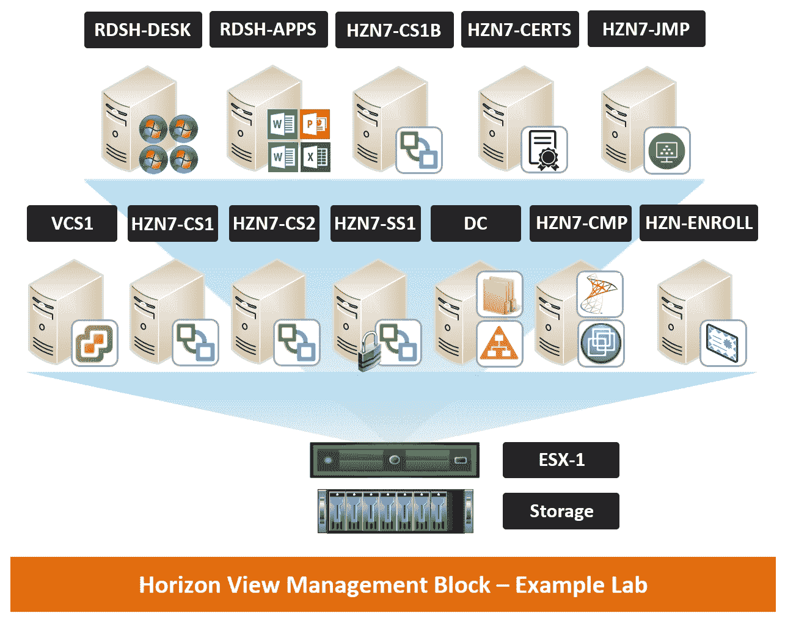

在开始安装之前，无论您是否按照示例实验室进行操作，都有一些先决条件需要就位。对于本示例，我们假设您已经搭建好了虚拟基础设施组件，如 ESXi 主机服务器、vCenter 服务器、**活动目录**（**AD**）/域控制器和 SQL 服务器，并且已经创建了虚拟服务器，准备在其上安装 Horizon View 角色。

可能还值得为桌面块构建基础设施，并确保 ESXi 主机服务器和 vCenter 服务器已构建完成。

目前无需构建虚拟桌面，因为我们将在第七章中讨论此内容，*构建和优化虚拟桌面操作系统*。

以下图示展示了示例实验室的桌面块配置：

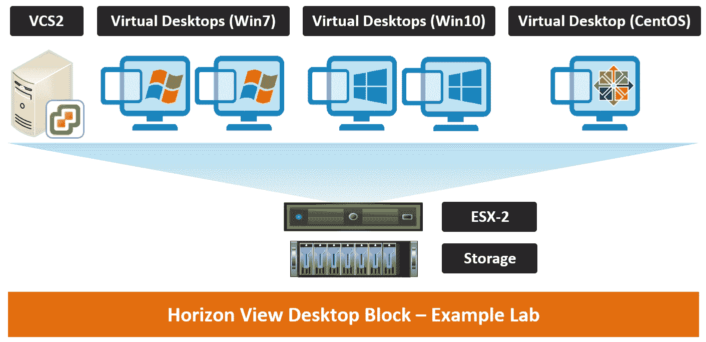

最后一步是下载 Horizon 7 软件。对于这个示例实验室，所有软件组件和安装文件都已保存在域控制器上的共享文件夹中。您可以通过点击以下链接下载 Horizon 7（版本 7.8）：

[`my.vmware.com/web/vmware/info/slug/desktop_end_user_computing/vmware_horizon/7_8`](https://my.vmware.com/web/vmware/info/slug/desktop_end_user_computing/vmware_horizon/7_8)

在实验室基础设施搭建完成后，您可以开始安装和配置。

# 准备 AD

Horizon View 需要 AD 来进行用户和桌面的身份验证，并利用组策略控制和调整终端用户桌面的许多方面。此内容将在后续章节中讨论。

提醒一下，Horizon View 兼容以下 AD 功能域级别：

+   Windows 2008 和 Windows 2008 R2

+   Windows 2012 和 Windows 2012 R2

部署 View 连接服务器时，它们需要与您要部署的桌面处于同一域中，或者处于与桌面所在域具有双向传递信任关系的域中。

# AD 用户账户

我们建议您也利用这个机会创建几个用户账户，这些账户将在您的安装过程中使用。

这些账户将包括用于您的 View 连接服务器服务和 Composer 服务的服务账户。您需要一个 AD 账户，用于 View 登录并管理您 vCenter 中的组件，同时还需要一个用户账户，用于 View Composer 管理 AD 中计算机账户的创建。

# vCenter 用户账户

你将需要一个 AD 用户帐户，以允许 View 连接到 vCenter Server。此帐户还应该作为本地管理员添加到 vCenter Server，因为我们将使用 View Composer 来创建链接克隆桌面。创建 AD 中的用户帐户后，你需要为其在 vCenter Server 中授予用户权限。

下表列出了该用户所需的权限：

现在让我们将用户添加到 vCenter Server，首先为 View vCenter 用户创建一个新角色，如下所示：

1.  使用 VMware vSphere 客户端登录 vCenter Server。登录后，从主屏幕点击“管理” (**1**)，如下截图所示：

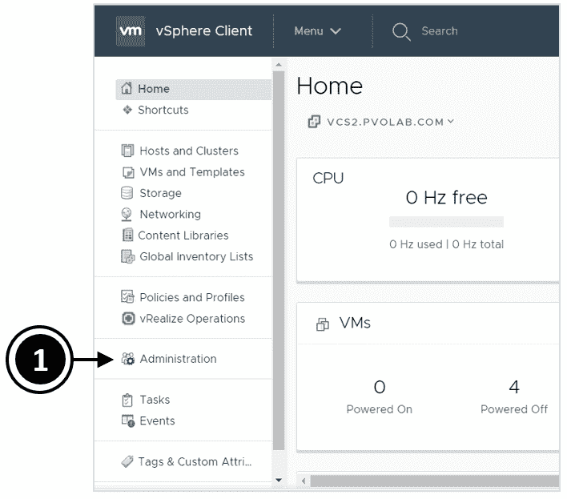

1.  你现在将看到角色界面，如下截图所示：

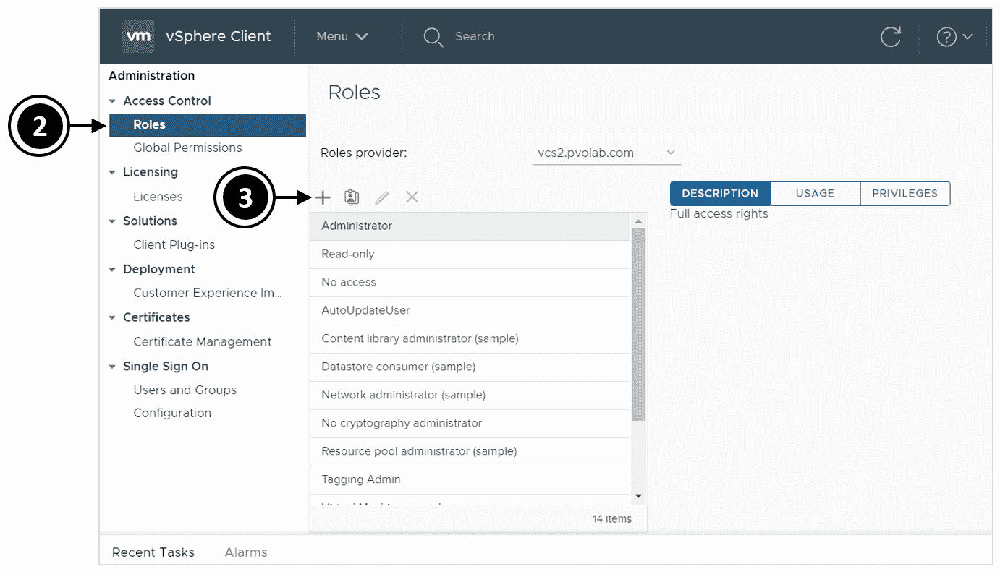

1.  接下来，点击角色 (**2**)，然后点击 + 符号 (**3**) 创建一个新角色。你现在将看到“新建角色”界面，如下截图所示：

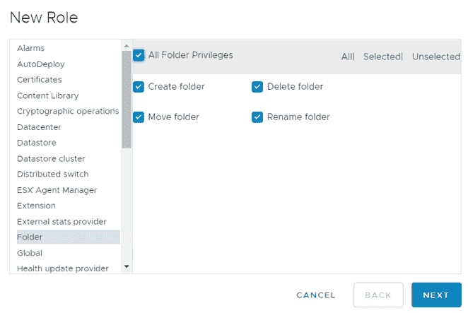

1.  从左侧的选项列表中，选择你要配置的每个类别，然后在屏幕右侧的区域中选择每个单独的权限。这些权限应该与你之前描述的权限相匹配，以便正确配置 Horizon View vCenter 用户帐户的角色和权限。完成为角色添加权限后，点击“下一步”按钮继续。你现在将看到一个可以为新角色命名的界面，如下截图所示：

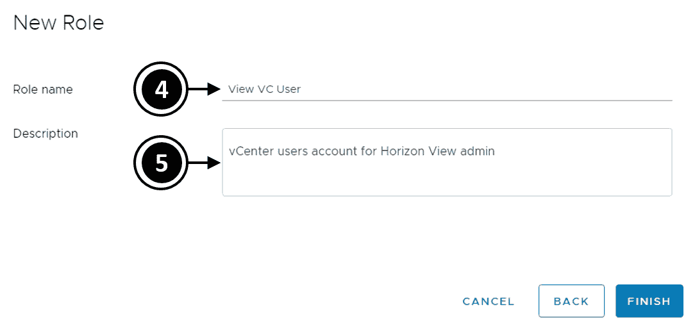

接下来，我们需要使用以下步骤为用户帐户添加权限：

1.  在 VMware vSphere Client 的主屏幕上，点击“管理”部分中的“全局权限”选项 (**6**)。

1.  现在点击 + 按钮 (**7**)，如下截图所示：

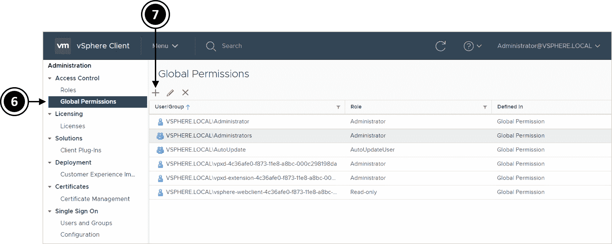

1.  你现在将看到“添加权限”界面，如下截图所示：

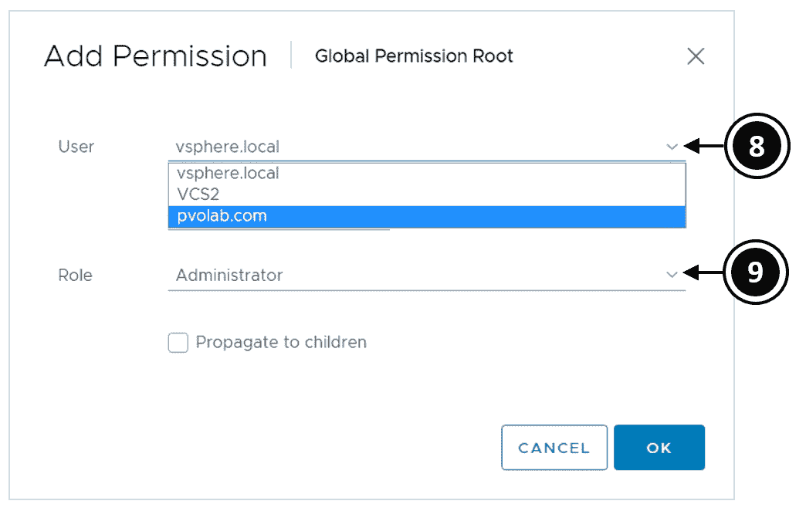

1.  在用户部分，点击下拉箭头 (**8**)，从列表中选择用户所在的域。在示例实验室中，这是 pvolab.com。

1.  接下来，我们将搜索在 AD 中创建的用户 `view-vc-user`。在框中开始输入用户名 (**9**)，位于放大镜图标旁边。输入后会自动开始搜索。当找到该用户名时，点击它进行选择 (**10**)。

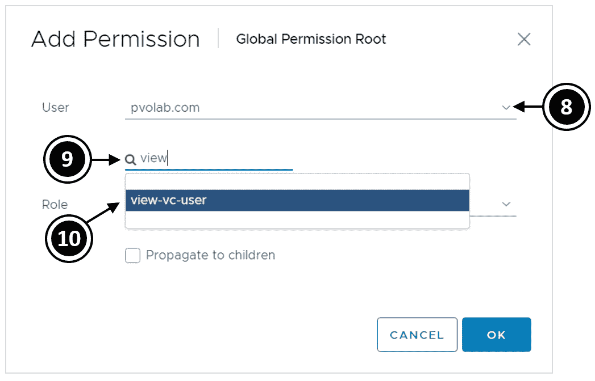

1.  然后你需要选择该用户的角色，如下截图所示：

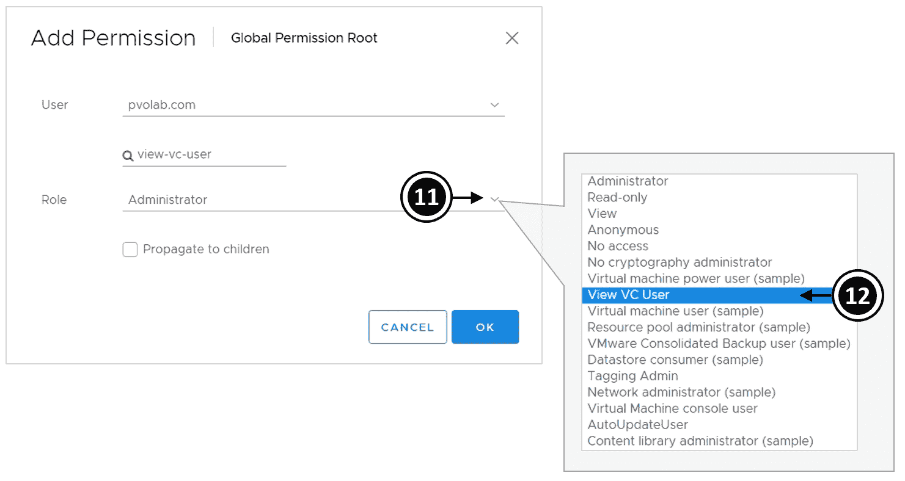

1.  在角色部分，点击下拉箭头 (**11**)，然后从显示的选项列表中点击“View VC User” (**12**)。

1.  点击“确定”以完成配置。

你现在已经成功为 Horizon View 和 vCenter 服务器设置了一个用户帐户。

# View Composer 用户帐户

你还需要为你的 View Composer 帐户提供一个 AD 用户，因为该帐户将负责为与你的域连接的克隆计算机帐户添加和删除。以下是该用户应具有的必需 AD 权限：

+   列出内容

+   阅读所有属性

+   写入所有属性

+   阅读权限

+   重置密码

+   创建计算机对象

+   删除计算机对象

该帐户的权限需要应用于 AD 容器的根域级别以及该容器的所有子对象。你还需要确保在创建此用户时已选择高级功能。此帐户将在后续配置 View Composer 连接的 View Administrator 时使用。

# View 桌面组织单位（OUs）

尽管你已经有了支持当前桌面环境的 OUs，但现在是时候开始考虑这些 OUs 是否适用于你新的虚拟环境了。你应该考虑使用专用的 OUs，以便根据正在创建的桌面池的要求轻松配置特定的组策略。

如果你计划在环境中仍然保留一定数量的物理桌面，那么你需要为新的虚拟桌面创建新的组织单位（OUs）。最好不要将两者混合使用，以免你应用了不适合某一环境的策略。例如，你不会希望将物理桌面策略应用到虚拟桌面上。

# IP 地址和 DNS 要求

对于你的 Horizon View 安装，有几个 IP 地址和 DNS 名称要求，适用于不同的 View 组件。

各组件的 IP 地址和 DNS 名称的典型要求汇总如下表：

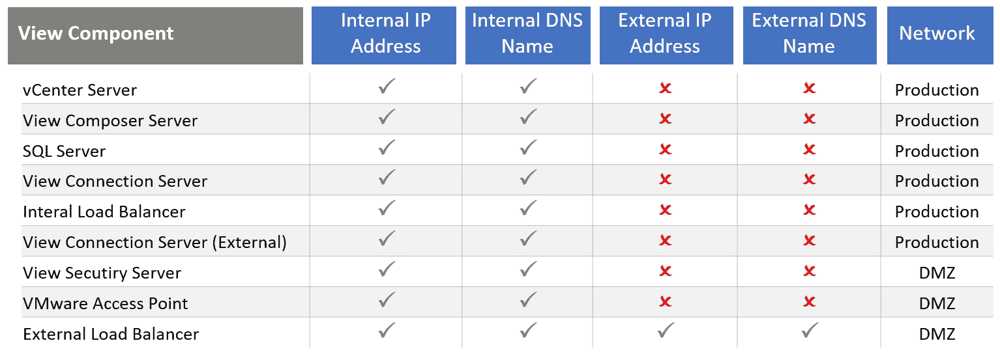

正如你从表格中看到的，建议使用负载均衡器来平衡内部视图连接服务器之间的连接，以及外部视图安全服务器之间的连接。在较小的环境中，你可能会决定只使用一个视图安全服务器，这种情况下，你需要使用外部 DNS 名称，而不是负载均衡器。

在下一部分，我们将开始安装 Horizon View 组件。

# 安装 Horizon View Composer 服务器

View Composer 与连接服务器角色略有不同，因为它不是作为连接服务器角色安装的，因此使用了一个单独的安装程序。它可以安装在运行 vCenter 服务器的同一服务器上，或作为独立服务器安装。通常，你会选择将其安装为独立服务器，以提高性能，或者如果你使用的是 vCenter Server Appliance。View Composer 的配置建议在以下屏幕截图中详细介绍：

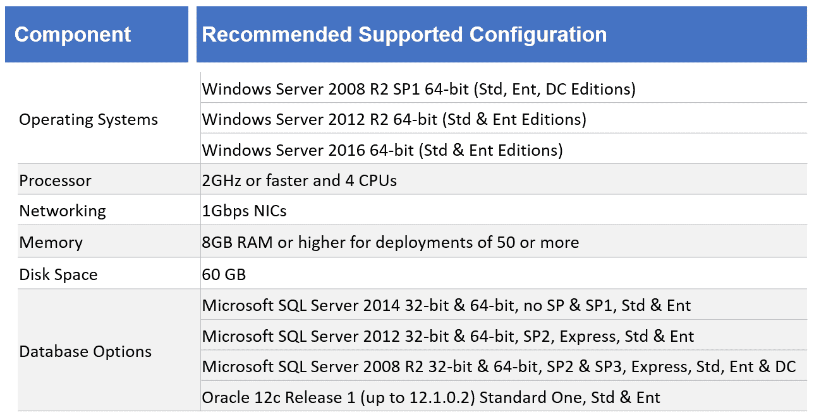

在示例实验室中，View Composer 将安装在独立服务器上；然而，如果 vCenter Server 是基于 Windows 的，你也可以直接将其安装到 vCenter Server 上。独立的 Composer 用于在你部署了 vCenter Server Appliance 时提供可扩展性。由于 vCenter Server Appliance 是基于 Linux 的，而 Composer 软件是基于 Windows 的，因此显然无法将其安装在 vCenter Server Appliance 上。

在安装第一个 Connection Server 之前安装 View Composer 可能看起来有点奇怪，但这样做的原因是，在首次配置 Connection Server 时，当你配置 vCenter Server 时，你需要输入 View Composer Server 的详细信息（如果使用的话），以便 View Connection Server 可以与其连接。

现在你已经准备好 View Composer 所需的内容，但在继续安装之前，还有一个组件需要配置，那就是数据库。

# 配置 SQL Server 用于 View Composer 数据库

为了为 View Composer 创建 SQL 数据库，按照以下步骤操作：

1.  打开运行 SQL Server 的虚拟机的控制台，并启动 **Microsoft SQL Server Management Studio** 应用程序。在示例实验室中，SQL Server 安装在我们将要安装 View Composer 的同一台服务器上，因此服务器名称为 `hzn7-cmp.pvolab.com`。你将看到登录框，如下图所示：

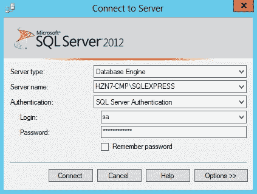

1.  使用具有适当权限的账户登录。在此示例中，我们使用的是 SA 账户。点击“连接”按钮。

1.  现在你将看到 SQL Server Management Studio 屏幕。从对象资源管理器中，展开 `Security` 文件夹并选择 `Logins` (**1**)。右键点击并选择“新建登录…”选项 (**2**)，如下图所示：

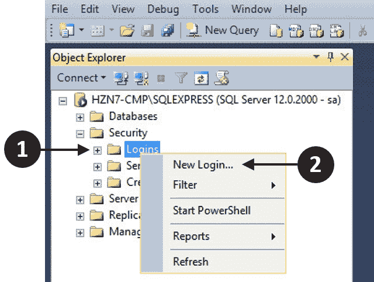

1.  然后，你将看到登录–新建屏幕，如下图所示：

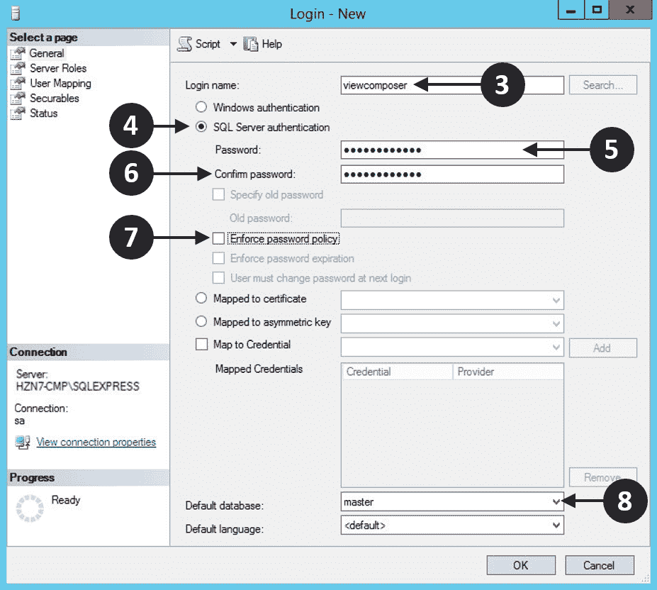

1.  在登录名框 (**3**) 中，输入新的登录名。在示例实验室中，新的登录名将为 `viewcomposer`。点击 SQL Server 身份验证的单选按钮 (**4**)，然后在密码框 (**5**) 中输入新密码。再在确认密码框 (**6**) 中输入新密码。

1.  接下来，取消选中“强制密码策略”框 (**7**)。最后，在默认数据库下拉框 (**8**) 中，选择“master”选项。我们将在下一步创建数据库时更新此项，以反映 View Composer 的正确数据库。

1.  配置完成后，点击“确定”按钮，你将返回到对象资源管理器。

1.  现在你已经创建了登录账户，接下来需要为 View Composer 创建一个新数据库。从对象资源管理器中，选择 `Databases` 文件夹 (**9**)，右键点击并选择“新建数据库…” (**10**)，如下图所示：

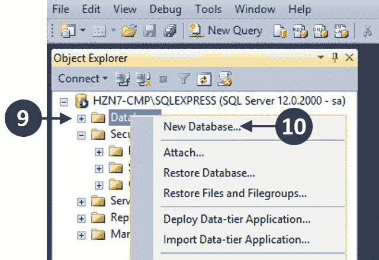

1.  您将看到“新建数据库”屏幕，如下图所示：

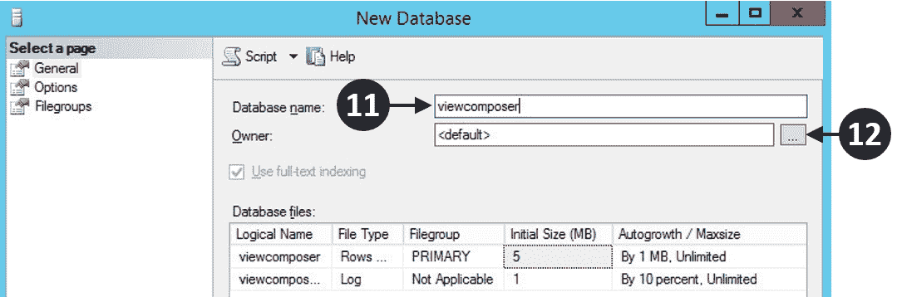

1.  在“数据库名称”框（**11**）中，输入此数据库的名称。在示例实验中，数据库命名为 `viewcomposer`。

1.  在“所有者”框中，点击“…”框（**12**）。现在您将看到选择数据库所有者屏幕，如下图所示：

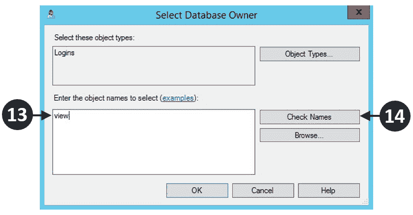

1.  在“输入要选择的对象名称”框中输入 `view`（**13**），然后点击“检查名称”框（**14**）。这将搜索所有包含 `view` 字段的条目。

1.  现在您将看到“找到多个对象”框，如下图所示：

1.  勾选 viewcomposer 框（**15**）。这是我们之前创建的登录项。

1.  现在点击“确定”按钮，您将返回到“选择数据库所有者”框，框中将显示输入的 `viewcomposer` 用户，如下图所示：

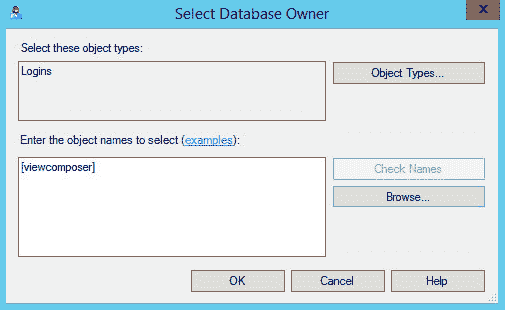

1.  在“选择数据库所有者”框中，点击“确定”以接受数据库所有者。

1.  现在，您将返回到“新建数据库”屏幕，该屏幕将显示数据库名称和数据库所有者，如下图所示：

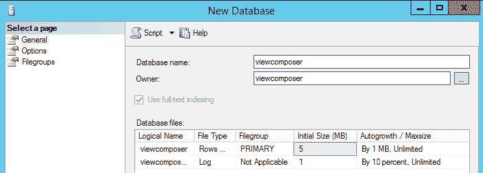

1.  点击“确定”以完成该过程并关闭“新建数据库”屏幕。

    最后的配置任务是返回并编辑 `viewcomposer` 用户登录，并输入 `viewcomposer` 数据库的详细信息。

1.  从对象资源管理器中，展开 `Logins`（**16**），然后选择 `viewcomposer` 选项（**17**）。右键单击并从上下文菜单中选择“属性”（**18**）。在 **默认数据库** 框中，点击下拉菜单（**19**）并选择 viewcomposer 选项，如下图所示：

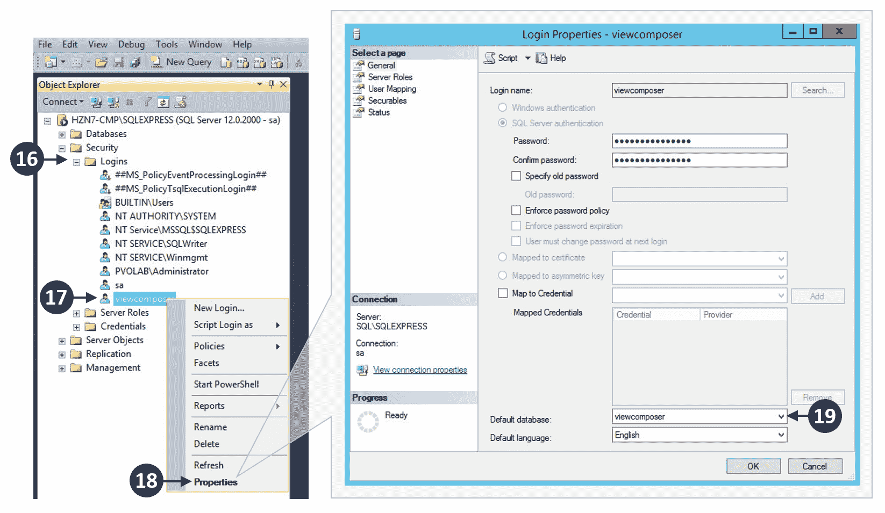

1.  点击“确定”按钮以完成配置更改。

在关闭 SQL Server Management Studio 之前，还需要创建一个其他数据库；因此，按照之前描述的整个过程重复操作，创建一个数据库以及 View 事件数据库的数据库所有者。在示例实验中，所有者和数据库都被命名为 `viewevents`。我们将在本章后面使用此数据库。

数据库配置完成后，我们可以继续安装 View Composer 软件。

# View Composer 安装

在示例实验环境中，我们将要在 vCenter 服务器上安装 View Composer。在开始安装之前，请确保已经安装了 SQL Server Native Client 11.0，因为这将用于配置 View Composer 服务器与 SQL 数据库之间的连接。要安装 View Composer，请按照以下步骤操作：

1.  打开到 **VCS2** vCenter Server 虚拟机的控制台，然后找到 Horizon View 安装软件，如下图所示：

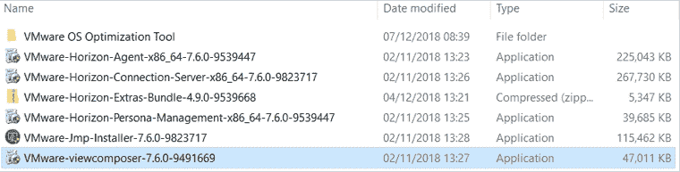

1.  启动`VMware-viewcomposer-7.6.0-9491669`文件开始安装。

1.  如果您看到“打开文件 - 安全警告”消息，如下所示，点击“Run”按钮继续：

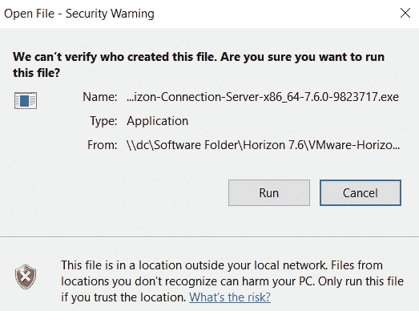

1.  现在，您将看到“欢迎使用 VMware Horizon 7 Composer 安装向导”屏幕，如下图所示：

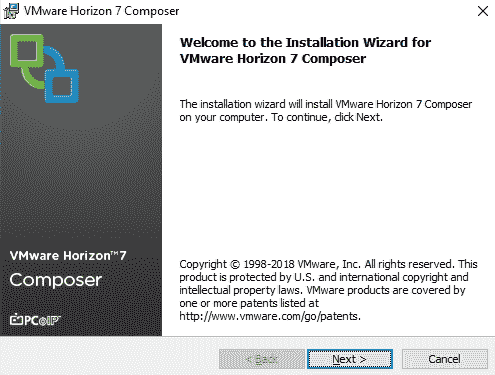

1.  点击“Next >”按钮开始安装。您将看到“许可证协议”屏幕，如下图所示：

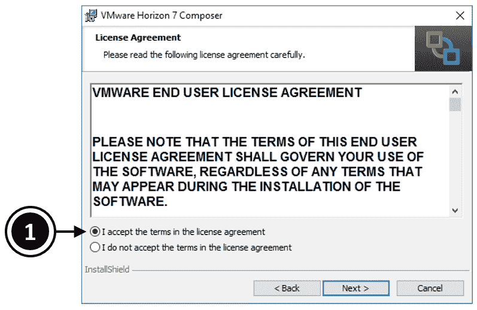

1.  选中“我接受许可证协议中的条款”（**1**）单选按钮，然后点击“Next >”按钮。接下来，您将看到“目标文件夹”屏幕，如下图所示：

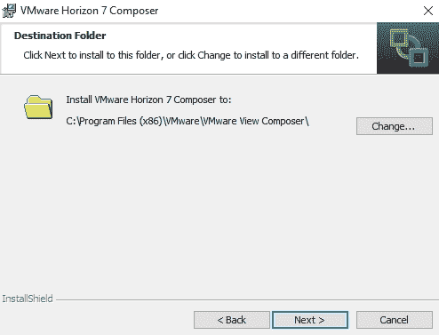

1.  保持文件夹为默认值，然后点击“Next >”按钮继续。您将看到“数据库信息”屏幕，如下图所示：

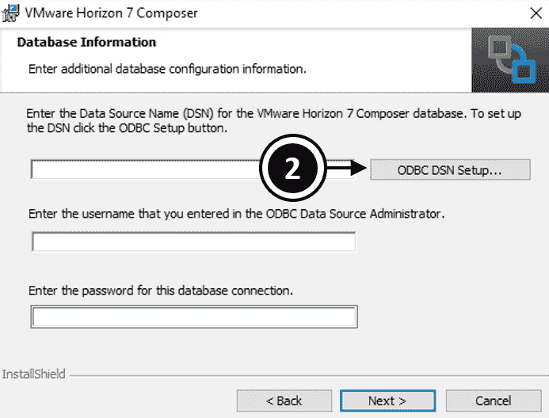

1.  您首先需要创建一个 ODBC DSN 来连接到 View Composer 数据库。

1.  点击“Odbc DSN 设置...”按钮（**2**）。您将看到“ODBC 数据源管理器（64 位）”框，如下图所示：

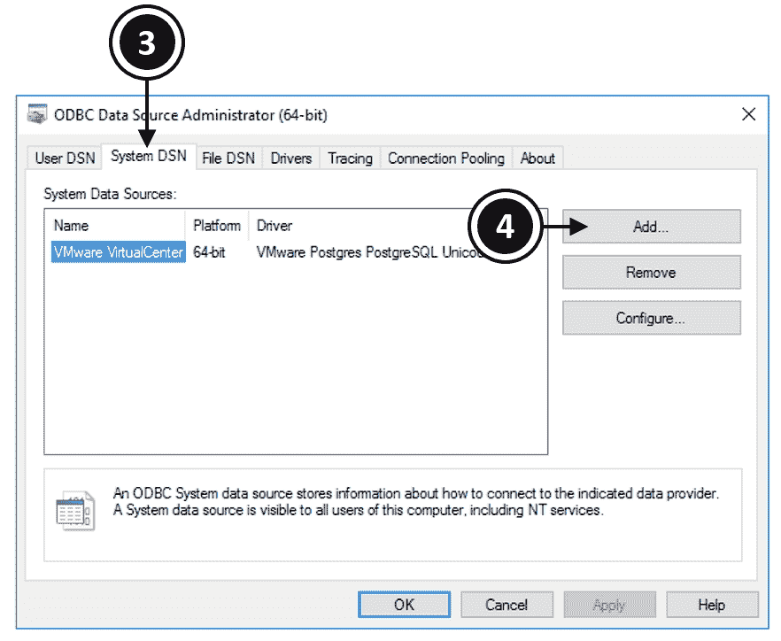

1.  点击“System DSN”标签页（**3**），然后点击“Add…”按钮（**4**）。

1.  在您现在看到的“创建新数据源”框中，点击**SQL Server Native Client** **11.0** 选项（**5**），然后点击“Finish”按钮，如下图所示：

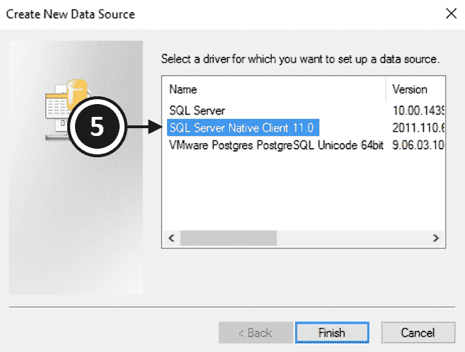

1.  现在，您将看到“创建新的 SQL Server 数据源”框，如下图所示：

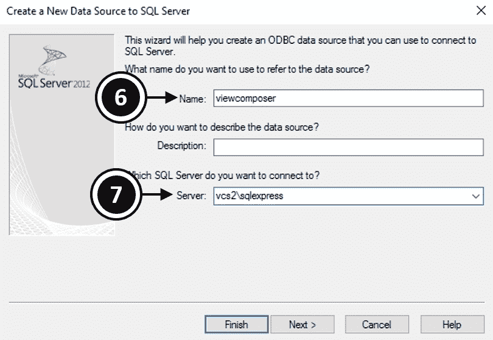

1.  在“名称”框（**6**）中，输入该数据源的名称。在示例实验室中，这个名称是 `viewcomposer`。

1.  在“服务器”框（**7**）中，点击下拉箭头，选择要连接的 SQL Server。在示例实验室中，这是 vcs2\sqlexpress，因为我们正在 vCenter Server 中安装 View Composer。

1.  点击“Next >”按钮继续。

1.  接下来，您需要输入身份验证详细信息。

1.  选择“使用用户输入的登录 ID 和密码进行 SQL Server 身份验证”单选按钮（**8**），然后在“登录 ID”框（**9**）中输入用户登录详细信息。在示例实验室中，我们将使用 SA 帐户。最后，在“密码”框（**10**）中，输入 SA 帐户的密码，如下图所示：

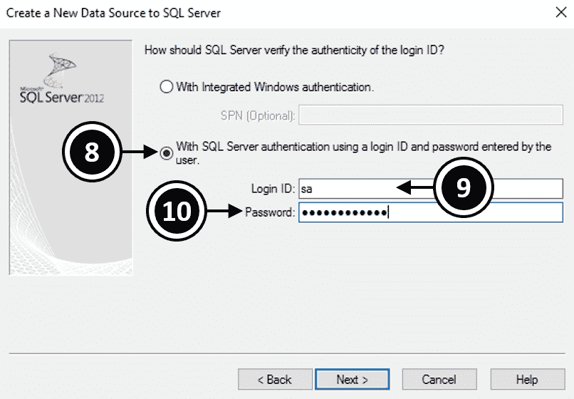

1.  点击“Next >”按钮继续。

1.  在下一个配置框中，您需要更改默认的数据库详细信息，以反映 View Composer 的数据库。

1.  勾选“更改默认数据库为”框（**11**），然后在其下方的框中点击下拉箭头（**12**），并选择 viewcomposer 选项。点击下拉框时，这一选项应自动填充，如下图所示：

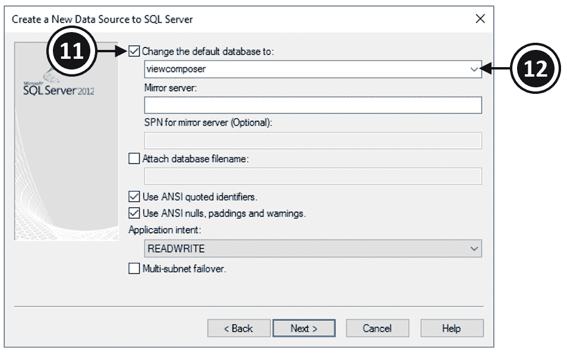

1.  点击“下一步 >”按钮继续。你将看到如下所示的最终配置框：

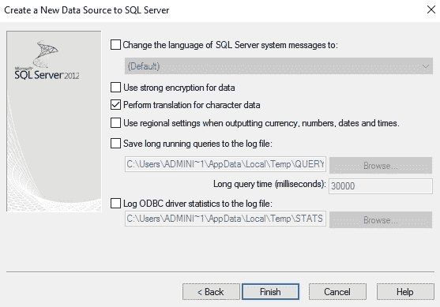

1.  保留此屏幕上的设置为默认值，然后点击“完成”按钮以完成配置。

1.  你现在会看到如下所示的配置摘要：

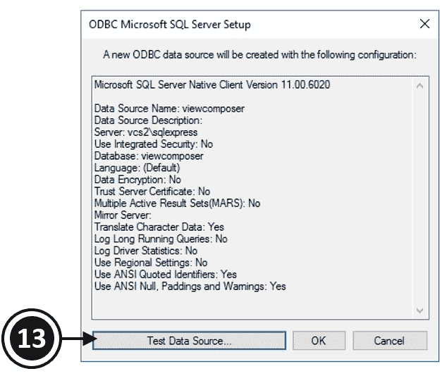

1.  最后一步是测试新创建的连接。为此，点击“测试数据源…”按钮（**13**）。

1.  你应该看到测试结果框中显示`TESTS COMPLETED SUCCESSFULLY!`消息，如下截图所示：

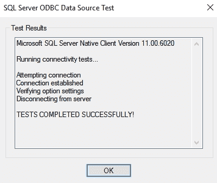

1.  点击“确定”按钮以完成测试并关闭测试结果框。

1.  接下来，点击“确定”按钮以关闭**ODBC Microsoft SQL Server 设置**框。

1.  你现在将返回 ODBC 数据源管理员界面，在该界面中，你可以看到新创建的系统 DSN 连接到 View Composer 数据库。

1.  点击“确定”按钮以关闭 ODBC 数据源管理员界面，返回 View Composer 安装界面及数据库信息配置界面，如下所示：

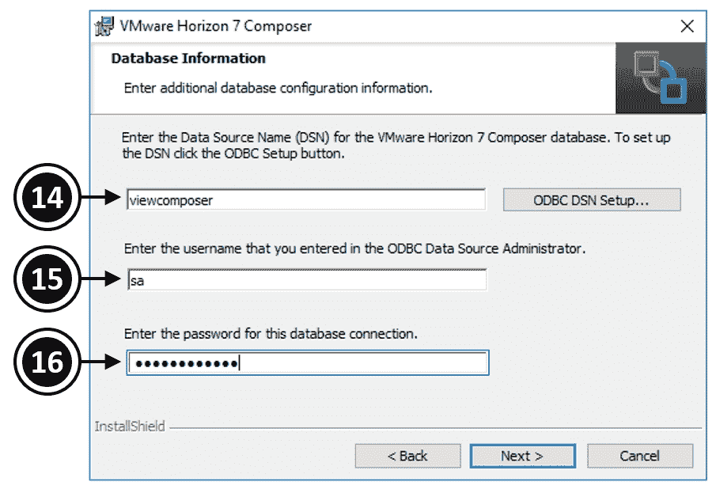

1.  现在，你可以在数据源名称（DSN）框中输入`viewcomposer`（**14**），并在“请输入在 ODBC 数据源管理员框中输入的用户名”框（**15**）中输入`sa`，接着在“请输入该数据库连接的密码”框（**16**）中输入 SA 账户的密码。

1.  点击“下一步 >”按钮继续。

1.  在 VMware Horizon 7 Composer 端口设置界面，保留 SOAP 端口设置为默认值，如下所示：

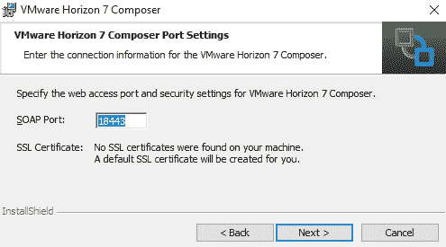

**简单对象访问协议**（**SOAP**）端口用于 View 与 Composer 之间的 XML 格式通信。建议保留默认设置，除非有特别理由需要更改它。

1.  点击“下一步 >”按钮继续。

1.  你现在会看到“准备安装程序”界面，如下所示：

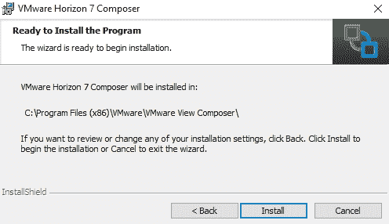

1.  点击“安装”按钮以开始安装。

1.  安装完成后，你将看到“安装完成”界面：

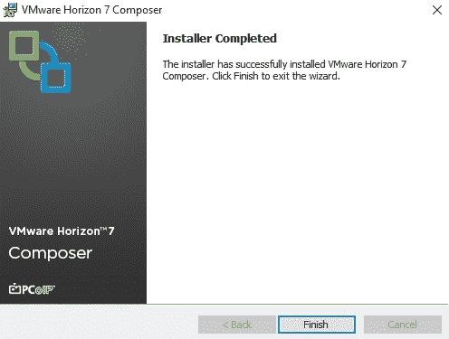

1.  点击“完成”按钮以关闭安装程序。如果由于任何原因，View Composer 安装失败，安装日志将保存在 View Composer 的`%TEMP%\vminst.log_date_timestamp`文件夹中。此外，MSI 日志也会创建，并可以在`%TEMP%\vmmsi.log_date_timestamp`文件夹中找到。

1.  你现在会看到提示重启虚拟机：

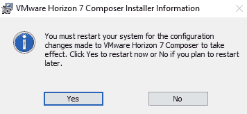

1.  点击“是”按钮重启 View Composer 虚拟机。

1.  当 View Composer 虚拟机重启后，登录并检查 View Composer 服务是否正在运行。为此，按下 Windows 键和 *R* 打开“运行”对话框。在对话框中输入 `services.msc`。你现在会看到“服务（本地）”界面，向下滚动并检查 VMware Horizon 7 Composer (**17**) 是否正在运行，如下截图所示：

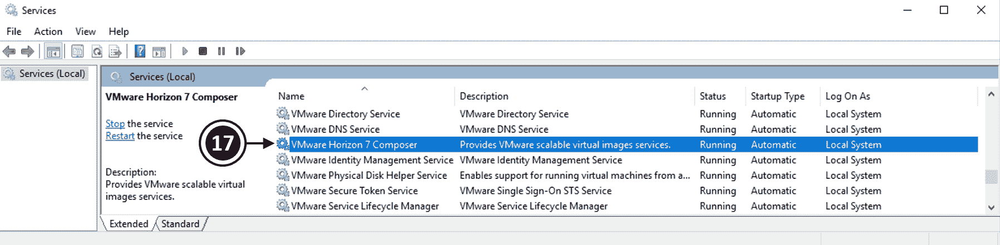

1.  当你确认 VMware Horizon 7 Composer 服务正在运行时，关闭“服务”界面。

你现在已经成功安装了 VMware Horizon View Composer。

# 安装 Horizon View 连接服务器

View 连接服务器及其其他角色（安全服务器、复制服务器等）已安装在专用的 Windows 服务器上。以下表格列出了连接服务器的推荐配置：

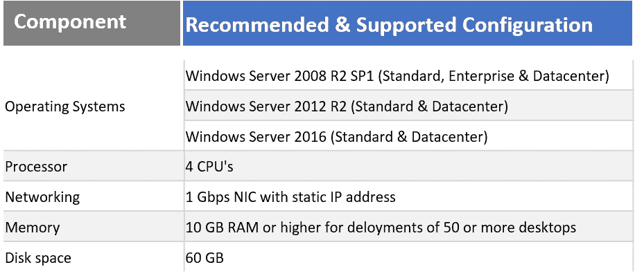

设置示例实验室的下一步是部署第一个连接服务器。这个第一个连接服务器实例将安装在一个 Windows Server 2016 虚拟机上，主机名为 `HZN7-CS1`，该虚拟机在本书开头作为示例实验室环境的一部分创建。它已配置为静态 IP 地址，并加入到域中。

要安装连接服务器软件，请按照以下步骤操作：

1.  打开到 `HZN7-CS1` 虚拟机的控制台，然后找到 Horizon View 安装软件。在示例实验室中，这个软件被保存在域控制器的共享文件夹中。

1.  启动`VMware-Horizon-Connection-Server-x86_64-7.6.0-9823717`文件开始安装。

1.  如果看到“打开文件 - 安全警告”消息，点击“运行”按钮，如下截图所示：

1.  你现在会看到 VMware Horizon 7 连接服务器安装向导欢迎界面。

1.  点击“下一步 >”按钮开始安装。你现在会看到许可协议界面。

1.  选择我接受许可协议条款的单选按钮，然后点击“下一步 >”按钮。接下来你将看到目标文件夹界面。

1.  保持文件夹为默认设置，然后点击“下一步 >”按钮继续。你现在会看到如下截图所示的安装选项界面：

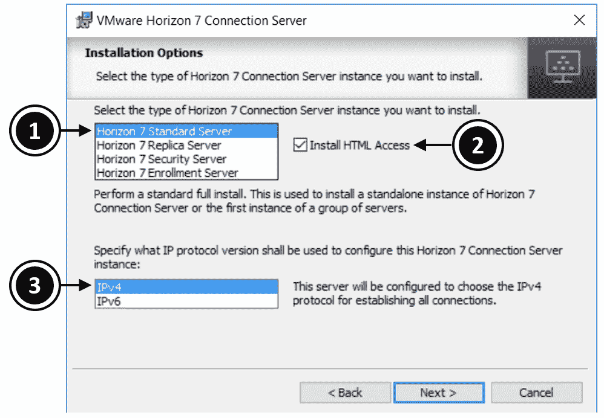

1.  由于这是第一个 View 连接服务器，从 Horizon 7 连接服务器实例列表中，选择 Horizon 7 标准服务器选项 (**1**)。

1.  我们还将安装 HTML 访问，因此勾选“安装 HTML 访问”框 (**2**)。这将允许用户通过 HTML 5 网络浏览器使用 Blast 协议访问桌面。此界面上的最后一个选项是选择使用哪个 IP 协议版本，`IPv4` 或 `IPv6`。在示例实验中，选择 `IPv4` 选项 (**3**)。

请记住，不能在同一环境中混用 IPv4 和 IPv6，因此在示例实验中，所有组件将使用 IPv4。

1.  一旦你选择了实例，点击“下一步 >”按钮继续。

1.  你现在将看到数据恢复界面，如下图所示：

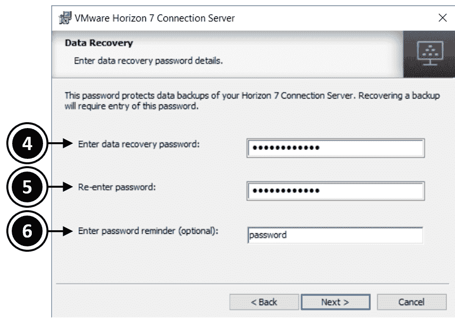

1.  在数据恢复界面，你需要输入一个密码，用于连接服务器的备份。在“输入数据恢复密码”框 (**4**) 中，输入你想使用的密码，然后在“重新输入密码”框 (**5**) 中再次输入该密码。最后，在“输入密码提示（可选）”框 (**6**) 中输入密码提示。

1.  点击“下一步 >”按钮继续。你现在将看到防火墙配置界面，如下图所示：

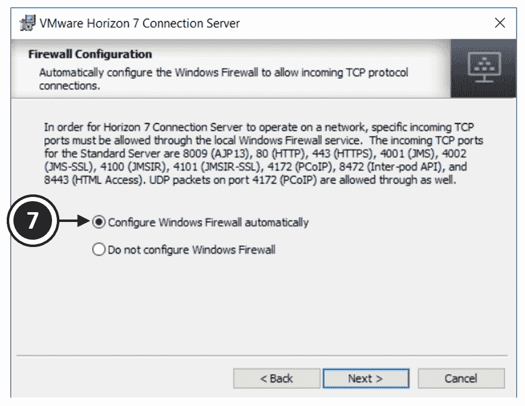

1.  点击“自动配置 Windows 防火墙”单选按钮，然后点击“下一步 >”按钮继续。

Windows 防火墙是 Horizon View 的必要条件，特别是针对安全服务器与连接服务器之间的通信。在任何情况下，都不应禁用连接服务器上的 Windows 防火墙服务。推荐的做法是让 Windows 防火墙自动配置，然后根据需要记录下所需的端口。

1.  你现在将看到初始 Horizon 7 管理员界面，如下图所示：

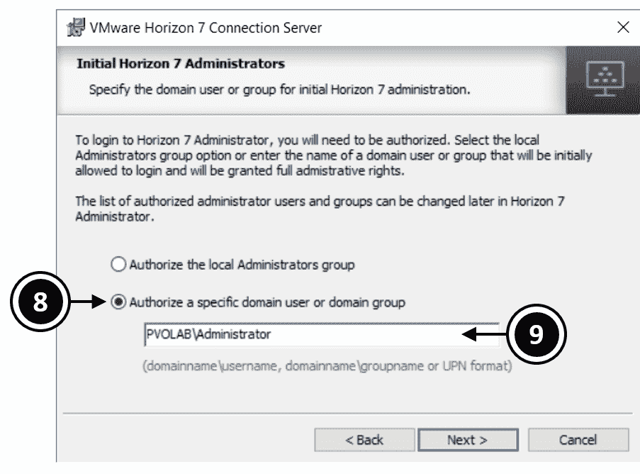

1.  在此界面，你需要配置哪些域上的用户或本地服务器上的用户将被设置为第一个 View 管理员。在示例实验中，我们将使用标准的管理员账户；不过，建议你创建一个特定的用户和/或用户组，他们将拥有访问 Horizon View 管理控制台的管理员权限。

1.  点击“授权特定域用户或组”单选按钮 (**8**)，然后在下面的框中输入用户或组名。你需要按格式输入域名\用户名。在示例实验中，输入 `PVOLAB\Administrator`。

1.  点击“下一步 >”按钮继续。你现在将看到用户体验改进计划界面，如下图所示：

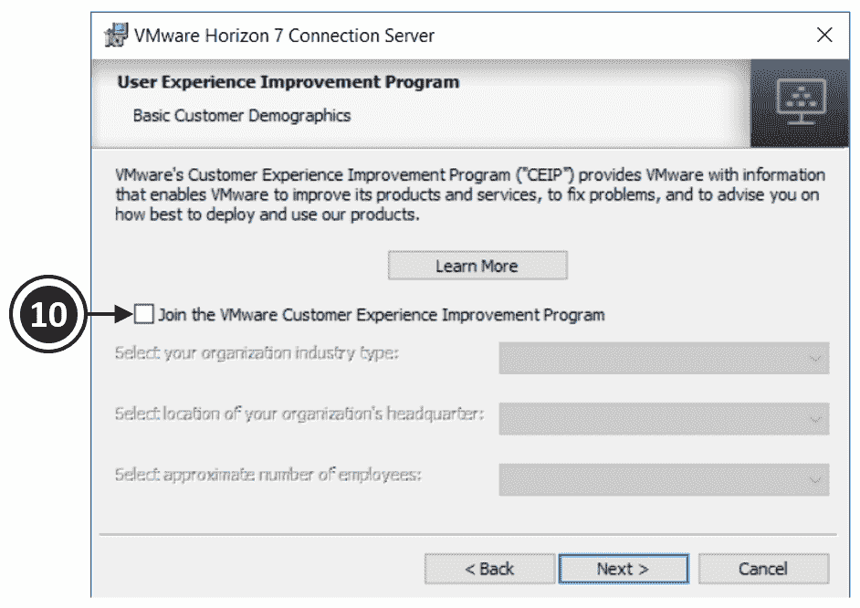

1.  用户体验改进计划是一个可选的程序，它会匿名发送产品统计信息给 VMware。这并不是许可检查！在示例实验中，请确保未勾选该框 (**10**)。

1.  点击“下一步 >”按钮继续。

1.  你现在将看到安装程序准备好安装的界面，如下图所示：

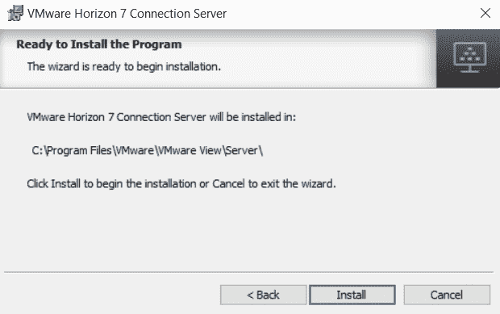

1.  点击“安装”按钮以开始安装过程。

1.  一旦连接服务器安装完成，您将看到如下所示的安装完成屏幕：

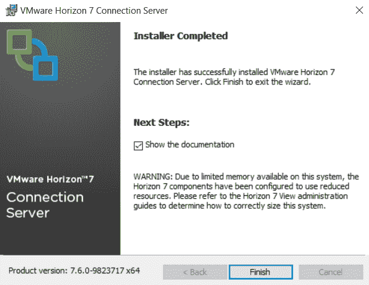

1.  在关闭此屏幕之前，您可以选择勾选“显示文档”框。建议您查看该文档，因为它讨论了 Horizon View 安装中有效 SSL 证书的重要性，我们将在第六章中更详细地讨论此内容，*使用 SSL 证书保护 Horizon View*。

1.  如果安装因任何原因失败，安装日志将保存在连接服务器的`%TEMP%\vminst.log_date_timestamp`中。此外，还会创建 MSI 日志，可以在`%TEMP%\ vmmsi.log_date_timestamp`找到。

最后，点击“完成”按钮以完成安装并关闭安装程序。您现在会看到桌面上已放置了 Horizon 7 管理控制台的图标，如下所示：

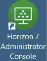

在接下来的部分，我们将登录视图管理员并完成初始配置任务。

# Horizon View 连接服务器的初始配置

现在已安装连接服务器，您可以连接到管理控制台，该控制台名为**视图管理员**，并完成初始配置任务。

从安装了 Adobe Flash 10.1 或更高版本的工作站打开浏览器，并输入视图连接服务器的地址。在示例实验室中，输入的地址应为`https://hzn7-cs1.pvolab.com/admin`。

由于 SSL 证书尚未配置，您需要创建一个安全例外，允许您访问带有未加密证书的 HTTPS 页面。我们将在第六章中讨论 SSL 证书，*使用 SSL 证书保护 Horizon View*。

您现在将看到如下所示的视图管理员登录屏幕：

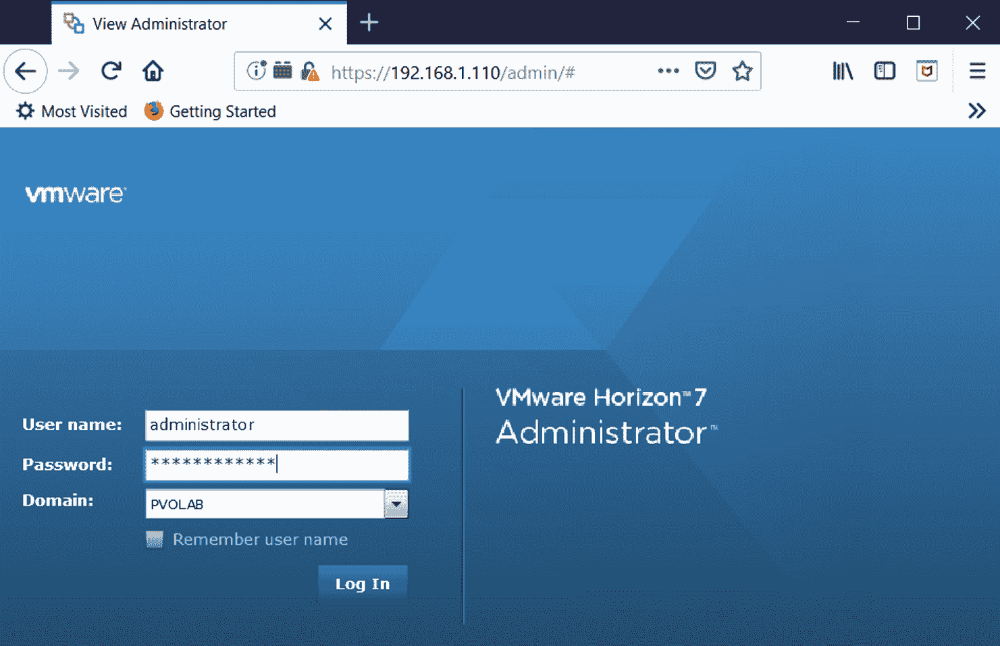

使用管理员账户和密码登录视图管理员，确保域设置与下拉菜单中的域匹配。然后点击“登录”按钮。

您现在应该已经第一次登录到视图管理员。需要配置的第一个组件是产品许可证。

# 向连接服务器添加许可证

在完成的第一个配置任务中，一旦连接服务器安装完成，您需要添加产品许可证以启用相关功能。为此，请按照此处描述的步骤操作：

1.  当你第一次登录时，由于尚未安装许可证，管理员屏幕将默认显示在库存窗格的产品许可和使用部分。页面顶部会显示**许可**框。点击**1**号按钮“编辑许可证…”，如下图所示：

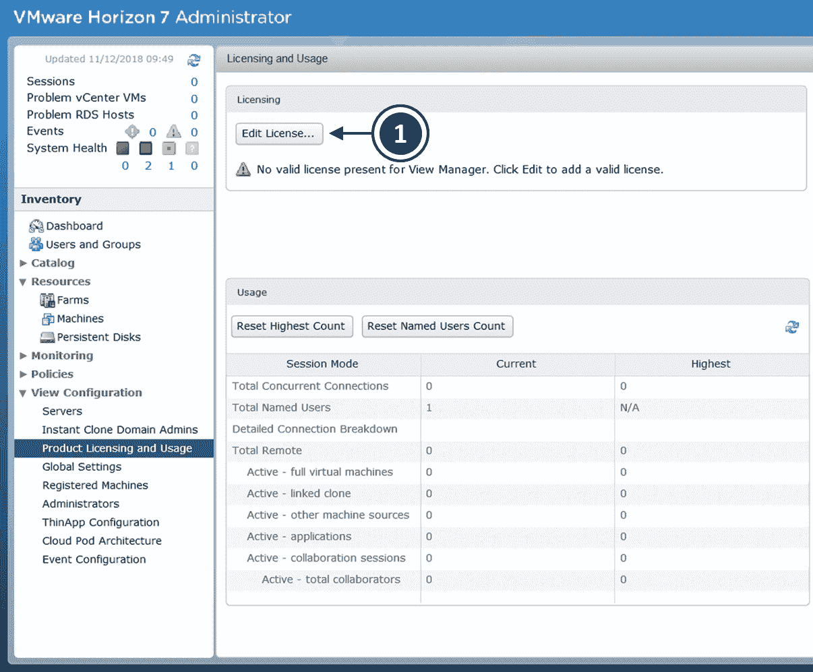

1.  你现在将看到如下图所示的编辑许可证框：

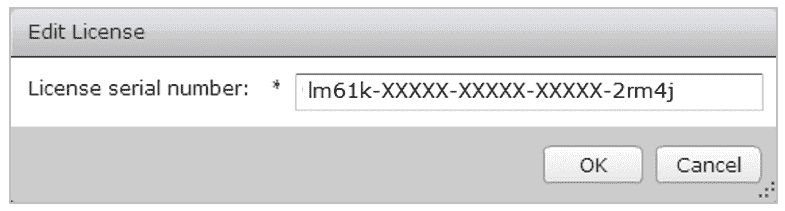

1.  在许可证序列号框中，输入你的许可证密钥，然后点击确定按钮。在前面的示例中，许可证密钥部分被 `xxxxx` 遮掩，以隐藏实际的许可证密钥。输入许可证密钥时，它将逐字显示在屏幕上。

1.  输入许可证密钥后，你将在许可框中看到与其相关的详细信息。它将提供许可证到期日期，并列出所有与许可证一起启用的功能。在示例实验室中，你可以看到所有功能以及并发用户使用模型：

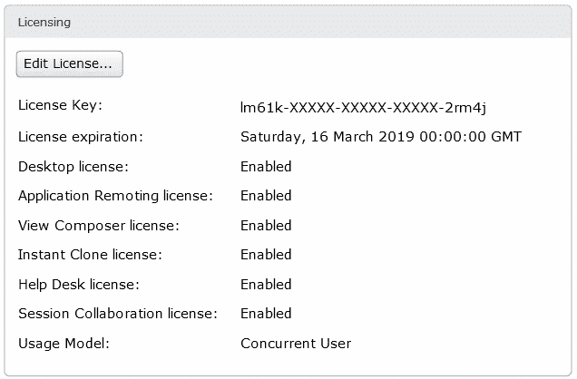

许可页面还会显示你当前的使用情况，如下图所示：

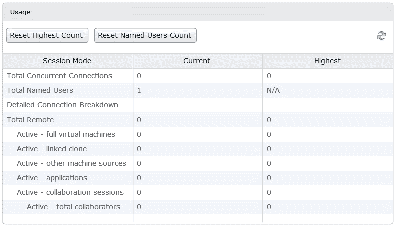

这使你能够确保自己处于已购买许可证的权限范围内，并且可以监控你的使用情况，从而在达到限制之前预见到需要升级的时机。

# 将 vCenter Server 添加到 View Administrator

接下来的任务是配置 View Administrator 和 vCenter Server 之间的连接：

1.  在 View Administrator 主屏幕中，展开视图配置选项**1**，然后选择服务器**2**。接下来，在服务器屏幕中，确保选中了 vCenter Servers 标签**3**，然后点击**4**号按钮“添加…”，如下图所示：

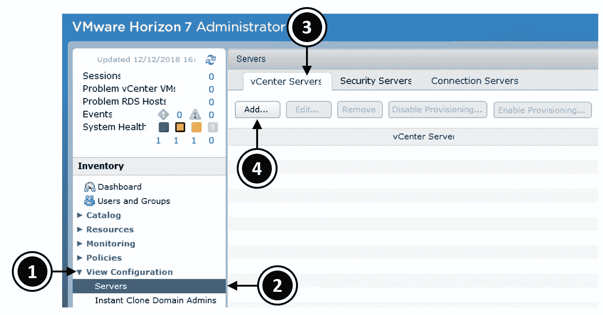

1.  现在你将看到显示在以下截图中的 vCenter Server 信息屏幕：

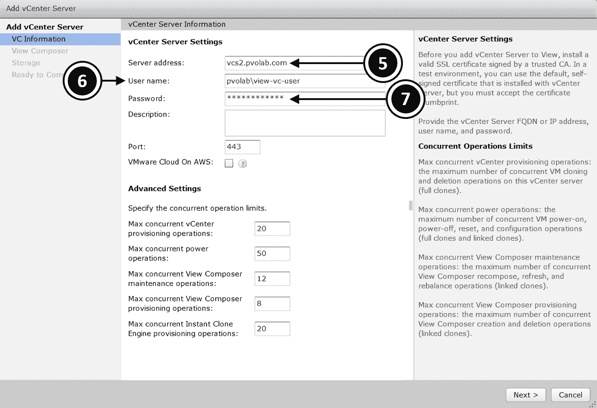

1.  在服务器地址框**5**中，输入你希望连接到 Connection Server 的 vCenter Server 地址。在示例实验室中，这是 `vcs2.pvolab.com`，即管理虚拟桌面的 vCenter 地址。

1.  接下来，在用户名框**6**中，输入 vCenter 用户名，并在密码框**7**中输入该账户的密码。在本例中，使用了管理员账户；然而，你可能希望使用我们在本章早些时候创建的特定用户账户。

1.  你现在将看到以下无效证书检测警告框：

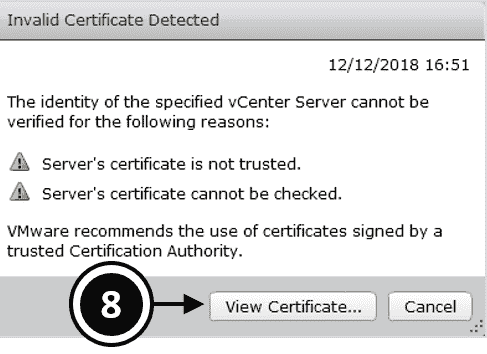

1.  点击**8**号按钮“查看证书…”。现在你将看到证书信息框。

1.  点击接受按钮。

1.  下一个屏幕是显示在以下截图中的视图 Composer 设置屏幕：

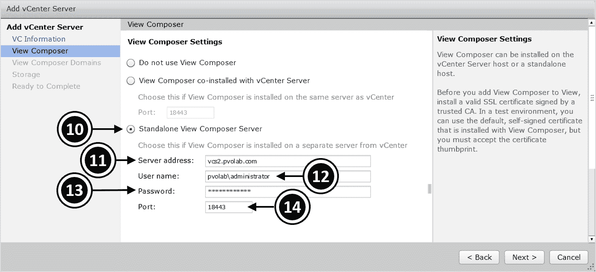

1.  您有三个选项来配置 View Composer：不使用 View Composer、与 vCenter Server 共同安装的 View Composer 和独立 View Composer 服务器。

1.  对于示例实验室，View Composer 将安装在一台独立服务器上，因此点击独立 View Composer 服务器单选按钮（**10**）。

1.  接下来，您需要输入 View Composer 服务器的详细信息。在服务器地址框（**11**）中，输入服务器地址。在示例实验室中，该地址为`vcs2.pvolab.com`。然后，在用户名框（**12**）中输入该服务器的用户名。记得以域名\用户名的格式输入，在示例实验室中，输入`pvolab\administrator`，并在密码框（**13**）中输入该用户账户的密码。将端口框（**14**）保持默认设置`18443`。

1.  当您完成所有详细信息后，点击“下一步 >”按钮。

1.  与添加 vCenter Server 时一样，您将再次看到以下“检测到无效证书”警告框：

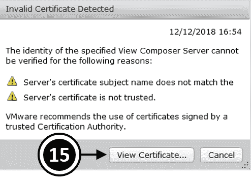

1.  点击“查看证书...”按钮（**15**）。您将看到证书信息框。

1.  点击“接受”按钮。您将看到如下所示的 View Composer 域配置屏幕：

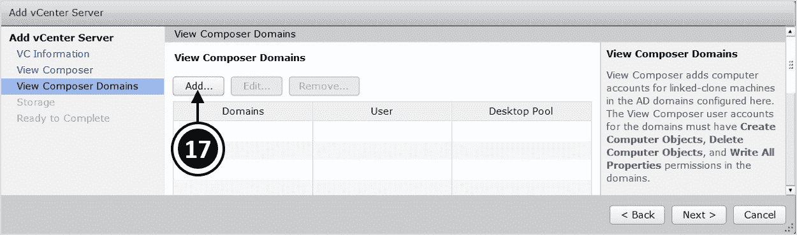

1.  在此屏幕上，我们将配置 View Composer 以访问域账户，使其能够添加、创建和删除 AD 中的计算机账户。点击“添加...”按钮（**17**）。您现在将看到如下所示的“添加域”配置框：

1.  在完整域名框（**18**）中，输入域名。在示例实验室中，该域名为`pvolab.com`。然后，在用户名框（**19**）中，输入具有创建和删除 AD 中计算机对象权限的用户名。在示例实验室中，我们将使用`administrator`账户。

1.  最后，在密码框中，输入管理员账户的密码。输入信息后，点击“确定”按钮。您将返回到 View Composer 域配置屏幕，现显示已配置的域详情，如下图所示：

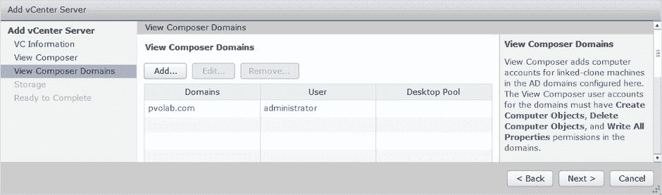

1.  点击“下一步 >”按钮继续。

1.  您现在将看到存储设置配置屏幕。在这里有两个主要元素需要配置。第一个选项是配置是否希望回收虚拟桌面虚拟机的磁盘空间。如果选中此项，虚拟机将配置为节省空间的磁盘，这将允许回收未使用的空间。

1.  第二个选项是配置启用视图存储加速器。这允许将特定数量的内存用作读取缓存，以减少在共享或本地存储上运行虚拟机时的存储开销。默认情况下，这将为每台服务器分配`1024`MB 的内存，并且可以增加到每台服务器最多 2GB。如果勾选“显示所有主机”框，你可以选择单独的主机服务器，并为每台主机配置不同的缓存大小。

1.  在示例实验室中，我们将启用回收虚拟机磁盘空间和启用视图存储加速器选项，如下图所示：

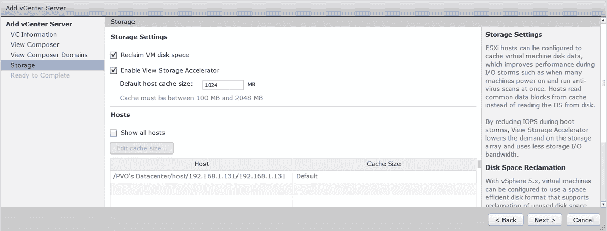

1.  点击“下一步 >”按钮继续。你现在将看到如下截图所示的“准备完成”界面：

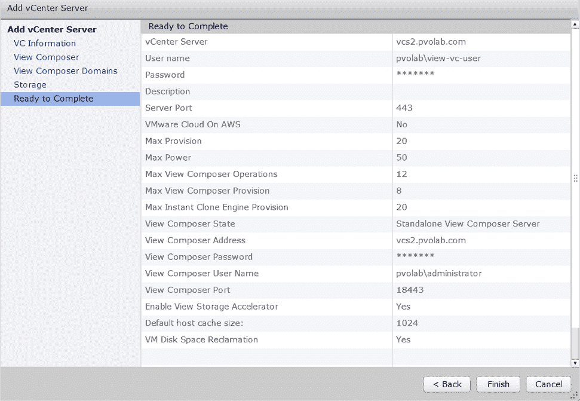

1.  最后，检查配置详情，然后点击完成按钮以完成配置。你将返回到视图管理员界面，界面中现在显示了刚刚添加的 vCenter Server，如下图所示：

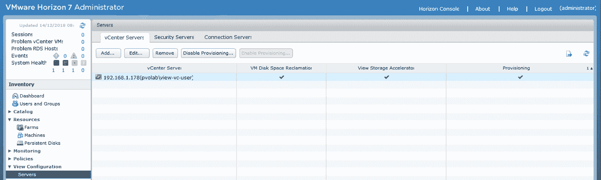

视图管理员界面

你现在已将 vCenter Server 添加到 Horizon View。在下一节中，我们将配置视图事件数据库。

# 配置视图事件数据库

初始配置任务的最后部分是配置事件数据库。这是 Horizon View 存储所有连接服务器上发生的事件的地方。

在本章开始时创建了一个名为**view-events**的数据库，现在我们将在配置中使用它：

1.  从视图管理员主屏幕和库存部分，展开视图配置选项，然后选择事件配置 (**1**)。你现在将看到如下截图所示的事件配置界面：

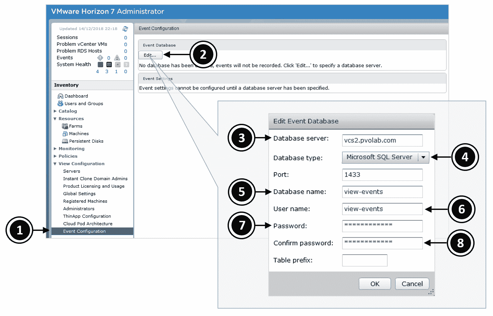

1.  在事件数据库部分，点击编辑…按钮 (**2**)。你现在将看到编辑事件数据库对话框弹出，如前面的截图所示。

1.  在数据库服务器框 (**3**) 中，输入托管事件数据库的 SQL 服务器名称。在示例实验室中，它与 vCenter 位于同一服务器上，因此输入`vcs2.pvolab.com`作为服务器名称。

1.  确保从下拉菜单中选择了 Microsoft SQL Server 作为数据库类型 (**4**)。这里的另一个选项是设置 Oracle 数据库。

1.  将端口设置保留为默认端口`1443`。

1.  在数据库名称框 (**5**) 中输入数据库的名称。在示例实验室中，数据库名为`view-events`。

1.  在用户名框 (**6**) 中输入该数据库的用户名，在密码框 (**7**) 中输入该用户的密码，然后在确认密码框 (**8**) 中再次输入密码。

1.  最后，在“表格前缀”框中，您可以输入一个前缀名称。这使您可以使用相同的事件数据库进行多次安装。输入配置完成后，点击“确定”。

1.  完成后，您应该会看到以下截图：

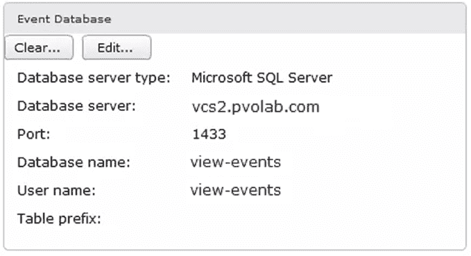

现在，您已经成功完成了初始连接服务器配置任务。在本章的下一部分，我们将继续安装其他连接服务器角色，从复制服务器开始。

# 摘要

在本章的第一部分，我们已经带您完成了 Horizon View 解决方案的首个组件安装与配置，即 View Composer 和 Horizon View 连接服务器。

在本章的第二部分，第五章，*安装与配置 Horizon 7 – 第二部分*，我们将继续安装并安装复制服务器、 安全服务器以及注册服务器。
