# 安装和配置 Horizon 7 - 第二部分

在本章的前一部分中，我们安装了核心的 Horizon View 连接服务器。现在，在第二部分中，我们将继续构建环境，安装其他服务器角色和组件，从副本服务器开始。

本章将涵盖以下主题：

+   安装 Horizon View 副本服务器

+   安装安全服务器

+   安装注册服务器

+   配置云平台架构

+   配置支持 GPU 的虚拟桌面视图

# 安装 Horizon View 副本服务器

在这一部分，我们将部署第二个 View 连接服务器。额外的 View 连接服务器被称为副本服务器。这是因为 View 通过 ADAM 数据库在多个 View 连接服务器之间共享其配置。

通常，为了提高可用性，部署额外的连接服务器，如前几章所讨论的那样。出于测试目的，您可以仅部署一个 View 连接服务器。

这个第二实例的连接服务器将安装在主机名为`hzn7-cs2.pvolab.com`的虚拟机上。该虚拟机在上一章的开始部分创建。它还需要分配一个静态 IP 地址，并且需要加入域。由于截图几乎与第一次安装连接服务器时相同，我们将在此部分仅突出并显示不同之处：

1.  打开一个终端，连接到`hzn7-cs2`虚拟机，然后定位到 Horizon View 安装软件。在示例实验室中，该软件保存在域控制器的共享文件夹中。

1.  启动`VMware-Horizon-Connection-Server-x86_64-7.6.0-9823717`文件以开始安装。这与第一次安装连接服务器时使用的安装程序相同，但由于这是副本服务器，因此它会有所不同的配置。

1.  如果看到**打开文件 - 安全警告**消息，请点击运行按钮。

1.  现在，您将看到 VMware Horizon 7 连接服务器安装向导欢迎屏幕。

1.  单击“下一步 >”按钮以开始安装。接下来，您将看到许可证协议屏幕。

1.  单击“我接受许可证协议中的条款”单选框，然后单击**下一步 >**按钮。接下来，您将看到目标文件夹屏幕。

1.  保留文件夹的默认设置，然后单击下一步 > 按钮继续。

1.  现在，您将看到安装选项屏幕，如下图所示：

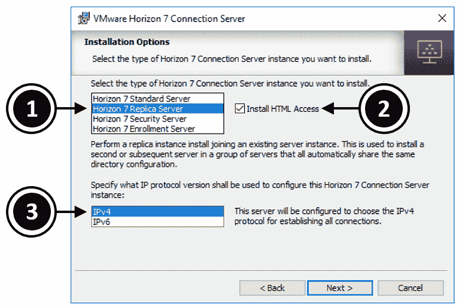

1.  由于这是第二个连接服务器，或者称为副本服务器，从 Horizon 7 连接服务器实例列表中选择 Horizon 7 副本服务器选项(**1**)。

1.  和之前一样，我们将安装 HTML 访问，因此勾选“安装 HTML 访问”（**2**）。这将允许用户通过 HTML 5 网页浏览器访问他们的桌面。此设置应与原始连接服务器的设置一致，以便该服务器能够提供相同的功能和特性。别忘了，如果第一个连接服务器不可用，Replica Server 可以接管。

1.  此屏幕上的最后一个选项是选择使用哪种 IP 协议：IPv4 或 IPv6。在示例实验室中，选择 IPv4 选项（**3**）。再次提醒，您不能在不同的 View 服务器实例之间混用 IP 协议版本。

1.  点击“下一步 >”按钮继续。

1.  您现在将看到源服务器配置屏幕，如下面的截图所示：

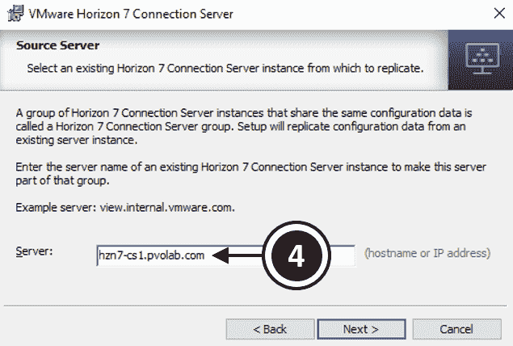

1.  源服务器是您要用作复制源的连接服务器，因此在“服务器”框（**4**）中输入第一个连接服务器的地址。在示例实验室中，这个地址是 `hzn7-cs1.pvolab.com`。

1.  点击“下一步 >”按钮继续。您将看到防火墙配置屏幕。

1.  选择**自动配置 Windows 防火墙**的单选按钮，然后点击“下一步 >”按钮继续。您将看到“准备安装程序”屏幕。

1.  点击“安装”按钮开始安装过程。

1.  安装将开始，您将看到程序文件的安装过程，以及初始复制的状态。安装完成后，您将看到安装完成屏幕。在此屏幕上点击“完成”按钮以关闭安装程序。

1.  您现在将在桌面上看到 Horizon 7 管理控制台的图标。要检查 Replica Server 是否正确安装并正常运行，请登录 View 管理员。

1.  在“库存”菜单中，展开 View 配置部分，然后点击“服务器”（**5**）。点击“连接服务器”标签（**6**）。您现在将看到 Replica Server `hzn7-cs2` 列出（**7**），如下面的截图所示：

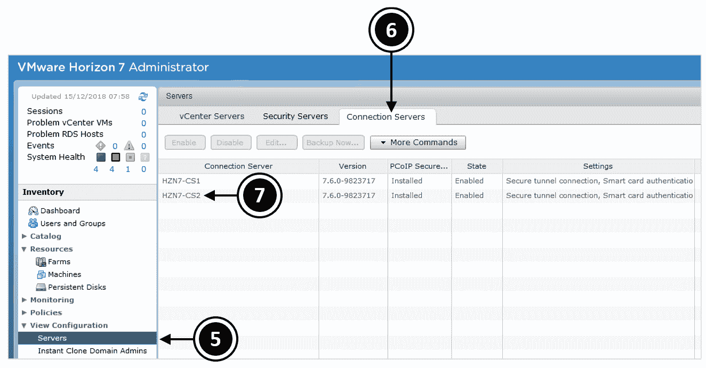

您已成功安装并配置 Replica Server。

现在您已经有了两个连接服务器，请记住，Horizon View 默认情况下不包括负载均衡连接服务器或安全服务器的方法。因此，您应根据负载均衡设备制造商的相关文档，配置您的负载均衡器以根据需要与 View 连接服务器一起工作。这使得用户能够在可用性和扩展性方面进行负载均衡。

在下一部分中，我们将安装 Horizon View 安全服务器。

# 安装安全服务器

接下来要安装的组件是安全服务器，以便您允许外部用户访问。

安全服务器是连接服务器的另一个实例，将安装在主机名为`hzn7-sec.pvolab.com.`的虚拟机上，此主机在上一章节已创建。此服务器还需要分配静态 IP 地址，但不应加入域。

不要忘记安全服务器与连接服务器是一对一的关系。如果您希望推出多个安全服务器，您将需要多个 View 连接服务器。

建议准备专用的外部 View 连接服务器与您的安全服务器配对，以及内部连接的单独 View 连接服务器。这将允许您通过使用标记功能，指定哪些用户可以从组织外访问桌面，在本章节和第八章，*配置和管理桌面池 - 第一部分*，我们将讨论此功能。

# 准备 View 管理员以安装安全服务器

在开始安装之前，我们需要为安全服务器准备连接服务器，创建配对密码。此密码将用于安全地将两个服务器连接在一起。这类似于将您的蓝牙手机与汽车免提系统配对的过程：

1.  登录 View 管理员。然后，您将看到主配置屏幕，如下截图所示：

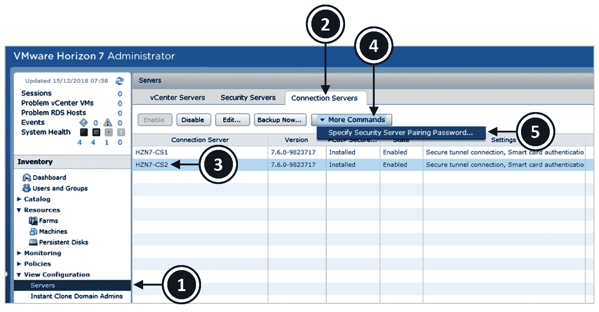

1.  在清单菜单中，展开 View 配置部分，然后单击“服务器”（**1**）。现在，单击“连接服务器”选项卡（**2**）。然后，您将在您的环境中看到连接服务器。在示例实验中，我们有两个，`hzn7-cs1`和`hzn7-cs2`。

1.  单击以选择要与安全服务器配对的连接服务器。在示例实验中，我们将与名为`hzn7-cs2`（**3**）的连接服务器配对。

1.  现在，单击“更多命令”按钮（**4**），选择“指定安全服务器配对密码…”选项（**5**）。现在，您将看到指定安全服务器配对密码屏幕，如下截图所示：

1.  在配对密码（**6**）框中，输入您希望用于配对的密码。您需要记住此密码，因为在安装安全服务器期间需要再次输入。在确认密码框（**7**）中再次输入密码。

1.  在密码超时框（**8**）中，输入此密码有效的时间。确保您设置的时间足够安装安全服务器。这将避免您需要返回并设置新的配对密码。从下拉框（**9**）中，您还可以选择密码的生存时间单位是小时还是分钟。

1.  配置配对密码后，单击“确定”。

1.  现在可以继续开始安装安全服务器。

# 安全服务器软件安装

在前提条件就绪并设置好配对密码后，我们现在可以安装安全服务器。由于屏幕截图与之前连接服务器安装几乎相同，我们将在本节中仅突出显示并展示不同之处：

1.  打开一个控制台连接到`hzn7-sec.pvolab.com`虚拟机，然后找到 Horizon View 安装软件。在示例实验室中，该软件被保存在域控制器的共享文件夹中。

1.  启动 `VMware-Horizon-Connection-Server-x86_64-7.6.0-9823717` 文件以开始安装。这是您首次安装连接服务器时使用的相同安装程序应用程序，但它将被配置为安全服务器。

1.  如果看到“打开文件 - 安全警告”消息，请点击“运行”按钮。

1.  您现在将看到“欢迎使用 VMware Horizon 7 连接服务器安装向导”屏幕。

1.  点击“Next >”按钮开始安装。您现在将看到许可协议屏幕。

1.  点击“我接受许可协议中的条款”单选按钮，然后点击“Next >”按钮。您现在将看到目标文件夹屏幕。

1.  保留文件夹为默认设置，然后点击“Next >”按钮继续。

1.  您现在将看到安装选项屏幕，如下所示：

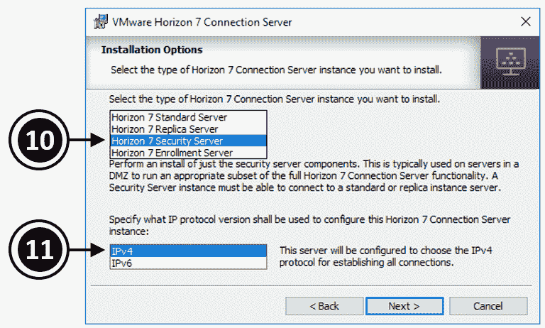

1.  由于这是第三个连接服务器实例，或安全服务器，请从 Horizon 7 连接服务器实例列表中选择“ Horizon 7 安全服务器”选项 (**10**)。

1.  此屏幕上的最后一个选项是选择使用哪种 IP 协议：IPv4 或 IPv6。在示例实验室中，选择 IPv4 选项 (**11**)。再次提醒，您不能在不同的 View 服务器实例之间混合使用 IP 协议版本。

1.  点击“Next >”按钮继续。您现在将看到配对的 Horizon 7 连接服务器屏幕，如下所示：

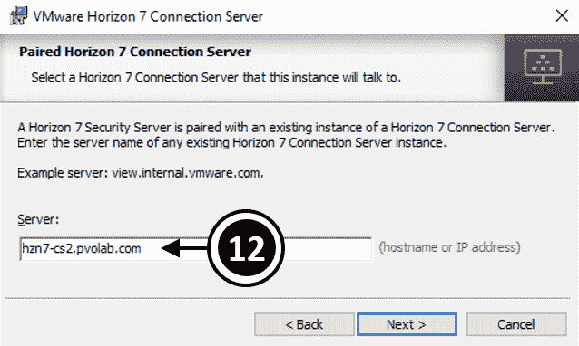

1.  在服务器框 (**12**) 中，输入要配对的连接服务器的详细信息。在示例实验室中，我们将与名为 `hzn7-cs2.pvolab.com` 的服务器配对，这就是我们在前一部分设置的副本服务器。

1.  点击“Next >”按钮继续。您现在将看到配对的 Horizon 7 连接服务器密码屏幕：

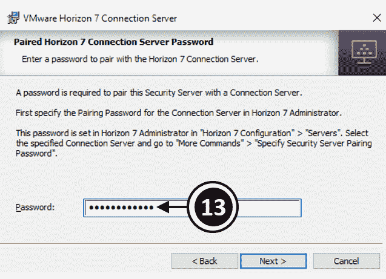

1.  在密码框 (**13**) 中，输入您在 View 管理员中配置时指定的配对密码。

1.  点击“Next >”按钮继续。

1.  您现在将看到 Horizon 7 安全服务器配置屏幕，如下所示：

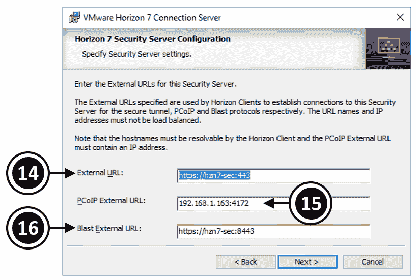

1.  在此屏幕上，你可以指定安全服务器的设置。首先，在外部 URL 框（**14**）中，输入用户将通过互联网连接来连接其 Horizon 客户端的地址。在前面的示例中，已将其保留为默认值；然而，你可能希望将其更改为更易于使用的地址。

1.  在 PCoIP 外部 URL 框（**15**）中，输入外部 PCoIP 连接的 IP 地址。请注意，这必须包含 IP 地址，而不是 URL，如框中所示。该地址还必须加上端口后缀，因此在此情况下，`:4172`是默认的 PCoIP 端口。

1.  最后，在 Blast 外部 URL 框（**16**）中，输入 Blast 协议的地址。该协议用于 HTML5 访问。

1.  单击“下一步 >”按钮继续。现在你将看到防火墙配置屏幕。

1.  点击自动配置 Windows 防火墙的单选按钮，然后点击“下一步 >”按钮继续。你将看到准备安装程序屏幕。

1.  单击安装按钮开始安装过程。

1.  安装完成后，你将看到安装完成屏幕。点击“完成”按钮退出。

    与我们安装连接服务器和副本服务器时不同，桌面上不会放置 Horizon 图标。设置通过视图管理员控制台进行管理。但是，要检查安全服务器是否已安装并正在运行，请在安全服务器的桌面上启动一个服务控制台，如下图所示：

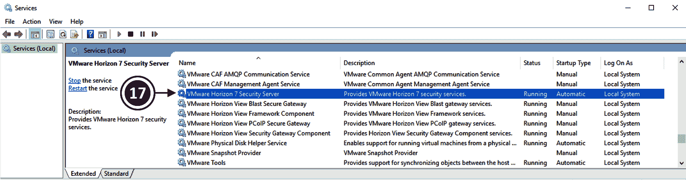

向下滚动，直到看到 VMware Horizon 7 安全服务器（**17**）的条目，然后检查它是否正在运行。

你还需要检查安全服务器是否已在视图管理员中注册。为此，请执行以下步骤：

1.  在库存菜单中，展开视图配置部分，然后点击服务器（**18**）。点击安全服务器选项卡（**19**）。现在你将看到列出的安全服务器`HZN7-SEC`（**20**）。如下图所示：

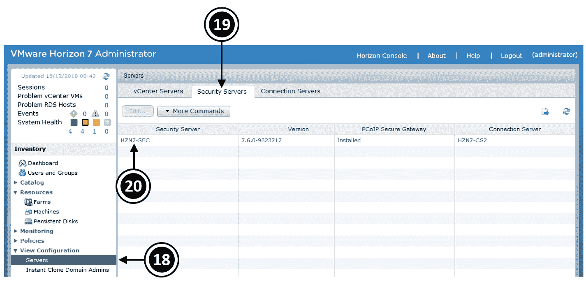

1.  你已经成功安装并配置了安全服务器。

正如我们之前提到的，我们建议将安全服务器与专用的外部视图连接服务器一起安装，这样你就可以通过使用标签功能限制外部连接访问虚拟桌面机器。

实现这一目标的第一步是标记你的外部连接服务器。要标记服务器，请执行以下步骤：

1.  在视图管理员中，从库存菜单，展开视图配置部分，然后点击服务器（**21**）。点击连接服务器选项卡（**22**），然后高亮显示与安全服务器配对用于外部连接的连接服务器。在示例实验室中，该服务器被称为`HZN7-CS2`（**23**）。

1.  右键点击，然后从上下文菜单中点击“Edit…”（编辑...）（**24**），如下图所示：

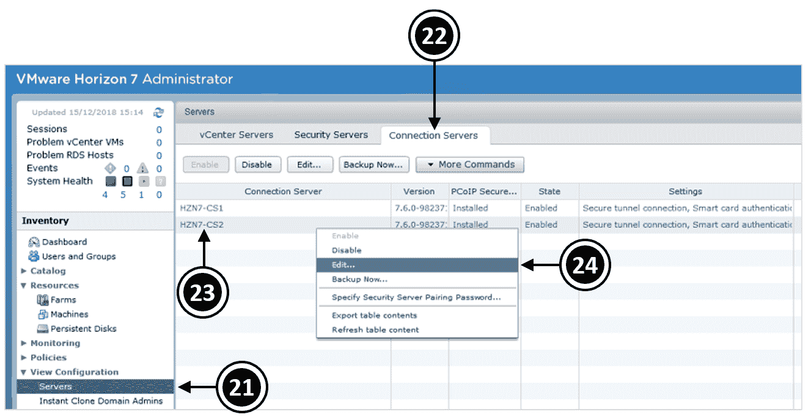

1.  您现在将看到“Edit Connection Server Settings”（编辑连接服务器设置）屏幕，如下图所示：

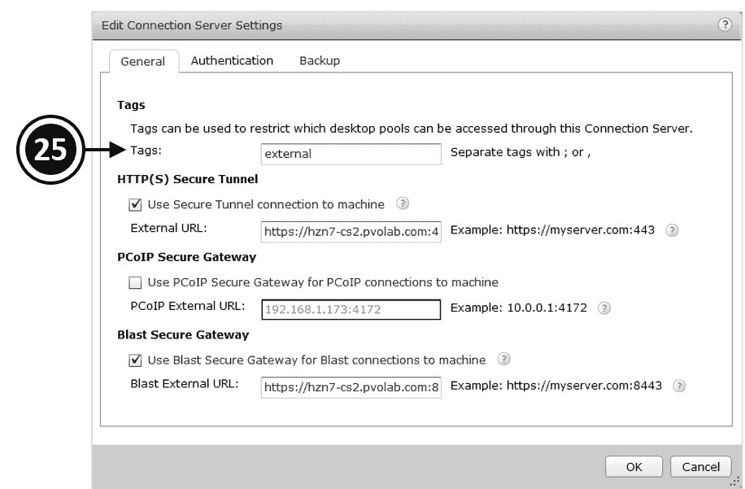

1.  在 Tags 框（**25**）中，输入此标签的名称。在示例实验室中，此标签名为`external`。这意味着只有配置了名为`external`的标签的桌面池才能通过此 Connection Server 进行连接。

# 安装 Enrollment Server（注册服务器）

我们将要安装的最后一个组件是 Enrollment Server（注册服务器）。

这个 Connection Server 的最后一个实例将安装在主机名为`hzn7-enrol.pvolab.com`的虚拟机上。该虚拟机在上一章中已经构建。它还需要分配静态 IP 地址并加入域。由于屏幕截图与其他 Connection Server 安装几乎相同，我们将在本节中仅突出并展示差异：

1.  打开到`hzn7-enrol.pvolab.com`虚拟机的控制台，然后找到 Horizon View 安装软件。在示例实验室中，这个文件被保存在域控制器的共享文件夹中。

1.  启动`VMware-Horizon-Connection-Server-x86_64-7.6.0-9823717`文件以开始安装。这是您第一次使用的相同安装程序应用程序，但它会根据此实例是 Replica Server（副本服务器）的事实进行不同配置。

1.  如果您看到“Open File - Security Warning”（打开文件 - 安全警告）消息，点击“Run”（运行）按钮。

1.  您现在将看到“Welcome to the Installation Wizard for VMware Horizon 7 Connection Server”（欢迎使用 VMware Horizon 7 连接服务器安装向导）屏幕。

1.  点击“Next >”按钮开始安装。现在您将看到许可证协议屏幕。

1.  选中“I accept the terms in the license agreement”（我接受许可证协议中的条款）单选框，然后点击“Next >”按钮。现在您将看到目标文件夹屏幕。

1.  保持文件夹设置为默认值，然后点击“Next >”按钮继续。

1.  您现在将看到“Installation Options”（安装选项）屏幕，如下图所示：

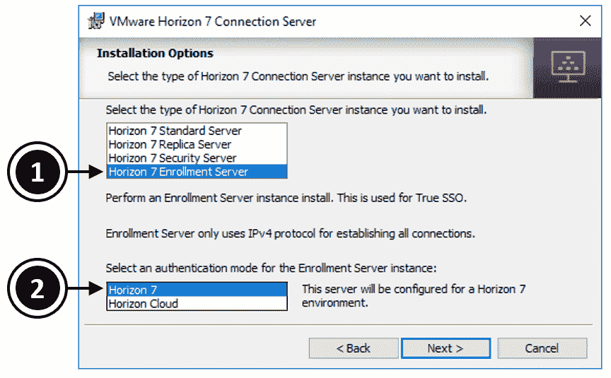

1.  由于这是最后一个 Connection Server 实例或 Enrollment Server，在 Horizon 7 Connection Server 实例列表中，选择 Horizon 7 Enrollment Server 的选项（**1**）。

1.  此屏幕上的最后一个选项是为此 Enrollment Server 实例选择身份验证模式。Horizon 7 支持本地部署和 Horizon Cloud 部署。示例实验室是本地环境，因此选择 Horizon 7 的选项（**2**）。

1.  点击“Next >”按钮继续。现在您将看到防火墙配置屏幕。

1.  选中“Configure Windows Firewall automatically”（自动配置 Windows 防火墙）单选框，然后点击“Next >”继续。

1.  您将看到“Ready to Install the Program”（准备安装程序）屏幕。

1.  点击“安装”按钮开始安装过程。一旦注册服务器安装完成，你将看到“安装完成”界面。点击“完成”按钮以关闭安装程序。

1.  注册服务器没有用户界面或控制台，也没有桌面上的图标。要检查它是否在运行，我们将检查 Windows 服务控制台。为此，按下 Windows 键和 *R* 打开运行对话框。在对话框中输入 `services.msc`。现在你会看到服务界面，如下所示的截图：

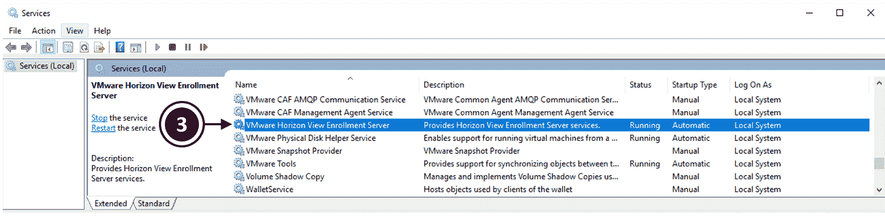

1.  向下滚动，你将看到 VMware Horizon View 注册服务器的条目。检查该服务是否正在运行，然后关闭服务界面。

你已成功安装并配置了 Horizon View 注册服务器。在下一部分，我们将通过启用云 Pod 架构来完成视图管理部分的安装和配置。

# 配置云 Pod 架构

在第三章《设计与部署考虑》中，我们讨论了云 Pod 架构及其交付多站点视图部署的能力，允许扩展性并支持灾难恢复场景。现在，我们将通过示例实验室来学习如何设置云 Pod。

在示例实验室中，我们已经构建并配置了另一个连接服务器，名为 `hzn7-cs1b.pvolab.com`，它将代表第二个 Pod，位于第二个站点。

该服务器被安装为连接服务器，而不是副本服务器，因为它需要成为不同 Pod 中的第一个服务器。

下图说明了我们将要遵循的安装流程，使用的是示例实验室：

过程的第一步是从第一个连接服务器初始化云 Pod。

# 初始化云 Pod

要初始化云 Pod 架构，请执行以下步骤：

1.  登录到 View 管理员，从控制台屏幕的左侧库存窗格中，展开 View 配置部分并点击“云 Pod 架构”（**1**）。

1.  现在，点击“初始化云 Pod 架构功能”（**2**）选项，如下所示的截图：

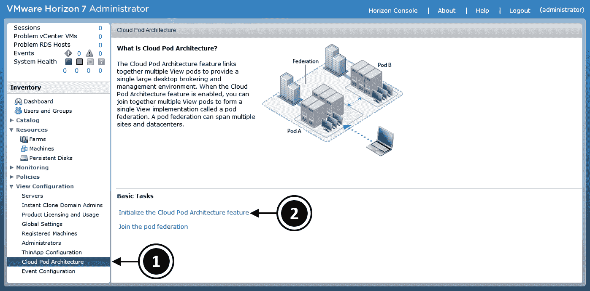

1.  你现在将看到初始化对话框，如下所示的截图：

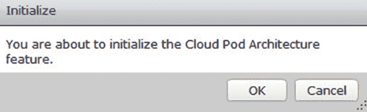

1.  点击“确定”按钮开始初始化。你将看到初始化过程开始，并且进度通过一个百分比条在屏幕上显示。你还会看到状态显示为“待处理”，如以下截图所示：

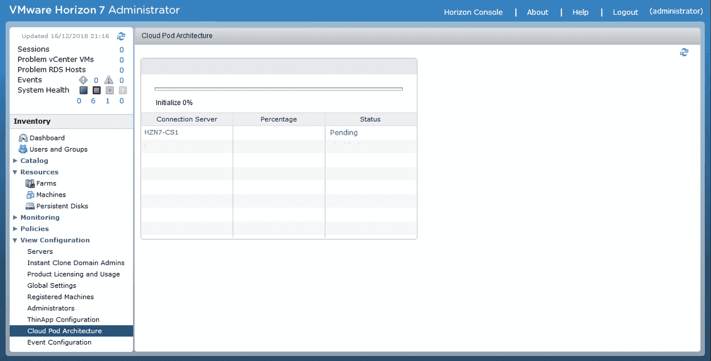

1.  一旦云 Pod 架构功能完成初始化，你将看到“重新加载”对话框，如下所示的截图：

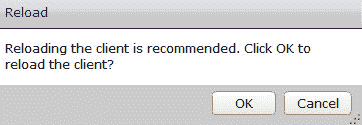

1.  点击“确定”按钮以重新加载客户端。您现在将在视图管理员中看到云 Pod 架构屏幕，如下图所示：

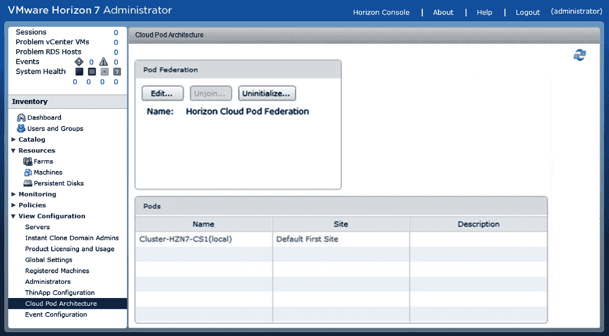

如您所见，已经创建了一个名为 Horizon Cloud Pod Federation 的 Pod 联盟。如有需要，您可以点击编辑按钮来更改此名称。

您还将看到列出的 Pods 和站点信息。在示例实验室中，我们只列出了 `HZN7-CS1` 连接服务器，因为这是第一个安装了云 Pod 架构的连接服务器。

下一步是将第二个 Pod 或第二个站点中的连接服务器连接到联盟。

# 将第二个 Pod 连接到云 Pod

此过程的下一步是将其他 Pod 连接或加入到 Pod 联盟中。

登录到第二个连接服务器上的视图管理员控制台。该服务器名为 `hzn7-cs1b.pvolab.com`。这是示例实验室中第二站点的第一个连接服务器。

执行以下步骤，将第二个 Pod 连接到联盟：

1.  登录到视图管理员控制台。在左侧的库存窗格中，展开视图配置部分并点击云 Pod 架构 (**1**)，但这次点击“加入 Pod 联盟” (**2**) 选项，如下图所示：

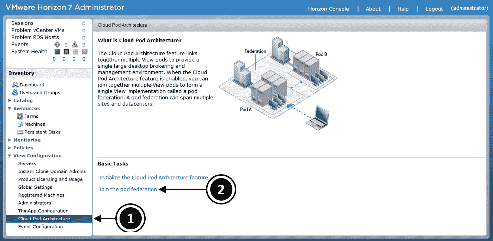

1.  您现在将看到加入对话框，如下图所示：

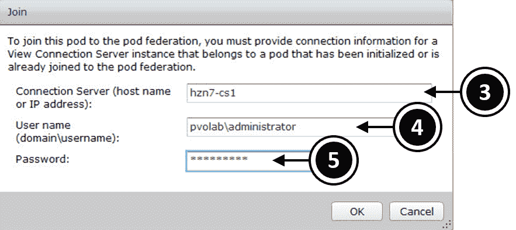

1.  在此，输入已经初始化了云 Pod 架构的 Pod 中连接服务器的详细信息。

1.  在连接服务器框 (**3**) 中，输入来自第一个站点的连接服务器地址。在示例实验室中，这台服务器名为 `hzn7-cs1.pvolab.com`。

1.  在用户名框 (**4**) 中，输入具有正确权限以将 Pods 连接在一起的用户名。在示例实验室中，我们将使用管理员账户。请注意，您需要以 `domain\username` 格式输入用户名，因此在示例实验室中，我们将输入为 `pvolab\username`。

1.  点击“确定”继续。

1.  您将看到加入过程开始，屏幕上会显示进度的视觉表示，进度以百分比条的形式显示，并且状态会显示为**待处理**。

1.  一旦云 Pod 架构功能完成加入 Pod 联盟，您将看到重新加载对话框。

1.  点击“确定”按钮以重新加载客户端。您现在将在视图管理员中看到云 Pod 架构屏幕，如下图所示：

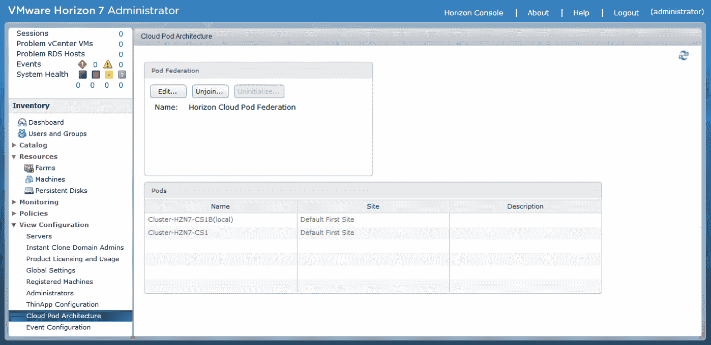

如您所见，两个 Pod 现在已列出，并显示站点信息。在示例实验室中，现在列出了 `HZN7-CS1` 和 `HZN-CS1B` 连接服务器。

如果现在查看站点页面，您会看到该站点列出了构成该站点的 Pod 数量，以及站点内 Pod 的详细信息。

您也将能够看到全球授权，如下图所示：

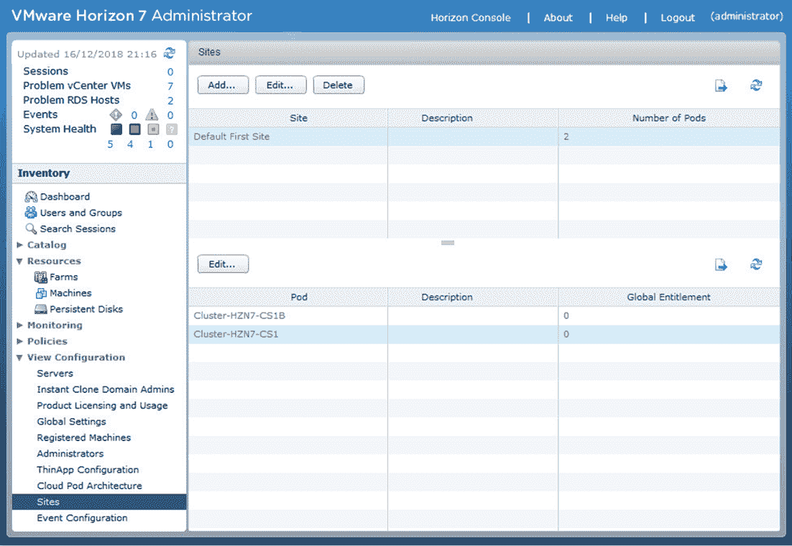

现在，您已通过初始化云 Pod 架构功能并向 Pod 联邦中添加第二个 Pod，创建了一个 Pod 联邦，接下来您可以创建全球授权，我们将在下一部分介绍。

# 授权用户访问 Cloud Pod

在这一部分，我们将通过创建一个桌面池并将用户授权连接到该池内的桌面，来添加一个全球授权。按照以下步骤操作：

1.  从“视图管理员”控制台，在左侧的库存窗格中，展开目录部分，然后点击全球授权 (**1**)。

1.  接下来，点击“添加…”按钮 (**2**)，如下图所示：

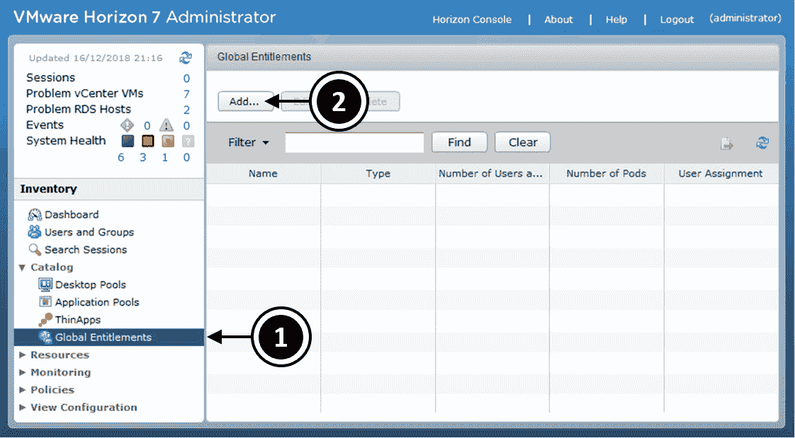

1.  现在您将看到“添加全球授权”对话框，以及选择您要创建的授权类型的第一部分，如下图所示：

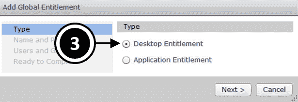

1.  在这个示例中，我们将创建一个桌面授权，因此点击桌面授权的单选按钮 (**3**)，然后点击“下一步 >”按钮。现在你将看到名称和策略配置页面，如下图所示：

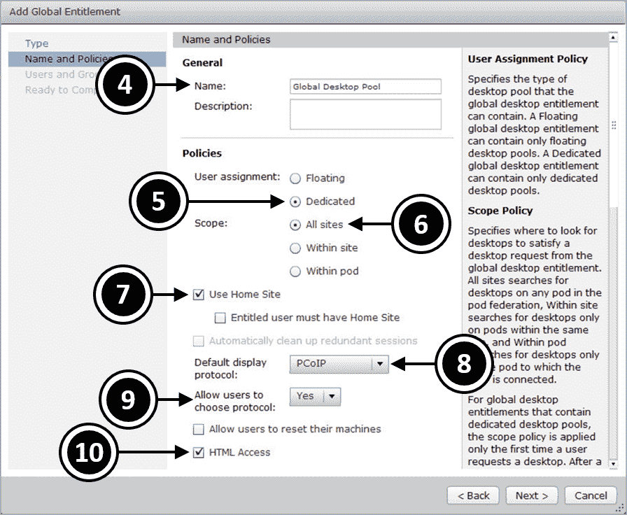

1.  在“常规”部分，输入策略名称 (**4**)。在示例实验室中，我们将其命名为 `Global Desktop Pool`。

1.  在“策略”部分的“用户分配”下，点击“专用”单选按钮 (**5**)。您可以指定用户分配以及桌面池是浮动还是专用。在“范围”下，点击“所有站点”单选按钮 (**6**)。您可以从“所有站点”、“站点内”或“Pod 内”中进行选择。

1.  勾选使用主页站点 (**7**) 的复选框。

1.  然后，您可以选择默认显示协议。在示例实验室中，我们将选择 PCoIP，因此从下拉菜单中选择 PCoIP。

1.  在“允许用户选择协议”选项中，选择是否希望用户更改协议。在示例实验室中，从下拉菜单 (**9**) 中选择“是”。

1.  最后，如果您希望启用 HTML 访问，请勾选复选框 (**10**)。

1.  点击“下一步 >”按钮继续。

1.  您现在将看到“用户和组”配置页面，如下图所示：

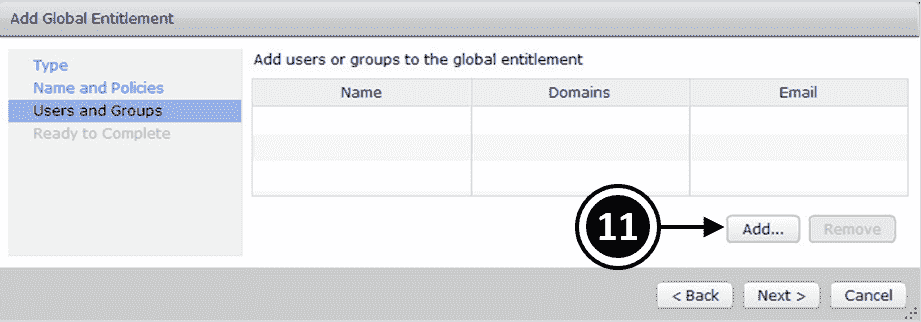

1.  点击“添加…”按钮 (**11**)。您现在将看到“查找用户或组”配置页面，如下图所示：

1.  点击下拉箭头（**12**），选择用户所在的域。在示例实验室中，这是 `pvolab.com`。然后，在“名称/用户名”框（**13**）中输入你希望分配到此池的用户的名字，然后点击“查找”按钮（**14**）。此时会显示用户的详细信息。点击以突出显示并选择该用户（**15**），然后点击“确定”按钮。

1.  你将返回到“用户和组”屏幕，此时已显示所选用户，如下图所示：

1.  点击“下一步 >”按钮继续。此时你将看到“准备完成”屏幕，如下图所示：

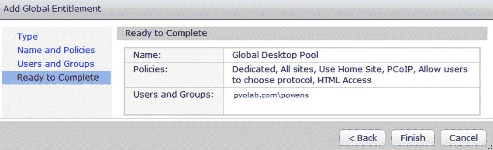

1.  检查详细信息是否正确输入，然后点击“完成”按钮。你将返回到“全局授权”屏幕，此时会显示全局桌面池及其分配的用户数量，如下图所示：

你已经成功配置了 Cloud Pod 联邦。

在本章的最后部分，我们将通过为 ESXi 主机服务器配置 NVIDIA 显卡来完成安装。

# 配置支持 GPU 的虚拟桌面

在第二章中，*理解 Horizon 7 架构和组件*，我们讨论了 Horizon View 虚拟桌面机器可以配置为使用已安装在主机服务器上的硬件，这些硬件承载了这些桌面。在本例中，所涉及的硬件是显卡。

如我们之前讨论的，Horizon View 的一个高级功能是其能够使用已安装并配置了 PCI 直通的专用硬件，这些硬件安装在 ESXi 主机服务器上，使虚拟桌面机器能够识别该硬件。

在本节中，我们将执行将 NVIDIA GRID GPU 卡安装到主机服务器中的初始步骤。稍后，在第七章，*构建和优化虚拟桌面操作系统*，我们将创建一个虚拟桌面机器镜像，该镜像将专门分配并访问 GPU 资源。

如果你打算使用 vGPU，你需要安装 vSphere 6 作为虚拟化平台来支持这一功能。

# 配置 ESXi 主机服务器

在你创建虚拟桌面机器之前，你需要确保显卡已经物理安装并配置到 ESXi 主机上，以准备构建将使用该显卡的新虚拟桌面机器。

在示例实验室中，我们使用的是 NVIDIA GRID K2 显卡。这些显卡可以通过 OEM 渠道获得，并且已经由服务器厂商预配置，因为它们需要额外的电源连接器、散热风扇以及特定的 BIOS 设置。

在开始之前，检查这些内容是值得的，因为仅仅将卡片安装到现有的服务器上可能会导致它们无法正常工作。你可以通过点击以下链接来查找经过认证的服务器列表：[`www.nvidia.com/object/grid-partners.html`](http://www.nvidia.com/object/grid-partners.html)。

安装完硬件后，登录到 vSphere Web Client，选择已安装卡片的主机，并执行以下步骤：

1.  登录到 vSphere Web Client，然后导航到安装了 NVIDIA 卡片的主机服务器。在示例实验室中，这是主机 `esx-1.pvolab.com`，如下面的截图所示：

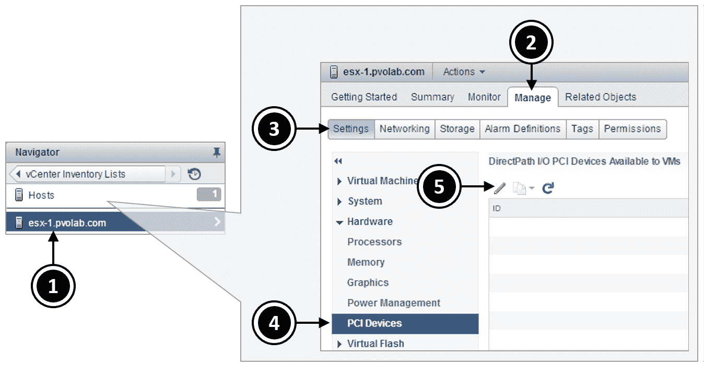

1.  选择 ESXi 主机服务器 `esx-1.pvolab.com` (**1**)，然后点击“管理”标签 (**2**)。点击“设置”按钮 (**3**)，展开硬件部分。点击 PCI 设备 (**4**)，然后点击铅笔图标 (**5**) 编辑设置。此时你将看到编辑 PCI 设备可用性屏幕，如下图所示：

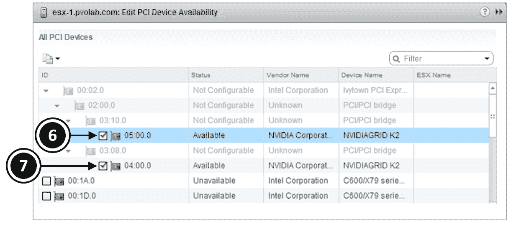

如你所见，这台主机服务器已配置了两张 NVIDIA GRID K2 图形卡。勾选框 (**6**) 和 (**7**) 以启用主机服务器上的卡片。

你现在已将 ESXi 主机服务器配置为使用 NVIDIA GRID K2 GPU 卡。这些卡片将在本书后面第七章中构建虚拟桌面机器时使用，*构建和优化虚拟桌面操作系统*。

# 总结

在本章中，我们完成了 Horizon View 环境的安装，包括副本服务器、安全服务器和注册服务器。

我们讨论了你需要进行的初步配置项目，例如许可环境、连接你的 vCenter 和 View Composer 服务器，以及配置 View 安全服务器以供外部连接。我们还查看了为使环境准备好支持 NVIDIA GRID 高级图形所需的配置项目。

本章的最后部分讲解了如何初始化和配置 Cloud Pod Architecture 功能。

完成本章后，你应该已经构建了一个完全可用的 View 部署，并准备为终端用户提供虚拟桌面机器。接下来的步骤是开始构建虚拟桌面，并在配置 Horizon View 以交付它们之前准备好这些桌面。

但在我们开始构建虚拟桌面机器之前，我们将在下一章第六章中讨论安全性问题，*使用 SSL 证书保护 Horizon View*，我们将在其中配置环境中的 SSL 证书以确保其安全。我们还将查看配置 True SSO 功能。
