# 使用 SSL 证书保护 Horizon View

在本章中，我们将讨论 VMware Horizon View 7 的安全性方面，特别是如何实现与最终用户客户端以及数据中心中不同 View 基础架构组件之间的安全通信。我们将研究两种实现这种安全通信的方法。

我们将从**安全套接字层**（**SSL**）证书开始，概述一下 SSL，然后学习如何创建/颁发证书并配置 Horizon View 以使用它。 本章将涵盖的第二个选项是**True SSO**。True SSO 为用户提供了一种身份验证虚拟桌面的方式，能够保持他们的所有常规域权限，但不需要他们提供 Active Directory 凭据。你很可能已经在你的环境中设置了 SSL 证书，但在本章中，我们将使用示例实验室中的服务器设置一个测试环境。

本章将涵盖以下主题：

+   Horizon View 和 SSL 证书

+   为 Horizon View 安装 SSL 证书

+   Horizon View True SSO

# Horizon View 和 SSL 证书

我们首先来定义 SSL。SSL 是由 Netscape 开发的一种加密技术。

它用于在 Web 服务器和浏览器之间创建加密连接，您将在其中查看网页。通过使用 SSL，您可以安全地查看发送到浏览器的信息，知道没有其他人可以访问它。

SSL 通过安装在服务器上的 SSL 证书来工作，并用于识别您。那么问题是，您如何知道自己是否正在使用安全连接连接到服务器呢？如果您有安全连接，您将在浏览器中看到一个挂锁图标，或者地址栏会变为绿色。

为了确保您拥有安全连接，您也可以在浏览器中使用`https://`而不是通常的`http://`访问该站点。

SSL 证书由**证书颁发机构**（**CAs**）提供。

# 什么是 CA？

**CA**（证书颁发机构）是一项在验证组织或个人后，向其颁发数字证书的服务。CA 保持已颁发证书的详细记录以及在证书颁发时使用的其他信息。这些记录会定期审计，以确保符合规定。

您可以从不同的组织获取 CA，或者可以从根 CA 创建自己的 CA。

# 为什么我需要为 Horizon View 提供 SSL 证书？

如果您从网站向终端设备传输敏感信息，您需要通过加密来保护信息，否则数据可能会被泄露。

由于 Horizon View 本质上类似于一个 web 服务，终端用户通过其终端设备连接到 View 连接服务器，您需要确保该连接是安全的。在这种情况下，SSL 被用于在客户端设备和虚拟桌面机器之间建立安全链接。尽管使用 Horizon View 时不会实际传输数据，但虚拟桌面机器的像素会被传输，如果第三方截获了这一传输，他们可能会通过重绘这些像素看到您的屏幕。SSL 还用于 Horizon View 组件之间的通信，如连接服务器和副本服务器。

安装 SSL 证书是 Horizon View 的要求。

默认情况下，Horizon View 配备了自签名证书，这对于概念验证或小规模试点是可以的，但在生产环境中，您需要企业级证书。

使用证书成为 View 5.1 版本的要求，当时它们用于 Horizon View 组件之间的通信，如连接服务器、副本服务器和 View Composer，以及 ESXi 主机和虚拟中心服务器的基础设施。每个组件都需要安装证书，包括连接到它的客户端设备。

# 安装 Horizon View 的 SSL 证书

在本章的后续部分，我们将简要介绍如何通过在我们的示例测试环境中安装根 CA 来设置证书，帮助您开始使用 Horizon View。然而，我们强烈建议您与安全团队合作，为您的组织和环境部署正确类型的证书。

# 安装根 CA

在本节中，我们将介绍设置一个作为根 CA 的服务器的过程，该服务器将在示例实验室中使用。已经建好了一个名为 **HZN7-CERTS** 的服务器，我们将使用该服务器来担任此角色。

配置根 CA，请按以下步骤操作：

1.  打开到 **HZN7-CERTS** 服务器的控制台，并启动服务器管理器。

1.  点击“添加角色和功能” (**1**)，如下图所示：

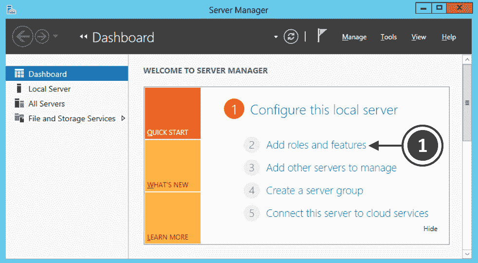

1.  您现在将看到“添加角色和功能向导”和“开始前”屏幕。点击“下一步 >”按钮继续。

1.  接下来，您将看到安装类型界面。点击“基于角色或功能的安装”单选按钮 (**2**)，如以下截图所示：

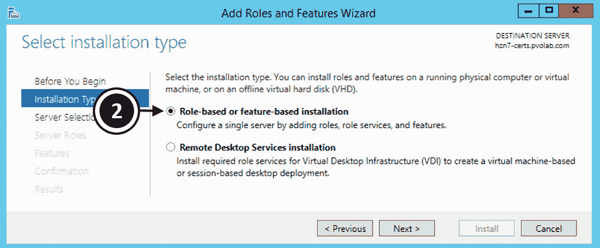

1.  点击“下一步 >”按钮继续。

1.  您现在将看到服务器选择界面，如下图所示：

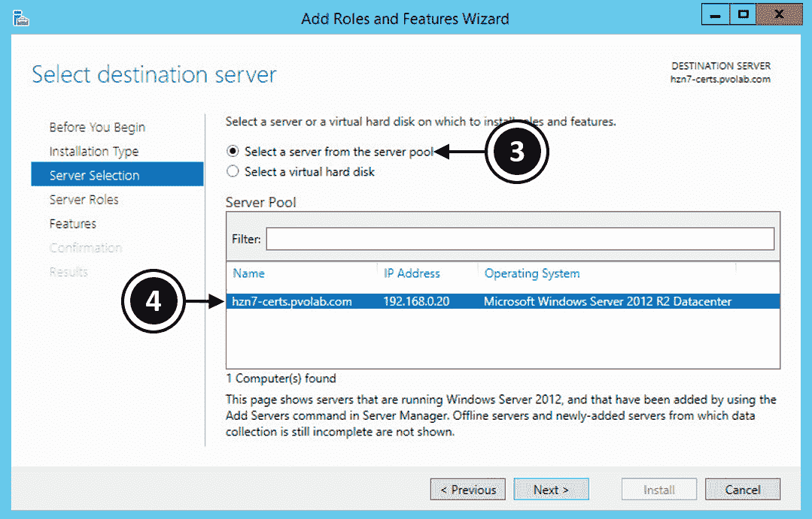

1.  选择“从服务器池中选择服务器”单选按钮 (**3**)，然后从列表中高亮显示 `hzn7-certs.pvolab.com` 服务器 (**4**)。

1.  点击“下一步 >”按钮继续。您现在将看到服务器角色界面，如下图所示：

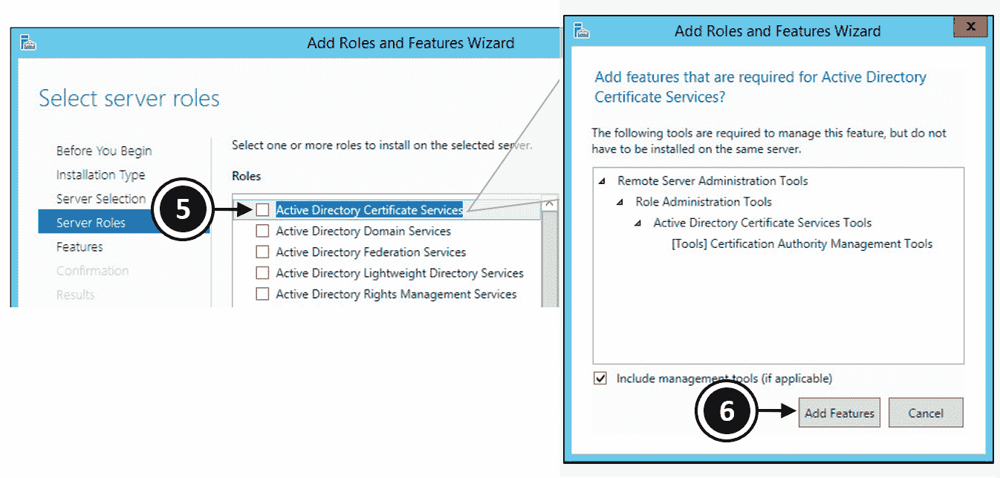

1.  勾选“Active Directory 证书服务”框（**5**），然后在弹出框中点击“添加 Active Directory 证书服务所需的功能”按钮，点击“添加功能”按钮（**6**）。

1.  现在您将返回到服务器角色屏幕，屏幕上会显示“Active Directory 证书服务”已被选中。单击“下一步 >”按钮继续。

1.  接下来，您将看到功能配置屏幕。单击“下一步 >”按钮继续。

1.  添加角色和功能向导的下一个屏幕是“Active Directory 证书服务”屏幕，如下图所示：

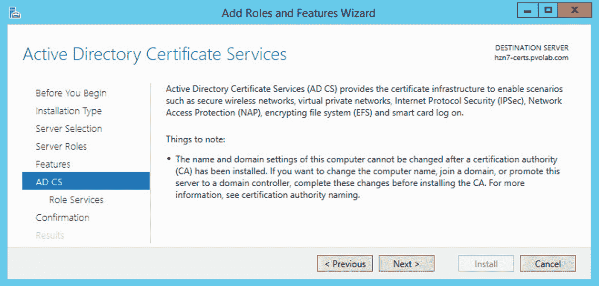

1.  单击“下一步 >”按钮继续。现在，您将看到选择角色服务屏幕，如下图所示：

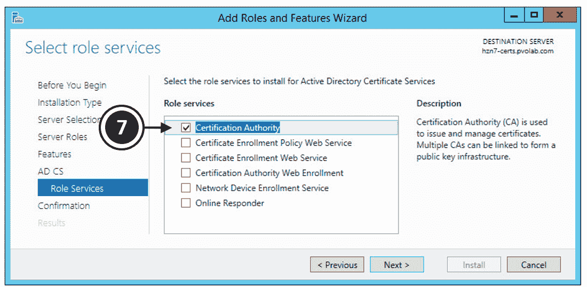

1.  在角色服务下，勾选证书颁发机构框（**7**），然后单击“下一步 >”按钮继续。

1.  在确认安装选择屏幕上，勾选“自动重启目标服务器”框（**8**），然后单击“安装”按钮。

证书服务功能现在已经安装。接下来，需要完成一些部署后的配置。

# 根 CA 部署后配置任务

安装了核心根 CA 组件后，您现在可以完成部署后的配置任务：

1.  在服务器管理器仪表板顶部的菜单栏中，单击黄色警告三角形警告框，然后在弹出的选项中，单击“配置 Active Directory 证书服务”条目（**1**），如下图所示：

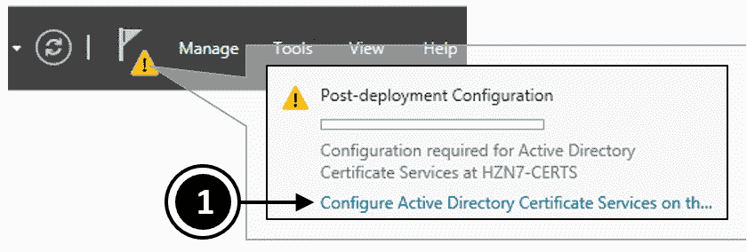

1.  您现在将看到 AD CS 配置屏幕和凭据配置部分：

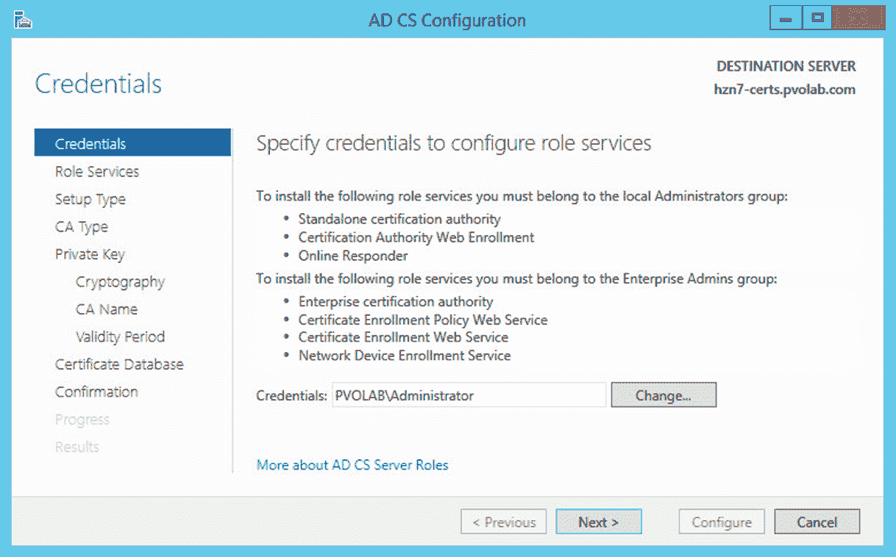

1.  单击“下一步 >”按钮继续。现在，您将看到角色服务配置屏幕，如下图所示：


1.  勾选证书颁发机构框（**2**），然后单击“下一步 >”按钮继续。

1.  现在您将看到设置类型配置屏幕，如下图所示：

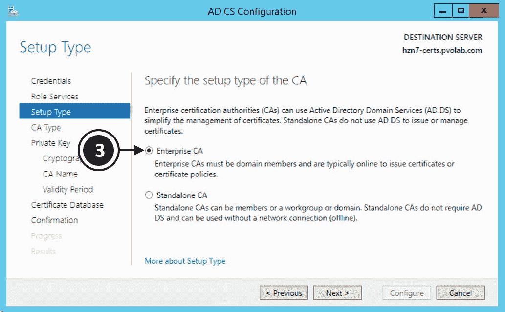

1.  单击单选按钮选择“企业 CA”选项（**3**），然后单击“下一步 >”按钮继续。现在，您将看到证书颁发机构类型配置屏幕：

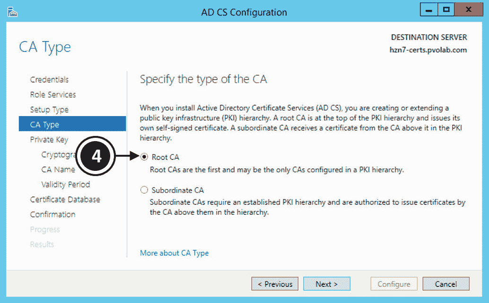

1.  接下来，单击单选按钮选择“根 CA”选项（**4**），然后单击“下一步 >”按钮继续。

1.  现在您将看到私钥配置屏幕，如下图所示：

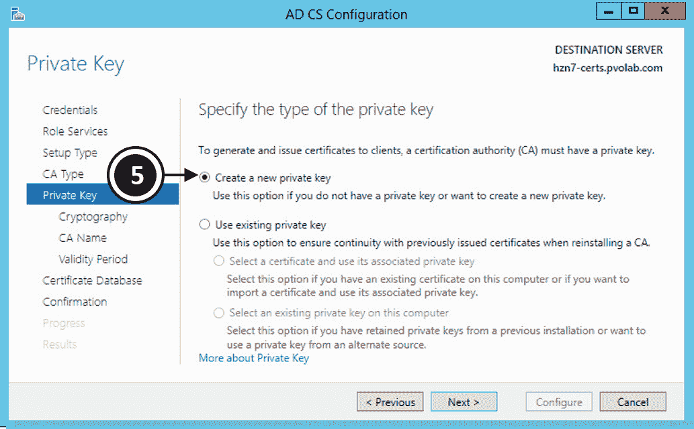

1.  单击单选按钮选择“创建一个新的私钥”选项（**5**），然后单击“下一步 >”按钮继续。现在，您将看到 CA 加密配置屏幕：

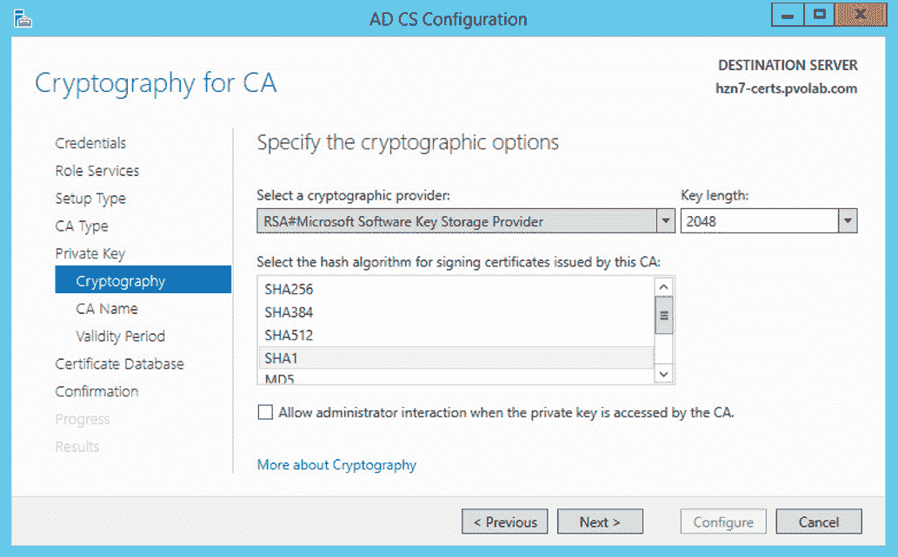

1.  接受默认设置并点击“下一步 >”按钮以继续。

1.  现在您将看到 CA 名称配置屏幕，在这里您可以指定 CA 的名称，如下图所示：

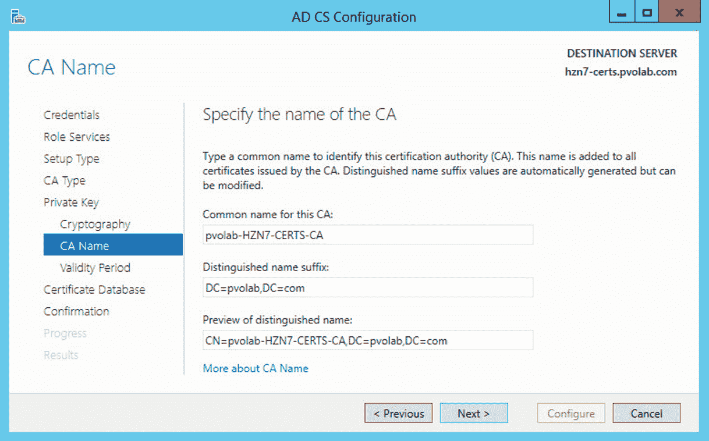

1.  接受默认设置并点击“下一步 >”按钮以继续。

1.  现在您将看到有效期配置屏幕，如下图所示：

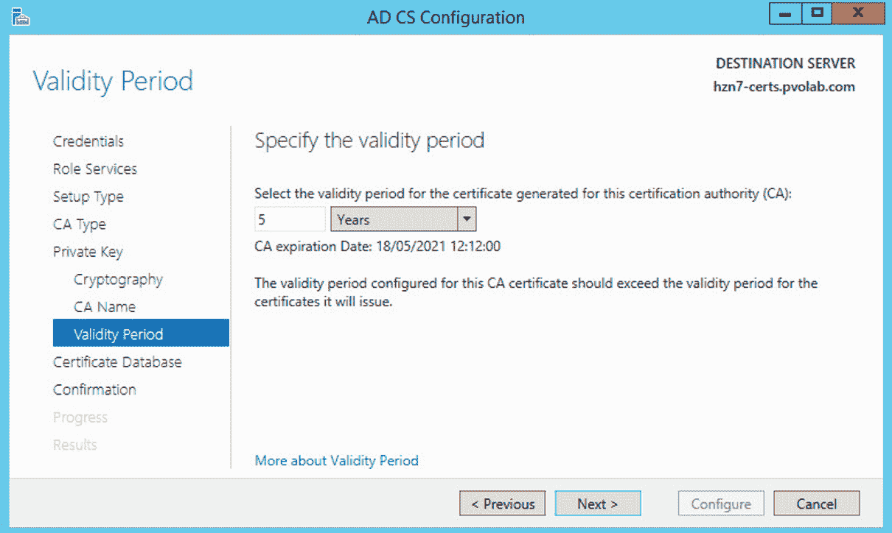

1.  接受默认设置并点击“下一步 >”按钮以继续。

1.  现在您将看到 CA 数据库配置屏幕，如下图所示：

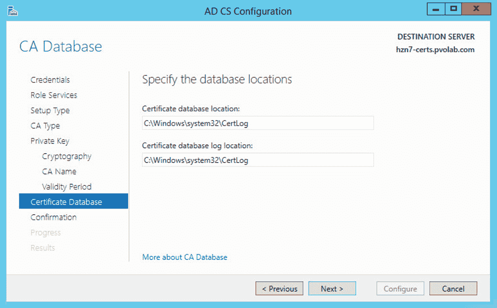

1.  接受默认设置并点击“下一步 >”按钮继续。您现在将看到确认屏幕，如下图所示：

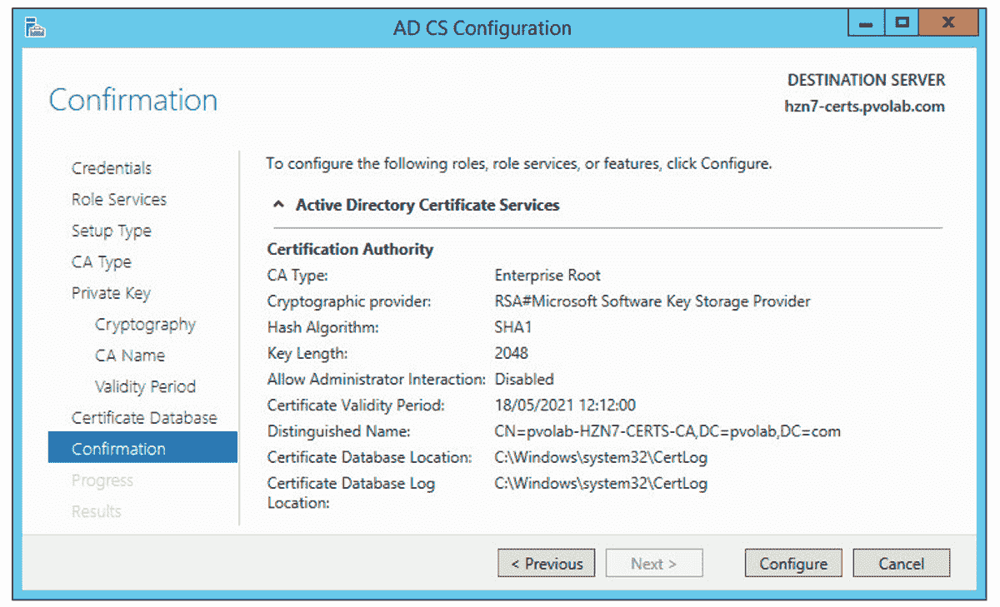

1.  点击屏幕底部的“配置”按钮以完成配置。一旦配置成功完成，您将看到以下消息弹出：

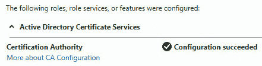

1.  点击“关闭”按钮以关闭服务器管理器。

现在我们的证书服务器已经设置并运行，我们可以开始配置 Horizon View 软件基础设施组件和客户端以使用它。

我们将首先在 Horizon View 连接服务器上安装证书。

# 在 View 连接服务器上安装 SSL 证书

在证书服务器安装并配置完成后，我们现在要将新创建的证书安装到 View 连接服务器上：

1.  打开一个远程控制台会话，连接到名为 **HZN7-CS1** 的 View 连接服务器，然后打开运行命令框。在运行框中，输入 `mmc`，然后点击确定以启动 **Microsoft 管理控制台** (**MMC**)，如下图所示：

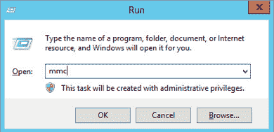

1.  现在您将看到 MMC 控制台屏幕，如下图所示：

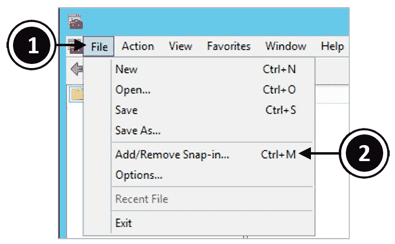

1.  在 MMC 控制台屏幕上，点击文件 (**1**)，然后点击“添加/删除管理单元…”选项 (**2**)。

1.  您现在将看到添加或删除管理单元屏幕：

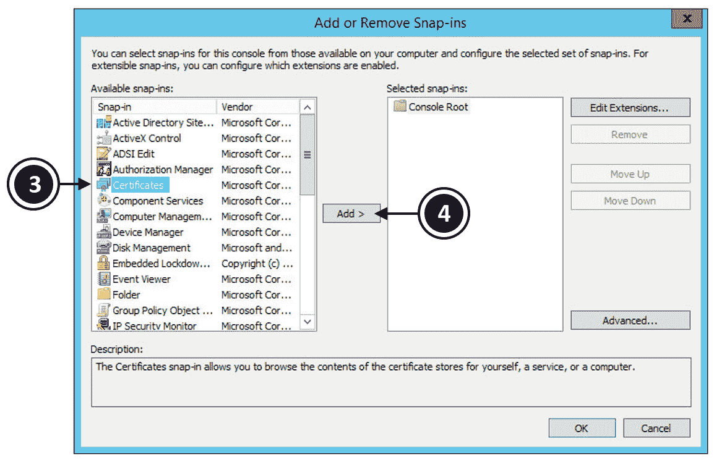

1.  在左侧的可用管理单元部分，点击并突出显示“证书”条目 (**3**)，然后点击“添加 >”按钮 (**4**)，如前图所示。

1.  现在您将看到证书管理单元框，如下图所示：

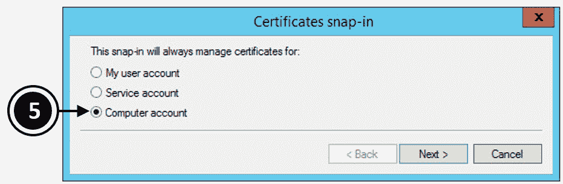

1.  点击计算机帐户的单选按钮 (**5**)，然后点击“下一步 >”按钮继续。您现在将看到选择计算机配置框：

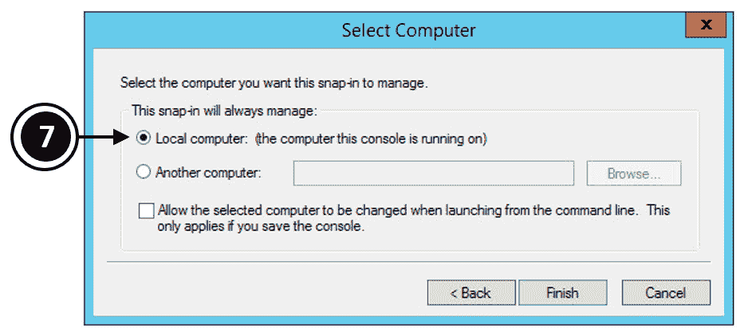

1.  选择“本地计算机”单选按钮 (**6**)，然后点击“完成”按钮。您将返回到“添加或删除管理单元”界面，现在显示已选择证书管理单元。

1.  点击“确定”以关闭“添加或删除管理单元”界面。

您现在已成功将证书添加到管理控制台作为配置选项，如下图所示：

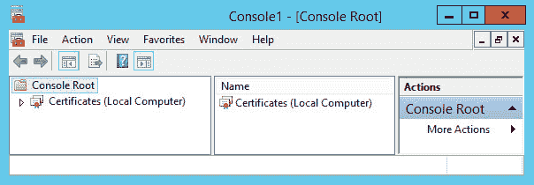

现在，您已经可以从管理控制台管理和配置证书，接下来的任务是向根 CA 请求证书：

1.  从 `控制台根目录` 中展开 `证书（本地计算机）` 文件夹，然后右键点击 `个人` 文件夹 (**1**)。从上下文菜单中，依次选择“所有任务”（**2**）并选择“请求新证书...” (**3**):

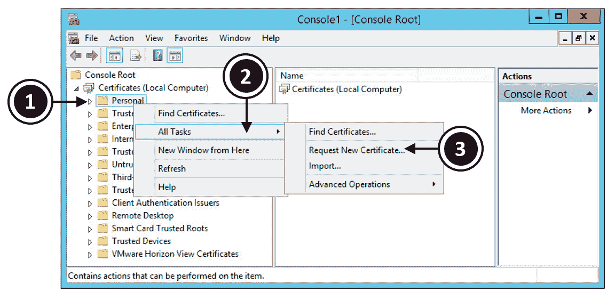

1.  现在，您将看到证书注册界面上的“开始之前”部分。点击“下一步”按钮继续。

1.  现在显示“选择证书注册策略”界面，如下图所示：

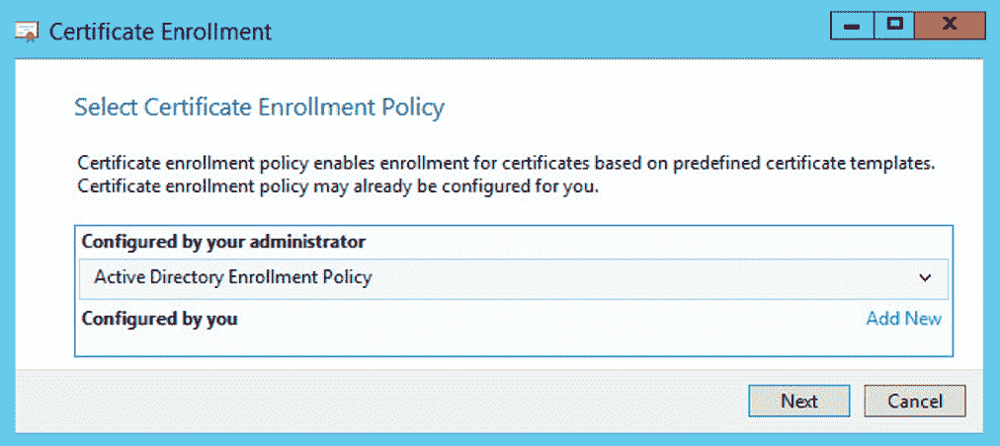

1.  点击“下一步”按钮继续。您现在将看到“证书注册请求证书”界面：

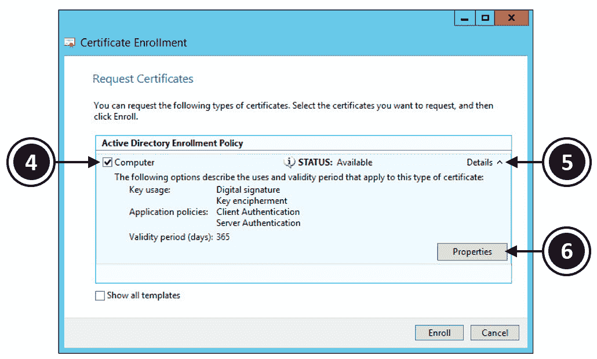

1.  在“Active Directory 注册策略”框中，勾选计算机 (**4**) 选项。我们将使用此策略模板来申请证书；但是，您也可以在根 CA 服务器上创建自己的模板。

1.  现在点击“详细信息”旁边的箭头 (**5**)，然后点击“属性”框 (**6**) 以便配置证书的属性。您现在将看到证书属性配置框，如下图所示：

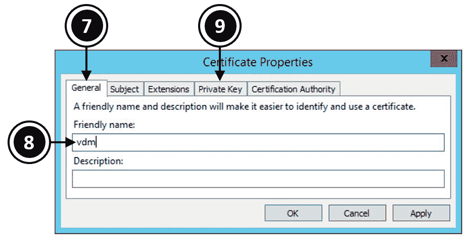

1.  点击“常规”标签 (**7**)，然后在“友好名称:”框 (**8**) 中输入此证书的友好名称。在本示例实验室中，我们将其命名为 `vdm`。您还可以选择输入描述。

1.  接下来，在“证书属性”框中，点击“私钥”标签，如下图所示：

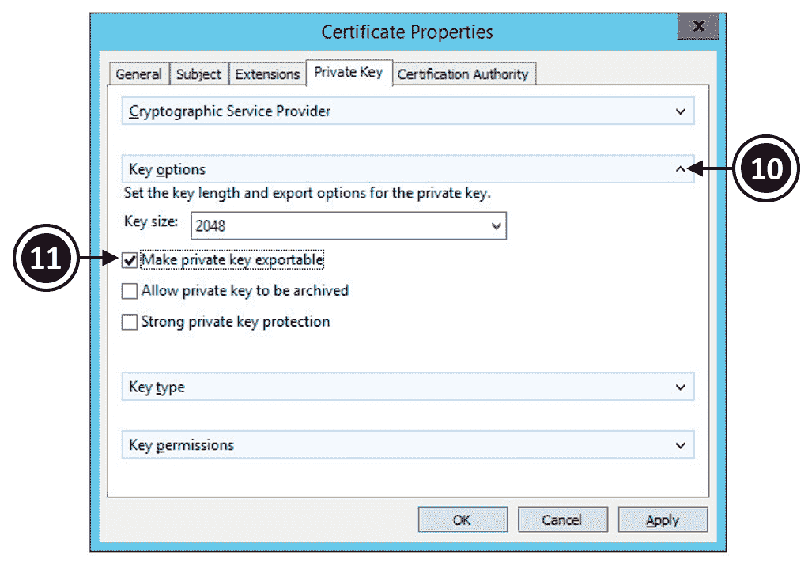

1.  点击下拉箭头以展开关键选项 (**10**)，并勾选使私钥可导出 (**11**) 选项。

1.  最后，点击 **证书颁发机构** 标签 (**12**)，如图所示：

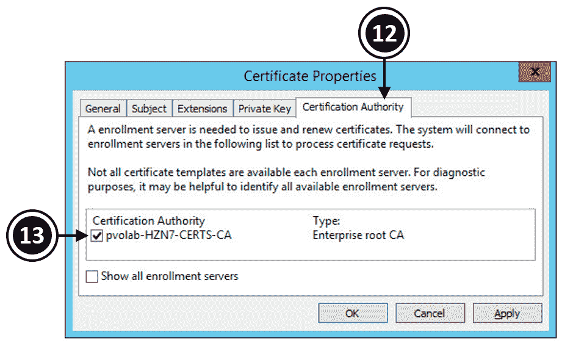

1.  勾选框以选择 pvolab-HZN7-CERTS-CA (**13**) 注册服务器。然后点击“确定”按钮。您将返回到“请求证书”界面，如下图所示：

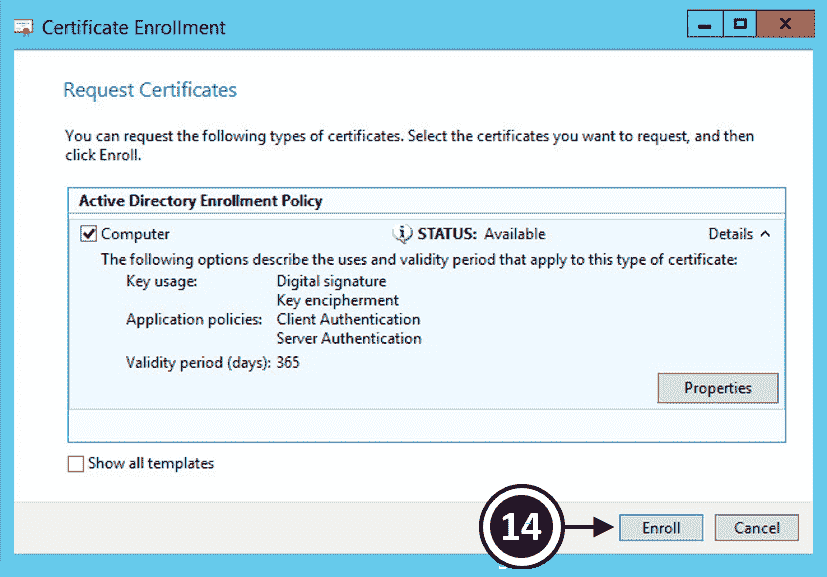

1.  点击“注册”按钮 (**14**) 以继续并注册连接服务器。如果注册成功，您将看到以下截图：

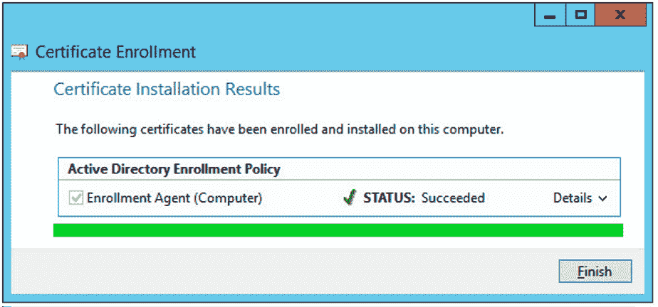

1.  点击“完成”按钮以完成证书注册过程。

别忘了你需要在所有 Horizon View 组件上完成证书注册过程，因此，如果你有其他服务器，比如副本服务器和 View Composer 服务器，那么这些服务器上也需要安装证书。

在下一部分，我们将看看现在已经有了根 CA 证书服务器并且证书已安装在我们的连接服务器上，我们接下来该做些什么。

# 证书注册后的配置任务

即使你已经安装了证书服务器并且在连接服务器上安装了有效的证书，仍然有一些事情需要配置。

如果你尝试使用浏览器连接到 View Administrator，你仍然会看到一条错误信息，表示网站的安全证书存在问题。典型的信息大概会是如下所示：

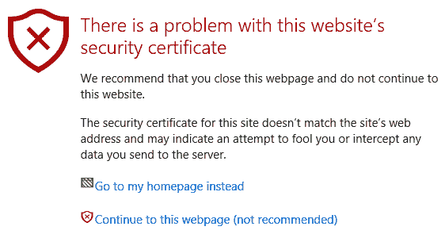

如果你还记得本章开始时，我们还讨论了使用`http://`或`https://`来访问安全网页。如果浏览器中的地址栏是红色的，如下图所示，那么连接不安全，且没有安装证书：


当然，你可以忽略这些错误，直接点击“继续访问此网站”（不推荐），这样你可以绕过警告并登录到 View Administrator。

然而，当你登录后，你会看到在 View Administrator 仪表板的系统健康状态部分也有一个红色警告框。对于 View 来说，如果没有安装有效的证书，健康警告会告诉你连接是不受信任的，因此这是一件坏事！以下截图展示了这一点：

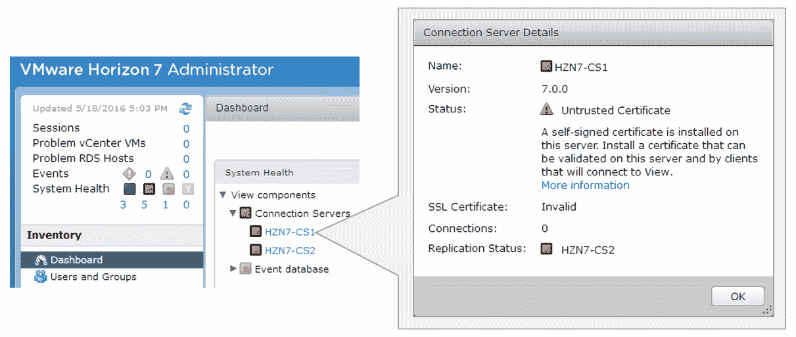

如果点击 Horizon 7 管理员仪表板，在仪表板视图中的系统健康状态下，选择显示红色警告框的某个连接服务器。你可以看到在打开的服务器详细信息框中，出现了一个黄色警告标志，提示该服务器上有一个不受信任的证书。在这个示例实验环境中，我们将继续使用 Horizon View 管理器，而不是更新的 Horizon Console 基于 Web 的管理控制台。原因是在编写本书时，并不是所有我们将讨论的功能都可以通过 Horizon 控制台访问。

从最终用户的角度来看，这是一回事。如果他们尝试通过 Horizon 客户端登录，他们会看到以下内容：

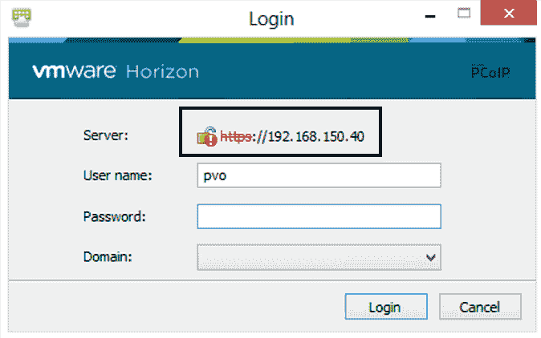

您可以在上图中看到“服务器”框内，连接服务器的`https://`地址是红色的，已被划掉，并且锁标志上显示警告符号，这一切都表明没有安装受信任的证书。

现在我们已经在连接服务器上创建并安装了证书，为了让 Horizon View 识别安装的证书，您需要重新启动 Windows 服务中的 View 连接服务器服务。按照以下步骤操作：

1.  打开运行对话框，在运行对话框中输入`services.msc`以打开服务（本地）屏幕。滚动到 VMware Horizon View 连接服务器（**1**）的条目，如下图所示：

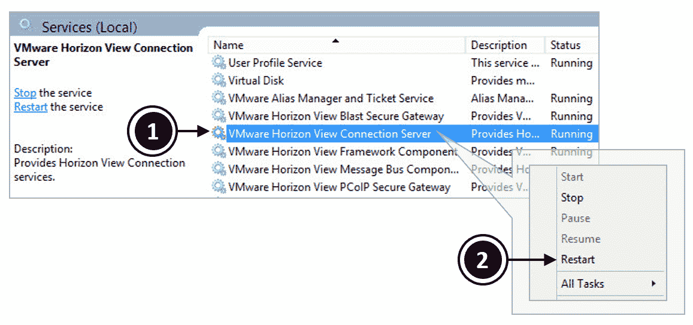

1.  选择 VMware Horizon View 连接服务器选项，右键点击，然后在上下文菜单中点击重启（**2**）。当 VMware Horizon View 连接服务器服务重新启动后，您可以再次登录到 View 管理员，并检查证书是否已应用。

1.  要做到这一点，首先登录后，在仪表盘中，点击“系统健康”下的“连接服务器”以展开此部分，然后点击连接服务器 HZN7-CS1（**3**），或刚刚安装证书的服务器。在弹出的连接服务器详情框中，您现在会看到 SSL 证书显示为有效（**4**），并且错误框已从红色变为绿色：

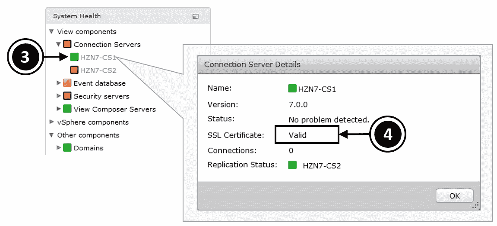

1.  最后，点击确定以关闭连接服务器详情的对话框，然后从 View 管理员中注销。

现在，您已经成功创建并安装了 Horizon View 的证书。别忘了，您还需要在所有 Horizon View 组件上安装证书，例如任何副本服务器或 View Composer 服务器。

# Horizon View True SSO

在第二章，*理解 Horizon 7 架构和组件*中，我们向您介绍了 True SSO 功能及其架构。在本节中，我们将讨论如何配置 True SSO。

要设置 True SSO，您首先需要配置一个 CA，这个步骤我们在本章的*安装根 CA*部分已经配置过了。接下来，有一系列配置步骤需要完成，以便为安装 True SSO 做好准备。

# 准备 AD 以支持 True SSO

第一步是为注册服务器创建一个**活动目录**（**AD**）组。按照以下步骤操作：

1.  打开到您的域控制器的控制台。在示例实验室中，这台机器叫做`dc.pvolab.com`。启动活动目录用户和计算机配置屏幕，如下图所示：

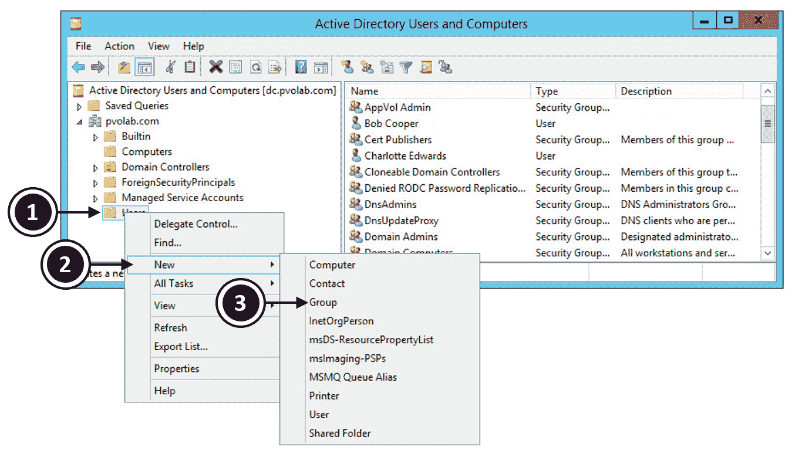

1.  点击并选择`用户`（**1**），然后右键点击。从弹出菜单中，点击“新建”（**2**），然后从展开的选项中，选择“组”（**3**）。你现在将看到“新对象 – 组”对话框，如下图所示：

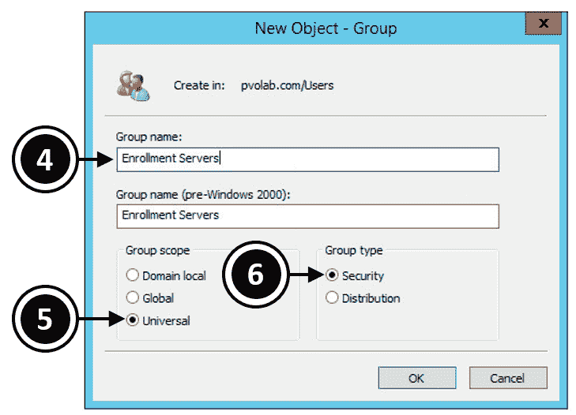

1.  在“组名”框（**4**）中，输入新组的名称。在示例实验室中，这个组叫做`Enrollment Servers`。在“组范围”框中，点击“通用”单选按钮（**5**），在“组类型”框中，点击“安全”单选按钮（**6**）。配置完成后，点击“确定”按钮。接下来，你需要将 Enrollment Server 添加到新创建的组中。

1.  在 Active Directory 用户和计算机配置界面，点击`计算机`（**7**），然后双击 Enrollment Server。在示例实验室中，这台计算机被称为 HZN7-ENROL，如下图所示：

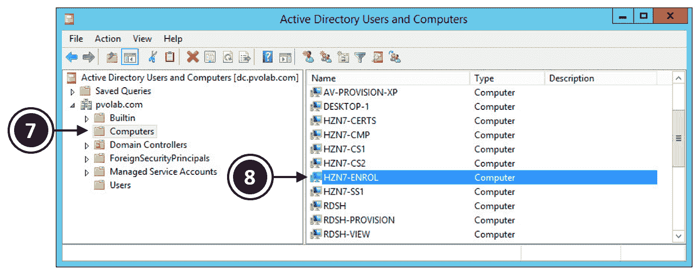

1.  现在你会看到 HZN7-ENROL 属性对话框，如下图所示：

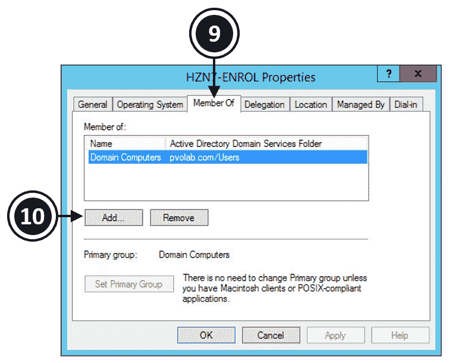

1.  点击“成员”选项卡（**9**），然后点击“添加...”按钮（**10**）。你现在将看到“选择组”对话框：

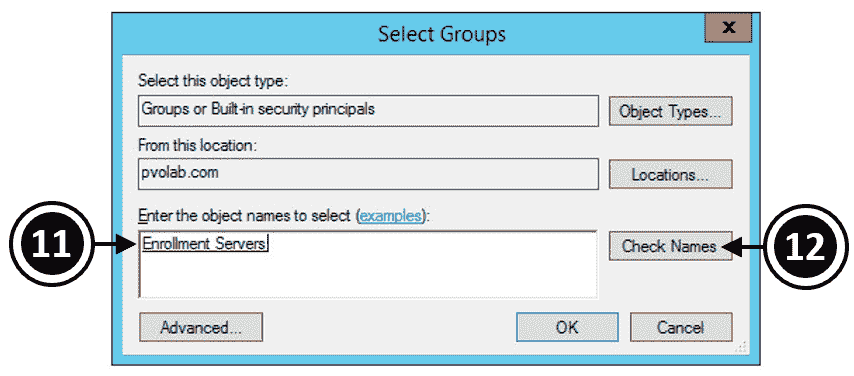

1.  在“输入要选择的对象名称”框（**11**）中，键入你为`Enrollment Servers`创建的组的名称。你可以只键入名称的前部分，然后点击“检查名称”按钮（**12**）。这将找到任何与你输入的前部分匹配的名称。在此示例中，它会找到 Enrollment Servers 组。选择正确的组名后，点击“确定”按钮继续。

1.  你将返回到 HZN7-ENROL 属性对话框，现在显示 Enrollment Server HZN7-ENROL 是 Enrollment Servers 组的成员。如以下截图所示：

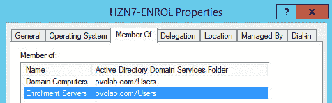

配置好域控制器元素后，下一步是创建一个新的证书模板。

# 为 TrueSSO 创建证书模板

下一步是创建一个证书模板。为此，我们将按照以下步骤进行操作：

1.  打开一个控制台，连接到证书服务器并启动证书管理控制台。在示例实验室中，这台服务器被称为 HZN7-CERTS。如下图所示：

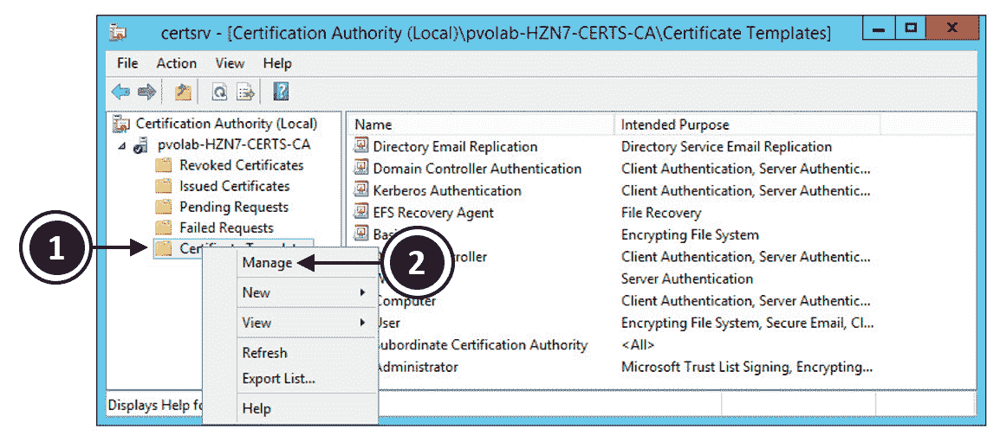

1.  点击`证书模板`文件夹（**1**），然后右键点击。从当前显示的上下文菜单中，点击“管理”（**2**）。你现在将看到证书模板控制台，如下图所示：

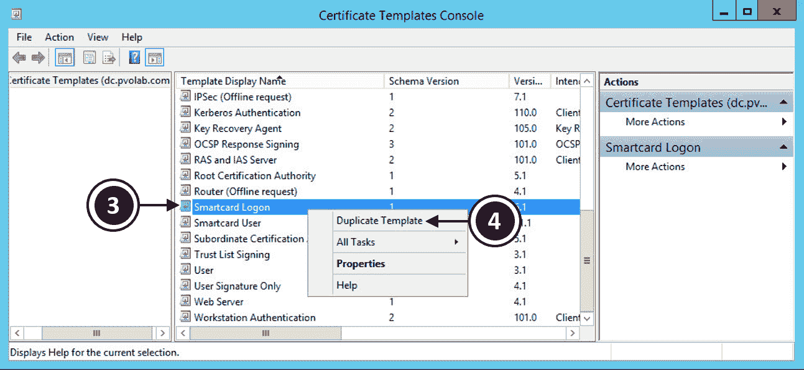

1.  向下滚动模板显示名称面板，直到找到智能卡登录（**3**）模板，并单击以高亮显示它。现在右键单击，然后从显示的上下文菜单中点击“复制模板”。您将看到新模板属性配置框，如下图所示：

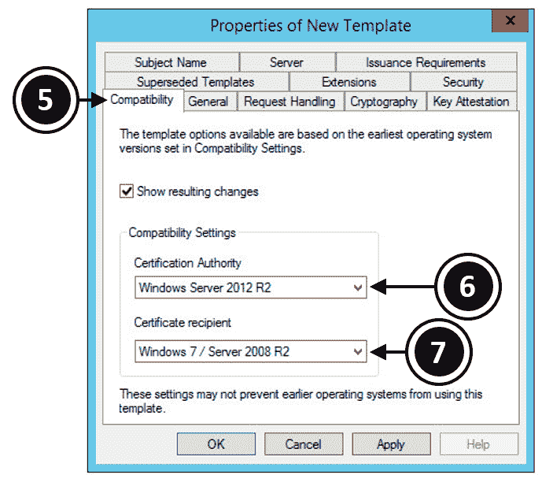

1.  点击兼容性选项卡（**5**）。在兼容性设置部分，从认证机构（**6**）的下拉菜单中，选择与正在运行的 CA 服务器版本相对应的设置。在示例实验中，CA 服务器运行的是 Windows Server 2012 R2。

1.  接下来，从证书接收者（**7**）的下拉菜单中，选择适用于将接收此证书的计算机的设置。在示例实验中，我们将其设置为 Windows 7 / Server 2008 R2。

更改这些设置时，您将看到一个对话框，提醒您关于兼容性更改以及即将进行的模板更改。点击“确定”以接受这些消息并继续操作。

1.  现在点击常规选项卡（**8**）框，如下图所示：

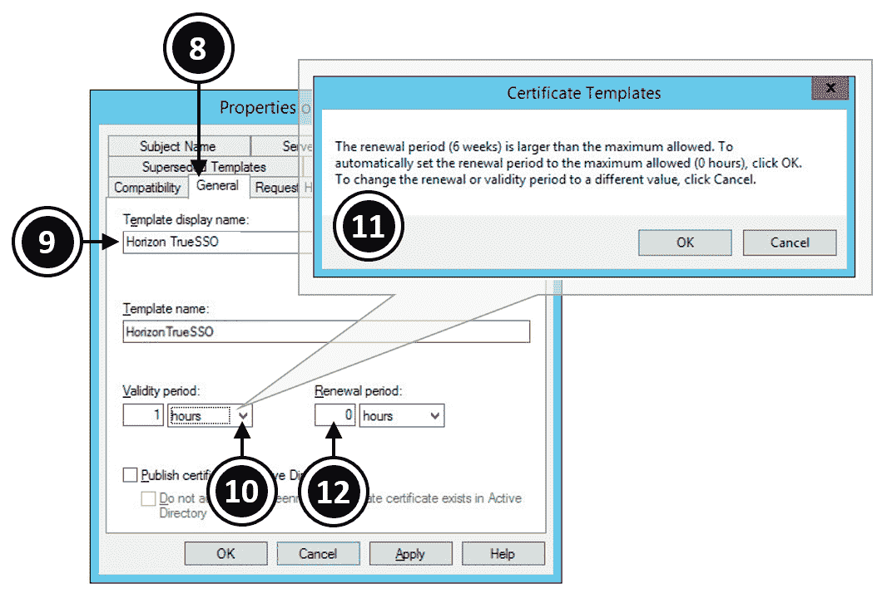

1.  在模板显示名称框（**9**）中，输入新证书模板的名称。在示例实验中，模板名称为`Horizon TrueSSO`。

1.  接下来，您需要配置有效期。在有效期（**10**）下拉菜单中，选择小时选项。然后，您将看到证书模板警告框（**11**）。

1.  点击“确定”以接受。接受警告后，续期时间将自动设置为`0`小时（**12**）。

1.  现在点击请求处理选项卡（**13**）框，如下图所示：

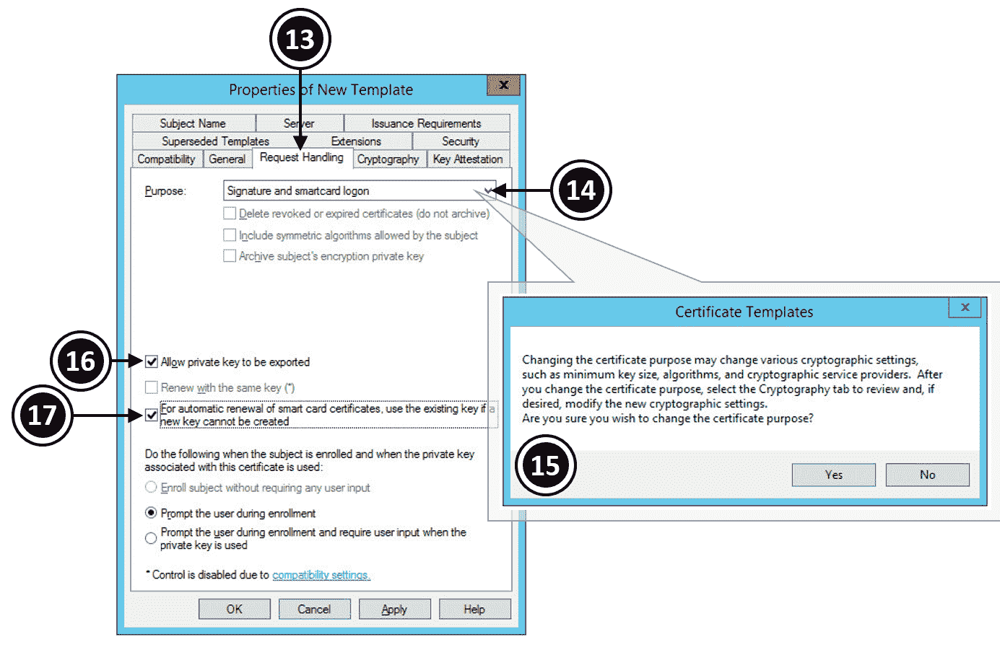

1.  在目的（**14**）旁边的下拉框中，选择**签名**和智能卡登录选项。然后，您将看到证书模板警告框（**15**），该框会提醒您即将更改证书的用途。点击“是”以接受警告信息并关闭对话框。

1.  最后，在此屏幕上，选中“允许导出私钥”（**16**）复选框，并选中“智能卡证书自动续期”（**17**）复选框。

1.  接下来，点击加密选项卡（**18**），如下图所示：

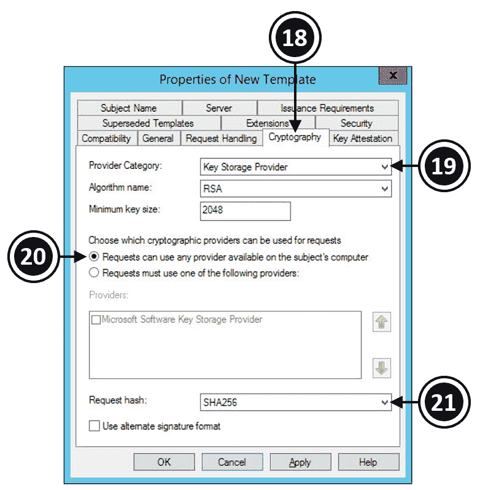

1.  在提供者类别框中，点击下拉箭头（**19**）并选择“密钥存储提供者”选项。然后，点击“请求可以使用受试者计算机上任何可用的提供者”（**20**）的单选按钮，并在请求哈希框中点击下拉箭头（**21**），选择 SHA256 选项。

1.  下一个需要配置的选项卡是主题名称选项卡（**22**），如下图所示：

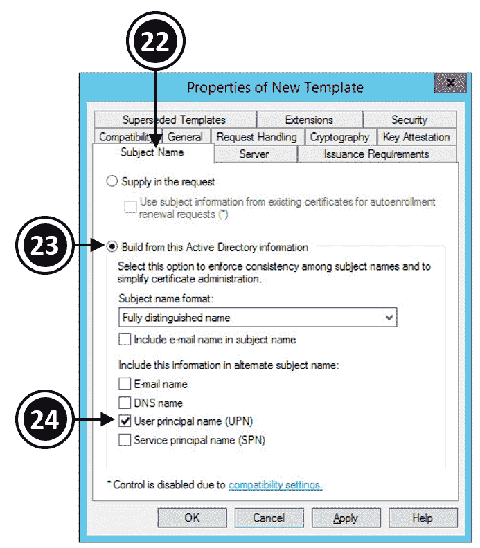

1.  点击“从此活动目录信息构建”单选按钮（**23**），然后勾选“用户主体名称（UPN）”框（**24**）。

1.  下一个需要配置的标签是“服务器”标签（**25**），如下图所示：

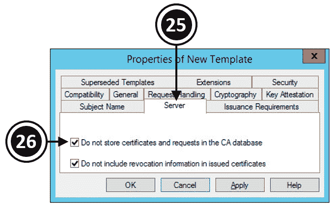

1.  勾选“不要在 CA 数据库中存储证书和请求”框（**26**）。现在点击“发布要求”标签（**27**），如下图所示：

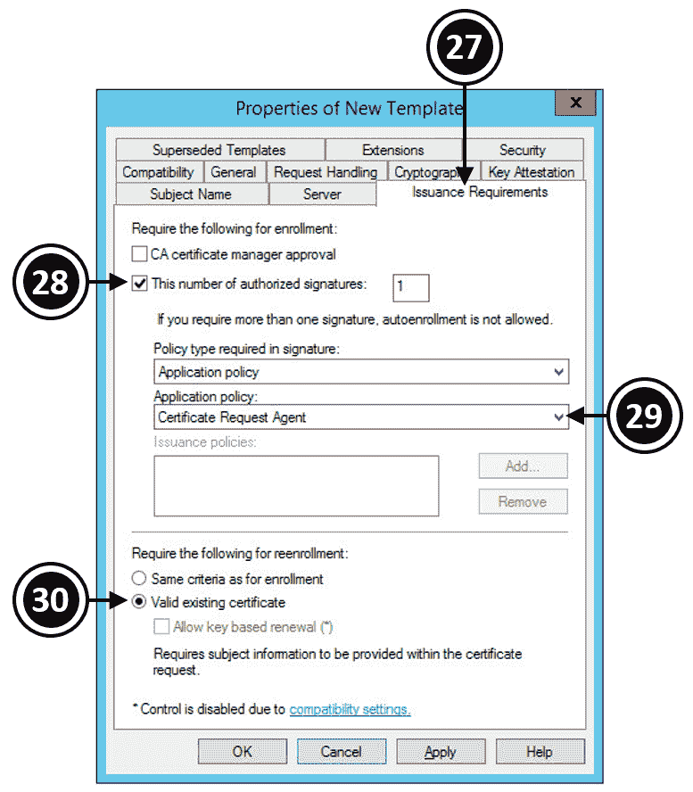

1.  勾选此授权签名数量框（**28**），并确保此选项的值设置为`1`。

1.  在应用程序策略框中，点击下拉箭头（**29**），并选择“证书请求代理”选项。最后，在此标签中，点击“有效现有证书”单选按钮（**30**）。

1.  在“新模板属性”配置的最后一部分，点击“安全”标签（**31**），如下图所示：

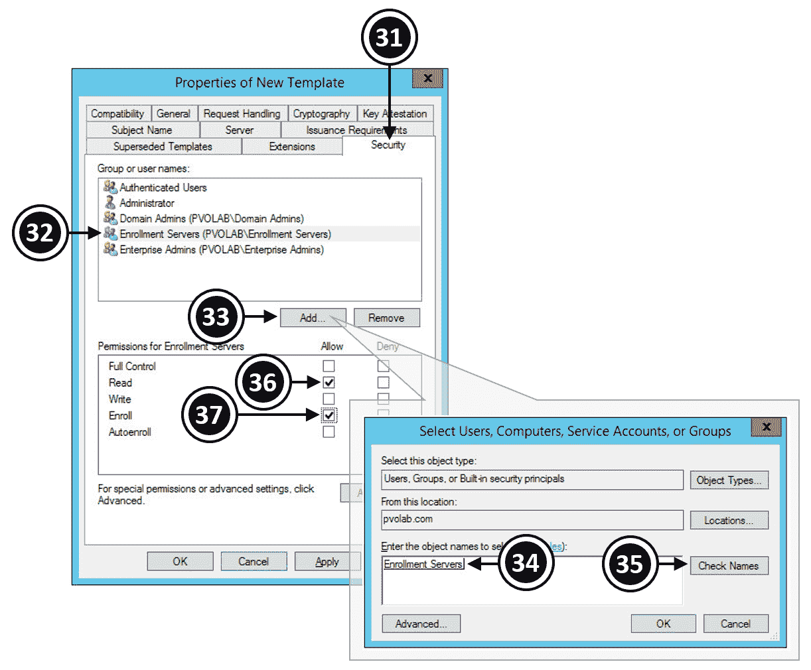

1.  点击选择 Enrollment Servers 组（**32**），然后点击“添加…”按钮（**33**）。

1.  现在，你将看到“选择用户、计算机、服务账户或组”对话框弹出。在“输入要选择的对象名称”框（**34**）中，输入`Enrollment Servers`组的名称。你可以只输入组名的前几个字母，然后点击“检查名称”按钮（**35**）来查找匹配项。此时你将看到 Enrollment Servers 组（**34**）。

1.  最后，在“Enrollment Servers 的权限”部分，勾选“允许”标题下的“读取”（**36**）和“注册”（**37**）框。

1.  此步骤现已完成，请点击“确定”按钮以完成配置并关闭对话框。

在下一部分中，我们将发布新创建的证书模板。

# 发布 TrueSSO 证书模板

现在证书模板已经创建，下一步是发布它。为此，请按照以下步骤进行：

1.  在证书管理控制台界面，点击`证书模板`文件夹（**1**），右键点击，然后在显示的上下文菜单中点击“新建”（**2**），接着选择“发布证书模板”（**3**）选项。如下截图所示：

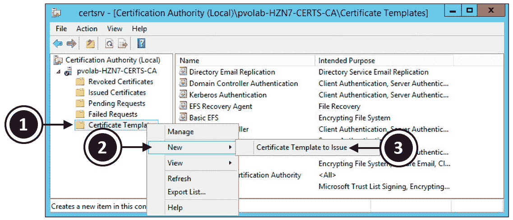

1.  现在你将看到“启用证书模板”对话框，如下图所示：

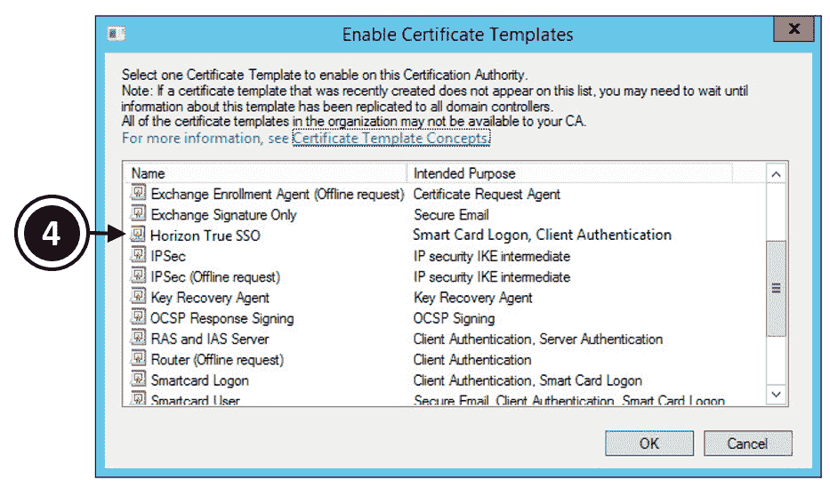

1.  点击**Horizon True SSO**（**4**），然后点击“确定”按钮。

1.  现在你将返回到“启用证书模板”对话框，如下图所示：

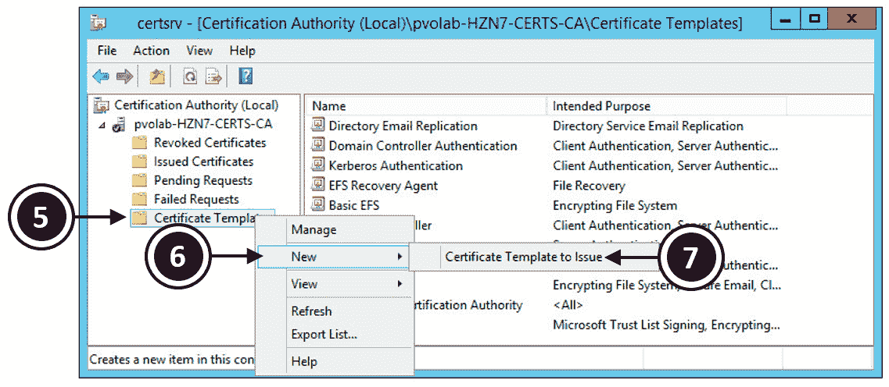

1.  接下来，我们需要启用 Enrollment Agent。与上一步一样，在证书管理控制台的界面上，点击`Certificate Templates`文件夹（**5**），右键点击，然后从弹出的上下文菜单中，点击“New”（**6**），然后选择“Certificate Template to Issue”（**7**）选项。你将看到启用证书模板的对话框，如下图所示：

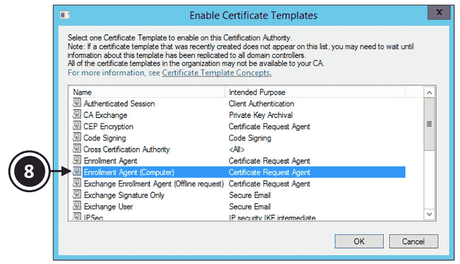

1.  点击并选择“Enrollment Agent (Computer)”（**8**）选项。然后点击“OK”按钮。你将返回到启用证书模板的对话框。现在可以退出证书管理控制台了。

你需要检查 Enrollment Agent (Computer)模板是否与为`TrueSSO`模板配置的安全设置相同。这意味着它已被添加到注册服务器的安全组，并且已授予读取和注册权限。

最后的几个配置任务是基于命令行的，因此在证书服务器的桌面上，启动一个运行对话框。在运行对话框中，输入`cmd`以打开命令提示符窗口。

你需要做的第一件事是配置 CA 以进行非持久性证书处理。为此，在命令提示符下，输入以下命令：

```
certutil –setreg DBFlags +DBFLAGS_ENABLEVOLATILEREQUESTS
```

运行该命令后的输出如下截图所示：

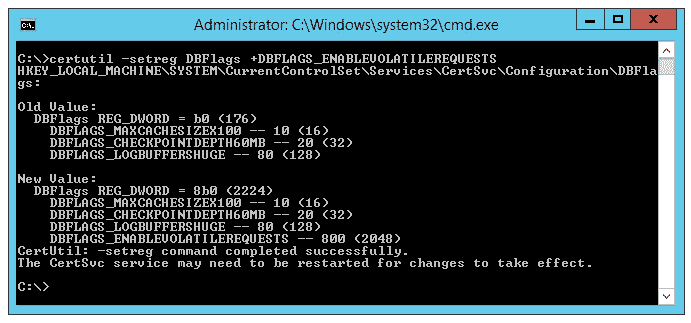

你需要做的第二件事是配置 CA 以忽略离线**证书撤销列表**（**CRL**）错误。为此，在命令提示符下，输入以下命令：

```
certutil –setreg ca\CRLFlags +CRLF_REVCHECK_IGNORE_OFFLINE
```

以下截图显示了命令成功执行的情况：

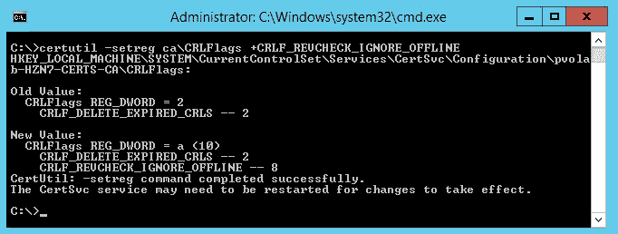

最后，正如在命令提示符中所述，你需要重启证书服务。为此，在命令提示符下依次运行以下两条命令：

```
net stop certsvc
net start certsvc
```

你应该看到类似于以下截图的内容，显示证书服务成功停止并重新启动：

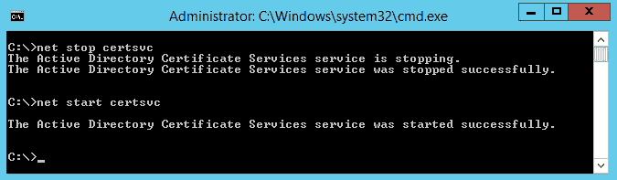

下一步是将证书部署到注册服务器和连接服务器。

# 证书部署

下一步任务是将**Enrollment Agent (Computer)**证书部署到注册服务器上。

通过将 Enrollment Agent (Computer)证书部署到该服务器上，你授权该注册服务器作为 Enrollment Agent 并能够代表最终用户生成证书。

如果你正在跟随示例实验，那么在第四章，*安装和配置 Horizon 7 - 第一部分*中，你应该已经有了一个名为**HZN7-ENROL**的注册服务器，我们将在该服务器上部署证书。首先需要做的是打开该服务器的远程控制台：

1.  启动“运行”命令框并在打开框中输入`mmc`（**1**），以启动 Microsoft 管理控制台，如下图所示：

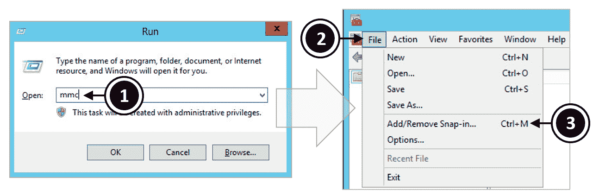

1.  在 MMC 控制台屏幕上，点击“文件” (**2**) 然后点击“添加/删除管理单元…” (**3**)。

1.  现在，您将看到添加或删除管理单元屏幕，如下图所示：

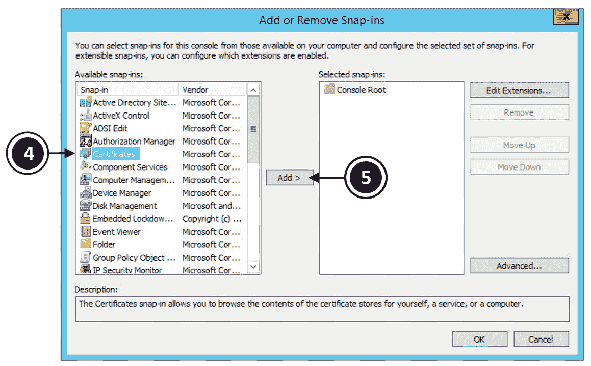

1.  在左侧的可用管理单元部分，点击以高亮显示并选择“证书”条目（**4**），然后点击“添加 >”按钮（**5**）。现在，您将看到证书管理单元框出现，如下图所示：

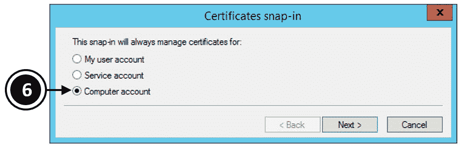

1.  选择计算机账户单选按钮（**6**），然后点击“下一步 >”按钮继续。现在，您将看到选择计算机配置框：


1.  点击本地计算机单选按钮（**7**），然后点击“完成”按钮。现在，您将返回到添加或删除管理单元屏幕，并且此时显示的证书管理单元已被选中。

1.  点击“确定”以关闭添加或删除管理单元屏幕。

现在，您可以在管理控制台中看到证书选项，如下图所示：

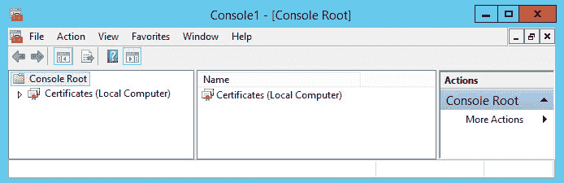

接下来的任务是请求注册代理（计算机）证书：

1.  从控制台根目录，展开`证书（本地计算机）`文件夹，然后选择并右键点击`个人`文件夹（**1**）。在上下文菜单中，导航到“所有任务” (**2**) 然后选择“请求新证书...” (**3**)，如下图所示：


1.  您现在将看到证书注册屏幕上的“开始之前”部分。点击“下一步”按钮继续。

1.  接下来，您将看到选择证书注册策略屏幕。点击“下一步”按钮继续。接下来的屏幕是**证书**注册请求证书屏幕，如下图所示：

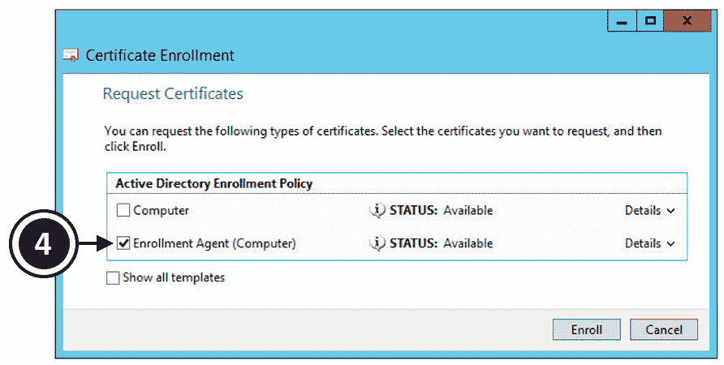

1.  勾选框以选择注册代理（计算机）选项（**4**），然后点击“注册”按钮请求证书。您应该看到证书已成功注册：


1.  最后，点击“完成”按钮以完成配置，关闭证书注册对话框，然后关闭证书管理控制台。

接下来的任务是导入注册服务客户端证书，您需要先从连接服务器导出它，然后再将其导入到注册服务器。

从连接服务器部署注册服务客户端证书，将连接服务器与注册服务器配对。如果不这样做，任何发往注册服务器的连接请求都会被拒绝，结果是无法生成证书。连接服务器启动时会自动生成注册服务客户端证书。

让我们从连接服务器开始导出证书：

1.  打开连接服务器的控制台。在示例实验室中，这是名为**HZN7-CS1**的服务器。启动 MMC 控制台并添加我们在前面章节中提到的证书管理插件，然后启动证书管理控制台，如下图所示：

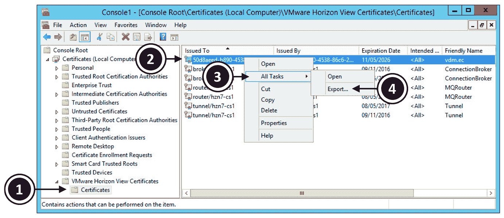

1.  在左侧窗格的控制台根目录部分，导航到`VMware Horizon View Certificates`文件夹，通过点击箭头展开它，然后点击`Certificates`文件夹 (**1**)。

1.  点击并选择包含友好名称`vdm.ec`的证书 (**2**)，右键单击，然后从上下文菜单中选择“所有任务” (**3**)，接着选择“导出…” (**4**) 选项。你将看到证书导出向导的欢迎界面。点击“下一步”按钮继续。

1.  现在你将看到导出私钥对话框，如下图所示：

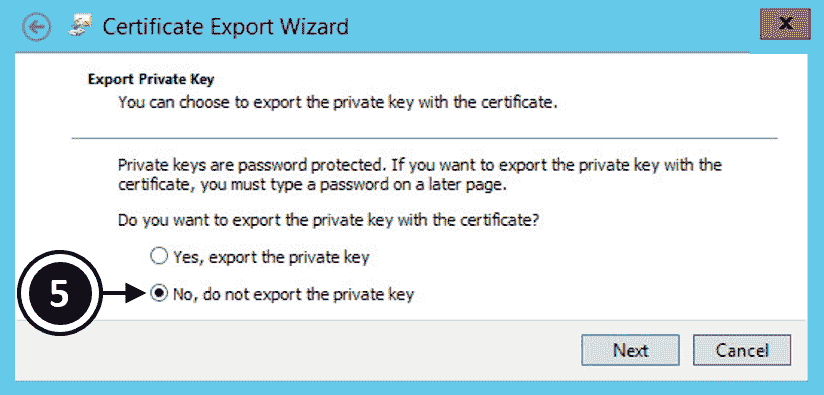

1.  点击“不， 不导出私钥”单选按钮 (**5**)，然后点击“下一步”按钮。

1.  在导出文件格式对话框中，接受默认选择的格式选项，然后点击“下一步”按钮继续。

1.  现在你将看到导出文件对话框，如下图所示：

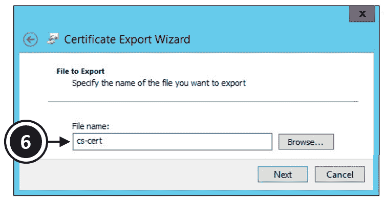

1.  在文件名框 (**6**) 中，输入证书的文件名。在示例实验室中，证书被命名为`cs-cert`，并且为了方便访问，保存在名为`cert`的共享文件夹中，这个文件夹位于域控制器上，因为在导入时，注册服务器需要能够访问该证书。

1.  点击“下一步”按钮继续。

1.  现在你将看到完成证书导出向导的对话框，如下图所示：

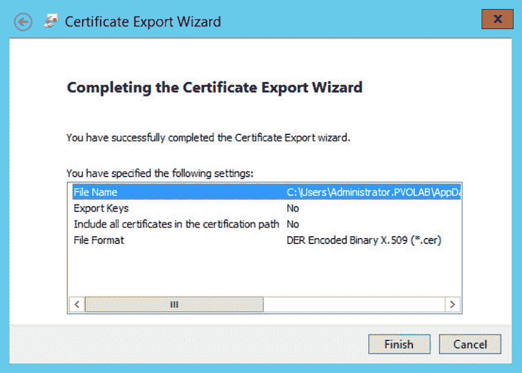

1.  最后，点击“完成”按钮以完成证书导出过程。你将看到一条消息，表示导出成功。

接下来的任务是将证书导入注册服务器：

1.  打开远程控制台连接到注册服务器。在示例实验室中，这是名为**HZN7-ENROL**的服务器。启动 MMC 控制台并添加我们之前提到的证书管理插件，然后启动证书管理控制台，如下图所示：


1.  在左侧面板的控制台根部分，导航到 `VMware Horizon View Enrollment Server Trusted Roots` 文件夹（**1**），点击并选择高亮显示它，然后右键单击。从现在显示的上下文菜单中，点击“所有任务”（**2**），并选择导入...（**3**）选项。

1.  你现在将看到“欢迎使用证书导入向导”屏幕。点击“下一步”按钮以继续。你将看到“文件导入”对话框，如下图所示：

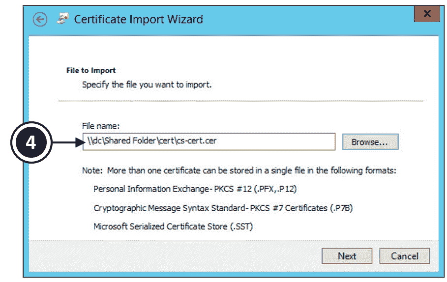

1.  在文件名框（**4**）中输入你将要导入的证书的文件名。在示例实验室中，这个文件名为 `cs-cert`，保存在域控制器的共享文件夹中。点击“下一步”按钮以继续。

1.  在下一个屏幕中，证书存储，你需要选择证书将存储的存储区：


1.  在证书存储对话框中，点击“将所有证书放入以下存储区”的单选按钮（**5**），然后确保证书存储设置为 `VMware Horizon View Enrollment Server Trusted Roots`。

1.  点击“下一步”按钮以继续。

1.  你现在将看到“完成证书导入向导”对话框，如下图所示：

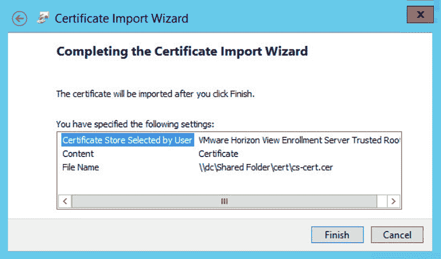

1.  最后，点击“完成”按钮以导入证书。你应该看到一条消息，提示导入成功。

导入完成后，你将在证书管理控制台中看到证书，如下图所示：

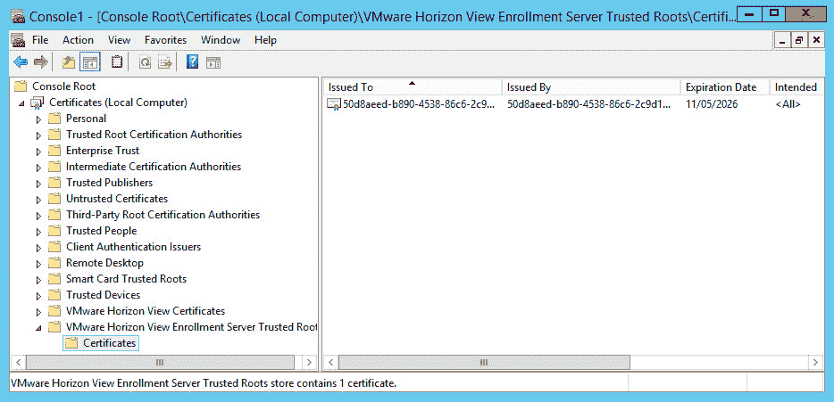

成功导入证书后，你可以关闭证书管理控制台。在下一步中，我们将配置连接服务器上的 True SSO。

# 在连接服务器上配置 True SSO

现在你已经将所有必要的证书放到位，下一步是设置连接服务器上的 True SSO 功能。

此设置过程是命令行驱动的，并使用 `vdmUtil` 命令，因此第一步是打开连接服务器上的命令提示符窗口。

你需要运行的第一个命令是将注册服务器添加到 Horizon View 环境中。这样你就可以查询注册服务器并收集有关域及其他有用信息（如可用模板和 CA 名称）的信息：

1.  从连接服务器打开命令行对话框，并输入以下命令：

```
vdmUtil --authAs administrator --authDomain PVOLAB --authPassword password --truesso --environment --add --enrollmentServer hzn7-enrol.pvolab.com
```

在配置过程中，你将需要这些信息，所以一定要记下来。

你将看到，注册服务器已经成功添加到环境中：

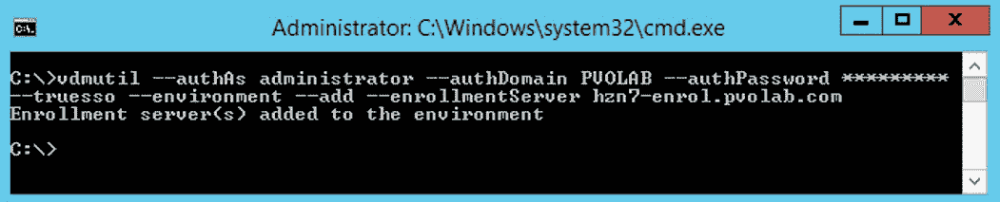

下一个命令将为你提供有关环境中各种 Horizon 组件的详细信息。这将有助于 True SSO 的配置。

1.  在命令行中，输入以下命令：

```
vdmUtil --authAs administrator --authDomain PVOLAB --authPassword password --truesso --environment --list --enrollmentServer hzn7-enrol.pvolab.com --domain pvolab.com
```

你将看到如下输出：

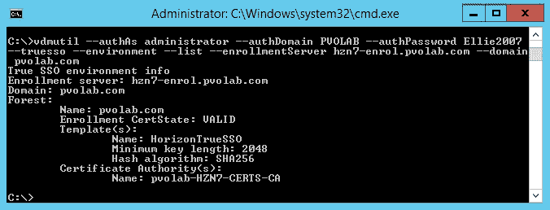

我们现在可以使用这些信息创建 True SSO 连接器。True SSO 连接器指定了要使用的注册服务器、CA 和证书模板的详细信息。当连接服务器收到启动桌面请求时，它将查找用户所属域的 True SSO 连接器，并使用你配置的组件来获取证书。

1.  在命令行中，输入以下命令：

```
vdmUtil --authAs administrator --authDomain PVOLAB --authPassword password --truesso --create --connector --domain pvolab.com --template HorizonTrueSSO --primaryEnrollmentServer hzn7-enrol.pvolab.com --certificateServer pvolab-hzn7-certs-ca --mode enabled
```

你现在会看到连接器已成功创建并启用，如下图所示：

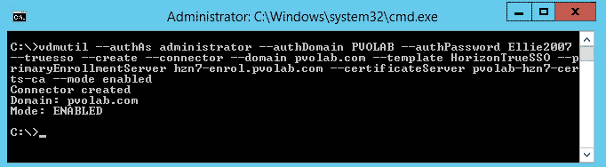

接下来，我们将通过以下步骤检查 True SSO 是否已安装并正常工作：

1.  登录到 Horizon View 管理控制台。

1.  在仪表板屏幕上，找到“系统健康”部分，点击箭头展开“True SSO”部分（**21**），然后点击`pvolab.com`的链接（**22**）。

1.  你将看到 True SSO 域详细信息框，如下图所示：

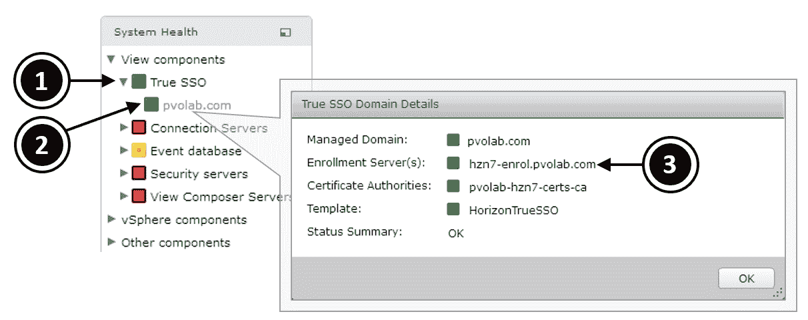

1.  点击“确定”按钮关闭窗口，然后退出 View 管理员。

你已经成功配置了 True SSO 的 View 元素。True SSO 功能的真正优势是与 vIDM 配合使用时，允许用户通过 vIDM 门户实现对虚拟桌面或应用程序的单点登录。

# 总结

在本章中，我们讨论了部署 Horizon View 时的一些安全方面。我们首先描述了什么是 SSL 证书以及为什么 Horizon View 需要它们，然后通过安装和配置根 CA 服务器并配置示例实验室中的 View 组件来实际展示如何使用这些证书。

本章的第二部分探讨了 Horizon View 的 True SSO 功能。同样，我们通过配置证书服务器来使用此功能，并配置 Horizon View 注册服务器和连接服务器，以使它们在用户登录过程中彼此“信任”。

在下一章，我们将把注意力转向虚拟桌面，并开始构建虚拟桌面映像。
