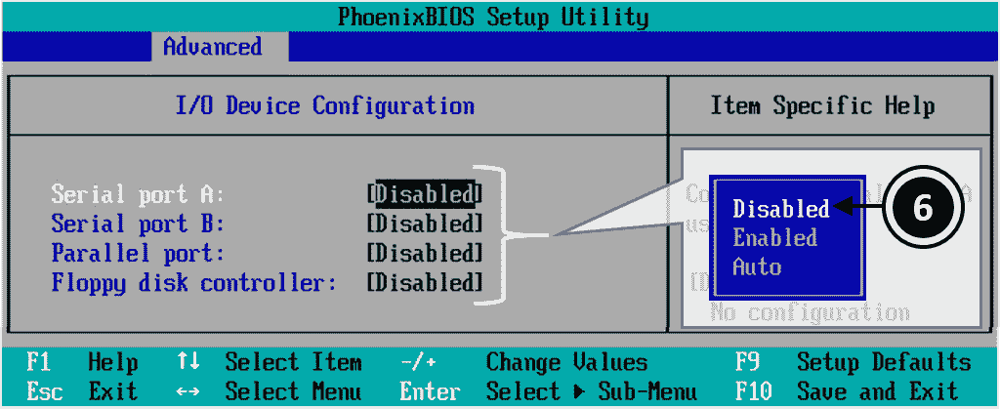
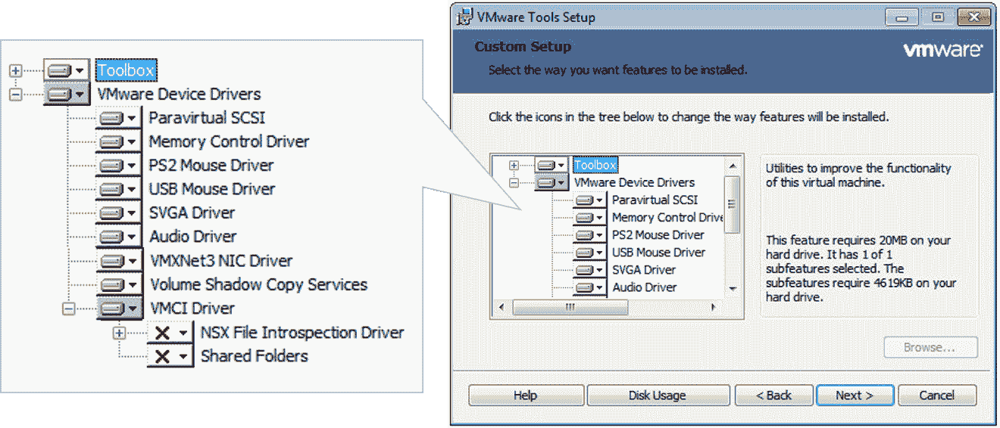
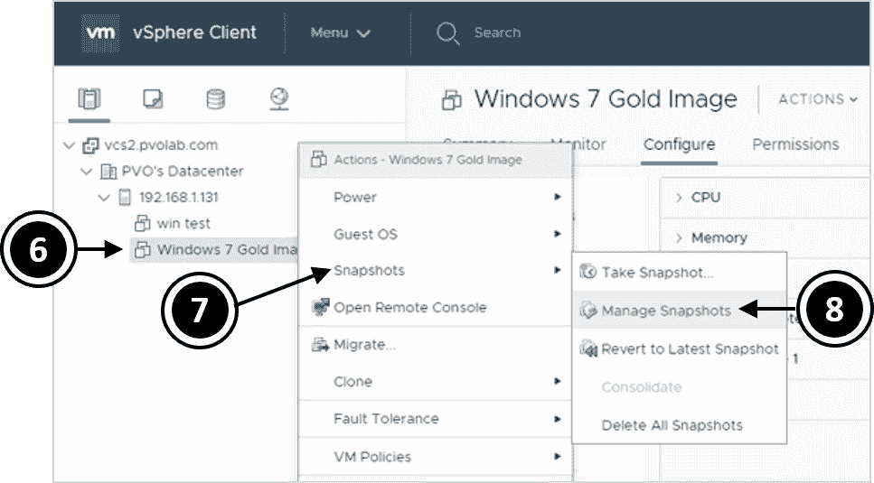
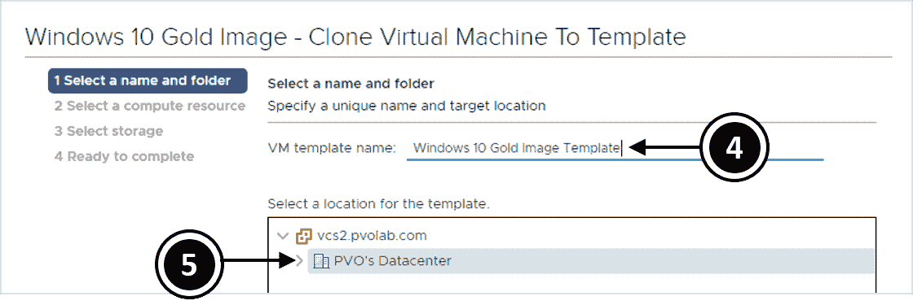

# 第七章：构建与优化虚拟桌面操作系统

在本书前几章中，我们已经构建了 Horizon View 基础设施及其组件，在本章中，我们将把重点放在虚拟桌面上。我们将探讨如何创建和配置虚拟桌面机器的虚拟硬件元素，基于虚拟桌面机器的最佳实践安装桌面操作系统，并配置该操作系统以实现最佳性能。

构建虚拟桌面机器的核心操作系统的步骤与构建物理桌面机器的过程相差无几。然而，我们需要在操作系统中安装一些额外的任务和软件组件，使其成为一个适合 Horizon View 环境的真正虚拟桌面机器，更重要的是适合终端用户使用。本章将更详细地介绍每个步骤，并在过程中构建多个操作系统镜像。我们将使用示例实验室进行操作。构建过程如以下图所示：


我们将为 Windows 7 桌面构建一台虚拟桌面机器。它将配置为浮动桌面分配，使用链接克隆构建，并且第二台运行 Windows 7 的虚拟桌面机器将配置为专用分配，并从完整克隆构建。最后，我们还将研究创建基于 Windows 10 的即时克隆桌面，并在本章结束时研究交付基于 Linux 的虚拟桌面机器。

本章将涵盖以下主题：

+   创建 Windows 7 虚拟桌面机器

+   创建 Windows 10 虚拟桌面机器

+   创建支持 GPU 的虚拟桌面机器

+   创建 Linux 虚拟桌面机器

+   准备虚拟桌面以供交付

# 构建虚拟桌面镜像的最佳实践

在本节中，我们将讨论一些构建虚拟桌面机器镜像的最佳实践和流程。

在物理桌面环境中，有多种方法可以构建和部署操作系统。例如，你可以使用**Microsoft 部署工具包**（**MDT**）或微软的**系统中心配置管理器**（**SCCM**）。这两种选项都可以与所有其他可用的工具一起使用，用来构建桌面镜像，当然也包括 VMware 自己的 Mirage 产品。所以，我们刚才讨论了几种可以用来构建桌面镜像的选项，但让我们特别强调一个你不应该使用的选项：**物理到虚拟工具**（**P2V**），它将物理镜像转化为虚拟镜像。

最佳实践是从零开始构建一个新的虚拟桌面映像，使其从一开始就设计成虚拟机。毕竟，你可能会为新的硬件平台构建一个新的映像，实际上，你正在做的也是这样的事情。然而，有几个原因不建议使用你的物理映像来创建虚拟桌面映像。其中一个原因是映像的大小，这些映像很可能已经膨胀，过去一年中安装了大量的补丁和更新。你希望你的 VDI 映像保持精简和新鲜，仅安装最新且相关的软件。

另一个原因是，映像中可能包含某些硬件驱动程序或其他基于硬件的软件元素，如 Intel **主动管理技术** (**AMT**) 这样的桌面硬件管理解决方案，它依赖于固件和其他集成在物理机芯片组中的组件。由于你现在使用的是虚拟桌面机，因此这种硬件不存在，因此你不需要它被安装。

最坏的情况是安装这种解决方案，因为它会影响虚拟桌面机的性能。

# 技术要求

在进入构建过程之前，我们需要从虚拟硬件的角度查看虚拟桌面机的规格，以及我们需要配置的内容。以下截图列出了虚拟桌面机的要求：


你应该能够根据项目开始时收集的评估数据，制定适合你特定环境的要求。需要记住的一点是，如果在调整性能和最终用户体验时需要，你可以很容易地更改配置。

配置虚拟桌面机大小时，另一个重要因素是避免陷入过度配置的陷阱。例如，如果你只需要一个 CPU，那么就只为虚拟桌面机分配一个 CPU。不要诱惑自己去添加不必要的资源，因为这样最终会降低你在服务器基础设施上能够托管的虚拟桌面机数量，从而增加成本和管理负担。你还可能会使虚拟桌面的性能变慢。正如我们之前提到的，这就是为什么你的评估数据至关重要的原因。

VDI 桌面应根据前面表格中列出的硬件规格指南进行配置。

# 创建 Windows 7 虚拟桌面机

在这一部分，我们将构建一个 Windows 7 虚拟桌面机器。它将作为我们创建虚拟桌面的主映像操作系统。我们将按照本章开头的图示步骤以及第一个图示，优化并准备作为浮动分配的链接克隆虚拟桌面机器的映像。

# 创建虚拟桌面机器容器

我们需要做的第一件事是在 vCenter 服务器上构建和配置实际的虚拟桌面机器。这将定义虚拟硬件配置。要定义配置，请按照以下步骤操作：

1.  打开浏览器并登录到 vCenter `vcs1.pvolab.com`的 vSphere Web 客户端，如下所示：


登录后，你将看到 vSphere 客户端主页，如下图所示：


1.  在屏幕左侧的导航快捷方式中，点击“虚拟机和模板” (**1**)，如下图所示：


1.  展开 vCenter `vcs2.pvolab.com`，然后点击高亮显示你希望创建虚拟桌面机器的数据中心名称。在示例实验室中，数据中心名为 PVO's Datacenter（**2**）。右键点击它，并从上下文菜单中选择“新建虚拟机…” (**3**)。此时你将看到“新建虚拟机配置框”，如下图所示：


1.  第一个任务是选择创建类型。从选项列表中，点击高亮显示“创建新虚拟机” (**4**)，然后点击“下一步”按钮继续。你将看到选择名称和文件夹的屏幕，如下图所示：


1.  在虚拟机名称框（**5**）中，输入新虚拟桌面机器的名称。在示例实验室中，名称为`Windows 7 Gold Image`。

1.  然后，在选择虚拟机位置的部分，点击以高亮显示你希望在其中创建虚拟机的数据中心。在示例实验室中，这台机器将被创建在名为 PVO's Datacenter 的**数据中心**（**6**）中。

1.  点击**下一步**按钮继续。你将看到选择计算资源的屏幕，如下图所示：


1.  展开名为 PVO's Datacenter 的**数据中心**，然后点击你希望托管此虚拟桌面所在的 ESX 服务器。在示例实验室中，192.168.1.131（**7**）是我们将用于托管虚拟桌面机器的主机服务器的 IP 地址。

由于这将是我们的金像/母机或父虚拟桌面机器，相对于生产环境中的实际虚拟桌面机器来说，位置可能不那么重要。因此，在示例实验室中，我们将使用管理区块来托管此虚拟桌面机器。

1.  点击“下一步”按钮继续。接下来，您将看到“选择存储”屏幕，如下图所示：


1.  选择存储该虚拟桌面机器的存储数据中心。在示例实验室中，虚拟桌面机器存储在默认存储区 VM Datastore（**8**）上。点击“下一步”按钮继续。

1.  现在您将看到“选择兼容性”屏幕。在这里，我们将为虚拟桌面机器选择虚拟机版本。如文中所述，为了获得最佳性能，您应该选择版本 13，这意味着使用 vSphere 6.5 或更高版本作为宿主平台。如果您使用的是其他宿主平台，请选择与您环境相关的版本。然而，请注意，某些功能可能根据您选择的版本而无法使用。例如，如果您希望支持即时克隆和 vGPU 等功能，则至少需要 vSphere 6。

1.  在下拉菜单（**9**）中，选择 ESXi 6.5 及以上版本，如下图所示：


1.  点击“下一步”按钮继续。接下来，您将看到“选择客户操作系统”屏幕，如下图所示：


1.  下一步是为虚拟桌面机器选择操作系统。在我们的示例中，这是将作为 Windows 7 的金像模板使用的第一台虚拟桌面机器。

1.  在“客户操作系统家族”框中，点击箭头展开下拉菜单（**10**），然后选择 Windows。接着，在“客户操作系统版本”框中，点击箭头展开下拉菜单（**11**），选择 Microsoft Windows 7（64 位）。选择正确的客户操作系统非常重要，因为它决定了安装 VMware Tools 时在虚拟桌面机器上安装的驱动程序。

1.  点击“下一步”按钮继续。

1.  现在，您将看到“自定义硬件”屏幕，您可以在此配置虚拟桌面机器的虚拟硬件规格，如下图所示：


1.  在此配置屏幕上有几个需要更改的地方。首先，这个虚拟桌面机器将拥有两个虚拟 CPU。在 CPU 框中，点击下拉箭头（**12**），从下拉菜单（**13**）中选择 2，为此虚拟桌面机器配置两个虚拟 CPU。

1.  接下来，通过点击箭头（**14**）展开“新建网络”选项，然后在“适配器类型”框中，点击下拉箭头（**15**），选择 VMXNET 3（**16**）选项，如下图所示：


1.  因为我们正在构建一个新的虚拟桌面机器，所以需要安装操作系统。为此，我们将把安装介质连接到虚拟桌面机器，以便它能够从中启动并开始安装。向下滚动到“新建 CD/DVD 驱动器”选项，如下图所示：


1.  点击向下箭头 (**17**)，然后在显示的选项列表中点击“数据存储 ISO 文件” (**18**)。在示例实验室中，我们已经将安装介质的 ISO 镜像上传到主机服务器的数据存储中。

1.  接下来，您将看到“选择文件”屏幕，如下图所示：


1.  展开数据存储 (**19**)，然后点击 `ISO 镜像` 文件夹 (**20**)。接着，点击选择要安装在该虚拟桌面机器上的操作系统。在本示例中，我们将安装 Windows 7，因此点击 en_windows_7_professional_with_sp1_x64_dvd 选项 (**21**)。您的 ISO 镜像可能存储在不同的位置，只需根据您的文件夹位置参考此示例。

1.  点击“确定”按钮返回虚拟硬件屏幕。

1.  在此屏幕上，最后需要确保刚刚添加的 ISO 文件作为新 CD/DVD 驱动器连接。为此，请勾选“已连接”框 (**22**)，如下图所示：


1.  在硬件配置的最后部分，您需要更改其中一个启动选项，以便下一次虚拟桌面机器开机并启动时，直接进入 BIOS 设置屏幕。当然，您也可以打开虚拟桌面机器的控制台并在启动时按 *F2* 键；但是，该屏幕可能闪过得太快，以至于您可能会错过，因此前一种方法要容易得多。您需要选择此选项并进入 BIOS 设置屏幕的原因是，我们需要更改一些配置设置，使得虚拟桌面机器作为虚拟机而非物理桌面 PC 来运行。我们将在稍后启动新创建的虚拟桌面机器时详细介绍这一点。

1.  要配置启动选项，请点击 VM 选项卡 (**23**)，然后展开“启动选项”箭头 (**24**)。勾选“强制 BIOS 设置”框 (**25**)。如下图所示：


1.  配置完成后，点击“下一步”按钮继续。您将看到“准备完成”屏幕，如下图所示：


1.  一旦您对配置详情满意，点击“完成”按钮以完成配置。

1.  如果现在勾选“最近任务”框，您将看到虚拟桌面机器已成功创建，如下图所示：


1.  在虚拟桌面机器已经构建并配置完毕后，是时候开机并继续构建过程了。导航到虚拟桌面机器所在的清单中。你应该能看到一个名为 Windows 7 Gold Image 的条目。

1.  高亮显示虚拟桌面机器 Windows 7 Gold Image（**26**），右键点击它，然后在显示的上下文菜单中，点击电源（**27**），接着点击开机（**28**），如以下截图所示：


1.  虚拟桌面机器现在将开机并进入 BIOS 设置屏幕，因为我们配置了在下一次启动时执行此操作。安装操作系统后，随后的启动将正常进入操作系统。

在下一部分中，我们将对虚拟桌面机器的 BIOS 设置进行配置更改。

# 更新虚拟桌面机器的 BIOS

在虚拟桌面机器已开机并启动到 BIOS 设置屏幕后，我们将启动远程控制台屏幕，以便你执行配置步骤。为此，请执行以下步骤：

1.  在清单部分中，高亮显示 Windows 7 Gold Image 虚拟桌面机器，然后在摘要选项卡下，点击启动远程控制台链接（**1**），如以下截图所示：


1.  你现在将看到虚拟桌面机器的 PhoenixBIOS 设置工具屏幕，如以下截图所示：


1.  首先，你需要做的是禁用软盘驱动器。在 BIOS 设置屏幕的主界面中，使用光标键向下移动，高亮显示 Legacy Diskette A:（**2**）选项，然后按*Enter*键。

1.  现在你将看到一个弹出框，显示软盘选项。再次使用光标键高亮显示禁用选项（**3**），然后按*Enter*键。

1.  接下来，你需要导航到 BIOS 设置屏幕的高级选项卡。为此，按右箭头光标键横向移动到顶部的选项卡，直到高级选项卡被高亮显示（**4**），如以下截图所示：


1.  使用下箭头光标，向下移动到 I/O 设备配置（**5**）选项并按*Enter*键。你现在将看到高级配置屏幕，如以下截图所示：



1.  将光标移到串口 A: 的条目上并按*Enter*键。从弹出框中，选择禁用（**6**）选项。

1.  按照相同的步骤禁用串口 B:、并行端口: 和软盘控制器: 等选项，直到所有选项都设置为禁用。完成这些配置更改后，按*F10*键保存并退出。你将看到设置确认框，如以下截图所示：


1.  通过选择“是”(**7**)，然后按 *Enter* 键确认配置更改。BIOS 更改现已保存，虚拟桌面机器将自动重新启动。

你已经成功配置了 BIOS。接下来的步骤是安装操作系统。

# 操作系统安装选项

你可以选择几种方式来为虚拟桌面机器构建操作系统。第一种方式是使用像 MDT、SCCM 或 VMware 自家的 Mirage 产品（用于完整克隆桌面）之类的工具，部署你已经为 VDI 构建的镜像，但在这个示例实验室中，我们将使用不同的方式，即通过使用安装介质手动构建镜像，展示你需要执行的不同任务，以优化镜像以适应 VDI。

这个构建过程与在 vSphere 上构建其他虚拟机没有区别，因此我们将简要回顾其中的一些内容，以便那些已经熟悉 vSphere 平台的用户能快速复习，并详细讲解，以便那些新接触该技术的用户能够迅速构建他们的第一个虚拟桌面机器镜像。

# 安装客户操作系统

由于在构建虚拟桌面机器时，我们作为配置的一部分连接了一个 ISO 镜像，因此当虚拟桌面机器启动时，ISO 镜像会被挂载，Windows 7 安装将自动开始。

我们不会详细讲解如何安装 Windows 7，因此请继续进行基本安装，或根据你希望如何配置操作系统给最终用户。一旦安装完成，确保应用任何 Windows 更新和补丁，然后将虚拟桌面机器加入域。

你需要将 VDI 桌面加入域的原因——即使这台机器实际上是模板——是为了确保机器上所有需要的组件、DLL 文件等，都已经准备好，以便能够成功加入域。否则，当你从这个父镜像创建联动克隆并尝试将其加入域时，虚拟桌面机器会要求插入安装介质。对于一两台桌面机器和测试环境来说，这没问题，但在生产环境中，数千台机器就不行了。

一旦你确认父镜像的操作系统已经打了补丁并加入了域，你就可以开始安装一些特定于 VMware 的虚拟机工具和 Horizon View 组件，首先是 VMware Tools。

# 安装 VMware Tools

VMware Tools 增强了虚拟桌面机器的可用性。它安装了 VMware 特定的设备驱动程序，使虚拟桌面机器能够像物理硬件一样运行，并替代物理硬件的等效物。VMware Tools 的安装是通过 vSphere 客户端启动的：

1.  在 Windows 7 Gold Image 虚拟机及其概览标签中，点击“安装 VMware Tools”(**1**)，如下所示：


1.  从 vSphere Web Client 启动安装将有效地将 VMware Tools 安装媒体挂载为虚拟 CD 驱动器，在虚拟桌面机器上显示安装 VMware Tools 对话框，如以下截图所示：


1.  点击 MOUNT 按钮 (**2**) 挂载 VMware Tools 安装媒体，然后返回虚拟桌面机器的控制台。

1.  你将看到自动播放对话框，显示 VMware Tools DVD 驱动器已挂载，并且安装程序可供启动，如以下截图所示：


1.  点击运行 setup64.exe (**3**) 启动 VMware Tools 安装程序。

1.  如果看到用户帐户控制框弹出，警告你有关对计算机进行更改的操作，点击是（Yes）按钮忽略它。

1.  现在你将看到 VMware Tools 安装向导的欢迎对话框。

1.  点击 Next > 按钮继续安装。你将看到 Choose Setup Type 对话框，如下图所示：


1.  选择 Custom (**4**) 单选按钮，然后点击 Next > 按钮继续。你也可以选择 Typical 选项，它将安装一组标准驱动程序；然而，出于本书的目的，并为了描述所有可用的选项，我们将选择自定义安装。现在你将看到 Custom setup 对话框，如下图所示：



1.  VMware Tools 将安装以下 VMware 设备驱动程序，具体取决于是否选中它们。默认情况下，所有驱动程序都被选中，VMCI 驱动程序除外。下面是这些驱动程序及其功能的描述：

    +   Para 虚拟 SCSI：这是针对 PVSCSI 适配器的，旨在增强虚拟化应用程序的性能。

    +   内存控制驱动程序：当虚拟桌面机器在 ESXi 主机上运行时，它可以管理虚拟桌面机器的内存。

    +   PS2/USB 鼠标驱动程序：这个虚拟鼠标驱动程序提升了虚拟桌面机器中鼠标的性能。

    +   SVGA 驱动程序：这使得 32 位显示、高分辨率和更快的图形性能成为可能。它安装了一个虚拟的 SVGA 驱动程序，替代了标准的 VGA 驱动程序。在 Windows Vista 及更高版本中，还会安装 VMware SVGA 3D（Microsoft – WDDM）驱动程序，增加了对 Windows Aero 的支持。

    +   **音频驱动程序**：所有 64 位客户操作系统都需要此驱动程序，因为它启用了声音功能。

    +   VMXNET3 网卡驱动程序：它提高了网络性能，建议用于虚拟桌面机器。

    +   卷影复制服务：这使得你可以对虚拟桌面机器进行备份或快照。

    +   VMCI 驱动程序：这允许虚拟机之间更快的通信。

    +   NSX 文件检查驱动程序：这将安装代理程序，以便你可以使用防病毒卸载扫描功能。

1.  此对话框中的其他选项包括“浏览...”功能，允许你更改 VMware 工具的安装位置，以及“磁盘使用情况”以检查磁盘空间要求，从而了解 VMware Tools 安装所选选项所需的磁盘空间。

1.  点击“下一步 >”按钮继续。你将看到“准备安装 VMware Tools”对话框。点击“安装”按钮以开始安装过程。

1.  完成后，你将看到“完成 VMware Tools 安装向导”对话框。点击“完成”按钮以完成安装过程。

1.  现在，系统会提示你重启虚拟桌面机器，以便启动 VMware Tools 服务。点击对话框中的“是”按钮以重启。

1.  一旦虚拟桌面机器重启，点击任务栏并检查 VM 图标 (**5**) 来确认 VMware Tools 服务是否正常运行，如下面的截图所示：


你也可以从虚拟桌面机器启动服务控制台，并检查服务是否正在运行，具体如下面的截图所示：


你已成功安装 VMware Tools。下一步是安装你希望作为父镜像一部分的核心应用程序。

# 为父镜像安装应用程序

下一阶段是安装你希望作为父镜像一部分的应用程序。这些通常是你的组织中每个用户都会使用的应用程序。你也可以使用其他技术（如 ThinApp 或 App Volumes）来交付应用程序，因为理想情况下，你希望按需交付应用程序，而不是将它们安装到操作系统镜像中，因为这样会使得它们更难以管理。

在示例实验室中，我们已经在 gold 镜像中安装了 Adobe Reader。

在接下来的步骤中，我们将安装 Horizon Agent，以便将虚拟桌面机器注册到 Horizon 环境和连接服务器。

# 安装 Horizon Agent

Horizon Agent 安装在每台虚拟桌面机器上，用于 Horizon View 客户端与虚拟桌面机器之间的通信。

它还添加了如 View Persona Management 和 USB 重定向等组件。我们将在本节中更详细地介绍这些不同的组件，随着我们在虚拟桌面机器上安装代理。要安装 Horizon Agent，请按照以下步骤操作：

1.  打开一个 Windows 7 Gold Image 虚拟桌面机器的控制台，并从桌面导航到 Horizon Agent 的安装文件。为了简便起见，我们在域控制器上创建了一个共享文件夹，以便将所有安装介质保存在其中。

1.  启动`VMware-Horizon-Agent-x86_64-7.6.0-9539447`文件开始安装，如果你看到“Open File - Security Warning”消息，点击“Run”按钮继续。你现在将看到“Welcome to the Installation Wizard for VMware Horizon Agent”屏幕。

1.  点击“Next >”按钮继续。你现在将看到许可协议页面，如下图所示：


1.  选择“I accept the terms in the license agreement”（**1**）的单选框。

1.  点击“Next >”按钮继续。你现在将看到网络协议配置对话框，如下图所示：


1.  由于本实验室使用的是 IPv4，在选项框中，点击以高亮显示 IPv4（**2**），然后点击“Next >”按钮继续。你现在将看到自定义设置页面。在自定义设置页面上，你可以选择要安装的 Horizon Agent 功能。并非所有功能都是默认安装的，因此在此页面，你可能需要查看一些功能，并选择/取消选择它们，因你可能不想使用某些功能。如果需要，你可以稍后重新安装这些功能。未默认安装的功能将标有红色 X。这些功能如下图所示：


1.  你可以选择安装以下功能。请注意，某些功能依赖操作系统，因此可能不会显示为可用选项。

    +   3D RDSH：这启用了 RDSH 会话中的硬件加速 3D 渲染。

    +   USB 重定向：这允许将 USB 设备插入终端设备，并将 USB 流量重定向到虚拟桌面机器。

    +   VMware Virtualization Pack for Skype for Business：这允许终端用户通过 Skype for Business 进行优化的音频和视频通话，且运行于虚拟桌面机器中。

    +   VMware Horizon View Composer Agent：这允许虚拟桌面机器作为关联克隆桌面运行。

    +   实时音视频：这允许你将本地连接的音频和视频设备（如 USB 摄像头）重定向到虚拟桌面机器。

    +   VMware Horizon Instant Clone Agent：这允许虚拟桌面机器作为即时克隆桌面运行。

    +   客户端驱动重定向：这允许视图客户端与远程桌面和应用程序共享本地驱动器（仅支持 IPv4）。

    +   虚拟打印：这允许用户无需安装打印机驱动程序即可打印到打印机。

    +   vRealize Operations Manager Agent：这允许 vRealize Operations Manager 对虚拟桌面机器进行监控，以便与 Horizon View 集成。

    +   VMware Horizon 7 个人档案管理：此功能将用户的个人资料从虚拟桌面机器同步到中央服务器上的存储库，这意味着可以将个人资料传递到浮动分配的桌面，以便为该用户个性化设置，使他们可以访问其个人资料。

    +   扫描仪重定向：此功能允许你将本地扫描仪重定向到虚拟桌面机器。

    +   智能卡重定向：此功能允许用户使用智能卡进行身份验证。

    +   串口重定向：此功能允许用户将本地串口重定向到虚拟桌面机器。

    +   VMware 音频：此功能启用本地设备的声音。

    +   Flash 重定向：此功能将 Flash 内容的处理卸载到本地设备。

    +   HTML5 多媒体重定向：此功能将 Chrome 或 Edge 浏览器中的 HTML5 多媒体内容重定向到客户端，并用于性能优化。

    +   设备桥接 BAS 插件：此功能启用 BAS 系统支持的指纹读取器。

    +   SDO 传感器重定向：此功能启用**简单设备方向**（**SDO**）传感器重定向功能。

    +   地理位置重定向：此功能启用客户端地理位置到远程桌面的重定向。

    +   Horizon 性能跟踪器：此功能启用 Horizon 性能跟踪器。此工具在远程桌面中运行，监控显示协议的性能和系统资源的使用情况。

3D RDSH 选项未显示，但在安装 RDSH 主机服务器时将可用。

1.  当你对选择安装的功能满意时，点击“下一步 >”按钮继续。

1.  在下一个屏幕上，你将看到远程桌面协议配置对话框。你需要启用远程桌面支持才能使视图代理工作。你可以通过组策略始终启用此功能：


1.  点击单选按钮以启用此计算机的远程桌面功能（**3**），如前面截图所示。

1.  点击“下一步 >”按钮继续。

1.  现在，你将看到“与 Horizon 7 连接服务器注册”对话框，如下截图所示：


1.  在（主机名或 IP 地址）框（**4**）中，输入要将此虚拟桌面机器注册到的连接服务器的名称。在示例实验室中，这就是我们的第一个连接服务器，名为`hzn7-cs1.pvolab.com`。

1.  在身份验证部分，点击“指定管理员凭据”（**5**）单选按钮。

1.  在用户名部分（**6**）中，输入管理员用户名。在示例实验室中，这就是`administrator`。请注意，你需要以“域\用户名”的格式输入详细信息，因此在我们的示例中，你将输入`pvolab\administrator`。

1.  现在，在密码框中输入管理员密码。

1.  点击“下一步 >”继续。你现在将看到“准备安装程序”屏幕。

1.  点击“安装”按钮以开始安装。

1.  安装完成后，您将看到“安装完成”屏幕。

1.  点击“完成”按钮以关闭安装程序。

最后，系统将提示您重启虚拟桌面机器。点击“是”按钮以重启。您将成功安装 Horizon Agent。

在下一部分，我们将开始优化父镜像，使其能够作为虚拟桌面机器运行。

# 优化客户操作系统

有多种自动化工具和手动流程可用于优化虚拟桌面操作系统。

之前，优化过程是通过一组脚本进行的，您需要手动执行这些脚本来优化正在用于创建金像的虚拟桌面机器。然而，在本章中，我们将介绍基于 GUI 的 **VMware 优化工具**，因为该工具可以作为 **fling** 下载。

在 VMware 的术语中，*fling* 是供最终用户试用并向 VMware 提供反馈的免费软件。通常，这些产品会作为独立产品投入生产，或者成为已有产品的新功能的一部分。需要记住的一点是，如果您选择在生产环境中使用这些工具，产品 *fling* 不提供官方支持；然而，您可以找到一些博客，它们可能会对您有所帮助。

下载优化工具并将其保存在共享文件夹中。您可以通过以下链接下载该工具：

[`labs.vmware.com/flings/vmware-os-optimization-tool`](https://labs.vmware.com/flings/vmware-os-optimization-tool)

下载完成后，我们将运行优化工具，在新建的 Windows 7 Gold Image 虚拟桌面机器上进行优化。请按照以下步骤操作：

1.  从用于创建父镜像的 Windows 7 Gold Image 虚拟桌面机器中，导航到共享软件文件夹并找到 VMware OS 优化工具应用程序，如下图所示：


1.  启动`VMwareOSOptimizationTool`文件以启动优化工具。如果您看到“打开文件 - 安全警告”消息，请点击“运行”按钮继续。您将看到工具启动，如下图所示：


1.  在屏幕顶部（**1**），您可以看到虚拟桌面机器的操作系统和硬件配置详情。

1.  下一部分是模板（**2**），在这里您可以选择用于优化的模板。从下拉菜单中选择您希望应用于此镜像的操作系统模板。您还可以通过点击屏幕顶部标签列表中的模板选项卡来使用此工具创建新模板。

1.  要启动此过程，工具会分析当前虚拟机状态与所选模板中包含的优化之间的差异。单击“分析”按钮（**3**）以开始此过程。

1.  该工具将运行分析，并返回一份报告，显示需要优化的组件（**4**）。在此阶段，您可以选择或取消选择选项，然后再实际执行优化。滚动浏览分析结果，以了解将要进行的更改。

1.  当您对选项满意时，单击“优化”按钮（**5**）以开始优化过程。此时，图像将根据您选择的模板中的设置和配置细节进行优化。优化进度如下图所示：


1.  优化过程完成后，您将自动看到“优化”标签和优化结果，如下图所示：


有关如何优化桌面操作系统以便在虚拟环境中运行的更多详细信息，请查看以下链接，该链接将带您进入 VMware Windows 操作系统优化工具指南：

[`www.vmware.com/content/dam/digitalmarketing/vmware/en/pdf/techpaper/vmware-view-virtual-desktops-windows-optimization.pdf`](https://www.vmware.com/content/dam/digitalmarketing/vmware/en/pdf/techpaper/vmware-view-virtual-desktops-windows-optimization.pdf)

完成优化过程后，退出工具。在下一部分中，我们将查看虚拟桌面机器的后续步骤。

# 优化后的任务

最后需要做的一件事是释放 IP 地址，如果您一直在使用 DHCP，以便当从此父映像创建新的虚拟桌面机器时，它们不会有重复的 IP 地址，从而可以获取新的 IP 地址：

1.  通过按下 Windows 键和 *R* 打开命令提示符窗口，然后在运行对话框中输入 `cmd`。

1.  在打开的命令提示符窗口中，输入以下命令：

```
ipconfig /release
```

在关闭虚拟桌面并完成映像构建之前，还有一些其他的清理任务需要执行。

关键的一点是不要忘记整理清理工作。例如，清空回收站，删除任何浏览器历史记录或临时文件。基本上，删除所有不属于父映像的内容。一旦您确认映像已按照您的具体要求进行了优化，便可以关闭虚拟桌面机器。

随着 Windows 7 映像构建的完成，我们将最终准备此映像，使其准备交付。

# 创建 Windows 10 虚拟桌面机器

对于示例实验室，我们将重复构建和优化过程，构建第二个父镜像，但这次我们将构建一个 Windows 10 虚拟桌面机器。

构建完成后，这个 Windows 10 父镜像将用于创建即时克隆虚拟桌面机池。

我们将不再逐步显示每个屏幕，而是列出创建 Windows 7 父镜像时我们所遵循的步骤，并通过一些截图来突出显示差异。您可以参考前面的部分以获取更多细节。

# 创建虚拟桌面机器容器

和创建之前的虚拟桌面机器一样，首先我们需要做的是在 vCenter 服务器上构建和配置实际的虚拟桌面机器。这将定义虚拟硬件配置。正如我们之前提到的，整个过程与 Windows 7 的构建步骤完全相同，所以我们将覆盖任务并突出显示不同的截图：

1.  按照之前描述的 Windows 7 构建步骤，直到到达 **选择名称和文件夹** 的步骤，如下所示截图：


1.  在 **虚拟机名称** 框中 (**1**)，输入新虚拟桌面机器的名称。在示例实验室中，这个名称为 `Windows 10 Gold Image`。

1.  然后，在选择虚拟机位置的部分，点击并高亮显示您希望创建虚拟机的数据中心。在示例实验室中，这台机器将被创建在名为 PVO's Datacenter (**2**) 的数据中心。

1.  点击 NEXT 按钮继续。继续执行之前在 Windows 7 构建过程中描述的步骤，直到您看到 **选择客机操作系统** 屏幕，如下所示截图：


1.  下一步是选择虚拟桌面机器的操作系统。在这个示例中，这是第二台虚拟桌面机器，将作为 Windows 10 的金像模板。

1.  在 **客机操作系统系列** 下拉框中，点击箭头 (**10**)，选择 Windows。然后，在 **客机操作系统版本** 下拉框中，点击箭头 (**11**)，选择 Microsoft Windows 10 (64-bit)。选择正确的客机操作系统非常重要，因为它决定了安装 VMware Tools 时哪些驱动程序将被安装到虚拟桌面机器上。

1.  点击 NEXT 按钮继续执行 Windows 7 构建过程中的步骤，直到显示 **选择文件** 屏幕，如下所示截图：


1.  展开数据存储区（**5**），然后点击 `ISO Images` 文件夹（**6**）。接着，点击选择将要安装在此虚拟桌面机上的操作系统。在此示例中，我们将安装 Windows 10，因此点击 engb_windows_10_enterprise_version_1511_x64_DVD_7224923.iso 选项（**7**）。你的 ISO 镜像可能存储在其他位置，请根据自己的文件夹位置进行选择。

1.  点击“确定”按钮返回到虚拟硬件屏幕，然后继续执行 Windows 7 构建过程中的步骤。

1.  现在虚拟桌面机已经构建并配置完成，是时候启动它并继续构建过程了。导航到库存中的虚拟桌面机。你应该看到一个名为 Windows 10 金色镜像的条目。

1.  选中虚拟桌面机 Windows 10 金色镜像，右键点击它，在弹出的上下文菜单中点击“电源”，然后点击“开启电源”。

1.  虚拟桌面机现在将启动并进入 BIOS 设置屏幕，因为这是我们配置的下一次启动时发生的情况。随后的启动将正常进入操作系统，一旦操作系统安装完毕。

在下一节中，我们将对虚拟桌面机进行配置更改。

# 完成 Windows 10 构建

与 Windows 7 虚拟桌面机类似，你需要启动新创建的 Windows 10 虚拟桌面机并完成配置。此过程包括需要完成的以下任务：

+   更新虚拟桌面机 BIOS

+   安装来宾操作系统（Windows 10）

+   安装 VMware Tools

+   为父镜像安装应用程序

+   安装 Horizon Agent

+   优化来宾操作系统

+   完成优化后的任务

现在我们已经完成了所有的构建任务，剩下的就是释放 IP 地址，然后清理临时文件、浏览器历史记录等。完成这些后，关闭虚拟桌面机电源，它已经准备好作为虚拟桌面机模板来准备镜像。

# 创建支持 GPU 的虚拟桌面机

在本节中，我们将构建第二个 Windows 10 虚拟桌面机，但这次是用于配备专用硬件的 NVIDIA GPU 卡。如前所述，有三种提供高端图形的方式。在接下来的示例中，我们将设置一个虚拟桌面机来使用 NVIDIA GRID vGPU。

# 创建虚拟桌面机容器

第一步，和我们之前讨论的 Windows 10 构建过程一样，是构建虚拟机本身。我们将按照本章中之前描述的步骤构建一个 Windows 10 虚拟桌面机，直到我们需要在此时添加 NVIDIA GRID vGPU 时配置不同的虚拟硬件。

在编写本书时，由于我们使用的是 vSphere 6.5 作为托管平台，因此你还需要使用基于 Flash 的旧版 vSphere 客户端来配置 vGPU 设置。

1.  按照上一部分 *创建 Windows 10 虚拟桌面机器* 中描述的步骤，直到到达“自定义硬件”部分，如下图所示：


1.  在“虚拟硬件”选项卡下，点击内存（**1**）的下拉箭头，并勾选“预留所有客户内存（全部锁定）”（**2**）复选框。

如果你没有配置内存预留，那么虚拟桌面机器将无法启动，因为它无法确保内存可用。

1.  接下来，在框的底部，在“新设备”部分，点击下拉箭头（**3**），然后从选项列表中选择共享 PCI 设备（**4**），如下图所示：


1.  现在，点击“添加”按钮（**5**）以添加新 PCI 设备，如下图所示：


1.  现在，你将看到 NVIDIA GRID vGPU 已作为设备（**6**）添加。该设备在配置 ESXi 主机服务器时已为 PCI 直通进行配置，详细信息见 第四章，*安装和配置 Horizon 7 - 第一部分*。如下图所示：


1.  如果你点击 GPU 配置框（**7**）上的下拉箭头，你将看到支持的 GRID 配置文件列表，你可以根据虚拟桌面机器的图形需求和用户来选择所需的配置文件：


完成这些步骤后，你可以继续执行构建步骤，以在安装客户操作系统并进行优化之前更新 BIOS 设置。

# 为启用 GPU 的桌面安装操作系统

在示例实验室中，我们将构建一台 Windows 10 虚拟桌面机器，以提供高端图形功能。要安装操作系统，请按照本章 *创建 Windows 10 虚拟桌面机器* 部分下的 *安装客户操作系统* 部分中描述的步骤进行，但有一个区别。

安装 Horizon Agent 后，你需要在虚拟桌面机器上安装 NVIDIA 驱动程序。驱动程序可以从以下链接下载：[`www.nvidia.com/Download/index.aspx?lang=en-us`](https://www.nvidia.com/Download/index.aspx?lang=en-us)。

从这里，你可以根据需要选择正确的显卡，如下图所示：


需要注意的是，当你安装 NVIDIA 驱动程序软件时，确保选择安装所有组件，而不是使用快速选项。快速选项会遗漏一些需要在虚拟桌面机器中运行的关键组件。

一旦你安装了驱动程序，完成操作系统设置并安装了任何附加应用程序，之后执行优化步骤，最好检查显卡是否正确安装。通过查看虚拟桌面机器的设备管理器来完成此操作，如下图所示：


现在你应该已经准备好了一个启用了 GPU 的虚拟桌面镜像，可以为最终用户交付做准备。

# 完成 GPU 启用的桌面构建

在操作系统已经构建并安装了 NVIDIA 组件后，你可以继续完成剩余的任务以完成构建。所有这些任务在前面的章节中都有介绍，并列出如下：

+   安装 VMware Tools

+   为母镜像安装应用程序

+   安装 Horizon View Agent

+   优化客操作系统

+   优化后的任务

完成这些任务后，你将拥有三个虚拟桌面机器，作为母镜像使用，准备创建新的虚拟桌面机器并交付给最终用户。

在查看最终准备步骤之前，我们将创建一个最后的虚拟桌面机器，这次使用基于 Linux 的操作系统。

# 创建 Linux 虚拟桌面机器

我们要构建的最后一台虚拟桌面是用于 Linux 操作系统的，本例中使用的 Linux 发行版是 CentOS。

该过程与安装 Windows 操作系统几乎相同；但是，在安装 Horizon Agent 时会有一些差异。过程从创建虚拟桌面机器本身开始。

和创建之前的虚拟桌面机器一样，我们首先需要在 vCenter 服务器上构建和配置实际的虚拟桌面机器。这将定义虚拟硬件配置。

如我们之前提到的，过程与我们为 Windows 7 和 Windows 10 所遵循的相同，因此我们将介绍任务并仅突出显示不同的截图：

1.  按照我们之前描述的 Windows 7 构建步骤进行，直到你进入“选择名称和文件夹”步骤，如下图所示：


1.  在虚拟机名称框 (**1**) 中，输入新虚拟桌面机器的名称。在示例实验室中，这台机器被称为 `CentOS Linux Desktop`。

1.  然后，在选择虚拟机位置的部分，点击突出显示你希望创建此虚拟机的机房位置。在本示例实验室中，这台机器将被创建在名为 PVO's Datacenter（**2**）的机房中。

1.  点击 NEXT 按钮继续构建过程，按照 Windows 7 构建中描述的步骤，直到你到达**选择来宾操作系统**界面，如下图所示：


1.  下一步是为虚拟桌面机器选择操作系统。在本例中，这是第二台虚拟桌面机器，将用作 Windows 10 的金像模板。

1.  在“来宾操作系统系列”框中，点击下拉菜单的箭头（**10**）并选择 Linux。然后，在“来宾操作系统版本”框中，点击下拉菜单的箭头（**11**）并选择 CentOS 7（64 位）。正确选择来宾操作系统非常重要，因为它决定了 VMware Tools 安装时将安装哪些驱动程序。

1.  点击 NEXT 按钮继续构建过程，按照 Windows 7 构建中描述的步骤，直到你到达选择文件界面，如下图所示：


1.  展开 datastore1（**5**），然后点击`ISO Images`文件夹（**6**）。接着，点击选择将要安装到此虚拟桌面机器上的操作系统。在本例中，我们将安装 Windows 10，因此点击 CentOS-7-x86_64-DVD-1511.iso 选项（**7**）。你可能将 ISO 镜像存储在其他位置，因此请按照此示例操作，并根据你的文件夹位置进行选择。

1.  点击“OK”按钮返回虚拟硬件屏幕，并继续之前描述的构建过程。现在虚拟桌面机器已经构建并配置完成，是时候启动它并继续构建过程了。进入虚拟桌面机器的清单中。你应该会看到一个名为 CentOS Linux Desktop 的条目。

1.  高亮选择名为 CentOS Linux Desktop 的虚拟桌面机器，右键单击它，在弹出的上下文菜单中点击“电源”，然后点击“开机”。

1.  现在虚拟桌面机器将启动并进入 BIOS 设置界面，因为这是我们配置的下一次启动行为。一旦操作系统安装完成，后续启动将正常进入操作系统。

在接下来的部分，我们将对虚拟桌面机器进行配置更改。

# 完成 Linux 虚拟桌面构建

与 Windows 7 和 Windows 10 虚拟桌面机器一样，你需要启动新创建的 Linux 虚拟桌面机器并完成配置。此过程包括以下任务：

+   更新虚拟桌面机器的 BIOS

+   安装来宾操作系统（Windows 10）

+   安装 VMware Tools

+   为母镜像安装应用程序

+   安装 Horizon Agent（见下文）

+   优化客户操作系统

+   完成后优化任务

现在我们已经完成了所有的构建任务，剩下的就是释放 IP 地址，然后清理临时文件、浏览器历史记录等。完成这些后，关闭虚拟桌面机器，它已经准备好，可以作为我们的虚拟桌面机器模板进行使用。

# 安装 Horizon Agent

现在，我们可以安装 Horizon View Agent。安装过程与之前的安装略有不同，因为这是基于 Linux 的操作系统：

1.  您可以通过使用 Linux 桌面从 VMware 下载网站下载 Linux 安装程序，或者从示例实验室下载，因为安装程序已经通过 WinSCP 复制到 Linux 桌面上。

1.  `.tar` 文件 `VMware-horizonagent-linux-x86_64-7.0.0-3617131.tar.gz` (**1**) 被复制并提取，以获取安装程序，如下图所示：


1.  提取完软件后，接下来的任务是运行安装脚本。

1.  从 Linux 虚拟桌面的桌面，点击应用程序 (**3**)，收藏 (**4**)，然后选择终端 (**5**) 打开一个终端会话，如下图所示：


1.  打开终端会话后，切换到 VMware Agent 软件提取目录，如下图所示：


1.  接下来，使用以下语法和选项启动安装脚本：

```
./install_viewagent.sh -b hzn7-cs1.pvolab.com -d pvolab.com -u administrator -p xxxxxxxx
```

1.  切换选项如下：

    +   `-b`：要注册的连接服务器的完全限定名称

    +   `-d:`：您的域名

    +   `-u`：具有注册权限的帐户用户名

    +   `-p`：帐户密码

1.  当安装脚本启动时，您将首先看到 EULA 信息。在屏幕底部，您将看到 `Are you sure you want to install linux agent y/n?` 提示，如下图所示：


1.  输入 *Y* 然后按 *Enter*。完成后，您将看到以下截图：


Horizon Agent for Linux 现在已经成功安装。请重启虚拟桌面机器以完成安装。

# 优化客户操作系统

与基于 Windows 的操作系统不同，Linux 系统没有自动优化工具可用；然而，您仍然应考虑通过关闭占用不必要资源的任务或应用程序来优化镜像，例如磁盘 I/O 或 CPU 周期。您还需要确保配置操作系统以与 Active Directory 身份验证兼容。

现在镜像已经构建完成，我们可以准备这些镜像以便将其交付给最终用户。

# 准备虚拟桌面以便交付

现在我们已经拥有了完全优化的虚拟桌面机器父镜像，可以供 Horizon View 使用，下一阶段是将这些镜像准备好以交付给最终用户。

桌面准备有两种不同的方式，取决于你是使用完整克隆桌面，还是使用链接/即时克隆桌面。完整克隆将使用虚拟机模板来创建虚拟桌面机器，而链接/即时克隆将使用快照来创建虚拟桌面机器。

# 池设计——快速概览

我们将在第八章中更详细地介绍桌面池的创建，*配置和管理桌面池 - 第一部分*，但现在，我们先快速概览一下池设计的基础知识，以及我们在本章中创建的镜像将如何使用。

通常，你会为每种类型的虚拟桌面机器创建一个桌面池，通常按使用场景或部门分类。在本章中，我们已构建了几种不同类型的虚拟桌面机器，这些虚拟桌面机器将在以下桌面池中使用：

+   **Windows 7**：这将作为非持久性的链接克隆构建的桌面使用

+   **Windows 10**：这将作为带硬件启用 GPU 的专用完整克隆使用

+   **Windows 10**：这将作为非持久性的即时克隆构建的桌面使用

+   **CentOS 7**：这将作为持久性的 Linux 桌面使用

由于我们有链接克隆、完整克隆和即时克隆桌面，每种桌面的准备方法不同。我们将在接下来的章节中介绍这些内容。

# 为链接克隆创建快照

我们将为交付准备的第一台虚拟桌面机器是 Windows 7 非持久性链接克隆虚拟桌面机器。为了准备这个镜像进行交付，我们需要使用 vCenter 和 vSphere Web Client 对虚拟桌面机器进行快照。完成快照后，View 管理员可以使用它创建一个新的桌面池，虚拟桌面机器将基于链接克隆构建。它将用于在 View Composer 中创建副本：

1.  要创建快照，请登录 vSphere Web Client，导航至 Windows 7 金像机虚拟桌面机器（**1)**），确保在操作之前该虚拟机已关闭。

1.  单击虚拟桌面机器以选中它，右键单击它，在弹出的菜单中选择“快照”（**2**），然后选择“创建快照…”（**3**）选项，如下图所示：


1.  现在你将看到“为 Windows 7 金像机创建虚拟机快照”对话框，如下图所示：


1.  在名称框（**4**）中输入此快照的名称。在示例实验室中，我们将其命名为 Windows 7 Gold Image。最佳实践是给它起一个容易识别的名称，因为你将在配置桌面池时，在视图管理员中搜索这个快照。在描述框（**5**）中，输入描述，以更详细地说明该快照的目的。

1.  当你准备好创建快照时，点击“确定”按钮。

1.  要检查是否已拍摄快照，请导航至快照管理器。

1.  为此，在 vSphere Web 客户端中，选中 Windows 7 Gold Image 虚拟桌面机器（**6**）。右键点击它，在弹出的菜单中点击“快照”（**7**），然后选择“管理快照”选项（**8**），如下所示的截图：



1.  现在你将看到 Windows 7 Gold Image 的管理快照对话框，在这里你可以看到刚刚拍摄的快照，如下图所示：


1.  你还将能够看到已经拍摄了多少快照，并且能查看它们的创建时间。这有助于对父镜像进行版本控制。

1.  点击“完成”关闭管理快照屏幕。

你现在已经成功拍摄了一个快照，可以作为从中创建的所有虚拟桌面机器的基础镜像。我们将在第八章中看到如何使用这个快照交付链接克隆虚拟桌面机器，*配置与管理桌面池——第一部分*。

# 创建即时克隆的快照

下一个要准备交付的镜像是 Windows 10 镜像。由于它将用于即时克隆桌面池，因此基础镜像再次从父镜像的快照开始。

要创建该快照，请按照前一节中描述的过程创建新快照，但这次使用 Windows 10 Gold Image 虚拟桌面机器来创建快照。

# 创建完全克隆的模板

对于第二个 Windows 10 虚拟桌面机器（启用 GPU），以及 CentOS Linux 虚拟桌面机器，我们将创建持久的完全克隆虚拟桌面机器。为此，我们将按照本节中描述的任务进行操作。

要将这些虚拟桌面机器用作完全克隆虚拟桌面的父虚拟桌面机器，你需要先将它们转换为虚拟机模板，或使用 vCenter 和 vSphere 客户端的克隆到模板功能。

一旦完成，你可以使用视图管理员基于虚拟桌面机器创建新的桌面池（一个用于 Linux，另一个用于 Windows 7 GPU），并为每个桌面池使用这些模板。

在示例实验中，我们将使用 Windows 7 镜像。创建 Linux 虚拟桌面机器的过程完全相同，因此请重复这些步骤，为该操作系统创建模板。然而，每个模板的池配置会有所不同，正如我们在第八章《配置和管理桌面池 - 第一部分》中所看到的，*配置和管理桌面池 - 第一部分*：

1.  要创建快照，请登录 vSphere Web Client，并导航到 Windows 10 Gold Image 虚拟桌面机器（**1**），确保该机器已关闭电源。

1.  点击虚拟桌面机器以突出显示它，右键单击，从弹出的菜单中点击 Clone（**2**），然后选择 Clone to Template…（**3**）选项，如下图所示：


1.  现在，您将看到 Windows 10 Gold Image – Clone 虚拟机到模板的配置对话框。

1.  在虚拟机模板名称框（**4**）中，输入模板的名称。在示例实验中，此模板称为 Windows 10 Gold Image Template。

1.  然后，在选择模板的位置部分，点击以突出显示您希望创建虚拟机的那个数据中心（**6**）。在示例实验中，这台机器将被创建在名为 PVO's Datacenter 的数据中心，如下图所示：



1.  点击 NEXT 按钮继续。

1.  您现在将看到选择计算资源屏幕。展开名为 PVO's Datacenter 的数据中心，然后点击您希望托管此模板的 ESXi 主机服务器。在示例实验中，`esx-1.pvolab.com` 将作为托管服务器。

1.  点击 NEXT 按钮继续。

1.  您现在将看到选择存储屏幕。选择存储此模板的数据存储库。在示例实验中，模板存储在 VM Datastore 上。

1.  点击 NEXT 按钮继续。您现在将看到“准备完成”屏幕。

1.  点击 FINISH 按钮以完成配置，并创建 Windows 10 的虚拟桌面机器模板。

您已成功创建一个模板，可以作为父镜像用于创建新的虚拟桌面机器。重复相同的过程，为 Linux 桌面虚拟机创建模板，并将该模板命名为 CentOS Linux Desktop Template。完成后，如果您导航到 vCenter 中的虚拟机和模板视图，您将看到以下内容：


我们将在第八章《配置和管理桌面池 – 第一部分》中使用这些模板，创建桌面池时。

# 总结

在本章中，我们已构建了多个虚拟桌面机器镜像，这些镜像将作为所有虚拟桌面机器的父镜像。

为了构建和配置虚拟桌面机器，我们制定并遵循了一个流程。这个流程从创建虚拟硬件容器、安装客户操作系统、安装特定于 Horizon 的组件、优化它们以作为 Horizon 虚拟桌面机器运行开始，最后通过创建模板或快照来准备它们，这些模板或快照将用于创建将交付给最终用户的虚拟桌面机器。

在下一章，我们将开始了解如何配置和管理桌面池。
