# 配置与管理桌面池 - 第一部分

现在您已经在上一章中准备了多个桌面镜像，下一步是配置桌面池，将这些桌面提供给最终用户。因此，在本章中，我们将介绍如何在 Horizon View 中创建和管理桌面池。

总结一下，桌面池是一个或多个具有相似属性的虚拟桌面机器的集合。这里的“相似属性”指的是它们具有相同的操作系统版本、应用程序、内存、CPU 或其他配置。

本章将涵盖以下主题：

+   自动化桌面池

+   创建手动桌面池

+   管理链接克隆桌面池

+   部署后审查基础设施

# 桌面池类型

不同的桌面池也可以以不同方式构建和分配。例如，一个池可能使用链接克隆技术构建，另一个池可能使用专用用户分配。可用的桌面池类型如下：

+   自动化桌面池

+   手动桌面池

+   RDS 桌面池

那么，让我们花点时间来描述每种桌面池的用途。

**自动化桌面池**是由 Horizon View 根据快照或虚拟机模板自动创建的一组桌面。自动化池中的桌面可以按需创建，也可以提前构建。它们还可以在注销时被删除或刷新。自动化池通常是 Horizon View 部署中最广泛使用的池，因为它们为管理提供了极大的灵活性。

**手动桌面池**提供对现有桌面的访问，不论它是虚拟的还是物理的，只要它上面安装了 View Agent。手动池由于管理开销较大，通常用于特殊用途场景。此外，您通常会使用图像管理工具，如 VMware Mirage 或 SCCM，来简化这些机器的管理。

最后，**RDS 桌面池**是一种为任务工作者提供高度整合的绝佳方式，适用于您的 Horizon View 环境。RDS 桌面池适合的一个示例是呼叫中心用户，这些用户使用一两个简单的应用程序，并不需要完整的桌面。在[第十八章](https://www.packtpub.com/sites/default/files/downloads/Delivering_Published_Desktops_with_Horizon_7.pdf)中，我们将介绍 RDS 桌面，*《通过 Horizon 7 提供发布的桌面》*。

在接下来的部分中，我们将使用上一章中创建的示例实验室和父桌面镜像来配置不同的池选项。我们将构建以下桌面池：

+   以下是自动化桌面池的内容：

    +   Windows 7 专用，链接克隆桌面池

    +   Windows 7 专用，完整克隆桌面池

    +   Windows 7 浮动型，链接克隆桌面池

    +   Windows 7 浮动型，完整克隆桌面池

    +   Windows 10 浮动型，瞬时克隆桌面池

+   手动桌面池

我们还将向您展示如何使用 Horizon View 管理员经典控制台以及新的网页客户端风格 Horizon 控制台来构建桌面池。

# 自动化桌面池

自动化桌面池将是我们 Horizon View 环境中的最大使用案例，因此我们将首先学习如何创建和管理它们。

在您开始运行配置向导以创建自动化桌面池时，系统会问您一些问题，进一步定义用户如何使用桌面池。其中第一个问题是，桌面将如何分配给最终用户？

第一个选项是创建专用桌面分配。与此选项一起，您将有自动分配的选择。专用桌面通常用于用户桌面中存储或配置了对该用户重要的内容，或者由于应用程序特定的差异（例如，要求使用特定 MAC 地址的许可限制）。这意味着每次用户想要连接到桌面时，他们总是会得到相同的桌面。

可以使用完整克隆、链接克隆或即时克隆构建专用桌面。

使用链接克隆构建的专用虚拟桌面，您还可以为虚拟桌面添加一个持久磁盘，以保存用户使用桌面时所做的所有更改。如果之后需要刷新或重组桌面操作系统，用户将不会丢失桌面上的自定义设置或个人数据，因为它们存储在单独的磁盘上。然而，您需要注意的是，持久磁盘没有简单的备份方法，因此，您可能决定使用其他工具来保护和更新这些桌面。

# 创建专用的链接克隆桌面池

在本节中，我们将通过配置向导创建第一个桌面池，构建一个使用链接克隆的专用 Windows 7 桌面，并使用前一章创建的 Windows 7 金像快照作为父镜像，从而创建虚拟桌面。

要创建桌面池，我们将首先通过 Horizon View 管理员控制台操作，之后再使用新的 Horizon 控制台。

# 使用 Horizon View 管理员控制台

使用 Horizon View 管理员设置桌面池，请执行以下步骤：

1.  从工作站打开浏览器，输入 View 连接服务器的地址。在示例实验室中，连接服务器的地址是 `https://hzn7-cs1.pvolab.com/admin`。别忘了在末尾加上 `/admin`，否则您会进入 Horizon 客户端页面。

1.  现在您将看到 View 管理员登录界面，如下图所示：

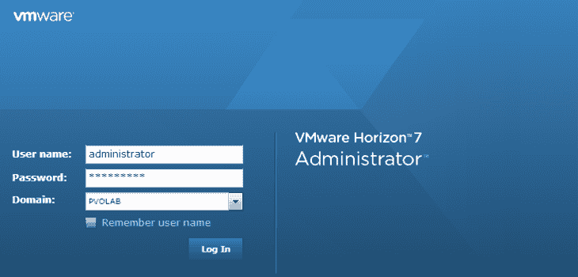

1.  使用为 View 管理员设置的管理员账户登录。你现在将看到 Horizon View 管理员仪表盘屏幕，如下图所示：

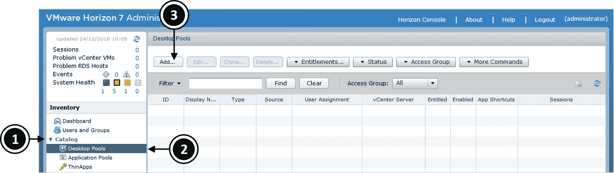

1.  从 Horizon View 管理员界面中，点击展开“目录”选项（**1**），然后点击“桌面池”（**2**）。然后在现在显示的桌面池窗格中，点击“添加...”按钮（3）。

1.  你现在将看到“添加桌面池”屏幕，从类型部分开始，在这里我们选择你想要创建的桌面池类型：

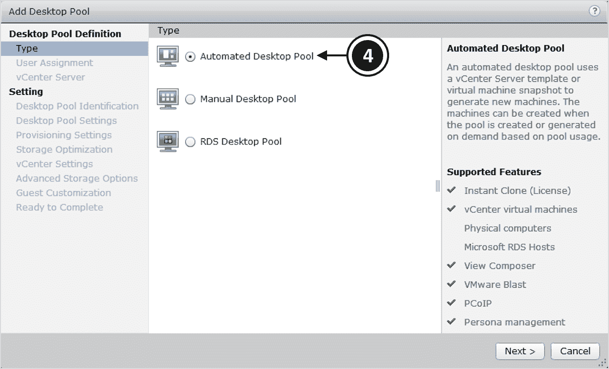

1.  选择“自动化桌面池”单选按钮（**4**）。在选择各种桌面池类型时，右侧的描述将发生变化，提醒你不同桌面池类型之间的区别以及每种桌面池所支持的功能。

1.  现在点击“下一步 >”按钮继续。

1.  你现在将看到用户分配屏幕，如下图所示：

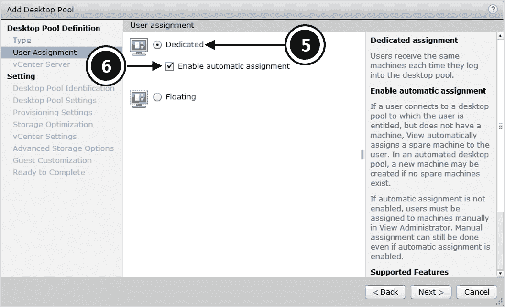

1.  选择“专用”单选按钮（**5**）。默认情况下，“启用自动分配”选项（**6**）将被选中。这意味着桌面将根据用户的登录顺序按先到先得的原则分配。如果由于某种原因，你需要确保某个用户分配到特定桌面，那么你需要取消选中此框，并手动为他们分配一个虚拟桌面机。

1.  点击“下一步 >”按钮继续配置。接下来，你将配置如何使用与此连接服务器关联的 vCenter 服务器构建虚拟桌面机，如下图所示：

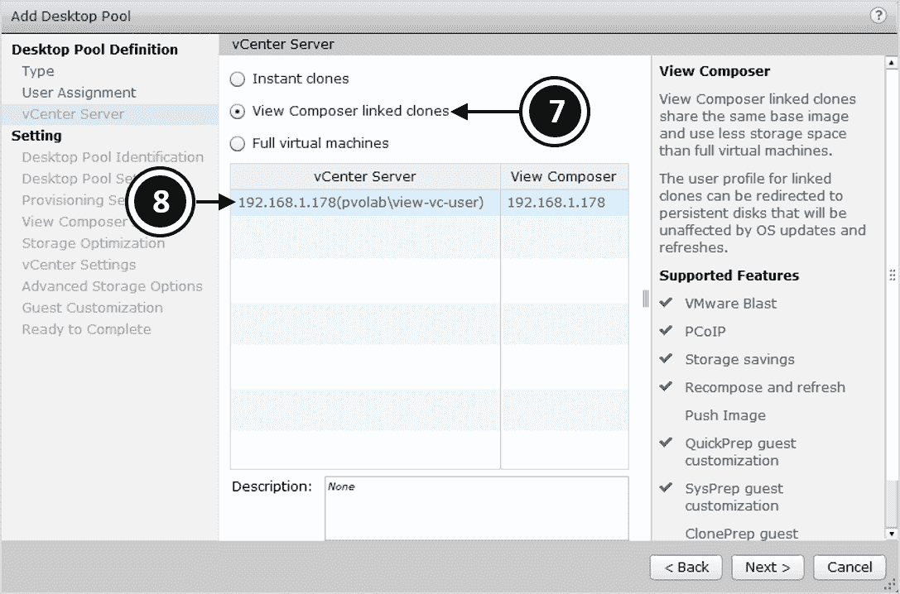

在此配置屏幕中，你可以选择构建即时克隆、View Composer 链接克隆或完整虚拟机。

1.  对于第一个桌面池，我们将使用链接克隆，因此选择“View Composer 链接克隆”单选按钮（**7**）。

1.  接下来，你需要从列表中选择相关的 vCenter 服务器。在示例实验室中，显示了 vCenter `192.168.1.178`，以及我们为 View 设置的 vCenter 用户账户（**8**）。

1.  点击“下一步 >”按钮继续配置。下一个配置屏幕是桌面池标识**，**如下面的截图所示：

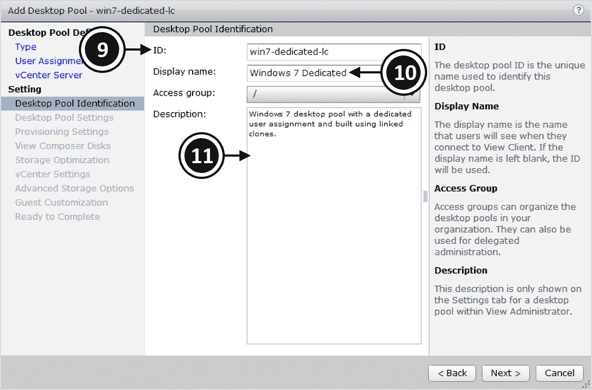

1.  在“ID”框（**9**）中，输入此桌面池的 ID。在示例实验室中，我们输入了 `Win7-dedicated-lc` 的 ID。

你只能在池 ID 中使用字符 *a*-*z*，*A*-*Z*，*0*-*9*，*-* 和 *_*。

1.  在“显示名称”框（**10**）中，输入此池的名称。请记住，显示名称是向最终用户展示的内容，因此确保给它起一个非技术性的名称，用户能够理解。

1.  最后，在描述框（**13**）中，输入描述详细描述桌面池及其用途。

1.  单击“下一页>”按钮以继续配置。现在您将看到桌面池设置配置屏幕，如以下截图所示：

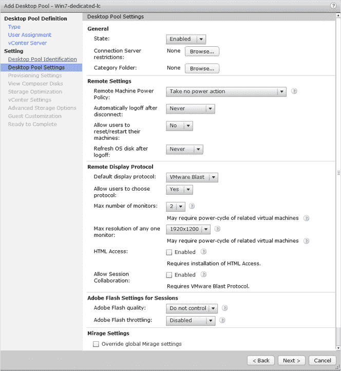

此配置页面是我们开始配置定义虚拟桌面机器在桌面池内行为方式的设置页面。它提供了用户连接前、使用虚拟桌面机器时以及断开连接后的配置选项。

在此屏幕上有多个配置选项，因此我们将它们分解为单独的部分。

# 常规设置

我们将首先通过以下步骤来配置“常规”设置：

1.  首先，在“常规”部分，您可以配置桌面池的状态。从下拉菜单中选择“启用”选项（**12**）以启用此池，这意味着有资格使用它的用户将可以使用其中的任何虚拟桌面机器，并且将在池内配置和提供给最终用户使用。如果将**状态**设置为已禁用，则不会配置虚拟桌面机器，并且不会向最终用户提供。如果您正在为用户预配置新的池，然后确认配置正确后再启用它，可能需要将**状态**设置为**禁用**：

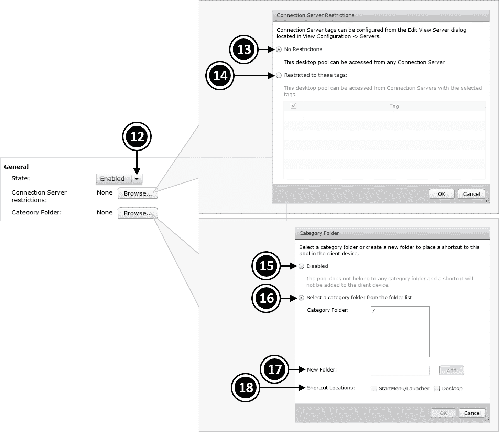

1.  在“常规”部分下的第二个选项是连接服务器限制，您可以选择与连接服务器关联的标签，以限制用户可以从哪里连接。单击“浏览…”按钮以配置这些限制。如果您希望允许从任何连接服务器访问此桌面池，则应单击“无限制”（**13**）的单选按钮。如果您单击“限制为这些标签”（**14**）的单选按钮，则会看到已配置标签的列表。只需从列表中突出显示所需标签，然后单击“确定”。

1.  常规部分下的最后一个设置是类别文件夹。此设置允许您将此桌面池的详细信息创建为快捷方式直接放到客户端设备上，以便终端用户可以轻松访问他们的资源。要配置此选项，请点击“浏览...”按钮。第一个单选框选项是禁用（**15**），用于关闭此功能。要启用该功能，请选择从文件夹列表中选择类别文件夹（**16**）。然后，您可以从列表中选择类别文件夹，或者通过在新文件夹框（**17**）中输入您想创建的文件夹名称来创建一个新的文件夹。输入名称后，点击“添加”按钮。最后，您可以选择快捷方式的位置（**18**）。您可以选择放置快捷方式的客户端设备的开始菜单/启动器或桌面。

1.  配置完选项后，点击“确定”按钮。

接下来需要配置的部分是远程设置。

# 远程设置

这些设置定义了虚拟桌面机器的电源状态，以及终端用户连接和断开连接时发生的情况。设置选项如下所示：

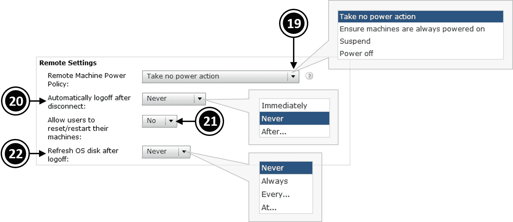

接下来，您可以配置以下远程设置选项：

1.  第一个选项是远程机器电源策略选项，用于定义用户连接和断开连接时虚拟桌面机器的电源状态。点击下拉菜单（**19**），您将看到以下选项：

    +   不采取任何电源操作：虚拟桌面机器将保持在最后的状态。例如，如果桌面保持开机状态，则它将继续保持开机。

    +   确保机器始终开机：虚拟桌面机器在被终端用户或管理任务关闭后，始终会恢复为开机状态。

    +   挂起：当用户注销时，虚拟桌面机器将被挂起。注意，**挂起**功能在使用 NVIDIA GRID vGPU 桌面时不可用。

    +   关机：当用户注销时，虚拟桌面机器将关机。

在配置电源策略时，最重要的是理解您的使用场景并选择合适的选项。例如，如果您有 200 个用户，计划在早上 9:00 的 10 分钟内登录，而桌面处于关闭或挂起状态，这可能会导致桌面恢复或开机时出现延迟并造成较大的性能峰值。或者，如果您使用的是基于班次的工作模式的专用桌面，并选择始终保持桌面开机，那么可能会导致桌面资源分配过多，甚至可能拥有比实际需要或使用更多的操作系统和软件应用许可。

1.  下一个设置是“断开连接后自动注销”（**20**）。此选项允许你定义当用户仅从桌面断开连接而未选择注销时发生的情况。点击下拉菜单查看以下可用选项：

    +   立即：当用户从虚拟桌面机器断开连接时，立即注销。

    +   永不：当用户从虚拟桌面机器断开连接时，绝不会注销。

    +   等待...：当用户从虚拟桌面机器断开连接时，在设定的时间后注销。你可以选择在多少分钟后桌面会被注销。

再次强调，如何配置此设置将很大程度上取决于用户如何使用桌面。你很少会选择在用户仅暂时断开桌面连接或因网络连接故障而被断开连接的情况下立即注销桌面。你应该至少给他们 5 到 10 分钟的时间窗口，以便他们重新连接，而不是直接注销他们。

1.  接下来的设置是配置“允许用户重置/重启他们的机器”（**21**）选项。如果此选项设置为“是”，则表示用户可以有效地使用重置按钮来硬重置他们的虚拟桌面机器。这是一个有用的功能，可以让最终用户在没有 IT 帮助的情况下执行故障排除步骤。然而，当最终用户认为他们只是重置终端设备时，而实际上他们是在重置虚拟桌面机器时，这可能会引起一些混淆。如果这是一个联接克隆桌面，那么他们可能最终会得到一个全新的虚拟桌面机器，这可能导致他们丢失任何当前的工作。

1.  本节的最后一个设置是“注销后刷新操作系统磁盘”（**22**）。由于此池将使用联接克隆镜像创建，因此此选项定义了当用户注销时，联接克隆的操作系统磁盘行为。

1.  要配置此选项，请点击下拉菜单查看以下可用选项：

    +   永不：操作系统磁盘永远不会自动刷新；这将导致联接克隆随着时间的推移不断增长，特别是如果在本向导的后期阶段没有配置持久磁盘和/或一次性磁盘的话。通过刷新操作系统磁盘，磁盘会刷新到创建桌面时拍摄的快照。如果没有持久磁盘、重定向的个人资料等，所有用户设置/数据将会丢失。

    +   始终：每次用户注销时，桌面都会被刷新。

    +   每...：允许你定义在多少天后桌面将被刷新。

    +   在...：允许你设置在操作系统磁盘使用率达到多少百分比时，桌面应被刷新。

再次，与其他配置设置一样，如何配置这些设置将很大程度上取决于你的使用案例和用户的工作方式。

本配置屏幕的下一个部分是配置**远程桌面协议**。

# 远程桌面协议设置

这些设置定义了虚拟桌面机器的交付协议的行为及任何用户可配置的选项。设置选项如下图所示：

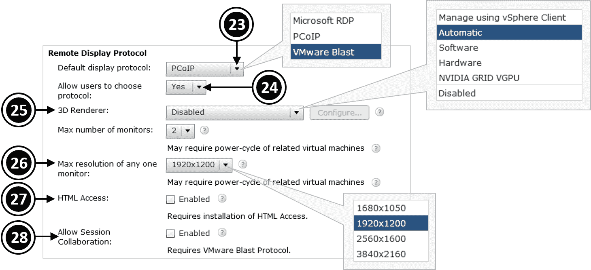

接下来，您可以配置远程显示协议的以下选项：

1.  远程显示协议部分的第一个选项是选择默认显示协议。从下拉菜单中(**23**)，您有 Microsoft RDP、PCoIP 或 VMware Blast 的选项。请注意，某些基于显示的功能取决于您选择的协议。例如，会议协作仅在使用 Blast 协议时可用。

1.  接下来，您有权限允许用户选择协议(**24**)。如果将此设置为“是”，则最终用户可以选择协议。通常，您会将 PCoIP 或 VMware Blast 作为默认协议，并且不允许最终用户更改，除非有特定的使用案例决定需要使用其他协议。例如，如果需要超过四个屏幕，则使用 RDP 协议，因为这是支持此功能的协议，或者最终用户可能处于一个非常严格的出站防火墙后面，阻止了 PCoIP 端口`4172`，因此无法查看其虚拟桌面机器。在这些使用场景中，允许最终用户更改默认协议意味着他们可以继续工作。

1.  然后，您可以选择桌面池希望使用的 3D 渲染器模型**(25)**。点击下拉箭头选择所需的 3D 渲染器。您有以下选项：

    +   使用 vSphere Client 进行管理：当您选择此设置时，**配置 3D 客户机的 VRAM**、**最大显示器数量**和**单个显示器的最大分辨率**配置设置在 Horizon 管理员中不可用。这些设置会通过 vSphere Web Client 进行管理。

    +   自动：启用 3D 渲染并由主机服务器管理，主机服务器会自动选择最佳模型进行使用。例如，主机服务器会在虚拟桌面机器启动时优先预留 GPU 资源。如果在虚拟桌面机器启动时没有可用的 GPU 资源，主机服务器将回退到使用基于软件的渲染。在灾难恢复（DR）场景中，此设置非常有用，因为灾难恢复站点的主机服务器未配置任何硬件 GPU 资源。这允许用户回退到软件渲染，从而继续工作。

    +   软件：主机服务器将始终使用软件 3D 图形渲染。

    +   硬件：主机服务器将根据先到先得的原则，在虚拟桌面机开启时保留 GPU 硬件资源。如果主机服务器有可用的硬件资源，则虚拟桌面机将无法启动。

    +   **NVIDIA GRID VGPU**：主机服务器将根据先到先得的原则，在虚拟桌面机开启时保留 GPU 硬件资源。如果用户登录并连接到一台虚拟桌面机，而 GPU 硬件资源已经分配给同一主机服务器上的另一台虚拟桌面机，则连接服务器会尝试将虚拟桌面机迁移到同一集群中的另一台主机服务器，并在获得资源后启动该虚拟桌面机。选择**NVIDIA GRID VGPU**选项后，你将无法使用“配置**VRAM 供 3D 客户机使用**”、“最大显示器数量”和“任意一台显示器的最大分辨率”设置。你还需要确保配置父虚拟桌面机或虚拟桌面机模板，以保留所有内存。

    +   禁用：关闭 3D 渲染。

1.  当选择一个有效的 3D 渲染器选项时（不适用于**NVIDIA GRID VGPU**或**使用 vSphere 客户端管理**），你会发现选择的模型旁边的“配置...”按钮已被激活。点击此按钮后，你将看到“配置 VRAM 供 3D 客户机使用”框，可以指定一个视频内存量，最大为 512 MB**，**如下面的截图所示：

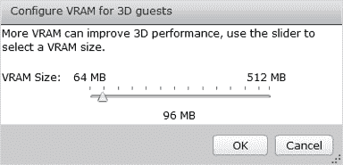

1.  下一个选项是选择最大显示器数量。如果点击下拉箭头，你可以选择 1、2 或 4 个显示器。请注意，此设置仅适用于 PCoIP 和 Blast 协议。当 3D 被禁用时，最大显示器数量和任意一台显示器的最大分辨率设置将决定分配给桌面池中虚拟桌面机的 VRAM 数量。值越大，关联的 ESXi 主机服务器将消耗的内存越多。

如果 3D 被禁用，在 Windows 7 客户操作系统上支持最多三个显示器，分辨率为 3,840 x 2,160，且 Aero 效果已禁用。对于其他操作系统或启用了 Aero 效果的 Windows 7，仅支持一个显示器在该分辨率下工作。当 3D 启用时，支持一个显示器，分辨率为 3,840 x 2,160。多个显示器最好在较低分辨率下使用。

1.  下一个选项是设置任意一台显示器的最大分辨率（**26**）。点击下拉箭头选择所需的分辨率，注意参考第 3 点中的讨论。

1.  接下来，你可以选择启用 HTML 访问（**27**）。要启用 HTML，勾选该框。请注意，连接服务器需要安装 HTML 访问才能正常工作。

1.  最后，你可以选择允许会话协作（**28**）。要启用此功能，请勾选复选框。会话协作允许此桌面池的用户邀请其他用户加入他们的会话。请注意，此功能仅适用于 VMware Blast 协议。

此配置屏幕的下一个部分是配置会话的 Adobe Flash 设置。

# Adobe Flash 设置

这些设置定义了 Adobe Flash 在虚拟桌面机器会话中的行为。设置选项如下图所示：

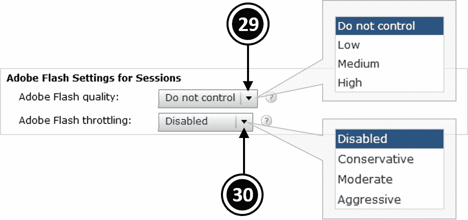

**Adobe Flash 设置（会话）**的配置选项详细描述如下：

1.  在 Adobe Flash 质量选项中，点击下拉菜单**（29）**选择可用选项：

    +   **不控制**：这允许网页决定最佳设置

    +   **低（默认）**：低质量意味着较少的带宽消耗

    +   **中**：中等质量意味着适中的带宽消耗

    +   **高**：高质量意味着更多的带宽消耗

1.  另一个可配置的设置是 Adobe Flash 的限速。Adobe Flash 默认通过计时器服务更新屏幕，以确定更新间隔。通过更改该时间间隔设置，可以控制屏幕更新的帧率，从而减少带宽需求。点击下拉菜单（**30**）选择可用选项：

    +   禁用：关闭限制

    +   保守：更新间隔设置为 100 毫秒

    +   适中：更新间隔设置为 500 毫秒

    +   激进：更新间隔设置为 2,500 毫秒

此配置屏幕的最后部分是配置 Mirage 设置。这些设置定义了 VMware Mirage 如何与虚拟桌面机器映像交互。设置选项如下图所示：

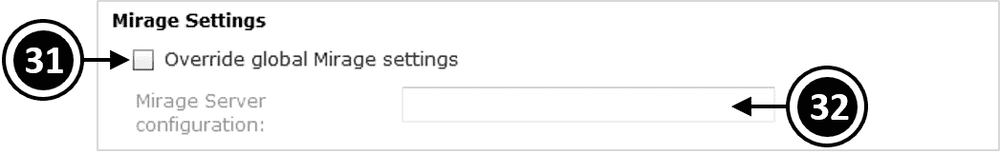

Mirage 设置在此处描述：

1.  这里唯一的选项是覆盖全局 Mirage 设置（31）。要启用覆盖功能，请勾选复选框。

1.  然后，在 Mirage 服务器配置框（**32**）中，输入你想使用的 Mirage 服务器的地址。想了解更多关于 VMware Mirage 的解决方案，可以阅读 Packt 出版的《*Learning VMware Mirage*》一书。

此设置仅适用于当前部署 Mirage 的用户，因为 Mirage 现已停止维护。

完成此屏幕上的配置设置后，点击下一步 > 按钮继续到下一个配置屏幕。下一个屏幕是配置**Provisioning Settings**（预配设置），如下图所示：

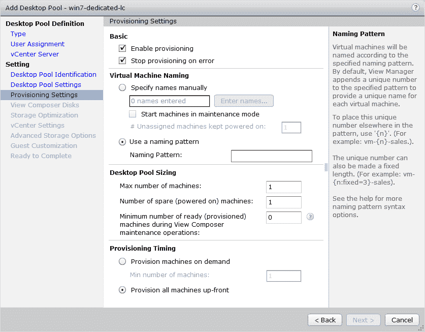

如之前所做，我们将把此屏幕分解为不同的配置部分，从基本部分开始，如下图所示：

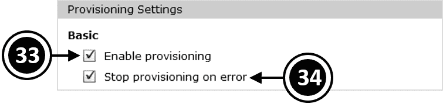

**Provisioning Settings**（预配设置）在此处描述：

1.  基本部分的第一个设置是启用配置。选中启用配置框（**33**）基本上就是开启配置。此设置意味着虚拟桌面机器可以根据配置设置进行配置。

1.  下一个设置是错误时停止配置（**34**）。选中此框表示如果在配置过程中出现错误，配置将停止。这非常重要，因为与其继续配置已经出错的数百台虚拟桌面机器，您可能更希望停止配置，先解决问题后再继续。

下一个配置部分是虚拟机命名，如下图所示：

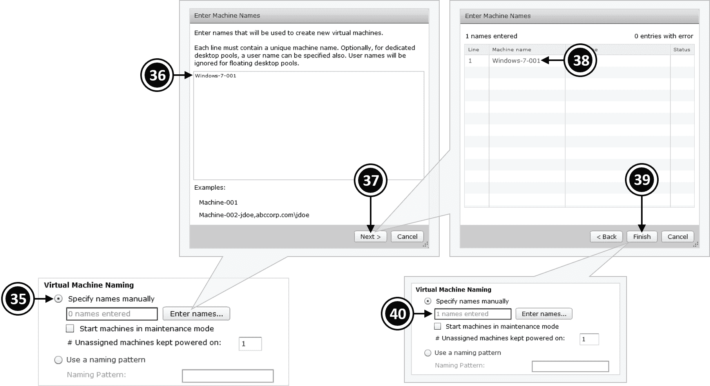

在此部分中，有两个选项用于配置新建虚拟桌面机器的命名方式，手动或自动。我们这里提到的名称是机器名称，稍后也会作为计算机账户出现在活动目录中。考虑到这一点，选择合适的命名规范是值得的。

在第一个示例中，我们将先查看手动选项，然后再配置命名模式方法，因为除非有特殊原因需要为虚拟桌面机器指定唯一的非连续名称，否则该方法是命名虚拟桌面机器的推荐方式。要做到这一点，请执行以下步骤：

1.  点击“手动指定名称”单选按钮（**35**）。

1.  现在您将看到“输入机器名称”框。在空白框中（**36**）输入第一个虚拟桌面机器的名称。在这个例子中，我们将该机器命名为`Windows-7-001`。如果该机器将用于专用分配，您还可以为其添加用户名。因此，在这个实验室例子中，我们可以将该机器名称输入为`Windows-7-001,pvolab.com\peter`。

1.  根据需要继续输入机器名称，然后点击“下一步 >”（**37**），当您输入完所有想要添加的机器名称后。

1.  现在您将看到已输入的名称列表（**38**）。您可以选择返回继续输入更多名称，或者如果已完成输入名称，点击“完成”按钮（**39**）。

1.  最后，您将返回到虚拟机命名屏幕，在那里您将看到现在显示已输入 1 个名称（**40**），以显示手动输入了多少台机器名称。

1.  在手动部分下，您还可以进行其他几个配置选项。您可以启用“以维护模式启动机器”，这允许在用户登录之前手动自定义虚拟桌面机器。此模式必须手动退出。您还可以选择配置“未分配的机器保持开启”。这允许您保持虚拟桌面机器的开机状态，即使它们尚未分配给最终用户。此选项可以让您快速分配已经构建和定制好的机器，从而加快过程。

现在我们已经了解了如何手动输入机器名称，接下来我们将看看使用命名模式的选项，如下图所示：

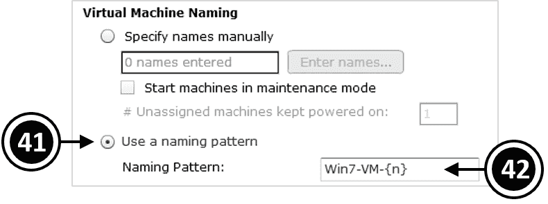

使用以下设置配置虚拟机命名：

1.  单击“使用命名模式”（**41**）的单选按钮。

1.  在命名模式框（**42**）中，输入虚拟桌面机器的名称。在本示例实验室中，对于这个池，我们将输入 `Win7-VM-{n}`。这样，虚拟桌面机器将命名为 `Win7-VM-1`、`Win7-VM-2` 等，直到你指定的要构建的机器数量为止。通过在机器名称中使用 `{n}`，Horizon View 将在所需位置为名称添加一个数字。如果添加 `{n:fixed=2}`，则允许使用两位数字，`{n:fixed=3}` 用于三位数字，以此类推。这将确保桌面按数字顺序排列。

接下来的部分是**桌面池大小**部分。

# 桌面池大小

在本节中，你可以指定已创建和配置的虚拟桌面机器数量，如下图所示：

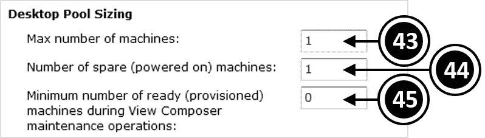

使用以下设置配置桌面池大小：

1.  在最大机器数量框（**43**）中，输入该桌面池中可以配置的最大机器数量。这将设置此桌面池中虚拟桌面机器的数量限制。

1.  接下来是备用（开机）机器数量的设置。在框中（**44**），输入应保持开机状态并等待用户连接的机器数量。

1.  最后，在本节中是“视图编排器维护操作期间的最小准备（已配置）机器数量”选项。你可以在此输入希望在维护操作期间仍然可用的虚拟桌面机器数量（**45**）。例如，如果你启动了重新编排操作，Horizon View 可以确保仍有最少数量的虚拟桌面机器供最终用户登录。

配置这些选项的方式对你在视图解决方案中的池成功至关重要。你需要确保有足够的虚拟桌面机器可供用户在需要时使用。这也意味着，即使在维护操作期间，你也能确保满足用户需求。

最后需要配置的部分是“配置时间”。你可以选择按需配置机器，即用户登录并请求时配置机器，或者提前预配置机器，如下图所示：

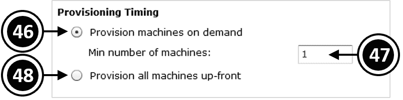

让我们从配置开始：

1.  要按需配置，请点击“按需配置所有机器”的单选按钮（**46**）。这意味着虚拟桌面机器将在预先准备好并能够让用户连接和登录的状态下创建和配置。你可以在“最小机器数量”框中选择需要的机器数量（**47**）。如果选择按需配置，那么你需要确保已经预先配置了足够的桌面，以满足用户需求而不造成长时间延迟。这就是确保预先配置的桌面数量与剩余的备用桌面数量之间的平衡。

1.  在示例实验室中，我们将预先配置，所以点击“预先配置所有机器”的单选按钮（**48**）。如果你打算预先配置所有虚拟桌面机器，你需要确保在增加虚拟桌面机器数量导致性能提升的同时，不会对终端用户产生影响。

完成此屏幕上的配置设置后，点击“下一步 >”按钮继续到下一个配置屏幕。由于这个桌面池将使用从链接克隆创建的虚拟桌面机器，因此下一个配置屏幕是 View Composer 磁盘配置屏幕，如下图所示：

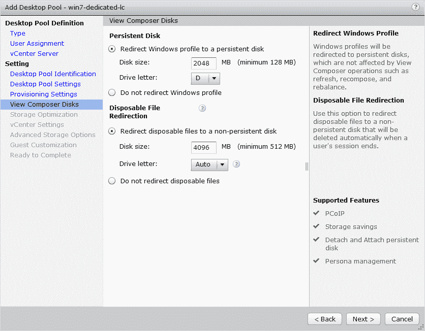

在这个配置界面中，有两个选项。一个是操作系统用于配置持久磁盘，另一个是可丢弃文件重定向。你需要仔细考虑是否在桌面池架构中需要使用这些设置，并且还要根据是否计划使用额外的 VMware 或第三方解决方案来提供相同功能。

第一个要配置的部分是持久磁盘（**），**如下面的截图所示：

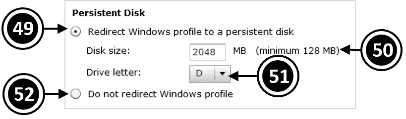

使用持久磁盘时，Windows 配置文件将被重定向到一个专用磁盘，即使操作系统磁盘在 View Composer 操作中被刷新，该磁盘仍会保留。这是保护用户配置的一个很好的方式。然而，你也可能希望调查其他解决方案，如 VMware View Persona Management、VMware UEM 或 Liquidware ProfileUnity，它们能够提供类似的功能，甚至更强大：

1.  要配置此设置，请点击“将 Windows 配置文件重定向到持久磁盘”的单选按钮（**49**）。

1.  在“磁盘大小”框中（**50**），输入持久磁盘的大小。

1.  最后，在驱动器字母下拉框中（**51**），你可以为这个持久磁盘选择一个驱动器字母。

1.  要禁用配置文件重定向，或者如果你正在使用其他配置文件管理工具，请点击“不要重定向 Windows 配置文件”的单选按钮（**52**）。

下一个要配置的部分是一次性文件重定向。一次性磁盘包含所有页面和临时文件，并在每次桌面重启后刷新。这是减少桌面刷新之间链接克隆大小的好方法。一旦配置好一次性文件重定向，相关设置将显示在以下截图中：

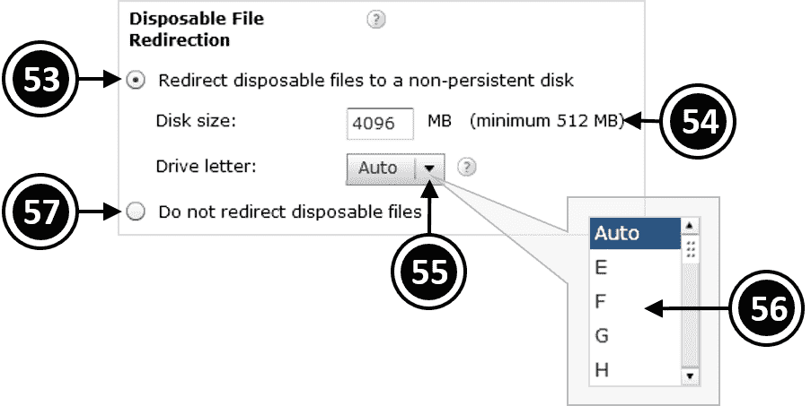

要配置**一次性文件重定向**设置，请执行以下步骤：

1.  点击单选按钮，将 Windows 配置文件重定向到持久磁盘（**53**）。

1.  在磁盘大小框（**54**）中，输入持久磁盘的大小。

1.  最后，在驱动器字母下拉框中，您可以为该持久磁盘选择一个驱动器字母。如果您点击箭头（**55**），您将看到驱动器字母选项（**56**）。分配给一次性磁盘驱动器的字母不一定会显示给最终用户。

1.  要禁用一次性文件重定向功能，请点击不重定向一次性文件（**57**）的单选按钮。

在配置这些时，确保根据您的使用场景设置适当的大小。这里的 POC 或桌面评估将帮助您了解这些磁盘的大小需求。诸如是否使用 Outlook 本地缓存等因素，可能会大幅影响持久磁盘的大小。

1.  完成此屏幕上的配置设置后，点击“下一步 >”按钮，继续到下一个配置屏幕。

下一个配置屏幕是存储优化。在此屏幕上，您可以配置有关存储管理和操作系统、持久磁盘及副本磁盘放置的高级选项。您可以选择为此桌面池中虚拟桌面创建的各种磁盘的位置。Horizon View 有效地允许您分层存储，因此，根据您的存储设计，您可能希望将副本映像放置在更快的本地 SSD 存储上，将操作系统磁盘放置在另一层存储上，如机械硬盘。

这些配置选项显示在以下截图中：

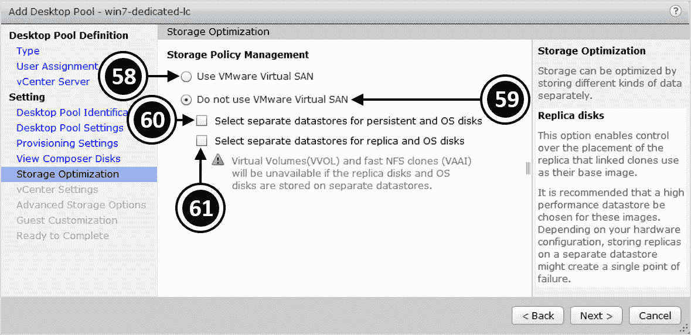

要配置**存储策略管理**设置，请执行以下步骤：

1.  此屏幕上的唯一选项是配置存储策略管理，从 VMware Virtual SAN 开始。要启用 VSAN，点击使用 VMware Virtual SAN（**58**）的单选按钮。由于我们在示例实验室中未配置该项，因此我们将点击不使用 VMware Virtual SAN（**59**）的单选按钮。

1.  接下来，您可以配置不同类型磁盘的存储位置。这里有两个选项。第一个是为持久磁盘和操作系统磁盘选择不同的数据存储（**60**）。这允许持久磁盘和操作系统磁盘存储在不同的数据存储中。第二个选项是为副本磁盘和操作系统磁盘选择不同的数据存储（**61**）。建议为这些镜像选择高性能的数据存储，如基于闪存的阵列。根据您的硬件配置，将副本磁盘存储在单独的数据存储上可能会创建单点故障。

1.  勾选相关框以配置要存储不同磁盘的位置，或者保持框未选中以使用单一数据存储来存储所有磁盘。由于示例实验室只有一个数据存储，我们将保持未选中状态。

下一个配置屏幕是**vCenter 设置**配置屏幕。

# vCenter 设置

在**vCenter 设置**屏幕上，我们将选择用于构建虚拟桌面机器的父虚拟机，然后选择将要运行它们的位置和资源。因此，配置选项分为三类。默认镜像、虚拟机位置和资源设置**，**如下图所示：

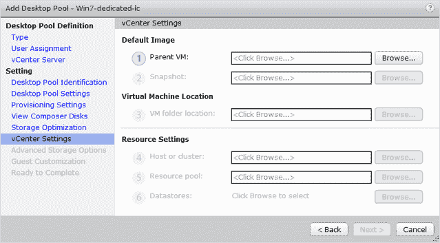

首先要配置的是将作为父镜像创建虚拟桌面机器的默认镜像的详细信息，用于该桌面池。此部分如下图所示：

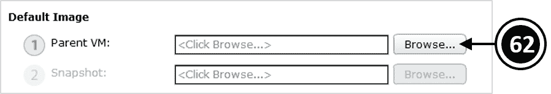

那么，我们从配置开始：

1.  在第一个框，父虚拟机上，点击浏览...按钮（**62**）。现在您将看到**选择父虚拟机**框，如下图所示：

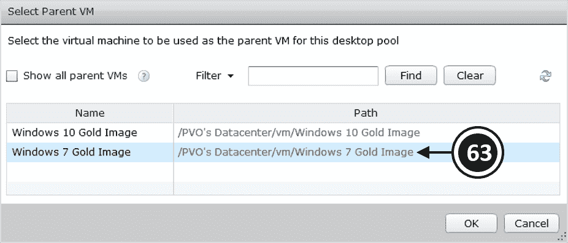

1.  现在，您将看到一个有效的父虚拟机列表。有效的意思是这些将是包含快照并已安装 Horizon View Agent 的虚拟机。默认过滤掉的虚拟机包括运行在 ESX/ESXi 主机上的版本低于 4.0 的虚拟机、没有快照的虚拟机、不支持的客户操作系统的虚拟机、已经被其他桌面池使用的虚拟机以及 View Composer 副本。您可以通过点击显示所有父虚拟机按钮将这些虚拟机添加到配置中。但是，如果它们不兼容，您将无法选择它们。

1.  使用示例实验室显示的镜像是我们之前创建的黄金镜像。由于我们正在构建 Windows 7 桌面池，因此我们将使用 Windows 7 父机器，所以选择 Windows 7 黄金镜像**(63)**条目。

1.  一旦选择了要使用的父虚拟机，请点击确定以继续。

1.  您现在将返回到 vCenter 设置屏幕，在那里我们可以配置“默认映像”部分的第二个选项。您还将看到“父虚拟机”框（**64**）现在已填入 Windows 7 金像版详细信息，如下图所示：

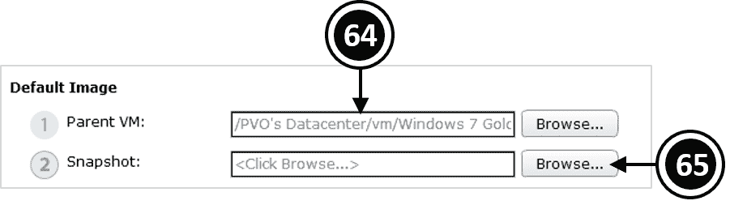

1.  由于这是一个链接克隆虚拟桌面机器，下一个配置任务是配置从父映像创建的快照的详细信息。

1.  在快照框上，单击“浏览...”按钮（**65**）。现在您将看到“选择默认映像”框，如下图所示：

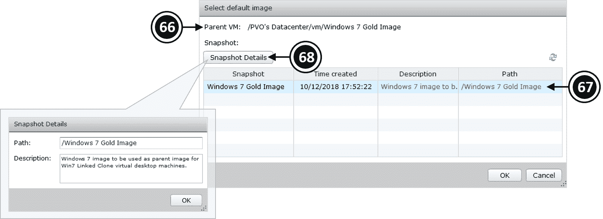

1.  您首先可以看到父映像的详细信息（**66**）。

1.  下面，您将看到从此父虚拟机创建的快照列表。在这种情况下，我们只有一个快照，即 Windows 7 金像版的快照，我们将点击选择（**67**）。如果您有多个此映像的快照，则所有这些快照都将列出，以便您选择正确的一个。

1.  当您单击快照时，您将看到“快照详细信息”按钮（**68**）现在可供单击。如果您单击此按钮，则将显示快照的完整详细信息，如所示。单击“确定”关闭“快照详细信息”框。

1.  单击“选择默认映像”框上的“确定”以完成配置。

1.  您现在将看到快照已添加，如下图所示：

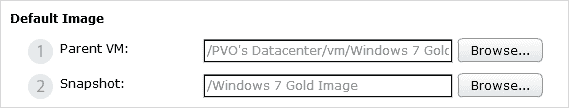

**vCenter 设置**的下一部分是虚拟机位置设置，如下面的屏幕截图所示：

要继续，请执行以下步骤：

1.  在 VM 文件夹位置框中，单击“浏览...”按钮（**69**）。

1.  您现在将看到“选择存储 VM 的文件夹”框，如下图所示：

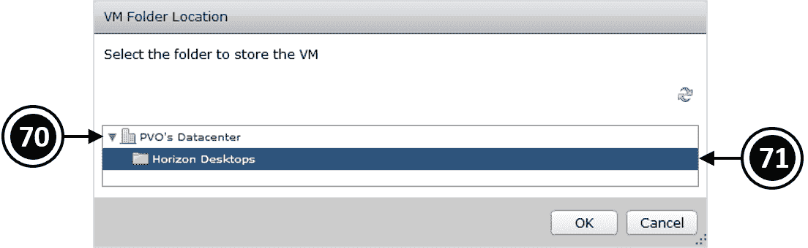

1.  单击箭头（**70**）扩展 PVO 的数据中心，然后选择要创建虚拟桌面机器的文件夹。在示例实验中，此文件夹已命名为 Horizon Desktops（**71**）。

您可能希望考虑为虚拟机创建文件夹结构，以帮助管理；否则，您可能会创建成百上千个不同的虚拟桌面机器，这些机器位于不同的池中，但都在同一个文件夹中。

1.  单击“确定”继续。

1.  您将返回到 vCenter 设置屏幕，现在可以看到已添加 VM 文件夹位置，如下图所示：

下一个配置部分是用于托管和运行池中虚拟桌面机器的资源：

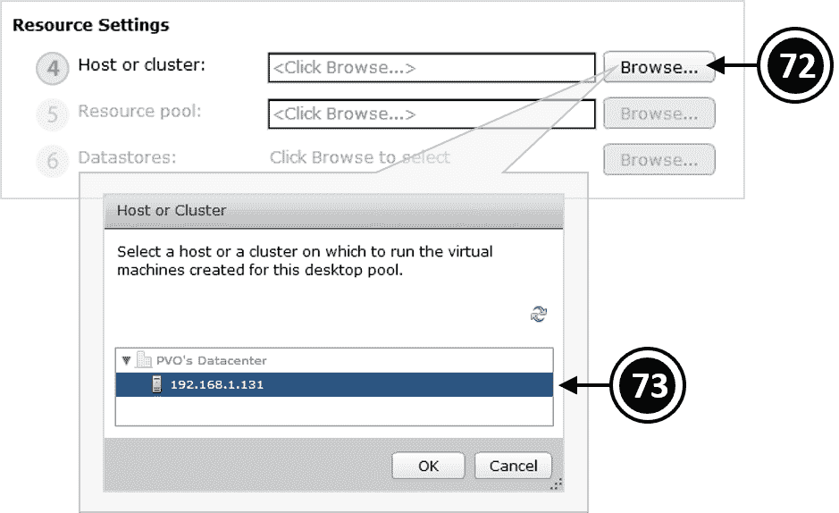

显示的选项如下：

1.  首先，在“主机或集群”框中，单击“浏览...”按钮（**72**）。

1.  然后，您将看到 Host 或 Cluster 框出现，列出了可用的主机资源。主机资源就是可用的 ESXi 服务器。在此示例中，我们可以看到示例实验室 ESXi 服务器的 IP 地址。

在生产环境中，本部分配置所使用的托管基础设施将是桌面块托管基础设施的一部分。

1.  点击 IP 地址 `192.168.1.131` (**73**)。

1.  点击 OK 继续。

1.  您现在将返回到 vCenter 设置界面，在那里您会看到 Host 或 Cluster 已被添加，如下图所示：

1.  接下来，我们将配置此桌面池的资源池以供使用。

1.  在 Resource pool 框中，点击 Browse... 按钮 (**74**)。您现在将看到选择一个资源池以供此桌面池使用的框，您可以从中选择资源池，如下图所示：

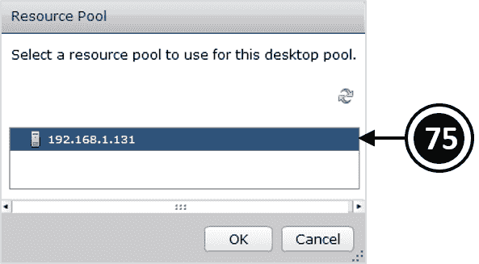

1.  示例实验室的资源池再次是 ESXi 主机服务器，因此点击 IP 地址 `192.168.1.131` 从列表中选择此项 (**75**)。

1.  点击 OK 继续。

1.  您现在将返回到 vCenter 设置界面，在那里您会看到资源池已被添加，如下图所示：

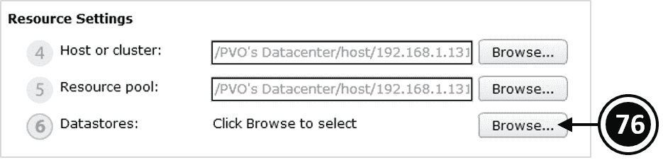

本节中的最终配置选项是 **Datastores**。在示例实验室中，我们使用的是单一数据存储，它是在 **Storage Optimization** 设置界面中选择的。如果您选择将不同的磁盘放置在不同的数据存储上，那么现在您将看到配置操作系统磁盘数据存储、持久磁盘数据存储和副本磁盘数据存储的位置选项：

1.  在 Datastores 框中，点击 Browse... 按钮 (**76**)。

1.  您现在将看到 **选择链接克隆数据存储** 配置界面，显示所有可用的数据存储，如下图所示：

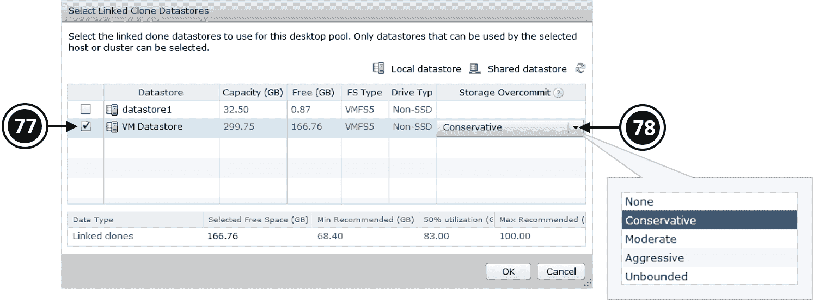

1.  勾选 VM Datastore 框 (**77**)。然后，您可以选择配置存储超分配。超分配级别表示乘以完整桌面容量的乘数，从而确定要在数据存储中允许的数量。

1.  要配置超分配，点击下拉菜单 (**78**)，然后您可以从以下选项中选择：

    +   None: 不允许超分配

    +   Conservative: 允许四倍超分配

    +   Moderate: 允许七倍超分配

    +   Aggressive: 允许 14 倍超分配

    +   Unbounded: 没有任何限制

1.  例如，如果您的完整桌面大小为 10 GB，且您有 100 GB 的数据存储，那么选择 None 将允许您配置 10 个桌面，Conservative 将允许您配置 40 个桌面，Moderate 将允许您配置 70 个桌面，Aggressive 将允许您配置 150 个桌面，而 Unbounded 则没有任何限制。

在选择如何配置过度提交设置时需要小心，唯一真正判断的方法是通过在 POC 期间监控链接克隆的增长情况。

1.  配置完成后，点击 OK 按钮。您将返回到 **vCenter 设置** 配置屏幕，在该屏幕上，您将看到已输入的链接克隆数据存储详细信息，显示文本 1 selected (79)**，**如以下截图所示：

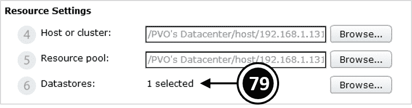

1.  **vCenter 设置**配置完成后，点击 Next > 按钮继续进入下一个配置屏幕。

下一个配置屏幕是 **高级存储选项**。

# 高级存储选项

在下一个屏幕中，我们将配置 **高级存储选项**，如以下截图所示：

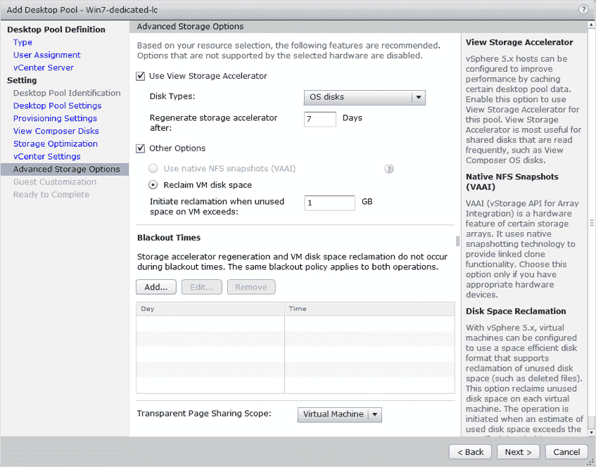

在此配置屏幕的第一部分，您可以配置视图存储加速器以及如何管理磁盘空间。视图存储加速器允许您配置桌面池，以使 ESXi 主机（vSphere 5.x 或更高版本）缓存虚拟机磁盘数据。此功能使用 ESXi 主机服务器的 **基于内容的读取缓存** (**CBRC**) 功能。视图存储加速器（或 VSA）减少了磁盘 IOPS，从而提高了启动风暴期间的性能。

启动风暴发生在大量虚拟桌面机同时启动并启动时，它们会同时进行病毒扫描。当管理员或用户频繁加载应用程序或数据时，此功能也非常有益：

1.  要启用视图存储加速器，请选中“使用视图存储加速器”框 (**80**)，如以下截图所示：

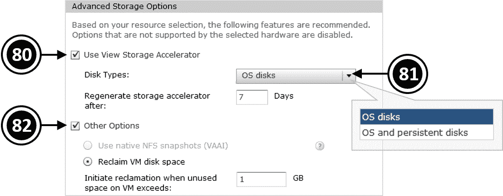

1.  在磁盘类型部分，您可以选择希望视图存储加速器应用于哪些特定磁盘。在下拉菜单中 (**81**)，您可以选择操作系统磁盘或操作系统和持久磁盘。在示例实验室中，我们将选择操作系统磁盘选项。

1.  在启用再生存储加速器后，您可以指定何时重新生成已缓存的数据的时间限制。这基本上是清除缓存并重新构建它。默认情况下，这个时间设置为`7`天。

1.  如果您选中其他选项框 (**82**)，这里有两个选项。第一个，在示例实验室中为灰色显示，是用于 **使用本地 NFS 快照** (**VAAI**)。VAAI 或 vStorage API for Array Integration 是集成到特定硬件阵列中的硬件功能。它使用本地快照技术提供链接克隆功能。只有在您有支持 VAAI 的硬件设备时，才会选择此选项。在示例实验室中它是灰色显示的，因为我们没有支持的设备。

1.  本节中的下一个选项是回收虚拟机磁盘空间。托管在 vSphere 5.x 及更高版本上的虚拟桌面机器可以配置为使用一种节省空间的磁盘格式，该格式支持回收未使用的磁盘空间（例如删除的文件）。启用此选项（通过点击单选按钮）会回收每台虚拟机上未使用的磁盘空间，并且当估算的已用磁盘空间超过此设置中指定的磁盘大小时，回收操作会被触发。默认情况下，此阈值设置为`1` GB。

1.  高级存储选项下的下一个设置是配置缓存重建和空间回收的停机时间。此设置应确保这些操作不会安排在工作时间进行，避免影响用户。停机时间配置框如下图所示：

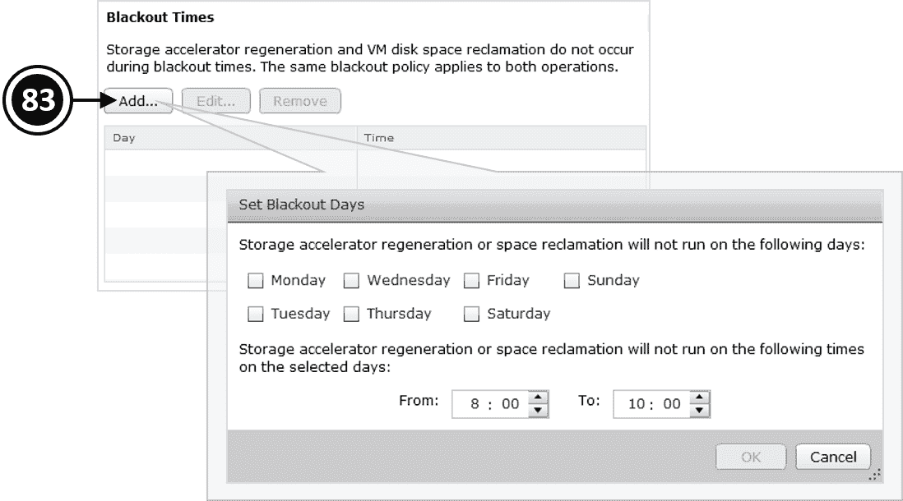

1.  点击“添加...”按钮（**83**）以添加停机时间。

1.  接下来，你将看到“设置停机日期”配置框。在这里，你可以通过勾选框来选择你**不希望**运行重建或空间回收任务的日期。你还可以选择特定的时间段不运行这些任务。

1.  配置好停机日期和时间后，点击“确定”。你将返回到停机时间配置框，在此框中会显示你配置的时间，如下图所示：

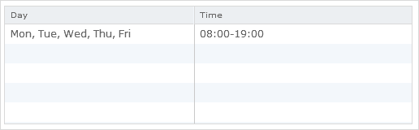

1.  在这个例子中，我们已配置了工作日的停机时间，时间为`08:00`至`19:00`。你还可以添加额外的停机时间，或删除和编辑现有的配置。

高级存储选项下的最后一个设置是配置透明页共享范围（**Transparent Page Sharing Scope**），如下图所示：

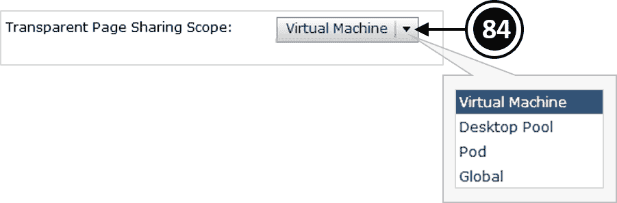

什么是透明页共享（TPS）？TPS 是一种用于虚拟化解决方案的内存管理技术。在桌面虚拟化中，你可能在运行成千上万的相同操作系统副本，它们都消耗内存并使用完全相同的内存页面。TPS 会将主机服务器上冗余的内存页面减少到单一页面。ESXi 虚拟化程序会查找这些重复的页面，如果它在同一主机服务器上的多个虚拟机（VM）中发现相同的内存页面，它会共享这单一页面给虚拟桌面机器，并设置内存指针来回指向该页面。这是更加高效的内存使用方式，并释放空间以允许更多的虚拟桌面运行。

1.  从下拉菜单中（**84**），选择 TPS 的作用范围。你可以选择在虚拟机之间、桌面池中的虚拟桌面机器、一个 Pod 中的虚拟桌面机器，或全局范围内共享内存。

1.  配置完**高级存储选项**后，点击“下一步”按钮。

下一个配置屏幕是访客自定义**，**如下图所示：

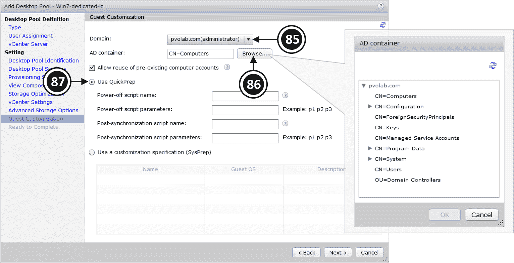

在此配置屏幕上，您可以配置虚拟桌面机器在 Active Directory 中的位置，并定制访客操作系统：

1.  在域部分，在下拉菜单中 (**85**)，选择您希望机器帐户所在的域。在示例实验室中，这是我们的`pvolab.com`域。

1.  接下来，您可以选择您希望机器帐户所在的 AD 容器。默认设置为计算机容器，因此您会看到`CN=Computers`。要更改此设置，请点击浏览...按钮 (**86**)。

1.  您现在将看到 AD 容器框。如果您展开域，您将看到所有容器，因此请选择您希望存储通过此桌面池创建的虚拟桌面的适当容器。例如，这个桌面池可能用于技术部门，因此您可能在 AD 中有一个反映这一点的容器。值得创建一个反映您组织结构的文件夹/容器结构，使得管理虚拟桌面机器更容易，而不是将它们全部放在标准计算机容器中。

1.  点击以突出显示您想要使用的容器，然后点击确定。

1.  您现在将返回到访客自定义屏幕。

1.  勾选允许重用现有计算机帐户的复选框。这允许您重用现有的 AD 计算机帐户，如果新创建的链接克隆的虚拟桌面机器名称与现有计算机帐户名称匹配。这在创建非持久桌面时特别有用。

1.  接下来，点击使用 QuickPrep 的单选按钮 (**87**)。QuickPrep 将允许您比 Sysprep 更快速地准备桌面。然而，它不会创建唯一的 SID。Sysprep 会创建一个新的 SID，但每个桌面的准备时间会更长。您选择使用哪个将取决于您的使用场景。建议您在 POC 期间测试配置。作为 QuickPrep 的一部分，您还可以指定附加脚本以及您希望用于这些脚本的任何参数。

1.  最终选项是使用 SysPrep 而不是 QuickPrep。要使用此功能，请点击使用自定义规范（SysPrep）的单选按钮。这将利用来自 vCenter 服务器的现有脚本。在以下示例中，我们使用了一个名为**虚拟桌面自定义**的预构建脚本：

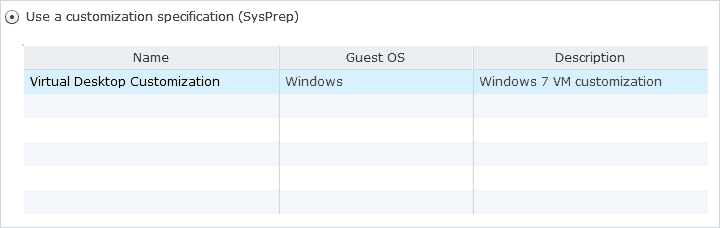

1.  要使用此脚本，请点击以高亮显示它。在示例实验室中，我们将使用 QuickPrep，因此请确保选择此选项。

1.  配置完成后，点击下一步按钮。

1.  您现在将看到最后一个屏幕，即“准备完成”屏幕，如下图所示：

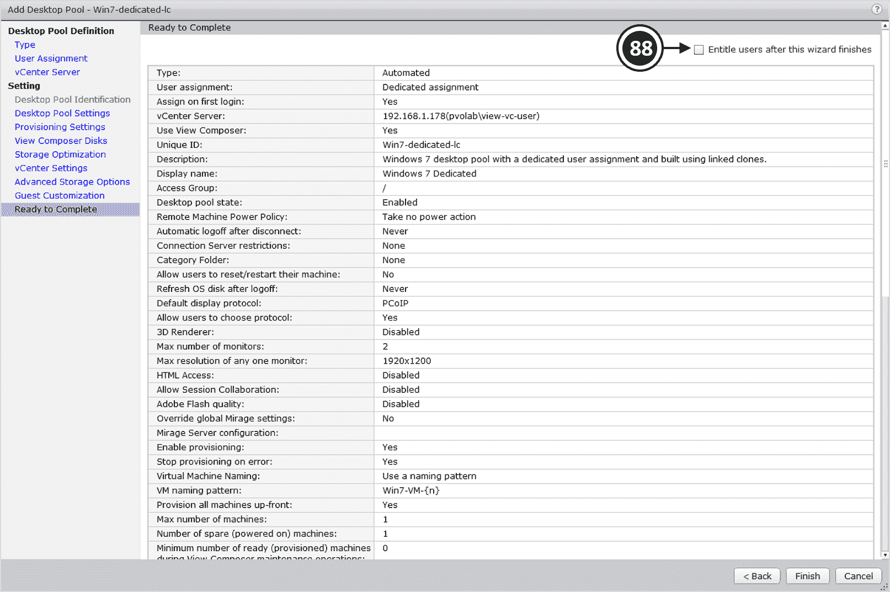

审查您的配置设置，然后点击完成按钮以创建桌面池。

你还可以选择勾选“向用户授权此向导完成后”框（**88**），这样会自动启动授权配置屏幕，方便你将虚拟桌面机器的访问权限分配给终端用户。不过，在示例实验室中，我们将在稍后，创建一些额外的桌面池后再进行此操作。

现在你会看到桌面池已经创建，如下图所示：

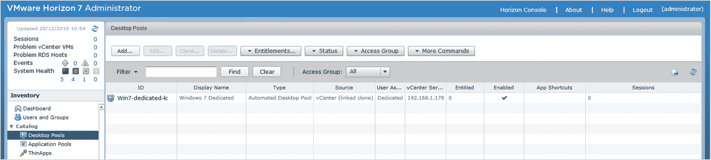

你还将在 vCenter Server 上看到，链接克隆的文件夹结构已经设置完毕。你会看到在 `Horizon Desktops` 文件夹下，出现了一个名为 `Win7-dedicated-lc` 的新文件夹，其名称反映了你为池输入的 ID。将要构建的虚拟桌面机器将存放在这个文件夹中。如图所示：

在下一部分，我们将向你展示如何创建另一个桌面池，但这次我们将使用 Horizon 控制台，而不是 View 管理员。

# Horizon 控制台方法

除了当前的 Horizon View 管理员管理控制台外，还有一个新的基于 Web 的控制台。这个控制台叫做 **Horizon 控制台**。然而，在撰写本书时，Horizon 控制台还不支持一些功能，包括以下内容：

+   自动化、浮动分配的完整虚拟机池

+   自动化链接克隆桌面池

+   自动化链接克隆池

+   克隆自动化桌面池

+   云端集群架构配置

+   手动桌面池

+   ThinApp 应用程序

在这一部分，我们将创建与之前相同的桌面池，但这次使用 Horizon 控制台。我们将通过截图和配置选项进行讲解，但有关每个配置选项的更多详细信息，请参阅前一部分。

第一步是启动 Horizon 控制台。可以通过两种方式来完成。第一种方式是登录到经典的 View 管理员，并点击 Horizon 控制台的链接（**1**），如下图所示：

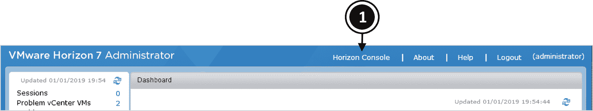

另一种方式是通过浏览器直接访问连接服务器的 URL，但这次需要在 URL 后添加 `/newadmin`。例如，在实验室中，你可以输入 `https://hzn7-cs1/newadmin`。然后你将看到登录界面，如下图所示：

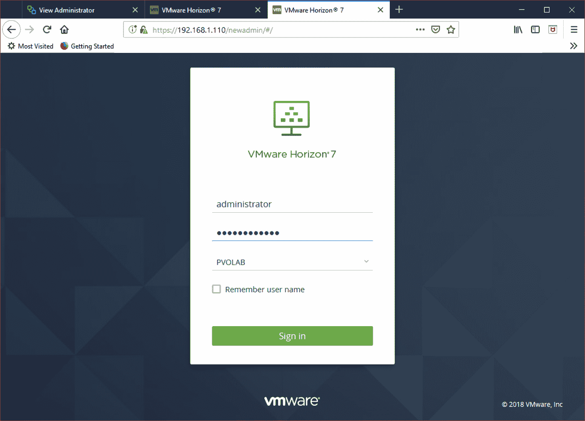

输入用户名和密码，确保从下拉菜单中选择正确的域，然后点击绿色的登录按钮。现在你已经登录，接下来将看到 **Horizon 控制台** 主屏幕，如下图所示：

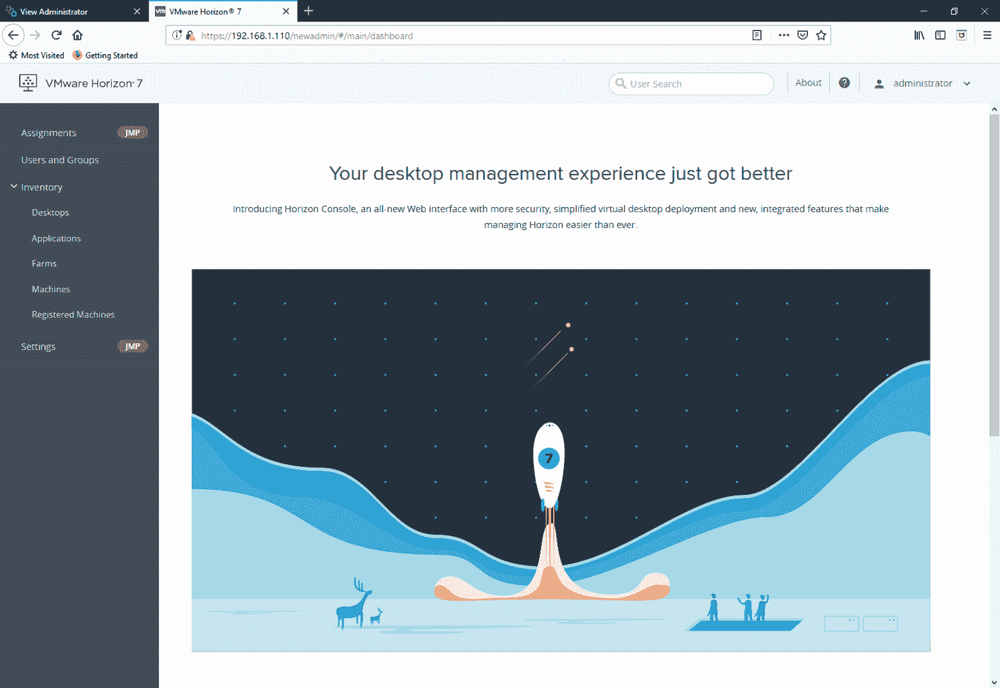

我们现在将通过以下步骤配置桌面池：

1.  与经典的 View Administrator 控制台不同，在 Horizon Console 中，桌面池属于桌面类别，因此，在左侧菜单选项中，展开“库存”，然后点击“桌面”**（2）**。您现在将看到**桌面池**配置屏幕，如下图所示：

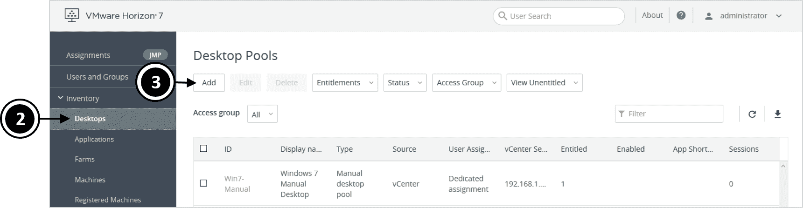

1.  点击添加按钮**（3）**。您现在将看到“添加池”屏幕，第一部分会被高亮显示为类型**，**如下图所示：

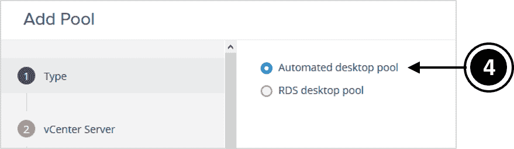

1.  点击“自动化桌面池”**（4）**。请记住，目前没有配置手动桌面池的选项。

1.  点击“下一步”以继续。

1.  现在，您将进入列表中的下一个项目：vCenter 服务器**，** 如下图所示：

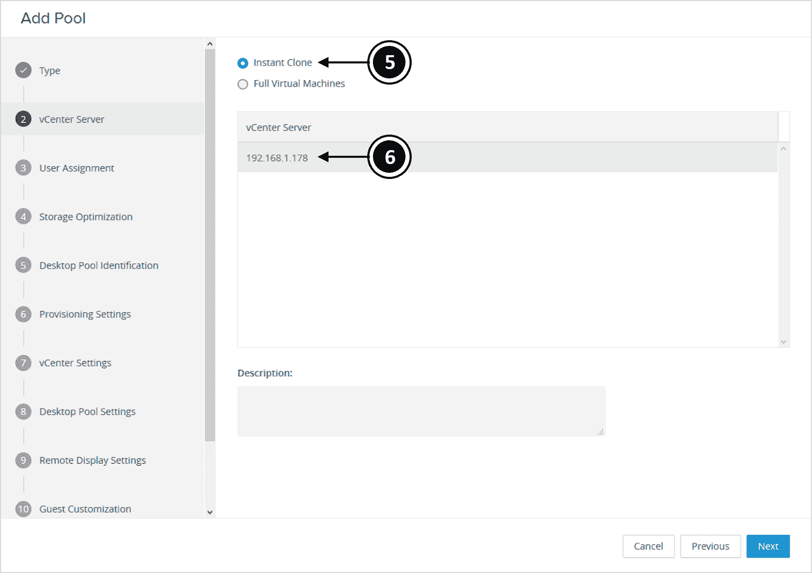

1.  点击即时克隆单选按钮**（5）**。请记住，本示例实验室中使用的 Horizon Console 版本当前不支持链接克隆配置。

1.  接下来，从列表中选择您希望用于创建即时克隆的 vCenter 服务器。在示例实验室中，vCenter 服务器是通过其 IP 地址列出的，因此点击`192.168.1.178`**（6）**，然后点击“下一步”以继续。您现在将看到用户分配配置，如下图所示：

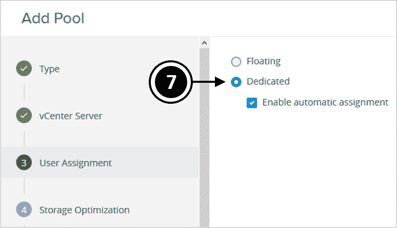

1.  点击专用单选按钮**（7）**，并确保勾选启用自动分配框。

1.  点击“下一步”以继续。接下来，您将看到存储优化选项，如下图所示：

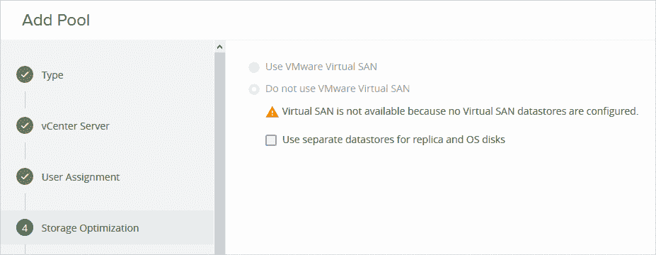

1.  点击单选按钮选择是否使用 VMware 虚拟 SAN。在示例实验室中，此选项未被配置。在此配置屏幕上，您还可以选择是否使用单独的数据存储来存放副本和操作系统磁盘。

1.  点击“下一步”以继续。

1.  您现在将看到桌面池标识**，**屏幕，如下图所示：

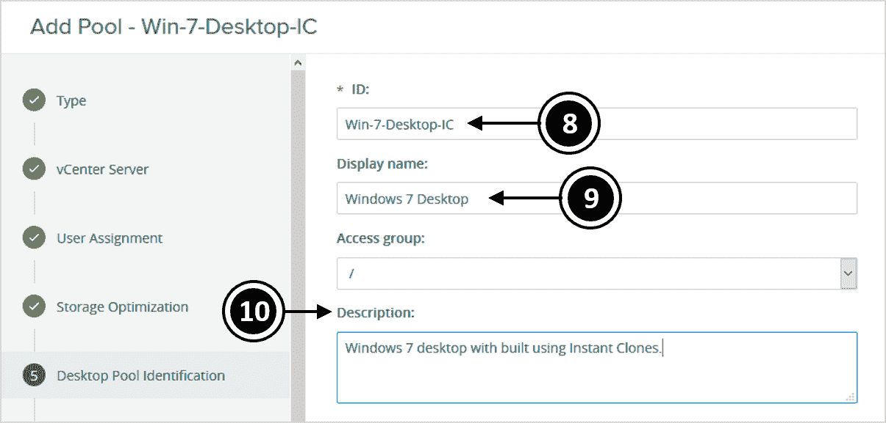

1.  在 ID 框**（8）**中，输入一个名称用于标识此桌面池。在本示例中，我们将其命名为`Win-7-Desktop-IC`。

1.  接下来，在显示名称框**（9）**中，输入最终用户将看到的名称，用于标识此桌面池。在本示例中，我们将其命名为`Windows 7 Desktop`。

1.  如果您已经配置了访问组**，** 则可以通过点击下拉菜单从中选择。

1.  最后，在描述框（**10**）中，输入一个描述，用于说明此桌面池的功能。

1.  点击“下一步”以继续。

1.  您现在将看到配置设置屏幕，如下图所示：

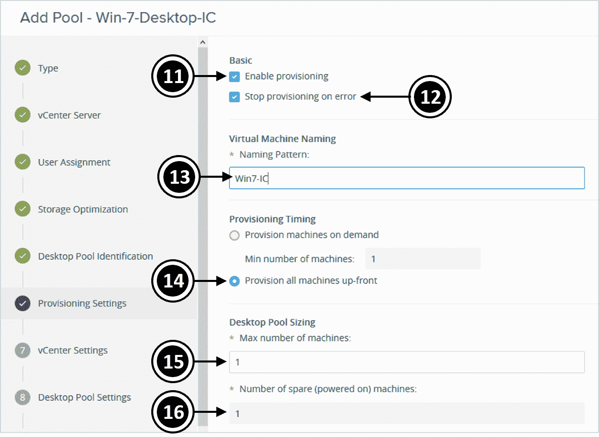

1.  在“基本”部分，选中启用配置框**（11）**和出错时停止配置框（**12**）。

1.  然后，在虚拟机命名框（13）中，输入你希望为构建的虚拟桌面机器命名的名称。在示例实验室中，我们输入的名称是`Win7-IC`。

1.  在预配时机部分，点击“预配所有机器”（**14**）单选按钮。

1.  最后，在桌面池大小部分，在最大机器数框（**15**）中，输入你希望在该桌面池中的最大机器数量，然后在备用虚拟桌面机器数量框（**16**）中输入你希望有多少备用（开机）虚拟桌面机器。

1.  点击下一步以继续。

1.  你现在将看到 vCenter 设置界面，如下图所示：

1.  第一个任务是从我们已经创建的金牌镜像中选择默认镜像。为此，点击父虚拟机框旁边的浏览按钮（**17**）。你将看到选择父虚拟机的界面，如下所示的截图：

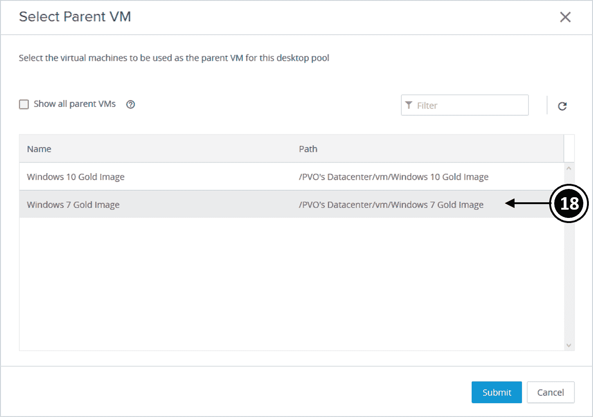

1.  在本示例中，我们将使用 Windows 7 操作系统创建一个桌面池，因此从可用镜像列表中选择 Windows 7 Gold Image 选项，然后点击提交按钮。

1.  现在你将返回到 vCenter 设置界面，在这里我们可以配置快照的下一个选项。你还会看到父虚拟机框（**19**）已被填充，如下图所示：

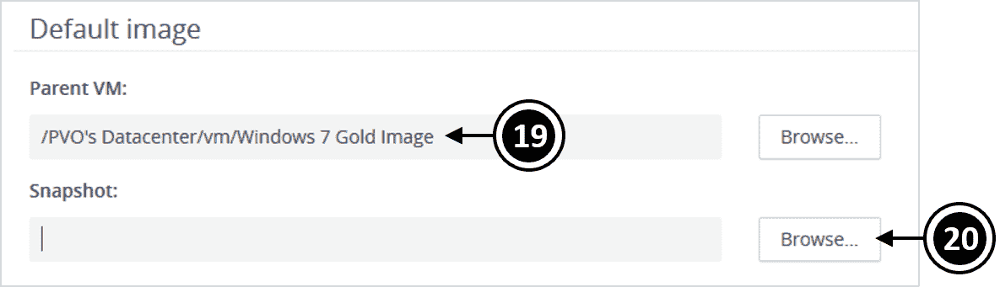

1.  下一个默认镜像设置是配置使用哪个快照。点击快照框旁边的浏览按钮（**20**）。你将看到 vCenter 中的父虚拟机界面，如下所示的截图：

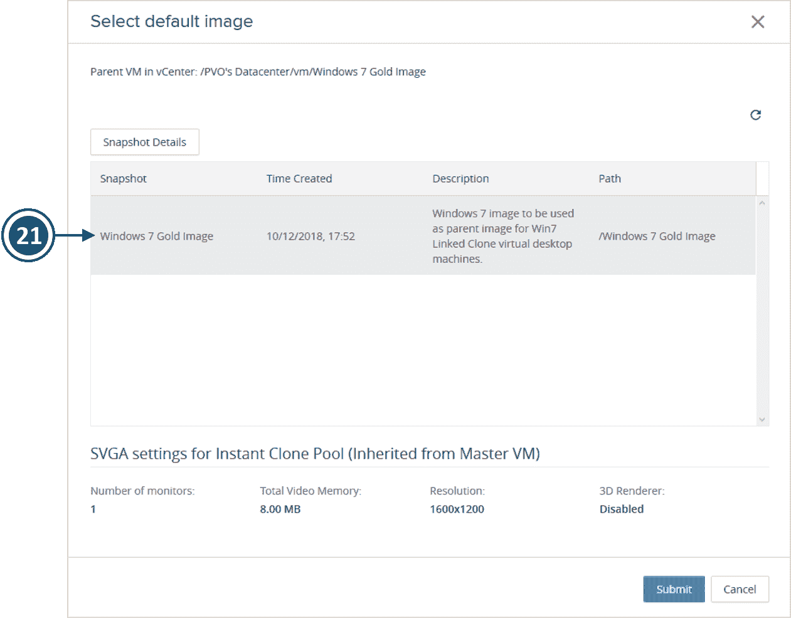

1.  在此镜像的快照列表中，选择你想要使用的快照。在示例实验室中，我们只有一个已创建的快照，所以从列表中点击 Windows 7 Gold Image 选项（**21**）。

1.  点击提交按钮以继续。你将返回到 vCenter 设置界面，此时你会看到快照已添加到配置中（**22**），如下图所示：

1.  接下来，我们将配置虚拟机位置的下一个选项。点击虚拟机文件夹位置框旁边的浏览按钮（**23**）。你将看到选择存储虚拟机的文件夹界面，如下图所示：

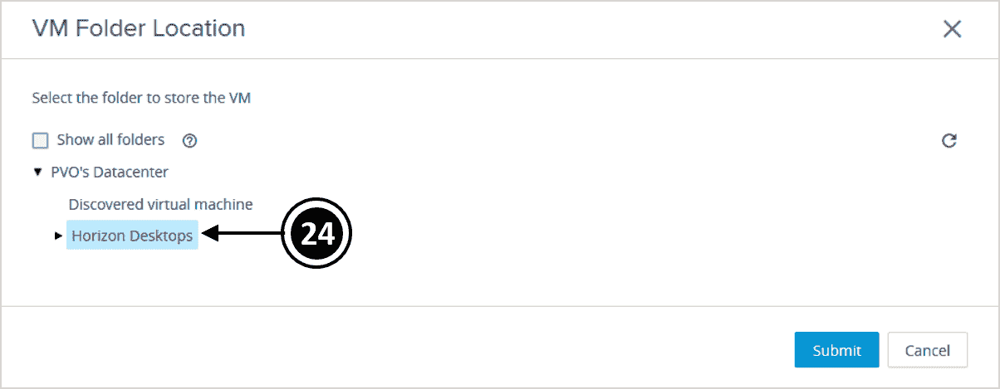

1.  选择你希望存储将要创建的虚拟桌面机器的文件夹。在示例实验室中，展开 PVO 数据中心的条目，然后点击 Horizon Desktops 文件夹（**24**）。

1.  点击提交按钮继续。你将返回到 vCenter 设置界面，在这里你将看到虚拟机文件夹位置已被添加到配置中，如下图所示：

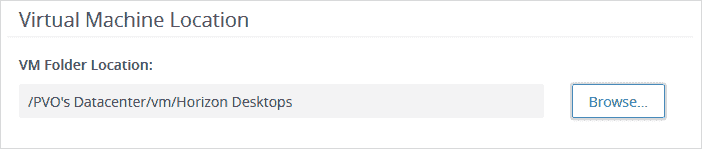

1.  下一组配置选项是资源设置（**Resource Settings**），如下图所示：

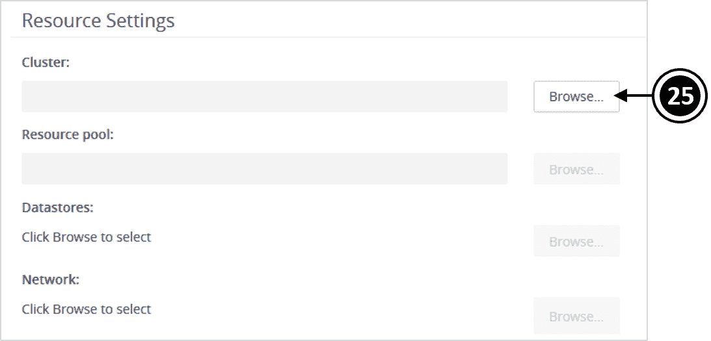

1.  首先，我们将配置哪个集群将托管此桌面池中的虚拟桌面机器。点击**集群**框旁边的浏览...按钮（**25**）。你现在将看到选择集群界面，如下图所示：

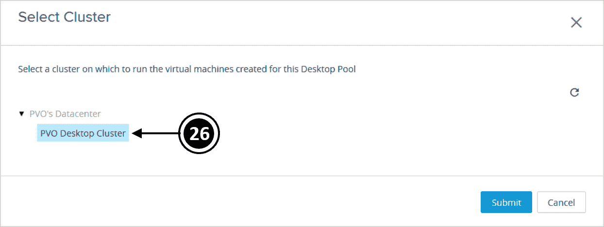

1.  在示例实验室中，展开 PVO 数据中心的条目，然后点击 PVO 桌面集群选项（**26**）。接下来点击提交按钮。你将返回到 vCenter 设置界面，在这里你将看到**集群**（**27**）的详细信息已被添加到配置中，如下图所示：

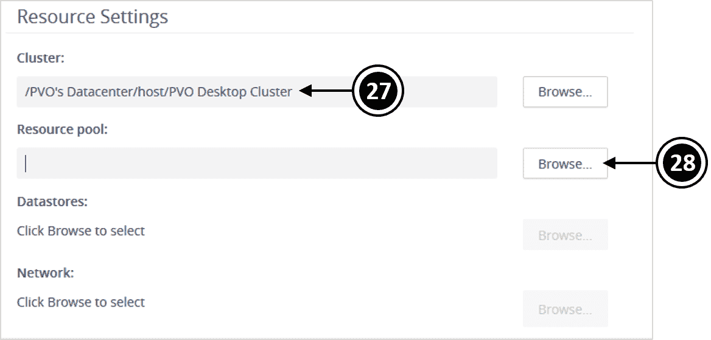

1.  接下来，我们将选择资源池。点击**资源池**框旁边的浏览...按钮（**28**）。你现在将看到选择用于此桌面池的资源池界面，如下图所示：

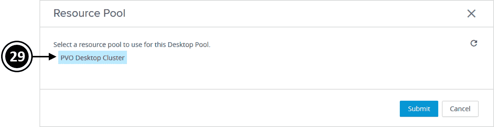

1.  从列表中点击你要使用的资源池。在示例实验室中，点击 PVO 桌面集群的条目（**29**）。

1.  点击提交按钮继续。你将返回到 vCenter 设置界面，在这里你将看到**资源池**的详细信息已被添加到配置中（**30**），如下图所示：

1.  接下来要配置的是存储虚拟桌面机器的 datastore。点击 Datastores 框旁边的浏览...按钮（**31**）。你现在将看到选择 Datastore 界面，如下图所示：

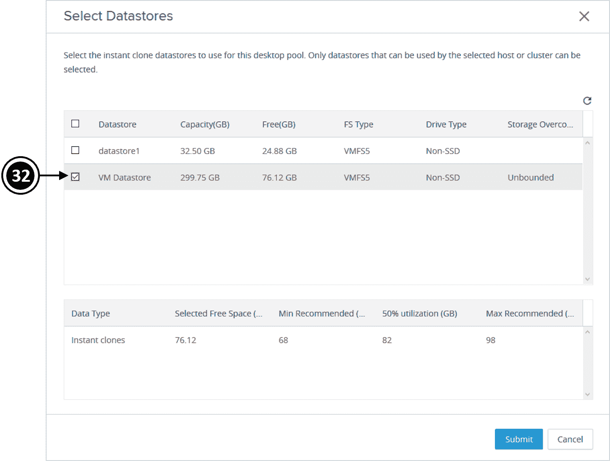

1.  从列表中勾选你要使用的 datastore。在示例实验室中，这是 VM Datastore（**32**）。

1.  点击提交按钮。

1.  在示例实验室中，由于我们使用的是本地 datastore，你将看到以下警告信息：

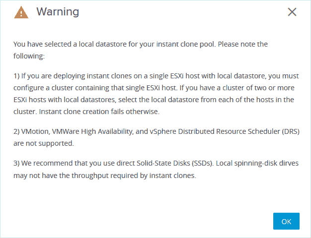

1.  点击确定以确认警告信息并关闭该框。

1.  你将返回到 vCenter 设置界面，在这里你将看到 Datastore 部分现在显示已选择了一个 datastore（**33**），如下图所示：

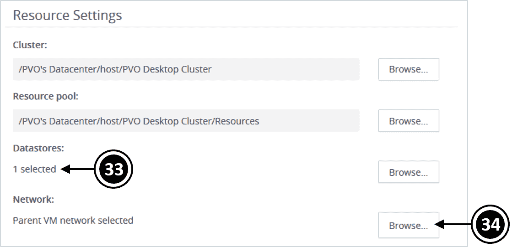

1.  最后需要配置的是网络部分，它允许你配置这个桌面池中的虚拟桌面机器将连接到哪个虚拟网络。

1.  默认情况下，这会配置为与父虚拟机相同的虚拟网络。要更改网络配置，请点击“浏览...”按钮（**34**），然后选择相关网络。在示例实验中，我们将保持默认配置设置。

1.  点击“下一步”继续到下一个配置选项。现在你将看到桌面池配置界面，如下图所示：

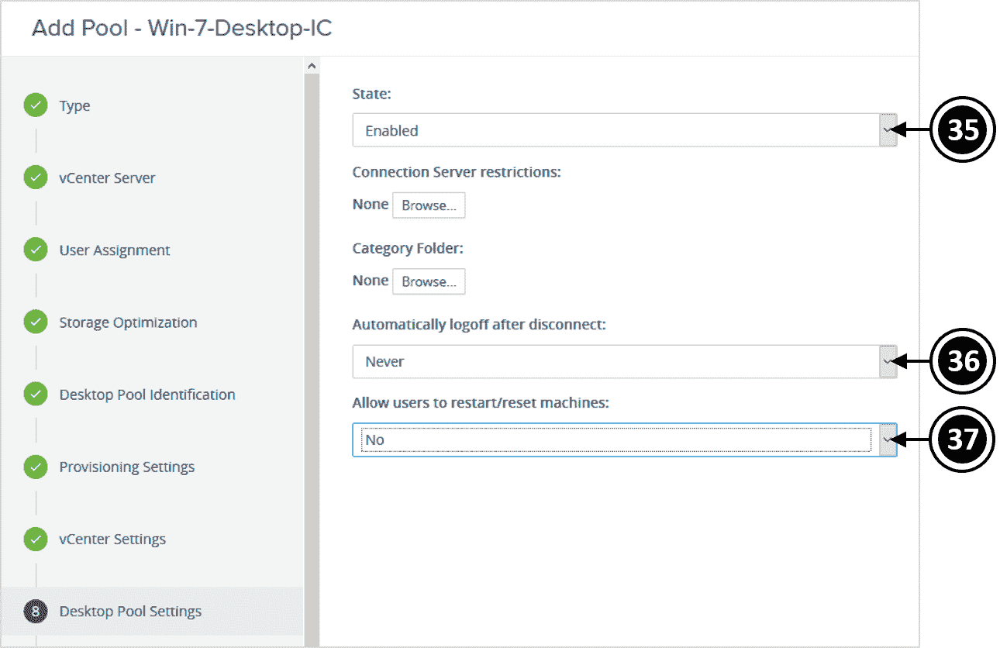

1.  配置的第一步是启用桌面池，以便用户可以访问桌面池中的虚拟桌面机器。在“状态”框（**35**）中，从下拉菜单中确保选择了“启用”。

1.  然后，你可以配置连接服务器限制和类别文件夹。

1.  接下来，在“断开连接后自动注销”框（**36**）中，从下拉菜单中选择适当的操作。在此示例中，我们选择了“从不”，这样用户在断开与虚拟桌面机器的连接时不会自动注销。

1.  然后，在“允许用户重启/重置机器”框（**37**）中，从下拉菜单中选择适当的操作。在此示例中，我们选择了“否”，因此用户不能重启或重置他们的虚拟桌面机器。

1.  点击“下一步”继续。你现在将看到远程显示设置配置界面，如下图所示：

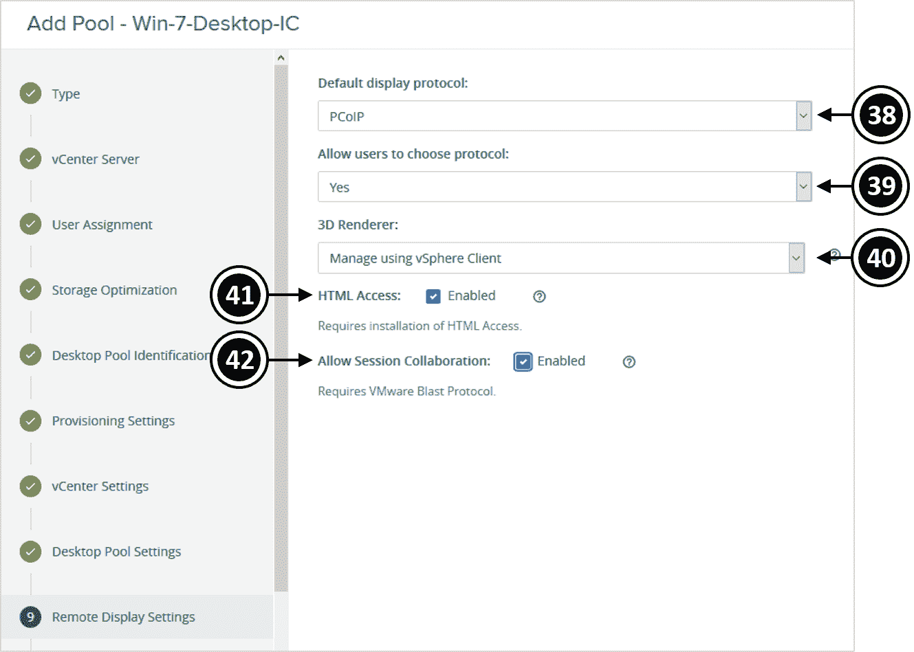

1.  首先，在“默认显示协议”框（**38**）中，从下拉菜单中选择你希望此桌面池使用的显示协议。在示例实验中，我们选择了 PCoIP。

1.  接下来，在“允许用户选择协议”框（**39**）中，从下拉菜单中选择是否允许用户更改默认协议。在示例实验中，我们选择了“是”。

1.  在 3D 渲染器框（**40**）中，选择适用于此桌面池的相关 3D 渲染模型。

1.  最后，勾选“启用”框以启用 HTML 访问（**41**）以及允许会话协作（**42**）。请注意，会话协作需要 VMware Blast 协议。

1.  点击“下一步”继续到下一个配置选项。现在你将看到“客户机自定义”界面，如下图所示：

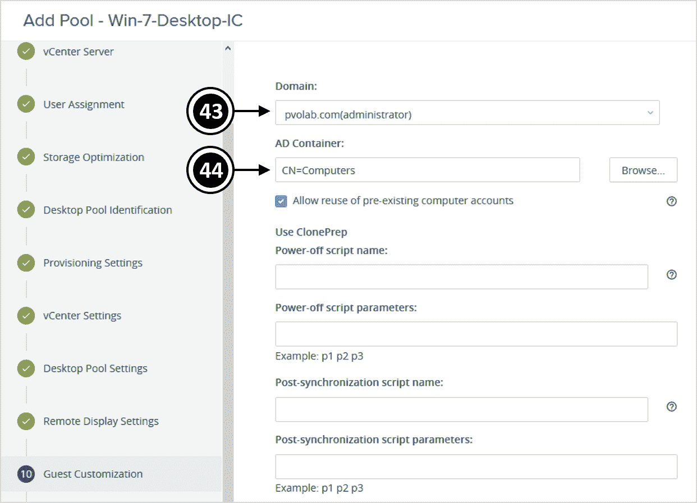

1.  在此配置屏幕上，你可以选择虚拟桌面机器在 Active Directory 中的位置。在“域”框（**43**）中，从下拉菜单中选择它们所在的域名。在示例实验中，这个域名是`pvolab.com`。

1.  接下来，在“AD 容器”框中，点击“浏览...”按钮，然后选择虚拟桌面机器将要存放的相关容器。在示例实验中，这是默认设置`CN=Computers`。

1.  点击“下一步”继续到“准备完成”界面，如下图所示：

1.  此界面上的唯一选项是勾选框（**45**），用于选择在本向导完成后是否授权用户。我们将在本章稍后部分介绍如何使用经典的 View 管理员控制台和新的 Horizon 控制台配置授权。

您现在已经成功使用 Horizon 控制台配置了一个桌面池。在下一节中，我们将创建其他桌面池，以反映不同类型的池。

# 创建专用的完全克隆桌面池

创建专用的完全克隆桌面池的过程与我们在上一节中配置专用链接克隆桌面池的过程几乎相同。不过，还是有一些变化，因为我们正在配置一个完全克隆虚拟机，它将使用模板来创建虚拟机，而不是使用快照。我们将在本节中详细介绍不同的配置选项，并通过截图加以说明，而对于我们之前已覆盖的任务，我们将通过文字描述。您可以参考上一节的截图。

使用 Horizon View 管理员设置桌面池，执行以下步骤：

1.  从工作站打开浏览器，输入 View 连接服务器的地址。在示例实验室中，连接服务器的地址为 `https://hzn7-cs1.pvolab.com/admin`。不要忘记末尾的 `/admin`，否则您将进入 Horizon 客户端页面。

1.  您现在将看到 View 管理员登录界面。使用管理员账户登录。

1.  您现在将看到 Horizon View 管理员仪表盘界面。

1.  从 Horizon View 管理员界面，点击展开“目录”选项，然后点击“桌面池”。接着在显示的桌面池面板中，点击“添加...”按钮。

1.  您现在将看到“添加桌面池”界面，首先是“类型”部分，您可以在此选择要创建的桌面池类型。

1.  点击“自动化桌面池”的单选按钮。在选择可用的桌面池类型时，右侧的描述将发生变化，提醒您各类型之间的差异。

1.  现在点击“下一步 >”按钮继续。

1.  您现在将看到用户分配界面。

1.  点击“专用”单选按钮。默认情况下，启用“自动分配”选项。这意味着桌面将在用户登录时，按先到先得的方式分配。如果由于某种原因您需要确保某个用户分配到特定桌面，则需要取消选中此框，并手动为其分配虚拟桌面。

1.  点击“下一步 >”按钮继续配置。在 vCenter 服务器界面上，您将配置如何使用与此连接服务器关联的 vCenter 服务器构建虚拟桌面，如下图所示：

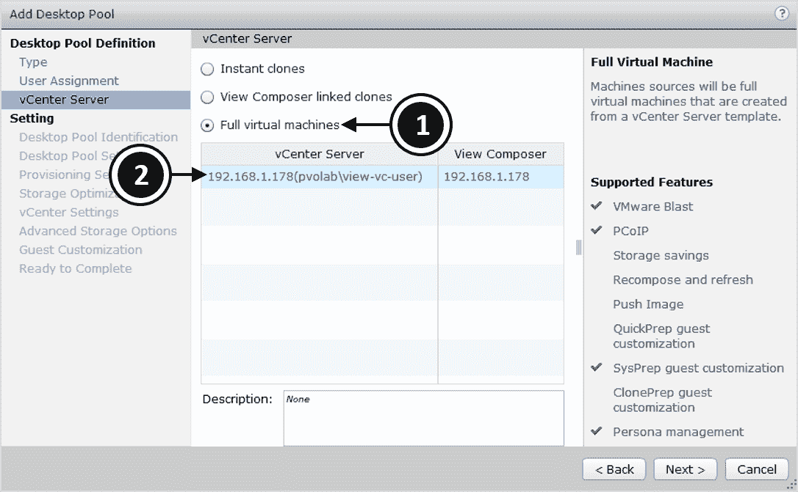

在此配置屏幕上，您可以选择构建即时克隆、视图组合链接克隆虚拟桌面机器或完整克隆虚拟桌面机器。

1.  对于这个第二个池，我们将使用完整虚拟机，因此单击“完整虚拟机”单选按钮（**1**）。

1.  接下来，您需要从列表中选择相关的 vCenter 服务器。在示例实验中，显示了 vCenter `192.168.1.178`，以及我们为 View 设置的 vCenter 用户帐户。点击以突出显示并选择此 vCenter 服务器（**2**）。

1.  单击“下一页 >”按钮继续配置。接下来的配置屏幕是用于桌面池识别的，如下截图所示：

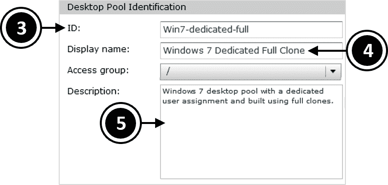

1.  在 ID 框（**3**）中输入此桌面池的 ID。在示例实验中，我们输入了`Win7-dedicated-full`的 ID。

请记住，您只能在池 ID 中使用字符 *a*-*z*、*A*-*Z*、*0*-*9*、*-* 和 *_*。

1.  在显示名称框（**4**）中，输入此池的名称。请注意，显示名称是显示给最终用户的，因此请确保给出一个非技术性的名称，用户能够理解。

1.  最后，在描述框（**5**）中，输入一个更详细的描述，描述这个桌面池。

1.  单击“下一页 >”按钮继续配置。您现在将看到桌面池设置配置屏幕。

1.  此配置页面是我们开始为最终用户定义桌面在桌面池内运行方式的设置。配置您希望应用于此池的设置，然后单击“下一页 >”按钮继续。

1.  现在您将看到供应设置屏幕。

1.  基本部分的第一个设置是启用供应。勾选“启用供应”框以打开供应。这意味着可以根据配置设置来提供虚拟桌面机器。

1.  接下来的设置是停止在错误时进行供应。通过选中此框，如果在供应过程中发生错误，将停止供应。

1.  下一部分的配置是关于虚拟机命名的，如下截图所示：

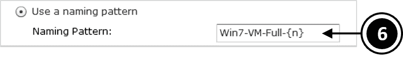

1.  单击“使用命名模式”单选按钮，然后在命名模式框（**6**）中输入您想要使用的命名模式。在示例实验中，我们称其为`Win7-VM-Full-{n}`。这将导致虚拟桌面机器被命名为`Win7-VM-Full-1`、`Win7-VM-Full-2`，依此类推，直到您指定要构建的机器数量。

1.  接下来，在最大机器数框中，输入可以在此桌面池中进行供应的最大机器数量。这设置了此桌面池中虚拟桌面机器的数量限制。

1.  接下来是备用（开机）机器数量的设置。在框中输入应当开机并等待用户连接的机器数量。

1.  下一步要配置的是提供时间选项。可以选择单击“按需提供机器”单选按钮，然后输入最小机器数量，或者选择“预先提供所有机器”单选按钮。

1.  下一项配置是**虚拟设备**，因为我们正在配置完整克隆的虚拟桌面机器。相关选项是**为虚拟机添加受信任的平台模块 (vTPM) 设备**，如下图所示：

1.  TPM（受信任的平台模块）用于保护加密处理器。它的基本设计目的是借助集成的加密密钥来保护硬件。TPM 通常以专用微控制器或微芯片的形式安装在物理机的主板上。虚拟 TPM 依赖于虚拟机管理程序（在 vCenter 6.7 版本中提供）为虚拟桌面机器提供一个隔离的执行环境，并将其隐藏在虚拟桌面机器中运行的软件之外。此功能通过保护虚拟桌面机器中的代码，为其提供了类似于固件基础 TPM 的安全级别。

1.  点击“下一步 >”按钮以继续到下一个配置屏幕。

下一个配置屏幕是用于存储优化：

1.  此屏幕上的唯一选项是配置存储策略管理，从 VMware 虚拟 SAN 开始。要启用 VSAN，请选择“使用 VMware 虚拟 SAN”单选按钮。由于我们在示例实验室中没有配置此项，因此我们将选择“不要使用 VMware 虚拟 SAN”单选按钮。

1.  点击“下一步 >”按钮以继续到下一个配置屏幕。

下一个配置屏幕是 vCenter 设置配置屏幕。在这个屏幕上，我们将选择用于构建虚拟桌面机器的父虚拟机，并指定将要运行虚拟桌面机器的位置和资源。因此，配置选项分为三类：**虚拟机模板**、虚拟机位置和资源设置，如下图所示：

让我们看看所有的配置选项：

1.  首先需要配置的是用于作为父镜像的虚拟机模板的详细信息，通过该模板创建虚拟桌面池中的虚拟桌面机器。此部分内容如以下截图所示：

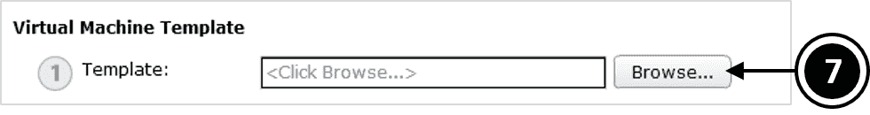

1.  在模板框中，点击“浏览...”按钮（**7**）。

1.  现在你将看到选择模板的屏幕，如下图所示：

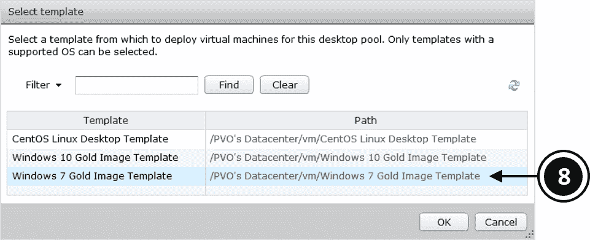

1.  在此屏幕中，你将看到所有在 vCenter 中创建的模板列表。因为我们要为该池构建一个 Windows 7 虚拟桌面机，所以通过点击并高亮显示，选择 Windows 7 Gold Image Template（**8**）选项。

1.  点击确定以接受并关闭选择模板屏幕。

1.  你现在将返回 vCenter 设置屏幕，我们现在可以配置第二个选项。这是关于虚拟机位置的配置。你还会看到“模板”框（**9**）现在已填充 Windows 7 Gold Image Template 的详细信息，如下图所示：

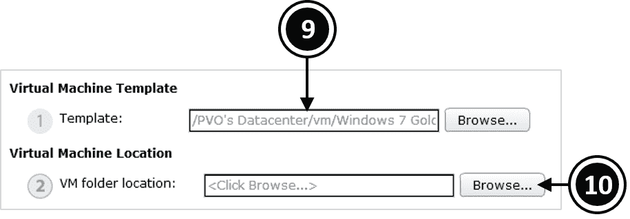

1.  在虚拟机位置部分，点击虚拟机文件夹位置框中的浏览...按钮（**10**）。

1.  你现在将看到“选择存储虚拟机的文件夹”屏幕，如下图所示：

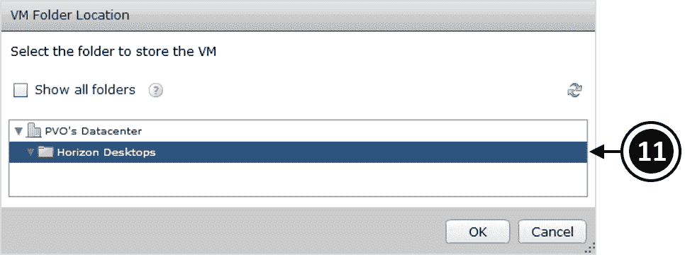

1.  通过点击下拉箭头展开 PVO 的数据中心，然后选择你想要创建虚拟桌面机的文件夹。在示例实验室中，此文件夹被命名为`Horizon Desktops`（**11**）。

别忘了为虚拟机考虑一个文件夹结构，以便于管理；否则，你可能会在不同的池中创建数百个虚拟桌面机，而它们都存储在同一个文件夹中。

1.  点击确定以继续。

1.  你将返回 vCenter 设置屏幕，你将看到“虚拟机文件夹位置”已被添加：

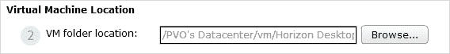

下一个配置部分是用于托管和运行池中虚拟桌面机的资源：

1.  首先，在“主机或集群”框中，点击浏览...按钮。

1.  接下来，你将看到“主机或集群”框出现，列出可用的主机资源。这些主机资源是可用的 ESXi 服务器。在此示例中，我们可以看到示例实验室 ESXi 服务器的 IP 地址。点击 IP 地址`192.168.1.131`。

1.  点击确定以继续。

1.  你现在将返回 vCenter 设置屏幕，你将看到“主机或集群”已被添加。

1.  接下来，我们将配置此桌面池要使用的资源池。

1.  在资源池框中，点击浏览...按钮。你现在将看到“选择用于此桌面池的资源池”框，你可以在此框中选择资源池。示例实验室的资源池再次是 ESXi 主机服务器，因此点击 IP 地址`192.168.1.131`，从列表中选择它。

1.  点击确定以继续。

1.  你现在将返回 vCenter 设置屏幕，你将看到“资源池”已被添加。

本节的最终配置选项是**数据存储区**。在示例实验室中，我们使用的是单一数据存储区，它是从存储优化设置屏幕中选择的：

1.  在数据存储区框中，点击浏览...按钮。

1.  您现在将看到选择数据存储的配置屏幕，它显示所有可用的数据存储，如下图所示：

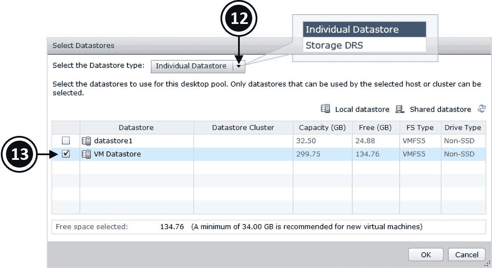

1.  此配置屏幕上的第一个选项是选择数据存储类型 (**12**)。在这里，您可以选择个人数据存储或存储 DRS。DRS（分布式资源调度器）对存储资源进行负载均衡，并将存储工作负载迁移到其他可用数据存储，而不是使用同一个。在示例实验室中，选择个人数据存储选项。

1.  勾选 VM 数据存储 (**13**)，因为这是我们将用于存储此桌面池中虚拟桌面机器的数据存储。

1.  配置完成后，点击“确定”按钮。您将返回到**vCenter 设置**配置屏幕，此时您将看到通过显示文本“已选择 1 个”来输入了链接克隆数据存储的详细信息。

1.  在**vCenter 设置**配置完成后，点击**下一步 >**按钮继续到下一个配置屏幕。

下一个配置屏幕是高级存储选项：

1.  要启用视图存储加速器，请勾选“使用视图存储加速器”复选框。

1.  将“重新生成存储加速器后选项”保持为默认值 `7` 天。

1.  如果您想配置停机时间，请在“停机时间”下点击“添加...”按钮。

1.  高级存储选项中的最终设置是配置透明页面共享范围。将此选项保留为虚拟机的默认设置。

1.  完成高级存储选项配置后，点击“下一步 >”按钮继续。

下一个配置屏幕是来宾自定义，如下图所示：

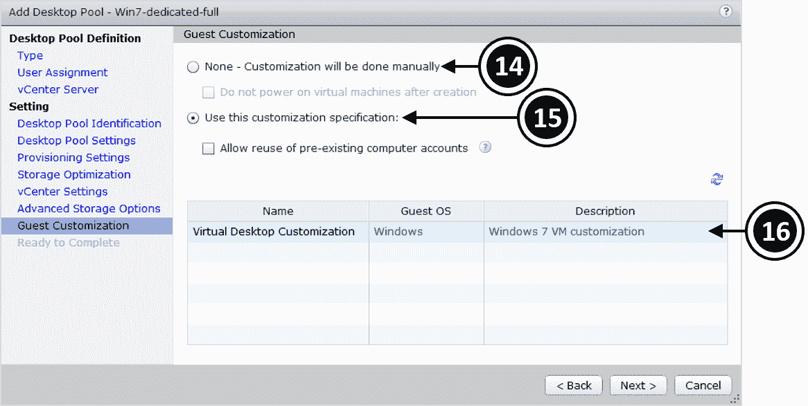

屏幕显示以下选项：

1.  此屏幕上的第一个配置选项是“无 - 自定义将手动完成 (**14**)”。如果您希望手动配置每台虚拟桌面机器，请点击单选按钮选择此选项。

1.  在前一个选项下，您可以选择“创建后不打开虚拟机”。勾选此框可防止在虚拟桌面机器创建后自动启动它们。如果您打算手动配置机器，那么选择此选项是有意义的，因为没有必要启动尚未配置的机器。

1.  接下来，您可以选择使用此自定义规范 (**15**)。此选项允许您从 vCenter 选择一个预构建的 SysPrep 脚本。在示例实验室中，我们创建了一个名为虚拟桌面自定义 (**16**) 的脚本。点击此选项以高亮并选择它。在此选项下，您还可以配置使用现有计算机帐户的功能。要启用此选项，只需勾选允许重用现有计算机帐户的复选框。

1.  完成来宾自定义配置后，点击“下一步 >”按钮。

1.  你现在将看到最终的屏幕，即准备完成屏幕，如下图所示：

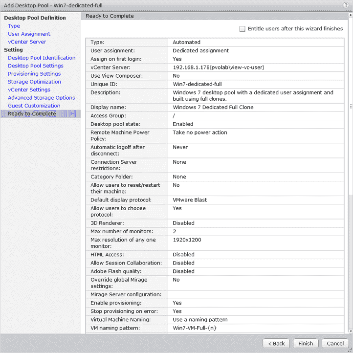

审核你的配置设置，然后点击“完成”按钮以创建桌面池。

你还可以选择勾选屏幕顶部的“在向导完成后授权用户”框，这样会自动启动授权配置屏幕，让你可以为最终用户提供访问该桌面池中虚拟桌面机器的权限。然而，在这个示例实验中，我们将在稍后进行此操作，等我们创建一些额外的桌面池后再处理。

你现在将看到桌面池已经创建，如下图所示：

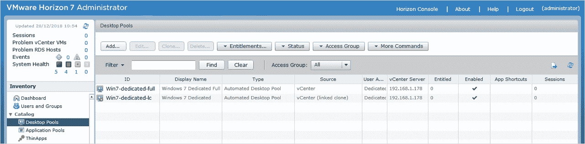

你还将在 vCenter Server 上看到桌面池的各种文件夹结构已设置完毕，第一台虚拟桌面机器 `Win7-VM-Full-1` 已创建并已启动，准备供最终用户登录，如下图所示：

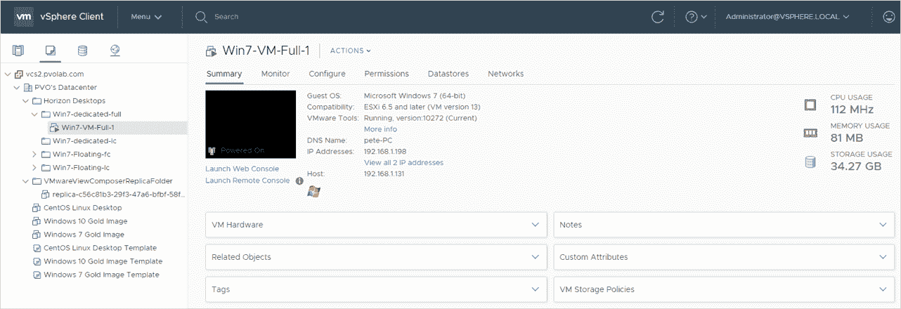

你现在已经成功创建了一个专用的完整克隆桌面池。

# 总结

在本章中，我们已配置 Horizon View 管理员通过创建桌面池来交付虚拟桌面机器。我们已经构建并配置了一个专用的完整克隆桌面池和一个专用的链接克隆桌面池。在桌面池配置过程中，我们学习了如何使用经典的 Horizon View 管理员控制台以及新的网页客户端风格的 Horizon 控制台来创建这些桌面池。

在下一章中，我们将学习如何使用链接克隆和即时克隆来构建多个浮动桌面池。我们还将配置一个手动桌面池，然后继续查看使用链接克隆桌面池时需要执行的一些关键管理任务，最后为最终用户分配访问权限到新创建的桌面池。
