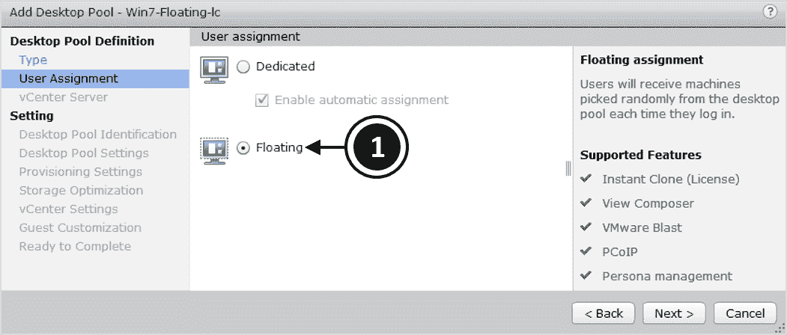
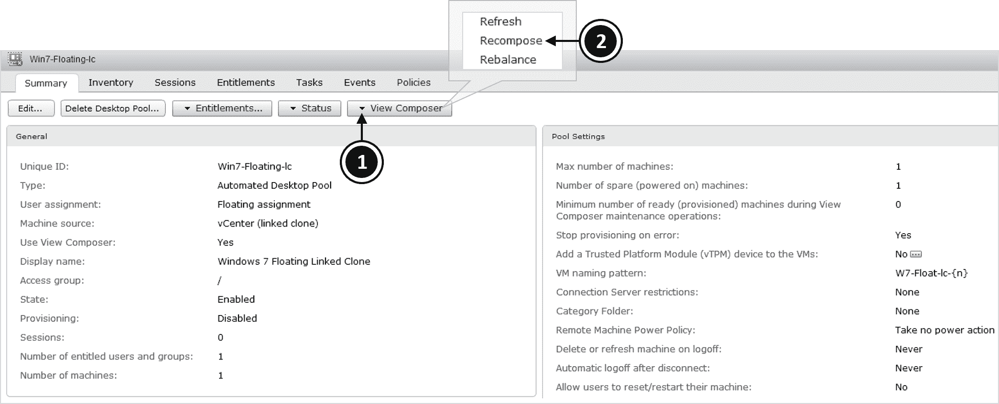

# 第九章：配置和管理桌面池 - 第二部分

接着 第八章，《配置和管理桌面池 - 第一部分》，在该部分中我们配置了专用桌面池，本章中，我们将创建多个浮动桌面池，使用链接克隆、即时克隆以及手动桌面池。然后，我们将为最终用户授予这些桌面池的使用权限，从而允许他们连接到虚拟桌面。

我们还将了解在部署链接克隆桌面池时需要执行的一些管理任务，最后看看如何审查部署。

本章将涉及以下主题：

+   创建浮动的链接克隆桌面池

+   创建浮动的完全克隆桌面池

+   创建浮动的即时克隆桌面池

+   创建手动桌面池

+   添加最终用户权限

+   管理链接克隆桌面池

+   部署后审查基础架构

# 创建浮动的、链接克隆桌面池

与我们之前创建的其他池一样，创建浮动的链接克隆桌面池的过程基本上与我们在上一节中讲解的相同，只是做了一些更改，以反映该池具有浮动分配。因此，在本节中，我们将仅重点介绍不同的配置选项：

1.  在工作站上，打开浏览器并输入视图连接服务器的地址。在示例实验室中，连接服务器的地址是 `https://hzn7-cs1.pvolab.com/admin`。不要忘记在末尾加上`/admin`，否则您将进入 Horizon 客户端页面。

1.  现在您将看到视图管理员登录界面。

1.  在 Horizon View 管理员中，点击展开目录选项，然后点击“桌面池”。然后在现在显示的桌面池面板中，点击“添加...”按钮。

1.  现在您将看到“添加桌面池”界面，首先是类型部分，在此选择您要创建的桌面池类型。在本示例中，我们创建的是自动化池。

1.  点击“自动化桌面池”单选框。

1.  现在点击“下一步 >”按钮继续。

1.  现在您将看到用户分配界面。

1.  对于此池，我们将点击“浮动”单选框（**1**），如下图所示：

1.  点击“下一步 >”按钮继续。

1.  对于此池，我们将使用链接克隆虚拟机，因此点击“视图作曲器链接克隆”单选框，并从列表中选择相关的 vCenter 服务器。在示例实验室中，显示了 `vCenter 192.168.1.178`，以及我们为视图设置的 vCenter 用户帐户。点击并选中该 vCenter 服务器。

1.  点击“下一步 >”按钮继续配置。下一个配置界面是桌面池标识，如下图所示：

1.  在 ID 框（**2**）中，输入此桌面池的名称。在示例实验室中，我们为此池命名为`Win7-Floating-lc`。

1.  在显示名称框（**3**）中，输入此桌面池的名称，最终用户将看到该名称。在示例实验室中，我们将其命名为`Windows 7 Floating Linked Clone`。

1.  最后，在描述框（**4**）中，输入描述以说明此桌面池的功能。

1.  点击“下一步 >”按钮继续。

1.  现在您将看到桌面池设置屏幕。

1.  配置您希望应用于此桌面池的设置，然后点击“下一步 >”按钮继续。

1.  现在您将看到配置设置屏幕。

1.  基本部分的第一个设置是启用配置。勾选“启用配置”框以开启配置。此设置意味着可以根据配置设置来提供虚拟桌面机器。

1.  下一个设置是错误时停止配置。勾选此框表示如果在配置过程中出现错误，配置将停止。

1.  下一个配置部分是虚拟机命名**。**

1.  选择“使用命名模式”单选按钮，然后在命名模式框（**6**）中输入您要使用的命名模式。在示例实验室中，我们将其命名为`W7-Float-lc-{n}`。这将导致虚拟桌面机器被命名为`W7-Float-lc-1`、`W7-Float-lc-2`，依此类推，直到您指定的构建机器数量，如下所示：

1.  接下来，在最大机器数量框中，输入此桌面池中可以配置的最大机器数量。这设置了此桌面池中虚拟桌面机器的数量上限。

1.  接下来是备用（已开机）机器的数量设置。在框中输入应该开机并等待用户连接的机器数量。

1.  下一个配置选项是配置“按需提供机器”的时间。请选择“按需提供机器”单选按钮，然后输入最小的机器数量，或选择“提前提供所有机器”的单选按钮。

1.  点击“下一步 >”按钮继续。

1.  现在您将看到视图组合器磁盘屏幕和一次性文件重定向配置设置。

1.  要配置此设置，请选择“将一次性文件重定向到非持久性磁盘”单选按钮（**7**），如下所示：

1.  在磁盘大小框中，输入持久性磁盘的大小，在驱动器字母下拉框中，选择此持久性磁盘的驱动器字母。

1.  要禁用一次性文件重定向功能，请点击“不重定向一次性文件”单选按钮（**8**）。

1.  点击“下一步 >”按钮继续。下一个配置屏幕是存储优化。

1.  此屏幕上唯一的选项是配置存储策略管理，首先从 VMware Virtual SAN 开始。要启用 VSAN，请点击“使用 VMware Virtual SAN”单选按钮。由于在本示例实验室中未配置此功能，因此我们将选择“不要使用 VMware Virtual SAN”。接下来，您可以选择是否为副本和操作系统磁盘使用不同的数据存储。要启用此选项，请勾选“为副本和操作系统磁盘选择不同的数据存储”框。

1.  点击“下一步 >”按钮以继续到下一个配置屏幕。

1.  现在，您将看到 vCenter 设置页面。

1.  首先，选择父虚拟机，在本例中是我们的 Windows 7 Gold 镜像，然后在快照框中选择要使用的 Windows 7 Gold 镜像虚拟桌面机的快照。

1.  在“虚拟机位置”部分，在虚拟机文件夹位置下，选择您要存储这些新虚拟桌面机的文件夹。在本实验室示例中，我们将使用`Horizon Desktops`文件夹。

1.  最后，在“资源设置”部分，选择运行虚拟桌面机的主机或集群、资源池和数据存储。

1.  点击“下一步 >”按钮以继续到下一个配置屏幕。

1.  现在，您将看到高级存储选项配置屏幕。保留默认设置并点击“下一步 >”按钮继续。

1.  您将看到来宾自定义配置屏幕。保留默认设置并点击“下一步 >”按钮。

1.  现在，您将看到“准备完成”屏幕。检查您的配置设置，然后点击“完成”按钮以创建桌面池。

1.  现在，您将看到池已成功创建，如下图所示：

在下一部分，我们将创建另一个自动化桌面池，但这次我们将创建一个带有浮动分配的池，并且使用全克隆虚拟桌面机构建。

# 创建浮动的全克隆桌面池

与之前我们创建的池相同，创建一个浮动的全克隆桌面池的过程基本上与之前所述相同，唯一的区别是此次池具有浮动分配。因此，在本节中，我们将重点介绍配置选项中的主要区别：

1.  在工作站上，打开浏览器并输入 View 连接服务器的地址。在本实验室示例中，连接服务器的地址是`https://hzn7-cs1.pvolab.com/admin`。请记得在末尾加上`/admin`，否则您将进入 Horizon 客户端页面。

1.  现在，您将看到 View 管理员登录屏幕。

1.  在 Horizon View 管理员中，点击展开“目录”选项，然后点击“桌面池”。然后在当前显示的桌面池面板中，点击“添加...”按钮。

1.  现在您将看到添加桌面池屏幕，首先是“类型”部分，在此部分中选择要创建的桌面池类型。在本例中，我们正在创建一个自动化池。

1.  点击“自动化桌面池”单选按钮。

1.  现在点击“下一步 >”按钮继续。

1.  现在您将看到用户分配屏幕。

1.  对于此池，我们将选择“Floating”单选按钮。

1.  点击“下一步 >”按钮继续。您将看到 vCenter Server 屏幕。

1.  对于此池，我们将使用全克隆虚拟机，因此选择“全虚拟机”单选按钮，然后从列表中选择相关的 vCenter 服务器。在示例实验室中，显示了`vCenter 192.168.1.178`，以及我们为 View 设置的 vCenter 用户帐户。点击突出显示并选择此 vCenter 服务器。

1.  点击“下一步 >”按钮继续配置。下一个配置屏幕是桌面池标识，如下图所示：

1.  在 ID 框 (**1**) 中，输入此桌面池的名称。在示例实验室中，我们将该池命名为`Win7-Floating-fc`。

1.  在显示名称框 (**2**) 中，输入此桌面池的名称，最终用户将看到该名称。在示例实验室中，我们将其命名为`Windows 7 Floating Full Clones`。

1.  最后，在描述框 (**3**) 中，输入描述以说明此桌面池的功能。

1.  点击“下一步 >”按钮继续。

1.  现在您将看到桌面池设置屏幕。在“远程设置”部分，显示了一些新的配置选项，如下图所示：

1.  前三个配置选项已在之前描述过，但现在我们有了“允许用户从不同客户端设备发起独立会话”选项 (**4**)。如果此选项设置为“是”，那么如果用户从不同的客户端设备连接到同一桌面池，他们将获得一个不同/新的桌面会话。用户只能通过使用原始会话启动的相同客户端设备重新连接到现有会话。当此选项设置为“否”时，无论使用何种客户端设备，用户都将重新连接到他们的现有会话。

1.  最后的配置设置是“注销后删除机器” (**5**)。如果此选项设置为“是”，则当用户注销时，虚拟桌面机器将被删除。如果此选项设置为“否”，则注销时虚拟桌面机器不会被删除。此功能仅支持使用手动命名的桌面池，因为不支持虚拟桌面机器的动态创建和删除。

1.  配置剩余的桌面池设置，使其适合您的环境；在示例实验室中，我们将保持默认设置。

1.  点击“下一步 >”按钮继续。

1.  你现在将看到配置屏幕。

1.  **基本**部分中的第一个设置是启用配置。勾选启用配置框以打开配置。

1.  接下来，勾选“错误时停止配置”复选框。

1.  接下来要配置的部分是虚拟机命名**。**

1.  点击“使用命名模式”单选按钮，然后在命名模式框中（**6**），输入你希望使用的命名模式。在示例实验中，我们将其命名为`W7-Float-fc-{n}`。这将导致虚拟桌面机器被命名为`W7-Float-fc-1`、`W7-Float-fc-2`，依此类推，直到你指定的要构建的机器数量，如下图所示：

1.  完成其余设置，使其适应你的环境，或者在示例实验中，我们将保留默认设置。

1.  点击“下一步 >”按钮继续。

1.  你现在将看到存储优化配置屏幕。保留默认设置并点击“下一步 >”。

1.  你现在将看到 vCenter 设置。

1.  首先，在虚拟机模板部分，选择你要使用的模板。在本例中，我们将使用 Windows 7 Gold Image 模板。

1.  在虚拟机位置部分，在虚拟机文件夹位置下，选择你希望存储这些新虚拟桌面机器的文件夹。在示例实验中，我们将使用`Horizon Desktops`文件夹。

1.  最后，在资源设置部分，选择运行虚拟桌面机器的主机或集群、资源池，然后选择数据存储。

1.  点击“下一步 >”按钮继续到下一个配置屏幕。你现在将看到高级存储选项配置屏幕。保留默认设置，然后点击“下一步 >”按钮继续。

1.  你现在将看到客户定制配置屏幕。保留默认设置并点击“下一步 >”按钮。

1.  最后，你将看到准备完成的屏幕。审查你的配置设置，然后点击“完成”按钮来创建桌面池。

1.  你现在将看到池已创建，如下图所示：

在*创建自动化桌面池*的最后部分，我们将创建另一个自动化桌面池，但这次我们将创建一个具有浮动分配的池，现在通过即时克隆虚拟桌面机器构建。

# 创建浮动的即时克隆桌面池

在本节中，我们将创建一个自动化桌面池，该池具有浮动分配，并使用即时克隆构建。此配置有两个步骤。首先，我们需要配置一个域管理员，然后再配置实际的桌面池。

# 配置即时克隆域管理员

在你能够使用即时克隆配置桌面池之前，必须先添加一个即时克隆域管理员。此账户用于执行创建新虚拟桌面所需的 Active Directory 任务。它类似于在 View Composer 中使用的服务账户，但由于即时克隆不使用 Composer，因此需要在视图管理员中添加该账户。此账户需要以下权限：

+   创建计算机对象

+   删除计算机对象

+   写入所有属性

要配置即时克隆域管理员，请完成以下任务：

1.  从工作站打开浏览器，输入视图连接服务器的地址。在示例实验室中，连接服务器的地址是`https://hzn7-cs1.pvolab.com/admin`。别忘了在地址末尾加上`/admin`，否则你会进入 Horizon 客户端页面。

1.  现在你会看到视图管理员登录页面。

1.  要添加账户，在视图管理员控制面板中，从左侧窗格的“库存”菜单展开“视图配置”选项，然后点击“即时克隆域管理员”（**1**）选项。

1.  然后点击“添加...”按钮（**2**），如以下截图所示：

1.  然后你会看到添加域管理员的框。

1.  在“完整域名”部分，点击下拉箭头（**3**），选择域名。在示例实验室中，这是我们的`pvolab.com`域。

1.  在“用户名”框（**4**）中，输入具有本节开始时所述权限的用户名。

1.  最后，在“密码”框（**5**）中，输入你刚才输入的用户名账户的密码。

1.  当你完成所有细节时，点击确定。

1.  现在你会看到域管理员账户已经添加，如下截图所示：

你现在已经成功配置了即时克隆的域管理员账户。接下来我们可以继续创建即时克隆桌面池的过程。

# 创建即时克隆桌面池

与我们之前创建的其他池一样，创建浮动的即时克隆桌面池的过程基本与上一节所讲的一致，唯一的不同是此池是通过即时克隆技术构建的。因此，在本节中，我们将仅突出配置选项中的主要差异：

1.  从工作站打开浏览器，输入视图连接服务器的地址。在示例实验室中，连接服务器的地址是`https://hzn7-cs1.pvolab.com/admin`。别忘了在地址末尾加上`/admin`，否则你会进入 Horizon 客户端页面。

1.  现在你会看到视图管理员登录页面。

1.  在 Horizon View 管理员界面中，点击展开目录选项，然后点击桌面池。接着，在现在显示的桌面池窗格中，点击“添加...”按钮。

1.  现在，您将看到添加桌面池屏幕，首先是类型部分，我们选择要创建的桌面池类型。在此示例中，我们正在创建一个自动化池。

1.  点击自动桌面池的单选按钮。

1.  现在点击“下一步 >”按钮继续。

1.  现在，您将看到用户分配屏幕。

1.  对于此池，我们将点击“浮动”单选按钮。

1.  点击“下一步 >”按钮继续。您将看到 vCenter 服务器屏幕，在此屏幕上，您将配置虚拟桌面机器的构建方式。在此示例中，点击“即时克隆（**1**）”的单选按钮，如下图所示：

1.  点击并选择 vCenter 服务器（**2**），然后点击“下一步 >”按钮继续。

1.  下一个配置屏幕是桌面池标识，如下图所示：

1.  在 ID 框（**3**）中，输入此桌面池的名称。在示例实验室中，我们将此池命名为`Win10-Floating-ic`。

1.  在显示名称框（**4**）中，输入一个桌面池的名称，最终用户将看到此名称。在示例实验室中，我们将其命名为`Windows 10 Instant Clone`。

1.  最后，在描述框（**5**）中，输入一个描述来说明此桌面池的功能。

1.  点击“下一步 >”按钮继续。

1.  现在，您将看到桌面池设置屏幕。根据您的需求设置配置细节，然后点击“下一步 >”按钮继续。

1.  下一个配置部分是虚拟机命名**。**

1.  点击“供应设置”的单选按钮。确保选中“启用供应”框以及“错误时停止供应”框。

1.  在命名模式框（**6**）中，输入您希望使用的命名模式。在示例实验室中，我们将其命名为`W10-Float-ic-{n}`。这将导致虚拟桌面机器的名称为`W10-Float-ic-1`、`W10-Float-ic-2`，依此类推，直到您指定要构建的机器数量，如下图所示：

1.  完成剩余的设置，以使其适应您的环境，或者在示例实验室中，我们将保持默认设置。

1.  点击“下一步 >”按钮继续。

1.  现在，您将看到存储优化配置屏幕。保留默认设置并点击“下一步 >”按钮继续。接下来，您将看到 vCenter 设置。

1.  下一个配置屏幕是 vCenter 设置配置屏幕。在此屏幕上，我们将选择用于构建虚拟桌面机器的父虚拟机，然后选择运行它们的位置和资源，如下图所示：

1.  配置的第一步是设置默认镜像的详细信息，该镜像将作为创建虚拟桌面机器的父镜像用于此桌面池。此部分如以下截图所示：

1.  在第一个框中，vCenter 中的父虚拟机，单击浏览... 按钮（**7**）。您将看到选择父虚拟机框，如以下截图所示：

1.  对于此桌面池，我们将使用 Windows 10 作为虚拟桌面机器的操作系统，因此请选择 Windows 10 Gold Image（**8**）。

1.  选择好要使用的父虚拟机后，单击确认继续。

1.  您将返回到 vCenter 设置屏幕，在这里我们可以配置默认镜像部分中的快照选项。您还将看到父虚拟机框（**9**）已被填充 Windows 10 Gold Image 的详细信息，如以下截图所示：

1.  由于这是一个 Instant Clone 虚拟桌面机器，接下来的配置任务是设置从父镜像创建的快照的详细信息。

1.  在快照框中，单击浏览... 按钮（**10**）。您将看到选择默认镜像框，如以下截图所示：

1.  单击以高亮显示要使用的快照（**11**），然后单击确认。现在，您将看到该快照已被添加，如以下截图所示：

vCenter 设置的下一个部分是虚拟机器位置设置，如以下截图所示：

1.  在 VM 文件夹位置框中，单击浏览... 按钮（**12**）。

1.  现在，您将看到选择存储虚拟机的文件夹框。通过单击箭头展开 PVO 的数据中心，然后选择您希望创建虚拟桌面机器的文件夹。在示例实验室中，该文件夹名为 `Horizon Desktops`。

1.  单击确认继续。

1.  您将返回到 vCenter 设置屏幕，在此屏幕中，您将看到 VM 文件夹位置已被添加，如以下截图所示：

下一个配置部分是为将托管和运行虚拟桌面机器的资源设置：

1.  首先，在集群框中，单击浏览... 按钮（**13**），如以下截图所示：

1.  现在，您将看到集群框，列出了可用的集群资源，如以下截图所示：

1.  单击并高亮显示您要在其上运行此 Instant Clone 桌面池的集群。在示例实验室中，该集群名为 PVO Desktop Cluster（**14**）。

配置该配置的资源设置部分时，需要注意的是，你必须配置一个主机集群和资源池。你不能为即时克隆桌面池使用独立主机。

1.  点击“确定”继续。

1.  你现在将返回到 vCenter 设置屏幕，在这里你将看到集群已被添加。

1.  接下来，我们将为该桌面池配置资源池。

1.  在“资源池”框中，点击“浏览...”按钮。你将看到“选择一个资源池以供该桌面池使用”框，在这里你可以选择运行桌面池的资源池。此示例实验室的资源池依然是集群，因此请从列表中点击并高亮选择 PVO 桌面集群。

1.  点击“确定”继续。

1.  你现在将返回到 vCenter 设置屏幕，在这里你将看到资源池已被添加。

1.  本部分的下一个配置选项是数据存储。在“数据存储”框中，点击“浏览...”按钮。

1.  你现在将看到选择即时克隆数据存储配置屏幕，其中显示了所有可用的数据存储。

1.  勾选 VM 数据存储框，然后点击“确定”按钮。你将返回到 vCenter 设置配置屏幕，届时会看到即时克隆数据存储的详细信息已经通过显示文本“1 个已选择”**添加**。

1.  最后，在 vCenter 设置屏幕的即时克隆配置中，你可以配置网络，如下图所示：

1.  在“网络”框中，点击“浏览...”按钮（**15**）。然后你将看到选择网络框。这里，你可以使用当前在虚拟桌面机器镜像中配置的网络，或者从列表中选择另一个网络。点击“确定”继续并返回到 vCenter 设置屏幕。

1.  现在点击“下一步 >”按钮继续到下一个配置屏幕。

1.  你现在将看到“客户定制”配置屏幕。保持默认设置，点击“下一步 >”按钮继续。

1.  最后，你将看到“准备完成”屏幕。检查你的配置设置，然后点击“完成”按钮以创建桌面池。

1.  你现在将看到桌面池已经创建，如下图所示：

你还可以在 vCenter Server 的文件夹视图中看到，即时克隆的文件夹结构已经创建，如下图所示，文件夹名以 ClonePrep 开头：

你现在已经成功配置了一个用于即时克隆虚拟桌面机器的桌面池，运行的是 Windows 10 系统。在接下来的部分，我们将逐步讲解如何创建一个手动桌面池。

# 创建手动桌面池

在前面的部分中，我们讨论了如何创建自动桌面池。Horizon View 还具有从已存在的虚拟桌面机器甚至物理桌面机器创建桌面池的能力。

创建手动桌面池的过程与我们之前讨论的自动桌面池的过程相似，因此，在接下来的部分中，我们将创建一个手动池并突出显示过程中的不同之处：

1.  从工作站打开浏览器，输入 View 连接服务器的地址。在示例实验室中，连接服务器的地址是`https://hzn7-cs1.pvolab.com/admin`。不要忘记结尾的`/admin`，否则你将进入 Horizon 客户端页面。

1.  现在你将看到 View 管理员登录屏幕。使用管理员帐户登录。

1.  登录后，从 Horizon View 管理员中，点击展开“目录”选项，然后点击桌面池。接着，在现在显示的桌面池窗格中，点击“添加...”按钮。

1.  现在你将看到添加桌面池屏幕，从“类型”部分开始，在这里我们选择要创建的桌面池类型。在这个示例中，我们正在创建一个手动池。

1.  单击单选按钮选择手动桌面池（**1**），如下面的截图所示：

1.  现在单击“下一步 >”按钮继续。

1.  现在你将看到用户分配屏幕。选择是否需要使用自动分配的专用分配或浮动分配。在示例实验室中，我们将单击单选按钮选择专用选项，并勾选启用自动分配的复选框。

1.  单击“下一步 >”按钮继续。

1.  接下来，您将看到机器源屏幕，如下所示的截图：

1.  在此配置屏幕上，有两个选项。第一个选项是选择由 vCenter 管理的虚拟桌面机器，但这些机器并非通过某种克隆技术创建。由于我们要使用的虚拟桌面机器位于 vCenter 服务器上，因此在示例实验室中，点击选择 vCenter 虚拟机的单选按钮（**2**）。

1.  第二个选项是其他来源（**3**）。此选项适用于非 vCenter 管理的桌面，您希望用户通过 Horizon View 连接。例如，这可能是位于数据中心的刀片式或机架式工作站机器，您希望用户通过能够支持高性能图形的协议远程连接。您需要确保在这些机器上安装了 Horizon Agent。

1.  单击“下一步 >”按钮继续。

1.  现在你将看到 vCenter 服务器配置屏幕。通过点击选择示例实验室的 vCenter 服务器，然后单击“下一步 >”按钮继续。

1.  接下来，您将看到桌面池 ID 屏幕，如下所示的截图：

1.  在 ID 框(**4**)中，输入该桌面池的名称。在示例实验室中，我们将该池命名为`Win7-Manual`。

1.  在显示名称框(**5**)中，输入终端用户将看到的该桌面池名称。在示例实验室中，我们将其命名为`Windows 7 Manual Desktop`**。

1.  最后，在描述框(**6**)中，输入描述，说明该桌面池的功能。

1.  点击“下一步 >”按钮继续。

1.  现在，您将看到桌面池设置屏幕。根据您的需求完成配置详情，然后点击“下一步 >”按钮继续。

1.  接下来的配置部分是虚拟机器，我们将添加希望作为该桌面池一部分的虚拟桌面机器，如下图所示：

1.  在第一个表格中，您将看到可用虚拟机器的列表。此表格不包括已属于其他桌面池的虚拟桌面机器。

1.  点击并高亮您想要包含在桌面池中的虚拟桌面机器。在示例实验室中，这台虚拟桌面机器叫做`Windows 7 Manual Desktop`(**7**)。

1.  现在点击“添加”按钮(**8**)。

1.  现在，您将看到虚拟桌面机器已添加到下方的表格中，意味着它已经被选中并添加到桌面池(9)中。如果您想删除它，只需点击并高亮表格中的机器，然后点击“删除”按钮。

1.  点击“下一步 >”按钮继续。

1.  现在，您将看到高级存储选项配置屏幕。保留默认设置，然后点击“下一步 >”按钮继续。

1.  最后，您将看到“准备完成”屏幕。检查您的配置设置，然后点击“完成”按钮以创建桌面池。

1.  现在，您将看到桌面池已经创建，如下图所示：

您现在已经成功配置了一个使用现有、预构建的运行 Windows 7 的虚拟桌面机器的手动桌面池。

现在，我们已经配置了多个桌面池并创建了虚拟桌面机器，在接下来的部分中，我们将通过步骤将终端用户授权到桌面池。

# 添加终端用户授权

现在，您已经创建了包含虚拟桌面机器的多个桌面池，下一步是允许用户访问这些池和虚拟桌面机器。

我们将先通过 Horizon View 管理员，然后通过新的 Horizon Console 基于 Web 的客户端，了解如何授权终端用户。

# 使用 Horizon View 管理员经典控制台添加用户授权

要通过 Horizon View 管理员授权终端用户到桌面池，我们将按照以下步骤进行：

1.  从工作站打开浏览器，输入 View 连接服务器的地址。在示例实验室中，连接服务器的地址是`https://hzn7-cs1.pvolab.com/admin`。别忘了地址末尾的`/admin`，否则您将进入 Horizon 客户端页面。

1.  现在，您将看到 View 管理员登录页面。使用管理员账户登录。

1.  登录后，在 Horizon View 管理员界面中，点击左侧“库存”窗格中的“用户和组”(**1**)，如以下截图所示：

1.  现在点击“授权...”按钮（**2**）。从下拉菜单中选择“添加桌面授权”（**3**）。您将看到如下所示的“添加桌面授权”页面：

1.  在此页面上，我们可以从 Active Directory 中搜索并添加用户。第一个选项是类型。您可以选择搜索用户、组或未认证用户。勾选相应的框来选择搜索类型。

1.  接下来，您可以选择要搜索的域。在“域”框中，点击下拉箭头（**4**），从列表中选择相关的域。在示例实验室中，我们将从列表中选择`pvolab.com`。

1.  您可以选择按名称、用户名或描述进行搜索。您还可以选择通过**包含**、**以...开始**或**完全匹配**等条件进行筛选。在示例实验室中，我们将搜索一个特定用户，因此在**名称/用户名**框中，从下拉菜单中选择**包含**，然后输入用户名`peter`，最后点击“查找”按钮。

1.  结果显示在下表中。在示例实验室中，您将看到输入的用户的详细信息（**7**）。

1.  完成添加用户和组的授权后，您需要添加桌面池，然后点击“下一步 >”按钮。现在，您将看到如下所示的“选择桌面池进行授权”页面：

1.  在示例实验室中，点击并高亮表格中 Win7-Manual 的条目（**8**）。如果您希望将此用户授权给多个桌面池，可以按住*Ctrl*键同时点击要授权的池。

1.  添加完用户和桌面池后，点击“完成”按钮。

1.  现在，您将返回到“用户和组”页面，页面将显示已授权的用户，如以下截图所示：

另一种将用户授权给桌面池的方式是从桌面池页面进行，如以下截图所示：

1.  高亮您想授权的桌面池。在示例实验室中，我们将再次使用 Windows 7 手动池，因此点击并选择表格中的 Win7-Manual（**9**）。

1.  然后点击“权限...”按钮（**10**），然后从菜单选项中选择“添加权限...” （**11**）。你现在将看到如下截图所示的“添加权限”框：

1.  现在点击“添加...”按钮（**12**）。

1.  现在你会看到“查找用户或组”框，这与在第**4**点中添加桌面权限时的框相同。输入你要授权的用户和/或组，然后点击“确定”。接着，在“添加权限”框中再次点击“确定”，以完成对用户的桌面池授权。

还有一种方式可以展示如何将用户授权到桌面池，这在我们创建桌面池时已经看过。这就是在“准备完成”屏幕上的选项，如下面的截图所示：

在这个向导完成后，勾选“添加用户权限”框（**12**），一旦你完成桌面池配置，添加桌面权限将会自动显示。

你已经成功为用户分配了桌面池权限。如果现在以已经授权的用户身份登录 Horizon View，你将看到桌面池可以从 Horizon Client 中选择并连接。我们将在第十二章中更详细地讲解如何连接虚拟桌面机器，*Horizon Client 选项*。

在下一节中，我们将学习如何从新的 Horizon 控制台为用户分配权限。

# 使用新的 Horizon 控制台添加用户权限

在这一节中，我们将重复之前的任务，但这次将使用 Horizon 控制台来配置用户权限，按照下述步骤进行：

1.  从工作站上，打开浏览器并输入 View 连接服务器的地址。在示例实验室中，连接服务器的地址是 `https://hzn7-cs1.pvolab.com/admin`。

1.  你现在会看到 View 管理员登录界面。使用管理员账户登录。

1.  登录后，从 Horizon View 管理员中，点击下面截图中显示的“Horizon 控制台”选项：

1.  或者，你可以直接通过浏览器访问 Horizon 控制台，使用连接服务器的 URL `https://hzn7-cs1.pvolab.com/newadmin`。然后使用管理员账户登录。

1.  你现在会看到 Horizon 控制台界面。

1.  在屏幕左侧的菜单选项中，点击“用户和组”（**2**），如下面截图所示：

1.  现在显示的是“用户和组”界面。点击“权限”按钮（**3**），然后从下拉菜单中选择“添加桌面权限”（**4**）。

1.  现在你将看到“添加桌面权限”界面，以及如下截图中显示的用户配置选项：

1.  首先，选择是否要授权给单个用户或组（来自 AD），通过勾选相关框（**5**）。

1.  接下来，在“域”框中，点击下拉箭头（**6**）并选择用户或组所在的域。在示例实验室中，这是 `pvolab.com` 域。

1.  你可以选择通过名称或描述来搜索用户或组。在本例中，我们将搜索用户名，因此在“名称/用户名”框中，我们将输入用户名的第一部分，即 `peter`。我们还将选择“包含”筛选选项。

1.  现在点击“查找”按钮（**8**）。

1.  搜索结果将显示出来。你会看到我们的用户已经被找到，因此勾选框（**9**）以选择该用户，然后点击“下一步”继续。

1.  现在你将看到“桌面池配置”选项，我们可以选择该用户将访问的桌面池，如下图所示：

1.  勾选你希望授权给该用户的桌面池。在示例实验室中，这是 Windows 7 手动桌面池，所以勾选 Win7-Manual（**10**）的框。

1.  点击“提交”按钮以完成授权配置。

1.  现在你将返回到“用户和组”屏幕，在那里你会看到该用户已被授权访问桌面池。你将在表格的“桌面授权”列中看到该用户实际上已被授权访问两个桌面池，如下图所示：

你现在已经成功地使用 Horizon 控制台为用户授权了桌面池。

在本章的下一部分，我们将更深入地了解管理链接克隆桌面池所需的一些管理任务。

# 管理链接克隆桌面池

使用链接克隆桌面池时，一旦创建并授权桌面池，系统将首先创建副本，然后创建链接克隆虚拟桌面机。你将需要执行一些管理任务，我们将在本节中介绍。在执行这些任务之前，最好先检查桌面池的状态：

1.  为了做到这一点，在 Horizon View 管理员仪表盘屏幕中，在左侧面板的“库存”部分，展开“目录”部分，然后点击桌面池（**1**）。你现在将看到以下截图：

1.  从显示的桌面池列表中，你现在可以通过点击选择一个桌面池。在示例实验室中，我们将选择链接克隆桌面池，因此点击 `Win7-Floating-lc`（**2**）条目。你将看到以下截图：

1.  从顶部的选项卡中，点击“库存”选项卡（**3**）。你可以查看桌面池的状态（**4**）。

总共有 24 种不同的状态报告，适用于 Linked Clone 虚拟桌面机器。您可以查看所有状态的细分，信息来自 Horizon View 文档：

+   **配置中**：虚拟机正在进行配置。

+   **自定义中**：自动化池中的虚拟机正在根据配置进行自定义。

+   **删除中**：虚拟机已标记为删除，但尚未删除。一旦过程完成，它将被删除。

+   **等待代理**：View 连接服务器正在等待与手动池中虚拟桌面机器上运行的 Horizon 代理建立通信。

+   **维护模式**：虚拟机处于维护模式。这意味着它不可用，因此最终用户无法登录或使用虚拟桌面机器。

+   **启动中**：Horizon 代理已在虚拟桌面机器上启动，但其他必需的服务，如显示协议，仍在启动过程中。

+   **代理禁用**：此状态可能在两种情况下出现。首先，在启用了登出后删除或刷新机器，或登出后删除机器设置的桌面池中，桌面会话已注销，但虚拟机尚未刷新或删除。其次，View 连接服务器在发送关闭虚拟桌面机器的请求之前禁用了 Horizon 代理。此状态确保在虚拟桌面机器上无法启动新的桌面会话。

+   **代理无法访问**：View 连接服务器无法与虚拟桌面机器上运行的 Horizon 代理建立通信。

+   **无效 IP**：虚拟桌面机器的子网掩码注册设置已配置，但没有活动的网络适配器在配置的范围内获得 IP 地址。

+   **代理需要重启**：View 组件已升级，虚拟桌面机器必须重启，以便 Horizon 代理与升级后的组件一起运行。

+   **协议失败**：显示协议在 Horizon 代理启动期间未能启动。

+   **域失败**：虚拟桌面机器遇到访问域的问题。域服务器无法访问，或者域认证失败。

+   **已被使用**：在启用了登出后删除或刷新机器，或登出后删除机器设置的桌面池中，虚拟桌面机器上没有会话，但会话未注销。如果虚拟桌面机器意外关闭，或最终用户在会话中途重置机器，可能会发生此情况。

+   **配置错误**：未启用显示协议。

+   **配置错误**：配置过程中发生错误。

+   **错误**：虚拟桌面机器发生了未知错误。

+   **未分配用户连接**：在专用桌面池中，其他用户（不是分配的用户）已登录虚拟桌面机器。

+   **未分配用户已断开连接**：除分配用户外，其他用户登录并与专用桌面池中的虚拟机断开连接。

+   **未知**：虚拟桌面机器状态未知。

+   **已配置**：虚拟桌面机器已经构建，但已关闭或挂起。

+   **可用**：虚拟桌面机器已开机，且准备好供终端用户连接。

+   **已连接**：虚拟桌面机器已经有用户会话正在运行并连接到 Horizon 客户端。

+   **已断开连接**：虚拟机正在会话中使用，但已与 Horizon 客户端设备断开连接。

+   **进行中**：虚拟机在维护操作过程中处于过渡状态。

你还可以在桌面池中的每个虚拟桌面机器上完成许多任务。通过右键点击表格中列出的任何桌面，你可以在该桌面上执行多个任务。你可以选择以下选项，如下图所示：

这些选项在下列列表中有更详细的描述：

+   重启桌面：重启该虚拟桌面机器。

+   重置虚拟机：将对桌面执行硬重置，适用于系统死机的情况。这也将把虚拟桌面机器重置为原始快照状态。

+   移除：将虚拟桌面机器从池中移除。

+   刷新、重新组合和重新平衡：这些选项已在第二章中描述，*理解 Horizon 7 架构和组件*，可以在个人桌面上完成，而无需在整个池中执行。我们将在下一部分中更详细地讨论这些内容。

+   取消任务：取消该虚拟机上的任何未完成任务。

+   分配用户：可用于将桌面分配给特定用户。

+   取消分配用户：将用户从该桌面的分配中移除。

+   进入维护模式：将桌面置于一种状态，在维护过程中，用户无法分配到该桌面或连接到该桌面。

+   退出维护模式：将桌面返回到池中。

+   断开会话：断开当前连接的用户与池的连接，但不注销他们。

+   注销会话：注销用户。

+   发送消息：向任何给定的用户发送消息。

+   导出表格内容：将包含虚拟桌面机器详细信息的表格导出为 CSV 文件。

+   刷新表格内容：更新表格以显示最新信息。

在下一部分，我们将查看管理桌面池时一些更常见的、专门针对链接克隆的任务，从重新组合桌面池开始。

# 重新组合链接克隆桌面池

你可能需要执行的一个常见任务是重新组合桌面池，以更新基础镜像中的操作系统或应用程序，或者替代地，添加新的应用程序。始终建议拥有测试池，以便在将更新发布给最终用户之前先进行测试。

在这个示例中，我们将重新组合一个示例桌面池，但你也可以在单个虚拟桌面上执行重新组合操作：

1.  要重新组合桌面池，从 Horizon View 管理员仪表盘屏幕，在左侧窗格的“库存”部分，展开“目录”选项，然后点击“桌面池”。双击你想要执行重新组合操作的桌面池。在示例实验室中，我们将选择名为 `Win7-Floating-lc` 的链接克隆桌面池。现在你将在所选桌面池的“摘要”选项卡中看到桌面池的详细信息，如下图所示：

1.  点击“视图组合器”按钮 (**1**)，然后从显示的菜单选项中，点击“重新组合” (**2**)。

1.  你现在将看到重新组合屏幕和镜像选项，如下图所示：

1.  在这里，你可以通过点击“更改...”按钮 (**3**) 来更改父虚拟机。然后，你可以选择一个新的父虚拟机来进行重新组合。接下来，你会在表格中看到与新选择的父虚拟机相关的快照 (**4**)，然后点击它以选择。

1.  你可以选择当前镜像的新快照。这将反映出你从中创建新快照的现有镜像的更新版本。为此，点击你想要使用的快照 (**4**)。

1.  点击“下一步”> 继续。

1.  你现在将看到调度屏幕，在这里你可以配置重新组合操作的时间，以及如果用户在重新组合时已连接，发生的情况。如下图所示：

1.  第一个选项是设置你希望重新组合操作开始的日期和时间 (**5**)。

1.  接下来，你可以选择等待用户注销后再开始重新组合。要启用此选项，点击“等待用户注销”单选按钮 (**6**)。或者，你也可以点击“强制用户注销”单选按钮 (**7**)，这将强制用户注销。然而，他们可能会在实际被注销前获得一个宽限期，以便保存任何工作。

1.  接下来，你有选项勾选“在第一次错误时停止”框 (**8**)。勾选此框可以在出现任何错误时停止重新组合。如果有任何问题，这将防止重新构建池中的所有虚拟桌面机器。

1.  如果我们回顾一下强制用户注销选项，你还可以配置一个宽限期，用户在注销之前的等待时间。可以在全局设置部分进行编辑，如下图所示：

1.  要编辑全局设置，从左侧的清单窗格中，展开“视图配置”选项，然后点击“全局设置”（**10**）。接着点击“编辑...”（**11**），在“常规设置”框中向下滚动至高亮部分（**12**）。然后，你可以配置消息和宽限期。

1.  在重新组合屏幕上，点击“下一步 >”继续。

1.  现在，你将看到“准备完成”框，如下图所示：

1.  检查配置设置，然后点击“完成”按钮。

1.  重新组合操作将根据配置的开始时间以及是否等待用户注销来启动。

现在，你已经成功地在示例实验室中的一个联机克隆桌面池上执行了重新组合操作。在下一节中，我们将讨论刷新操作。

# 刷新联机克隆桌面池

你可能还会执行的另一个任务是刷新桌面池。通过刷新联机克隆虚拟桌面或桌面池，实际上你是将它们恢复到初始状态，即在原始快照创建之后的自定义阶段完成时的状态。仅操作系统磁盘会被刷新，其他磁盘不受影响：

1.  要重新组合桌面池，在 Horizon View 管理员仪表板屏幕的左侧窗格中，在清单部分下，展开“目录”选项，然后点击“桌面池”。双击你想要执行刷新操作的桌面池。在示例实验室中，我们将选择名为`Win7-Floating-lc`的联机克隆桌面池。你现在将看到所选桌面池的摘要标签中的桌面池详细信息。

1.  点击“查看组合器”按钮，然后在显示的菜单选项中点击“刷新”。

1.  你现在将看到调度屏幕，你可以在其中配置重新组合操作的时间，以及如果用户在刷新时连接时会发生什么。如下图所示：

1.  点击“下一步 >”按钮继续。

1.  现在，你将看到“准备完成”框，如下图所示：

1.  检查配置设置，然后点击“完成”按钮。

1.  刷新操作将根据配置的开始时间以及是否等待用户注销来启动。

现在，你已经成功地在示例实验室中的一个联机克隆桌面池上执行了刷新操作。在下一节中，我们将讨论重新平衡操作。

# 重新平衡一个联机克隆桌面池

你将执行的最后一个任务是重新平衡桌面池。View Composer 中的重新平衡操作用于将链接克隆虚拟桌面机器均匀分布到环境中的多个数据存储中。

如果你的某个数据存储空间快满了，而其他存储还有充足的空间，你将执行此任务：

1.  要重新平衡桌面池，在 Horizon View 管理员仪表盘屏幕上，在左侧面板的库存部分，展开目录选项，然后点击桌面池。双击你要执行重新平衡操作的桌面池。在示例实验室中，我们将选择名为 `Win7-Floating-lc` 的链接克隆桌面池。现在，你将看到所选桌面池的详细信息，显示在摘要选项卡中。

1.  点击 View Composer 按钮，然后从显示的菜单选项中点击“重新平衡”。

1.  你现在将看到以下信息框：

1.  点击“下一步 >”按钮继续。

1.  你现在将看到调度界面，你可以在其中配置重新平衡操作的时间，以及如果用户在重新平衡操作时已连接，将会发生什么。这与我们之前看到的刷新和重新组合操作的界面相同。

1.  点击“下一步 >”按钮继续。

1.  你现在将看到如下截图所示的“准备完成”框：

1.  在“准备完成”框中，这时你将看到将显示给用户的注销信息。底部还有一个重要信息框，包含有关桌面池设置和在重新平衡操作过程中可用的虚拟桌面机器数量的内容。

1.  检查配置设置后，点击完成按钮。

1.  现在，重新平衡操作将根据你配置的开始时间和是否等待用户注销来启动。

你现在已经成功地对示例实验室中的一个链接克隆桌面池执行了重新平衡操作。在接下来的部分，我们将探讨如何管理由 View Composer 创建的其他磁盘。

# 管理持久磁盘

在上一部分中，我们讨论了 View Composer 的操作，这些操作主要涉及管理虚拟桌面机器创建时的操作系统部分。在这一部分，我们将查看如何管理非操作系统磁盘或持久磁盘。

持久磁盘可以为每个用户配置一个专用的虚拟硬盘，这样可以在重新组合操作等过程中保留用户数据和设置。关于持久磁盘管理，有许多任务可以执行。

你可以将虚拟磁盘从专用桌面中分离。此操作的主要使用场景可能是因为最终用户离开公司，因此桌面不再需要，但数据需要保留以符合合规或审计要求。也可能是因为桌面出现问题，你需要重新创建桌面而不丢失用户数据。同样，你可以将现有的持久磁盘附加到虚拟桌面机器上，以便访问存储在其中的文件和数据。在接下来的部分中，我们将分别演示附加和分离持久磁盘。

# 分离持久磁盘

在第一次实例中，我们来看看如何从用户的虚拟桌面机器中分离持久磁盘，按照以下步骤操作：

1.  从工作站打开浏览器，输入 View Connection 服务器的地址。在示例实验室中，连接服务器的地址是 `https://hzn7-cs1.pvolab.com/admin`。

1.  你现在将看到 View 管理员的登录界面。使用管理员账户登录。

1.  你将看到 Horizon View 管理员的仪表盘屏幕。

1.  在 Horizon View 管理员界面中，点击左侧库存中的目录选项进行展开。从这里，点击桌面池 (**1**)，如下图所示：

1.  接下来，点击库存标签 (**2**)。现在你将看到一张列出桌面池中虚拟桌面机器的表格，并且表格顶部有多个可点击的选项。

1.  点击持久磁盘选项 (**3**)。

1.  表格视图随后切换为详细列出附加到这些虚拟桌面机器的持久磁盘。点击并选择其中一个磁盘。在本例中，我们将选择 Win7-VM-1-vdm-user-disk-D (**4**)。

1.  现在点击“分离...”按钮 (**5**)。磁盘现在已经分离，并作为独立磁盘可以附加到其他虚拟机器。此操作的使用场景可能是保存用户数据，以防他们离开你的组织，而你需要出于合规目的保留他们的数据，或者与其他用户共享。

还有另一种方法可以按照以下步骤分离持久磁盘：

1.  登录 Horizon View 管理员后，从仪表盘中点击左侧库存中的资源选项进行展开。从这里，点击持久磁盘 (**6**)，如下图所示：

1.  你现在将看到详细列出附加到这些虚拟桌面机器的持久磁盘的表格。点击并选择其中一个磁盘。在本例中，我们将选择 Win7-VM-2-vdm-user-disk-D (**7**)。

1.  现在点击“分离...”按钮 (**8**)。磁盘现在已被分离。

在下一部分，我们将展示反向操作，教你如何附加持久磁盘。

# 附加持久磁盘

要将持久磁盘附加到用户的虚拟桌面机器，请按照以下步骤操作：

1.  在工作站上，打开浏览器并输入视图连接服务器的地址。在示例实验室中，连接服务器的地址是 `https://hzn7-cs1.pvolab.com/admin`。

1.  你现在将看到 View 管理员登录界面。使用管理员帐户登录。

1.  你现在将看到 Horizon View 管理员仪表板屏幕。

1.  从 Horizon View 管理员界面，点击左侧库存中的资源选项进行展开。然后点击持久磁盘 (**1**)，如以下截图所示：

1.  现在点击分离标签 (**2**)。如果你已经有了一些分离的磁盘，你将会看到它们在表格中列出。在示例实验室中，我们没有分离的磁盘，但如果有的话，你将点击持久磁盘的条目，然后点击附加...按钮。

1.  下一步是选择一个链接克隆虚拟桌面机器，并将持久磁盘附加到该机器，选择“作为辅助磁盘附加”选项，然后点击完成。

1.  磁盘现在将对你选择的虚拟桌面机器可用。

你不能将存储在非 VMware 虚拟 SAN 数据存储上的持久磁盘附加到存储在 VMware 虚拟 SAN 数据存储上的虚拟桌面机器。此外，你需要确保你将持久磁盘附加到的虚拟桌面机器与持久磁盘创建所在的虚拟桌面机器使用相同的操作系统。

你还可以选择直接从 vCenter 导入现有磁盘。为此，请按照以下步骤操作：

1.  点击“从 vCenter 导入...”按钮 (**3**)，如之前的截图所示。你现在将看到如下截图所示的“从 vCenter 导入持久磁盘”配置框：

1.  首先，在 vCenter 服务器框中，点击下拉箭头并从显示的列表中选择包含你想要导入的虚拟磁盘的 vCenter 服务器。在示例实验室中，这由 IP 地址 `192.168.1.178` 显示。你还将看到它显示了 vCenter 用户帐户。

1.  接下来，通过点击下拉箭头并选择虚拟磁盘所在的数据中心，选择数据中心框中的数据中心 (**5**)。在示例实验室中，这是 PVO 的数据中心选项。

1.  现在，在链接克隆桌面池框中，点击下拉箭头 (**6**)，并选择虚拟磁盘所在的桌面池。在示例实验室中，这是名为 `Win7-dedicated-lc` 的桌面池。

1.  接下来，你需要选择持久磁盘文件。点击浏览...按钮 (**7**)。你将看到如下截图所示的选择数据存储路径配置框：

1.  在数据存储框中，点击下拉箭头（**9**），从列表中选择持久性磁盘所在的数据存储。在示例实验室中，这是名为 VM Datastore 的数据存储。

1.  然后，从列表中导航到您要导入的虚拟磁盘，并点击“确定”按钮。

1.  您现在将返回到“从 vCenter 导入持久性磁盘”配置框。最后要配置的是用户选项。

1.  点击“浏览...”按钮（**8**）。此时，您将看到如下截图所示的选择数据存储路径配置框：

1.  在域框（**10**）中，点击下拉箭头并选择用户所在的域。在示例实验室中，这是`pvolab.com`域。

1.  接下来，在名称/用户名框（**11**）中，输入`Peter`的用户名，并确保从下拉菜单中选择“包含”作为筛选条件。

1.  现在点击“查找”按钮（**12**）。

1.  在表格中，您现在将看到显示的结果。点击并选择相关用户（**13**），然后点击“确定”。

1.  您现在将返回到“从 vCenter 导入持久性磁盘”配置框。

1.  点击“确定”以完成配置。当相关用户登录时，磁盘将被附加到所选桌面池中的虚拟桌面机器。

您现在已经成功将持久性磁盘附加到现有的虚拟桌面机器上。

# 部署后审查基础设施

因此，创建了桌面池并且虚拟桌面机器已构建并运行，现在是时候回过头来审查基础设施，确保在添加最终用户并允许他们登录之前，一切都按预期运行。这仅仅是为了确保您的资源配置符合预期，但也为您提供了另一个机会，在用户登录之前调整任何设置，避免错过最佳时机。

理想情况下，您应该将评估数据与您环境中的当前数据进行比较。回到第三章，*设计与部署考虑因素*，我们将 Liquidware Stratusphere 作为解决方案进行探讨，因为它不仅能够提供评估数据，还能提供关于基础设施性能的数据，并且在下一部分调整最终用户体验时会非常有用。

这将允许您测量 CPU、内存和网络性能，从而快速了解所使用的资源，并识别任何潜在的瓶颈。

# 摘要

在第八章的第二部分，*配置与管理桌面池 - 第一部分*，我们探讨了如何创建浮动桌面池，接着我们看了如何授权最终用户访问桌面池及池中的虚拟桌面机器。我们讨论了如何通过 View 管理员控制台以及新 Horizon 控制台进行操作。

然后，我们继续探讨了一些更常见的池管理任务，特别是涉及到管理联接克隆桌面池时的任务。

我们通过了解如何在完成初始部署后审查环境来结束这一章节。
