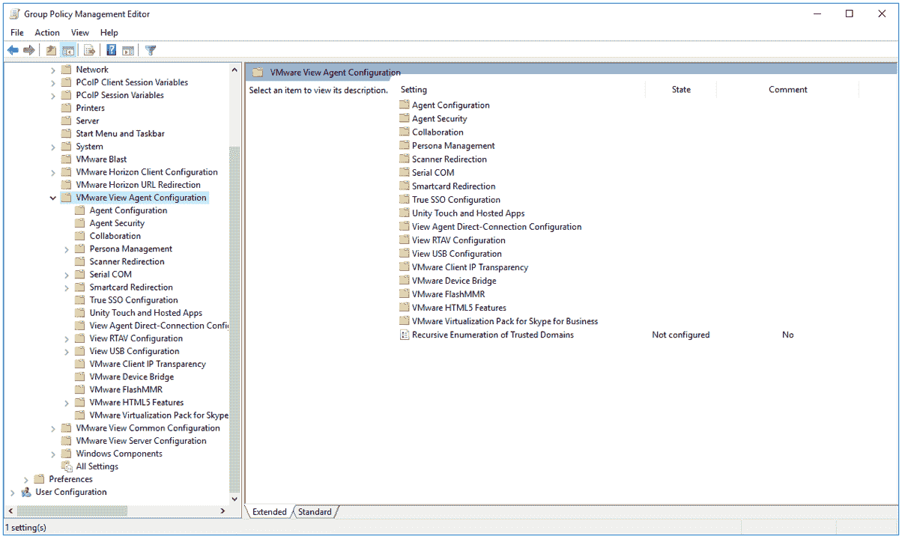
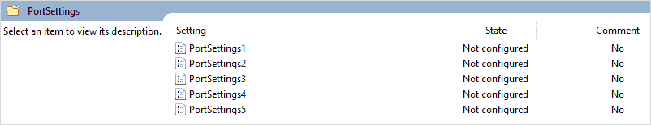
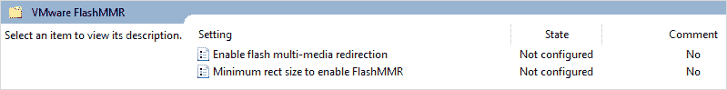

# 第十章：精细调整最终用户体验

到目前为止，我们已经建立了我们的 Horizon View 基础设施，部署并优化了我们的虚拟桌面操作系统，并通过创建 Horizon View 桌面池配置了用户权限。这意味着我们的最终用户现在可以访问他们的虚拟桌面。

在本章中，我们将讨论如何精细调整最终用户体验，我们所指的是桌面的性能表现，并确定将向用户提供哪些功能。

我们已经讨论过优化虚拟桌面操作系统，并且如何调优操作系统使其像虚拟桌面机器一样工作。现在，我们将讨论如何精细调整和配置一些设置，如交付协议，以及启用和禁用与最终用户如何与虚拟桌面机器交互相关的某些功能。我们所指的配置项包括是否可以在运行客户端的终端设备与虚拟桌面之间进行文本剪切和粘贴。

这些配置选项都是通过 Active Directory 群组策略集中部署和管理的。

在本章中，我们将讨论以下主题：

+   配置和准备 **Active Directory**（**AD**）以调优虚拟桌面机器

+   配置 Horizon AD 策略

+   安装 PCoIP 调优工具来配置和调节交付协议

+   调优虚拟桌面以获得最佳性能

# 配置和准备 AD

虚拟桌面机器的行为以及用户如何与其交互是由 AD 策略决定的。正如我们之前提到的，这个策略配置了如图形体验和剪切粘贴选项等内容。

为了简化操作，这些策略的模板已经创建，并作为 Horizon View 软件的一部分随软件下载一起提供，在第四章《安装与配置 Horizon 7 - 第一部分》中可以找到，并保存在名为 `VMware-Horizon-Extras-Bundle-4.9.0-9539668` 的 ZIP 文件中。

我们需要做的第一件事是解压此文件，并将其保存到文件服务器上的共享软件文件夹中。你会看到它包含了 15 个管理模板（`ADMX`）文件，如下图所示：

在下一节中，我们将介绍 AD ADMX 和 ADML 模板以及如何导入它们。

# 导入并应用 Horizon View ADMX 模板

现在你已经解压了模板文件，可以将它们导入。由于我们使用的是 AMDX/ADML 模板，并且正在使用 Windows Server 2016，导入过程非常简单，只需将文件复制到域控制器上的中央位置即可。对于 Windows Server 2019 也是如此。需要复制两组文件，即 `ADMX` 文件和 `ADML` 文件：

1.  首先，将所有 Horizon `ADMX` 文件复制到域控制器的 `C:\Windows\PolicyDefinitions` 文件夹中，如下图所示：

1.  接下来，将 Horizon 的 `ADML` 文件复制到域控制器的 `C:\Windows\PolicyDefinitions\en-US` 文件夹，如下图所示：

在接下来的部分，我们将查看部署虚拟桌面机器所需的 AD OU 要求以及在配置和调优环境之前需要具备的条件。

# 创建组织单位（OU）

首先，您需要为虚拟桌面机器创建一个 **组织单位**（**OU**）。最佳实践是为虚拟桌面机器创建一个单独的 OU，以确保不会将错误的策略应用于它们，例如那些用于物理机器的策略，这些策略可能包含会影响性能的组件，反之亦然。您不希望将基于 VDI 的策略应用于物理桌面设备。

根据您自己的环境，您可能希望为不同的使用场景创建 OU，例如，您可能希望为组织内的每个不同部门创建一个 OU。这样可以为每个 OU 应用不同的基于 VDI 的策略。例如，某个特定部门可能使用高端图形，这意味着 PCoIP 将被配置为提供比标准办公用户更丰富的体验，或者它可能是一个针对 LAN 用户的特定策略，在该策略中，根据可用带宽来管理行为。

在示例实验室中，我们将在域控制器上创建一个名为 `Horizon View Desktops` 的 OU，如下图所示：

要配置该策略，请按照以下步骤操作：

1.  从“活动目录用户和计算机”配置屏幕中，点击高亮显示的域 `pvolab.com`（**1**），然后右键点击。

1.  在现在看到的上下文菜单中，将鼠标移到“新建”（**2**）选项上，然后从下一个上下文菜单中，移到鼠标并点击“组织单位”（**3**）。

1.  在“新建对象 - 组织单位”框中，输入指定的名称来命名这个 OU。在示例实验室中，我们将其命名为 Horizon View Desktops（**4**）。

1.  点击“确定”。

1.  您现在将返回到“活动目录用户和计算机”屏幕，您将看到新创建的 OU 已经添加。

接下来，我们将创建策略并将其链接到这个新 OU，以便将 Horizon 特定的虚拟桌面机器应用于此。

# 为 Horizon View 创建组策略对象（GPO）

现在您已经为虚拟桌面机器创建了一个 OU，您可以创建与该 OU 关联的组策略对象。在示例实验室中，该策略称为 **Horizon View 虚拟桌面策略**：

1.  要开始配置，双击 **Windows 管理工具** 图标以启动管理工具。此时，您将看到显示的 **Windows 管理工具** 屏幕。

1.  从此屏幕向下滚动，然后双击“组策略管理”选项。你现在将看到组策略管理屏幕，如下图所示：

1.  展开`Forest:pvolab.com` (**1**)、`Domains`和`pvolab.com`文件夹。点击并高亮显示`Horizon View Desktops`组织单位 (**2**)，然后右键点击它。

1.  从出现的上下文菜单中，点击“在此域中创建 GPO，并链接到此处...” (**3**)。

1.  现在你将看到“新建 GPO”对话框，如下图所示：

1.  在名称框中，输入该策略的名称。在示例实验室中，我们将其命名为`Horizon View Virtual Desktop Policy`。

1.  点击“确定”。

1.  你现在将返回到组策略管理屏幕，屏幕上将显示新创建的策略，如下图所示：

现在，如果我们编辑新创建的`Horizon View Virtual Desktop Policy`，你将看到列出的新的 Horizon 特定策略选项：

1.  要编辑策略，在组策略管理屏幕中点击并高亮显示`Horizon View Virtual Desktop Policy` (**1**)。

1.  右键点击并从出现的上下文菜单中点击“编辑...” (**2**)，如下图所示：

现在你将看到带有 VMware Horizon 特定策略的组策略管理编辑器界面：

在示例实验室中，我们将所有策略模板添加到一个策略中，仅为展示可用的各种选项。在你的环境中，根据设计需求，你可能需要创建不同的策略，并将不同的模板应用于不同的策略。你甚至可能需要创建不同的组织单位。也许这将按部门或不同的使用案例进行，如我们之前提到的那样。这是推荐的方法，因为它使故障排除和策略管理变得更加简单。

在我们查看每个单独的策略选项之前，在下一部分中，我们将完成最后一个 AD 配置任务：配置回环策略。

# 启用回环策略

在 VDI 模式下，特别是使用浮动桌面分配时，多个用户将访问同一台桌面。为了使用户对某个虚拟桌面机的配置更改应用到所有使用该机器的用户，我们需要启用回环处理功能。如果你在自助服务终端等环境中使用虚拟桌面机，这一点尤为重要。要配置回环模式，请从组策略管理编辑器屏幕完成以下步骤：

1.  启动组策略管理编辑器屏幕，如下图所示：

1.  在“计算机配置”部分，展开`策略`、`管理模板：策略定义`和`系统`文件夹。

1.  高亮显示`组策略` (**1**)。你将看到右侧窗格中列出的策略选项。

1.  向下滚动至“配置用户组策略回环处理模式” (**2**)。点击选中它，然后右键单击。

1.  在弹出的上下文菜单中，点击“编辑”选项 (**3**)。

1.  现在你将看到“配置用户组策略回环处理模式”的配置界面，如下图所示：

1.  点击“启用”单选按钮 (**4**)，以在 Horizon View 虚拟桌面策略中启用该策略。然后，你可以配置模式操作。

1.  点击下拉箭头 (**5**)，选择“替换”选项。

选择“替换”选项时，应用的是与计算机相关的用户策略，其他任何用户策略将被忽略。选择**合并**选项意味着应用的策略既包括用户策略，也包括计算机策略，在发生冲突时，以计算机策略为准。

我们现在已经成功完成了配置 AD 的主要管理员任务。在下一部分中，我们将查看 Horizon View 管理模板中可用的不同策略设置。

# 配置 Horizon View 策略设置

在本节中，我们将介绍 Horizon View ADMX 模板中可以配置的所有不同策略选项，这些模板已被添加到 AD 中。本节将作为参考指南，展示所有可以配置的不同策略设置。

# PCoIP 客户端会话变量

第一组策略设置是关于`PCoIP 客户端会话变量`的。要查看不同的策略设置，在“计算机配置”下，展开`策略`和`管理模板：策略定义`选项，然后点击`PCoIP 客户端会话变量`，如下图所示：

你会看到一个名为`可覆盖的管理员默认值`的文件夹，里面包含不同的设置。这些设置控制来自客户端会话的 PCoIP 协议行为。要编辑某个设置，双击要配置的设置，然后确保它已启用，接着配置相关的设置。

作为示例，我们使用了“配置 PCoIP 虚拟通道”来演示这一点。从组策略管理编辑器界面，双击“配置 PCoIP 虚拟通道”设置，如下图所示：

要配置此策略，请按照以下步骤操作：

1.  要启用策略设置，请点击“启用”单选按钮 (**1**)。

1.  然后，你可以选择屏幕左侧“选项”部分中的设置。在屏幕右侧，你将看到帮助部分中关于各种可用选项的描述。

1.  点击“应用”保存设置。

1.  现在，点击“确定”退出，或点击“下一设置/上一设置”继续浏览其他策略设置。

现在让我们来看一下定义 PCoIP 会话行为的策略设置。

# PCoIP 会话变量

下一组策略设置是关于 `PCoIP 会话变量`，它定义了 PCoIP 在桌面会话中的行为，如下图所示：

我们在此屏幕上突出显示了一个特定设置，那就是“关闭构建到无损功能”设置 (**2**)。

快速强调此设置的原因是，对于那些使用过以前版本 View 的人。在 View 6 之前，PCoIP 构建到无损的默认选项是启用的，这意味着你需要更多的带宽来支持这种级别的图像细节。从 View 6 起，默认设置是将构建到无损功能设置为禁用。

下一组策略设置是用于控制 VMware Blast 协议的，如果你选择使用该协议而不是 PCoIP。

# VMware Blast

下一组策略设置是配置 `VMware Blast` 传输协议，它允许你定义协议的行为，如下图所示：

下一组策略设置是配置 `VMware Horizon 客户端配置`。

# VMware Horizon 客户端配置

下一组策略设置是配置 `VMware Horizon 客户端配置`，它定义了 Horizon 客户端的行为，如下图所示：

在此特定配置选项下，你可以看到主标题下有一些策略设置。然而，还有一些子文件夹，其中也包含了一些设置，我们将在接下来的部分中列出。

# 脚本定义

在 `脚本定义` 子文件夹中，你将找到以下用于脚本定义的策略设置：

接下来，我们有安全设置的配置选项。

# 安全设置

在 `安全设置` 子文件夹中，你将找到以下用于管理 SSL 和证书管理的安全设置策略：

接下来，我们有 USB 配置选项。

# 查看 USB 配置

在 `View USB 配置` 文件夹中，以及文件夹根目录中的设置外，还包含一个子文件夹，内有其他设置，如下图所示：

`代理无法配置的设置`文件夹中的政策设置将在下一节中展示。

# 代理无法配置的设置

`代理无法配置的设置`文件夹中的政策设置将在下图中展示：

现在，我们已经概述了所有在 VMware Horizon 客户端配置部分中涵盖的政策设置。接下来是关于 URL 重定向的选项，相关内容将在下一节中介绍。

# VMware Horizon URL 重定向

在`VMware Horizon URL 重定向`文件夹中，您将找到管理 URL 重定向功能的政策设置，如下图所示：

在下一节中，我们将查看 View Agent 的配置选项。

# Horizon View 代理配置

在`VMware View Agent 配置`文件夹中，您将看到根文件夹中只有一个政策设置，其他的都被划分到子文件夹中，如下图所示：

在下一节中，我们将查看`VMware View Agent 配置`子文件夹中的政策设置选项，首先从`代理配置`开始。

# 代理配置

在`代理配置`文件夹中，您将找到代理配置的政策设置，如下图所示：

在下一节中，我们将查看`代理安全性`子文件夹中的政策设置选项。

# 代理安全性

在`代理安全性`子文件夹中，您将找到政策设置，如下图所示：

在下一节中，我们将查看`协作`子文件夹中的政策设置选项。

# 协作

在`协作`子文件夹中，您将找到政策设置，如下图所示：

在下一节中，我们将查看`人物管理`子文件夹中的政策设置选项。

# 人物管理

在`人物管理`子文件夹中，您会看到政策设置被进一步划分为子文件夹，如下图所示：

我们将在接下来的章节中覆盖这些子文件夹中的政策设置。

# 桌面 UI

在`桌面 UI`子文件夹中，您将找到政策设置，如下图所示：

在下一节中，我们将查看`文件夹重定向`子文件夹中的政策设置选项。

# 文件夹重定向

在`文件夹重定向`子文件夹中，您将找到政策设置，如下图所示：

在接下来的部分中，我们将查看`日志记录`子文件夹中的策略设置选项。

# 日志记录

在`日志记录`子文件夹中，您将找到如下截图所示的策略设置：

在接下来的部分中，我们将查看`漫游和同步`子文件夹中的策略设置选项。

# 漫游和同步

在`漫游和同步`子文件夹中，您将找到如下截图所示的策略设置：

在接下来的部分中，我们将查看`故障排除`子文件夹中的策略设置选项。

# 故障排除

在`故障排除`子文件夹中，您将找到如下截图所示的策略设置：

在接下来的部分中，我们将查看`扫描仪重定向`子文件夹中的策略设置选项。

# 扫描仪重定向

在`扫描仪重定向`子文件夹中，您将找到如下截图所示的策略设置：

在接下来的部分中，我们将查看`串行 COM`子文件夹中的策略设置选项。

# 串行 COM

在`串行 COM`子文件夹中，您将找到如下截图所示的策略设置，以及另一个子文件夹。

在接下来的部分中，我们将查看`PortSettings`子文件夹中的策略设置选项。

# PortSettings

在`PortSettings`子文件夹中，您将找到如下截图所示的策略设置：

在接下来的部分中，我们将查看`智能卡重定向`子文件夹中的策略设置选项。

# 智能卡重定向

在`智能卡重定向`子文件夹中，您将看到没有实际设置，只有另一个子文件夹，如下截图所示：

在接下来的部分中，我们将查看`本地读卡器访问`子文件夹中的策略设置选项。

# 本地读卡器访问

在`本地读卡器访问`子文件夹中，您将找到如下截图所示的策略设置：

在接下来的部分中，我们将查看`True SSO Configuration`子文件夹中的策略设置选项。

# True SSO Configuration

在`True SSO Configuration`子文件夹中，您将找到如下截图所示的策略设置：

在接下来的部分中，我们将查看`Unity Touch and Hosted Apps`子文件夹中的策略设置选项。

# Unity Touch and Hosted Apps

在`Unity Touch and Hosted Apps`子文件夹中，您将找到如下截图所示的策略设置：

在接下来的部分中，我们将查看 `View Agent Direct-Connection Configuration` 子文件夹中的策略设置选项。

# 查看 Agent 直接连接配置

在 `View Agent Direct-Connection Configuration` 子文件夹中，您将找到策略设置，如下图所示：

在接下来的部分中，我们将查看 `View RTAV Configuration` 子文件夹中的策略设置选项。

# 查看 RTAV 配置

在 `View ATV Configuration` 子文件夹中，您将找到一个策略设置和另一个子文件夹，如下图所示：

在接下来的部分中，我们将查看 `View RTAV Webcam Setings` 子文件夹中的策略设置选项。

# 查看 RTAV 摄像头设置

在 `View RTAV Webcam Settings` 子文件夹中，您将找到策略设置，如下图所示：

在接下来的部分中，我们将查看 `View USB Configuration` 子文件夹中的策略设置选项。

# 查看 USB 配置

在 `View USB Configuration` 子文件夹中，您将找到策略设置，如下图所示：

在接下来的部分中，我们将查看 `Client Downloadable only Settings` 子文件夹中的策略设置选项。

# 仅客户端可下载设置

在 `Client Downloadable only Settings` 子文件夹中，您将找到策略设置，如下图所示：

在接下来的部分中，我们将查看 `VMware Client IP Transparency` 子文件夹中的策略设置选项。

# VMware Client IP Transparency

在 `VMware Client IP Transparency` 子文件夹中，您将找到策略设置，如下图所示：

在接下来的部分中，我们将查看 `VMware Device Bridge` 子文件夹中的策略设置选项。

# VMware Device Bridge

在 **`VMware Device Badge`** 子文件夹中，您将找到策略设置，如下图所示：

在接下来的部分中，我们将查看 `VMware Flash MMR` 子文件夹中的策略设置选项。

# VMware Flash MMR

在 `VMware Flash MMR` 子文件夹中，您将找到策略设置，如下图所示：

在接下来的部分中，我们将查看 `VMware HTML5 Features` 子文件夹中的策略设置选项。

# VMware HTML5 功能

在 `VMware HTML5 Features` 子文件夹中，您将找到两个策略设置和两个额外的子文件夹，如下图所示：

在下一节中，我们将查看`VMware Geolocation Redirection`子文件夹中的策略设置选项。

# VMware 地理位置重定向

在`VMware Geolocation Redirection`子文件夹中，您将找到以下截图所示的策略设置：

在下一节中，我们将查看`VMware HTML5 Multimedia Redirection`子文件夹中的策略设置选项。

# VMware HTML5 多媒体重定向

在`VMware HTML5 Multimedia Redirection`子文件夹中，您将找到以下截图所示的策略设置：

在下一节中，我们将查看`VMware Virtualization Pack for Skype for the Business`子文件夹中的策略设置选项。

# VMware Virtualization Pack for Skype for Business

在`VMware Virtualization Pack for Skype for Business`子文件夹中，您将找到以下截图所示的策略设置：

在下一节中，我们将返回到顶层策略文件夹，并查看`VMware View Common Configuration`策略设置的选项。

# VMware View 通用配置

在`VMware View Common Configuration`子文件夹中，您将找到三个策略设置和三个子文件夹，如下图所示：

在下一节中，我们将查看`Log Configuration`子文件夹中的策略设置选项。

# 日志配置

在`Log Configuration`子文件夹中，您将找到以下截图所示的策略设置：

在下一节中，我们将查看`Performance Alarms`子文件夹中的策略设置选项。

# 性能警报

在`Performance Alarms`子文件夹中，您将找到以下截图所示的策略设置：

在下一节中，我们将查看`Security Configuration`子文件夹中的策略设置选项。

# 安全配置

在`Security Configuration`子文件夹中，您将找到以下截图所示的策略设置：

在下一节中，我们将返回到顶层策略文件夹，并查看`VMware View Server Configuration`策略设置的最终选项。

# VMware View Server 配置

在`VMware View Server Configuration`子文件夹中，您将找到以下截图所示的策略设置：

现在我们已经展示了来自 VMware View ADMX 模板的所有策略配置选项。在接下来的部分中，我们将介绍一种专门用于调优 PCoIP 协议的工具，前提是你选择使用该协议来交付虚拟桌面机器。

# PCoIP 调优工具

本章要讲解的最后一件事是如何使用 PCoIP 调优工具动态调整虚拟桌面机器。你可以通过以下链接下载此工具：[`tinyurl.com/ocqxykn`](http://tinyurl.com/ocqxykn)。

该调优工具的功能之一是能够动态更改设置，而不是手动编辑策略。这很方便，因为从政策的数量来看，有很多不同的可配置选项。

下载工具后，在你想要调整的虚拟桌面机器上启动它。最好在母版镜像上进行此操作，并且可以让最终用户参与，以便不仅获得他们的反馈，还能让他们接受该解决方案。

启动工具后，你将看到有多个选项可供选择：

+   激活配置文件

+   管理配置文件

+   清除配置文件设置

+   显示会话统计

+   显示会话健康

以下截图展示了这些选项：

在接下来的部分中，我们将简要介绍每个选项的配置用途。

# 激活配置文件

激活配置文件设置允许你激活预设的配置文件。每个配置文件都是基于不同的使用场景构建的，目前已有三个预设配置文件可供选择。一个是默认用户配置文件，一个是基于 WAN 用户的配置文件，另一个是针对任务工作者的配置文件。

通过选择一个预设配置文件，诸如会话带宽、图像质量或帧率等设置将会更新并改变为匹配该特定使用场景的设置。

要激活配置文件，你需要重启虚拟桌面机器。

# 管理配置文件

“管理配置文件”选项允许你调整特定配置文件的设置。你可以动态更改图像质量、帧率、带宽，并开启无损构建功能。你可以选择预设的配置文件或创建新的配置文件并保存。

# 清除配置文件设置

清除配置文件设置将清除配置文件设置并将其恢复为默认设置。

# 显示会话统计

“显示会话统计”选项会显示实时使用统计信息，例如带宽、每秒帧数、延迟和 CPU 利用率，帮助你了解特定虚拟桌面机器的资源消耗。点击此选项后，它会在桌面上显示，便于你进行监控。

# 显示会话健康

与会话统计选项类似，点击此选项后，您实际上是将其启用，并且它会出现在桌面上。它为 PCoIP 会话提供健康分数，帮助您了解可能存在的问题。例如，延迟分数可能较低，表明客户端与虚拟桌面之间的延迟较高。

如果您需要更深入的性能、容量规划和故障排除概述，值得安装 vRealize Operations for Horizon，它作为 VMware Horizon 企业版产品的一部分，或者考虑使用第三方用户体验监控工具，如 Liquidware Labs 的 Stratusphere UX。

# Teradici 的 PCoIP 支持工具

除了 VMware 和其他第三方解决方案外，PCoIP 协议的发明者 Teradici 也提供了一些工具来帮助调优体验，包括网络带宽计算器和 PCoIP 统计视图器。

要访问工具，请访问以下链接：[`tinyurl.com/qacpzr4`](http://tinyurl.com/qacpzr4)。

您需要拥有 Teradici 支持帐户才能访问这些工具，您可以免费创建该帐户。

在下一部分，我们将着重介绍监控最终用户体验，以确保其运行在最佳状态。

# 监控最终用户体验

一旦您调整了桌面的性能，应该考虑部署最终用户体验监控解决方案，以确保初始体验和性能得以维持，并确保解决方案以最佳状态运行。

我们已经提到过 vRealize Operations for Horizon，但该工具更适合监控基础设施组件，而非最终用户体验。

更专注于最终用户体验监控的工具，比如 Liquidware 的 Stratusphere UX，会深入到最终用户的操作，例如应用程序启动时间、应用程序崩溃，并为您提供完整的登录过程分解。以下截图展示了 Stratusphere 仪表盘的一个示例：

Liquidware 解决方案的另一个优势是，Stratusphere UX 基于与评估阶段相同的解决方案。因此，它使您能够将初步基线评估数据（即起点）与生产环境进行对比，并轻松展示在迁移到新环境后所做的改进。

欲了解更多信息，请访问：[`www.liquidware.com/products/stratusphere-ux`](https://www.liquidware.com/products/stratusphere-ux)。

# 总结

本章中，我们已了解如何开始微调虚拟桌面机器的性能和最终用户体验。

为此，我们已经介绍了如何准备 AD 并使用 Horizon View 特定的策略和管理模板，来定义虚拟桌面机器的行为，以及整体的最终用户体验。

然后，我们展示了每个独立的策略设置。

最后，我们查看了许多可以帮助调优过程的工具，以及如何监控用户体验。我们介绍了如 PCoIP 调优工具、Liquidware Stratusphere 及其 Spotcheck 功能等工具。

在下一章中，我们将探讨如何在 Horizon View 环境中使用 View Persona Management 和 VMware 的**用户环境管理**（**UEM**）来管理用户配置文件。
