# 使用 Horizon 7 交付发布的应用程序

到目前为止，本书主要集中在虚拟桌面机器的交付上，但 Horizon View 还具有交付远程应用程序或称为发布应用程序的能力，以及基于会话的桌面，所有这些都可以通过同一个平台进行交付。在本章中，我们将深入探讨这一功能，它是 Horizon Advanced Edition 及以上版本的一部分，并查看 Horizon View 如何直接将应用程序发布到 Horizon View 客户端，而无需启动完整的虚拟桌面机器。

一个使用案例可能是呼叫中心工作人员，他们只需要使用几个不同的应用程序。从管理角度来看，直接提供他们所需的应用程序比提供完整的虚拟桌面要简单得多。另一个使用案例是能够通过 View 客户端在通常无法运行该应用程序的设备上启动应用程序。例如，你可以在 iPad 上通过 Horizon View 客户端运行“真实”版本的 Microsoft Word。

这一基础设施要求基于后台运行的 Microsoft **远程桌面服务**（**RDS**），而 Horizon View 充当中介，将用户与应用程序或桌面会话连接。由于它是基于 View 的，因此使用 View 协议（如 PCoIP 和 Blast）作为交付协议，利用这些协议所提供的所有功能，正如我们之前讨论的那样。

在本章中，我们将涵盖以下主题：

+   架构概述

+   RDSH 规模化指南

+   安装和配置 View 托管应用程序

+   安装 Horizon View Agent 以支持 RDSH

+   在 View 管理员中配置发布的应用程序

+   在 Horizon View 中进行发布应用程序的负载均衡

# 架构概述

那么，架构是什么样的，当与虚拟桌面机器的调度进行比较时，托管应用程序功能是如何工作的？从架构的角度来看，交付托管应用程序的方式与虚拟桌面机器的管理和调度方式几乎相同。

Horizon View 充当中介，使用相同的连接服务器，但它不再调度运行在 ESXi 主机服务器上的虚拟桌面机器，而是调度运行在 Microsoft Windows 服务器上的应用程序会话，该服务器配置了 RDSH 角色，并安装了应用程序。

以下图表为你提供了交付托管应用程序的架构概览：

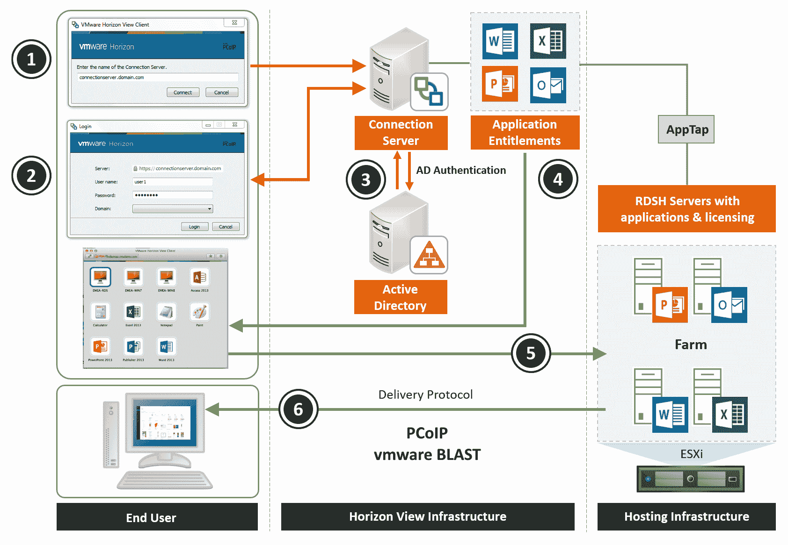

那么，托管应用程序功能是如何工作的呢？

首先，与连接到虚拟桌面机器类似，你需要启动 View 客户端并登录到连接服务器。输入你要连接的 View 连接服务器的详细信息（**1**），输入用户名和密码（**2**），然后通过 AD 进行身份验证（**3**）。

一旦身份验证通过，客户端向连接服务器发送 `<get-launch-items>` 请求，要求列出该用户所有有权限的应用程序会话、应用程序和桌面。响应中包含以下详细信息：

+   `<app-sessions>`，`<desktops>`，和 `<applications>`

+   图标的绝对路径

客户端通过 HTTPS 获取任何尚未缓存的图标，使用连接服务器发送响应时提供的路径。

对图标**统一资源标识符**（**URIs**）的访问需要进行身份验证。连接服务器会执行权限检查，只有当用户有权访问至少一个与图标相关的应用程序时，才会返回图标。对于没有任何图标的应用程序，客户端将提供一个默认图标。

然后，一组有权限的桌面和应用程序池在 View 客户端中显示给最终用户（**4**）。

最终用户随后双击某个应用程序（或桌面）以启动它（**5**），建立连接，应用程序在新窗口中打开（**6**）。

在下一节中，我们将深入探讨连接过程中的发生情况，以便将用户连接到他们请求的应用程序或桌面会话。

# 应用程序连接顺序

在本节中，我们将连接过程拆分为三个独立的部分，展示当用户启动应用程序时发生的流程。

该过程从最终用户双击启动应用程序开始，并在下图中进行了说明：

现在，我们有一个通过 View 客户端向连接服务器请求启动应用程序的用户。

连接过程的下一阶段是连接服务器与安装在 RDS 主机服务器上的 Horizon Agent 进行通信。

下图说明了该过程的下一部分：

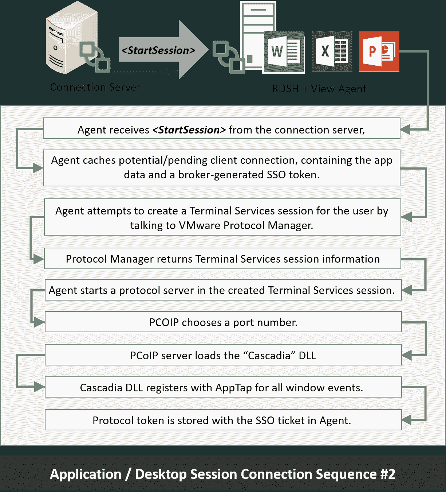

连接过程的下一步是建立与**PCoIP 安全网关服务器**（**PSG**）的安全连接。

通过与 PSG 通信，RDS 服务器上的 View 代理设置了一个隧道。然后，这个连接的详细信息通过连接服务器转发回客户端。这基本上与连接到托管在 ESXi 主机服务器上的虚拟桌面机器时的过程相同。

该过程在下图中进行了说明，并展示了流程的最后一部分，即将最终用户登录并将其连接到他们请求的应用程序：

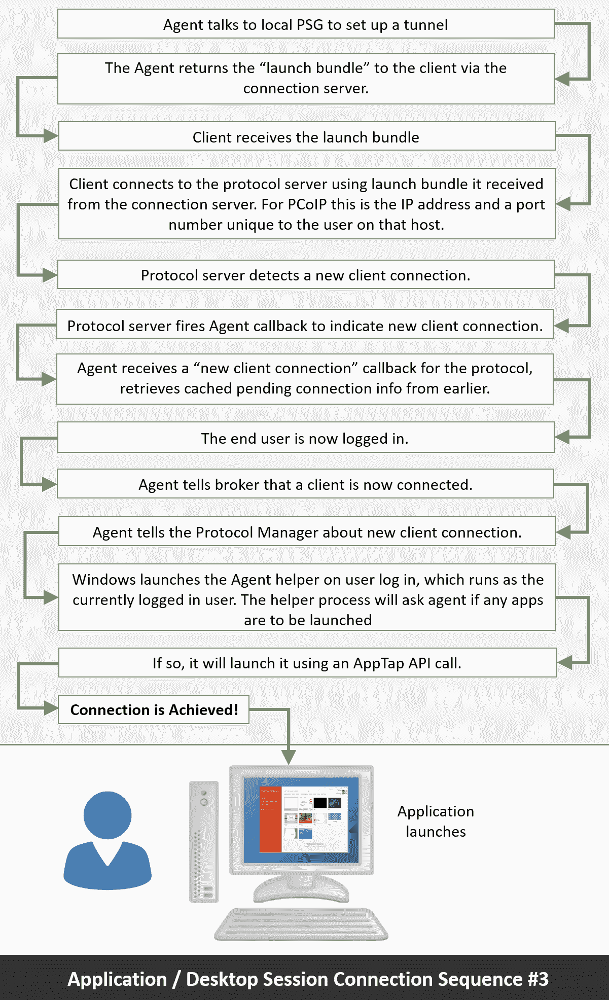

我们已经深入探讨了将最终用户连接到远程应用程序的过程。在下一节中，我们将重点介绍 RDS 角色在此环境中的一些具体内容，从尺寸指南开始。

# RDSH 尺寸指南

与虚拟桌面机器的 View 大小配置一样，配置 RDSH 服务器的正确规格也至关重要，类似于我们考虑桌面大小配置的方式，我们将查看不同的用户类型。

VMware 对用户工作负载和内存需求的建议显示在下表中：

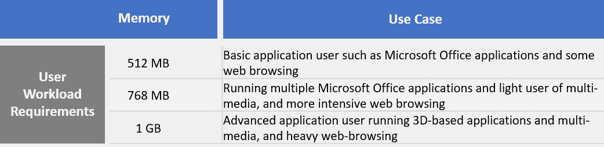

对于每台 RDSH 服务器的总内存，VMware 建议将配置为 RDSH 服务器的虚拟机分配 64 GB 内存，至于 CPU 要求，VMware 建议为 RDSH 角色创建虚拟服务器，并为每台服务器配置四个 vCPU。确保不要过度分配核心数。

所以，举个例子，如果您有一台配置为 64 GB 内存的虚拟机运行 RDSH 服务器，并且上面托管了大量用户，您将能够在该服务器上最多托管 64 个会话。

对于硬件配置，假设您有一台物理 ESXi 主机服务器，配置了一个 12 核心的 2 插槽 CPU，总共提供 24 个核心。

这将允许最多 6 台 RDSH 服务器，因为我们将为每台有 4 个核心的虚拟机配置 RDSH 角色（每台服务器 24 个核心/每台服务器 4 个核心）。这意味着物理服务器的总内存也需要配置为 384 GB（6 台 RDSH 主机服务器，每台 64 GB）。

这些数字仅作为指导，并基于一些 VMware 推荐的最佳实践。最好对您的环境进行评估，以确定最佳配置。

在接下来的章节中，我们将安装并配置视图托管应用程序功能。

# 安装和配置视图托管应用程序

现在我们将开始安装过程，从配置将用于托管远程应用程序的服务器开始，方法是向其添加 RDSH 角色。在示例实验室中，已经有一台名为**RDSH-Apps**的 Windows Server 2016 服务器准备好执行此角色。

安装和配置过程非常直接，可以通过以下示意图来总结：

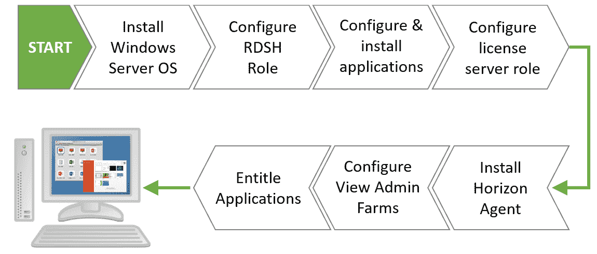

在接下来的章节中，我们将更详细地介绍这一过程，从配置 RDSH 角色开始。

# 配置 RDS 服务器角色

我们将要做的第一件事是配置 RDSH 服务器角色，然后配置此服务器来提供远程应用程序。在示例实验室中，我们将配置的服务器名为**RDSH-Apps**。要配置 RDSH 角色，请执行以下步骤：

1.  打开到服务器的控制台，然后在服务器管理器和仪表板屏幕中，点击“添加角色和功能” (**1**)，如下图所示：


1.  您将看到的第一个屏幕是“开始之前”屏幕，如下图所示：

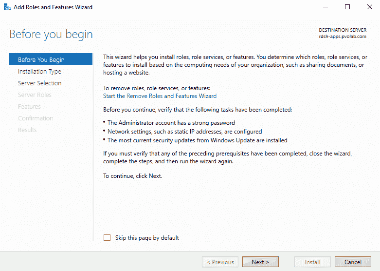

1.  点击“下一步 >”继续。

1.  现在你将看到选择安装类型屏幕，如下图所示：

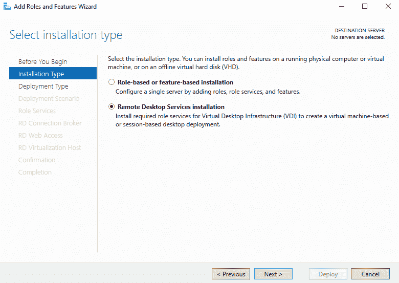

1.  点击远程桌面服务安装单选按钮，然后点击“下一步 >”继续。

1.  现在你将看到选择部署类型屏幕，如下图所示：

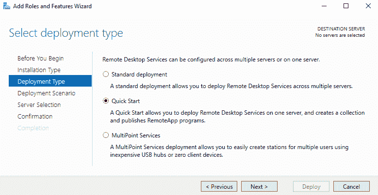

1.  点击快速启动单选按钮，然后点击“下一步 >”继续。

1.  现在你将看到选择部署场景**o**屏幕，如下图所示：

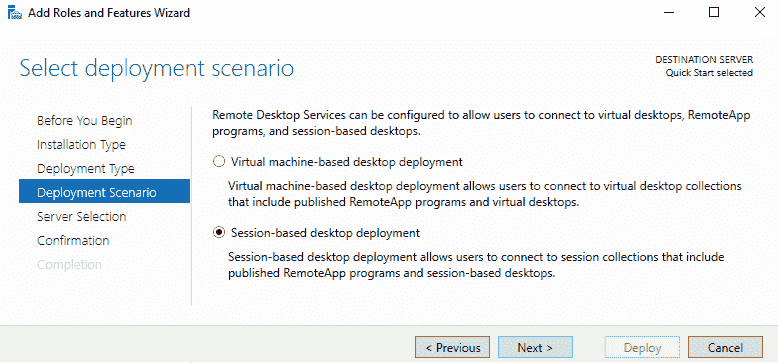

1.  点击基于会话的桌面部署单选按钮，然后点击“下一步 >”继续。

1.  现在你将看到选择服务器屏幕，如下图所示：

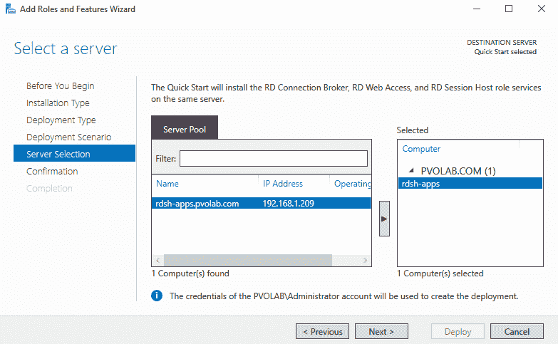

1.  在服务器池框中，点击并高亮你想安装 RDSH 角色的服务器，并点击箭头将其添加到已选择框中。在示例实验室中，这是名为`rdsh-apps.pvolab.com`的服务器。

1.  点击“下一步 >”继续。

1.  现在你将看到确认选择屏幕，如下图所示：

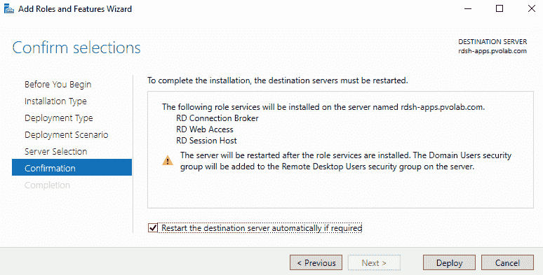

1.  检查将要安装的服务，然后勾选“如果需要，自动重启目标服务器”复选框。

1.  点击部署以开始安装。

1.  现在你将看到安装的进度，如下图所示：

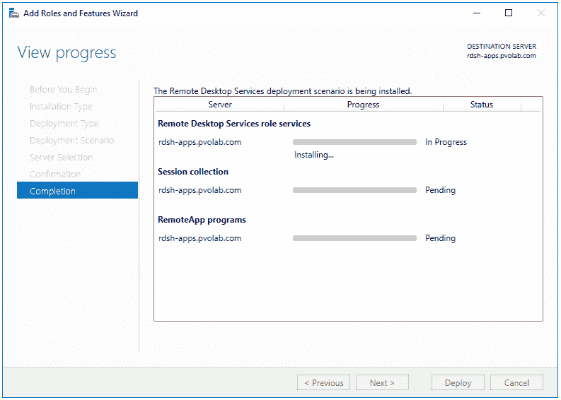

1.  在安装过程中，服务器将重新启动。重新启动后，重新登录并再次启动服务器管理器以监控其余的安装过程。

1.  安装完成后，从服务器管理器仪表盘**，**你现在会看到远程桌面服务角色已添加，如下图所示：

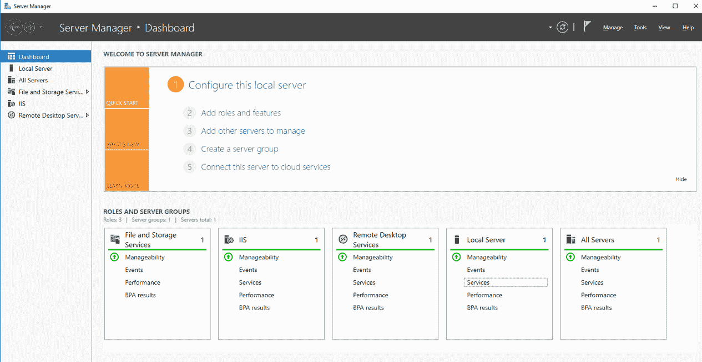

你现在已经成功安装了 RDS 角色。

你需要在此服务器上添加并配置远程桌面授权角色。

在接下来的部分，我们将配置一些示例应用程序，这些应用程序将作为远程应用程序提供。

# 使用标准远程应用程序进行测试

我们将要为基于会话的远程访问配置的第一个应用程序是那些集成到 Windows 操作系统中的应用程序，并且在创建 RDSH 服务器角色时默认配置。这些包括计算器和记事本等应用程序。

我们将通过首先检查这些应用程序是否已配置，然后测试我们是否可以远程访问它们，来测试这些应用程序是否作为远程应用程序工作，之后再配置 Horizon View 组件和任何额外的应用程序：

1.  在服务器管理器仪表盘屏幕中，点击远程桌面服务（**1**），如图所示：

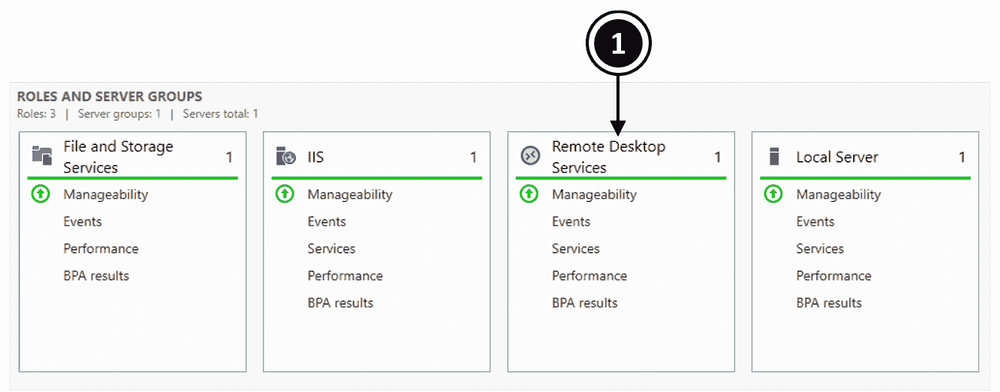

1.  你将看到配置了 RDSH 角色的服务器列表，如下图所示：

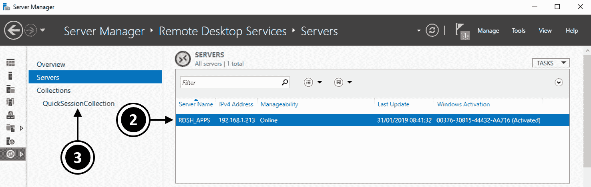

1.  点击突出显示`RDSH_APPS`服务器，然后点击快速会话集合（**3**）。

1.  你将看到“快速会话集合”和“远程应用程序程序”（**4**）框，如下图所示：

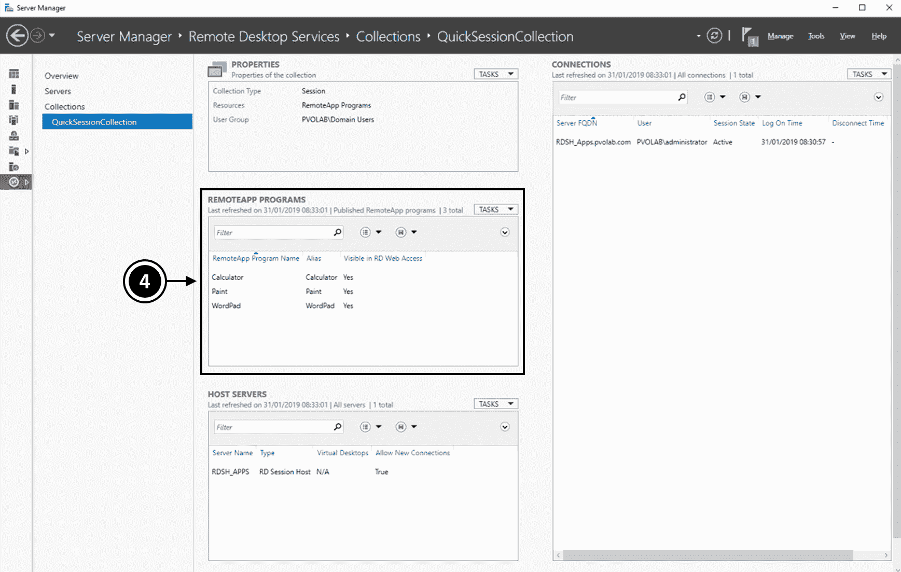

这将显示 WordPad、画图和计算器作为可用的远程应用程序。

既然标准应用程序已经作为远程会话提供给最终用户，我们将尝试通过 RD Web Access Web 门户连接，以测试一切是否正常，然后继续配置。为此，请按照以下步骤操作：

1.  从你的桌面或服务器本身打开浏览器。最好从远程桌面进行测试，而不是直接从服务器进行测试。

1.  在浏览器中，输入 RDSH 服务器的 URL。在本实验室中，这个地址是 `https://rdsh-apps.pvolab.com/rdweb`**。**

1.  你将看到登录界面，如下图所示：

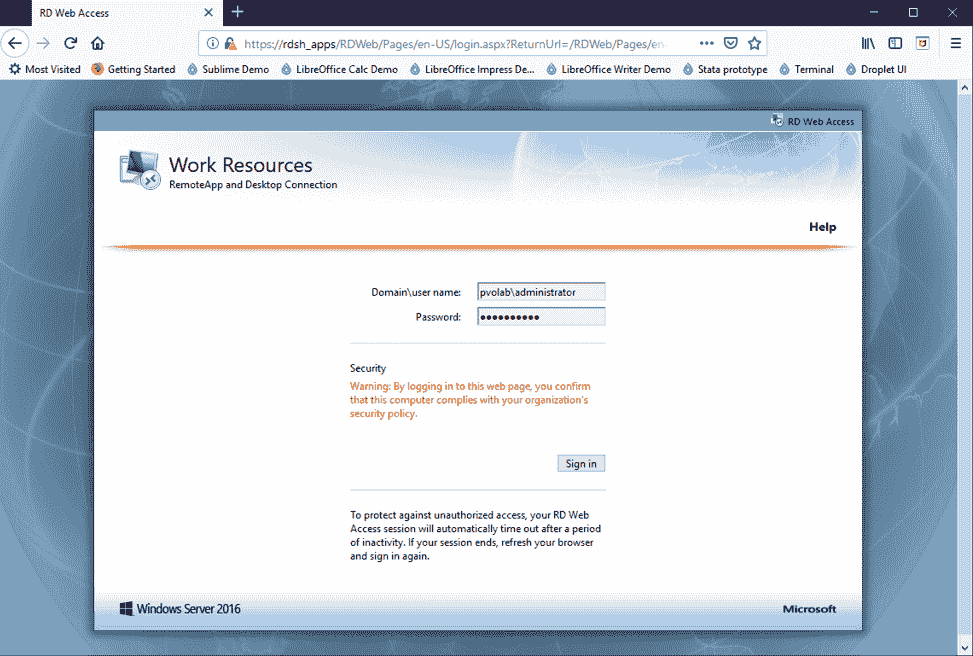

1.  在“域\用户名”框中，输入格式为“域\用户名”的用户名。所以，在这个例子中，我们使用`pvolab\administrator`格式作为管理员登录。然后输入密码。

1.  现在点击“登录”按钮。你将看到以下“工作资源”网页，显示可用的应用程序：

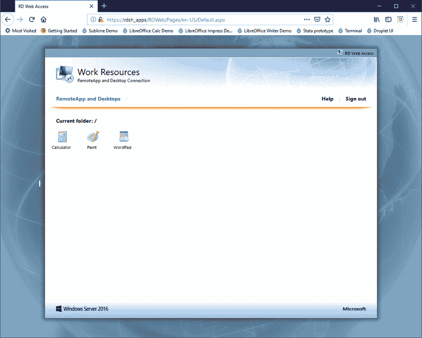

为了测试应用程序是否启动，双击它。在这个例子中，我们将启动计算器。计算器应该能够成功启动，如下图所示：

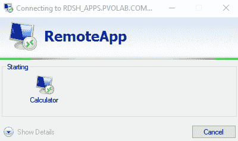

现在一切正常，应用程序可以发布和启动，在下一节中，我们将添加一些更多的应用程序。

# 安装额外的应用程序

在本节中，我们将安装一些额外的远程访问应用程序，从 Microsoft Office 2016 开始。

安装应用程序几乎和在任何其他 Windows 操作系统上安装应用程序一样；但是，由于这是远程会话主机服务器，因此有一些细微的差别。我们将简要介绍这个过程，如以下步骤所示：

1.  由于我们将要安装 Microsoft Office 2016，首先需要做的是挂载包含安装程序的 ISO 镜像，如下图所示：

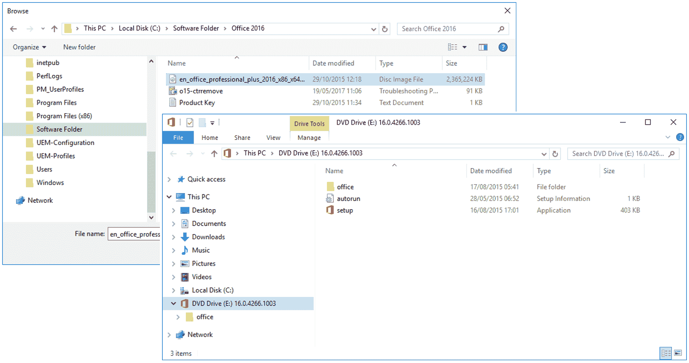

现在我们可以开始实际的安装过程了。

1.  打开控制台并连接到你想要安装应用程序的 RDSH 服务器，然后打开控制面板**，**如下面的截图所示：


1.  点击“程序”。现在你将看到“程序”对话框，如下图所示：

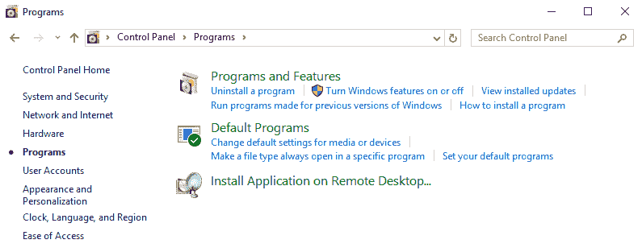

1.  点击“在远程桌面上安装应用程序...”。

1.  现在你将看到“从软盘或 CD-ROM 安装程序”对话框，如下图所示：

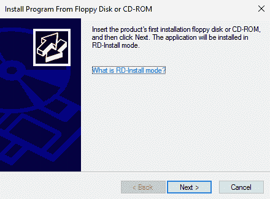

在我们继续之前，我们将讨论如何在 RDSH 服务器上安装应用程序。在这个对话框中，突出了一个叫做**RD-Install 模式**的东西；那么，这是什么意思呢？

要在 RDSH 主机服务器上安装应用程序，需要将其切换到一种名为**RD-Install**的特殊安装模式，以确保应用程序能够在多用户环境中运行。

一旦你在 RDSH 服务器上安装了应用程序，服务器需要切换回所谓的执行模式，即**RD-Execute**，以便用户可以远程连接到服务器及其上运行的应用程序。

这也可以通过命令行完成，使用以下命令：

```
change user /install change user /execute
```

你可以使用以下命令检查 RDSH 服务器的当前安装模式：

```
change user /query
```

安装应用程序最简单的方法是通过控制面板中的“程序”选项，这是我们在本例中将使用的方法。该选项通过自动将服务器切换到 RD-Install 模式、安装程序，并在完成后将服务器切换回 RD-Execute 模式，带你完成整个安装过程。让我们继续安装：

1.  点击“下一步 >”开始安装。

1.  现在你将看到“运行安装程序”对话框，如下图所示：

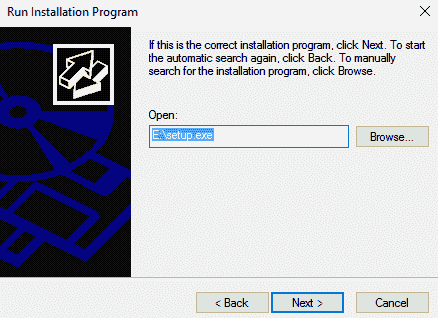

1.  点击“浏览...”按钮，然后导航到你想要安装的应用程序的安装程序。在示例实验室中，这个安装程序是我们在本节开始时挂载的 ISO 镜像中的`setup.exe`文件，安装的是 Microsoft Office 2016。

1.  现在点击“下一步 >”继续。

1.  你首先看到的是“完成管理员安装”对话框，如下图所示：

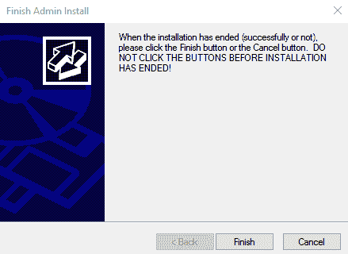

现在忽略这个对话框，确保此时**不要**点击**完成**按钮。你需要先完成应用程序的安装。

1.  Office 2016 的安装现在将开始，你应该按照通常的方式安装 Office。

1.  安装完成后，返回“完成管理员安装”框并点击“完成”按钮。

现在 Microsoft Office 2016 已经安装在 RDSH 服务器上，你需要返回并配置哪些单个 Office 套件应用程序将作为远程应用程序提供给用户。为此，请执行以下步骤：

1.  在“服务器管理器”仪表板屏幕上，点击“远程桌面服务”。

1.  高亮选择你想要配置的 RDSH 服务器，然后点击“QuickSessionCollection”（**1**），如下图所示：

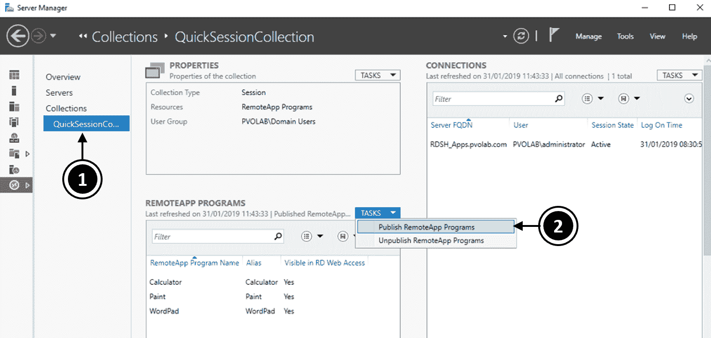

1.  +   向下滚动到 REMOTEAPP PROGRAMS 对话框，然后点击屏幕右上角任务按钮上的下拉箭头，接着点击发布 RemoteApp 程序 (**4**)。

    +   现在您将看到选择 RemoteApp 程序配置屏幕，如下图所示：

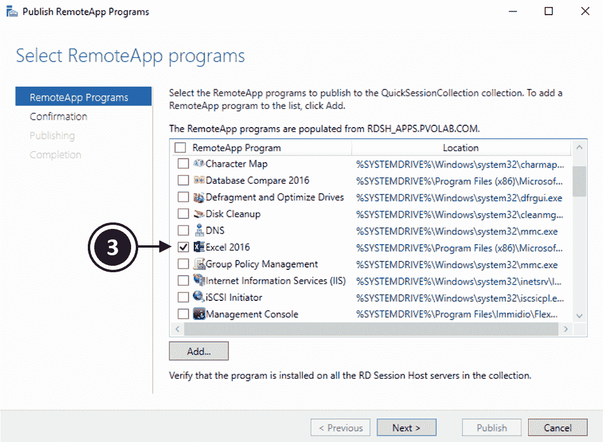

1.  在这里，您可以选择要发布的应用程序，并使其可以远程访问给终端用户。

1.  勾选您要添加的应用程序旁边的复选框 (**3**)。在示例实验室中，我们将勾选以下应用程序：

    +   Excel 2016

    +   OneNote 2016

    +   Outlook 2016

    +   PowerPoint 2016

    +   Publisher 2016

    +   Word 2016

1.  在这里，您可以选择要发布的应用程序，并使其可以远程访问给终端用户。

1.  选择您要发布的所有应用程序后，点击“下一步 >”按钮。

1.  您将看到您选择的应用程序的确认框，如下图所示：

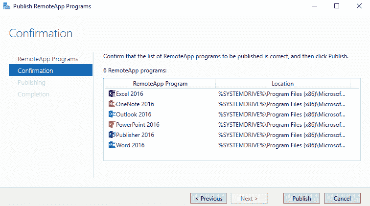

1.  现在点击“发布”按钮。

1.  然后您将看到一个进度条，显示应用程序发布的进度，如下图所示：

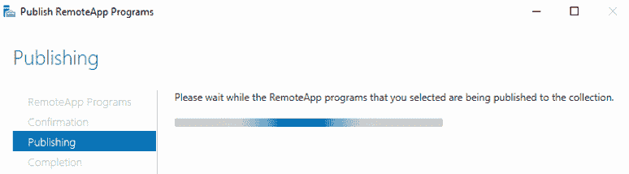

1.  完成后，您将看到完成屏幕，如下图所示，显示已成功发布的应用程序：

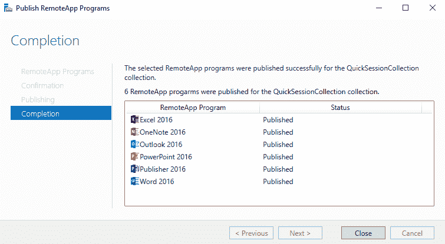

1.  点击“关闭”按钮以完成发布过程。

如前所述，我们将测试应用程序是否可以通过 Web 访问门户访问。打开浏览器并访问以下地址：`https://rdsh-apps.pvolab.com/rdweb`**。**

使用管理员账户登录到门户。

您将看到来自 RD Web 访问门户的以下截图，显示新发布的 Office 2016 应用程序：

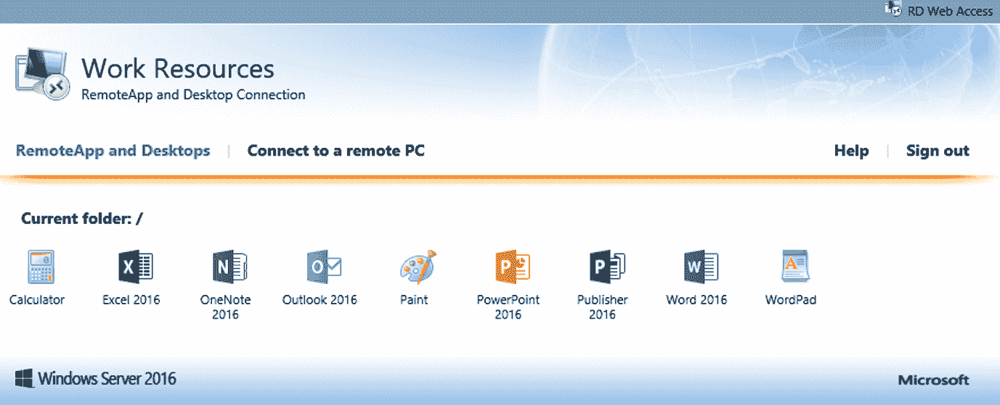

如您所见，新发布的 Office 应用程序已对终端用户可用。双击其中一个程序，测试它是否能启动，确认正常运行后，点击“登出”并关闭网页。

在下一部分，我们将安装 Horizon Agent 到 RDSH 服务器。

# 安装 Horizon Agent 到 RDSH

在接下来的步骤中，我们将把 Horizon View Agent 安装到 RDSH 服务器上。该代理与安装在虚拟桌面机器上的代理完全相同，并将 RDSH 注册到 Horizon Connection Server 上。安装代理，请执行以下步骤：

1.  打开一个远程控制台，连接到运行应用程序的 RDSH 服务器，进入共享的软件文件夹，然后找到代理安装程序，如下图所示：

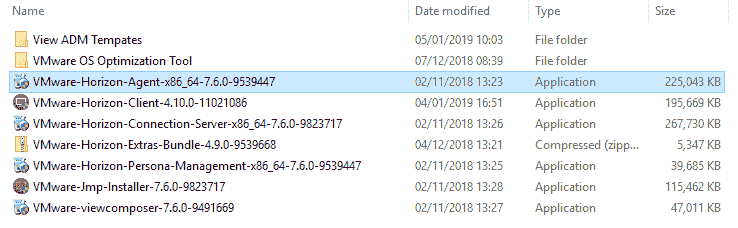

1.  双击启动 `VMware-Horizon-Agent-x86_64-7.6.0-9539447`。文件名末尾的七位数字表示构建版本，因此根据你使用的构建版本，数字可能不同。

1.  你将看到“欢迎使用 VMware Horizon View Agent 安装向导”对话框，如下图所示：

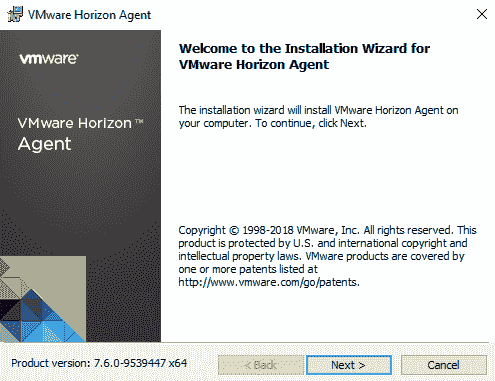

1.  点击“下一步 >”按钮开始安装。

1.  现在你将看到许可协议对话框，如下图所示：

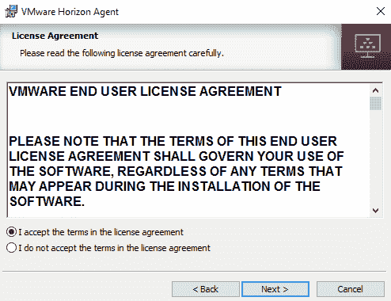

1.  选中“我接受许可协议中的条款”的单选按钮，然后点击“下一步 >”按钮继续。

1.  现在你将看到网络协议配置界面，如下图所示：


1.  点击 IPv4，然后点击“下一步 >”按钮继续安装。

1.  你将看到自定义设置界面，如下图所示：

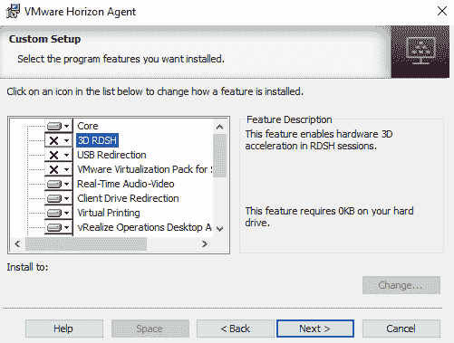

在示例实验中，我们将接受默认选项；不过，如果需要，你可以选择安装 3D RDSH、USB 重定向、View Composer 和 Flash 重定向选项。

如你所见，可以作为 View Agent 安装的一部分安装许多功能。它们列在下面：

+   Core：安装 RDSH 所需的核心功能

+   3D RDSH：启用 RDSH 会话中的 3D 加速

+   USB 重定向：将 USB 设备从客户端重定向到 RDSH 会话

+   VMware Horizon View Composer Agent：允许使用链接克隆技术从单个父图像构建 RDS 主机服务器，从而轻松部署 RDS 服务器农场

+   客户端重定向：允许客户端与 RDS 会话共享本地驱动器（在使用 IPv6 时不支持）

+   虚拟打印：允许从 RDS 会话打印

+   vRealize Operations Desktop Agent：允许部署管理代理，以便使用 vRealize 监控 RDS 会话

+   Flash 重定向：启用 RDS 会话中的 Flash 重定向功能（请注意，在此版本的 Horizon View 中，这是一个技术预览功能）

1.  点击“下一步 >”按钮继续安装。

1.  现在你将看到**与 Horizon 7 连接服务器注册**配置界面，在这里我们将配置 Horizon Agent 以与连接服务器通信。这允许连接服务器从 RemoteApp 目录读取发布的应用程序列表，并允许你在 View 中创建应用程序池。

1.  在主机名或 IP 地址框中，输入连接服务器的名称。在示例中，这是 `hzn7-cs1.pvolab.com`。

1.  在身份验证部分，点击“指定管理员凭据”的单选按钮，然后在**用户名**框中输入你希望用来连接连接服务器的用户帐户。在示例实验中，这是 pvolab\administrator。

确保使用 Domain\user 格式输入用户名，并且账户具有访问连接服务器的正确权限。通常情况下，您会使用服务账户来进行此操作。

1.  在“密码”框中，输入该账户的密码，如下图所示：


1.  点击“下一步 >”按钮继续安装。

1.  现在，您将看到“准备安装程序”界面。点击“安装”按钮开始安装过程。

1.  安装成功后，您将看到“安装完成”界面。

1.  点击“完成”退出安装。

1.  然后，系统会提示您重启服务器。点击“是”以重启。

安装视图代理失败的最常见原因之一是 RDSH 服务器的配置问题。通常，运行 RDSH 角色的 Windows 服务器上没有加载声音驱动程序。如果是这种情况，则代理的安装会失败并自动回滚。如果发生这种情况，建议首先检查这一点。

我们现在已经完成了 Horizon View 配置的第一部分。在接下来的步骤中，我们将把注意力转向“查看管理员”，并配置应用程序池。

# 在“查看管理员”中配置已发布的应用程序

安装和配置过程的下一阶段是通过“查看管理员”控制台进行的，和标准的 View 设置一样，涉及到创建池和授权。然而，这次我们将配置的是应用程序池，而不是为虚拟桌面机器创建池。

在执行这些操作之前，我们需要做的第一件事是设置一个包含新建 RDSH 服务器的 Farm。请按照以下步骤操作：

1.  打开浏览器并连接到“查看管理员”。在我们的示例实验室中，“查看管理员”的地址是`https://hzn7-cs1.pvolab.com/admin/`。

1.  使用管理员账户和密码登录到“查看管理员”。

1.  现在，您将看到“查看管理员仪表板”，如下图所示：

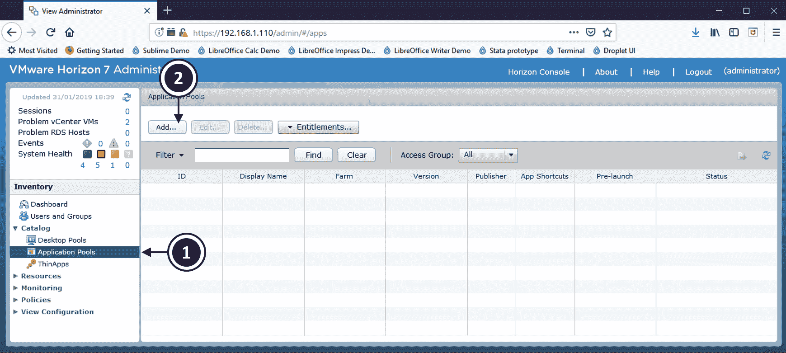

1.  从左侧的库存面板中展开“资源”箭头，然后点击“农场”（**1**）。

1.  现在点击“添加...”按钮（**2**）。

1.  现在，您将看到“添加 Farm”配置界面，如下图所示：

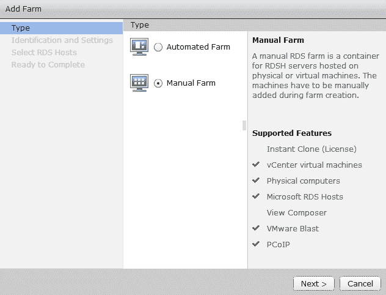

1.  在“类型”部分，点击“手动 Farm”单选按钮。

1.  点击“下一步 >”按钮继续。

1.  现在，您将看到“标识和设置”配置界面，如下图所示：

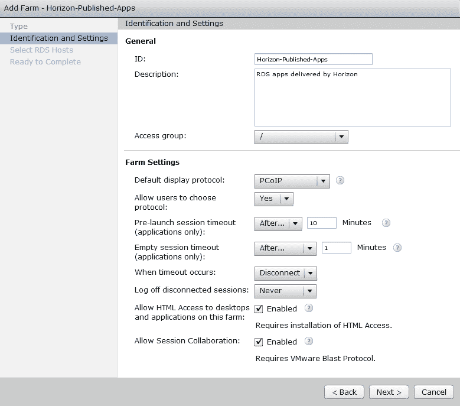

您需要填写如下信息：

1.  在“ID”框中，输入一个 ID，用于 View 识别这个 Farm。在示例实验室中，它被命名为`Horizon-Published-Apps`。

您不能为 ID 使用空格，只能使用字母（大写和小写）、数字（0-9），以及*–*（减号）或*_ *（下划线）字符。

1.  在“描述”框中，输入农场的可选描述，然后从“访问组”下拉菜单中选择一个访问组（如果有）。

1.  接下来，在“农场设置”下，将默认显示协议设置为 PCoIP，并在“允许用户选择协议”下拉菜单中选择“是”。

1.  在预启动会话超时设置中，保持默认设置为`10`分钟。预启动允许应用程序在用户点击启动之前提前加载。此选项配置一个超时设置。

1.  在空闲会话超时**，**输入一个时间，指定在未使用时会话应超时的时长，然后在超时发生时框中，从下拉菜单中选择超时后发生的操作。在示例实验中，这被设置为断开用户与会话的连接。

1.  下一个选项是是否注销断开连接的会话。此选项将注销任何断开连接的会话。在示例实验中，此选项设置为永不发生。

1.  勾选“启用”框，以允许通过 HTML 访问此农场中的桌面和应用程序。

1.  最后，勾选“允许会话协作”框。此功能仅在使用 Blast 协议连接时有效。

1.  完成此屏幕上的配置选项后，点击“下一步 >”按钮继续。

1.  现在您将看到“选择 RDS 主机”配置屏幕，在这里您可以选择哪些主机将参与此农场，如下图所示：

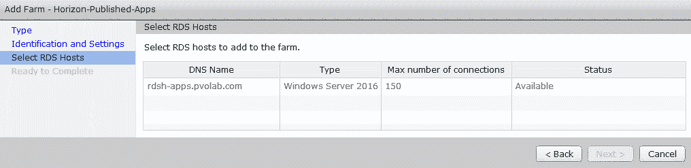

1.  点击并选择`rdsh-apps.pvolab.com`服务器条目，然后点击“下一步 >”按钮。

1.  现在您将看到“准备完成”屏幕，如下图所示：

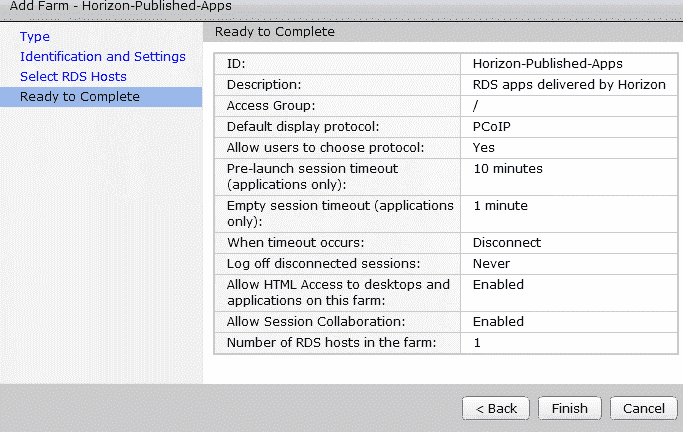

1.  检查您输入的设置是否正确，然后点击“完成”按钮。

您现在已经成功创建了一个新的托管应用程序农场配置，如下图所示：

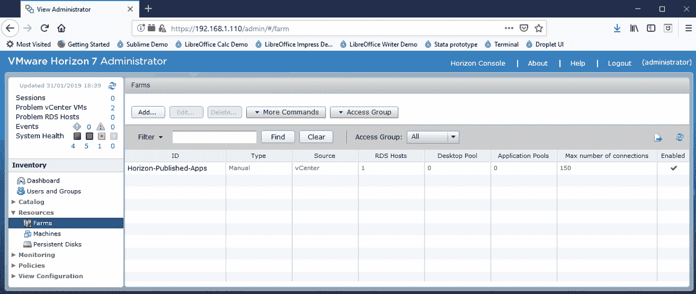

您还将在 View 管理员仪表板的“系统健康”框中的 RDS 农场部分看到，农场名称“ Horizon-Published-Apps”和服务器名称`rdsh-apps.pvolab.com`现已列出，并且有一个绿色框显示它们正在正常工作：

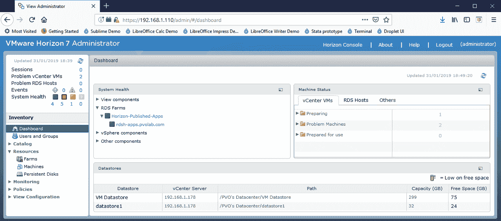

在下一部分，我们将创建一个应用程序池。

# 为发布的应用程序创建应用程序池

在本节中，我们将创建一个应用程序池。这允许您创建一个包含多个不同应用程序的池。例如，您可能希望创建应用程序池以反映不同的部门。要配置应用程序池，请执行以下步骤：

1.  在 View 管理员中，从左侧的“库存”面板中展开“目录”箭头，然后点击“应用程序池”（1），如下图所示：

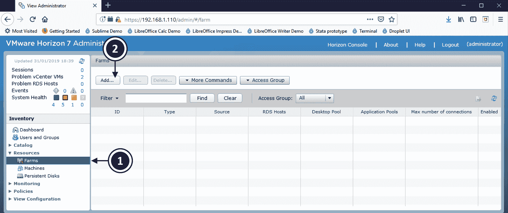

1.  现在点击“添加...”按钮 (**2**)。

1.  现在您将看到“添加应用程序池”配置屏幕，如下图所示：

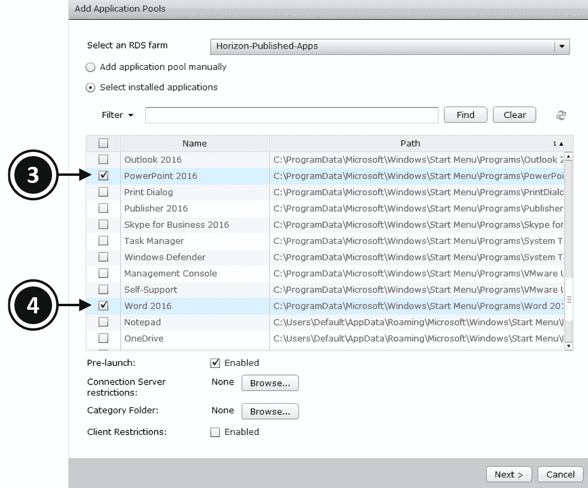

1.  从“选择一个 RDS farm”下拉菜单中，选择我们之前为发布的应用程序创建的 farm。在示例实验中，从菜单中选择名为 Horizon-Published-Apps 的 farm。

1.  接下来，点击“选择已安装的应用程序”单选框。这将自动列出该 RDSH 服务器上安装的所有应用程序。您还可以手动添加一个应用程序池。

1.  从应用程序列表中，勾选您想要添加到应用程序池的应用程序。在示例中，我们选择了 PowerPoint 2016 (**3**) 和 Word 2016 (**4**)，以及计算器、画图、Excel 2016、Publisher 2016 和 Outlook 2016。

1.  然后，您可以选择勾选“预启动”框。这意味着应用程序池中的应用程序将在最终用户点击它们时提前启动，以加快启动速度。

1.  下一个选项是“连接服务器限制”，它允许您配置可以连接的连接服务器标签。

1.  最后，您可以配置**类别文件夹**，这允许您在最终用户设备上添加快捷方式。

1.  当您选择了所有必需的应用程序后，点击“下一步 >”按钮以继续。

1.  现在您将看到**编辑 ID**和**显示名称**屏幕。在这里，您可以选择编辑应用程序的 ID 和显示名称，如果需要的话。如下图所示：

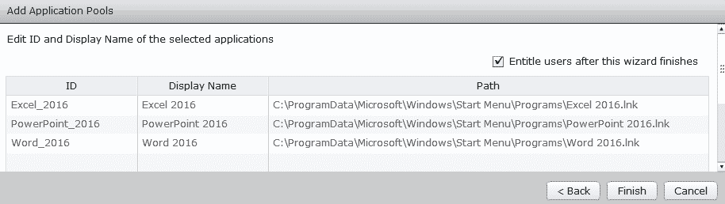

1.  同时，勾选“在此向导完成后授权用户”框，以便自动启动用户授权配置，我们将在下一节完成此操作。

1.  点击“完成”按钮以完成配置。然后您将看到应用程序池已经创建。

现在您的应用程序池已经设置完毕并准备就绪，下一步是授权最终用户访问该池并允许他们启动应用程序。

# 授权用户到应用程序池

在前一节中，我们勾选了“在此向导完成后授权用户”框，这意味着您现在将看到“添加授权”配置屏幕，如下图所示：

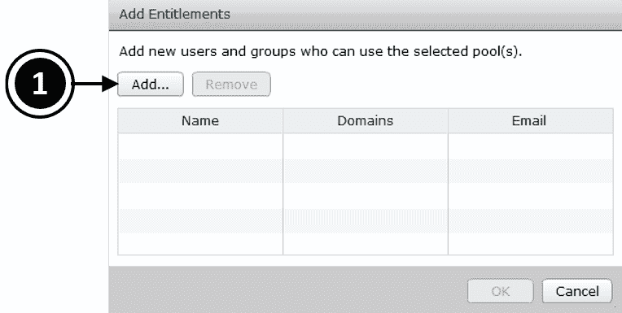

现在执行以下步骤来添加授权：

1.  点击“添加...”按钮 (**1**)。

1.  现在，您将看到“查找用户或组”配置屏幕，如下图所示：

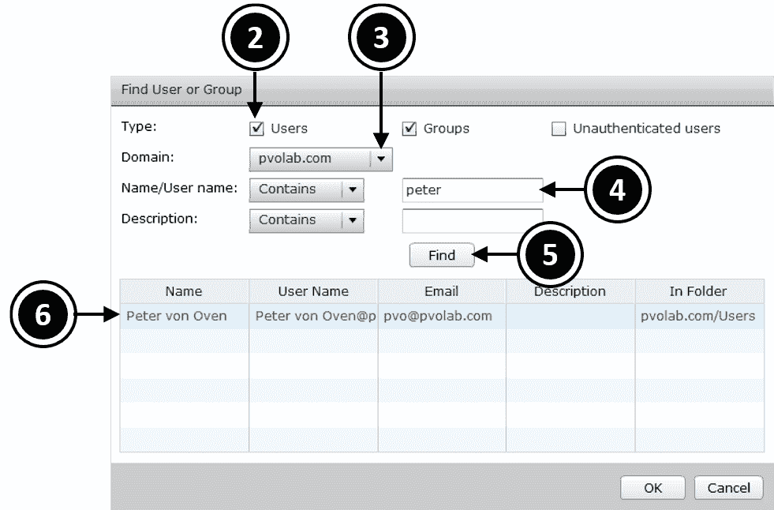

1.  在“类型”部分，确保勾选“用户”框 (**2**)。

1.  从“域”下拉菜单 (**3**) 中，选择包含您想要授权的用户的域。在示例实验中，这是 `pvolab.com` 域。

1.  在姓名/用户名框（**4**）中，输入你要授权的用户的详细信息。在示例实验室中，我们将授权名为`Peter von Oven`的用户，因此输入用户名的第一部分，在本例中是`peter`，然后点击查找按钮（**5**）在域中搜索该用户。

1.  找到后，用户及其详细信息将显示在表格中。通过点击表格中的条目来选择用户，条目会被高亮显示并选中用户。

1.  点击“确定”继续。

1.  你现在将返回到应用池屏幕，显示已发布的应用程序，如下图所示：

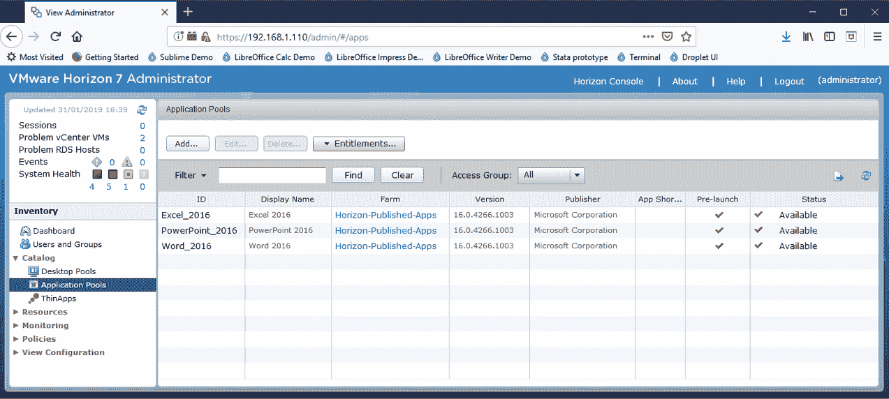

作为最终检查，我们将启动 Horizon 客户端，使用授权用户登录，然后通过 Horizon 客户端启动其中一个发布的应用程序，以测试一切是否正常工作。

确保你使用的是最新版本的 Horizon 客户端，版本 3.0 及以上。旧版本仍然可以与 VDI 桌面一起使用，但无法显示发布的应用程序。

为了测试功能，完成以下步骤：

1.  启动 VMware Horizon 客户端，并确保你已添加了连接服务器的地址。我们将在第十二章中介绍 Horizon 客户端，*Horizon 客户端选项*。

1.  在示例实验室中，我们正在连接到`hzn7-cs1.pvolab.com`连接服务器，如下图所示：

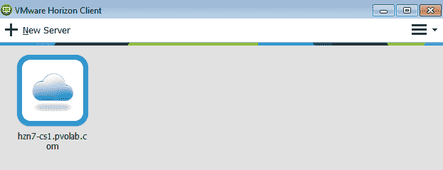

1.  双击 VMware Horizon 客户端中的`hzn7-cs1.pvolab.com`图标。

1.  然后你将看到登录框，如下图所示：

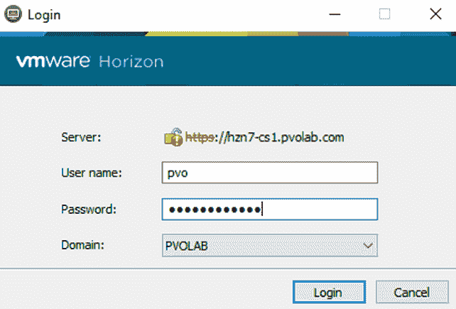

1.  在用户名框中，输入被授权访问应用池的用户的用户名。在示例实验室中，用户`Peter von Oven`的用户名是`pvo`。

1.  在密码框中，输入用户名的密码。

1.  在域框中，确保从下拉菜单中选择了正确的域。在示例实验室中，这是 PVOLAB 域。

1.  现在点击登录框。

1.  认证成功后，Horizon 客户端将连接到应用池，并显示可用的应用程序，如下图所示：

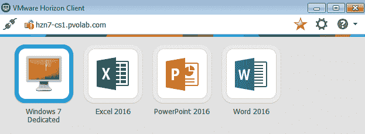

1.  双击任何一个应用程序，确保它们能正确启动。

现在你已经成功安装、配置并交付了一个 View 托管的应用程序环境。在本例中，我们部署了一个 RDSH 服务器来托管远程应用程序；然而，在生产环境中，你更有可能有多个服务器在一个农场中。

在本章的最后部分，我们将介绍如何在一个服务器农场中，将会话连接负载均衡到多个主机服务器。

# Horizon View 中的负载均衡发布应用程序

接下来，我们将介绍的是 Connection Broker 如何决定农场中正在运行请求的应用程序的 RDS 主机服务器将实际交付该应用程序。配置负载均衡有两种选择。

对于第一个选项，从 Horizon View 的角度来看，负载均衡并没有什么复杂的科学原理。它完全基于任何给定的 RDSH 服务器上有多少个空闲会话。因此，这意味着当用户登录并启动一个已发布的应用程序时，应用程序会从拥有最多空闲会话的服务器传送；也就是说，选择最不忙碌的服务器。

下面的图示展示了这一点：

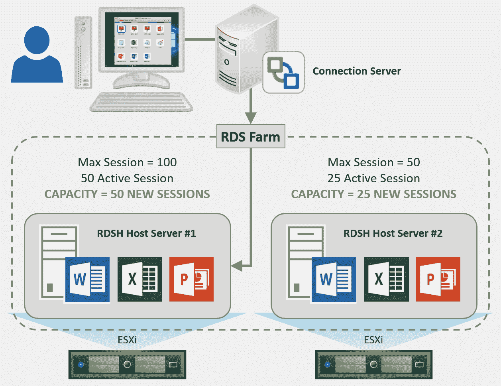

第一个选项运行良好，但它如何知道每个会话消耗了多少资源呢？某个特定的主机可能有足够的容量来容纳更多的会话，基于它有多少空闲的会话，但如果它已经托管的会话消耗了大量资源，那该怎么办？

这时，第二个选项就派上用场了，因为它使用更深入的信息来放置会话，这些信息是基于每个主机的 CPU 和内存利用率，而不是空闲会话的数量。

要启用这种负载均衡方法，你需要完成一些手动步骤，我们现在将一一说明。

首先，这种方法是基于执行脚本的，因此你需要确保这些脚本存储在农场中的每个 RDS 主机服务器上。你可以创建自己的脚本；不过，作为 View Agent 安装的一部分，有几个示例脚本随之提供。一旦 View Agent 安装完成（本章前面已介绍过 View Agent 的安装），你会在以下文件夹中找到它们：

```
C:\Program Files\VMware\VMware View\Agent\scripts
```

然后，你将看到两个示例脚本，如下图所示：


正如名称所示，一个脚本监控 CPU 利用率，另一个监控内存利用率。每个脚本监控其相应的组件，并返回以下值来决定会话的放置：

+   `0`: 对于利用率 > 90%

+   `1`: 对于利用率 > 75%

+   `2`: 对于利用率 > 25%

+   `3`: 对于利用率 > 25%

现在让我们通过完成以下任务来配置 CPU 脚本用于示例实验室。第一个任务是启用 View Script Host 服务。为此，请按照以下步骤操作：

1.  打开一个控制台连接到 RDSH 主机服务器 RDSH-Apps，并从服务器的桌面启动 `RUN` 命令。

1.  在 **打开** 框中，输入 `services.msc` 并点击确定以启动服务管理界面。现在，你将看到 **服务** 窗口，如下图所示：

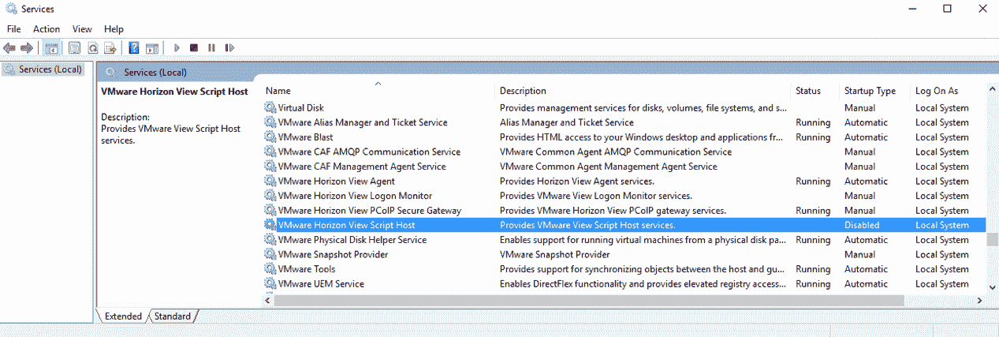

1.  向下滚动，直到找到 **VMware Horizon View Script Host** 条目。点击它以高亮显示，然后右键点击。

1.  在现在显示的上下文菜单中，点击属性。

1.  现在你将看到 VMware Horizon View 脚本主机属性屏幕，如以下截图所示：

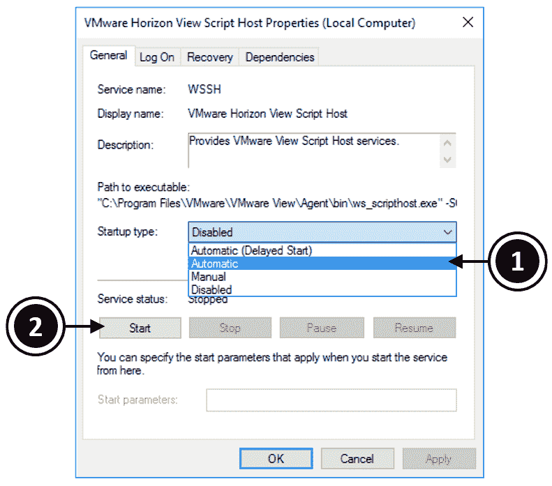

1.  在启动类型框中，从下拉菜单中选择**自动**（**1**），以便此服务在服务器启动时自动启动。

1.  接下来，点击应用按钮。

1.  最后，点击启动按钮 (**2**) 以启动服务。你现在应该看到服务正在运行，如以下截图所示：

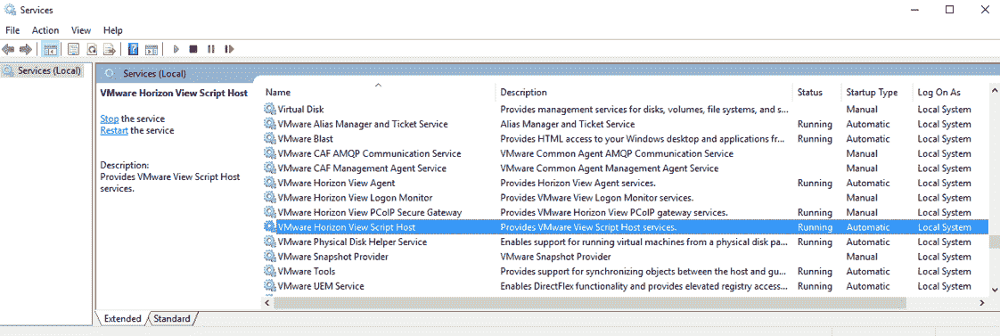

完成后，关闭服务管理屏幕。下一步是将脚本详细信息添加到服务器的注册表中。为此，请执行以下步骤：

1.  打开连接到 RDSH 主机服务器 RDSH-Apps 的控制台，并从服务器桌面启动`RUN`命令。

1.  在**打开**框中，输入`regedit`并点击**确定**，启动注册表编辑器。

1.  注册表编辑器启动后，导航到以下路径：

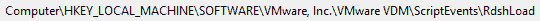

1.  你现在将看到以下屏幕：

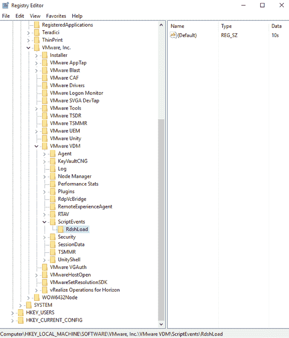

1.  现在右键单击右侧窗格，在显示的上下文菜单中点击“新建” (**3**)，然后选择字符串值 (**4**) 选项，如以下截图所示：

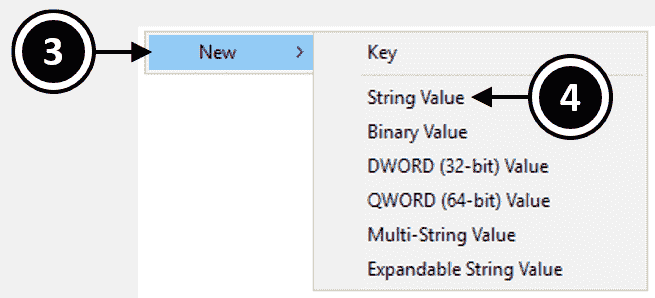

1.  你现在可以输入一个新的字符串值。在示例实验室中，这个值被称为`cpuutilisation` (**5**)，以反映将要运行的脚本，如以下截图所示：

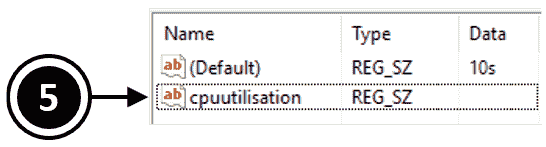

1.  接下来，你需要编辑新创建的字符串值并输入一个值。

1.  为此，突出显示`cpuutilisation`条目 (**6**)，右键单击并从上下文菜单中选择修改… (**7**)，如以下截图所示：

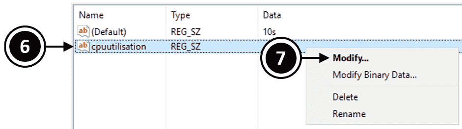

1.  你现在将看到编辑字符串框，如以下截图所示：

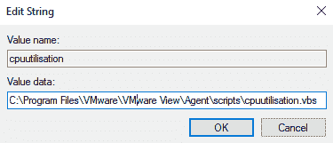

1.  在值数据框中**（**）输入脚本路径。在示例实验室中，该路径为`C:\Program Files\VMware\VMware View\Agent\scripts\cpuutilisation.vbs`**。**

1.  点击确定。

1.  你现在将看到脚本已被添加，如以下截图所示：

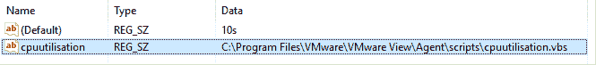

1.  退出注册表编辑器。

由于你已更改 VMware Horizon Agent 的属性，你需要重新启动该服务，以使更改生效。为此，请执行以下步骤：

1.  启动`RUN`命令。

1.  在**打开**框中，输入`service.msc`并点击确定，启动服务管理屏幕，如以下截图所示：

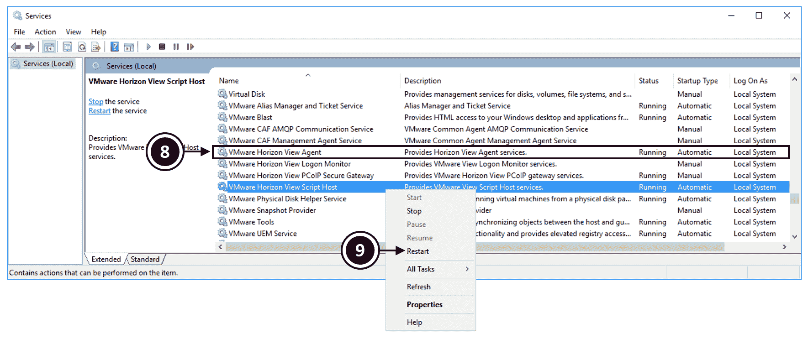

1.  向下滚动，直到找到 VMware Horizon View Agent 的条目 (**8**)。

1.  单击它以选择，右键点击，然后从上下文菜单中选择重启选项(**9**)来重新启动服务。

1.  一旦服务重新启动，您可以关闭服务管理界面。

您现在已经完成了负载均衡的配置步骤，负载均衡将根据 CPU 使用情况进行计算。您可以通过执行以下操作来检查它是否正常工作：

1.  从 View 管理员仪表板，导航到系统健康框。

1.  然后展开 RDS 农场的选项，并选择 Horizon-Published-Apps 的农场。现在点击`RDSH-Apps.pvolab.com`服务器。您将看到以下屏幕：

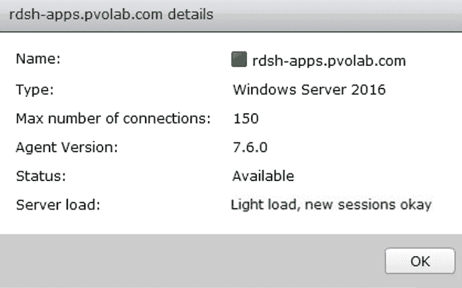

您会看到在框的底部，现在显示了“服务器负载”选项。这个负载是通过脚本进行测量的，正如您所看到的，目前 CPU 负载很轻，新的会话可以由此服务器提供资源。

单击“确定”以关闭该框。现在您已经成功配置了可选的负载均衡功能。

# 总结

在本章中，我们讨论了如何通过 Horizon 发布应用程序功能提供远程/发布的应用程序。我们首先介绍了架构，并深入探讨了它是如何工作的，然后逐步讲解了 Microsoft RDSH 组件和 Horizon View 组件的安装与配置过程，这些组件是实现该功能所需的。

接着，我们配置了一个 RDS 农场和一个应用程序池，然后为测试用户分配了该池的权限。最后，为了检查一切是否正常工作，我们以该用户身份登录并通过启动远程应用程序来测试环境。

在最后一部分，我们讨论了如何在发布的应用程序环境中配置负载均衡。

在下一章中，我们将讨论如何将相同的方法应用于提供基于会话或发布的桌面。
