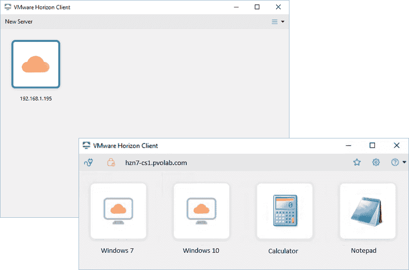
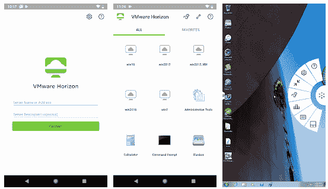
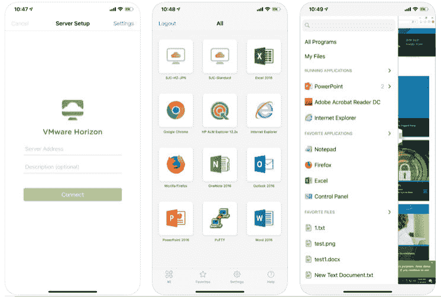
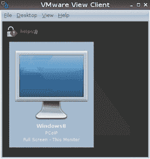
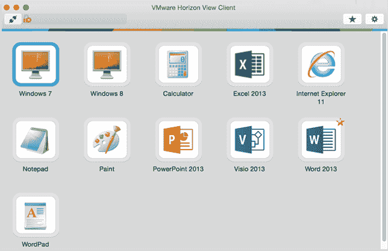
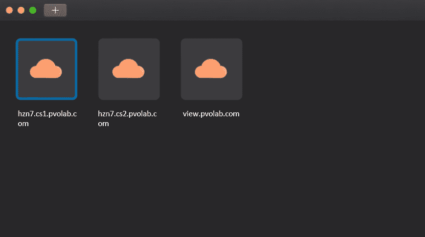
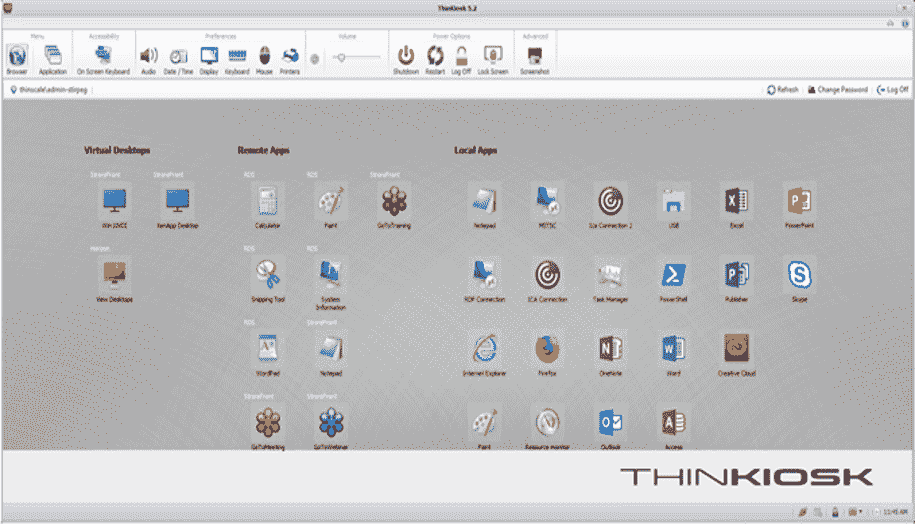
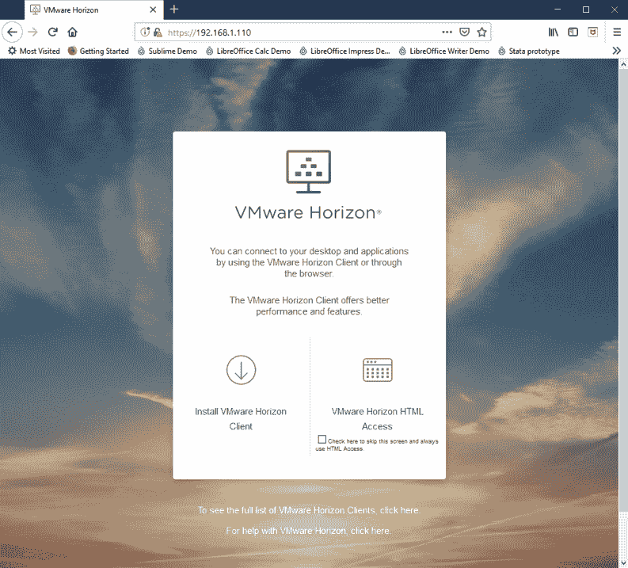
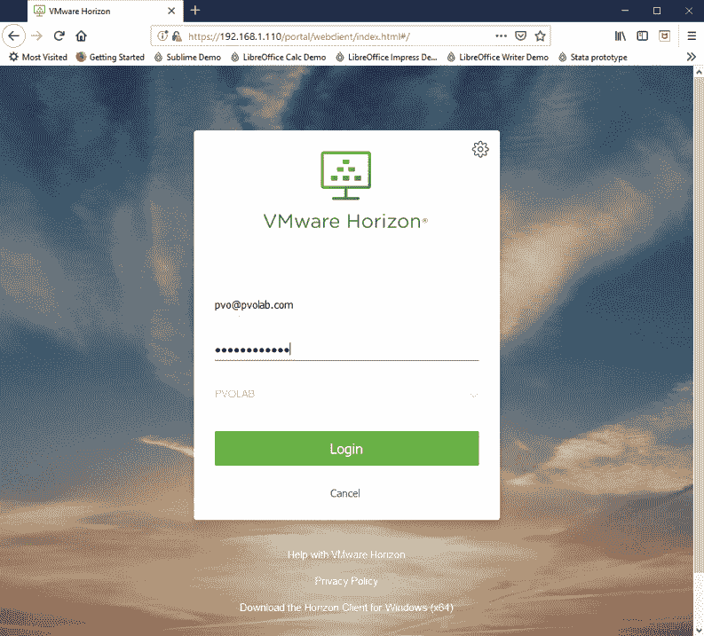
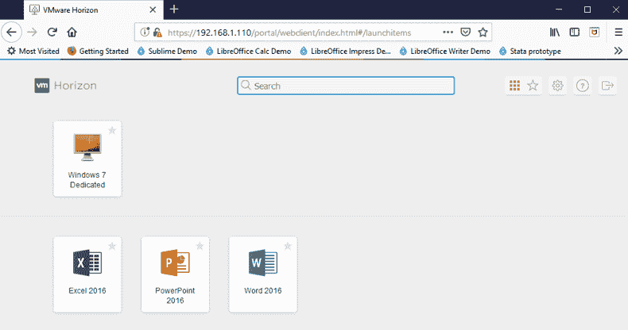

# 第十三章：Horizon 客户端选项

在本章中，我们将讨论终端用户如何使用各种可用的 Horizon 客户端选项连接到他们的虚拟桌面和已发布的应用程序。我们还将介绍不同类型的基于硬件的终端设备。客户端的任务是接收并显示虚拟桌面机器和已发布应用程序的截图，并将键盘输入和鼠标移动发送回去。这些是从终端用户的客户端设备发送到网络，并回传到虚拟桌面会话的键盘输入和鼠标操作。

我们将讨论每个可用的客户端选项，并根据实际使用场景说明为何选择某一个而非另一个。所以，让我们首先看看基于软件的客户端选项。

在本章中，我们将讨论以下主题：

+   VMware Horizon 客户端

+   硬件客户端

+   使用浏览器访问桌面

# VMware Horizon 客户端

为了获得最佳的用户体验，用户应通过一款名为 Horizon View Client 的软件从客户端设备连接到他们的虚拟桌面机器。Horizon View Client 安装在本地客户端设备上，使用户能够与 View 连接服务器通信，从而进行身份验证，选择他们有权访问的桌面池中的桌面或应用程序，然后建立客户端与虚拟桌面机器之间的连接。

在 Horizon 的更新版本中，软件客户端已从主要的 View 版本中解耦，这意味着客户端下载会更频繁地更新，您不需要等到下一个 View 版本发布。这反映了新设备进入市场的速度。

根据您选择使用的终端设备，有多种不同的平台版本可用。在本节中，我们将为您提供每个可用版本的高级概述，并介绍任何特定的要求。

您可以通过访问 [`www.vmware.com/go/viewclients`](http://www.vmware.com/go/viewclients) 下载不同的 Horizon 客户端。

# Horizon Windows 客户端

Horizon Windows 客户端允许您从基于 Windows 的设备访问您的 Windows 虚拟桌面和 View 托管的应用程序，并通过 LAN 或 WAN 连接提供最佳的用户体验。

下图显示了 Horizon 客户端 5.0 版 for Windows，现在它具有与 Workspace ONE 相同的外观和感觉，已连接到示例实验室。您可以看到有两个桌面池可用：一个用于已发布的桌面，另一个用于 Windows 7 虚拟桌面机器，以及若干已发布的应用程序：

最新版本的 Horizon Windows 客户端具有以下新功能：

+   **支持最多六个显示器**：它允许虚拟桌面机器和已发布的应用程序跨六个屏幕运行。

+   **在多会话模式下使用已发布的应用程序**：当启用多会话模式时，您可以在使用不同终端设备和客户端登录到连接服务器时，使用该已发布应用程序的多个会话。例如，如果在客户端 A 上以多会话模式打开已发布的应用程序，然后在客户端 B 上打开完全相同的已发布应用程序，则已发布的应用程序在客户端 A 上保持打开状态，而在客户端 B 上打开一个新的会话。

+   **禁用 TLS v1.0**：TLS v1.0 不再受支持。

+   **剪贴板审计功能增强**：Horizon Agent 可以配置为记录虚拟桌面机中复制和粘贴活动的信息。Horizon 管理员现在可以配置剪贴板审计功能，以记录从客户端机器复制到代理机器的数据、从代理机器复制到客户端机器的数据，或在两个方向上复制的数据的信息。此功能需要 Horizon Agent 7.7。

+   **选择特定显示器以显示已发布的应用程序**：如果您有三台或更多显示器，您可以选择在哪些显示器上显示已发布的应用程序。

+   **地理位置重定向功能增强**：现在，您可以使用 Google Chrome 中的地理位置重定向功能。要使用此功能，Horizon 管理员必须在代理机器上启用 VMware Horizon Geolocation Redirection Chrome 插件。

+   **VMware 虚拟打印重定向功能**：使用 VMware 虚拟打印重定向功能，您可以从远程桌面或已发布应用程序打印到连接到客户端系统的虚拟打印机或 USB 打印机。此功能需要 Horizon Agent 7.7。

+   **拖放文件和文件夹**：您可以在客户端系统和 Windows 远程桌面及已发布应用程序之间拖放文件和文件夹。此功能需要 Horizon Agent 7.7。

+   **共享 Linux 远程桌面**：现在，您可以使用会话协作功能共享 Linux 远程桌面。

+   **支持物理 RDS 主机上的虚拟打印**：现在，已支持在物理 RDS 主机服务器上为已发布桌面和已发布应用程序提供虚拟打印功能。此功能需要 Horizon Agent 7.7。

+   **允许 VMware Blast 使用高效视频解码（HEVC）**：当您允许 VMware Blast 会话使用 HEVC 时，如果客户端机器具有支持 HEVC 解码的 GPU，性能和图像质量将得到改善。

有关最新 Horizon Windows 客户端的功能，您可以通过以下链接阅读发行说明：[`docs.vmware.com/en/VMware-Horizon-Client-for-Windows/index.html`](https://docs.vmware.com/en/VMware-Horizon-Client-for-Windows/index.html)。

最新的 Horizon 客户端 4.10 版本需要以下 Windows 操作系统：

+   32 位或 64 位 Windows 10，家庭版，专业版，企业版，或 **物联网** (**IoT**) 企业版（最高支持 1809）

+   32 位或 64 位 Windows 8、8.1 或 8.1 专业版、企业版或行业嵌入版

+   32 位或 64 位 Windows 7 SP1、家庭版、企业版、旗舰版或专业版

+   Windows Server 2008 R2

+   Windows 2012 服务器 R2

还有一个专为 Windows 10 **通用 Windows 平台**（**UWP**）设计的 Horizon 客户端版本。

本版本的 Horizon 客户端支持 Horizon 6 版本 6.2.x 及以后的最新维护版本。

Horizon 客户端需要有效的 SSL 证书才能连接到 View 连接服务器。在输入连接服务器地址时，您还需要输入**完全限定域名**（**FQDN**），而不是使用其 IP 地址。

在下一节中，我们将介绍 Android 代理。

# Horizon Android 客户端

Android 设备上的 Horizon 客户端，与 Windows 客户端一样，允许您通过 Android 平板或智能手机设备访问 Windows 虚拟桌面和已发布的应用程序。

客户端软件还可以从 Google Play 商店下载，网址为 [`play.google.com/store/apps/details?id=com.vmware.view.client.android&hl=en-GB`](https://play.google.com/store/apps/details?id=com.vmware.view.client.android&hl=en-GB)。

以下屏幕截图展示了 Horizon Android 客户端。在此，您可以看到在 Android 智能手机上运行的登录界面。中间部分展示了一个 Windows 10 VDI 桌面，以及 Unity Touch 侧边栏，让您可以访问设置、鼠标和断开连接等功能。

Unity Touch 侧边栏使浏览、搜索、打开和关闭 Windows 应用程序及文件变得更加简单。它还帮助您在运行的应用程序之间切换。所有这些都可以在不使用 Windows 开始菜单或任务栏的情况下完成：

Horizon 客户端支持原生 Android 手势，以便快速、轻松地在桌面上进行导航。当在 Windows 桌面上工作时，完整屏幕触控板功能允许您在屏幕上的任何位置触摸以移动鼠标指针。

Horizon Android 客户端的最新版本具有以下新功能：

+   **它拥有全新的用户界面**：外观和感觉已与 Workspace ONE 对齐，包括新的 Horizon 标志。

+   **在多会话模式下使用已发布的应用程序**：当为已发布的应用程序启用多会话模式时，您可以在使用不同终端设备和客户端登录到连接服务器时使用该特定应用程序的多个会话。例如，如果您在客户端 A 上以多会话模式打开一个已发布的应用程序，然后在客户端 B 上打开完全相同的已发布应用程序，则该应用程序在客户端 A 上保持打开状态，并且在客户端 B 上会打开一个新的会话。

+   **创建用于智能卡身份验证的虚拟智能卡**：您可以创建一个虚拟智能卡，在登录服务器并连接到远程桌面时使用。使用虚拟智能卡时，无需将传统的智能卡读卡器连接到客户端设备。一个虚拟智能卡可以保存多个证书。

+   **TLS v1.0 已禁用**：TLS v1.0 不再受支持。

欲了解更多关于最新 Horizon Android Client 功能的信息，您可以阅读以下链接中的发布说明：[`docs.vmware.com/en/VMware-Horizon-Client-for-Android/index.html`](https://docs.vmware.com/en/VMware-Horizon-Client-for-Android/index.html)。

最新的 Horizon Client 版本 5.0 需要以下 Android 版本：

+   Android 5.0（Lollipop）

+   Android 6.0（Marshmallow）

+   Android 7.0 和 7.1（Nougat）

+   Android 8.0 和 8.1（Oreo）

+   Android 9.0（Pie）

它还可以在 ARM 和 x86 架构上运行。在接下来的部分中，我们将介绍 iOS 客户端。

# iOS 版 Horizon Client

Horizon Client for iOS 允许您从 iOS 设备（如 iPhone 或 iPad）访问 Windows 虚拟桌面。

以下截图展示了 iOS Horizon Client 5.0：

iPad 和 iPhone 的 Horizon Client 支持原生的 iPad 和 iPhone 手势，便于快速而轻松地在桌面上进行导航。

与 Android 客户端一样，完整的全屏触控板功能允许您在屏幕上的任何位置触摸，从而在 Windows 虚拟桌面上移动鼠标指针。

Unity Touch 侧边栏使浏览、搜索、打开和关闭 Windows 应用程序和文件，以及在运行中的应用程序之间切换变得更加简便，所有这些都无需使用 Windows 开始菜单或任务栏。

客户端软件还可以从 iTunes 商店作为应用程序下载，地址为[`itunes.apple.com/gb/app/vmware-horizon-client/id417993697?mt=8`](https://itunes.apple.com/gb/app/vmware-horizon-client/id417993697?mt=8)

使用最新版本的客户端（版本 4.10），新增了许多功能：

+   **全新用户界面**：iOS Horizon Client 配备了升级版的现代化用户界面。

+   **Windows 10 Continuum 支持**：当 iPad 或 iPhone 与蓝牙或底座键盘断开或重新连接时，远程桌面可以自动在桌面模式和平板模式之间调整其用户界面。

+   **以多会话模式使用已发布的应用程序**：启用已发布应用程序的多会话模式后，当您使用不同的终端设备和客户端登录到连接服务器时，可以同时使用该已发布应用程序的多个会话。例如，如果您在客户端 A 上以多会话模式打开已发布的应用程序，然后在客户端 B 上打开完全相同的已发布应用程序，已发布的应用程序将保持在客户端 A 上，而客户端 B 上会打开一个新的会话。

+   **TLS v1.0 已禁用**：TLS v1.0 不再受支持。

+   **RTAV 支持摄像头重定向**：在重定向摄像头时使用实时音视频功能。

+   **演示模式下的屏幕旋转**：在演示模式下运行时，允许旋转屏幕。

若要了解更多关于最新 Horizon iOS Client 功能的信息，您可以阅读以下链接的发布说明：[`docs.vmware.com/en/VMware-Horizon-Client-for-iOS/index.html`](https://docs.vmware.com/en/VMware-Horizon-Client-for-iOS/index.html)。

最新的 Horizon Client 版本 4.10 要求以下 iOS 版本：

+   iOS 10.x

+   iOS 11.x

+   iOS 12.x

该版本的 Horizon Client 支持 Horizon 6 版本 6.2.x 及更高版本的最新维护版本。

在下一节中，我们将介绍适用于 Linux 的 Horizon Client。

# 适用于 Linux 的 Horizon Client

适用于 Linux 的 Horizon Client 允许您从运行 Linux 操作系统的 PC 或笔记本电脑访问您的 Windows 虚拟桌面：

使用最新版本的客户端（版本 4.10），新增了许多功能：

+   **支持 Windows Server 2019**：现在支持将 Microsoft Windows Server 2019 作为远程桌面和发布应用程序会话的 RDS 托管服务器。

+   **支持 PIV 智能卡**：现在可以使用 PIV 智能卡认证和重定向支持。

+   **不再支持 TLS 1.0**：从本版本开始，不再支持 TLS 1.0。

+   **RDS 托管桌面在嵌套模式下的串口重定向**：现在支持在从 Horizon Client 启动的 RDS 托管桌面（嵌套会话）中的发布应用程序中使用串口重定向功能。必须在 RDS 托管桌面中安装 Horizon Agent 7.7 和 Horizon Client 4.10 或更高版本。在嵌套模式场景中，用户并发数是有限的。

+   **支持物理 RDS 主机上的虚拟打印**：现在，您可以在运行在物理服务器上的 RDS 主机服务器上托管的发布桌面和发布应用程序中使用虚拟打印功能。

+   **多会话模式支持**：当启用发布应用程序的多会话模式时，您可以在不同的客户端设备上使用相同发布应用程序的多个实例。

+   **记录复制和粘贴活动**：您可以在 Horizon Client 中启用剪贴板审计功能，以记录从 Horizon Agent 机器复制到 Linux 客户端机器的剪贴板数据。这一功能需要 Horizon Agent 7.7。

+   **支持 Workspace ONE 模式**：从 Horizon 7 版本 7.2 开始，Horizon 管理员可以为连接服务器实例启用 Workspace ONE 模式。如果您使用适用于 Linux 的 Horizon Client 连接到启用了 Workspace ONE 模式的服务器，您将被重定向到 Workspace ONE 门户。该门户将帮助您启动您的授权桌面和应用程序。

关于最新 Horizon Linux 客户端功能的更多信息，您可以通过以下链接阅读发布说明：[`docs.vmware.com/en/VMware-Horizon-Client-for-Linux/index.html`](https://docs.vmware.com/en/VMware-Horizon-Client-for-Linux/index.html)。

使用 VMware 提供的安装程序时，Horizon 客户端 4.10 支持以下操作系统：

+   Ubuntu 16.04（32 位）

+   Ubuntu 16.04 和 18.04（64 位）

+   Red Hat Enterprise Linux 6.10（32 位）

+   Red Hat Enterprise Linux 6.10 和 7.5（64 位）

此版本的 Horizon 客户端与 6.2.x 及以后版本的最新维护发布兼容。发布应用程序的支持仅适用于 Horizon 6.0（或更高版本）服务器。

在下一节中，我们将介绍适用于 macOS 的 Horizon 客户端。

# Horizon 客户端 for macOS

Horizon 客户端 for macOS X 允许您从 Apple Mac 访问您的 Windows 虚拟桌面和 View 托管应用程序：

在最新版本的客户端（版本 5.0）中，新增了许多功能：

+   **支持 macOS Mojave（10.14）**：您可以在 macOS Mojave（10.14）系统上安装 Horizon 客户端。

+   **在“应用程序”文件夹中显示发布应用程序的类别文件夹**：当 macOS 上的 Horizon 客户端配置为从“应用程序”文件夹运行发布应用程序时，您可以启用**允许自动从服务器创建快捷方式**设置，使已为发布应用程序配置的类别文件夹显示在“应用程序”文件夹中。

+   **在多会话模式下使用发布的应用程序**：当启用发布应用程序的多会话模式时，您可以在使用不同终端设备和客户端登录连接服务器时，使用该特定发布应用程序的多个会话。例如，如果您在客户端 A 上以多会话模式打开一个发布应用程序，然后在客户端 B 上打开完全相同的发布应用程序，发布应用程序会继续在客户端 A 上打开，并在客户端 B 上打开该应用程序的新会话。

+   **禁用 TLS v1.0**：TLS v1.0 不再被支持。

+   **收集支持数据**：您可以收集支持数据，以帮助 VMware 排查 Horizon 客户端 for Mac 的问题。要使用此功能，请点击 VMware Horizon 客户端 | 关于 VMware Horizon 客户端 选项，并点击“收集支持数据”。Horizon 客户端将日志文件保存为 ZIP 文件，并保存在桌面文件夹中。

+   **在智能卡重定向中使用 ActivClient 中间件**：您可以在 Windows 10 虚拟桌面上安装 ActivClient 7.x 中间件，并在 Windows 7 虚拟桌面上安装 ActivClient 6.2.x 中间件。

+   **共享 Linux 远程桌面**：现在，您可以使用会话协作功能来共享 Linux 远程桌面。

+   **支持物理 RDS 主机机器上的虚拟打印**：现在，发布桌面和发布应用程序的虚拟打印功能在物理 RDS 主机服务器上得到支持。此功能需要 Horizon Agent 7.7。

还增加了对 **暗模式** 的支持，如下图所示：

要了解最新 Horizon Linux 客户端的功能，请阅读以下链接中的发布说明：[`docs.vmware.com/en/VMware-Horizon-Client-for-Mac/index.html`](https://docs.vmware.com/en/VMware-Horizon-Client-for-Mac/index.html)。

使用提供的 VMware 安装程序时，Horizon 客户端 for Linux 4.10 版本支持以下操作系统：

+   macOS Sierra (10.12)

+   macOS High Sierra (10.13)

+   macOS Mojave (10.14)

该版本的 Horizon 客户端与 Horizon 6 版本 6.2.x 及以后的版本的最新维护发布兼容。

在下一节中，我们将介绍 Horizon 客户端 for Chrome OS。

# Horizon 客户端 for Chrome OS

最终客户端适用于基于 Chrome OS 的设备，例如 Chromebook。Horizon View 客户端 for Chrome OS X 允许您通过基于 Chrome OS 的设备访问 Windows 虚拟桌面和 View 托管应用程序：

在客户端的最新版本（版本 4.10）中，添加了许多新功能：

+   **Chromebook 相机支持**：实时音频视频功能支持 Chromebook 相机与远程桌面和应用程序配合使用。它可以与 Skype、WebEx 和 Google Hangouts 等应用程序一起使用。

+   **SHA-256 支持**：Chrome OS 客户端现在支持使用 256 位安全哈希算法的安全性。

+   **支持 OpenSSL 1.0.2l**。

+   **已为发布的应用程序提供文件传输支持**。

要了解最新 Horizon Chrome OS 客户端的功能，请阅读以下链接中的发布说明：[`docs.vmware.com/en/VMware-Horizon-Client-for-Chrome/index.html`](https://docs.vmware.com/en/VMware-Horizon-Client-for-Chrome/index.html)。

使用提供的 VMware 安装程序时，Chrome OS 4.7 版本的 Horizon 客户端支持以下操作系统：

+   使用 Chrome OS、稳定频道、ARC 版本 41.4410.244.13 或更高版本的 Chromebook

该版本的 Horizon 客户端与 Horizon 6 版本 6.x 及以后的版本的最新维护发布兼容。

在下一节中，我们将介绍一些可以选择的硬件选项。

# 硬件客户端

我们从与客户交流中经常听到的一件事是，当您连接到虚拟桌面时，终端设备并不重要，因为它只是一个用来访问基础设施并显示我的桌面屏幕的简单设备。这意味着我可以购买最便宜的设备，它就可以使用，是吗？

正确的答案是，这取决于用户的使用场景以及他们在功能和特性方面的需求。然后，您可以为他们选择最合适的终端设备来连接。

另一个常见的困惑是，细客户端和零客户端之间是否存在差异，实际上它们有区别吗？

在本节中，我们将介绍不同类型的硬件客户端，解释每种硬件的功能，以及针对特定使用场景最适合选择哪种设备。

# 细客户端

细客户端是一种硬件终端设备，用于连接到网络并提供远程桌面/应用程序会话。与传统的 PC 不同，细客户端没有自己的内存、存储和计算能力来独立运行应用程序，也没有完整的操作系统和本地安装的应用程序。细客户端具有简化的操作系统、最小的 CPU、内存，并且通常没有存储，它依赖于数据中心中服务器的计算能力来执行所有处理。在这种情况下，细客户端被用作将服务器内容显示给最终用户的手段。

通常，客户端设备仅具有足够的处理能力和资源来访问和使用服务器的计算资源。它们几乎没有或没有存储（仅足以托管自己的内部操作系统），更重要的是没有活动部件，这意味着它们很少出现故障。由于减少了 CPU 和内存的容量，细客户端的功耗仅为 PC 所需功耗的一小部分，这意味着细客户端的运行和管理成本较低，且生命周期较长。

它们与 PC 的共同点之一是都具有操作系统。细客户端会安装自己的本地操作系统，通常嵌入在闪存卡上，运行厂商自己简化版本的 Linux 发行版，如 Dell Wyse ThinOS 或 Microsoft Windows Embedded。此外，它会运行适当的客户端软件，以连接到相应的虚拟桌面基础设施，例如使用 PCoIP 的 Horizon Client 连接到基于 VMware View 的虚拟桌面和托管应用程序，使用 Citrix Receiver 连接到基于 Citrix 的基础设施，等等。通常，细客户端会安装所有连接选项，为您提供连接到不同基础设施的选择和灵活性。

现在，您需要在设备上做出正确的选择，因为操作系统将被嵌入到设备中。正如我们之前提到的，用户的使用场景通常会决定设备的类型。例如，如果您打算部署与微软 Skype for Business 的统一通信，那么您将需要一个 Windows Embedded 操作系统，因为它很可能需要一些 Windows 的多媒体功能。在购买最便宜的设备之前，一定要先确认清楚。

瘦客户机还有几点需要注意。如果设备运行在本地操作系统上，仍然需要进行管理和维护。另一个考虑因素涉及许可证和您需要在从非 Windows 设备连接时使用 Windows VDA 许可证。在考虑成本模型、总拥有成本（TCO）和投资回报率（ROI）时，这一点需要考虑在内。

# Zero Clients

Zero Client 执行与瘦客户机相同的功能；但是，与操作系统不同，Zero Client 将具有经过高度调整的内置处理器，专门为 VDI 协议之一（如 PCoIP、HDX 或 RemoteFX）设计。例如，基于 VMware View 的 Zero Client 将使用内置的 Tera2 硬件芯片组，如 Dell Wyse 5030/7030 或 10ZiG V1200-P。这些设备仍然小巧轻便，没有移动部件，并且消耗电力极少，就像瘦客户机一样。

解码和显示过程发生在 Zero Client 的硅片上，更为高效。由于它们是基于硬件的解决方案，它们比使用标准 CPU 和 GPU 的软件客户端提供更好的性能。Zero Client 启动时间仅需几秒钟，因为它们不需要加载操作系统。因此，它们对病毒和其他恶意软件更具免疫力，因为几乎没有存储或数据存储在它们上面。这减少了设备的总停机时间，意味着很少出现故障，主要是由于缺乏移动部件。这提高了终端用户的生产力。

Zero Client 设备不需要任何重大的维护，很少需要任何更新，除非 VDI 协议有显著的变化或改进，或者有罕见的与 BIOS 相关的更新。

有几件事情需要注意。首先是许可证问题。因为这些设备不运行在操作系统上，您需要查看使用非 Windows 设备的 VDA 许可证。最后一点是，如果您将 VDI 基础设施从 PCoIP 更改为新的协议，那么设备就不能与不同的协议一起使用，因此您会失去使用瘦客户机时获得的灵活性。然而，您将获得更好的性能。

# 重用的 PC（软件定义的瘦客户机）

还可以重用现有的物理 PC，使它们可以用作瘦客户机。有几种方法可以实现这一点，但必须确保用户可以简单地使用它，并且不会混淆虚拟桌面机和坐在他们面前的物理桌面机的使用方式。

有几种方法可以做到这一点。首先是使用本地策略或组策略锁定 Windows PC，并将外壳更改为仅 Horizon Client。第二种方法是使用第三方解决方案，例如 ThinScale 的市场领先 ThinKiosk 解决方案。

ThinKiosk 解决方案使任何基于 Windows 的终端设备都能重新利用为集中管理、安全的 Windows 瘦客户端。对于最终用户，它提供了一个直观且熟悉的用户界面，以及一个安全的工作空间环境，用户可以从中访问远程或本地资源。这是迁移到 VDI 的理想解决方案，因为您可以在保持安全的同时继续使用本地应用程序和资源。这也意味着，您在迁移到 VDI 时，不会因为应用程序在虚拟环境和较新操作系统中无法运行而受到限制。在安全性方面，ThinScale 的安全远程工作者解决方案允许最终用户启动一个基本上是临时、安全的工作空间环境的应用程序，它可以在任何 Windows 设备上运行，旨在让家庭和远程工作人员使用自己的设备：

市场上有其他解决方案提供这种重新利用的方法，但通过使用基于 Linux 的操作系统，这些方案可能增加额外的管理成本，并且并不总是提供最佳的兼容性和功能。

# 使用浏览器访问桌面

在前面的部分，我们讨论了使用基于软件或硬件的客户端来访问虚拟桌面，但也有第三种方法：在任何设备上使用支持 HTML5 的浏览器。使用这种方法的关键用例是当无法在终端设备上安装客户端软件时。例如，您可能有一个自带设备政策，最终用户不想安装客户端软件，或者您可能希望在酒店大堂使用一个公共终端设备，在这种情况下，设备被锁定，无法安装客户端软件。

这是该用例的关键所在，它允许您使用支持 HTML5 的 Web 浏览器访问虚拟桌面机器，而且不需要下载和安装任何额外的插件或软件。HTML 桌面访问就是所谓的 VMware Blast 协议。

要通过浏览器连接到您的虚拟桌面机器或视图托管应用程序，请打开浏览器，并在地址栏中输入您的连接服务器地址。

在示例实验室中，地址是`https://hzn7-cs1.pvolab.com`。

在访问虚拟桌面机器之前，您将首先看到一个显示两个不同选项的网页。您可以选择下载完整版本的 Horizon 客户端，或者继续通过 HTML 连接，如下图所示：

点击屏幕左侧的 VMware Horizon HTML 访问链接。您现在会看到登录框，如下图所示：

输入用户名和密码，然后点击登录按钮。

您现在将看到用户有权访问的资源。在此示例中，一个 Windows 7 专用桌面池，以及 Excel、PowerPoint 和 Word，作为 Horizon 发布的应用程序提供。如下图所示：

您现在可以点击您想运行的资源，资源将在浏览器内启动。

使用最新版本的客户端（版本 4.10），有一些新的功能：

+   **全屏模式支持**：您现在可以将远程桌面或发布的应用程序以全屏模式显示。

+   **支持多会话模式**：当启用多会话模式时，您可以在登录同一服务器和应用程序时，从不同的客户端设备使用相同的发布应用程序的多个会话。

+   **增强的复制和粘贴功能**：如果你使用的是 Chrome 或 Firefox 浏览器，现在可以直接从本地客户端系统复制并粘贴到远程桌面或发布的应用程序中。使用 Internet Explorer、Microsoft Edge 或 Safari 浏览器的用户，必须继续使用复制和粘贴窗口。

有关最新 Horizon Chrome OS 客户端功能的更多信息，您可以通过以下链接阅读发行说明：[`docs.vmware.com/en/VMware-Horizon-HTML-Access/4.10/rn/horizon-html-access-410-release-notes.html`](https://docs.vmware.com/en/VMware-Horizon-HTML-Access/4.10/rn/horizon-html-access-410-release-notes.html)。

要使用 HTML 访问功能，您需要运行支持的浏览器。目前支持的浏览器如下：

+   Chrome 69, 70

+   Internet Explorer 11

+   Safari 12

+   Firefox 62, 63

+   Microsoft Edge 42, 44

您还需要确保已启用 HTML 访问的桌面池，并且虚拟桌面上已安装远程体验代理。否则，您将无法使用浏览器访问桌面或应用程序。

我们已经探索了终端用户如何连接到他们的虚拟桌面和 Horizon 发布应用程序的各种选项。

# 摘要

在本章中，我们更深入地研究了从终端设备连接到虚拟桌面机器或 View 托管应用程序的可用选项。

我们讨论了基于软件的客户端、基于硬件的客户端以及 HTML 访问功能，并审视了每种访问方式的优缺点，以及为什么你可能会选择其中一种而非另一种。

在下一章中，我们将讨论如何将 Horizon View 从以前的版本升级到最新版本。
