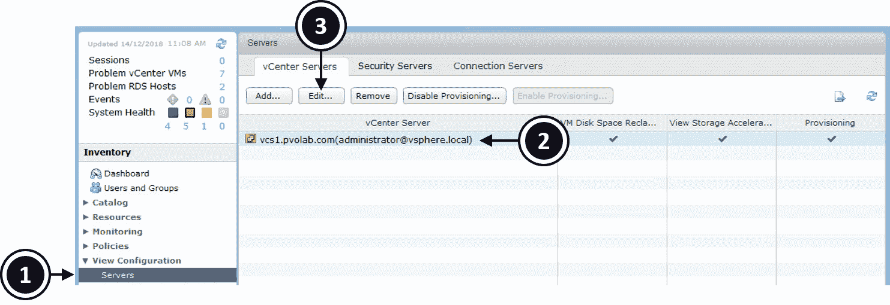

# 第十四章：升级到新版本的 Horizon

本章我们将讨论升级过程以及升级你的 VMware View 环境到最新版本的建议，在这个例子中，我们将从 Horizon 6 升级到 Horizon 7。我们将首先讨论在进行升级之前需要考虑的因素，如何进行升级以确保对用户的干扰最小化，最后是完成升级的逐步过程。

本章将涵盖以下主题：

+   升级兼容性

+   升级 Horizon Composer

+   升级 Horizon View 连接服务器

+   升级 View 安全服务器

+   升级组策略模板

+   升级 VMware Horizon 代理

+   升级 Horizon 客户端

# 升级兼容性

在进行任何升级之前，你应该先阅读 Horizon View 的发布说明和升级指南。由于有多个相互依赖的组件，你不仅需要检查这些组件不同版本之间的兼容性，还要确保按正确的顺序进行升级，以最大限度地减少失败的风险和对用户的干扰。

在本节中，我们将查看兼容性，首先是你可以升级到 Horizon 7 的版本。以下是不同版本的列表：

+   VMware Horizon View 5.3 的最新维护版本

+   VMware Horizon 6.0（带 View）的最新维护版本

+   VMware Horizon 6 版本 6.1 的最新维护版本

+   VMware Horizon 6 版本 6.2 的最新维护版本

你还需要检查不同 View 组件之间的兼容性，以及 Horizon 7 是否与这些组件的早期版本兼容。这里所说的组件是指连接服务器、安全服务器等。

下表展示了版本兼容性：


因此，升级需要进行的过程如下：

+   View Composer 升级

+   View 连接服务器升级

+   View 安全服务器升级

+   升级组策略

+   升级 vCenter（如需要）

+   升级 ESXi 主机和虚拟机硬件/工具（如需要）

+   升级 Horizon 代理

+   重新组合桌面池

你还需要考虑任何可能需要在最终用户端进行的升级的影响。例如，你不会在工作日中途升级一个 View 连接服务器，因为可能有数千个用户连接到该服务器。你通常会安排在非工作时间进行升级，或者至少确保每个 View 连接服务器在计划升级前一晚从负载均衡器中移除。

你可以选择构建新的连接服务器，并使用最新的 Horizon 版本，而不是升级现有的连接服务器，然后只需将用户指向新的服务器，并在完成后移除旧的连接服务器。

我们将要升级的第一个组件是 View Composer。

# 升级 Horizon Composer

在过程的第一部分，我们将升级 View Composer 服务器。

# 在开始升级之前

在开始升级 View Composer 之前，你需要完成一些先决条件。你需要在开始升级之前执行以下步骤：

1.  根据 VMware Horizon View 安装指南检查先决条件，以确保所有要升级的组件满足最低的资源、操作系统和适用数据库版本要求。

1.  如果你的 View Composer 服务器安装在虚拟机上，请在开始之前对虚拟机进行快照。

1.  备份你的 vCenter 和 View Composer 数据库。

1.  备份包含 SSL 证书的文件夹，该文件夹位于你的 View Composer 服务器上。证书可以在以下文件夹找到：`%ALLUSERSPROFILE%\Application Data\VMware\VMware VirtualCenter`

1.  记录下你的 vCenter 服务器的 IP 地址和主机名。

1.  确保记录下用于访问你的 Composer 数据库的账户的用户名和密码。

在完成先决任务后，下一步是禁用配置。为此，请按照以下步骤操作：

1.  登录到 View 管理员，展开目录选项，点击桌面池 (**1**)。

1.  现在，点击并高亮选择你要禁用的桌面池 (**2**)，右键单击，从上下文菜单中选择禁用配置… (**3**)，如以下截图所示：


1.  你现在会看到以下消息：


1.  点击 OK 按钮以禁用配置。你需要禁用所有将受到 View Composer 升级影响的桌面池的配置。这将防止在升级过程中创建新的桌面。

1.  接下来，你需要修改设置为在注销时刷新的桌面池，确保它们设置为永不刷新。

1.  为了执行此操作，在目录选项中，点击桌面池 (**4**)，然后点击并高亮选择你想编辑的桌面池 (**5**)，右键单击，从上下文菜单中选择编辑… (**6**)，如以下截图所示：


1.  你现在会看到编辑 Win7-Floating-LC 对话框，如下图所示：


1.  点击桌面池…选项卡 (**7**)，然后，在注销时删除或刷新机器部分的下拉菜单中，选择从不 (**8**) 选项。

1.  点击 OK 按钮保存更改并关闭对话框。

你现在已准备好完成升级过程，我们将在下一部分详细介绍。

# 完成 View Composer 升级

一旦你完成了所有先决条件，并计划好了升级步骤以最小化对最终用户的影响，你就可以开始升级。接下来的步骤是安装新版的 Horizon Composer 软件。

我们不会在这里展开讲解，因为这个过程与我们在第四章中讲解的完全相同，*安装与配置 Horizon 7 - 第一部分*，以及*安装与配置 Horizon View*和*Horizon Composer 安装过程*部分的内容，唯一的不同是你需要先卸载旧版本。卸载完成后，你可以按照该部分中的说明进行操作，记住你已经设置好了数据库的详细信息，所以只需在系统提示时输入你之前创建的 DSN 详情即可。

# 验证升级

升级完成后，接下来的步骤是检查所有服务是否已经恢复正常。我们首先检查 Horizon Composer 服务是否正在运行，执行以下步骤：

1.  首先，从 Horizon Composer Server 启动服务控制台，方法是打开运行对话框并输入`services.msc`。

1.  在服务屏幕中，向下滚动并检查 VMware Horizon 7 Composer 服务是否正在运行，如下图所示：


1.  第二个检查是通过 View Composer 验证过程。

1.  从 View 管理员界面，点击**服务器** (**1**)，然后高亮显示你想验证的 vCenter 服务器 (**2**)，如下图所示：



1.  现在，点击**编辑...**按钮 (**3**)。

1.  现在你将看到编辑 vCenter 服务器对话框，如下图所示：


1.  在 View Composer 服务器设置部分，点击**编辑...**按钮 (**4**)。

1.  你现在将看到 View Composer 服务器设置，如下图所示：


1.  在底部的域部分，点击**验证服务器信息**按钮 (**5**)。

1.  现在你将看到域部分已经填充了数据，并显示桌面池信息，如下图所示：


1.  点击**确定**按钮关闭对话框。

你现在已经成功完成了 Horizon Composer Server 的升级过程。显然，如果你使用多个 composer 服务器，你需要在所有 Horizon Composer 服务器上重复这些步骤。

# 升级 Horizon View Connection Server

你现在可以继续升级你基础架构中的所有 View Connection 服务器。

# 在你开始升级之前

在开始升级 View Connection Server 之前，你需要完成一些先决条件：

1.  使用 VMware Horizon View 安装指南检查前提条件，以确保所有待升级的组件满足资源、操作系统等的最低要求。

1.  如果您的 View Connection Server 安装在虚拟机中，请对虚拟机进行快照。请注意，如果您需要恢复此快照，首先需要卸载任何已复制的连接服务器，然后再将主服务器恢复到快照状态。

1.  确保您的文档是最新的，包括池配置、全局配置设置、IP 地址、批处理文件、事件数据库的 SQL 凭证以及负载均衡器配置。

使用 `vdmexport.exe` 命令行工具来备份 LDAP 数据库中的现有配置帮助。通过命令行运行以下命令：

```
vdmexport > {backup location\filename.ldf}
```

# 完成连接服务器的升级

一旦您完成了所有前提准备工作，并且已规划好升级，以尽量减少对最终用户的影响，您就可以开始升级了。

下一阶段是安装新的 View Connection Server 软件版本。

我们不打算在这里详细说明，因为这个过程与我们在第四章《安装和配置 Horizon 7 - 第一部分》，《安装和配置 Horizon View》和《Horizon Composer 安装过程》部分中讲解的完全相同，唯一的区别是旧版本会首先被卸载。请按照该部分中的说明来安装连接服务器软件。

安装完成并且服务器重启后，您应该能够通过访问视图管理员来确认升级是否成功完成。为此，请点击“服务器”（**1**），然后点击“连接服务器”标签页（**2**）。接下来，您可以检查关联的连接服务器的版本号（**3**），如下图所示：


您现在已经成功完成了 View Connection Server 的升级过程。显然，如果您使用多个连接服务器，您需要在所有的 View Connection Server 上重复这些步骤。

# 另一种 View Connection Server 升级方法

可能出现的情况是，您决定通过向现有的 Horizon Connection Server 中添加新的 Horizon 7 Connection Server 来升级 View Connection Servers，然后在准备好时从配置中删除旧的连接服务器。我们在这里不会详细讲解如何安装新的副本 View Connection Servers，因为这已经在第四章《安装和配置 Horizon - 第一部分》中详细覆盖了，但理解如何正确移除旧的 View Connection Servers 是非常重要的，您可以通过执行以下步骤来完成。

安装了新版本的连接服务器，并准备移除您的第一个旧版本连接服务器时，您需要确保要移除的视图连接服务器已从任何负载均衡器中移除，并且不再被用户使用；换句话说，没有人连接到它。

然后，启动控制面板中的“程序和功能”配置屏幕，如下图所示：


然后，您需要从要移除的视图连接服务器中卸载 AD LDS 实例 VMwareVDMS（1）和 VMware Horizon 连接服务器（2）。

完成卸载后，您需要连接到所有剩余的连接服务器，打开命令行，并运行以下命令：

```
"C:\Program Files\VMware\VMware View\Server\tools\bin\vdmadmin.exe" -S -r -s server_name
```

这将从其他连接服务器中删除此连接服务器条目。然后，您将收到关于计划从配置中移除服务器的确认，并且该服务器将不再显示在视图管理员屏幕中。

所描述的过程与升级副本服务器的过程相同，因为副本服务器本质上就是一个连接服务器。

# 升级视图安全服务器

升级您的 Horizon View 环境的下一步是升级用于让外部用户连接到其桌面的安全服务器。请记住，这不会被添加到您的域中，因此您需要使用本地凭据进行登录。

# 在开始升级之前

在开始升级视图安全服务器之前，您需要完成几个先决条件。

默认情况下，从 View 5.3 版本开始，安全服务器与连接服务器之间的流量由 IPSEC 规则控制。当您完成视图安全服务器的升级时，这些规则需要重新创建，如果现有规则仍然存在，则会失败。

因此，VMware 内置了清除 IPSEC 规则的功能，在开始升级之前执行此操作。为此，请执行以下步骤：

1.  在“视图管理员”屏幕中，点击服务器 (**1**)，然后点击安全服务器选项卡 (**2**)，如下图所示：


1.  现在，选中安全服务器并点击更多命令下拉菜单 (**3**)。

1.  选择“准备升级或重新安装…”选项 (**4**)。

完成此操作后，安全服务器将无法与连接服务器通信，因此请确保仅在计划的安全服务器维护期间完成此操作，以避免中断，因为外部用户可能无法登录并连接到虚拟桌面。

# 完成视图安全服务器升级

一旦完成所有前提条件并规划好升级，以确保对最终用户的影响最小，您可以通过在运行当前版本的服务器上使用“添加和删除程序”配置卸载当前版本的 Security Server 来开始升级。卸载完成后，您可以继续安装新版本。

在实际安装新的 Security Server 版本之前，您首先需要设置配对密码。为此，请执行以下步骤：

1.  从 View Administrator 控制台中，选择 Servers，然后点击 Connection Servers 标签。

1.  选择您的 View Connection Server，然后点击“更多命令”按钮。

1.  选择“指定安全服务器配对密码...”选项。

1.  现在您将看到“指定安全服务器配对密码”对话框。

1.  输入密码，并再次确认密码。如果您需要延长配对密码的有效时间，可以在密码超时框中输入新的时间。

1.  点击 OK 按钮继续。

有关此过程的更详细信息，请参阅第五章，*安装与配置 Horizon 7 - 第二部分* 中的 Security Server 安装部分。

下一阶段是安装新的版本的 View Security Server 软件。

我们不会详细讨论这个过程，因为它与我们在第四章中讲解的内容完全相同，*安装与配置 Horizon 7 - 第一部分*，在 *安装与配置 Horizon View* 和 *Horizon Composer 安装过程* 部分中已有讲解。请按照该章节中的说明安装 Security Server 软件。

安装完成并且服务器重启后，您可以通过登录到 View Administrator 控制台，进入 Servers 部分，然后点击 Security Servers 标签，检查您刚刚升级的 Security Server 的版本号，确认升级已成功完成。

# 升级组策略模板

在新版本的 Horizon 中，将会有许多新功能，其中一些将通过组策略进行控制。因此，在升级到新版本的 Horizon View 时，您需要将组策略管理模板升级到最新版本。这可以通过您域控制器上的组策略对象编辑器轻松实现。

我们不会详细介绍如何执行此操作，因为在第十章中已有详细说明，*微调最终用户体验*。

需要注意的一点是，任何策略的更改都可能会影响最终用户，某些策略可能已经被弃用，而其他新策略可能已添加。建议为任何新版本创建一个新的 GPO，这样如果用户开始报告问题，您可以回滚到之前的版本。

在下一节中，我们将讨论如何升级 Horizon Agent。

# 升级 VMware Horizon Agent

升级 Horizon Agent 可能是升级过程中最简单的任务之一。你需要在所有的黄金镜像中升级代理，然后，如果你使用的是链接克隆，重新组合桌面池。

对于非持久桌面，升级代理、拍摄新快照并重新组合所有池是一个相对简单的任务。对于持久桌面，你可能需要进一步考虑重新组合池的影响，或者，作为替代方案，考虑在每台虚拟桌面机器上手动升级代理，或者部署应用程序部署工具。

你还需要考虑 Horizon Agent 可能已安装在用于提供桌面会话和 View 托管应用程序的 RDSH 主机服务器上。为此，你需要安排时间将主机机器从农场中移除，以便进行升级。

我们不会再详细讲解 Horizon Agent 的安装过程，因为这已经在第七章《构建和优化虚拟桌面操作系统》中讲解过了，*构建和优化虚拟桌面操作系统*。

# 升级 Horizon 客户端

没有内置的方法可以自动升级 Horizon 客户端，除非你使用像 Microsoft SCCM 这样的工具来自动部署软件。

如果你使用瘦客户端作为终端用户设备，通常可以通过瘦客户端附带的管理软件轻松管理升级过程。

如果你正在使用重新配置的 PC 或可能是笔记本电脑来连接 Horizon View 环境，你需要手动更新客户端，或者指引用户这样做，或者使用第三方软件部署工具来完成升级。

对于使用 BYOD 或任何其他非公司设备的用户，他们将依赖设备商店提醒他们新版本已发布。然而，你需要确保用户安装的任何新客户端版本仍然与你的 Horizon 基础设施兼容。

# 摘要

本章中，我们已经涵盖了将 VMware Horizon View 环境升级到新版本的过程，逐步讲解了你需要为各个基础设施组件做的工作。实际的升级过程相对简单，但你必须首先花时间检查并完成先决条件。你还需要牢记更新计划的重要性，以尽量减少对终端用户的影响。
