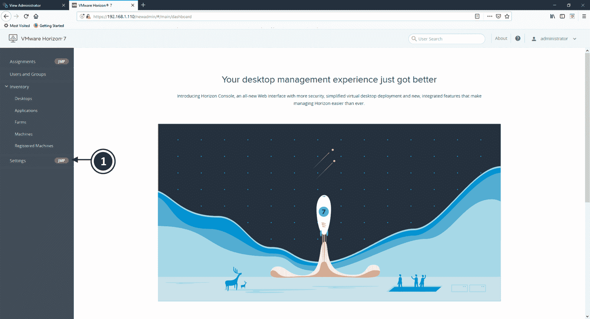

# 第十五章：JMP 和 VMware Horizon 7 部署考虑事项

VMware **即时管理平台**（**JMP**），即 VMware JMP，加速了复合桌面模型，使得桌面所有组件部分——**操作系统**（**OS**）、应用、用户配置文件和数据——能够被抽象、管理，并按需交付给最终用户。这使得你能够提供真正无状态的桌面环境。

在本章中，我们将介绍 VMware JMP，它是如何工作的，以及如何配置它。

本章将涵盖以下主题：

+   JMP 是如何工作的？

+   VMware Workspace ONE

+   VMware 应用卷

+   安装和配置 JMP

# JMP 是如何工作的？

VMware JMP 将多项 VMware 技术结合起来，以提供这种无状态桌面环境。下图展示了 JMP 组件的高级概述以及它们如何组合在一起：


如前所示，JMP 解决方案由多项 VMware 技术协同工作，以将桌面或应用交付给最终用户。这些组件如下：

+   **即时克隆**：按需构建虚拟桌面和 RDSH 服务器镜像。

+   **VMware UEM**：将用户配置文件和策略交付给应用和桌面。

+   **VMware Workspace ONE**：提供一个工作区门户，以访问应用和桌面（可选）。

+   **VMware 应用卷**：按需将应用交付给虚拟桌面和 RDSH 服务器。

在继续之前，让我们花点时间详细描述这些技术。我们已经介绍了即时克隆和 VMware UEM，因此我们将首先概述 VMware Workspace ONE。

# VMware Workspace ONE

VMware Workspace ONE 是一个管理平台，允许 IT 管理员从云端或本地部署中集中控制最终用户的移动设备以及云托管的虚拟桌面和应用。它使最终用户能够安全地使用个人拥有或公司拥有的智能手机、平板电脑、PC 和笔记本电脑访问其公司资源。

它以单一门户或工作区呈现用户的应用，并提供用户可以访问并自行授权使用的自服务应用目录——所有这些都在 IT 团队的控制下。应用可以是基于软件即服务、发布的或移动的。最终用户还可以从这里访问他们的虚拟桌面。下图展示了 Workspace ONE 的启动器视图：


Workspace ONE 套件还包括 VMware AirWatch，一种**企业移动性管理**（**EMM**）解决方案，用于在交付工作区和可供最终用户使用的应用之前检查和注册设备。它还包括 VMware 身份管理器 vIDM，提供单点登录身份验证服务。

在 JMP 场景中，Workspace ONE 提供了一个门户，最终用户可以通过该门户访问由 Horizon 和 JMP Server 交付的桌面和应用程序。

# VMware App Volumes

App Volumes 解决方案来源于 VMware 于 2014 年 8 月收购的一家初创公司 CloudVolumes。原始的 CloudVolumes 解决方案为虚拟和物理桌面环境提供了实时应用程序交付引擎。

2014 年 12 月，CloudVolumes 进行了品牌重塑，成为现在我们所知道的 App Volumes，并作为 Horizon 企业版的一部分提供。

那么，App Volumes 给你带来了什么？从高层次来看，App Volumes 提供了一个实时应用程序交付和生命周期管理解决方案，用于交付通过 App Volumes 配置过程捕获的应用程序。被捕获的应用程序随后被层叠到虚拟桌面和物理桌面的操作系统中。简而言之，App Volumes 是一个应用程序分层解决方案。

那么，这与今天虚拟桌面环境和应用交付的方式有何不同呢？尽管在 VDI 中，桌面操作系统已经从底层硬件中抽象出来，但应用程序仍然与操作系统紧密集成。正如我们在第一章中已经讨论过的，*介绍 VDI 和 VMware Horizon 7*，理想的虚拟桌面解决方案是能够交付完全无状态的桌面，并且能动态地添加组成完整终端用户体验的各个元素。

拥有一个完全无状态的桌面模型通过使每个组件可以单独管理并且需要更少的基础设施，从而提供了最具成本效益的解决方案。今天，有许多工具可以处理用户个性化、用户数据和用户配置文件元素的交付到桌面，例如 Liquidware ProfileUnity。然而，应用程序仍然作为基础操作系统镜像的一部分交付，或者通过应用发布解决方案交付，其中应用程序实际上是在数据中心的服务器上运行。

App Volumes 通过在操作系统和应用程序之间提供一层抽象，来实现将应用程序交付到单独的容器中。这些容器被称为**AppStacks**，并通过有效地将应用程序层叠到虚拟桌面机的操作系统中，完美地集成。下图展示了传统安装模型与**App Volumes Agent**分层方法的比较：


除了应用程序容器，**App Volumes Agent**还为终端用户提供了自己的容器或虚拟硬盘，他们可以在其中安装自己的应用程序。这个容器叫做**可写卷（Writable Volume）**，并且会在用户登录不同的虚拟桌面机器时随身携带，带上他们的所有应用程序。

以下图示展示了**App Volumes Agent**模型，该模型包含应用程序容器（**AppStack**）和用户可写容器（**Writeable Volumes**）：


在接下来的章节中，我们将介绍如何构建一个 AppStack 以及如何将其交付给最终用户。

# App Volumes 是如何工作的？第 1 步——应用捕获

那么，App Volumes 是如何工作的呢？首先，您必须创建或捕获一个可以通过 App Volumes 交付的应用程序。您开始此过程时，需先在虚拟桌面机器上安装该应用程序，这台机器称为配置机器。配置机器基本上是一个未安装任何应用程序的标准操作系统。

当您开始捕获过程时，一个空的 VMDK 文件（App Volumes 也支持 VHD），称为 AppStack，将被挂载到配置机器上。接下来，您像通常一样开始安装应用程序。与该应用程序相关的所有文件将被重定向到 AppStack 或 VMDK 文件中。

如下图所示：


一旦完成捕获过程，AppStack 将被设置为只读状态，并准备好根据最终用户的 Active Directory 组成员身份进行分配。AppStack 也可以分配给单个用户或其他组。

# App Volumes 是如何工作的？第 2 步——应用交付

一旦创建了 AppStack，您就可以将其交付给最终用户。AppStack 的分配基于 Active Directory 成员身份。**App Volumes Agent**在他们的虚拟桌面机器上运行，并挂载包含已捕获应用程序的虚拟硬盘。代理将应用程序的文件和设置“层叠”进来，使应用程序看起来像是完全集成并本地安装的，而不是从额外的驱动器运行。这就是如何将应用程序实时交付给用户的原因，因为**AppStack**可以根据 AD 成员身份即时分配。

如下图所示：


当**AppStack**从最终用户中取消分配时，虚拟硬盘会被简单地卸载，随之带走所有应用程序文件和设置，使得操作系统看起来就像该应用程序从未存在过！

这使得可以将应用程序交付到无状态的虚拟桌面机器中，而在 JMP 的情况下，应用程序按需交付，随着桌面的构建并交付给最终用户。

# 安装和配置 JMP

在本节中，我们将安装和配置 Horizon JMP 解决方案。该解决方案的关键部分不仅是安装其他 VMware 技术组件，如 App Volumes，还需要安装 JMP 服务器本身。

在开始安装过程之前，我们将讨论一些要求和先决条件。

# 先决条件

在安装 JMP 软件之前，需要确保多个元素到位，包括使解决方案正常工作的其他组件以及 JMP 本身的硬件和软件要求。我们首先列出其他 VMware 解决方案组件。

# VMware JMP 组件要求

必须先安装构成 JMP 技术的 VMware 产品的受支持版本，才能开始安装 JMP 服务器。这些组件是利用 JMP 集成工作流功能所必需的。以下 VMware 产品版本必须在安装 JMP 服务器之前安装：

+   VMware Horizon 7 版本 7.5 或更高版本

+   VMware App Volumes 2.14 或更高版本

+   VMware 用户环境管理器 9.2.1 或更高版本

+   VMware 身份管理器 2.9.2 或更高版本（用于与 VMware Workspace™ ONE™ 的集成）

接下来，我们将查看运行 JMP 服务器的硬件要求。

# VMware JMP 硬件要求

要安装 JMP 服务器，您需要一台物理或虚拟服务器，并配置以下设置：

+   4 个 CPU 或 vCPU

+   8 GB 内存（POC 部署为 4 GB）

+   100 GB 磁盘空间（POC 部署为 25 GB）

接下来，我们将查看运行 JMP 服务器的软件和数据库要求。

# VMware JMP 软件要求

JMP 服务器需要安装在以下 Windows Server 操作系统之一：

+   Windows Server 2008 R2 SP1 64 位标准版、企业版或数据中心版

+   Windows Server 2012 R2 64 位标准版或数据中心版

+   Windows Server 2016 64 位标准版或数据中心版

您还需要使用以下版本之一的 SQL 数据库：

+   SQL Server Express 2014 64 位（用于 POC 部署）

+   SQL Server 2012（SP1、SP2、SP3 和 SP4）64 位标准版和企业版

+   SQL Server 2014（SP1 和 SP2，含 CU7 或更高版本）64 位标准版和企业版

+   SQL Server 2016（SP1 和 CU6 或更高版本）

您需要确保已为 JMP 服务器主机和您计划用于安装 JMP 服务器的 Windows 用户帐户配置了 SQL Server 登录名和权限。

现在我们已经涵盖了前提条件和其他要求，可以开始安装 JMP 服务器。

# 安装 JMP 服务器

在本节中，我们将安装 JMP 服务器。

要安装 JMP 服务器，请导航到安装程序文件所在位置。在示例实验环境中，这是域控制器上的共享文件夹，如下图所示：


双击 `VMware-Jmp-Installer-7.6.0-9823717` 文件以启动安装程序。安装程序将启动，您可以按照描述完成安装步骤。我们也会在此提供这些步骤以便清晰：

1.  您将看到 VMware 即时管理平台（JMP）服务器安装向导欢迎界面。

1.  单击“下一步 >”继续。

1.  然后，您将看到 VMware 最终用户许可协议界面。

1.  选择“我接受许可协议中的条款”单选按钮，然后点击“下一步>”继续。

1.  接下来，您将看到允许端口 80 的 HTTP 流量屏幕。默认情况下，使用端口 443（HTTPS），但如果您想使用端口 80，请勾选允许 HTTP 复选框。

1.  点击“下一步>”继续。

1.  现在您将看到 JMP 服务器平台服务的数据库服务器屏幕，如下所示：


1.  在您要连接的数据库服务器框中，输入 SQL 服务器的详细信息。或者，您可以点击浏览...按钮，从显示的服务器列表中选择它。

1.  接下来，点击 Windows 身份验证或服务器身份验证的单选按钮。对于服务器身份验证，您需要输入要使用的帐户的登录 ID 和密码；对于 Windows 身份验证，它将使用当前登录用户的凭据。如果使用此选项，请确保该帐户具有适当的权限级别。

1.  在数据库目录名称框中，输入您为 JMP 设置的 SQL 数据库名称。或者，您可以点击浏览...按钮，从显示的数据库列表中选择该数据库。

1.  然后，您可以选择勾选覆盖现有数据库的复选框。如果您正在安装其他 JMP 服务器，请确保该复选框未勾选，因为勾选它会在安装程序找到现有数据库时覆盖它。

1.  最后，为确保 JMP 服务器与 SQL 服务器之间的安全通信，请勾选启用 SSL 框。

当勾选启用 SSL 框时，您需要确保在 SQL 服务器上使用的 TLS/SSL 证书已导入到 JMP 服务器的 Windows 本地证书存储区。如果未执行此操作，JMP 服务器的安装过程将失败。

1.  点击“下一步>”继续。

1.  现在您将看到准备安装程序屏幕。

1.  点击“完成”以完成安装。

下一步是确保 JMP 服务器与 Horizon 连接服务器之间的时间同步。

# 与 Horizon 连接服务器同步时间

Horizon 连接服务器和 JMP 服务器主机上的时间必须同步，以便两台服务器之间的认证过程能够成功进行。

当您使用 Horizon 控制台访问 JMP 集成工作流功能时，JMP 服务器会验证从 Horizon 连接服务器收到的令牌，后者将令牌返回给 JMP 服务器。如果两个主机服务器之间的时间不同步，则 Horizon 连接服务器会拒绝令牌，JMP 集成工作流功能将无法在 Horizon 控制台中使用。

由于这些服务器是虚拟机，最简单的部署方式是通过 ESXi 主机服务器。您可以通过配置时间配置选项，指向**网络时间协议**（**NTP**）客户端来实现。

在每台虚拟机上，打开命令提示符，然后从 `c:\program files\VMware\VMware Tools` 目录运行以下命令：

```
VMwareToolboxCmd.exe timesync enable
```

在接下来的部分，我们将使用 Horizon 控制台配置 JMP 服务器及其他解决方案组件，以使其协同工作。

# 将 JMP 服务器及其组件添加到 Horizon

首先需要注意的是，JMP 只能使用新的 Horizon 控制台进行配置，而不能使用 View 管理控制台。要进行配置，请按照以下步骤操作：

1.  要开始配置并将其他组件添加在一起，请使用 `https://hzn7-cs1.pvolab.com/newadmin` 登录 Horizon 控制台。

1.  然后，您将看到登录屏幕，如下图所示：


1.  输入您的用户名和密码。确保从下拉框中选择了正确的域，然后点击登录。

1.  您现在将看到仪表板屏幕，如下图所示：



1.  点击设置 JMP（**1**）。

1.  您现在将看到 JMP 设置屏幕，如下图所示：


1.  首先，您需要添加 JMP 服务器。为此，点击添加 JMP 服务器（**2**）。

1.  您现在将看到添加 JMP 服务器的屏幕，如下图所示：


1.  在 JMP 服务器 URL 框中，输入 JMP 服务器的地址。在示例实验室中，这是 `https://jmp.pvolab.com`。

1.  点击保存以继续。

1.  您现在将返回到 JMP 设置屏幕，屏幕上将显示 JMP 服务器已被验证并添加，如下图所示：


1.  接下来，我们将进入 Horizon 7 配置并添加 Horizon Connection Server。现在，您将看到以下截图：


1.  点击添加凭据按钮。

1.  您现在将看到编辑 Horizon 配置的屏幕，如下图所示：


1.  在 Connection Server URL 框中，输入 Connection Server 的地址。在示例实验室中，这是 `https://hzn7-cs1.pvolab.com`。

1.  在服务账户用户名框中，输入用于 Horizon View 服务账户的用户名，在服务账户密码框中，输入该账户的密码。

1.  最后，在服务账户域框中，输入域名。在示例实验室中，这是 `pvolab.com` 域。

1.  当您完成配置详细信息后，点击保存以继续。

1.  接下来，我们将配置 Active Directory，如下图所示：


1.  点击添加按钮。

1.  您现在将看到添加 Active Directory 配置屏幕，如下图所示：


1.  在 NETBIOS 名称框中，输入域的 NETBIOS 名称。在示例实验室中，这是`PVOLAB`。

1.  然后，在 DNS 域名框中，输入域名的名称。在示例实验室中，这是`pvolab.com`。接着，选择协议的单选按钮。在示例实验室中，我们将选择 LDAP（非安全）。

1.  在绑定用户名框中，输入具有访问 Active Directory 权限并且能够创建计算机和用户帐户的用户，然后在绑定密码框中，输入该用户帐户的密码。

1.  最后，在上下文框中，按照格式`DC=`输入详细信息。在示例实验室中，这将是`DC=pvolab,DC=com`。

1.  完成配置详情后，点击“保存”继续。

1.  接下来，我们将配置 App Volumes，如下图所示：


1.  点击“添加”按钮。

1.  您现在将看到“添加 App Volumes 实例”配置屏幕，如下图所示：


1.  在名称框中，输入 App Volumes 实例的名称。

1.  接下来，在 App Volumes 服务器 URL 框中，输入 App Volumes 服务器的地址。在示例实验室中，这是`https://app-vol.pvolab.com`。

1.  在服务帐户用户名框中，输入用于管理 App Volumes 服务器的服务帐户的详细信息，在服务帐户密码框中，输入该服务帐户的密码。

1.  最后，在服务帐户域框中，输入服务帐户的域名。

1.  完成配置详情后，点击“保存”继续。

1.  接下来，我们将配置最后一个组件 UEM，如下图所示：


1.  点击“添加”按钮。

1.  您现在将看到“添加 UEM 文件共享”配置屏幕，如下图所示：


1.  在文件共享 UNC 路径框中，输入 UEM 配置共享的路径详情。在示例实验室中，它位于域控制器上，因此路径是`\\dc\uem-configuration`。

1.  在用户名框中，输入具有访问共享文件夹权限的用户的详细信息，在密码框中，输入该帐户的密码。

1.  最后，在 Active Directory 框中，输入域的详细信息。

1.  完成配置详情后，点击“保存”继续。

您现在已成功配置了 JMP 服务器设置。在下一部分中，我们将介绍如何配置 JMP 分配。

# JMP 分配

现在我们已经完成了 JMP 服务器和其他组件的设置和配置，接下来我们可以创建 JMP 分配。JMP 分配将最终用户、即时克隆虚拟桌面池、应用程序（App Volumes AppStacks）以及用户配置文件和设置（VMware UEM）结合在一起。要创建分配，请按照以下步骤操作：

1.  使用`https://hzn7-cs1.pvolab.com/newadmin`登录到 Horizon 控制台。

与之前的配置步骤一样，JMP 任务只能通过新的 Horizon 控制台进行配置。

1.  你将看到登录屏幕。使用管理员帐户和密码登录。

1.  登录后，点击屏幕左上角的任务 JMP (**1**)，如以下截图所示：


1.  你现在将看到 JMP 任务屏幕。

1.  点击新建按钮。你现在将看到新任务屏幕。

1.  输入你想要分配桌面工作区的用户或组的详细信息。这些用户和组是从配置过程中输入的域详细信息中选择的。在搜索框中，开始输入用户或组的名称，匹配的名称会出现在结果框中。

1.  选择你要分配的用户或组，然后点击下一步继续。

1.  你现在将看到桌面配置屏幕，在这里你选择要包括在 JMP 任务中的桌面池。从显示的表格中选择桌面池（从连接服务器读取），然后点击下一步。

1.  在下一个屏幕中，你可以选择要包括在 JMP 任务中的应用程序。这些应用程序是 AppStacks，可以从配置的 App Volumes 服务器中显示和获取。从显示的表格中选择应用程序，然后点击下一步继续。

1.  你现在将看到用户环境配置屏幕。该屏幕上的设置会自动从先前配置的 UEM 服务器中提取。

1.  屏幕上的第一个设置是禁用 UEM 设置，这是一个简单的开关。将此设置为开启表示该任务不会应用任何 UEM 设置。如果你将其设置为“否”，并在设置页面点击跳过，那么请注意，所有设置将应用于此任务。你还将看到屏幕上显示的设置列表，你可以勾选单个设置，如果你希望将它们应用到此任务。

1.  点击下一步继续。

1.  你现在将看到定义配置屏幕。在名称框中，输入此 JMP 任务的名称，并可选择性地输入描述。系统会自动添加一个默认的任务名称。

1.  然后，在 AppStack 附加框中，从下拉菜单中选择你希望如何将 AppStacks 附加到虚拟机。你可以选择“下次登录时”或“立即”。

1.  点击下一步以继续。

1.  你现在将看到总结屏幕。

1.  如果你对配置满意，点击提交。

1.  你现在将返回到 JMP 设置屏幕，在这里你会看到任务显示为“待定”。一旦任务加载完成，状态将变更为“成功”。

你已经成功配置了 JMP 分配。当最终用户下次登录到在分配中配置的桌面池中的桌面时，虚拟桌面机器将从即时克隆（Instant Clone）创建。应用程序将通过 App Volumes AppStack 交付，用户的配置文件和个人数据将通过 VMware UEM 交付。

# 总结

在本章中，我们更深入地了解了及时管理平台（JMP）以及它如何按需将构成桌面组件的各部分交付给最终用户。JMP 由多个不同的 VMware 技术组成：使用即时克隆（Instant Clones）构建虚拟桌面机器，使用 App Volumes 将应用程序以应用层（AppStacks）的形式交付，以及使用 VMware UEM 交付独特的最终用户元素，如配置文件和用户创作的数据。可选地，桌面和应用程序可以通过 Workspace ONE 门户提供。

使用这种方法可以让你按需交付真正的无状态虚拟桌面机器。

在下一章，我们将探讨一些环境故障排除的技巧。
