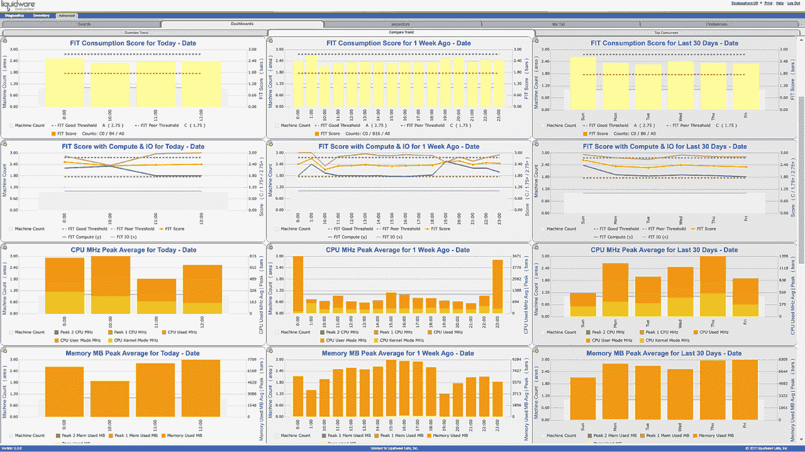
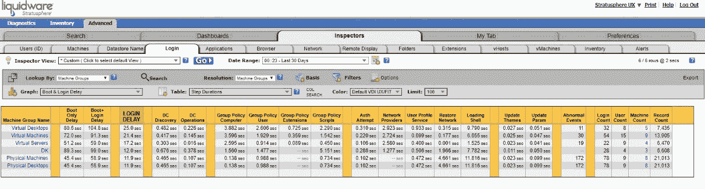
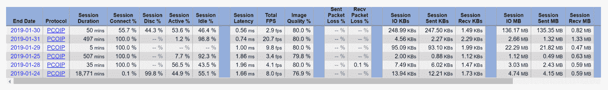
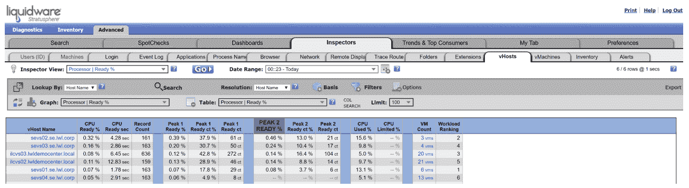
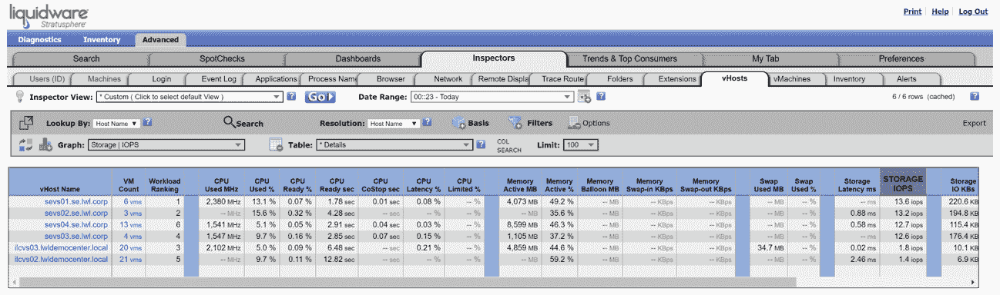
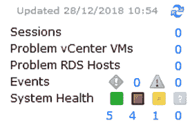
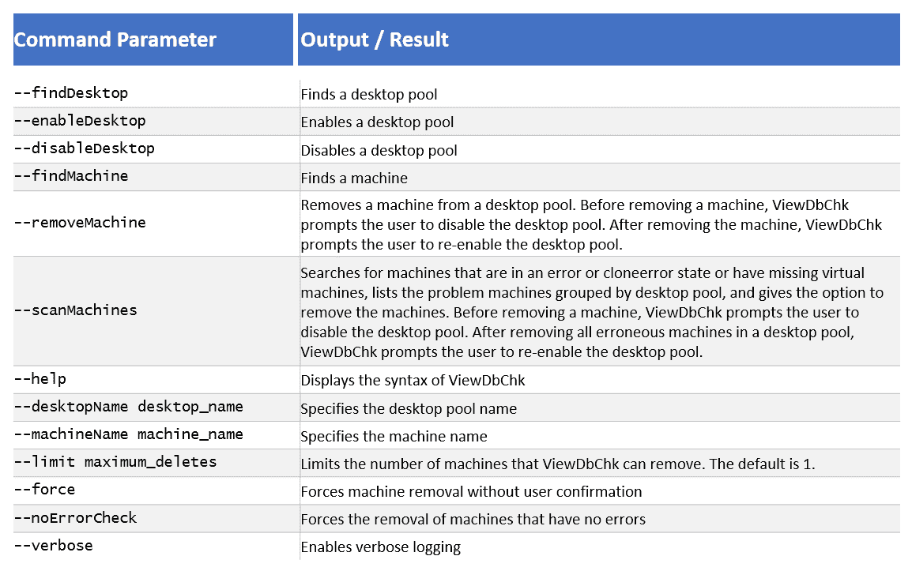
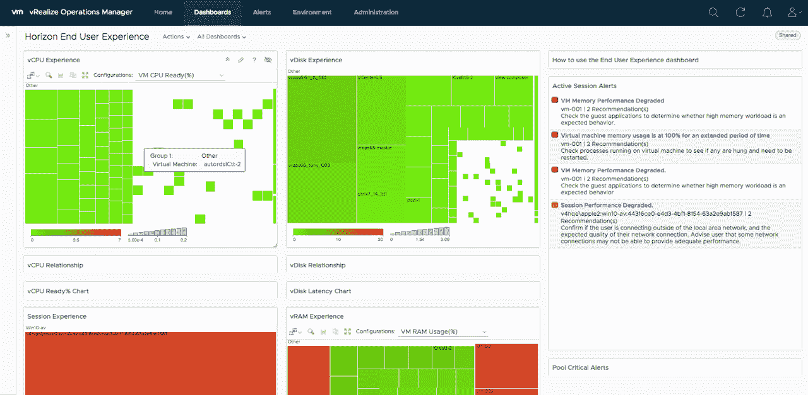

# 第十六章：故障排除

如你所知，成功的 VDI 或终端用户计算项目是由多个组件组成的，它的成功取决于提供良好的用户体验。这不仅仅是基础设施是否正常工作的问题。因此，拥有明确的方法论和能够充分诊断与修复环境中问题的工具是非常重要的。在本章中，我们将介绍一些故障排除技术，以及其他用于监控 Horizon View 中终端用户体验的方法。

本质上，我们将从两个角度来进行故障排除：反应性和前瞻性，涵盖以下主题：

+   常规故障排除技巧

+   故障排除 Horizon View 问题

+   vRealize Operations for Horizon

+   Liquidware Stratusphere UX

我们还将使用 Liquidware Stratusphere UX 来突出故障排除和监控环境时需要关注的一些关键元素。

# 常规故障排除技巧

本章的第一部分，我们将简要介绍一些常规的故障排除技巧。我们将从查看终端用户报告的问题开始。是由于某个特定的应用程序或桌面配置导致的吗？如果是性能相关的问题，我们需要能够将其与支持的基础设施组件关联起来，比如他们的桌面或应用程序运行在哪个服务器上，从而隔离主机资源问题，如网络缓慢或磁盘慢速。

# 从大局来看

经常出现问题时，VDI 解决方案会自动成为背锅侠。这是因为它是一个新的部署，终端用户的看法是，由于桌面是远程运行的，所以它应该是问题所在。你需要记住，Horizon View 技术只是整体基础设施中的一个组成部分，用户使用的桌面也是其中的一部分。仅仅因为桌面位于 VDI 环境中，并不意味着一定是 View 的问题。它也可能是桌面、网络或应用程序的问题，这些问题在物理环境中也会发生。

当用户报告问题，或者你在基础设施中发现问题时，你需要逻辑地思考，基础设施中的哪个组件可能是问题的根源，并决定从哪里开始排查。也许是存储问题，甚至是 Windows 问题，与 VDI 完全无关！

# 这个问题是否影响多个用户？

检查环境中任何问题的一个好起点是回答以下问题：谁遇到了问题？是否有多个用户报告了相同的问题？如果你尝试重现该问题，是否会得到相同的结果？是否有其他用户，在相同的权限和资源下，能够重现该问题？

如果你发现问题确实只与某个单一用户相关，那么考虑一下他们所遇到的问题是什么。例如，你可以问以下问题：

+   他们是从什么设备连接的？

+   他们使用的连接协议是什么？是否尝试过其他协议？

+   可能是带宽或连接可靠性的问题吗？

+   是否有端口被阻塞？

+   他们是否有特定的应用程序或权限需求？

+   他们是否拥有正确的资源池权限？

如果你认为问题与他们的桌面有关，那么可以考虑刷新桌面。这就是 VDI 的魅力；你可以简单地重建一个新的桌面，而不是花费数小时尝试排除和修复应用程序或操作系统问题，如果简单的刷新能够解决问题的话。

如果问题影响了多个用户，检查是否可以将修复应用于基础镜像，并将其推广到桌面池，从而简化问题的解决过程。

# 性能问题

这是排查 View 环境问题时可能涉及的最广泛的领域之一。性能问题可能与许多方面、领域有关，而且在某些情况下，还可能是个人意见。

# 当用户报告性能问题时

如果用户报告性能差，那么让他们尽量具体一些，而不是简单地说“很慢”。是登录花费时间太长，还是某个应用程序加载的时间比预期要长？记录问题的日志，以及问题发生的时间和日期，或者是否是持续性问题。

在问题发生时，询问用户以下问题：

+   他们是如何衡量性能的？

+   他们遇到问题的时间是一天中的哪个时段？

+   他们在遇到问题时做了什么特定的操作？

+   他们是否在特定的地点或通过特定的设备连接时遇到问题？

尽可能访问最终用户，亲自了解他们遇到的问题。这将帮助你轻松找到问题的根源。希望正如我们在第三章《设计与部署考虑事项》中讨论的那样，你会早期与最终用户进行沟通，他们会积极参与并支持整体解决方案，愿意提供帮助。

使用 Liquidware Stratusphere，你还可以查看用户入职时的基线数据，然后查看趋势信息。这将帮助你识别环境的任何变化，并且你还会知道问题发生时，其他环境中发生了什么。以下截图展示了这个例子：



Liquidware Stratusphere 显示的趋势信息

# 与 VDI 无关的问题

桌面上的性能问题可能由多种因素引起，无论它们是虚拟桌面还是物理桌面。常见的考虑因素包括以下几方面：

+   登录时间过长

+   应用程序崩溃

+   应用程序加载时间过长

+   操作系统崩溃

+   应用程序性能差

+   权限错误

正如我们刚刚提到的，许多问题无论桌面是否虚拟化都可能发生，且都会发生，但在虚拟化环境中，出现的任何问题都会更容易解决。例如，如果你发现操作系统或应用程序崩溃，可以考虑将这些元素更新到最新的补丁，并为所有用户重新生成镜像。如果是物理桌面环境，这可能需要更长时间，且更为复杂。

也许登录时间或应用程序加载时间受到 CPU 性能问题的影响。以下截图显示了 Liquidware Stratusphere 的登录监控功能输出：



Liquidware Stratusphere 的监控功能

对于每台虚拟桌面机器，你可以深入查看运行的每个进程和服务，从而了解诸如进程加载时间以及该进程的其他依赖项等信息。在故障排除登录问题时，尤其是在从物理桌面迁移到虚拟桌面时，这些信息非常宝贵，因为它能帮助识别不应在虚拟环境中使用但仍然存在并在虚拟桌面中引发问题的服务。

对于物理桌面，除非更换或升级受限组件，否则你将只能使用现有硬件，但在 VDI 环境中，你可以按下按钮来调整配置，只要你有足够的底层资源。

需要理解的重要一点是，通用桌面问题仍然存在，因此，建议利用 VDI 平台的优势来帮助解决这些问题。我们与许多已部署 VDI 并投入生产的组织合作过，一旦解决方案实施后，他们往往会忘记处理通用桌面支持，而花费过多时间深入研究 VDI 架构和基础设施，寻找故障，而答案可能只是一个简单的 Windows 操作系统或应用程序问题。

# 带宽、连接性和网络

与网络相关的问题通常是最难追踪和解决的。在可能的情况下，请确保与网络团队紧密合作，确保有合适的端到端监控措施。

当用户通过局域网连接时，理想情况下，你会希望带宽充足，延迟足够低，因此连接应该是可靠的。如果你在局域网环境中遇到困难，可以考虑以下几点：

+   网络上是否有任何变化？

+   用户是通过有线网络还是无线网络连接的？

+   是否已在交换机上配置了 PCoIP 的 QoS？

+   当前网络是否可靠？

+   是否在以下任何位置看到数据包丢失？

    +   客户端到核心交换

    +   客户端到服务器

    +   客户端到 VDI 桌面

+   延迟是否在预期范围内？

+   即使在较大的局域网环境中，带宽也可能成为问题——你是否考虑过从客户端设备到 VDI 桌面的带宽总和？

+   你是否在不同网络之间进行路由？路由器的性能是否达到合适的水平？

+   负载均衡器是否根据你的环境进行适当的配置？

当用户通过 WAN 连接时，排除故障或保证连接质量有时会更具挑战性。

对于远程或分支机构，确保互联网连接的带宽足够；尽可能确保从端到端配置 PCoIP 协议的 QoS，并确保你已适当地配置 PCoIP 策略以应对带宽减少的问题。

在故障排除时，检查客户端和视图连接服务器上的相关日志，以及任何中间组件，如负载均衡器和路由器。

以下列表包含了一些用户常报告的常见故障：

+   **黑屏**：这通常是由于某处的端口阻塞了 PCoIP 协议造成的。检查 PCoIP 端口是否已打开；即端口 `4172`。

+   **断开连接**：高延迟和丢包会导致用户与其桌面断开连接。确保在刷新桌面之前允许足够的时间让用户重新连接。

+   **低分辨率图像**：由于协议的性质，如果带宽低，用户可能会抱怨图像质量差。考虑在用户策略中限制图像构建选项。

以下截图展示了 Liquidware Stratusphere UX 记录的 PCoIP 协议的信息示例：



PCoIP 协议

在下一节中，我们将查看计算资源。

# 计算资源

主机服务器上的 CPU 和内存问题会对最终用户体验产生不利影响。与大多数技术解决方案一样，我们建议，在进行初步测试和部署时，记录下关键性能特征的基准数据，如 CPU 和内存利用率，以及更深层的指标，如 CPU 等待时间。

有了这些基准信息在你的工具包中，你可以更容易地将问题发生前的性能与现在的性能进行比较。这将有助于尝试找出可能导致问题的原因。同样，使用像 vRealize Operations for Horizon 这样的技术，将帮助你理解性能利用率随时间的变化。你也可以使用像 Liquidware Stratusphere 这样的第三方产品。Stratusphere 提供了基准指标（在评估阶段测量），以及当前的用户体验，让你可以快速识别出了什么变化，并找出问题的根源。

在你的 VDI 基础架构中，你不希望出现任何内存超配的情况。你需要考虑分配给虚拟桌面的内存量，以及主机中的总内存。理想情况下，你需要确保总分配内存少于主机服务器中的总内存。不要忘记，如果某个主机服务器出现故障，你仍然需要提供所需的内存资源。

如果你遇到与内存或 CPU 相关的性能问题，检查虚拟桌面是否有任何内存交换情况。检查环境中是否有任何气球效应。了解你的 CPU 就绪特性。VDI 环境中可接受的 CPU 就绪时间会根据环境和用户不同而有所变化。一般来说，你希望每个分配的 CPU 的 CPU 就绪时间低于 5%，峰值时不超过 10%。超过这些数值表示主机服务器过载，可能会影响 CPU 性能，并导致虚拟桌面机器的性能变慢。以下截图展示了 CPU 监控的例子，特别是 CPU 就绪时间：



CPU 监控和 CPU 就绪时间

当你从初步设计扩展你的 VDI 解决方案时，很容易忘记检查这些指标，并随着扩展而持续关注它们，突然之间，你可能会发现自己遇到了计算性能问题。

# 磁盘

正如我们之前提到的，所部署的磁盘解决方案是成功实施 VDI 的关键组成部分。你需要能够密切关注磁盘性能，这是避免未来出现问题的关键。

你所在环境中可接受的延迟量将很大程度上取决于用户。还要考虑在扩展解决方案时会发生什么。虽然我们可以说，低于 25 毫秒的磁盘延迟通常是可以接受的，但这并不意味着如果用户一直使用延迟低于 25 毫秒的桌面，他们会注意到突然之间延迟达到了 25 毫秒或更高。

你的存储供应商可能有自己的工具集来管理和监控性能；不过，以下截图展示了按主机划分的存储 IOPS 性能概览：



存储 IOPS 性能概览

在讲解了一些基础设施组件的常见故障排除技巧后，接下来我们将讨论 Horizon View 特定的问题。

# 故障排除 Horizon View 问题

本书中讨论了许多构成您 Horizon View 基础设施的组件，虽然它们通常非常可靠，但当然也可能会出现故障，并产生严重的连锁反应。在可能的情况下，您应确保 Horizon 环境具有高可用性，如果这不可行，则确保通过 vRealize Operations for Horizon 等组件，或像我们在示例实验室中使用的第三方监控解决方案（如 Liquidware Stratusphere）来充分监控各个组件。

# Horizon View 一般基础设施问题

排查 Horizon View 基础设施问题时的首要步骤应该是查看 Horizon View 管理控制台中的事件日志。您可以通过点击屏幕左上角的警报，快速访问事件日志，如下图所示：



Horizon View 管理控制台中的事件日志

您还应利用 View 管理员中的仪表盘视图来快速概览您的环境，了解其健康状况。此屏幕将显示您基础设施中所有关键组件的健康状况，例如 vCenter、主机、View 连接服务器、View 安全服务器、桌面、RDS 主机和数据存储。

这是一个很好的资源，可以帮助您开始在 Horizon View 环境中排查基础设施问题。

在遇到 Horizon View 基础设施问题时，您也不应忘记最简单的故障排除步骤：

+   所有服务器、桌面、主机等是否都可以在网络上访问？

+   所有必要的服务是否已启动？

+   所有服务器上是否有足够的可用空间？

+   内存和 CPU 是否已满？

+   您是否检查了所有的事件日志？

还需要考虑后端数据库系统，以及如果它们下线时可能产生的影响。确保您的 SQL 解决方案可靠，并与所有其他组件一致。如果您遇到如 vCenter 或 View Composer 的问题，请确保检查 SQL Server 是否存在以下问题：

+   是否有足够的资源？

+   服务是否已启动？

+   是否已打开正确的端口？

+   数据库和日志是否有足够的可用磁盘空间？

# View 基础设施组件问题

当然，也可能出现一些我们尚未讨论的问题。Horizon View 有其集成的系统健康监控，因此可以报告与 Horizon View 特定问题相关的错误，帮助管理员快速定位问题。不幸的是，有时纠正措施可能非常繁琐且需要手动实施。

可能需要特定纠正措施的常见问题如下：

+   在丢失组件或操作系统损坏后，手动移除 View 连接服务器或安全服务器

+   手动移除 VDI 桌面或整个池

+   从备份中恢复 Horizon View

+   从备份中恢复持久磁盘

+   用户的持久磁盘空间不足

我们不会在这里覆盖所有这些过程的具体修复操作，因为我们可以写一本书来详细介绍它们，但 VMware 的 KB 网站上已经有一些很棒的**知识库**(**KB**)文章可供参考，网址为[`kb.vmware.com`](http://kb.vmware.com/)。

我们将简要讨论的一个问题是 View Composer 数据库的错误，以及导致配置错误的数据库不一致。VMware 有一个用于解决数据库错误的工具，叫做**ViewDBChk**工具，我们将在下一节中介绍。

# 使用 ViewDBChk 工具修复 View Composer 问题

当 LDAP、vCenter 服务器和 View Composer 数据库之间存在不一致时，可能会发生配置错误，通常是由于直接在 vCenter Server 清单中编辑虚拟桌面机器，或从备份中恢复虚拟桌面机器所导致的。

ViewDBChk 工具允许 View 管理员扫描无法配置的机器，并且还允许您删除无效的数据库条目。这样，连接服务器就能够在没有任何错误的情况下重新配置桌面。

您可以在安装时创建的`View`文件夹中找到此工具。通过导航到以下路径，您可以找到该文件夹：

```
C:\Program Files\VMware\VMware View\Server\Tools\bin
```

该工具是基于命令行的，并且为您可以执行的每个功能提供了多个参数。这些参数在下表中列出：



显示每个功能参数的表格

例如，要运行命令从桌面池中移除一台机器，在命令提示符下，输入以下命令：

```
ViewDbChk --removeMachine --desktopName
```

在下一部分中，我们将查看一些可用的附加工具，用于监控和管理环境。

# vRealize Operations for Horizon

vRealize Operations for Horizon 作为 Horizon Enterprise 的一部分提供，也可以作为独立产品提供。vRealize Operations 与大多数监控工具的不同之处在于其分析引擎。大多数监控工具是围绕设置关键值的阈值，如 CPU 或内存使用量进行的。这些警报的问题在于，仅仅超过阈值并不意味着一定存在问题。有时，这可能在应用程序的正常参数范围内，或者问题可能是某些资源在应当消耗时并未被使用。

通过 vRealize Operations 中包含的分析引擎，它能够学习并理解您的环境的正常工作参数。由此，它能够在出现超出这些参数的错误时发出警报。它还能够跟踪随着时间推移的增长和消耗，从而在问题发生之前预防它。

vRealize Operations for Horizon 应该在项目开始时尽可能安装。vRealize Operations 通过一个虚拟设备或 vApp 简单部署，部署并配置后，它会开始监听并学习你的环境。

vRealize Operations 跟踪了三个关键指标：健康、风险和效率：

+   健康报告会显示你环境的当前健康状态。可能影响健康的因素包括高丢包率、组件故障、磁盘容量达到临界水平等。

+   风险表示环境中存在的问题，如果不加以处理，可能会对环境的健康造成影响。

+   效率报告会考虑到如过度配置等问题，如果这些问题得到解决，能够帮助你更充分地利用环境资源，从而最大化投资回报。一个例子是 CPU 或内存过度配置的虚拟机（VM）。

以下截图显示了一个终端用户体验仪表盘，突出显示了 CPU 使用情况：



终端用户体验仪表盘

vRealize Operations for Horizon 还包括特定的功能，确保你完全了解 Horizon View 环境的健康状况，包括对 PCoIP 协议的全面可见性，以及与 View Connection Server、View Security 等的健康监控集成。

vRealize Operations 的分析引擎会学习你的环境，了解什么是正常的，并基于动态阈值而不是无意义的静态阈值发出警报。

在 vRealize Operations 中，它还包含一个智能警报功能，允许你快速理解基础设施问题的根本原因，并给出建议的修复措施。

还有一些第三方工具和解决方案，超出了环境监控的范围。其中一个工具是 Liquidware 的 Stratusphere 解决方案，我们将在下一节讨论它。

# Liquidware Stratusphere UX

Liquidware Stratusphere UX 不仅仅是一个监控工具。事实上，它更像是一个用户生命周期管理工具，在我们整个部署过程中都发挥了作用。在评估当前环境时，我们首先使用了 Stratusphere UX 的输出，以便为我们提供一个资源使用概览，同时也为我们提供了一个基准，作为部署 Horizon 时的参考。

然后我们使用这个基准来帮助调整终端用户体验，在我们引入用户并构建金图像时，确保终端用户在最优的性能水平下运行。

最后，Stratusphere 可以作为诊断工具，帮助 IT 支持团队快速找到问题的根本原因。IT 可以快速了解问题所在，提供对单个用户、单台机器或单个应用程序的详细分析，以及用户虚拟桌面会话的端到端视图，了解它托管在哪里以及正在消耗哪些资源，有助于快速识别问题。

正如您在之前的章节和截图中所看到的，Liquidware Stratusphere 可以轻松帮助监控和管理您的环境。

# 获取进一步的帮助

如果您在解决 Horizon View 的问题时遇到困难，可以使用多种资源。首先，我们建议尽早与 VMware 支持联系，以获取最佳的帮助来解决您的问题。您还可以尝试来自 VMware EUC 社区的各种博客和帖子。

还有 VMware 社区，这里有丰富的资源可以访问[`communities.vmware.com.`](https://communities.vmware.com)

最后，可能是最有用的资源是 VMware 知识库，正如我们在本章前面提到的。在撰写本文时，涉及 Horizon View 的具体支持主题有 300 个，包括视频操作指南和逐步解决方案指南。

# 总结

在本章中，我们涵盖了在 Horizon View 环境中解决问题时需要考虑的一些方法和领域。应考虑整体情况，确保您充分了解用户面临的问题以及可能导致这些问题的用户桌面体验领域。在可能的情况下，使用诸如 vRealize Operations for Horizon 等监控工具查找问题的根本原因。如果您认为存在基础设施问题，应检查 Horizon View 中的几个领域，包括仪表板和 Horizon View 管理员中的事件日志。

最后，我们介绍了如何从 VMware 知识库获取进一步的帮助。

我们现在已经到达了本书的结尾，在到达这一点时，您应该对 Horizon Suite 的架构有了更深入的理解，并了解如何设计您的终端用户计算解决方案。您还应该理解为用户推出 Horizon View 涉及的阶段和详细信息，包括安装各种组件，并配置、设计和构建桌面镜像和池。您将了解到关于如何将应用程序分层到您的桌面的各种方法，使用 ThinApp、RDSH 发布的应用程序和 App Layers 等技术。

设计和推出任何组织的终端用户计算解决方案都是一项必须谨慎和深入了解用户的任务，我们希望本书中涵盖的主题将更好地为您未来的任务做好准备。
