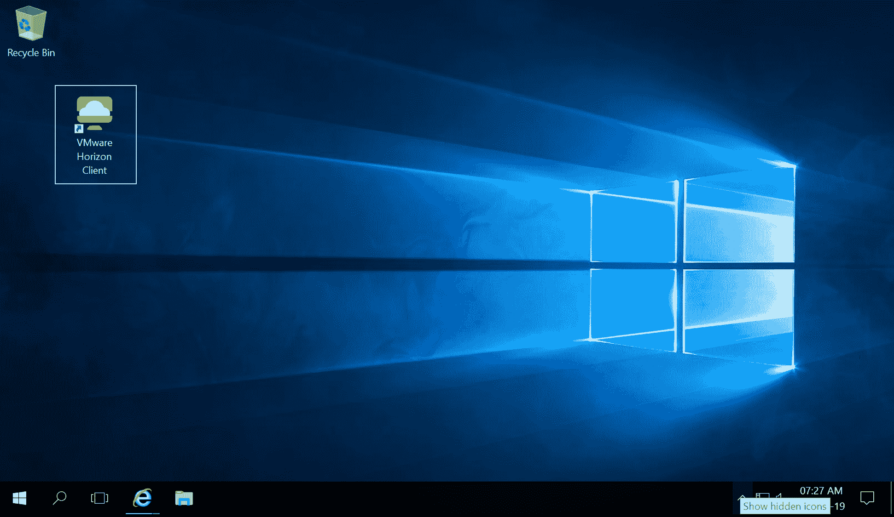

# Horizon 7 的新功能介绍

自从我开始写这本书以来，VMware 已发布了 Horizon 的 7.7 版和 7.8 版。

这些新版本增加了许多更新功能和扩展支持，我们将在本章讨论这些内容。我们还将讨论平台和基础设施的变化。

# 操作系统和基础设施更新

在最新的 Horizon 7 版本发布中，VMware 增加了对更新的操作系统、虚拟基础设施和其他软件应用的支持。这些如下：

+   支持 Windows Server 2019（包括 RDSH 支持）

+   支持 VMware vSphere 6.7 Update 1

+   支持 VMware vSAN 6.7 Update 1

+   升级 Horizon Cloud 连接器的能力（用于 VMware on AWS）

+   支持 VMware 虚拟化包中的 IPv6 与 Skype

使用 VMware Cloud on AWS 运行 Horizon 时，还进行了许多改进和新增功能。这些如下：

+   最小大小集群现在已经减少到 3

+   支持 vSphere 延伸集群

+   支持 NSX-T 和 VMware vSAN 数据存储加密

+   支持 Horizon 7 企业版，增加了 VMware UEM、VMware App Volumes 和 VMware Instant Clone

+   支持运行 Linux 桌面

在下一节中，我们将看看一些新的管理特性。

# Horizon 管理更新

在本书中，我们使用了原始的 View 管理员和新的 Horizon 控制台来管理我们的 Horizon View 环境。主要原因是某些管理任务和功能在新的 Horizon 控制台中不存在。

# Horizon 控制台更新

在此版本中，VMware 在新的 Horizon 控制台中添加了一些新功能。这些功能如下：

+   管理手动桌面池。

+   管理 Linked Clone 桌面池和 Linked Clone 持久磁盘。

+   添加了一个新的**已连接用户**列和一个**已分配用户**列，以便更容易看到谁连接到虚拟桌面机器。这也已添加到原始的 View 管理员。

# View 管理员更新

VMware 已经在 View 管理员管理控制台中添加了一些新功能。这些功能如下：

+   VMware 统一访问网关显示在系统健康仪表板上。

+   连接服务器 Pod 名称现在在浏览器标题栏中显示。

# 帮助台工具更新

最后，在管理更新方面，VMware 在 Help Desk 工具中添加了一些新功能。现在管理员可以结束正在运行的应用程序进程。

在下一节中，我们将看看 Horizon 7 版本 7.7 中的可扩展性增强。

# 可扩展性

除了增加到这个最新的 7.7 版本中的功能之外，VMware 还增强了 Horizon 的可扩展性，增加了对更大规模部署的支持。这些功能如下：

+   单个 vCenter Server 现在可以在使用 Cloud Pod 架构时管理多个 Pod。

+   支持最多 500 个 RDSH 服务器在一个农场中。

+   vMotion 支持连接克隆和自动化桌面池中的完整虚拟机。

+   vMotion 支持已配置使用 vGPU 的完整克隆、即时克隆和连接克隆虚拟桌面机器。

在下一节中，我们将查看最终用户体验的增强功能。

# 增强的最终用户体验

最终用户体验是成功 Horizon 环境的关键，在这次最新的版本中，VMware 添加了更多的功能，以改善最终用户的整体体验。这些功能如下：

+   物理 PC 现在支持 Blast Extreme 协议。

+   Blast Extreme HEVC（H.265）视频编码支持。此功能将数据压缩率提高一倍，但保持质量。此功能不需要 NVIDIA GRID。

+   支持通过客户端驱动重定向复制、拖放文件和文件夹。

+   新增虚拟打印功能。此功能允许在最终用户的 Windows 客户端上打印到任何打印机。此功能还支持客户端打印机重定向和基于位置的打印。

+   管理员可以指定是否允许用户打开同一应用的多个实例。

+   用户可以在使用 Windows 客户端时分配 RDSH 发布的应用。

+   混合登录功能现在支持未认证用户的应用访问。

在最后一节中，我们将查看为基于 Linux 的虚拟桌面机器添加的一些增强功能。

# Linux 虚拟桌面机器更新

Linux 正在成为虚拟桌面机器的越来越流行的操作系统。VMware 继续添加功能，使其达到与使用 Windows 桌面时支持的功能相同的水平。Linux 目前的功能包括以下内容：

+   SLES 12x 虚拟桌面机器现在支持 SSO

+   SLED/SLES 支持音频输入

+   支持即时克隆浮动桌面池

+   会话协作

+   支持即时克隆的离线域加入

# 平台更新

随着平台更新，Horizon 现在支持更新的操作系统，详情请见：

+   连接服务器现在支持 Microsoft Windows Server 2019

+   View Composer 现在支持 Microsoft Windows Server 2019

+   Microsoft Skype for Business 2019 现在在 Horizon 环境中得到支持

在下一节中，我们将查看 Horizon 控制台的更新。

# Horizon 控制台更新

在 Horizon 的早期版本中，仍然有大量的管理任务和功能仅在 View Administrator Console 中可用。在这次最新的版本中，许多这些功能现在出现在新的 Horizon 控制台中。这些新添加的功能如下：

+   管理连接克隆环境中的持久磁盘

+   管理全局策略

+   管理管理员访问权限以及基于角色的访问权限

+   管理 vCenter Server 设置和连接服务器设置

+   管理连接克隆和 View Composer

+   管理 Cloud Pod 架构设置

+   能够为 RDSH 发布的应用和桌面创建快捷方式

在下一节中，我们将查看 Horizon 的可扩展性。

# 可扩展性

Cloud Pod 架构现在支持以下功能：

+   250,000 个会话

+   50 个 POD

+   每个 POD 支持 10,000 个会话

+   15 个站点

+   每个 POD 有 7 个连接服务器

+   总计 350 个连接服务器

在接下来的部分中，我们将讨论通过 RDSH 交付应用程序和桌面时的改进。

# RDSH 改进

以下功能已添加到 Horizon View 的 RDSH 功能中，用于交付已发布的应用和桌面：

+   使用图形用户界面而不是以前版本的手动脚本方法来配置桌面和应用会话的负载均衡能力

+   对配置客户端限制的已发布应用和桌面的支持，适用于组织单位（OU）

在接下来的部分中，我们将讨论如果你在 VMware Cloud on AWS 上使用 Horizon 时支持的几个新功能。

# Horizon 与 VMware Cloud on AWS

如果你在 VMware Cloud 上运行 Horizon 环境，并且它是基于 AWS 的，那么以下新特性将得到支持：

+   VMC 上的 NSX-T 现在支持多 VLAN

+   支持 AWS 1.6

在接下来的部分中，我们将探讨 Horizon Agent 的更新。

# Horizon Agent 更新

除了服务器端组件更新之外，为了利用其中的一些新特性，Horizon Agent 也进行了更新，以支持多个平台。我们将在本节中讨论这些内容。

# Windows 代理

Windows 版 Horizon Agent 现在包括以下功能：

+   使用正则表达式的 URL 内容重定向规则

+   对**通用 Windows 平台**（**UWP**）应用的智能卡认证支持

+   帮助台代理现在已集成到 Horizon Agent 安装过程的一部分

+   VMware 集成打印完工

为了利用这些功能，你需要更新运行在 Windows 虚拟桌面机器或黄金镜像上的 Horizon Agent，随后你还需要重新部署。

# Linux 代理

Windows 版 Horizon Agent 现在包括以下功能：

+   多屏幕部署的 HTML 访问

+   会话协作只读模式

+   在运行 NVIDIA vGPU 时，SLED 12.x 扩展了支持

+   从 RHEL 7.1 及以后版本支持智能卡重定向

+   真正的**单点登录**（**SSO**）扩展操作系统支持

+   扩展支持 CentOS 7.6 和 RHEL 操作系统

为了利用这些功能，你需要更新运行在 Linux 虚拟桌面机器或黄金镜像上的 Horizon Agent，随后你还需要重新部署。

# Horizon 客户端

除了基础架构和虚拟桌面代理的更新外，此版本还将 Horizon 客户端升级至版本 5.0。有关这些新功能的详细信息，可以参见第十二章，*Horizon 客户端选项*。

你还会看到一个新的 Logo，如下所示：

这个徽标是 Horizon 外观和体验重新设计的一部分，旨在使其更符合 Workspace ONE 解决方案的外观和体验。

# 总结

在本章中，我们简要介绍了 Horizon 7 版本 7.7 和 7.8 中新增的一些功能。

有关包含内容的详细信息，可以通过查看以下链接找到：

[`docs.vmware.com/en/VMware-Horizon-7/7.7/rn/horizon-77-view-release-notes.html`](https://docs.vmware.com/en/VMware-Horizon-7/7.7/rn/horizon-77-view-release-notes.html)

[`docs.vmware.com/en/VMware-Horizon-7/7.8/rn/horizon-78-view-release-notes.html?hWord=N4IghgNiBcIOwDoAcIC+Q`](https://docs.vmware.com/en/VMware-Horizon-7/7.8/rn/horizon-78-view-release-notes.html?hWord=N4IghgNiBcIOwDoAcIC+Q)。

这也标志着本书的结束，我希望你在阅读如何通过 Horizon 解决方案为你和你的组织带来益处时感到愉快，并且通过跟随一步一步的示例实验室，你现在已经掌握了构建自己 Horizon 环境的知识。
