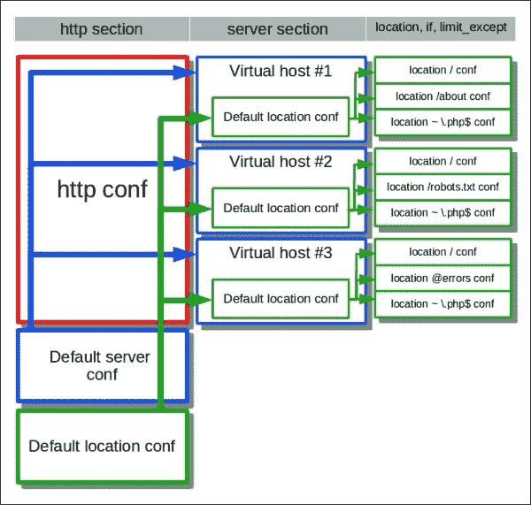

# 第一章：开始使用 Nginx

Nginx 在过去十年中已经发展成一个强大且可扩展的通用 Web 服务器。由于其简单而可扩展的架构、易于配置以及轻量的内存占用，许多网站管理员、创业公司创始人和站点可靠性工程师选择了它。Nginx 提供了许多有用的功能，例如开箱即用的动态压缩和缓存功能。

Nginx 与现有的 Web 技术（如 Apache Web 服务器和 PHP）集成，并帮助轻松解决日常问题。Nginx 拥有一个庞大而活跃的社区，以及一家由风险资本资助的咨询公司。因此，它得到了积极的支持。

本书将帮助你入门 Nginx，并学习将其转化为强大工具所需的技能，这个工具将帮助你解决日常工作中的挑战。

# 安装 Nginx

在你深入了解 Nginx 的具体功能之前，你需要先学习如何在你的系统上安装 Nginx。

强烈推荐在你的发行版中使用预构建的 Nginx 二进制包。如果有的话，这能确保 Nginx 与系统的最佳集成，并且能重用包维护者在包中所采用的最佳实践。预构建的 Nginx 二进制包会自动为你管理依赖关系，并且包维护者通常会迅速发布安全补丁，这样你就不会收到来自安全人员的投诉。此外，这个包通常会提供特定发行版的启动脚本，而这并不是默认提供的。

查看你的发行版包目录，看看是否有预构建的 Nginx 包。你也可以在官方 [Nginx.org](http://Nginx.org) 网站的 **下载** 链接下找到预构建的 Nginx 包。

在本章中，我们将快速介绍包含预构建 Nginx 包的最常见发行版。

## 在 Ubuntu 上安装 Nginx

Ubuntu Linux 发行版包含了一个预构建的 Nginx 包。要安装它，只需运行以下命令：

```
$ sudo apt-get install nginx

```

上述命令将会在你的系统上安装所有所需的文件，包括 `logrotate` 脚本和服务自动启动脚本。以下表格描述了运行此命令后创建的 Nginx 安装布局，以及所选文件和文件夹的目的：

| 描述 | 路径/文件夹 |
| --- | --- |
| Nginx 配置文件 | `/etc/nginx` |
| 主配置文件 | `/etc/nginx/nginx.conf` |
| 虚拟主机配置文件（包括默认文件） | `/etc/nginx/sites-enabled` |
| 自定义配置文件 | `/etc/nginx/conf.d` |
| 日志文件（包括访问日志和错误日志） | `/var/log/nginx` |
| 临时文件 | `/var/lib/nginx` |
| 默认虚拟主机文件 | `/usr/share/nginx/html` |

### 注意

默认虚拟主机文件将放置在 `/usr/share/nginx/html` 中。请记住，此目录仅适用于默认虚拟主机。要部署您的 Web 应用程序，请使用 **文件系统层次结构标准** (**FHS**) 推荐的文件夹。

现在，您可以使用以下命令启动 Nginx 服务：

```
$ sudo service nginx start

```

这将启动您的系统上的 Nginx。

### 替代方案

在 Ubuntu 上预构建的 Nginx 包有多个选项。每个选项都允许您根据系统的需求微调 Nginx 安装。

## 在 Red Hat Enterprise Linux 或 CentOS/Scientific Linux 上安装 Nginx

Nginx 在 Red Hat Enterprise Linux 或 CentOS/Scientific Linux 中并未开箱即用提供。相反，我们将使用 **企业 Linux 的额外软件包** (**EPEL**) 仓库。EPEL 是由 Red Hat Enterprise Linux 维护人员维护的一个仓库，但其中包含一些由于各种原因未包含在主发行版中的软件包。您可以在 [`fedoraproject.org/wiki/EPEL`](https://fedoraproject.org/wiki/EPEL) 阅读更多关于 EPEL 的信息。

要启用 EPEL，您需要下载并安装仓库配置包：

+   对于 RHEL 或 CentOS/SL 7，请使用以下链接：

    [`download.fedoraproject.org/pub/epel/7/x86_64/repoview/epel-release.html`](http://download.fedoraproject.org/pub/epel/7/x86_64/repoview/epel-release.html)

+   对于 RHEL/CentOS/SL 6，请使用以下链接：

    [`download.fedoraproject.org/pub/epel/6/i386/repoview/epel-release.html`](http://download.fedoraproject.org/pub/epel/6/i386/repoview/epel-release.html)

+   如果您使用的是更新或较旧版本的 RHEL，请查看原始 EPEL 维基中的 *如何使用这些额外的软件包？* 部分，链接如下：

    [`fedoraproject.org/wiki/EPEL`](https://fedoraproject.org/wiki/EPEL)

现在，您准备好安装 Nginx 了，可以使用以下命令：

```
# yum install nginx

```

上述命令将在您的系统上安装所有必需的文件，包括`logrotate`脚本和服务自动启动脚本。下表描述了运行此命令后创建的 Nginx 安装布局，以及所选文件和文件夹的用途：

| 描述 | 路径/文件夹 |
| --- | --- |
| Nginx 配置文件 | `/etc/nginx` |
| 主配置文件 | `/etc/nginx/nginx.conf` |
| 虚拟主机配置文件（包括默认配置） | `/etc/nginx/conf.d` |
| 自定义配置文件 | `/etc/nginx/conf.d` |
| 日志文件（包括访问日志和错误日志） | `/var/log/nginx` |
| 临时文件 | `/var/lib/nginx` |
| 默认虚拟主机文件 | `/usr/share/nginx/html` |

### 注意

默认虚拟主机文件将放置在 `/usr/share/nginx/html` 中。请记住，此目录仅适用于默认虚拟主机。要部署您的 Web 应用程序，请使用 FHS 推荐的文件夹。

默认情况下，Nginx 服务不会在系统启动时自动启动，因此我们需要启用它。请参考以下表格，查看与您 CentOS 版本对应的命令：

| 功能 | Cent OS 6 | Cent OS 7 |
| --- | --- | --- |
| 在系统启动时启用 Nginx 启动 | `chkconfig nginx on` | `systemctl enable nginx` |
| 手动启动 Nginx | `service nginx start` | `systemctl start nginx` |
| 手动停止 Nginx | `service nginx stop` | `systemctl start nginx` |

## 从源文件安装 Nginx

传统上，Nginx 以源代码的形式发布。为了从源代码安装 Nginx，你需要在系统上下载并编译源代码文件。

### 注意

不建议你从源代码安装 Nginx，只有在你有充分的理由时，例如以下场景，才建议这样做：

+   你是一名软件开发者，想要调试或扩展 Nginx

+   你对维护自己的包有足够的信心

+   你觉得发行版中的包不够适合你的需求

+   你希望微调你的 Nginx 二进制文件

无论哪种情况，如果你计划使用这种安装方式进行实际使用，请准备好解决依赖关系维护、分发和应用安全补丁等挑战。

在本节中，我们将提到配置脚本。配置脚本是一个类似于 autoconf 生成的 shell 脚本，必须正确配置 Nginx 源代码才能进行编译。这个配置脚本与我们稍后将讨论的 Nginx 配置文件无关。

### 下载 Nginx 源代码文件

面向英语用户的 Nginx 主要来源是 [Nginx.org](http://Nginx.org)。在浏览器中打开 [`nginx.org/en/download.html`](http://nginx.org/en/download.html)，选择最新的稳定版本的 Nginx。将所选的归档文件下载到你选择的目录中（`/usr/local` 或 `/usr/src` 是常用的编译软件的目录）：

```
$ wget -q http://nginx.org/download/nginx-1.7.9.tar.gz

```

从下载的归档文件中提取文件，并切换到相应版本的 Nginx 目录：

```
$ tar xf nginx-1.7.9.tar.gz
$ cd nginx-1.7.9

```

为了配置源代码，我们需要运行归档文件中包含的 `./configure` 脚本：

```
$ ./configure
checking for OS
 + Linux 3.13.0-36-generic i686
checking for C compiler ... found
+ using GNU C compiler
[...]

```

这个脚本将产生大量输出，并且如果成功，将为源代码生成一个 `Makefile` 文件。

请注意，我们在之前的命令行中显示了非特权用户提示符 `$`，而不是 root 用户的 `#`。建议你作为常规用户配置和编译软件，只在安装时以 root 用户身份运行。这将防止在处理源代码时遇到与访问限制相关的许多问题。

#### 故障排除

故障排除步骤虽然非常简单，但有几个常见的陷阱。Nginx 的基本安装需要 OpenSSL 和 **Perl 兼容正则表达式** (**PCRE**) 开发者包，以便编译。如果这些软件包没有正确安装，或者没有安装在 Nginx 配置脚本能够找到的位置，配置步骤可能会失败。

接下来，你必须在禁用受影响的 Nginx 内置模块（如重写或 SSL）、正确安装所需的包，或者如果它们已经安装，指向 Nginx 配置脚本的实际位置之间做出选择。

### 构建 Nginx

现在你可以使用以下命令来构建源文件：

```
$ make

```

在编译过程中你会看到大量输出。如果构建成功，你可以在系统上安装 Nginx 文件。在此之前，确保将权限提升为超级用户，以便安装脚本能将必要的文件安装到系统区域并分配必要的权限。成功后，运行 `make install` 命令：

```
# make install

```

前面的命令会将所有必要的文件安装到你的系统上。下表列出了在运行此命令后创建的所有 Nginx 文件的位置及其用途：

| 描述 | 路径/文件夹 |
| --- | --- |
| Nginx 配置文件 | `/usr/local/nginx/conf` |
| 主配置文件 | `/usr/local/nginx/conf/nginx.conf` |
| 日志文件（包括访问日志和错误日志） | `/usr/local/nginx/logs` |
| 临时文件 | `/usr/local/nginx` |
| 默认虚拟主机文件 | `/usr/local/nginx/html` |

### 注意

与从预构建包安装不同，从源文件安装不会为自定义配置文件或虚拟主机配置文件使用 Nginx 文件夹。主配置文件本身也很简单。你必须自己处理这个问题。

Nginx 现在应该已经准备好使用了。要启动 Nginx，切换到 `/usr/local/nginx` 目录，并运行以下命令：

```
# sbin/nginx

```

这将在你的系统上使用默认配置启动 Nginx。

#### 故障排除

这个阶段大多数时候都能顺利完成。以下情况可能会出现问题：

+   你正在使用非标准的系统配置。尝试修改配置脚本中的选项来克服这个问题。

+   你编译了第三方模块，但它们已经过时或未被维护。

禁用那些破坏构建的第三方模块，或者联系开发者寻求帮助。

### 从预构建包复制源代码配置

有时你可能希望根据自己的修改来调整通过预构建包得到的 Nginx 二进制文件。为了做到这一点，你需要重现用于编译 Nginx 二进制文件的构建树，这样才能使用预构建包。

但是你怎么知道在构建时使用了什么版本的 Nginx 和什么配置脚本选项呢？幸运的是，Nginx 提供了解决方案。只需使用 `-V` 命令行选项运行现有的 Nginx 二进制文件。Nginx 会打印配置时的选项。如下所示：

```
$ /usr/sbin/nginx -V
nginx version: nginx/1.4.6 (Ubuntu)
built by gcc 4.8.2 (Ubuntu 4.8.2-19ubuntu1)
TLS SNI support enabled
configure arguments: --with-cc-opt='-g -O2 -fstack-protector --param=ssp-buffer-size=4 -Wformat -Werror=format-security -D_FORTIFY_SOURCE=2' --with-ld-opt='-Wl,-Bsymbolic-functions -Wl,-z,relro' …

```

使用前面命令的输出，重现整个构建环境，包括相应版本的 Nginx 源代码树以及包含在构建中的模块。

### 注意

这里，Nginx `-V` 命令的输出已被简化。实际上，你将能够看到并复制在构建时传递给配置脚本的完整命令行。

你可能还想重现所使用的编译器版本，以便生成一个二进制完全相同的 Nginx 可执行文件（我们稍后会在讨论如何排查崩溃时讨论此问题）。

完成后，运行 Nginx 源树中的`./configure`脚本，并使用`-V`选项输出的选项（进行必要的更改），然后按照构建步骤继续操作。你将获得一个修改过的 Nginx 可执行文件，存放在源树的`objs/`文件夹中。

## Nginx 安装结构

安装 Nginx 后，我们可以快速研究安装的结构。这将帮助你更好地了解你的安装，并更有信心地管理它。

对于每种安装方式，我们都有一组通用位置和默认路径。让我们看看这些默认位置包含了什么内容。

### Nginx 配置文件夹

此文件夹包含主配置文件和一组参数文件。下表描述了每个默认参数文件的目的：

| 文件名 | 描述 |
| --- | --- |
| `mime.types` | 这是包含用于将文件扩展名转换为 MIME 类型的默认 MIME 类型映射的文件。 |
| `fastcgi_params` | 这是包含 FastCGI 正常运行所需的默认 FastCGI 参数。 |
| `scgi_params` | 这是包含 SCGI 正常运行所需的默认 SCGI 参数。 |
| `uwsgi_params` | 这是包含 UWCGI 正常运行所需的默认 UWCGI 参数。 |
| `proxy_params` | 这是包含默认代理模块参数的文件。这个参数集是某些 Web 服务器在位于 Nginx 后面时所必需的，目的是让它们能够知道自己是在代理后面。 |
| `naxsi.rules`（可选） | 这是 NAXSI Web 应用防火墙模块的主要规则集。 |
| `koi-utf`、`koi-win` 和 `win-utf` | 这些是西里尔字符集转换表。 |

### 默认虚拟主机文件夹

默认配置将此站点引用为根目录。我们不建议你将此目录用于真实站点，因为将站点层级包含在 Nginx 文件夹层级中并不是一个好做法。请将此目录用于测试或提供辅助文件。

### 虚拟主机配置文件夹

这是虚拟主机配置文件的位置。推荐的文件夹结构是每个虚拟主机在此文件夹中有一个文件，或者每个虚拟主机有一个文件夹，里面包含与该虚拟主机相关的所有文件。这样，你将始终知道使用了哪些文件，哪些文件正在使用，以及每个文件包含什么内容，哪些文件可以被清除。

### 日志文件夹

这是 Nginx 日志文件的存储位置。默认的访问日志文件和错误日志文件将被写入该位置。对于从源文件安装的情况，不建议将日志文件存储在默认位置 `/usr/local/nginx/logs`，尤其是在实际站点上。相反，请确保将所有日志文件存储在系统日志文件的位置，比如 `/var/log/nginx`，这样可以更好地概览和管理日志文件。

### 临时文件夹

Nginx 使用临时文件来接收大请求体，并从上游代理大文件。为此目的创建的文件可以在这个文件夹中找到。

# 配置 Nginx

现在你已经了解了如何安装 Nginx 及其安装结构，我们可以学习如何配置 Nginx。配置简单是 Nginx 受欢迎的原因之一，因为这能节省大量的时间。

简而言之，Nginx 配置文件就是一系列指令，每条指令最多可以接受八个以空格分隔的参数，例如：

```
gzip_types text/plain text/css application/x-javascript text/xml application/xml application/xml+rss text/javascript;
```

在配置文件中，指令之间使用分号 (`;`) 分隔。有些指令可能会用块而不是分号。块用花括号 (`{}`) 括起来。一个块可以包含任意文本数据，例如：

```
types {
    text/html                            html htm shtml;
    text/css                              css;
    text/xml                              xml;
    image/gif                            gif;
    image/jpeg                         jpeg jpg;
    application/x-javascript      js;
    application/atom+xml        atom;
    application/rss+xml            rss;
}
```

一个块也可以包含其他指令的列表。在这种情况下，这个块被称为一个部分。一个部分可以包含其他部分，从而形成一个部分层次结构。

最重要的指令通常都有简短的名称，这样可以减少维护配置文件所需的工作量。

## 值类型

一般来说，指令可以接受任意的带引号或不带引号的字符串作为参数。但许多指令有一些常见的值类型作为参数。为了帮助你快速理解这些值类型，我在下面的表格中列出了它们：

| 值类型 | 格式 | 值示例 |
| --- | --- | --- |
| 标志 | [on&#124;off] | `on`, `off` |
| 有符号整数 | -?[0-9]+ | `1024` |
| 大小 | [0-9]+([mM]&#124;[kK])? | `23M`, `12348k` |
| 偏移量 | [0-9]+([mM]&#124;[kK]&#124;[gG])? | `43G`, `256M` |
| 毫秒 | [0-9]+[yMwdhms]? | `30s`, `60m` |

## 变量

变量是可以赋予文本值的命名对象。变量只能出现在 `http` 部分。变量通过其名称进行引用，前面加上美元符号 (`$`) 。另外，变量引用可以用花括号将变量名括起来，以防与周围文本合并。

变量可以在任何接受它们的指令中使用，如下所示：

```
proxy_set_header Host $http_host;
```

该指令将转发请求中的 HTTP 头部主机设置为原始请求中的 HTTP 主机名。其等价于以下内容：

```
proxy_set_header Host ${http_host};
```

使用以下语法，你可以指定主机名：

```
proxy_set_header Host ${http_host}_squirrel;
```

前面的命令会将字符串`_squirrel`附加到原始主机名的值上。如果没有大括号，字符串`_squirrel`将被解释为变量名的一部分，引用将指向名为“http_host_squirrel”的变量，而不是`http_host`。

还有一些特殊的变量名：

+   从`$1`到`$9`的变量指的是正则表达式中的捕获参数，如下所示：

    ```
            location ~ /(.+)\.php$ {
                [...]
                proxy_set_header X-Script-Name $1;
            }
    ```

    前面的配置将会把转发请求中的 HTTP 头`X-Script-Name`设置为请求 URI 中的 PHP 脚本名称。捕获项通过正则表达式中的圆括号指定。

+   以`$arg_`开头的变量指的是原始 HTTP 请求中对应的查询参数，如下所示：

    ```
            proxy_set_header X-Version-Name $arg_ver;
    ```

    前面的配置会将转发请求中的 HTTP 头`X-Version-Name`设置为原始请求中`ver`查询参数的值。

+   以`$http_`开头的变量指的是原始请求中的相应 HTTP 头行。

+   以`$sent_http_`开头的变量指的是出站 HTTP 请求中的相应 HTTP 头行。

+   以`$upstream_http_`开头的变量指的是从上游收到的响应中的相应 HTTP 头行。

+   以`$cookie_`开头的变量指的是原始请求中的相应 cookie。

+   以`$upstream_cookie_`开头的变量指的是从上游收到的响应中的相应 cookie。

变量必须在 Nginx 模块中声明，才能在配置中使用。内置的 Nginx 模块提供了一组核心变量，允许你操作来自 HTTP 请求和响应的数据。完整的核心变量列表及其功能可以参考 Nginx 文档。

第三方模块可以提供额外的变量。这些变量必须在第三方模块的文档中描述。

## 包含项

任何 Nginx 配置部分都可以通过`include`指令包含其他文件。该指令接受一个单一的参数，包含要包含的文件路径，如下所示：

```
/*
 * A simple relative inclusion. The target file's path
 * is relative to the location of the current configuration file.
 */
include mime.types;

/*
 * A simple inclusion using an absolute path.
 */
include /etc/nginx/conf/site-defaults.conf;
```

一旦指定，`include`指令会指示 Nginx 处理由该指令参数指定的文件或文件的内容，就像它们直接在`include`指令的位置一样。

### 注意

相对路径的解析是相对于包含该指令的配置文件的路径进行的。记住这一点很重要，尤其是当`include`指令出现在另一个被包含的文件中时，比如当虚拟主机配置文件包含一个相对路径的`include`指令时。

`include`指令也可以包含带有通配符的通配路径，路径可以是相对路径或绝对路径。在这种情况下，通配路径会被展开，所有与指定模式匹配的文件会被包含，顺序不固定。看看以下代码：

```
/*
 * A simple glob inclusion. This will include all files
 * ending on ".conf" located in /etc/nginx/sites-enabled
 */
include /etc/nginx/sites-enabled/*.conf;
```

使用带有通配符的 `include` 指令是包括站点配置的显而易见的解决方案，因为其数量可能会有很大差异。通过使用 `include` 指令，您可以合理地组织配置文件，或多次复用某些部分。

## 部分

部分是一个指令，它将其他指令封装在其块中。每个部分的定界符必须位于同一个文件中，而一个部分的内容可以通过 `include` 指令跨多个文件进行。

本章无法描述所有可能的配置指令。有关更多信息，请参考 Nginx 文档。不过，我将快速浏览 Nginx 配置部分类型，以帮助您在 Nginx 配置文件的结构中定位。

## http 部分

`http` 部分在 Nginx 中启用并配置 HTTP 服务。它包含服务器和上游声明。就单个指令而言，`http` 部分通常包含为整个 HTTP 服务指定默认值的指令。

`http` 部分必须至少包含一个 `server` 部分，以便处理 HTTP 请求。以下是 `http` 部分的典型布局：

```
 http {
     [...]
     server {
         [...]
     }
 }
```

本书中的此处和其他示例中，我们使用 `[…]` 来表示省略的无关配置部分。

## server 部分

`server` 部分配置一个 HTTP 或 HTTPS 虚拟主机，并通过 `listen` 指令指定其监听地址。在配置阶段结束时，所有监听地址会被集中在一起，并且所有监听地址在启动时都会被激活。

`server` 部分包含 `location` 部分，以及可以被 `location` 部分封装的部分（有关其他部分类型的详细信息，请参见描述）。在 `server` 部分中指定的指令会进入所谓的默认位置。就此而言，`server` 部分本身就是 `location` 部分的目的所在。

当请求通过某个监听地址到达时，它会被路由到与 `server_name` 指令指定的虚拟主机模式匹配的 `server` 部分。然后，请求会进一步路由到与请求 URI 的路径匹配的位置，或者如果没有匹配项，则由默认位置处理。

## upstream 部分

`upstream` 部分配置一个逻辑服务器，Nginx 可以将请求传递给该服务器进行进一步处理。这个逻辑服务器可以配置为由一个或多个外部物理服务器提供支持，这些物理服务器拥有具体的域名或 IP 地址。

上游可以通过名称在配置文件中任何可以引用物理服务器的地方进行引用。通过这种方式，您的配置可以独立于上游的底层结构，而上游结构可以在不改变配置的情况下进行更改。

## location 部分

`location` 部分是 Nginx 中的核心部分之一。`location` 指令接受一些参数，这些参数指定与请求 URI 路径匹配的模式。当请求被路由到某个位置时，Nginx 将激活该 `location` 部分所包含的配置。

位置模式有三种类型：简单、精确和正则表达式位置模式。

### 简单

简单位置的第一个参数是一个字符串。当这个字符串与请求 URI 的初始部分匹配时，请求将被路由到该位置。以下是一个简单位置的示例：

```
        location /images {
            root /usr/local/html/images;
        }
```

任何以 `/images` 开头的 URI 请求，如`/images/powerlogo.png`、`/images/calendar.png` 或 `/images/social/github-icon.png`，都将被路由到此位置。路径等于 `/images` 的 URI 请求也将被路由到此位置。

### 精确

精确位置通过等号（`=`）字符作为第一个参数进行指定，第二个参数是一个字符串，类似于简单位置。实际上，精确位置与简单位置的工作方式相同，不同之处在于请求 URI 中的路径必须完全匹配 `location` 指令的第二个参数，才能被路由到该位置：

```
        location = /images/empty.gif {
            emptygif;
        }
```

前面的配置将在仅请求 `/images/empty.gif` URI 时返回一个空的 GIF 文件。

### 正则表达式位置

正则表达式位置通过波浪号（`~`）字符或 `~*`（用于大小写不敏感匹配）作为第一个参数进行指定，第二个参数是正则表达式。正则表达式位置在简单位置和精确位置之后进行处理。请求 URI 中的路径必须与 `location` 指令的第二个参数中的正则表达式匹配，才能被路由到该位置。一个典型的示例如下：

```
        location ~ \.php$ {
            [...]
        }
```

根据前面的配置，所有以`.php`结尾的 URI 请求将被路由到此位置。

`location` 部分可以嵌套。为此，你只需在另一个 `location` 部分内指定一个 `location` 部分。

## `if` 部分

`if` 部分包含一个配置，一旦 `if` 指令指定的条件满足，就会激活该配置。`if` 部分可以被 `server` 和 `location` 部分包含，且只有在 `rewrite` 模块存在的情况下才可用。

`if` 指令的条件用圆括号括起来，可以采用以下形式：

+   这里是一个普通的变量示例：

    ```
    if ($file_present) {
        limit_rate 256k;
    }
    ```

    如果变量在运行时评估为真值，则配置部分将激活。

+   由运算符和带有变量的字符串组成的一元表达式，如下所示：

    ```
    if ( -d "${path}" ) {
        try_files "${path}/default.png" "${path}/default.jpg";
    }
    ```

    支持以下一元运算符：

    | 运算符 | 描述 | 运算符 | 描述 |
    | --- | --- | --- | --- |
    | `-f` | 如果指定的文件存在则为真 | `!-f` | 如果指定的文件不存在则为真 |
    | `-d` | 如果指定的目录存在则为真 | `!-d` | 如果指定的目录不存在则为真 |
    | `-e` | 如果指定的文件存在并且是符号链接，则为真 | `!-e` | 如果指定的文件不存在或不是符号链接，则为真 |
    | `-x` | 如果指定的文件存在并且可执行，则为真 | `!-x` | 如果指定的文件不存在或不可执行，则为真 |

+   由变量名、运算符和包含变量的字符串组成的二元表达式。以下二元运算符是支持的：

    | 运算符 | 描述 | 运算符 | 描述 |
    | --- | --- | --- | --- |
    | `=` | 如果变量匹配字符串，则为真 | `!=` | 如果变量不匹配字符串，则为真 |
    | `~` | 如果正则表达式与变量的值匹配，则为真 | `!~` | 如果正则表达式与变量的值不匹配，则为真 |
    | `~*` | 如果不区分大小写的正则表达式与变量的值匹配，则为真 | `!~*` | 如果不区分大小写的正则表达式与变量的值不匹配，则为真 |

让我们来讨论一些`if`指令的示例。

这个示例会给任何包含`MSIE`的用户代理字段的请求的 URL 添加前缀`/msie/`：

```
if ($http_user_agent ~ MSIE) {
    rewrite ^(.*)$ /msie/$1 break;
}
```

下一个示例将变量`$id`的值设置为名为`id`的 cookie 的值（如果该 cookie 存在）：

```
if ($http_cookie ~* "id=([^;]+)(?:;|$)") {
    set $id $1;
}
```

下一个示例会对所有`POST`方法的请求返回 HTTP 状态`405`（“方法不允许”）：

```
if ($request_method = POST) {
    return 405;
}
```

最后，以下示例中的配置会在变量`$slow`为真时限制速率为 10 KB：

```
if ($slow) {
    limit_rate 10k;
}
```

`if`指令看起来是一个强大的工具，但必须谨慎使用。这是因为`if`部分中的配置不是强制性的，也就是说，它不会根据`if`指令的顺序改变请求的处理流程。

### 注意

由于`if`指令的非直观行为，不建议使用它。

条件并不是按照配置文件中指定的顺序进行评估的。它们只是同时应用，并且满足条件的部分的配置设置会合并在一起并同时应用。

## limit_except 部分

`limit_except`部分会在请求方法*不匹配*该指令指定的方法列表中的任何方法时激活其封装的配置。如果在方法列表中指定了`GET`方法，则自动假定为`HEAD`方法。该部分只能出现在`location`部分内，如下所示：

```
limit_except GET {
    return 405;
}
```

上述配置会对每一个不是使用`GET`或`HEAD`方法的请求响应 HTTP 状态`405`（“方法不允许”）。

## 其他部分类型

Nginx 配置可以包含其他部分类型，例如`main`部分中的`main`和`server`，以及第三方模块提供的部分类型。在本书中，我们将不会对这些内容进行详细讨论。

请参考相关模块的文档，了解有关这些类型的配置部分的信息。

## 配置设置的继承规则

许多 Nginx 配置设置可以从外层的某一部分继承到内层的某一部分。这在配置 Nginx 时可以节省大量时间。

以下图示说明了继承规则的工作原理：



所有设置可以归为三类：

+   仅适用于整个 HTTP 服务的设置（标记为红色）

+   适用于虚拟主机配置的设置（标记为蓝色）

+   在所有配置层级中都适用的设置（标记为绿色）

第一类设置没有任何继承规则，因为它们不能从任何地方继承值。它们只能在 `http` 部分中指定，并可以应用于整个 HTTP 服务。这些设置由指令设置，如 `variables_hash_max_size`、`variables_hash_bucket_size`、`server_names_hash_max_size` 和 `server_names_hash_bucket_size`。

第二类设置只能从 `http` 部分继承值。它们可以在 `http` 和 `server` 部分中指定，但应用于给定虚拟主机的设置由继承规则决定。这些设置由指令设置，如 `client_header_timeout`、`client_header_buffer_size` 和 `large_client_header_buffers`。

最后，第三类设置可以从任何到 `http` 的部分继承值。它们可以在 HTTP 服务配置中的任何部分指定，并且应用于给定上下文的设置由继承规则决定。

图中的箭头表示值传播路径。箭头的颜色表示设置的作用范围。沿路径的传播规则如下：

当你在某一层级的配置中指定某个参数的值时，如果外层已经设置了相同的参数值，该值会被覆盖，并自动传播到内层配置中。我们来看一下以下示例：

```
location / {
    # The outer section
    root /var/www/example.com;
    gzip on;

    location ~ \.js$ {
        # Inner section 1
        gzip off;

    }
    location ~ \.css$ {
        # Inner section 2
    }
    [...]
}
```

`root` 指令的值会传播到内层部分，因此不需要再次指定。外层部分的 `gzip` 指令值会传播到内层部分，但会被第一内层部分中的 `gzip` 指令值覆盖。最终效果是，在其他部分启用 `gzip` 压缩，但第一内层部分除外。

当某个参数在给定的配置部分未指定值时，它会从包含当前配置部分的外层部分继承。如果外层部分没有设置该参数，搜索会继续向外层查找，依此类推。如果某个参数完全未指定值，则使用内置的默认值。

## 第一类示例配置

到目前为止，您可能已经积累了很多知识，但并不清楚完整的工作配置是怎样的。我们将研究一个简短但可运行的配置，它将帮助您了解完整的配置文件应该是什么样子的：

```
error_log logs/error.log;

events {
    use epoll;
    worker_connections  1024;
}

http {
    include           mime.types;
    default_type      application/octet-stream;

    server {
        listen      80;
        server_name example.org www.example.org;

        location / {
            proxy_pass http://localhost:8080;
            include proxy_params;
        }

        location ~ ^(/images|/js|/css) {
            root html;
            expires 30d;
        }
    }
}
```

该配置首先指示 Nginx 将错误日志写入 `logs/error.log`。接着，配置 Nginx 使用 epoll 事件处理方法（`use epoll`），并为每个工作进程分配 1024 个连接内存（`worker_connections 1024`）。之后，启用 HTTP 服务并配置一些默认设置（`include mime.types`，`default_type application/octet-stream`）。它创建了一个虚拟主机，并将其名称设置为 `example.org` 和 `www.example.org`（`server_name example.org www.example.org`）。该虚拟主机通过默认监听地址 `0.0.0.0` 和端口 80（`listen 80`）提供服务。

然后，我们配置了两个位置。第一个位置将每个请求转发到运行在 `http://localhost:8080` 的 Web 应用服务器（`proxy_pass http://localhost:8080`）。第二个位置是一个正则表达式位置。通过指定它，我们有效地将一组路径从第一个位置中排除。我们使用此位置返回静态数据，如图像、JavaScript 文件和 CSS 文件。我们将媒体文件的基础目录设置为 `html`（`root html`）。对于所有媒体文件，我们将过期时间设置为 30 天（`expires 30d`）。

要尝试此配置，首先备份您的默认配置文件，然后将默认配置文件的内容替换为前面的配置。

然后，重新启动 Nginx 以使设置生效。完成此操作后，您可以访问 `http://localhost/` 来检查您的新配置。

## 配置最佳实践

现在您已经了解了 Nginx 配置文件的元素和结构，您可能对该领域的最佳实践感到好奇。以下是一些推荐的实践，能够帮助您更高效地维护配置文件，并使其更加稳健和易于管理：

+   合理组织您的配置。观察配置中哪些常见部分使用频率较高，将它们移动到单独的文件中，并使用 `include` 指令进行复用。此外，尽量确保配置文件层级中的每个文件长度适中，理想情况下不超过两个屏幕。这样可以帮助您更快速地阅读文件并高效地浏览。

    ### 注意

    确切了解您的配置如何工作对于成功管理配置至关重要。如果配置未按预期工作，您可能会遇到问题，例如设置错误导致的 URI 不可用、意外中断或安全漏洞。

+   最小化使用`if`指令。`if`指令有一个不直观的行为。尽量避免使用它，以确保配置设置按预期应用于传入的请求。

+   使用良好的默认设置。实验继承规则，并尝试为你的设置设定默认值，以便能够配置最少数量的指令。这包括将常见的设置从位置级别移到服务器级别，再进一步移到 HTTP 级别。

# 摘要

在本章中，你学习了如何从多个可用来源安装 Nginx，Nginx 安装的结构以及各个文件的目的，Nginx 配置文件的元素和结构，以及如何创建一个最简化的工作 Nginx 配置文件。你还了解了 Nginx 配置的一些最佳实践。

在下一章中，你将学习如何启动 Nginx 并在实际操作中管理它。
