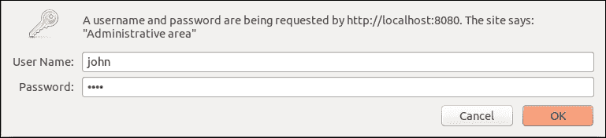

# 第四章 重写引擎与访问控制

万维网及其构建模块 HTTP 操作基于 URL。由于 URL 如此基础，服务器操作 URL 的能力至关重要。

Nginx 允许你使用内置的重写引擎来操作 URL。Nginx 的重写引擎功能广泛，配置非常简便，使其成为一个非常强大的工具。在本章中，我们将深入讲解整个重写引擎。

本章我们还将探讨另一个主题——访问控制。显然，这是每个软件系统中至关重要的功能，它确保系统的安全性和可靠性。我们将逐步介绍 Nginx 中可用的访问控制方法，并探讨其细节，你将学习如何将它们结合使用。

# 重写引擎基础

重写引擎允许你操作传入请求的请求 URI。

重写引擎通过重写规则进行配置。重写规则在请求 URI 需要进行转换后再进行处理时使用。重写规则指示 Nginx 使用正则表达式匹配请求 URI，并在找到匹配项时将请求 URI 替换为指定的模式。

重写规则可以在`server`、`location`和`if`配置段中指定。

让我们研究一些重写规则的应用示例。考虑一个简单的情况，当一个资源需要被另一个资源替代时：

```
location / {
    rewrite ^/css/default\.css$ /css/styles.css break;
    root /var/www/example.com;
}
```

使用前面的配置，对`/css/default.css`的每个请求，其 URI 将被重写为`/css/styles.css`，并改为获取该资源。`rewrite`指令指定一个模式，要求请求 URI 匹配该模式才能触发规则，并指定一个替换字符串，说明请求 URI 在转换后应该是什么样子。第三个参数`break`是一个标志，它指示 Nginx 在找到该规则的匹配项后停止处理重写规则。

前面的配置也可以扩展以处理多个资源。为此，你需要使用捕获（第一个参数中的圆括号）和位置参数（指向捕获的带数字的变量）。

```
location / {
    rewrite ^/styles/(.+)\.css$ /css/$1.css break;
    root /var/www/example.com;
}
```

使用前面的配置，所有对`/styles/`中任何 CSS 文件的请求，其 URI 将被重写为`/css/`中的相应资源。

在最后两个示例中，我们使用了`break`标志，以便在找到匹配项后立即停止重写规则的处理（假设可以向这些配置添加更多规则）。如果我们想将这两个示例结合起来，我们需要去掉`break`标志，并允许重写规则的级联应用：

```
location / {
    rewrite ^/styles/(.+)\.css$ /css/$1.css;
    rewrite ^/css/default\.css$ /css/styles.css;
    root /var/www/example.com;
}
```

现在，所有对`/styles/`中样式表的请求将被重定向到`/css/`中的相应资源，并且`/css/default.css`将被重写为`/css/styles.css`。对`/styles/default.css`的请求将经历两次重写，因为它依次匹配这两条规则。

请注意，所有的 URI 转换都是由 Nginx 内部执行的。这意味着对于外部客户端，原始的 URI 返回普通资源，因此，之前的配置外部看起来像是一系列内容相同的文档（即，`/css/default.css`将与`/css/styles.css`相同）。

对于普通网页来说，这并不是一个理想的效果，因为搜索引擎可能会因重复内容而惩罚你的网站。

为了避免这个问题，必须用永久重定向替换资源的副本，指向主资源，如以下配置所示：

```
location / {
    rewrite ^/styles/(.+)\.css$ /css/$1.css permanent;
    root /var/www/example.com;
}
```

这对于整个网站的部分内容非常有效：

```
location / {
    rewrite ^/download/(.+)$ /media/$1 permanent;
    root /var/www/example.com;
}
```

它也适用于整个虚拟主机：

```
server {
    listen 80;
    server_name example.com;
    rewrite ^/(.*)$ http://www.example.com/$1 permanent;
}
```

之前的配置对于任何请求的 URL 都执行一个永久重定向，从顶级域名`example.com`重定向到`www`子域名，使其成为网站的主要入口点。

重写规则的下一个强大应用是将语义化 URL 转换为带有查询的 URL（URL 中`?`字符后面的部分）。这种功能在**搜索引擎优化**（**SEO**）和网站可用性方面有重要应用，它源于对每个资源获取语义化 URL 并去重内容的需求。

### 注意

你可以在[`en.wikipedia.org/wiki/Semantic_URL`](https://en.wikipedia.org/wiki/Semantic_URL)找到更多关于语义化 URL 的信息。

考虑以下配置：

```
server {
    [...]
    rewrite ^/products/$ /products.php last;
    rewrite ^/products/(.+)$ /products.php?name=$1 last;
    rewrite ^/products/(.+)/(.+)/$ /products.php?name=$1&page=$2 last;
    [...]
}
```

之前的配置将由多个路径部分组成的 URL（以`/products`开头）转换为以`/products.php`和参数开头的 URL。通过这种方式，可以将实现细节对用户和搜索引擎隐藏，并生成语义化 URL。

请注意，重写指令的标志现在被设置为`last`。这使得 Nginx 为重写的 URL 寻找新的位置，并用新找到的位置处理请求。

现在你已经学习了一些重写规则的应用示例，你可以了解更多细节，以掌握重写规则。以下部分将更深入地探讨其语法和功能。

## 更多关于重写规则的内容

现在，让我们讨论一些关于重写规则的有趣细节。以下是`rewrite`指令的完整语法：

```
rewrite <pattern> <substitution> [<flag>];
```

该指令的第一个参数`<pattern>`是一个正则表达式，需要匹配请求的 URI 才能激活替换。`<substitution>`参数是一个脚本，一旦匹配成功，脚本计算的结果将替换请求 URI。可以使用特殊变量`$1`...`$9`通过引用捕获的指定位置来交叉引用模式及其替换。`<flag>`参数会影响`rewrite`指令的行为。下表列出了`rewrite`指令的所有可能标志及其功能：

| 标志 | 功能 |
| --- | --- |
| `break` | 中断重写规则的处理 |
| `last` | 中断重写规则的处理，并查找新请求 URI 的位置 |
| `redirect` | 返回一个临时重定向（HTTP 状态码 `302`）到新的请求 URI |
| `permanent` | 返回一个永久重定向（HTTP 状态码 `301`）到新的请求 URI |

重写引擎会多次处理请求，直到找到请求的位置，然后在请求位置及后续重定向的各个位置进行处理（例如通过 `error_page` 指令调用的那些位置）。

在 `server` 部分直接指定的重写规则会在第一次处理时处理，而在 `server` 部分内的 `location`、`if` 等其他部分的重写规则将在后续处理时处理。考虑以下示例：

```
server {
  <rewrite rules here are processed in the first pass>;

  location /a {
      <rewrite rules here are processed in subsequent passes>;
  }
  location /b {
     <rewrite rules here are processed in subsequent passes>;
  }
}
```

在第一次处理完成后，如果进行了重写，Nginx 会搜索与重写请求 URI 匹配的位置，或者搜索与原始请求 URI 匹配的位置（如果没有进行重写）。后续的处理将修改请求 URI，而不改变位置。

每次处理的重写规则按出现的顺序处理。一旦匹配成功，应用替换，并继续处理后续的重写规则——除非指定了中断处理的标志。

如果结果请求 URI 以 http:// 或 https:// 开头，则将其视为绝对路径，Nginx 会返回一个临时（`302` "Found"）或永久（`301` "Moved Permanently"）重定向到结果位置。

## 模式

现在，让我们回到 `<pattern>` 参数，看看如何指定匹配模式。下表简要概述了在重写规则中使用的正则表达式语法：

| Pattern | Examples | Description |
| --- | --- | --- |
| `<pattern A> <pattern B>` | `Ab, (aa)(bb)` | 后续 |
| `<pattern A> &#124; <pattern B>` | `a&#124;b, (aa)&#124;(bb)` | 或者 |
| `<pattern>?` | `(\.gz)?` | 可选项 |
| `<pattern>*` | `A*, (aa)*` | `<pattern>`重复从*0*到*无限*次 |
| `<pattern>+` | `a+, (aa)+` | `<pattern>`重复从*1*到*无限*次 |
| `<pattern>{n}` | `a{5}, (aa){6}` | `<pattern>`重复*n*次 |
| `<pattern>{n,}` | `a{3,}, (aa){7,}` | `<pattern>`重复从*n*到*无限*次 |
| `<pattern>{,m}` | `a{,6}, (aa){,3}` | `<pattern>`重复从*0*到*m*次 |
| `<pattern>{n,m}` | `a{5,6}, (aa){1,3}` | `<pattern>`重复从*n*到*m*次 |
| `( <pattern> )` | `(aa)` | 分组或参数捕获 |
| `.` | `.+` | 任意字符 |
| `^` | `^/index` | 行的开始 |
| `$` | `\.php$` | 行的结束 |
| `[<characters>]` | `[A-Za-z]` | 来自指定集合的任意字符 |
| `[^<characters>]` | `[⁰-9]` | 来自指定集合之外的任意字符 |

这些模式按优先级递增的顺序列出。也就是说，模式 `aa|bb` 将被解释为 `a(a|b)b`，而模式 `a{5}aa{6}` 将被解释为 `(a{5})(a)(a{6})`，以此类推。

要指定正则表达式语法本身的字符，可以使用反斜杠字符 `\`，例如 `\*` 会匹配星号 `*`，`\.` 会匹配点字符 `.`，`\\` 会匹配反斜杠字符本身，`\{` 会匹配左花括号 `{`。

更多关于重写规则中的正则表达式语法信息可以在 PCRE 网站 [www.pcre.org](http://www.pcre.org) 找到。

## 捕获和位置参数

捕获使用圆括号标记，并标记需要提取的匹配 URL 部分。位置参数指的是由相应捕获提取的匹配 URL 的子字符串，也就是说，如果模式如下：

```
^/users/(.+)/(.+)/$
```

此外，如果请求 URL 如下所示：

```
/users/id/23850/
```

位置参数 `$1` 和 `$2` 将分别评估为 `id` 和 `23850`。位置参数可以在替换字符串中按任意顺序使用，这就是如何将其与匹配模式连接起来的。

## 重写引擎的其他功能

重写引擎还可以用于执行其他任务：

+   赋值变量

+   使用 `if` 指令评估谓词

+   使用指定的 HTTP 状态码回复

这些操作和重写规则的组合可以在每次重写引擎处理时执行。请注意，`if` 部分是独立的位置，因此在位置重写处理时，位置仍然可能发生变化。

## 赋值变量

变量可以使用 `set` 指令进行赋值：

```
set $fruit "apple";
```

变量值可以是包含文本和其他变量的脚本：

```
set $path "static/$arg_filename";
```

一旦在重写阶段设置，变量可以在配置文件的其他指令中使用。

## 使用 if 部分评估谓词

你可能从标题中已经知道，`if` 部分是重写引擎的一部分。确实如此。`if` 部分可以用于有条件地应用选定的重写规则：

```
if ( $request_method = POST ) {
    rewrite ^/media/$ /upload last;
}
```

在前述配置中，任何尝试向 URL `/media/` 发送 POST 请求的操作都会将其重写为 URL `/upload`，而对相同 URL 发送其他方法的请求则不会发生重写。多个条件也可以组合在一起。让我们来看一下以下代码：

```
set $c1 "";
set $c2 "";

if ( $request_method = POST ) {
    set $c1 "yes";
}

if ( $scheme = "https" ) {
    set $c2 "yes";
}

set $and "${c1}_${c2}";

if ( $and = "yes_yes" ) {
    rewrite [...];
}
```

前述配置仅在满足 `if` 条件时才会应用重写，即请求方法为 `POST` 且请求 URL 协议为 `https` 时。

现在你已经知道如何使用 `if` 部分，我们来谈谈它的副作用。记住，`if` 指令中的条件在处理 `rewrite` 指令时会被评估。这意味着当 `if` 部分包含不属于重写引擎的指令时，`if` 部分的行为变得不直观。这个问题在 第一章，*Nginx 入门* 中进行了讨论。请考虑以下配置：

```
if ( $request_method = POST ) {
    set $c1 "yes";
    proxy_pass http://localhost:8080;
}

if ( $scheme = "https" ) {
    set $c2 "yes";
    gzip on
}
```

每个单独的`if`部分包含一组原子配置设置。假设 Nginx 收到一个使用`https` URL 方案的`POST`请求，并且两个条件都评估为真。所有的`set`指令都会被重写引擎正确处理，并且会被赋予正确的值。然而，Nginx 无法合并其他配置设置，也不能同时启用多个配置。当重写处理完成后，Nginx 会简单地将配置切换到最后一个条件评估为真的`if`部分。因此，在前面的配置中，压缩会被启用，但请求不会按照`proxy_pass`指令进行代理。这是一个你可能没有预料到的情况。

为了避免这种不直观的行为，请遵循以下最佳实践：

+   最小化使用`if`指令

+   使用`set`指令结合`if`评估

+   只在最后一个`if`部分采取行动。

## 使用指定的 HTTP 状态码进行回复

如果在某个位置需要明确回复指定的 HTTP 状态码，可以使用`return`指令来启用这种行为，并指定状态码、回复体或重定向 URI。我们来看以下代码：

```
location / {
    return 301 "https://www.example.com$uri";
}
```

前面的配置将执行一个永久重定向（301），将域名`www.example.com`重定向到安全部分，URI 路径与原请求中的 URI 路径相同。因此，`return`指令的第二个参数会被当作重定向 URI。其他将第二个参数视为重定向 URI 的状态码包括`302`、`303`和`307`。

### 注意

使用`return`指令进行重定向比使用`rewrite`指令更快，因为它不需要运行任何正则表达式。在配置中尽可能使用`return`指令，而不是`rewrite`指令。

状态码 302 是相当常见的，因此`return`指令对于临时重定向有简化的语法：

```
location / {
    return "https://www.example.com$uri";
}
```

如你所见，如果`return`指令只有一个参数，它会被当作重定向 URI，且会让 Nginx 执行一个临时重定向。这个参数必须以`http`://或`https`://开头，才能触发这种行为。

`return`指令可以用来返回带有指定主体的回复。要触发这种行为，状态码必须是`301`、`302`、`303`或`307`以外的其他值。`return`指令的第二个参数指定响应体的内容：

```
location /disabled {
    default_type text/plain;
    return 200 "OK";
}
```

前面的配置会返回 HTTP 状态 200（OK）并带有指定的响应体。为了确保响应体内容被正确处理，我们通过`default_type`指令将响应内容类型设置为`text/plain`。

# 访问控制

访问控制限制对日常运营至关重要。Nginx 包含一组模块，让您根据各种条件允许或拒绝访问。如果访问资源需要认证，则 Nginx 通过返回 `403`（禁止 HTTP）状态或者需要认证的情况下返回 `401`（未经授权）来拒绝访问。可以使用 `error_page` 指令拦截和自定义这个 `403`（禁止）状态码。

## 通过 IP 地址限制访问

Nginx 允许您通过 IP 地址允许或拒绝对虚拟主机或位置的访问。为此，您可以使用 `allow` 和 `deny` 指令。它们的格式如下：

```
allow <IP address> | <IP address>/<prefix size> | all;
deny <IP address> | <IP address>/<prefix size> | all;
```

指定一个 IP 地址允许或拒绝在位置内访问单个 IP 地址，而指定一个带有前缀大小的 IP 地址（例如 192.168.0.0/24 或 200.1:980::/32）允许或拒绝访问一个范围的 IP 地址。

`allow` 和 `deny` 指令按照它们在一个位置中出现的顺序进行处理。请求客户端的远程 IP 地址将与每个指令的参数进行匹配。一旦找到一个匹配地址的 `allow` 指令，访问将立即被允许。一旦找到一个匹配地址的 `deny` 指令，访问将立即被拒绝。一旦 Nginx 到达具有 `all` 参数的 `allow` 或 `deny` 指令，访问将立即被允许或拒绝，不论客户端的 IP 地址如何。

这显然允许一些变化。以下是一些简单的例子：

```
server {
    deny 192.168.1.0/24;
    allow all;
    [...]
}
```

前面的配置使得 Nginx 拒绝对 IP 地址 192.168.1.0 到 192.168.1.255 的访问，同时允许其他所有人的访问。这是因为 `deny` 指令首先被处理，如果匹配，则立即应用。整个服务器将对指定的 IP 地址禁止访问。

```
server {
    […]
    location /admin {
        allow 10.132.3.0/24;
        deny all;
    }
}
```

前面的配置使得 Nginx 仅允许访问`location /admin`的 IP 地址位于 10.132.3.0 到 10.132.3.255 的范围内。假设这些 IP 地址对应于某些特权用户组，这种配置完全合理，因为只有他们可以访问这个 Web 应用的管理区域。

现在，我们可以改进这个配置，使得配置更加复杂。假设更多网络需要访问这个 Web 应用的管理界面，而 IP 地址 10.132.3.55 因技术或行政原因需要被拒绝访问。那么，我们可以扩展前面的配置如下：

```
server {
  […]
  location /admin {
      allow 10.129.1.0/24;
      allow 10.144.25.0/24;
      deny 10.132.3.55;
      allow 10.132.3.0/24;
      deny all;
  }
}
```

正如您所见，`allow` 和 `deny` 指令使用起来非常直观。只要匹配的 IP 地址列表不太长，就可以使用它们。Nginx 按顺序处理这些指令，因此检查客户端 IP 地址与列表匹配的时间平均与列表的长度成正比，不论地址匹配哪个指令。

如果您需要将客户端的 IP 地址与更大的地址列表进行匹配，考虑使用 `geo` 指令。

## 使用 geo 指令限制 IP 地址访问

使用`geo`指令，你可以将 IP 地址转换为一个字面量或数字值，随后在处理请求时触发一些操作。

`geo`指令的格式如下：

```
geo [$<source variable>] $<target variable> { <address mapping> }
```

如果省略源变量，则使用`$remote_addr`变量。地址映射是一个由空格分隔的键值对列表。键通常是一个 IP 地址或带前缀大小的 IP 地址，表示子网。值可以是任意的字符串或数字。让我们看看以下代码：

```
geo $admin_access {
    default                 deny;
    10.129.1.0/24      allow;
    10.144.25.0/24    allow;
    10.132.3.0/24      allow;
}
```

源变量的值作为关键字在地址映射中查找条目。如果找到对应的条目，则将目标变量赋值为查找到的值；否则，使用默认值。

在前述配置下，如果远程客户端的 IP 地址来自子网 10.129.1.0/24、10.144.25.0/24 或 10.132.3.0/24，则变量`$admin_access`将被赋值为`allow`，否则赋值为`deny`。

### 注意

`geo`指令构建了一个高效、简洁的数据结构，通过 IP 地址在内存中查找值。它能够处理成千上万的 IP 地址和子网。为了加速启动时间，可以按升序指定 IP 地址，例如，1.x.x.x 到 10.x.x.x，1.10.x.x 到 1.30.x.x。

地址映射部分可以包含影响`geo`地址映射行为的指令。下表列出了这些指令及其功能：

| 指令 | 功能 |
| --- | --- |
| `default` | 指定当在 IP 地址映射中未找到匹配项时返回的值。 |
| `proxy` | 指定代理服务器的地址。如果请求来自某个`proxy`指令指定的地址，`geo`将使用"X-Forwarded-For"头中的最后一个地址，而不是来源变量中的地址。 |
| `proxy_recursive` | 如果请求来自某个`proxy`指令指定的地址，`geo`将从右到左处理"X-Forwarded-For"头中的地址，寻找一个位于`proxy`指令指定的地址列表之外的地址。换句话说，这个指令让`geo`更努力地寻找真实 IP 地址。 |
| `ranges` | 在映射列表中启用 IP 地址范围。 |
| `delete` | 从映射中移除指定的子网。 |

让我们来看一些示例。

假设 Nginx 接收来自应用级负载均衡器或位于 IP 10.200.0.1 的入站代理的 HTTP 流量。由于所有请求都将来自此 IP，我们需要检查"X-Forwarded-For"头，以便获得客户端的真实 IP 地址。然后，我们需要将前述配置修改如下：

```
geo $example {
    default                 deny;
    proxy 10.200.0.1;
    10.129.1.0/24      allow;
    10.144.25.0/24    allow;
    10.132.3.0/24      allow;
}
```

如果服务器位于多个代理链之后，可以通过指定`proxy_recursive`指令并列出链中的所有代理来获得真实的 IP 地址：

```
geo $example {
    default                 deny;
    proxy 10.200.0.1;
    proxy 10.200.1.1;
    proxy 10.200.2.1;
    proxy_recursive;
    10.129.1.0/24      allow;
    10.144.25.0/24    allow;
    10.132.3.0/24      allow;
}
```

在上述示例中，代理的 IP 地址是 10.200.0.1、10.200.1.1 和 10.200.2.1。地址的顺序并不重要，因为 Nginx 会从右到左遍历"X-Forwarded-For"头部中指定的地址，并检查它们是否存在于`geo`块中。第一个不在代理列表中的地址将成为客户端的真实 IP 地址。

如果需要指定 IP 地址作为范围而非子网，或者在子网之外，你可以通过指定`ranges`指令来启用此功能：

```
geo $example {
    default                                 deny;
    ranges;
    10.129.1.0-10.129.1.255      allow;
    10.144.25.0-10.144.25.255  allow;
    10.132.3.0/24                       allow;
}
```

最后，在`delete`指令的帮助下，我们可以定义允许我们实现类似于`allow`和`deny`指令的大规模访问控制过程的 IP 地址映射：

```
geo $admin_access {
    default                 deny;
    10.129.1.0/24      allow;
    10.144.25.0/24    allow;
    10.132.3.0/24      allow;
    delete 10.132.3.55;
}
```

为了使这个配置生效，我们需要使用`if`部分来禁止那些客户端 IP 地址不在`geo`指令`allow`范围内的请求：

```
server {
  […]
  geo $admin_access {
      default                 deny;
      10.129.1.0/24      allow;
      10.144.25.0/24    allow;
      10.132.3.0/24      allow;
      delete 10.132.3.55;
  }

  location /admin {
      if($admin_access != allow) {
          return 403;
      }
      [...]
  }
}
```

如你所见，`geo`指令是一个强大且高度可扩展的工具，而访问限制是它可以应用的众多用途之一。

## 使用基本认证进行访问限制

你可以配置 Nginx 只允许那些能够提供正确的用户名和密码组合的用户访问。用户名/密码验证可以通过`auth_basic`指令启用：

```
auth_basic <realm name> | off;
```

Realm 名称指定了一个领域的名称（即认证区域）。这个参数通常设置为一个帮助用户识别他们正在尝试访问的区域的字符串（例如 *行政区*, *Web 邮件* 等）。这个字符串会传递到浏览器，并在用户名/密码输入对话框中显示。除了 Realm 名称外，你还需要使用`auth_basic_user_file`指令指定一个包含用户数据库的文件：

```
auth_basic_user_file <path to a file>;
```

该文件必须包含每行一个用户名和密码的认证信息：

```
username1:encrypted_password1
username2:encrypted_password2
username3:encrypted_password3
username4:encrypted_password4
username5:encrypted_password5
```

这个文件应该放置在你托管的任何网站的文档根目录之外。访问权限必须设置为使得 Nginx 只能读取该文件，而不能写入或执行它。

密码必须使用以下算法之一进行加密：

| 算法 | 备注 |
| --- | --- |
| CRYPT | Unix DES 加密密码算法 |
| SSHA | 加盐安全哈希算法 1 |
| *已废弃：请勿使用* |
| MD5 | 消息摘要算法 5 |
| SHA | 无盐安全哈希算法 1 |

密码文件可以使用来自 Apache web 服务器的`htpasswd`工具进行管理。以下是一些示例：

| 指令 | 命令 |
| --- | --- |
| 创建一个密码文件并将用户`john`添加到密码文件中 | `$ htpasswd -b -d -c /etc/nginx/auth.d/auth.pwd john test` |
| 将用户`thomas`添加到密码文件中 | `$ htpasswd -b -d /etc/nginx/auth.d/auth.pwd thomas test` |
| 替换 John 的密码 | `$ htpasswd -b -d /etc/nginx/auth.d/auth.pwd john test` |
| 从密码文件中删除用户`john` | `$ htpasswd -D /etc/nginx/auth.d/auth.pwd john` |

选项 `-d` 强制使用 CRYPT 算法加密密码，这比 SSHA（盐化 SHA）算法相对不安全。要使用 SSHA 加密密码并提高密码的安全性，你可以使用 `slappasswd` 工具，它来自 `slapd` 包：

```
$ sudo apt-get install slapd
$ slappasswd -s test
{SSHA}ZVG7uXWXQVpITwohT0F8yMDGWs0AbYd3

```

将 `slappasswd` 的输出复制到密码文件中。密码文件现在看起来像这样：

```
john:{SSHA}ZVG7uXWXQVpITwohT0F8yMDGWs0AbYd3
```

这可以通过使用 `echo` 命令进一步自动化：

```
echo "john:"$(slappasswd -s test) > /etc/nginx/auth.d/auth.pwd
```

一旦密码文件准备好，我们可以配置密码认证：

```
location /admin {
    auth_basic "Administrative area";
    auth_basic_user_file /etc/nginx/auth.d/auth.pwd;
    [...]
}
```

密码认证现在已启用；你可以导航到 `location /admin` 并看到密码提示：



只有在输入有效的用户名和密码组合时，才能访问受保护的资源。

### 注意

Nginx 每次请求受保护资源时都会读取并解析密码文件。只有当密码文件中的条目数不超过几百时，这种方式才具有可扩展性。

## 使用子请求进行用户认证

用户认证可以通过使用认证请求模块委托给另一个 Web 服务器。此模块必须首先在源代码配置阶段启用，使用命令行选项 `–with-http_auth_request_module`：

```
$ ./configure –with-http_auth_request_module
$ make
$ make install

```

现在 `auth_request` 模块已准备好使用。委托可以按以下方式配置：

```
location /example {
    auth_request /auth;
    [...]
}

location = /auth {
    internal;
    proxy_pass http://backend;
    proxy_set_header Content-Length "";
    proxy_pass_request_body off;
}
```

在前面的配置中，Nginx 将执行一个子请求到 `location /auth`。这个位置会将子请求传递给外部 Web 应用程序（使用 `proxy_pass` 指令）。由于原始请求可能包含认证应用程序不期望的请求体，因此我们通过指定 `proxy_pass_request_body off` 并使用 `proxy_set_header` 来清除 "Content-Length" 头部，从而丢弃它。

为了回应由认证请求模块发出的子请求，你需要创建一个应用程序，该应用程序分析原始请求中的数据，并通过 HTTP 状态 401（未授权）或 403（禁止）来阻止访问，通过成功的 HTTP 状态 200 到 299 来允许访问。以下是一个用 `node.js` 编写的示例应用程序：

```
var http         = require('http');
var express      = require('express')
var cookieParser = require('cookie-parser')

var app = express()
app.use(cookieParser())

app.get('/auth', function(req, res) {
  if(req.cookies.uid) {
    res.sendStatus(200);
  }
  else {
    res.sendStatus(403);
  }
})

app.listen(3000)
```

这个应用程序只要存在名为 `uid` 的 cookie 就允许访问，否则禁止访问。

要运行此应用程序，创建一个目录，在该目录中创建一个名为 `auth.js` 的文件，并将前面的源代码放入此文件中。然后，使用 `npm` 安装所需的模块 `express` 和 `cookie-parser`：

```
$ npm install express cookie-parser

```

然后，你可以运行应用程序：

```
$ node auth.js

```

应用程序将开始监听 3000 端口。以下 Nginx 配置可以用来尝试该应用程序：

```
location /example {
    auth_request /auth;
}

location = /auth {
    internal;
    proxy_pass http://localhost:3000;
    proxy_set_header Content-Length "";
    proxy_pass_request_body off;
}
```

子请求将被委派到运行 Nginx 的主机的 3000 端口，应用程序会对此请求做出回应。

如果应用程序需要检查原始请求 URI，可以通过 `proxy_set_header` 指令传递：

```
proxy_set_header X-Auth-URI $request_uri;
```

原始 IP 地址和其他原始请求参数可以以相同的方式传递给认证应用程序。

这就是如何在 Nginx 中实现更复杂的认证逻辑。如果你让应用程序始终以 HTTP 状态 200 响应，它可以用于认证以外的其他目的，例如日志记录或数据注入。

## 组合多种访问限制方法

可以将多种访问限制方法组合在一起。为此，必须同时配置并启用它们。默认情况下，必须满足所有配置的访问限制方法才能允许请求。如果任何访问限制方法未满足，Nginx 会以 403 Forbidden HTTP 状态拒绝请求。

可以通过使用`satisfy`指令来更改此行为：

```
satisfy all | any;
```

在一个位置中指定`satisfy any`，会使 Nginx 在满足任何启用的访问限制方法时接受请求，而指定`satisfy all`（默认设置）则会使 Nginx 仅在所有启用的访问限制方法都满足时才接受请求。为了演示其工作原理，让我们扩展前面的示例：

```
server {
    […]
    location /admin {
        auth_basic "Administrative area";
        auth_basic_user_file /etc/nginx/auth.d/admin.users;
        allow 10.132.3.0/24;
        deny all;
        satisfy any;
    }
}
```

此配置启用并配置了密码认证和 IP 地址限制。将`satisfy`设置为`any`时，用户只需要输入正确的用户名/密码组合，或来源于 IP 地址范围 10.132.3.0 至 10.132.3.255。这样，来自该网络的用户被视为更为可信，因为他们不需要输入用户名和密码即可访问管理区域。

# 总结

在本章中，你学到了如何使用重写引擎和访问控制功能。这些是每个网站管理员和站点可靠性工程师的必备工具。精通这些功能的配置和使用，将帮助你更高效地解决日常问题。

在下一章，我们将讨论如何管理进出流量。你将学习如何设置进站流量的各种限制，如何配置上游，以及如何为出站流量应用各种选项。
