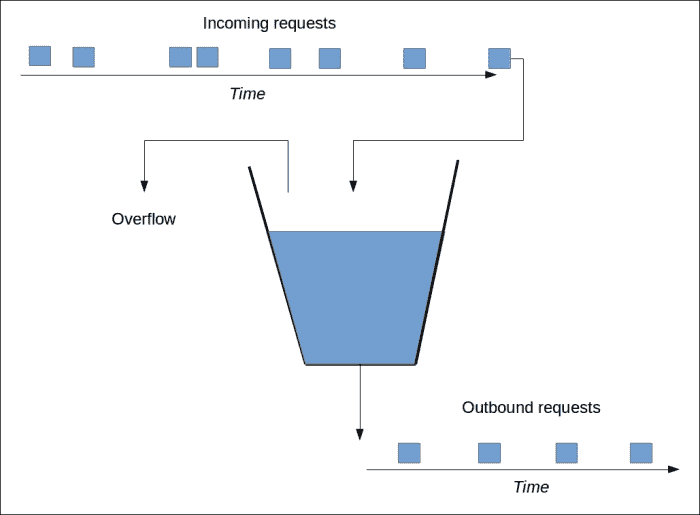
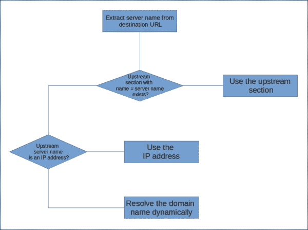
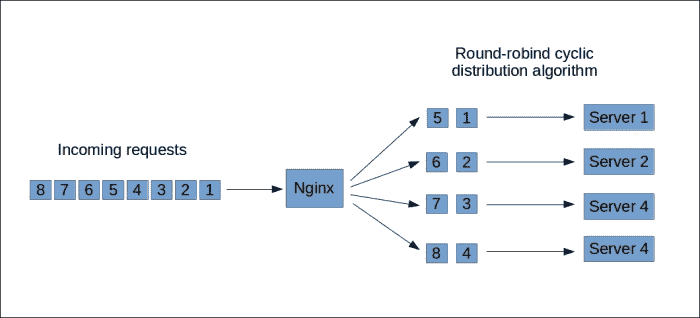
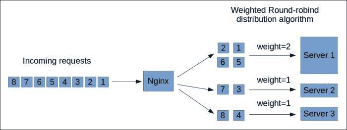
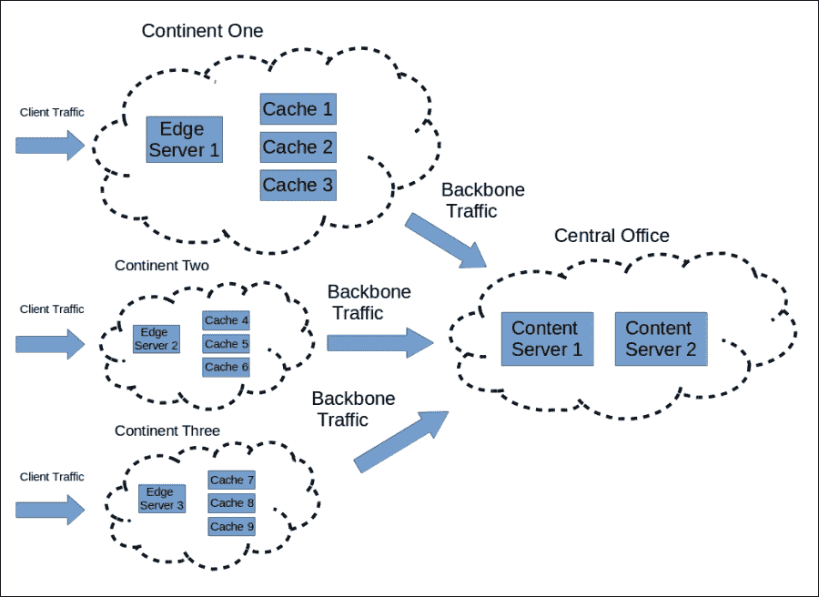

# 第五章：管理入站和出站流量

互联网是一个开放的媒介，使用他人资源既容易又便宜。低成本的使用使得系统容易受到有意或无意的滥用和资源使用激增的影响。现代互联网充满了各种危险，如机器人、恶意爬虫、拒绝服务攻击（DoS）和分布式拒绝服务攻击（DDoS）。

在这里，Nginx 发挥了作用，提供了多种入站和出站流量管理功能，帮助你保持对网页服务质量的控制。

在本章中，您将学习：

+   如何对入站流量应用各种限制

+   如何配置上游服务器

+   如何使用各种选项进行出站连接管理

# 管理入站流量

Nginx 提供了多种管理入站流量的选项。包括以下内容：

+   限制请求速率

+   限制同时连接的数量

+   限制连接的传输速率

这些功能对于管理网页服务的质量，以及防止和缓解滥用行为非常有用。

## 限制请求速率

Nginx 有一个内建的模块用于限制请求速率。在启用它之前，您需要在 `http` 部分使用 `limit_req_zone` 指令配置一个共享内存段（也称为 *zone*）。该指令的格式如下：

```
limit_req_zone <key> zone=<name>:<size> rate=<rate>;
```

`<key>` 参数指定一个单一变量或脚本（自 1.7.6 版本以来）来绑定速率限制状态。简单来说，通过指定 `<key>` 参数，你是在为 `<key>` 参数在运行时计算出的每个值创建多个小管道，每个管道的请求速率都受到 `<rate>` 限制。每个使用此区域的位置的请求将被提交到对应的管道中，如果达到速率限制，请求将被延迟，以确保管道中的速率限制得到满足。

`<name>` 参数定义了区域的名称，`<size>` 参数定义了区域的大小。考虑以下示例：

```
http {
    limit_req_zone $remote_addr zone=rate_limit1:12m rate=30r/m;
    [...]
}
```

在前面的代码中，我们定义了一个名为 `primary` 的区域，大小为 12MB，且请求速率限制为每分钟 30 次请求（每秒 0.5 次请求）。我们使用 `$remote_addr` 变量作为键。该变量评估为请求来源 IP 地址的符号值，每个 IPv4 地址最多占用 15 字节，IPv6 地址则可能占用更多字节。

为了节省占用的键空间，我们可以使用变量 `$binary_remote_addr`，该变量将评估为远程 IP 地址的二进制值：

```
http {
    limit_req_zone $binary_remote_addr zone=rate_limit1:12m rate=30r/m;
    [...]
}
```

要在某个位置启用请求速率限制，请使用 `limit_req` 指令：

```
location / {
    limit_req zone=rate_limit1;
}
```

一旦请求被路由到 `location /`，将从指定的共享内存段中检索到限速状态，Nginx 将应用 *漏桶算法* 来管理请求速率，如下图所示：



漏桶算法

根据此算法，入站请求可以以任意速率到达，但出站请求的速率永远不会高于指定的速率。入站请求“填充桶”，如果“桶”溢出，过量的请求将收到 HTTP 状态`503`（服务暂时不可用）响应。

## 限制同时连接数

尽管请求速率限制非常实用，但对于长期运行的请求（如大文件上传和下载），它无法有效防止滥用。

在这种情况下，限制同时连接数非常有用。特别是，限制来自单个 IP 地址的同时连接数是有优势的。

启用同时连接限制需要首先配置一个共享内存区域（一个 zone）来存储状态信息，就像限制请求速率时一样。这个配置是在`http`部分通过`limit_conn_zone`指令完成的。该指令类似于`limit_req_zone`指令，其格式如下：

```
limit_conn_zone <key> zone=<name>:<size>;
```

在上述命令中，`<key>`参数指定了一个单一变量或脚本（自 1.7.6 版本起），该变量或脚本绑定连接限制状态。`<name>`参数定义了区域的名称，`<size>`参数定义了区域的大小。参考以下示例：

```
http {
    limit_conn_zone $remote_addr zone=conn_limit1:12m;
    [...]
}
```

为了节省键所占的空间，我们可以再次使用变量`$binary_remote_addr`。它将计算为远程 IP 地址的二进制值：

```
http {
    limit_conn_zone $binary_remote_addr zone=conn_limit1:12m;
    [...]
}
```

要在某个位置启用同时连接限制，使用`limit_conn`指令：

```
location /download {
    limit_conn conn_limit1 5;
}
```

`limit_conn`指令的第一个参数指定用于存储连接限制状态信息的区域，第二个参数是最大同时连接数。

每个连接到`location /download`的活跃请求都会对`<key>`参数进行评估。如果共享相同键值的同时连接数超过`5`，服务器将返回 HTTP 状态`503`（服务暂时不可用）。

### 注意

请注意，`limit_conn_zone`指令分配的共享内存区域大小是固定的。当分配的共享内存区域被填满时，Nginx 会返回 HTTP 状态`503`（服务暂时不可用）。因此，您必须调整共享内存区域的大小，以适应服务器可能的入站流量。

## 限制连接的传输速率

连接的传输速率也可以被限制。Nginx 为此提供了多个选项。`limit_rate`指令将某个位置的连接传输速率限制为第一个参数指定的值：

```
location /download {
    limit_rate 100k;
}
```

上述配置会将`location /download`的任何请求的下载速率限制为 100 KBps。该速率限制是针对每个请求设置的。因此，如果客户端打开多个连接，整体下载速率会更高。

将速率限制设置为`0`会关闭传输速率限制。当需要排除某个位置不受速率限制时，这非常有用：

```
server {
    [...]
    limit_rate 1m;

    location /fast {
        limit_rate 0;
    }
}
```

上述配置将每个请求在指定虚拟主机上的传输速率限制为 1 MBps，除了`location /fast`，该位置的速率没有限制。

通过设置变量`$limit_rate`的值，也可以限制传输速率。当需要在特定条件下启用速率限制时，可以优雅地使用此选项：

```
if ($slow) {
    set $limit_rate 100k;
}
```

还有一个选项可以推迟速率限制，直到传输一定量的数据后才开始生效。可以通过使用`limit_rate_after`指令来实现：

```
location /media {
    limit_rate 100k;
    limit_rate_after 1m;
}
```

上面的配置将在发送完第一个兆字节的请求数据后才会执行速率限制。这种行为非常有用，例如在视频流媒体传输时，因为视频播放器通常会提前缓存流的初始部分。更快地返回初始部分有助于提高视频启动速度，而不会堵塞服务器的磁盘 I/O 带宽。

## 应用多个限制

前面部分描述的限制可以结合使用，以制定更复杂的流量管理策略。例如，可以为限制同时连接数创建两个区域，使用不同的变量，并一次应用多个限制：

```
http {
    limit_conn_zone $binary_remote_addr zone=conn_limit1:12m;
    limit_conn_zone $server_name zone=conn_limit2:24m;
    […]
    server {
        […]
        location /download {
            limit_conn conn_limit1 5;
            limit_conn conn_limit2 200;
        }
    }
}
```

上述配置将每个 IP 地址的同时连接数限制为五个；同时，每个虚拟主机的同时连接总数将不会超过 200 个。

# 管理出站流量

Nginx 还提供了多种出站流量管理选项：

+   在多个服务器之间分配出站连接

+   配置备份服务器

+   启用与后台服务器的持久连接

+   在从后台服务器读取时限制传输速率

要启用这些功能，大多数情况下你首先需要明确声明你的上游服务器。

## 声明上游服务器

Nginx 允许显式声明上游服务器。然后，你可以在`http`配置的任何部分多次引用它们作为一个整体。如果服务器的位置发生变化，则无需遍历整个配置并进行调整。如果新的服务器加入一个组，或者现有的服务器离开一个组，只需要调整声明而不是使用方式。

上游服务器在`upstream`部分声明：

```
http {
    upstream backend  {
        server server1.example.com;
        server server2.example.com;
        server server3.example.com;
    }
    [...]
}
```

`upstream`部分只能在`http`部分内指定。前面的配置声明了一个名为`backend`的逻辑上游，并包含三个物理服务器。每个服务器通过`server`指令指定。`server`指令的语法如下：

```
server <address> [<parameters>];
```

`<address>`参数指定物理服务器的 IP 地址或域名。如果指定了域名，则在启动时解析该域名，并将解析后的 IP 地址作为物理服务器的地址。如果域名解析为多个 IP 地址，则为每个解析出的 IP 地址创建一个单独的条目。这相当于为这些地址分别指定一个`server`指令。

地址可以包含可选的端口说明，例如`server1.example.com:8080`。如果省略此说明，则使用端口 80。以下是一个上游声明的示例：

```
upstream numeric-and-symbolic  {
    server server.example.com:8080;
    server 127.0.0.1;
}
```

上述配置声明了一个名为`numeric-and-symbolic`的上游。服务器列表中的第一个服务器具有符号名称，并且其端口已更改为`8080`。第二个服务器的地址为`127.0.0.1`，对应本地主机，端口为`80`。

请看另一个示例：

```
upstream numeric-only  {
    server 192.168.1.1;
    server 192.168.1.2;
    server 192.168.1.3;
}
```

上述配置声明了一个名为`numeric-only`的上游，其中包含三个服务器，这些服务器具有三个不同的数字 IP 地址，且都监听默认端口。

请考虑以下示例：

```
upstream same-host  {
    server 127.0.0.1:8080;
    server 127.0.0.1:8081;
}
```

上述配置声明了一个名为`same-host`的上游，其中包含两个地址相同（`127.0.0.1`）的服务器，但监听不同的端口。

请看以下示例：

```
upstream single-server  {
    server 192.168.0.1;
}
```

上述配置声明了一个名为`single-server`的上游，其中只有一个服务器。

以下表格列出了`server`指令的可选参数及其描述：

| 语法 | 描述 |
| --- | --- |
| `weight`=<number> | 该参数指定服务器的数值权重，用于在服务器之间分配连接。默认值为`1`。 |
| `max_fails`=<number> | 该参数指定最大连接尝试次数，超过此次数后服务器将被视为不可用。默认值为`1`。 |
| `fail_timeout`=<number> | 该参数指定失败的服务器将被标记为不可用的时间，默认值为`10`秒。 |
| `backup` | 该标签将服务器标记为备份服务器。 |
| `down` | 该标签将服务器标记为不可用。 |
| `max_conns`=<number> | 该参数限制了到服务器的最大并发连接数。 |
| `resolve` | 该指令告诉 Nginx 自动更新使用符号名称指定的服务器的 P 地址，并在不重启 Nginx 的情况下应用这些地址。 |

## 使用上游服务器

一旦声明了上游服务器，它可以在`proxy_pass`指令中使用：

```
http {
    upstream my-cluster  {
        server server1.example.com;
        server server2.example.com;
        server server3.example.com;
    }
    […]
    server {
        […]
        location @proxy {
            proxy_pass http://my-cluster;
        }
    }
}
```

上游可以在配置中被多次引用。根据上述配置，一旦请求位置`@proxy`，Nginx 将把请求转发到上游中服务器列表的其中一台服务器。

解析上游服务器最终地址的算法如下图所示：



解析上游服务器地址的算法

由于目标 URL 可能包含变量，因此它会在运行时进行评估，并解析为 HTTP URL。服务器名称从评估后的目标 URL 中提取。Nginx 查找与服务器名称匹配的上游部分，如果找到，则根据请求分发策略将请求转发到上游服务器列表中的其中一台服务器。

如果存在与服务器名称匹配的上游部分，Nginx 会检查该服务器名称是否为 IP 地址。如果是，Nginx 会将该 IP 地址作为上游服务器的最终地址。如果服务器名称是符号性的，Nginx 会在 DNS 中解析服务器名称为 IP 地址。如果解析成功，解析后的 IP 地址将作为上游服务器的最终地址。

DNS 服务器的地址可以通过 `resolver` 指令进行配置：

```
resolver 127.0.0.1;
```

上述指令将 DNS 服务器的 IP 地址列表作为参数。如果无法通过配置的解析器成功解析服务器名称，Nginx 将返回 HTTP 状态 `502`（错误网关）。

当上游包含多个服务器时，Nginx 会在这些服务器之间分发请求，尝试将负载均衡分配到可用的服务器上。这也被称为集群，因为多个服务器作为一个整体工作——它们被称为一个集群。

## 选择请求分发策略

默认情况下，Nginx 在将请求分发到可用的上游服务器时使用轮询算法，如下图所示：



轮询循环分发算法

根据此算法，传入的请求会按相等比例和循环顺序分配给上游服务器列表中的服务器。这确保了传入请求在可用服务器之间的均匀分配，但并不能确保负载在服务器之间的均等分配。

如果上游服务器列表中的服务器具有不同的处理能力，分发算法可以进行调整以考虑这些差异。这就是参数 `weight` 的用途。该参数指定一个服务器相对于其他服务器的权重。例如，假设某一台服务器的能力是其他两台的两倍，我们可以按如下方式配置 Nginx：

```
upstream my-cluster  {
    server server1.example.com weight=2;
    server server2.example.com;
    server server3.example.com;
}
```

第一台服务器的权重设置为其他服务器的两倍，因此请求分发策略相应变化。如下图所示：



加权轮询

在上述图中，我们可以看到，四个传入请求中有两个将被分配到服务器 1，一个分配到服务器 2，另一个分配到服务器 3。

轮询策略并不能保证来自同一客户端的请求始终转发到相同的服务器。对于那些期望同一客户端始终由同一服务器处理的 Web 应用程序来说，或者至少需要一定程度的用户与服务器之间的亲和性的应用程序，这可能会是一个挑战。

使用 Nginx，你可以通过使用 IP 哈希请求分发策略来解决这个问题。在 IP 哈希分发策略中，来自特定 IP 地址的每个请求将被转发到相同的后端服务器。这是通过哈希客户端的 IP 地址，并使用哈希值的数值来选择上游服务器列表中的服务器来实现的。要启用 IP 哈希请求分发策略，可以在`upstream`部分使用`ip_hash`指令：

```
upstream my-cluster  {
    ip_hash;
    server server1.example.com;
    server server2.example.com;
    server server3.example.com;
}
```

前面的配置声明了一个包含三个底层服务器的上游，并为每个服务器启用了 IP 哈希请求分发策略。来自远程客户端的请求将被转发到该列表中的某一服务器，并且该服务器对于该客户端的所有请求都是相同的。

如果你从列表中添加或删除服务器，IP 地址与服务器之间的对应关系会发生变化，且你的 Web 应用程序必须应对这种情况。为了让这个问题更容易处理，你可以使用`down`参数将服务器标记为不可用。请求到该服务器将被转发到下一个可用服务器：

```
upstream my-cluster  {
    ip_hash;
    server server1.example.com;
    server server2.example.com down;
    server server3.example.com;
}
```

前面的配置声明了`server2.example.com`服务器不可用，一旦请求指向该服务器，系统将选择下一个可用的服务器（`server1.example.com`或`server3.example.com`）。

如果 IP 地址对哈希函数来说不是一个便捷的输入，你可以使用`hash`指令替代`ip_hash`来选择一个更合适的输入。该指令的唯一参数是一个脚本，脚本在运行时被评估并生成一个值作为哈希函数的输入。这个脚本可以包含，例如，一个 cookie，一个 HTTP 头部，一个 IP 地址和用户代理的组合，或者一个 IP 地址和代理 IP 地址的组合，等等。请看下面的示例：

```
upstream my-cluster  {
    hash "$cookie_uid";
    server server1.example.com;
    server server2.example.com;
    server server3.example.com;
}
```

前面的配置使用名为`uid`的 cookie 作为哈希函数的输入。如果该 cookie 存储了用户的唯一 ID，则每个用户的请求将被转发到上游服务器列表中的固定服务器。如果用户还没有 cookie，则变量`$cookie_uid`的值为空字符串，从而生成一个固定的哈希值。因此，所有没有`uid` cookie 的用户请求都会被转发到前面列表中的固定服务器。

在下一个示例中，我们将使用远程 IP 地址和用户代理字段的组合作为哈希函数的输入：

```
upstream my-cluster  {
    hash "$remore_addr$http_user_agent";
    server server1.example.com;
    server server2.example.com;
    server server3.example.com;
}
```

前面的配置依赖于用户代理字段的多样性，防止来自代理 IP 地址的用户集中在单个服务器上。

## 配置备用服务器

服务器列表中的一些服务器可以被标记为 *备用*。通过这样做，你告诉 Nginx 这些服务器通常不应被使用，仅在所有非备用服务器未响应时使用。

为了说明备用服务器的使用，假设你运行一个 **内容分发网络**（**CDN**），其中若干地理上分布的边缘服务器处理用户流量，而一组集中式内容服务器生成并将内容分发给边缘服务器。如下图所示。



内容分发网络

边缘服务器与一组高可用缓存共同部署，这些缓存不会改变从内容服务器获取的内容，而只是将其存储。只要任何缓存可用，就必须使用它们。

然而，当由于某种原因没有缓存可用时，边缘服务器可以联系内容服务器——尽管这并不理想。这种行为（称为降级）可以暂时解决问题，直到缓存故障被解决，同时保持服务可用。

然后，边缘服务器上的上游可以配置如下：

```
upstream my-cache  {
    server cache1.mycdn.com;
    server cache2.mycdn.com;
    server cache3.mycdn.com;

    server content1.mycdn.com backup;
    server content2.mycdn.com backup;
}
```

上述配置声明了 `cache1.mycdn.com`、`cache2.mycdn.com` 和 `cache3.mycdn.com` 服务器为主服务器，进行连接时将使用它们，只要其中任何一台服务器可用。

然后，我们通过指定 `backup` 参数将 `content1.mycdn.com` 和 `content2.mycdn.com` 服务器列为备用服务器。仅当所有主服务器不可用时，这些服务器才会被联系。Nginx 的这一特性提供了灵活的方式来管理系统的可用性。

## 确定服务器是否可用

如何定义服务器是否可用？对于大多数应用程序，连接错误通常是不可用服务器的明显信号，但如果是软件生成的错误呢？如果服务器在传输层（通过 TCP/IP）是可用的，但返回 HTTP 错误，如 `500`（内部服务器错误）和 `503`（服务不可用），甚至是一些较软的错误，如 `403`（禁止访问）或 `404`（未找到），那么是否值得尝试下一个服务器？如果上游服务器本身是代理，则可能需要处理 HTTP 错误 `502`（错误网关）和 `504`（网关超时）。

Nginx 允许你使用指令 `proxy_next_upstream`、`fastcgi_next_upstream`、`uwsgi_next_upstream`、`scgi_next_upstream` 和 `memcached_next_upstream` 来指定可用性和重试条件。每个指令都会接收一个条件列表，这些条件会在与上游服务器通信时被视为错误，从而促使 Nginx 尝试连接另一个服务器。除此之外，如果与某个服务器的失败交互尝试次数超过该服务器的 `max_fails` 参数值（默认值为 `1`），该服务器将在 `fail_timeout` 指令指定的时间段内被标记为不可用（默认值为 `10` 秒）。

以下表格列出了`proxy_next_upstream`、`fastcgi_next_upstream`、`uwsgi_next_upstream`、`scgi_next_upstream`和`memcached_next_upstream`指令的所有可能值：

| 值 | 含义 |
| --- | --- |
| `error` | 发生了连接错误，或在发送请求或接收回复过程中发生了错误 |
| `timeout` | 在建立连接、发送请求或接收回复过程中发生了超时 |
| `invalid_header` | 上游服务器返回了一个空的或无效的回复 |
| `http_500` | 上游服务器返回了一个 HTTP 状态码为`500`（内部服务器错误）的回复 |
| `http_502` | 上游服务器返回了一个 HTTP 状态码为`502`（错误网关）的回复 |
| `http_503` | 上游服务器返回了一个 HTTP 状态码为`503`（服务不可用）的回复 |
| `http_504` | 上游服务器返回了一个 HTTP 状态码为`504`（网关超时）的回复 |
| `http_403` | 上游服务器返回了一个 HTTP 状态码为`403`（禁止访问）的回复 |
| `http_404` | 上游服务器返回了一个 HTTP 状态码为`404`（未找到）的回复 |
| `off` | 禁用将请求传递给下一个服务器 |

前述指令的默认值为`error timeout`。这意味着，只有在发生连接错误或超时的情况下，Nginx 才会尝试使用其他服务器重试请求。

这是一个使用`proxy_next_upstream`指令的配置示例：

```
location @proxy {
    proxy_pass http://backend;
    proxy_next_upstream error timeout http_500 http_502 http_503 http_504;
}
```

上述配置扩展了默认的重试和可用性选项，并在发生连接错误、上游错误（`502`、`503`或`504`）或连接超时的情况下启用与下一个服务器的重试。

## 启用持久连接

默认情况下，Nginx 不会保持与上游服务器的连接打开。保持连接开启可以显著提高系统性能。这是因为持久连接消除了每次请求到达上游服务器时的连接建立开销。

要为上游启用持久连接，请在`upstream`部分使用`keepalive`指令：

```
upstream my-cluster  {
    keepalive 5;
    server server1.example.com;
    server server2.example.com;
    server server3.example.com;
}
```

`keepalive`指令的唯一参数指定了此上游连接池中非活动持久连接的最小数量。如果非活动持久连接的数量超过此数值，Nginx 将关闭足够多的连接，以保持在该数量之内。这保证了始终有指定数量的“热”连接可供使用。同时，这些连接会消耗后台服务器的资源，因此此数量必须谨慎选择。

要在 HTTP 代理中使用持久连接，还需要进行进一步的调整：

```
location @proxy {
    proxy_pass http://backend;
    proxy_http_version 1.1;
    proxy_set_header Connection "";
}
```

在前述配置中，我们将 HTTP 版本更改为 1.1，以便默认期望使用持久连接。同时，我们清除了 Connection 头，以防止原始请求中的 Connection 头影响代理请求。

## 限制上游连接的传输速率

可以限制与上游连接的传输速率。此功能可用于减少上游服务器的压力。`proxy_limit_rate` 指令将上游连接的传输速率限制为第一个参数中指定的值：

```
location @proxy {
    proxy_pass http://backend;
    proxy_buffering on;
    proxy_limit_rate 200k;
}
```

上述配置将限制与指定后端的连接速率为 200 KBps。速率限制是按请求设置的。如果 Nginx 向上游服务器打开多个连接，总速率将更高。

### 注意

限速仅在使用 `proxy_buffering` 指令开启代理响应缓冲时生效。

# 摘要

本章介绍了用于入站和出站流量管理的多种工具。这些工具将帮助你确保 web 服务的可靠性并实现复杂的缓存方案。

在下一章中，你将学习如何从 web 服务器中挤出最好的性能，并优化资源使用——性能调优。
