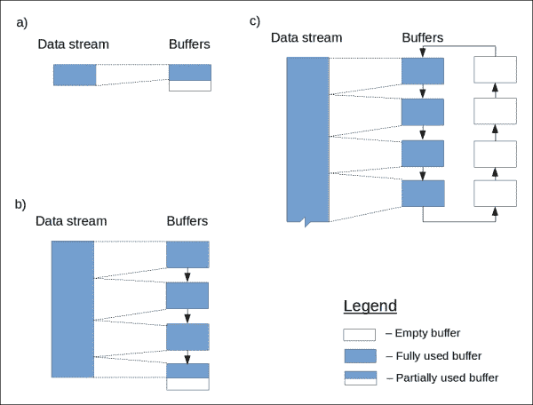
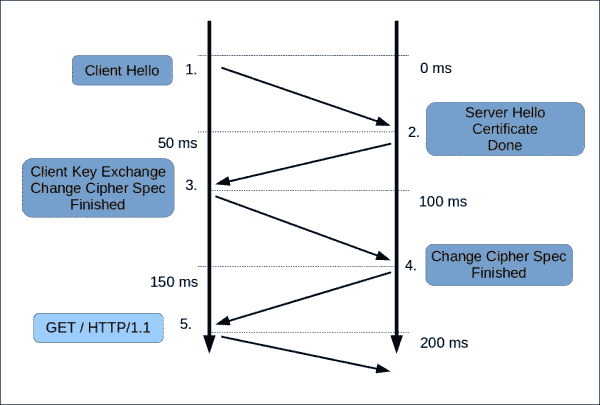
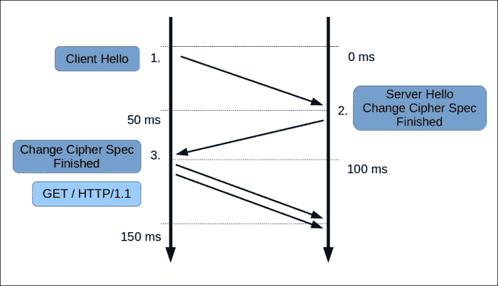

# 第六章：性能调优

性能调优是系统性能的改进。在我们的上下文中，它指的是整个 Web 服务或单个 Web 服务器的性能。当出现真实或预期的性能问题时，比如响应延迟过高、上传或下载速率不足、系统可扩展性差，或计算机系统资源在看似低服务使用的情况下被过度使用时，就需要进行这样的活动。

本章将讨论一系列使用 Nginx 功能解决性能问题的主题。每个章节都会解释何时以及如何应用某种解决方案；也就是说，它解决了什么类型的性能问题。

在本章中，你将学习到：

+   如何优化静态文件检索

+   如何设置响应压缩

+   如何优化数据缓冲区分配

+   如何通过启用会话缓存来加速 SSL

+   如何在多核系统上优化工作进程分配

# 优化静态文件检索

静态文件检索性能直接影响到访客对网站性能的感知。这是因为网页通常包含大量对依赖资源的引用。这些资源需要在整个页面渲染之前被快速检索。网站的感知性能越高，意味着 Web 服务器能更快地开始返回静态文件（更低的延迟）并且具有更高的并发检索能力。

当延迟是驱动因素时，重要的是文件主要从主内存中返回，因为主内存相比硬盘有更低的延迟。

幸运的是，操作系统已经通过文件系统缓存很好地处理了这一点。你只需要通过指定一些建议的参数并消除浪费来刺激缓存的使用：

```
location /css {
    sendfile on;
    sendfile_max_chunk 1M;
    [...]
}
```

默认情况下，Nginx 会在将文件内容发送给客户端之前，将其读取到用户空间。这是一个次优方案，如果`sendfile()`系统调用可用，可以通过使用它来避免这一点。`sendfile()`函数通过将数据从一个文件描述符复制到另一个文件描述符并绕过用户空间，实现了零拷贝传输策略。

我们通过在代码中指定`sendfile on`参数来启用`sendfile()`。我们使用`sendfile_max_chunk`指令限制`sendfile()`在一次调用中发送的最大数据量为 1 MB。这样，我们就避免了单个快速连接占用整个工作进程的情况。

### 注意事项

响应体过滤器，如`.gzip`压缩器，需要响应数据位于用户空间。它们无法与零拷贝策略以及`sendfile()`函数结合使用。因此，在启用时，它们会取消`sendfile()`的效果。

上述配置经过优化以减少延迟。与 第二章 *《管理 Nginx》* 中的 *设置 Nginx 提供静态数据* 部分中的示例进行比较，你会发现 `tcp_nopush` 指令已经被去除。此选项的 `off` 状态会使网络利用效率稍微降低，但会尽可能快地将数据（包括 HTTP 头）传输给客户端。

当 `tcp_nopush` 设置为 `on` 时，响应的第一个数据包将在 `sendfile()` 获取数据块后立即发送。

静态文件获取的另一个方面是大文件下载。在这种情况下，启动时间不像下载吞吐量那么重要，换句话说，就是服务器返回大文件时能达到的下载速度。对于大文件，缓存不再是理想选择。Nginx 会按顺序读取它们，因此缓存命中率较低。大文件的缓存片段会污染缓存。

在 Linux 上，可以通过使用直接 I/O 绕过缓存。启用直接 I/O 后，操作系统会将读取偏移量转换为底层块设备地址，并直接将读取请求排入底层块设备队列。以下配置展示了如何启用直接 I/O：

```
location /media {
    sendfile off;
    directio 4k;
    output_buffers 1 256k;
    [...]
}
```

`directio` 指令接受一个参数，指定文件必须具备的最小大小，才能使用直接 I/O 读取文件。除了指定 `directio`，我们还通过 `output_buffers` 指令扩展输出缓冲区，以提高系统调用效率。

请注意，直接 I/O 会在读取过程中阻塞工作进程。这会降低文件获取的并行性和吞吐量。为了避免阻塞并提高并行性，你可以启用 **异步 I/O** (**AIO**):

```
location /media {
    sendfile off;
    aio on;
    directio 4k;
    output_buffers 1 256k;
    [...]
}
```

在 Linux 上，AIO 从内核版本 2.6.22 开始支持，且只有与直接 I/O（Direct I/O）结合使用时才是非阻塞的。AIO 和直接 I/O 可以与 `sendfile()` 一起使用：

```
location /media {
    sendfile on;
    aio on;
    directio 4k;
    output_buffers 1 256k;
    [...]
}
```

在这种情况下，小于 `directio` 指定大小的文件将使用 `sendfile()` 发送，否则将使用 AIO 加上直接 I/O。

从 Nginx 版本 1.7.11 开始，你可以将文件读取操作委托给线程池。如果你的内存或 CPU 资源不受限制，这样做是非常合理的。由于线程不需要直接 I/O，因此在大文件上启用线程会导致积极的缓存。

```
location /media {
    sendfile on;
    aio threads;
    [...]
}
```

线程默认情况下没有被编译（在写本章时），因此你需要通过 with-threads 配置开关来启用它们。除此之外，线程只能与 `epoll`、`kqueue` 和 `eventport` 事件处理方法一起使用。

使用线程可以在不阻塞工作进程的情况下实现更高的并行性和缓存，尽管线程和线程之间的通信需要一些额外资源。

# 启用响应压缩

通过启用 GZIP 响应压缩，可以提高你网站的性能。压缩减小了响应体的大小，减少了传输响应数据所需的带宽，并最终确保你的网站资源能更快地交付给客户端。

可以使用 `gzip` 指令启用压缩：

```
location / {
    gzip on;
    [...]
}
```

该指令在 `http`、`server`、`location` 和 `if` 块中有效。如果该指令的第一个参数指定为 `off`，则在外部块启用压缩时，禁用对应位置的压缩。

默认情况下，只有 MIME 类型为*text/HTML*的文档会被压缩。要启用其他类型文档的压缩，可以使用 `gzip_types` 指令：

```
location / {
    gzip on;
    gzip_types text/html text/plain text/css application/x-javascript text/xml application/xml application/xml+rss text/javascript;
    [...]
}
```

前述配置启用了超文本文档、层叠样式表和 JavaScript 文件的 MIME 类型压缩。这些类型的文档最能从压缩中获益，因为文本文件和源代码文件——如果足够大——通常包含大量熵。

### 提示

压缩不适用于档案、图片和电影，因为它们通常已经是压缩过的。可执行文件压缩的适用性较低，但在某些情况下也可以从中受益。

对于小文档，禁用压缩是有意义的，因为压缩效率可能不值得付出——甚至更糟——可能会带来负面效果。在 Nginx 中，你可以使用 `gzip_min_length` 指令实现压缩。该指令指定文档的最小长度，只有超过该长度的文档才有资格进行压缩：

```
location / {
    gzip on;
    gzip_min_length 512;
    [...]
}
```

使用前述配置，所有小于 512 字节的文档将不会被压缩。应用此限制的长度信息来自 `Content-Length` 响应头。如果没有该头信息，则无论响应的长度如何，都将进行压缩。

### 注意

响应压缩是有代价的：它非常消耗 CPU。你需要在容量规划和系统设计时考虑这一点。如果 CPU 使用率成为瓶颈，可以尝试使用 `gzip_comp_level` 指令减少压缩级别。

下表列出了一些其他影响压缩行为的指令：

| 指令 | 功能 |
| --- | --- |
| `gzip_disable <regex>` | 如果请求的 User-Agent 字段与指定的正则表达式匹配，则该请求的压缩将被禁用。 |
| `gzip_comp_level <level>` | 该指令指定使用的 GZIP 压缩级别。最小值为 1，最大值为 9。这些值对应 `gzip` 命令的选项 -1 … -9。 |

前述指令可以帮助你精细调整系统中的响应压缩设置。

响应体压缩效率可以通过 `$gzip_ratio` 变量进行监控。该变量表示获得的压缩比，即原始响应体的大小与压缩后响应体的大小之比。

该变量的值可以写入日志文件，稍后由你的监控系统提取并进行处理。考虑以下示例：

```
http {
    log_format gzip '$remote_addr - $remote_user [$time_local] $status '
        '"$request" $body_bytes_sent "$http_referer" '
        '"$http_user_agent" "$host" $gzip_ratio';

    server {
        [...]
        access_log  /var/log/nginx/access_log gzip;
        [...]
    }
}
```

上述配置创建了一个名为 `gzip` 的日志文件格式，并在其中一个虚拟主机中使用此格式记录 HTTP 请求。日志文件中的最后一个字段将显示获得的压缩比。

# 优化缓冲区分配

Nginx 使用缓冲区在不同阶段存储请求和响应数据。优化缓冲区分配可以帮助减少内存消耗并降低 CPU 使用率。下表列出了控制缓冲区分配的指令以及它们应用的阶段：

| 指令 | 功能 |
| --- | --- |
| `client_body_buffer_size <size>` | 该指令指定用于接收来自客户端请求主体的缓冲区大小。 |
| `output_buffers <number> <size>` | 该指令指定在没有加速的情况下，用于将响应主体发送到客户端的缓冲区数量和大小。 |
| `gzip_buffers <number> <size>` | 该指令指定用于压缩响应主体的缓冲区数量和大小。 |
| `proxy_buffers <number> <size>` | 该指令指定用于接收来自代理服务器响应主体的缓冲区数量和大小。此指令仅在启用缓冲区的情况下有效。 |
| `fastcgi_buffers <number> <size>` | 该指令指定用于接收来自 FastCGI 服务器响应主体的缓冲区数量和大小。 |
| `uwcgi_buffers <number> <size>` | 该指令指定用于接收来自 UWCGI 服务器响应主体的缓冲区数量和大小。 |
| `scgi_buffers <number> <size>` | 该指令指定用于接收来自 SCGI 服务器响应主体的缓冲区数量和大小。 |

如你所见，大多数指令都需要两个参数：一个是数量参数，另一个是大小参数。数量参数指定每次请求最多可以分配的缓冲区数。大小参数指定每个缓冲区的大小。



上面的图示展示了数据流的缓冲区分配方式。部分 **a** 显示当输入数据流比上述指令中指定的缓冲区大小短时发生的情况。即使整个缓冲区的空间是从堆中分配的，数据流也会占用整个缓冲区。部分 **b** 显示一个数据流，它比单个缓冲区长，但比允许的最长缓冲区链条短。如你所见，如果以最有效的方式使用缓冲区，其中一些将会完全被使用，最后一个可能只会部分使用。部分 **c** 显示一个数据流，它远比允许的最长缓冲区链条长。Nginx 会尝试用输入数据填充所有可用的缓冲区，并在数据发送后刷新它们。之后，空缓冲区会等待更多输入数据的到来。

只要没有空闲的缓冲区并且输入数据可用，就会分配新的缓冲区。一旦分配了最大数量的缓冲区，Nginx 会等待直到使用的缓冲区被清空，然后重新使用它们。这确保了无论数据流多长，都不会消耗比相应指令所指定的更多内存（缓冲区数量乘以大小）。

缓冲区越小，分配开销越大。Nginx 需要消耗更多的 CPU 周期来分配和释放缓冲区。缓冲区越大，内存消耗的开销也越大。如果一个响应只占用了缓冲区的一部分，剩余部分则没有被使用——即使整个缓冲区必须从堆中分配。

缓冲区大小指令可以应用的最小配置部分是一个位置。这意味着，如果大响应和小响应混合在同一个位置，它们的缓冲区使用模式将有所不同。

静态文件会被读取到由 `output_buffers` 指令控制的缓冲区中，除非 `sendfile` 被设置为 `on`。对于静态文件，多个输出缓冲区意义不大，因为它们无论如何都会以阻塞模式填充（这意味着一个缓冲区无法在另一个正在填充时被清空）。然而，较大的缓冲区会导致更低的系统调用率。考虑以下示例：

```
location /media {
    output_buffers 1 256k;
    [...]
}
```

如果输出缓冲区大小过大且没有线程或 AIO，可能会导致长时间阻塞的读取，从而影响工作进程的响应能力。

当响应体从代理服务器、FastCGI、UWCGI 或 SCGI 服务器进行流水线传输时，Nginx 能够将数据读取到缓冲区的一部分，并同时将另一部分发送到客户端。这对于长时间的回复最为有效。

假设在阅读本章之前，你已经调优了你的 TCP 堆栈。那么，缓冲区链的总大小与内核套接字的读写缓冲区大小相关联。在 Linux 上，可以使用以下命令检查内核套接字读缓冲区的最大大小：

```
$ cat /proc/sys/net/core/rmem_max

```

可以使用以下命令检查内核套接字写缓冲区的最大大小：

```
$ cat /proc/sys/net/core/wmem_max

```

这些设置可以使用 `sysctl` 命令或通过在系统启动时编辑 `/etc/sysctl.conf` 来更改。

在我的例子中，两个设置都为 `163840`（160 KB）。对于一个真实的系统来说，这个值偏低，但我们可以作为例子使用。这个数字是 Nginx 可以在一个系统调用中从套接字读取或写入的最大数据量，而不会使套接字挂起。在异步读写的情况下，为了获得最佳的系统调用率，我们需要的缓冲区空间不少于 `rmem_max` 和 `wmem_max` 的总和。

假设前面的 Nginx 代理长文件，并设置了 `rmem_max` 和 `wmem_max`。在最极端的情况下，以下配置必须能够以最少的内存和最低的系统调用率处理每个请求：

```
location @proxy {
    proxy_pass http://backend;
    proxy_buffers 8 40k;
}
```

相同的考虑也适用于 `fastcgi_buffers`、`uwcgi_buffers` 和 `scgi_buffers` 指令。

对于较短的响应体，缓冲区的大小必须比响应的主要大小稍大。在这种情况下，所有的回复将适合一个缓冲区——每个请求只需要一次分配。

对于上述配置，假设大部分回复适合 128 KB，而某些回复可以达到数十兆字节。最佳的缓冲区配置将在 `proxy_buffers 2 160k` 和 `proxy_buffers 4 80k` 之间。

在响应体压缩的情况下，GZIP 缓冲区链的大小必须根据平均压缩比进行缩小。对于上述配置，假设平均压缩比为 3.4。以下配置必须在存在响应体压缩时，产生最低的系统调用频率，并且每个请求所需的内存量最小：

```
location @proxy {
    proxy_pass http://backend;
    proxy_buffers 8 40k;
    gzip on;
    gzip_buffers 4 25k;
}
```

在上述配置中，我们确保在最极端的情况下，如果一半的代理缓冲区用于接收，另一半则准备用于压缩。GZIP 缓冲区的配置确保未压缩数据的一半占据输出缓冲区的一半，而另一半含有压缩数据的缓冲区则发送给客户端。

# 启用 SSL 会话重用

SSL 会话通过握手过程启动，该过程涉及多个往返（见下图）。客户端和服务器必须交换四个消息，每个消息的延迟大约为 50 毫秒。总的来说，在建立安全连接时我们至少有 200 毫秒的开销。除此之外，客户端和服务器还需要执行公钥加密操作以共享一个共同的密钥。这些操作在计算上非常昂贵。



正常的 SSL 握手

客户端可以请求有效的简化握手（见下图），节省 100 毫秒的完整往返时间，并避免 SSL 握手中最昂贵的部分：



简化握手

简化握手可以通过 RFC 5246 中定义的 *会话标识符* 机制完成，也可以通过 RFC 5077 中详细描述的 *会话票证* 机制完成。

为了使带有会话标识符的简化握手成为可能，服务器需要将会话参数存储在由会话标识符键控的缓存中。在 Nginx 中，可以配置这个缓存与所有工作进程共享。当客户端请求简化握手时，它会向服务器提供一个会话标识符，以便服务器从缓存中检索会话参数。之后，握手过程可以缩短，并且公钥加密操作可以跳过。

要启用 SSL 会话缓存，请使用 `ssl_session_cache` 指令：

```
http {
    ssl_session_cache builtin:40000;
    [...]
}
```

此配置启用使用内置 OpenSSL 会话缓存的 SSL 会话缓存。第一个参数中的数字（`40000`）指定缓存的会话数量。内置缓存不能在工作进程之间共享。因此，这会降低 SSL 会话重用的效率。

以下配置启用 SSL 会话缓存，并在工作进程之间共享该缓存：

```
http {
    ssl_session_cache shared:ssl:1024k;
    [...]
}
```

这会创建一个名为`ssl`的共享 SSL 会话缓存，并启用与该缓存的 SSL 会话重用。缓存的大小现在以字节为单位指定。每个会话在该缓存中占用大约 300 字节。

可以使用 SSL 会话票证机制执行简化的 SSL 握手，无需服务器状态。这是通过将会话参数打包成二进制对象，并用只有服务器知道的密钥加密来实现的。这个加密对象被称为会话票证。

会话票证可以安全地传输给客户端。当客户端希望恢复会话时，它将会话票证提交给服务器。服务器解密它并提取会话参数。

会话票证是 TLS 协议的扩展，并且可以与 TLS 1.0 及更高版本一起使用（SSL 是 TLS 的前身）。

要启用会话票证，请使用`ssl_session_tickets`指令：

```
http {
    ssl_session_tickets on;
    [...]
}
```

自然地，两个机制可以同时启用：

```
http {
    ssl_session_cache shared:ssl:1024k;
    ssl_session_tickets on;
    [...]
}
```

出于安全原因，缓存的会话生命周期有限，以便在会话活动时不能被攻击。Nginx 将默认的最大 SSL 会话生命周期设置为 5 分钟。如果安全性不是大问题，且访问者在你的网站上停留的时间较长，可以延长最大会话生命周期，从而提高 SSL 的效率。

最大 SSL 会话生命周期由`ssl_session_timeout`指令控制：

```
http {
    ssl_session_cache shared:ssl:1024k;
    ssl_session_tickets on;
    ssl_session_timeout 1h;
    [...]
}
```

前面的配置启用了会话重用机制，并将最大 SSL 会话生命周期设置为 1 小时。

# 在多核系统上分配工作进程

如果你的 Nginx 工作负载是 CPU 密集型的，比如在代理内容上使用响应压缩，且系统具有多个处理器或多个处理器核心，则可以通过将每个工作进程与其自身的处理器/核心关联，来获得额外的性能。

在多核处理器中，每个核心都有自己的**转换旁路缓存**（**TLB**），用于加速虚拟地址转换。 在抢占式多任务操作系统中，每个进程都有自己的虚拟内存上下文。当操作系统将一个活动进程分配给一个处理器核心，而该虚拟内存上下文与填充该处理器核心 TLB 的上下文不匹配时，操作系统必须清空 TLB，因为其内容不再有效。

新的活动进程将会面临性能惩罚，因为它必须在读取或写入内存位置时填充 TLB（Translation Lookaside Buffer）。

Nginx 提供了一个选项，可以将一个进程“固定”到某个处理器核心。在单个 Nginx 实例的系统中，工作进程大多数时间会被调度。在这种情况下，虚拟内存上下文很可能不需要切换，TLB 也不需要刷新。这时，进程的“粘性”就显得很有用。这种“粘性”被称为 CPU 亲和性。

假设系统有四个处理器核心。CPU 亲和性可以按如下方式配置：

```
worker_processes 4;
worker_cpu_affinity 0001 0010 0100 1000;
```

这个配置将每个工作进程分配到各自的处理器核心。配置指令 `worker_cpu_affinity` 需要接受多个参数，以便启动多个工作进程。每个参数指定一个掩码，其中值为 1 的位表示与对应处理器的亲和性，而值为 0 的位表示没有与对应处理器的亲和性。

### 注意

CPU 亲和性并不能保证性能提升，但如果你的 Nginx 服务器执行的是 CPU 密集型任务，还是值得尝试一下。

# 总结

在这一章中，你学到了一些技巧，这些技巧将帮助你解决系统的性能和可扩展性问题。重要的是要记住，这些技巧并不是所有性能问题的解决方案，而是不同方式使用系统资源之间的权衡。

然而，它们是每个网站管理员或网站可靠性工程师在掌握 Nginx 及其性能和可扩展性特性时必不可少的工具。
