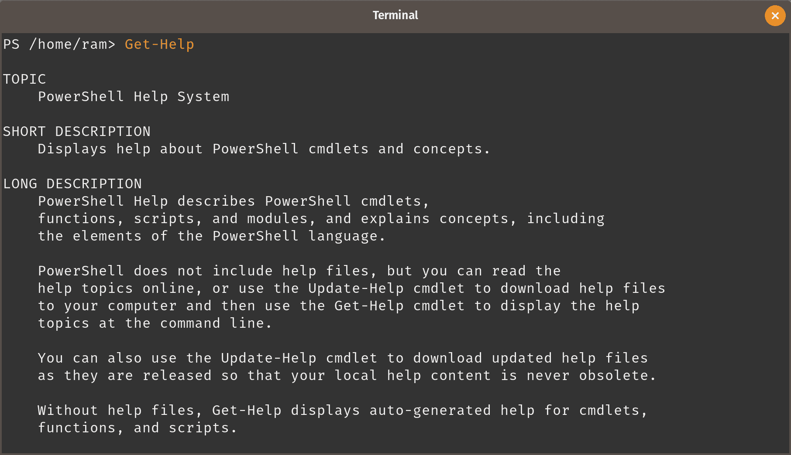
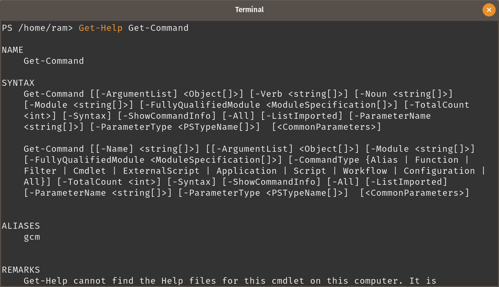
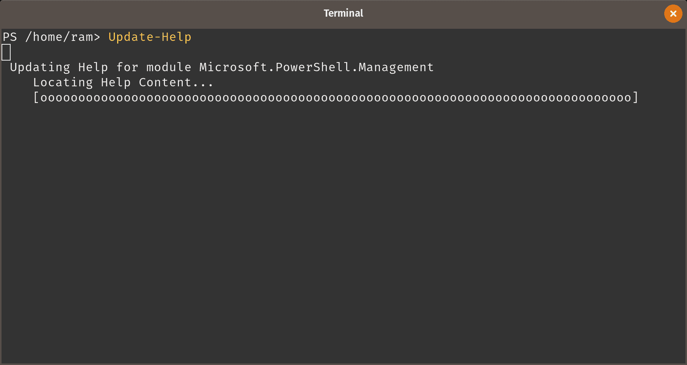
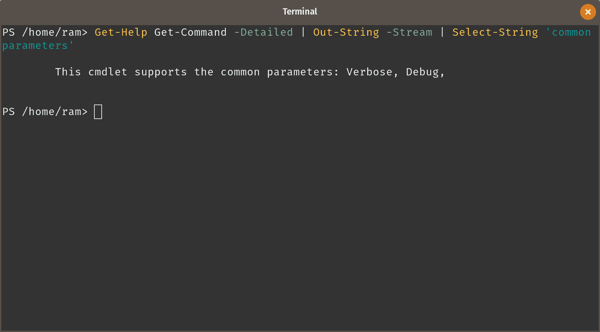
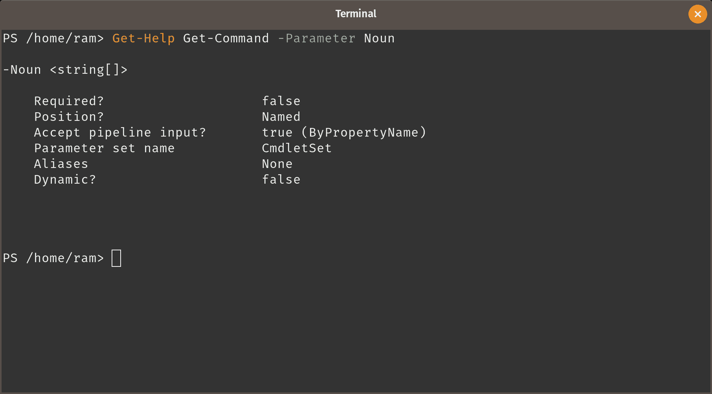
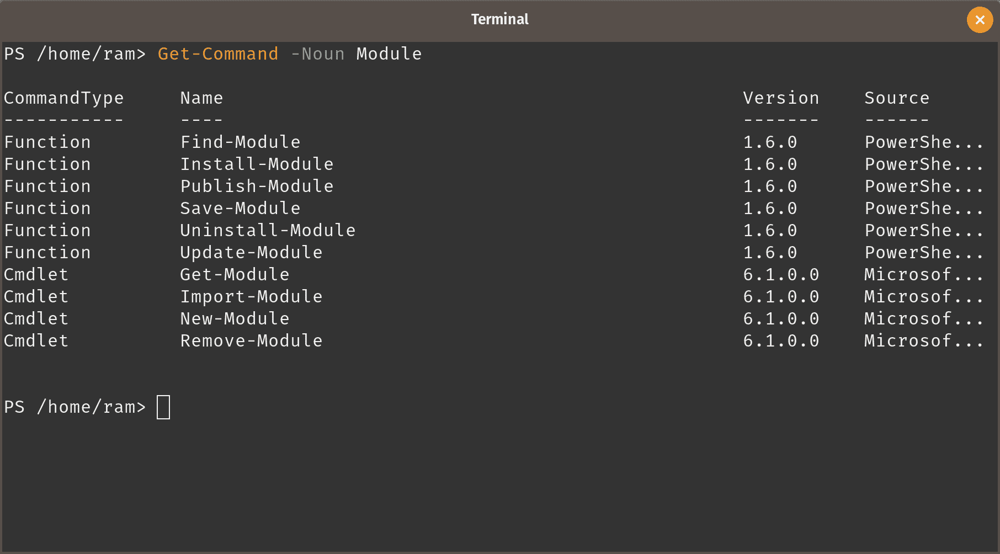
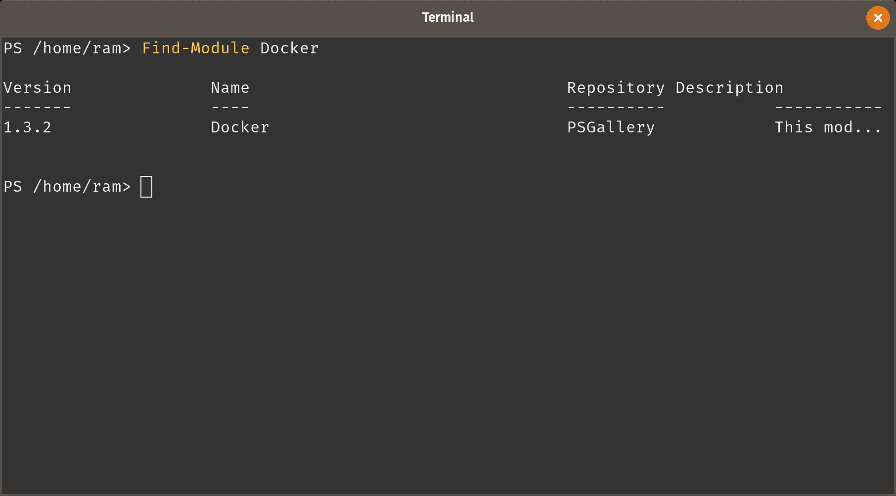
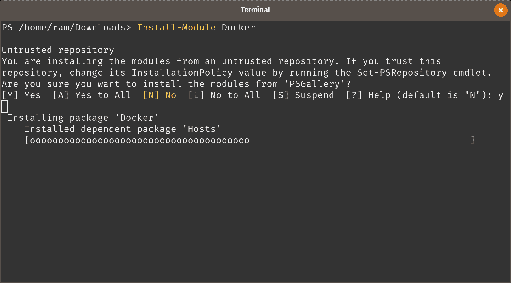
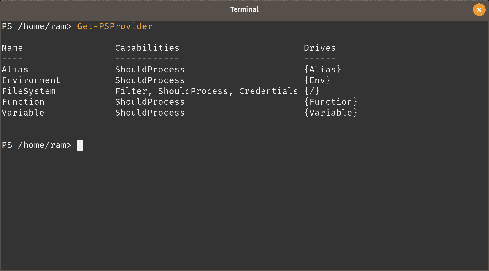
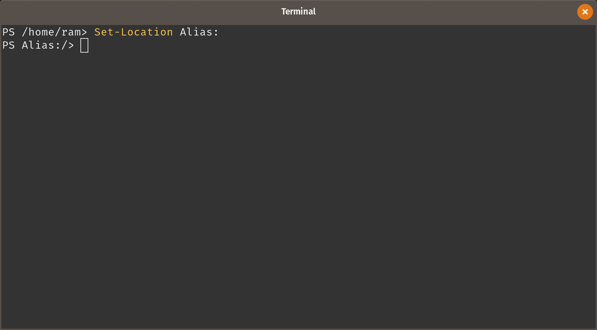

# 安装、参考和帮助

在本章中，我们将介绍以下操作步骤：

1.  安装 PowerShell

1.  在 PowerShell 中获取帮助信息

1.  获取特定 cmdlet 的帮助信息

1.  更新帮助

1.  搜索关键字的帮助信息

1.  查找特定参数的帮助信息

1.  探索 `about_` 主题

1.  发现 cmdlet

1.  查找模块

1.  从存储库安装模块

1.  列出 PowerShell 中的各种提供者

# 简介

一切都从在您的系统上安装 PowerShell 开始。安装 PowerShell 简单而直接。由于 PowerShell 是开源的，其源代码可以在可能是最大的开源项目平台 GitHub 上获得。目前，Windows、Debian（和 Ubuntu）、RedHat Linux（和 CentOS）、Fedora 和 macOS 是**PowerShell 项目**的官方支持系统。Arch Linux 和 Kali Linux 得到社区的支持。还有适用于大多数现代 Linux 发行版的 PowerShell AppImage 版本的社区支持。

AppImage 是将应用程序打包为在 Linux 发行版上运行的一种方式。每个应用程序都有其依赖关系。在 Linux 上，包管理器管理安装依赖项时会安装软件包。另一方面，AppImage 软件包会将所有必要的依赖项打包到其内部。AppImage 可以以**便携**模式运行，也可以根据用户的喜好安装在系统上。

至撰写本章时，PowerShell 已试验性地支持 Windows on ARM 和 Raspbian Stretch。

# 安装 PowerShell

基本上，在 Linux 中，应该很容易获取源代码，并使用 make 构建应用程序。这种方法对 PowerShell 也适用。但是，如上所述，官方支持和社区支持仅适用于少数几种发行版。我们将重点放在在 Ubuntu 和 CentOS 上安装 PowerShell，因为它们是最流行的两种 Linux 发行版之一。

PowerShell 有两个版本：稳定版和预览版。稳定版适用于生产环境，因为它们更可靠。预览版适用于测试环境，管理员可以在其中稍作尝试，并愿意报告他们遇到的 bug，同时提供关于功能的反馈。

# 准备工作

准备在计算机上安装 PowerShell 是简单的。您只需拥有一个可以运行 Linux 的计算机，并具有管理员权限。根据您选择安装 PowerShell 的模式，您可能需要或不需要包管理器。您的 Linux 发行版很可能已经有可用的包管理器。

# 如何操作...

如前所述，我们将讨论在 Ubuntu（及其衍生版本）以及 CentOS（及其衍生版本）上安装 PowerShell 的步骤。

# 在 Ubuntu 上安装

确实有很多方法可以在你的计算机上安装 PowerShell。由于我们正在 Ubuntu 上安装 PowerShell，我们将介绍两种方法。第一种是通过添加微软的密钥并注册仓库，然后使用高级包工具（APT）安装 PowerShell，第二种是直接使用 GitHub 上的.deb 包。

# 通过仓库安装

PowerShell 的官方包支持的最后一个 Ubuntu 版本是 Ubuntu 17.04。如果你使用的是 Ubuntu 17.04，请使用以下步骤安装 PowerShell。否则，建议使用直接下载方式。

1.  第一步是导入公共仓库的 GPG 密钥：

```
curl https://packages.microsoft.com/keys/microsoft.asc | sudo apt-key add -
```

1.  现在，密钥已添加，注册仓库——这个仓库由微软维护。

```
sudo curl -o /etc/apt/sources.list.d/microsoft.list https://packages.microsoft.com/config/ubuntu/17.04/prod.list
```

1.  使用以下命令更新包列表。

```
sudo apt update
```

1.  接下来，安装 PowerShell。

```
sudo apt install -y powershell
```

# 通过直接下载安装

按照以下步骤在 Ubuntu 上安装 PowerShell：

1.  访问[`github.com/powershell/powershell`](https://github.com/powershell/powershell)。

1.  向下滚动，找到包含 PowerShell 团队正式支持的 Linux 发行版列表的表格。

1.  点击相关链接：在下载（稳定版）下的`.deb`—我们将使用稳定版。

1.  如果需要更多信息，请阅读安装说明。

1.  使用`gdebi`、`eddy`或类似的包管理工具运行.deb 文件来完成安装。

如果你没有运行 PowerShell 团队或社区正式支持的发行版，请使用 AppImage。按照上述步骤 1 和 2，然后：

1.  点击 Many Linux distributions | AppImage 以下载 AppImage 文件。AppImage 文件是一个应用程序，包含运行该应用程序所需的所有依赖项。

1.  将 AppImage 文件保存到一个方便的位置。

1.  下载完成后，导航到下载位置并运行 AppImage。

1.  如果你收到提示询问是否安装 PowerShell，请选择适合你环境的选项。

# 在 CentOS 上安装

在 CentOS 7（或 RedHat 7）上安装 PowerShell 也有两种方法：仓库和直接下载。过程与在 Ubuntu Linux 上的安装类似。

# 通过仓库安装

开始安装：

1.  首先，注册微软仓库。

```
curl https://packages.microsoft.com/config/rhel/7/prod.repo | sudo tee /etc/yum.repos.d/microsoft.repo
```

1.  接下来，使用`yum`安装 PowerShell。

```
sudo yum install -y powershell
```

# 通过直接下载安装

按照以下步骤在 CentOS 上安装 PowerShell：

1.  访问[`github.com/powershell/powershell`](https://github.com/powershell/powershell)。

1.  向下滚动，找到包含 PowerShell 团队正式支持的 Linux 发行版列表的表格。

1.  点击相关链接：在下载（稳定版）下的`.rpm`—我们将使用稳定版。

1.  如果需要更多信息，请阅读安装说明。

1.  使用以下命令安装 RPM 包（假设你的下载文件在`~/Downloads`，当前工作目录是`~/Downloads`）。

```
sudo yum install <the-downloaded-file.rpm>
```

# 使用 AppImage 包

使用 AppImage 要简单得多。

1.  访问 [`github.com/powershell/powershell`](https://github.com/powershell/powershell)。

1.  向下滚动至 "Get PowerShell" 部分，并在社区支持的分发版本下找到 AppImage 链接。

1.  下载 AppImage 并将其放置在一个方便的位置。

1.  运行 `chmod a+x PowerShell-<version>-<architecture>.AppImage` 以使 AppImage 可执行。

1.  调用 AppImage 以运行 PowerShell。您可能会被询问是否希望将 AppImage 安装到计算机上。如果希望安装，请选择“是”。

# 如何操作...

包管理器会安装该包及其所有依赖，并使相关命令可用。

对于 AppImage 包，所有依赖项都已捆绑在包中（包括 .NET Core），且该包可以在您的计算机上以便携模式运行，或者可以安装并调用。通过运行 `pwsh` 启动 PowerShell 来查看。

# 另见

1.  示例 2.5：比较 Windows PowerShell 和 PowerShell

# 在 PowerShell 中获取帮助信息

PowerShell 中的命令被称为 cmdlet（发音：command-lets）。Cmdlets 预先包装了所有必要的帮助信息，类似于 Linux 命令提供的帮助。不同之处在于，PowerShell 中有一个单独的 cmdlet 来获取所需的帮助；在 PowerShell 中，帮助不是一个开关。

在我们开始之前，先启动终端（启动您计算机上任何可用的终端模拟器）。现在输入 `pwsh` 调用 PowerShell。一旦看到 PS 提示符后，按照以下步骤操作。

要在 PowerShell 中获取帮助信息：

在提示符下输入 `Get-Help`，以获取 PowerShell 中帮助系统的概述。您将看到类似如下的输出：



PowerShell cmdlet 是内置了帮助信息的命令。运行 `Get-Help` 不带任何参数时，您只会看到有关 PowerShell 中可用帮助的基本信息，这并没有什么特别之处。让我们来看一下另一个示例，如何更好地利用 `Get-Help`。

# 获取特定 cmdlet 的帮助信息

当 `Get-Help` 显示关于帮助本身的信息时，它也可以接受其他 cmdlet 作为参数，并显示它们的帮助信息。让我们以 `Get-Command` 为例，获取该 cmdlet 的帮助。

# 如何操作...

1.  在提示符下，输入以下内容：

```
Get-Help Get-Command
```

1.  你将看到类似如下的输出：



1.  你甚至可以获得关于 cmdlet 的完整帮助，包括关于每个可以与 cmdlet 一起使用的参数的信息；这些信息包括该参数是否是位置参数、是否是必需的等等。我们将在后续的 PowerShell 管理中详细了解每个内容。要获取 cmdlet 的完整帮助，请输入：

```
PS> Get-Help Get-Command -Full
```

1.  要查看如何使用 cmdlet 的示例，请输入：

```
PS> Get-Help Get-Command -Examples
```

1.  要在线阅读帮助信息，请输入：

```
PS> Get-Help Get-Command -Online
```

注意，参数在输出中按 SYNTAX 组进行分类。在这种情况下，我们可以看到两个这样的组。这些组称为 **参数集**。参数集告诉我们哪些参数可以组合在一起。两个不在同一参数集中的参数不能一起使用。

# 它是如何工作的...

当你运行 `Get-Help` cmdlet，并传入另一个 cmdlet 作为参数时，`Get-Help` 会获取传入的 cmdlet（在本例中是 `Get-Command`）的帮助信息。我们将在后续章节中看到参数是如何处理的。目前，我们只是调用一个任意 cmdlet 的帮助。

如果你查看输出，你会看到 cmdlet 的名称、使用该 cmdlet 的语法、可用的 cmdlet 别名以及如果需要的话，更多的在线帮助。`Full` 和 `Examples` 是用来告诉 PowerShell 你需要哪种级别的帮助的开关。这两个选项是互斥的；你不能同时使用 `-Full` 和 `-Examples`。

# 另见

1.  方案 2.6：列出别名并将其用作 cmdlet 的替代

1.  方案 1.4：更新帮助

1.  方案 1.3：获取特定 cmdlet 的帮助信息（关于参数集的信息）

# 更新帮助

PowerShell 中的帮助信息是动态的。在大多数情况下，PowerShell 会在线获取最新的帮助。然而，也可以将帮助文件离线存储。可以使用 `Update-Help` cmdlet 完成此操作。

# 如何操作...

要下载本地安装的 PowerShell 模块的帮助文件：

1.  输入 `exit` 退出 PowerShell。这是为了你可以重新启动 PowerShell，并以提升的权限运行。

1.  输入 `sudo pwsh` 以超级用户身份启动 PowerShell。

1.  在 `PS` 提示符下，运行 `Update-Help`。

1.  等待更新进度条显示。进度条会随着帮助文件下载到你的计算机而填充。



# 它是如何工作的...

每次运行 Get-Help cmdlet 时，PowerShell 都会在线获取帮助信息——帮助文件不会离线存储。这样做的主要目的是确保始终引用最新的帮助信息。此外，在线查看帮助也不会占用本地计算机的存储空间。

然而，在某些情况下，需要将帮助信息存储以供离线访问。在这种情况下，下载并存储帮助文件是有意义的。

这个操作需要提升权限的原因之一是，帮助信息存储在 shell 中。因此，非管理员用户可能无法在没有管理员干预的情况下更新帮助。

# 在帮助中搜索关键词

Linux 管理员非常习惯使用 `grep` 来搜索任何文本输出中的特定文本模式。正如我们所知，PowerShell 只返回 **对象**——PowerShell 也将文本视为对象。

虽然将对象转换为文本会削弱 PowerShell 的功能，但在某些场景下仍然是必要的。在这种情况下，我们将查找帮助输出中的关键词“common”。

# 如何操作...

让我们首先通过获取 cmdlet 的帮助信息来开始搜索过程：

1.  在终端输入 `pwsh` 启动 PowerShell。

1.  在提示符下，输入：

```
PS> Get-Help Get-Command
```

这应该能给你提供有关指定 cmdlet 的有用信息。

1.  使用 `Out-String` cmdlet 并结合 `-Stream` 参数将输出转换为文本，这样可以一次返回一个字符串，而不是将整个帮助信息作为单一字符串返回。这样，我们能够更高效地执行字符串匹配，并获得更简短的搜索结果。

```
PS> Get-Help Get-Command | Out-String -Stream
```

1.  目前不会有明显的变化。添加 `Select-String` cmdlet 来执行类似 `grep` 的操作。

```
PS> Get-Help Get-Command | Out-String -Stream | Select-String 'common'
```

1.  这将输出包含字符串 'common' 的确切行。



# 它是如何工作的...

在第一步中，我们简单地获取 `Get-Command` cmdlet 的帮助信息。这个输出是一个对象——当输出为文本时，执行文本查找操作效果最佳。`Out-String` 将此输出转换为纯文本字符串；唯一的问题是整个文本块是一个单一的字符串。以这种方式进行文本查找可能并不十分有用。我们使用 `-String` 参数将大字符串拆分成更小的部分（在这种情况下是段落）。接下来，我们使用 `Select-String` 结合关键字来选择包含我们关键字的字符串。

# 查找特定于某个参数的帮助信息

正如我们在前面章节看到的，PowerShell 的帮助输出可能会有点让人应接不暇。当我们需要获取 cmdlet 中参数的信息时，我们可以运行 `Get-Help` 并使用 `-Full` 参数。然而，这会列出所有的参数。如果我们只想获取某一个参数的信息，该怎么办呢？

# 发现 Cmdlets

到目前为止，我们已经学习了如何获取 cmdlet 的帮助信息。我们以 `Get-Command` cmdlet 作为示例参数。现在我们将使用 `Get-Command` 来发现 PowerShell 中的 cmdlet。因此，`Get-Help` 和 `Get-Command` 成为在 PowerShell 中获取帮助信息时最重要的 cmdlet。

PowerShell 就像纯英语——PowerShell 遵循动词-名词格式来命名 cmdlet，这使得 cmdlet 听起来像普通的英语命令。PowerShell 甚至使用被称为 **批准动词** 的规范，确保动词在命名 cmdlet 时遵循约定。另一方面，名词可以是任意的。

大多数程序员建议学习<q>以语言思考</q>。结合肌肉记忆（帮助你记住键盘上的按键），这使得编程和脚本编写更高效。PowerShell 的结构类似英语，在这方面帮助很大；用 PowerShell 思考非常容易。例如，如果你想知道当前日期，你只需输入 `Get-Date`，PowerShell 就会在屏幕上显示日期和时间。

# 如何操作...

让我们来看一下如何仅获取 `Get-Help` 中 `Noun` 参数的信息。

1.  通过在终端窗口中运行 `pwsh` 启动 PowerShell。

1.  在提示符下，输入`Get-Help Get-Command`以查找有关 cmdlet 的基本帮助信息。

1.  记下你想要了解更多信息的参数。我们以`Noun`参数为例。

1.  在提示符下输入以下命令：

```
PS> Get-Help Get-Command -Parameter Noun
```

输出包含与`Noun`参数相关的信息：



# 它是如何工作的...

这是一个典型的对象筛选示例。由于大多数 PowerShell cmdlet 的输出是对象，因此很容易选择必要的对象并从输出中丢弃其余部分。

当我们使用需要帮助的 cmdlet 和我们正在查找的特定参数运行`Get-Help`时，我们会得到一个与该 cmdlet 相关的过滤帮助。在我们的案例中，我们选择了`Get-Command`的 Noun 参数。

# 探索 About_ 主题

文档是 PowerShell 的一大优势。虽然并非所有模块都有完整的文档，但所有官方模块都有完整文档，第三方模块中的一些也做得很好。默认情况下，PowerShell 本身内置了详尽的文档。

在本教程中，我们将查找`about_`主题，从输出中选择一个主题并深入阅读我们选择的内容。

# 如何操作...

让我们从列出所有`about_*`帮助文件开始。

1.  使用命令`pwsh`启动 PowerShell。

1.  输入`Get-Help about_*`来列出所有的`about_*`帮助文件。

```
Name                              Category  Module                    Synopsis
----                              --------  ------                    --------
about_Aliases                     HelpFile
about_Arithmetic_Operators        HelpFile
about_Arrays                      HelpFile
about_Assignment_Operators        HelpFile
about_Automatic_Variables         HelpFile
.
.
.
about_Wildcards                   HelpFile
```

1.  选择你想阅读的主题——我们选择了`about_Modules`。

1.  输入`Get-Help about_Modules`来查看 PowerShell 模块的文档。

```
ABOUT MODULES

Short Description
Explains how to install, import, and use PowerShell modules.

Long Description
A module is a package that contains PowerShell commands, such as cmdlets,
providers, functions, workflows, variables, and aliases.

People who write commands can use modules to organize their commands and
share them with others. People who receive modules can add the commands in
the modules to their PowerShell sessions and use them just like the
built-in commands.
.
.
.
How to Find the Commands in a Module

Use the Get-Command cmdlet to find all available commands. You can use the
parameters of the Get-Command cmdlet to filter commands such as by module,
name, and noun.
.
.
.
The following modules (or snap-ins) are installed with PowerShell. *
CimCmdlets * Microsoft.PowerShell.Archive * Microsoft.PowerShell.Core *
Microsoft.PowerShell.Diagnostics * Microsoft.PowerShell.Host *
Microsoft.PowerShell.Management...
```

# 它是如何工作的...

`Get-Help`会提供有关 cmdlet 的信息，如果将 cmdlet 作为参数传递。当你只知道 cmdlet 名称的一部分时，你可以使用字符组合和通配符列出与搜索字符串匹配的 cmdlet（在我们的案例中是`about_*`）。

现在，我们选择想要阅读的主题并进入该特定的`about_`主题。此时，`Get-Help`会显示有关该主题的完整文档。

# 如何操作...

`Get-Command`可以帮助确定执行任务的最佳 cmdlet。要查找 cmdlet，请按照以下步骤操作：

1.  在终端中，输入`pwsh`以启动 PowerShell。

1.  输入`Get-Command`以列出 PowerShell 中所有可用的 cmdlet。返回的 cmdlet 数量会根据你上次更新 PowerShell 和加载的模块有所不同。

```
PS> Get-Command
```

这可能并不特别有用——如果你正在寻找列出当前正在运行的进程的命令，那么看到一个命令列表又有什么意义呢？

1.  进程是一个名词。我们想要一个处理*进程*的 cmdlet 列表。在提示符下，输入：

```
PS> Get-Command -Noun Process
```

请注意，在 PowerShell 中，名词是单数形式。因此，它是 Process，而不是 Processes。

1.  如果你想进一步缩小返回的 cmdlet 列表，可以同时添加动词。

```
PS> Get-Command -Verb Get -Noun Process
```

1.  如果你感到懒得查找，或者不确定确切的约定，甚至可以使用通配符。

```
PS> Get-Command -Noun Proc*
```

1.  如果你不想写太多代码，而且几乎确定你知道部分 cmdlet 名称，可以直接使用通配符搜索。

1.  如果你知道包含 cmdlet 的模块名称，甚至可以在调用`Get-Command`时使用 Module 参数。

```
PS> Get-Command -Noun Process -Module Microsoft.PowerShell.Management
```

# 它是如何工作的...

PowerShell 能够基于连字符的首次出现识别 cmdlet 中的动词和名词。出现在第一个连字符之前的是动词，之后的是名词。当 cmdlet 从模块中加载时，PowerShell 会识别其中的动词和名词。搜索会根据搜索规格迅速返回 cmdlet 的结果。基于动词、名词或甚至模块名称的过滤器会相应地限制搜索范围。

# 查找模块

松散耦合组件是框架成功的关键之一，PowerShell 也遵循这一原则。所有 cmdlet 都被打包在模块中。这些模块可以是第一方提供的，也可以是你自己创建的，甚至可以是第三方创建的。

模块的安装，过去可能是个麻烦事，但如今已经变得更加简化。PowerShell 现在预装了一个名为`PowerShellGet`的包管理器，它可以连接到 PowerShell 库（[`www.powershellgallery.com`](https://www.powershellgallery.com)）。PowerShell 库是一个在线仓库，包含模块、脚本和其他实用工具，管理员可以下载并安装这些内容，以扩展 PowerShell 的功能。

虽然也可以从第三方网站下载 PowerShell 模块，但本书的重点将是 PowerShell 仓库。

# 如何操作...

要在 PowerShell 仓库中查找模块，请按照以下步骤操作：

1.  通过在终端中运行`pwsh`来启动 PowerShell。

1.  查找与模块相关的命令。



请注意，有关模块操作的可用命令列表。其中一些是 cmdlet 类型的，另一些是函数。

1.  使用动词进一步过滤输出结果。

```
PS> Get-Command -Noun Module -Verb Find
```

你将获得`Find-Module`作为输出结果。

1.  输入以下内容以列出所有模块。

```
PS> Find-Module
```

列表开始出现。搜索结果太多了。按`Ctrl + C`中止执行。

1.  搜索一个可以帮助你处理 Docker 容器的模块。



# 它是如何工作的...

数百个模块、脚本和所需状态配置资源已经在`PSGallery`仓库中注册。微软现在推荐使用该仓库来管理模块。通过使用`Find-Module` cmdlet，PowerShell 与仓库建立连接，并获取所有可用模块的列表。然后，它会根据你提供的标准对返回的结果进行搜索。

你也可以类似地找到执行重复任务的脚本。要查找脚本，使用`Find-Script` cmdlet。它的工作方式与`Find-Module` cmdlet 类似，只不过它查找的是单个脚本，而不是模块。

# 从仓库安装模块

现在我们知道了如何找到模块，我们可以继续获取并安装模块。所有与`PowerShellGet`相关的命令都打包在名为`PowerShellGet`的模块中。

# 如何操作...

我们现在知道了可以帮助我们管理 Docker 基础设施的模块名称。现在我们尝试安装该模块。

1.  安装模块可能需要提升权限。使用`sudo`打开 PowerShell。

```
$ sudo pwsh
```

1.  现在运行以下命令从仓库安装 Docker 模块。

```
PS> Install-Module Docker
```



1.  在某些情况下，你可能希望在安装模块之前先将其保存在本地。

```
PS> Save-Module Docker ~/PsModules
```

这样，你可以在便携模式下简单地导入模块并运行命令，而无需将模块安装到任何系统目录中。

1.  要导入下载的模块，运行：

```
PS> Import-Module ~/PsModules/Docker/1.3.2/Docker.psm1
```

1.  要更新已安装的模块，运行：

```
PS> Update-Module Docker
```

1.  要删除已安装的模块，运行：

```
PS> Uninstall-Module Docker
```

这些功能中的大多数也适用于发布到 PowerShellGet 仓库的脚本。只需在命令中将 Module 替换为 Script 即可，操作方法与模块一样——你可以像处理模块一样查找、保存、安装、更新和卸载脚本。

下载的脚本不一定要安装；它们可以直接调用。我们将在后续章节中看到这一点。

# 它是如何工作的...

PowerShell 在运行`Install-Module`时实际上做的是，将模块文件保存到 PowerShell 默认查找模块的某个位置。

# 另见

1.  配方：PowerShell 中的模块发现路径（创建自定义模块）

1.  配方 3.11：调用 PowerShell 脚本

# 列出 PowerShell 中的各种提供程序

在开始准备使用 PowerShell 进行管理之前，还有一个概念需要理解，那就是**提供程序**。

PowerShell 中的提供程序是面向对象编程中**重载**概念的一个很好的例子。实际上，提供程序是一个程序，它将非文件系统驱动器以逻辑方式表示为驱动器。例如，在 Windows 上，注册表是一个配置数据库。在 PowerShell 中，注册表是一个提供程序；这样，管理员可以像操作文件一样使用 PowerShell 浏览和操作注册表键。此功能在 Linux 上也可用，不过提供程序的数量没有 Windows 上那么多。

# 如何操作...

要列出 PowerShell 中的提供程序，请按照以下步骤操作：

1.  运行`pwsh`以在终端中加载 PowerShell。

1.  运行命令：

```
PS> Get-PsProvider
```



注意 PowerShell 中可用的提供程序，以及在这些提供程序*内部*找到的驱动器和功能。

1.  导航到 Alias:驱动器。

```
PS> Set-Location Alias:
```



注意驱动器名称后面的冒号（Alias: 而不是 Alias）。这很重要，用于告诉 PowerShell 你正在切换驱动器。如果没有冒号，PowerShell 将只会尝试在你当前的工作目录中查找名为 Alias 的目录。

# 它是如何工作的...

截至目前，PowerShell 提供程序似乎在 Linux 上无法按预期工作。然而，随着时间的推移，这个问题应该会得到修复。

提供程序将类似非文件系统的结构封装到自身，并将它们呈现给 PowerShell，就好像它们是文件和目录一样。这使你能够像管理文件和目录那样浏览复杂的结构，而这些结构可以使用文件系统上的命令（如`Get-ChildItem`）进行更简单的管理。

输出中的 `Capabilities` 列显示了每个提供程序的功能，如 `Credentials`、`ShouldProcess` 和 `Filter`。这意味着提供程序支持将凭据传递给核心，支持如 `-WhatIf` 和 `-Confirm` 这样的参数（它们是 `ShouldProcess` 的一部分），并且可以使用 `-Filter` 参数过滤输出。我们将在接下来的章节中了解这些内容。

# 另见

1.  配方：`ShouldProcess` 功能，如 `-Confirm` 和 `-WhatIf`（函数）

1.  配方：使用 `-Filter` 参数
