# 介绍 Core 及其功能

在本章中，我们将覆盖以下主题：

1.  解构.NET Core 对象

1.  将输出分解为不同的对象

1.  解析输入从文本到对象

1.  比较 Bash 和 PowerShell 的输出

1.  比较 Windows PowerShell 和 PowerShell

1.  列出别名并使用它们替代 cmdlet

1.  创建自定义别名

1.  导入/导出自定义别名以供未来使用

1.  列出执行策略并设置合适的策略

# 介绍

微软在 2014 年宣布“开源” .NET 几乎引发了一场风暴。许多人赶忙涌上台（打个比方）去了解这令人难以置信的消息——微软怎么可能将操作系统的核心开源？一些人持怀疑态度，另一些人则感到高兴。然后宣布更加明确——.NET Core 是开源的，而不是.NET Framework。许多人认为.NET Core 是.NET Framework 的一个子集。

.NET 首次在 2000 年宣布，作为一个基于互联网标准的新平台。年底时，微软发布了**公共语言基础设施**作为标准，使得任何人都可以基于这些标准编写自己的.NET 框架。.NET Framework 自 2000 年代初以来一直是 Windows 的基础。

Windows PowerShell 于 2006 年发布，作为.NET Framework 的一个实现，专注于系统管理员（或称为 sysadmins），以帮助他们更好地管理 Windows 工作负载并自动化任务。

2016 年 6 月，微软发布了经过协作重构、更现代、更高效的.NET。.NET Core 正式诞生。虽然.NET Framework 继续主宰 Windows 领域，但.NET Core 作为开源且跨平台的框架，获得了巨大的推动力，并持续增长。而.NET Core 似乎是未来的发展方向。

PowerShell（不是*Windows* PowerShell）基于.NET Core，因此它是开源的，并且具有与.NET Core 相同的愿景，即跨平台。

在本章中，我们将研究一个非常简单的.NET Core 实现，并与 PowerShell 的输出进行比较，以证明 PowerShell 不过是封装了的.NET Core 代码。同时，我们也将观察 PowerShell 的一般行为。

# 解构.NET Core 对象

.NET Core 在跨平台的标准公共语言基础设施（Common Language Infrastructure）上运行。因此，使用.NET Core 封装 Linux 的内部工作变得可能。正如我们在未来的章节中会看到的，PowerShell 是面向对象的，就像.NET Core 一样。为了演示，我们将选择一个简单的系统类，`System.IO.DirectoryInfo`，来展示某个目录的信息。我们还将比较.NET Core 对象的输出与 PowerShell cmdlet 的输出，这两者都展示了某个目录的信息。

你不需要记住.NET Core 类、方法或它们的语法来与 PowerShell 一起工作；这正是 PowerShell 存在的意义所在。

# 准备好了吗

如果你按照上一章的步骤操作，应该已经在你的 Linux 计算机上安装了 PowerShell；打开终端窗口并键入 `pwsh` 来启动 PowerShell。

每个 **对象** 都有成员——**属性** 和 **方法**。如果你是面向对象编程的新手，属性是对象的特性（对象有什么），而方法是对象的能力（对象能做什么）。因此，引用（可以说是）最常被使用的属性和方法的例子：如果马是一个对象，它的高度、颜色等就是它的属性；奔跑、吃饭等就是该对象支持的方法。

# 如何操作...

1.  使用 PowerShell 时，.NET Core 也作为一个依赖项被安装。让我们在 PowerShell 中创建一个对象，它将调用 .NET 类及其默认构造函数。这个构造函数需要一个参数。

```
PS> New-Object -TypeName System.IO.DirectoryInfo -ArgumentList '/home/ram'
```

1.  这将为我们提供关于指定目录的信息，如下所示：

```
Mode                LastWriteTime         Length Name            
----                -------------         ------ ----            
d-----          5/16/18  11:03 AM                ram
```

1.  在 PowerShell 中，有一个名为 `Get-Item` 的 cmdlet，它可以提供关于目录的详细信息。让我们使用与之前相同的参数来调用这个 cmdlet，看看我们能得到什么。

```
PS> Get-Item '/home/ram'

    Directory: /home

Mode                LastWriteTime         Length Name            
----                -------------         ------ ----            
d-----          5/16/18  11:03 AM                ram
```

1.  很接近了！现在让我们使用 `Get-Member` cmdlet 查看刚才收到的输出对象的 *详细信息*。

```
PS> Get-Item '/home/ram' | Get-Member
```

`Get-Member` 显示输出对象中所有可用的成员（大多数 PowerShell cmdlet 返回的是对象输出，而非纯文本）。欲了解更多信息，请运行 `Get-Help Get-Member`。

这将列出作为输出的一系列成员。我们目前主要关注第一行。

```
PS> Get-Item '/home/ram' | Get-Member

   TypeName: System.IO.DirectoryInfo

Name                      MemberType     Definition
----                      ----------     ----------
LinkType                  CodeProperty   System.String LinkType{get=GetLinkType;}
Mode                      CodeProperty   System.String Mode{get=Mode;}
.
.
.
```

# 它是如何工作的...

注意输出的第一行，`TypeName: System.IO.DirectoryInfo`。这就是我们在创建 .NET 对象时使用的精确类型名称。

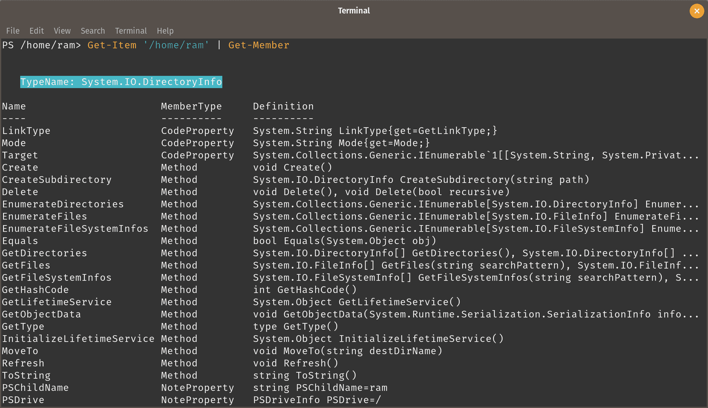

这证明了显示当前工作目录信息的相同任务可以通过调用 .NET 构造函数，或者运行 PowerShell cmdlet 来实现。因此，我们推测 PowerShell cmdlet 仅仅是封装的 .NET 代码，简化后使管理员能够与计算机进行交互，而不必担心底层的 .NET 代码。

本质上，`Get-Item` 在幕后调用了 `System.IO.DirectoryInfo` 类，并传递了与 cmdlet 一起传入的参数。

`Get-Item` 可以与文件系统中的任何位置一起使用。只要你有权访问该位置，PowerShell 就会返回你作为参数传递的位置信息。

正如他们所说：

如果 C# 大家都能做到，你也可以。

# 还有更多...

阅读 `Get-Item | Get-Member` 命令的输出，以了解你可以获得关于指定目录的更多信息。此外，当我们熟悉使用 `Select-Object` cmdlet 后，应该能够从返回的对象中调用特定的字段。

# 另见

1.  .NET 类，[System.IO.DirectoryInfo](https://msdn.microsoft.com/en-us/library/system.io.directoryinfo(v=vs.110).aspx)（Microsoft 开发者网络）

# 将输出分解为不同的对象

在上一节中，我们看到一个对象可以有属性和方法。这些属性和方法被称为成员。在面向对象的编程方法中（以及通过 PowerShell 管理扩展），可以使用**成员访问操作符**，即单个点（`.`），来引用对象的属性和方法。

# 准备工作

理想情况下，这个食谱应该是对前面的扩展。如果你没有运行前面的命令，建议先运行它们，然后再继续以下步骤。

# 如何操作...

1.  看一下之前食谱中命令的输出：

```
PS> Get-Item '/home/ram' | Get-Member
```

输出表包含成员的名称、类型和定义。看看 `MemberType` 列；你会看到 `Method` 和不同种类的属性，如 `CodeProperty` 和 `Property`。

1.  假设我们想查看我的主目录最后一次写入的时间。我们可以使用成员访问操作符来引用这个属性。为此，只需将 `Get-Item` 命令及其参数括在括号中，并使用点操作符引用属性。

```
PS> (Get-Item /home/ram).LastWriteTime

Wednesday, 18 May 2018 11:01:02
```

1.  接下来，让我们选择这个对象的属性 `Parent`。这将为我们提供我的主目录所在目录的详细信息。

```
PS> (Get-Item /home/ram).Parent

Mode                LastWriteTime         Length Name
----                -------------         ------ ----
d-r---       03/05/2018     17:07                home
```

这个输出本身是一个对象，这意味着我们可以像处理 `/home/ram` 一样获取这个返回对象的最后写入时间和其他详细信息。我们如何查看父文件夹（`/home`）的创建时间？

1.  首先，让我们在这个对象上使用 `Get-Member` cmdlet，并查看返回对象的 `TypeName`。

```
PS> (Get-Item /home/ram).Parent | Get-Member

   TypeName: System.IO.DirectoryInfo
```

它与 `Get-Item` 本身相同。因此，`Get-Item /home/ram` 的任何成员也适用于 `(Get-Item /home/ram).Parent`。

1.  现在在父对象上调用 `CreationTime` 属性。只需在 `Parent` 后添加一个点，然后调用 `CreationTime` 属性。

```
PS> (Get-Item /home/ram).Parent.CreationTime

Thursday, 3 May 2018 17:07:38
```

`CreationTime` 属性本身就是一个对象，类型为 `DateTime`。因此，你可以在这个对象上执行日期和时间操作。

PowerShell 在大多数情况下不区分大小写。然而，建议我们遵循约定，以减少错误。特别是因为大小写敏感性在 Linux 中是一个约定。属性可能有不同的数据类型。数据类型可以在`Definition`列中看到。

1.  让我们查看 `CreationTime` 对象的成员，看看是否可以进一步过滤输出。

```
PS> (Get-Item /home/ram).Parent.CreationTime | Get-Member

   TypeName: System.DateTime
```

1.  让我们仅选择这个对象的年份属性。

```
PS> (Get-Item /home/ram).Parent.CreationTime.Year
2018
```

这就是从返回的对象中选择属性的全部内容。接下来，让我们使用返回对象中的方法，在 `/home/ram` 下创建一个子目录。

1.  首先，列出该目录下的现有目录。可以使用 cmdlet `Get-ChildItem` 完成这项操作。

```
PS> Get-ChildItem /home/ram

    Directory: /home/ram

Mode                LastWriteTime         Length Name
----                -------------         ------ ----
d-----       06/04/2018     13:05                Desktop
d-----       18/05/2018     16:01                Documents
d-----       18/05/2018     16:01                Downloads
d-----       06/04/2018     13:05                Music
d-----       19/05/2018     11:07                Pictures
d-----       06/04/2018     13:05                Public
d-----       06/04/2018     13:05                Templates
d-----       10/04/2018     03:41                Videos
```

`Get-Item` 会提供关于目录本身的详细信息。本质上，这个 cmdlet 处理当前的项目。因此，你可以访问与该意图相关的属性和方法。而子项则意味着在该项*内*的文件和目录。

1.  这是用户配置文件中标准目录的列表。现在让我们在该配置文件文件夹内创建一个子目录，使用 `Get-Item` 中的方法。

```
PS> (Get-Item /home/ram).CreateSubdirectory('test-directory')
```

要知道某个方法接受什么参数，请查看 `Get-Member` 输出中的 `Definition` 列。对于 `CreateSubdirectory`，定义是 `System.IO.DirectoryInfo CreateSubdirectory(string path)`。

你现在应该会看到一个确认信息。

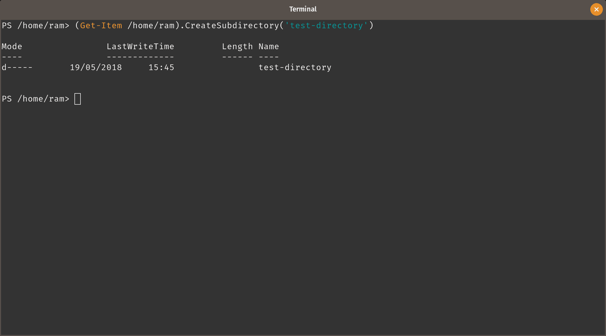

1.  很好。现在，列出主目录下的所有目录。

```
PS> Get-ChildItem /home/ram

    Directory: /home/ram

Mode                LastWriteTime         Length Name
----                -------------         ------ ----
d-----       06/04/2018     13:05                Desktop
d-----       18/05/2018     16:01                Documents
d-----       18/05/2018     16:01                Downloads
d-----       06/04/2018     13:05                Music
d-----       19/05/2018     11:07                Pictures
d-----       06/04/2018     13:05                Public
d-----       06/04/2018     13:05                Templates
d-----       19/05/2018     13:31                test-directory
d-----       10/04/2018     03:41                Videos
```

现在我们可以看到我们使用 `CreateSubdirectory` 方法创建的新目录。

运行 `Get-ChildItem` 时，正如你可能注意到的，它类似于运行 `Get-Directories` 和 `GetFiles` 方法，这些方法来自 `Get-Item` 返回的对象。这是 .NET Core 中封装的另一个例子。

# 它是如何工作的……

使用返回对象中的属性和方法非常简单。可以直接在命令（包括参数的 cmdlet）上使用成员访问运算符来调用 cmdlet 返回输出中的对象。

在成员访问运算符后调用属性会获取该属性中保存的数据。在我们的例子中，它是 `LastWriteTime`。

方法是函数。它们可能需要，也可能不需要参数。`CreateSubdirectory` 方法需要一个字符串参数，它是我们希望创建的子目录的名称（或路径）——我们在括号中输入的内容基本上构成了我们希望创建的路径。对于那些不需要参数的可以运行的方法，它们需要在方法名后跟一个空括号进行调用，例如 `ToString()`。

当我们将字符串参数传递给 `CreateSubdirectory` 时，该方法会运行一个 .NET Core 例程，并在我们通过 `Get-Item` 指定的目录内创建一个子目录。 .NET Core 的内部工作超出了本书的范围。

# 另见

1.  食谱：通过管道选择对象

# 从文本到对象的解析

从文本转换到对象模型最初可能看起来有些令人生畏。然而，在 PowerShell 中，切换到新模型并不难，尤其是考虑到 PowerShell 可以根据合适的工具将文本转换为对象。在本食谱中，我们将查看 PowerShell 将文本数据转换为对象的两种方法。

# 准备就绪

在我们深入食谱之前，先给自己做一个简短的介绍，讲解文本到对象解析是如何处理的。一种方法是使用 .NET 内置的功能，另一种方法则是使用 cmdlet，根据分隔符来执行转换，这是我们将要讨论的内容。

这个配方的基本要求很简单：你只需要在计算机上安装 PowerShell。我们将在 PowerShell 中编辑文件。如果你更喜欢使用文本编辑器，也可以。这大多数 Linux 发行版都自带文本编辑器。如果没有，你可以通过包管理器安装 Vim、Nano、Gedit、Visual Studio Code、Atom 或其他任何文本/代码编辑器。

# 如何做到这一点...

我们首先来看如何从终端的纯文本输入将文本转换为对象。这涉及到使用所谓的**PowerShell 类型加速器**。PowerShell 类型加速器是.NET 类的别名。通过使用这些加速器，我们可以调用.NET 类并在 PowerShell 中使用它们的许多功能。

1.  让我们以纯文本为输入，并将其转换为日期对象。要检查输入的对象类型，可以使用`Get-Member` cmdlet。

```
PS> '21 June 2018' | Get-Member
```

将任何文本用单引号括起来，可以将该文本定义为**非扩展的文字字符串**。在 PowerShell 中，这种情况下不需要显式定义。

1.  `TypeName`显示为`System.String`。这确认了我们输入的确实是纯文本。现在让我们使用类型加速器，将该文本转换为`DateTime`对象。这个加速器是`[DateTime]`；将这个加速器放在文字字符串前面。

```
PS> [DateTime]'21 June 2018'

Thursday, 21 June 2018 00:00:00
```

1.  接下来，找到返回的对象的`TypeName`。

```
PS> [DateTime]'21 June 2018' | Get-Member

   TypeName: System.DateTime
```

Voilà，字符串已经成功解析为日期和时间！

1.  通过使用`Get-Date` cmdlet，并传入文本参数，同样也可以实现相同的结果。

```
PS> Get-Date '21 June 2018'

Thursday, 21 June 2018 00:00:00
```

1.  类似地，`TypeName`将是：

```
PS> Get-Date '21 June 2018' | Get-Member

   TypeName: System.DateTime
```

1.  就像我们在前面所做的那样，我们现在可以操作对象，以更有意义的方式展示信息。例如，如果你只关心年份，你可以写：

```
PS> (Get-Date '21 June 2018').Year
2018
```

另一种将文本转换为对象的方法是使用执行此类任务的 cmdlet。PowerShell 提供了一些转换 cmdlet，其中之一就是`Import-Csv`。你可能注意到，PowerShell 通常以表格格式输出结果。这是对象的简单表示形式。而`Import-Csv`将以分隔符行列结构的数据转换为对象，每一行是对象的一个实例，每一列是对象的一个属性。

1.  为了演示这一点，让我们创建一个 CSV 文件，并在其中输入以下内容。在 PowerShell 提示符下，输入：

```
PS> @'
```

1.  这会让你进入下一行；PowerShell 正在等待输入。请在提示符处粘贴以下示例内容。

```
WS,CPU,Id,SI,ProcessName
161226752,23.42,1914,1566,io.elementary.a
199598080,77.84,1050,1040,gnome-shell
216113152,0.67,19250,1566,atom
474685440,619.05,1568,1566,Xorg
1387864064,1890.29,15720,1566,firefox
```

1.  转到下一行，在`>>`提示符下输入以下内容：

```
'@ | Out-File sample.csv
```

你也可以使用`touch`命令和你选择的文本编辑器执行相同的操作。目标是将内容写入示例文件中。

1.  接下来，使用 PowerShell 读取文件的内容。

```
PS> Get-Content ./sample.csv
WS,CPU,Id,SI,ProcessName
161226752,23.42,1914,1566,io.elementary.a
199598080,77.84,1050,1040,gnome-shell
216113152,0.67,19250,1566,atom
474685440,619.05,1568,1566,Xorg
1387864064,1890.29,15720,1566,firefox
```

1.  看起来像是简单的文本。让我们查看对象的类型名称，以确认这确实是纯文本。输入：

```
PS> Get-Content ./sample.csv | Get-Member

   TypeName: System.String
```

1.  那只是一个简单的字符串。现在让我们将内容转换为一个简单的对象。这可以通过`Import-Csv`来完成。

```
Import-Csv ./sample.csv
```

这应该会给你一个类似列表的输出。

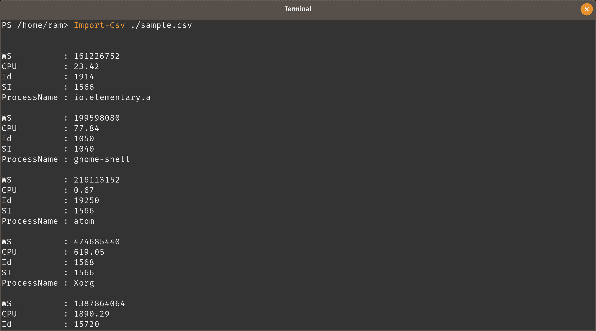

1.  要确认输出为对象，请列出其成员。

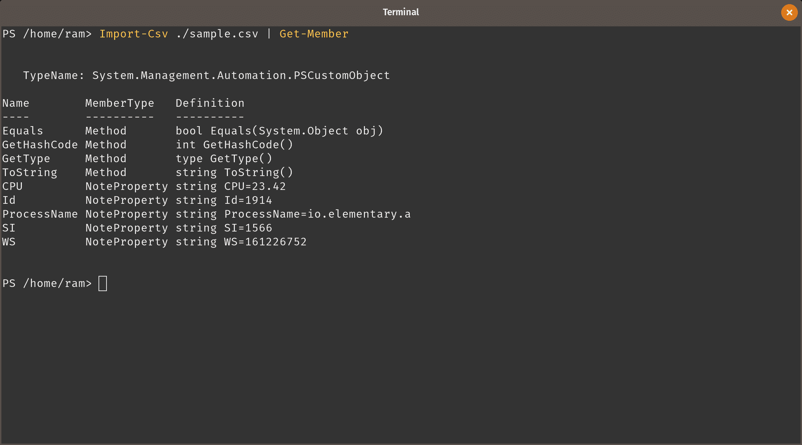

总的来说，内容是一个自定义对象，如`PSCustomObject`所示。我们在 CSV 中拥有的列是`NoteProperty`类型，如`MemberType`所示。

`NoteProperty`是一种通用属性，其特性类似于字符串。虽然大多数属性都是从.NET 继承而来，但`NoteProperty`是在 PowerShell 中自定义创建的，作为名称-值对。

1.  如果你更愿意将内容视为表格，请将内容格式化为表格。

```
PS> Import-Csv ./sample.csv | Format-Table
```

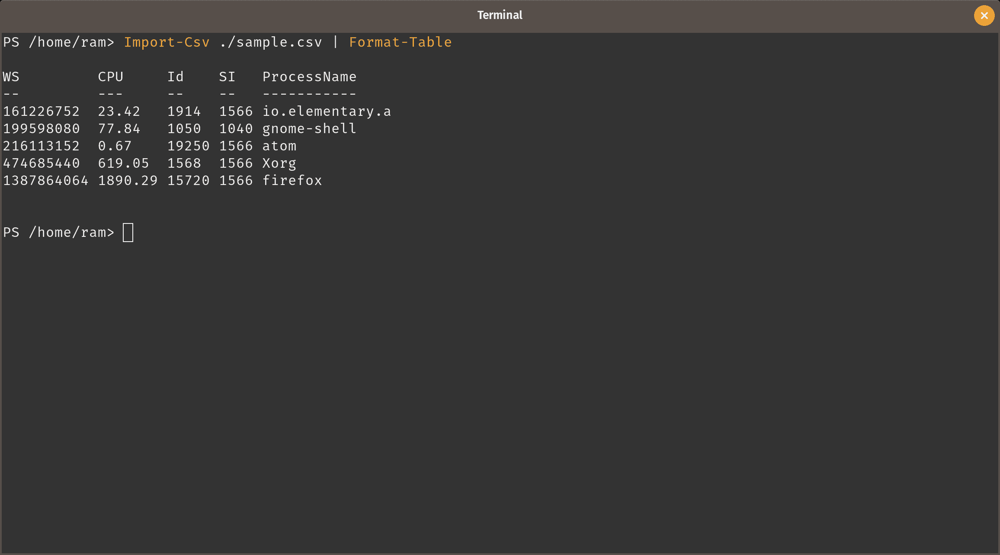

这就是本配方的结尾。我们已成功将文本转换为对象。但请注意，这只是一个简单的转换，而`Import-Csv`的输出仍然类似于字符串。尽管如此，所有内容现在都是对象，这在 PowerShell 中更易于处理。

# 工作原理...

类型加速器是在 PowerShell 中封装.NET 代码的另一种形式。请记住本章的第一个配方，在其中我们在 PowerShell 中创建了一个.NET 对象。我们使用了 PowerShell 命令`New-Object -TypeName System.IO.DirectoryInfo -ArgumentList '/home/ram'`来获取主目录的信息：我们创建了`System.IO.DirectoryInfo`的一个新实例，并向其传递了一个参数。那是一大堆要写的代码。为了加快这个过程，我们可以使用`[IO.DirectoryInfo]'/home/ram'`（`System`是默认命名空间；PowerShell 在调用加速器时不需要我们显式提及它，也能理解它），它输出与前一个命令相同的对象。

另一方面，使用`Import-Csv`的过程是将文本数据简单转换为名称-值对。这类似于使用带有`Delimiter`参数的`ConvertFrom-Text`。通过这种方式，我们指示 PowerShell 将每行文本转换为对象的实例：行列结构中的第一行被视为属性名称，其余行是数据。单元格使用逗号分隔符分隔，这在 CSV 文件中是一样的。

# 还有更多...

寻找更多内置于 PowerShell 的转换命令。可以使用命令`Get-Command -Verb ConvertFrom`来实现。

# 另请参阅

1.  关于类型加速器的更多信息，请参阅[Hey, Scripting Guy! Blog](https://blogs.technet.microsoft.com/heyscriptingguy/2013/07/08/use-powershell-to-find-powershell-type-accelerators/)。

1.  配方：使用 Here 字符串。

1.  PowerShell 中的[不同类型的成员](https://docs.microsoft.com/en-us/dotnet/api/system.management.automation.psmembertypes?view=pscore-6.0.0)。

1.  最佳实践汇总：仅在最后进行格式化。

# 比较 Bash 和 PowerShell 的输出

PowerShell 和 Bash 都是 Shell，都能够与内核进行交互。就像 Bash 可以在 Windows 上运行一样，PowerShell 现在也可以在 Linux 上运行。虽然关于哪个 Shell 更好的几乎所有方面都存在争议，今天选择哪种 Shell 纯粹是个人偏好的问题，但毫无疑问，PowerShell 与.NET Core 的强大能力是相匹配的。

两个 Shell 的主要区别是，正如我们之前所看到的，PowerShell 输出的是对象，而 Bash 返回的是文本。在 Bash 中，操作输出涉及首先处理文本，然后在处理后的文本上运行进一步的命令以获取所需的输出。而 PowerShell 则将内容处理为对象，按设计需要的文本操作较少。

结构化数据，正如 Windows PowerShell 的发明者 Jeffrey Snover 所指出的，随着时间的推移越来越受欢迎，而结构化数据正是 PowerShell 最为出色的地方。

# 准备工作

在本节中，我们将选择一个例子，展示如何使用 PowerShell 处理文件元数据既简单又高效，主要是因为输出是对象。我们将列出我们的主目录中的文件和文件夹，并使用`ls`（在 Bash 中）和`Get-ChildItem`（在 PowerShell 中）显示修改的日期和时间。

如果你愿意，也可以打开两个终端实例：在其中一个上启动`pwsh`。

# 如何操作...

1.  在 Bash 提示符下，输入`ls -l`来列出所有文件及该命令默认显示的元数据。

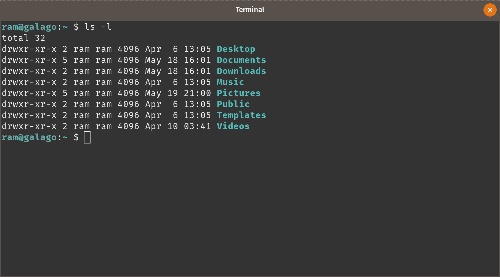

1.  打开运行 PowerShell 的终端，在提示符下输入`Get-ChildItem`。

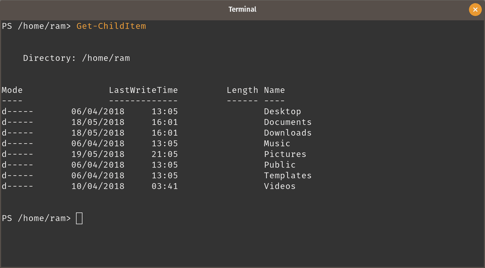

1.  现在，让我们只选择文件夹的名称以及最后修改的日期和时间。这可以通过在 Bash 中将`ls -l`的输出传递给`awk`来完成。

```
ls -l | awk '{print $6, $7, $8, $9}'
```

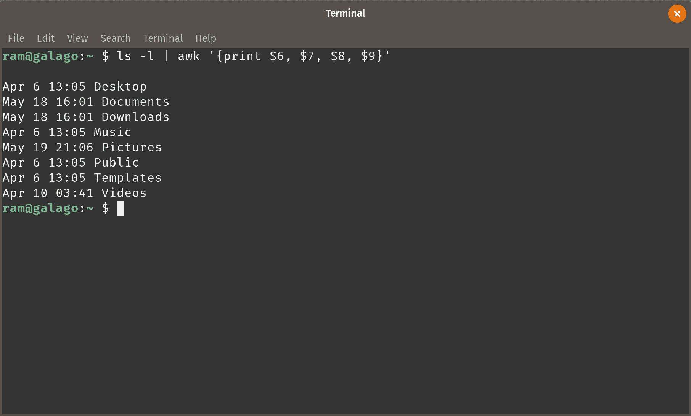

1.  接下来，让我们在 PowerShell 中也获取相同的信息。

```
Get-ChildItem | select LastWriteTime, Name
```

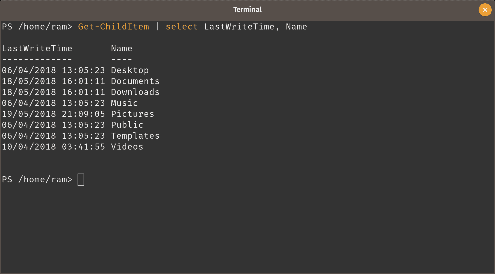

如果你注意到的话，在这两种情况下，输出是非常相似的，然而在 PowerShell 中，你还可以看到列的名称，这意味着你不需要再查找额外的文档。而且，在 PowerShell 中选择列的操作更简单，无需文本操作。另一方面，在 Bash 中，我们使用`awk`命令来操作文本输出。

1.  让我们进一步操作，创建一个名字中带空格的子目录。

```
$ mkdir 'test subdirectory'
$ ls -l | awk '{print $6, $7, $8, $9}'
```

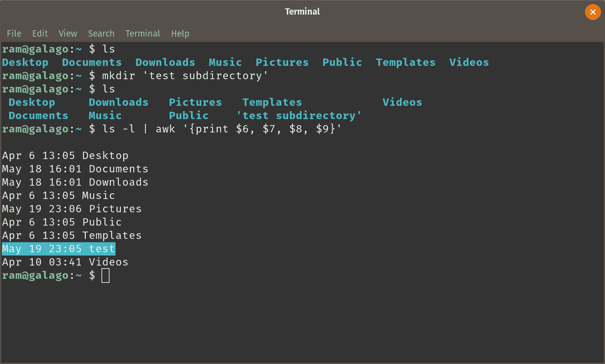

注意，原本应该是`test subdirectory`的部分，显示为`test`。

# 如何运作...

PowerShell 从文件系统中读取内容时是作为对象处理，而不是作为文本。因此，你可以直接选择所需的列（或者稍后我们将看到的属性）。而 Bash 则输出文本，其中的列通过分隔符进行操作。

为了证明这一点，我们创建了一个新子目录，目录名中带有空格，我们进行了与之前相同的列选择操作，只不过这次我们没有得到新子目录的完整名称，因为目录名中包含了空格，而空格在`awk`中是一个分隔符。

比较 Bash 和 PowerShell 就像比较苹果和橘子——不仅仅是在一个方面。然而，理解它们的差异有助于我们充分利用每个工具。

# 另请参见

1.  配方：通过管道选择对象。

# 比较 Windows PowerShell 和 PowerShell

PowerShell 和 Windows PowerShell 是两个不同的实现。前者基于更大的框架——.NET Framework；后者则是基于更现代的框架——.NET Core。由于 PowerShell 的父框架是跨平台的，因此 PowerShell 也是跨平台的；而 Windows PowerShell 仅限于 Windows，但截至本章节撰写时，它的功能比 PowerShell 更强大。

本书所讨论的 PowerShell 是跨平台的 PowerShell Core，简称*PowerShell*。而特定于 Windows 的 PowerShell 称为*Windows PowerShell*。

Windows PowerShell 利用 Windows 的内部组件和架构模型，其能力通过 WinRM 和 Windows 管理工具增强。事实上，大多数差异的存在是因为 Windows 和类 Unix 操作系统之间的固有差异。

# 对 snap-ins 的支持

PowerShell 不支持传统的模块版本，称为**Snap-ins**。许多旧版的 snap-ins 已被重新打包为二进制模块，因此这不应成为大问题，因为这些模块的未来开发理论上应该可以在 PowerShell 上运行，只要二进制文件中的系统调用能够在其运行的系统上工作。例如，即使 Windows Active Directory 模块被重新打包为二进制 PowerShell 模块，它也能在 Windows PowerShell 和 Windows 上的 PowerShell 中运行，但无法在 Linux 上的 PowerShell 中运行，因为 Windows Active Directory 无法在 Linux 上运行。

# 便捷的别名

一个需要注意的重要点是，像 `ls` 和 `mkdir` 这样的命令在 Windows PowerShell 中是别名，这意味着在 Windows PowerShell 中运行 `ls` 会在后台执行 `Get-ChildItem`（Windows 上的 PowerShell 也是如此）。然而，在 Linux 中，在 PowerShell 中运行 `ls` 会运行实际的 `ls` 命令；在 Linux 上的 PowerShell 中，`ls` 不是别名，而是命令本身，其输出将是纯文本。你可以通过在 Linux 上的 PowerShell 中运行 `ls | Get-Member` 来验证这一点，并与 Windows 上的 PowerShell 以及 Windows PowerShell 进行对比。（因此，最好遵循不在脚本中使用别名的最佳实践。）

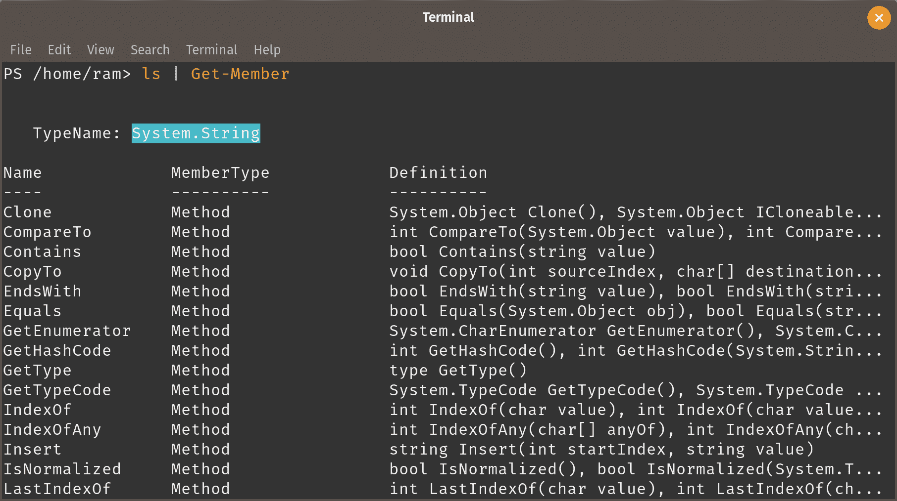

PowerShell 通过自动变量 `IsLinux`、`IsWindows` 和 `IsMacOS` 的值来判断自己运行在哪个操作系统上。在任何系统中，这些变量只有一个是 `True`。当 PowerShell 发现 `IsLinux` 为 `True` 时，它会运行 Linux 命令，而不是最初为了方便 Linux 管理员创建的别名。有关这些自动变量的更多信息，请阅读配方 *配置内建变量*。

# PowerShell 工作流

习惯于 Windows PowerShell 工作流的 Windows 管理员需要注意，PowerShell 中没有这些功能。PowerShell 工作流稍微复杂（可以这么说），用于特定场景，如需要并行运行多个 cmdlet 或活动需要在重启后继续执行。工作流是基于 Windows 工作流基础（Windows Workflow Foundation）的，而这并不跨平台。因此，PowerShell 工作流无法在 PowerShell 中运行。但请理解，这根本不是什么损失。

# PowerShell 期望状态配置

所谓的期望状态配置（Desired State Configuration，DSC）目前仍在开发中。到目前为止，DSC 资源有两个代码库：一个是由 Microsoft 的 Unix 团队管理的 Linux 版 LCM，另一个是由 PowerShell 团队编写的 Windows PowerShell 版 DSC 资源。DSC 代码库跨平台化还需要一段时间。

# 列出所有别名并用它们替代 cmdlet

别名，顾名思义，是 cmdlet 的替代名称。它们有两个目的：

1.  减少击键次数

1.  使过渡到 PowerShell 更加顺畅

传统上，别名是在 PowerShell 中创建的，以便让 Windows 和 Linux 管理员不觉得新的框架难以使用。然而，别名最好只在命令行中使用，而不是脚本中，因为有些别名在 Linux 中并不存在，并且一般来说，别名会影响可读性。（例如，要意识到 `gbp` 代表的是 `Get-PSBreakPoint`，需要有意识的努力。）

# 如何实现...

现在我们已经看过最佳实践，接下来让我们看看如何列出系统中的所有别名。正如之前所提到的，在 PowerShell 中思考非常简单。当我们知道获取任何信息的动词是 `Get`，而名词在这个例子中是 `Alias`，那么相应的 cmdlet 就是 `Get-Alias`。

1.  运行一个简单的 `Get-Command` 来查询 `Get-Alias`，我们就能知道是否确实有这个 cmdlet。

```
Get-Command Get-Alias
```

1.  现在让我们运行 `Get-Help` 来了解如何使用该 cmdlet。

```
Get-Help Get-Alias
```

如果你不确定任何命令，或者想在不使用别名的情况下减少击键次数，可以使用 tab 补全。输入部分 cmdlet 或参数，然后按 Tab 键。PowerShell 会根据你所在的平台，为你完成命令或提供建议。

1.  根据帮助文档，`Get-Alias` 的所有参数都是可选的（它们都被 `[]` 括起来）。因此，仅运行 `Get-Alias` 将列出当前 PowerShell 实例中所有可用的别名。

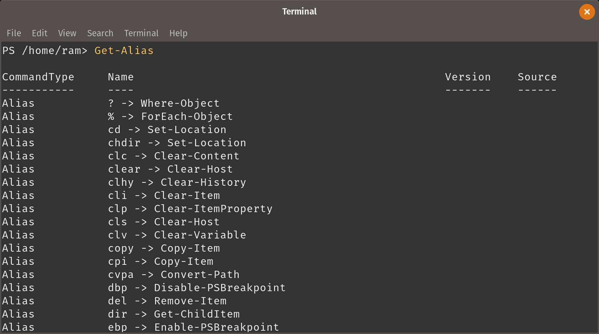

1.  现在让我们尝试解析别名`gbp`，找到它实际运行的 PowerShell cmdlet。

```
PS> Get-Alias gbp

CommandType     Name                                               Version    Source
-----------     ----                                               -------    ------
Alias           gbp -> Get-PSBreakpoint
```

1.  现在让我们看看如何做相反的操作：获取某个 cmdlet 的别名。如果你阅读此 cmdlet 的帮助文档，你会看到第二个参数集中有一个名为 `Definition` 的参数。这就是调用别名时运行的实际 PowerShell cmdlet。

```
PS /home/ram> Get-Alias -Definition Get-ChildItem

CommandType     Name                                               Version    Source
-----------     ----                                               -------    ------
Alias           dir -> Get-ChildItem                                          
Alias           gci -> Get-ChildItem
```

1.  我们可以看到两个别名作为输出，它们都在幕后运行 `Get-ChildItem`。现在我们运行 `dir` 和 `Get-ChildItem`，并比较它们的输出。

```
PS /home/ram> dir

    Directory: /home/ram

Mode                LastWriteTime         Length Name
----                -------------         ------ ----
d-----       06/04/2018     13:05                Desktop
d-----       18/05/2018     16:01                Documents
d-----       18/05/2018     16:01                Downloads
d-----       06/04/2018     13:05                Music
d-----       20/05/2018     02:17                Pictures
d-----       06/04/2018     13:05                Public
d-----       06/04/2018     13:05                Templates
d-----       10/04/2018     03:41                Videos
PS /home/ram> Get-ChildItem

    Directory: /home/ram

Mode                LastWriteTime         Length Name
----                -------------         ------ ----
d-----       06/04/2018     13:05                Desktop
d-----       18/05/2018     16:01                Documents
d-----       18/05/2018     16:01                Downloads
d-----       06/04/2018     13:05                Music
d-----       20/05/2018     02:20                Pictures
d-----       06/04/2018     13:05                Public
d-----       06/04/2018     13:05                Templates
d-----       10/04/2018     03:41                Videos
```

1.  这两个输出是相同的。现在让我们看看这些命令返回的是哪种类型的对象。

```
PS /home/ram> dir | Get-Member

   TypeName: System.IO.DirectoryInfo

Name                      MemberType     Definition
----                      ----------     ----------
LinkType                  CodeProperty   System.String LinkType{get=GetLinkType;}
Mode                      CodeProperty   System.String Mode{get=Mode;}
...
PS /home/ram> Get-ChildItem | Get-Member

   TypeName: System.IO.DirectoryInfo

Name                      MemberType     Definition
----                      ----------     ----------
LinkType                  CodeProperty   System.String LinkType{get=GetLinkType;}
Mode                      CodeProperty   System.String Mode{get=Mode;}
...
```

它们也返回了相同的对象。

# 它是如何工作的...

别名只是在 PowerShell 中的映射。短单词被映射到 PowerShell cmdlet，在每个别名的 `Definition` 属性中识别。因此，你可以使用别名代替完整的 cmdlet。别名还支持与 cmdlet 相同的参数，因为别名只是指向正确 cmdlet 的指针。

# 另见

1.  最佳实践总结

# 创建自定义别名

如前一节所见，别名只是指向实际 PowerShell cmdlet 的指针，因此，创建自定义别名只是涉及确定你希望使用的别名的单词，并将其映射到你想要调用的 PowerShell cmdlet。

# 如何操作...

1.  首先，确定你想用作别名的单词。例如，让我们考虑 `listdir`。

1.  在 PowerShell 上运行 `listdir`，确保不存在此类 cmdlet（或 Linux 命令）。

1.  通过运行以下命令列出处理别名的 cmdlet：

```
Get-Command -Noun Alias
```

请记住，PowerShell 中的名词是单数形式。因此，不会有包含 `Aliases` 的第一方 cmdlet。如果第三方模块将 `Aliases` 作为名词使用，那么它们没有遵循 PowerShell 的最佳实践，即仅使用单数名词。

1.  `New-Alias` 是我们要找的 cmdlet，因为它用于创建一个新的别名。(`Set-Alias` 用于修改已存在的别名。)

1.  通过运行以下命令，查看 `New-Alias` 的帮助文档：

```
Get-Help New-Alias
```

帮助文档指出，只有 `Name` 和 `Value` 参数是必需的。我们将仅使用这两个来创建这个简单的别名。

1.  运行以下命令以创建自定义别名：

```
New-Alias listdir Get-ChildItem
```

1.  查看别名是否按预期创建。

```
PS> Get-Alias listdir

CommandType     Name                                               Version    Source
-----------     ----                                               -------    ------
Alias           listdir -> Get-ChildItem
```

1.  另外，运行别名以查看它输出的内容。

```
PS /home/ram> listdir

    Directory: /home/ram

Mode                LastWriteTime         Length Name
----                -------------         ------ ----
d-----          4/20/18   6:36 AM                Desktop
d-----          5/10/18   1:05 PM                Documents
d-----          5/16/18  11:03 AM                Downloads
d-----          4/20/18   6:36 AM                Music
d-----           5/1/18   2:19 PM                Pictures
d-----          4/20/18   6:36 AM                Public
d-----          4/20/18   6:36 AM                Templates
d-----          4/20/18   6:36 AM                Videos
```

这就是我们熟悉的输出——`Get-ChildItem` 的输出。

默认情况下，别名是临时的。它们只在 PowerShell 会话存在时有效。为了避免每次都需要重新创建它们，你可以将这些别名导出（下一节将介绍操作步骤），并通过 PowerShell 配置文件导入它们。我们将在后面的章节中了解配置文件。

# 它是如何工作的……

如前所述，别名是指向 cmdlet 的指针。使用 `New-Alias`，你可以创建一个带有自定义名称的指针，指向你想要的 PowerShell cmdlet。这实际上是一个名称-值对。

当你在 PowerShell 中运行任何命令时，PowerShell 会检查它的 cmdlet 和别名列表（以及其他定义），以理解你在请求什么。当 PowerShell 遇到一个别名时，它会查找该别名指向的 cmdlet 并执行该 cmdlet。

# 还有更多……

你可以为别名添加更多内容，比如描述。请参考`Get-Alias`的帮助文档，看看你可以对别名做些什么。

# 另请参见

1.  配方 3.8：理解 cmdlet 和参数

1.  配方 2.8：导入/导出自定义别名以便未来使用

1.  配方 3.4：启用每次加载时自动执行命令

# 导出/导入自定义别名以便未来使用

尽管别名具有优势且被设计用来临时使用，但它们的临时性可能会带来不便。为了使别名可以重复使用，需要将其导出到文件，并在需要时再导入。这个配方将展示如何导出和导入你可能已经创建的别名。

# 准备工作

你需要先创建自定义别名，才能使此过程生效。如果你没有创建自定义别名，导出操作将仅导出默认别名，这些别名本来就在 PowerShell 中加载。

请返回上一节，创建至少一个自定义别名。

# 如何操作……

1.  确保你的自定义别名存在并正常运行。实现这一点的一种方法是获取你创建的别名的详细信息。

```
Get-Alias listdir
```

1.  将所有加载到当前会话中的别名导出到文件。

```
Export-Alias aliases.csv
```

CSV 是默认的文件类型。我们在接下来的步骤中看到的导入操作理解 CSV 并做出必要的关联。

1.  也可以将别名导出为脚本。这样，PowerShell 将创建一个脚本，其中包含每个导出别名的 `New-Alias` cmdlet。

```
Export-Alias aliases.ps1 -As Script
```

1.  查看每个文件的内容；首先是 CSV 文件，然后是脚本。

```
Get-Content ./aliases.csv
```

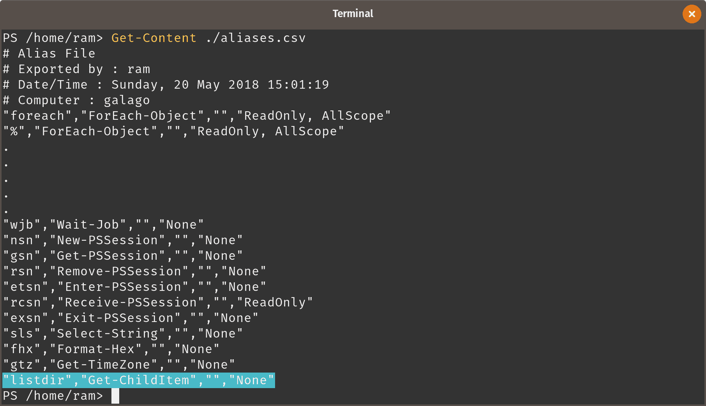

```
Get-Content ./aliases.ps1
```

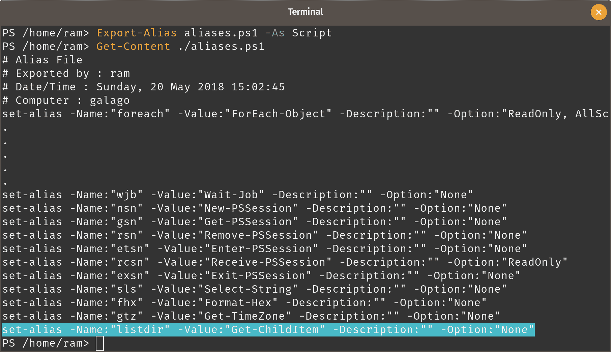

1.  可选地，编辑文件以删除除你创建的别名之外的所有别名。自定义别名可以在列表的底部找到。

本章到此为止，已完成别名导出部分。

现在，让我们将别名导入到 PowerShell 会话中。

1.  重启 PowerShell。

1.  查看你创建的别名`listdir`是否存在。

```
Get-Alias listdir
```

1.  现在，导入别名。

```
Import-Alias ./aliases.csv
```

你可能会收到多个错误，提示新别名无法创建，因为该别名已存在。处理方法有两种：第一种是从导出文件中移除默认别名（推荐），第二种是使用`-Force`参数（这可能仍会导致错误，但错误会显著减少）。

如果你将别名导出为脚本，只需调用该脚本即可。

```
./aliases.ps1
```

# 它是如何工作的...

脚本方式很简单：命令按顺序运行，别名像你手动创建它们一样在系统中创建。

使用 CSV 导入时，PowerShell 会将输入解析为名称-值对（并根据导出的内容添加其他参数），并将其添加到当前进程的别名引用中。

# 另请参见

1.  配方 3.4：为每次加载启用自动执行命令

# 列出执行策略并设置合适的策略

曾几何时，在 Windows 计算机上运行脚本是一件轻松的事。Windows 计算机极易受到远程脚本执行的攻击。随着 PowerShell 的出现，微软为用户提供了一种安全带，使用户能够控制 PowerShell 脚本的加载方式。某些特定的脚本执行模型被限制，弥补了系统中的一些漏洞。

重要的是要记住，执行策略**不是**一种安全功能。存在绕过此限制并运行脚本的方法。执行策略的目的是确保用户不会在不知情的情况下意外运行脚本。

Windows 上的 PowerShell 和 Windows PowerShell 包含此配置。默认情况下，Windows 上的 PowerShell 脚本仍然是受限制的。而在 Linux 上的 PowerShell，目前不支持此功能，并且根据社区中的互动，尚不确定该功能是否会引入到 Linux 版 PowerShell 中。

执行策略决定了允许执行脚本的类型。以下是六种执行策略（不包括默认策略）：

1.  AllSigned

1.  RemoteSigned

1.  Restricted

1.  Unrestricted

1.  Bypass

1.  Undefined

还有三个作用域：

1.  进程

1.  CurrentUser

1.  LocalMachine

执行策略和作用域的组合决定了脚本可以在哪些条件下加载。微软已经详细记录了每种策略的含义。一般来说，AllSigned 要求所有在计算机上运行的脚本都必须由受信任的证书颁发机构使用代码签名证书进行签名。如果设置了此策略，即使是你自己创建的脚本，PowerShell 也不会运行未签名的脚本。

**Restricted**是默认策略：可以运行命令，但不能运行脚本。**RemoteSigned**允许在本地计算机上创建的脚本运行。来自互联网的下载脚本无法运行。

**Bypass**类似于 Unrestricted，但用于特定场景，例如当 PowerShell 构成某个应用程序的基础时，该应用程序有其自己的安全实现。

**Unrestricted** 表示所有脚本和命令在简单确认后可以运行。**Undefined** 表示没有为特定范围定义策略。让我们通过以下教程来理解这些概念。

# 准备工作

此教程需要 Windows 环境才能运行。如果你正在运行纯 Linux 环境，无法使用此教程。你可以运行命令，但会看到在所有级别上都设置了 Unrestricted 策略。

如果你能使用一台 Windows 电脑，那么无论它是否安装了 PowerShell 或 Windows PowerShell，都可以继续进行这个教程。

# 如何操作...

通过运行 `pwsh` 或 `powershell` 打开 PowerShell 窗口。`pwsh` 命令调用 PowerShell，而 `powershell` 调用 Windows PowerShell。

Windows PowerShell 在所有现代 Windows 产品中都已预安装；而 PowerShell 则需要单独安装。请注意，当前的所有 PowerShell cmdlet 也可以在 Windows PowerShell 上运行。

1.  首先，运行 Get-Command cmdlet 以了解如何处理执行策略。

```
Get-Command -Noun Execution*
```

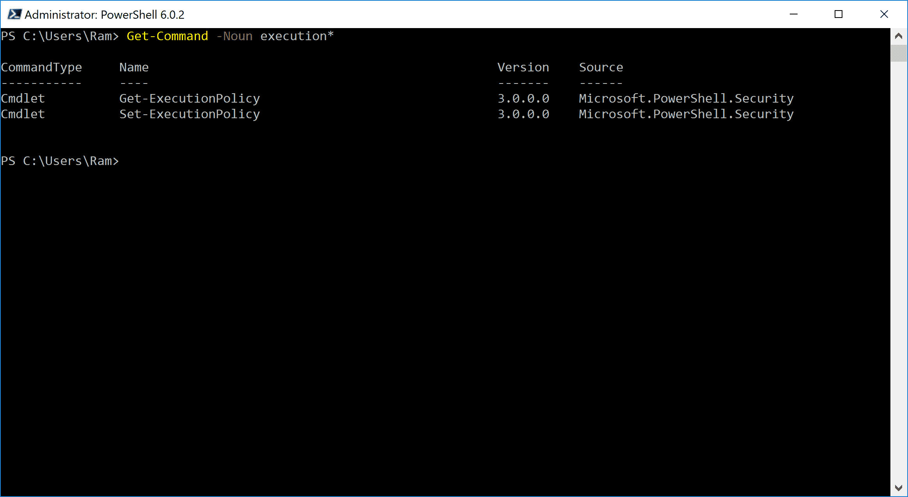

1.  现在让我们获取有关运行 cmdlet 的帮助。

```
Get-Help Get-ExecutionPolicy
```

1.  我们想知道机器上设置的执行策略，因此，我们将运行：

```
PS> Get-ExecutionPolicy
```

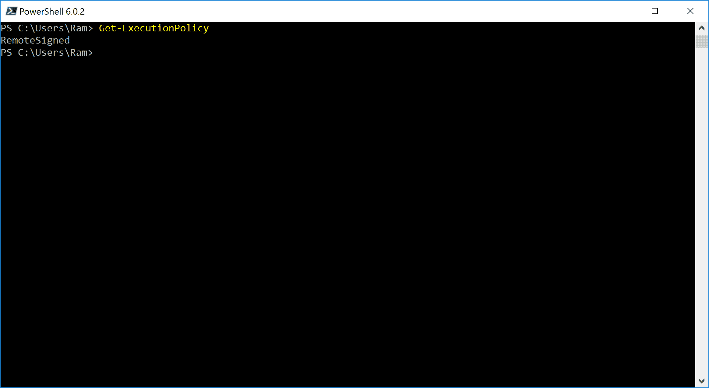

这显示当前 PowerShell 会话中生效的执行策略。

1.  要列出在不同范围内设置的策略，请运行以下命令：

```
PS> Get-ExecutionPolicy -List
```

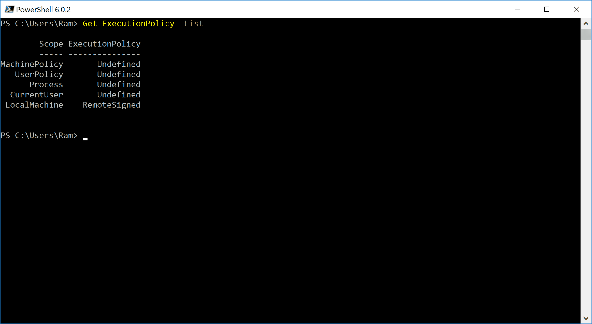

我们看到策略仅在 LocalMachine 层级设置，并且设置为 RemoteSigned，这与前一步中显示的相同。LocalUser 和 Process 范围的策略为 Undefined，这使得会话从 LocalMachine 获取执行策略。

现在让我们将本地计算机的执行策略设置为 Undefined，并查看我们的会话会如何处理。

1.  为了使其生效，关闭当前 PowerShell 会话并以管理员身份打开一个新会话。

1.  接下来，运行以下命令：

```
PS> Get-Help Set-ExecutionPolicy
```

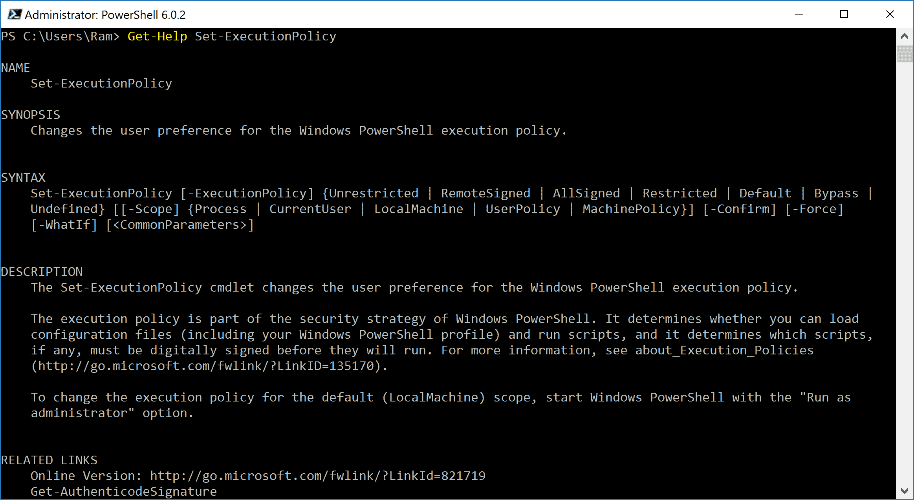

1.  帮助文档显示，ExecutionPolicy 参数的值是必需的，且 Undefined 是它所接受的有效值之一。我们希望在 LocalMachine 范围内设置策略，因此，

```
PS> Set-ExecutionPolicy Undefined -Scope LocalMachine
```

1.  现在，列出不同范围内的执行策略：

```
PS> Get-ExecutionPolicy -List
```

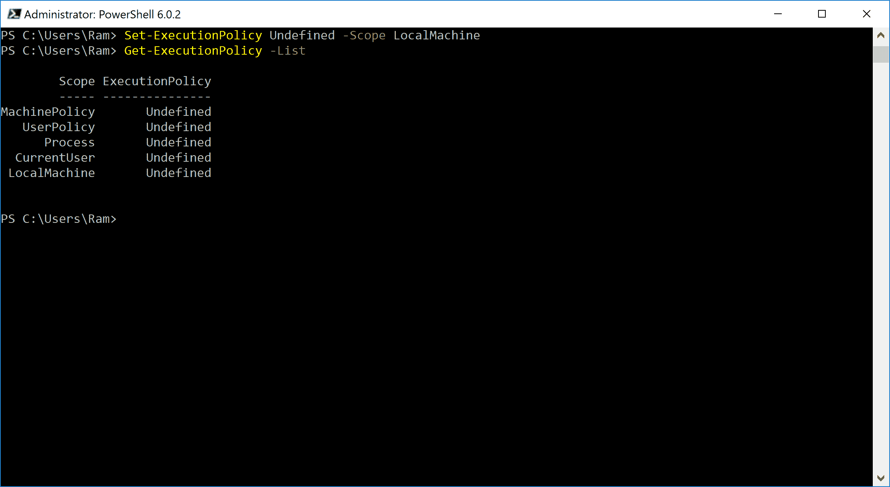

1.  现在，让我们检查当前生效的执行策略：

```
PS> Get-ExecutionPolicy
```

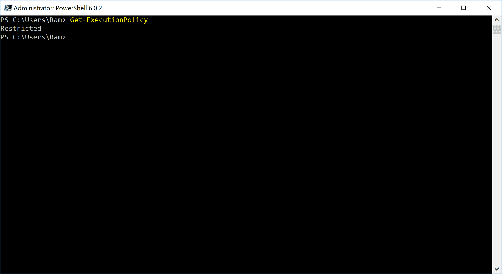

1.  现在让我们将执行策略恢复到开始教程前的状态。你可能需要根据自己在计算机上的权限调整策略。

```
PS> Set-ExecutionPolicy RemoteSigned -Scope LocalMachine
```

# 它是如何工作的...

执行策略只是为避免意外执行脚本而在系统上设置的条件。它们在不同的范围内生效。

正如之前所提到的，PowerShell 中有三种作用域。**LocalSystem** 作用域位于链条的末端。它上面是 **CurrentUser** 作用域。最上面的是 **Process** 作用域。优先级的顺序是：Process > CurrentUser > LocalMachine。因此，如果在 Process 作用域设置了除 Undefined 以外的策略，当前会话将使用在进程上设置的策略。如果是 Undefined，则会查找在 CurrentUser 作用域上设置的策略。如果 CurrentUser 也标记为 Undefined，那么会话将应用在 LocalMachine 级别上设置的策略。如果 LocalMachine 设置为 Undefined，则会话将选择默认策略，这个默认策略是基于 PowerShell 所定义的策略，具体内容可能会根据操作系统版本而有所不同。例如，在 Windows 2016 中，默认策略是 RemoteSigned。

在 CurrentUser 和 LocalMachine 级别上设置的策略会存储在 Windows 注册表中。Process 作用域上设置的策略则存储在临时环境变量 `$env:PSExecutionPolicyPreference` 中。

# 另见

1.  [执行策略简介](https://docs.microsoft.com/en-us/powershell/module/microsoft.powershell.core/about/about_execution_policies?view=powershell-6) (Microsoft)
