# 第三章：使用 PowerShell 为管理做好准备

本章内容包括以下主题：

1.  安装 Visual Studio Code

1.  配置自动变量

1.  使用变量更改 Shell 行为

1.  启用每次加载时自动执行命令

1.  自定义终端提示符

1.  理解 PowerShell 中的标准重定向

1.  从 PowerShell 调用原生 Linux 命令

1.  理解 cmdlet 和参数

1.  使用最少的按键运行 cmdlet

1.  查找参数别名

1.  调用 PowerShell 脚本

1.  Dot-sourcing PowerShell 脚本

1.  从 PowerShell 外部调用 PowerShell cmdlet

1.  记录在 PowerShell 控制台上运行的 cmdlet

# 介绍

有一个普遍的观念，认为越多使用终端（而非 GUI），效率就越高。输入命令比点击屏幕更轻松、更快捷。然而，对于刚刚开始使用终端的人来说，情况可能并非如此。随着时间的推移，管理员会越来越熟悉终端，并学会像训练有素的马一样配置终端，以提高速度和效率。此外，大多数高效的管理员喜欢自动化他们工作流的多个部分——自定义 `.bashrc` 和 Vim 脚本就是其中的例子。在本章中，我们将熟悉与 PowerShell 配合使用的不同控制台和工具，并探讨一些简单的技巧，帮助我们自定义工作空间，从而提高效率。

# 安装 Visual Studio Code

脚本可以直接在控制台上使用 Vim 进行编写。也可以使用其他编辑器如 Gedit 或 Atom 来编写 PowerShell 脚本。然而，推荐使用微软的开源代码编辑器——Visual Studio Code（或 `vscode`）。在本教程中，我们将介绍如何安装 Visual Studio Code，并将其配置为与 PowerShell 一起使用。

# 准备工作

我们将介绍在 Ubuntu 上安装 `vscode` 的步骤。如今，大多数软件库中都包含 Visual Studio Code。您可以在您的发行版的软件下载商店中查找并安装 `vscode`。如果没有，安装 `vscode` 最简单的方法是下载 `.deb`（或根据您的发行版下载 `.rpm` 包），并运行它以在计算机上安装该软件包。

# 如何操作...

安装 Visual Studio Code 非常简单。

1.  如果您的 Linux 发行版有软件商店，请在商店中搜索 Visual Studio Code。

1.  如果找到 Visual Studio Code，请从那里安装该软件包。如果没有，请继续执行下一步。

1.  Visual Studio Code 的软件包名称是 `code`。使用您的包管理器在软件库中搜索该软件包。在 Ubuntu 上，命令是：

```
$ sudo apt-cache pkgnames code
```

1.  如果您能够在您的软件库中找到该软件包，请像安装任何其他软件包一样安装 vscode。

```
$ sudo apt install code
```

1.  如果您无法找到该软件包，请访问[`code.visualstudio.com/Download`](https://code.visualstudio.com/Download)并下载适用于您发行版的正确`code`软件包。

1.  要安装 VS Code，调用你的包管理器并指定下载的包路径。

```
$ sudo apt install install code_version_arch.deb
```

1.  如果你更愿意以便携模式安装 VS Code，可以下载 VS Code 的 tar 包，并将其内容提取到一个方便的位置来运行 VS Code。但请记住，在这种情况下，VS Code 的更新将由 VS Code 自身处理。

Visual Studio Code 本身是一个强大的代码编辑器。然而，它可能无法直接完美支持 PowerShell。你需要安装一个扩展，它可以提供运行和编写 PowerShell 脚本的功能。

1.  启动 Visual Studio Code。

1.  点击扩展图标或按 `Ctrl+Shift+X` 进入扩展面板。

1.  在搜索框中输入 `powershell publisher:Microsoft`，然后按回车键搜索 PowerShell 包。

1.  点击安装，结果包中应该会显示 PowerShell 包，它会排在最上面。

1.  安装完成后，点击重新加载，以使 Visual Studio Code 加载 PowerShell 功能。

现在你已经准备好使用一个友好的编辑器来开发 PowerShell 脚本，它支持 Windows PowerShell 集成脚本环境的几乎所有功能，甚至更多！

# 工作原理...

Windows PowerShell ISE 曾是开发 PowerShell 脚本甚至 PowerShell 编写的应用程序的事实标准环境。后来，Adam Driscoll 的 PowerShell 扩展将 PowerShell 集成到了 Microsoft Visual Studio 中，成为了集成开发环境的一部分。

在 PowerShell 开发的同时，.NET 基金会成立，微软开始开发一个名为 Visual Studio Code 的轻量级代码编辑器，它包含了 Visual Studio 的许多强大功能，但没有语言库的负担。这足以构建 PowerShell 脚本；大多数 PowerShell *脚本编写者* 主要使用 IntelliSense 功能，而 Visual Studio Code 提供了这些功能。

使用包管理器来安装 VS Code 可以确保满足所有依赖项。而且，这种安装方式确保了签名密钥被添加到系统中。这样，VS Code 的更新可以通过系统来安装，例如运行 `sudo apt upgrade`。

# 另请参阅

1.  [在 Linux 上安装 Visual Studio Code](https://code.visualstudio.com/docs/setup/linux)（Microsoft 文档）

# 配置自动变量

也许没有什么比可配置性更能提高效率了。配置一个系统是将其塑造为符合你个人口味的一种方式。你是唯一知道什么对你最有效的人。因此，一个系统越可配置，它就越能根据你的需求进行调整。PowerShell 中的自动变量是 PowerShell 自定义的第一步（配置文件是另一种方法；我们稍后会讲到它们）。在本教程中，我们将列出所有的自动变量，并将其中一些配置为满足我们的需求。

# 准备就绪

阅读 *PowerShell 中列出各种提供者* 部分，了解如何在 PowerShell 中使用各种提供者。

# 如何操作...

首先，让我们列出我们所拥有的变量。这可以通过两种方式完成：

+   使用 cmdlet

+   使用提供程序

让我们先看看使用 cmdlet 列出内置于 PowerShell 的变量。

1.  打开一个终端窗口。如果已经打开了一个，重启 PowerShell。

1.  查找与变量配合使用的 cmdlet。

```
PS> Get-Command -Noun Variable
```

请记住，cmdlet 中的名词总是单数形式。因此，应该是 `Variable`，而不是 `Variables`。

1.  有五个 cmdlet 处理变量。我们希望获取一个新 PowerShell 会话中所有已存在变量的列表。让我们选择 `Get-Variable`，并获取它的帮助信息。

```
PS> Get-Help Get-Variable
```

1.  这是我们需要用来列出当前作用域中所有预定义变量的 cmdlet。

```
PS> Get-Variable
```

这样应该可以列出当前作用域中所有预定义的变量。

你定义的任何变量都会列在这里。因此，重要的是你要启动一个新的 PowerShell 会话，看看有哪些变量已经预定义。

现在，让我们使用 PowerShell 提供程序列出当前作用域中定义的变量。

1.  列出 PowerShell 提供程序。我们在前一章中已经看过提供程序。

```
PS> Get-PsProvider
```

1.  将位置更改为 `Variable:` 驱动器，这属于 `Variable` 提供程序。可以使用 `Set-Location` 完成此操作。

```
PS> Set-Location Variable:
```

1.  现在，让我们列出 `Variable:` 驱动器下所有可用的子项。

```
PS> Get-ChildItem .
```

这的输出与没有参数调用的 `Get-Variable` 完全相同。

# 它是如何工作的...

PowerShell 内建了一些控制其行为的变量，管理员可以修改其中一些以满足需求。然而，一些变量是不能修改的；它们是上下文相关的，提供了一定的灵活性（或者说模块化，根据具体情况而言）给 shell。

一个这样的例子是 `$PWD`，它包含当前目录的路径。这个变量会根据 `Set-Location` 的执行自动变化。不能显式地为这样的变量分配值；显式设置值不会对 shell 的行为产生任何影响。

另一方面，一些变量接受值，并让我们控制命令和脚本的执行。我们将在下一个食谱中看到一个示例。

# 使用变量改变 shell 行为

在前一个食谱中，我们查看了现有的变量。在这个食谱中，我们将更改其中一个变量的值，以控制 PowerShell 的行为。再次提醒，值的更改是暂时的；一旦 PowerShell 进程重启，值会被重置。

# 准备工作

阅读前一个食谱以了解哪些自动变量是预定义的。同时，启动 Visual Studio Code。按照下面的步骤启动 VS Code。

1.  打开应用程序（我使用的是 Gnome DE，使用 `Super + A` 可以显示所有应用程序）。

1.  输入 `code`。

1.  按 `` Ctrl + ` `` 启动终端。

1.  在欢迎界面点击新建文件。（或者按 `Ctrl + N`。）

1.  在 VS Code 窗口的右下角，你会看到文件类型设置为“纯文本”。点击它，你会被带到顶部的命令栏。

1.  在命令栏中输入 `powershell`。PowerShell 集成控制台会在底部打开。

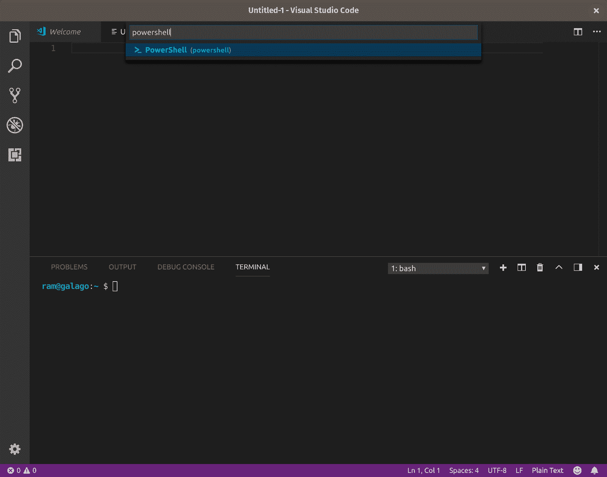

我们现在已经准备好进行配方操作了。

# 怎么做…

1.  让我们运行一个会导致错误的命令。暂时，我们不关注命令的语法；我们现在的唯一目标是生成一个错误。在脚本窗口的第一行，输入：

```
Get-ChildItem /home/ram/random-directory
Write-Host "Hello world!"
```

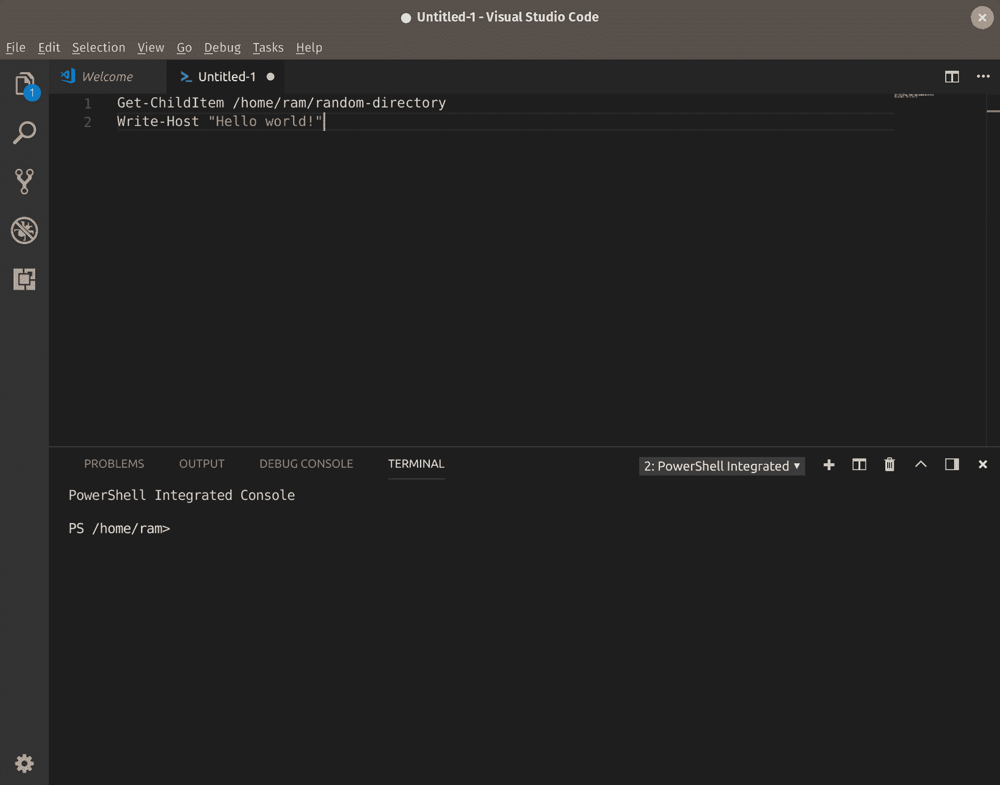

1.  使用 `F5` 键运行这段两行脚本。

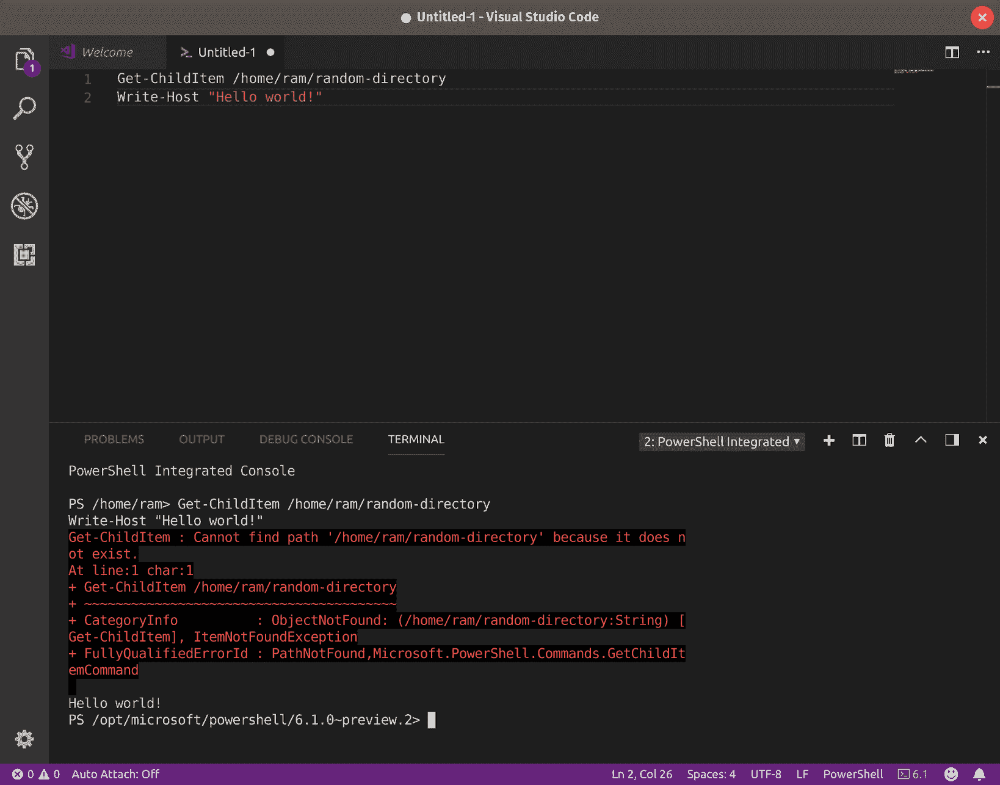

PowerShell 会提示显示错误。它还会显示 `Hello world!` 字符串。

1.  现在，让我们使用 `ErrorActionPreference` 变量设置错误操作偏好。我们从前面的配方中知道有这个变量。不过，首先，重新启动 PowerShell。最简单的方法是点击集成控制台窗口顶部的小垃圾桶图标。当 VS Code 提示是否要重新启动会话时，点击“是”。

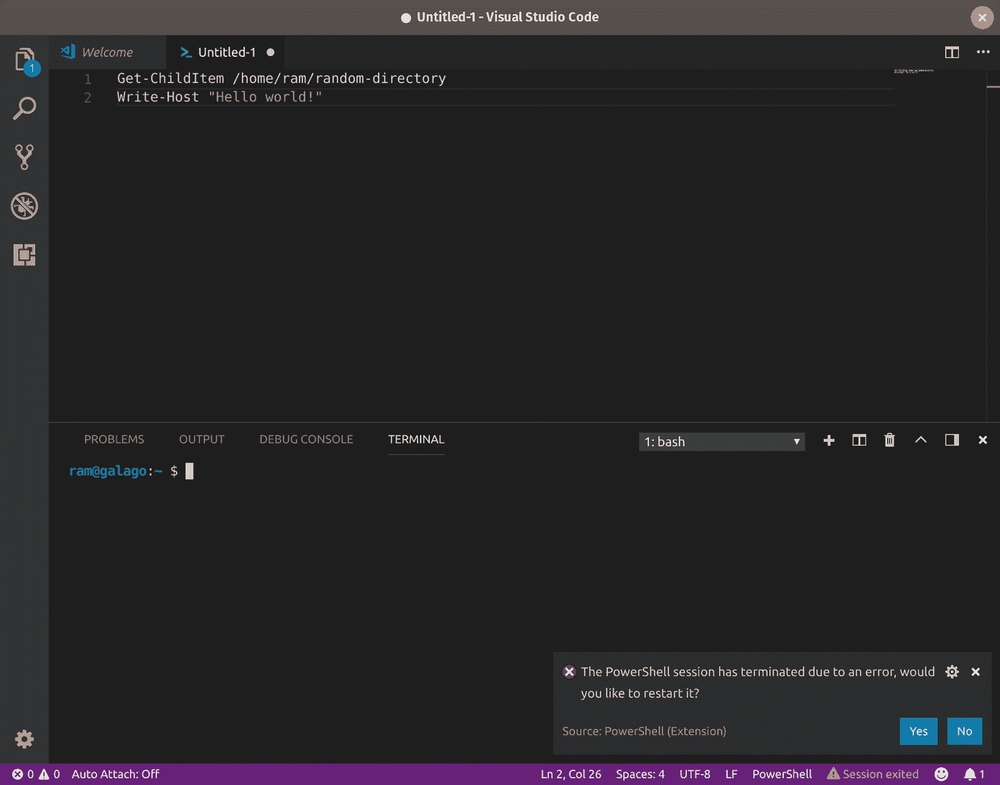

1.  现在，设置 `ErrorActionPreference` 变量。在 PowerShell 集成控制台中，输入：

```
PS> Set-Variable ErrorActionPreference SilentlyContinue
```

1.  再次运行这段两行的脚本。

这次没有错误。我们在控制台看到 `Hello world!`。

如果你不希望整个脚本出现在提示符中，可以让脚本的第一行是 `Clear-Host`；这样就会在显示输出之前清除屏幕。

1.  如果你想检查是否生成了错误怎么办？我们检查自动变量 `Error` 的值。

```
PS> Get-Variable Error
```

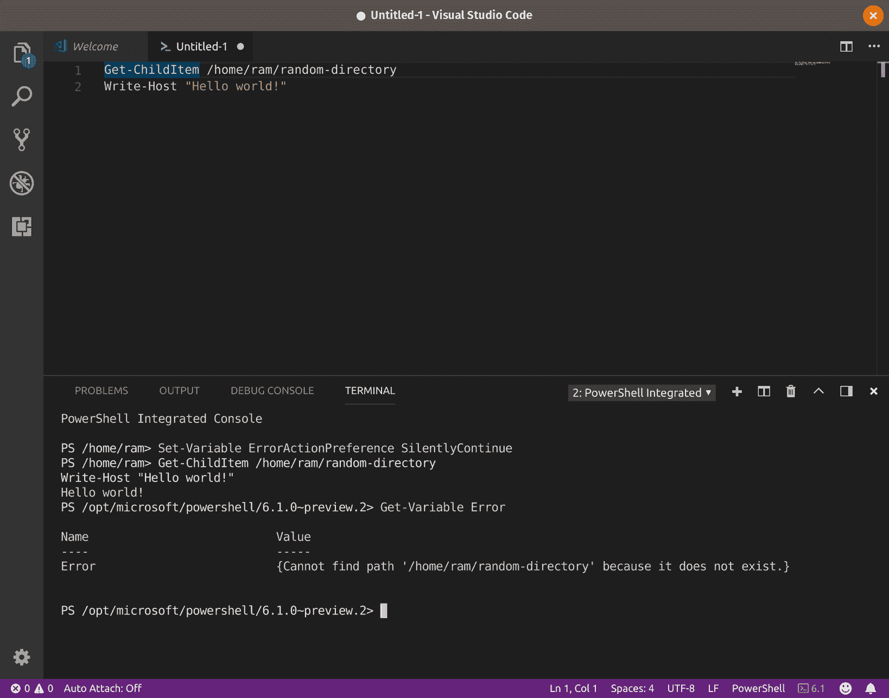

1.  `Value` 列包含一些文本。让我们选择并展开 `Value` 的内容。

```
Get-Variable Error | Select-Object -ExpandProperty Value
```

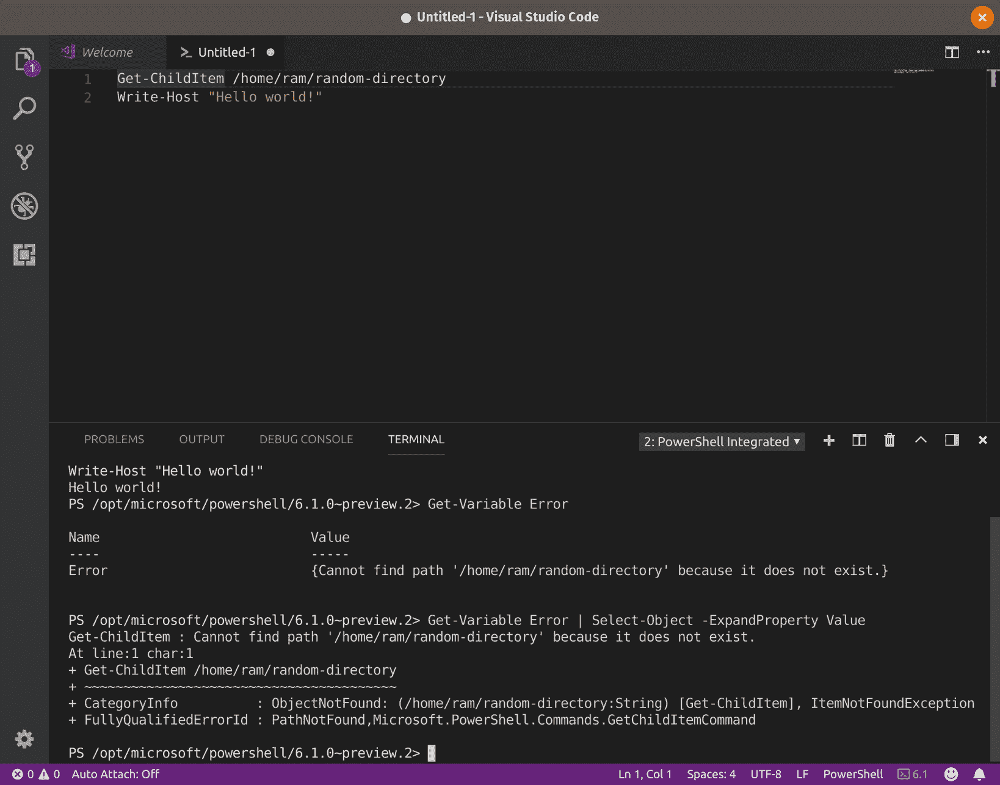

输出文本与我们设置错误操作偏好之前收到的结果相同。

你也可以直接调用 `Error` 变量来读取当前会话中发生的所有错误。

# 它是如何工作的…

默认情况下，错误操作偏好为 `Continue`，这意味着 PowerShell 会显示错误，并继续执行脚本的其余部分（在运行单个命令时，这种效果不明显，因此才创建了两行或三行的脚本，假如你在顶部加了 `Clear-Host`）。通过将 `ErrorActionPreference` 设置为 `SilentlyContinue`，我们指示 PowerShell 记录错误，但不在屏幕上显示，同时继续执行脚本的其余部分。

# 另请参阅

1.  [about_Preference_Variables, $ErrorActionPreference](https://docs.microsoft.com/en-us/powershell/module/microsoft.powershell.core/about/about_preference_variables?view=powershell-6#erroractionpreference)（Microsoft 文档）

1.  配方：PowerShell 中的错误处理

# 启用每次加载时自动执行命令

就像我们在之前的示例中看到的，这些更改是暂时性的；它们只会在会话处于活动状态时有效。可能会出现管理员需要运行一些命令或加载模块以提高工作效率的情况。例如，我通常会加载一系列帮助我管理 Microsoft Exchange、Active Directory、VMware vSphere 基础设施、Citrix XenApp、Microsoft System Center 以及其他环境的模块，所有这些操作都使用 PowerShell 完成。

如果你观察，你会发现这些产品加载模块、snap-in 和脚本的方式不同，且许多产品每次加载模块时都需要特定的配置（比如以管理员身份连接到虚拟机服务器）。这些都可以通过 PowerShell 配置文件来完成。

# 准备工作

PowerShell 在安装时默认不会创建配置文件。它只会使用默认配置运行。要覆盖此配置，你需要创建并修改配置文件。

1.  打开一个 PowerShell 控制台。（你可以在终端中运行 `pwsh` 或使用 VS Code 控制台。这个示例使用的是终端。）

1.  显示你的配置文件路径。为此，只需调用自动变量。

```
PS> $PROFILE
```

1.  检查你的配置文件是否存在。

```
PS> Test-Path $PROFILE
```

1.  如果你得到的响应是 True，你可以继续执行该示例。如果响应是 False（这通常是默认情况），请运行以下命令：

```
PS> New-Item $PROFILE -ItemType File
```

1.  你可能会收到一个错误，提示未找到路径的一部分。这是因为你的 `~/.config/` 目录默认情况下不包含 `powershell` 目录。添加 `-Force` 参数会创建这个目录，并在该位置创建你的配置文件。

```
PS> New-Item $PROFILE -ItemType File -Force
```

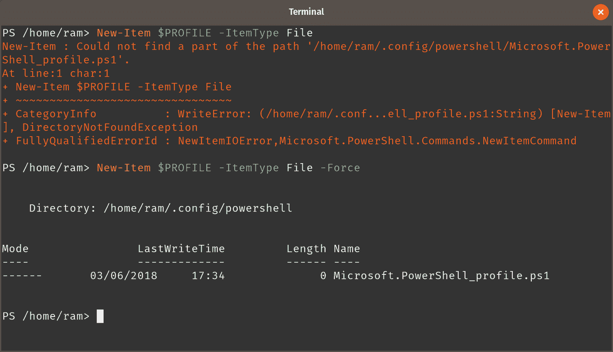

1.  现在我们将在 VS Code 中编辑配置文件。在终端中输入：

```
PS> code $PROFILE
```

# 如何操作...

现在你的配置文件应该已经打开，当前为空。接下来，我们将自定义 PowerShell 的错误操作行为。记住，我们之前在终端中将 `ErrorActionPreference` 设置为 `SilentlyContinue` 是临时的。现在，我们将确保每次启动 PowerShell 时，`ErrorActionPreference` 都会永久设置为 `SilentlyContinue`。

1.  切换到终端窗口。如果你自上一个示例以来仍然保持窗口打开，请重启 PowerShell。

1.  让我们看看当前的错误操作首选项是什么。

```
PS> Get-Variable ErrorActionPreference
Continue
```

1.  切换到 VS Code。配置文件应该已经打开，可以进行编辑。

1.  在第一行，输入：

```
PS> Set-Variable ErrorAction SilentlyContinue
```

1.  保存配置文件并关闭该文件。

1.  在终端中，输入 `exit` 退出 PowerShell。然后重新启动 PowerShell。

1.  现在让我们检查一下 `ErrorActionPreference` 的值。在提示符下，输入：

```
PS> $ErrorActionPreference
SilentlyContinue
```

1.  为确保设置已生效，请输入：

```
PS> Get-ChildItem /home/ram/random-directory
```

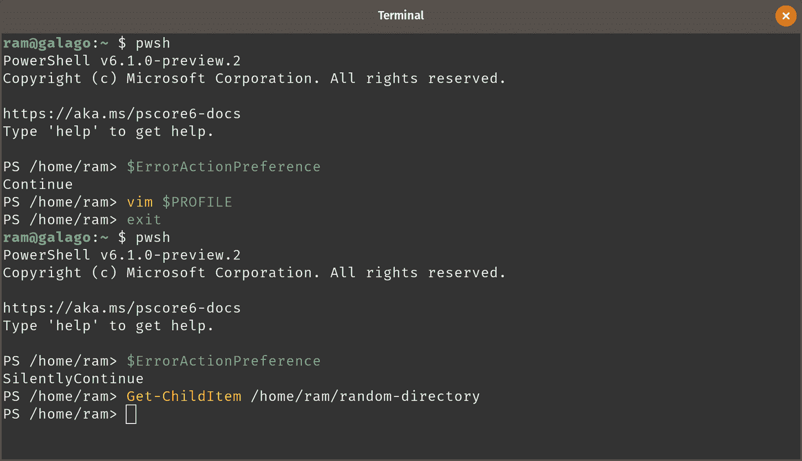

光标简单地返回到下一行的提示符，而没有抛出任何错误。

# 原理...

长话短说，PowerShell 个人资料在每次加载 PowerShell 会话时都会执行。这个个人资料是一个 PowerShell 脚本文件，可以包含一系列命令和函数，这些命令和函数会像其他脚本一样执行。

需要记住的一个重要点是，每个主机都有不同的个人资料。例如，PowerShell 在终端上加载时有一个单独的个人资料，而 VS Code 中的集成终端则有一个不同的个人资料。这是因为每个终端的性质不同。

PowerShell 在 Linux 上尚未实现执行策略。如果 PowerShell 在未来在 Linux 上获得了安全性设置，则应设置执行策略为允许执行脚本，以便加载个人资料。

# 还有更多……

设置全局操作首选项是不好的做法。清空个人资料以移除错误操作首选项。由于个人资料中没有其他内容，你甚至可以使用以下命令删除个人资料：

```
 Remove-Item $PROFILE
```

阅读最佳实践以获取更多信息。

# 自定义终端提示符

在上一个示例中，我们使用个人资料自定义了错误操作首选项。我们使用了已经演示过的命令，展示了可以在 PowerShell 控制台中运行的命令同样也可以添加到个人资料中，这也是一种自动化执行一组命令的方式，从而提高生产力。

现在，我们将进行下一步，定制我们的控制台提示符。理论上，选项是无穷无尽的；这个示例只是 PowerShell 灵活性如何的另一个演示。

# 准备工作

本示例需要 VS Code。如果你没有按照上一个示例进行，请按照上一个示例中 *准备工作* 部分的步骤创建 PowerShell 个人资料，这次在 VS Code 的 PowerShell 集成控制台中运行命令。

# 如何做……

确保个人资料是空的。如果你刚刚创建了个人资料，可以直接继续。如果不是，请清空个人资料中的所有内容。如果个人资料中设置了错误操作首选项，将来你创建的脚本会很难进行故障排除。

1.  在主窗口中输入以下内容。

```
function prompt {
  $Location = (Get-Location).Path.ToString()
  switch -Wildcard ($Location) {
    "/home/$env:USERNAME" { $Location = '~'; break }
    "/home/$env:USERNAME/Documents" { $Location = 'Documents'; break }
    "/home/$env:USERNAME/Downloads" { $Location = 'Downloads'; break }
    "/home/$env:USERNAME/Pictures" { $Location = 'Pictures'; break }
    "/home/$env:USERNAME/Videos" { $Location = 'Videos'; break }
    "/home/$env:USERNAME/Music" { $Location = 'Music'; break }
    "/home/$env:USERNAME/Documents/code" { $Location = 'Code'; break }
    "/home/$env:USERNAME/*" { $Location = $Location.Replace("/home/$env:USERNAME/", '~/'); break }
    Default { }
  }
  Write-Host "PS " -NoNewline
  Write-Host `
    ($($env:USERNAME) + "@" + "$([System.Net.Dns]::GetHostByName((hostname)).HostName) ") `
    -NoNewLine -ForegroundColor Cyan
  Write-Host "$Location" -NoNewline -ForegroundColor Green
  Write-Host ("`n> ") -NoNewline
  return " "
}
```

1.  保存个人资料脚本文件。

1.  点击集成控制台顶部的小垃圾桶图标以结束当前的 PowerShell 会话。

1.  当 VS Code 提示你是否想要重新启动会话时，点击“是”。

你的提示应该如下图所示。

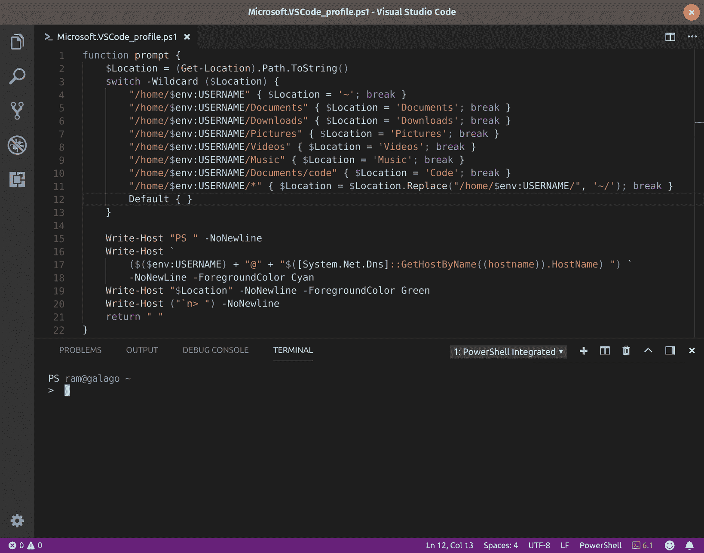

# 它是如何工作的……

提示由一个名为`prompt`的函数控制。为了演示这一点，我们可以使用：

```
Get-Command prompt
```

输出显示确实有这样的命令，其类型为`Function`。要查看`prompt`函数的内容，请输入：

```
PS> (Get-Command prompt).ScriptBlock
```

输出显示了你刚刚编写的整个函数。但这其实是覆盖了默认 `prompt` 函数的那个函数。如果你清除配置文件，重新启动 PowerShell 会话，并输入上述命令，你将看到一个简单的三行输出，那就是默认的 `prompt` 函数。

现在来解析我们编写的函数：

首先，声明你即将编写的函数。使用关键字 `function`，后跟函数的名称。由于我们想要处理提示符，所以使用现有的函数名称以覆盖默认的功能。接下来的内容是脚本块，它以 `{` 开始。

我们希望位置能出现在提示符中。显而易见，这是必须包含的信息。

如果你注意到，PowerShell 在提示符处显示了完整的 Home 路径。虽然这样可以工作，但我们习惯于用波浪符（~）表示 Home。此外，我知道 Documents、Music 和其他文件夹位于我的 Home 文件夹中，我更愿意在提示符处只显示文件夹的名称。这就需要一些文本操作。因此，我将当前路径赋值给一个变量，`$Location`。

接下来，我们执行一个 switch-case 操作，并得到要在提示符中显示的值。现在先不担心语法问题，我们将在后续章节中详细讲解每一个。

然后，我们使用几个 `Write-Host` 语句来构造提示符文本。`-NoNewLine` 参数确保每个语句的内容不会跳到下一行。当我们需要换行时，会显式添加 `` `n ``。

如果你想在脚本中断开一行较长的代码，请在希望换行的地方使用反引号（`` ` ``）字符，并按回车键进行换行。PowerShell 会将含有反引号的那一行与紧随其后的那一行视为同一行。同样，如果你希望在同一行编写两条语句，可以在第一条语句末尾使用分号（`;`），然后用空格继续写第二条语句。PowerShell 会将这两条语句视为独立的语句，就像普通英语中的两个句子一样。

由于 `Write-Host` 只是将文本发送到主机，并不会返回任何内容，因此我们向函数中添加一个返回语句，仅返回一个空格。

当我们重新加载 PowerShell 集成控制台时，配置文件被加载，这时，配置文件中的自定义 `prompt` 函数会覆盖默认的 `prompt` 函数，并呈现我们定义的漂亮提示符。

# 还有更多内容…

现在，先尝试修改 `Write-Host` 语句的序列和内容，以自定义你的提示符。等我们对 PowerShell 的语法熟悉后，应该能够进一步自定义配置文件。

# 另见

1.  [about_Prompts](https://docs.microsoft.com/en-us/powershell/module/microsoft.powershell.core/about/about_prompts?view=powershell-6)（Microsoft 文档）

# 理解 PowerShell 中的标准重定向

当我第一次开始使用命令行界面时，`<`、`>` 和 `>>` 让我感到很困惑。然后，我完全停止使用命令行界面，转而回到了 Windows 管理员的方式，尽管在用键盘快捷键的频率上，达到了非同寻常的程度（这全是为了速度和效率！）。

当 PowerShell 出现时，我已经忘记了那些操作符；我直接去理解对象和管道的概念，并且这样工作了多年。转到 Linux 后，我想了解在终端中使用“Linux 方式”。这些操作符再次回到了我的面前。我干脆在 Linux 上安装了 PowerShell。

PowerShell 中的重定向主要依赖于流。流的概念会在其他章节中讨论。现在，我们坚持使用默认流，即 `Success`。

本操作涵盖了不同的、简单的重定向方法，帮助完成基本的管理任务。我们将在理解错误处理的概念时再回到流的部分。

在我们开始之前，首先要理解，PowerShell 在重定向方面与 Bash 非常不同，尽管它有一些小的相似性；这些相似性足以让你不会离开，而是欣赏对象模型的灵活性和使用的一致性。

# 如何做……

在这个操作中，我们将执行四个活动：

1.  将输出重定向到文件

1.  将另一个输出追加到同一个文件中

1.  将命令的输出发送到控制台和文件中

1.  将一个命令的输入接受到另一个命令中

除了我们在前两个活动中使用的操作符外，我们还将查看这些操作符的 cmdlet 等价物。

1.  列出当前在你计算机上运行的所有进程。

```
PS> Get-Process
```

1.  输出显示在控制台上。现在，让我们将内容重定向到文件中。

```
PS> Get-Process > processes.txt
```

1.  列出文件的内容。

```
PS> Get-Content ./processes.txt
```

1.  现在，让我们将日期和时间戳追加到文件中。

```
PS> Get-Date >> ./processes.txt
```

1.  现在读取文件的内容。

```
PS> Get-Content ./processes.txt
```

你会看到文件现在包含了系统中所有正在运行的进程的列表，以及时间戳。时间戳被*追加*到文件中了。

使用*PowerShell 方式*时，可以通过 `Out-File` cmdlet 实现相同的结果。（`Out-File` 具有更多功能，如设置编码和换行控制。）让我们使用 `Out-File` cmdlet 完成相同的任务。在继续之前，你可能需要删除 `processes.txt` 文件。

1.  现在让我们再次列出当前运行的进程，并使用 `Out-File` 将输出发送到文件中。

```
PS> Get-Process | Out-File processes.txt
```

1.  现在，让我们将时间戳追加到文件中。

```
PS> Get-Date | Out-File processes.txt -Append
```

如果你注意到，`Get-Process` 和 `Get-Date` 的输出直接进入了文件；没有任何内容显示在主机上。

如果我们想同时在控制台上显示输出并将内容发送到文件，我们只需使用 `Tee-Object` 替代 `Out-File`。如果你愿意，可以再次删除文件 `processes.txt`。

1.  运行以下命令。

```
PS> Get-Process | Tee-Object ./processes.txt
```

运行的进程列表应该会显示在终端上。

1.  检查文件`processes.txt`的内容。

```
PS /home/ram> Get-Content ./processes.txt
```

正如你所看到的，进程列表也出现在了文本文件中。

现在，让我们继续学习如何让 cmdlet 接受来自文件的输入。Linux 管理员习惯于让命令接受来自文件的输入，如下所示：

```
$ command < input_file.txt
```

该命令接受来自`input_file.txt`的输入，并对输入内容执行操作。

在 PowerShell 中，这些操作通过`Get-Content`和管道符（`|`）来处理。PowerShell 中接受来自文件输入的命令等价物是：

```
PS> Get-Content input_file.txt | command
```

对于那些不熟悉 PowerShell 的人来说，这可能看起来反过来了。让我们将过程分解成几部分，并试着更好地理解它。例如，假设你有一个名为`input.txt`的文本文件，其中列出了多个文件。

1.  展示文本文件的内容。

```
PS> Get-Content input.txt
```

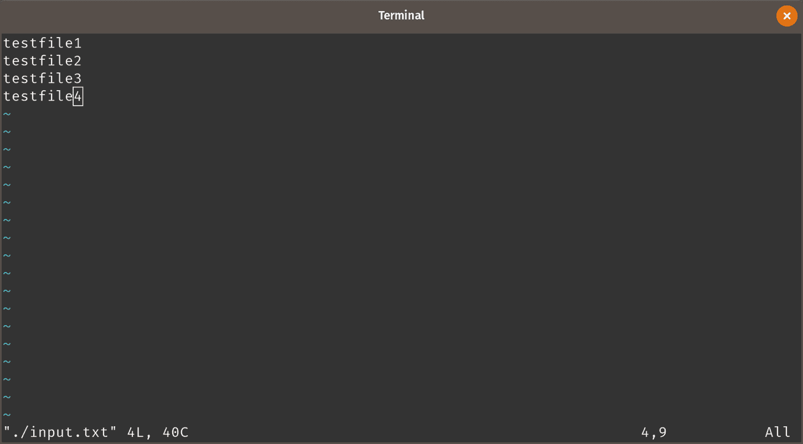

1.  列出当前目录中的内容。

```
$ ls
```

我们在当前目录下有五个测试文件，其中四个在列表中（即输入文件）。假设你希望从目录中删除输入文件中列出的文件。

1.  通过管道将`Get-Content`的输出传递给命令`Remove-Item`。

```
PS> Get-Content input.txt | Remove-Item
```

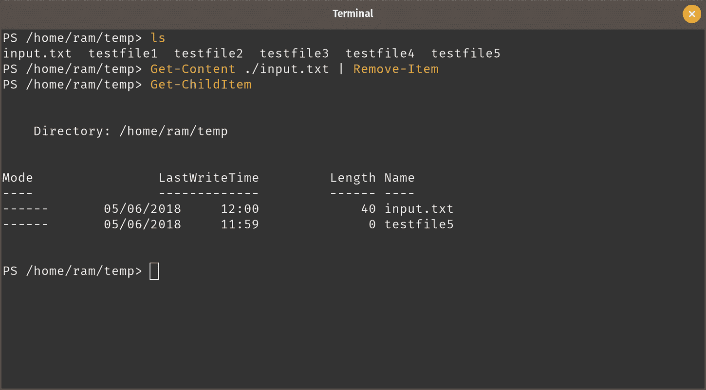

1.  列出当前目录中存在的文件。

```
PS> Get-ChildItem .
```

看！如果你比较`ls`（之前）和`Get-ChildItem`（之后）的输出，你会发现文本文件中列出的文件不再存在了。

# 它是如何工作的...

在这个教程中，我们旨在理解 Bash 和 PowerShell 之间的相似之处。尽管 PowerShell 在本质上与 Bash 不同，但它确实有一些与 Bash 相似的地方。正如我们看到的那样，这些相似之处包括将内容传递到文件和向文件追加内容。

我们在本教程中介绍了三个 cmdlet，其中一个被使用了两次。

# Out-File

熟悉 Bash 的人通常使用`>`将输出发送到文件，使用`>>`将输出追加到已有文件。在 PowerShell 中，我们使用`Out-File` cmdlet。我们运行一个将输出发送到标准输出的命令，并通过管道将输出重定向到`Out-File`，由它负责将输出写入文件。通常，`Out-File`用于将内容发送到文本文件。

当需要将内容追加到文件时，我们使用`-Append`开关与`Out-File`配合使用。这样，如果正在写入的文件已经包含内容，新的内容就不会覆盖原有内容（覆盖内容是`Out-File`的默认行为）。

# Tee-Object

有时候你需要将内容发送到文件，并同时在控制台上显示该内容。这可以通过简单地调用`Tee-Object`来实现。`Tee-Object`像字母 T 一样，除了将内容发送到文件或变量，它还将内容传递到管道中。如果`Tee-Object`是语句中的最后一个 cmdlet，那么管道的输出会发送到标准输出，这通常是主机（或者换句话说，默认是控制台）。

在我们的配方中，我们将第一部分输出发送到文件 `processes.txt`，第二部分输出没有通过管道传递。因此，`Tee-Object` 捕捉到了标准输出。

# 接受来自文件的输入

在 PowerShell 中，这个过程与 Bash 有显著的不同。在 Bash 中，我们先调用命令，然后让它接受来自文件的输入。在 PowerShell 中，我们先让 PowerShell 读取输入文件的内容，然后通过管道将输出发送到接受输入的命令。

在我们的配方中，我们读取了文件 `input.txt` 的内容，它包含了四个文件名的列表。我们使用 `Get-Content` 来读取文件内容。`Get-Content` 最初将输出发送到标准输出，显示文件的内容。然后我们加了一个管道，告诉 PowerShell 需要进一步处理，然后在命令链中加入了 `Remove-Item`。(`Remove-Item` 删除项，可以是目录、文件或链接。)

正如我们在本章后面将看到的，`Remove-Item` 的第一个参数（位置参数，第 1 位）是 `Path`，它也是通过管道接受输入的参数。有关更多信息，请运行以下命令并阅读 `Remove-Item` 的 `Path` 参数。

```
PS> Get-Help Remove-Item -Parameter Path
```

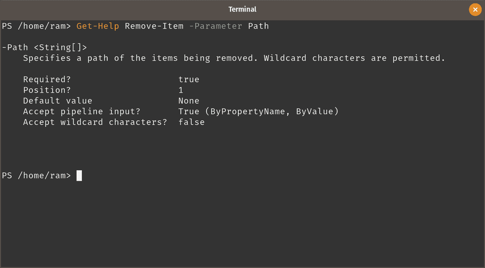

# 还有更多…

如果你是喜欢保持目录整洁的人，请清理我们为此配方创建的内容！如果以后需要更多的文件或目录，我们会根据需要创建它们。

# 另请参见

1.  配方 3.8：理解 cmdlet 和参数

1.  配方 1.6：查找特定于参数的帮助信息

# 从 PowerShell 调用本地 Linux 命令

在本章中，*介绍核心及其功能*，我们看到本地 Linux 命令在 Linux 上的 PowerShell 中并不是方便的别名，而是命令本身。在这个配方中，我们将演示如何在 PowerShell 提示符下使用 Linux 命令。记得我们在配方 *比较 Bash 和 PowerShell 输出* 中，如何使用 Bash 终端运行命令 `ls -l` 和 `awk` 来列出目录的内容，并将输出中的列分开吗？我们将不使用任何 PowerShell cmdlet，在 PowerShell 中执行同样的操作，操作对象是主目录。

# 开始使用

建议你使用一台安装了 PowerShell 的 Windows PC（Windows PowerShell 也可以），以便比较输出并查看是否遇到任何错误。

# 如何实现...

1.  在 PowerShell 提示符下，键入以下命令以列出目录内容。

```
PS> ls -l
```

你会看到熟悉的输出（如果你的终端模拟器为文件名使用颜色，输出将没有颜色）。

1.  现在让我们看看输出的 .NET 类型名称。为此，我们需要使用 `Get-Member` cmdlet。

```
PS> ls -l | Get-Member
```

PowerShell 显示 `TypeName: System.String`，这与我们在前述配方中看到的结果一致。

1.  如果你有一台带有 PowerShell（或 Windows PowerShell）的 Windows PC，运行相同的命令。

```
PS> ls -l | Get-Member
```

注意这里的 .NET 类型名称；它是 `System.IO.DirectoryInfo`，如果你稍微滚动控制台，你还会看到 `System.IO.FileInfo`。

1.  接下来，在 Windows 上的 PowerShell（或 Windows PowerShell）提示符下，键入：

```
PS> ls -l
```

你会收到一个错误，提示没有为参数 `LiteralPath` 提供值。

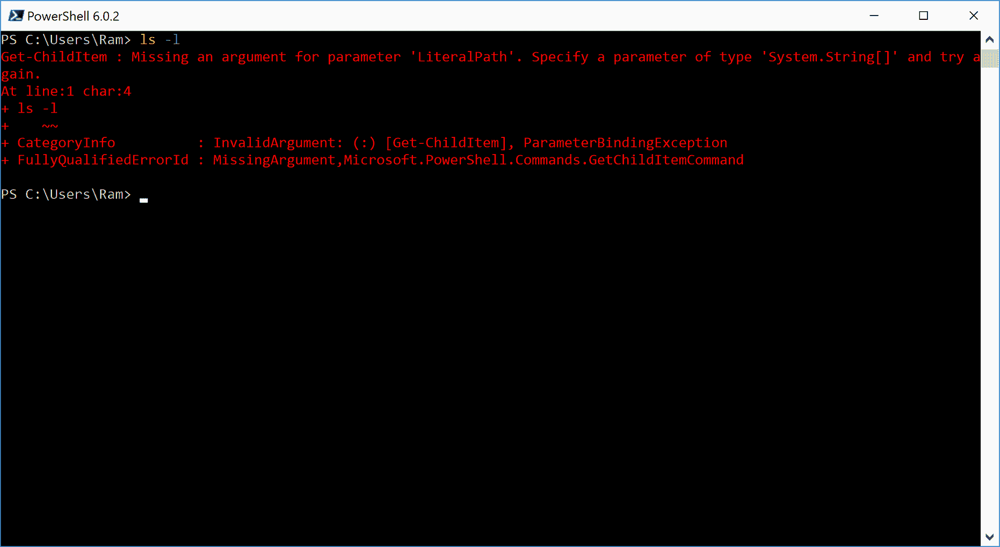

1.  在 Windows PC 的 PowerShell 提示符下，键入以下内容并按下 Tab 键，而不是 Enter 键。

```
PS> ls -l
```

你会看到参数名称被补全为 `LiteralPath`。

1.  按下 Esc 键清除命令行。

1.  回到 Linux，在 PowerShell 提示符下，键入以下内容并按下 Tab 键：

```
PS> ls -l
```

1.  什么也没有发生。现在，输入以下内容并按下 Tab 键：

```
PS> Get-ChildItem -l
```

参数名称被补全为 `-LiteralPath`。让我们再进一步，完成这个过程。

1.  在 Windows 上的 PowerShell 提示符下，运行以下命令。

```
PS> Get-Alias ls
```

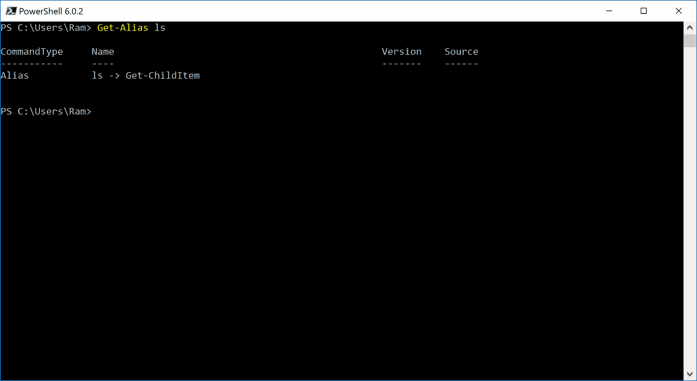

1.  切换回 Linux 并运行相同的命令。

```
PS> Get-Alias ls
```

你会收到一个错误，提示没有这样的别名。

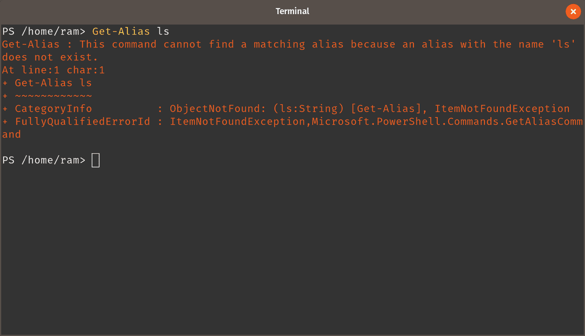

# 它是如何工作的...

当我们在 Linux 上的 PowerShell 上运行任何 Linux 命令时，PowerShell 不会调用为 Linux 管理员创建的便利别名，这些别名是在 Windows PowerShell 启动时为 Linux 管理员的便利而创建的；这些便利别名没有包含在 Linux 上的 PowerShell 中。PowerShell 会运行实际的 Linux 命令，并在控制台上显示输出。将输出管道传输到其他 Linux 命令的工作方式与在 Bash 上运行时相同。

第一点需要注意的是，`ls -l` 是 Linux 中的一个实际命令，它会以表格格式返回当前目录中的文件和目录列表。当在 Windows 的 PowerShell 上运行相同的命令时，我们会收到一个错误，因为 PowerShell 在 Windows 上将 `ls` 解释为 `Get-ChildItem`，并将 `-l` 解释为不完整但确定的 `-LiteralPath` 调用，返回一个错误，说明没有指定字面路径。

当我们在两个操作系统上对 `ls` 运行 `Get-Alias` 时，Linux 上的 PowerShell 会返回一个错误，而 Windows 上的 PowerShell 会显示底层的 PowerShell cmdlet。

另一个证实这一事实的点是，`ls` 的输出在 Windows 上的 PowerShell 中是字符串，而不是系统对象。当在 Windows 上的 PowerShell 中运行相同的 `ls` 时，PowerShell 会在后台调用 `Get-ChildItem`，显示的输出就是 `Get-ChildItem` 的输出。这可以通过 `Get-Member` 输出中的类型名称得到支持，该名称来自 `System.IO` 命名空间。另一方面，在 Linux 上，运行 `Get-Member` 获取 `ls` 输出时，返回的仅是 `System.String`。

# 另见

1.  [关于别名](https://docs.microsoft.com/en-us/powershell/module/microsoft.powershell.core/about/about_aliases?view=powershell-6)（Microsoft 文档）

# 理解 cmdlet 和参数

我们的大部分脚本编写和管理工作将围绕着运行 cmdlet 并将它们串联起来进行。在某些情况下，我们运行一个 cmdlet 时，期待它按某种方式工作，但却发现它抛出了错误，或者更糟的是，做了某些我们不希望它做的事情。

获取 cmdlet 按预期工作的方法是消除歧义。在本教程中，我们将学习如何在特定上下文中有效构建命令。

# 准备工作

阅读第一章的帮助部分，*安装、参考和帮助*。让我们理解`Get-Help`显示的帮助信息中的通知内容。

尽管这可能不是一本全面的帮助使用指南，但它应该涵盖你日常阅读帮助文档的大部分需求。其目的是向你展示符号。这些符号可能会以多种组合形式出现（例如，参数值用大括号括起来，并用方括号包围）。

| **符号** | **含义** |
| --- | --- |
| `-Parameter <DataType>` | 无方括号：必需的命名参数。必须通过名称调用该参数，并指定一个 DataType 类型的值。 |
| `[-Parameter <DataType>]` | 参数-数据类型对周围有方括号：可选参数，尽管必须通过名称调用该参数，并且必须传递一个 DataType 类型的值。 |
| `[-Parameter] <DataType>` | 参数名称周围有方括号：位置参数。你只需将一个 DataType 类型的值传递给 cmdlet，只要该值位于帮助文本中所示的参数位置。只要位置正确，参数不必按名称调用。 |
| `[[-Parameter] <DataType>]` | 参数名称周围有方括号，参数-数据类型对周围有另一对方括号：位置参数，是可选的。 |
| `-Parameter <DataType[]>` | DataType 后面有方括号：多值参数。该参数接受多个值作为输入，每对值之间用逗号分隔。 |
| `-Parameter` | 无数据类型：开关参数。调用该参数时开关为$true，不调用时使用开关的默认值。要禁用该开关，将其设置为 false，如-Parameter:$false。 |
| `-Parameter {Value1 &#124; Value2 &#124; Value3}` | 值用大括号括起来：接受预定义值作为输入的参数。在这种情况下，你可以像`-Parameter Value1`或`-Parameter Value2`一样调用该参数。换句话说，该参数不接受任意值。 |

Bash 高手注意：PowerShell 需要用逗号分隔多值参数中的值。因此，如果你想对三个文件使用`Remove-Item`，你应该输入`Remove-Item file1, file2, file3`。如果只有空格分隔这些值（如 Bash 的输入），PowerShell 会将这三个值视为三个位置参数的值，并可能会抛出错误，或者根据你调用的 cmdlet 做出你不希望的操作。

一般来说，方括号括起来的内容是可选的。大括号括起来的内容表示预定义的参数值（管道符分隔每个值）。数据类型后面跟着一对空的方括号表示该数据类型的数组。参数的位置也需要注意。

注意这个组合：`Required`为假，下面参数名称的文本中显示了默认值，位置为`1`。这意味着你只需要调用 cmdlet，它就会根据第一个参数的默认值自动运行。此处使用的例子是`Get-ChildItem`。

# 如何操作...

那是一个漫长的准备过程。现在，让我们将这些知识付诸实践。

1.  运行命令以获取当前路径下的文件和目录列表。

```
Get-ChildItem
```

1.  现在，让我们添加一个`.`来表示当前目录。

```
Get-ChildItem .
```

1.  比较最后两个命令的输出。

1.  接下来，让我们继续执行以下操作：

```
Get-ChildItem -Path .
```

输出是否与最后两个命令的输出相同？

1.  运行以下命令，并记录每个键的值：

```
PS> Get-Help Get-ChildItem -Parameter Path

-Path <String[]>
    Specifies a path to one or more locations. Wildcards are permitted. The default location is the current directory (`.`).

    Required?                    false
    Position?                    1
    Default value                Current directory
    Accept pipeline input?       True (ByPropertyName, ByValue)
    Accept wildcard characters?  true
```

1.  接下来，在当前路径下创建一个名为`file1`的文件，按名称调用该参数。

```
Get-Help New-Item

.
.
.
SYNTAX
    New-Item [[-Path] <String[]>] [-Confirm] [-Credential <PSCredential>] [-Force] [-ItemType <String>] -Name <String> [-UseTransaction] [-Value <Object>] [-WhatIf] [<CommonParameters>]

    New-Item [-Path] <String[]> [-Confirm] [-Credential <PSCredential>] [-Force] [-ItemType <String>] [-UseTransaction] [-Value <Object>] [-WhatIf] [<CommonParameters>]
```

1.  我们有两个选择：`Path`和`Name`。查找有关`Path`的信息。

```
PS> Get-Help New-Item -Parameter Path

-Path <String[]>
    Specifies the path of the location of the new item. Wildcard characters are permitted.

    You can specify the name of the new item in Name , or include it in Path .

    Required?                    true
    Position?                    0
    Default value                None
    Accept pipeline input?       True (ByPropertyName)
    Accept wildcard characters?  false
```

如果我们使用`Name`，必须按名称调用它（没有恶搞的意思）。如果不这样做，我们可以将名称作为`Path`的一部分来指定（也没有故意重复的意思）。

1.  让我们首先使用`Path`。不需要写“`-Path`”，因为它是位置参数。

```
New-Item file1
```

1.  尝试使用`Name`进行相同的操作。这次，指定参数名称。

```
New-Item -Name file2
```

1.  如果需要，可以创建一个第三个文件，通过指定`Path`的名称来创建。

```
New-Item -Path file3
```

1.  列出当前路径的内容。

```
Get-ChildItem -Path .
```

文件已存在。

1.  现在让我们删除文件。

```
Get-Help Remove-Item
```

1.  将文件名作为路径提及。

```
Remove-Item file1
```

1.  列出目录内容。

```
Get-ChildItem -Path .
```

1.  现在，让我们一次删除多个文件。此次，我们按名称调用参数。

```
Remove-Item -Path file1, file2
```

1.  现在，让我们创建一个目录。我们需要使用一个名为 ItemType 的参数，该参数具有预定义的值，具体取决于提供者（我们使用的是`FileSystem`）。

```
New-Item -Path test-dir -ItemType Directory
```

1.  这样创建三个新文件：

```
New-Item test-dir/file1, test-dir/file2 -ItemType File
New-Item test-dir/child-dir -ItemType Directory
New-Item test-dir/child-dir/file3 -ItemType File
```

1.  现在，让我们删除内容。在运行命令后，等待出现确认提示。

```
Remove-Item -Path test-dir
```

1.  阅读提示信息。它提到`Recurse`参数的一些内容。

1.  选择`L`并按回车键以中止该过程。

1.  现在，输入以下命令：

```
Remove-Item -Path test-dir -Recurse
```

1.  安静了一会儿！列出当前目录的内容，确保`test-dir`已经删除。

```
Get-ChildItem .
```

目录确实已删除。

# 它是如何工作的...

使用 cmdlets 非常简单。参数有两种类型：命名参数和位置参数。

位置参数基于其位置工作。它们的编程方式使得 PowerShell 可以理解它们的逻辑顺序并执行相应操作。例如，在移动项目时，通常的操作流程是先调用命令，传入源路径，然后再传入目标路径。

因此：

```
Move-Item /home/ram/Documents/GitHub /home/ram/Documents/Code/
```

这意味着你想要将目录`GitHub`移动到`Code`。许多 PowerShell cmdlet 都是按照这种方式编程的，能够理解这一操作。

命名参数则需要通过名称来调用。帮助文本显示时不会有任何括号包围它们。通过名称调用位置参数是可选的——你可以直接传递值。不过，请小心你在调用时提到的位置或顺序。

最佳实践是在编写脚本时始终传递参数值，通过名称调用它们。另一方面，当运行快速命令时，可以为了速度而省略通过名称调用位置参数。

有些参数已添加预定义的值验证。这些参数只接受已经定义的值。例如，`ItemType` 只接受 `File`、`Directory`、`SymbolicLink`、`Junction` 和 `HardLink` 作为值（截至本节撰写时）。

然后，还有开关参数。`Recurse` 就是一个例子。当你调用这些参数且没有传值时，在大多数情况下，参数默认为 `True`。当你需要将它们设置为 `False` 时，可以这样写：`-Parameter:$false`（例如，`-Confirm:$false`）。如果你没有调用开关参数，则参数会使用 cmdlet 中指定的默认值。

# 还有更多内容

如果你想重新创建文件和目录，不需要运行四个命令。运行以下两个命令即可。

```
New-Item test-dir/child-dir -ItemType Directory -Force
New-Item ./test-dir/file1, ./test-dir/file2, ./test-dir/child-dir/file3
```

参数 Force 在创建 `child-dir` 时会创建 `test-dir`。

如果你想的话，继续删除整个目录，不需要 `Recurse` 参数。在确认提示时，按 Enter（`Y` 是默认的响应）。

# 使用最少按键运行 cmdlet

命令历史上被设计得很简短。然而，随着时间的推移，情况变成了一个两难的境地，因为简短的命令意味着它们需要记住，而更长的命令则意味着更多的按键操作。

PowerShell 有很长的命令，但它通过两种方式来处理它们：

1.  别名，通常比较短。

1.  制表符自动完成，虽然比别名需要更多按键，但不需要记住太多内容。

第一种方式需要我们利用记忆来回忆命令名称。而第二种方式则有效地解决了按键次数问题。

Bash 用户习惯于在制表符匹配到多个字符串时，看到以整齐的表格形式列出的匹配项。而在 Windows 中，匹配项则会在光标处循环显示（大多数 Bash 用户认为这是“奇怪”的）。

尽管如此，制表符自动完成仍然是一个福音，这个技巧充分利用了制表符自动完成和简单的字符串匹配，大大减少了使用 PowerShell cmdlet 时的按键次数。

# 准备工作

我们在本教程中使用 Gnome Terminal 终端仿真器，PowerShell 在 Gnome Terminal 上的制表符自动完成功能表现与 Bash 在 Gnome Terminal 上的完全相同：

+   如果只有一个单词与制表符前的字符串匹配，则该单词会被完成。

+   如果多个单词与制表符前的字符串匹配，所有可能的选项都会列出。

如果你使用的是 VS Code 或其他终端模拟器，它的行为可能会有所不同。

# 如何操作……

让我们直接开始吧！

比如，我们希望获取当前目录中的文件和目录列表。

1.  按照最佳实践，正确的做法应该是：

```
Get-ChildItem -Path .
```

1.  然而，正如我们之前所看到的，做这件事的简便方法是：

```
gci
```

在将 cmdlet 包含到脚本中时，我们会使用前一种方式。这可以避免在大多数脚本运行的环境中产生歧义，通常意味着最小的 bug。后一种方式，则是通过利用其用户友好的功能，并结合作为智能人的环境意识，运行相同 cmdlet 的快捷方式。这种方式显著减少了击键次数——仅三个字符，而不是二十一个。

虽然，如果你正在编写脚本并希望减少击键次数，你仍然可以这么做，而不需要记住诸如 `gpv` 代表 `Get-ItemPropertyValue` 之类的内容。

输入：Tab 补全。

1.  请按照以下击键操作：

```
get-ch<Tab><Space>.
```

那是十次击键，包括 <Enter>。

可能会有一些情况，你需要调用命名参数。而命名参数可能会很长。

1.  找到一个命令，其参数包含 `ComputerName`。

```
get-comm<Tab><Space>-param<Tab><Space>computername<Enter>
```

这将完成为：

```
Get-Command -Parameter computername
```

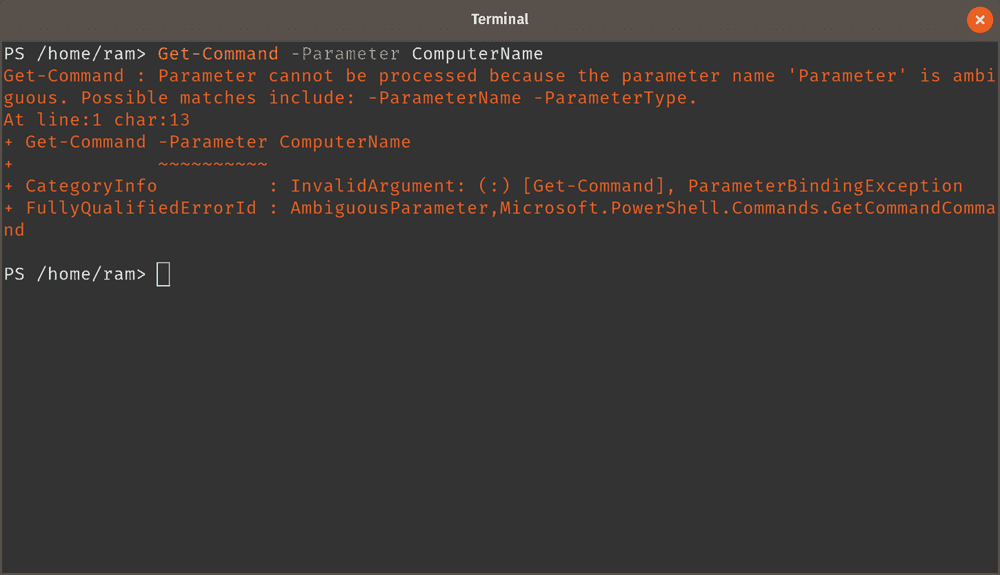

但是它抛出了一个错误。错误信息显示：`Possible matches include: -ParameterName -ParameterType`。这是 Linux 上 PowerShell 的一个特殊问题。让我们再试一次：

```
get-comm<Tab><Space>-param<Tab><Tab>
```

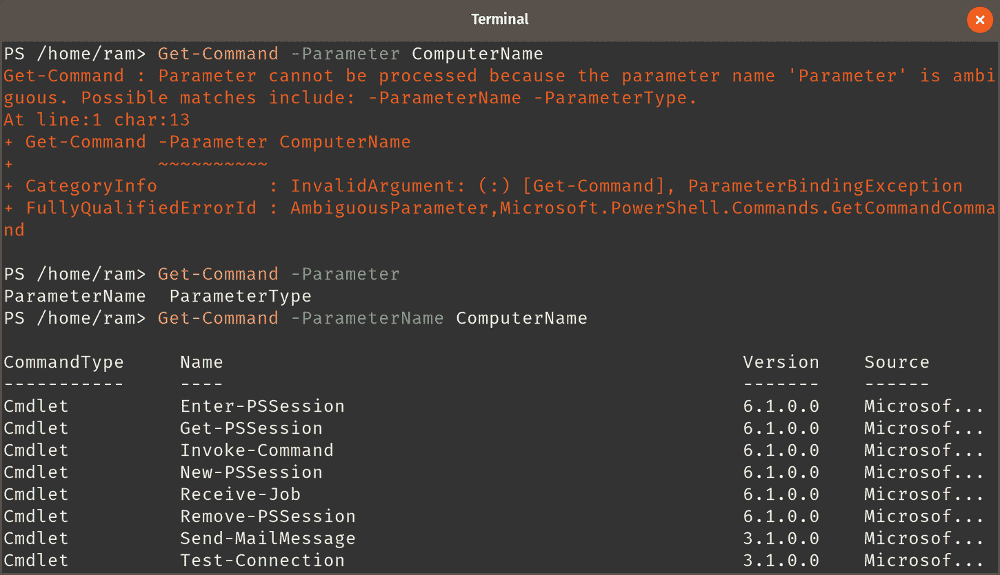

1.  阅读可能的选项并选择 `ParameterName`。

```
get-comm<Tab><Space>-param<Tab>n<Tab><Space>computername<Enter>
```

1.  完整的解析结果是：

```
Get-Command -ParameterName computername
```

然后它成功了。

接下来，让我们暂停会话中的活动，例如暂停五秒钟。实现这一点的 cmdlet 是 `Start-Sleep`。

1.  让我们首先查看 cmdlet 的帮助。

```
Get-Help Start-Sleep
```

帮助文本显示，位置为一的参数（不必命名）是 `Seconds`（第二组参数中的 `Seconds` 周围有方括号），并且它接受整数值。

1.  因此，要暂停会话五秒钟，我们将使用：

```
Start-Sleep 5
```

1.  如果我们希望会话（或脚本）暂停 100 毫秒，我们需要使用命名的 `Milliseconds` 参数。通过 Tab 补全，代码将会是：

```
start-s<Tab><Space>-mi<Tab>100
```

这将解析为：

```
Start-Sleep -Milliseconds 100
```

1.  事实上，在使用参数名称时，你可以减少 Tab 键的次数。只需要输入足够的字符，PowerShell 就能唯一识别该参数名称：

```
start-s<Tab><Space>-m<Space>100
```

这将解析为：

```
Start-Sleep -m 100
```

如果延迟不明显，可以适当增加数字（例如，3000）。

# 它的工作原理是……

我们已经看到如何使用别名。别名的工作方式与正常的 cmdlet 相同，包括它们的参数语法。唯一需要注意的是，我们必须记住这些别名。自定义别名，如我们将在最佳实践部分中看到的，由于别名必须在我们运行包含自定义别名的脚本的地方导入，因此它们并不推荐使用。

而另一方面，tab 完成减少了按键次数，但需要肌肉记忆。只要有一定的练习，这会显著提高生产力。

Tab 完成在编写 cmdlet、编写参数名称以及向参数传递预定义值时有效，例如：

```
set-exec<Tab><Space>-exec<Tab><Space>unre<Tab> 
```

这会完成为：

```
Set-ExecutionPolicy -ExecutionPolicy Unrestricted 
```

在许多情况下，根本不需要使用 tab 完成，例如在 `Start-Sleep` 的情况下。此 cmdlet 没有任何以 `m` 开头的参数。因此，使用 `-m` 已足够让 PowerShell 唯一识别 `-Milliseconds`。这样也省去了 `<Tab>` 的按键。

在 PowerShell 中编写脚本的生产力是一项随着练习而提高的技能。虽然别名确实是加速的捷径，但也有其危险性。另一方面，使用键盘编写脚本有助于肌肉记忆，这不仅能帮助我们以 PowerShell 的方式思考，还能加速 tab 完成，无论是在控制台运行命令还是编写脚本时，它都同样有效。

在编写脚本时，一般不建议使用短参数名；使用时应像别名一样谨慎。短参数名影响可读性，而且在未来某个时刻可能会导致脚本出错。例如，如果你在脚本中调用某个 cmdlet，使用了一个短参数名 `-comp`，而该参数名在脚本创建时仅代表 `ComputerName`。后来，假设该 cmdlet 更新并添加了一个新的参数 `-CompatibilityMode`，这就会导致你写的脚本无法运行。

# 还有更多...

尝试输入最常用的 cmdlet 和参数，来练习 tab 完成。

通过在脚本窗格中输入 cmdlet 来熟悉 VS Code。注意，VS Code 中 cmdlet、参数和参数值的完成是如何工作的。如果你希望完成方式与控制台一样，请参考我在本书 GitHub 仓库中的自定义设置 JSON。

# 查找参数别名

我们处理了 cmdlet 的别名，看到如何唯一识别参数名，而不必输入完整的参数名，我们还探讨了如何利用 tab 完成的强大功能。

为了完整性，我们也来看看参数别名。

正如你可能已经猜到的，参数别名的工作方式与 cmdlet 别名非常相似。这些别名的主要目标是减少键盘输入。

参数别名没有以友好的方式记录，但得益于 PowerShell 的面向对象模型，仍然可以轻松找到。在本食谱中，我们将看看如何获取参数别名。

# 准备就绪

查找所有使用 `ComputerName` 作为参数的命令，最少的按键输入。

```
get-comm<Tab>-parametern<Tab>Cn
```

这会解析为：

```
Get-Command -ParameterName Cn
```

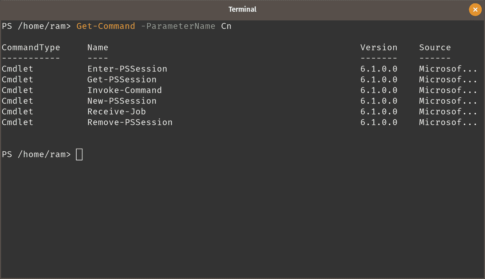

输出与我们之前运行的相同：

```
Get-Command -ParameterName ComputerName
```

PowerShell 是如何知道 `Cn` 代表 `ComputerName` 的？

# 如何做...

Parameters 是 cmdlet 的一部分，而 `Get-Command` 是获取关于 cmdlet 信息的 cmdlet。

1.  对于这个例子，让我们选择 cmdlet `Invoke-Command`。

```
Get-Command Invoke-Command 
```

1.  检查该命令输出的对象。

```
Get-Command Invoke-Command | Get-Member 
```

1.  输出中显示了一个名为 Parameters 的成员。使用成员访问操作符来选择这个成员。

```
(Get-Command Invoke-Command).Parameters 
```

1.  查看这个成员包含哪些成员。

```
(Get-Command Invoke-Command).Parameters | Get-Member 
```

1.  `Values` 会展示我们所需的信息吗？

```
(Get-Command Invoke-Command).Parameters.Values 
```

1.  是的，这确实给了我们一些东西，但输出太多了。我们只需要参数名称及其别名。

```
(Get-Command Invoke-Command).Parameters.Values | select Name, Aliases 
```

就这样。

# 它是如何工作的……

我们在阅读 Core 及其功能时看到，PowerShell 大多数时候会返回对象。而每个对象内部都可以有其他对象。沿着 .NET 的路径，成员访问操作符可以用来选择成员（这些成员可以是属性或方法）。属性通过直接使用属性名称来访问，而方法则需要传递参数（如果不传递参数，依然需要使用一对空括号）。

cmdlet 的参数是 `Get-Command` cmdlet 返回的输出对象。因此，调用 `Get-Command` 并指定 cmdlet `Invoke-Command`，它会返回关于 `Invoke-Command` 的数据作为输出对象。这可以进一步分解成几个其他对象（成员），其中就包括 `Parameters`。

`Parameters` 本身可以进一步分解为其他成员，其中 `Values` 就是其中之一——`Values` 包含了参数的名称，运行 `Get-Member` 时可以看到这一点。

我们从 `Values` 中选择了两个对象，分别是 `Name` 和 `Aliases`。

这些参数别名可以替代参数本身使用。

参数别名有两个需要注意的地方：

+   它们是区分大小写的，这意味着需要按下 Shift 键。

+   它们需要记住，尽管它们有一定的模式，就像 cmdlet 的别名一样（例如，`ip` 代表 `Import`，`g` 代表 `Get`）。

# 调用 PowerShell 脚本

PowerShell 脚本不过是一系列 PowerShell cmdlet，每个 cmdlet 都位于 `ps1` 文件的一行。这些指令一个接一个地执行，类似于传统的 shell 脚本。使用 VS Code 使得运行 PowerShell 脚本变得更简单，你只需要运行脚本，脚本就会发挥它的作用。

然而，在 VS Code 中运行 PowerShell 脚本并不是一种常见的自动化方式，原因显而易见。此外，运行 PowerShell 脚本的方法有很多种。我们将在这个教程中介绍一种非常简单的脚本运行方式；随着书中的进展，我们也会为我们的脚本添加更多功能，进一步将它们打包成模块以供将来使用。

# 准备工作

本教程使用 VS Code 编写脚本。虽然任何文本编辑器或代码编辑器都可以用来编写脚本，但我们选择 VS Code，因为根据我的经验，VS Code 是 PowerShell 脚本编写中最友好的编辑器。

1.  打开 VS Code，创建一个新文件。

1.  在一个方便的位置创建一个新目录（例如 `~/Code`？）。

1.  将空文件保存为`hello-world.ps1`，保存在你刚刚创建的目录中。

1.  查看 VS Code 的右下角，应该现在显示为`PowerShell`。

1.  按`` Ctrl + ` ``关闭底部的控制台，以减少干扰。

如果一切如截图所示，你就准备好开始了。（暂时忽略底部状态栏的颜色以及左下角的 Git 状态。）

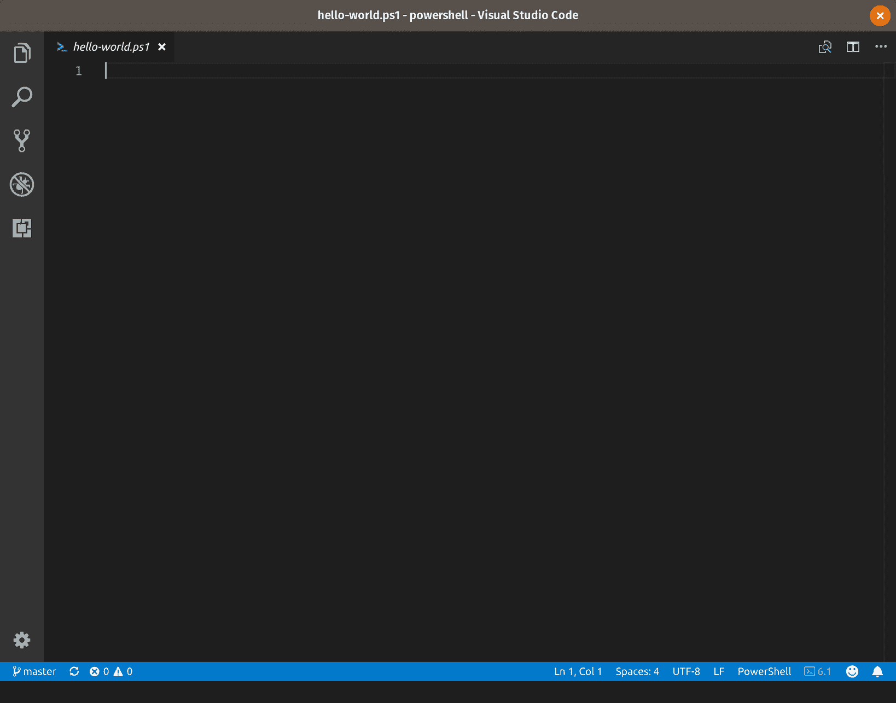

# 如何做到……

1.  在脚本面板中输入：

```
Write-Host "Hello, World!"
```

1.  保存（**文件** > **保存**或`Ctrl + S`）脚本。

1.  点击左侧的**调试**。或者，按下`Ctrl + Shift + D`。这将打开调试面板。

1.  按下绿色的类似播放按钮的**开始调试**按钮。

控制台应该会弹出并显示`Hello, World!`。

1.  让我们再运行一次脚本。这次，我们不打开调试面板，也不按屏幕上的按钮。简单地，按下`F5`。

`Hello, World!`应该再次出现在控制台中。

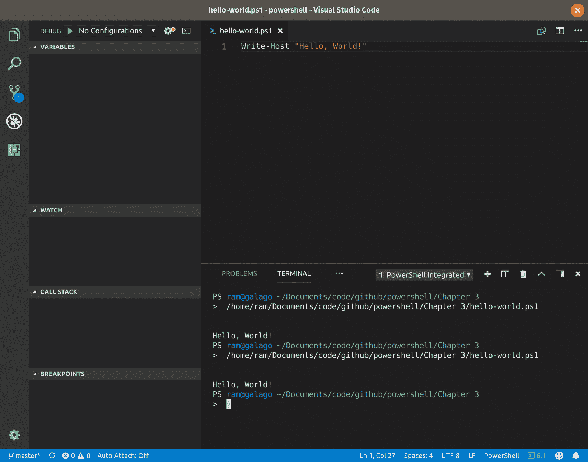

现在让我们不使用调试控件来调用脚本。

1.  关闭文件（Ctrl + W）。

1.  在控制台的提示符下，输入：

```
./hello-world.ps1
```

你应该能看到`Hello, World!`出现在控制台中。

1.  现在，导航到主目录。

1.  接下来，输入`&`，加上空格，再输入`./`，然后开始输入存储脚本的路径。像在 Bash 中一样使用 Tab 补全功能。

1.  当你到达脚本文件的位置时，按回车键来调用该文件。

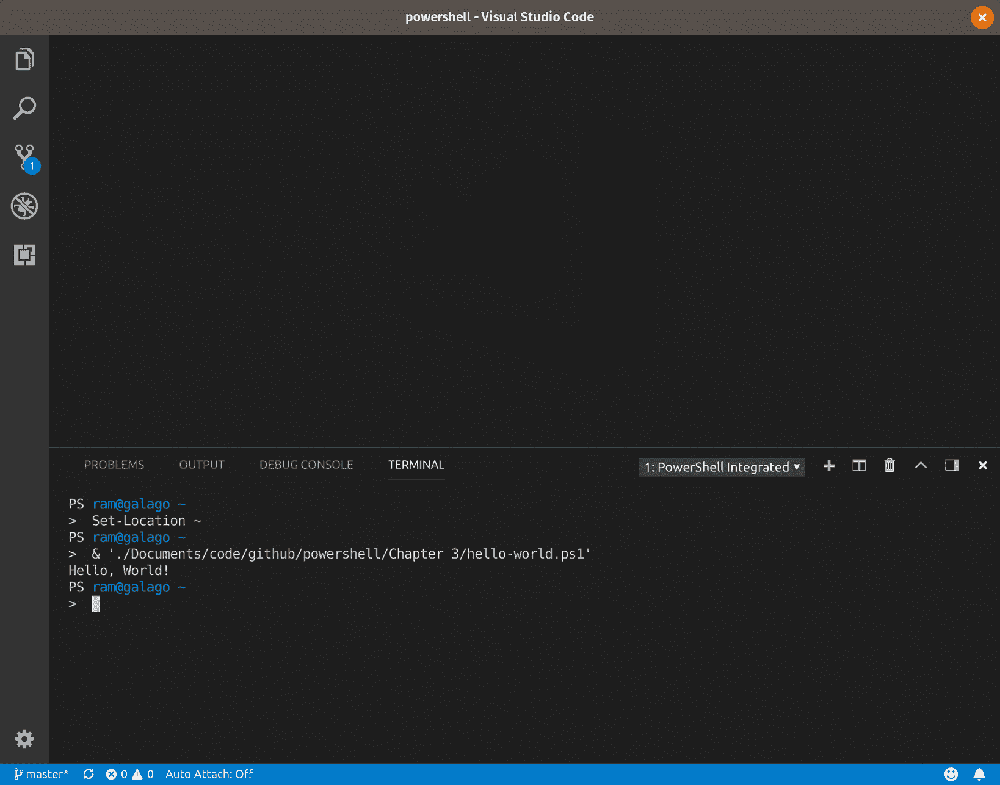

# 它是如何工作的……

运行 PowerShell 脚本的最简单方法是在集成脚本环境中调试它。在这种情况下，我们选择使用 VS Code 作为我们的 ISE。本文中描述的调用脚本的另外两种方式是通过 PowerShell 控制台。你可以使用 VS Code 中的集成控制台，或者在终端中调用 PowerShell 控制台来实现。

当脚本位于当前工作目录时，PowerShell 会直接调用`ps1`文件并执行它。调用 PowerShell 脚本的另一种方式是使用`&`（或**调用操作符**）：输入`&`，然后空格，接着是脚本文件的路径。通过这种方式调用可以很好地处理路径中的空格。

如果脚本的路径包含空格，则该路径需要用引号括起来。这样，PowerShell 会认为你只是给它一个字符串值。然后，PowerShell 会在你按下回车键时，将路径作为文本显示。

当你使用`&`调用操作符时，你是在告诉 PowerShell 你想要运行一个脚本（或一个命令）。

调用脚本的另一种方式是使用`.`（或**点操作符**），我们将在下一个食谱中讨论这一点。

# 点源 PowerShell 脚本

在上一篇中，我们展示了如何在 ISE 外部调用 PowerShell 脚本。我们给 PowerShell 提供了路径，并明确表示希望它通过调用操作符运行脚本。

如果你只希望脚本执行任务而不留下任何东西，例如变量值等，这种方式是理想的。然而，也有一些情况，我们希望运行脚本，并且保留我们在脚本中声明和赋值的变量，或者使用我们在脚本中声明的函数。

在我们希望函数、变量甚至别名保留在当前会话中的情况下，我们使用点源。

# 如何操作...

如果你在上一实例之后删除了文件，按照上一实例中的步骤恢复它或重新创建它。然后，

1.  打开你在上一实例中创建的脚本文件。在第二行，输入以下内容。

```
$Message = "I was dot-sourced!"
```

1.  保存脚本。不要运行它。

1.  将光标放置在集成控制台，并使用调用操作符调用脚本。

```
& ./hello-world
```

1.  我们声明了 `$Message` 并给它赋了一个字符串值。调用该变量查看它包含的值。

```
$Message
```

没有任何反应。

1.  现在，使用点源（dot-source）脚本。（这里有两个点；一个是操作符，另一个是空格后指向当前目录。）

```
. ./hello-world.ps1
```

1.  再次调用 `$Message` 变量。

```
$Message
```

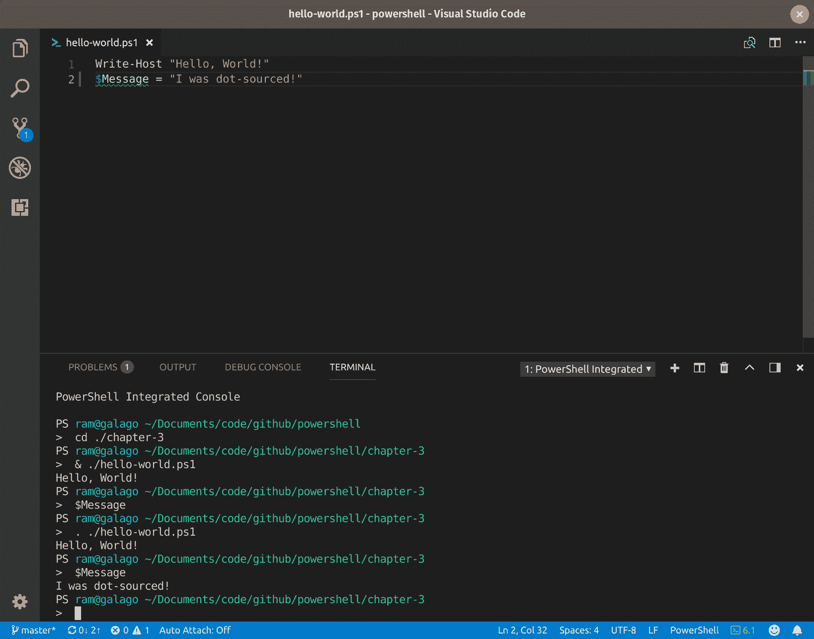

# 它是如何工作的...

当使用调用操作符调用脚本或命令时，脚本或命令会简单地运行，而不会修改当前会话（或者从技术上讲，是作用域）。命令或脚本运行并退出，而不会更改与会话相关的任何内容，包括对内建/自动变量的更改。

当需要更改作用域时，脚本或命令必须通过点源来调用。这样，脚本中定义的任何变量、函数或别名都会保留在当前作用域中。

# 还有更多内容...

在 `hello-world.ps1` 脚本中使用 `New-Alias` 创建一个新的别名。尝试在第一次调用脚本后（使用调试控制以及使用调用操作符）获取别名的值，然后，通过点源脚本来获取别名的值。观察结果。

# 从 PowerShell 外部调用 PowerShell cmdlet

到目前为止，我们已经学会了从控制台调用 cmdlet、在 ISE 中运行脚本，并以两种模式调用脚本。在这个非常简短的实例中，我们将学习如何从 PowerShell 外部调用 PowerShell cmdlet。

# 如何操作...

1.  打开一个终端窗口。

1.  在提示符下，输入：

```
pwsh -h
```

1.  阅读命令的语法。

1.  在提示符下，输入：

```
pwsh -c Get-ChildItem
```

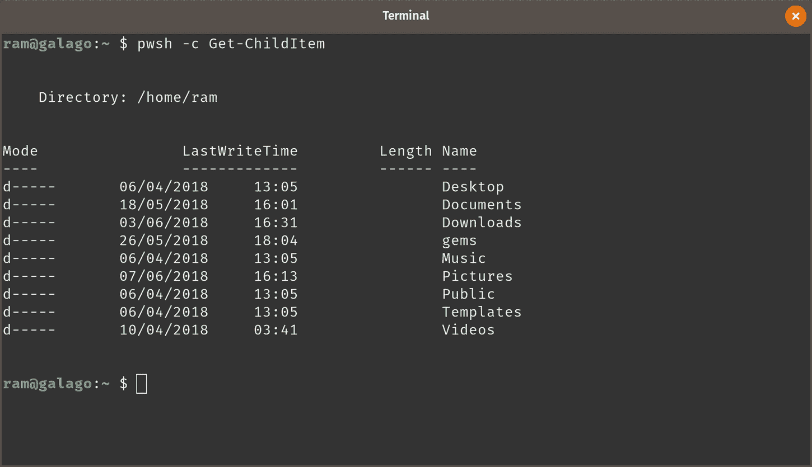

1.  现在我们来运行`hello-world.ps1`脚本。

```
pwsh -f ./Documents/code/github/powershell/chapter-3/hello-world.ps1
```

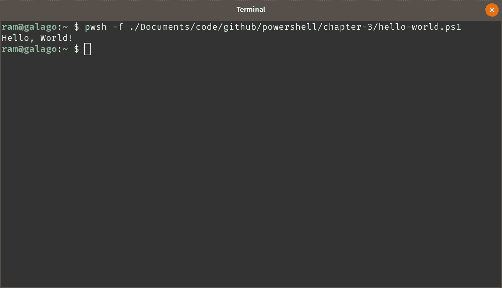

# 它是如何工作的...

PowerShell 不是一个运行在 Bash 之上的应用程序。PowerShell 本身就是一个 Shell。然而，它可以像其他应用程序一样从 Bash 中调用。像应用程序一样，`pwsh` 命令接受参数，然后由 PowerShell 处理。

我们可能想要在 Bash 中使用 PowerShell 的两种主要方式是运行单个命令，或者调用一个脚本文件。你甚至可以调用一个脚本块，然而，这必须在 PowerShell 内部执行。在大多数情况下，运行单个 cmdlet 或调用脚本就足够了。

通常，在调用 `pwsh` 并使用 cmdlets 时，应将 `-Command`（或 `-c`）作为最后一个参数，因为在 cmdlet 本身之后的任何内容都被视为 cmdlet 参数。`-File` 也是一样。

当一个脚本被设计为接受参数时，脚本参数可以在脚本名称后面传递，就像使用 cmdlet 一样。

# 记录在 PowerShell 控制台上运行的 cmdlet。

通常，在 PowerShell 控制台上，你会执行一系列任务，在经过一番反复试探后，找到了解决方案。然后，你希望你能记录下所有在控制台上的操作。你仍然可以从控制台复制内容，所以你尝试向上滚动。但你只能滚动这么远。你的命令历史（有点像 Bash 历史）可以帮到你，但有时候，这也感觉有限。

几个月前，我们正在排查两套本应同步工作的软件更新分发系统之间的同步问题。在我们中的一些人已经厌倦了图形界面（GUI）之后，（当然）我们决定使用 PowerShell 来解决问题。我们运行了一系列命令，经过几个小时与系统的斗争，系统终于屈服，我们重新开始工作。

我们的经理要求我们记录所有的步骤，以便将来可以参考。当然，我不能告诉你我们所采取的所有步骤——因为：a) 本书的范围，b) 我们与客户的协议——但我可以告诉你，在这种情况下，有哪些方法可能会有所帮助。

# 如何操作...

在终端启动 PowerShell，或使用 VS Code 上的 PowerShell 集成控制台。

1.  运行以下命令：

```
Start-Transcript -Path ./command-transcript.txt
```

1.  你也可以直接运行没有任何参数的 cmdlet；它会自动创建一个带有自动生成文件名的文本文件。获取当前系统的日期和时间。

```
Get-Date
```

1.  列出当前目录中的所有文件和目录。

```
Get-ChildItem .
```

1.  创建一个新目录。

```
New-Item test-transcript -ItemType Directory
```

1.  在目录中创建一个新文件。

```
New-Item -Path test-transcript/testing-transcript.txt -ItemType File
```

1.  向文件添加内容。

```
@'
In publishing and graphic design, lorem ipsum is a placeholder text commonly used to demonstrate the visual form of a document without relying on meaningful content (also called greeking).
Replacing the actual content with placeholder text allows designers to design the form of the content before the content itself has been produced.
—Wikipedia
'@ | Out-File ./test-transcript/testing-transcript.txt -Append
```

1.  删除目录。

```
Remove-Item -Path ./test-transcript -Recurse
```

1.  停止记录你所做的事情。

```
Stop-Transcript
```

1.  你现在应该已经收到了转录文件的位置。读取文件内容。

```
Get-Content -Path ./command-transcript.txt
```

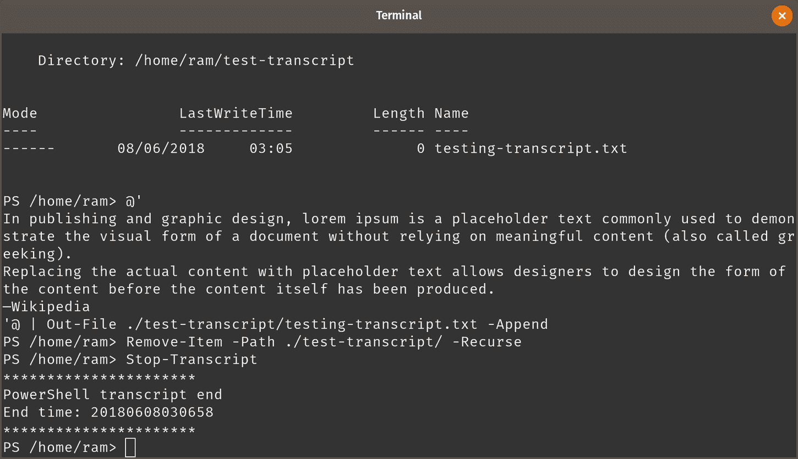

# 它是如何工作的...

通过运行`Start-Transcript`创建的转录文件会将你所有的操作和所有命令的控制台输出存储在一个文本文件中。转录文件还包含一些与命令执行时的上下文相关的其他有用信息。

转录文件比历史文件稍微多一点，因为前者包含了命令的输出，而不仅仅是命令本身。

`Start-Transcript` cmdlet 完全不需要任何参数；它可以在用户的主目录下创建一个文本文件，并赋予唯一名称，以确保不会覆盖其他转录文件。换句话说，`Path` 是一个可选参数。

本章内容已经讲完，关于如何使用 PowerShell 为管理做准备。现在是时候活动一下手指，重新倒杯咖啡了。我要告诉你，咖啡能加速 PowerShell 中的思维吗？你说这是安慰剂效应？我们现在可别争论这个。
