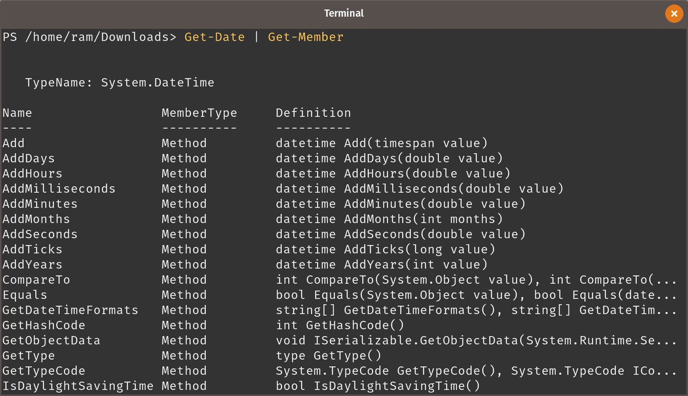
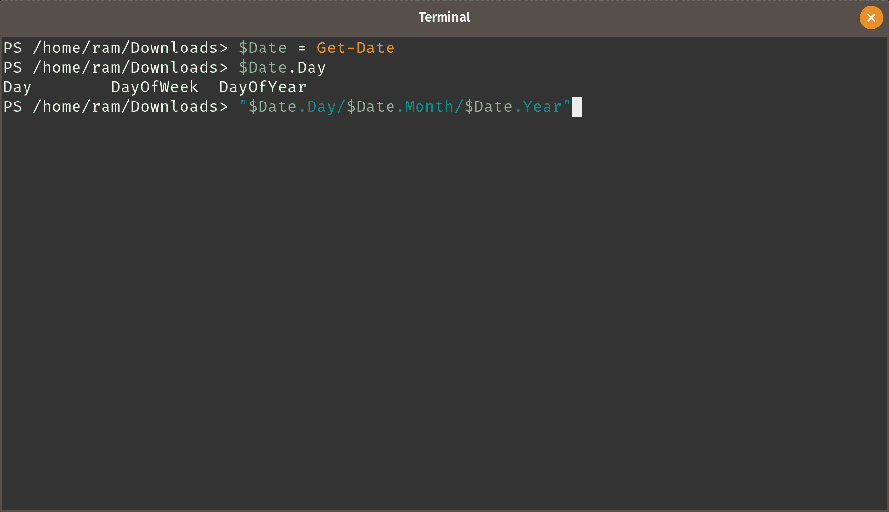
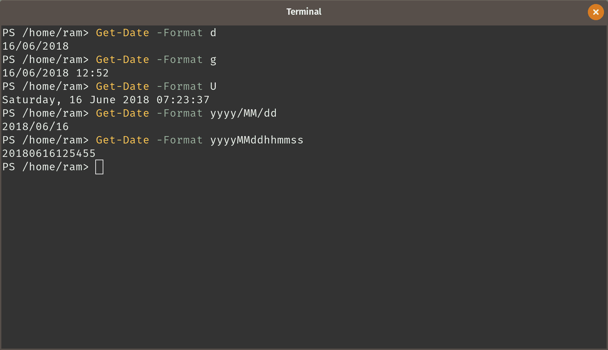
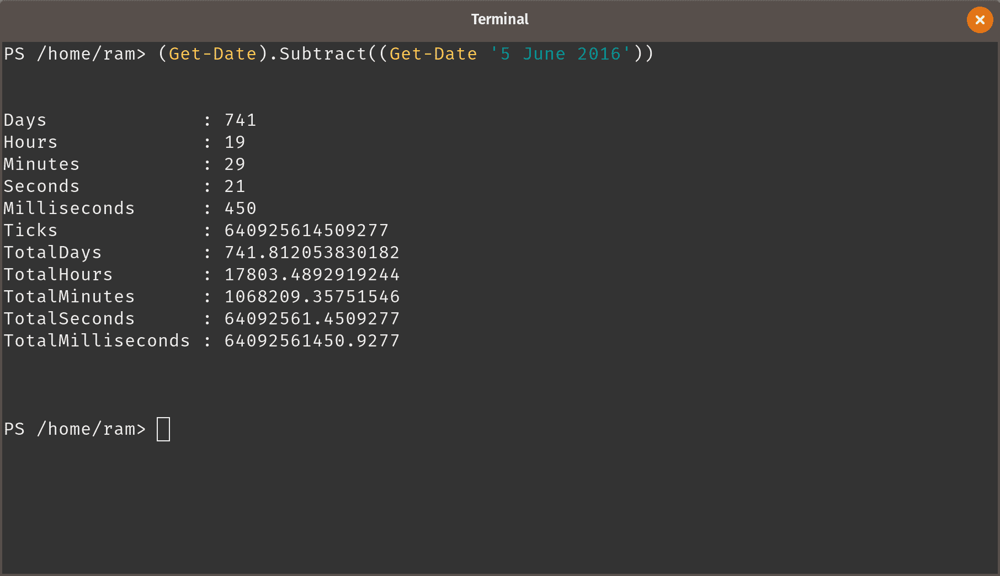
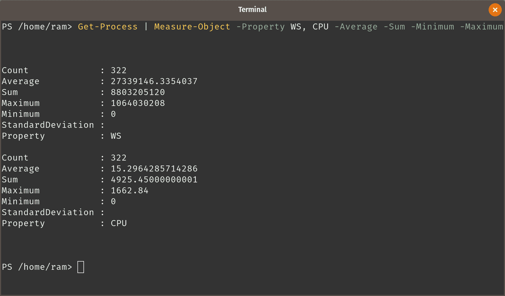
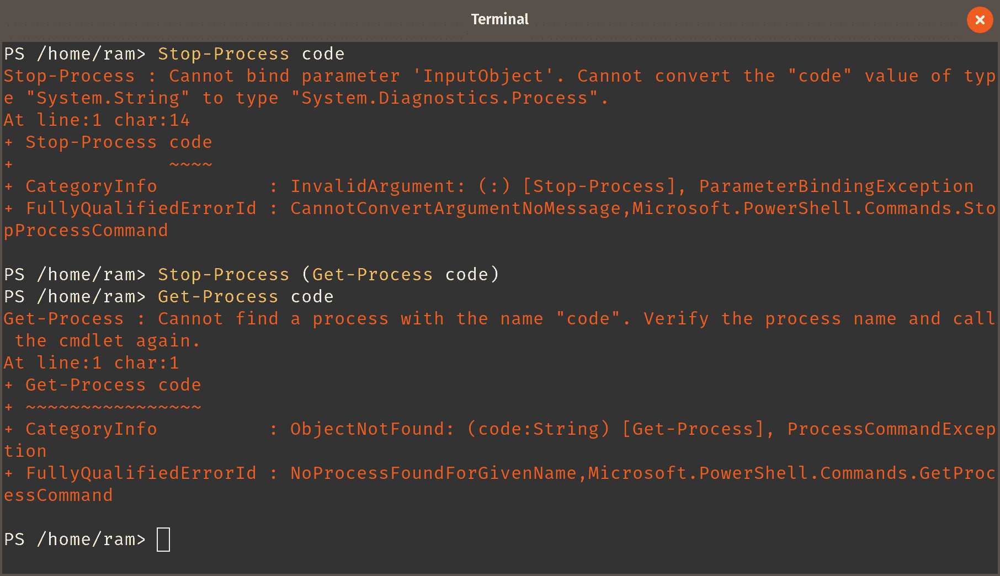
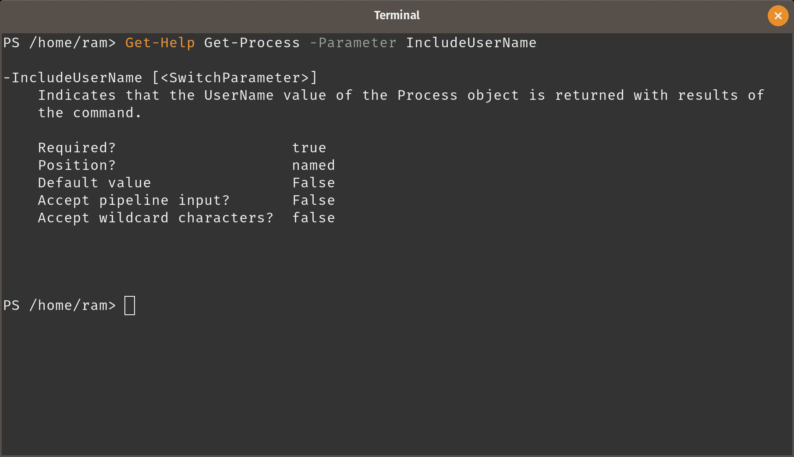
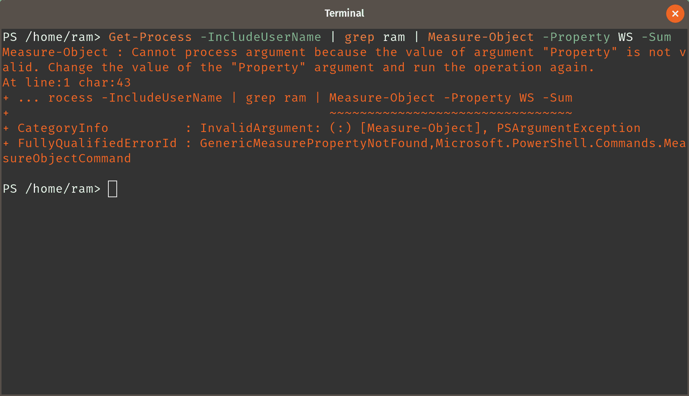
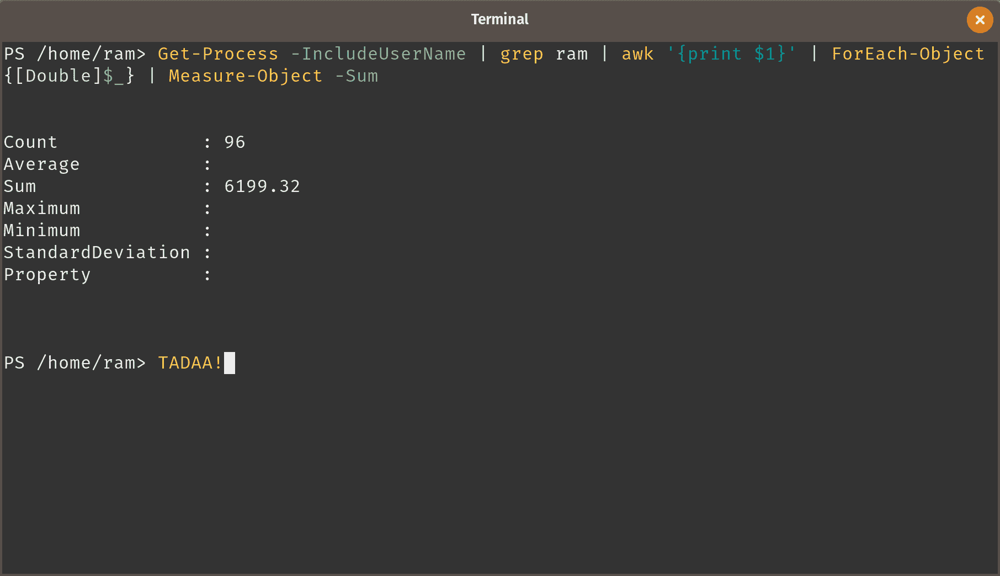

# 第四章：使用 PowerShell 的管理基础

在本章中，我们将涵盖以下主题：

1.  使用日期属性

1.  使用日期和时间函数

1.  使用当前运行的进程来测量资源消耗

1.  启动和停止进程

1.  查找进程的所有者

1.  根据文件类型调用应用程序

1.  安装 CronTab 模块

1.  在 PowerShell 中调度任务

1.  在 PowerShell 中删除调度任务

# 介绍

根据《哈佛商业评论》所说，一种有效的学习方法是循环进行 *信息盛宴* 和 *信息禁食*。鉴于我们已经熟悉了（并且可能被上一章的内容量压得有些不知所措），我们将在使用 PowerShell 进行管理的第一步中采取轻松的方法。

到目前为止，我们已经了解了如何运行 cmdlet、它们的参数是什么、如何设置和使用别名等。在本章中，我们将学习如何使用一些基本的工具、处理进程以及调用应用程序。

此外，尽管书名上写着 Linux，但书中的大多数配方也应该适用于 Windows（特别是 Windows 上的 PowerShell 6.0）；可能需要做一些小的修改，比如在路径中使用反斜杠。

# 使用日期属性

PowerShell 最好的学习方式是从简单的 cmdlet 开始。`Get-Date` 是 PowerShell 中最简单却未完全发挥作用的 cmdlet 之一。在本食谱中，我们将玩转日期，并查看它们如何在不同的场景中使用。像往常一样，PowerShell 的可能性远远超过一本书所能涵盖的范围。为了简洁起见，我们只会讨论足够的内容，以便你优雅地进入 PowerShell 自动化的世界；其余的，你可以自己处理。

# 准备工作

如果你跟着前面的章节完成了所有的练习，应该已经准备好继续了。如果没有，去章节 *安装、参考和帮助*，然后获取一份 PowerShell 的副本。回来继续这里的内容。本食谱只使用终端，所以不需要其他任何东西。

# 如何做到这一点……

在开始处理日期之前，让我们先进行一次简单的日期调用。

1.  显示当前的日期和时间。

```
PS> Get-Date

Saturday, 16 June 2018 12:14:07
```

1.  查找这个返回对象有哪些成员。

```
PS> Get-Date | Get-Member
```



一大堆属性和方法。

1.  尝试以 16/06/2018 的格式显示日期。

```
PS> $Date = Get-Date
PS> "$Date.Day/$Date.Month/$Date.Year"
```



颜色看起来不对。

1.  按照如下修改命令。根据你的终端主题，语法现在应该看起来更好。（暂时不用担心为什么这个改动有效，我们将在稍后的变量处理部分进行讲解。）

```
PS> "$($Date.Day)/$($Date.Month)/$($Date.Year)"
16/6/2018
```

但这需要做很多工作。有没有更简单的方法？

1.  查看帮助以查看你可以获得的参数。

```
PS> Get-Help Get-Date
```

有一个 `Format` 参数。

1.  输入以下内容以获取短日期格式。

```
PS> Get-Date -Format d
```

尝试以下作为 `Format` 的值：`g`、`U`、`yyyy/MM/dd` 和 `yyyyMMddhhmmss`。



1.  如果你更习惯使用 UNIX 格式的日期，使用`Uformat`参数。

```
PS> Get-Date -Uformat %d/%m/%Y
```

让我们再走一步，将自定义日期传递给系统，并利用`Get-Date`输出的对象成员从中获取一些信息。

1.  查找 2018 年万圣节是哪一天。

```
PS> (Get-Date -Day 31 -Month 10 -Year 2018).DayOfWeek 
Wednesday
```

1.  如果你知道本地日期的格式，可以按以下方式传递日期并获取相同的信息。

```
PS> (Get-Date 31/10/2018).DayOfWeek
```

1.  如果你记得类型加速器的概念，可以利用它获取你需要的信息。

记得在调用`DateTime`加速器时使用 YMD 或 MDY 格式，以避免错误。

```
PS> ([datetime]'10/31/2018').DayOfWeek
```

为避免歧义，拼写出月份。

```
PS> ([datetime]'31 October 2018').DayOfWeek
```

# 它是如何工作的…

.NET 中的`System.DateTime`类包含足够的属性和方法。`Get-Date` cmdlet 通过封装来利用这些属性和方法。`Get-Date` cmdlet 默认提取系统的当前日期和时间，并允许你从中选择子对象，或快速将它们组合成*格式*。

除了这些操作外，cmdlet 还允许你传递类似日期和时间的简单字符串，并将输入的字符串转换为`DateTime`对象。

虽然`Get-Date`考虑了你的当前区域设置，但类型加速器`DateTime`似乎只适用于 YMD 或 MDY 格式的日期时间。

# 另见

1.  [DateTimeFormatInfo](https://msdn.microsoft.com/library/system.globalization.datetimeformatinfo.aspx#Remarks) 类 | 备注（Microsoft 开发者网络）

1.  食谱 2.3：从文本解析输入到对象（类型加速器）

# 使用日期和时间函数

在前面的食谱《使用日期属性》中，我们专注于`DateTime`对象的属性。我们看到的`Get-Date`参数也作用于这些属性。在本食谱中，我们将查看`DateTime`对象中的方法，并学习如何利用它们。这个食谱的主要思想是让你能够熟练使用作为输出对象一部分的方法。

# 如何实现…

首先，让我们从将本地时间转换为 UTC 开始。

1.  在提示符下，输入`Get-Date`并列出输出对象的成员。

```
PS> Get-Date | Get-Member
```

1.  有一个方法叫做`ToUniversalTime`。调用这个方法。

通过使用自动完成减少敲击键盘的次数。

```
PS> (Get-Date).ToUniversalTime()
```

将输出与本地时间进行比较。

1.  接下来，让我们看看从今天起 35 天后是星期几。

```
PS> (Get-Date).AddDays(35)
```

1.  如果你想查看三小时十八分钟后的时间：

```
PS> (Get-Date).AddHours(3).AddMinutes(18)
```

1.  接下来，找出自 2016 年世界环境日以来已经过去了多少天。

```
PS> (Get-Date).Subtract((Get-Date '5 June 2016'))
```



# 它是如何工作的…

`Get-Date`返回的对象有多个方法，就像它有属性一样。在本食谱中，我们使用这些方法来根据需要操作日期。方法通过传递参数调用。如果你不想指定任何参数，确保仍然调用方法并使用空的圆括号。

方法可以像我们在添加小时和分钟时那样链接。只要输出对象不发生变化，在大多数情况下，你应该能够通过链接方法来调用与对象相关的方法。例如，如果你在第一个方法中将日期对象转换为字符串，那么第二个方法应该是一个接受字符串输入的方法。当不确定时，可以使用`Get-Member` cmdlet 来查看输出对象支持哪些方法。

当你查看`Get-Member`命令在`DateTime`对象上运行的结果时，会看到`Subtract`方法接受`DateTime`作为参数。因此，使用`Get-Date`作为参数的一部分。将 cmdlet 的输出作为方法的参数传递时，cmdlet 和传递的参数需要被额外的括号包围–例如`Subtract((Get-Date '5 June 2016'))`，而不是`Subtract(Get-Date '5 June 2016')`–这样内部命令先执行，获取一个值，再将其传递给方法。

# 处理当前正在运行的进程以测量资源消耗。

管理工作的一个重要部分是处理计算机上的进程。PowerShell 包含了可以让你处理计算机上进程的 cmdlet。在这个食谱中，我们将列出系统中所有正在运行的进程，并获取这些进程总共消耗的资源量。

在接下来的章节中，*通过管道传递数据*，我们将会了解其他选项，如过滤等，利用在本食谱中学到的知识。

# 如何操作...

正如我们之前讨论的，我们在这里的目标是操作进程。

1.  列出帮助你处理进程的 cmdlet。

```
PS> Get-Command -Noun Process
```

请记住，PowerShell 仅使用单数名词。

我们得到了五个 cmdlet。我们最初需要的是 Get-Process。

1.  运行 cmdlet，查看它的输出。

```
PS> Get-Process
```

输出是一张长表，包含进程、它们所消耗的内存、它们使用的 CPU 时间等。

1.  获取当前系统中正在运行的进程的总数。

```
PS> (Get-Process).Count
```

1.  现在，获取进程使用的内存页面的平均值。这个术语称为工作集（Working Set），用 WS 表示。

```
PS> Get-Process | Measure-Object -Property WS -Average
```

1.  哈希表中还有其他字段。让我们获取所有这些信息。

```
PS> Get-Process | Measure-Object -Property WS -Average -Sum -Minimum -Maximum
```

1.  获取工作集和 CPU 的平均值、总和、最小值和最大值。

```
PS> Get-Process | Measure-Object -Property WS, CPU -Average -Sum -Minimum -Maximum
```



# 如何工作...

cmdlet Get-Process 会输出一张包含所有正在运行进程的完整表格。可以将每一行视为一个单独的对象，整个表格是这些行的数组。计数（或者说长度）逻辑上是数组的一个属性。因此，我们调用 cmdlet，并对输出的对象运行计数操作。这会告诉我们系统当前运行的进程数量。

我们看到的下一个 cmdlet 也是一个重要的命令：`Measure-Object`。此 cmdlet 旨在对输出对象执行度量。在我们的案例中，我们选择属性 `WS` 进行度量。如果没有指定属性，PowerShell 会根据输出对象中的定义选择一个属性。

`Measure-Object` 能够对输出对象执行一些巧妙的算术计算。我们利用这个 cmdlet 的功能，首先获取平均值，然后是总和、最小值和最大值。`Property` 参数接受一个字符串数组作为输入（`Get-Help Measure-Object -Parameter Property`）。因此，我们在 cmdlet 中指定了 WS 和 CPU（用逗号分隔），然后执行度量操作。

# 启动和停止进程

所有专业终端管理员都经常从终端启动和停止进程。这通常发生在 Bash 的终端提示符下。使用 PowerShell 时，过程并没有太大不同。本节将向你展示如何操作进程。顺便提一下，本节还将带你进行一次全面的信息禁食。

# 准备就绪

打开 VS Code。如果底部的状态栏是蓝色的，说明可能有一个文件夹在 VS Code 中打开。VS Code 会保存它打开的路径，因此即使在重新启动后重新启动 VS Code，会看到仍然有文件夹打开。我们需要关闭这个文件夹。为此，按 Ctrl + Shift + N（或转到 文件 > 新建窗口）。关闭打开文件夹的窗口。

# 如何操作…

如果你列出了上一节中的命令，请向上滚动查看哪些 cmdlet 可能对本节有所帮助。

1.  在提示符下，输入以下内容以启动 Visual Studio Code。

```
PS> Start-Process code
```

确保底部的状态栏不是蓝色的。如果是蓝色的，请阅读本节的 *准备就绪* 部分。按 Ctrl + Shift + E 或点击 VS Code 左侧边栏中的资源管理器图标。那里不应有任何目录打开。

1.  在你创建 `hello-world` 脚本的目录下打开 VS Code。

```
PS> Start-Process code -ArgumentList /home/ram/Documents/code/github/powershell/
```

按 Ctrl + Shift + E 或点击 VS Code 左侧边栏中的资源管理器图标。你看到目录打开了吗？

现在，让我们停止 VS Code 进程。

1.  列出系统中正在运行的进程，看看是否有任何进程与 `code` 匹配。

```
PS> Get-Process | grep code
```

1.  如果你想用 PowerShell 的方式来做，运行以下命令，并注意 `ProcessName` 列中的名称：

```
PS> Get-Process *code*
```

1.  PowerShell 处理对象；`grep` 输出文本。因此，既然我们知道进程的确切名称是 `code`，我们可以直接获取该进程的详细信息。

```
PS> Get-Process code
```

这将为我们提供有效的输出。

1.  停止所有 `code` 进程。

```
PS> Stop-Process code
```

这样做是行不通的；该 cmdlet 接受一个 `System.Diagnostics.Process` 对象作为输入。

1.  将 `Get-Process` 放在括号内，并将输入传递给 `Stop-Process`。

```
PS> Stop-Process (Get-Process code)
```

1.  现在，查看是否还有 `code` 进程正在运行。

```
PS> Get-Process code
```



停止进程的最佳方法是使用其 ID。

1.  我现在在我的电脑上运行`dconf-editor`，并且想要关闭它。你可以选择停止任何一个进程，但还是建议小心操作。

```
PS> Get-Process dconf-editor
PS> Stop-Process -Id 20608
```

# 它是如何工作的…

cmdlet Start-Process 与路径一起工作。但是，对于`code`，Linux 知道该软件包的安装路径。因此，只需要通过“命令”调用该软件包就足够了。

VS Code 进程接受目录/文件位置作为输入。因此，我们添加了`ArgumentList`参数，并将路径作为参数传递给进程。这将使该目录在 VS Code 中打开。

停止进程默认需要一个.NET 对象作为输入；`Stop-Process`不会接受字符串作为默认输入。因此，我们将`Get-Process` cmdlet 放在括号内，这样它首先执行并输出一个`System.Diagnostics.Process`对象，然后由`Stop-Process`处理。

为了准确确定我们想要停止的进程，我们使用进程 ID，并将其作为参数传递给`Stop-Process`。

# 查找进程的所有者

在配方中，*处理当前正在运行的进程…*，我们列出了系统中正在运行的进程。表格没有显示进程的所有者。在本配方中，我们将讨论如何处理由特定所有者启动的进程。

# 如何操作…

`Get-Process` cmdlet 可以为我们获取这个信息。

1.  在提示符下，键入以下内容以获取`Get-Process` cmdlet 接受的所有参数。

```
PS> Get-Help Get-Process
```

1.  我们看到有一个参数`IncludeUserName`（名称表明它是一个开关参数）。了解更多信息。

```
PS> Get-Help Get-Process -Parameter IncludeUserName
```



1.  运行命令：

```
PS> Get-Process -IncludeUserName
```

1.  筛选出由你启动的进程。我们将使用`grep`来完成这个操作，直到我们学会如何在 PowerShell 中进行筛选。

```
PS> Get-Process -IncludeUserName | grep ram
```

1.  计算以你的名字运行的进程数量。

```
PS> (Get-Process -IncludeUserName | grep ram).Count
```

1.  如果你想使用`Measure-Object` cmdlet，也可以。

```
PS> Get-Process -IncludeUserName | grep ram | Measure-Object
```

1.  现在，让我们看看你启动的所有进程消耗了多少工作集。

```
PS> Get-Process -IncludeUserName | grep ram | Measure-Object -Property WS -Sum
```



出现错误。

# 它是如何工作的…

默认情况下，`Get-Process`不会显示进程所有者信息。在某些情况下，可能需要这些信息。在这个简单的配方中，我们使用帮助文档获取所有参数，并使用`IncludeUserName`开关参数来获取进程所有者信息。

在下一步中，我们筛选出由特定用户启动的进程，然后统计进程数量。我们也使用`Measure-Object`做了同样的操作，结果是相同的。`Measure-Object`名字中有"object"，但它处理的是`grep`输出的文本。同时，下一步提到`Property`的值是无效的。

`Measure-Object` 在计数时有效的原因在于其前面的步骤。我们知道如果输出是一个数组，PowerShell 可以计数数组中的元素个数。`Measure-Object` 也能够做到这一点：衡量字符串数组中可以衡量的内容——`Count` 对字符串数组有效。

然而，当我们尝试获取总工作集时，`Measure-Object` 无法给出结果。原因是，正如我们之前所看到的，`grep` 的输出是纯文本。

```
PS> Get-Process -IncludeUserName | grep ram | Get-Member
```

# 还有更多内容...

这或许有点超前，但如果我们想从 `grep` 的输出中获取工作集信息呢？简单的挑战，接受！

```
PS> Get-Process -IncludeUserName | grep ram | awk '{print $1}' | ForEach-Object {[Double]$_} | Measure-Object -Sum
```



暂时不用过于担心这如何工作。一旦我们阅读并理解了如何遍历可用元素，我们就能更好地理解这个是如何工作的。现在，理解我们通过 `Double` 类型加速器将每个返回的字符串转换成 `double` 值。然后，我们做了一个 `Measure-Object`，并得到了总和。

当然，单靠 PowerShell，这一过程会更加简便。

# 另见

1.  食谱 2.4：比较 Bash 和 PowerShell 的输出。

# 基于文件类型调用应用程序

到目前为止，我们已经看过如何使用`Start-Process`启动一个应用程序。这通常包括启动应用程序，并通过应用程序打开你想要处理的文件。在本食谱中，我们将利用文件关联的概念，并使用适当的调用 cmdlet 来启动一个应用程序。实际上，我们将走得更远一些。

# 如何操作...

从网络上下载几张图片，用来处理这个食谱。它们可以是任何类型的，只要确保所有图片都是相同的文件类型。

1.  导航到你保存图像文件的位置。

1.  在命令提示符下，输入以下命令来打开你的图像查看器，并查看其中的文件。

```
PS> Invoke-Item -Path *.png
```

1.  现在，在相同位置创建一个文本文件。

```
PS> New-Item file-1.txt -ItemType File
```

1.  现在，调用所有文件并让它们在各自的应用程序中打开。

```
PS> Invoke-Item *
```

# 它是如何工作的...

在食谱中，*从外部调用 PowerShell cmdlet*，我们通过先调用 PowerShell，然后将脚本作为参数传递给 `pwsh` 命令，从 Bash 调用了一个 PowerShell 脚本。PowerShell 中的过程也非常相似，正如在 *启动和停止进程* 中所看到的。

`Invoke-Item` cmdlet 依赖于内部文件关联来打开文件。`Invoke-Item` 的真正用途是在打开多个文件时，无论是相同类型的文件，还是同一路径下不同类型的文件，都能通过各自的应用程序来处理它们。

# 安装 Crontab PowerShell 模块

在本食谱中，我们将讨论如何安装一个 PowerShell 模块，用于在 Linux 机器上使用 PowerShell 管理 Cron 作业。

有时需要执行管理任务或安排脚本在指定时间自动执行。Linux 发行版默认提供了一个调度工具，名为 Crontab，它允许任何任务在指定的时间自动在后台运行。Cron 是一个基于时间的调度程序，它根据 `crontab` 文件中的定义生成事件。

# 如何操作...

PowerShell crontab 包装模块目前尚未在 PowerShell 仓库中提供。你必须手动下载文件来安装该模块。最简单的方法是克隆 PowerShell 仓库，并从其 `demos` 目录中安装模块。

如果你只希望单独安装 CronTab 模块，可以手动下载 `<repo>/demos/crontab` *目录*。然后，以超级用户身份启动 PowerShell，导航到 `crontab`。从第 4 步继续。

1.  将 PowerShell 仓库克隆到你的计算机上。

```
$ mkdir ~/code
$ git clone https://github.com/PowerShell/PowerShell.git
```

1.  以超级用户身份启动 `pwsh`。

1.  转到仓库中的 `demos/crontab/CronTab` 目录。该目录中放置了模块清单。

```
PS> Set-Location ~/code/PowerShell/demos/crontab
```

1.  使用 `Import-Module` cmdlet 导入模块清单以加载该模块。

```
PS> Import-Module -Name ./CronTab/CronTab.psd1
```

1.  要列出 CronTab 模块的组件，请使用 `Get-Module` cmdlet。

```
PS> Get-Module -Name CronTab | Format-List
Name : CronTab
Path : /home/PacktPub/CronTab.psm1
Description : 
ModuleType : Script
Version : 0.0
NestedModules : {}
ExportedFunctions : {ConvertTo-CronJob, Get-CronJob, Get-CronTab, Get-CronTabUser...}
ExportedCmdlets : 
ExportedVariables : 
ExportedAliases : 
```

1.  要列出 `CronTab` 模块的可用命令类型，请使用 `Get-Command` cmdlet。

```
PS> Get-Command -Module CronTab  
CommandType Name Version Source
----------- ---- ------- ------
Function ConvertTo-CronJob 0.0 CronTab
Function Get-CronJob 0.0 CronTab
Function Get-CronTab 0.0 CronTab
Function Get-CronTabUser 0.0 CronTab
Function Import-CronTab 0.0 CronTab
Function Invoke-CronTab 0.0 CronTab
Function New-CronJob 0.0 CronTab
Function Remove-CronJob 0.0 CronTab
```

# 它是如何工作的...

当你下载 CronTab 模块时，以下文件将从食谱中提到的网址复制到 CronTab 文件夹中，这些文件包含模块数据。

1.  CronTab.ps1xml

1.  CronTab.psd1

1.  CronTab.psm1

`Import-Module` cmdlet 会将模块中可用的 cmdlet 注册到 PowerShell 会话中，并使该模块准备好使用。Import-Module cmdlet 会根据模块清单（即 `psd1` 文件）执行。

当你运行 `Get-Command` cmdlet 时，你将得到该模块中所有可用 cmdlet 的列表。

# 在 PowerShell 中安排任务

在本食谱中，我们将展示如何使用 PowerShell cmdlet 安排任务。

# 准备工作

1.  使用 SU 权限登录终端。

1.  使用 `pwsh` 命令打开 PowerShell 控制台。

1.  导入模块（请参考食谱：安装 Crontab PowerShell 模块）。

# 如何操作...

1.  首先，检查你要在终端中安排的命令或脚本是否存在。

```
$ pwsh -f "/tmp/DataLoading.PS1;"
```

1.  要根据计划运行脚本，请使用 `New-CronJob` cmdlet。

```
PS> New-CronJob -Command 'pwsh -f "/tmp/DataLoading.PS1;"' -Minute 0,15,30,45 | Out-Host

PS> New-CronJob -Command 'pwsh -f "/tmp/DataLoading.PS1;"' -Minute */15 | Out-Host

PS> New-CronJob -Command 'pwsh -f "/tmp/DataLoading.PS1;"' -Minute */15 -Hour 10-12 | Out-Host 

PS> New-CronJob -Command 'rm -rf /tmp/clr*' -Minute 15 -Hour 1 | Out-Host 

PS> New-CronJob -Command 'pwsh -f "/tmp/DataLoading.PS1;"' -Minute */15 -Hour 10-12 -DayOfWeek sun,tue,fri -Month Jan,Mar,Jun,Sep,Dec | Out-Host
```

1.  要获取当前计划的任务列表，请运行 `Get-CronJob` cmdlet。

```
PS /home/PacktPub> Get-CronJob |Format-Table -AutoSize 
Minute Hour DayOfMonth Month DayOfWeek Command
------ ---- ---------- ----- --------- -------
2 * * * * python ./pythonexmaple.py
5 1 * * * rm -rf /tmp/clr*.*
15 * * * * /usr/bin/pwsh -c "cd /tmp/; ./DataLoading.PS1;"
*/15 * * * * /usr/bin/pwsh -c "cd /tmp/; ./DataLoading.PS1;"
0,15,30,45 * * * * /usr/bin/pwsh -c "cd /tmp/; ./DataLoading.PS1;"
*/15 10-12 * * * /usr/bin/pwsh -c "cd /tmp/; ./DataLoading.PS1;"
*/15 10-12 * Jan,Mar sun,tue,fri /usr/bin/pwsh -c "cd /tmp/; ./DataLoading.PS1;"
```

1.  要查看 crontab 配置文件中已安排任务的内容，请使用 `Get-CronTab`。

```
PS > Get-CronTab 
2 * * * * python ./pythonexmaple.py
5 1 * * * rm -rf /tmp/clr*.*
*/15 * * * * /usr/bin/pwsh -c "cd /tmp/; ./DataLoading.PS1;"
0,15,30,45 * * * * /usr/bin/pwsh -c "cd /tmp/; ./DataLoading.PS1;"
*/15 10-12 * * * /usr/bin/pwsh -c "cd /tmp/; ./DataLoading.PS1;"
*/15 10-12 * Jan, Mar, Jun, Sep, Dec sun, tue, fri /usr/bin/pwsh -c "cd /tmp/; ./DataLoading.PS1;"
```

# 它是如何工作的...

PowerShell 实现的 `crontab` 技术上是一个包装器，它封装了在 Linux 中工作的 `crontab` 命令。如果底层功能就是 `crontab`，为什么还要使用 PowerShell 来安排任务呢？原因是使用的一致性、稳定性以及面向对象的方法。如果你会使用 PowerShell，那就是你使用 `crontab` 的全部需求。这就是目标所在。

`New-CronTab` cmdlet 用于定义新任务。可用的参数定义了任务执行的频率。Cron 任务以执行 `New-CronTab` cmdlet 时所用的权限运行。换句话说，如果你以超级用户身份启动 PowerShell 并运行 `New-CronTab` 来定义调度，那么按指定调度运行的命令将以超级用户权限执行。

在这些步骤中，运行的命令通过 `-Command` 参数列出。

让我们简要了解一下 `New-CronTab` 接受哪些输入。有两种方式可以每 15 分钟运行一次命令：第一种是指定每分钟的时间：

```
0,15,30,45 * * * * /path/command
```

或者，你可以将其简化为 `*/15`。

```
*/15 * * * * /path/command
```

也可以通过指定范围来安排任务。在我们的示例中，任务将在上午 10 点、11 点和中午 12 点运行，使用的是范围选项。

```
*/15 10-12 * * * /path/command
```

在最后一个示例中（名称格式），任务计划根据星期几（Sun, Tue, Fri）和月份（Jan, Mar）参数来运行。

```
*/15       10-12 *          Jan,Mar sun,tue,fri /usr/bin/pwsh -c "cd /tmp/; ./DataLoading.PS1;"
```

使用 `Get-CronTab` cmdlet 读取 Cron 表配置。每一行表示有关计划任务的元数据记录；它指定了任务的执行频率和应执行的命令/脚本。

目前的一个注意事项是，如果你设置的 Cron 任务不正确，它们可能会悄无声息地失败。Cron 有自己的保留 `syslog` 功能，因此你应该查看 `/etc/syslog.conf` 文件（或你 Linux 发行版中等效的文件），看看来自 `cron` 的消息被发送到了哪里。常见的目标包括 `/var/log/cron`、`/var/log/messages` 和 `/var/log/syslog`。

# 在 PowerShell 中移除任务

在这个教程中，我们将看到从 CronTab 文件中移除条目的步骤。

# 如何操作...

既然我们已经在 `cron` 配置文件中创建了条目，让我们尝试删除这些条目。

1.  使用 `Get-CronJob` cmdlet 列出任务。这将帮助你获取通过读取 `CronTab` 文件创建的任务列表。

```
PS> Get-CronJob | Format-Table -AutoSize
```

1.  现在，应用条件逻辑来使用 `Where-Object` 子句隔离所需的任务条目。你将在 *通过管道传递数据* 章节中进一步了解这一点。

```
PS > Get-CronJob | Where-Object {$_.Month -match 'Jan'} | Format-Table -AutoSize 

Minute Hour DayOfMonth Month DayOfWeek Command
------ ---- ---------- ----- --------- -------
*/15 10-12 * Jan,Mar,Jun,Sep,Dec sun,tue,fri /usr/bin/pwsh -c "cd /tmp/; ./DataLoading.PS1;"
*/15 10-12 * Jan,Mar sun,tue,fri /usr/bin/pwsh -c "cd /tmp/; ./DataLoading.PS1;"
```

1.  使用 `Remove-CronJob` 删除条目。

```
PS > Get-CronJob | Where-Object {$_.Month -match 'Jan'} | Remove-CronJob 

Confirm
Are you sure you want to perform this action?
Performing the operation "Remove" on target "/usr/bin/pwsh -c "cd /tmp/; ./DataLoading.PS1;"".
[Y] Yes [A] Yes to All [N] No [L] No to All [S] Suspend [?] Help (default is "Y"): Y

Confirm
Are you sure you want to perform this action?
Performing the operation "Remove" on target "/usr/bin/pwsh -c "cd /tmp/; ./DataLoading.PS1;"".
[Y] Yes [A] Yes to All [N] No [L] No to All [S] Suspend [?] Help (default is "Y"): Y
PS /home/PacktPub> 
```

# 它是如何工作的...

当我们想要移除 cron 任务时，我们会列出 cron 任务，然后通过管道将任务对象传递给 cmdlet `Remove-CronJob`，从配置文件中删除这些任务。
