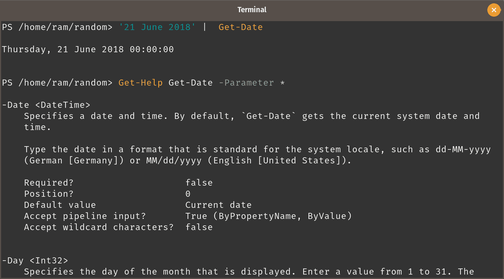

# 第五章：通过管道传递数据

本章内容包括以下主题：

1.  从输出中选择列

1.  限制 cmdlet 返回的项目数量

1.  扩展选择

1.  过滤对象

1.  对输出进行分组

1.  对输出进行排序

1.  对返回的对象采取行动

1.  理解启用管道的参数

1.  将内容导入 PowerShell

# 介绍

现在是信息大餐的时刻了。在上一章，*PowerShell 管理的第一步*中，我们探讨了一些简单的概念，例如操作日期和进程。在此过程中，我们也学到了如何使用 PowerShell 的一些技巧，比如衡量输出对象。

在本章中，我们将学习使用 PowerShell 高效且友好的工具之一：管道。

大多数 Linux 管理员在其 shell 命令或 shell 脚本中使用过管道。并且使用任何形式的 shell 脚本的管理员都知道，管道将一个命令的输出作为输入传递给下一个命令。在 Bash（及其衍生版本）的情况中，管道会将*文本*从前一个命令传递到下一个命令。

大多数 PowerShell cmdlet 输出对象。PowerShell 中的管道将输出的*对象*传递给下一个命令。当我们在 PowerShell 中运行 PowerShell 命令（而不是 Linux 命令）时，通常会得到类似表格的输出。我们可能认为这就是所有的输出。

当我们要求 PowerShell 获取任何信息时，它会在后台提取整个对象。然后，这个对象（或包含大量对象的包）会使用 PowerShell 内置的格式化规则进行处理，以便在主机上显示。引用微软的话：

屏幕上显示的是信息的摘要，而不是输出对象的完整表示。

因此，通常情况下，您在屏幕上看到的某个命令的输出，只是冰山一角！只是因为*潜藏*部分根据格式化规则被选择不显示。在本章中，我们将使用管道获取比默认屏幕显示更多的对象内容，并利用管道的功能，从 PowerShell 中挖掘更多的信息。

# 从输出中选择列

当我哥哥看到我在探索 `awk` 时，他说：“伙计，我们过度使用这个命令了！”当然，并不是所有在屏幕上显示的内容都是重要的——甚至并非必要。在本节中，我们将学习如何在 PowerShell 中分隔列，而无需使用 Linux 命令 `awk`。

# 准备就绪

转到一个包含一些可以操作的文件的目录。如果你没有这样的目录，可以创建一个并在其中创建一些文件。让文件具有不同的扩展名，以便我们在未来的教程中也可以使用它们。

如果你还没有克隆 Git 仓库，[`github.com/PacktPublishing/PowerShell-6.0-Linux-Administration-Cookbook`](https://github.com/PacktPublishing/PowerShell-6.0-Linux-Administration-Cookbook)。在目录`chapter-05`下有一个快速而简便的脚本，`Initialize-PacktPs6CoreLinuxLab.ps1`。运行该脚本以获取必要的文件。

# 如何操作……

`awk`命令处理文本，并根据输出文本中的分隔符，将输出分成多个列。这个分隔的输出再次以列的形式显示，使用类似 C 语言中的`print`函数。PowerShell 的工作方式稍有不同。

让我们开始吧。

1.  如果你还没有创建文件，请创建。以下是一些你可以用来创建文件的命令。

```
PS> New-Item ./random/cities -ItemType Directory -Force
PS> Set-Location ./random/
PS> New-Item random-text.txt, himalayas.jpg, crunched-numbers.csv, bangalore.jpg, screenshot-001.png, screenshot-002.png, screenshot-003.png, demo.doc, my-plugin.rb, ./cities/mumbai.html, ./cities/nyc.html, ./cities/cairo.html, ./cities/dubai.html, ./cities/paris.html -ItemType File
```

1.  你也许想下载一些真实的多媒体内容，以便我们获取`length`（文件大小）属性，供以后使用。随便下载一些随机的图片或媒体文件。

1.  导航到你保存文件的位置。我将它们保存在我的主目录下一个名为`random`的目录中。如果你使用了脚本，应该也会这样。

```
PS> Set-Location ./random/
```

使用 Tab 补全来完成 cmdlet 和路径。

1.  列出当前目录下的内容。

```
PS> Get-ChildItem -Path .
```


1.  假设你不需要`Mode`列。

```
PS> Get-ChildItem -Path . | Select-Object LastWriteTime, Length, Name
```


如果你注意到，`select`似乎没有遵循 PowerShell 使用的命名或大小写约定。是怎么回事呢？运行`Get-Command select`来找出原因。

1.  在当前的上下文中，这个顺序对你来说并没有太大意义。重新排列列的顺序。

```
PS> Get-ChildItem -Path . | Select-Object Name, Length, LastWriteTime
```


这看起来好多了。

1.  现在，将`LastWriteTime`列的名称改为`Modified`。

```
PS> Get-ChildItem -Path . | Select-Object Name, Length, @{Name='Modified'; Expression={$_.LastWriteTime}}
```

注意最后一列的名称，并与之前的输出进行对比。

1.  现在，只选择年份，不要整个日期。

```
PS> Get-ChildItem -Path . | Select-Object Name, Length, @{Name='Modified'; Expression={$_.LastWriteTime.Year}}
```

1.  查看自上次更改以来已过去多少天。

```
PS> Get-ChildItem -Path . | select Name, Length, @{Name='DaysSinceModification'; Expression={[math]::Round(((Get-Date) - $_.LastWriteTime).TotalDays)}}
```

# 它是如何工作的……

如果你运行了`Get-Command select`，你现在应该已经明白，`select`实际上是`Select-Object`的别名。如前所述，PowerShell 输出对象。这些对象随后使用内置的格式化规则进行格式化，并以特定方式显示在屏幕上。

当我们使用`Select-Object`时，我们通过指定需要显示哪些对象来覆盖格式化规则。虽然`Select-Object`的主要目的是选择我们需要的列，但该 cmdlet 还允许我们对输出列进行排序。

PowerShell 同样为我们提供了修改返回列名的自由。在这种情况下，我们使用*哈希表*来指定我们想要的名称，以及在该列下显示的数据。你甚至可以对返回的数据进行计算，并将其设置为计算属性。在最后一步，我们从当前日期中减去最后修改日期，选取自那时起经过的天数，然后，使用`Round`方法和`[math]`加速器来获得最后修改以来天数的四舍五入值。

`$_` 或 `$PSItem` 的概念。

# 还有更多...

尝试将`Select-Object`与其他 cmdlet（如 `Get-Command`）一起使用，来仅选择你需要的那些列。

# 另见

示例：创建并初始化一个简单的哈希表。

# 限制输出对象的数量

在前面的示例中，*从输出中选择列*，我们学习了如何使用 `Select-Object` cmdlet 来仅选择我们需要的列。在本示例中，我们将学习如何将 cmdlet 的输出限制为返回的所有项目的子集。

# 准备开始

确保你在一个包含一些文件的位置。列出当前目录的内容，并计算返回的项目数量。如果数量少于五个，你可能需要考虑向目录中添加更多项目。

1.  输入以下命令以计算当前路径下文件和目录的数量。

```
PS> (Get-ChildItem -Path .).Count
```

1.  如果你想减少输入的字符数，考虑到我们仅在终端运行命令，你可以使用 cmdlet 的别名和默认设置。

```
PS> (gci).Count
```

这些括号是必须的；括号的工作方式与数学中的相似：括号内的指令会先被处理。在这种情况下，我们希望首先执行 `gci`，然后选择从返回对象中获取的 `Count` 属性。

1.  获取 `Select-Object` 的参数列表。

```
PS> Get-Help Select-Object
```

我们看到诸如 `First` 和 `Last` 的参数，它们接受整数值。

# 如何做到...

导航到包含文件的目录。

1.  使用 `First` 参数，仅从返回的列表中选择前五个文件和目录。

```
PS> Get-ChildItem . | Select-Object -First 5
```

1.  假设你想要选取最后五个元素。

```
PS> Get-ChildItem . | Select-Object -Last 5
```

1.  跳过前三个对象：

```
PS> Get-ChildItem . | Select-Object -Skip 3
```

1.  如果你想跳过最后两个对象：

```
PS> Get-ChildItem . | Select-Object -SkipLast 2
```

1.  从输出中选取第四个元素：

```
PS> Get-ChildItem . | Select-Object -Index 3
```

1.  现在，将其与我们在前一个示例中学到的结合起来。仅选取前四个元素的文件名和最后修改时间。

```
PS> Get-ChildItem . | select -Property Name, LastWriteTime -First 4
```

# 它是如何工作的...

这是一个简单的示例，帮助你处理输出中返回项目的数量。在 PowerShell 中使用 `Select-Object`，我们不需要通过输出循环并计数，只为了获取我们想要的元素数量。`Select-Object` cmdlet 已内置该功能。

参数名称不言自明。也许除了 `Index` 参数，它的工作方式与大多数编程语言中的数组元素编号方式相同：从零开始。因此，数组中的第四个元素的索引是 `3`，而不是 `4`。

`Property` 和 `First` 这两个参数可以结合使用，因为它们都出现在 `Select-Object` 的帮助文档中的同一个参数集里。

# 展开属性中的属性

到目前为止，从我们所看到的两件事已经很明确：

1.  对象输出显得更加丰富，使用起来也更方便。

1.  一个对象可以包含更多的对象。

我们已经通过使用 `Select-Object` cmdlet 处理了第一个点，其中我们只选择了需要的对象属性，忽略了其他的。这一部分教程旨在分解第二个点，帮助更好地理解。

让我们带着一个想法进入这个教程：对象可以包含对象，而这些对象又可以包含更多对象。为了演示这一点，我们将使用 `Get-Process` cmdlet。

# 如何做到...

让我们从列出所有进程开始；我们将查看 `Get-Process` cmdlet 提供的所有属性，并寻找复杂的对象。

1.  选择 `Get-Process` cmdlet 输出中的所有属性。只选择第一个对象，以免你的控制台输出过多内容。

```
PS> Get-Process | Select-Object -Property * -First 1
```

观察 `Threads` 属性。

1.  选择进程的名称、ID 和线程。

```
PS> Get-Process | Select-Object -Property Name, Id, Threads
```

1.  列出 `pwsh` 进程的所有线程。

```
PS> Get-Process pwsh | Select-Object -ExpandProperty Threads
```

1.  输出内容很丰富。假设我们只需要结果输出中的 ID、优先级和启动时间。

```
PS> Get-Process pwsh | Select-Object -ExpandProperty Threads | Select-Object -Property Id, PriorityLevel, StartTime
```

这为我们提供了所有在 `pwsh` 下运行的线程的 ID、优先级和启动时间。

1.  如果我们对 ID 使用 `ExpandProperty` 呢？

```
PS> Get-Process pwsh | Select-Object -ExpandProperty Threads | Select-Object -ExpandProperty Id
```


# 它是如何工作的...

正如我们已经看到的，`Select-Object` 的默认参数是 `Property`。它接受属性名称并在输出中显示其值。该参数可以用于提取多个属性的值（如 `Name`、`Id`、`Threads`）。

然而，一些属性内部包含更复杂的对象，比如我们在 `Get-Process` 返回的对象的 `Threads` 属性中看到的那样。识别复杂对象的简单方法是看看它们是否被大括号包围。

`ExpandProperty` 参数仅接受单个属性名称作为输入，并展开该属性以显示其内部对象。这个展开后的结果还可以通过管道传递给 `Select-Object`（或任何其他相关的 cmdlet）进行进一步处理。

在对象不复杂的情况下，`ExpandProperty` 只会显示输出而没有头部。如果你注意到 `ExpandProperty` 的输出，它不包含展开的对象名称（在我们案例中是 `Threads`）；它只包含值。这个值又包含了多个属性。

在简单属性的情况下，使用 `ExpandProperty` 会简单地从输出中去除属性名称。

# 过滤对象

在食谱《*限制 cmdlet 返回的项数*》中，我们看到如何根据数量限制输出内容。在本食谱中，我们将学习如何根据某个特定标准而非数量来过滤输出。

# 准备就绪

如果你还没有阅读，返回阅读食谱《*与日期属性一起工作*》。本食谱使用日期对象的一个属性来过滤内容。虽然理解对象的过滤并非关键，但它仍然展示了基于对象属性的过滤是多么简单。

# 如何操作...

导航到你为本书创建文件的位置。

1.  列出该目录的内容，查看你有哪些内容。（如果你像我一样，可能甚至忘记了你在哪里创建了这个目录，以及你放了什么内容。）

```
PS> Set-Location ~/random
PS> Get-ChildItem -Path .
```

注意你得到的属性名称。

1.  现在，只挑选那些大于`0`字节的文件。

```
PS> Get-ChildItem -Path . | Where-Object -Property Length -GT -Value 0
```

1.  从文件中挑选所有 JPG 文件。为此，在现有条件上再加一个条件。尽管这次使用的是`FilterScript`参数，而不是`Property`。

```
PS> Get-ChildItem -Path . | Where-Object -FilterScript {$_.Length -GT 0 -and $_.Extension -EQ '.jpg'}
```

1.  添加一个条件，获取文件名以“c”开头的文件。

```
PS> Get-ChildItem -Path . | Where-Object -FilterScript {$_.Length -GT 0 -and $_.Extension -EQ '.jpg' -and $_.Name -CMatch '^c'}
```

1.  现在，选择那些在任何小时的第 30 分钟之前创建的文件。

```
PS> Get-ChildItem -Path . | Where-Object -FilterScript {$_.Length -GT 0 -and $_.Extension -EQ '.jpg' -and $_.Name -CMatch '^c' -and $_.LastWriteTime.Minute -LT 30}
```


# 工作原理...

在 PowerShell 中，输出的过滤非常简单。由于内容输出是一个对象，我们可以直接使用对象内部的属性进行过滤。

本食谱展示了两种过滤模式：

1.  使用一个属性，并将其值与输入进行比较，

1.  使用一个包含多个值和多个条件的过滤脚本。

`Property`参数只接受一个属性。为过滤输出，条件操作符和比较值被添加到语句中。

另一方面，`FilterScript`参数可以处理更复杂的过滤操作，例如，当我们需要输出满足多个条件时。

使用`Property`和`FilterScript`的一个显著区别是自动变量`$_`的使用。该变量包含管道中的*当前对象*。例如，在本食谱中，我们通过管道将`Get-ChildItem`返回的对象传递给`Where-Object`。自动变量`$_`包含`Get-ChildItem`返回的对象，`Where-Object`可以对其进行处理。在本例中，`$_.LastWriteTime`获取由`Get-ChildItem`返回的对象的`LastWriteTime`属性。

此外，`LastWriteTime`对象属于`System.DateTime`或`DateTime`类型。（运行`(Get-ChildItem .).LastWriteTime | Get-Member`了解更多信息。）因此，它可以进一步拆解为天、小时、分钟等，这也是为什么可以使用`$_.LastWriteTime.Minute`进行过滤的原因。

# 还有更多...

尝试在其他输出上使用`Where-Object` cmdlet，例如`Get-Process`的输出。

# 对输出进行分组

有些情况下，我们可以对输出的对象进行分组，以便更好地处理每个组，或者仅仅为了更有组织的输出。在本示例中，我们将通过管道将一个 cmdlet 的输出传递给`Group-Object`，并根据某个属性对输出进行分组。

# 如何操作...

要根据属性对对象进行分组，我们使用`Get-ChildItem` cmdlet 对本书中使用的文件进行操作。

1.  转到你创建或下载文件的位置。

```
PS> Set-Location ~/random
```

1.  仅列出文件（排除目录）。

```
PS> Get-ChildItem -Path . -File
```

或者使用*简写*版本。

```
PS> gci -File
```

1.  根据扩展名对对象进行分组。

```
PS> Get-ChildItem . -File | Group-Object Extension
```

1.  这个简写版本是：

```
PS> gci -File | group Extension
```


1.  使用`Select-Object` cmdlet 只显示扩展名和每个扩展名下的文件数。

```
PS> Get-ChildItem -Path . -File | Group-Object -Property Extension | Select-Object -Property Name, Count
```

1.  有没有更简单的方法来做到这一点？

```
PS> Get-ChildItem -Path . -File | Group-Object -Property Extension -NoElement
```

1.  现在我们已经了解了如何处理分组和展开的属性选择，让我们从中挑选出所有 JPG 文件。

```
PS> Get-ChildItem -Path . -File | Group-Object -Property Extension | Where-Object Name -EQ .jpg | Select-Object -ExpandProperty Group
```


# 它是如何工作的...

在这个示例中，我们所做的操作无疑是不直观的，因为我们本可以仅使用`Where-Object`和`Get-ChildItem`。然而，本示例的目的是展示如何使用`Group-Object`。`Group-Object` cmdlet 会根据我们指定的标准创建组，并根据该标准命名这些组。在我们的例子中，分组的标准是扩展名，因此，组的名称就是扩展名。

每个组包含其元素，这些元素本身也是对象。如果我们只想要组的数量和名称，我们可以使用`NoElement`参数。如果我们只想要元素，则使用`Select-Object` cmdlet 的`ExpandProperty`参数并展开所有元素。被展开的元素是`Group-Object`前一个 cmdlet 的对象（在我们的例子中是`Get-ChildItem`）。

如果`Where-Object`和其他 cmdlet 可以以复杂的方式做`Group-Object`能做的事，那为什么还要有`Group-Object`呢？继续阅读*对返回对象采取行动*，了解更多信息。

# 还有更多...

如果你已经掌握了 Tab 补全功能，你甚至无需选择那些默认未显示的属性。你只需要在管道后输入`Group-Object`，加一个空格并按 Tab 键；PowerShell 会显示可用于分组的对象。试试看：

```
PS> Get-ChildItem . -File | Group-Object<Space><Tab>
```

# 另见

示例 05.07：对返回的对象采取行动

# 排序输出

现在到了另一个简单的 cmdlet，它将为“*对返回的对象采取行动*”这一示例奠定基础。在本示例中，我们将对输出对象进行排序，以满足我们的要求。

# 如何操作...

我们将继续使用为本书创建的目录和文件。如果你的所有文件都是零字节，下载几个有内容的文件。文件类型无关紧要。

1.  列出目录中的文件。

```
PS> Get-ChildItem -Path .
```

1.  过滤输出，只有文件。

```
PS> Get-ChildItem -Path . -File
```

1.  将对象传递给`Sort-Object` cmdlet，以根据文件大小对输出进行排序。

```
PS> Get-ChildItem -Path . -File | Sort-Object -Property Length
```

1.  该表达式的简写为：

```
PS> gci . -File | sort Length
```

1.  排序文件，从最大文件到最小文件。

```
PS> Get-ChildItem -Path . -File | Sort-Object -Property Length -Descending
```

1.  从中选择三个最大的文件。

```
PS> Get-ChildItem -Path . -File | Sort-Object -Property Length -Descending -Top 3
```

1.  创建两个文件，并使用文本编辑器向它们添加一些内容。（或者使用以下脚本块创建一些随机文本。）

```
PS> $($i = 0; while ($i -lt 520) {(-join ((65..90) + (97..122) | Get-Random -Count 8 | ForEach-Object {[char]$_})).ToString(); $i++}) -join ' ' | Out-File ./random-text-1.txt; Start-Sleep -Seconds 60; $($i = 0; while ($i -lt 500) {(-join ((65..90) + (97..122) | Get-Random -Count 8 | ForEach-Object {[char]$_})).ToString(); $i++}) -join ' ' | Out-File ./random-text-2.txt
```

1.  现在，按照文件大小排序目录中的文件，然后按文件名排序。

```
PS> Get-ChildItem -Path . -File | Sort-Object -Property Length, Name
```

观察你得到的输出。

1.  按降序排序列表。

```
PS> Get-ChildItem -Path . -File | Sort-Object -Property Length, Name -Descending
```


# 它是如何工作的...

这个示例是通过管道传递对象的另一个演示。在`Sort-Object`的帮助文档中，我们看到一个名为`InputObject`的参数。这个参数是 PowerShell 中的一个通用术语，用来描述通过管道传递的输入参数。

`Sort-Object`接受来自管道的输入，并根据指定的属性进行排序。如果没有指定属性，则使用前一个命令输出对象的默认属性进行排序。如果输入多个属性，则根据指定属性的顺序进行排序。

排序可以按升序（默认）或降序进行。

# 对返回的对象执行操作

在本章中，我们一直在使用管道对对象执行各种操作。我们已经将对象从一个 cmdlet 传递到另一个 cmdlet，实际上对返回的对象进行了操作。因此，从技术角度来看，这个示例并不新颖。然而，为了让我们更熟悉管道的使用，并且展示管道不仅仅用于选择、过滤和排序，我们还将使用管道执行一些删除操作。

# 准备工作

如果你在我们创建的演示目录中没有文件，请继续创建一些文件。确保其中一些文件有内容。

假设你收到一个需求。有一个团队希望删除每种类型中最大的两个文件。如果某种类型的文件只有一个，那就不删除该文件。

# 如何操作...

以下是你可能需要执行的步骤概述：

1.  获取指定路径下的所有文件。

1.  按文件类型（扩展名）分组文件。

1.  过滤掉包含多个项目的组。

1.  展开每个组，按大小（长度）排序文件。

1.  从每个组中选择两个最大的文件。

1.  删除文件。

虽然我们正在使用一个沙箱目录，并且采取了不删除重要文件的预防措施，但最好仅使用 ShouldPerform（WhatIf 参数）来原型化操作。这样，文件不会被实际删除，而是 PowerShell 只会告诉你如果运行该命令会执行什么操作。

让我们开始吧。

1.  列出当前目录的内容，并根据扩展名分组输出。

```
PS> Get-ChildItem -Path . -File | Group-Object -Property Extension
```

1.  过滤以丢弃每个扩展名的单个文件。

```
PS> Get-ChildItem -Path . -File | Group-Object -Property Extension | Where-Object Count -GT 1
```

1.  现在让我们来看一个循环结构。我们将在后续章节中详细了解它是如何工作的。目前，只需知道它能正常运行。这里的目标是充分利用管道。

```
PS> Get-ChildItem -Path . -File | Group-Object -Property Extension | Where-Object Count -GT 1 | ForEach-Object {$_.Group | Sort-Object Length -Bottom 2}
```


1.  使用 `Remove-Item` cmdlet 删除这些文件。如果您不想实际删除文件，请使用 `WhatIf` 开关。

```
PS> Get-ChildItem -Path . -File | Group-Object -Property Extension | Where-Object Count -GT 1 | ForEach-Object {$_.Group | Sort-Object Length -Bottom 2} | Remove-Item -WhatIf
```

# 它的工作原理...

当任何 cmdlet 通过管道读取对象时，它读取对象的全部内容。而任何设计为通过管道接受输入的 cmdlet，则从对象中选择正确的属性，然后对这些对象执行操作。在这个例子中，选择的是 `Path` 属性，以便识别要删除的文件。

要知道某个 cmdlet 是否接受来自管道的输入，请使用 `Full` 参数运行 `Get-Help` 命令，并查看 `Accept pipeline input?` 的值是否为 true。`Where-Object` 的 `InputObject` 参数或 `Move-Item` 的 `Path` 参数就是其中的一些示例。

# 理解启用管道的参数

如果您计划仅在控制台上运行 PowerShell 命令，则了解管道不是必须的；它被很好地封装，并且 cmdlet 被设计得很好，能够处理在 cmdlet 之间传递对象的情况。然而，如果您计划创建自定义函数和模块，则理解管道的概念是您希望深入了解的内容。

在本例中，我们将研究 cmdlet 接受输入的两种方式。在创建函数的时候，我们将看看如何为参数启用管道输入。

# 如何做到...

我们将主要使用帮助文档来演示两种不同类型的管道输入。

1.  在提示符处，键入以下命令：

```
PS> Get-Help Get-Item -Parameter Path
```


它说该参数接受字符串输入，并且也接受通过属性名称和值输入。

1.  输入以下内容以查看是否接受有效字符串。

```
PS> '/home/ram/random' | Get-Item
```


1.  让我们尝试类似的操作，使用 `Get-Date`。

```
PS> Get-Help Get-Date -Parameter *
```

Date 参数通过管道接受值。但类型是 DateTime，而不是字符串。

1.  尝试通过管道发送有效字符串，看看它是否被转换为日期。

```
PS> '21 June 2018' |  Get-Date
```

它确实将字符串转换为日期和时间。



1.  现在，让我们回到获取当前目录详细信息的步骤。不过，这次我们只会选择对象的 FullName 属性。

```
PS> Get-Item . | Select-Object FullName
```

1.  通过管道将此传递给 `Get-ChildItem` cmdlet。

```
PS> Get-Item . | Select-Object FullName | Get-ChildItem
```

出现了一个错误。


1.  将属性名称更改为 `LiteralPath`。

```
PS> Get-Item . | Select-Object @{Name = 'LiteralPath'; Expression = {$_.FullName}}
```

1.  通过管道将对象传递给 `Get-ChildItem`。

```
PS> Get-Item . | Select-Object @{Name = 'LiteralPath'; Expression = {$_.FullName}} | Get-ChildItem
```

那成功了。

# 它的工作原理...

通过管道有两种类型的输入：

1.  `ByPropertyName`

1.  `ByValue`

`ByValue` 类型也许是最常见的。如果一个参数通过管道按值接受输入，它会查找与输出中定义的数据类型匹配的数据类型，并将输出作为其输入。在数据类型与定义的类型不相同，但可以转换为所需类型的情况下，参数会将值转换为它所接受的数据类型并进行处理。这在 `Get-Date` 中发生过，我们将日期作为字符串发送，并通过管道传递给 `Get-Date`。

在 `Get-Item` 中，`Path` 参数接受字符串输入并处理命令。在 `Get-Date` 中，`Date` 参数将字符串转换为 `DateTime` 对象并处理请求。

与 `ByValue` 相比，`ByPropertyName` 会查找与参数*完全相同名称*的属性。在我们的例子中，`Get-ChildItem` 的 `LiteralPath` 在我们传递 `FullName` 属性时抛出了错误，尽管它本质上是对象的字面路径，并且是一个字符串值。错误的原因是属性并没有被命名为 `LiteralPath`。当我们将属性名称更改为 `LiteralPath` 时，`Get-ChildItem` 通过管道接受了输入，并给出了期望的输出。

# 导入内容到 PowerShell

管理多个计算机的管理员需要将某些输入传递给 cmdlet，以便自动化任务。虽然大多数 Linux 管理员熟悉将输入发送到文件，但在 PowerShell 中，重要的一点是，除了接受基于文件的输入（例如：`Get-Content`），PowerShell 还能够*导入*输入。这种导入的输入是一个 PowerShell 对象。

在这个食谱中，我们将研究两种导入 cmdlet，并学习如何使用它们。

# 如何做到这一点...

在食谱 *从文本到对象的解析输入* 中，我们使用 `Import-Csv` 导入了一个以逗号分隔的值文件，将其中的数据转换为 PowerShell 对象。让我们回顾一下我们学到的内容，不过这次，由于我们已经知道如何处理对象，我们将以某种方式使用导入的内容。

在导入内容之前，让我们首先将一些内容导出到 CSV 文件。这样，我们就有了一些相关的内容可以进行操作。

1.  导航到你为本章创建文件的位置。列出目录的内容。尽管本书在控制台中使用（并推荐）完整的 cmdlet（当然使用 Tab 补全），但如果你愿意，也可以使用别名。

```
PS> Get-ChildItem -Path . | Select-Object Name, FullName, CreationTime, LastWriteTime, Extension, Length
```

1.  将内容导出到 CSV 文件。

```
PS> Get-ChildItem -Path . | Select-Object Name, FullName, CreationTime, LastWriteTime, Extension, Length | Export-Csv ./file-list.csv
```

1.  使用 LibreOffice Calc 或文本编辑器等电子表格处理器打开该文件，以查看其内容。

```
PS> Get-Content ./file-list.csv
```

这是 `Get-ChildItem` 返回的对象的纯文本表示。

1.  导入 CSV 文件的内容，将文本转换为对象。

```
PS> Import-Csv ./file-list.csv
```

1.  查找此命令返回的对象类型。

```
PS> Import-Csv ./file-list.csv | Get-Member
```

对象类型是 `System.Management.Automation.PSCustomObject`。

1.  检查这是否与 `Get-ChildItem` 返回的相同。

```
PS> Get-ChildItem . | Get-Member
```

1.  `Import-Csv`返回的对象不同。是否可以像对待其他对象一样对待它？使用成员访问运算符获取`CreationTime`。

```
PS> (Import-Csv ./file-list.csv).CreationTime
```

1.  只选择年份。

```
PS> (Import-Csv ./file-list.csv).CreationTime.Year
```

1.  查找上一个命令返回的对象类型。

```
PS> (Import-Csv ./file-list.csv).CreationTime | Get-Member

    TypeName: System.String
```

1.  尝试将`LastWriteTime`转换为`DateTime`对象。只选择第一个记录。

```
PS> Get-Date (Import-Csv ./file-list.csv | Select-Object CreationTime -First 1).CreationTime
```

1.  如果我们必须保留`Get-ChildItem`返回的对象中的所有对象，包括它们的对象类型，该怎么办？

```
PS> Get-ChildItem -Path . | Export-Clixml ./file-list.xml
```

1.  现在，将 XML 的内容导入到会话中。

```
PS> Import-Clixml ./file-list.xml
```

1.  查找导入命令返回的对象类型名称。

```
PS> Import-Clixml ./file-list.xml | Get-Member
```

1.  选择`CreationTime`属性并查找它的类型。

```
PS> (Import-Clixml ./file-list.xml).CreationTime | Get-Member

    TypeName: System.DateTime
```

1.  只选择年份。

```
PS> (Import-Clixml ./file-list.xml).CreationTime.Year
```

# 它是如何工作的……

从 CSV 导入内容是一个直接的过程。CSV 中的列是由逗号分隔的。PowerShell 会根据输入的内容创建一个对象，每一列都会成为 PowerShell 自定义对象的一个属性。我们对对象执行的操作也可以作用于`PSCustomObject`，然而`Import-Csv`的唯一限制是属性不能是多值的，也不能包含其他子属性。虽然使用 CSV 有可能实现多值属性，但这需要在对象导入 PowerShell 后进行一些处理。一个方法是通过分隔符分隔属性的值，然后在导入后分割这些分隔值。

另一方面，CLIXML（或称公共语言基础结构 XML）是一个完整的.NET 对象。当 PowerShell 对象导出为 CLIXML 时，该对象会原封不动地保留下来。也就是说，CLIXML 保留了所有属性（理论上可以达到任意深度），以及输出对象的所有方法。换句话说，可以说 CLIXML 导出在对象成员方面几乎是无损的。

# 另见

方案：使用 ASCII 字符生成随机文本
