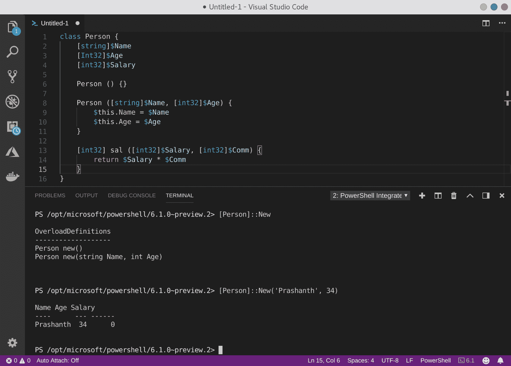

# 第六章：使用变量和对象

在本章中，我们将讨论以下主题：

1.  使用环境变量

1.  存储 .NET Core 对象实例的输出

1.  为对象创建自定义属性

1.  从返回的对象创建自定义对象

1.  理解类型数据的扩展

1.  在会话间保留对象的修改

1.  删除自定义类型数据

# 介绍

变量在编程中非常重要，因为它们充当在程序执行过程中存储信息的容器。尽管管道使得 PowerShell 非常灵活，但它们仍然无法替代变量，因为通过管道传递的对象必须立即被消费，而不是所有脚本都以这种方式工作，因为我们的需求各异。

我们都知道各种数据类型：`int`、`double`、`string`、`char`、`array` 等。在 PowerShell 中，另外两种重要的变量类型是*哈希表*和*对象*。哈希表是由键值对构成的字典表。正如我们所看到的，PowerShell 中的对象可以是简单的，也可以是复杂的，能够存储不同类型的值。

在 PowerShell 中，对象可以存储到变量中。例如，

```
$Processes = Get-Process
```

会将所有进程存储到变量 `$Processes` 中。

需要记住的另一个关于变量的点是作用域。默认情况下，变量具有局部作用域，这意味着它们在指定的函数内有效。全局变量在整个程序中有效。通常，最佳实践是使用局部变量。

全局变量通过 `$Global:` 前缀声明和使用，例如 `$Global:MyVariable`。

# 使用环境变量

在本示例中，你将了解环境变量。当通过 Shell 会话与系统交互时，Shell 需要许多信息来确定程序访问、可用资源、默认配置、系统属性等。这些设置中有一部分被配置为变量，这些设置通常被称为*环境变量*。

尽管在安装期间硬编码这些信息是一种做法，但它会使整个系统成为一个不可重新配置的整体，除非通过所谓的“重建并重新安装”方法来解决。通过环境变量，引入了另一层灵活性。

# 如何操作...

让我们通过以下步骤开始使用环境变量：

1.  要显示环境变量，请键入 `Get-ChildItem env:` 或 `Get-Item env:` 然后按回车键。

```
PS> Get-ChildItem env:
PS> Get-Item env:
```

1.  `Env:` 也是 PowerShell 提供的一个提供程序，它的工作方式类似于文件系统。因此，你也可以 `Set-Location` 到 `Env:` 并使用 `Get-ChildItem .` 来列出系统中可用的变量。

1.  要显示特定环境变量的值，运行以下命令。

```
PS> Get-ChildItem Env:/PATH | Select-Object value | Format-Table -Wrap
```

在键入 `Get-ChildItem Env:/` 后，你可以使用 Tab 键补全来列出所有环境变量。

1.  对 `PATH` 环境变量执行 `Get-Member` 来查找其类型。

1.  在更改环境变量之前，使用 `$env:PATH | Get-Member` 列出 `PATH` 变量。它是一个字符串。请将内容保存在安全的地方。

1.  现在，通过将 `sqlcmd` 工具的可执行文件路径添加到 `$env:PATH` 变量中，更新 `PATH` 环境变量。此操作只是将一个字符串附加到现有值中。

你可以将任何位置添加到 `PATH`。如果你坚持获取 `sqlcmd`，请访问 [Microsoft 文档](https://docs.microsoft.com/en-us/sql/linux/sql-server-linux-setup-tools?view=sql-server-linux-2017)，了解如何获取 SQL Server 2017 的指南。

```
PS> $env:PATH = $env:PATH + ':/opt/mssql-tools/bin'
PS /root> sqlcmd
```

上面代码块的输出如下图所示：


1.  让我们退出当前会话，启动一个新会话，检查 `PATH` 变量，并运行 `sqlcmd` 可执行文件。

```
PS> sqlcmd 

sqlcmd : The term 'sqlcmd' is not recognized as the name of a cmdlet, function, script file, or operable program.
```

# 它是如何工作的...

如同我们在 *列出 PowerShell 中的各种提供者* 中看到的那样，`Env` 是一个包含环境特定配置的提供者。这些配置选项大多也以环境变量的形式暴露给我们。我们可以使用 cmdlet `Get-ChildItem` 和 `Get-Item` 列出可用环境变量的值，因为 `Env:` 是 `Env` 提供者中的一个驱动器。由于环境变量没有子项，`Get-Item` 和 `Get-ChildItem` 返回相同的输出。

由于这些变量决定了你的会话如何与系统交互，因此对这些值所做的更改是暂时性的。换句话说，`$env:PATH` 的值是从你 Linux 计算机上的配置中获取的。在 PowerShell 会话中手动更改 `$env:PATH` 的值，只要 PowerShell 会话处于活动状态，该更改就会生效。但对 `$env:PATH` 的更改并不会改变系统本身的值。

如果你希望某些更改是永久性的，可以编辑 `.bashrc` 或 **`~/.bash_profile`** 配置文件。如果你希望使用 PowerShell 而不是 Bash，请在 PowerShell 配置文件中进行更改。有关如何操作的说明，请参见章节 *使用 PowerShell 为管理做准备* 中的配方 *启用每次加载时自动执行命令*。

# 还有更多...

你还可以使用 .NET 类型加速器及其方法来访问环境变量。

```
PS> [environment]::GetEnvironmentVariable("PATH")
```

# 另见

1.  关于环境变量：`Get-Help about_Environment_Variables`

1.  配方 1.11：列出 PowerShell 中的各种提供者

1.  配方 3.4：启用每次加载时自动执行命令

# 存储 .NET Core 对象实例的输出

.NET 是面向对象的，并且基于类和对象工作。PowerShell 作为该框架的扩展，允许你与 .NET 框架和 COM 接口一起工作，从而执行许多系统管理任务。这样，你不仅限于使用 cmdlet 执行的任务。

在本配方中，我们将在 PowerShell 中定义一个简单的类。

# 准备工作

我们建议在这个食谱中使用 Visual Studio Code。要了解如何安装和配置它，请访问本章的食谱 *安装 Visual Studio Code*，该章节在 *使用 PowerShell 准备管理工作* 中。

# 如何操作...

启动 Visual Studio Code 并处理它要求的任何即时需求。

1.  在 Visual Studio Code 中打开一个新文件，并设置文件类型为 PowerShell。

1.  在脚本窗格中输入以下内容。文件不需要保存。

```
class Person {
    [string]$Name
    [Int32]$Age
    [int32]$Salary

    Person () {}

    Person ([string]$Name, [int32]$Age) {
        $this.Name = $Name
        $this.Age = $Age
    }

    [int32] sal ([int32]$Salary, [int32]$Comm) {
        return $Salary * $Comm
    }
}
```

1.  要查找类的构造函数，请调用静态方法 `New`；在提示符下输入以下内容。

```
PS> [Person]::New
```

1.  这样我们就有了两个同名的函数；这些是重载定义。现在，通过传递参数来创建一个新对象。

```
PS> [Person]::New('Prashanth',34) 
```



1.  现在，让我们以 PowerShell 的方式调用构造函数，这会调用 .NET 的构造函数。这样会创建一个 Person 类的实例（根据定义，它是一个对象）。

```
PS> $Person = New-Object -TypeName Person -ArgumentList 'Prashanth', 34
```

1.  要列出对象的属性（以及类的属性），可以运行 `Get-Member` cmdlet。

```
PS> $Person | Get-Member 

PS> $Person | Select-Object Name, Age, Salary | Format-Table -AutoSize 

PS> $Person.sal(200,2)
```


1.  接下来，让我们看看其他示例。我们将使用系统定义的类库。

```
PS> $MailClient = New-Object -TypeName System.Net.Mail.SmtpClient 'packtpub.smtpdomain.com'
PS> $Message = New-Object System.Net.Mail.MailMessage('pjayaram@packtpub.com', 'pjayaram@packtpub.com', 'Subject', 'Welcome to Packt!')
PS> $MailClient.Send($Message)
```

1.  让我们看看使用 `System.Management.Automation` 类对象进行密码加密的另一个示例。

```
PS> $User = 'Prashanth' 
PS> $Password = 'Y94b^E$85CBLU%at' 
PS> $SecurePassword = ConvertTo-SecureString $Password -AsPlainText -Force 
PS> $Credentials = New-Object -TypeName System.Management.Automation.PSCredential -ArgumentList $User, $SecurePassword 
PS> $Credentials | Get-Member
```


# 它是如何工作的...

这个食谱的目标是演示 PowerShell 如何与 .NET 紧密配合工作，并且按照 *.NET 方式* 创建的对象可以轻松在 PowerShell 中调用（并存储）。首先，我们使用 `class` 关键字声明一个类。接着声明它的参数，然后创建两个构造函数：一个是默认构造函数，一个是带参数的构造函数。

我们还创建了一个名为 `sal` 的方法。我们定义了它的返回类型为 `int32`，并定义了两个参数。在其中，我们定义了需要返回的内容。

回到 PowerShell 提示符，我们调用类的静态方法（而非对象的方法）`New`。语法是先提及类名，然后是两个连续的冒号 (`::`)，在全局命名空间中调用它，接着是方法名。

如果你按照步骤操作，你还会看到使用两个不同系统类库的例子，`System.Net.Mail.SmtpClient` 和 `System.Net.Mail.MailMessage`，并通过将 mail-message 的输出与 SMTP-client 对象结合来实例化一个方法。

接下来，我们使用系统类库 `System.Management.Automation.PSCredential`。在这个示例中，我们将一些文本发送给 `ConvertTo-SecureString`，它接受明文输入并将其转换为安全字符串。然后，我们将加密后的字符串传递给 `PSCrendital` 系统类，将用户名和安全字符串存储到 `$Credentials` 变量中。

# 另见

1.  食谱 3.1：安装 Visual Studio Code

# 向对象添加自定义属性

PowerShell cmdlet 使管理员能够处理大多数任务。然而，也有一些情况，返回的对象不能满足某个脚本的管理需求。在这种情况下，我们可能需要根据现有的 .NET 类创建自己的自定义对象，或者至少为对象添加自定义属性。

虽然字符串是`System.String`类型的对象，`Get-Process` cmdlet 返回的是 `System.Diagnostics.Process` 类型的对象，`Get-ChildItem` 返回的是 `System.IO.FileInfo` 类型的对象，而自定义创建的对象的类型是 `PSCustomObject`。

# 如何做到这一点...

现在让我们继续创建一个自定义对象。

1.  要创建自定义对象，请使用 `New-Object` cmdlet。

```
PS /home/PacktPub> New-Object -TypeName PSCustomObject
```

1.  这对我们帮助不大。让我们向其中添加几个属性及其值，并将这些值存储在一个变量中。

```
PS> $MyCustomObject = [pscustomobject]@{ 
  Name = 'Prashanth Jayaram'
  Title = 'PowerShell'
  Publisher = 'Packt' 
}

PS> $MyCustomObject
```

1.  要向对象添加属性，请使用 `Add-Member` cmdlet。

```
PS> $MyCustomObject | Add-Member -MemberType NoteProperty -Name 'Location' -Value 'United States'
PS> $MyCustomObject
```

1.  要从对象中移除属性，使用以下命令。

```
PS> $MyCustomObject.PsObject.Properties.Remove('Location')

PS> # To see if the property is still available, run:
PS> $MyCustomObject.Location
```

1.  要访问属性，可以使用成员访问操作符 (`.`)。

```
PS> $MyCustomObject.Name 
Prashanth Jayaram

PS> $MyCustomObject.Title 
PowerShell

PS> $MyCustomObject.Publication 
Packt
```

# 它是如何工作的...

创建对象很简单。你所需要做的就是告诉 PowerShell 你正在创建一个自定义对象，通过调用`[psobject]`加速器并指定你想要添加到对象的属性。在调用加速器后，我们指定属性的名称，并为它们赋值。记录是逐个添加的，使用哈希文字符号表示法（`Name = 'Prashanth'`）。

在此阶段，由于我们在创建对象时使用了哈希文字符号表示法，容易将哈希表与 PSObject 混淆。请记住，它们彼此之间非常不同。我们将在 *数组与哈希表* 这一章中深入讨论哈希表是什么。

我们在创建的自定义对象中提到了三个属性：`Name`、`Title` 和 `Publisher`。如果我们以后想添加更多属性，可以简单地使用 `Add-Member` cmdlet，在其中我们指定对象（通过管道传递对象），指定属性的名称，并为其赋值。

移除属性稍微复杂一些，因为我们没有 `Remove-Member` cmdlet，也没有我们在步骤中使用的成员容易被发现。例如，`[PSCustomObject] | Get-Member` 并不会揭示 `PsObject` 是它的成员。我们在 `PSObject` 对象的 `Properties` 对象中调用 `Remove` 方法，这是我们创建的自定义对象的一部分。（这么多对象！）

访问对象中的属性就像使用成员访问操作符并附上属性名称一样简单。

# 另见

1.  配方：创建并初始化一个简单的哈希表

# 从返回的对象创建自定义对象

我们现在知道如何从零创建自定义对象。在这个方法中，我们将使用一个返回的对象，并修改它来创建一个自定义对象。当我们学习循环时，我们将扩展这个功能，创建更通用的自定义对象；在生产环境中，这一功能可以用来做更多的事情！

# 如何实现...

学习某个事物的第一步是将其简化。因此，我们将只选择一个对象实例并与之操作。

1.  获取所有进程，只选择名称、ID、工作集和启动时间，选取列表中的第 5 个进程并将其分配给一个变量。

```
PS> $Process = (Get-Process | Select-Object Name, Id, WS, StartTime)[4]
```

1.  假设我们不喜欢对象中属性的名称。让我们来更改这些名称。

```
PS> $CustomProcess = New-Object -TypeName PSObject -Property @{
  ProcessName = $Process.Name
  ProcessId = $Process.Id
  WorkingSet = $Process.WS
  StartedAt = $Process.StartTime
}
PS> $CustomProcess
```


1.  但这不是我们指定的顺序。让我们按顺序获取它们。

```
PS> $CustomProcess = [ordered]@{
  ProcessName = $Process.Name
  ProcessId = $Process.Id
  WorkingSet = $Process.WS
  StartedAt = $Process.StartTime
} 
PS> New-Object -TypeName PSObject -Property $CustomProcess
```


1.  重新创建对象，展示进程运行了多长时间，而不是它何时启动。

```
PS> $CustomProcess = [ordered]@{
  ProcessName = $Process.Name
  ProcessId = $Process.Id
  WorkingSet = $Process.WS
  RunningMins = [math]::Floor(((Get-Date) - $Process.StartTime).TotalMinutes)
}
PS> New-Object -TypeName PsObject -Property $CustomProcess
```


# 它是如何工作的...

在这个方法中，我们从一个输出对象（`$Process`）创建了一个自定义对象（`$CustomProcess`）。可以使用成员访问运算符访问`$Process`中的属性。来自`$Process`的值作为`$CustomObject`中的属性值，但`$CustomObject`中的名称不同。在这个方法中，我们还使用了一个计算属性`RunningMins`。

这里需要注意的一个重要点是，这个方法的结果也可以通过使用计算属性和`Select-Object`来实现。然而，在对象的通用性很重要并且对象实例数量显著增多的情况下，使用自定义对象会更简单。我们将在未来的章节中扩展这一功能，在学习如何使用循环结构后。

另一个需要注意的点是使用`[ordered]`加速器。通常，自定义对象的属性不会按我们提到的顺序出现。在这个方法中，我们将哈希字面量表示法与自定义对象的创建分开。我们首先创建一个有序的哈希表，其中包含属性名称和属性值，然后，指定创建的哈希表作为`New-Object` cmdlet 的`Property`参数，来创建具有我们想要顺序的属性的自定义对象。

# 另见

1.  [创建 .NET 和 COM 对象](https://docs.microsoft.com/en-us/powershell/scripting/getting-started/cookbooks/creating-.net-and-com-objects--new-object-?view=powershell-6)（Microsoft 文档）

# 理解类型数据的扩展

在例子中，*选择输出的列*，我们使用了一个哈希表来设置自定义列的名称和表达式。后来，我们还在`Select-Object`语句中使用了一个小的计算来获取计算后的输出。如果你尝试通过新名称选择列，那也会起作用。从技术上讲，你已经扩展了对象。但是，类型数据到底是什么？为什么我们需要一个例子来扩展它，而不只是使用`Select-Object`呢？

深入探讨类型数据是什么以及如何与.NET 类和对象一起使用可能会让这个概念变得“高级”。历史上，我们大多数学习者一直拖延学习“高级”主题。因此，我们将坚持简单的部分，只与 PowerShell 一起工作。这个例子将作为一个启动平台，帮助你通过简化并让学习变得有趣的方式理解它，避免任何“高级”内容，以利于学习。

有两种方法可以扩展类型数据：

1.  使用 PowerShell cmdlets（了解其工作原理）

1.  使用 XML 文件（为了可移植性）

# 准备工作

为了理解我们在说什么，这里你需要先阅读以下例子：

1.  从输出中选择列

1.  从返回的对象创建一个自定义对象

让我们回到这个问题：为什么要扩展类型数据，而我们可以使用`Select-Object`呢？

效率。虽然你可以更改名称、添加计算并使用新名称引用计算后的属性，但该更改仅会在当前上下文中存在。如果你将其添加到变量中，就像在上一个例子中*创建一个从返回对象生成的自定义对象*那样，做了些巧妙的名称更改并创建了一个自定义的`NoteProperty`，那将是一条很长的路要走。于是，进入：类型数据的扩展。

经验法则是，如果你做某事很频繁，说明存在问题：你没有考虑自动化它。例如，如果你运行：

```
PS> Get-ChildItem -Path . | select Name, Length, @{Name='Age'; Expression={[math]::Round(((Get-Date) - $_.LastWriteTime).TotalDays)}}
```

而不是：

```
PS> Get-ChildItem -Path . | select Name, Length, Age
```

如果你一天做十五次，你应该考虑扩展对象，以便获得你关心的内容。

# 如何做…

导航到你为实验使用创建文件的位置。

1.  输入以下命令：

```
PS> $FilesWithAge = Get-ChildItem . | Select-Object Name, Length, LastWriteTime
```

1.  现在，为变量`$FilesWithAge`添加一个属性；该属性应该是每个文件的年龄，单位为天。

```
PS> $FilesWithAge | Add-Member -MemberType ScriptProperty -Name Age -Value { [math]::Round(((Get-Date) - $this.LastWriteTime).TotalDays) }
```

1.  为它添加另一个属性，命名为`ComputerName`，即你的本地主机名。

```
PS> $ComputerName = hostname
PS> $FilesWithAge | Add-Member -MemberType NoteProperty -Name ComputerName -Value $ComputerName
```

1.  添加另一个属性，作为`LastWriteTime`的别名，命名为`Modified`。

```
PS> $FilesWithAge | Add-Member -MemberType AliasProperty -Name Modified -Value LastWriteTime
```

1.  要将其格式化为一个漂亮的表格，请使用以下命令：

```
PS> $FilesWithAge | Format-Table -AutoSize
```


1.  现在，删除变量，并查询当前目录中的文件（因为变量实际上保存的就是这些内容）。

```
PS> Remove-Variable FilesWithAge
PS> Get-ChildItem .
```

你看不到`Age`、`ComputerName`或`Modified`属性。如果你愿意，可以尝试使用`Get-Member`。

接下来，我们看看如何扩展类型数据本身，以便每次运行`Get-ChildItem`时，你也能得到我们添加到变量中的三个属性。

1.  获取运行`Get-ChildItem`时返回的对象。

```
PS> Get-ChildItem | Get-Member
```

1.  你会得到`System.IO.DirectoryInfo`以及`System.IO.FileInfo`。我们选择`System.IO.FileInfo`。运行以下命令。

```
PS> $ComputerName = hostname 

PS> Update-TypeData -TypeName System.IO.FileInfo -MemberType NoteProperty -MemberName ComputerName -Value $ComputerName

PS> Update-TypeData -TypeName System.IO.FileInfo -MemberType AliasProperty -MemberName Modified -Value LastWriteTime

PS> Update-TypeData -TypeName System.IO.FileInfo -MemberType ScriptProperty -MemberName Age -Value { [math]::Round(((Get-Date) - $this.LastWriteTime).TotalDays) } 
```

1.  查询当前目录的内容，并可以选择将输出格式化为表格。

```
PS> Get-ChildItem . | Select-Object Name, Length, ComputerName, Age, Modified | Format-Table -AutoSize
```


1.  对文件系统中的任何目录执行相同的操作，唯一的条件是目录应该包含至少一个文件，而不仅仅是更多的目录。

```
PS> Get-ChildItem ./cities/ | Select-Object Name, Length, ComputerName, Age, Modified | Format-Table -AutoSize
```

# 它是如何工作的……

在第一部分，我们向某个变量中的对象添加了成员。这是对*创建自定义对象从返回的对象*的命令行提示样式扩展，在这种情况下，效率稍微更高一些。然而，我们对对象所做的更改仅在变量`$FilesWithAge`有效时有效。通过`Get-ChildItem`返回的对象没有被修改。

这里有一个重要的要点需要注意：`$this`。我们在处理通过管道传递的对象时曾遇到过自动变量`$_`（或者在 PowerShell V3 之后是`$PSItem`）；该变量保存管道中当前对象的实例。然而，当我们需要执行对象扩展时，我们使用自动变量`$this`。为什么？因为，被引用的属性是*在*父对象中被引用（即通过`Get-ChildItem`返回的对象）。外部方法可以使用`$_`。从某种意义上说，`$_`在执行成员添加时甚至还不存在。而且，`$this`实际上指的是对象本身，它是由`Get-ChildItem`返回的，而不仅仅是它的一个实例。

当我们希望将某个成员作为对象本身的一部分时，无论某个变量或对象实例的有效性如何，我们都会*扩展类型数据本身*。因此，无论在什么上下文中运行 cmdlet，你都会得到你添加的附加成员。当然，PowerShell 中的格式化规则仍然可能不会默认显示这些成员。你始终可以调用特定的成员，例如使用`Select-Object`获取属性，或者简单地使用成员访问操作符访问属性：`(Get-ChildItem .).Age`。

为此，我们使用`Update-TypeData` cmdlet。`Update-TypeData`在此上下文中需要`TypeName`，正如我们已经看到的，可以通过对返回对象使用`Get-Member`来确定。

我们在`Update-TypeData`语句中提到四个内容：

1.  类型名称

1.  成员类型

1.  成员名称

1.  成员值

成员类型接受多个值，我们使用三种：

1.  `AliasProperty`，它只是指向对象中另一个成员的引用。新属性只是现有属性的另一个名称。因此，`Value`参数可以直接使用现有成员的名称。

1.  `NoteProperty`，它是一个静态值。在我们的例子中，我们可以使用主机名作为静态值。

1.  `ScriptProperty`，本质上是一个计算。我们计算上次修改日期和当前日期之间的时间跨度。这个计算是该成员的`Value`，并接受一个脚本块。

对对象的这种修改只要会话有效，就会生效；该更改在会话间不具有持久性。这将引导我们进入下一个食谱，即让对象修改在会话间保持有效。

# 另见

1.  食谱 5.1：从输出中选择列

# 保持对象修改在会话间有效

在上一个食谱中，我们了解了类型数据扩展的内容，我们使用了 `Update-TypeData` cmdlet 来添加成员。然而，我们提到过，更新在会话有效期间是有效的。现在，有两种方法可以使类型数据在会话间保持有效：

1.  使用 PowerShell 配置文件。

1.  使用 XML 文件

PowerShell 配置文件是直接明了的。然而，通常情况下，类型数据扩展和格式化规则是作为 PowerShell 模块的一部分打包的。在这种情况下，将代码添加到配置文件并不特别有用。在这个食谱中，我们将编写一个简单的 XML（`.ps1xml`）文件，我们将加载它以扩展类型数据。

# 准备工作

重新启动你的 PowerShell 会话，以便丢弃自定义数据类型扩展。

# 如何操作…

我们需要一个 XML 文件。你可以使用 `New-Item` cmdlet 创建一个，或者简单地使用你喜欢的文本编辑器。我们在这个食谱中使用 Visual Studio Code。

1.  打开文本编辑器，创建一个新的空文件，并将其保存为`CustomTypes.ps1xml`。

1.  将以下内容添加到 XML 文件中。确保不要更改大小写。

```
<?xml version="1.0" encoding="utf-8" ?>
<Types>
 <Type>
   <Name>System.IO.FileInfo</Name>
   <Members>
     <AliasProperty>
       <Name>Modified</Name>
       <ReferencedMemberName>LastWriteTime</ReferencedMemberName>
     </AliasProperty>
     <ScriptProperty>
       <Name>Age</Name>
       <GetScriptBlock>[math]::Round(((Get-Date) - $this.LastWriteTime).TotalDays)</GetScriptBlock>
     </ScriptProperty>
     <NoteProperty>
       <Name>ItemType</Name>
       <Value>File</Value>
     </NoteProperty>
   </Members>
 </Type>
</Types>
```

1.  将文件保存在一个方便的位置。

1.  回到终端（或 PowerShell 集成控制台），输入以下命令以使用 XML 更新类型数据。注意 `PrependPath` 参数。

```
PS> Update-TypeData -PrependPath ~/Documents/code/github/powershell/chapter-06/CustomTypes.ps1xml
```

1.  现在，列出你选择的任何目录中的所有文件。

```
Get-ChildItem . -File | Select-Object Name, Length, Age, Modified
```

你应该能看到你创建的新属性。


建议不要修改 `$PSHome` 目录中的 PS1XML 文件。这些文件由 Microsoft 数字签名，并且在升级或打补丁时可能会被替换为新版本。

# 工作原理…

自定义类型和格式主要在创建自定义模块时使用。管理员很少需要修改标准 PowerShell 模块的类型或格式。当你确实需要修改自定义类型或格式时，应该创建一个新的 PS1XML 文件；不要修改标准文件，因为它们是数字签名的，修改它们会破坏你的设置。

把这个 PS1XML 文件当作一个普通的 XML 文件。这里有一种更简单的方式来展示结构。记住，每个类型以及其中的每个成员，都必须有一个名称。

```
Types
-- Type
---- Members
------ [The custom properties and methods you define]
```

本质上，使用 XML 扩展类型与我们在上一个教程中执行类型扩展的方式没有太大区别，只不过这次使用了 XML 文件，使得设置更具可移植性。当我们开始创建自定义模块时，我们将会研究如何将类型与模块一起打包，到那时我们会详细探讨如何处理路径。目前，我们通过手动指定文件的确切路径来加载 XML。如果你希望在每次会话中加载这些自定义类型，你可以轻松地从个人配置文件中调用 PS1XML。这里的可移植性在于，XML 可以轻松共享或部署；加载过程将是手动的，或者通过个人配置文件加载——比将 cmdlet 添加到配置文件中要简单得多。

当使用 cmdlet 更新类型数据时，我们使用了 `Name` 和 `Value` 参数，以及 `MemberType` 参数。PowerShell 会理解上下文并相应地设置类型。然而，对于 XML，必须记住为每个成员类型使用正确的标签。例如，对于 `AliasProperty`，标签应该是 `Name` 和 `ReferencedMemberName`（如下所示）；对于 `ScriptProperty`，标签应该是 `Name` 和 `GetScriptBlock`；对于 `NoteProperty`，标签应该是 `Name` 和 `Value`。

```
<AliasProperty>
   <Name>Modified</Name>
   <ReferencedMemberName>LastWriteTime</ReferencedMemberName>
</AliasProperty>
```

另外，记住在将语句放入 `GetScriptBlock` 标签时，*不要* 用大括号将整个脚本块括起来：

```
<GetScriptBlock>
 [math]::Round(((Get-Date) - $this.LastWriteTime).TotalDays)
</GetScriptBlock>
```

和不是：

```
<GetScriptBlock>
 { [math]::Round(((Get-Date) - $this.LastWriteTime).TotalDays) }
</GetScriptBlock>
```

在加载 XML 时，我们使用 `PrependPath` 参数将 XML 加载到内置类型之前。如果希望在内置类型之后加载它们，则无需使用 `AppendPath` 参数，除非实际情况需要，因为 `AppendPath` 是默认值。为什么参数很重要？它们决定了类型加载的优先级。

显示的 XML 文件可能*看起来像*有大量的项目。可以使用 Visual Studio Code 中的缩进指南帮助你阅读 XML。实际上，该文件非常易于阅读。阅读它将帮助你理解属性是如何定义的。

# 另请参见

1.  [Update-TypeData cmdlet](https://docs.microsoft.com/en-us/powershell/module/microsoft.powershell.utility/update-typedata?view=powershell-6)（Microsoft 文档）

1.  [Types.ps1xml 文件](https://docs.microsoft.com/en-us/powershell/module/microsoft.powershell.core/about/about_types.ps1xml?view=powershell-6)（Microsoft 文档）

# 删除自定义类型数据

现在我们已经知道如何创建和更新类型数据，接下来的步骤是学习如何删除类型数据。删除类型数据需要先获取类型数据。在本教程中，我们将学习删除类型数据的过程；无论它是通过 cmdlet 还是 XML 更新的。

# 如何操作...

第一步是理解一个 cmdlet 可以输出一个或多个类型的对象。例如，在我们的案例中，`Get-ChildItem` 输出了 `System.IO.DirectoryInfo` 以及 `System.IO.FileInfo`。让我们学习如何处理这些对象。

1.  获取 cmdlet 返回的对象类型。

```
PS> Get-ChildItem | Get-Member | Select-Object TypeName -Unique
```

1.  返回了两种类型。我们在第二种类型中创建了自定义成员。将此分配给一个变量。

```
PS> $TypeData = Get-ChildItem | Get-Member | Select-Object -ExpandProperty TypeName -Unique -Last 1
```

1.  获取类型数据信息。展开其成员，看看是否显示自定义成员。

```
PS> Get-TypeData -TypeName $TypeData | Select-Object -ExpandProperty Members
```


1.  现在，移除类型数据。

```
PS> Remove-TypeData -TypeName $TypeData
```

# 工作原理如下……

过程很简单。如果查询 `Remove-TypeData` 的 `TypeName` 参数的帮助信息，你会注意到它接受类型名称，并通过管道按属性值以及属性名接受输入。回想一下配方，*理解启用管道的参数*，并查看由 `Get-TypeData` 返回的对象，以获取更多见解。

`Remove-TypeData` cmdlet 从当前会话中移除类型数据。此移除与添加类型的效果一样短暂。因此，*默认*类型和格式并未被该 cmdlet 永久移除；这就是你可以在 PowerShell 中运行它而无需管理员权限的原因。同时，请记住底层 XML *文件* 也未被删除：无论是自定义的还是存储的。

# 另请参阅

1.  配方 5.8：理解启用管道的参数

这结束了本章。现在是时候休息一下，这样可以帮助您消化所学的知识。稍后，尝试不同的数据类型，创建变量，看看它们包含什么类型的对象以及每个对象包含哪些成员。在本章中，我们并没有明确讨论变量，除了环境变量之外，但我们几乎在每个配方中都使用了变量。思考（或更好地，实际尝试）以下问题：

1.  可以分配什么给变量？

1.  变量包含什么内容；整个对象吗？

1.  如果变量确实包含整个对象，我是否可以引用该对象的一个单一属性？

1.  是否可以将某个成员分配给变量，而不是整个对象？

1.  如果成员本身就是一个完整的对象怎么办？（提示：对变量使用 `Get-Member` 查看。）

1.  当我使用 `Select-Object` 和 `-ExpandProperty` 并将值分配给变量时会发生什么？那时变量的类型是什么？

这将帮助您更好地理解变量，因为您已经如此频繁地使用它们。
