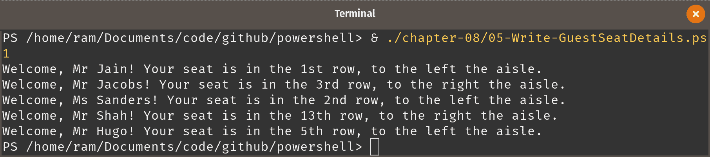
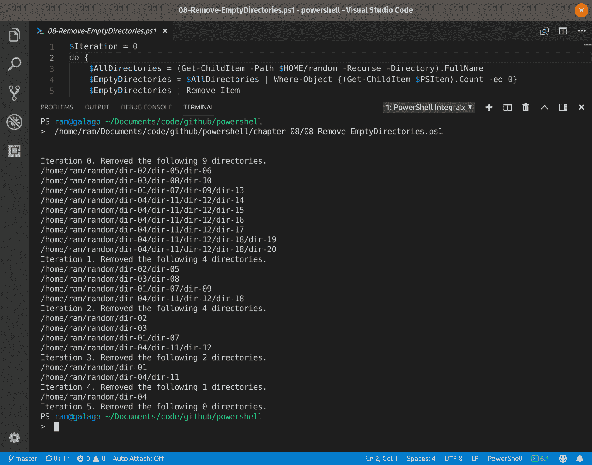
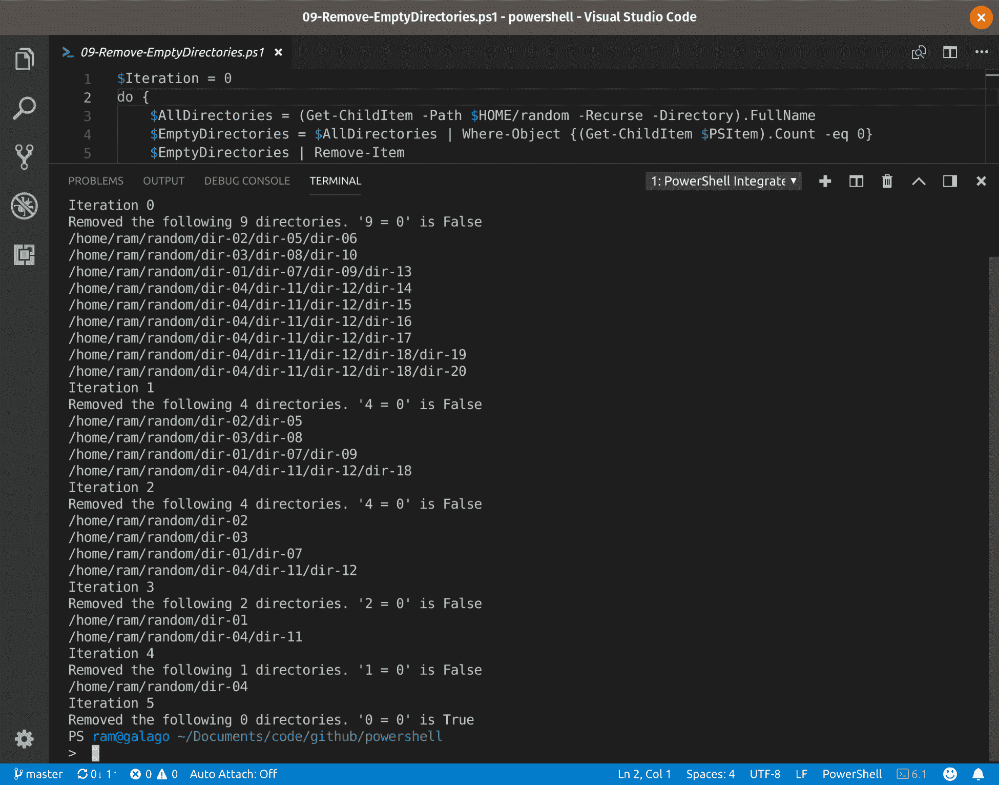

# 使用分支和循环的流程控制

在本章中，我们涵盖以下主题：

1.  使用 If–ElseIf–Else 条件来控制脚本流程

1.  使用 Switch–Case 条件来控制脚本流程

1.  学习使用延迟

1.  编写基本的循环结构

1.  在预定义数组上编写更复杂的循环

1.  使用 For 循环结构

1.  使用 While 循环结构

1.  使用 Do–While 结构清理空目录

1.  使用 Do–Until 结构清理空目录

# 简介

就像处理字符串一样，这种流程控制对我来说也是 PowerShell 中喜欢的部分。

大多数 Linux 管理员和 Bash 脚本编写者可能已经熟悉循环和分支的概念，涵盖了这些技术。我们唯一会看到的主要区别是我们将处理对象，并且脚本编写的过程更加可读、流畅。

# 使用 If–ElseIf–Else 条件来控制脚本流程

我们已经看到了操作符如何工作。尝试更多的操作符，直到它几乎成为您的第二天性。大多数脚本中的流程控制和过滤都是使用这些操作符进行的。

在这个技巧中，我们将看看条件脚本流程，也称为*分支*。基本上，分支根据两个条件（正确：`$true` 和 `$false`）工作。通常使用两种结构来实现：

1.  If–ElseIf–Else 结构

1.  Switch–Case 结构

在这个技巧中，我们将给自己提出一个简单的问题来解决：找出今天是否是周末。

# 准备工作

这些技术要求您尝试以理解它们的工作原理。这些在集成脚本环境（最好是 Visual Studio Code）中比在提示符中更有效。要在 VS Code 中运行脚本，请使用 F5 键。此外，这些技术在 Windows PowerShell 3.0+ 中也应该完全相同：这些结构的语法在 PowerShell 和 Windows PowerShell 中完全相同。

# 如何做到...

在 Visual Studio Code 中打开一个新的 PowerShell 文件。

1.  在代码窗格中输入以下内容，以简单查找是否为周末。

```
$Date = Get-Date

if ($Date.DayOfWeek -in 'Saturday', 'Sunday') {
    Write-Host 'We party on weekends!' -BackgroundColor Yellow -ForegroundColor Black
}
```

1.  如果您想在工作日也获得输出：

```
$Date = Get-Date
if ($Date.DayOfWeek -in 'Saturday', 'Sunday') {
    Write-Host 'It is a weekend!'
}
else {
    Write-Host 'It is a weekday.'
}

```

1.  如果您想稍微添点料，并使用整个 `if`–`elseif`–`else`：

```
$Date = Get-Date

if ($Date.DayOfWeek -in 'Saturday', 'Sunday') {
    Write-Host 'We party on weekends!' -BackgroundColor Yellow -ForegroundColor Black
}
elseif ($Date.DayOfWeek -eq 'Wednesday') {
    Write-Host 'Half the week is over, and I want to do so much more!'
}
else {
    Write-Host 'Work is worship. Ahem!'
}
```

一般来说，`Write-Output` 是一个比 `Write-Host` 更好的 cmdlet 使用。`Write-Host` 只将输出写入主机；这个输出不能在不进行操作的情况下发送给其他地方。仅在需要时使用 `Write-Host`。

# 它的工作原理...

简单的分支可以仅使用 If 语句。该语句检查真值，并根据条件结果执行代码块。在只有两个条件的情况下，使用 If–Else。当存在超过两种可能结果时，请使用 If–ElseIf–Else。`else` 块是捕捉所有的部分。

# 使用 Switch–Case 条件来控制脚本流程

If–ElseIf–Else 适用于当你有按类别划分的结果时（例如工作日是五天，周末是两天）。当结果是具体的和/或数量过多时，使用 If–ElseIf–Else 结构可能会有些繁琐。为了更好地理解这一点，让我们假设一个场景。

你工作场所的着装规范由一个小孩决定，她喜欢每个人穿上彩虹的颜色。由于她不喜欢任何人在周末工作，不太喜欢橙色，而且非常讨厌黄色，她想出了以下方案（她还不知道“星期一忧郁症”）：星期一穿红色，星期二穿紫色，星期三穿靛蓝色，星期四穿蓝色，星期五穿绿色，周末穿橙色。

# 如何实现...

这种情况需要通过一整套 If–ElseIf–Else 语句来编程。处理这种情况的更高效方法是使用 Switch–Case 结构。

1.  打开一个新的 PowerShell 文件并添加以下内容：

```
$Date = Get-Date

switch ($Date.DayOfWeek) {
    'Monday' { Write-Output 'Red' }
    'Tuesday' { Write-Output 'Violet' }
    'Wednesday' { Write-Output 'Indigo' }
    'Thursday' { Write-Output 'Blue' }
    'Friday' { Write-Output 'Green' }
    Default { Write-Output 'Orange' }
}
```

1.  如果你更愿意省略`Default`并使用通配符来匹配周末：

```
$Date = Get-Date

switch -Wildcard ($Date.DayOfWeek) {
    'Monday' { Write-Output 'Red' }
    'Tuesday' { Write-Output 'Violet' }
    'Wednesday' { Write-Output 'Indigo' }
    'Thursday' { Write-Output 'Blue' }
    'Friday' { Write-Output 'Green' }
    'S*' { Write-Output 'Orange' }
}
```

# 如何工作...

正如我们所看到的，在这种情况下，编写、执行以及排查 Switch–Case 结构的故障比编写一系列 if–elseif–elseif–elseif–...–else 语句更高效。要在 Switch–Case 中定义一个通用操作，请使用`Default`。

Switch–Case 结构也支持通配符（`-Wildcard`）和正则表达式（`-Regex`）。通常来说，除非*所有*可能的结果都已涵盖，否则省略`Default`不是一个好习惯。

Switch–Case 的工作原理很简单：它将条件与定义中的*所有值*进行比较，每当它找到一个条件为真时，就执行相应的脚本块。因此，如果五个条件中有三个条件满足，则这三个脚本块会被执行。这与 If–ElseIf–Else 稍有不同，后者在遇到第一个`$true`时就会退出分支结构并执行脚本块。因此，如果你只希望构造出一个结果，请考虑在每个脚本块中添加`break`关键字，以便在遇到`$true`时立即退出结构。例如：

```
...
    'Monday' {
        Write-Output 'Red'
        break
    }
...
```

当然，在这种特定情况下，没有必要这样做，因为结果是独占的。

# 学会使用延迟

PowerShell 通常会一个接一个地运行语句；当前语句必须返回缓冲区（可以这么说），下一个步骤才能开始执行。然而，在某些情况下，你仍然需要等待；也就是说，缓冲区可能会在期望的结果达成之前就已经返回。

虽然设置这种情况可能需要一些操作，但为了简化起见，我们可以假设我们需要五秒钟来注册今天是星期几（当然，不相信的话可以这么想），然后才会被告知穿什么衣服。

# 如何实现...

让我们将之前食谱中的两个脚本结合起来，*使用条件来控制脚本流程*。

1.  打开一个新文件并键入以下内容：

```
$Date = Get-Date

if ($Date.DayOfWeek -in 'Saturday', 'Sunday') {
    Write-Host 'We party on weekends!' -BackgroundColor Yellow -ForegroundColor Black
}
elseif ($Date.DayOfWeek -eq 'Wednesday') {
    Write-Host 'Half the week is over, and I want to do so much more!'
}
else {
    Write-Host 'Work is worship. Ahem!'
}

Start-Sleep -Seconds 5

$Date = Get-Date

switch ($Date.DayOfWeek) {
    'Monday' { Write-Output 'Wear red.'; break }
    'Tuesday' { Write-Output 'Wear violet.'; break }
    'Wednesday' { Write-Output 'Wear indigo.'; break }
    'Thursday' { Write-Output 'Wear blue.'; break }
    'Friday' { Write-Output 'Wear green.'; break }
    Default { Write-Output 'Poor you, working today. Wear orange.'; break }
}
```


# 它是如何工作的...

之所以这是一个单独的示例，是因为它属于流控制的一部分，并且在某些特定情况下非常有用。`Start-Sleep` cmdlet 接受 `Seconds` 或 `Milliseconds` 作为输入，并在处理下一个指令之前等待指定的时间。

# 编写一个基本的循环结构

如果没有循环，自动化可能只有一半完成。毕竟，在大多数情况下，自动化的意义在于让计算机做那些重复的工作。PowerShell 中一共有六种循环结构：

1.  使用 `Foreach-Object` 循环

1.  Foreach 循环

1.  For 循环

1.  While 循环

1.  Do–While 循环

1.  Do-Until 循环

`Foreach-Object` 循环结构可能是最简单的一种。

假设我们有五位宾客参加某个活动，并且你想分别向他们打招呼。

# 如何操作

假设宾客分别是 Mr Jain、Mr Jacobs、Ms Sanders、Mr Shah 和 Mr Hugo。

1.  在 Visual Studio Code 中打开一个新文件，在脚本窗格中输入以下内容。

```
$GuestsRaw = Read-Host "Enter the guest names, separated by commas"
$Guests = $GuestsRaw -split ",$([regex]'[\s]*')"

$Guests | ForEach-Object { Write-Output "Welcome, $PSItem!" }
```

1.  运行脚本，在提示符下输入宾客的姓名：

```
PS> Mr Jain, Mr Jacobs, Ms Sanders, Mr Shah, Mr Hugo
```

# 它是如何工作的...

首先通过主机的提示符接收输入。原始的宾客名单被接收。PowerShell 然后根据逗号和正则表达式匹配分割输入字符串（这样可以保证无论输入后是否有空格，它都能工作：并不是所有用户都一样）。我们使用 `-split` 和类型转换操作符来完成此操作。

循环部分出现在 `Foreach-Object`。你将数组对象传入管道。`Foreach-Object` cmdlet 会处理数组，并一次处理一个元素。在循环中引用元素时，你使用 `$PSItem`（即 `$_`）自动变量，因为对象已经通过管道传递。

# 在预定义数组上编写更复杂的循环

在上一个示例中，编写基本的循环结构时，我们通过管道传递内容编写了一个简单的循环。现在，假设我们有这些相同的宾客，但已经为他们分配了特定的座位。我们想要向宾客展示座位。你将得到以下 CSV 格式的表格。

| **姓名** | **座位** |
| --- | --- |
| Mr Jain | A-12 |
| Mr Jacobs | C-28 |
| Ms Sanders | B-17 |
| Mr Shah | M-22 |
| Mr Hugo | E-08 |

# 如何操作...

这里的假设是每行有四十个座位，过道通过大厅的中心。

1.  如果你还没有克隆这个仓库，你可以自己创建一个 CSV 文件。你可以从下面复制以逗号分隔的内容，或者使用 PowerShell 创建一个 CSV。

```
PS> @'
Name,Seat
Mr Jain,A-12
Mr Jacobs,C-28
Ms Sanders,B-17
Mr Shah,M-22
Mr Hugo,E-08
'@ | Out-File -Path './chapter-08/05-Write-GuestSeatDetails.csv'
```

1.  在 Visual Studio Code 中打开一个新的 PowerShell 文件，并输入以下脚本：

```
$Guests = Import-Csv './chapter-08/05-Write-GuestSeatDetails.csv'

foreach ($Guest in $Guests) {
    $RowIdentifier = [byte]char[0].ToUpper())
    $RowNumber = ($RowIdentifier - 64).ToString()

    switch -Regex ($RowNumber) {
        '1(1|2|3)$' { $RowNumber += 'th'; break }
        '.?1$'      { $RowNumber += 'st'; break }
        '.?2$'      { $RowNumber += 'nd'; break }
        '.?3$'      { $RowNumber += 'rd'; break }
        Default     { $RowNumber += 'th'; break }
    }

    $SeatNumber = ($Guest.Seat -split "-")[1]

    if ($SeatNumber -gt 20) {
        $Side = 'right'
    }
    else {
        $Side = 'left'
    }

    Start-Sleep -Seconds 1
    Write-Host "Welcome, $($Guest.Name)! " -NoNewline
    Start-Sleep -Seconds 1
    Write-Host "Your seat is in the $RowNumber row, to the $Side the aisle."
}
```

1.  运行脚本。



# 它是如何工作的...

这里的主要思想是使用 `foreach`。在使用 Foreach 循环结构时，你用一个变量引用每个元素；在这种情况下，变量不带有索引。对于我们的每次迭代，`$Guest` 从 `$Guests` 中选择一个值，按顺序进行，以便可以使用 `$Guest` 引用当前元素。

座位号有一个模式：一个字母行标识符，后跟一个连字符，然后是数字座位标识符。

座位号是一个字符串。我们在 `-` 处拆分它，选取结果数组中的第一个元素，将其转换为大写（如果它不是），将这个字母转换为字符，然后使用 `[byte]` 强制转换运算符找到其 ASCII 标识符。是的，我们从中减去 64（所以 `A` 变成 `1`）。

为了能够在 switch-case 中使用数字而不出错，我们将数字转换回字符串。我们使数字适合在句子中使用。我们取数组的第二部分（数字部分），以查看座位位于哪一侧的过道。我们将所有这些组合起来，得到最终的问候和指导字符串，这些字符串在每秒延迟后显示一次。

# 使用 For 循环结构

Foreach 循环和 For 循环的不同之处在于后者使用索引执行操作。我们需要一个变量来控制流程，其值形成一个范围。让我们重新实现与*在预定义数组上编写更复杂的循环*相同的解决方案，但使用 For 循环结构而不是 Foreach 循环。

# 如何做...

所做的假设与*在预定义数组上编写更复杂的循环*中的假设相同。

1.  打开一个新文件，并将以下内容粘贴到其中。

```
$Guests = Import-Csv './chapter-08/05-Write-GuestSeatDetails.csv'

for ($CurrentGuest = 0; $CurrentGuest -lt $Guests.Length; $CurrentGuest++) {
    $Guest = $Guests[$CurrentGuest]

    $RowIdentifier = [byte]char[0].ToUpper())

    $RowNumber = ($RowIdentifier - 64).ToString()

    switch -Regex ($RowNumber) {
        '1(1|2|3)$' { $RowNumber += 'th'; break }
        '.?1$'      { $RowNumber += 'st'; break }
        '.?2$'      { $RowNumber += 'nd'; break }
        '.?3$'      { $RowNumber += 'rd'; break }
        Default     { $RowNumber += 'th'; break }
    }

    $SeatNumber = ($Guest.Seat -split "-")[1]

    if ($SeatNumber -gt 20) {
        $Side = 'right'
    }
    else {
        $Side = 'left'
    }

    Start-Sleep -Seconds 1
    Write-Host "Welcome, $($Guest.Name)! " -NoNewline # Subexpression `$Guest.Name` to be computed first.
    Start-Sleep -Seconds 1
    Write-Host "Your seat is in the $RowNumber row, to the $Side the aisle."
}
```

1.  运行脚本。

# 它的工作原理...

你们中的一些人可能会指出，在这种情况下，`foreach` 结构比 `for` 结构更简单，你们是对的。在我担任管理员期间，过去三年里我可能少于十次使用了 `for` 结构，而使用了 `foreach` 数百次。For 结构有其自己的用途；在预定义数组中使用是效率较低的之一。

不管怎样，`for` 在对象为数组时都可以工作。`$CurrentGuest` 是我们使用的索引，其范围从 0 到 `$Guests` 的总元素数减 1。在这种情况下，循环从索引为 0 开始初始化，并且在脚本块的每次迭代后递增索引（`$CurrentGuest++`）。

`for` 比 `foreach` 更有效的一个操作是，如果每个*交替*访客都必须被问候（粗鲁，我知道）。在这种情况下，`for` 定义的第三部分将是 `$CurrentGuest += 2`。

`$CurrentGuest + 2` 而不是 `$CurrentGuest += 2` 会使这个循环无限循环，因为 `$CurrentGuest` 的值根本不会改变。

# 使用 While 循环结构

在这个教程中，我们将创建两个脚本：第一个用于建立 For 和 While 之间的相似性，另一个用于为理解 Do–While 和 Do–Until 结构打下基础。这样，学习将是渐进的，理解也会更加容易。

对于第一个脚本，场景与上一个教程中描述的*使用 For 循环结构*相同。对于第二个任务，目标是输入年份并找到该年份的母亲节日期。

# 如何操作

首先，继续使用你在上一个教程中的假设。

1.  打开一个新文件，将以下内容粘贴到其中。

```
$Guests = Import-Csv './chapter-08/05-Write-GuestSeatDetails.csv'
$CurrentGuest = 0

while ($CurrentGuest -lt $Guests.Length) {
    $Guest = $Guests[$CurrentGuest]

    $RowIdentifier = [byte]char[0].ToUpper())
    $RowNumber = ($RowIdentifier - 64).ToString()

    switch -Regex ($RowNumber) {
        '1(1|2|3)$' { $RowNumber += 'th'; break }
        '.?1$'      { $RowNumber += 'st'; break }
        '.?2$'      { $RowNumber += 'nd'; break }
        '.?3$'      { $RowNumber += 'rd'; break }
        Default     { $RowNumber += 'th'; break }
    }

    $SeatNumber = ($Guest.Seat -split "-")[1]

    if ($SeatNumber -gt 20) { $Side = 'right' }
    else { $Side = 'left' }

    Start-Sleep -Seconds 1
    Write-Host "Welcome, $($Guest.Name)! " -NoNewline
    Start-Sleep -Seconds 1
    Write-Host "Your seat is in the $RowNumber row, to the $Side the aisle."

    $CurrentGuest++
}
```

1.  运行脚本；输出结果应该与上一个教程的结果相同。

1.  现在，创建一个新的 PowerShell 文件并添加以下代码：

```
$Year = Read-Host "Enter the year (YYYY) you would like to find Mothers’ Day for"

$CurrentDay = Get-Date "01 May $Year"

while ($CurrentDay.DayOfWeek -ne 'Sunday') {
    $CurrentDay = $CurrentDay.AddDays(1)
}
$MothersDay = $CurrentDay.AddDays(7)

Write-Output "Mothers’ Day falls on $($MothersDay.ToLongDateString())."
```

1.  运行脚本。输入任何年份，你应该能得到该年份母亲节的日期。

# 工作原理...

每个有限循环结构需要三样东西：

1.  起始点

1.  停止点

1.  前进到停止点的方式

对于`Foreach`结构，整个逻辑是预先编写好的。它获取整个数组，找到起始点和停止点，并一步一步地向停止点移动。`For`结构则在循环声明语句中声明了这些参数，每个参数用分号分隔。

`While`循环没有太大不同。它的起始点定义在循环外部，停止点是传递的唯一条件，索引上的操作在循环内部指定。这三个参数在脚本中已经突出了。初始化应该在循环外发生，这样它在循环过程中就不会被修改。对索引的操作应该在每次迭代时发生，这样循环才会朝某个方向移动。因此，这个操作应当在循环内部。

对`while`循环要稍加小心；你更容易遇到无限循环，因为很容易忘记添加起始点或向停止点移动的操作。

现在，来看看母亲节。我们首先获取该年份 5 月 1 日的日期对象，这样就可以通过它的成员进行操作。这个日期就是起始点。然后，我们指定条件，“如果不是星期天，继续循环。”每次迭代时，我们加一天。每次迭代后，变量会与条件进行比较。最终，当第一个星期天到达时，变量将跳出循环。然后我们再加上一周，找到第二个星期天，并输出`$MothersDay`的长日期格式。

# 使用 Do–While 结构清理空目录

在上一个教程中，我们通过输入年份找到了五月的第二个星期天。我们使用了`While`循环。`While`循环在开始迭代前会检查条件。如果条件在一开始就返回`false`，循环就不会开始；例如，如果输入的年份是`2016`。

Do–While 有些不同；无论条件是否为真，循环都会执行一次。条件检查仅在第一次迭代 *之后* 进行。

本配方的场景是我们想要删除某个目录下的所有空目录。

# 准备工作

为了与这个配方一起使用，让我们在 `$HOME/random` 中创建一些空目录。使用本书的 Git 仓库中的输入文件来创建这些目录。

```
PS> Get-Content ./chapter-08/08-input-file.txt | ForEach-Object { New-Item $($PSItem -replace '\.', "$HOME/random") -ItemType Directory }
```

# 如何操作…

如果你在 `random` 实验目录中运行以下配方，所有其空的子目录将被删除。

1.  打开一个新文件，并将以下内容粘贴到其中。

```
do {
    $AllDirectories = (Get-ChildItem -Path $HOME/random -Recurse -Directory).FullName
    $EmptyDirectories = $AllDirectories | Where-Object {(Get-ChildItem $PSItem).Count -eq 0}
    $EmptyDirectories | Remove-Item
} while ($EmptyDirectories.Count -gt 0)
```

1.  让我们添加一些日志记录，这样我们就能知道发生了什么。

```
$Iteration = 0
do {
    $AllDirectories = (Get-ChildItem -Path $HOME/random -Recurse -Directory).FullName
    $EmptyDirectories = $AllDirectories | Where-Object {(Get-ChildItem $PSItem).Count -eq 0}
    $EmptyDirectories | Remove-Item

    "Iteration $Iteration. Removed the following $($EmptyDirectories.Count) directories."
    $EmptyDirectories
    $Iteration++
} while ($EmptyDirectories.Count -gt 0)
```



# 它是如何工作的…

执行方式类似于 While 构造，然而，正如 `Iteration 0` 所示，Do–While 构造会在不检查条件的情况下先执行一次脚本块。在我们的例子中，我们在循环内查询了空目录。如果我们将查询放在循环外面，我们也必须将其放入循环中进行控制，这样的做法效率较低。

PowerShell 在执行脚本块时找到了九个空目录。当条件检查在执行后发生时，`9` 被评估为大于 `0`。于是循环再次执行。这一次，`$EmptyDirectories.Count` 的值被评估为 `4`。循环再次执行，这一次仍然是 `4`，大于 `0`；条件仍然是 `$true`。在下一次运行时，`$EmptyDirectories.Count` 被评估为 `2`，然后是 `1`，最后在最后一次运行时为 `0`。此时，条件的结果变为 `$false`，循环退出。本质上，循环语句是，“当计数大于零时，继续 *执行*。”

# 另见

1.  配方 5.7：对返回的对象采取行动

# 使用 Do–Until 构造清理空目录

很容易混淆 Do–While 和 Do–Until，因为它们有很多相似之处。然而，它们之间的区别实际上是相当明确的。Do–While 循环只要条件检查的结果是 `$true` 就会执行，条件一旦变为 `$false` 就会退出。而 Do–Until 则正好相反：循环会持续执行，直到条件检查返回 `$true`，才会停止。

让我们使用相同的清理空文件夹的场景，但这次使用 Do–Until 循环。

# 如何操作…

你需要重新运行命令来创建那些空目录。

1.  打开一个新文件，并将以下内容粘贴到其中。

```
$Iteration = 0
do {
    $AllDirectories = (Get-ChildItem -Path $HOME/random -Recurse -Directory).FullName
    $EmptyDirectories = $AllDirectories | Where-Object {(Get-ChildItem $PSItem).Count -eq 0}
    $EmptyDirectories | Remove-Item
    $Count = $EmptyDirectories.Count

    "Iteration $Iteration`nRemoved the following $Count directories. '$Count = 0' is $($Count -eq 0)"
    $EmptyDirectories
    $Iteration++
} until ($Count -eq 0)
```

1.  注意这次行为的变化，并与 Do–While 的运行进行比较。



# 它是如何工作的…

这一次，在交互式输出中，它的工作方式变得非常清楚。第一次运行时没有检查条件。在运行结束时，条件被检查。`9` 大于 `0`，并且不相等。结果是 `$false`，因此循环继续。这样持续进行，直到计数降到 `0`（使条件的结果为 `$true`），此时循环退出。本质上，循环语句是“继续*直到*计数*变成*零”。

这就是我们关于流程控制章节的内容。我希望你在学习这些技巧时度过了一段愉快的时光，并且这一章能帮助你在学会使用 PowerShell 后完成你希望进行的自动化工作。
