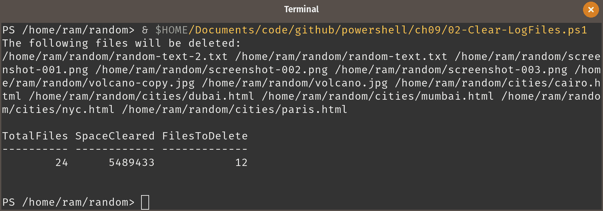
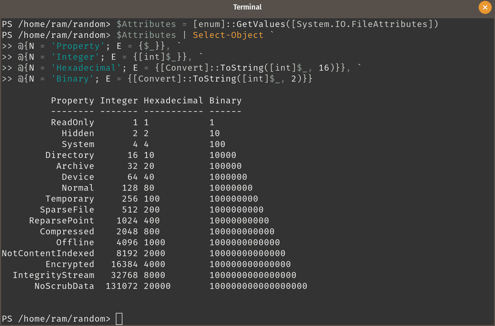

# 第九章：执行计算

在本章中，我们讨论以下主题：

1.  执行算术运算

1.  对输出进行计算

1.  使用行政常量

1.  使用计算属性

1.  使用二进制数字

1.  执行进制转换

# 技术要求

以下是本章工作的技术要求。

1.  计算机上安装 PowerShell。请参考《安装、参考和帮助》中的步骤。

1.  Visual Studio Code（推荐）。请参考章节《*使用 PowerShell 准备管理*》中的配方《*安装 Visual Studio Code*》。

1.  一些用于配方的临时文件。请从书籍 GitHub 仓库中的 `ch05` 目录运行脚本 `Initialize-PacktPs6CoreLinuxLab.ps1`。

本章中使用的脚本可在以下位置找到：[`github.com/PacktPublishing/PowerShell-6.0-Linux-Administration-Cookbook/tree/master/ch09`](https://github.com/PacktPublishing/PowerShell-6.0-Linux-Administration-Cookbook/tree/master/ch09)。

# 介绍

执行计算是自动化的一个关键部分。当然，PowerShell 可以实现这一点；它还通过提供管理员所谓的行政常量来提升操作级别，从而简化计算。我们将在接下来的配方中讨论这些概念。我们将首先介绍常见的算术运算，然后使用计算属性输出的概念，正如我们在*通过管道传递对象*中所看到的那样。

我们还将讨论如何使用二进制数字简化自动化，通过标志识别、进行进制转换，并最终使用一些 .NET 加速器/强制转换运算符来简化脚本编写。

# 执行算术运算

作为管理员，我们很少使用像正弦、余弦、对数和指数等算术运算。然而，PowerShell 是可以进行这些运算的，因为它能够利用 .NET。通常，管理员可能会使用以下运算：`Abs`（绝对值）、`Ceiling`、`Floor`、`Round` 和 `Truncate`。在本配方中，我们将根据实际场景使用这三种方法。其他方法的使用方式非常相似。以下是我们的场景：

你有一个应用程序，它会在一天中生成日志。这些日志占用了大量空间。你希望清理掉 30 至 31 天前的日志文件。你不能使用双重条件进行比较。

创建一个函数，查找 30 天前的文件。你的脚本还应该显示清理了多少日志空间，四舍五入到最接近的兆字节。

# 准备工作

从书籍 GitHub 仓库的 `ch05` 目录中运行脚本 `Initialize-PacktPs6CoreLinuxLab.ps1`。这是为了让我们有一些文件可以操作。接下来，从仓库的 `ch09` 目录中运行脚本 `Set-LastWriteTime.ps1`。

如果你想指定一个不同于`~/random`的路径用于内容，可以在脚本的最后一行添加`-Path '//your/custom/path'`。请确保在两个脚本中都进行此修改。

# 如何操作……

导航到包含实验文件的目录；所有的操作都发生在这里。如果你在运行脚本时没有指定自定义的-Path，默认路径应该是`~/random`。

1.  打开终端，使用代码编辑器（如`vi`、`nano`或 VS Code），创建一个名为`Clear-LogFiles.ps1`的新文件。记住，CamelCase 只是一个约定。

1.  输入以下内容。建议自己手动输入，而不是复制粘贴。

```
$Today = Get-Date
$TotalFileSize = 0

$FilesToDelete = Get-ChildItem . -Recurse -File | Where-Object {[math]::Floor(($Today - $_.LastWriteTime).TotalDays) -eq 30}

Write-Host "The following files will be deleted:"
Write-Host $FilesToDelete.FullName

foreach ($File in $FilesToDelete) {
    $TotalFileSize += $File.Length
    Remove-Item -Path $File -WhatIf
}

Write-Host "Total space cleared: $([math]::Round($TotalFileSize/[math]::Pow(1024, 2))) MB"
```

无需实际删除文件。如果你还是想删除文件，请移除第 12 行中的`-WhatIf`开关。

推荐使用 Visual Studio Code 来编写这个脚本，因为它的 IntelliSense 自动完成功能非常有帮助。你也可以直接在终端编写这个脚本，在这种情况下，必要时使用更简短的参数版本和 Tab 自动补全功能。

# 它是如何工作的……

`[math]::`加速器允许我们使用`System.Math`类的方法。`Round()`方法接受一个或两个参数；如果只有一个参数，四舍五入会发生到最接近的整数。可选的第二个参数指定小数点后的位数。

`Pow()`方法几乎不言自明：在我们的案例中是 1024²。`Floor()`方法将 30.00 的数字降低到小于 31 的数值，最终降至 30。

我们做了什么：

1.  列出了要删除的文件：我们将`LastWriteTime`与今天的日期进行比较，并对结果进行`Floor`操作，因为我们不允许使用`-and`运算符。

1.  显示文件。

1.  我们对每个文件执行了删除操作，同时将每个文件的大小加到`$TotalFileSize`中。

1.  最终，我们将`$TotalFileSize`除以 1024²，并四舍五入到最接近的 MB。

# 另见

1.  [System.Math 方法](https://msdn.microsoft.com/en-us/library/system.math_methods(v=vs.110).aspx)（Microsoft 文档）

# 对输出进行计算

在上一个例子中，我们对对象本身进行了巧妙的计算，并列出了 30 天前的文件。在这个过程中，我们还输出了要清理的空间总量。在这个例子中，我们将以 PowerShell 对象的形式输出这些信息，并且在输出过程中进行一个小的计算。以下是场景：

修改你在执行算术操作时创建的脚本，使其输出一个结构化的 PSCustomObject。输出应包含目录中的文件总数、30 天前的文件，以及清理的总空间量（无需进行计算）。另外，单独显示清理过程中释放的空间量，以 MB 为单位。

# 准备好

如果你没有实验文件或在前面的步骤中删除了文件，可以运行脚本`Initialize-PacktPs6CoreLinuxLab.ps1`，该脚本位于书籍 GitHub 仓库的`ch05`目录中。接着，运行位于`ch09`目录中的`Set-LastWriteTime.ps1`脚本。

# 如何实现

我们将简单地在前一个步骤的基础上进行改进，以节省时间和精力。前一个脚本中的更改已加粗。

1.  打开你最喜欢的代码编辑器，将以下内容输入到文件中，并将文件保存为`ps1`文件。

```
$Today = Get-Date
$TotalFileSize = 0

$AllFiles = Get-ChildItem . -Recurse -File
$FilesToDelete = $AllFiles | Where-Object {[math]::Floor(($Today - $_.LastWriteTime).TotalDays) -eq 30}

foreach ($File in $FilesToDelete) {
    $TotalFileSize += $File.Length
    Remove-Item -Path $File -WhatIf
}

New-Object -TypeName psobject -Property @{
    TotalFiles = $AllFiles.Count
    FilesToDelete = $FilesToDelete.Count
    SpaceCleared = $TotalFileSize
}
```

1.  调用 PowerShell 脚本。

```
& $HOME/Documents/code/github/powershell/ch09/02-Clear-LogFiles.ps1
```

这是输出的一部分。



1.  现在，仅提取`SpaceCleared`参数。

```
(& $HOME/Documents/code/github/powershell/ch09/02-Clear-LogFiles.ps1).SpaceCleared
```

注意参考`SpaceCleared`属性，并且在提示符之前的输出。


1.  将输出除以 1024²，以获得 MB 为单位的值。

```
(& $HOME/Documents/code/github/powershell/ch09/02-Clear-LogFiles.ps1).SpaceCleared/[math]::Pow(1024, 2)
```

与上面类似；清理的总空间（单位：MB）。


# 原理

不仅是 cmdlet 和函数，脚本也会输出对象。在前面的步骤中，输出是一个字符串对象；在这里，它是一个`PSCustomObject`。这样，尽管从两个步骤中收集到的信息是相同的，我们仍然能够通过动态计算进一步处理输出。

# 还有更多

1.  对`SpaceCleared`执行`Round()`操作，以便将输出以 MB 为单位并保留两位小数。

1.  显示被排除在删除之外的文件数量。

将脚本的输出对象赋值给一个变量：`$FileCleanupInfo = (& //path/to/02-Clear-LogFiles.ps1)`，以便更轻松操作。

# 与管理常量的工作

可能让我们一些人感到困扰的一件事是将`Length`属性转换为 MB 是多么困难。我们不得不使用`[math]::Pow(1024, 2)`。简化前面步骤的输出。

同时，假设你在一块 250 GB 的 SSD 上加载了这些文件，并且你想查看清理了多少空间的百分比。

# 准备工作

如果你没有实验文件或在前面的步骤中删除了文件，可以运行脚本`Initialize-PacktPs6CoreLinuxLab.ps1`，该脚本位于书籍 GitHub 仓库的`ch05`目录中。接着，运行位于`ch09`目录中的`Set-LastWriteTime.ps1`脚本。

# 如何实现

我们将使用与前面步骤相同的脚本。

1.  将前一步骤返回的对象赋值给一个变量。

```
$FileCleanupInfo = (& //path/to/02-Clear-LogFiles.ps1)
```

1.  调用`SpaceCleared`属性，并将其除以管理常量。

```
$FileCleanupInfo.SpaceCleared/1KB
$FileCleanupInfo.SpaceCleared/1MB
$FileCleanupInfo.SpaceCleared/1GB
```

注意结果不仅仅是将数字除以 1000 的幂。


1.  显示从 250 GB SSD 清理了多少空间：

```
($FileCleanupInfo.SpaceCleared)/(250*1e9)*100
```

在我们的案例中几乎是一个可以忽略的小数字，但它就在这里。


# 原理

PowerShell 是为管理员设计的。考虑到我们定期依赖大量的文件操作，PowerShell 包含了管理员常量。这些常量代表 1024 的幂（1024¹，1024²，1024³ 等等）。

硬盘和闪存驱动器的制造商通常使用 1000 的幂来表示驱动器大小。在我们的例子中，我们使用科学计数法将驱动器的大小转换为字节。

# 使用计算属性

如果你已经阅读了 *从输出中选择列* 和 *通过管道传递数据* 的内容，可以跳过本例。此例的目的是为了提供上下文，特别是对于那些跳过了前面章节/示例的读者。

计算属性是另一种即时进行计算的方式。这里是一个场景：

你需要一份报告，列出某个目录中所有文件的文件名、最后修改日期、完整路径和以 MB 为单位的大小。

# 准备工作

如果你没有实验文件，或者删除了上一个例子中的文件，请从书籍 GitHub 仓库的 `ch05` 目录中运行脚本 `Initialize-PacktPs6CoreLinuxLab.ps1`。接着，从仓库的 `ch09` 目录中运行脚本 `Set-LastWriteTime.ps1`。

# 如何操作

这将是一个单行命令。

在终端中，输入以下内容并按 Enter 键。

```
Get-ChildItem -file -rec | Select-Object name, lastwritetime, @{n = 'Size'; e = {[math]::Round($_.Length/1MB, 3)}}
```

# 它是如何工作的

计算属性包含两个部分：属性名称和生成期望结果的表达式。从技术角度来看，它是一个哈希表，其中 `n`（或 `Name`）和 `e`（或 `Expression`）是两个名称-值对。`Expression` 本身是一个脚本块。当分解为行时，查询如下所示：

```
Get-ChildItem -File -Recurse | Select-Object Name, LastWriteTime, @{
    Name = "Size"
    Expression = {
        [math]::Round($PSItem.Length/1MB, 3)
    }
}
```

由于我们通过一行将 `Name` 和 `Expression` 分开，因此不再需要分号。

计算属性在不想创建新脚本的情况下非常有用，而是希望在终端本身获取一些信息，就像运行查询一样。`Name` 的值是属性名称，列中的值由表达式决定。

# 处理二进制数字

为了确保精确，我们将在本例中使用十六进制表示。如果你在电脑上处理过颜色，可能已经知道 RGB。三种原色的级别通常表示为从 0 到 255 的数字（24 位颜色）。你也许遇到过这些颜色的十六进制表示，特别是在处理 HTML/CSS 时。

这里的场景是编写一个简单的脚本，将任何给定的十六进制代码转换为十进制 RGB。

# 如何操作

我们假设输入可能带或不带 `#`（即 `55bc9a` 或 `#55bc9a`）。

1.  打开一个新的 PowerShell 文件，并输入以下内容：

```
$Rgb = Read-Host "Enter the hexadecimal RGB value"
$TrimmedRgb = $Rgb.Substring($Rgb.Length - 6)

$R = $TrimmedRgb.Substring(0, 2)
$G = $TrimmedRgb.Substring(2, 2)
$B = $TrimmedRgb.Substring(4, 2)

"Here are the R, G and B levels for the supplied hex value:"
$R, $G, $B | ForEach-Object { int }
```

1.  运行脚本。

1.  输入任意有效的十六进制 RGB 值，带或不带前缀 `#`。按 Enter 键。

这里是一个示例。


# 它是如何工作的

首先，看看脚本是如何分离 R、G 和 B 值的。我们首先修剪十六进制字符串，以去除其中的 `#`（如果有）。我们需要字符串的最后六个字符。因此，我们让 PowerShell 从第 1 个字符开始截取子字符串（以防有 `#`），如果字符串有六个字符，则从第 0 个字符开始。接着，我们每次取两个字符，从修剪后的字符串的 0、2、4 开始。

转换发生在最后一行。首先，我们指示 PowerShell 使用类型转换运算符将输出结果设为整数。然后，我们告诉 PowerShell 该字符串是一个十六进制字符串，方法是给它加上 `0x` 前缀。

这是一种将十六进制转换为整数的简单方法。接下来，我们将查看其他几种转换方法。

# 执行进制转换

上一个示例是一个简单的转换，使用了类型转换运算符和字符串相加。接下来，我们将看看如何将一个整数转换为多个进制，比如八进制、十六进制和二进制字符串。

# 如何操作

输入将作为字符串处理。输出也将是字符串，但包含八进制、十六进制和二进制表示。我们将使用 .NET 加速器来实现这一点。

1.  打开一个新的 PowerShell 文件，并输入以下内容：

```
$InputString = Read-Host "Enter an integer"

Write-Host "Octal representation: " -NoNewline
Write-Host "$([Convert]::ToString($InputString, 8))"

Write-Host "Hexadecimal representation: " -NoNewline
Write-Host "$([Convert]::ToString($InputString, 16))"

Write-Host "Binary representation: " -NoNewline
Write-Host "$([Convert]::ToString($InputString, 2))"
```

1.  运行脚本并输入一个整数，即可获得它的八进制、十六进制和二进制表示。

不要忘记尝试负数。


# 它是如何工作的

这个示例利用了 `[System.Convert]` .NET 加速器。脚本的输入和输出都是字符串。

`ToString()` 方法接受的输入形式为 int64。当只传递一个参数时，整数会按原样输出，但对象类型不再是 `int`，而是 `string`。传递给方法的可选第二个参数是基数：`2` 代表十进制，`8` 代表八进制，`16` 代表十六进制。

# 还有更多内容

当我学习 PowerShell 时，我遇到了 Lee Holmes 提供的这篇示例，它展示了 PowerShell 中文件属性标志的工作方式。要查看 PowerShell 中文件和目录的可用属性，以及它们的十进制和二进制表示，可以在 PowerShell 提示符下输入以下内容。

```
PS> [Enum]::GetValues([System.IO.FileAttributes]) | Select-Object `
@{ n = 'Property'; e = { $_ } }, 
@{ n = 'Decimal'; e = { [int]$_ } },
@{ n = 'Binary'; e = { [Convert]::ToString([int]$_, 2) } }
```

这是该命令的输出结果。



本章到此结束。基本的算术计算已被省略，因为它们与任何常见的编程语言并无区别。
