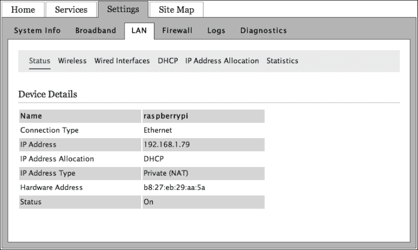
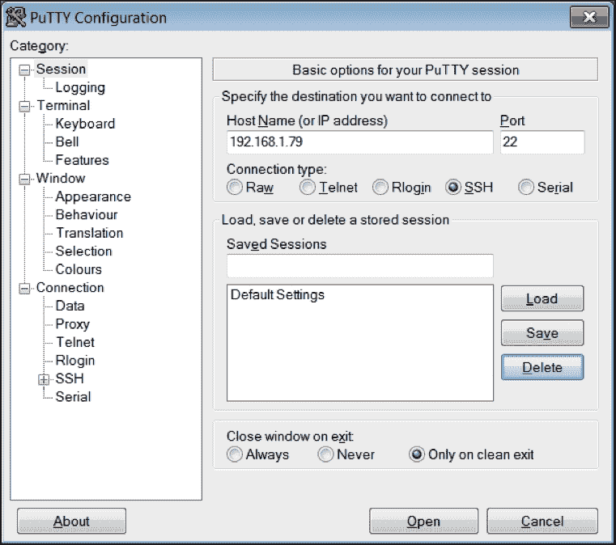
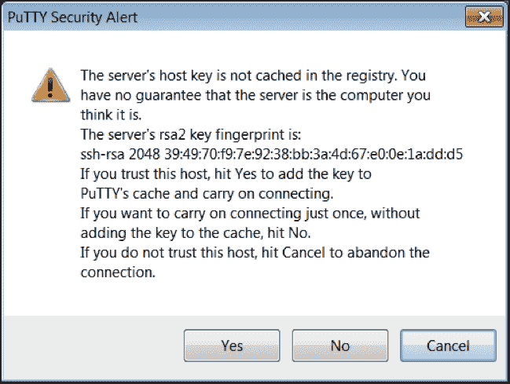
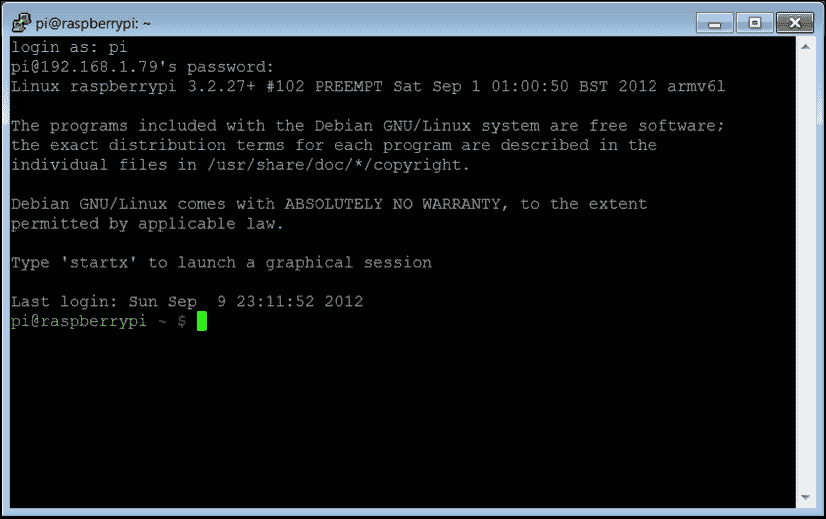
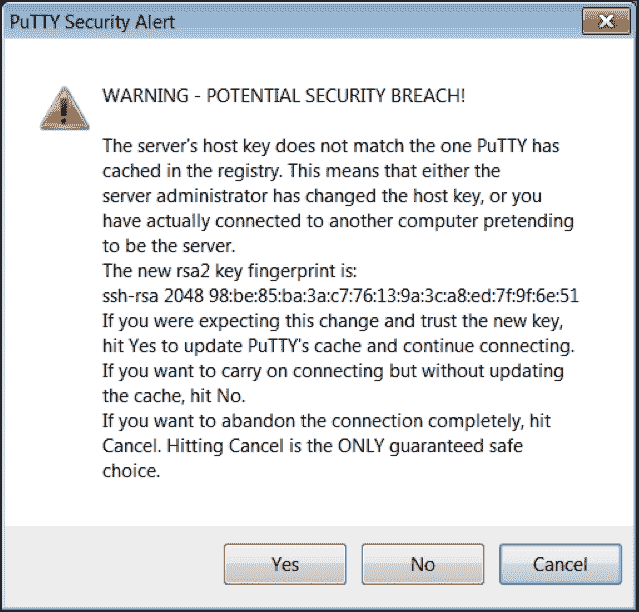

# 第二章：用户管理

在本章中，我们将覆盖以下主题：

+   使用特权执行命令（`sudo`）

+   扩展文件系统大小（`raspi-config`）

+   配置内存使用（`raspi-config`）

+   配置远程访问（`raspi-config`）

+   通过 SSH 获得远程访问

+   通过使用 PuTTY 获得远程访问

+   修改登录密码（`passwd`）

+   添加用户（`adduser`）

+   授予用户 sudo 特权（`id`和`usermod`）

# 介绍

本章中的配方用于树莓派的基本管理。本章从一个配方开始，展示如何使用`sudo`命令执行其他需要超级用户权限的命令。接下来的三个配方使用`raspi-config`命令行工具完成以下三项初始配置任务：

+   扩展文件系统以使用 SD 卡上的所有空间

+   更改内存分配以提高性能

+   启用树莓派的远程访问

以下两个配方展示了如何远程访问树莓派：

+   从 Linux 或 Mac OS X 计算机使用`SSH`命令行客户端

+   从 Windows 计算机使用 PuTTY 客户端

本章的最后三个配方如下所示，专门用于用户管理：

+   如何修改默认用户用户名为`pi`的密码

+   如何创建一个新的用户登录

+   如何将用户添加到特权`sudo`用户组

一旦你完成了本章内容，你将能够通过网络连接远程管理树莓派，而无需键盘或显示器。

# 使用特权执行命令（`sudo`）

本配方展示了如何使用`sudo`执行特权命令。

默认的树莓派用户（`pi`）是普通用户，而非超级用户。`sudo`命令用于临时授予普通用户超级用户的权限。

完成本配方后，你将能够通过使用`sudo`作为命令前缀来执行具有超级用户权限的命令。

## 准备工作

本配方需要以下配料：

+   你需要为已开机的树莓派进行初始设置或基本的网络设置。你还需要以用户名为`pi`的用户身份登录（有关如何启动和登录的说明，请参阅第一章，*安装与设置*，并参考本章稍后的配方以了解如何远程登录）。

+   网络连接是可选要求。

如果树莓派已启用远程访问，本配方可以通过 SSH 或 PuTTY 远程完成（参阅本章稍后给出的*远程访问（SSH）*和*远程访问（PuTTY）*配方）。

## 如何操作...

本配方首先不带特权地执行命令，然后使用特权执行：

1.  首先，尝试作为普通用户执行一个需要特权的命令，例如`reboot`，如下所示：

    ```
    pi@raspberrypi ~ $ reboot

    reboot: must be superuser.

    pi@raspberrypi ~ $
    ```

1.  然后，再次尝试以超级用户权限执行该命令，如下所示：

    ```
    pi@raspberrypi ~ $ sudo reboot

    Broadcast message from root@raspberrypi (pts/0) (Sat Jun 27 21:16:19 2015):
    The system is going down for reboot NOW!
    ```

## 它是如何工作的...

`sudo` 命令是为非特权用户提供的，允许临时授予另一个命令超级用户权限（就像超级用户会做某事一样）。

在这个操作中，特权命令 `reboot` 最初是由普通用户 `pi` 执行的，而没有超级用户权限。然后，`reboot` 命令报告了一个错误，提示“必须是超级用户”。普通用户不能执行 `reboot` 命令。

最后，`sudo` 命令被用作超级用户前缀，暂时将普通用户 `pi` 提升为超级用户权限。然后，系统按要求重新启动。

## 还有更多...

以下是一些可以使用的其他命令。

### 切换用户（sudo –u）

`sudo` 命令实际上是一个 *切换用户* 和 *执行某事* 的命令。

默认情况下，`sudo` 命令会临时切换到 `root` 用户，`root` 是超级用户。当以 `root` 用户身份运行命令时，命令将拥有 `root` 用户的所有权限。

使用 `–u` 命令行参数执行时，`sudo` 可以临时以任何系统用户的身份执行命令，从而赋予该命令另一个用户的所有权限。

有关为 Raspberry Pi 创建额外用户的更多信息，请参阅本章末尾的 *添加用户* 章节。

这是一个示例，展示如何使用 `sudo` 命令切换到 Raspberry Pi 上已经存在的另一个用户，该用户的用户名为 `nobody`。用户 `nobody` 没有任何权限（这是它的目的——没有权限；这是一个安全特性），但我们可以使用 `nobody` 来演示 `sudo` 命令的工作原理。这个示例创建并删除了两个文件——一个属于用户 `pi`，另一个属于用户 `nobody`：

```
pi@raspberrypi ~ $ ls -l /tmp

total 0

pi@raspberrypi ~ $ touch /tmp/i-belong-to-pi

pi@raspberrypi ~ $ ls -l /tmp

total 0
-rw-r--r-- 1 pi pi 0 Jun 27 21:54 i-belong-to-pi

pi@raspberrypi ~ $
```

请注意，现在临时目录中只有一个文件，并且该文件属于用户 `pi`（`ls –l` 命令的输出中的第三列显示文件的所有者）：

```
pi@raspberrypi ~ $ sudo -u nobody touch /tmp/i-belong-to-nobody

pi@raspberrypi ~ $ ls -l /tmp

total 0
-rw-r--r-- 1 nobody nogroup 0 Jun 27 21:55 i-belong-to-nobody
-rw-r--r-- 1 pi     pi      0 Jun 27 21:54 i-belong-to-pi

pi@raspberrypi ~ $
```

现在 `/tmp` 目录中有两个文件。一个文件 `i-belong-to-pi` 属于用户 `pi`，另一个文件 `i-belong-to-nobody` 属于用户 `nobody`。

现在，让我们尝试从临时目录中删除我们创建的两个文件，如下所示：

```
pi@raspberrypi ~ $ rm /tmp/i-belong-to-pi 

pi@raspberrypi ~ $ ls -l /tmp

total 0
-rw-r--r-- 1 nobody nogroup 0 Jun 27 21:55 i-belong-to-nobody

pi@raspberrypi ~ $
```

删除 `i-belong-to-pi` 文件成功。目录中只剩下一个文件：

```
pi@raspberrypi ~ $ rm /tmp/i-belong-to-nobody 

rm: remove write-protected regular empty file `/tmp/i-belong-to-nobody'? y
rm: cannot remove `/tmp/i-belong-to-nobody': Operation not permitted

pi@raspberrypi ~ $
```

删除 `i-belong-to-nobody` 文件没有成功，因为该文件属于用户 `nobody`。

如果你想删除 `i-belong-nobody` 文件，首先需要使用 `sudo` 命令切换到用户 `nobody`，如下所示：

```
pi@raspberrypi ~ $ sudo -u nobody rm /tmp/i-belong-to-nobody 

pi@raspberrypi ~ $ ls -l /tmp

total 0

pi@raspberrypi ~ $
```

使用 `sudo –u` `nobody` 成功了！现在 `/tmp` 目录中没有剩余文件。

### 密码

Raspbian Linux 发行版的默认配置对于 `sudo` 组中的用户在使用 `sudo` 时无需输入密码。

如果你使用的是其他 Linux 发行版，使用`sudo`时可能需要输入密码。如果需要输入密码，请使用登录 Raspberry Pi 时所用的相同密码。

### sudo 组

如果你已向树莓派添加了额外的用户，并且希望这些用户能够使用特权命令（如`shutdown`和`reboot`）或更改配置目录（`/etc`）中的文件，则还需要将他们添加到`sudo`用户组中。没有加入`sudo`组的用户将无法执行特权命令或更改特权文件。

本章末尾的配方提供了更多关于用户管理的信息，包括如何将用户添加到`sudo`用户组。

## 另请参见

+   **sudo, sudoedit – 以其他用户身份执行命令** ([`manpages.debian.net/cgi-bin/man.cgi?query=sudo`](http://manpages.debian.net/cgi-bin/man.cgi?query=sudo))：切换用户命令暂时以其他用户身份执行命令。Debian 的`sudo`命令手册页描述了它的所有功能和选项。

+   **touch – 更改文件时间戳** ([`manpages.debian.net/cgi-bin/man.cgi?query=touch`](http://manpages.debian.net/cgi-bin/man.cgi?query=touch))：`touch`命令如果文件不存在，则会创建一个文件。Debian 的`touch`命令手册页描述了它的所有功能和选项。

# 扩展文件系统的大小（raspi-config）

本配方展示了如何使用`raspi-config`命令扩展树莓派的文件系统，使其使用 SD 卡上所有可用的磁盘空间。

树莓派的操作系统映像经过压缩，以尽可能减少磁盘空间的使用。操作系统映像大小的缩减有助于提高下载映像的速度。当这些压缩后的映像复制到 SD 卡时，SD 卡很可能会仍然有剩余空间。较大的 SD 卡（大于 8GB）通常会是空的！

### 注意

如果你使用 NOOBS 安装了树莓派，则无需扩展文件系统。NOOBS 已经为你扩展了文件系统。

本配方使用`raspi-config`命令行工具扩展操作系统映像的文件系统，使其包括 SD 卡上所有可用的空间。

完成本配方后，你的树莓派存储使用的文件系统将扩展，包含 SD 卡上所有可用的空间。

## 准备工作

此配方需要以下材料：

+   你需要为已开机的树莓派进行初步设置或基本的网络配置。你还需要以用户`pi`登录（有关如何启动和登录的说明，请参考第一章，*安装与设置*，本章后续的配方将介绍如何远程登录）。

+   网络连接是可选的要求。

如果树莓派已启用远程访问，本配方可以通过 SSH 或 PuTTY 远程完成（有关*远程访问（SSH）*和*远程访问（PuTTY）*的配方，请参阅本章后续部分）。

本食谱示例中使用的 SD 卡存储容量为 32 GB。

## 如何操作...

使用以下步骤来扩展树莓派的文件系统：

1.  使用`df`命令查看可用的磁盘空间，操作如下：

    ```
    pi@raspberrypi ~ $ df –h

    Filesystem      Size  Used Avail Use% Mounted on
    /dev/root       3.9G  3.1G  596M  84% /
    devtmpfs        459M     0  459M   0% /dev
    tmpfs           463M     0  463M   0% /dev/shm
    tmpfs           463M   13M  451M   3% /run
    tmpfs           5.0M  4.0K  5.0M   1% /run/lock
    tmpfs           463M     0  463M   0% /sys/fs/cgroup
    /dev/mmcblk0p1   56M   20M   37M  36% /boot
    tmpfs            93M     0   93M   0% /run/user/1000

    pi@raspberrypi ~ $
    ```

1.  请注意，根文件系统（`/dev/root`）的**大小**（第二列）仅为`3.9 G`，即使实际磁盘大小要大得多。

1.  执行`raspi-config`命令来扩展根文件系统的大小，操作如下：

    ```
    pi@raspberrypi ~ $ sudo raspi-config
    ```

1.  然后会显示`raspi-config`主菜单：

    ```
    ┌─────────┤ Raspberry Pi Software Configuration Tool (raspi-config) ├──────────┐
    │                                                                              │
    │    1 Expand Filesystem              Ensures that all of the SD card s        │
    │    2 Change User Password           Change password for the default u        │
    │    3 Boot Options                   Choose whether to boot into a des        │
    │    4 Internationalisation Options   Set up language and regional sett        │
    │    5 Enable Camera                  Enable this Pi to work with the R        │
    │    6 Add to Rastrack                Add this Pi to the online Raspber        │
    │    7 Overclock                      Configure overclocking for your P        │
    │    8 Advanced Options               Configure advanced settings              │
    │    9 About raspi-config             Information about this configurat        │
    │                                                                              │
    │                     <Select>                     <Finish>                    │
    │                                                                              │
    └──────────────────────────────────────────────────────────────────────────────┘
    ```

1.  按下*Enter*键选择第一个菜单项，`Expand Filesystem`。使用上下箭头键更改选择。

1.  稍等片刻，屏幕会显示如下内容：

    ```
              ┌──────────────────────────────────────────────────────────┐ 
              │                                                          │ 
              │ Root partition has been resized.                         │ 
              │ The filesystem will be enlarged upon the next reboot     │ 
              │                                                          │ 
              │                          <Ok>                            │ 
              │                                                          │ 
              └──────────────────────────────────────────────────────────┘ 
    ```

1.  按下*Enter*键，您将返回到主菜单。

1.  按下*Tab*键选择**完成**，然后按下*Enter*键：

    ```
              ┌──────────────────────────────────────────────────────────┐ 
              │                                                          │ 
              │ Would you like to reboot now?                            │ 
              │                                                          │ 
              │               <Yes>                  <No>                │ 
              │                                                          │ 
              └──────────────────────────────────────────────────────────┘ 
    ```

1.  按下*Enter*键选择**是**。树莓派将重新启动。

1.  重新登录后，使用`df –h`命令检查根文件系统（`/`）上的可用磁盘空间，操作如下：

    ```
    pi@raspberrypi ~ $ df –h /

    Filesystem      Size  Used Avail Use% Mounted on
    /dev/root        29G  3.1G   24G  12% /

    pi@raspberrypi ~ $
    ```

## 工作原理...

本食谱开始时会显示树莓派上可用的磁盘空间。`df`命令显示可用的磁盘空间（df 是磁盘空闲的缩写）。`–h`命令行参数要求`df`以人类可读的格式显示结果。命令的输出显示，`/dev/root`文件系统的总大小为 3.9 GB，84%的文件系统已被使用，仅剩下 596 MB 可用。

然后，运行`raspi-config`命令来扩展根文件系统。`raspi-config`命令主菜单中的第一个命令，`Expand Filesystem`，用于调整树莓派的根分区（`/dev/root`）大小。

在调整根文件系统大小后，树莓派需要重新启动。重新启动后，根文件系统的大小会再次被检查。此时，剩余的磁盘空间为 24 GB！

## 还有更多...

扩展根文件系统的最佳时机是在安装后立即进行——在安装新软件或需要额外磁盘空间之前。

`raspi-config`工具用于配置树莓派的许多基本组件。可以在名为*配置远程访问*和*配置内存使用*的食谱中找到它的使用示例。

## 参见

+   `Raspi-config` ([`www.raspberrypi.org/documentation/configuration/raspi-config.md`](https://www.raspberrypi.org/documentation/configuration/raspi-config.md)): 树莓派基金会文档中可以找到`raspi-config`命令的参考页面。

+   `RPi raspi-config` ([`elinux.org/RPi_raspi-config`](http://elinux.org/RPi_raspi-config)): 该文档位于嵌入式 Linux 网站，介绍了`raspi-config`脚本如何帮助你配置树莓派。

# 配置内存使用（raspi-config）

本食谱展示了如何使用`raspi-config`工具更改树莓派的内存分配，以最大化可供 CPU 使用的内存量。

本书提供的解决方案不需要显示器。其中许多解决方案将受益于显示器使用的额外内存。

然而，如果你将树莓派作为桌面电脑使用，可能希望最大化视频内存的容量。浏览器中显示的互联网内容，如图像和视频，以及计算机游戏，都将受益于高视频内存。

完成此步骤后，你可以根据需要选择在视频核心和 CPU 之间分配内存的平衡。

## 准备工作

此步骤所需的准备工作是已经开机的树莓派的初始设置或基础网络设置。你还需要以用户`pi`身份登录（请参考第一章中的食谱，*安装与设置*，了解如何启动并登录）。

## 如何操作...

按照以下步骤配置树莓派的内存使用：

1.  执行`raspi-config`命令，如下所示：

    ```
    pi@raspberrypi ~ $ sudo raspi-config
    ```

1.  接着会显示`raspi-config`主菜单：

    ```
    ┌─────────┤ Raspberry Pi Software Configuration Tool (raspi-config) ├──────────┐
    │                                                                              │
    │    1 Expand Filesystem              Ensures that all of the SD card s        │
    │    2 Change User Password           Change password for the default u        │
    │    3 Boot Options                   Choose whether to boot into a des        │
    │    4 Internationalisation Options   Set up language and regional sett        │
    │    5 Enable Camera                  Enable this Pi to work with the R        │
    │    6 Add to Rastrack                Add this Pi to the online Raspber        │
    │    7 Overclock                      Configure overclocking for your P        │
    │    8 Advanced Options               Configure advanced settings              │
    │    9 About raspi-config             Information about this configurat        │
    │                                                                              │
    │                     <Select>                     <Finish>                    │
    │                                                                              │
    └──────────────────────────────────────────────────────────────────────────────┘
    ```

1.  使用上下箭头键更改选择，然后按*Enter*键选择**高级选项**。

1.  显示**高级选项**菜单，如下所示：

    ```
    ┌─────────┤ Raspberry Pi Software Configuration Tool (raspi-config) ├──────────┐
    │                                                                              │
    │    A1 Overscan                      You may need to configure oversca        │
    │    A2 Hostname                      Set the visible name for this Pi         │
    │    A3 Memory Split                  Change the amount of memory made         │
    │    A4 SSH                           Enable/Disable remote command lin        │
    │    A5 Device Tree                   Enable/Disable the use of Device         │
    │    A6 SPI                           Enable/Disable automatic loading         │
    │    A7 I2C                           Enable/Disable automatic loading         │
    │    A8 Serial                        Enable/Disable shell and kernel m        │
    │    A9 Audio                         Force audio out through HDMI or 3        │
    │    A0 Update                        Update this tool to the latest ve        │
    │                                                                              │
    │                     <Select>                     <Back>                      │
    │                                                                              │
    └──────────────────────────────────────────────────────────────────────────────┘
    ```

1.  从菜单中选择**内存划分**来更改内存划分。

1.  系统提示你输入 GPU 的内存量：

    ```
         ┌────────────────────────────────────────────────────────────────────┐ 
         │ How much memory should the GPU have?  e.g. 16/32/64/128/256        │ 
         │                                                                    │ 
         │ 16________________________________________________________________ │ 
         │                                                                    │ 
         │                 <Ok>                     <Cancel>                  │ 
         │                                                                    │ 
         └────────────────────────────────────────────────────────────────────┘ 
    ```

1.  输入`16`并按下*Enter*键，为树莓派的 GPU 分配最小内存量。

1.  系统返回到`raspi-config`的主菜单。

1.  从主菜单中选择**完成**并重启树莓派。

## 它是如何工作的...

在`raspi-config`配置工具的**高级选项**菜单中，有一个选择项允许你指定视频处理的**图形处理单元**（**GPU**）和用于通用处理的 CPU 之间的内存划分。在本食谱中，你输入了 16 MB，这是 GPU 的最小值。

树莓派将其总内存（树莓派 2 为 1 GB）中的 256 MB 分配给其 CPU 和 GPU。内存可以通过以下五种不同的方式进行划分：

+   GPU 16 MB，CPU 1008 MB

+   GPU 32 MB，CPU 992 MB

+   GPU 64 MB，CPU 960 MB

+   GPU 128 MB，CPU 896 MB

+   GPU 256 MB，CPU 768 MB

对于本书中的许多食谱，GPU 只需要最低 16 MB 的内存。这些食谱不需要显示，如果最大内存分配给 CPU（1008 MB），将有助于提高 CPU 的整体性能。

对于需要显示的解决方案，应为 GPU 分配更多内存。多媒体解决方案，如 OMXPlayer 或 XBMC 发行版，将受益于最大 256 MB 的视频核心内存。

即使将最大内存分配给 GPU，Raspberry Pi 2 仍会留下 768 MB 的内存供 CPU 使用。为了实验本书中的配方，768 MB 的内存已经足够。然而，对于更高性能或长期使用，不需要显示器的配方将从将全部 1008 MB 内存分配给 CPU 中受益。

## 还有更多...

`raspi-config` 工具用于配置 Raspberry Pi 的许多基本组件。其使用示例可以在本章中名为 *扩展文件系统大小* 和 *配置远程访问* 的配方中找到。

# 配置远程访问（raspi-config）

本配方展示了如何使用 `raspi-config` 工具配置 Raspberry Pi 的远程访问。

对于大多数网络应用程序，不需要图形用户界面（GUI 桌面）。创建 GUI 桌面所耗费的内存和处理能力可以用于提升网络应用程序的性能。本书中的大部分配方都是为远程使用而编写的，无需图形用户界面。

### 注意

如果你安装了 Raspbian Linux 发行版（如 第一章，*安装与设置* 中所推荐的那样），则已经启用了通过 SSH 协议进行安全远程访问。

Raspbian Linux 默认启用通过 SSH 的远程访问。

完成本配方后，你的 Raspberry Pi 将可以通过 **安全外壳**（**SSH**）协议在本地网络中从另一台 PC 安全访问。

## 准备工作

本配方所需的材料如下：

+   对于已经开机的 Raspberry Pi，进行初步设置或基本网络设置。你还需要以 `pi` 用户身份登录（有关如何启动和登录的说明，请参阅 第一章，*安装与设置*，有关如何远程登录的说明，请参阅本章后续部分的配方）。

+   网络连接是可选的要求。

如果 Raspberry Pi 已启用远程访问，可以通过 SSH 或 PuTTY 远程完成本配方（有关 SSH 和 PuTTY 远程访问的配方，请参阅本章后面的部分）。

## 如何操作...

按照以下步骤配置远程访问到 Raspberry Pi：

1.  执行 `raspi-config` 命令，如下所示：

    ```
    pi@raspberrypi ~ $ sudo raspi-config
    ```

1.  `raspi-config` 主菜单随即显示：

    ```
    ┌─────────┤ Raspberry Pi Software Configuration Tool (raspi-config) ├──────────┐
    │                                                                              │
    │    1 Expand Filesystem              Ensures that all of the SD card s        │
    │    2 Change User Password           Change password for the default u        │
    │    3 Boot Options                   Choose whether to boot into a des        │
    │    4 Internationalisation Options   Set up language and regional sett        │
    │    5 Enable Camera                  Enable this Pi to work with the R        │
    │    6 Add to Rastrack                Add this Pi to the online Raspber        │
    │    7 Overclock                      Configure overclocking for your P        │
    │    8 Advanced Options               Configure advanced settings              │
    │    9 About raspi-config             Information about this configurat        │
    │                                                                              │
    │                     <Select>                     <Finish>                    │
    │                                                                              │
    └──────────────────────────────────────────────────────────────────────────────┘
    ```

1.  使用上下箭头键更改选择项，然后按 *Enter* 键选择 **高级选项**。

1.  **高级选项**菜单显示：

    ```
    ┌─────────┤ Raspberry Pi Software Configuration Tool (raspi-config) ├──────────┐
    │                                                                              │
    │    A1 Overscan                      You may need to configure oversca        │
    │    A2 Hostname                      Set the visible name for this Pi         │
    │    A3 Memory Split                  Change the amount of memory made         │
    │    A4 SSH                           Enable/Disable remote command lin        │
    │    A5 Device Tree                   Enable/Disable the use of Device         │
    │    A6 SPI                           Enable/Disable automatic loading         │
    │    A7 I2C                           Enable/Disable automatic loading         │
    │    A8 Serial                        Enable/Disable shell and kernel m        │
    │    A9 Audio                         Force audio out through HDMI or 3        │
    │    A0 Update                        Update this tool to the latest ve        │
    │                                                                              │
    │                     <Select>                     <Back>                      │
    │                                                                              │
    └──────────────────────────────────────────────────────────────────────────────┘
    ```

1.  从 **高级选项** 菜单中选择 **SSH** 以启用远程访问。

1.  以下屏幕出现：

    ```
              ┌──────────────────────────────────────────────────────────┐ 
              │                                                          │ 
              │ Would you like the SSH server enabled or disabled?       │ 
              │                                                          │ 
              │               <Enable>               <Disable>           │ 
              │                                                          │ 
              └──────────────────────────────────────────────────────────┘ 
    ```

1.  使用 *Tab* 键选择选项，然后按 *Enter* 键或选择 **启用**。

1.  稍等片刻后，SSH 服务器被启用：

    ```
              ┌──────────────────────────────────────────────────────────┐ 
              │                                                          │ 
              │ SSH server enabled                                       │ 
              │                                                          │ 
              │                          <Ok>                            │ 
              │                                                          │ 
              └──────────────────────────────────────────────────────────┘ 
    ```

1.  点击 **确定** 返回主菜单。

1.  从主菜单中点击**完成**，然后点击**是**以重启树莓派并启用远程访问。

## 它是如何工作的...

`raspi-config`主菜单中的一个选项是启用 Open SSH 安全外壳服务器。Open SSH 服务器可以通过网络连接实现对树莓派的安全访问。启用后，每次树莓派启动时，SSH 服务器将自动启动。

若要禁用远程访问，请禁用 Open SSH 服务器。可以使用与本菜谱中相同的步骤通过`raspi-config`工具禁用服务器，不同的是当工具询问“您是否希望启用或禁用 SSH 服务器？”时，应该选择**禁用**。

安全外壳服务器在树莓派上运行。可以使用客户端程序——例如 Mac OS X 或 Linux 上的 SSH，或 Windows 上的 PuTTY——来连接到安全外壳服务器。客户端程序是一个虚拟终端，一旦连接，允许用户远程与树莓派交互，就像直接连接了键盘和显示器一样。虚拟终端无法直接运行 X Windows。因此，您需要使用另一个工具来远程查看树莓派的 GUI 桌面。

## 还有更多...

该`raspi-config`工具用于配置树莓派的许多基本组件。更多使用示例可以在名为*扩展文件系统大小*和*配置内存使用*的菜谱中找到。

本章中的*远程访问（SSH）*和*远程访问（PuTTY）*方法提供了如何使用 SSH 客户端从 Mac OS X、Linux 和 Windows 进行远程连接的说明。

在第五章，*高级网络配置*，*远程连接桌面*方法展示了如何远程访问树莓派的 GUI 桌面。

## 另见

+   **Secure Shell** ([`en.wikipedia.org/wiki/Secure_Shell`](http://en.wikipedia.org/wiki/Secure_Shell)): 这篇关于 Secure Shell 的 Wikipedia 文章介绍了它作为一种安全数据通信的网络协议。文章概述了该协议的历史，解释了其架构和漏洞，并包含了当前实现的链接。

+   **OpenSSH** ([`www.openssh.org/`](http://www.openssh.org/)): Open SSH 是 SSH1 和 SSH2 协议的实现，最初是作为 FreeBSD 项目的一部分设计的。现在，它是大多数 Linux 发行版的一部分，包括 Raspbian Linux。

# 使用 SSH 获取远程访问

本菜谱展示了如何使用`ssh`命令远程访问树莓派。

在树莓派配置为每次启动时自动启动安全外壳服务器后（请参见本章之前名为*配置远程访问*的菜谱），可以使用安全外壳客户端`ssh`远程访问树莓派。

`ssh` 命令是当前版本的 Mac OS X 操作系统中内置的，并且也适用于大多数 Linux 发行版。对于 Microsoft Windows 操作系统，则需要使用其他工具（请参见名为 *远程访问（PuTTY）* 的食谱）。

本食谱从直接登录 Raspberry Pi 开始，使用附加的键盘和显示器来发现 Raspberry Pi 的 IP 地址。知道 IP 地址后，本食谱展示如何通过另一台计算机使用 SSH 登录 Raspberry Pi。

完成本食谱后，你将不再需要直接通过附加键盘登录 Raspberry Pi，也不需要显示器。你将能够从同一网络上的另一台 PC 远程管理你的 Raspberry Pi。

## 准备工作

本食谱所需的配料如下：

+   你需要对已开机的 Raspberry Pi 进行初始设置。你还需要以用户`pi`身份登录（有关如何启动和登录的说明，请参见第一章，*安装和设置*部分）。

+   需要网络连接。

+   还需要一台运行 Mac OS X、Linux 或其他 Unix 基础操作系统的 PC。

## 如何操作…

执行以下步骤通过 `ssh` 命令远程访问 Raspberry Pi：

1.  在 Max OS X 或 Linux 电脑上，使用`ssh`命令以用户`pi`身份登录名为`raspberrypi.local`的主机，方法如下：

    ```
    golden-macbook:~ rick$ ssh pi@raspberrypi.local

    The authenticity of host 'raspberrypi.local (192.168.2.10)' can't be established.
    RSA key fingerprint is f3:de:d3:58:eb:66:1e:23:2c:6e:cf:c9:12:0c:e3:e2.
    ```

1.  由于这是你首次通过安全 shell 远程连接到 Raspberry Pi，因此 Raspberry Pi 会分享其安全指纹用于以后识别。

1.  当提示时，回答`yes`以继续连接，询问如下：`Are you sure you want to continue connecting (yes/no)?`。

    ```
    Are you sure you want to continue connecting (yes/no)? yes
    ```

1.  输入`yes`后，你会看到提示，告诉你 Raspberry Pi 的安全指纹已永久添加到已知主机列表中。然后，系统会提示你输入密码：

    ```
    Warning: Permanently added 'raspberrypi.local' (RSA) to the list of known hosts.

    pi@raspberrypi.local's password: 
    ```

1.  输入 Raspberry Pi 上用户`pi`的密码（如果你还没有更改密码，默认密码是`raspberry`）。随后，你将看到登录信息和命令提示符：

    ```
    The programs included with the Debian GNU/Linux system are free software;
    the exact distribution terms for each program are described in the
    individual files in /usr/share/doc/*/copyright.

    Debian GNU/Linux comes with ABSOLUTELY NO WARRANTY, to the extent
    permitted by applicable law.

    Last login: Mon Nov 23 00:43:40 2015 from fe80::12dd:b1ff:feee:dfc6%eth0

    pi@raspberrypi ~ $ 
    ```

1.  输入`exit`退出登录：

    ```
    pi@raspberrypi ~ $ exit

    logout
    Connection to raspberrypi.local closed.

    golden-macbook:~ rick$ 
    ```

## 它是如何工作的…

本食谱从使用`ssh`命令通过默认用户名`pi`和默认主机名`raspberrypi.local`登录 Raspberry Pi 开始。默认密码是`raspberry`。

`ssh` 命令的登录参数格式为`user@hostname`。示例中显示`pi@raspberrypi.local`，因为我们希望以用户`pi`身份登录本地网络上的`raspberrypi`主机。

由于这是我们第一次从 golden-macbook 计算机登录到 Raspberry Pi，golden-macbook 计算机表示它无法验证 Raspberry Pi 的真实性。因此，Raspberry Pi 共享了其安全数字指纹（`f3:de:d3:58:eb:66:1e:23:2c:6e:cf:c9:12:0c:e3:e2`）。一旦我们同意接受来自这台新计算机的连接，golden-macbook 计算机会表示它将永久存储此指纹。

### 数字指纹

安全数字指纹是 SSH 协议的一部分。每台计算机都有其独特的数字指纹，就像人类的指纹对于每个人都是唯一的。golden-macbook 计算机存储了 Raspberry Pi 的指纹，以防止*欺骗*攻击，这是其他计算机可以实施的。其他计算机不应与 Raspberry Pi 的数字指纹相同。

在接受并存储 Raspberry Pi 的指纹后，系统会提示我们输入`raspberrypi.local`主机上`pi`用户的密码。输入密码后，我们将看到 Raspberry Pi 的登录信息、上次登录日期和命令提示符。

对于这个操作，已经没有其他事情需要做了。所以，我们将在命令提示符下输入`exit`，此时与 Raspberry Pi 的远程连接会被关闭。

### 主机名

使用默认主机名`raspberrypi.local`并不总是能成功登录。有时，你需要先找出 Raspberry Pi 的 IP 地址才能登录。

如果你已将 Raspberry Pi 连接到键盘和显示器，可以使用`hostname`命令发现 Raspberry Pi 的 IP 地址。`–I`选项要求命令显示 Raspberry Pi 的所有 IP 地址：

```
pi@raspberrypi ~ $ hostname –I

192.168.2.12 

pi@raspberrypi ~ $
```

在发现 IP 地址（192.168.2.12）后，可以使用该地址远程登录到 Raspberry Pi，如下所示：

```
golden-macbook:~ rick$ ssh pi@192.168.2.12

pi@192.168.2.12's password: 
```

## 还有更多...

让我们看一下远程登录的其他要求。

### 查找 Raspberry Pi 的 IP 地址

在远程登录之前，必须知道 Raspberry Pi 的网络地址。可以通过连接的键盘和显示器使用`hostname`命令直接从 Raspberry Pi 发现 IP 地址。也可以通过本地网络网关或 DSL 路由器的配置界面发现 IP 地址。以下截图展示了在 DSL 路由器的配置界面中，名为`raspberrypi`的设备的 IP 地址是如何显示的：



设备（如 Raspberry Pi）的 IP 地址是设备网络接口的永久硬件地址（`b8:27:eb:29:aa:5a`）与其在本地网络拓扑中的当前地址（192.168.1.79）之间的映射。在之前的示例中，为名为`raspberrypi`的设备分配的网络 ID 是`79`，并位于本地网络的 192.168.1 子网中。

大多数家庭和小型办公室网络尝试将网络 ID 半永久性地分配给相同的设备（硬件地址）。因此，一旦被发现，树莓派的 IP 地址不太可能发生变化。

### 欺骗安全指纹

SSH（安全外壳工具）使用加密技术确保树莓派与网络上其他计算机之间的通信保持安全。在首次启动时，安全外壳服务器会生成一个唯一的安全密钥，像指纹一样，可以用来唯一标识该特定的安全外壳服务器。首次连接到指定 IP 地址的安全外壳客户端时，客户端会提示用户验证该服务器是否具有正确的指纹。然后，它会存储密钥，以便下次连接时识别该服务器。

安全外壳客户端将阻止使用相同 IP 地址但不同安全密钥的机器登录。这有助于防止黑客通过窃取设备的 IP 地址来伪造设备。以下示例展示了 SSH 在怀疑有黑客攻击时的处理情况。在这个例子中，实际上只是树莓派的新安装：

```
golden-macbook:~ rick$ ssh pi@192.168.2.10

@@@@@@@@@@@@@@@@@@@@@@@@@@@@@@@@@@@@@@@@@@@@@@@@@@@@@@@@@@@
@    WARNING: REMOTE HOST IDENTIFICATION HAS CHANGED!     @
@@@@@@@@@@@@@@@@@@@@@@@@@@@@@@@@@@@@@@@@@@@@@@@@@@@@@@@@@@@
IT IS POSSIBLE THAT SOMEONE IS DOING SOMETHING NASTY!
Someone could be eavesdropping on you right now (man-in-the-middle attack)!
It is also possible that a host key has just been changed.
The fingerprint for the RSA key sent by the remote host is
f3:de:d3:58:eb:66:1e:23:2c:6e:cf:c9:12:0c:e3:e2.
Please contact your system administrator.
Add correct host key in /Users/A601012/.ssh/known_hosts to get rid of this message.
Offending RSA key in /Users/A601012/.ssh/known_hosts:58
RSA host key for 192.168.2.10 has changed and you have requested strict checking.
Host key verification failed.

golden-macbook:~ rick$ 
```

### 每次新安装都会创建新的数字指纹

每次新的计算机安装都会生成新的数字指纹。因此，树莓派的数字指纹会发生变化。金色 MacBook 刚接收到的数字指纹已经与它所存储的指纹不匹配。因此，无法访问树莓派。防止黑客成功进行中间人攻击的相同安全检查，也会阻止登录到重新安装的树莓派。

树莓派的旧的无效数字指纹仍然保存在金色 MacBook 中，并可以使用 `ssh-keygen` 命令的 `–R` 选项将其删除，如以下代码所示：

```
golden-macbook:~ rick$ ssh-keygen -R 192.168.2.10

# Host 192.168.2.10 found: line 3 type RSA
/Users/golden/.ssh/known_hosts updated.
Original contents retained as /Users/golden/.ssh/known_hosts.old

golden-macbook:~ rick$ 
```

一旦旧的无效数字指纹被删除，`ssh`将不再阻止对该 IP 地址的访问。使用 `ssh` 的下一次登录与第一次登录相同。树莓派将共享其新的数字指纹，并将其存储以防止未来的*攻击*。

## 另见

+   **hostname – 显示或设置系统的主机名** ([`manpages.debian.net/cgi-bin/man.cgi?query=hostname`](http://manpages.debian.net/cgi-bin/man.cgi?query=hostname)): `hostname` 命令可用于显示树莓派的 IP 地址。Debian 的 hostname 手册页面描述了该命令的所有选项，并附有如何更改系统主机名的说明。

+   **ssh – OpenSSH SSH 客户端（远程登录程序）** ([`manpages.debian.net/cgi-bin/man.cgi?query=ssh`](http://manpages.debian.net/cgi-bin/man.cgi?query=ssh)): Debian 的 SSH 手册页面详细介绍了该命令及其选项。

+   **ssh-keygen – 密钥生成、管理和转换** ([`manpages.debian.net/cgi-bin/man.cgi?query=ssh-keygen`](http://manpages.debian.net/cgi-bin/man.cgi?query=ssh-keygen))：通过使用`–R`选项，`ssh-keygen`可用于从`known_hosts`文件中移除旧的数字指纹。Debian 手册页面提供了关于该命令及其如何支持安全外壳（SSH）协议的信息。

# 使用 PuTTY 获取远程访问

本教程展示了如何通过使用 PuTTY（一款最常用的 Windows 安全外壳客户端）来创建与树莓派的安全连接。

PuTTY，Windows 平台的安全外壳（SSH）客户端，并未内置于 Windows 操作系统中。然而，它是一个常用的第三方工具，用于安全通信。在开始此教程之前，您需要从互联网下载 PuTTY 并将其安装在 Windows 电脑上（下载网址在下一节中提供）。

### 注意

PuTTY 也有适用于 Mac OS X 和 Linux 的版本。

完成本教程后，您将能够从 Windows PC 远程管理树莓派。

## 准备工作

本教程使用以下材料：

+   您需要为已开机的树莓派进行初始设置或基本的网络配置。您还需要以`pi`用户身份登录（有关如何启动和登录的说明，请参阅第一章，*安装与设置*部分）。

+   需要网络连接。

+   您需要一台已安装 PuTTY 的 Windows PC。

您可以在[`www.chiark.greenend.org.uk/~sgtatham/putty/`](http://www.chiark.greenend.org.uk/~sgtatham/putty/)找到 PuTTY 的下载链接以及安装说明。

## 操作方法…

按照以下步骤使用 PuTTY 命令远程访问树莓派：

1.  双击`PuTTY.exe`，在 Windows PC 上启动 PuTTY。

1.  启动 PuTTY 时，会显示 PuTTY 配置屏幕，如下图所示：

    在截图中，PuTTY 的配置窗口正在配置以连接到 IP 地址为 192.168.1.79 的树莓派。

1.  在**主机名**字段中输入树莓派的 IP 地址，然后点击**打开**以连接到树莓派。

1.  第一次远程连接树莓派时，PuTTY 会显示一条警告信息，表示树莓派的数字指纹（或主机密钥）尚未在 PuTTY 中注册，因为这是 PuTTY 首次看到树莓派的数字指纹。

1.  单击**是**按钮接受树莓派的数字指纹并继续。

1.  在接受安全警告后，系统会提示你输入用户名和密码。输入 `pi` 作为用户名，然后输入在安装过程中为用户名 `pi` 配置的密码（默认密码为 `raspberry`）。下图显示了使用 PuTTY 成功登录的画面：

1.  输入 `exit` 以注销。

## 它是如何工作的...

本教程从启动 PuTTY 客户端开始。

将 Raspberry Pi 的 IP 地址输入到 **Host Name** 字段中，然后点击 **Open** 按钮以建立与 Raspberry Pi 的安全连接。

在连接建立之前，PuTTY 会显示一个 **Security Alert** 警告框，提示 Raspberry Pi 的数字指纹（或主机密钥）尚未注册，并且 *无法保证该服务器就是你认为的计算机*。这个警告是正常的，并且是首次连接新计算机时预期的行为。点击 **Yes** 清除警告并将 Raspberry Pi 添加到 PuTTY 的已知主机列表中。

清除安全警告后，PuTTY 终端窗口会打开，系统会提示输入用于登录 Raspberry Pi 的用户名（`login as:`）和密码。输入用户名和密码后，欢迎信息和上次登录时间将显示，然后是命令提示符。

在这个教程中没有其他操作需要进行。因此，我们将使用 `exit` 命令来关闭连接。

## 还有更多内容...

每当重新安装 Raspberry Pi 时，它将生成一个新的数字指纹。PuTTY 在首次使用该新指纹时不会识别它。当 PuTTY 尝试连接到重新安装的 Raspberry Pi 时，会显示一条警告，指出发生了 **POTENTIAL SECURITY BREACH**（潜在的安全漏洞）（请参见下方截图）。

如果你刚刚重新安装了 Raspberry Pi，请不要慌张。PuTTY 尚未识别 Raspberry Pi 的新数字指纹。只需点击 **Yes** 按钮接受新的指纹即可。

如果你并非刚刚重新安装 Raspberry Pi，而这个警告突然出现，可能真的存在安全漏洞。因此，请检查你的网络连接，确保不存在中间人攻击的可能：



## 另见

+   **PuTTY** ([`www.chiark.greenend.org.uk/~sgtatham/putty/`](http://www.chiark.greenend.org.uk/~sgtatham/putty/)): PuTTY 是一款免费的 Windows SSH 客户端。它也是一个 Telnet 客户端和 Xterm 模拟器。

+   **Man-in-the-middle attack** ([`en.wikipedia.org/wiki/Man-in-the-middle_attack`](https://en.wikipedia.org/wiki/Man-in-the-middle_attack)): 维基百科提供了有关中间人攻击的更多信息，其中攻击者秘密地转发并可能篡改两个看似直接通信的各方之间的通信。

# 更改登录密码（passwd）

本配方演示了如何更改登录密码。

一旦启用了 Raspberry Pi 的远程访问，任何知道正确用户名和密码的本地网络用户都可以远程登录。为了防止未经授权的访问 Raspberry Pi，安装完成后应立即更改默认安装密码。

`raspi-config`工具可以用来更改登录密码。然而，本配方使用的是`passwd`命令。`passwd`命令是一个标准的 GNU 工具，大多数 Linux 发行版都自带此命令，即使`raspi-config`不可用，通常也可以使用它。

经常更改登录密码可以有效防止未经授权的访问。您应该定期使用此配方来保护对 Raspberry Pi 的访问。

完成本配方后，您将能够更改登录密码。

## 准备工作

完成本配方所需的以下要素：

+   您需要为已开机的 Raspberry Pi 进行初始设置或基本网络设置。同时，您需要以`pi`用户登录（有关如何启动并登录的说明，请参考第一章，*安装与设置*，以及本章前面的配方，了解如何远程登录的说明）。

+   网络连接是可选要求。

如果 Raspberry Pi 已启用远程访问，则可以使用 SSH 或 PuTTY 远程完成此配方（请参考*远程访问（SSH）*和*远程访问（PuTTY）*配方）。

## 如何操作...

执行以下步骤来更改登录密码：

1.  使用`passwd`命令来更改用户`pi`的密码，如下所示：

    ```
    pi@raspberrypi ~ $ passwd

    Changing password for pi.
    (current) UNIX password: 
    Enter new UNIX password: 
    Retype new UNIX password: 
    passwd: password updated successfully

    pi@raspberrypi ~ $ 
    ```

1.  输入当前的 Unix 密码，即登录时使用的密码。

    ### 注意

    密码输入时不会显示。

1.  输入新密码。

1.  第二次输入新密码以进行验证。

1.  命令会返回`passwd: password updated correctly`。

1.  登录密码已成功更改！

## 原理...

`passwd`命令首先会提示输入当前的登录密码，以确保尝试更改密码的用户确实被授权进行此操作。

为了保护密码不被旁人看到，输入时密码不会显示。如果当前密码输入错误，系统会要求重新输入密码。

一旦用户被授权，命令会提示输入新的 Unix 密码。同样，新密码不会显示。命令会要求你重新输入新密码，以确保密码输入正确。如果两次输入的密码不一致，将要求重新输入。

在新密码输入正确后，系统会通知您一条消息：“`密码更新成功`”。定期更改登录密码有助于防止未授权访问树莓派。

## 另见

+   **passwd - 更改用户密码** ([`manpages.debian.net/cgi-bin/man.cgi?query=passwd`](http://manpages.debian.net/cgi-bin/man.cgi?query=passwd))：Debian 的`passwd`手册页面提供了该命令及其用法的详细信息。

# 添加用户（useradd）

本食谱演示如何在树莓派上添加一个新的用户登录。

为不同用户（或不同目的）创建独立的登录有助于提高树莓派的安全性，并通过为每个用户提供一个主目录来组织树莓派文件系统的使用，用户可以在该目录中整理自己的文件。

完成本食谱后，您将能够在树莓派上添加新用户。

## 准备工作

本食谱需要以下材料：

+   您需要先进行初始设置或基本的网络设置，以便树莓派通电后使用。您还需要以`pi`用户身份登录（参见第一章，*安装与设置*，了解如何启动和登录，并参考本章之前的食谱，了解如何远程登录）。

+   网络连接是一个可选要求。

如果树莓派启用了远程访问，可以通过 SSH 或 PuTTY 远程完成此食谱（参见*远程访问（SSH）*和*远程访问（PuTTY）*食谱）。

## 如何操作...

执行以下步骤以添加新用户：

1.  使用`ls`命令显示已经拥有主目录的用户，具体如下：

    ```
    pi@raspberrypi ~ $ ls -l /home

    total 8
    drwxr-xr-x 3 pi     pi     4096 Jun 28 05:00 pi

    pi@raspberrypi ~ $
    ```

1.  执行`adduser`命令以添加用户名为`golden`的用户，具体如下：

    ```
    pi@raspberrypi ~ $ sudo adduser golden

    Adding user `golden' ...
    Adding new group `golden' (1002) ...
    Adding new user `golden' (1001) with group `golden' ...
    Creating home directory `/home/golden' ...
    Copying files from `/etc/skel' ...

    Enter new UNIX password: 
    Retype new UNIX password: 

    passwd: password updated successfully
    Changing the user information for golden
    Enter the new value, or press ENTER for the default

      Full Name []: Rick Golden
      Room Number []: rick@golden-garage.net
      Work Phone []: +1 (650) 555-1212
      Home Phone []: +1 (650) 555-1212
      Other []: 

    Is the information correct? [Y/n] Y
    ```

1.  `adduser`命令会提示输入新 Unix 密码，但在输入时不会显示密码。因此，系统会要求您重新输入新 Unix 密码，以便验证该密码。

1.  输入密码后，系统会提示输入新用户的全名、房间号、工作电话及其他信息。这些信息都不是必填项，您可以留空。

1.  当新用户信息完全输入后，系统会提示`信息正确吗？[Y/n]`。键入*Y*并按*Enter*键即可将新用户添加到树莓派中。

1.  使用`ls`命令显示新用户的主目录，具体如下：

    ```
    pi@raspberrypi ~ $ ls -l /home

    total 8
    drwxr-xr-x 2 golden golden 4096 Jun 29 04:12 golden
    drwxr-xr-x 3 pi     pi     4096 Jun 28 05:00 pi

    pi@raspberrypi ~ $ 
    ```

1.  最后，注销并重新以新用户身份登录！

## 如何操作...

首先，列出当前用户的主目录。列表中只有一个用户的主目录，即用户名为`pi`的用户的主目录。

新用户`golden`已被添加到系统中。新用户已设置密码和用户信息。当所有新用户信息输入完成后，系统将接受并认为这些信息是正确的，用户名为`golden`的新用户将被创建。

添加新用户后，再次列出用户的主目录。此时，列出了两个用户主目录，分别是 `golden` 和 `pi`。

最后，我们可以注销并重新以 `golden` 用户身份登录。

## 参见

+   **useradd - 创建新用户或更新默认新用户信息**

    ([`manpages.debian.net/cgi-bin/man.cgi?query=useradd`](http://manpages.debian.net/cgi-bin/man.cgi?query=useradd)): Debian 手册页为 `useradd` 命令提供了详细的功能和选项说明，并提供了有关如何在 Raspbian Linux 发行版中管理用户和组的背景信息。

# 给用户赋予 sudo 权限（id 和 usermod）

本配方展示了如何将用户添加到特权的 `sudo` 组。

当用户创建时，默认赋予他们普通的用户权限。用户可以登录到 Raspberry Pi，创建和删除自己的用户目录中的文件，执行任何不需要超级用户权限的命令。如果你希望新用户执行特殊命令，如 `shutdown`、`reboot` 和 `raspi-config`，你需要将该用户添加到 `sudo` 用户组。

完成本配方后，你将能够通过将用户添加到 `sudo` 用户组，为普通用户赋予超级用户权限。

## 准备工作

本配方使用了以下配料：

+   你需要为已启动的 Raspberry Pi 进行初始设置或基础网络设置。你还需要以用户 `pi` 登录（参考 第一章，*安装与设置* 配方，了解如何启动和登录，以及本章前面的配方，了解如何远程登录）。

+   网络连接是可选要求。

如果 Raspberry Pi 启用了远程访问功能，则可以通过 SSH 或 PuTTY 远程完成此配方（参考 *远程访问（SSH）* 和 *远程访问（PuTTY）* 配方）。

## 如何操作...

执行以下步骤将用户添加到 `sudo` 组：

1.  使用 `id` 命令查看用户名为 `golden` 的用户当前属于哪些组，如下所示：

    ```
    pi@raspberrypi ~ $ id golden

    uid=1001(golden) gid=1002(golden) groups=1002(golden)

    pi@raspberrypi ~ $
    ```

1.  然后，使用 `usermod –a -G` 命令将用户名为 `golden` 的用户添加到 `sudo` 用户组，如下所示：

    ```
    pi@raspberrypi ~ $ sudo usermod -a -G sudo golden

    pi@raspberrypi ~ $
    ```

1.  使用 `id` 命令验证用户是否确实已被添加到 `sudo` 组：

    ```
    pi@raspberrypi ~ $ id golden

    uid=1001(golden) gid=1002(golden) groups=1002(golden),27(sudo)

    pi@raspberrypi ~ $
    ```

1.  现在，用户名为 `golden` 的用户是 `27`（`sudo`）组的成员，可以执行需要超级用户权限的命令并修改文件！

## 它是如何工作的...

首先，`id` 命令列出用户名为 `golden` 的用户当前所属的组。

然后，使用 `usermod` 命令将 `sudo` 组（`-G sudo`）添加到该用户（`-a`）。

最后，再次使用 `id` 命令查看 `golden` 属于哪些组。

现在，用户名为 `golden` 的用户可以通过在命令前加上 `sudo` 命令来执行需要超级用户权限的命令。本章的第一个实例，*以特权执行命令*，提供了更多关于 `sudo` 命令及其使用的信息。

## 参见

+   **id - 打印真实有效的用户和组 ID** ([`manpages.debian.net/cgi-bin/man.cgi?query=id`](http://manpages.debian.net/cgi-bin/man.cgi?query=id))：Debian 手册页为 `id` 命令列出了相关选项。

+   **usermod - 更改用户密码** ([`manpages.debian.net/cgi-bin/man.cgi?query=usermod`](http://manpages.debian.net/cgi-bin/man.cgi?query=usermod))：Debian 手册页为 `usermod` 命令提供了该命令及其用法的详细信息。
