# 第五章：高级网络

本章将涵盖：

+   配置静态 IP 地址

+   使用 `ufw` 创建防火墙

+   远程访问桌面会话（`xrdp`）

+   远程访问监视器（`x11vnc`）

+   安装一个 web 服务器（`apache`，`lighttpd`，`nginx`）

+   安装一个 wiki（`mediawiki`）

+   使用 `hostapd` 创建无线接入点

+   安装网络追踪工具

+   安装网络协议分析器

+   启用 IPv6 网络协议

# 介绍

本章中的高级网络配方并不限于树莓派。然而，它们展示了树莓派的一些高级功能。

本章中的配方通常适用于任何 Linux 计算机。然而，安装说明是针对基于 Debian 的 Linux 操作系统，例如本书中使用的 Raspbian Linux 发行版。

完成本章配方后，您将为树莓派配置静态 IP 地址；学习如何用防火墙保护树莓派；远程连接到树莓派桌面；安装了 web 服务器和 wiki；设置了无线接入点；并分析了网络数据包。

# 配置静态 IP 地址

此配方配置树莓派，使其具有静态 IP 地址。

静态 IP 地址与 **DHCP**（**动态主机配置协议**）服务器提供的动态地址不同，它不会变化。使用有线网络连接的网络服务器（例如，web 服务器、wiki 和无线接入点）通常具有静态 IP 地址，以便为网络客户端（例如，web 浏览器、手机和其他互联网设备）提供一致的电话号般的参考。具有静态 IP 地址的服务器更容易被找到。

完成此配方后，您将能够配置静态网络 IP 地址。

## 准备工作

配料：

树莓派开机后的初始设置或基本网络设置。您也已以 `pi` 用户身份登录（请参阅 第一章，*安装和设置* 中的配方，了解如何启动和登录，并查阅 第二章，*管理* 中的配方，了解如何远程登录）。

此配方不需要桌面 GUI，可以从文本控制台或 `LXTerminal` 中运行。

如果树莓派的安全外壳（Secure Shell）服务器正在运行，可以使用安全外壳客户端远程完成此配方。

## 如何操作…

配置静态 IP 地址的步骤如下：

1.  直接或远程登录到树莓派。

1.  使用 `hostname –I` 命令显示树莓派的当前 IP 地址。

    ```
    pi@raspberrypi ~ $ hostname -I
    192.168.2.13

    pi@raspberrypi ~ $
    ```

1.  使用 `route` 命令的输出，通过 `awk` 命令过滤，来确定默认网络网关的 IP 地址。

    ```
    pi@raspberrypi ~ $ route -n | awk '/⁰/ { print $2 }'
    192.168.2.1

    pi@raspberrypi ~ $ 

    Use the output of the route command filtered through the awk command to determine the network mask for the local network.
    pi@raspberrypi ~ $ route -n | awk '/^[1-9]/ { print $3 }'
    255.255.255.0

    pi@raspberrypi ~ $ 
    ```

1.  使用 `vi` 命令编辑网络接口配置文件（`/etc/network/interface`）。

    ```
    pi@raspberrypi ~ $ sudo vi /etc/network/interfaces
    ```

1.  `vi` 编辑器显示配置文件的内容。有关使用该编辑器的说明，请参阅 `vi` 的手册（请参见第二章，*管理*中的食谱 *阅读内置文档*）。

    ```
    auto lo
    iface lo inet loopback

    auto eth0
    allow-hotplug eth0
    iface eth0 inet manual

    auto wlan0
    allow-hotplug wlan0
    iface wlan0 inet manual
    wpa-conf /etc/wpa_supplicant/wpa_supplicant.conf

    auto wlan1
    allow-hotplug wlan1
    iface wlan1 inet manual
    wpa-conf /etc/wpa_supplicant/wpa_supplicant.conf

    ~ 
    ~ 
    "/etc/network/interfaces" 17 lines, 295 characters
    ```

1.  将以 `iface eth0` 开头的行末尾的 **manual** 改为 `static`。

    ```
    iface eth0 inet static
    ```

1.  在以 `iface eth0` 开头的行后添加以下几行，使用第 2、3 和 4 步中的当前 IP 地址（`192.168.2.13`）、默认网络网关（`192.168.2.1`）和网络掩码（`255.255.255.0`）：

    ```
        address 192.168.2.13
        netmask 255.255.255.0
        gateway 192.168.2.1
    ```

1.  编辑后，文件应类似于以下内容：

    ```
    auto lo
    iface lo inet loopback

    auto eth0
    allow-hotplug eth0
    iface eth0 inet static
        address 192.168.2.13
        netmask 255.255.255.0
        gateway 192.168.2.1

    auto wlan0
    allow-hotplug wlan0
    iface wlan0 inet manual
    wpa-conf /etc/wpa_supplicant/wpa_supplicant.conf

    auto wlan1
    allow-hotplug wlan1
    iface wlan1 inet manual
    wpa-conf /etc/wpa_supplicant/wpa_supplicant.conf

    ~ 
    ~ 
    "/etc/network/interfaces" 20 lines, 370 characters
    ```

1.  保存文件并退出编辑器（`:wq`）。

1.  最后，重启树莓派以使用新的静态 IP 地址！

    ```
    pi@raspberrypi ~ $ sudo reboot

    Broadcast message from root@raspberrypi (pts/0) (Mon Aug 10 23:23:29 2015):
    The system is going down for reboot NOW!
    pi@raspberrypi ~ $ Connection to 192.168.2.13 closed by remote host.
    Connection to 192.168.2.13 closed.
    ```

## 工作原理...

登录树莓派后，本食谱首先发现配置静态 IP 地址所需的网络配置参数，然后使用这些参数修改网络接口配置文件。

`hostname -I` 命令用于显示树莓派当前的 IP 地址（`192.168.2.13`）。

通过 `awk` 命令过滤后的 `route` 命令输出显示了默认网络网关的 IP 地址（**192.168.2.1**）和本地网络的网络掩码（**255.255.255.0**）。`route` 命令的输出通过管道（**|**）传递给 `awk`，以便 **awk** 提取与本食谱相关的信息并丢弃其他内容。

默认情况下，`route` 命令显示的信息比本食谱所需的更多。

```
pi@raspberrypi ~ $ route -n
Kernel IP routing table
Destination     Gateway         Genmask         Flags Metric Ref    Use Iface
0.0.0.0         192.168.2.1     0.0.0.0         UG    202    0        0 eth0
192.168.2.0     0.0.0.0         255.255.255.0   U     202    0        0 eth0

pi@raspberrypi ~ $ 
```

`awk` 命令 **'/⁰/ { print $2 }'** 限制其输出为以 `0` 开头的行（**/⁰/**），并为这些行打印第二个字段（**$2**）。结果是默认网关的 IP 地址（**192.168.2.1**）。

`awk` 命令 **'/^[1-9]/ { print $3 }'** 限制已通过管道传输（**|**）的输出为以非零数字开头的行（**/^[1-9]/**），并为这些行打印第三个字段（**$3**）。结果是本地网络的网络掩码（**255.255.255.0**）。

关于 `awk` 和 `awk` 命令语言的更多信息，可以在 `awk` 的手册中找到（请参见第二章，*管理*中的食谱 *阅读内置文档*）。

在发现当前的 IP 地址、默认网关和网络掩码后，本食谱修改了网络接口配置文件（`/etc/network/interfaces`），以包括已发现的参数。

有线网络接口（**iface eth0**）被设置为 **static**，并使用之前发现的参数值添加了配置参数 **address**、**gateway** 和 **netmask**。

配置文件保存后，树莓派会重新启动并使用新的 IP 地址。

## 还有更多...

在大多数网络中，无论是家庭网络还是工作网络，都会使用（DHCP）服务器来动态分配 IP 地址给客户端计算机和设备。由于 DHCP 服务器负责 IP 地址分配，因此它们通常需要额外的配置来保留静态 IP 地址，以避免这些地址被意外分配给其他客户端设备或计算机。

为了配置 DHCP 服务器，你需要 Raspberry Pi 有线网络接口的硬件地址。`ifconfig`命令可以用来显示大量有用的网络信息。结合使用`ifconfig`和`awk`过滤器，可以仅显示网络接口的硬件地址。

```
pi@raspberrypi ~ $ ifconfig | awk '/^eth0/ { print $5 }'
b8:27:eb:3f:aa:0c

pi@raspberrypi ~ $ 
```

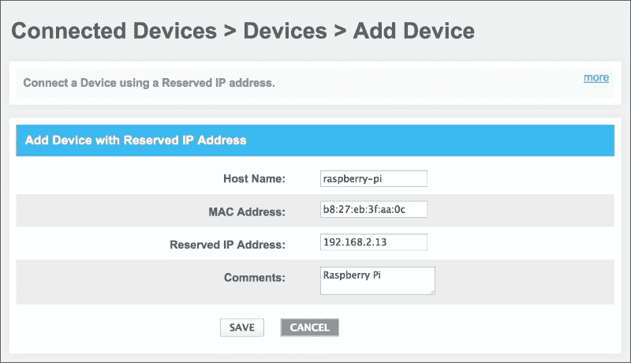

在上面的截图中，正在配置本地家庭网络网关，设置**保留 IP 地址**为**192.168.2.13**，仅供**raspberry-pi**计算机使用。

**MAC 地址** (**b8:27:eb:3f:aa:0c**) 是分配给此特定 Raspberry Pi 网络接口的唯一编号。

保存此配置后，IP 地址**192.168.2.13**将被保留，专门供**raspberry-pi**计算机使用。

## 另见

+   **动态主机配置协议** ([`en.wikipedia.org/wiki/Dynamic_Host_Configuration_Protocol`](http://en.wikipedia.org/wiki/Dynamic_Host_Configuration_Protocol)): 这篇维基百科文章介绍了 DHCP 协议、其历史以及工作原理。

+   **hostname – 显示或设置系统主机名**([`manpages.debian.net/cgi-bin/man.cgi?query=hostname`](http://manpages.debian.net/cgi-bin/man.cgi?query=hostname)): Debian 的`hostname`手册页面描述了该命令及其选项。

+   **route – 显示/操作 IP 路由表**([`manpages.debian.net/cgi-bin/man.cgi?query=route`](http://manpages.debian.net/cgi-bin/man.cgi?query=route)): Debian 的`route`手册页面描述了该命令及其选项。

+   **ifconfig – 配置网络接口** ([`manpages.debian.net/cgi-bin/man.cgi?query=ifconfig`](http://manpages.debian.net/cgi-bin/man.cgi?query=ifconfig)): Debian 的`ifconfig`手册页面描述了该命令及其选项。

+   **interfaces – 网络接口配置文件（用于 ifup 和 ifdown）** ([`manpages.debian.net/cgi-bin/man.cgi?query=interfaces`](http://manpages.debian.net/cgi-bin/man.cgi?query=interfaces)): Debian 的`interfaces`手册页面描述了配置文件及其参数。

+   **awk – 模式驱动的扫描和处理语言** ([`manpages.debian.net/cgi-bin/man.cgi?query=awk`](http://manpages.debian.net/cgi-bin/man.cgi?query=awk)): Debian 的`awk`手册页面描述了该命令及其`awk`命令语言。

# 使用 ufw 创建防火墙

本配方使用了一个简单而强大的命令行工具（`ufw`）来配置防火墙。

本食谱可用于完全阻止 Raspberry Pi 的网络访问。它还可以配置 Uncomplicated Firewall (`ufw`)，允许通过防火墙访问特定应用程序（例如，Web 服务器）。

完成本食谱后，你将能够通过防火墙保护 Raspberry Pi 的网络访问。

## 准备工作

材料：

初始设置或已开机的 Raspberry Pi 的基础网络设置。你也已经以用户 `pi` 登录（请参见 第一章，*安装和设置*，了解如何启动和登录；以及 第二章，*管理*，了解如何远程登录）。

本食谱不需要桌面 GUI，可以从基于文本的控制台或 `LXTerminal` 中运行。

如果 Raspberry Pi 的 Secure Shell 服务器正在运行，本食谱可以通过使用 Secure Shell 客户端远程完成。

## 如何操作...

创建一个防火墙的步骤如下：

1.  直接或远程登录 Raspberry Pi。

1.  使用 `apt-get install` 命令安装 `ufw` 软件包。

    ```
    pi@raspberrypi ~ $ sudo apt-get install ufw
    Reading package lists... Done
    Building dependency tree       
    Reading state information... Done
    The following NEW packages will be installed:
      ufw
    0 upgraded, 1 newly installed, 0 to remove and 0 not upgraded.
    Need to get 166 kB of archives.
    After this operation, 708 kB of additional disk space will be used.
    Get:1 http://mirrordirector.raspbian.org/raspbian/ wheezy/main ufw all 0.31.1-2 [166 kB]
    Fetched 166 kB in 2s (65.6 kB/s)
    Preconfiguring packages ...
    Selecting previously unselected package ufw.
    (Reading database ... 83839 files and directories currently installed.)
    Unpacking ufw (from .../archives/ufw_0.31.1-2_all.deb) ...
    Processing triggers for man-db ...
    Setting up ufw (0.31.1-2) ...

    Creating config file /etc/ufw/before.rules with new version

    Creating config file /etc/ufw/before6.rules with new version

    Creating config file /etc/ufw/after.rules with new version

    Creating config file /etc/ufw/after6.rules with new version

    pi@raspberrypi ~ $
    ```

1.  `apt-get install` 命令下载并安装 `ufw`。`ufw` 的安装包含一组默认的防火墙规则。

1.  使用 `ufw allow` 命令将 `ssh` 协议添加到防火墙规则中允许的协议列表。

    ```
    pi@raspberrypi ~ $ sudo ufw allow ssh
    Rules updated

    pi@raspberrypi ~ $ 
    ```

1.  使用 `ufw enable` 命令开启防火墙。

    ```
    pi@raspberrypi ~ $ sudo ufw enable
    Command may disrupt existing ssh connections. Proceed with operation (y|n)? y
    Firewall is active and enabled on system startup

    pi@raspberrypi ~ $ 
    ```

1.  防火墙规则会立即启用，并且在启动时也会启用！

## 它是如何工作的...

在登录 Raspberry Pi 后，本食谱使用 `apt-get install` 命令下载并安装 Uncomplicated Firewall (**ufw**)。

然后，定义一条防火墙规则，允许使用 Secure Shell（`ssh`）协议远程访问 Raspberry Pi（`ufw allow ssh`）。

最后，防火墙被启用（`ufw enable`）。

## 还有更多...

Uncomplicated Firewall (`ufw`) 是一个用于定义防火墙规则的命令行工具。`ufw` 命令实际上不是防火墙。没有安装额外的防火墙服务器。Linux 内核可以作为防火墙使用。

`ufw` 命令仅用于配置防火墙规则。规则定义存储在 `/etc/ufw` 目录中；然而，这些定义文件不应直接修改。正确修改这些文件是 `ufw` 命令的目的。

### 别忘了启用远程访问。

在前面的食谱中，`ufw` 命令安装后，在启用防火墙之前，会向规则定义中添加一条新的防火墙规则，允许 SSH 访问（`ufw`）`allow ssh`。没有此规则，下次通过 `ssh` 远程连接时将失败。

```
golden-imac:~ golden$ ssh pi@192.168.2.13
ssh: connect to host 192.168.2.13 port 22: Operation timed out

golden-imac:~ golden$ 
```

在此示例中，`ssh` 命令失败，因为没有防火墙规则允许使用 Secure Shell 访问 Raspberry Pi。

### 禁用防火墙

使用`ufw`定义的防火墙规则不会阻止用户通过直接连接到 Raspberry Pi 的键盘和显示器本地登录。

如果`ufw`阻止了远程访问，直接登录到 Raspberry Pi，然后使用命令：`ufw disable`来禁用防火墙规则。

```
pi@raspberrypi ~ $ sudo ufw disable
Firewall stopped and disabled on system startup

pi@raspberrypi ~ $ 
```

### 允许文件服务器通过防火墙

如果 Raspberry Pi 已设置为文件服务器（参见第四章, *文件共享*），则使用防火墙规则`ufw allow cifs`来允许 SMB（CIFS）协议通过防火墙。

```
pi@raspberrypi ~ $ sudo ufw allow cifs
Rules updated

pi@raspberrypi ~ $ 
```

### 允许网页服务器通过防火墙

类似地，如果 Raspberry Pi 已设置为本地网页服务器（参见本章的下一个教程），则使用防火墙规则`ufw allow http`来允许 HTTP 协议通过防火墙。

```
pi@raspberrypi ~ $ sudo ufw allow http
Rules updated

pi@raspberrypi ~ $ 
```

### 应用规则

除了网络协议之外，简单防火墙还为许多应用协议预定义了规则。当前`ufw`识别的应用可以通过命令`ufw app list`显示。

```
pi@raspberrypi ~ $ sudo ufw app list
Available applications:
  AIM
  Bonjour
  CIFS
  DNS
  Deluge
  IMAP
  IMAPS
  IPP
  KTorrent
  Kerberos Admin
  Kerberos Full
  Kerberos KDC
  Kerberos Password
  LDAP
  LPD
  MSN
  MSN SSL
  Mail submission
  NFS
  OpenSSH
  POP3
  POP3S
  PeopleNearby
  SMTP
  SSH
  Socks
  Telnet
  Transmission
  Transparent Proxy
  VNC
  WWW
  WWW Cache
  WWW Full
  WWW Secure
  XMPP
  Yahoo
  qBittorent
  svnserve
pi@raspberrypi ~ $ 
```

使用命令`ufw allow`启用前述应用程序的所有已定义网络连接，使用命令`ufw deny`禁用它们。

`ufw app info`命令将显示应用的配置。

```
pi@raspberrypi ~ $ sudo ufw app info "WWW Full"
Profile: WWW Full
Title: Web Server (HTTP,HTTPS)
Description: Web Server (HTTP,HTTPS)

Ports:
  80,443/tcp

pi@raspberrypi ~ $ sudo ufw allow "WWW Full"
Rule added

pi@raspberrypi ~ $ 
```

前面的示例表明，**"WWW Full"**的应用配置包括了**HTTP**端口（**80**）和**HTTPS**端口（**443**）。通过使用**"WWW Full"**应用配置文件，可以通过一个防火墙规则允许（拒绝或拒绝）对这两个网页服务器端口的网络访问。

### 重置防火墙规则

默认情况下，`ufw`规则会拒绝所有网络访问到 Raspberry Pi。然而，默认情况下，防火墙规则并未启用。

使用命令`ufw reset`将防火墙规则恢复到默认状态——禁用防火墙时，完全无法进行远程访问。

重置默认规则后，可以使用命令`ufw enable`重新启用防火墙。

## 另见

+   **简单防火墙（ufw）** ([`en.wikipedia.org/wiki/Uncomplicated_Firewall`](http://en.wikipedia.org/wiki/Uncomplicated_Firewall))：这篇关于简单防火墙的维基百科文章解释了它的工作原理。

+   **ufw – 管理网络过滤防火墙的程序** ([`manpages.debian.net/cgi-bin/man.cgi?query=ufw`](http://manpages.debian.net/cgi-bin/man.cgi?query=ufw))：Debian 的`ufw`手册页描述了该命令及其选项。

+   **iptables – IPv4 包过滤和 NAT 管理工具** ([`manpages.debian.net/cgi-bin/man.cgi?query=iptables`](http://manpages.debian.net/cgi-bin/man.cgi?query=iptables))：Debian 的`iptables`手册页更详细地描述了如何配置 Linux 内核内建的防火墙。

# 远程访问桌面会话（xrdp）

这个教程启用通过`xrdp`远程访问 Raspberry Pi 桌面会话。

使用`xrdp`，教师、支持工程师和爱好者可以从另一台计算机远程在 Raspberry Pi 上创建新的桌面会话。新创建的桌面会话与当前连接到 Raspberry Pi 的显示器上显示的桌面会话是分开的。这种私密会话非常适合安装更新或执行其他不应打断当前 Raspberry Pi 显示器上桌面会话的后台任务。

完成此食谱后，您将能够使用`xrdp`在 Raspberry Pi 上创建新的远程桌面会话。

## 准备就绪

配料：

已启动的 Raspberry Pi 的初始设置或基本网络设置。您还已经以用户`pi`登录（请参阅第一章中的食谱，*安装和设置*如何启动和登录以及第二章中的食谱，*管理*如何远程登录）。

运行此应用程序需要桌面图形用户界面。使用`raspi-config`配置 Raspberry Pi 以自动启动桌面 GUI（参见第二章，*管理*）。

此食谱的安装部分不需要桌面，可以从基于文本的控制台（或从 LXTerminal 内部）运行。

如果 Raspberry Pi 的 Secure Shell 服务器正在运行，则可以使用 Secure Shell 客户端远程完成此食谱。

## 如何做...

连接到 Raspberry Pi 桌面的步骤是：

1.  直接或远程登录到 Raspberry Pi。如果您使用 Raspberry Pi 桌面，请打开一个 LXTerminal 窗口。

1.  使用`apt-get install`命令安装`xrdp`软件包。

    ```
    pi@raspberrypi ~ $ sudo apt-get install -y xrdp
    Reading package lists... Done
    Building dependency tree       
    Reading state information... Done
    The following extra packages will be installed:
      tightvncserver xfonts-base
    Suggested packages:
      tightvnc-java
    The following NEW packages will be installed:
      tightvncserver xfonts-base xrdp
    0 upgraded, 3 newly installed, 0 to remove and 0 not upgraded.
    Need to get 7,219 kB of archives.
    After this operation, 11.5 MB of additional disk space will be used.
    Get:1 http://mirrordirector.raspbian.org/raspbian/ wheezy/main tightvncserver armhf 1.3.9-6.4 [786 kB]
    Get:2 http://mirrordirector.raspbian.org/raspbian/ wheezy/main xfonts-base all 1:1.0.3 [6,181 kB]
    Get:3 http://mirrordirector.raspbian.org/raspbian/ wheezy/main xrdp armhf 0.5.0-2 [252 kB]
    Fetched 7,219 kB in 3s (2,000 kB/s)
    Selecting previously unselected package tightvncserver.
    (Reading database ... 83956 files and directories currently installed.)
    Unpacking tightvncserver (from .../tightvncserver_1.3.9-6.4_armhf.deb) ...
    Selecting previously unselected package xfonts-base.
    Unpacking xfonts-base (from .../xfonts-base_1%3a1.0.3_all.deb) ...
    Selecting previously unselected package xrdp.
    Unpacking xrdp (from .../xrdp_0.5.0-2_armhf.deb) ...
    Processing triggers for man-db ...
    Processing triggers for fontconfig ...
    Setting up tightvncserver (1.3.9-6.4) ...
    update-alternatives: using /usr/bin/tightvncserver to provide /usr/bin/vncserver (vncserver) in auto mode
    update-alternatives: using /usr/bin/Xtightvnc to provide /usr/bin/Xvnc (Xvnc) in auto mode
    update-alternatives: using /usr/bin/tightvncpasswd to provide /usr/bin/vncpasswd (vncpasswd) in auto mode
    Setting up xfonts-base (1:1.0.3) ...
    Setting up xrdp (0.5.0-2) ...
    [....] Generating xrdp RSA keys......
    Generating 512 bit rsa key...

    ssl_gen_key_xrdp1 ok

    saving to /etc/xrdp/rsakeys.ini

    done (done).
    [ ok ] Starting Remote Desktop Protocol server : xrdp sesman.

    pi@raspberrypi ~ $ 
    ```

1.  `apt-get install`命令下载并安装`xrdp`。安装软件包包括启动`xrdp`服务。

1.  使用**RDP**（**远程桌面协议**）客户端（例如 Microsoft 的 Remote Desktop Connection）通过其 IP 地址（**192.168.2.13**）连接到 Raspberry Pi。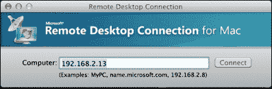

    以上截图显示了如何使用 Microsoft 的 Remote Desktop Connection for Mac 连接到 Raspberry Pi。

1.  连接后，`xrdp`会话管理器（`sesman`）显示登录屏幕。

    以上图像显示了如何使用`xrdp`在 Raspberry Pi 上启动远程桌面会话。

1.  登录到`xrdp`会话：选择`sesman-Xvnc`作为模块。使用与您通过控制台（或通过 ssh）登录相同的用户名（`pi`）和密码（`raspberry`）。

1.  成功登录后，将显示 Raspberry Pi 桌面。

    以上截图显示了通过 RDP 连接（客户端分辨率设置为 640x480）远程连接到 Raspberry Pi 桌面。

## 工作原理...

登录到树莓派后，`xrdb`软件包通过`apt-get install`进行下载和安装。安装过程中会启动`xrdb`和桌面会话管理器（`sesman`）。

在`sesman`启动后，可以从另一台安装了 RDP 客户端的计算机创建到树莓派的远程会话。

示例中使用的是 Microsoft 的 Mac 版远程桌面连接。Microsoft RDP 客户端会提示输入**计算机**。输入树莓派的 IP 地址（**192.168.2.13**）以建立远程连接。

远程连接建立后，RDP 会话会通过使用与直接通过`ssh`或通过 GUI 桌面直接登录树莓派时相同的用户名和密码登录`xrdp`来创建（**登录到 xrdp**）。

一旦用户名和密码正确输入，一个新的桌面会话就会被创建。这个新桌面会话与直接连接到树莓派的显示器上的会话不同。它是一个新的桌面会话。

## 还有更多...

远程桌面协议（RDP）是微软开发的一种客户端-服务器协议。`xrdp`客户端用于显示由 RDP 服务器发送的图形用户界面。Microsoft RDP 客户端（`mstsc.exe`）自 XP 以来包含在每个 Windows 版本中。

`xrdp`软件包还包括 TightVNC 服务器（`tightvncserver`），它通过**虚拟网络计算**（**VNC**）协议进行通信——这也是一种图形桌面共享协议。RDP 和 VNC 远程桌面协议都有许多开源和专有客户端，包括移动设备和平板电脑的客户端。

远程桌面连接以与树莓派直接连接显示器时类似的方式显示树莓派桌面。但也有一些例外。

### 无法播放视频流（或 Minecraft）

远程显示的最明显的限制是无法显示视频流。大多数视频流应用程序直接将视频流传输到视频帧缓冲区，即与显示器共享的内存部分。因此，视频直接流向显示器，并绕过桌面。因为视频绕过桌面，它也不会被发送到远程桌面。

树莓派上的 Minecraft 游戏也直接访问视频帧缓冲区。因此，与视频流一样，Minecraft 无法通过远程桌面会话进行播放。

### 这不是显示

每个远程桌面会话都是一个独立的桌面会话。它与直接连接到树莓派显示器上的桌面会话不同。

## 另见

+   **远程桌面协议**（[`en.wikipedia.org/wiki/Remote_Desktop_Protocol`](http://en.wikipedia.org/wiki/Remote_Desktop_Protocol)）：这篇维基百科文章描述了远程桌面协议（RDP）。

+   **远程桌面软件比较**（[`en.wikipedia.org/wiki/Comparison_of_remote_desktop_software`](http://en.wikipedia.org/wiki/Comparison_of_remote_desktop_software)）：这篇维基百科文章比较了远程桌面软件。

+   **xrdp – 一个远程桌面协议（RDP）服务器**（[`manpages.debian.net/cgi-bin/man.cgi?query=xrdp`](http://manpages.debian.net/cgi-bin/man.cgi?query=xrdp)）：Debian 手册页提供了有关`xrdp`命令及其选项的更多信息。

+   **sesman – 一个 xrdp(8)会话管理器**（[`manpages.debian.net/cgi-bin/man.cgi?query=sesman`](http://manpages.debian.net/cgi-bin/man.cgi?query=sesman)）：Debian 手册页提供了有关`sesman`命令及其选项的更多信息。

+   **xrdp – 一个开源的远程桌面协议（rdp）服务器**（[`www.xrdp.org/`](http://www.xrdp.org/)）：xrdp 网站提供了有关这个 RDP 服务器的更多信息。

# 远程访问显示器（x11vnc）

本食谱启用通过`xrdp`远程访问树莓派的显示器。

使用`x11vnc`，教师、支持工程师和爱好者可以访问当前显示在树莓派显示器上的桌面会话。教师可以通过远程桌面帮助学生完成作业。远程支持工程师可以帮助树莓派用户调试、安装或配置软件。而爱好者可以使用`xrdp`从其他房间访问连接到客厅电视的树莓派。

完成本食谱后，你将能够使用`xrdp`远程访问当前显示在树莓派显示器上的桌面会话。

## 准备工作

材料：

树莓派已开机并完成初始设置或基本网络设置。你还需要以`pi`用户身份登录（有关如何启动和登录的食谱，请参见第一章，*安装与设置*；如何远程登录，请参见第二章，*管理*）。

运行此应用程序需要桌面 GUI。使用`raspi-config`配置树莓派，使其能够在启动时自动加载桌面 GUI（请参见第二章, *管理*）。

本食谱的安装部分不需要桌面环境，可以从基于文本的控制台（或在 LXTerminal 中）运行。

如果树莓派的安全外壳（Secure Shell）服务器正在运行，本食谱的安装部分也可以通过使用安全外壳客户端远程完成（请参见第二章, *管理*中的`ssh`食谱）。

## 如何操作...

远程连接到树莓派桌面的步骤如下：

1.  直接或远程登录到树莓派。如果你使用的是树莓派桌面环境，打开 LXTerminal。

1.  使用`apt-get install`命令安装`x11vnc`包。

    ```
    pi@raspberrypi ~ $ sudo apt-get install -y x11vnc
    Reading package lists... Done
    Building dependency tree       
    Reading state information... Done
    The following extra packages will be installed:
      libvncserver0 tcl tk x11vnc-data
    Suggested packages:
      libvncserver0-dbg
    The following NEW packages will be installed:
      libvncserver0 tcl tk x11vnc x11vnc-data
    0 upgraded, 5 newly installed, 0 to remove and 0 not upgraded.
    Need to get 0 B/1,841 kB of archives.
    After this operation, 3,192 kB of additional disk space will be used.
    Selecting previously unselected package libvncserver0:armhf.
    (Reading database ... 84404 files and directories currently installed.)
    Unpacking libvncserver0:armhf (from .../libvncserver0_0.9.9+dfsg-1+deb7u1_armhf.deb) ...
    Selecting previously unselected package tcl.
    Unpacking tcl (from .../archives/tcl_8.5.0-2.1_all.deb) ...
    Selecting previously unselected package tk.
    Unpacking tk (from .../archives/tk_8.5.0-2.1_all.deb) ...
    Selecting previously unselected package x11vnc-data.
    Unpacking x11vnc-data (from .../x11vnc-data_0.9.13-1_all.deb) ...
    Selecting previously unselected package x11vnc.
    Unpacking x11vnc (from .../x11vnc_0.9.13-1_armhf.deb) ...
    Processing triggers for man-db ...
    Processing triggers for desktop-file-utils ...
    Setting up libvncserver0:armhf (0.9.9+dfsg-1+deb7u1) ...
    Setting up tcl (8.5.0-2.1) ...
    update-alternatives: using /usr/bin/tclsh-default to provide /usr/bin/tclsh (tclsh) in auto mode
    Setting up tk (8.5.0-2.1) ...
    update-alternatives: using /usr/bin/wish-default to provide /usr/bin/wish (wish) in auto mode
    Setting up x11vnc-data (0.9.13-1) ...
    Setting up x11vnc (0.9.13-1) ...

    pi@raspberrypi ~ $ 
    ```

1.  `apt-get install`命令会下载并安装`x11vnc`。

1.  从远程计算机使用安全外壳隧道（`ssh`）启动一个在 Raspberry Pi 上运行的`x11vnc`实例。只要连接处于开启状态，它就会继续运行。

    ```
    golden-macbook:~ A601012$ ssh -t -L 5900:localhost:5900 pi@192.168.2.13 
    'x11vnc -q -localhost -display :0 -passwd pass1234'

    pi@192.168.2.13's password: 
    The VNC desktop is: localhost:0
    PORT=5900
    ```

1.  使用 VNC 客户端（如 TightVNC）通过 ssh 隧道从本地计算机连接到远程 Raspberry Pi（**127.0.0.1**）。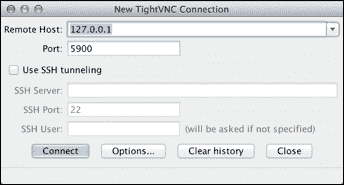

    前面的截图展示了如何使用 TightVNC 连接到 Raspberry Pi。**远程主机**实际上是本地主机（**127.0.0.1**），这是由于`ssh`隧道的缘故。**端口**是默认的 VNC 端口（**5900**）。

    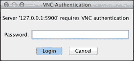

    在前面的截图中，TightVNC 客户端请求用户输入认证密码。输入前一步中指定的密码（**pass1234**）。

1.  一旦连接，TightVNC 会显示显示器上的内容。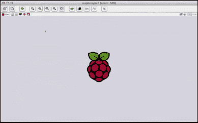

    前面的截图显示了如何通过 TightVNC 客户端远程连接到 Raspberry Pi 的桌面（客户端分辨率为 50%）。

## 它是如何工作的...

登录 Raspberry Pi 后，使用`apt-get install`命令下载并安装`x11vnc`软件包。

安装完成后，`x11vnc`服务器通过远程计算机使用安全外壳隧道（ssh）启动。

SSH 隧道启动`x11vnc`服务器，并将远程 Raspberry Pi 上的 VNC 连接转发到本地主机的相同端口（**-L 5900:localhost:5900**）。

使用显示在显示器上的桌面会话（**-display :0**）启动`x11vnc`服务器，且以静默模式启动（**-q**）。服务器只允许本地连接（**-localhost**）。设置认证密码（**-passwd pass1234**）。

只要有客户端连接，`x11vnc`服务器就会持续运行。

接下来，配方使用 TightVNC Java 客户端连接到 Raspberry Pi。TightVNC 客户端提示输入**远程主机**和**端口**。由于配方使用了 SSH 隧道，因此输入本地主机的 IP 地址（**127.0.0.1**）来使用 SSH 隧道。

在 Raspberry Pi 桌面显示之前，VNC 客户端请求输入启动服务器时指定的**VNC 认证**密码（**pass1234**）。

一旦正确输入密码，VNC 客户端就会显示 Raspberry Pi 显示器上显示的桌面会话。

只要远程桌面会话处于连接状态，`x11vnc`服务器就会继续运行。远程连接关闭时，`x11vnc`服务器退出。

## 还有更多...

VNC 客户端显示与 Raspberry Pi 显示器上相同的桌面会话。然而，也有一些例外。

### 无视频流（或 Minecraft）

直接写入视频帧缓冲区的应用程序（例如，视频流和 Minecraft）仍然不会通过 VNC 显示（有关更多信息，请参见前面的配方）。

## 另见

+   **虚拟网络计算** ([`en.wikipedia.org/wiki/Vnc`](http://en.wikipedia.org/wiki/Vnc))：这篇 Wikipedia 文章介绍了虚拟网络计算（VNC）的历史和功能。

+   **x11vnc** ([`en.wikipedia.org/wiki/X11vnc`](https://en.wikipedia.org/wiki/X11vnc))：这篇 Wikipedia 文章介绍了 x11vnc 的使用和配置。

+   **x11vnc –** 允许 VNC 连接到真实的 X11 显示器 ([`manpages.debian.net/cgi-bin/man.cgi?query=x11vnc`](http://manpages.debian.net/cgi-bin/man.cgi?query=x11vnc))：Debian 的`x11vnc`手册页描述了该命令及其选项。

+   **TightVNC 软件** ([`tightvnc.com/`](http://tightvnc.com/))：TightVNC 软件网站提供了下载和安装客户端的说明。

# 安装 web 服务器（Apache、lighttpd、Nginx）

本食谱安装 Apache HTTP web 服务器。lighttpd 和 Nginx web 服务器的安装差异在本食谱末尾有说明。

Apache web 服务器是 GNU Linux 平台（如 Raspberry Pi 使用的 Raspbian Linux 发行版）上最常用的 web 服务器之一。Apache 是一个成熟且可扩展的 web 服务器，可以用于托管各种应用程序；代理访问内部和外部网站；以及托管静态网页和图像。

完成本食谱后，Raspberry Pi 将能够从 SD 卡启动盘和外部硬盘提供静态和动态网页。

## 准备工作

配料：

需要为已开机的 Raspberry Pi 进行初步设置或基本网络配置。你还需要以`pi`用户登录（请参阅第一章，*安装与设置*部分，了解如何启动和登录；以及第二章，*管理*部分，了解如何远程登录）。

本食谱不需要桌面 GUI，可以通过文本控制台或在`LXTerminal`中运行。

如果 Raspberry Pi 的安全外壳（Secure Shell）服务器正在运行，可以通过安全外壳客户端远程完成本食谱。

本食谱中的示例还使用了挂载在`/media/bigdisk`的外部硬盘（详情请参阅第四章，*文件共享*部分）。

安装 Apache web 服务器的步骤如下：

1.  直接或远程登录到 Raspberry Pi。

1.  使用`apt-get install`命令下载并安装 Apache HTTP web 服务器（`apache2`）。

    ```
    pi@raspberrypi ~ $ sudo apt-get install -y apache2
    Reading package lists... Done
    Building dependency tree       
    Reading state information... Done
    The following extra packages will be installed:
      apache2-mpm-worker apache2-utils apache2.2-bin apache2.2-common libapr1
      libaprutil1 libaprutil1-dbd-sqlite3 libaprutil1-ldap ssl-cert

    ...

    Setting up apache2.2-common (2.2.22-13+deb7u5) ...
    Enabling site default.
    Enabling module alias.
    Enabling module autoindex.
    Enabling module dir.
    Enabling module env.
    Enabling module mime.
    Enabling module negotiation.
    Enabling module setenvif.
    Enabling module status.
    Enabling module auth_basic.
    Enabling module deflate.
    Enabling module authz_default.
    Enabling module authz_user.
    Enabling module authz_groupfile.
    Enabling module authn_file.
    Enabling module authz_host.
    Enabling module reqtimeout.
    Setting up apache2-mpm-worker (2.2.22-13+deb7u5) ...
    [....] Starting web server: apache2apache2: Could not reliably determine the server's fully qualified domain name, using 127.0.1.1 for ServerName
    . ok 
    Setting up apache2 (2.2.22-13+deb7u5) ...
    Setting up ssl-cert (1.0.32) ...

    pi@raspberrypi ~ $ 
    ```

1.  `apt-get install`命令用于下载并安装`apache2`。

    ### 注意

    如果已安装`ufw`防火墙（请参见前面的*创建防火墙*食谱），使用`ufw allow http`命令创建规则，允许 HTTP（web 服务器）协议通过防火墙。

    ```
    pi@raspberrypi ~ $ sudo ufw allow http
    Rules updated

    pi@raspberrypi ~ $ 
    ```

1.  使用另一台计算机（或设备）上的 web 浏览器测试与 Raspberry Pi 的 HTTP 连接。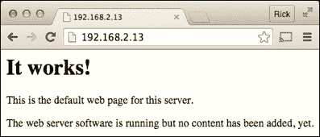

    在上面的图像中，另一台计算机上的网页浏览器用于访问运行在树莓派上的 Apache Web 服务器的默认网页。Web 服务器正常工作！

1.  使用命令 `ls -l` 列出 Web 服务器根目录 `/var/www` 的内容。

    ```
    pi@raspberrypi ~ $ ls -l /var/www
    total 4
    -rw-r--r-- 1 root root 177 Aug 12 20:11 index.html

    pi@raspberrypi ~ $ 
    ```

    Web 服务器的根目录中有一个文件，**index.html**。

1.  使用命令 `ls -l` 列出存储在外部磁盘 `/media/bigdisk/MyWebsite/` 上的网站内容。

    ```
    pi@raspberrypi ~ $ ls -l /media/bigdisk/MyWebsite/
    total 4
    -rw-r--r-- 1 root root 92 Aug 11 20:13 hello.html

    pi@raspberrypi ~ $ 
    ```

    外部磁盘目录中有一个文件，`hello.html`。

1.  使用命令 `ln -s` 在外部磁盘目录（`/media/bigdisk/MyWebsite`）和 Web 服务器的根目录（`/var/www/`）之间创建一个符号链接。

    ```
    pi@raspberrypi ~ $ ln –s /media/bigdisk/MyWebsite /var/www/MyWebsite

    pi@raspberrypi ~ $ ls –l /var/www
    total 4
    -rw-r--r-- 1 root root 177 Aug 12 20:11 index.html
    -rw-r--r-- 1 root root  24 Aug 12 20:48 MyWebsite -> /media/bigdisk/MyWebsite

    pi@raspberrypi ~ $ ls –l /var/www/MyWebiste/
    total 4
    -rw-r--r-- 1 root root 92 Aug 11 20:13 hello.html

    pi@raspberrypi ~ $
    ```

    Web 服务器根目录（`/var/www`）现在有一个指向存储在外部磁盘上的网站（`/media/bigdisk/MyWebsite`）的符号链接。

1.  使用另一台计算机（或设备）上的网页浏览器测试与树莓派的 HTTP 连接。外部磁盘上的网站现在可以访问！！准备就绪

    上面的图像展示了如何通过另一台计算机上的网页浏览器访问存储在连接到树莓派外部磁盘上的网页。

1.  使用 `vi` 命令在 `/usr/lib/cgi-bin` 目录中创建一个动态网页（`timestamp`）。

    ```
    pi@raspberrypi ~ $ sudo vi /usr/lib/cgi-bin/timestamp
    ```

1.  将以下行添加到新的动态网页中：

    ```
    #!/bin/sh

    echo "Content-Type: text/plain"
    echo ""
    echo $(date)
    ```

1.  保存文件并退出（`:wq`）。

1.  使用命令 `chmod a+rx` 使动态网页 `/usr/lib/cgi-bin/timestamp` 可执行。

    ```
    pi@raspberrypi ~ $ sudo chmod a+rx /usr/lib/cgi-bin/timestamp 

    pi@raspberrypi ~ $ ls -l /usr/lib/cgi-bin
    total 4
    -rwxr-xr-x 1 root root 68 Aug 12 21:21 timestamp

    pi@raspberrypi ~ $ 
    ```

    动态网页 `/usr/lib/cgi-bin/timestamp` 现在是可执行的。

1.  使用另一台计算机上的网页浏览器显示动态网页（`http://192.168.2.13/cgi-bin/timestamp`）。该动态网页会在每次刷新页面时显示当前时间！！准备就绪

    上面的图像展示了动态网页的实际运行情况——每次刷新页面时，时间戳会更新为当前时间。树莓派现在可以显示动态页面！

1.  使用 `ls -l` 命令显示 Web 服务器日志文件目录的内容（`/var/log/apache2/`）。

    ```
    pi@raspberrypi ~ $ ls -l /var/log/apache2/
    total 8
    -rw-r----- 1 root adm  1483 Aug 12 21:30 access.log
    -rw-r----- 1 root adm   325 Aug 12 21:01 error.log
    -rw-r--r-- 1 root root    0 Aug 12 20:11 other_vhosts_access.log
    pi@raspberrypi ~ $ 
    ```

    上面的示例展示了如何使用 `ls -l` 命令显示 Apache Web 服务器日志文件目录的内容。

## 工作原理……

登录到树莓派后，本教程从使用**apt-get install**命令开始，下载并安装 Apache HTTP 服务器软件包 `apache2`。`apache2` 软件包包括 Apache HTTP 服务器和相关的实用工具。

Apache HTTP 服务器在安装后会自动启动。然而，如果树莓派被防火墙保护（请参见本章中的*创建防火墙*部分），需要配置防火墙以允许 HTTP 连接。**ufw allow http** 命令添加了一个防火墙规则，允许其他计算机通过 HTTP 协议进行连接。

配置好防火墙后，可以通过另一台计算机上的网页浏览器使用树莓派的 IP 地址（`192.168.2.13`）连接到树莓派。

将外部磁盘的文件添加到 Web 服务器的最简单方法是，先将外部磁盘挂载到`/media`目录（请参见第四章，*文件共享*），然后在 Web 服务器的根目录`(/var/www)`下创建一个指向外部磁盘的符号链接。符号链接不会复制文件，它只是指向文件所在的位置。

在这个示例中，外部磁盘上的网站目录`(/media/bigdisk/MyWebsite)`通过符号链接（**ln –s**）指向 Web 服务器的根目录`/var/www/MyWebsite`。示例网站只有一个文件，实际位于外部磁盘`/media/bigdisk/MyWebsite/hello.html`。创建符号链接后，该文件也会象征性地位于`/var/www/MyWebsite/hello.html`，并且可以通过浏览器访问 URL `http://192.168.2.13/MyWebsite/hello.html`。

接下来的步骤是创建一个简单的动态网页，显示当前时间。使用**vi**编辑器在`/usr/lib/cgi-bin/`目录下创建文件`timestamp`。该目录是受保护的，因此使用`sudo`命令作为前缀，暂时授予用户创建和编辑文件的权限。

`timestamp`动态网页使用 Bash 脚本语言（`#!/bin/bash`）。网页首先输出一个描述网页内容的头部，作为纯文本（**echo "Content-Type: text/plain"**），然后输出一个空行（`echo ""`），以将 HTTP 响应头与网页内容分开。网页的唯一一行通过执行 GNU `date`实用程序来显示当前时间（`echo "$(date)"`）。

为了使脚本能够动态调用，需要使用`chmod`命令设置文件模式的执行位（`chmod a+rx`）。由于文件位于受保护的目录中，因此再次使用`sudo`命令，暂时授予权限。

在另一台计算机的浏览器中查看动态网页（`http://192.168.2.13/cgi-bin/timestamp`），可以看到每次刷新浏览器时网页都会动态更新。

最后，显示了 Web 服务器日志文件目录（`/var/log/apache2/`）的内容。每个发送到 Apache HTTP Web 服务器的请求都会记录在`access.log`文件中——每个请求占一行。错误消息会附加到`error.log`文件的末尾。如果动态网页没有显示——或显示不正常，可以查看错误日志末尾的消息，了解原因。该目录下的所有日志文件应定期删除（或归档），以释放磁盘空间。

## 还有更多内容…

### 配置文件、静态内容和动态页面

服务器的配置文件位于`/etc/apache`目录中。然而，不需要更改配置，因为默认配置已经足够用于从`/var/www`目录提供静态网页以及从`/usr/lib/cgi-bin`目录提供基于 CGI 的动态网页。

`/var/www`目录是静态网页的默认位置，还包括图像、字体、视频和声音等静态内容。任何位于该目录下的文件都可以通过 Raspberry Pi 的 URL 加文件名（或文件路径）在 Web 浏览器中显示。最初，该目录中只有一个文件`index.html`，在示例中其 URL 为`http://192.168.2.13/index.html`。由于`/var/www`目录受到保护，因此需要使用`sudo`命令来添加、修改或删除该目录中的文件。

在默认的 Apache HTTP Web 服务器配置中，动态网页使用公共网关接口（CGI），并位于`/usr/lib/cgi-bin`目录下。

### 其他服务器

Apache HTTP Web 服务器并不是唯一在 Raspberry Pi 上运行的 Web 服务器；然而，它可能是当今最著名且功能最全的开源 Web 服务器。从 2009 年以来，超过一亿个网站通过 Apache HTTP Web 服务器托管。尽管功能强大且完整，但 Apache HTTP Web 服务器也比较占用资源，消耗的内存和计算能力超过其他服务器。

#### **lighttpd**

lighttpd Web 服务器比 Apache 占用的资源更少，且具有扩展到更高请求数的潜力。

lighttpd 最初设计作为一个概念验证系统，用于处理单个服务器上的 10,000 个并行连接，此后成为了一个流行的 Web 服务器。

可以通过命令`apt-get install lighttpd`来安装 lighttpd Web 服务器。

```
pi@raspberrypi ~ $ sudo apt-get install -y lighttpd
Reading package lists... Done
Building dependency tree       
Reading state information... Done
The following extra packages will be installed:
  libfam0 libterm-readkey-perl libterm-readline-perl-perl spawn-fcgi

...
```

尽管 lighttpd 使用`/var/www`作为 Web 服务器的根目录，但默认情况下并不会运行 CGI 动态网页。

命令`lighty-enable-mod cgi`用于启用 lighttpd 的 CGI 模块。

```
pi@raspberrypi ~ $ sudo lightly-enable-mod cgi
Enabling cgi: ok
Run /etc/init.d/lighttd force-reload to enable changes

pi@raspberrypi ~ $ sudo /etc/init.d/lighttd force-reload
[ ok ] Reloading web server configuration: lighttpd.

pi@raspberrypi ~ $ 
```

上述示例展示了如何使用命令`lighty-enable-mod`来启用 CGI 动态网页。

lighttpd CGI 模块要求`cgi-bin`目录位于 Web 服务器的根目录下，而不是位于`/usr/lib`目录中。可以使用命令`ln –s`从 Web 服务器的根目录创建一个符号链接，指向动态网页的默认位置(`/usr/lib/cgi-bin`)。

```
pi@raspberrypi ~ $ sudo ln –s /usr/lib/cgi-bin /var/www/cgi-bin

pi@raspberrypi ~ $ 
```

lighttpd Web 服务器的配置文件存储在`/etc/lighttpd`目录下，日志文件则写入`/var/log/lighttpd`目录。

#### **Nginx**

另一个流行的现代 Web 服务器是 Nginx。

采用事件驱动方式处理请求，Nginx 在高负载下能提供比 Apache Web 服务器更可预测的性能。Nginx 还提供了多种部署 Web 应用的选项，包括对流行的 Web 框架 Ruby on Rails 的模块化支持。

可以通过命令`apt-get install nginx`来安装 Nginx Web 服务器。

```
pi@raspberrypi ~ $ sudo apt-get install -y nginx
Reading package lists... Done
Building dependency tree       
Reading state information... Done
The following extra packages will be installed:
  nginx-common nginx-full

...
```

Nginx Web 服务器默认不使用与 Apache HTTP 或 lighttpd Web 服务器相同的根目录；相反，静态网页默认存储在`/usr/share/nginx/www`目录中。Nginx Web 服务器也不支持 CGI；然而，Nginx Web 服务器也可以使用 FastCGI 或 Ruby Passenger 生成动态网页。

Nginx Web 服务器的配置文件存储在`/etc/nginx`目录中，其日志文件写入`/var/log/nginx`目录。

除了 Apache、lighttpd 和 Nginx，Raspberry Pi 还可以运行许多较不知名的 Web 服务器，包括 AOL Web 服务器、monkey 和 yaws。

```
pi@raspberrypi ~ $ apt-cache search httpd |grep -i server |grep -v '^lib'
aolserver4-core - AOL web server version 4 - core libraries
aolserver4-daemon - AOL web server version 4 - program files
apache2-mpm-event - Apache HTTP Server - event driven model
apache2-mpm-prefork - Apache HTTP Server - traditional non-threaded model
apache2-mpm-worker - Apache HTTP Server - high speed threaded model
boa - Lightweight and high performance web server
bozohttpd - Bozotic HTTP server
ebhttpd - specialized HTTP server to access CD-ROM books
lighttpd - fast webserver with minimal memory footprint
mathopd - Very small, yet very fast HTTP server
micro-httpd - really small HTTP server
mini-httpd - a small HTTP server
monkey - fast, efficient, small and easy to configure web server
mono-fastcgi-server - ASP.NET backend for FastCGI webservers - default version
mono-fastcgi-server2 - ASP.NET 2.0 backend for FastCGI webservers
mono-fastcgi-server4 - ASP.NET 4.0 backend for FastCGI webservers
nginx-extras - nginx web/proxy server (extended version)
nginx-full - nginx web/proxy server (standard version)
nginx-light - nginx web/proxy server (basic version)
nginx-naxsi - nginx web/proxy server (version with naxsi)
nginx-naxsi-ui - nginx web/proxy server - naxsi configuration front-end
ocsigen - web server and programming framework in OCaml
ocsigenserver - web server of the Ocsigen project
php5-cgi - server-side, HTML-embedded scripting language (CGI binary)
tntnet - modular, multithreaded web application server for C++
webfs - lightweight HTTP server for static content
yaws - High performance HTTP 1.1 webserver written in Erlang

pi@raspberrypi ~ $ 
```

在前面的示例中，`apt-cache search`和`grep`用于显示可用的 HTTP Web 服务器列表。可以通过`apt-get install`命令安装任何列出的 Web 服务器（例如，`apt-get install monkey`）。

## 另见

+   **Apache HTTP 服务器项目** ([`httpd.apache.org`](http://httpd.apache.org)): Apache Web 服务器的官方网站是 Web 服务器的完整参考资料。

+   **lighttpd – 轻量飞速** ([`www.lighttpd.net/`](http://www.lighttpd.net/)): lighttpd 官网提供了 Web 服务器的详细文档。

+   **Nginx** ([`nginx.org/en`](http://nginx.org/en)): Nginx 的官方网站提供了有关 Web 服务器的更多信息。

+   **bash – GNU Bourne-Again SHell** ([`manpages.debian.net/cgi-bin/man.cgi?query=bash`](http://manpages.debian.net/cgi-bin/man.cgi?query=bash)): Debian 的`bash`手册页面是 Bash 命令语言的参考资料。

+   **chmod – 更改文件模式位** ([`manpages.debian.net/cgi-bin/man.cgi?query=chmod`](http://manpages.debian.net/cgi-bin/man.cgi?query=chmod)): Debian 的`chmod`手册页面详细介绍了该命令及其选项。

+   **date – 打印或设置系统日期和时间** ([`manpages.debian.net/cgi-bin/man.cgi?query=date`](http://manpages.debian.net/cgi-bin/man.cgi?query=date)): Debian 的`date`手册页面详细介绍了该命令及其选项。

+   **grep – 打印匹配模式的行** ([`manpages.debian.net/cgi-bin/man.cgi?query=grep`](http://manpages.debian.net/cgi-bin/man.cgi?query=grep)): Debian 的`grep`手册页面详细介绍了该命令及其选项。

+   **ln -s – 创建文件间的链接** ([`manpages.debian.net/cgi-bin/man.cgi?query=ln`](http://manpages.debian.net/cgi-bin/man.cgi?query=ln)): Debian 的`ln -s`手册页面详细介绍了该命令及其选项。

+   **AOL Web 服务器** ([`www.aolserver.com`](http://www.aolserver.com)): AOL Web 服务器的官方网站。

# 安装 Wiki（mediawiki）

本文档安装并设置与维基百科相同的 Wiki 系统（MediaWiki）。

Wiki 是一个有用的协作环境，适用于共享不断发展的文档集的团队。每个团队成员都可以参与创建和编辑 Wiki 中的页面。存储在 Wiki 中的最终文档页面是团队共同努力的结果，反映了团队的集体知识。

本配方用于安装 MediaWiki。这是维基百科使用的相同的 wiki 软件。维基百科网站由一群高性能服务器托管，以便能够不断为数百万用户提供服务。本配方使用的是单台树莓派，它完全有能力管理一个团队或小型办公室的 wiki。

完成此步骤后，你将拥有一个准备好协作的 wiki。

## 准备工作

材料：

已启动的树莓派的初始设置或基本网络设置。你还需要以`pi`用户身份登录（有关如何启动和登录，请参阅第一章，*安装与设置*，以及有关如何远程登录的说明，请参阅第二章，*管理*）。

本配方不需要桌面 GUI，可以从基于文本的控制台或`LXTerminal`中运行。

如果树莓派的安全外壳服务器正在运行，可以使用安全外壳客户端远程完成此步骤。

安装完成后，可以通过 Web 浏览器访问并配置 MediaWiki。配置不需要在树莓派上完成；可以通过与树莓派在同一网络中的其他计算机远程完成。

为了获得更好的性能，应将树莓派的视频内存设置为最低，以便有更多内存可用于 MediaWiki（有关更多信息，请参阅第二章，*管理*中的配置内存使用配方）。

## 如何操作...

安装 MediaWiki wiki 服务器的步骤如下：

1.  直接或远程登录到树莓派。

1.  使用`apt-get install`命令安装`mediawiki`软件包。

    ```
    pi@raspberrypi ~ $ sudo apt-get install -y mediawiki
    Reading package lists... Done
    Building dependency tree       
    Reading state information... Done
    The following extra packages will be installed:
      apache2 apache2-mpm-prefork apache2-utils apache2.2-bin apache2.2-common
      heirloom-mailx javascript-common libaio1 libapache2-mod-php5 libapr1
      libaprutil1 libaprutil1-dbd-sqlite3 libaprutil1-ldap libdbd-mysql-perl
      libdbi-perl libhtml-template-perl libjs-jquery libjs-jquery-cookie
      libjs-jquery-form libjs-jquery-tipsy libmysqlclient16 libmysqlclient18
      libonig2 libqdbm14 lsof mediawiki-extensions-base mysql-client-5.5
      mysql-common mysql-server mysql-server-5.5 mysql-server-core-5.5
      php-wikidiff2 php5 php5-cli php5-common php5-mysql ssl-cert wwwconfig-common

    ...
    ```

1.  `apt-get install`命令下载并安装 MediaWiki。

    ### 注意

    `mediawiki`的安装包括`apache2`、`mysql`和`php5`。

    完整的安装时间将至少需要 15 至 30 分钟。

1.  安装过程中，`mysql`软件包会提示输入一个新的 root 密码，用于管理数据库。输入 root 密码并在下一个屏幕上重复输入该密码。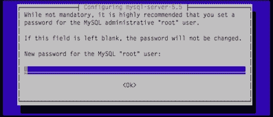

1.  在接受`mysql`数据库的 root 密码（两次输入）后，`mediawiki`的安装完成。

    +   使用 vi 编辑器编辑 MediaWiki 网站的配置文件`(/etc/mediawiki/apache.conf)`。

        ```
        pi@raspberrypi ~ $ sudo vi /etc/mediawiki/apache.conf
        ```

1.  `vi`编辑器显示配置文件的内容。有关如何使用该编辑器的说明，请参阅`vi`的 man 手册（有关更多信息，请参阅第二章，*管理*中的*阅读内建文档*配方）。

    ```
    # Uncomment this to add an alias.	
    # This does not work properly with virtual hosts..
    #Alias /mediawiki /var/lib/mediawiki

    "/etc/mediawiki/apache.conf" 33 lines, 800 characters
    ```

1.  通过删除行首的`#`来取消注释 MediaWiki 网站的`Alias`。

    ```
    Alias /mediawiki /var/lib/mediawiki
    ```

1.  保存并关闭文件（`:wq`）。

1.  使用`apachectl restart`命令重新启动 Web 服务器。

    ```
    pi@raspberrypi ~ $ sudo apachectl restart
    apache2: Could not reliably determine the server's fully qualified domain name, using 127.0.1.1 for ServerName

    pi@raspberrypi ~ $ 
    ```

1.  Apache web 服务器重新启动后，在 web 浏览器中继续配置 MediaWiki。

1.  打开一个 web 浏览器（可能在另一台计算机上），浏览到 MediaWiki 的 URL（`http://192.168.2.13/mediawiki/`）。

    ### 注意

    Raspberry Pi 的 IP 地址（`192.168.2.13`）将会不同。可以使用`hostname -I`命令显示 Raspberry Pi 的 IP 地址——参见第二章中*远程访问*部分，以`hostname -I`命令的示例。

    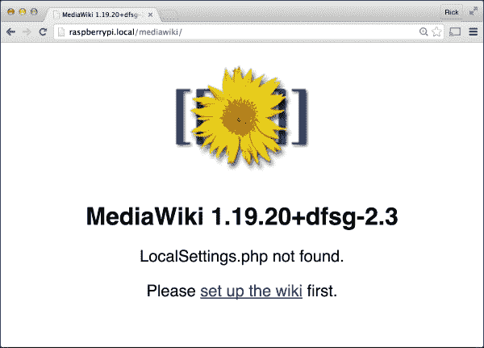

1.  在浏览器中显示 MediaWiki 的初始配置页面。点击设置 wiki 链接以继续。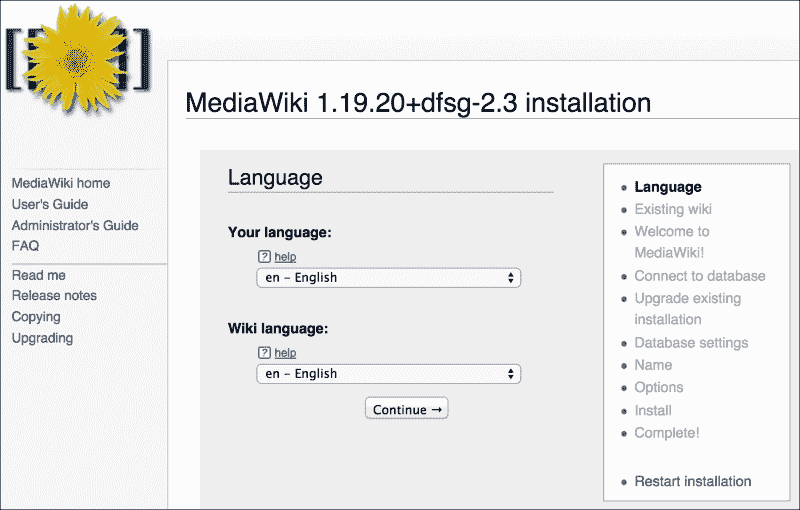

1.  选择 MediaWiki 要使用的语言。点击**继续 ->**进入下一个配置页面。

1.  语言设置完成后，MediaWiki 会运行一些测试，以确定是否（以及如何）可以在 Raspberry Pi 上设置。

    上图显示了验证 Raspberry Pi 准备好安装 MediaWiki 的网页。

1.  消息“**环境已检查。您可以安装 MediaWiki**`.`”表明 MediaWiki 已准备安装。（如果您未看到此绿色消息，请点击**重新启动安装**。）

1.  滚动到页面底部。点击**继续 ->**接受许可证并继续安装。

    截图显示了必须接受的版权协议。

1.  接受许可协议后，继续进行 MySQL 设置。

1.  输入第 4 步中 MySQL 根用户的密码。

1.  输入数据库名称和 MySQL 根密码后，继续配置一些额外的数据库设置以进行 web 访问。

1.  点击**继续 ->**接受默认设置。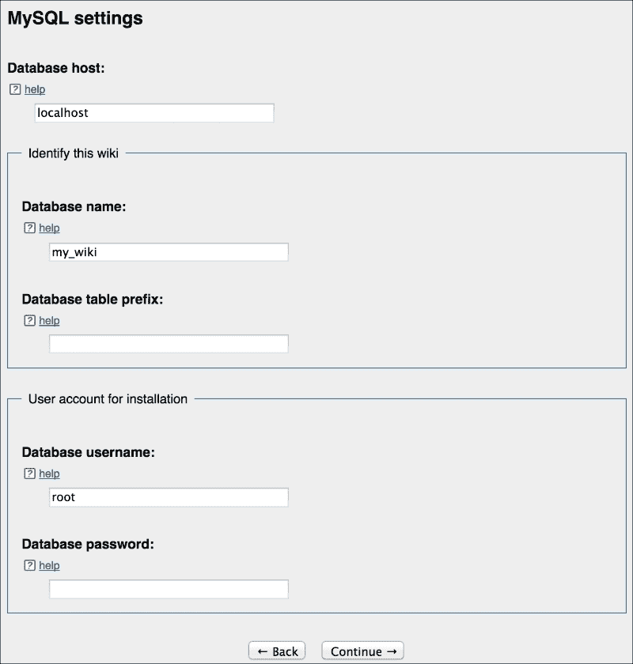

    上述截图显示了如何输入 MySQL 数据库设置。

    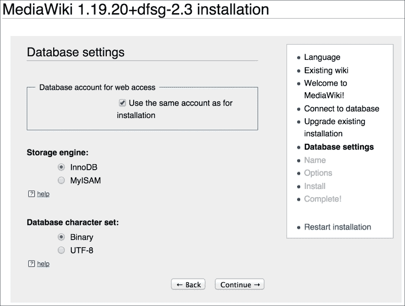

    上述截图接受了默认的数据库设置。

1.  接受默认的数据库设置后，继续配置，输入 wiki 的名称以及管理员账户的用户名和密码。

1.  为 wiki 输入一个名称。输入 MediaWiki 管理员账户的用户名和密码。点击**继续 ->**。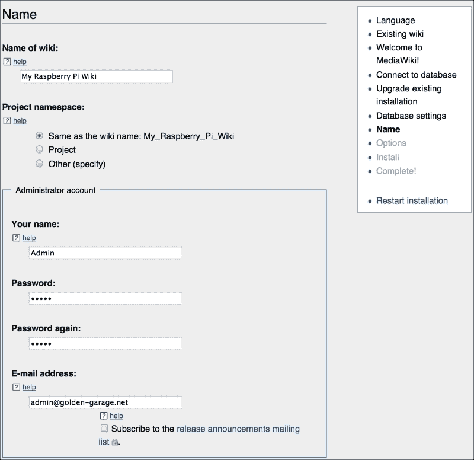

    上述截图显示了用于输入 wiki 名称以及管理员账户的用户名和密码的网页。

1.  输入 wiki 名称和 MediaWiki 管理员用户名和密码后，滚动到页面底部。

1.  选择**我已经厌倦了，直接安装 wiki**`.` 并点击**继续 ->**。

    截图显示了如何跳过可选的配置设置。

1.  MediaWiki 使用提供的配置参数来设置数据库，并显示一个列出已完成安装步骤的网页。

1.  点击 **继续 ->**。此步骤需要一些时间来设置数据库。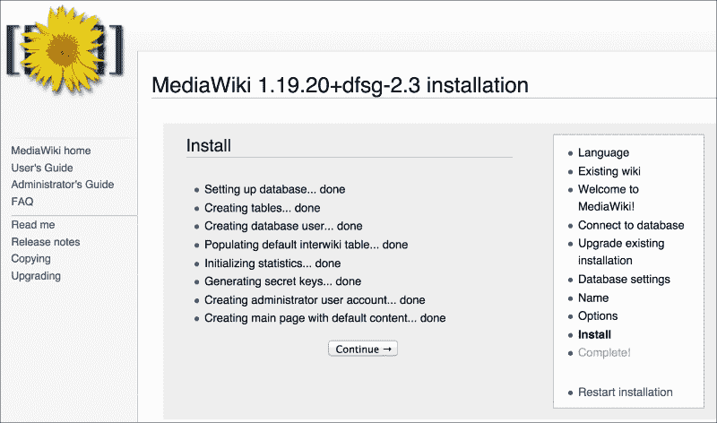

    此截图显示了已完成安装步骤的列表。

1.  接受显示的安装列表后，会显示一个祝贺页面，表示安装已完成。然而，`LocalSettings.php` 文件仍然需要下载和安装。

    +   下载 `LocalSettings.php` 文件。

    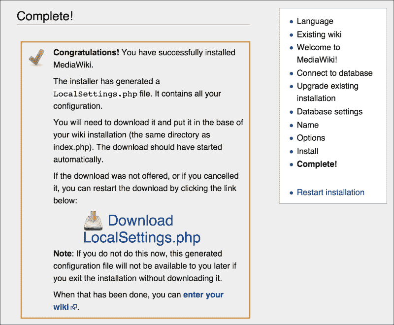

    截图显示了配置文件 **LocalSettings.php** 已完成。

1.  一旦下载了 `LocalSettings.php` 文件，它需要被移动到 MediaWiki 安装目录的根目录。

    ### 注意

    如果用于配置的浏览器在另一台计算机上，则需要将 `LocalSettings.php` 文件复制到 Raspberry Pi 上。

    ```
    golden-macbook:~ user$ scp ~/Downloads/LocalSettings.php pi@192.168.2.13:.
    pi@192.168.2.13's password: 
    LocalSettings.php                             100% 4689     4.6KB/s   00:00    

    golden-macbook:~ user$ ssh pi@192.168.2.13
    pi@192.168.2.13's password: 
    Linux raspberrypi 3.18.11-v7+ #781 SMP PREEMPT Tue Apr 21 18:07:59 BST 2015 armv7l
    Last login: Wed Aug 12 19:29:52 2015 from golden-macbook.local

    pi@raspberrypi ~ $ sudo mv LocalSettings.php /var/lib/mediawiki/

    pi@raspberrypi ~ $ sudo chmod a+r /var/lib/mediawiki/LocalSettings.php
    ```

    在上面的例子中，`LocalSettings.php` 文件是从另一台计算机（`golden-macbook`）复制到 Raspberry Pi 上的 MediaWiki 目录（`/var/lib/mediawiki/`）的，并且修改了文件权限（`chmod a+r`），以便 MediaWiki 可以读取该设置文件。

1.  一旦 `LocalSettings.php` 文件被移动到 MediaWiki 安装的根目录，MediaWiki 就可以开始使用了！

1.  浏览到 Raspberry Pi 上的 MediaWiki URL：（`http://192.168.2.2/mediawiki/`）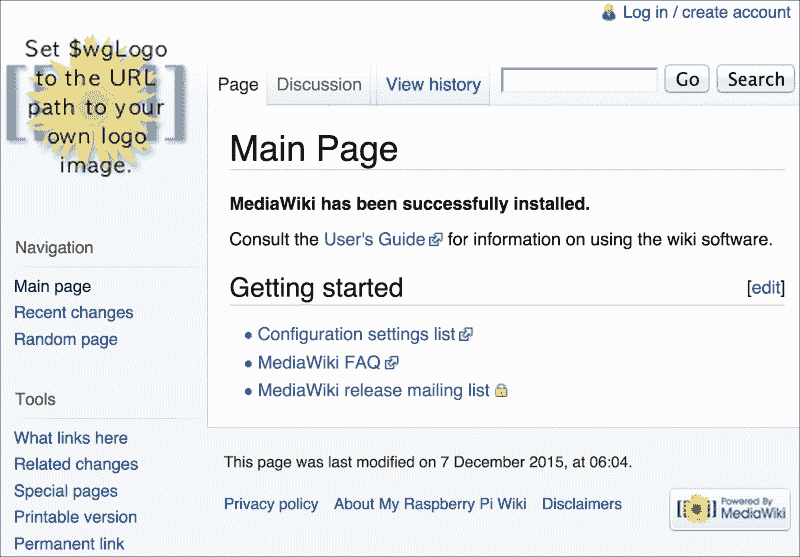

1.  MediaWiki 已设置并运行；但是，它仍然需要根据您的团队进行定制（通过添加自定义团队徽标、字体和样式）。请按照 `用户指南` 链接获取有关自定义安装的更多信息，以及如何使用 MediaWiki 的详细说明。

## 它是如何工作的...

在本教程的开始，MediaWiki 软件包（`mediawiki`）是通过 `apt-get install` 命令下载并安装的。MediaWiki 的安装包括 Apache2、MySQL 和 PHP5 的安装。这些包也可以单独安装，用于提供 Web 服务器（Apache2）、数据库（MySQL）或 Web 脚本语言（PHP5）。

MediaWiki 的安装首先安装 Apache2、MySQL 和 PHP5。Apache2 安装和 PHP5 安装都不需要用户输入即可顺利完成。然而，MySQL 安装需要为数据库的 `root` 用户设置密码。

MySQL 管理员 `root` 密码用于设置和配置 MySQL 数据库管理服务器。它与用户 `pi` 使用的密码不同。如果用户 pi 和数据库的密码不同，将提升 Raspberry Pi 的安全性。

在输入 MySQL `root` 密码后，安装过程继续。MySQL 数据库被安装，MediaWiki 应用程序文件被安装，Apache2 Web 服务器被安装并启动。然而，Apache2 Web 服务器尚未配置为托管 MediaWiki。

使用 `vi` 编辑器编辑 `apache.conf` 配置文件并为 MediaWiki 分配一个网站。配置文件位于 MediaWiki 配置目录 `/etc/mediawiki/`，并且也链接到 web 服务器配置目录 `/etc/apache2/conf.d/`。

需要在 Apache2 配置文件中更改的唯一一行是以 `#Alias` 开头的那一行。行首的 `#` 将该行变成注释。Apache web 服务器在读取配置文件时会忽略注释行。删除行首的 `#` 将激活 MediaWiki，下次启动 web 服务器时会生效。

Alias 语句有两个参数：网站的 URL 前缀 `(/mediawiki)` 和网站应用程序文件的位置 `(/var/lib/mediawiki)`。URL 前缀成为维基的 URL 一部分（`http://192.168.2.13/mediawiki/`）。更改 URL 前缀也会改变访问维基所使用的 URL。将前缀更改为 `/TeamWiki` 会将维基的 URL 改为 `http://192.168.2.2/TeamWiki/`。

在编辑完 web 服务器配置文件并取消注释 Alias 行后，使用 `apachectl restart` 命令重启 Apache web 服务器。此特权命令用于重启 Apache web 服务器。

重启 web 服务器会强制它重新加载配置文件，包括 MediaWiki 的 web 服务器配置文件。现在 MediaWiki 的别名已经取消注释，MediaWiki 网站已可用；然而，维基的数据库仍需设置。

一旦 MediaWiki 网站运行，可以使用 web 浏览器（可能是在另一台计算机上）来完成维基的数据库设置。示例 URL 为 `http://192.168.2.13/mediawiki/`。你的 Raspberry Pi 的 IP 地址很可能不同。

MediaWiki 显示的第一页面提示找不到 `LocalSettings.php` 文件。标有 **setup the wiki** 的链接指向用于完成维基设置的网页。

第一设置页面用于定义维基管理员使用的语言（**Your language**）和其他维基用户使用的语言（**Wiki language**）。

下一页的设置页面显示了系统配置检查的结果，并且必须接受一个许可证才能完成 MediaWiki 的安装。

接下来，在下一页面输入数据库设置。之前为 MySQL 管理员 `root` 用户输入的密码应在此处再次输入。

下一页显示了一些额外的数据库设置。接受默认设置即可。

最后有一个设置页面，要求输入维基名称以及 MediaWiki 管理员的用户名和密码。这个新密码仅用于配置维基，而不是 MySQL 管理员的 `root` 密码，也不是用户 `pi` 的密码。

页面底部有一个输入更多配置信息的机会。食谱中的示例选择了**我已经无聊了，直接安装 Wiki 吧。** 并点击**继续 ->** 完成数据库安装。

在显示状态页面后，设置的最后一页会触发`LocalSettings.php`文件的下载，该文件用于完成 Wiki 的安装。如果该文件是在另一台计算机上下载的，可以使用`scp`命令将文件复制到树莓派，具体示例如下。

`LocalSettings.php` 文件是输入到 MediaWiki 安装页面的配置参数的总结。此文件需要移动到 MediaWiki 安装目录（`/var/lib/mediawiki/`）以完成 Wiki 的设置。

在将`LocalSettings.php`文件移动到 MediaWiki 安装目录后，设置完成，MediaWiki 的**主页**现已显示在配置的 URL（`http://192.168.2.13/mediawiki/`）上。Wiki 已启动并运行！

点击**[编辑]**链接以更改**主页**的内容。

仍可以进行一些定制化以个性化 Wiki（例如，改变 Wiki 的 Logo）；不过，基本的设置已完成，Wiki 现在可以用于协作。

更多关于使用和定制 MediaWiki 的信息，可以通过点击 Wiki**主页**上的**用户指南**链接来找到。

## 另见

+   **MediaWiki** ([`en.wikipedia.org/wiki/Mediawiki`](http://en.wikipedia.org/wiki/Mediawiki)): 这篇维基百科文章介绍了 MediaWiki wiki 服务器。

+   **apachectl – Apache HTTP 服务器控制接口** ([`manpages.debian.net/cgi-bin/man.cgi?query=apachectl`](http://manpages.debian.net/cgi-bin/man.cgi?query=apachectl)): Debian 的`apachectl`手册页提供了有关该命令及其选项的更多信息。

+   **scp – 安全复制（远程文件复制程序）** ([`manpages.debian.net/cgi-bin/man.cgi?query=scp`](http://manpages.debian.net/cgi-bin/man.cgi?query=scp)): Debian 的`scp`手册页提供了有关该命令及其选项的更多详细信息。

+   **mv – 移动（重命名）文件** ([`manpages.debian.net/cgi-bin/man.cgi?query=mv`](http://manpages.debian.net/cgi-bin/man.cgi?query=mv)): Debian 的`mv`手册页提供了有关该命令及其选项的更多详细信息。

+   **chmod – 更改文件模式位** ([`manpages.debian.net/cgi-bin/man.cgi?query=chmod`](http://manpages.debian.net/cgi-bin/man.cgi?query=chmod)): Debian 的`chmod`手册页提供了有关该命令及其选项的更多详细信息。

# 使用 hostapd 创建无线接入点

这个食谱将树莓派设置为无线接入点——作为一个可以让其他无线设备连接到本地网络的集线器——或者连接到树莓派上运行的服务。

默认情况下，Raspbian Linux 发行版支持通过无线 USB 适配器将 Raspberry Pi 连接到现有无线网络。本食谱超出了将 Raspberry Pi 作为网络客户端使用的范围，改为将 Raspberry Pi 配置为其他无线设备的网络中心。如果 Raspberry Pi 还通过 TCP 电缆连接到本地网络，则 Raspberry Pi 将充当无线网络路由器，使其他设备能够通过 Raspberry Pi 连接到本地网络。

### 注意

并非所有无线 USB 适配器都支持接入点（AP）模式。

本食谱将测试无线适配器以确保其支持 AP 模式。

完成本食谱后，您将能够创建一个无线网络，使 Raspberry Pi 充当网络中心。

## 准备工作

配料：

这是一个初步设置或基本网络配置的食谱，要求 Raspberry Pi 已经开机，并且您已经以 `pi` 用户身份登录（有关如何启动和登录，请参考 第一章，*安装与设置* 中的食谱；有关如何远程登录，请参考 第二章，*管理* 中的食谱）。

+   一个支持的无线 USB 适配器。

本食谱不需要桌面 GUI，可以从文本控制台运行，或在 `LXTerminal` 内运行。

如果 Raspberry Pi 的 Secure Shell 服务器正在运行，并且 Raspberry Pi 已通过有线网络连接到本地网络，则可以使用 Secure Shell 客户端远程完成此食谱。

在此食谱过程中，无线连接将被重置，因此不建议在设置期间通过无线连接远程登录。

## 如何操作...

配置 Raspberry Pi 作为无线接入点的步骤如下：

1.  直接或远程登录 Raspberry Pi。

1.  使用 `apt-get install` 命令安装软件包 `hostapd`、`udhcpd` 和 `iw`。

    ```
    pi@raspberrypi ~ $ sudo apt-get install -y hostapd udhcpd iw
    Reading package lists... Done
    Building dependency tree       
    Reading state information... Done

    The following extra packages will be installed:
      crda wireless-regdb
    The following NEW packages will be installed:
      crda hostapd iw udhcpd wireless-regdb
    0 upgraded, 5 newly installed, 0 to remove and 0 not upgraded.
    Need to get 0 B/509 kB of archives.
    After this operation, 1,188 kB of additional disk space will be used.
    Selecting previously unselected package wireless-regdb.
    (Reading database ... 88434 files and directories currently installed.)
    Unpacking wireless-regdb (from .../wireless-regdb_2014.10.07-1~deb7u1_all.deb) ...
    Selecting previously unselected package crda.
    Unpacking crda (from .../crda_1.1.2-1_armhf.deb) ...
    Selecting previously unselected package hostapd.
    Unpacking hostapd (from .../hostapd_1%3a1.0-3+deb7u2_armhf.deb) ...
    Selecting previously unselected package iw.
    Unpacking iw (from .../archives/iw_3.4-1_armhf.deb) ...
    Selecting previously unselected package udhcpd.
    Unpacking udhcpd (from .../udhcpd_1%3a1.20.0-7_armhf.deb) ...
    Processing triggers for man-db ...
    Setting up wireless-regdb (2014.10.07-1~deb7u1) ...
    Setting up crda (1.1.2-1) ...
    Setting up hostapd (1:1.0-3+deb7u2) ...
    Setting up iw (3.4-1) ...
    Setting up udhcpd (1:1.20.0-7) ...
    udhcpd: Disabled. Edit /etc/default/udhcpd to enable it.

    pi@raspberrypi ~ $ 
    ```

1.  `apt-get install` 命令将下载并安装软件包 `hostapd`、`udhcpd` 和 `iw`。

1.  检查无线 USB 适配器。

    ### 注意

    使用以下命令检查您的无线 USB 适配器是否支持 AP 模式：

    `sudo iw list | grep '* AP'`

    如果没有返回任何行，则表示无线适配器不支持 AP 模式。

1.  使用 `iw list` 命令（通过 `grep` 过滤）查看无线适配器是否支持接入点（AP）模式。

    ```
    pi@raspberrypi ~ $ sudo iw list | grep '^[[:blank:]]*\* A'
    		 * AP
    		 * AP/VLAN
    		 * AP/VLAN
    		 * AP: 0x00 0x10 0x20 0x30 0x40 0x50 0x60 0x70 0x80 0x90 0xa0 0xb0 
    		 * AP/VLAN: 0x00 0x10 0x20 0x30 0x40 0x50 0x60 0x70 0x80 0x90 0xa0 
    		 * AP: 0x00 0x20 0x40 0xa0 0xb0 0xc0 0xd0
    		 * AP/VLAN: 0x00 0x20 0x40 0xa0 0xb0 0xc0 0xd0
    pi@raspberrypi ~ $ 
    ```

1.  显示名称服务器地址。

1.  使用 `cat` 命令显示存储在 `/etc/resolve.conf` 中的名称服务器地址。

    ```
    pi@raspberrypi ~ $ cat /etc/resolv.conf
    # Generated by resolvconf
    nameserver 192.168.2.1

    pi@raspberrypi ~ $ 
    ```

    Raspberry Pi 使用的 DNS `nameserver` 是 **192.168.2.1**。

1.  配置 `udhcpd` 服务器。

1.  使用 `vi` 编辑器编辑 `udhcpd` 配置文件 `/etc/udhcpd.conf`。

    ```
    pi@raspberrypi ~ $ sudo vi /etc/udhcpd.conf
    ```

1.  `vi` 编辑器显示配置文件的内容。有关如何使用编辑器的说明，可以在 `vi` 手册页中找到（请参见 第二章，*管理* 中的食谱 *阅读内建文档*）。

    ```
    # Sample udhcpd configuration file (/etc/udhcpd.conf)

    # The start and end of the IP lease block

    start           192.168.0.20    #default: 192.168.0.20
    end             192.168.0.254   #default: 192.168.0.254

    # The interface that udhcpd will use

    interface       eth0            #default: eth0

    "/etc/udhcpd.conf" 123 lines, 3054 characters
    ```

1.  通过将以 `interface` 开头的行更改为 `interface wlan0` 来更改 `udhcpd` 使用的网络接口。

    ```
    # The interface that udhcpd will use

    interface       wlan0
    ```

1.  通过更改以 `#Examples` 开头的部分来修改 `udhcpd` 的示例配置，替换示例 DNS 地址为你的 Raspberry Pi 使用的 `nameserver` 地址（`192.168.2.1`，来自第 5 步）。

    ```
    #Examples
    opt     dns     192.168.2.1
    option  subnet  255.255.255.0
    opt     router  192.168.0.1
    option  domain  local
    option  lease   864000
    ```

1.  保存文件并退出编辑器（`:wq`）。

1.  启用 udhcpd 服务器。

    ```
    pi@raspberrypi ~ $ sudo vi /etc/default/udhcpd
    ```

1.  使用 `vi` 编辑器编辑 `udhcpd` 配置文件，`/etc/default/udhcpd`。

1.  `vi` 编辑器显示配置文件的内容。

    ```
    # Comment the following line to enable
    DHCPD_ENABLED="no"

    # Options to pass to busybox' udhcpd.
    #
    # -S    Log to syslog
    # -f    run in foreground

    DHCPD_OPTS="-S"
    ~                                                                                                                       
    ~                                                                                                                       
    "/etc/default/udhcpd" 9 lines, 164 characters
    ```

1.  通过注释掉行 `DHCP_ENABLED="no"` 来启用 udhcpd 服务器。要注释掉该行，请在行首添加 `#`。

    ```
    # Comment the following line to enable
    #DHCPD_ENABLED="no"
    ```

1.  保存文件并退出编辑器（`:wq`）。

1.  配置 hostapd 服务器。使用 `vi` 编辑器创建新的 `hostapd` 配置文件（`/etc/hostapd/hostapd.conf`）。

    ```
    pi@raspberrypi ~ $ sudo vi /etc/hostapd/hostapd.conf
    ```

1.  `vi` 编辑器显示空的配置文件。

1.  将以下参数添加到 hostapd 配置文件中：

    ```
    interface=wlan0
    ssid=Raspi_AP
    wpa_passphrase=Pr0t3ct3d
    driver=nl80211
    hw_mode=g
    channel=6
    macaddr_acl=0
    auth_algs=1
    ignore_broadcast_ssid=0
    wpa=2
    wpa_key_mgmt=WPA-PSK
    wpa_pairwise=TKIP
    rsn_pairwise=CCMP
    ```

1.  保存文件并退出编辑器（`:wq`）。

1.  启用 hostapd 服务器。使用 `vi` 编辑器编辑服务默认文件（`/etc/default/hostapd`）来启用 `hostapd` 服务。

    ```
    pi@raspberrypi ~ $ sudo vi /etc/default/hostapd
    ```

1.  `vi` 编辑器显示配置文件的内容。

    ```
    # Defaults for hostapd initscript
    #
    # See /usr/share/doc/hostapd/README.Debian for information about alternative
    # methods of managing hostapd.
    #
    # Uncomment and set DAEMON_CONF to the absolute path of a hostapd configuration
    # file and hostapd will be started during system boot. An example configuration
    # file can be found at /usr/share/doc/hostapd/examples/hostapd.conf.gz
    #
    #DAEMON_CONF=""

    # Additional daemon options to be appended to hostapd command:-
    #       -d   show more debug messages (-dd for even more)
    #       -K   include key data in debug messages
    #       -t   include timestamps in some debug messages
    #
    # Note that -B (daemon mode) and -P (pidfile) options are automatically
    # configured by the init.d script and must not be added to DAEMON_OPTS.
    #
    #DAEMON_OPTS=""
    ~                                                                                                                       
    "/etc/default/hostapd" 20 lines, 770 characters
    ```

1.  将以 `#DAEMON_CONF` 开头的行替换为 `DAEMON_CONF="/etc/hostapd/hostapd.conf"`。

    ```
    DAEMON_CONF="/etc/hostapd/hostapd.conf"
    ```

1.  保存文件并退出编辑器（`:wq`）。

1.  配置 IP 转发。使用 `vi` 编辑器编辑内核参数文件 `/etc/sysctl.conf` 来启用 IP 转发。

    ```
    pi@raspberrypi ~ $ sudo vi /etc/sysctl.conf
    ```

1.  `vi` 编辑器显示配置文件的内容。

    ```
    #
    # /etc/sysctl.conf - Configuration file for setting system variables
    # See /etc/sysctl.d/ for additonal system variables
    # See sysctl.conf (5) for information.
    #

    "/etc/sysctl.conf" 64 lines, 2137 characters
    ```

1.  `vi` 编辑器打开内核参数文件（`/etc/sysctl.conf`）。

1.  通过删除行首的 `#` 来取消注释以 `net.ipv4.ip_forward` 开头的行。

    ```
    # Uncomment the next line to enable packet forwarding for IPv4
    net.ipv4.ip_forward=1
    ```

1.  保存文件并退出编辑器（`:wq`）。

1.  启用 IP 转发。通过使用 `echo` 命令将内核参数 `/proc/sys/net/ipv4/ip_forward` 设置为值 `"1"` 来启用转发。

    ```
    pi@raspberrypi ~ $ sudo bash -c 'echo "1" > /proc/sys/net/ipv4/ip_forward'
    pi@raspberrypi ~ $
    ```

1.  使用 `iptables` 命令为网络地址转换和端口转发设置 IP 转发规则。

    ```
    pi@raspberrypi ~ $ sudo iptables -t nat -A POSTROUTING –o eth0 –j MASQUERADE

    pi@raspberrypi ~ $ sudo iptables -A FORWARD –i eth0 –o wlan0 -m state --state RELATED,ESTABLISHED –j ACCEPT

    pi@raspberrypi ~ $ sudo iptables -A FORWARD –i wlan0 –o eth0 –j ACCEPT
    ```

1.  保存 iptables 配置（`iptables-save`），并将输出文件（`iptables.ipv4.net`）移动到 `/etc` 配置目录中，以便在系统启动时使用。

    ```
    pi@raspberrypi ~ $ sudo iptables-save > iptables.ipv4.nat
    pi@raspberrypi ~ $ sudo mv iptables.ipv4.nat /etc

    pi@raspberrypi ~ $ sudo chown root:root /etc/iptables.ipv4.nat 

    pi@raspberrypi ~ $ ls -l /etc/iptables.ipv4.nat 
    -rw-r--r-- 1 root root 566 Aug 13 19:30 /etc/iptables.ipv4.nat

    pi@raspberrypi ~ $ 
    ```

1.  给无线接口分配静态 IP 地址。使用 `ifconfig` 命令给无线网络接口（`wlan0`）分配静态 IP 地址（`192.169.0.1`）。

    ```
    pi@raspberrypi ~ $ sudo ifconfig wlan0 192.168.0.1

    pi@raspberrypi ~ $ 
    ```

1.  配置网络接口启动参数。使用 vi 编辑器编辑网络接口配置文件（`/etc/network/interfaces`）。

    ```
    pi@raspberrypi ~ $ sudo vi /etc/network/interfaces
    ```

1.  `vi` 编辑器打开网络接口配置文件（`/etc/network/interfaces`）。

1.  更改文件，使其仅包含以下内容`:`。

    ```
    auto lo
    iface lo inet loopback

    auto eth0
    allow-hotplug eth0
    iface eth0 inet manual

    auto wlan0
    iface wlan0 inet static
        address 192.68.0.1
        netmask 255.255.255.0

    up iptables-restore < /etc/iptables.ipv4.nat
    ```

1.  保存文件并退出编辑器（`:wq`）。

1.  启用无线接入点。使用 `update-rc.d` 命令启用 `hostapd` 和 `udhcpd` 服务。

    ```
    pi@raspberrypi ~ $ sudo update-rc.d hostapd enable
    update-rc.d: using dependency based boot sequencing

    pi@raspberrypi ~ $ sudo update-rc.d udhcpd enable
    update-rc.d: using dependency based boot sequencing

    pi@raspberrypi ~ $ 
    ```

1.  Raspberry Pi 已配置为在系统启动时启动 `hostapd` 和 `udhcpd` 服务。

1.  禁用 wpa_supplicant。使用`mv`命令将 WPA Supplicant 的服务定义文件（`fi.epitest.hostap.WPASupplicant.service`）从服务目录（`/usr/share/dbus-1/system-services`）中移动出去。

    ```
    pi@raspberrypi ~ $ mv /usr/share/dbus-1/system-services/ fi.epitest.hostap.WPASupplicant.service ~/

    pi@raspberrypi ~ $ 
    ```

1.  重启：重启系统，树莓派就变成了无线接入点！查找`Raspi_AP`网络 SSID 并使用在 hostapd 配置文件（`/etc/hostapd/hostapd.conf`）中定义的密码（`Pr0t3ct3d`）进行连接。

## 它是如何工作的……

配方从下载并安装无线接口工具包（`iw`）开始，并安装两个服务器：无线接入点服务器（`hostapd`）和 DHCP 服务器（`udhcpd`）。

在配置开始之前，需要测试无线 USB 适配器的兼容性。

### 检查无线 USB 适配器

并非所有无线 USB 适配器都支持接入点（AP）模式。可以使用`iw list`命令列出任何连接的无线设备的无线功能。如果支持 AP 模式，它将在`Supported interface modes`部分中列出。

`iw list`命令的输出非常长。`grep`命令用于过滤`iw list`命令的输出。管道符号（`|`）将`iw list`命令的输出连接到`grep`命令的输入。`grep`命令使用正则表达式过滤器限制其他命令的输出（**'^[[:blank:]]*\* A'** – 从行首**^**开始，任意数量的空白字符**[[:blank:]]***，然后是星号**\***，接着是空格和大写字母**A**）。

如果无线适配器与`hostapd`不兼容，`iw list`命令将显示信息"`nl80211 not found.`" 适配器仍然有可能与`hostapd`一起工作；不过，这需要使用另一种驱动程序重新编译`hostapd`（请参见本章末尾的参考资料）。

一旦无线适配器被测试并显示支持 AP 模式，接下来的配置将继续进行。

### 使用 udhcpd 配置 DHCP 服务器

动态主机配置协议（DHCP）服务器（udhcpd）为客户端计算机分配网络配置信息；例如 DNS 名称服务器的地址、IP 地址和默认路由（或网关）。完成此配方后，树莓派将使用 DCHP 配置其无线客户端。

对 DHCP 配置文件`(/etc/udhcpd.conf)`进行三项更改：

+   选择无线接口（**wlan0**）

+   剩余的标志被设置为支持嵌入式设备（例如树莓派）

+   为无线客户端定义默认的网络参数

默认网络参数为：

**dns** – 要使用的 DNS 名称服务器。系统的 DNS 名称服务器定义在**/etc/resolv.conf**中，并将在第 5 步中显示。

+   **子网**– 同一网络子网中的 IP 地址数量。值**255.255.255.0**是一个网络掩码，它使得具有相同前三个字节的 IP 地址的计算机能够相互通信。

+   **router** – 树莓派无线接口的静态 IP 地址（**192.168.0.1**）

+   **domain** – 网络名称（**local**）

+   `lease` – 网络地址分配给特定计算机的时长（**864000** 秒或 10 天）

配置文件顶部的 **start** 和 **end** 参数默认设置为 IP 地址范围从 **192.168.0.20** 到 **192.168.0.254**。

如果树莓派始终连接到一个有网络时间服务器的有线网络，则无需设置剩余时间标志。

配置完成后，udhcpd 的启动脚本参数文件 `(/etc/default/udhcpd)` 也需要进行更改。需要将参数 **DHCP_ENABLED="no"** 注释掉（通过在行首添加 `#`），以启用 DHCP 服务器（`udhcpd`）。

### 使用 hostapd 配置无线接入点服务器

无线接入点服务器（`hostapd`）管理其他无线设备与树莓派之间的无线连接。这包括使用加密协议（如 Wi-Fi Protected Access，WPA）建立安全连接；设置服务集标识符（SSID）和预共享密钥（PSK）。

创建的 **hostapd** 配置参数文件包括：

+   **interface** – 无线接口（**wlan0**）

+   **ssid** – 网络 ID（**Raspi_AP**）

+   **wpa_passphrase** – 密码短语或预共享密钥（`Pr0t3ct3d`）

+   **driver** – 无线设备驱动程序（**nl80211**）

+   **hw_mode** – 硬件模式（**g**）

+   **channel** – 无线频率频道（**6**）

+   **macaddr_acl** – 访问控制列表（**0**）

+   **auth_algs** – 要使用的授权算法（**1** – 开放认证）

+   **ignore_broadcast_ssid** – 启用广播网络 ID（**0** – 不忽略广播）

+   **wpa** – WPA 的版本（**2**）

+   **wpa_key_mgmt** – 管理算法的密钥（**WPA-PSK**）

+   **wpa_pairwise** – WPA v1 数据加密（**TKIP**）

+   **rsn_pairwise** – WPA v2 数据加密（**CCMP**）

配置完成 **hostapd** 后，其启动脚本参数文件（`/etc/default/hostapd`）也需要更改。需要将参数 **DAEMON_CONF** 设置为 `hostapd` 配置文件的位置 `(/etc/hostapd/hostapd.conf)`，以便启用无线接入点服务器。

### 设置 IP 转发

IP 转发用于在网络接口之间传递（转发）网络流量。在本食谱中，IP 转发用于在无线网络和有线网络之间传递网络流量。通过使用 IP 转发，树莓派将无线网络的客户端连接到有线网络。

第一步配置是启用树莓派 Linux 内核中的 IP 转发功能。内核参数文件 `(/etc/sysctl.conf)` 中有一项 IP 转发条目（**net.ipv4.ip_forward=1**），默认是被注释掉的。通过去掉行首的 **#** 来取消注释，从而启用 Linux 内核中的 IP 转发功能。

启用 IP 转发后，`iptables` 命令用于定义网络过滤规则，决定哪些网络数据包可以穿过 Linux 内核的内部防火墙。Linux 内核的防火墙将规则组织成表，定义数据包如何通过内核。`iptables` 命令用于管理存储在这些表中的规则。

此步骤中定义的第一个 Linux 内核防火墙规则被添加到网络地址转换表（**-t nat**）的后处理规则中（**-A POSTROUTING**）。该规则在网络数据包（**MASQUERADE**）传递到有线网络（**-o eth0**）时进行伪装。无线网络客户端的 IP 地址在传递到有线网络时被转换为树莓派的有线网络连接的 IP 地址。这是如何将来自多个无线网络客户端的网络数据包转换，使它们能够通过树莓派的单个有线网络连接。

第二条规则被添加到过滤表（默认表）的包转发规则中 (**-A FORWARD**)。该规则允许网络数据包（**-j ACCEPT**）从有线网络（**-i eth0**）转发到无线网络（**-o wlan0**），前提是它们与已建立的连接（**-m state –state RELATED,ESTABLISHED**）相关。

此步骤中最后一条 `iptables` 命令规则被添加到过滤表的转发规则中（**-A FORWARD**）。该规则允许数据包从无线网络（**-i wlan0**）传递到有线网络（**-o eth0**）。

下一条命令 `ifconfig wlan0` 将树莓派无线网络连接的 IP 地址设置为 **192.168.0.1**。

最后，`iptables-save` 命令用于将这些规则的副本保存在配置文件 `(/etc/iptables.ipv4.nat)` 中，以便在启动时使用。

完成此步骤后，IP 转发规则已定义并保存在配置文件中。IP 转发规则也已启用。

### 配置启动参数

启动时使用的网络接口定义存储在配置文件 `(/etc/network/interfaces)` 中。该文件定义了每个网络接口的网络地址、网络掩码和默认路由。

本教程中使用的配置文件定义了三个网络接口：

+   **lo** – 回环网络

+   **eth0**– 有线网络

+   **wlan0** – 无线网络

+   回环接口（**lo**）会自动加载（**auto**）。

+   有线接口（**eth0**）使用 DHCP 协议动态配置。

无线接口（**wlan0**）有一个静态定义（**static**）——它位于此文件中。无线接口的 IP **地址** 被定义为 **192.168.0.1**。接口的网络掩码（**255.255.255.0**）足够大，可以支持同一子网中的 256 个唯一地址。

在网络接口启动（**up**）后，之前保存在此配方中的 IP 转发定义 `(/etc/iptables.ipv4.nat)` 将被恢复（**iptables-restore**）（使用**iptables-save**保存）。

一旦网络接口定义被保存，网络就可以启动了。

### **启动无线接入点**

配置文件已更新：

+   无线接入点 `(/etc/hostapd/hostapd.conf)`

+   动态主机配置协议 `(/etc/udhcpd.conf)`

+   网络接口 `(/etc/network/interfaces)`

+   IP 转发定义 `(/etc/iptables.ipv4.nat)`

无线接入点守护进程（**hostapd**）和动态主机配置协议守护进程（`udhcp`）的启动脚本可以启用（`update-rc.d enable`）。

树莓派现在每次启动时都会变成无线接入点！

树莓派重启后，无线接入点已准备好使用！无线设备现在可以使用您选择的 SSID（`Raspi_AP`）和密码（`Pr0t3ct3d`）连接到树莓派。

## 还有更多……

### 并非所有 USB 无线适配器都支持 AP 模式

有限数量的无线 USB 适配器可以与树莓派配合使用，并且可以配置为无线接入点。本章末尾的链接可以帮助您找到目前可以与树莓派一起使用的无线 USB 适配器，以创建无线接入点（请参见*其他资源*）。

一些无线 USB 适配器的功耗超过了树莓派能持续支持的范围。通过 USB 集线器间接连接无线 USB 适配器到树莓派将带来更好的性能，并减少其他 USB 设备（如板载网卡！）因电力不足而无法正常工作的可能性。

### 无线防火墙、文件服务器或网页服务器

这个配方与本书中的其他配方结合使用时效果很好。

与第四章中的文件共享配方，*文件共享*，结合使用时，树莓派可以成为有线和无线设备都能连接到本地网络的文件服务器——用于交换文档和媒体文件；或用于备份和存储。

当与本章中的其他高级网络配方结合使用时，树莓派可以成为一个网络防火墙，保护无线访问到有线网络；一个可以远程访问桌面设备的教学或支持工具；一个提供网页的通信工具；或一个托管 wiki 页面的协作工具。

在树莓派和开源 GNU Linux 社区中，有许多其他工具和应用程序可以与此配方结合使用，将树莓派转变为无线设备的动态网络中心。

## 另请参阅

+   **hostapd** ([`en.wikipedia.org/wiki/Hostapd`](http://en.wikipedia.org/wiki/Hostapd))：这篇关于 hostapd 的维基百科文章更详细地描述了该服务。

+   **hostapd: IEEE 802.11 AP, IEEE 802.1X/WPA/WPA2/EAP/RADIUS 身份验证器** ([`w1.fi/hostapd/`](http://w1.fi/hostapd/)): `hostapd` 网站是服务器的完整参考。

+   **Debian Linux 内核手册** ([`kernel-handbook.alioth.debian.org/`](http://kernel-handbook.alioth.debian.org/)): Debian Linux 内核手册提供了有关 iptables 工作原理的更多信息。

+   **Linux 无线** ([`linuxwireless.org/`](http://linuxwireless.org/)): Linux 无线网站有更多关于在 Linux 上使用无线设备的信息。

+   **RPI 无线热点** ([`elinux.org/RPI-Wireless-Hotspot`](http://elinux.org/RPI-Wireless-Hotspot)): 这是一篇关于在嵌入式 Linux 网站上设置无线热点的文章。

+   **USB Wi-Fi 适配器** ([`elinux.org/RPi_VerifiedPeripherals#USB_Wi-Fi_Adapters`](http://elinux.org/RPi_VerifiedPeripherals#USB_Wi-Fi_Adapters)): 这是一篇关于嵌入式 Linux Wiki 中 Wi-Fi 适配器的文章。

+   **树莓派 Wi-Fi 适配器测试** ([`www.element14.com/community/docs/DOC-44703/l/raspberry-pi-wifi-adapter-testing`](http://www.element14.com/community/docs/DOC-44703/l/raspberry-pi-wifi-adapter-testing)): 这是一篇关于在 Element14 社区网站上测试过的无线适配器的文章。

# 安装网络跟踪工具

本食谱安装网络跟踪工具 My Traceroute（`mtr`）。

`mtr`工具通常用于网络故障排除。该工具显示树莓派和另一台计算机之间的网络数据包路由。显示会持续刷新，显示数据包在每个设备之间传输的时间。使用`mrt`时，你可以看到网络路由中哪些设备最慢。

完成本食谱后，你将能够使用`mrt`跟踪网络数据包。

## 准备就绪

材料：

树莓派的初始设置或基础网络设置已完成，树莓派已经开机。你也已经以`pi`用户登录（参见第一章，*安装与设置*，了解如何启动和登录，以及第二章，*管理*，了解如何远程登录）。

本食谱不需要桌面 GUI，可以通过基于文本的控制台或`LXTerminal`中运行。

如果树莓派的安全外壳服务器正在运行，本食谱可以通过安全外壳客户端远程完成。

## 如何操作...

安装网络跟踪工具的步骤如下：

1.  登录到树莓派，可以是直接登录或远程登录。

1.  使用`apt-get install`命令来安装`mtr`软件包。

    ```
    pi@raspberrypi ~ $ sudo apt-get install mtr
    Reading package lists... Done
    Building dependency tree       
    Reading state information... Done
    The following NEW packages will be installed:
      mtr
    0 upgraded, 1 newly installed, 0 to remove and 0 not upgraded.
    Need to get 59.2 kB of archives.
    After this operation, 142 kB of additional disk space will be used.
    Get:1 http://mirrordirector.raspbian.org/raspbian/ wheezy/main mtr armhf 0.82-3 [59.2 kB]
    Fetched 59.2 kB in 0s (66.3 kB/s)
    Selecting previously unselected package mtr.
    (Reading database ... 88583 files and directories currently installed.)
    Unpacking mtr (from .../archives/mtr_0.82-3_armhf.deb) ...
    Processing triggers for menu ...
    Processing triggers for man-db ...
    Setting up mtr (0.82-3) ...
    Processing triggers for menu ...

    pi@raspberrypi ~ $ 
    ```

1.  `apt-get install`命令安装`mrt`软件包。

1.  使用`mrt`命令来跟踪你的树莓派与树莓派基金会网站之间的网络路由。

    ```
    pi@raspberrypi ~ $ sudo mtr raspberrypi.org
    ```

1.  `mrt`命令显示路由。

    ```
                                 My traceroute  [v0.82]
    raspberrypi (0.0.0.0)                                  Sat Aug 29 16:44:37 2015
    Keys:  Help   Display mode   Restart statistics   Order of fields   quit
                                           Packets               Pings
     Host                                Loss%   Snt   Last   Avg  Best  Wrst StDev
     1\. 192.168.2.1                       0.0%    29    2.6   0.9   0.5   3.1   0.8
     2\. 10.0.0.1                          3.4%    29    3.8   4.2   2.7   6.8   1.1
     3\. c-24-5-176-1.hsd1.ca.comcast.net  0.0%    29   20.0  18.3  13.1  49.7   6.9
     4\. te-0-6-0-14-sur03.sanmateo.ca.sf  0.0%    29   16.1  18.0  12.5  26.9   4.2
     5\. he-0-13-0-0-ar01.santaclara.ca.s  0.0%    29   32.5  21.4  12.6  36.9   6.3
        he-0-13-0-1-ar01.santaclara.ca.sfba.comcast.net
     6\. ???
     7\. he-0-11-0-1-pe02.529bryant.ca.ib  0.0%    28   12.7  23.0  12.7  97.3  15.5
     8\. 50.248.118.238                    0.0%    28   22.6  20.8  14.8  44.7   5.4
     9\. be2016.ccr22.sfo01.atlas.cogentc  0.0%    28   23.7  21.6  13.7  29.0   3.2
    10\. be2133.ccr22.mci01.atlas.cogentc  0.0%    28   59.7  64.6  57.5 120.8  11.7
    11\. be2157.ccr42.ord01.atlas.cogentc  0.0%    28   69.2  72.7  64.3 126.5  11.8
    12\. be2185.ccr22.cle04.atlas.cogentc  0.0%    28   75.2  78.4  71.1 108.7   8.8
    13\. be2483.ccr42.jfk02.atlas.cogentc  0.0%    28   90.6  90.8  82.7 106.7   4.5
    14\. be2490.ccr42.lon13.atlas.cogentc  0.0%    28  155.8 159.9 153.5 171.7   4.0
    15\. be2494.ccr22.lon01.atlas.cogentc  0.0%    28  160.9 161.8 157.4 178.6   4.6
    16\. be2352.rcr21.b015534-1.lon01.atl  0.0%    28  176.2 163.5 156.9 222.6  12.6
    17\. 149.11.4.86                       0.0%    28  163.9 161.9 153.9 188.4   6.6
    18\. mythic10g-private.orochi.mythic-  0.0%    28  157.6 160.4 155.9 169.7   3.4
    19\. 93.93.128.230                     0.0%    28  172.9 182.7 172.9 252.8  14.9
    ```

显示将持续刷新，直到你按下**q**。

## 它是如何工作的...

登录到 Raspberry Pi 后，本食谱安装 My Traceroute 软件包（`mtr`）。

然后，使用新安装的 `mtr` 命令来追踪位于美国加利福尼亚州圣马特奥的作者 Raspberry Pi 与托管在英国伦敦 Mythic-Beasts 网站上的 Raspberry Pi 基金会网站之间的网络路由。

按下 *q* 键可以退出命令。

## 还有更多内容...

`mtr` 动态更新从远程计算机到 Raspberry Pi 之间路径上设备收集的网络统计信息。除了显示路径上的设备列表（**主机**），`mtr` 还显示 **数据包** 和 **Ping** 的统计信息。

**数据包** 的统计信息显示了发送的数据包数量（**已发送**）和途中丢失的数据包数量（**丢失%**）。

**Ping** 的统计信息显示了网络数据包从 Raspberry Pi 到路径上每个设备所需的时间。还显示了平均时间（**Avg**）、最佳时间（**Best**）、最差时间（**Wrst**）和标准偏差（**StDev**）。

## 另见

+   **MTR (My traceroute)** ([`en.wikipedia.org/wiki/MTR_(software)`](https://en.wikipedia.org/wiki/MTR_(software))): 这篇维基百科文章提供了关于 `mtr`、其历史以及工作原理的更多信息。

+   **MTR** ([`www.bitwizard.nl/mtr/`](https://www.bitwizard.nl/mtr/)): MTR – My Traceroute 的主页。

+   **mtr – 网络诊断工具** ([`manpages.debian.net/cgi-bin/man.cgi?query=mtr`](http://manpages.debian.net/cgi-bin/man.cgi?query=mtr)): Debian 的 `mtr` 手册页描述了该命令及其选项。

+   **Mythic Beasts – 基础设施** ([`www.mythic-beasts.com/article/infrastructure`](https://www.mythic-beasts.com/article/infrastructure)): 该网页描述了 Raspberry Pi 基金会使用的托管基础设施，包括其数据中心的位置。

# 安装网络协议分析工具

本食谱安装网络协议分析器 Wireshark。

Wireshark 网络协议分析器让你在微观层面上检查网络上的流量。这个网络工具可以用于实时捕获或离线分析。Wireshark 拥有图形用户界面（GUI）和 TTY 模式工具（`tshark`）。

可以从以太网、IEEE 802.11（Wi-Fi）、PPP/HDLC、ATM、蓝牙、USB、令牌环、帧中继、FDDI 等低级协议中读取实时数据。支持对包括 IPsec、ISAKMP、Kerberos、SNMPv3、SSL/TLS、WEP 和 WPA/WPA2 在内的多种高级协议进行解密。数据可以以多种形式读取/写入，包括 tcpdump、Microsoft 网络监控器、Network General Sniffer、Sniffer Pro、NetXray 等。

完成本食谱后，你将能够使用 `wireshark` 分析你的网络。

### 注意

本食谱仅是探索网络协议分析的起点。

更多详细信息的链接可以在本食谱的末尾找到。

## 准备工作

配料：

一个已开启的 Raspberry Pi 的初始设置或基本网络设置。你已经以用户 `pi` 登录。

本教程需要桌面 GUI。

如果 Raspberry Pi 的 VNC 服务器正在运行，则可以使用 VNC 客户端远程完成本教程（参见本章前面的 *远程访问显示器* 教程）。

## 如何操作...

安装网络协议分析仪的步骤如下：

1.  登录到 Raspberry Pi 桌面 GUI。

1.  使用 `apt-get install` 命令安装 `wireshark` 包。

    ```
    pi@raspberrypi ~ $ sudo apt-get install -y wireshark
    Reading package lists... Done
    Building dependency tree       
    Reading state information... Done
    The following extra packages will be installed:
      libc-ares2 libcap2-bin liblua5.1-0 libpam-cap libpcap0.8 libsmi2ldbl libwireshark-data
      libwireshark2 libwiretap2 libwsutil2 wireshark-common
    Suggested packages:
      libcap-dev snmp-mibs-downloader wireshark-doc
    The following NEW packages will be installed:
      libc-ares2 libcap2-bin liblua5.1-0 libpam-cap libpcap0.8 libsmi2ldbl libwireshark-data
      libwireshark2 libwiretap2 libwsutil2 wireshark wireshark-common
    0 upgraded, 12 newly installed, 0 to remove and 0 not upgraded.
    Need to get 14.0 MB of archives.
    After this operation, 48.6 MB of additional disk space will be used.

    ...
    ```

1.  `apt-get install` 命令用于下载并安装 `wireshark` 软件包。

1.  使用 `dpkg-reconfigure` 命令修改 `wireshark` 的默认配置。

    ```
    pi@raspberrypi ~ $ sudo dpkg-reconfigure wireshark-common

    The dpkg-reconfigure command asks if non-superusers should be able to capture packets. 

     ┌─────────────────────┤ Configuring wireshark-common ├──────────────────────┐
     │                                                                           │ 
     │ Dumpcap can be installed in a way that allows members of the "wireshark"  │ 
     │ system group to capture packets. This is recommended over the             │ 
     │ alternative of running Wireshark/Tshark directly as root, because less    │ 
     │ of the code will run with elevated privileges.                            │ 
     │                                                                           │ 
     │ For more detailed information please see                                  │ 
     │ /usr/share/doc/wireshark-common/README.Debian.                            │ 
     │                                                                           │ 
     │ Enabling this feature may be a security risk, so it is disabled by        │ 
     │ default. If in doubt, it is suggested to leave it disabled.               │ 
     │                                                                           │ 
     │ Should non-superusers be able to capture packets?                         │ 
     │                                                                           │ 
     │                    <Yes>                       <No>                       │ 
     │                                                                           │ 
     └───────────────────────────────────────────────────────────────────────────┘ 
    ```

1.  使用 **<tab>** 键选择 **<是>** 答案，然后按 **<enter>** 键以更新软件包配置。

1.  使用 `usermod` 命令将用户 `pi` 添加到 `wireshark` 系统组（`-G wireshark`）。

    ```
    pi@raspberrypi ~ $ sudo usermod -a -G wireshark pi

    pi@raspberrypi ~ $ 
    ```

1.  使用桌面 GUI 菜单启动 Wireshark 应用程序。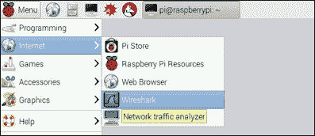

1.  启动 Wireshark 应用程序。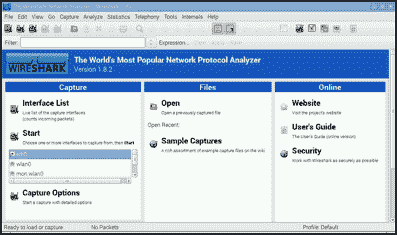

1.  从菜单中选择一个接口并点击 **开始** 以开始嗅探网络数据包。

1.  Wireshark 应用程序会在捕获（嗅探）每个网络数据包时，显示详细信息。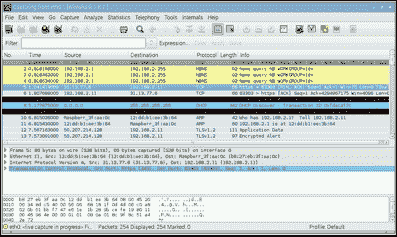

1.  使用 **文件** 菜单或 *Ctrl*+*Q* 来退出。

## 它是如何工作的...

登录到 Raspberry Pi 后，本教程使用 `apt-get install` 命令安装 Wireshark 网络协议分析仪（网络数据包嗅探器）。

安装 Wireshark 应用程序后，使用 `dpkg-reconfigure` 命令更改默认应用程序配置（**wireshark-common**），允许非超级用户捕获网络数据包。默认情况下，只有超级用户才能捕获网络数据包。

在接受配置更改（**<是>**）后，**wireshark** 系统组的成员也可以捕获网络数据包。

在启动应用程序之前，用户 **pi** 通过 **usermod** 命令被添加（`-a`）到 **wireshark** 用户组。

通过选择 **菜单 > 网络 > Wireshark** 从 Raspberry Pi 桌面启动 Wireshark 命令。

启动应用程序后，Wireshark 应用程序的主页面会显示。

在主页面上，可以选择哪些网络接口将被嗅探（监控进出网络数据包）。点击 **开始** 命令后，Wireshark 开始捕获并显示网络数据包。

可以通过从菜单栏选择 **文件 > 退出** 或按 **Control-Q** 来退出 Wireshark 应用程序。

## 还有更多内容...

Wireshark 应用程序是一个免费的开源网络协议分析仪，广泛用于网络故障排除、分析和教育。

### 混杂模式

Wireshark 将选定的网络接口(s) 设置为混杂模式。在混杂模式下，接口会监听所有网络数据包，包括那些并非发送给 Raspberry Pi 的数据包。Wireshark 能够看到网络接口上的所有网络流量。

### 基于终端的用户界面

Wireshark 还有一个命令行工具 `tshark`，它将嗅探到的数据包直接输出到控制台。`tshark` 命令是与 Wireshark 分开安装的。

```
pi@raspberrypi ~ $ sudo apt-get install -y tshark
Reading package lists... Done
Building dependency tree       
Reading state information... Done
The following NEW packages will be installed:
  tshark
0 upgraded, 1 newly installed, 0 to remove and 0 not upgraded.
Need to get 173 kB of archives.
After this operation, 314 kB of additional disk space will be used.
Get:1 http://mirrordirector.raspbian.org/raspbian/ wheezy/main tshark armhf 1.8.2-5wheezy16 [173 kB]
Fetched 173 kB in 1s (149 kB/s)
Selecting previously unselected package tshark.
(Reading database ... 88953 files and directories currently installed.)
Unpacking tshark (from .../tshark_1.8.2-5wheezy16_armhf.deb) ...
Processing triggers for man-db ...
Setting up tshark (1.8.2-5wheezy16) ...

pi@raspberrypi ~ $ 
```

当在命令行中输入时，如果不带选项，tshark 会开始捕获它能够嗅探到的数据包，并且默认使用网络接口 (eth0)。

```
pi@raspberrypi ~ $ tshark
Capturing on eth0
7.169256 93.93.130.39 -> 192.168.2.11 TCP 74 http > 47593 [SYN, ACK] Seq=0 Ack=1 Win=14480 Len=0 MSS=1460 SACK_PERM=1 TSval=3829221233 TSecr=2254282 WS=128
  7.169418 192.168.2.11 -> 93.93.130.39 TCP 66 47593 > http [ACK] Seq=1 Ack=1 Win=29312 Len=0 TSval=2254310 TSecr=3829221233
  7.170328 192.168.2.11 -> 93.93.130.39 HTTP 399 GET / HTTP/1.1 
  7.332273 93.93.130.39 -> 192.168.2.11 TCP 66 http > 47593 [ACK] Seq=1 Ack=334 Win=15616 Len=0 TSval=3829221302 TSecr=2254310
  7.333431 93.93.130.39 -> 192.168.2.11 HTTP 324 HTTP/1.0 302 Found  (text/html)
  7.333558 192.168.2.11 -> 93.93.130.39 TCP 66 47593 > http [ACK] Seq=334 Ack=259 Win=30336 Len=0 TSval=2254326 TSecr=3829221302
  7.339590 192.168.2.11 -> 93.93.130.39 TCP 66 47593 > http [FIN, ACK] Seq=334 Ack=259 Win=30336 Len=0 TSval=2254327 TSecr=3829221302
  7.342519 192.168.2.11 -> 192.168.2.1  DNS 64 Standard query 0x32c4  A wpad
  7.343102  192.168.2.1 -> 192.168.2.11 DNS 139 Standard query response 0x32c4 No such name
  7.344034 192.168.2.11 -> 192.168.2.1  DNS 79 Standard query 0x5959  A www.raspberrypi.org
  7.371312  192.168.2.1 -> 192.168.2.11 DNS 160 Standard query response 0x5959  CNAME lb.raspberrypi.org A 93.93.128.211 A 93.93.128.230 A 93.93.130.39 A 93.93.130.214
```

上述 `tshark` 示例输出显示了在浏览网站 [`www.raspberrypi.org`](https://www.raspberrypi.org) 时捕获的一些网络数据包。

### 捕获过滤器

并非所有通过 Raspberry Pi 网络接口传输的网络数据包都是有趣的。Wireshark 和 `tshark` 都可以使用捕获过滤器来限制捕获和显示的数据包数量。

在此示例中，捕获过滤器将显示内容限制为 SSL 流量。

```
pi@raspberrypi ~ $ tshark -R 'ssl'
Capturing on eth0
  1.080068 192.168.2.11 -> 216.58.209.227 TLSv1.2 135 Encrypted Alert
  1.081229 192.168.2.11 -> 74.125.224.145 TLSv1.2 135 Encrypted Alert
  1.082105 192.168.2.11 -> 74.125.224.145 TLSv1.2 135 Encrypted Alert
  1.082913 192.168.2.11 -> 216.58.192.35 TLSv1.2 135 Encrypted Alert
  1.083782 192.168.2.11 -> 74.125.20.95 TLSv1.2 135 Encrypted Alert
  1.084541 192.168.2.11 -> 74.125.224.9 TLSv1.2 135 Encrypted Alert
  1.085294 192.168.2.11 -> 74.125.20.95 TLSv1.2 135 Encrypted Alert
  1.239064 192.168.2.11 -> 173.194.202.105 SSL 206 Client Hello
  1.345864 173.194.202.105 -> 192.168.2.11 SSL 1484 [TCP Previous segment not captured] Continuation Data
  1.345865 173.194.202.105 -> 192.168.2.11 SSL 405 Continuation Data

...
```

以下示例捕获来自无线网络 (wlan0) 的数据，并将显示限制为 HTTP 流量。

```
pi@raspberrypi ~ $ tshark -i wlan0 -R http
Capturing on wlan0
  7.721824 192.168.0.75 -> 199.27.79.133 HTTP 452 GET / HTTP/1.1 
  7.818987 199.27.79.133 -> 192.168.0.75 HTTP 781 [TCP Previous segment not captured] Continuation or non-HTTP traffic
  7.831542 192.168.0.75 -> 199.27.79.133 HTTP 511 GET /css/main.css HTTP/1.1 
```

更多关于捕获过滤器使用的示例，以及有关 Wireshark 和 `tshark` 使用的更多细节，可以在以下参考资料中找到。

## 另见

**Wireshark** ([`www.wireshark.org`](https://www.wireshark.org))：Wireshark 应用的主页上有关于如何有效使用 Wireshark 的详细文档。

**Wireshark** ([`en.wikipedia.org/wiki/Wireshark`](https://en.wikipedia.org/wiki/Wireshark))：这篇维基百科文章有关于 Wireshark 的更多信息，包括它的历史和工作原理。

+   **wireshark - 交互式转储和分析网络流量** ([`manpages.debian.net/cgi-bin/man.cgi?query=wireshark`](http://manpages.debian.net/cgi-bin/man.cgi?query=wireshark))：Debian 手册页描述了 wireshark 命令、其配置和选项。

+   **tshark - 转储和分析网络流量** ([`manpages.debian.net/cgi-bin/man.cgi?query=tshark`](http://manpages.debian.net/cgi-bin/man.cgi?query=tshark))：Debian 手册页描述了 `tshark` 命令、其配置和选项。

**wireshark-filter - Wireshark 过滤器语法和参考** ([`manpages.debian.org/cgi-bin/man.cgi?query=wireshark-filter`](http://manpages.debian.org/cgi-bin/man.cgi?query=wireshark-filter))：这篇 Debian 手册页详细描述了 Wireshark 的捕获过滤器。

+   **CaptureFilters** ([`wiki.wireshark.org/CaptureFilters`](https://wiki.wireshark.org/CaptureFilters))：这个网站有许多有用的捕获过滤器示例。

**Wireshark 介绍** ([`www.wireshark.org/video/wireshark/introduction-to-wireshark/`](https://www.wireshark.org/video/wireshark/introduction-to-wireshark/))：这段视频是一个很好的 Wireshark 数据包嗅探入门。

# 启用 IPv6 网络协议

本教程配置您的树莓派以支持 IPv6。

互联网协议的第六版 IPv6 旨在取代当前的 IPv4 协议。IPv6 提供比 IPv4 多 8x10²⁸ 个 IP 地址。它也是一个更稳定、更高效和更安全的协议。

大多数现代家用网络路由器都支持 IPv4 和 IPv6；然而，并非所有仍在使用的旧路由器都支持 IPv6。因此，树莓派默认情况下不启用 IPv6，这样可以节省一些内存和处理能力。要充分利用现代网络服务，您可以在树莓派上启用 IPv6。

完成本教程后，您的树莓派将启用 IPv6。

## 准备工作

配料：

一个已启动的树莓派的初步设置或基本网络设置。您还需要以用户`pi`登录（有关如何启动和登录的详细信息，请参见第一章，*安装与设置*，以及第二章，*管理*中关于如何远程登录的教程）。

本教程不需要桌面图形界面，可以在基于文本的控制台或`LXTerminal`中运行。

如果树莓派的安全外壳（SSH）服务器正在运行，可以通过安全外壳客户端远程完成本教程。

## 如何操作...

安装网状网络的步骤如下：

1.  直接或远程登录树莓派。

1.  使用`modprobe`命令启用`ipv6`协议。

    ```
    pi@raspberrypi ~ $ sudo modprobe ipv6
    ```

1.  使用`ifconfig`命令验证所有网络接口是否已启用 IPv6（查找`inet6 addr`）。

    ```
    pi@raspberrypi ~ $ ifconfig
    eth0      Link encap:Ethernet  HWaddr b8:27:eb:3f:aa:0c  
              inet addr:192.168.2.11  Bcast:192.168.2.255  Mask:255.255.255.0
              inet6 addr: fe80::ba27:ebff:fe3f:aa0c/64 Scope:Link
              UP BROADCAST RUNNING MULTICAST  MTU:1500  Metric:1
              RX packets:978305 errors:0 dropped:0 overruns:0 frame:0
              TX packets:1786420 errors:0 dropped:0 overruns:0 carrier:0
              collisions:0 txqueuelen:1000 
              RX bytes:100780981 (96.1 MiB)  TX bytes:2430911170 (2.2 GiB)

    lo        Link encap:Local Loopback  
              inet addr:127.0.0.1  Mask:255.0.0.0
              inet6 addr: ::1/128 Scope:Host
              UP LOOPBACK RUNNING  MTU:65536  Metric:1
              RX packets:45 errors:0 dropped:0 overruns:0 frame:0
              TX packets:45 errors:0 dropped:0 overruns:0 carrier:0
              collisions:0 txqueuelen:0 
              RX bytes:3420 (3.3 KiB)  TX bytes:3420 (3.3 KiB)

    wlan0     Link encap:Ethernet  HWaddr 00:0f:55:bb:aa:b5  
              inet addr:192.168.0.1  Bcast:192.168.0.255  Mask:255.255.255.0
              inet6 addr: fe80::20f:55ff:febb:aab5/64 Scope:Link
              UP BROADCAST RUNNING MULTICAST  MTU:1500  Metric:1
              RX packets:1628703 errors:0 dropped:50 overruns:0 frame:0
              TX packets:803167 errors:0 dropped:0 overruns:0 carrier:0
              collisions:0 txqueuelen:1000 
              RX bytes:2395688238 (2.2 GiB)  TX bytes:94274367 (89.9 MiB)

    pi@raspberrypi ~ $ 
    ```

1.  树莓派现在正在使用 IPv6！然而，`ipv6`模块不会在下次启动时自动加载。请使用以下步骤将该模块配置为自动加载。

1.  将`ipv6`模块添加到内核模块配置文件`/etc/modules`的末尾。

    ```
    pi@raspberrypi ~ $ sudo sh -c 'echo ipv6 >>/etc/modules'
    ```

1.  使用`vi`命令编辑内核模块配置文件`/etc/modprobe.d/ipv6.conf`。

    ```
    pi@raspberrypi ~ $ sudo vi /etc/modprobe.d/ipv6.conf
    ```

1.  `vi`编辑器显示配置文件的内容。使用该编辑器的说明可以在`vi`的手册页中找到（请参阅第二章，*管理*中的教程*阅读内建文档*）。

    ```
    # Don't load ipv6 by default
    alias net-pf-10 off
    #alias ipv6 off
    ~                                                                               
    ~                                                                               
    "/etc/modprobe.d/ipv6.conf" 3 lines, 65 characters
    ```

1.  将**alias net-pf-10**行末的**off**改为**on**，并删除**alias ipv6**行，因为它已经不再适用了。

    ```
    # ipv6 is loaded by default
    alias net-pf-10 ipv6
    ~                                                                               
    ~                                                                               
    "/etc/modprobe.d/ipv6.conf" 3 lines, 59 characters
    ```

1.  保存文件并退出编辑器（`:wq`）。

1.  最后，重启树莓派以使用新的 IPv6 配置！

    ```
    pi@raspberrypi ~ $ sudo reboot

    Broadcast message from root@raspberrypi (pts/0) (Sun Aug 30 13:01:44 2015):
    The system is going down for reboot NOW!
    pi@raspberrypi ~ $ Connection to 192.168.2.13 closed by remote host.
    Connection to 192.168.2.13 closed.
    ```

## 它是如何工作的...

登录到树莓派后，本教程使用`modprobe`命令加载`ipv6`模块。简单地加载该模块即可启用 IPv6 网络；然而，`ipv6`模块不会在下次重启时自动加载。需要更新内核的模块配置以启用开机自动加载。

该配方使用在子 shell 中运行的 `echo` 命令（`sh –c`）将模块名 `ipv6` 附加（`>>`）到 `/etc/modules` 配置文件的底部。将模块名添加到模块配置中可确保该模块在启动时加载。

该配方还使用 `vi` 命令更新 `/etc/modprobe/ipv6.conf` 文件，显式启用（**on**）完整的 IPv6 网络协议族（`net-pf-10`）。

配置更新后，Raspberry Pi 会重启。

## 还有更多...

互联网协议版本 6 不仅具有更大的地址空间，还有更多的功能。

### 隐私扩展

IPv6 有两个有趣的隐私扩展：一个是在每次重启时创建一个新的随机地址，另一个则是持续地随机化地址。

要启用每次启动时生成一个临时随机 IPv6 地址，请将 `net.ipv6.conf.iface.use_tempadd` Linux 内核参数添加到 `/etc/sysctl.conf` 内核配置文件的底部。

要启用随机 IP 地址的持续刷新，请将内核参数 `net.ipv6.conf.iface.temp_prefered_lft` 添加到同一文件的底部。

以下示例使用 `echo` 命令将两个内核配置参数附加（`>>`）到内核配置文件 `/etc/sysctl.conf` 的底部。IPv6 内核参数（`net.ipv6.conf`）用于生成临时地址（`use_tempadd`），并启用（**2**）每两小时刷新一次地址（`temp_prefered_lft`）（**7200** 秒）的参数，适用于所有接口。首先，使用 `sudo sh` 命令创建一个具有超级用户权限的子 shell。内核参数添加完成后，退出（**exit**）子 shell 并丢弃超级用户权限。

```
pi@raspberrypi ~ $ sudo sh

# echo "net.ipv6.conf.all.use_tempaddr = 2" >> /etc/sysctl.conf

# echo "net.ipv6.conf.default.use_tempaddr = 2" >> /etc/sysctl.conf

# echo "net.ipv6.conf.all.temp_prefered_lft = 7200" >> /etc/sysctl.conf

# echo "net.ipv6.conf.default.temp_prefered_lft = 7200" >> /etc/sysctl.conf

# exit

pi@raspberrypi ~ $
```

重启 Raspberry Pi 后，变更将会生效。

### 使用 sysctl 在运行时更改内核参数

以下示例使用 `systctl` 命令专门为接口 `eth0` 配置扩展功能。但 `/etc/sysctl.conf` 仍需要更新，以确保启动时自动使用这些配置。

```
pi@raspberrypi ~ $ sudo sh

# sysctl -a --pattern 'net.ipv6.conf.eth0.use_tempaddr'
net.ipv6.conf.eth0.use_tempaddr = 0

# sysctl net.ipv6.conf.eth0.use_tempaddr=2                      
net.ipv6.conf.eth0.use_tempaddr = 2

# sysctl -a --pattern 'net.ipv6.conf.eth0.temp_prefered_lft'
net.ipv6.conf.eth0.temp_prefered_lft = 86400

# sysctl net.ipv6.conf.eth0.temp_prefered_lft=7200
net.ipv6.conf.eth0.temp_prefered_lft = 7200

# exit

pi@raspberrypi ~ $
```

## 另请参见

+   **IPv6** ([`en.wikipedia.org/wiki/IPv6`](https://en.wikipedia.org/wiki/IPv6))：这篇维基百科文章提供了更多关于互联网协议版本 6 的信息。

+   **sysctl.conf – 配置内核参数的运行时文件** ([`manpages.debian.net/cgi-bin/man.cgi?query=sysctl`](http://manpages.debian.net/cgi-bin/man.cgi?query=sysctl))：Debian 的 `sysctl` 手册页面提供了有限的命令信息。

+   **sysctl.conf – sysctl 预加载/配置文件** ([`manpages.debian.net/cgi-bin/man.cgi?query=sysctl.conf`](http://manpages.debian.net/cgi-bin/man.cgi?query=sysctl.conf))：Debian 的 `sysctl.conf` 手册页面提供了有限的文件格式信息。
