# 第六章：物联网（IoT）——物联网

在本章中，我们将介绍：

+   轻松访问硬件

+   安装 GrovePi

+   从网页控制设备

+   连接到物联网平台

+   创建物联网网关

# 介绍

本章中的食谱展示了如何将连接到树莓派的设备和传感器——物品——连接到**物联网**（**IoT**）。

（**物联网**）描述了当互联网被用于使物理物体——物品——交换数据时的状态。当树莓派连接到互联网时，它可以参与物联网，通过其**通用输入/输出**（**GPIO**）和其他硬件接口交换实时数据。本章包含了一些食谱，展示了树莓派如何参与物联网。

本章中的食谱特定于树莓派。它们利用树莓派的硬件接口——GPIO 引脚。虽然这些概念可以应用于其他 Linux 计算机，但这些指令特定于树莓派。

完成本章的食谱后，您将能够配置和控制直接连接到树莓派的设备和传感器，或通过 GrovePi 硬件系统连接的设备。您还将能够通过树莓派上托管的网页和物联网服务提供商 SmartLiving.io 与 ThingBox.io 控制连接到树莓派的设备。

# 轻松访问硬件

这个食谱演示了如何轻松从树莓派访问硬件。

在这个食谱中，使用简单的 Bash 命令（`ls`、`cat`和`echo`）使连接到树莓派 GPIO 引脚的 LED 闪烁。

完成这个食谱后，您将能够通过 Bash 命令行控制连接到树莓派的 GPIO 端口。

## 准备就绪

配料：

+   未开机的树莓派的初始设置或基础网络设置

+   一个 LED

+   一个推钮开关

+   三个 330 欧姆电阻器

+   一块面包板

+   一些面包板连接线

这个食谱不需要桌面 GUI，可以从基于文本的控制台运行，或者从`LXTerminal`中运行。

如果树莓派的安全外壳服务器正在运行，可以使用安全外壳客户端远程完成这个食谱。

## 如何操作...

从命令行轻松访问硬件的步骤如下：

1.  在打开树莓派电源之前，请使用以下两个图示将推按钮开关连接到 GPIO 端口 23（引脚 16），并将 LED 连接到 GPIO 端口 24（引脚 18）。

    以下图示显示了本食谱的组件布局：

    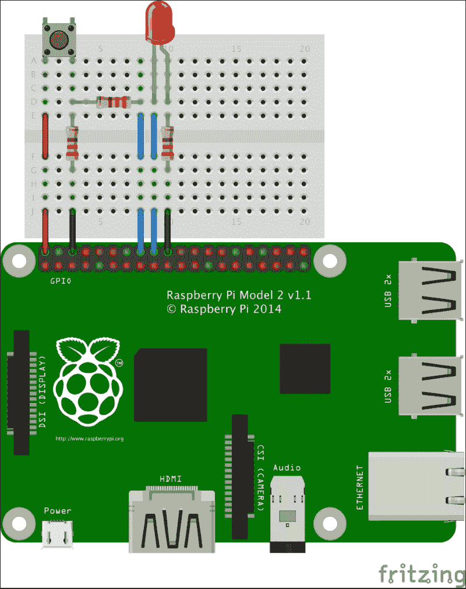

1.  推钮开关应连接到引脚 2（5V）的一侧。推按钮开关的另一侧应连接两个 330 欧姆的电阻器——一个电阻器连接到引脚 6（GND），另一个电阻器连接到引脚 16（GPIO 23）。

1.  LED 应连接到引脚 18（GPIO 端口 24）的一侧。LED 的另一侧应连接一个 330 欧姆的电阻器，电阻器另一端连接到引脚 20（GND）。

    ### 注意

    如果第一次尝试失败，重新旋转 LED。

    LED 是一种发光二极管。二极管只允许电流单向流动。反向二极管是常见的电子电路故障。

1.  在验证按钮开关、LED 和两个 330 欧姆电阻连接正确后，启动树莓派。

    以下图示显示了树莓派 GPIO 接口的针脚布局：

    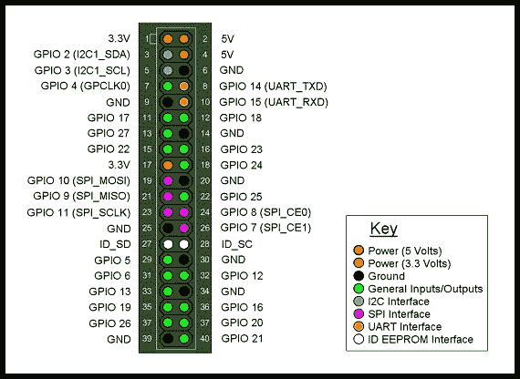

1.  直接或远程登录到树莓派。

1.  使用`cd`命令导航到树莓派内核参数的`/sys/class/gpio`目录。

    ```
    pi@raspberrypi ~ $ 
    cd /sys/class/gpio

    pi@raspberrypi ~ $

    ```

1.  使用`ls`命令列出包含 GPIO 参数和接口的内核参数目录的内容。

    ```
    pi@raspberrypi /sys/class/gpio $ 
    ls
    export  gpiochip0  unexport

    pi@raspberrypi /sys/class/gpio $ 

    ```

1.  使用`echo`命令告诉树莓派内核将 GPIO 端口`23`和`24`的接口`export`到用户空间。

    ```
    pi@raspberrypi /sys/class/gpio $ 
    echo 23 >export

    pi@raspberrypi /sys/class/gpio $ 
    echo 24 >export

    pi@raspberrypi /sys/class/gpio $ 

    ```

1.  使用`ls`命令再次显示内核参数和接口目录`/sys/class/gpio`的内容。

    ```
    pi@raspberrypi /sys/class/gpio $ 
    ls
    export  gpio23  gpio24  gpiochip0  unexport

    pi@raspberrypi /sys/class/gpio $ 

    ```

1.  注意两个新的用户空间可访问的内核接口：GPIO 端口 23（`gpio23`）和 GPIO 端口 24（`gpio24`）。

1.  使用`echo`命令将 GPIO 端口 23（`gpio23`）配置为接收输入信号（`in`），将 GPIO 端口 24（`gpio24`）配置为发送输出信号（`out`）。

    ```
    pi@raspberrypi /sys/class/gpio $ 
    echo in >gpio23/direction

    pi@raspberrypi /sys/class/gpio $ 
    echo out >gpio24/direction

    pi@raspberrypi /sys/class/gpio $ 

    ```

1.  使用`cat`命令查看当按钮开关未按下（`0`）和按下（`1`）时的当前状态。

    ```
    pi@raspberrypi /sys/class/gpio $ 
    cat gpio23/value

    0

    pi@raspberrypi /sys/class/gpio $ # WHILE PRESSING THE BUTTON...

    pi@raspberrypi /sys/class/gpio $ 
    cat gpio23/value

    1

    pi@raspberrypi /sys/class/gpio $ 

    ```

1.  按钮开关工作正常！

1.  使用`echo`命令打开 LED（`1`），然后关闭 LED（`0`）。

    ```
    pi@raspberrypi /sys/class/gpio $ 
    echo 1 >gpio24/value

    pi@raspberrypi /sys/class/gpio $ 
    echo 0 >gpio24/value

    pi@raspberrypi /sys/class/gpio $ 

    ```

1.  LED 工作正常！

1.  使用以下`while`循环控制 LED 与按钮开关配合使用。使用*Ctrl-C*（`^C`）停止`while`循环。

    ```
    pi@raspberrypi /sys/class/gpio $ 
    in=gpio23/value

    pi@raspberrypi /sys/class/gpio $ 
    out=gpio24/value

    pi@raspberrypi /sys/class/gpio $ 
    while true; do echo $(cat $in) >$out; done

    ^C

    pi@raspberrypi /sys/class/gpio $ 

    ```

1.  按钮开关控制 LED！

1.  使用`echo`命令将 GPIO 端口`23`和`24`从用户空间`unexport`，并使用`ls`命令查看树莓派内核已移除`gpio23`和`gpio24`接口。

    ```
    pi@raspberrypi /sys/class/gpio $ 
    ls
    export  gpio23  gpio24  gpiochip0  unexport

    pi@raspberrypi /sys/class/gpio $ 
    echo 23 >unexport

    pi@raspberrypi /sys/class/gpio $ 
    echo 24 >unexport

    pi@raspberrypi /sys/class/gpio $ 
    ls
    export  gpiochip0  unexport

    ```

## 它是如何工作的...

本教程使用一个连接的输入设备（按钮开关）来激活一个输出设备（LED）。步骤首先是将输入和输出设备连接到树莓派。一旦设备连接好，将对每个设备进行单独测试。最后，通过一个 Bash 脚本，每当输入设备发出信号时，激活输出设备。

在树莓派通电之前，两个设备，一个按钮开关和一个**LED**，已连接到树莓派。

### 将按钮开关连接到 GPIO 端口 23。

按钮开关作为输入设备。一端通过第 2 针连接到+5v，另一端通过第 16 针连接到 GPIO 端口 23。当按钮开关被按下时，GPIO 端口 23（第 16 针）会检测到来自+5v（第 2 针）通过闭合的按钮开关传来的高电平信号。

除了按钮开关外，还需要两个 330 欧姆电阻来安全完成电路的这一部分。一个 330 欧姆电阻用于在按钮开关按下（闭合）且信号高时限制电流流动。另一个 330 欧姆电阻用于在按钮开关未按下（打开）时将信号拉低到低电平。

电流限制电阻将按钮开关连接到 GPIO 端口 23（引脚 16）。下拉电阻将 GPIO 端口 23（引脚 16）连接到 GND（引脚 6）。

当按钮开关打开时，GPIO 端口 23（引脚 16）通过连接到 GND（引脚 6）的下拉电阻检测到低信号。当按钮开关闭合时，GPIO 端口 23（引脚 16）通过限流电阻从 +5v（引脚 2）检测到高信号。

### 将 LED 连接到 GPIO 端口 24

LED 充当输出设备。它一侧连接到 GPIO 端口 24（引脚 18）。另一侧，LED 通过一个限流 330 欧姆电阻连接到 GND（引脚 20）。

当 GPIO 端口 24（引脚 18）发出高信号时，电路中的足够电流通过以点亮 LED。信号低时，LED 保持未点亮。

### 开机并登录

一旦验证了 LED、按钮开关和三个保护用的 330 欧姆电阻正确连接，打开树莓派并登录。

### 使用 sysfs 导航 Linux 内核

登录后，该示例使用 `cd` 命令导航到 `sysfs` 虚拟文件系统中的 `/sys/class/gpio` 目录。`sysfs` 虚拟文件系统是 Linux 内核参数和接口的用户空间映射。GPIO 接口的内核参数可以从 `/sys/class/gpio` 访问。

使用 `ls` 命令查看当前从内核空间导出到用户空间的 GPIO 端口接口。到目前为止，尚未导出任何接口。

gpio 目录仅包含三个条目：两个伪参数 `export` 和 `unexport`；以及一个接口 `gpiochip0`。本示例未使用 `gpiochip0` 接口。这两个伪参数用于从内核空间到用户空间导出和取消导出 GPIO 端口接口。

### 导出 GPIO 端口 23 和 24

该示例使用 `echo` 命令将数字 23 和 24 写入 `export` 伪参数。这告诉树莓派的 Linux 内核将 GPIO 端口 23 和 24 的接口导出到用户空间（位于 `/sys/class/gpio`）。

导出 GPIO 端口 23 接口的命令行为 `echo 23 >export`，它有效是因为它将数字 23（echo 23）写入 Linux 内核的伪参数 `/sys/class/gpio/export`，告诉内核为 GPIO 端口 23 创建一个接口子目录（gpio23）。

在内核被告知导出两个 GPIO 端口后，再次使用 `ls` 命令显示 Linux 内核已为 GPIO 端口 23 `/sys/class/gpio/gpio23` 和 GPIO 端口 24 `/sys/class/gpio/gpio24` 创建了两个新的 GPIO 端口接口子目录。

### 配置每个接口的方向为输入或输出

然后，方案使用 `echo` 命令将 (**>**) `in`（用于输入）或 `out`（用于输出）写入每个 GPIO 端口接口子目录（gpio23 和 gpio24）中的 `direction` 参数。

输入设备（按钮开关）连接到 GPIO 端口 23，因此 GPIO 端口 23（gpio23）的方向参数设置为输入（`echo in > gpio23/direction`）。

输出设备（LED）连接到 GPIO 端口 24，因此 GPIO 端口 24（gpio24）的方向设置为输出（`echo out > gpio24/direction`）。

一旦每个 GPIO 端口的输入/输出方向被配置完毕，就可以测试每个端口的接口。

### 测试输入设备

使用 `cat` 命令测试输入设备，显示 GPIO 端口 23 的值（`gpio23/value`）。

当按钮开关释放时以及按下时，GPIO 端口 23（`gpio23/value`）的值会被显示。当按钮开关释放（开关断开）时，GPIO 端口 23（`gpio23/value`）的值为低（0）。当按钮开关被按下（闭合）时，值为高（1）。

### 测试输出设备

输出设备通过 `echo` 命令进行测试。

当高电平值发送到 GPIO 端口 24（`echo 1 >gpio24/value`）时，LED 会亮起。当发送低电平值（`echo 0 >gpio24/value`）时，LED 停止亮起。

### 使用输入设备激活输出设备

在成功测试输入设备（按钮开关）和输出设备（LED）后，该方案将两个设备通过一个简单的 `while` 循环连接起来。

首先，将 shell 变量 `in` 定义为 GPIO 端口 23（`gpio23/value`）值的别名，将变量 `out` 定义为 GPIO 端口 24（`gpio24/value`）值的别名。

然后，两个变量被用于一个无限循环（`while true; do`），该循环从 GPIO 端口 23 读取输入信号（`$(cat in)`），并使用 `echo` 命令将信号写入 GPIO 端口 24（`>$out`）。

当循环运行时，每当按钮开关被按下，LED 就会亮起。

按下 *Ctrl+C* 可停止循环。

### 清理

在运行循环后，`cat` 命令用于将 Linux 内核接口从用户空间导出到 GPIO 端口 23 (`/sys/class/gpio/gpio23`) 和 GPIO 端口 24 (`/sys/class/gpio/gpio24`)。

在 GPIO 端口接口被取消导出后，使用 `ls` 命令验证这两个 GPIO 端口接口（`gpio23` 和 `gpio24`）是否已从 `/sys/class/gpio` 用户空间目录中移除。

## 另见

+   **通用输入输出** ([`en.wikipedia.org/wiki/General-purpose_input/output`](https://en.wikipedia.org/wiki/General-purpose_input/output))：这篇维基百科文章描述了通用输入输出接口的工作原理。

+   **sysfs** ([`en.wikipedia.org/wiki/Sysfs`](https://en.wikipedia.org/wiki/Sysfs))：这篇维基百科文章描述了`sysfs`文件系统、它的历史以及工作原理。

+   **上拉电阻** ([`en.wikipedia.org/wiki/Pull-up_resistor`](https://en.wikipedia.org/wiki/Pull-up_resistor))：这篇维基百科文章描述了如何使用上拉电阻来确保电路具有有效的逻辑电平。

+   **二极管** ([`en.wikipedia.org/wiki/Diode`](https://en.wikipedia.org/wiki/Diode))：这篇维基百科文章详细解释了二极管。

+   **Bash 初学者指南** ([`tldp.org/LDP/Bash-Beginners-Guide/html/index.html`](http://tldp.org/LDP/Bash-Beginners-Guide/html/index.html))：这是一本实用的 Bash 和 Bash 脚本语言指南。

# 安装 GrovePi

本食谱配置了对树莓派的 Grove Pi 扩展板的访问。

Seeed 的 Grove 硬件系统是一种类似乐高的系统，可以将电子组件拼接在一起，无需焊接。

Dexter Industries 的 GrovePi 将树莓派转变为 Grove 组件的中央控制中心。

下图展示了 GrovePi+安装在树莓派 2 上的样子：

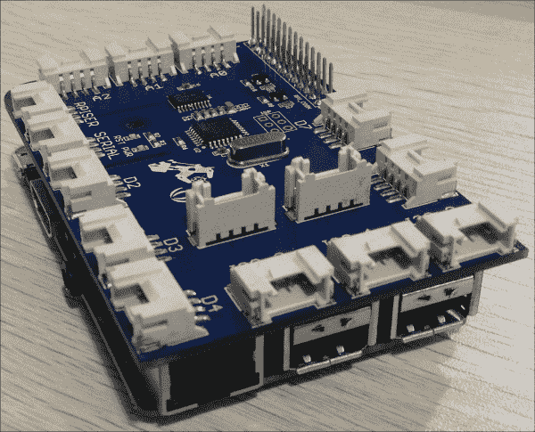

完成本食谱后，您将能够通过 Python 脚本语言从树莓派控制连接到 GrovePi 的 Grove 组件。

## 准备就绪

材料：

+   树莓派的初始设置或基础网络设置，树莓派已通电，但 GrovePi 尚未安装。你还需要以`pi`用户登录（参考第一章，*安装与设置*了解如何启动和登录，参考第二章，*管理*了解如何远程登录）。

+   一块 GrovePi GPIO 扩展板。

+   一颗 Grove LED。

+   一颗 Grove 按钮开关。

+   两根 Grove 连接线。

如果树莓派的安全外壳服务器正在运行，本食谱可以通过安全外壳客户端远程完成。

## 如何操作...

安装 GrovePi 的步骤如下：

1.  在将 GrovePi 连接到树莓派之前，使用`git`命令从`github.com`上的`DexterInd/GrovePi`仓库下载 GrovePi 安装文件。

    ```
    pi@raspberrypi ~ $ 
    git clone https://github.com/DexterInd/GrovePi

    Cloning into 'GrovePi'...
    remote: Counting objects: 2206, done.
    remote: Total 2206 (delta 0), reused 0 (delta 0), pack-reused 2206
    Receiving objects: 100% (2206/2206), 1.22 MiB | 1.37 MiB/s, done.
    Resolving deltas: 100% (1134/1134), done.

    pi@raspberrypi ~/ $ 

    ```

1.  使用`cd`命令切换到包含安装脚本的目录`GrovePi/Scripts`。

    ```
    pi@raspberrypi ~ $ 
    cd GrovePi/Script/

    pi@raspberrypi ~/GrovePi/Script $ 

    ```

1.  使用`sh`命令执行安装脚本。该命令需要超级用户权限（使用`sudo`）。

    ```
    pi@raspberrypi ~/GrovePi/Script $ sudo sh ./install.sh 

      _____            _                                
     |  __ \          | |                               
     | |  | | _____  _| |_ ___ _ __                     
     | |  | |/ _ \ \/ / __/ _ \ '__|                    
     | |__| |  __/>  <| ||  __/ |                       
     |_____/ \___/_/\_\__\___|_| _        _            
     |_   _|         | |         | |      (_)           
       | |  _ __   __| |_   _ ___| |_ _ __ _  ___  ___  
       | | | '_ \ / _` | | | / __| __| '__| |/ _ \/ __|
      _| |_| | | | (_| | |_| \__ \ |_| |  | |  __/\__ \ 
     |_____|_| |_|\__,_|\__,_|___/\__|_|  |_|\___||___/ 

    Welcome to GrovePi Installer.

    Requirements:

    1) Must be connected to the internet

    2) This script must be run as root user

    Steps:

    1) Installs package dependencies:
       - python-pip       alternative Python package installer
       - git              fast, scalable, distributed revision control system
       - libi2c-dev       userspace I2C programming library development files
       - python-serial    pyserial - module encapsulating access for the serial port
       - python-rpi.gpio  Python GPIO module for Raspberry Pi
       - i2c-tools        This Python module allows SMBus access through the I2C /dev
       - python-smbus     Python bindings for Linux SMBus access through i2c-dev
       - arduino          AVR development board IDE and built-in libraries
       - minicom          friendly menu driven serial communication program

    2) Installs wiringPi in GrovePi/Script

    3) Removes I2C and SPI from modprobe blacklist /etc/modprobe.d/raspi-blacklist.conf

    4) Adds I2C-dev, i2c-bcm2708 and spi-dev to /etc/modules

    5) Installs gertboard avrdude_5.10-4_armhf.deb package

    6) Runs gertboard setup
       - configures avrdude
       - downloads gertboard known boards and programmers
       - replaces avrsetup with gertboards version
       - in /etc/inittab comments out lines containing AMA0
       - in /boot/cmdline.txt removes: console=ttyAMA0,115200 kgdboc=ttyAMA0,115200 console=tty1
       - in /usr/share/arduino/hardware/arduino creates backup of boards.txt
       - in /usr/share/arduino/hardware/arduino creates backup of programmers.txt

    Special thanks to Joe Sanford at Tufts University. This script was derived from his work. Thank you Joe!

    Raspberry Pi will reboot after completion.
    ```

1.  在安装过程中，系统会提示是否安装新的软件包。按*Enter*键接受默认回答（`Y`）。

1.  当安装脚本完成时，系统会提示你重新启动树莓派。相反，请使用`poweroff`命令关闭树莓派。

    ```
      _____  ______  _____ _______       _____ _______ 
     |  __ \|  ____|/ ____|__   __|/\   |  __ \__   __|
     | |__) | |__  | (___    | |  /  \  | |__) | | |   
     |  _  /|  __|  \___ \   | | / /\ \ |  _  /  | |   
     | | \ \| |____ ____) |  | |/ ____ \| | \ \  | |   
     |_|  \_\______|_____/   |_/_/    \_\_|  \_\ |_|   

    Please restart to implement changes!
    To Restart type sudo reboot

    pi@raspberrypi ~ $ sudo poweroff

    Broadcast message from root@raspberrypi (pts/0) (Sun Sep 27 21:42:34 2015):
    The system is going down for system halt NOW!
    ```

1.  在树莓派关闭且电源已断开时，将 GrovePi 连接到树莓派。

    下图展示了如何将 GrovePi+连接到树莓派 2：

    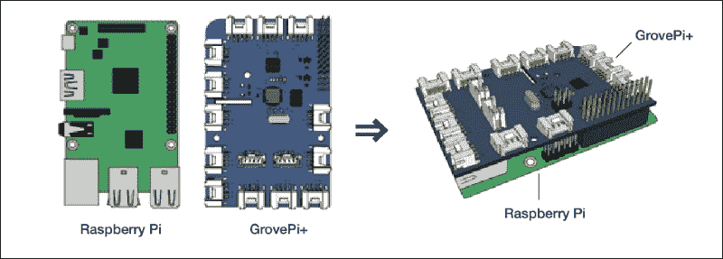

1.  将 GrovePi 连接到树莓派后，重新连接电源，并在树莓派启动完成后登录。

1.  登录后，使用`i2cdetect`命令验证 GrovePi 是否已正确安装。注意：如果使用的是原版树莓派，请使用`–y 0`选项，而不是`–y 1`。

    ```
    pi@raspberrypi ~ $ sudo i2cdetect -y 1
         0  1  2  3  4  5  6  7  8  9  a  b  c  d  e  f
    00:          -- 04 -- -- -- -- -- -- -- -- -- -- -- 
    10: -- -- -- -- -- -- -- -- -- -- -- -- -- -- -- -- 
    20: -- -- -- -- -- -- -- -- -- -- -- -- -- -- -- -- 
    30: -- -- -- -- -- -- -- -- -- -- -- -- -- -- -- -- 
    40: -- -- -- -- -- -- -- -- -- -- -- -- -- -- -- -- 
    50: -- -- -- -- -- -- -- -- -- -- -- -- -- -- -- -- 
    60: -- -- -- -- -- -- -- -- -- -- -- -- -- -- -- -- 
    70: -- -- -- -- -- -- -- --                         
    ```

1.  现在，使用`apt-get install`命令安装 Python 设置工具（`python-setuptools`）。

    ```
    pi@raspberrypi ~ $ sudo apt-get install -y python-setuptools
    Reading package lists... Done
    Building dependency tree       
    Reading state information... Done
    The following extra packages will be installed:
      python-pkg-resources
    Suggested packages:
      python-distribute python-distribute-doc
    The following NEW packages will be installed:
      python-pkg-resources python-setuptools
    0 upgraded, 2 newly installed, 0 to remove and 39 not upgraded.
    Need to get 0 B/513 kB of archives.
    After this operation, 1,308 kB of additional disk space will be used.
    Selecting previously unselected package python-pkg-resources.
    (Reading database ... 82496 files and directories currently installed.)
    Unpacking python-pkg-resources (from .../python-pkg-resources_0.6.24-1_all.deb) ...
    Selecting previously unselected package python-setuptools.
    Unpacking python-setuptools (from .../python-setuptools_0.6.24-1_all.deb) ...
    Setting up python-pkg-resources (0.6.24-1) ...
    Setting up python-setuptools (0.6.24-1) ...

    pi@raspberrypi ~ $ 
    ```

1.  使用`cd`命令导航到 GrovePi Python 软件库（`~/GrovePi/Software/Python`）。

    ```
    pi@raspberrypi ~ $ cd GrovePi/Software/Python

    pi@raspberrypi ~/GrovePi/Software/Python $ 
    ```

1.  使用`python setup.py`命令来`构建`并`安装``grovepi`模块。

    ```
    pi@raspberrypi ~/GrovePi/Software/Python $ python setup.py build
    running build
    running build_py
    creating build
    creating build/lib.linux-armv7l-2.7
    copying grovepi.py -> build/lib.linux-armv7l-2.7

    pi@raspberrypi ~/GrovePi/Software/Python $ sudo python setup.py install
    running install
    Checking .pth file support in /usr/local/lib/python2.7/dist-packages/
    /usr/bin/python -E -c pass
    TEST PASSED: /usr/local/lib/python2.7/dist-packages/ appears to support .pth files
    running bdist_egg
    running egg_info
    creating grovepi.egg-info
    writing grovepi.egg-info/PKG-INFO
    writing top-level names to grovepi.egg-info/top_level.txt
    writing dependency_links to grovepi.egg-info/dependency_links.txt
    writing manifest file 'grovepi.egg-info/SOURCES.txt'
    reading manifest file 'grovepi.egg-info/SOURCES.txt'
    writing manifest file 'grovepi.egg-info/SOURCES.txt'
    installing library code to build/bdist.linux-armv7l/egg
    running install_lib
    running build_py
    creating build/bdist.linux-armv7l
    creating build/bdist.linux-armv7l/egg
    copying build/lib.linux-armv7l-2.7/grovepi.py -> build/bdist.linux-armv7l/egg
    byte-compiling build/bdist.linux-armv7l/egg/grovepi.py to grovepi.pyc
    creating build/bdist.linux-armv7l/egg/EGG-INFO
    copying grovepi.egg-info/PKG-INFO -> build/bdist.linux-armv7l/egg/EGG-INFO
    copying grovepi.egg-info/SOURCES.txt -> build/bdist.linux-armv7l/egg/EGG-INFO
    copying grovepi.egg-info/dependency_links.txt -> build/bdist.linux-armv7l/egg/EGG-INFO
    copying grovepi.egg-info/top_level.txt -> build/bdist.linux-armv7l/egg/EGG-INFO
    zip_safe flag not set; analyzing archive contents...
    creating dist
    creating 'dist/grovepi-0.0.0-py2.7.egg' and adding 'build/bdist.linux-armv7l/egg' to it
    removing 'build/bdist.linux-armv7l/egg' (and everything under it)
    Processing grovepi-0.0.0-py2.7.egg
    creating /usr/local/lib/python2.7/dist-packages/grovepi-0.0.0-py2.7.egg
    Extracting grovepi-0.0.0-py2.7.egg to /usr/local/lib/python2.7/dist-packages
    Adding grovepi 0.0.0 to easy-install.pth file

    Installed /usr/local/lib/python2.7/dist-packages/grovepi-0.0.0-py2.7.egg
    Processing dependencies for grovepi==0.0.0
    Finished processing dependencies for grovepi==0.0.0

    pi@raspberrypi ~/GrovePi/Software/Python $ 
    ```

1.  将一个`Grove LED`设备连接到`D2`端口，将一个`Grove 按钮开关`连接到`D4`端口的`GrovePi`上。

1.  一个`Grove 按钮开关`和一个`Grove LED`已连接到`GrovePi+`，如下图所示：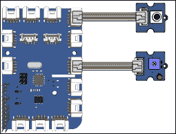

1.  现在，使用以下 Python 脚本（`button.py`）来测试`Grove 按钮开关`。运行测试脚本（`button.py`）两次——一次不按按钮开关（`0`），一次按下按钮开关（`1`）。注意结果的不同。

    ```
    pi@raspberrypi:~$ cat <<EOD >button.py
    from grovepi import *
    button = 4
    pinMode( button, "input" )
    print digitalRead( button )
    EOD

    pi@raspberrypi:~$ # without pressing the pushbutton switch
    pi@raspberrypi:~$ python button.py
    0

    pi@raspberrypi:~$ # while pressing the pushbutton switch
    pi@raspberrypi:~$ python button.py
    1

    pi@raspberrypi:~$ 
    ```

1.  接下来，使用以下 Python 脚本（`led.py`）来测试`LED`。当运行脚本（`led.py`）时，`LED`应持续发光一秒钟。

    ```
    pi@raspberrypi:~$ cat <<EOD >led.py
    from grovepi import *
    from time import sleep
    led = 2
    pinMode( led, "output" )
    digitalWrite( led, 1 )
    sleep( 1 )
    digitalWrite( led, 0 )
    EOD

    pi@raspberrypi:~$ python led.py

    pi@raspberrypi:~$ 
    ```

1.  最后，使用以下 Python 脚本在按下`Grove 按钮开关`时点亮`LED`。按*Ctrl+C*停止脚本。

    ```
    pi@raspberrypi:~$ cat <<EOD >loop.py
    from grovepi import *
    from time import sleep
    led = 2
    pinMode( led, "output" )
    button = 4
    pinMode( button, "input" )
    while True:
      try:
        state = digitalRead( button )
        digitalWrite( led, state )
        sleep( 0.01 )
      except KeyboardInterrupt:
        digitalWrite( led, 0 )
        break
      except IOError:
        print "IOError"
    EOD

    pi@raspberrypi:~$ python loop.py

    ^C
    ```

## 如何操作...

这个方案使用连接到树莓派的 GrovePi，通过输入设备（`Grove 按钮开关`）的状态变化来激活输出设备（`Grove LED`）。该方案首先将 GrovePi 及输入输出设备连接到树莓派。设备连接后，逐一测试每个设备。最后，使用 Python 脚本在输入设备状态变化时激活输出设备。

在将 GrovePi 连接到树莓派之前，已经安装了 GrovePi 驱动程序。

### 安装 GrovePi 驱动程序和接口

GrovePi 的驱动程序和接口直接从其源代码库（GitHub）下载（[`github.com/`](https://github.com/)）。`git clone`命令使用安全的互联网连接（`https://`）从其代码库`DexterInd/GrovePi`下载 GrovePi 接口和驱动程序。下载的文件包括安装脚本。

安装脚本`install.sh`位于`GrovePi/Scripts`目录中。使用`cd`命令导航到`GrovePi/Scripts`目录。

在`GrovePi/Scipts`目录中，使用`sh`命令来运行`install.sh`脚本。该脚本需要超级用户权限，因此在命令前使用`sudo`。

在开始安装之前，`install.sh`脚本会显示它将对您的 Raspberry Pi 进行的所有更改的完整列表。安装脚本提示您继续安装。按*Enter*键接受安装过程中所有问题的默认设置。

安装完 GrovePi 接口和驱动程序后，您将提示重新启动 Raspberry Pi。相反，请关闭 Raspberry Pi，以便您可以断开 Raspberry Pi 的电源并将 GrovePi 连接到其上。

### 将 GrovePi 连接到 Raspberry Pi

遵循制造商在[`www.dexterindustries.com/grovepi/`](http://www.dexterindustries.com/grovepi/)上的说明，将 GrovePi 连接到 Raspberry Pi。

如果将原始的 26 针 GrovePi 连接到 40 针型号的 Raspberry Pi 之一，请确保引脚 1 正确对齐。尽管 GrovePi 不覆盖所有引脚，但仍将完美工作。

可能需要在 GrovePi 和 Raspberry Pi 之间放置保护层，以防止 GrovePi 的底部接触到 Raspberry Pi 的 USB 连接器。GrovePi 运送时所用的静电袋片段是一个完美的保护层。

### 打开电源并登录

一旦验证 GrovePi 已正确连接到 Raspberry Pi，请将电源电缆连接到 Raspberry Pi，并在重新启动后登录。

使用`i2cdetect`命令验证 GrovePi 是否已正确连接。使用`–y`选项绕过交互模式。只有原始的 Raspberry Pi 使用总线`0`，而所有新型 Raspberry Pi 使用总线`1`。

如果 GrovePi 连接正确，其芯片 ID 为`04`将显示在地址`00 4`处。

现在 GrovePi 已经连接并被检测到，是时候安装 GrovePi 的 Python 语言**应用程序编程接口**（**API**）了。

### 安装 Python API

在安装 GrovePi API 之前，需要安装 Python 设置工具。使用`apt-get install`命令安装`python-setuptools`软件包。安装 Python 的设置工具后，可以安装 GrovePi API。

GrovePi API 的源代码位于`GrovePi/Software/Python`目录中。使用`cd`命令导航到该目录。

使用`python`命令来运行`setup.py`脚本，首先构建 API，然后安装 API。安装需要超级用户权限，因此在`install`期间使用`sudo`命令作为命令前缀。

安装完成 GrovePi Python API 后，可以测试硬件设备。

### 测试 Grove 按钮开关

`cat`命令用于创建一个新的脚本`button.py`，该脚本测试`Grove pushbutton switch`的状态。紧随其后的`cat`命令至数据标记（`<<EOD`）的所有行被复制到新脚本（`>button.py`）。

`python`命令用于运行`button.py`测试脚本两次。

第一次运行`button.py`脚本时，没有按下按键开关。结果为 0，因为开关是打开的（未按下）。

第二次运行脚本时，按下了按键开关。结果为 1，因为开关是闭合的（按下）。

### 测试 Grove LED。

`cat`命令还用于创建另一个测试脚本`led.py`，该脚本测试`Grove LED`。紧随其后的`cat`命令至数据标记（`<<EOD`）的所有行被复制到新脚本（`>led.py`）。

`python`命令用于运行`led.py`测试脚本。当脚本（`led.py`）运行时，`Grove LED`应该亮起一秒钟。

### 按下按键开关时，LED 会亮起。

`cat`命令再次用于创建`loop.py` Python 脚本。这个简短的程序将无限循环，发送来自输入设备（按键开关）的信号值到输出设备（LED）。

`loop.py`脚本导入了完整的`(*) grovepi` API，并从`time` API 中导入了`sleep`函数。

一个变量`led`用来表示数字端口`2`，即连接 LED 与 GrovePi 的端口。`grovepi` API 中的`pinMode`函数用于将 LED 端口的信号方向设置为输出。

另一个变量`button`用来表示数字端口`4`，即连接按键开关与 GrovePi 的端口。`pinMode`函数用于将`button`端口的信号方向设置为`input`。

脚本的主体是一个无限循环（`while True:`），只有在发生`KeyboardInterrupt`异常时才会跳出。

循环首先使用`digitalRead`函数接收`button`端口的当前值。接收到的值存储在变量`state`中。

然后，`state`变量的值通过`digitalWrite`函数发送到 LED 端口。

在`while`循环继续之前，程序会休眠 0.01 秒。这样可以给 Raspberry Pi 一个机会在设置 LED 端口的`state`和从`button`端口读取下一个`state`之间做些其他操作。

`while`循环监听两种异常：`KeyboardInterrupt`和`IOError`。当发生`KeyboardInterrupt`时，脚本使用`digitalWrite`函数向 LED 端口发送关闭信号（`0`），并跳出`while`循环结束程序。当发生`IOError`时，打印消息`IOError`。

`python`命令用于运行`loop.py`脚本。当脚本运行时，每当按下按钮开关时，LED 会亮起；松开按钮开关时，LED 会熄灭。使用*Ctrl+C*发送`KeyboardInterrupt`异常并结束程序。

## 还有更多内容…

Dexter Industries 的 GrovePi 扩展板可以将树莓派与 Seeed Studio 开发的 Grove 硬件平台的 100 多个组件连接。官方网站是[`www.seeedstudio.com/depot/`](http://www.seeedstudio.com/depot/)。这些组件可以通过简单的 Python 脚本进行操作，也可以集成到用 C、Go 或 Java 编写的更大应用程序中。

除了本配方中使用的数字端口外，GrovePi 还具有模拟端口，可以接收 0 到 1023 之间的信号级别，并可以输出 0 到 255 之间的信号级别。GrovePi 还具有 3 个 I2C 端口和一个**通用异步收发器/传输器**（**UART**）串行端口，可用于与更复杂的设备通信。

完整的 GrovePi 文档，包括 Python API，可以在 Dexter Industries 的网站上找到。更多关于 Grove 系统的信息可以在 Seeed Studio 的 Wiki 上找到。

## 另请参见

+   **GrovePi**: 位于[`www.dexterindustries.com/grovepi/`](http://www.dexterindustries.com/grovepi/)。GrovePi 主页提供了兼容传感器和设备的完整列表。

+   **The Grove System**: [`www.seeedstudio.com/wiki/Category:Grove`](http://www.seeedstudio.com/wiki/Category:Grove)。该 Wiki 页面更详细地描述了类似乐高的 Grove 硬件系统。

+   **The Grove System – Python Library Documentation**: [`www.dexterindustries.com/GrovePi/programming/python-library-documentation/`](http://www.dexterindustries.com/GrovePi/programming/python-library-documentation/)。这个网站记录了 GrovePi 的 Python 编程语言库。

+   **Python**: [`www.python.org/`](https://www.python.org/)。Python 官网提供了 Python 语言的完整参考文档。

+   **GrovePi Windows IoT: LED Blink**: [`www.hackster.io/9381/grove-pi-windows-iot-getting-started-94bf38`](https://www.hackster.io/9381/grove-pi-windows-iot-getting-started-94bf38)。这是一个适用于 Windows 10 和 GrovePi 的 LED 闪烁示例。

+   **Dexter Industries**: [`en.wikipedia.org/wiki/Dexter_Industries`](https://en.wikipedia.org/wiki/Dexter_Industries)。Dexter Industries 最著名的是他们为树莓派开发的机器人传感器。

+   **Seeed Studio**: [`www.seeedstudio.com/depot/`](http://www.seeedstudio.com/depot/)。Seeed 是一个位于中国深圳的硬件创新平台。

+   **GitHub**: [`github.com`](http://github.com)。GitHub 是一个开放源代码软件的协作仓库。

+   **i2cdetect**: [`manpages.debian.org/cgi-bin/man.cgi?query=i2cdetect`](http://manpages.debian.org/cgi-bin/man.cgi?query=i2cdetect)。Debian 的 i2cdetect 手册页记录了该命令及其选项。

# 从网页控制设备

本教程使用一个简单的 Python 脚本，展示了如何从网页控制连接到 Raspberry Pi 的设备。

`web.py` Python 编程框架可用于从使用 Python 编程语言编写的脚本提供网页。本教程介绍了一个 Python 脚本，用于提供显示 GrovePi LED 当前状态的网页，并允许网页上的按钮打开和关闭 GrovePi LED。这是一个简单的示例，但是是简单物联网项目的良好基础。

完成此教程后，您将安装并应用了`web.py` Python 框架，用于提供一个可用于打开和关闭 LED 灯的网页。

## 准备工作

以下是从网页控制设备所需的组件：

+   对于已安装了 GrovePi 接口和驱动程序的 Raspberry Pi 的初始设置或基本网络设置（请参见前一教程*安装 GrovePi*的说明）。您也已登录为用户`pi`（请参见第一章的教程，*安装和设置*，了解如何启动和登录，以及第二章的教程，*Administration*，了解如何远程登录）。

+   GrovePi 应该已连接到 Raspberry Pi 上。

+   Grove LED 应连接到 GrovePi 的 D2 端口。

本教程不需要桌面 GUI，可以从基于文本的控制台或`LXTerminal`应用程序运行。

如果 Raspberry Pi 的安全外壳服务器正在运行，则可以使用安全外壳客户端远程完成此教程。

## 如何做...

控制设备从网页的步骤是：

1.  登录 Raspberry Pi，可以直接或远程登录。

1.  使用`apt-get install`命令为 Python 安装`web.py`网页框架。

    ```
    pi@raspberrypi ~ $ apt-get install –y python-webpy
    Reading package lists... Done
    Building dependency tree       
    Reading state information... Done
    The following extra packages will be installed:
      libpq5 python-cheetah python-egenix-mxdatetime python-egenix-mxtools python-flup python-psycopg2 python2.6
      python2.6-minimal
    Suggested packages:
      python-markdown python-pygments python-memcache python-egenix-mxdatetime-dbg python-egenix-mxdatetime-doc
      python-egenix-mxtools-dbg python-egenix-mxtools-doc python-psycopg2-doc python2.6-doc binfmt-support
    The following NEW packages will be installed:
      libpq5 python-cheetah python-egenix-mxdatetime python-egenix-mxtools python-flup python-psycopg2 python-webpy
      python2.6 python2.6-minimal
    0 upgraded, 9 newly installed, 0 to remove and 39 not upgraded.
    Need to get 923 kB/4,773 kB of archives.
    After this operation, 16.5 MB of additional disk space will be used.

    ...
    ```

1.  安装了`web.py`后，使用`cat`命令创建一个 Python 脚本，用于提供一个用于打开和关闭 Grove LED 灯的网页。

    ```
    pi@raspberrypi ~ $ cat <<EOD >ledpage.py

    import grovepi
    import web

    LED  = 2
    URLS = ( '/(.*)', 'request_handler' )

    class request_handler:

      def GET( self, url_match ):

        web.header( 'Content-Type', 'text/html; charset=utf-8' )

        if url_match == 'on':
          grovepi.digitalWrite( LED, 1 )
          return html_page( 'off' )

        if url_match == 'off':
          grovepi.digitalWrite( LED, 0 )
          return html_page( 'on' )

        return html_page( 'on' )

    def html_page( state ):
      form  = '<form action="/' + state + '">'
      form +=   '<input type="submit" value="' + state + '">'
      form += '</form>'
      return '<html><body>' + form + '</body></html>'

    if __name__ == '__main__':
      grovepi.pinMode( LED, 'output' )
      app = web.application( URLS, globals() )
      app.run()

    EOD

    pi@raspberrypi ~ $
    ```

1.  使用`python`命令启动网页服务。

    ```
    pi@raspberrypi ~ $ python ledpage.py
    http://0.0.0.0:8080/
    ```

1.  从 Web 浏览器，您可以看到网页。使用您的 Raspberry Pi 的 IP 地址加上端口`8080`访问网页（例如，`http://192.168.2.19:8080`）。

1.  网页显示一个按钮。如果 LED 灯灭了，按钮标签为`on`。如果 LED 灯亮了，按钮标签为`off`。点击按钮设置 LED 灯状态，与按钮标签说明一致。

1.  使用*Ctrl+C*停止提供网页服务。

## 工作原理如下...

登录 Raspberry Pi 后，本教程首先使用`apt-get install`命令安装`python-webpy`软件包。该软件包包含 Python 的`web.py`网页框架。

`web.py`网页框架是用 Python 编写的，用于创建使用 Python 编程语言创建网页的 Web 服务器工具包。本教程中的 Python 脚本还使用了前一教程中介绍的 GrovePi API，即*安装 GrovePi*。

### 创建并运行 ledpage 网站

`cat`命令用于创建一个新的脚本`ledpage.py`。紧随`cat`命令之后的行一直到数据标记（`<<EOD`）结束，都会复制到新的脚本中（`>ledpage.py`）。

这个新脚本将提供一个网页，可以用来控制 GrovePi 的 LED。在示例脚本中，LED 连接到 GrovePi 的`D2`端口。

`ledpage.py`脚本通过`python`命令运行。运行该脚本时，一个网页服务器会在每个网络接口的`8080`端口上启动，监听来自 Raspberry Pi 的请求（`http://0.0.0.0`）。

可以在网页浏览器中查看网页服务器的输出。打开浏览器，访问`http://ipaddress:8080`，即运行`ledpage.py`脚本的网址。将网址中的`ipaddress`替换为你 Raspberry Pi 的 IP 地址（有关如何确定 IP 地址的说明，请参见第二章，*管理*）。

### 操作网址

默认视图（`http://ipaddress:8080/`）显示一个按钮，用于更改 LED 的当前状态。当 LED 关闭时，按钮上标注为`on`，当 LED 打开时，按钮上标注为`off`。点击按钮后，LED 将切换到按钮上标注的状态。

当按钮上标注为`on`时，点击按钮会将浏览器引导到网址`http://ipaddress:8080/on`；当按钮上标注为`off`时，点击按钮会将浏览器引导到网址`http://ipaddress:8080/off`。

浏览到`/on`网址会开启灯光，并显示一个`off`按钮。浏览到`/off`网址会关闭灯光，并显示一个`on`按钮。这些操作网址`/on`和`/off`在`ledpage.py`中定义。

### 使用 Ctrl+C 退出

Python 网页服务器会持续运行，直到按下*Ctrl+C*。

## 还有更多内容……

`ledpage.py`脚本是一个简单而完整的网页服务示例，用于控制连接到 Raspberry Pi 的设备。该脚本可以分为四个部分：初始化、`request handler`类、`html_page`函数和`main`循环。

### 初始化

脚本以两个`import`语句开始：一个用于`grovepi` API，另一个用于`web` API。`web` API 用于设置网页服务器，`grovepi` API 用于连接到 Grove LED。

在`import`语句之后，定义了两个常量：`LED`和`URLS`。`LED`常量定义了将用于 GrovePi 的数字输出端口（`2`），而`URLS`常量定义了正则表达式（`/(.*)`）和请求处理器（`request_handler`）之间的映射。

定义的正则表达式（`/(.*)`）匹配所有网址。网址中匹配的部分，即斜杠后面的内容（`(.*)`），将被传递给`request_handler`（作为`url_match`）。

### `request_handler`类

`request_handler`类定义了如何处理网页服务器的 HTTP 请求。在这个脚本中，只实现了**超文本传输协议**（**HTTP**）的`GET`方法。

当你浏览到 Python Web 服务器的 URL（`http://ipaddress:8080`）时，Web 服务器会收到一个 `GET` 方法，并且会调用 `request_handler` 类的 `GET` 方法（`GET ( self, url_match )`）。

`GET` 方法使用 `web` API 函数 `header` 来设置 HTTP 响应的 `Content-type` 为 `text/html`，并且字符集编码为 UTF-8（`charset=utf-8`）。`Content-type` 响应头告诉浏览器这个 URL 下的内容类型是什么（网页、纯文本、图片、音频、视频等）。该 URL 的响应是一个使用 UTF-8 字符集的网页（`text/html`）。

然后，`GET` 方法会检查 `url_match` 参数的值。

当 `url_match` 为 `on`（`http://ipaddress:8080/on`）时，`grovepi` API 函数 `digitalWrite` 会首先打开 `LED`（`1`），然后将带有 `off` 按钮的 `html_page` 返回给浏览器。

当 `url_match` 为 `off`（`http://ipaddress:8080/off`）时，`digitalWrite` 函数会关闭 `LED`（`0`），并将带有 `on` 按钮的 `html_page` 返回给浏览器。

如果匹配的 URL（`url_match`）既不是 `on` 也不是 `off`，则会将带有 `on` 按钮的 `html_page` 返回给浏览器。此时 `LED` 的状态不会改变。

### html_page 函数

`html_page` 函数（`html_page( state )`）渲染将要发送给浏览器的 HTML，以显示网页。

该函数有一个参数 `state`，用于指定按钮（`<input type="submit">`）的标签（`value`）和 HTML `<form>` 标签的 `action`。

创建一个字符串变量 `form` 来构建网页的 HTML `<form>` 部分。

HTML `<form>` 标签的 `action` 属性根据 `state` 参数的值设置为 `/on` 或 `/off`。`action` 属性定义了当 HTML `<form>` 被提交时（即按钮被按下时），浏览器会被发送到的 URL。

`<input type="submit">` 标签（按钮）的 `value` 属性（标签）根据 `state` 参数的值设置为 `on` 或 `off`。点击按钮时，该标签将提交 HTML `<form>`。

一旦 HTML `<form>` 标签定义完成，包括结束标签 `</form>`，它会被包裹在 `<body>` 标签和 `<html>` 标签中，形成一个最小的 HTML 网页。

完整的网页会被返回给 `request_handler`，然后 `request_handler` 会将网页发送给浏览器。

### 主循环

主循环从 `if __name__ == '__main__':` 开始，并在 `html_page` 函数和 `request_handler` 定义后被调用一次。

主循环首先使用 `grovepi` API 来初始化 `LED` 为 `output pinMode`。GrovePi 数字端口可以用来接收信号或触发信号。对于此脚本，`LED` 端口被配置为 `output`。

配置`LED`端口后，`web` API 的`application`函数用于创建一个 Web 应用程序，该应用程序使用 Python 的默认全局变量（`globals()`）作为应用程序上下文，监听指定的`URLS`。

`web.application`函数的第一个参数`URLS`定义了 URL 请求模式（正则表达式）与其请求处理程序（Python 类）之间的映射关系。第二个参数定义了应用程序上下文（在此情况下是`global`上下文）。`web.application`函数返回一个 Web 应用对象（`app`），该对象封装了 HTTP 协议并管理 Web 服务器。

最后，使用新创建的 Web 应用对象（`app`）的`run`函数启动 Web 服务器。

Web 应用程序默认在树莓派（`0.0.0.0`）附加的所有网络接口的端口`8080`上监听。`app.run`函数会持续运行，直到被中断（通过*Ctrl+C*）。

使用`web.py`创建基于 Python 脚本语言的 Web 应用程序的更多信息可以在`web.py`网站上找到（[`webpy.org/`](http://webpy.org/)）。

## 另见

+   **web.py**（[`webpy.org/`](http://webpy.org/)）：这个 Web 框架最初是在 reddit.com 开发的，后来它扩展为每天处理数百万页面浏览量。

+   **web.py – 教程**（[`webpy.org/docs/0.3/tutorial`](http://webpy.org/docs/0.3/tutorial)）：这是`web.py`教程的根本。

+   **正则表达式如何做**（[`docs.python.org/2/howto/regex.html`](https://docs.python.org/2/howto/regex.html)）：这是一个介绍如何在 Python 中使用正则表达式的教程。

+   **超文本传输协议**（[`en.wikipedia.org/wiki/Hypertext_Transfer_Protocol`](https://en.wikipedia.org/wiki/Hypertext_Transfer_Protocol)）：这篇维基百科文章讲解了 HTTP 协议。

+   **HTML**（[`en.wikipedia.org/wiki/HTML`](https://en.wikipedia.org/wiki/HTML)）：这篇维基百科文章描述了超文本标记语言（HTML）及其历史。

# 连接到物联网平台

本食谱将你的树莓派连接到 SmartLiving（[`smartliving.io`](http://smartliving.io)）物联网（IoT）平台。

SmartLiving 物联网平台使用 Web 浏览器配置响应传感器和/或激活连接到你的树莓派的物联网设备的规则。SmartLiving API 包括来自 Dexter Industries 的 GrovePi 驱动程序。本食谱将你的树莓派与 SmartLiving 平台集成，并利用它来控制连接到树莓派的 GrovePi 设备。

完成本食谱后，你将能够使用 SmartLiving 物联网平台控制连接到树莓派的 Grove 设备。

## 准备工作

材料：

+   对于已经安装了 GrovePi 接口和驱动的树莓派，基本的网络设置（参考前面的教程《安装 GrovePi》获取详细操作）。你也应该已经以用户`pi`身份登录（参考第一章《安装与设置》教程中如何启动和登录的操作，或参考第二章《管理》教程中如何远程登录的操作）。

+   树莓派应连接到互联网。

+   一颗 GrovePi 应该已经连接到树莓派。

+   一颗 Grove LED 应该已连接到 GrovePi 的 D2 端口。

本教程不需要桌面 GUI，可以从基于文本的控制台或`LXTerminal`中运行。

如果树莓派的安全外壳（Secure Shell）服务器正在运行，可以通过使用安全外壳客户端远程完成此步骤。

## 如何操作...

从 SmartLiving 平台控制物联网设备的步骤如下：

1.  首先，创建一个免费账户并登录到 SmartLiving 平台：[`beta.smartliving.io`](http://beta.smartliving.io)。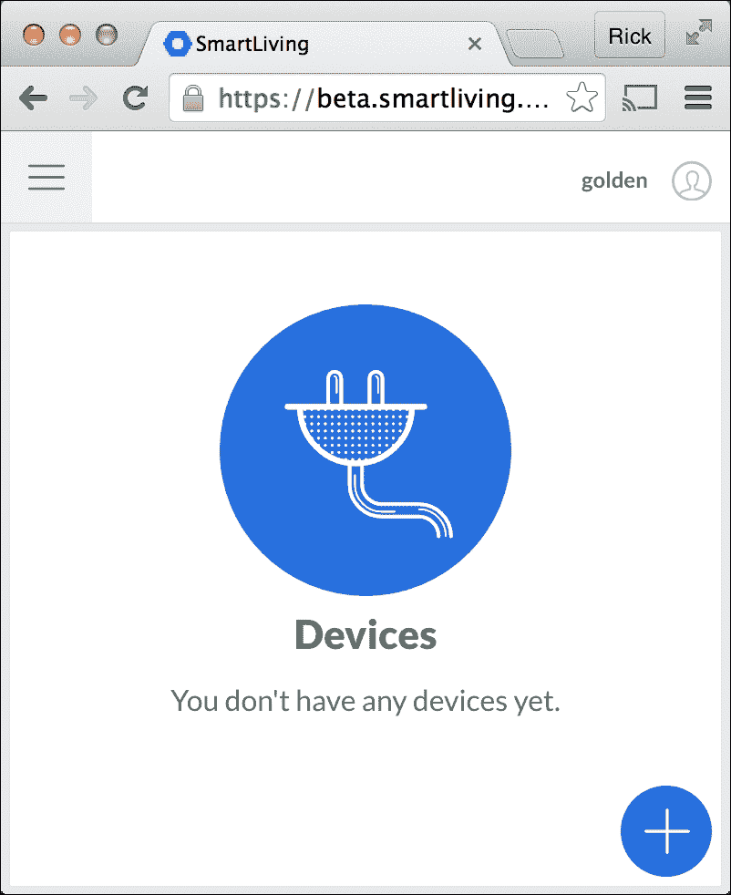

1.  点击加号图标以创建新设备。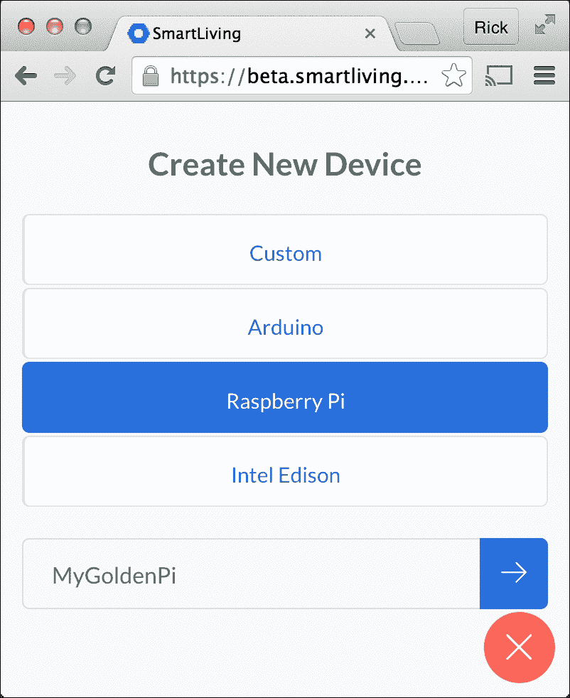

1.  选择设备类型为树莓派并命名设备（**MyGoldenPi**）。点击**右箭头图标**继续。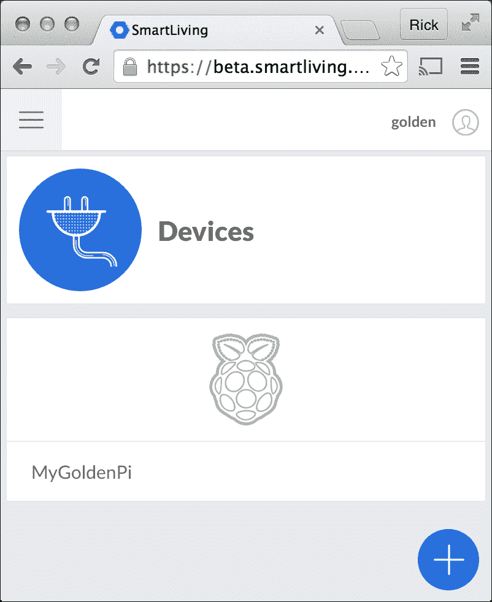

1.  通过点击树莓派图标选择树莓派设备。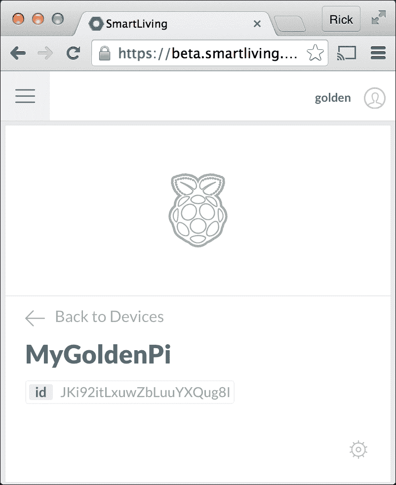

1.  点击**齿轮图标**选择设置。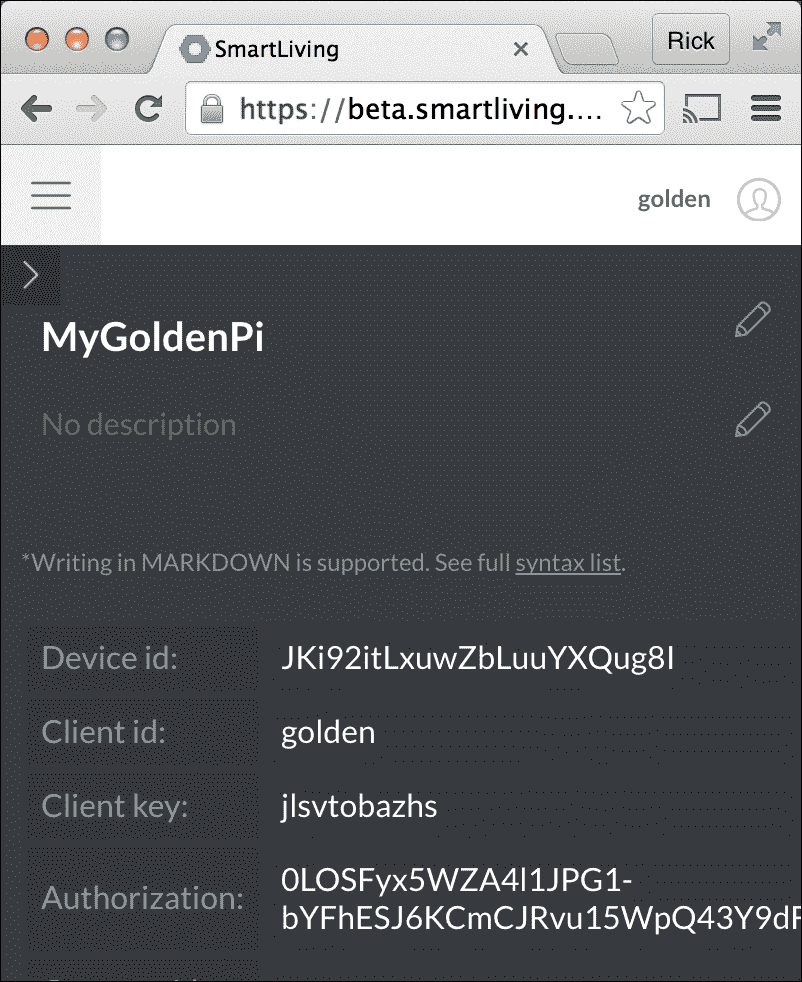

1.  现在你的树莓派已注册，你可以看到设备 ID、客户端 ID 和客户端密钥，是时候切换回树莓派了。

1.  登录树莓派（本地或远程）。

1.  使用`git clone`命令下载 All Things Talk（`allthingstalk`）Python 客户端（`raspberrypi-python-client`）。

    ```
    pi@raspberrypi ~ $ git clone https://github.com/allthingstalk/raspberrypi-python-client

    Cloning into 'raspberrypi-python-client'...
    remote: Counting objects: 369, done.
    Receiving objects: 100% (369/369), 85.93 KiB, done.
    remote: Total 369 (delta 0), reused 0 (delta 0), pack-reused 369
    Resolving deltas: 100% (240/240), done.

    pi@raspberrypi ~ $ 
    ```

1.  使用`cd`命令进入客户端安装目录，然后使用 Bash 脚本`setupGrovePi.sh`安装客户端。

    ```
    pi@raspberrypi ~ $ cd raspberrypi-python-client

    pi@raspberrypi ~/raspberyypi-python-client $ sudo bash setupGrovePi.sh

    Reading package lists... Done
    Building dependency tree       
    Reading state information... Done
    The following extra packages will be installed:
      python2.7-dev
    The following NEW packages will be installed:
      python-dev python2.7-dev
    0 upgraded, 2 newly installed, 0 to remove and 0 not upgraded.
    Need to get 0 B/28.7 MB of archives.

    ...
    ```

1.  在所有安装提示中按下*Enter*键，以接受默认设置。

1.  安装脚本完成后，使用`reboot`命令重启树莓派。

    ```
    ...

    Please restart to implement changes!
      _____  ______  _____ _______       _____ _______ 
     |  __ \|  ____|/ ____|__   __|/\   |  __ \__   __|
     | |__) | |__  | (___    | |  /  \  | |__) | | |   
     |  _  /|  __|  \___ \   | | / /\ \ |  _  /  | |   
     | | \ \| |____ ____) |  | |/ ____ \| | \ \  | |   
     |_|  \_\______|_____/   |_/_/    \_\_|  \_\ |_|   

    Please restart to implement changes!
    To Restart type sudo reboot

    pi@raspberrypi ~/raspberrypi-python-client $ sudo reboot
    Broadcast message from root@raspberrypi (pts/0) (Mon Oct 12 17:07:11 2015):
    The system is going down for reboot NOW!
    ```

1.  现在 All Things Talk（Smart Living）客户端已经安装完成，接下来是测试物联网功能。

1.  重新登录树莓派（本地或远程）。

1.  使用`cd`命令切换到 Smart Living Python 客户端`raspberrypi-python-client`所在的目录。

    ```
    pi@raspberrypi ~ $ cd raspberrypi-python-client

    pi@raspberrypi ~/ raspberrypi-python-client $ 
    ```

1.  使用`cat`命令创建一个 Python 脚本（`ledserver.py`），将 Grove LED 连接到 D2 端口，并连接到 Smart Living 平台。确保用你在 Smart Living 账户中获得的三个配置参数值（`IOT.DeviceId`、`IOT.ClientId`和`IO.ClientKey`）替换脚本中的相应值（步骤 6 中的值）。

    ```
    pi@raspberrypi ~/ raspberrypi-python-client $ cat <<EOD >ledserver.py

    import grovepi
    import ATT_IOT as IOT
    import time

    LED = 2

    def on_message( id, value ):

        if id.endswith( str( LED ) ):

            value = value.lower()

            if value == "true":
                grovepi.digitalWrite( LED, 1 )

            if value == "false":
                grovepi.digitalWrite( LED, 0 )

        # ignore unkown ids and values                                                                                                                                               

    if __name__ == '__main__':

      grovepi.pinMode( LED, 'output' )

      IOT.DeviceId   = "JKi92itLxuwZbLuuYXQug8I"
      IOT.ClientId   = "golden"
      IOT.ClientKey  = "jlsvtobazhs"

      IOT.on_message = on_message

      IOT.connect()
      IOT.addAsset( LED, "LED", "Light Emitting Diode", True, "boolean" )
      IOT.subscribe()

      while True:
          time.sleep( .1 )

    EOD

    pi@raspberrypi ~ $
    ```

1.  使用`python`命令运行新创建的脚本。

    ```
    pi@raspberrypi ~/ raspberrypi-python-client $ python ledserver.py
    connected with http server
    HTTP PUT: /asset/JKi92itLxuwZbLuuYXQug8I2
    HTTP HEADER: {'Auth-ClientId': 'golden', 'Content-type': 'application/json', 'Auth-ClientKey': 'jlsvtobazhs'}
    HTTP BODY:{"name":"LED","description":"Light Emitting Diode", "style": "Undefined","is":"actuator","profile": {"type":"boolean" },"deviceId":"JKi92itLxuwZbLuuYXQug8I" }
    (200, 'OK')
    {"deviceId":"JKi92itLxuwZbLuuYXQug8I","id":"JKi92itLxuwZbLuuYXQug8I2","name":"LED","is":"actuator","description":"Light Emitting Diode","createdOn":"2015-10-13T00:36:01.742Z","createdBy":"555a3d487ae2530b385b2173","updatedOn":"2015-10-13T01:07:44.074Z","updatedBy":"555a3d487ae2530b385b2173","profile":{"type":"boolean"},"state":null,"style":"undefined","control":{"name":null,"widgetUrl":null}}
    Connected to mqtt broker with result code 0
    subscribing to: client/golden/in/device/JKi92itLxuwZbLuuYXQug8I/asset/+/command
    (0, 1)
    Subscribed to topic, receiving data from the cloud: qos=(0,)
    ```

1.  在浏览器中，刷新智能生活设备页面。树莓派设备（**MyGoldenPi**）现在有了一个新设备（**LED**）。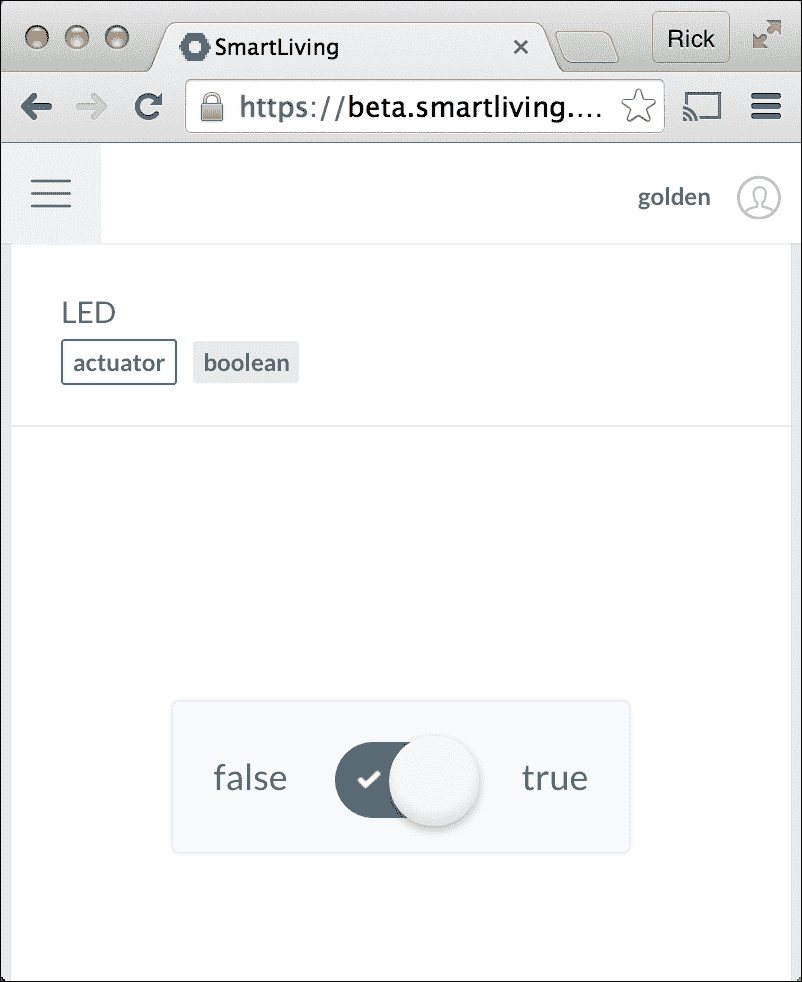

1.  在智能生活网页上切换**布尔**开关，Grove LED 会随之开关，同时运行中的`ledserver.py`脚本会打印附加的状态信息。

    ```
    Incoming message - topic: client/golden/in/device/JKi92itLxuwZbLuuYXQug8I/asset/JKi92itLxuwZbLuuYXQug8I2/command, payload: true
    Incoming message - topic: client/golden/in/device/JKi92itLxuwZbLuuYXQug8I/asset/JKi92itLxuwZbLuuYXQug8I2/command, payload: false
    ```

1.  按*Ctrl+C*停止`ledserver.py`脚本。

## 它是如何工作的…

这个教程分为三部分：将树莓派设备注册到智能生活物联网平台，安装智能生活客户端 API，最后运行一个脚本，交换智能生活平台与树莓派之间的信号。

### 将树莓派注册到物联网平台

本教程首先通过[`beta.smartliving.io`](http://beta.smartliving.io)注册一个免费账户。

注册账户后，创建了一个新的树莓派设备界面（**MyGoldenPi**），并显示该设备的**设备 ID**、**客户端 ID**和**客户端密钥**。这三个配置值将在本教程后续步骤中用于将树莓派连接到智能生活物联网平台。

### 安装物联网平台 API

接下来的步骤是登录到树莓派。

使用`git clone`命令下载适用于树莓派的 All Things Talk 客户端 API（`allthingstalk/raspberrypi-python-client`）——这个 Python API 用于与智能生活物联网平台进行通信。

客户端 API 下载完成后，使用`bash`命令从客户端 API 目录（`raspberrypi-python-client`）运行`setGrovePi.sh`脚本。`setupGrovePi.sh`安装脚本会安装额外的软件包和 Python 库。

### 与物联网平台交换信号

安装智能生活客户端 API 后，使用`cat`命令创建一个简短的 Python 脚本（`ledserver.py`），该脚本监听来自智能生活物联网平台的信号。

使用`python`命令从`raspberrypi-python-client`目录运行脚本。当脚本运行时，树莓派会连接到智能生活物联网平台，并接收来自物联网平台的信号，控制 LED 的开关。

物联网信号通过智能生活网站上的树莓派设备页面发送。设备页面上有一个标有**LED**的**执行器**。通过切换**false** – **true**开关，一个信号会从智能生活平台通过物联网发送到树莓派。**false**信号会关闭 LED，**true**信号会打开 LED。

本地键盘中断信号（按下*Ctrl+C*键）会停止脚本。

## 还有更多…

Python 脚本`ledserver.py`是一个简单的示例，展示了如何将树莓派连接到物联网平台。该脚本监听并响应从智能生活物联网平台发送的二进制信号。来自物联网平台的信号控制连接到树莓派的设备（一个 LED）。

脚本分为三个部分：初始化、信号处理器和主循环。

### 初始化

脚本开始时有三个 `import` 语句：一个导入 GrovePi API（`grovepi`），一个导入 All Things Talk API（ATT_IOT），另一个导入 `time` API。`time` API 提供 `sleep` 函数；ATT_IOT API 用于连接智能生活物联网平台，而 `grovepi` API 用于连接 Grove LED。

在 `import` 语句之后，定义了一个常量 **LED**，表示 GrovePi 上将使用的数字端口（2）。

### 信号处理器

信号处理器函数 `on_message` **( ID, value )** 定义了接收到来自物联网平台的信号（消息）时应采取的操作。

当消息的最后一个字符（`endswith`）的 **id** 等于注册的 LED 资产 ID（`str(LED)`）时，消息将应用于 **LED** 资产。

如果消息的值（转换为小写，**lower**）为 "**true**"，LED 将通过 grovepi API 打开（`digitalWrite( LED, 1 )`）。当值为 "**false**" 时，LED 将关闭（`digitalWrite( LED, 0 )`）。

### 主循环

主循环（`if __name__ == '__main__':`）开始时，使用 GrovePi API 将 LED 的引脚模式设置为输出。

智能生活客户端 API（IOT）通过 **DeviceId**、**ClientId** 和 **ClientKey** 配置参数进行配置。这些参数设置为之前在智能生活注册过程中显示的值。IOT 信号处理器参数 `on_message` **,** 被设置为信号处理函数 `on_message`。

现在客户端 API（IOT）已配置完毕，树莓派已准备好 `connect` 到智能生活物联网平台，注册一个新设备资产（`addAsset`），并订阅来自物联网平台的消息。

`IOT.connect` 方法通过之前指定的 **DeviceId**、**ClientId** 和 **ClientKey** 来建立与智能生活物联网平台的连接。

在连接建立后，树莓派通过 `addAsset` 告知物联网平台，端口 D2 上连接了一个二进制（**"boolean"**）输出（**True**）设备（**LED**）。输出设备被标记为 **"LED"**，并有简短描述 **"Light Emitting Diode"**（发光二极管）。

`IOT.subscribe` 方法通知智能生活物联网平台，树莓派准备好接收来自平台的信号（消息）。

`on_message` 函数先前已被定义为信号处理器。因此，当树莓派收到一个新的信号（消息）时，`on_message` 函数会接收该信号并根据其 **id** 和 **value** 执行相应操作。

当接收到 **"true"** 信号时，LED 会打开；当接收到 **"false"** 信号时，LED 会关闭。

### 物联网规则

尽管这个示例展示了树莓派如何连接到智能生活物联网平台并与其交换信号，但并没有展示如何创建新的物联网规则。

Smart Living 网站（[`smartliving.io`](http://smartliving.io)）提供了许多关于如何使用物联网规则来响应和控制树莓派的示例：

+   检测运动——当传感器检测到运动时点亮 LED 灯

+   拔掉智能手机——当手机从充电器上拔掉时震动

+   智能门铃——门铃会响铃并通知您的智能手机

+   光传感器——在智能手机上显示远程房间的光线水平

+   智能商店橱窗——使用二维码控制橱窗内的灯光

+   访问 Smart Living 网站，获取详细的说明和完整的参考资料，了解如何将 Smart Living 物联网平台与树莓派及其他设备一起使用。

## 另请参见

+   **SmartLiving**（[`www.smartliving.io/`](http://www.smartliving.io/)）：使用 Maker 链接注册 Smart Living 帐户。

+   **All Things Talk**（[`allthingstalk.com/`](http://allthingstalk.com/)）：All Things Talk 网站提供了更多关于其物联网平台家庭版和商业版的详细信息。

+   **Raspberry Pi 套件**（[`docs.smartliving.io/kits/linux-raspberry-pi/stepbystep/`](http://docs.smartliving.io/kits/linux-raspberry-pi/stepbystep/)）：本教程是将树莓派连接到 Smart Living 的指南。

+   **Raspberry Pi 套件实验指南**（[`docs.smartliving.io/kits/linux-raspberry-pi/experiments/`](http://docs.smartliving.io/kits/linux-raspberry-pi/experiments/)）：此网站上有五个实验帮助您入门物联网。

# 创建物联网网关

这个教程将您的树莓派变成一个物联网网关，使用由 Node-RED（[`nodered.org/`](http://nodered.org/)）支持的 The ThingBox（[`thethingbox.io/`](http://thethingbox.io/)）。

The ThingBox 是一个基于 Raspbian 的操作系统发行版，用于以新颖和有趣的方式连接硬件设备、API 和在线服务。它预安装了 Node-RED 可视化工具，用于连接物联网。

在此教程中，The ThingBox 被部署，并创建了一个新的流程，该流程在按下按钮时点亮连接到树莓派的 LED。这是一个非常简单的示例，但完全展示了 The ThingBox 的使用方法。教程的最后，还列出了可以在下一个项目中使用的附加节点。

完成此教程后，您的树莓派将成为一个物联网网关。

## 准备工作

配料：

+   用于下载 The ThingBox 发行版的互联网连接

+   一张 SD 卡——4GB 或更大（class 10 性能最佳）

+   一台连接到本地网络的树莓派

此教程只需要桌面 GUI 来设置无线网络。

一旦树莓派运行并连接到网络，该教程将在另一台计算机上使用网页浏览器完成。

## 如何操作...

创建物联网网关的步骤如下：

1.  从 The ThingBox 网站下载最新的镜像文件，[`thethingbox.io/#packagestable`](http://thethingbox.io/#packagestable)（请参阅第一章中的食谱*下载新 SD 卡*，*安装与设置*）。

1.  将镜像文件写入 SD 卡（请参阅第一章中的适当磁盘工具食谱，*安装与设置*）。

1.  使用更新的 SD 卡启动树莓派。

1.  如果你的树莓派使用 Wi-Fi 适配器连接到本地网络，你需要登录树莓派的 GUI 一次（用户名：`root`，密码：`raspberry`），然后使用 Wi-Fi 配置工具来配置无线网络适配器。

1.  在树莓派成功启动并连接到网络后（第一次启动时可能需要稍等几秒钟），运行在树莓派上的 The ThingBox 服务器将在本地网络地址`http://thethingbox.local/`提供服务。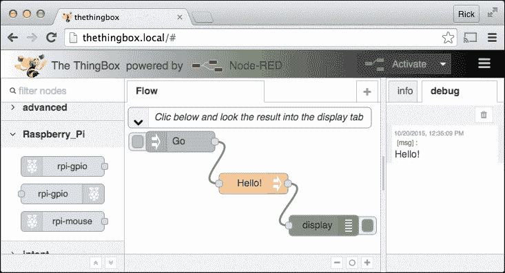

1.  如果你点击默认**Flow**开头的**Go**节点左侧的彩色方块，在**debug**标签页中会显示消息**Hello!**。

1.  点击中间面板右侧最远处的**+**标签（与**Flow**标签相对）以创建新的流程。

1.  通过从左侧工具箱拖动一个输入节点并将其放置到中间的流程图上，向流程中添加一个`rpi-gpio`输入节点。

1.  通过从工具箱中拖动并放置输出节点，向流程中添加一个`rpi-gpio`输出节点。

1.  通过拖动**rpi-gpio**输入节点的输出连接器到**rpi-gpio**输出节点的输入连接器，连接这两个节点。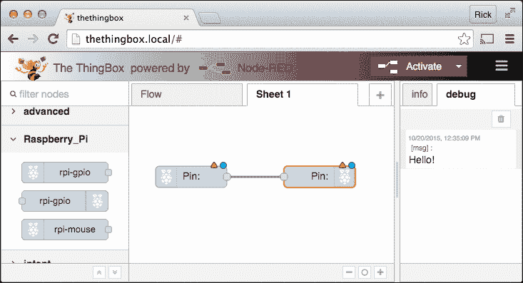

1.  现在基本流程已经设置好，是时候配置节点了。输入和输出节点上的红色三角形和蓝色圆圈徽章表示配置尚未完成。

1.  配置`Pushbutton`节点。双击`rpi-gpio`输入节点。将**GPIO Pin**更改为**16 – GPIO4 – BCM23**。将**Resistor**更改为**上拉**。将**Name**参数更改为`Pushbutton`。点击**Ok**按钮。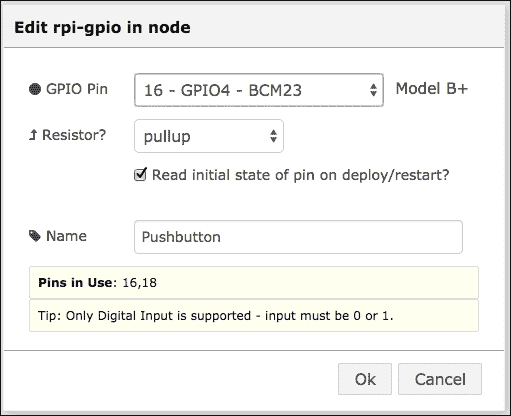

1.  配置 LED 节点。双击`rpi-gpio`输出节点。将**GPIO Pin**更改为**18 – GPIO5 – BCM24**。将**Type**更改为**数字输出**。将**Name**更改为**LED**。点击**Ok**按钮。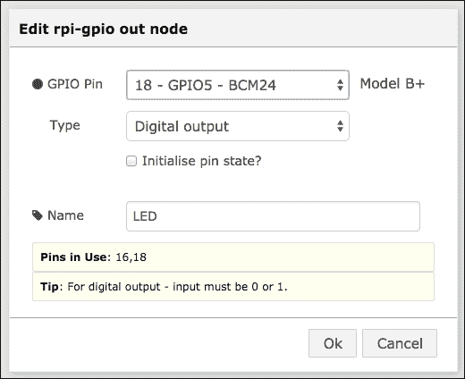

1.  重命名流程图。双击名称**Sheet 1**。将流程图的**Name**更改为**Pushbutton LED**。点击**Ok**按钮。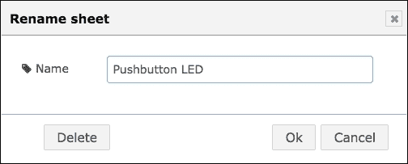

1.  点击红色**Activate**按钮启动流程。等待**Successfully Deployed**消息出现。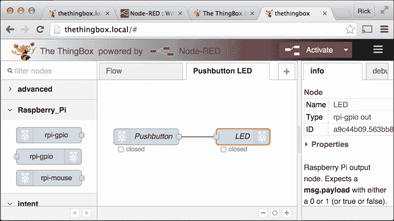

1.  **Pushbutton LED**流程已启动！

1.  按住**按钮**不放，LED 灯会亮起。松开**按钮**，**LED**灯熄灭。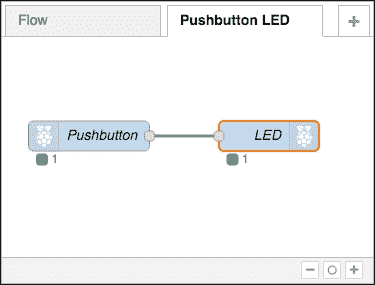

1.  注意，当按下按钮时，输入和输出节点下的绿色状态指示器旁的值会从**0**变为**1**。

1.  ThingBox 物联网网关通过发送硬件信号来响应硬件信号。您的物联网网关正在工作！

## 工作原理

本配方有两个主要部分：

+   为 ThingBox 物联网网关创建可启动的 SD 卡

+   在运行中的物联网网关中创建**按钮 LED**流程

您可能还需要配置 Raspberry Pi 的无线网络。

当 ThingBox 准备好后，您可能想运行示例流程。

### 创建可启动的 SD 卡

当前的 ThingBox 可启动磁盘映像可以从 ThingBox 网站下载（[`thethingbox.io/#packagestable`](http://thethingbox.io/#packagestable)）。下载映像后，需要将其写入至少 4 GB 存储空间的 SD 卡。Class 10 SD 卡具有最佳性能。有关创建可启动 SD 卡的说明，请参阅第一章，*安装与设置*。

一旦 ThingBox 镜像写入 SD 卡，使用它启动 Raspberry Pi。初次启动时，由于文件系统会扩展以填充整个 SD 卡，因此启动会较慢。初次启动后，随后的启动会快得多。

### 配置无线网络

如果您的 Raspberry Pi 依赖 Wi-Fi 适配器进行网络连接，您需要在初始启动后登录 Raspberry Pi 桌面并配置无线网络。使用用户名`root`和默认密码`raspberry`。

无线网络配置应用可以通过**Raspberry Pi 菜单 > 偏好设置 > WiFi 配置**菜单找到。

一旦 WiFi 配置应用程序启动，点击**扫描**以显示可用的网络。双击您的网络**SSID**，输入您网络的**私有安全密钥**（**PSK**），然后点击**添加**将此设备添加到已知 Wi-Fi 接口列表中。

关闭**扫描结果**窗口后，您可以在**WiFi 配置**窗口中观察到连接状态的变化。添加您的网络**SSID**和**PSK**后，Raspberry Pi 将在每次启动时默认使用该配置。

Wi-Fi 配置也可以通过 ThingBox 用户界面进行设置。在用户界面右上角的配置菜单中选择**设置**（位于**激活**按钮旁的三个横条）。

### ThingBox 已准备好

当 Raspberry Pi 启动后，它会将其名称`thethingbox`广播到本地多播 DNS 服务器。几秒钟后，mDNS 服务器更新后，ThingBox 用户界面可以通过 URL `http://thethingbox.local/`访问。

不需要额外的网络配置。然而，可以通过界面右上角的配置菜单更改设备名称和其他网络参数。

### 运行示例流

当第一次访问 ThingBox 时，它会显示一个由三个节点组成的默认**Flow**：**Go**、**Hello!**和**显示**。

每个节点都有配置参数，可以通过双击节点来设置。节点也可以有多个输入和输出，并且能够处理多个消息。

默认**Flow**通过点击位于**Go**节点左侧的彩色方块来激活。点击方块会将消息（`msg`）发送到**Hello!**节点。

**Hello!**节点接收消息（`msg`），并将消息的`payload`参数设置为"`Hello!`"，然后将消息发送到**显示**节点。

**显示**节点将`msg.payload`参数的值输出到右侧边栏的**调试**标签中。

这完成了默认的**Flow**。

### 顺着流走

所有流遵循相同的基本模式。

消息（`msg`）沿着连接每个节点的路径从一个节点发送到另一个节点。

每个节点可以在消息通过节点时读取并更新`msg`，添加、更新或删除`msg`参数，直到`msg`被传递到下一个节点。

到达流的末端后，消息（`msg`）将被丢弃。

### 创建 Pushbutton LED 流

Pushbutton LED 流通过点击中心面板右上角的**+**标签来创建。这将创建一个新的流表单，默认名称为**Sheet 1**。

从工具箱左侧的树莓派部分，拖动一个`rpi-gpio`输入节点到空白的流表单中。同样，拖动一个`rpi-gpio`输出节点到流表单中。

通过先点击**rpio-gpio**输入节点的输出连接器，拖动直到形成路径并连接到**rpio-cpio**输出节点的输入连接器，连接这两个节点。

现在，双击每个节点并输入适当的配置信息。**rpi-gpio**输入节点名为**Pushbutton**，连接到**GPIO4**，并且有一个**上拉****电阻**。**rpi-gpio**输出节点名为**LED**，类型为**数字输出**，并连接到**GPIO5**。通过双击工作表名称**Sheet 1**，将工作流表单重命名为**Pushbutton LED**。

一旦节点配置完成，点击红色的**激活**按钮即可部署流。当流有更改时，**激活**按钮为红色；当流已部署后，按钮会变为灰色。

当 Pushbutton LED 流处于活动状态时，当按下按钮时 LED 亮起，释放按钮时 LED 熄灭。

请注意，当按下按钮时，两个节点下方的绿色状态指示器也会从**0**变为**1**。Node-RED 平台正在处理每次按钮按下的操作。

现在你的树莓派已成为物联网的网关！

## 还有更多…

这个示例是由 Node-RED 驱动的 The ThingBox 的一个非常简单的例子。

### 有一个庞大的可用节点库

Node-RED 平台中有数十个额外的 API 和服务。

+   Raspberry Pi

    +   GPIO – 硬件 GPIO 引脚

    +   鼠标 – 按下鼠标按钮

+   通用 I/O

    +   HTTP – ReSTful 服务和网页

    +   MQTT – 消息队列

    +   Web Sockets – JSON 消息

    +   TCP/UDP – 数据流

    +   串口 – 字符流

+   数据解析

    +   CSV – 逗号分隔值

    +   JSON – JavaScript 对象表示法

    +   XML – 可扩展标记语言

    +   HTML – 超文本标记语言

+   社交

    +   电子邮件 – 发送/接收电子邮件

    +   Twitter – 发送/接收推文

    +   Esendx – 发送短信

    +   Google Calendar – 添加、更新和响应事件

    +   RSS – 监控 RSS/Atom 源

+   存储

    +   文件 – 读写磁盘上的文件

    +   Carriots – 从连接的物体收集数据

    +   Emoncms – 处理和可视化环境数据

    +   Evrythng – 通过实时数据驱动应用程序

    +   Exosite – 实现云处理

    +   Thingspeak – 开源物联网平台

    +   Tinamous – 注重隐私和协作的物联网平台

    +   Xively – 企业物联网应用平台

### 等待 40 秒钟再关闭电源或重启

在 The ThingBox 文档中有一个特别的警告反复提到。它说在激活（保存）任何流程后，至少等待 40 秒钟才能关闭或重启 Raspberry Pi —— 即使流程比这更早就开始工作了！

将更新后的流程图保存到磁盘是一个独立的任务，该任务与当前在 Node-RED 服务器上运行的其他任务（节点）并行运行。因此，流程图的更改很可能在被持久化到磁盘之前就在 Node-RED 服务器中被激活。

## 另见

+   **The ThingBox Project** ([`thethingbox.io/`](http://thethingbox.io/)): 使用物联网技术，无需任何技术知识，并且是免费的。

+   **Node-RED** ([`nodered.org/`](http://nodered.org/)): Node-RED 是一个用于连接物联网的可视化工具。

+   **Carriots** ([`www.carriots.com/`](https://www.carriots.com/)): Carriots 是一个物联网平台，可以为 10 个设备存储一年的数据，且免费提供。

+   **Emoncms** ([`emoncms.org/`](http://emoncms.org/)): Emoncms 是一个功能强大的开源 Web 应用程序，用于处理、记录和可视化能量、温度和其他环境数据。

+   **Evrythng** ([`evrythng.com/`](https://evrythng.com/)): Evrythng 是一个物联网平台，它将任何消费品与网络连接，并管理实时数据以驱动应用程序。

+   **Thingspeak** ([`thingspeak.com/`](https://thingspeak.com/)): Thingspeak 是一个开源物联网平台。

+   **Tinamous** ([`www.tinamous.com/`](https://www.tinamous.com/)): Tinamous 集成了状态更新、警报和传感器测量，使用简单、开放的连接解决方案，轻松连接人和物联网设备。

+   **Xively** ([`xively.com/`](https://xively.com/))：Xively 简化了公司如何安全且稳健地连接其产品和用户，管理大规模物联网数据，并与客户、用户和合作伙伴更紧密地互动。

+   **零配置网络** ([`en.wikipedia.org/wiki/Zero-configuration_networking`](https://en.wikipedia.org/wiki/Zero-configuration_networking))：这篇维基百科文章描述了 The ThingBox 使用的零配置网络，用于在`http://thethingbox.local/`上发布其位置。
